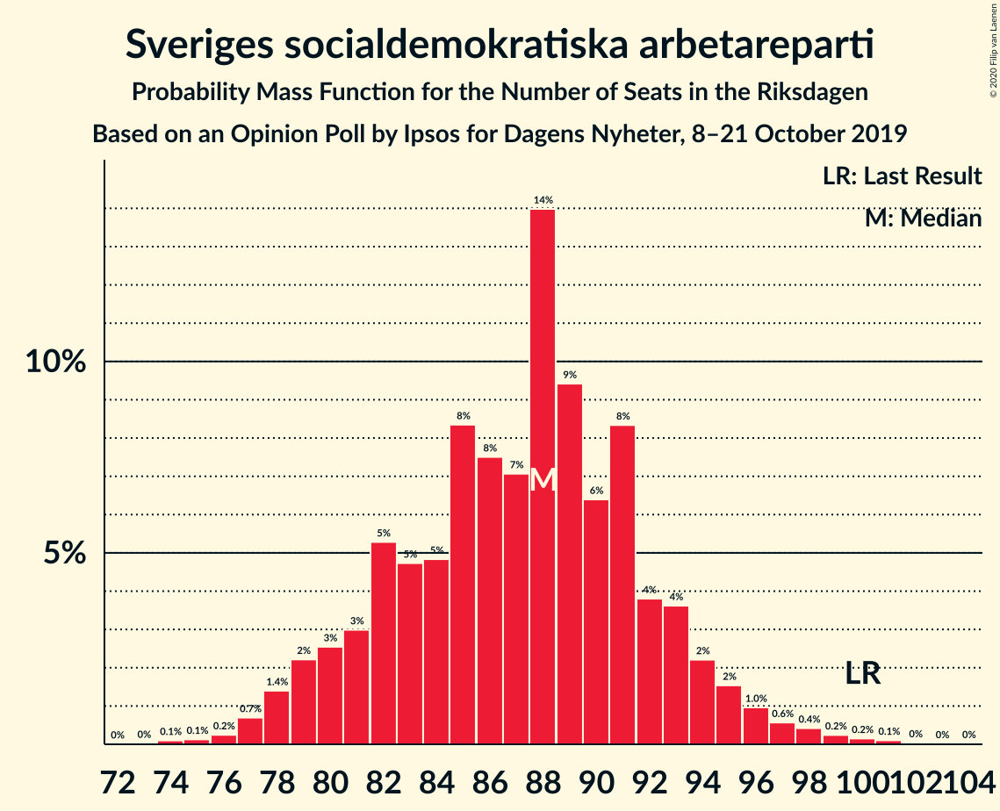
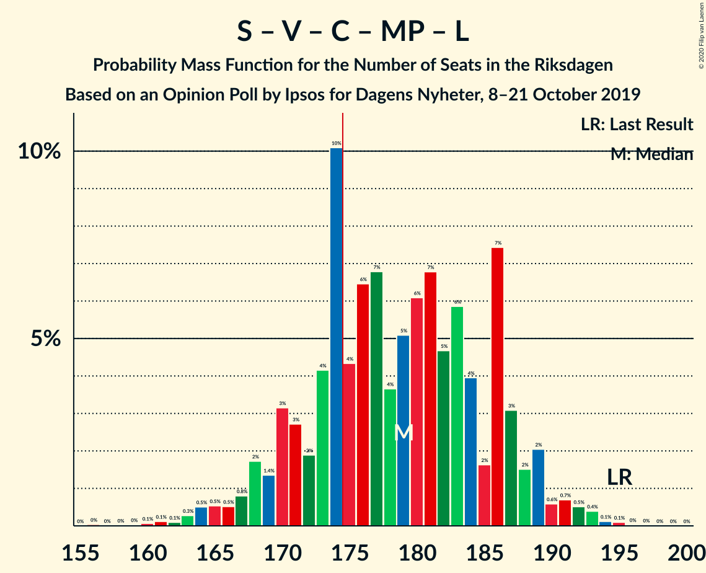

# Opinion Poll by Ipsos for Dagens Nyheter, 8–21 October 2019

<a href="#voting-intentions">Voting Intentions</a> | <a href="#seats">Seats</a> | <a href="#coalitions">Coalitions</a> | <a href="#technical-information">Technical Information</a>

## Voting Intentions

### Confidence Intervals

| Party | Last Result | Poll Result | 80% Confidence Interval | 90% Confidence Interval | 95% Confidence Interval | 99% Confidence Interval |
|:-----:|:-----------:|:-----------:|:-----------------------:|:-----------------------:|:-----------------------:|:-----------------------:|
| Sveriges socialdemokratiska arbetareparti | 28.3% | 24.0% | 22.7–25.5% |22.3–25.9% |22.0–26.2% |21.3–26.9% |
| Sverigedemokraterna | 17.5% | 23.0% | 21.7–24.4% |21.3–24.8% |21.0–25.2% |20.4–25.8% |
| Moderata samlingspartiet | 19.8% | 16.0% | 14.9–17.2% |14.5–17.6% |14.3–17.9% |13.7–18.5% |
| Vänsterpartiet | 8.0% | 10.0% | 9.1–11.1% |8.8–11.3% |8.6–11.6% |8.2–12.1% |
| Centerpartiet | 8.6% | 8.0% | 7.2–9.0% |7.0–9.3% |6.8–9.5% |6.4–10.0% |
| Kristdemokraterna | 6.3% | 8.0% | 7.2–9.0% |7.0–9.3% |6.8–9.5% |6.4–10.0% |
| Miljöpartiet de gröna | 4.4% | 5.0% | 4.3–5.8% |4.1–6.0% |4.0–6.2% |3.7–6.6% |
| Liberalerna | 5.5% | 4.0% | 3.4–4.7% |3.3–4.9% |3.1–5.1% |2.9–5.5% |

*Note:* The poll result column reflects the actual value used in the calculations. Published results may vary slightly, and in addition be rounded to fewer digits.

## Seats

### Confidence Intervals

| Party | Last Result | Median | 80% Confidence Interval | 90% Confidence Interval | 95% Confidence Interval | 99% Confidence Interval |
|:-----:|:-----------:|:------:|:-----------------------:|:-----------------------:|:-----------------------:|:-----------------------:|
| <a href="#sveriges-socialdemokratiska-arbetareparti">Sveriges socialdemokratiska arbetareparti</a> | 100 | 88 | 81–91 |79–93 |78–95 |77–99 |
| <a href="#sverigedemokraterna">Sverigedemokraterna</a> | 62 | 83 | 78–88 |77–90 |76–92 |73–95 |
| <a href="#moderata-samlingspartiet">Moderata samlingspartiet</a> | 70 | 58 | 54–62 |53–63 |51–65 |49–67 |
| <a href="#vänsterpartiet">Vänsterpartiet</a> | 28 | 36 | 33–40 |32–41 |31–42 |30–45 |
| <a href="#centerpartiet">Centerpartiet</a> | 31 | 29 | 26–32 |26–34 |25–34 |23–36 |
| <a href="#kristdemokraterna">Kristdemokraterna</a> | 22 | 29 | 26–33 |25–33 |25–35 |23–37 |
| <a href="#miljöpartiet-de-gröna">Miljöpartiet de gröna</a> | 16 | 18 | 15–21 |15–21 |15–22 |0–24 |
| <a href="#liberalerna">Liberalerna</a> | 20 | 14 | 0–16 |0–18 |0–18 |0–19 |

### Sveriges socialdemokratiska arbetareparti

*For a full overview of the results for this party, see the [Sveriges socialdemokratiska arbetareparti](party-sverigessocialdemokratiskaarbetareparti.html) page.*

| Number of Seats | Probability | Accumulated | Special Marks |
|:---------------:|:-----------:|:-----------:|:-------------:|
| 74 | 0.1% | 100% |  |
| 75 | 0.1% | 99.9% |  |
| 76 | 0.3% | 99.8% |  |
| 77 | 0.4% | 99.5% |  |
| 78 | 2% | 99.2% |  |
| 79 | 3% | 97% |  |
| 80 | 1.1% | 94% |  |
| 81 | 3% | 93% |  |
| 82 | 2% | 90% |  |
| 83 | 5% | 88% |  |
| 84 | 2% | 83% |  |
| 85 | 8% | 81% |  |
| 86 | 4% | 73% |  |
| 87 | 15% | 69% |  |
| 88 | 20% | 53% | Median |
| 89 | 12% | 34% |  |
| 90 | 8% | 22% |  |
| 91 | 6% | 14% |  |
| 92 | 2% | 8% |  |
| 93 | 2% | 6% |  |
| 94 | 1.3% | 4% |  |
| 95 | 0.6% | 3% |  |
| 96 | 0.7% | 2% |  |
| 97 | 0.3% | 1.2% |  |
| 98 | 0.4% | 0.9% |  |
| 99 | 0.1% | 0.5% |  |
| 100 | 0.2% | 0.4% | Last Result |
| 101 | 0.1% | 0.2% |  |
| 102 | 0% | 0.1% |  |
| 103 | 0% | 0% |  |

### Sverigedemokraterna

*For a full overview of the results for this party, see the [Sverigedemokraterna](party-sverigedemokraterna.html) page.*

| Number of Seats | Probability | Accumulated | Special Marks |
|:---------------:|:-----------:|:-----------:|:-------------:|
| 62 | 0% | 100% | Last Result |
| 63 | 0% | 100% |  |
| 64 | 0% | 100% |  |
| 65 | 0% | 100% |  |
| 66 | 0% | 100% |  |
| 67 | 0% | 100% |  |
| 68 | 0% | 100% |  |
| 69 | 0% | 100% |  |
| 70 | 0.1% | 100% |  |
| 71 | 0.1% | 99.9% |  |
| 72 | 0.2% | 99.8% |  |
| 73 | 0.5% | 99.6% |  |
| 74 | 0.5% | 99.1% |  |
| 75 | 0.5% | 98.6% |  |
| 76 | 2% | 98% |  |
| 77 | 1.3% | 96% |  |
| 78 | 6% | 95% |  |
| 79 | 15% | 88% |  |
| 80 | 3% | 73% |  |
| 81 | 15% | 70% |  |
| 82 | 3% | 55% |  |
| 83 | 18% | 52% | Median |
| 84 | 4% | 33% |  |
| 85 | 3% | 29% |  |
| 86 | 5% | 26% |  |
| 87 | 10% | 21% |  |
| 88 | 2% | 11% |  |
| 89 | 3% | 9% |  |
| 90 | 2% | 6% |  |
| 91 | 1.3% | 4% |  |
| 92 | 1.4% | 3% |  |
| 93 | 0.7% | 1.4% |  |
| 94 | 0.1% | 0.7% |  |
| 95 | 0.4% | 0.6% |  |
| 96 | 0.1% | 0.2% |  |
| 97 | 0.1% | 0.1% |  |
| 98 | 0% | 0% |  |

### Moderata samlingspartiet

*For a full overview of the results for this party, see the [Moderata samlingspartiet](party-moderatasamlingspartiet.html) page.*

| Number of Seats | Probability | Accumulated | Special Marks |
|:---------------:|:-----------:|:-----------:|:-------------:|
| 47 | 0.2% | 100% |  |
| 48 | 0.2% | 99.8% |  |
| 49 | 0.1% | 99.6% |  |
| 50 | 0.8% | 99.5% |  |
| 51 | 2% | 98.7% |  |
| 52 | 1.0% | 96% |  |
| 53 | 2% | 96% |  |
| 54 | 9% | 94% |  |
| 55 | 5% | 85% |  |
| 56 | 19% | 79% |  |
| 57 | 7% | 60% |  |
| 58 | 13% | 53% | Median |
| 59 | 7% | 40% |  |
| 60 | 11% | 34% |  |
| 61 | 7% | 23% |  |
| 62 | 10% | 15% |  |
| 63 | 2% | 6% |  |
| 64 | 2% | 4% |  |
| 65 | 0.9% | 3% |  |
| 66 | 1.1% | 2% |  |
| 67 | 0.2% | 0.6% |  |
| 68 | 0.1% | 0.3% |  |
| 69 | 0.1% | 0.2% |  |
| 70 | 0.1% | 0.1% | Last Result |
| 71 | 0% | 0.1% |  |
| 72 | 0% | 0% |  |

### Vänsterpartiet

*For a full overview of the results for this party, see the [Vänsterpartiet](party-vänsterpartiet.html) page.*

| Number of Seats | Probability | Accumulated | Special Marks |
|:---------------:|:-----------:|:-----------:|:-------------:|
| 28 | 0.1% | 100% | Last Result |
| 29 | 0.3% | 99.9% |  |
| 30 | 0.8% | 99.5% |  |
| 31 | 2% | 98.7% |  |
| 32 | 5% | 97% |  |
| 33 | 10% | 92% |  |
| 34 | 6% | 83% |  |
| 35 | 8% | 77% |  |
| 36 | 33% | 68% | Median |
| 37 | 9% | 35% |  |
| 38 | 12% | 26% |  |
| 39 | 4% | 15% |  |
| 40 | 6% | 11% |  |
| 41 | 2% | 6% |  |
| 42 | 2% | 4% |  |
| 43 | 0.8% | 2% |  |
| 44 | 0.4% | 1.1% |  |
| 45 | 0.5% | 0.7% |  |
| 46 | 0.2% | 0.2% |  |
| 47 | 0% | 0% |  |

### Centerpartiet

*For a full overview of the results for this party, see the [Centerpartiet](party-centerpartiet.html) page.*

| Number of Seats | Probability | Accumulated | Special Marks |
|:---------------:|:-----------:|:-----------:|:-------------:|
| 21 | 0.1% | 100% |  |
| 22 | 0.2% | 99.9% |  |
| 23 | 0.7% | 99.7% |  |
| 24 | 1.2% | 99.0% |  |
| 25 | 2% | 98% |  |
| 26 | 8% | 96% |  |
| 27 | 18% | 88% |  |
| 28 | 13% | 70% |  |
| 29 | 14% | 57% | Median |
| 30 | 5% | 43% |  |
| 31 | 20% | 37% | Last Result |
| 32 | 9% | 17% |  |
| 33 | 2% | 7% |  |
| 34 | 4% | 6% |  |
| 35 | 0.9% | 2% |  |
| 36 | 0.7% | 1.1% |  |
| 37 | 0.3% | 0.4% |  |
| 38 | 0.1% | 0.1% |  |
| 39 | 0% | 0% |  |

### Kristdemokraterna

*For a full overview of the results for this party, see the [Kristdemokraterna](party-kristdemokraterna.html) page.*

| Number of Seats | Probability | Accumulated | Special Marks |
|:---------------:|:-----------:|:-----------:|:-------------:|
| 22 | 0.3% | 100% | Last Result |
| 23 | 0.5% | 99.6% |  |
| 24 | 1.0% | 99.1% |  |
| 25 | 3% | 98% |  |
| 26 | 8% | 95% |  |
| 27 | 10% | 87% |  |
| 28 | 18% | 77% |  |
| 29 | 14% | 59% | Median |
| 30 | 9% | 45% |  |
| 31 | 17% | 37% |  |
| 32 | 7% | 19% |  |
| 33 | 8% | 12% |  |
| 34 | 2% | 4% |  |
| 35 | 2% | 3% |  |
| 36 | 0.3% | 0.9% |  |
| 37 | 0.5% | 0.6% |  |
| 38 | 0.1% | 0.1% |  |
| 39 | 0% | 0% |  |

### Miljöpartiet de gröna

*For a full overview of the results for this party, see the [Miljöpartiet de gröna](party-miljöpartietdegröna.html) page.*

| Number of Seats | Probability | Accumulated | Special Marks |
|:---------------:|:-----------:|:-----------:|:-------------:|
| 0 | 1.2% | 100% |  |
| 1 | 0% | 98.8% |  |
| 2 | 0% | 98.8% |  |
| 3 | 0% | 98.8% |  |
| 4 | 0% | 98.8% |  |
| 5 | 0% | 98.8% |  |
| 6 | 0% | 98.8% |  |
| 7 | 0% | 98.8% |  |
| 8 | 0% | 98.8% |  |
| 9 | 0% | 98.8% |  |
| 10 | 0% | 98.8% |  |
| 11 | 0% | 98.8% |  |
| 12 | 0% | 98.8% |  |
| 13 | 0% | 98.8% |  |
| 14 | 0.2% | 98.8% |  |
| 15 | 14% | 98.6% |  |
| 16 | 6% | 85% | Last Result |
| 17 | 19% | 78% |  |
| 18 | 9% | 59% | Median |
| 19 | 27% | 50% |  |
| 20 | 13% | 23% |  |
| 21 | 7% | 10% |  |
| 22 | 1.0% | 3% |  |
| 23 | 2% | 2% |  |
| 24 | 0.4% | 0.6% |  |
| 25 | 0.2% | 0.2% |  |
| 26 | 0% | 0% |  |

### Liberalerna

*For a full overview of the results for this party, see the [Liberalerna](party-liberalerna.html) page.*

| Number of Seats | Probability | Accumulated | Special Marks |
|:---------------:|:-----------:|:-----------:|:-------------:|
| 0 | 46% | 100% |  |
| 1 | 0% | 54% |  |
| 2 | 0% | 54% |  |
| 3 | 0% | 54% |  |
| 4 | 0% | 54% |  |
| 5 | 0% | 54% |  |
| 6 | 0% | 54% |  |
| 7 | 0% | 54% |  |
| 8 | 0% | 54% |  |
| 9 | 0% | 54% |  |
| 10 | 0% | 54% |  |
| 11 | 0% | 54% |  |
| 12 | 0% | 54% |  |
| 13 | 0% | 54% |  |
| 14 | 5% | 54% | Median |
| 15 | 15% | 49% |  |
| 16 | 24% | 34% |  |
| 17 | 4% | 10% |  |
| 18 | 4% | 5% |  |
| 19 | 0.7% | 1.1% |  |
| 20 | 0.3% | 0.4% | Last Result |
| 21 | 0.1% | 0.1% |  |
| 22 | 0% | 0% |  |

## Coalitions

### Confidence Intervals

| Coalition | Last Result | Median | Majority? | 80% Confidence Interval | 90% Confidence Interval | 95% Confidence Interval | 99% Confidence Interval |
|:---------:|:-----------:|:------:|:---------:|:-----------------------:|:-----------------------:|:-----------------------:|:-----------------------:|
| Sveriges socialdemokratiska arbetareparti – Vänsterpartiet – Centerpartiet – Miljöpartiet de gröna – Liberalerna | 195 | 179 | 74% | 170–186 | 169–187 | 167–189 | 164–193 |
| Sveriges socialdemokratiska arbetareparti – Moderata samlingspartiet – Centerpartiet | 201 | 175 | 50% | 167–182 | 165–182 | 163–185 | 160–190 |
| Sverigedemokraterna – Moderata samlingspartiet – Kristdemokraterna | 154 | 170 | 26% | 163–179 | 162–180 | 160–182 | 156–185 |
| Sveriges socialdemokratiska arbetareparti – Moderata samlingspartiet | 170 | 145 | 0% | 139–151 | 136–152 | 134–155 | 131–159 |
| Sverigedemokraterna – Moderata samlingspartiet | 132 | 141 | 0% | 134–148 | 133–149 | 131–153 | 128–155 |
| Sveriges socialdemokratiska arbetareparti – Centerpartiet – Miljöpartiet de gröna – Liberalerna | 167 | 142 | 0% | 135–152 | 132–153 | 130–153 | 128–157 |
| Sveriges socialdemokratiska arbetareparti – Vänsterpartiet – Miljöpartiet de gröna | 144 | 142 | 0% | 135–149 | 133–150 | 131–152 | 126–156 |
| Moderata samlingspartiet – Centerpartiet – Kristdemokraterna – Liberalerna | 143 | 126 | 0% | 116–133 | 113–134 | 112–136 | 109–139 |
| Sveriges socialdemokratiska arbetareparti – Vänsterpartiet | 128 | 124 | 0% | 118–130 | 116–131 | 114–133 | 112–138 |
| Moderata samlingspartiet – Centerpartiet – Kristdemokraterna | 123 | 117 | 0% | 111–124 | 109–124 | 108–126 | 105–129 |
| Sveriges socialdemokratiska arbetareparti – Miljöpartiet de gröna | 116 | 106 | 0% | 98–110 | 97–112 | 94–114 | 89–117 |
| Moderata samlingspartiet – Centerpartiet – Liberalerna | 121 | 97 | 0% | 87–104 | 84–106 | 83–107 | 81–110 |
| Moderata samlingspartiet – Centerpartiet | 101 | 87 | 0% | 82–93 | 81–93 | 79–95 | 76–98 |

### Sveriges socialdemokratiska arbetareparti – Vänsterpartiet – Centerpartiet – Miljöpartiet de gröna – Liberalerna

| Number of Seats | Probability | Accumulated | Special Marks |
|:---------------:|:-----------:|:-----------:|:-------------:|
| 160 | 0.1% | 100% |  |
| 161 | 0% | 99.8% |  |
| 162 | 0.1% | 99.8% |  |
| 163 | 0.2% | 99.7% |  |
| 164 | 0.4% | 99.5% |  |
| 165 | 0.7% | 99.1% |  |
| 166 | 0.5% | 98% |  |
| 167 | 0.8% | 98% |  |
| 168 | 0.9% | 97% |  |
| 169 | 1.2% | 96% |  |
| 170 | 6% | 95% |  |
| 171 | 1.1% | 89% |  |
| 172 | 2% | 88% |  |
| 173 | 9% | 86% |  |
| 174 | 3% | 77% |  |
| 175 | 1.5% | 74% | Majority |
| 176 | 3% | 73% |  |
| 177 | 11% | 70% |  |
| 178 | 2% | 59% |  |
| 179 | 8% | 57% |  |
| 180 | 6% | 49% |  |
| 181 | 11% | 43% |  |
| 182 | 2% | 32% |  |
| 183 | 2% | 30% |  |
| 184 | 3% | 28% |  |
| 185 | 1.4% | 25% | Median |
| 186 | 16% | 24% |  |
| 187 | 3% | 7% |  |
| 188 | 0.9% | 4% |  |
| 189 | 1.2% | 3% |  |
| 190 | 0.8% | 2% |  |
| 191 | 0.2% | 1.2% |  |
| 192 | 0.4% | 1.1% |  |
| 193 | 0.4% | 0.7% |  |
| 194 | 0.1% | 0.3% |  |
| 195 | 0.1% | 0.1% | Last Result |
| 196 | 0% | 0% |  |

### Sveriges socialdemokratiska arbetareparti – Moderata samlingspartiet – Centerpartiet

| Number of Seats | Probability | Accumulated | Special Marks |
|:---------------:|:-----------:|:-----------:|:-------------:|
| 157 | 0.1% | 100% |  |
| 158 | 0.1% | 99.9% |  |
| 159 | 0.1% | 99.8% |  |
| 160 | 0.3% | 99.7% |  |
| 161 | 0.5% | 99.5% |  |
| 162 | 0.8% | 99.0% |  |
| 163 | 0.7% | 98% |  |
| 164 | 1.1% | 97% |  |
| 165 | 3% | 96% |  |
| 166 | 1.4% | 94% |  |
| 167 | 4% | 92% |  |
| 168 | 4% | 89% |  |
| 169 | 5% | 85% |  |
| 170 | 2% | 80% |  |
| 171 | 15% | 78% |  |
| 172 | 2% | 63% |  |
| 173 | 2% | 61% |  |
| 174 | 8% | 58% |  |
| 175 | 13% | 50% | Median, Majority |
| 176 | 6% | 37% |  |
| 177 | 4% | 31% |  |
| 178 | 2% | 26% |  |
| 179 | 8% | 25% |  |
| 180 | 2% | 17% |  |
| 181 | 1.2% | 15% |  |
| 182 | 9% | 14% |  |
| 183 | 1.1% | 5% |  |
| 184 | 0.8% | 4% |  |
| 185 | 0.7% | 3% |  |
| 186 | 0.4% | 2% |  |
| 187 | 1.1% | 2% |  |
| 188 | 0.1% | 0.9% |  |
| 189 | 0.3% | 0.8% |  |
| 190 | 0% | 0.5% |  |
| 191 | 0.2% | 0.5% |  |
| 192 | 0.1% | 0.2% |  |
| 193 | 0% | 0.1% |  |
| 194 | 0% | 0.1% |  |
| 195 | 0% | 0.1% |  |
| 196 | 0% | 0.1% |  |
| 197 | 0% | 0.1% |  |
| 198 | 0% | 0% |  |
| 199 | 0% | 0% |  |
| 200 | 0% | 0% |  |
| 201 | 0% | 0% | Last Result |

### Sverigedemokraterna – Moderata samlingspartiet – Kristdemokraterna

| Number of Seats | Probability | Accumulated | Special Marks |
|:---------------:|:-----------:|:-----------:|:-------------:|
| 154 | 0.1% | 100% | Last Result |
| 155 | 0.1% | 99.9% |  |
| 156 | 0.4% | 99.7% |  |
| 157 | 0.4% | 99.3% |  |
| 158 | 0.2% | 98.9% |  |
| 159 | 0.8% | 98.8% |  |
| 160 | 1.2% | 98% |  |
| 161 | 0.9% | 97% |  |
| 162 | 3% | 96% |  |
| 163 | 16% | 93% |  |
| 164 | 1.4% | 76% |  |
| 165 | 3% | 75% |  |
| 166 | 2% | 72% |  |
| 167 | 2% | 70% |  |
| 168 | 11% | 68% |  |
| 169 | 6% | 57% |  |
| 170 | 8% | 51% | Median |
| 171 | 2% | 43% |  |
| 172 | 11% | 41% |  |
| 173 | 3% | 30% |  |
| 174 | 1.5% | 27% |  |
| 175 | 3% | 26% | Majority |
| 176 | 9% | 23% |  |
| 177 | 2% | 14% |  |
| 178 | 1.1% | 12% |  |
| 179 | 6% | 11% |  |
| 180 | 1.2% | 5% |  |
| 181 | 0.9% | 4% |  |
| 182 | 0.8% | 3% |  |
| 183 | 0.5% | 2% |  |
| 184 | 0.7% | 2% |  |
| 185 | 0.4% | 0.9% |  |
| 186 | 0.2% | 0.5% |  |
| 187 | 0.1% | 0.3% |  |
| 188 | 0% | 0.2% |  |
| 189 | 0.1% | 0.2% |  |
| 190 | 0% | 0% |  |

### Sveriges socialdemokratiska arbetareparti – Moderata samlingspartiet

| Number of Seats | Probability | Accumulated | Special Marks |
|:---------------:|:-----------:|:-----------:|:-------------:|
| 129 | 0% | 100% |  |
| 130 | 0.1% | 99.9% |  |
| 131 | 0.3% | 99.8% |  |
| 132 | 0.2% | 99.5% |  |
| 133 | 0.6% | 99.2% |  |
| 134 | 1.3% | 98.7% |  |
| 135 | 0.8% | 97% |  |
| 136 | 2% | 97% |  |
| 137 | 3% | 94% |  |
| 138 | 0.9% | 92% |  |
| 139 | 5% | 91% |  |
| 140 | 4% | 86% |  |
| 141 | 2% | 82% |  |
| 142 | 4% | 80% |  |
| 143 | 12% | 76% |  |
| 144 | 14% | 64% |  |
| 145 | 7% | 51% |  |
| 146 | 6% | 44% | Median |
| 147 | 2% | 38% |  |
| 148 | 15% | 36% |  |
| 149 | 4% | 21% |  |
| 150 | 0.7% | 16% |  |
| 151 | 10% | 16% |  |
| 152 | 0.9% | 6% |  |
| 153 | 1.1% | 5% |  |
| 154 | 0.6% | 4% |  |
| 155 | 0.9% | 3% |  |
| 156 | 1.2% | 2% |  |
| 157 | 0.2% | 1.1% |  |
| 158 | 0.4% | 0.9% |  |
| 159 | 0.1% | 0.6% |  |
| 160 | 0.2% | 0.4% |  |
| 161 | 0% | 0.3% |  |
| 162 | 0% | 0.2% |  |
| 163 | 0% | 0.2% |  |
| 164 | 0.1% | 0.2% |  |
| 165 | 0% | 0% |  |
| 166 | 0% | 0% |  |
| 167 | 0% | 0% |  |
| 168 | 0% | 0% |  |
| 169 | 0% | 0% |  |
| 170 | 0% | 0% | Last Result |

### Sverigedemokraterna – Moderata samlingspartiet

| Number of Seats | Probability | Accumulated | Special Marks |
|:---------------:|:-----------:|:-----------:|:-------------:|
| 125 | 0% | 100% |  |
| 126 | 0.1% | 99.9% |  |
| 127 | 0.3% | 99.9% |  |
| 128 | 0.2% | 99.5% |  |
| 129 | 0.4% | 99.4% |  |
| 130 | 0.8% | 99.0% |  |
| 131 | 1.0% | 98% |  |
| 132 | 1.3% | 97% | Last Result |
| 133 | 1.2% | 96% |  |
| 134 | 6% | 95% |  |
| 135 | 12% | 89% |  |
| 136 | 4% | 77% |  |
| 137 | 5% | 73% |  |
| 138 | 3% | 68% |  |
| 139 | 7% | 65% |  |
| 140 | 5% | 58% |  |
| 141 | 14% | 53% | Median |
| 142 | 7% | 39% |  |
| 143 | 3% | 32% |  |
| 144 | 3% | 29% |  |
| 145 | 9% | 25% |  |
| 146 | 3% | 16% |  |
| 147 | 2% | 13% |  |
| 148 | 5% | 11% |  |
| 149 | 2% | 6% |  |
| 150 | 0.5% | 4% |  |
| 151 | 0.6% | 4% |  |
| 152 | 0.3% | 3% |  |
| 153 | 0.5% | 3% |  |
| 154 | 1.0% | 2% |  |
| 155 | 0.8% | 1.2% |  |
| 156 | 0.1% | 0.4% |  |
| 157 | 0% | 0.2% |  |
| 158 | 0.1% | 0.2% |  |
| 159 | 0.1% | 0.1% |  |
| 160 | 0% | 0% |  |

### Sveriges socialdemokratiska arbetareparti – Centerpartiet – Miljöpartiet de gröna – Liberalerna

| Number of Seats | Probability | Accumulated | Special Marks |
|:---------------:|:-----------:|:-----------:|:-------------:|
| 121 | 0% | 100% |  |
| 122 | 0% | 99.9% |  |
| 123 | 0% | 99.9% |  |
| 124 | 0% | 99.9% |  |
| 125 | 0.1% | 99.8% |  |
| 126 | 0.1% | 99.7% |  |
| 127 | 0.1% | 99.6% |  |
| 128 | 1.0% | 99.5% |  |
| 129 | 0.6% | 98.6% |  |
| 130 | 0.6% | 98% |  |
| 131 | 0.6% | 97% |  |
| 132 | 2% | 97% |  |
| 133 | 2% | 94% |  |
| 134 | 2% | 92% |  |
| 135 | 4% | 91% |  |
| 136 | 2% | 86% |  |
| 137 | 10% | 85% |  |
| 138 | 4% | 75% |  |
| 139 | 7% | 71% |  |
| 140 | 2% | 65% |  |
| 141 | 9% | 62% |  |
| 142 | 4% | 53% |  |
| 143 | 2% | 50% |  |
| 144 | 2% | 48% |  |
| 145 | 7% | 46% |  |
| 146 | 7% | 39% |  |
| 147 | 2% | 32% |  |
| 148 | 5% | 30% |  |
| 149 | 2% | 25% | Median |
| 150 | 11% | 23% |  |
| 151 | 2% | 12% |  |
| 152 | 2% | 10% |  |
| 153 | 5% | 8% |  |
| 154 | 0.6% | 2% |  |
| 155 | 0.7% | 2% |  |
| 156 | 0.1% | 1.0% |  |
| 157 | 0.6% | 0.9% |  |
| 158 | 0.2% | 0.3% |  |
| 159 | 0.1% | 0.2% |  |
| 160 | 0% | 0.1% |  |
| 161 | 0% | 0.1% |  |
| 162 | 0% | 0% |  |
| 163 | 0% | 0% |  |
| 164 | 0% | 0% |  |
| 165 | 0% | 0% |  |
| 166 | 0% | 0% |  |
| 167 | 0% | 0% | Last Result |

### Sveriges socialdemokratiska arbetareparti – Vänsterpartiet – Miljöpartiet de gröna

| Number of Seats | Probability | Accumulated | Special Marks |
|:---------------:|:-----------:|:-----------:|:-------------:|
| 121 | 0% | 100% |  |
| 122 | 0.1% | 99.9% |  |
| 123 | 0.2% | 99.9% |  |
| 124 | 0% | 99.6% |  |
| 125 | 0% | 99.6% |  |
| 126 | 0.2% | 99.5% |  |
| 127 | 0% | 99.4% |  |
| 128 | 0.6% | 99.3% |  |
| 129 | 0.2% | 98.7% |  |
| 130 | 0.4% | 98.5% |  |
| 131 | 1.3% | 98% |  |
| 132 | 0.4% | 97% |  |
| 133 | 2% | 96% |  |
| 134 | 2% | 94% |  |
| 135 | 4% | 92% |  |
| 136 | 7% | 88% |  |
| 137 | 3% | 81% |  |
| 138 | 7% | 78% |  |
| 139 | 11% | 71% |  |
| 140 | 5% | 60% |  |
| 141 | 3% | 55% |  |
| 142 | 13% | 52% | Median |
| 143 | 13% | 39% |  |
| 144 | 2% | 26% | Last Result |
| 145 | 5% | 24% |  |
| 146 | 6% | 20% |  |
| 147 | 1.0% | 13% |  |
| 148 | 2% | 12% |  |
| 149 | 2% | 10% |  |
| 150 | 5% | 8% |  |
| 151 | 0.4% | 3% |  |
| 152 | 1.5% | 3% |  |
| 153 | 0.5% | 2% |  |
| 154 | 0.3% | 1.1% |  |
| 155 | 0.1% | 0.8% |  |
| 156 | 0.3% | 0.7% |  |
| 157 | 0.4% | 0.4% |  |
| 158 | 0% | 0.1% |  |
| 159 | 0% | 0% |  |

### Moderata samlingspartiet – Centerpartiet – Kristdemokraterna – Liberalerna

| Number of Seats | Probability | Accumulated | Special Marks |
|:---------------:|:-----------:|:-----------:|:-------------:|
| 107 | 0.1% | 100% |  |
| 108 | 0.1% | 99.8% |  |
| 109 | 0.2% | 99.7% |  |
| 110 | 0.8% | 99.5% |  |
| 111 | 0.3% | 98.7% |  |
| 112 | 3% | 98% |  |
| 113 | 1.2% | 96% |  |
| 114 | 1.3% | 95% |  |
| 115 | 1.3% | 93% |  |
| 116 | 3% | 92% |  |
| 117 | 1.4% | 89% |  |
| 118 | 3% | 87% |  |
| 119 | 1.4% | 84% |  |
| 120 | 7% | 83% |  |
| 121 | 1.5% | 76% |  |
| 122 | 8% | 74% |  |
| 123 | 2% | 66% |  |
| 124 | 11% | 64% |  |
| 125 | 3% | 53% |  |
| 126 | 3% | 50% |  |
| 127 | 15% | 48% |  |
| 128 | 1.1% | 33% |  |
| 129 | 5% | 32% |  |
| 130 | 6% | 27% | Median |
| 131 | 1.1% | 21% |  |
| 132 | 8% | 20% |  |
| 133 | 5% | 12% |  |
| 134 | 2% | 7% |  |
| 135 | 2% | 5% |  |
| 136 | 0.3% | 3% |  |
| 137 | 1.3% | 2% |  |
| 138 | 0.3% | 1.1% |  |
| 139 | 0.3% | 0.7% |  |
| 140 | 0.1% | 0.4% |  |
| 141 | 0.1% | 0.3% |  |
| 142 | 0.1% | 0.2% |  |
| 143 | 0% | 0.1% | Last Result |
| 144 | 0% | 0.1% |  |
| 145 | 0% | 0% |  |

### Sveriges socialdemokratiska arbetareparti – Vänsterpartiet

| Number of Seats | Probability | Accumulated | Special Marks |
|:---------------:|:-----------:|:-----------:|:-------------:|
| 108 | 0% | 100% |  |
| 109 | 0.1% | 99.9% |  |
| 110 | 0.2% | 99.9% |  |
| 111 | 0.2% | 99.7% |  |
| 112 | 0.9% | 99.5% |  |
| 113 | 0.6% | 98.7% |  |
| 114 | 0.9% | 98% |  |
| 115 | 0.8% | 97% |  |
| 116 | 3% | 96% |  |
| 117 | 3% | 94% |  |
| 118 | 6% | 91% |  |
| 119 | 6% | 85% |  |
| 120 | 9% | 80% |  |
| 121 | 5% | 71% |  |
| 122 | 6% | 66% |  |
| 123 | 6% | 60% |  |
| 124 | 17% | 54% | Median |
| 125 | 10% | 37% |  |
| 126 | 9% | 27% |  |
| 127 | 2% | 17% |  |
| 128 | 2% | 15% | Last Result |
| 129 | 3% | 13% |  |
| 130 | 3% | 10% |  |
| 131 | 3% | 8% |  |
| 132 | 1.0% | 4% |  |
| 133 | 2% | 3% |  |
| 134 | 0.3% | 2% |  |
| 135 | 0.2% | 1.3% |  |
| 136 | 0.2% | 1.1% |  |
| 137 | 0.3% | 0.9% |  |
| 138 | 0.5% | 0.7% |  |
| 139 | 0.1% | 0.2% |  |
| 140 | 0% | 0.1% |  |
| 141 | 0% | 0.1% |  |
| 142 | 0% | 0% |  |

### Moderata samlingspartiet – Centerpartiet – Kristdemokraterna

| Number of Seats | Probability | Accumulated | Special Marks |
|:---------------:|:-----------:|:-----------:|:-------------:|
| 100 | 0% | 100% |  |
| 101 | 0% | 99.9% |  |
| 102 | 0% | 99.9% |  |
| 103 | 0.2% | 99.9% |  |
| 104 | 0.1% | 99.6% |  |
| 105 | 0.4% | 99.5% |  |
| 106 | 0.8% | 99.1% |  |
| 107 | 0.7% | 98% |  |
| 108 | 2% | 98% |  |
| 109 | 2% | 96% |  |
| 110 | 3% | 94% |  |
| 111 | 13% | 92% |  |
| 112 | 6% | 78% |  |
| 113 | 5% | 72% |  |
| 114 | 10% | 68% |  |
| 115 | 3% | 58% |  |
| 116 | 5% | 55% | Median |
| 117 | 11% | 50% |  |
| 118 | 5% | 39% |  |
| 119 | 2% | 34% |  |
| 120 | 9% | 32% |  |
| 121 | 2% | 24% |  |
| 122 | 8% | 22% |  |
| 123 | 2% | 14% | Last Result |
| 124 | 9% | 12% |  |
| 125 | 0.5% | 3% |  |
| 126 | 1.3% | 3% |  |
| 127 | 0.4% | 1.3% |  |
| 128 | 0.4% | 0.9% |  |
| 129 | 0.1% | 0.5% |  |
| 130 | 0.1% | 0.4% |  |
| 131 | 0.1% | 0.2% |  |
| 132 | 0% | 0.1% |  |
| 133 | 0% | 0.1% |  |
| 134 | 0% | 0% |  |

### Sveriges socialdemokratiska arbetareparti – Miljöpartiet de gröna

| Number of Seats | Probability | Accumulated | Special Marks |
|:---------------:|:-----------:|:-----------:|:-------------:|
| 84 | 0% | 100% |  |
| 85 | 0% | 99.9% |  |
| 86 | 0% | 99.9% |  |
| 87 | 0.3% | 99.9% |  |
| 88 | 0.1% | 99.6% |  |
| 89 | 0.1% | 99.6% |  |
| 90 | 0% | 99.5% |  |
| 91 | 0.2% | 99.4% |  |
| 92 | 0.2% | 99.2% |  |
| 93 | 0.5% | 99.0% |  |
| 94 | 1.0% | 98% |  |
| 95 | 0.3% | 97% |  |
| 96 | 0.8% | 97% |  |
| 97 | 2% | 96% |  |
| 98 | 5% | 95% |  |
| 99 | 1.1% | 89% |  |
| 100 | 3% | 88% |  |
| 101 | 3% | 85% |  |
| 102 | 7% | 82% |  |
| 103 | 9% | 75% |  |
| 104 | 4% | 66% |  |
| 105 | 10% | 63% |  |
| 106 | 12% | 53% | Median |
| 107 | 16% | 40% |  |
| 108 | 5% | 24% |  |
| 109 | 2% | 19% |  |
| 110 | 9% | 18% |  |
| 111 | 2% | 8% |  |
| 112 | 3% | 7% |  |
| 113 | 1.3% | 4% |  |
| 114 | 0.8% | 3% |  |
| 115 | 0.8% | 2% |  |
| 116 | 0.4% | 1.0% | Last Result |
| 117 | 0.2% | 0.7% |  |
| 118 | 0.1% | 0.5% |  |
| 119 | 0.3% | 0.4% |  |
| 120 | 0% | 0.1% |  |
| 121 | 0% | 0% |  |

### Moderata samlingspartiet – Centerpartiet – Liberalerna

| Number of Seats | Probability | Accumulated | Special Marks |
|:---------------:|:-----------:|:-----------:|:-------------:|
| 77 | 0% | 100% |  |
| 78 | 0.1% | 99.9% |  |
| 79 | 0.1% | 99.8% |  |
| 80 | 0.1% | 99.7% |  |
| 81 | 0.3% | 99.6% |  |
| 82 | 0.4% | 99.3% |  |
| 83 | 3% | 98.9% |  |
| 84 | 3% | 96% |  |
| 85 | 1.0% | 93% |  |
| 86 | 2% | 92% |  |
| 87 | 3% | 90% |  |
| 88 | 4% | 88% |  |
| 89 | 11% | 84% |  |
| 90 | 2% | 73% |  |
| 91 | 3% | 71% |  |
| 92 | 1.3% | 69% |  |
| 93 | 10% | 67% |  |
| 94 | 1.1% | 57% |  |
| 95 | 3% | 56% |  |
| 96 | 1.3% | 53% |  |
| 97 | 3% | 52% |  |
| 98 | 4% | 49% |  |
| 99 | 12% | 45% |  |
| 100 | 1.2% | 33% |  |
| 101 | 8% | 32% | Median |
| 102 | 7% | 24% |  |
| 103 | 2% | 17% |  |
| 104 | 8% | 15% |  |
| 105 | 2% | 7% |  |
| 106 | 1.4% | 5% |  |
| 107 | 2% | 4% |  |
| 108 | 0.6% | 2% |  |
| 109 | 0.4% | 1.0% |  |
| 110 | 0.2% | 0.6% |  |
| 111 | 0.2% | 0.4% |  |
| 112 | 0% | 0.2% |  |
| 113 | 0.1% | 0.1% |  |
| 114 | 0% | 0.1% |  |
| 115 | 0% | 0% |  |
| 116 | 0% | 0% |  |
| 117 | 0% | 0% |  |
| 118 | 0% | 0% |  |
| 119 | 0% | 0% |  |
| 120 | 0% | 0% |  |
| 121 | 0% | 0% | Last Result |

### Moderata samlingspartiet – Centerpartiet

| Number of Seats | Probability | Accumulated | Special Marks |
|:---------------:|:-----------:|:-----------:|:-------------:|
| 73 | 0% | 100% |  |
| 74 | 0% | 99.9% |  |
| 75 | 0.1% | 99.9% |  |
| 76 | 0.4% | 99.8% |  |
| 77 | 0.6% | 99.4% |  |
| 78 | 0.6% | 98.8% |  |
| 79 | 0.9% | 98% |  |
| 80 | 2% | 97% |  |
| 81 | 1.3% | 96% |  |
| 82 | 5% | 94% |  |
| 83 | 16% | 90% |  |
| 84 | 4% | 74% |  |
| 85 | 4% | 70% |  |
| 86 | 9% | 66% |  |
| 87 | 12% | 57% | Median |
| 88 | 9% | 45% |  |
| 89 | 12% | 36% |  |
| 90 | 4% | 24% |  |
| 91 | 3% | 20% |  |
| 92 | 3% | 17% |  |
| 93 | 10% | 14% |  |
| 94 | 1.3% | 5% |  |
| 95 | 1.4% | 3% |  |
| 96 | 0.7% | 2% |  |
| 97 | 0.4% | 1.3% |  |
| 98 | 0.4% | 0.9% |  |
| 99 | 0.1% | 0.5% |  |
| 100 | 0.2% | 0.3% |  |
| 101 | 0.1% | 0.2% | Last Result |
| 102 | 0.1% | 0.1% |  |
| 103 | 0% | 0% |  |

## Technical Information

### Opinion Poll

+ **Polling firm:** Ipsos
+ **Commissioner(s):** Dagens Nyheter
+ **Fieldwork period:** 8–21 October 2019

### Calculations

+ **Sample size:** 1569
+ **Simulations done:** 262,144
+ **Error estimate:** 0.99%

