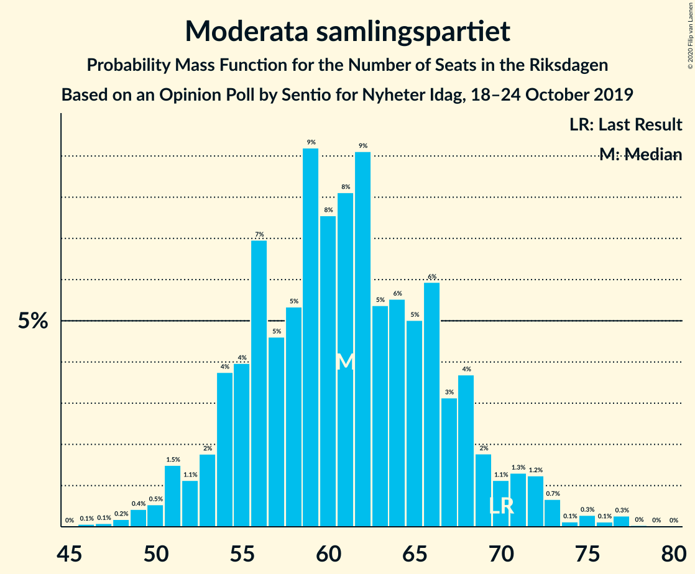
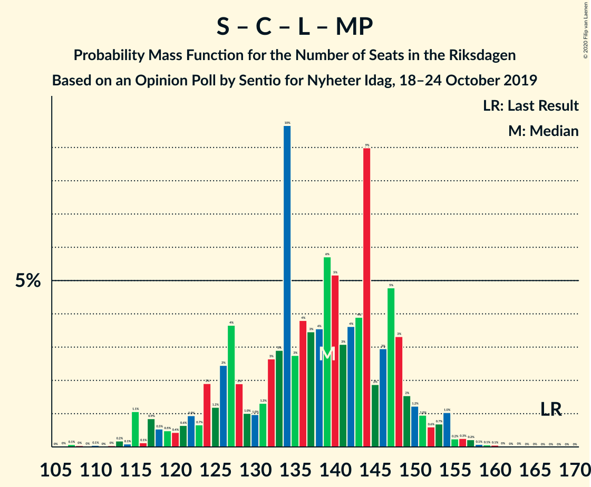

# Opinion Poll by Sentio for Nyheter Idag, 18–24 October 2019

<a href="#voting-intentions">Voting Intentions</a> | <a href="#seats">Seats</a> | <a href="#coalitions">Coalitions</a> | <a href="#technical-information">Technical Information</a>

## Voting Intentions

### Confidence Intervals

| Party | Last Result | Poll Result | 80% Confidence Interval | 90% Confidence Interval | 95% Confidence Interval | 99% Confidence Interval |
|:-----:|:-----------:|:-----------:|:-----------------------:|:-----------------------:|:-----------------------:|:-----------------------:|
| Sverigedemokraterna | 17.5% | 25.5% | 23.6–27.5% |23.0–28.1% |22.6–28.6% |21.7–29.6% |
| Sveriges socialdemokratiska arbetareparti | 28.3% | 24.3% | 22.5–26.4% |21.9–26.9% |21.5–27.5% |20.6–28.5% |
| Moderata samlingspartiet | 19.8% | 16.9% | 15.2–18.7% |14.8–19.2% |14.4–19.6% |13.7–20.5% |
| Vänsterpartiet | 8.0% | 9.6% | 8.4–11.1% |8.0–11.5% |7.8–11.9% |7.2–12.6% |
| Centerpartiet | 8.6% | 6.5% | 5.5–7.7% |5.2–8.1% |5.0–8.4% |4.5–9.1% |
| Kristdemokraterna | 6.3% | 6.5% | 5.5–7.7% |5.2–8.1% |5.0–8.4% |4.5–9.1% |
| Liberalerna | 5.5% | 4.7% | 3.9–5.8% |3.6–6.1% |3.4–6.4% |3.0–7.0% |
| Miljöpartiet de gröna | 4.4% | 4.2% | 3.4–5.3% |3.2–5.5% |3.0–5.8% |2.7–6.4% |

*Note:* The poll result column reflects the actual value used in the calculations. Published results may vary slightly, and in addition be rounded to fewer digits.

## Seats

### Confidence Intervals

| Party | Last Result | Median | 80% Confidence Interval | 90% Confidence Interval | 95% Confidence Interval | 99% Confidence Interval |
|:-----:|:-----------:|:------:|:-----------------------:|:-----------------------:|:-----------------------:|:-----------------------:|
| <a href="#sverigedemokraterna">Sverigedemokraterna</a> | 62 | 92 | 81–98 |80–101 |75–101 |75–107 |
| <a href="#sveriges-socialdemokratiska-arbetareparti">Sveriges socialdemokratiska arbetareparti</a> | 100 | 83 | 82–95 |82–103 |79–104 |73–105 |
| <a href="#moderata-samlingspartiet">Moderata samlingspartiet</a> | 70 | 65 | 55–67 |52–68 |52–71 |49–74 |
| <a href="#vänsterpartiet">Vänsterpartiet</a> | 28 | 31 | 29–38 |29–38 |28–39 |26–42 |
| <a href="#centerpartiet">Centerpartiet</a> | 31 | 21 | 17–29 |17–29 |17–29 |15–30 |
| <a href="#kristdemokraterna">Kristdemokraterna</a> | 22 | 25 | 22–28 |21–28 |19–31 |17–34 |
| <a href="#liberalerna">Liberalerna</a> | 20 | 17 | 14–20 |0–21 |0–24 |0–24 |
| <a href="#miljöpartiet-de-gröna">Miljöpartiet de gröna</a> | 16 | 15 | 0–17 |0–19 |0–19 |0–21 |

### Sverigedemokraterna

*For a full overview of the results for this party, see the [Sverigedemokraterna](party-sverigedemokraterna.html) page.*

| Number of Seats | Probability | Accumulated | Special Marks |
|:---------------:|:-----------:|:-----------:|:-------------:|
| 62 | 0% | 100% | Last Result |
| 63 | 0% | 100% |  |
| 64 | 0% | 100% |  |
| 65 | 0% | 100% |  |
| 66 | 0% | 100% |  |
| 67 | 0% | 100% |  |
| 68 | 0% | 100% |  |
| 69 | 0% | 100% |  |
| 70 | 0% | 100% |  |
| 71 | 0% | 100% |  |
| 72 | 0% | 100% |  |
| 73 | 0% | 100% |  |
| 74 | 0% | 100% |  |
| 75 | 3% | 100% |  |
| 76 | 0% | 97% |  |
| 77 | 0.1% | 97% |  |
| 78 | 0.1% | 97% |  |
| 79 | 0.2% | 97% |  |
| 80 | 7% | 97% |  |
| 81 | 2% | 90% |  |
| 82 | 0.4% | 88% |  |
| 83 | 1.0% | 87% |  |
| 84 | 0.1% | 86% |  |
| 85 | 2% | 86% |  |
| 86 | 0.1% | 85% |  |
| 87 | 0.3% | 85% |  |
| 88 | 3% | 84% |  |
| 89 | 3% | 82% |  |
| 90 | 3% | 79% |  |
| 91 | 1.1% | 76% |  |
| 92 | 39% | 75% | Median |
| 93 | 0.6% | 37% |  |
| 94 | 2% | 36% |  |
| 95 | 2% | 34% |  |
| 96 | 11% | 32% |  |
| 97 | 11% | 21% |  |
| 98 | 1.0% | 10% |  |
| 99 | 0.1% | 9% |  |
| 100 | 0.4% | 9% |  |
| 101 | 7% | 9% |  |
| 102 | 0.1% | 2% |  |
| 103 | 0.1% | 2% |  |
| 104 | 0.2% | 2% |  |
| 105 | 0.3% | 1.4% |  |
| 106 | 0.6% | 1.1% |  |
| 107 | 0.2% | 0.5% |  |
| 108 | 0.1% | 0.3% |  |
| 109 | 0.1% | 0.2% |  |
| 110 | 0% | 0.1% |  |
| 111 | 0% | 0.1% |  |
| 112 | 0% | 0% |  |

### Sveriges socialdemokratiska arbetareparti

*For a full overview of the results for this party, see the [Sveriges socialdemokratiska arbetareparti](party-sverigessocialdemokratiskaarbetareparti.html) page.*

| Number of Seats | Probability | Accumulated | Special Marks |
|:---------------:|:-----------:|:-----------:|:-------------:|
| 72 | 0.1% | 100% |  |
| 73 | 0.5% | 99.9% |  |
| 74 | 0% | 99.4% |  |
| 75 | 0.8% | 99.3% |  |
| 76 | 0.5% | 98.6% |  |
| 77 | 0% | 98% |  |
| 78 | 0.3% | 98% |  |
| 79 | 0.6% | 98% |  |
| 80 | 0.3% | 97% |  |
| 81 | 0.2% | 97% |  |
| 82 | 11% | 97% |  |
| 83 | 40% | 86% | Median |
| 84 | 0.4% | 46% |  |
| 85 | 0.3% | 46% |  |
| 86 | 1.0% | 45% |  |
| 87 | 1.0% | 45% |  |
| 88 | 1.5% | 44% |  |
| 89 | 0.2% | 42% |  |
| 90 | 3% | 42% |  |
| 91 | 2% | 39% |  |
| 92 | 0.3% | 37% |  |
| 93 | 23% | 37% |  |
| 94 | 3% | 14% |  |
| 95 | 1.5% | 11% |  |
| 96 | 0.7% | 10% |  |
| 97 | 0.4% | 9% |  |
| 98 | 0.3% | 8% |  |
| 99 | 0.5% | 8% |  |
| 100 | 0.3% | 8% | Last Result |
| 101 | 2% | 7% |  |
| 102 | 0.4% | 6% |  |
| 103 | 2% | 5% |  |
| 104 | 2% | 3% |  |
| 105 | 1.1% | 2% |  |
| 106 | 0% | 0.5% |  |
| 107 | 0% | 0.5% |  |
| 108 | 0.4% | 0.5% |  |
| 109 | 0% | 0% |  |

### Moderata samlingspartiet

*For a full overview of the results for this party, see the [Moderata samlingspartiet](party-moderatasamlingspartiet.html) page.*

| Number of Seats | Probability | Accumulated | Special Marks |
|:---------------:|:-----------:|:-----------:|:-------------:|
| 45 | 0.1% | 100% |  |
| 46 | 0% | 99.9% |  |
| 47 | 0% | 99.8% |  |
| 48 | 0.3% | 99.8% |  |
| 49 | 0.2% | 99.5% |  |
| 50 | 0.5% | 99.3% |  |
| 51 | 0.1% | 98.9% |  |
| 52 | 5% | 98.7% |  |
| 53 | 0.4% | 93% |  |
| 54 | 0.5% | 93% |  |
| 55 | 11% | 92% |  |
| 56 | 0.3% | 81% |  |
| 57 | 2% | 81% |  |
| 58 | 0.9% | 78% |  |
| 59 | 0.2% | 78% |  |
| 60 | 7% | 77% |  |
| 61 | 3% | 70% |  |
| 62 | 2% | 68% |  |
| 63 | 3% | 66% |  |
| 64 | 5% | 63% |  |
| 65 | 11% | 57% | Median |
| 66 | 3% | 47% |  |
| 67 | 38% | 44% |  |
| 68 | 2% | 6% |  |
| 69 | 1.1% | 4% |  |
| 70 | 0.4% | 3% | Last Result |
| 71 | 1.1% | 3% |  |
| 72 | 0.3% | 2% |  |
| 73 | 0.5% | 1.4% |  |
| 74 | 0.8% | 0.9% |  |
| 75 | 0% | 0.1% |  |
| 76 | 0.1% | 0.1% |  |
| 77 | 0% | 0% |  |

### Vänsterpartiet

*For a full overview of the results for this party, see the [Vänsterpartiet](party-vänsterpartiet.html) page.*

| Number of Seats | Probability | Accumulated | Special Marks |
|:---------------:|:-----------:|:-----------:|:-------------:|
| 24 | 0% | 100% |  |
| 25 | 0.1% | 99.9% |  |
| 26 | 2% | 99.9% |  |
| 27 | 0.3% | 98% |  |
| 28 | 0.3% | 98% | Last Result |
| 29 | 39% | 97% |  |
| 30 | 2% | 58% |  |
| 31 | 14% | 56% | Median |
| 32 | 0.8% | 42% |  |
| 33 | 12% | 42% |  |
| 34 | 6% | 29% |  |
| 35 | 9% | 24% |  |
| 36 | 0.5% | 15% |  |
| 37 | 2% | 15% |  |
| 38 | 9% | 13% |  |
| 39 | 2% | 4% |  |
| 40 | 0.8% | 2% |  |
| 41 | 0.7% | 1.5% |  |
| 42 | 0.4% | 0.8% |  |
| 43 | 0.1% | 0.4% |  |
| 44 | 0.1% | 0.3% |  |
| 45 | 0.1% | 0.2% |  |
| 46 | 0% | 0.1% |  |
| 47 | 0.1% | 0.1% |  |
| 48 | 0% | 0% |  |

### Centerpartiet

*For a full overview of the results for this party, see the [Centerpartiet](party-centerpartiet.html) page.*

| Number of Seats | Probability | Accumulated | Special Marks |
|:---------------:|:-----------:|:-----------:|:-------------:|
| 0 | 0.1% | 100% |  |
| 1 | 0% | 99.9% |  |
| 2 | 0% | 99.9% |  |
| 3 | 0% | 99.9% |  |
| 4 | 0% | 99.9% |  |
| 5 | 0% | 99.9% |  |
| 6 | 0% | 99.9% |  |
| 7 | 0% | 99.9% |  |
| 8 | 0% | 99.9% |  |
| 9 | 0% | 99.9% |  |
| 10 | 0% | 99.9% |  |
| 11 | 0% | 99.9% |  |
| 12 | 0% | 99.9% |  |
| 13 | 0% | 99.9% |  |
| 14 | 0% | 99.9% |  |
| 15 | 0.5% | 99.9% |  |
| 16 | 0.3% | 99.4% |  |
| 17 | 11% | 99.1% |  |
| 18 | 9% | 88% |  |
| 19 | 5% | 79% |  |
| 20 | 1.2% | 74% |  |
| 21 | 39% | 73% | Median |
| 22 | 7% | 34% |  |
| 23 | 2% | 27% |  |
| 24 | 3% | 25% |  |
| 25 | 6% | 22% |  |
| 26 | 2% | 16% |  |
| 27 | 0.8% | 14% |  |
| 28 | 2% | 13% |  |
| 29 | 11% | 12% |  |
| 30 | 0.2% | 0.7% |  |
| 31 | 0.2% | 0.5% | Last Result |
| 32 | 0.1% | 0.3% |  |
| 33 | 0.1% | 0.2% |  |
| 34 | 0.1% | 0.1% |  |
| 35 | 0% | 0% |  |

### Kristdemokraterna

*For a full overview of the results for this party, see the [Kristdemokraterna](party-kristdemokraterna.html) page.*

| Number of Seats | Probability | Accumulated | Special Marks |
|:---------------:|:-----------:|:-----------:|:-------------:|
| 16 | 0.4% | 100% |  |
| 17 | 0.2% | 99.6% |  |
| 18 | 0.9% | 99.4% |  |
| 19 | 2% | 98.5% |  |
| 20 | 0.9% | 96% |  |
| 21 | 3% | 95% |  |
| 22 | 4% | 93% | Last Result |
| 23 | 4% | 88% |  |
| 24 | 2% | 85% |  |
| 25 | 41% | 83% | Median |
| 26 | 29% | 42% |  |
| 27 | 3% | 13% |  |
| 28 | 6% | 10% |  |
| 29 | 0.9% | 4% |  |
| 30 | 0.2% | 3% |  |
| 31 | 1.4% | 3% |  |
| 32 | 0.3% | 1.4% |  |
| 33 | 0.4% | 1.1% |  |
| 34 | 0.5% | 0.8% |  |
| 35 | 0.2% | 0.3% |  |
| 36 | 0% | 0% |  |

### Liberalerna

*For a full overview of the results for this party, see the [Liberalerna](party-liberalerna.html) page.*

| Number of Seats | Probability | Accumulated | Special Marks |
|:---------------:|:-----------:|:-----------:|:-------------:|
| 0 | 8% | 100% |  |
| 1 | 0% | 92% |  |
| 2 | 0% | 92% |  |
| 3 | 0% | 92% |  |
| 4 | 0% | 92% |  |
| 5 | 0% | 92% |  |
| 6 | 0% | 92% |  |
| 7 | 0% | 92% |  |
| 8 | 0% | 92% |  |
| 9 | 0% | 92% |  |
| 10 | 0% | 92% |  |
| 11 | 0% | 92% |  |
| 12 | 0% | 92% |  |
| 13 | 0% | 92% |  |
| 14 | 11% | 92% |  |
| 15 | 7% | 81% |  |
| 16 | 4% | 74% |  |
| 17 | 39% | 70% | Median |
| 18 | 18% | 31% |  |
| 19 | 1.4% | 13% |  |
| 20 | 4% | 11% | Last Result |
| 21 | 3% | 8% |  |
| 22 | 0.4% | 4% |  |
| 23 | 0.6% | 4% |  |
| 24 | 3% | 3% |  |
| 25 | 0% | 0.3% |  |
| 26 | 0.3% | 0.3% |  |
| 27 | 0% | 0% |  |

### Miljöpartiet de gröna

*For a full overview of the results for this party, see the [Miljöpartiet de gröna](party-miljöpartietdegröna.html) page.*

| Number of Seats | Probability | Accumulated | Special Marks |
|:---------------:|:-----------:|:-----------:|:-------------:|
| 0 | 28% | 100% |  |
| 1 | 0% | 72% |  |
| 2 | 0% | 72% |  |
| 3 | 0% | 72% |  |
| 4 | 0% | 72% |  |
| 5 | 0% | 72% |  |
| 6 | 0% | 72% |  |
| 7 | 0% | 72% |  |
| 8 | 0% | 72% |  |
| 9 | 0% | 72% |  |
| 10 | 0% | 72% |  |
| 11 | 0% | 72% |  |
| 12 | 0% | 72% |  |
| 13 | 0% | 72% |  |
| 14 | 0% | 72% |  |
| 15 | 43% | 72% | Median |
| 16 | 18% | 29% | Last Result |
| 17 | 3% | 11% |  |
| 18 | 2% | 8% |  |
| 19 | 4% | 6% |  |
| 20 | 0.9% | 2% |  |
| 21 | 0.9% | 1.2% |  |
| 22 | 0.2% | 0.4% |  |
| 23 | 0% | 0.2% |  |
| 24 | 0.1% | 0.2% |  |
| 25 | 0% | 0.1% |  |
| 26 | 0.1% | 0.1% |  |
| 27 | 0% | 0% |  |

## Coalitions

### Confidence Intervals

| Coalition | Last Result | Median | Majority? | 80% Confidence Interval | 90% Confidence Interval | 95% Confidence Interval | 99% Confidence Interval |
|:---------:|:-----------:|:------:|:---------:|:-----------------------:|:-----------------------:|:-----------------------:|:-----------------------:|
| Sveriges socialdemokratiska arbetareparti – Moderata samlingspartiet – Centerpartiet | 201 | 171 | 26% | 164–180 | 164–187 | 163–195 | 157–204 |
| Sverigedemokraterna – Moderata samlingspartiet – Kristdemokraterna | 154 | 184 | 83% | 166–187 | 166–187 | 163–189 | 163–198 |
| Sveriges socialdemokratiska arbetareparti – Vänsterpartiet – Centerpartiet – Liberalerna – Miljöpartiet de gröna | 195 | 165 | 17% | 162–183 | 162–183 | 160–186 | 151–186 |
| Sveriges socialdemokratiska arbetareparti – Moderata samlingspartiet | 170 | 150 | 0.9% | 145–159 | 144–167 | 141–169 | 135–176 |
| Sverigedemokraterna – Moderata samlingspartiet | 132 | 159 | 0.1% | 141–161 | 140–161 | 138–163 | 138–168 |
| Sveriges socialdemokratiska arbetareparti – Centerpartiet – Liberalerna – Miljöpartiet de gröna | 167 | 136 | 0% | 129–145 | 129–149 | 124–152 | 113–156 |
| Sveriges socialdemokratiska arbetareparti – Vänsterpartiet – Miljöpartiet de gröna | 144 | 127 | 0% | 124–147 | 124–147 | 121–149 | 114–156 |
| Sveriges socialdemokratiska arbetareparti – Vänsterpartiet | 128 | 115 | 0% | 112–131 | 112–137 | 112–139 | 109–145 |
| Moderata samlingspartiet – Centerpartiet – Kristdemokraterna – Liberalerna | 143 | 128 | 0% | 120–130 | 113–131 | 105–138 | 104–144 |
| Moderata samlingspartiet – Centerpartiet – Kristdemokraterna | 123 | 110 | 0% | 104–113 | 102–117 | 101–121 | 94–126 |
| Sveriges socialdemokratiska arbetareparti – Miljöpartiet de gröna | 116 | 98 | 0% | 93–109 | 91–111 | 87–118 | 79–122 |
| Moderata samlingspartiet – Centerpartiet – Liberalerna | 121 | 102 | 0% | 92–105 | 91–106 | 83–114 | 79–119 |
| Moderata samlingspartiet – Centerpartiet | 101 | 85 | 0% | 78–88 | 77–91 | 77–98 | 70–100 |

### Sveriges socialdemokratiska arbetareparti – Moderata samlingspartiet – Centerpartiet

| Number of Seats | Probability | Accumulated | Special Marks |
|:---------------:|:-----------:|:-----------:|:-------------:|
| 152 | 0% | 100% |  |
| 153 | 0.2% | 99.9% |  |
| 154 | 0% | 99.8% |  |
| 155 | 0.1% | 99.7% |  |
| 156 | 0% | 99.6% |  |
| 157 | 0.1% | 99.6% |  |
| 158 | 0% | 99.4% |  |
| 159 | 0% | 99.4% |  |
| 160 | 0.1% | 99.4% |  |
| 161 | 0.3% | 99.3% |  |
| 162 | 0.5% | 99.0% |  |
| 163 | 3% | 98% |  |
| 164 | 10% | 95% |  |
| 165 | 0.8% | 85% |  |
| 166 | 0% | 84% |  |
| 167 | 0.1% | 84% |  |
| 168 | 0.3% | 84% |  |
| 169 | 0.9% | 84% | Median |
| 170 | 10% | 83% |  |
| 171 | 45% | 73% |  |
| 172 | 0.9% | 28% |  |
| 173 | 0.6% | 27% |  |
| 174 | 0.4% | 27% |  |
| 175 | 0.2% | 26% | Majority |
| 176 | 0.8% | 26% |  |
| 177 | 11% | 25% |  |
| 178 | 0.4% | 14% |  |
| 179 | 3% | 14% |  |
| 180 | 0.8% | 10% |  |
| 181 | 0.4% | 10% |  |
| 182 | 0% | 9% |  |
| 183 | 0% | 9% |  |
| 184 | 0% | 9% |  |
| 185 | 0.2% | 9% |  |
| 186 | 2% | 9% |  |
| 187 | 2% | 6% |  |
| 188 | 0.2% | 4% |  |
| 189 | 0.4% | 4% |  |
| 190 | 0% | 4% |  |
| 191 | 0% | 4% |  |
| 192 | 0% | 4% |  |
| 193 | 0% | 4% |  |
| 194 | 0% | 4% |  |
| 195 | 2% | 4% |  |
| 196 | 0.1% | 1.1% |  |
| 197 | 0% | 0.9% |  |
| 198 | 0% | 0.9% |  |
| 199 | 0% | 0.9% |  |
| 200 | 0% | 0.9% |  |
| 201 | 0% | 0.9% | Last Result |
| 202 | 0% | 0.9% |  |
| 203 | 0% | 0.9% |  |
| 204 | 0.9% | 0.9% |  |
| 205 | 0% | 0% |  |

### Sverigedemokraterna – Moderata samlingspartiet – Kristdemokraterna

| Number of Seats | Probability | Accumulated | Special Marks |
|:---------------:|:-----------:|:-----------:|:-------------:|
| 154 | 0% | 100% | Last Result |
| 155 | 0% | 100% |  |
| 156 | 0.1% | 99.9% |  |
| 157 | 0% | 99.9% |  |
| 158 | 0% | 99.9% |  |
| 159 | 0.1% | 99.9% |  |
| 160 | 0.1% | 99.8% |  |
| 161 | 0% | 99.7% |  |
| 162 | 0.1% | 99.7% |  |
| 163 | 3% | 99.7% |  |
| 164 | 2% | 97% |  |
| 165 | 0% | 95% |  |
| 166 | 7% | 95% |  |
| 167 | 0.4% | 88% |  |
| 168 | 0.1% | 88% |  |
| 169 | 0.1% | 88% |  |
| 170 | 0.7% | 88% |  |
| 171 | 0% | 87% |  |
| 172 | 0.2% | 87% |  |
| 173 | 2% | 87% |  |
| 174 | 3% | 85% |  |
| 175 | 0.6% | 83% | Majority |
| 176 | 1.1% | 82% |  |
| 177 | 3% | 81% |  |
| 178 | 14% | 78% |  |
| 179 | 0.7% | 64% |  |
| 180 | 0% | 63% |  |
| 181 | 9% | 63% |  |
| 182 | 1.3% | 55% | Median |
| 183 | 0.4% | 53% |  |
| 184 | 39% | 53% |  |
| 185 | 0.1% | 14% |  |
| 186 | 0.5% | 14% |  |
| 187 | 11% | 14% |  |
| 188 | 0% | 3% |  |
| 189 | 0.3% | 3% |  |
| 190 | 0.4% | 2% |  |
| 191 | 0.8% | 2% |  |
| 192 | 0% | 1.2% |  |
| 193 | 0.3% | 1.2% |  |
| 194 | 0% | 0.9% |  |
| 195 | 0% | 0.9% |  |
| 196 | 0.1% | 0.8% |  |
| 197 | 0% | 0.7% |  |
| 198 | 0.4% | 0.7% |  |
| 199 | 0.1% | 0.3% |  |
| 200 | 0% | 0.2% |  |
| 201 | 0% | 0.2% |  |
| 202 | 0% | 0.2% |  |
| 203 | 0% | 0.2% |  |
| 204 | 0% | 0.2% |  |
| 205 | 0.1% | 0.1% |  |
| 206 | 0% | 0% |  |

### Sveriges socialdemokratiska arbetareparti – Vänsterpartiet – Centerpartiet – Liberalerna – Miljöpartiet de gröna

| Number of Seats | Probability | Accumulated | Special Marks |
|:---------------:|:-----------:|:-----------:|:-------------:|
| 144 | 0.1% | 100% |  |
| 145 | 0% | 99.9% |  |
| 146 | 0% | 99.8% |  |
| 147 | 0% | 99.8% |  |
| 148 | 0% | 99.8% |  |
| 149 | 0% | 99.8% |  |
| 150 | 0.1% | 99.8% |  |
| 151 | 0.4% | 99.7% |  |
| 152 | 0.1% | 99.3% |  |
| 153 | 0.1% | 99.2% |  |
| 154 | 0% | 99.1% |  |
| 155 | 0% | 99.1% |  |
| 156 | 0.3% | 99.1% |  |
| 157 | 0% | 98.8% |  |
| 158 | 0.8% | 98.8% |  |
| 159 | 0.4% | 98% |  |
| 160 | 0.3% | 98% |  |
| 161 | 0% | 97% |  |
| 162 | 11% | 97% |  |
| 163 | 0.5% | 86% |  |
| 164 | 0.1% | 86% |  |
| 165 | 39% | 86% |  |
| 166 | 0.4% | 47% |  |
| 167 | 1.3% | 47% | Median |
| 168 | 9% | 45% |  |
| 169 | 0% | 37% |  |
| 170 | 0.7% | 37% |  |
| 171 | 14% | 36% |  |
| 172 | 3% | 22% |  |
| 173 | 1.1% | 19% |  |
| 174 | 0.6% | 18% |  |
| 175 | 3% | 17% | Majority |
| 176 | 2% | 15% |  |
| 177 | 0.2% | 13% |  |
| 178 | 0% | 13% |  |
| 179 | 0.7% | 13% |  |
| 180 | 0.1% | 12% |  |
| 181 | 0.1% | 12% |  |
| 182 | 0.4% | 12% |  |
| 183 | 7% | 12% |  |
| 184 | 0% | 5% |  |
| 185 | 2% | 5% |  |
| 186 | 3% | 3% |  |
| 187 | 0.1% | 0.3% |  |
| 188 | 0% | 0.3% |  |
| 189 | 0.1% | 0.3% |  |
| 190 | 0.1% | 0.2% |  |
| 191 | 0% | 0.1% |  |
| 192 | 0% | 0.1% |  |
| 193 | 0.1% | 0.1% |  |
| 194 | 0% | 0.1% |  |
| 195 | 0% | 0% | Last Result |

### Sveriges socialdemokratiska arbetareparti – Moderata samlingspartiet

| Number of Seats | Probability | Accumulated | Special Marks |
|:---------------:|:-----------:|:-----------:|:-------------:|
| 126 | 0.1% | 100% |  |
| 127 | 0% | 99.8% |  |
| 128 | 0% | 99.8% |  |
| 129 | 0% | 99.8% |  |
| 130 | 0% | 99.8% |  |
| 131 | 0.1% | 99.8% |  |
| 132 | 0.2% | 99.7% |  |
| 133 | 0% | 99.6% |  |
| 134 | 0% | 99.5% |  |
| 135 | 0.1% | 99.5% |  |
| 136 | 0.1% | 99.5% |  |
| 137 | 0.3% | 99.3% |  |
| 138 | 0% | 99.0% |  |
| 139 | 0.2% | 99.0% |  |
| 140 | 0.4% | 98.7% |  |
| 141 | 0.9% | 98% |  |
| 142 | 0.3% | 97% |  |
| 143 | 0.5% | 97% |  |
| 144 | 3% | 97% |  |
| 145 | 6% | 94% |  |
| 146 | 0.6% | 88% |  |
| 147 | 10% | 87% |  |
| 148 | 13% | 77% | Median |
| 149 | 0.1% | 64% |  |
| 150 | 38% | 64% |  |
| 151 | 0.7% | 26% |  |
| 152 | 4% | 26% |  |
| 153 | 8% | 22% |  |
| 154 | 0.4% | 14% |  |
| 155 | 0.2% | 14% |  |
| 156 | 0.4% | 13% |  |
| 157 | 3% | 13% |  |
| 158 | 0.2% | 10% |  |
| 159 | 0.4% | 10% |  |
| 160 | 1.0% | 10% |  |
| 161 | 0% | 9% |  |
| 162 | 0.7% | 9% |  |
| 163 | 0.1% | 8% |  |
| 164 | 0.1% | 8% |  |
| 165 | 2% | 8% |  |
| 166 | 0.5% | 6% |  |
| 167 | 2% | 6% |  |
| 168 | 0% | 4% |  |
| 169 | 1.5% | 4% |  |
| 170 | 0% | 2% | Last Result |
| 171 | 0% | 2% |  |
| 172 | 1.3% | 2% |  |
| 173 | 0% | 0.9% |  |
| 174 | 0% | 0.9% |  |
| 175 | 0% | 0.9% | Majority |
| 176 | 0.9% | 0.9% |  |
| 177 | 0% | 0% |  |

### Sverigedemokraterna – Moderata samlingspartiet

| Number of Seats | Probability | Accumulated | Special Marks |
|:---------------:|:-----------:|:-----------:|:-------------:|
| 132 | 0% | 100% | Last Result |
| 133 | 0% | 99.9% |  |
| 134 | 0% | 99.9% |  |
| 135 | 0.1% | 99.9% |  |
| 136 | 0% | 99.8% |  |
| 137 | 0.1% | 99.8% |  |
| 138 | 3% | 99.7% |  |
| 139 | 0% | 97% |  |
| 140 | 7% | 97% |  |
| 141 | 0.2% | 90% |  |
| 142 | 0.5% | 90% |  |
| 143 | 0.3% | 89% |  |
| 144 | 0.1% | 89% |  |
| 145 | 2% | 89% |  |
| 146 | 0.1% | 87% |  |
| 147 | 0.1% | 87% |  |
| 148 | 0.1% | 87% |  |
| 149 | 2% | 87% |  |
| 150 | 4% | 85% |  |
| 151 | 0.9% | 81% |  |
| 152 | 13% | 81% |  |
| 153 | 6% | 68% |  |
| 154 | 1.2% | 62% |  |
| 155 | 0.8% | 61% |  |
| 156 | 1.3% | 60% |  |
| 157 | 2% | 59% | Median |
| 158 | 2% | 56% |  |
| 159 | 38% | 54% |  |
| 160 | 0.3% | 16% |  |
| 161 | 12% | 16% |  |
| 162 | 2% | 4% |  |
| 163 | 0.2% | 3% |  |
| 164 | 0.7% | 2% |  |
| 165 | 1.1% | 2% |  |
| 166 | 0.1% | 0.6% |  |
| 167 | 0% | 0.6% |  |
| 168 | 0.1% | 0.5% |  |
| 169 | 0% | 0.5% |  |
| 170 | 0.1% | 0.5% |  |
| 171 | 0% | 0.4% |  |
| 172 | 0% | 0.3% |  |
| 173 | 0.2% | 0.3% |  |
| 174 | 0% | 0.1% |  |
| 175 | 0% | 0.1% | Majority |
| 176 | 0% | 0.1% |  |
| 177 | 0% | 0% |  |

### Sveriges socialdemokratiska arbetareparti – Centerpartiet – Liberalerna – Miljöpartiet de gröna

| Number of Seats | Probability | Accumulated | Special Marks |
|:---------------:|:-----------:|:-----------:|:-------------:|
| 111 | 0.1% | 100% |  |
| 112 | 0.4% | 99.9% |  |
| 113 | 0.1% | 99.6% |  |
| 114 | 0% | 99.4% |  |
| 115 | 0% | 99.4% |  |
| 116 | 0% | 99.4% |  |
| 117 | 0.3% | 99.4% |  |
| 118 | 0.1% | 99.1% |  |
| 119 | 0% | 99.0% |  |
| 120 | 0% | 99.0% |  |
| 121 | 0.9% | 99.0% |  |
| 122 | 0% | 98% |  |
| 123 | 0% | 98% |  |
| 124 | 0.6% | 98% |  |
| 125 | 0% | 97% |  |
| 126 | 0% | 97% |  |
| 127 | 1.4% | 97% |  |
| 128 | 0.3% | 96% |  |
| 129 | 11% | 96% |  |
| 130 | 0.4% | 85% |  |
| 131 | 0.2% | 84% |  |
| 132 | 0.6% | 84% |  |
| 133 | 7% | 83% |  |
| 134 | 0.4% | 76% |  |
| 135 | 2% | 76% |  |
| 136 | 38% | 74% | Median |
| 137 | 4% | 36% |  |
| 138 | 1.0% | 32% |  |
| 139 | 0.3% | 31% |  |
| 140 | 11% | 31% |  |
| 141 | 4% | 20% |  |
| 142 | 2% | 16% |  |
| 143 | 0.1% | 15% |  |
| 144 | 1.1% | 14% |  |
| 145 | 8% | 13% |  |
| 146 | 0.2% | 6% |  |
| 147 | 0.3% | 5% |  |
| 148 | 0.1% | 5% |  |
| 149 | 0.3% | 5% |  |
| 150 | 0% | 5% |  |
| 151 | 0% | 5% |  |
| 152 | 3% | 5% |  |
| 153 | 0% | 2% |  |
| 154 | 0% | 2% |  |
| 155 | 0.1% | 2% |  |
| 156 | 2% | 2% |  |
| 157 | 0% | 0.2% |  |
| 158 | 0.1% | 0.2% |  |
| 159 | 0% | 0.1% |  |
| 160 | 0% | 0% |  |
| 161 | 0% | 0% |  |
| 162 | 0% | 0% |  |
| 163 | 0% | 0% |  |
| 164 | 0% | 0% |  |
| 165 | 0% | 0% |  |
| 166 | 0% | 0% |  |
| 167 | 0% | 0% | Last Result |

### Sveriges socialdemokratiska arbetareparti – Vänsterpartiet – Miljöpartiet de gröna

| Number of Seats | Probability | Accumulated | Special Marks |
|:---------------:|:-----------:|:-----------:|:-------------:|
| 109 | 0% | 100% |  |
| 110 | 0% | 99.9% |  |
| 111 | 0% | 99.9% |  |
| 112 | 0.1% | 99.9% |  |
| 113 | 0.3% | 99.9% |  |
| 114 | 0.4% | 99.6% |  |
| 115 | 0% | 99.2% |  |
| 116 | 0.1% | 99.2% |  |
| 117 | 0.6% | 99.1% |  |
| 118 | 0% | 98% |  |
| 119 | 0% | 98% |  |
| 120 | 0.9% | 98% |  |
| 121 | 0.1% | 98% |  |
| 122 | 2% | 97% |  |
| 123 | 0.2% | 95% |  |
| 124 | 11% | 95% |  |
| 125 | 0.4% | 85% |  |
| 126 | 0.4% | 84% |  |
| 127 | 38% | 84% |  |
| 128 | 5% | 46% |  |
| 129 | 0.5% | 41% | Median |
| 130 | 0.5% | 40% |  |
| 131 | 11% | 40% |  |
| 132 | 2% | 28% |  |
| 133 | 4% | 26% |  |
| 134 | 0.1% | 22% |  |
| 135 | 0.4% | 22% |  |
| 136 | 1.4% | 22% |  |
| 137 | 0.3% | 21% |  |
| 138 | 2% | 20% |  |
| 139 | 1.1% | 19% |  |
| 140 | 0.6% | 17% |  |
| 141 | 0.1% | 17% |  |
| 142 | 2% | 17% |  |
| 143 | 3% | 15% |  |
| 144 | 0.2% | 12% | Last Result |
| 145 | 0.1% | 12% |  |
| 146 | 0.1% | 12% |  |
| 147 | 9% | 12% |  |
| 148 | 0.1% | 3% |  |
| 149 | 0.6% | 3% |  |
| 150 | 0% | 2% |  |
| 151 | 0.1% | 2% |  |
| 152 | 0% | 2% |  |
| 153 | 0.1% | 2% |  |
| 154 | 0.1% | 2% |  |
| 155 | 0.1% | 2% |  |
| 156 | 2% | 2% |  |
| 157 | 0% | 0% |  |

### Sveriges socialdemokratiska arbetareparti – Vänsterpartiet

| Number of Seats | Probability | Accumulated | Special Marks |
|:---------------:|:-----------:|:-----------:|:-------------:|
| 105 | 0.1% | 100% |  |
| 106 | 0.1% | 99.9% |  |
| 107 | 0% | 99.9% |  |
| 108 | 0% | 99.8% |  |
| 109 | 0.4% | 99.8% |  |
| 110 | 0.1% | 99.4% |  |
| 111 | 0.2% | 99.4% |  |
| 112 | 38% | 99.2% |  |
| 113 | 0.8% | 61% |  |
| 114 | 1.2% | 60% | Median |
| 115 | 11% | 59% |  |
| 116 | 0.7% | 48% |  |
| 117 | 0.9% | 47% |  |
| 118 | 3% | 46% |  |
| 119 | 0.1% | 44% |  |
| 120 | 3% | 44% |  |
| 121 | 0.7% | 41% |  |
| 122 | 2% | 41% |  |
| 123 | 0.3% | 39% |  |
| 124 | 11% | 38% |  |
| 125 | 0.4% | 27% |  |
| 126 | 0.4% | 27% |  |
| 127 | 0.5% | 26% |  |
| 128 | 8% | 26% | Last Result |
| 129 | 0.2% | 18% |  |
| 130 | 2% | 18% |  |
| 131 | 7% | 16% |  |
| 132 | 2% | 9% |  |
| 133 | 0.4% | 7% |  |
| 134 | 0.4% | 7% |  |
| 135 | 0.3% | 6% |  |
| 136 | 0.7% | 6% |  |
| 137 | 2% | 5% |  |
| 138 | 0.1% | 3% |  |
| 139 | 1.0% | 3% |  |
| 140 | 0% | 2% |  |
| 141 | 0% | 2% |  |
| 142 | 1.3% | 2% |  |
| 143 | 0.1% | 0.6% |  |
| 144 | 0% | 0.5% |  |
| 145 | 0% | 0.5% |  |
| 146 | 0% | 0.5% |  |
| 147 | 0.5% | 0.5% |  |
| 148 | 0% | 0% |  |

### Moderata samlingspartiet – Centerpartiet – Kristdemokraterna – Liberalerna

| Number of Seats | Probability | Accumulated | Special Marks |
|:---------------:|:-----------:|:-----------:|:-------------:|
| 93 | 0% | 100% |  |
| 94 | 0% | 99.9% |  |
| 95 | 0% | 99.9% |  |
| 96 | 0% | 99.9% |  |
| 97 | 0% | 99.9% |  |
| 98 | 0% | 99.9% |  |
| 99 | 0% | 99.9% |  |
| 100 | 0.4% | 99.9% |  |
| 101 | 0% | 99.5% |  |
| 102 | 0% | 99.5% |  |
| 103 | 0% | 99.5% |  |
| 104 | 0.1% | 99.5% |  |
| 105 | 2% | 99.4% |  |
| 106 | 0.1% | 97% |  |
| 107 | 0.5% | 97% |  |
| 108 | 0% | 97% |  |
| 109 | 0% | 97% |  |
| 110 | 0.3% | 97% |  |
| 111 | 0.3% | 96% |  |
| 112 | 0.1% | 96% |  |
| 113 | 1.5% | 96% |  |
| 114 | 0% | 95% |  |
| 115 | 1.1% | 95% |  |
| 116 | 2% | 93% |  |
| 117 | 0.3% | 91% |  |
| 118 | 0.7% | 91% |  |
| 119 | 0.2% | 91% |  |
| 120 | 6% | 90% |  |
| 121 | 2% | 84% |  |
| 122 | 17% | 82% |  |
| 123 | 0.4% | 65% |  |
| 124 | 0.3% | 65% |  |
| 125 | 0.8% | 64% |  |
| 126 | 4% | 63% |  |
| 127 | 3% | 60% |  |
| 128 | 12% | 57% | Median |
| 129 | 0.2% | 45% |  |
| 130 | 37% | 45% |  |
| 131 | 3% | 7% |  |
| 132 | 0.1% | 4% |  |
| 133 | 0.3% | 4% |  |
| 134 | 0.4% | 4% |  |
| 135 | 0.2% | 3% |  |
| 136 | 0.5% | 3% |  |
| 137 | 0.1% | 3% |  |
| 138 | 0.3% | 3% |  |
| 139 | 0% | 2% |  |
| 140 | 0.2% | 2% |  |
| 141 | 1.1% | 2% |  |
| 142 | 0.2% | 0.9% |  |
| 143 | 0% | 0.8% | Last Result |
| 144 | 0.3% | 0.8% |  |
| 145 | 0.4% | 0.5% |  |
| 146 | 0% | 0.1% |  |
| 147 | 0% | 0.1% |  |
| 148 | 0% | 0.1% |  |
| 149 | 0% | 0% |  |

### Moderata samlingspartiet – Centerpartiet – Kristdemokraterna

| Number of Seats | Probability | Accumulated | Special Marks |
|:---------------:|:-----------:|:-----------:|:-------------:|
| 89 | 0% | 100% |  |
| 90 | 0.3% | 99.9% |  |
| 91 | 0% | 99.6% |  |
| 92 | 0% | 99.6% |  |
| 93 | 0% | 99.6% |  |
| 94 | 0.1% | 99.6% |  |
| 95 | 0.3% | 99.5% |  |
| 96 | 0% | 99.2% |  |
| 97 | 0.1% | 99.1% |  |
| 98 | 0.3% | 99.0% |  |
| 99 | 0.7% | 98.7% |  |
| 100 | 0.4% | 98% |  |
| 101 | 2% | 98% |  |
| 102 | 2% | 96% |  |
| 103 | 0.3% | 93% |  |
| 104 | 7% | 93% |  |
| 105 | 9% | 86% |  |
| 106 | 0.6% | 77% |  |
| 107 | 3% | 76% |  |
| 108 | 11% | 73% |  |
| 109 | 0.2% | 62% |  |
| 110 | 13% | 61% |  |
| 111 | 0.8% | 48% | Median |
| 112 | 0.9% | 47% |  |
| 113 | 39% | 46% |  |
| 114 | 0.1% | 7% |  |
| 115 | 0.5% | 7% |  |
| 116 | 0.9% | 7% |  |
| 117 | 2% | 6% |  |
| 118 | 0% | 4% |  |
| 119 | 0% | 4% |  |
| 120 | 1.0% | 4% |  |
| 121 | 0.2% | 3% |  |
| 122 | 0.9% | 2% |  |
| 123 | 0.4% | 2% | Last Result |
| 124 | 0% | 1.1% |  |
| 125 | 0% | 1.1% |  |
| 126 | 1.0% | 1.1% |  |
| 127 | 0% | 0.1% |  |
| 128 | 0% | 0.1% |  |
| 129 | 0.1% | 0.1% |  |
| 130 | 0% | 0.1% |  |
| 131 | 0% | 0.1% |  |
| 132 | 0.1% | 0.1% |  |
| 133 | 0% | 0% |  |

### Sveriges socialdemokratiska arbetareparti – Miljöpartiet de gröna

| Number of Seats | Probability | Accumulated | Special Marks |
|:---------------:|:-----------:|:-----------:|:-------------:|
| 78 | 0.3% | 100% |  |
| 79 | 0.5% | 99.7% |  |
| 80 | 0% | 99.2% |  |
| 81 | 0% | 99.2% |  |
| 82 | 0% | 99.2% |  |
| 83 | 0% | 99.2% |  |
| 84 | 0.3% | 99.1% |  |
| 85 | 0.3% | 98.9% |  |
| 86 | 0.2% | 98.6% |  |
| 87 | 1.0% | 98% |  |
| 88 | 0.7% | 97% |  |
| 89 | 0% | 97% |  |
| 90 | 0.6% | 97% |  |
| 91 | 2% | 96% |  |
| 92 | 0.2% | 94% |  |
| 93 | 16% | 94% |  |
| 94 | 0.5% | 78% |  |
| 95 | 2% | 77% |  |
| 96 | 0.7% | 75% |  |
| 97 | 0.4% | 74% |  |
| 98 | 51% | 74% | Median |
| 99 | 0.5% | 23% |  |
| 100 | 0.4% | 23% |  |
| 101 | 0% | 22% |  |
| 102 | 0% | 22% |  |
| 103 | 0% | 22% |  |
| 104 | 2% | 22% |  |
| 105 | 2% | 20% |  |
| 106 | 0.3% | 19% |  |
| 107 | 1.0% | 18% |  |
| 108 | 2% | 17% |  |
| 109 | 10% | 15% |  |
| 110 | 0.1% | 5% |  |
| 111 | 0.5% | 5% |  |
| 112 | 0.3% | 5% |  |
| 113 | 0% | 5% |  |
| 114 | 0% | 4% |  |
| 115 | 0% | 4% |  |
| 116 | 0.2% | 4% | Last Result |
| 117 | 0.4% | 4% |  |
| 118 | 2% | 4% |  |
| 119 | 0% | 2% |  |
| 120 | 0.1% | 2% |  |
| 121 | 0% | 2% |  |
| 122 | 2% | 2% |  |
| 123 | 0% | 0% |  |

### Moderata samlingspartiet – Centerpartiet – Liberalerna

| Number of Seats | Probability | Accumulated | Special Marks |
|:---------------:|:-----------:|:-----------:|:-------------:|
| 69 | 0% | 100% |  |
| 70 | 0% | 99.9% |  |
| 71 | 0% | 99.9% |  |
| 72 | 0% | 99.9% |  |
| 73 | 0% | 99.9% |  |
| 74 | 0% | 99.9% |  |
| 75 | 0% | 99.9% |  |
| 76 | 0% | 99.9% |  |
| 77 | 0.4% | 99.9% |  |
| 78 | 0% | 99.5% |  |
| 79 | 0.5% | 99.5% |  |
| 80 | 0% | 99.1% |  |
| 81 | 0% | 99.1% |  |
| 82 | 0.4% | 99.0% |  |
| 83 | 2% | 98.7% |  |
| 84 | 0.7% | 97% |  |
| 85 | 0.2% | 96% |  |
| 86 | 0.1% | 96% |  |
| 87 | 0% | 96% |  |
| 88 | 0% | 96% |  |
| 89 | 0.2% | 96% |  |
| 90 | 0.2% | 95% |  |
| 91 | 1.5% | 95% |  |
| 92 | 6% | 94% |  |
| 93 | 0.1% | 88% |  |
| 94 | 0.2% | 87% |  |
| 95 | 2% | 87% |  |
| 96 | 17% | 85% |  |
| 97 | 0.1% | 68% |  |
| 98 | 0.3% | 68% |  |
| 99 | 1.0% | 67% |  |
| 100 | 4% | 66% |  |
| 101 | 0.3% | 63% |  |
| 102 | 14% | 62% |  |
| 103 | 3% | 49% | Median |
| 104 | 0.6% | 46% |  |
| 105 | 38% | 45% |  |
| 106 | 3% | 7% |  |
| 107 | 0.2% | 4% |  |
| 108 | 0.4% | 4% |  |
| 109 | 0.4% | 3% |  |
| 110 | 0.1% | 3% |  |
| 111 | 0.1% | 3% |  |
| 112 | 0.1% | 3% |  |
| 113 | 0.2% | 3% |  |
| 114 | 1.2% | 3% |  |
| 115 | 0% | 1.3% |  |
| 116 | 0.5% | 1.3% |  |
| 117 | 0.3% | 0.9% |  |
| 118 | 0.1% | 0.6% |  |
| 119 | 0.2% | 0.5% |  |
| 120 | 0.3% | 0.3% |  |
| 121 | 0% | 0.1% | Last Result |
| 122 | 0% | 0.1% |  |
| 123 | 0% | 0.1% |  |
| 124 | 0% | 0% |  |

### Moderata samlingspartiet – Centerpartiet

| Number of Seats | Probability | Accumulated | Special Marks |
|:---------------:|:-----------:|:-----------:|:-------------:|
| 66 | 0% | 100% |  |
| 67 | 0% | 99.9% |  |
| 68 | 0.1% | 99.9% |  |
| 69 | 0.1% | 99.8% |  |
| 70 | 0.2% | 99.7% |  |
| 71 | 0.3% | 99.5% |  |
| 72 | 0.1% | 99.2% |  |
| 73 | 0.2% | 99.1% |  |
| 74 | 0.1% | 98.9% |  |
| 75 | 0.3% | 98.8% |  |
| 76 | 0.8% | 98.6% |  |
| 77 | 6% | 98% |  |
| 78 | 7% | 92% |  |
| 79 | 3% | 85% |  |
| 80 | 4% | 82% |  |
| 81 | 0.3% | 78% |  |
| 82 | 11% | 78% |  |
| 83 | 3% | 67% |  |
| 84 | 12% | 64% |  |
| 85 | 3% | 52% |  |
| 86 | 2% | 49% | Median |
| 87 | 0.9% | 47% |  |
| 88 | 38% | 46% |  |
| 89 | 0.4% | 8% |  |
| 90 | 2% | 8% |  |
| 91 | 2% | 5% |  |
| 92 | 0.1% | 3% |  |
| 93 | 0.1% | 3% |  |
| 94 | 0.1% | 3% |  |
| 95 | 0% | 3% |  |
| 96 | 0% | 3% |  |
| 97 | 0.5% | 3% |  |
| 98 | 0.3% | 3% |  |
| 99 | 1.2% | 2% |  |
| 100 | 0.9% | 1.2% |  |
| 101 | 0.1% | 0.3% | Last Result |
| 102 | 0% | 0.2% |  |
| 103 | 0.1% | 0.2% |  |
| 104 | 0% | 0% |  |

## Technical Information

### Opinion Poll

+ **Polling firm:** Sentio
+ **Commissioner(s):** Nyheter Idag
+ **Fieldwork period:** 18–24 October 2019

### Calculations

+ **Sample size:** 789
+ **Simulations done:** 16,384
+ **Error estimate:** 3.67%

