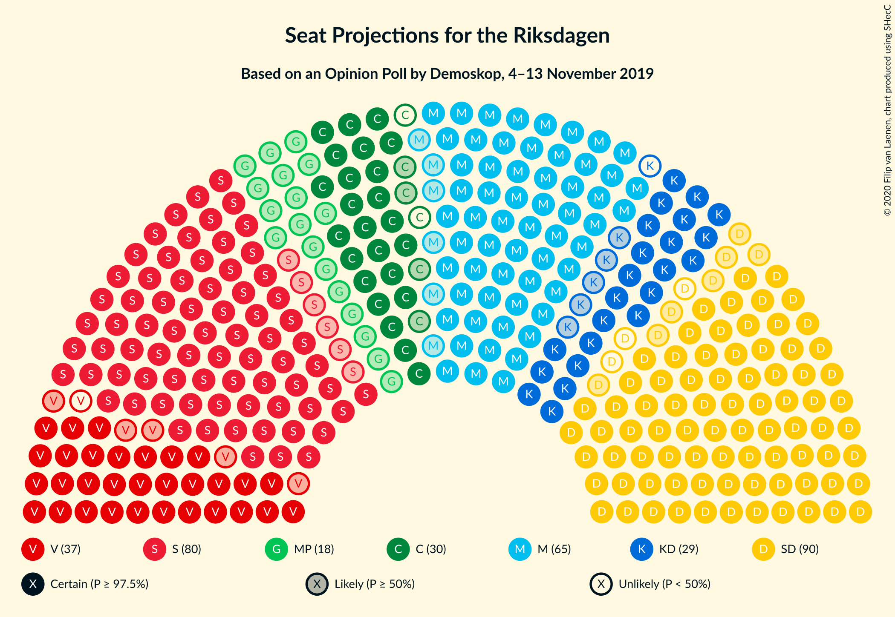
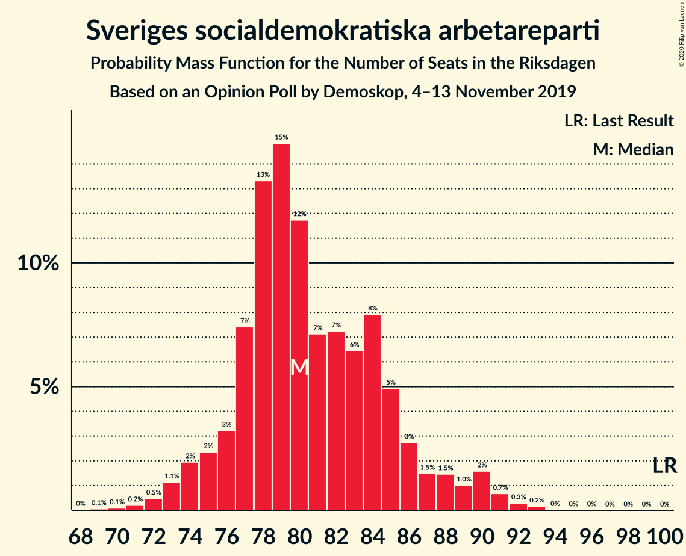
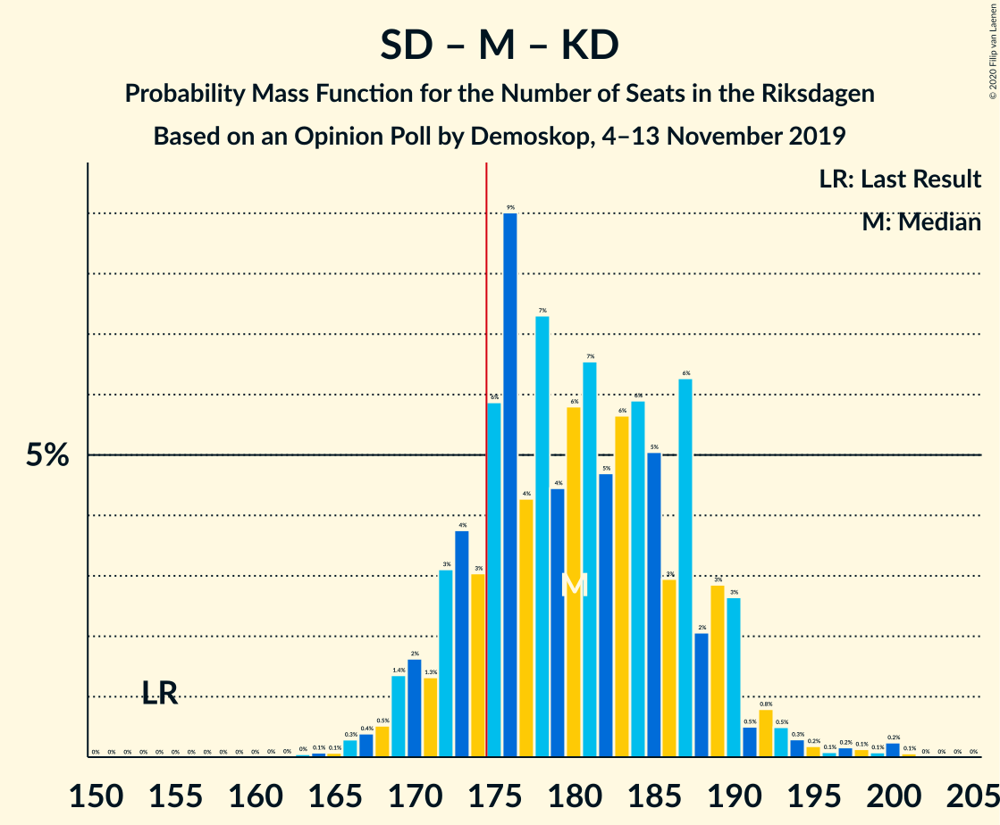
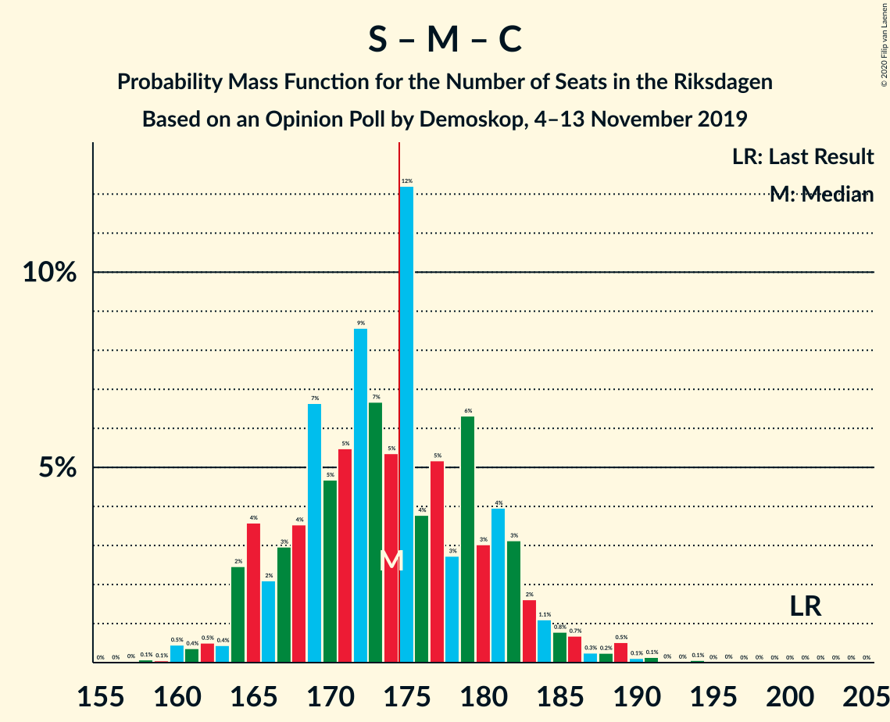

# Opinion Poll by Demoskop, 4–13 November 2019

<a href="#voting-intentions">Voting Intentions</a> | <a href="#seats">Seats</a> | <a href="#coalitions">Coalitions</a> | <a href="#technical-information">Technical Information</a>

## Voting Intentions

### Confidence Intervals

| Party | Last Result | Poll Result | 80% Confidence Interval | 90% Confidence Interval | 95% Confidence Interval | 99% Confidence Interval |
|:-----:|:-----------:|:-----------:|:-----------------------:|:-----------------------:|:-----------------------:|:-----------------------:|
| Sverigedemokraterna | 17.5% | 24.0% | 22.8–25.3% |22.5–25.6% |22.2–25.9% |21.7–26.5% |
| Sveriges socialdemokratiska arbetareparti | 28.3% | 22.2% | 21.1–23.4% |20.7–23.8% |20.5–24.1% |19.9–24.7% |
| Moderata samlingspartiet | 19.8% | 17.8% | 16.8–18.9% |16.5–19.3% |16.2–19.6% |15.7–20.1% |
| Vänsterpartiet | 8.0% | 9.8% | 9.0–10.7% |8.8–11.0% |8.6–11.2% |8.2–11.6% |
| Centerpartiet | 8.6% | 7.7% | 7.0–8.5% |6.8–8.8% |6.6–9.0% |6.3–9.4% |
| Kristdemokraterna | 6.3% | 7.6% | 6.9–8.4% |6.7–8.7% |6.5–8.9% |6.2–9.3% |
| Miljöpartiet de gröna | 4.4% | 4.8% | 4.2–5.5% |4.1–5.6% |3.9–5.8% |3.7–6.1% |
| Liberalerna | 5.5% | 3.9% | 3.4–4.5% |3.3–4.7% |3.1–4.8% |2.9–5.2% |

*Note:* The poll result column reflects the actual value used in the calculations. Published results may vary slightly, and in addition be rounded to fewer digits.

## Seats

### Confidence Intervals

| Party | Last Result | Median | 80% Confidence Interval | 90% Confidence Interval | 95% Confidence Interval | 99% Confidence Interval |
|:-----:|:-----------:|:------:|:-----------------------:|:-----------------------:|:-----------------------:|:-----------------------:|
| <a href="#sverigedemokraterna">Sverigedemokraterna</a> | 62 | 87 | 82–93 |81–94 |80–96 |78–99 |
| <a href="#sveriges-socialdemokratiska-arbetareparti">Sveriges socialdemokratiska arbetareparti</a> | 100 | 80 | 77–85 |75–88 |74–90 |72–91 |
| <a href="#moderata-samlingspartiet">Moderata samlingspartiet</a> | 70 | 65 | 61–70 |60–71 |59–72 |57–74 |
| <a href="#vänsterpartiet">Vänsterpartiet</a> | 28 | 36 | 32–39 |32–40 |31–41 |30–43 |
| <a href="#centerpartiet">Centerpartiet</a> | 31 | 28 | 25–32 |25–32 |24–33 |23–34 |
| <a href="#kristdemokraterna">Kristdemokraterna</a> | 22 | 28 | 25–31 |24–32 |23–32 |22–34 |
| <a href="#miljöpartiet-de-gröna">Miljöpartiet de gröna</a> | 16 | 18 | 15–20 |15–21 |0–21 |0–22 |
| <a href="#liberalerna">Liberalerna</a> | 20 | 0 | 0–16 |0–17 |0–17 |0–18 |

### Sverigedemokraterna

*For a full overview of the results for this party, see the [Sverigedemokraterna](party-sverigedemokraterna.html) page.*

| Number of Seats | Probability | Accumulated | Special Marks |
|:---------------:|:-----------:|:-----------:|:-------------:|
| 62 | 0% | 100% | Last Result |
| 63 | 0% | 100% |  |
| 64 | 0% | 100% |  |
| 65 | 0% | 100% |  |
| 66 | 0% | 100% |  |
| 67 | 0% | 100% |  |
| 68 | 0% | 100% |  |
| 69 | 0% | 100% |  |
| 70 | 0% | 100% |  |
| 71 | 0% | 100% |  |
| 72 | 0% | 100% |  |
| 73 | 0% | 100% |  |
| 74 | 0% | 100% |  |
| 75 | 0.1% | 100% |  |
| 76 | 0.1% | 99.9% |  |
| 77 | 0.3% | 99.8% |  |
| 78 | 0.5% | 99.5% |  |
| 79 | 0.8% | 99.0% |  |
| 80 | 2% | 98% |  |
| 81 | 3% | 96% |  |
| 82 | 6% | 93% |  |
| 83 | 6% | 86% |  |
| 84 | 7% | 81% |  |
| 85 | 7% | 73% |  |
| 86 | 9% | 67% |  |
| 87 | 9% | 57% | Median |
| 88 | 10% | 48% |  |
| 89 | 8% | 39% |  |
| 90 | 11% | 31% |  |
| 91 | 4% | 20% |  |
| 92 | 5% | 16% |  |
| 93 | 4% | 11% |  |
| 94 | 3% | 8% |  |
| 95 | 1.5% | 5% |  |
| 96 | 2% | 3% |  |
| 97 | 0.5% | 2% |  |
| 98 | 0.4% | 1.0% |  |
| 99 | 0.3% | 0.5% |  |
| 100 | 0.1% | 0.2% |  |
| 101 | 0% | 0.1% |  |
| 102 | 0% | 0.1% |  |
| 103 | 0% | 0% |  |

### Sveriges socialdemokratiska arbetareparti

*For a full overview of the results for this party, see the [Sveriges socialdemokratiska arbetareparti](party-sverigessocialdemokratiskaarbetareparti.html) page.*

| Number of Seats | Probability | Accumulated | Special Marks |
|:---------------:|:-----------:|:-----------:|:-------------:|
| 69 | 0.1% | 100% |  |
| 70 | 0.1% | 99.9% |  |
| 71 | 0.2% | 99.8% |  |
| 72 | 0.5% | 99.6% |  |
| 73 | 1.1% | 99.1% |  |
| 74 | 2% | 98% |  |
| 75 | 2% | 96% |  |
| 76 | 3% | 94% |  |
| 77 | 7% | 90% |  |
| 78 | 13% | 83% |  |
| 79 | 15% | 70% |  |
| 80 | 12% | 55% | Median |
| 81 | 7% | 43% |  |
| 82 | 7% | 36% |  |
| 83 | 6% | 29% |  |
| 84 | 8% | 22% |  |
| 85 | 5% | 14% |  |
| 86 | 3% | 9% |  |
| 87 | 1.5% | 7% |  |
| 88 | 1.5% | 5% |  |
| 89 | 1.0% | 4% |  |
| 90 | 2% | 3% |  |
| 91 | 0.7% | 1.2% |  |
| 92 | 0.3% | 0.5% |  |
| 93 | 0.2% | 0.2% |  |
| 94 | 0% | 0% |  |
| 95 | 0% | 0% |  |
| 96 | 0% | 0% |  |
| 97 | 0% | 0% |  |
| 98 | 0% | 0% |  |
| 99 | 0% | 0% |  |
| 100 | 0% | 0% | Last Result |

### Moderata samlingspartiet

*For a full overview of the results for this party, see the [Moderata samlingspartiet](party-moderatasamlingspartiet.html) page.*

| Number of Seats | Probability | Accumulated | Special Marks |
|:---------------:|:-----------:|:-----------:|:-------------:|
| 54 | 0% | 100% |  |
| 55 | 0.1% | 99.9% |  |
| 56 | 0.2% | 99.8% |  |
| 57 | 0.6% | 99.6% |  |
| 58 | 1.3% | 99.0% |  |
| 59 | 3% | 98% |  |
| 60 | 4% | 95% |  |
| 61 | 6% | 91% |  |
| 62 | 9% | 85% |  |
| 63 | 10% | 77% |  |
| 64 | 9% | 67% |  |
| 65 | 14% | 58% | Median |
| 66 | 8% | 44% |  |
| 67 | 13% | 35% |  |
| 68 | 7% | 23% |  |
| 69 | 5% | 15% |  |
| 70 | 4% | 10% | Last Result |
| 71 | 3% | 7% |  |
| 72 | 2% | 3% |  |
| 73 | 1.0% | 2% |  |
| 74 | 0.3% | 0.6% |  |
| 75 | 0.1% | 0.4% |  |
| 76 | 0.1% | 0.2% |  |
| 77 | 0.1% | 0.2% |  |
| 78 | 0% | 0% |  |

### Vänsterpartiet

*For a full overview of the results for this party, see the [Vänsterpartiet](party-vänsterpartiet.html) page.*

| Number of Seats | Probability | Accumulated | Special Marks |
|:---------------:|:-----------:|:-----------:|:-------------:|
| 28 | 0.1% | 100% | Last Result |
| 29 | 0.3% | 99.9% |  |
| 30 | 0.7% | 99.6% |  |
| 31 | 3% | 98.9% |  |
| 32 | 6% | 96% |  |
| 33 | 6% | 90% |  |
| 34 | 14% | 84% |  |
| 35 | 17% | 69% |  |
| 36 | 12% | 52% | Median |
| 37 | 15% | 40% |  |
| 38 | 12% | 25% |  |
| 39 | 6% | 13% |  |
| 40 | 3% | 8% |  |
| 41 | 3% | 4% |  |
| 42 | 0.8% | 1.5% |  |
| 43 | 0.4% | 0.7% |  |
| 44 | 0.2% | 0.3% |  |
| 45 | 0.1% | 0.1% |  |
| 46 | 0% | 0% |  |

### Centerpartiet

*For a full overview of the results for this party, see the [Centerpartiet](party-centerpartiet.html) page.*

| Number of Seats | Probability | Accumulated | Special Marks |
|:---------------:|:-----------:|:-----------:|:-------------:|
| 21 | 0% | 100% |  |
| 22 | 0.1% | 99.9% |  |
| 23 | 1.4% | 99.8% |  |
| 24 | 3% | 98% |  |
| 25 | 10% | 95% |  |
| 26 | 17% | 85% |  |
| 27 | 18% | 68% |  |
| 28 | 9% | 50% | Median |
| 29 | 7% | 41% |  |
| 30 | 12% | 34% |  |
| 31 | 12% | 23% | Last Result |
| 32 | 7% | 11% |  |
| 33 | 3% | 4% |  |
| 34 | 0.8% | 1.0% |  |
| 35 | 0.1% | 0.2% |  |
| 36 | 0.1% | 0.1% |  |
| 37 | 0% | 0% |  |

### Kristdemokraterna

*For a full overview of the results for this party, see the [Kristdemokraterna](party-kristdemokraterna.html) page.*

| Number of Seats | Probability | Accumulated | Special Marks |
|:---------------:|:-----------:|:-----------:|:-------------:|
| 21 | 0.1% | 100% |  |
| 22 | 0.5% | 99.9% | Last Result |
| 23 | 2% | 99.4% |  |
| 24 | 3% | 97% |  |
| 25 | 11% | 94% |  |
| 26 | 12% | 83% |  |
| 27 | 17% | 72% |  |
| 28 | 16% | 54% | Median |
| 29 | 18% | 39% |  |
| 30 | 8% | 21% |  |
| 31 | 7% | 13% |  |
| 32 | 4% | 6% |  |
| 33 | 2% | 2% |  |
| 34 | 0.4% | 0.7% |  |
| 35 | 0.2% | 0.3% |  |
| 36 | 0.1% | 0.1% |  |
| 37 | 0% | 0% |  |

### Miljöpartiet de gröna

*For a full overview of the results for this party, see the [Miljöpartiet de gröna](party-miljöpartietdegröna.html) page.*

| Number of Seats | Probability | Accumulated | Special Marks |
|:---------------:|:-----------:|:-----------:|:-------------:|
| 0 | 3% | 100% |  |
| 1 | 0% | 97% |  |
| 2 | 0% | 97% |  |
| 3 | 0% | 97% |  |
| 4 | 0% | 97% |  |
| 5 | 0% | 97% |  |
| 6 | 0% | 97% |  |
| 7 | 0% | 97% |  |
| 8 | 0% | 97% |  |
| 9 | 0% | 97% |  |
| 10 | 0% | 97% |  |
| 11 | 0% | 97% |  |
| 12 | 0% | 97% |  |
| 13 | 0% | 97% |  |
| 14 | 0.9% | 97% |  |
| 15 | 7% | 96% |  |
| 16 | 16% | 89% | Last Result |
| 17 | 21% | 73% |  |
| 18 | 22% | 52% | Median |
| 19 | 15% | 30% |  |
| 20 | 10% | 15% |  |
| 21 | 3% | 6% |  |
| 22 | 2% | 2% |  |
| 23 | 0.3% | 0.4% |  |
| 24 | 0.1% | 0.1% |  |
| 25 | 0% | 0% |  |

### Liberalerna

*For a full overview of the results for this party, see the [Liberalerna](party-liberalerna.html) page.*

| Number of Seats | Probability | Accumulated | Special Marks |
|:---------------:|:-----------:|:-----------:|:-------------:|
| 0 | 54% | 100% | Median |
| 1 | 0% | 46% |  |
| 2 | 0% | 46% |  |
| 3 | 0% | 46% |  |
| 4 | 0% | 46% |  |
| 5 | 0% | 46% |  |
| 6 | 0% | 46% |  |
| 7 | 0% | 46% |  |
| 8 | 0% | 46% |  |
| 9 | 0% | 46% |  |
| 10 | 0% | 46% |  |
| 11 | 0% | 46% |  |
| 12 | 0% | 46% |  |
| 13 | 0% | 46% |  |
| 14 | 7% | 46% |  |
| 15 | 19% | 39% |  |
| 16 | 13% | 19% |  |
| 17 | 5% | 6% |  |
| 18 | 1.4% | 2% |  |
| 19 | 0.3% | 0.4% |  |
| 20 | 0% | 0.1% | Last Result |
| 21 | 0% | 0% |  |

## Coalitions

### Confidence Intervals

| Coalition | Last Result | Median | Majority? | 80% Confidence Interval | 90% Confidence Interval | 95% Confidence Interval | 99% Confidence Interval |
|:---------:|:-----------:|:------:|:---------:|:-----------------------:|:-----------------------:|:-----------------------:|:-----------------------:|
| Sverigedemokraterna – Moderata samlingspartiet – Kristdemokraterna | 154 | 180 | 84% | 173–188 | 171–190 | 169–192 | 166–198 |
| Sveriges socialdemokratiska arbetareparti – Moderata samlingspartiet – Centerpartiet | 201 | 174 | 46% | 166–181 | 165–183 | 164–185 | 160–189 |
| Sveriges socialdemokratiska arbetareparti – Vänsterpartiet – Centerpartiet – Miljöpartiet de gröna – Liberalerna | 195 | 169 | 16% | 161–176 | 159–178 | 157–180 | 151–183 |
| Sverigedemokraterna – Moderata samlingspartiet | 132 | 152 | 0% | 146–159 | 144–161 | 142–163 | 140–168 |
| Sveriges socialdemokratiska arbetareparti – Moderata samlingspartiet | 170 | 145 | 0% | 139–153 | 138–155 | 136–156 | 133–160 |
| Sveriges socialdemokratiska arbetareparti – Vänsterpartiet – Miljöpartiet de gröna | 144 | 134 | 0% | 128–140 | 125–142 | 123–144 | 117–146 |
| Sveriges socialdemokratiska arbetareparti – Centerpartiet – Miljöpartiet de gröna – Liberalerna | 167 | 133 | 0% | 125–141 | 124–143 | 121–144 | 113–147 |
| Moderata samlingspartiet – Centerpartiet – Kristdemokraterna – Liberalerna | 143 | 128 | 0% | 120–137 | 118–138 | 117–140 | 114–143 |
| Moderata samlingspartiet – Centerpartiet – Kristdemokraterna | 123 | 121 | 0% | 115–127 | 113–129 | 112–131 | 109–134 |
| Sveriges socialdemokratiska arbetareparti – Vänsterpartiet | 128 | 116 | 0% | 111–122 | 110–124 | 108–126 | 106–130 |
| Moderata samlingspartiet – Centerpartiet – Liberalerna | 121 | 99 | 0% | 92–110 | 90–110 | 89–112 | 87–115 |
| Sveriges socialdemokratiska arbetareparti – Miljöpartiet de gröna | 116 | 98 | 0% | 93–104 | 91–105 | 87–106 | 80–109 |
| Moderata samlingspartiet – Centerpartiet | 101 | 94 | 0% | 88–98 | 86–100 | 85–101 | 83–104 |

### Sverigedemokraterna – Moderata samlingspartiet – Kristdemokraterna

| Number of Seats | Probability | Accumulated | Special Marks |
|:---------------:|:-----------:|:-----------:|:-------------:|
| 154 | 0% | 100% | Last Result |
| 155 | 0% | 100% |  |
| 156 | 0% | 100% |  |
| 157 | 0% | 100% |  |
| 158 | 0% | 100% |  |
| 159 | 0% | 100% |  |
| 160 | 0% | 100% |  |
| 161 | 0% | 100% |  |
| 162 | 0% | 100% |  |
| 163 | 0% | 100% |  |
| 164 | 0.1% | 99.9% |  |
| 165 | 0.1% | 99.9% |  |
| 166 | 0.3% | 99.8% |  |
| 167 | 0.4% | 99.5% |  |
| 168 | 0.5% | 99.1% |  |
| 169 | 1.4% | 98.6% |  |
| 170 | 2% | 97% |  |
| 171 | 1.3% | 96% |  |
| 172 | 3% | 94% |  |
| 173 | 4% | 91% |  |
| 174 | 3% | 87% |  |
| 175 | 6% | 84% | Majority |
| 176 | 9% | 79% |  |
| 177 | 4% | 69% |  |
| 178 | 7% | 65% |  |
| 179 | 4% | 58% |  |
| 180 | 6% | 53% | Median |
| 181 | 7% | 48% |  |
| 182 | 5% | 41% |  |
| 183 | 6% | 36% |  |
| 184 | 6% | 31% |  |
| 185 | 5% | 25% |  |
| 186 | 3% | 20% |  |
| 187 | 6% | 17% |  |
| 188 | 2% | 11% |  |
| 189 | 3% | 9% |  |
| 190 | 3% | 6% |  |
| 191 | 0.5% | 3% |  |
| 192 | 0.8% | 3% |  |
| 193 | 0.5% | 2% |  |
| 194 | 0.3% | 1.3% |  |
| 195 | 0.2% | 1.0% |  |
| 196 | 0.1% | 0.8% |  |
| 197 | 0.2% | 0.7% |  |
| 198 | 0.1% | 0.5% |  |
| 199 | 0.1% | 0.4% |  |
| 200 | 0.2% | 0.3% |  |
| 201 | 0.1% | 0.1% |  |
| 202 | 0% | 0% |  |

### Sveriges socialdemokratiska arbetareparti – Moderata samlingspartiet – Centerpartiet

| Number of Seats | Probability | Accumulated | Special Marks |
|:---------------:|:-----------:|:-----------:|:-------------:|
| 158 | 0.1% | 100% |  |
| 159 | 0.1% | 99.9% |  |
| 160 | 0.5% | 99.8% |  |
| 161 | 0.4% | 99.4% |  |
| 162 | 0.5% | 99.0% |  |
| 163 | 0.4% | 98% |  |
| 164 | 2% | 98% |  |
| 165 | 4% | 96% |  |
| 166 | 2% | 92% |  |
| 167 | 3% | 90% |  |
| 168 | 4% | 87% |  |
| 169 | 7% | 83% |  |
| 170 | 5% | 77% |  |
| 171 | 5% | 72% |  |
| 172 | 9% | 67% |  |
| 173 | 7% | 58% | Median |
| 174 | 5% | 51% |  |
| 175 | 12% | 46% | Majority |
| 176 | 4% | 34% |  |
| 177 | 5% | 30% |  |
| 178 | 3% | 25% |  |
| 179 | 6% | 22% |  |
| 180 | 3% | 16% |  |
| 181 | 4% | 13% |  |
| 182 | 3% | 9% |  |
| 183 | 2% | 6% |  |
| 184 | 1.1% | 4% |  |
| 185 | 0.8% | 3% |  |
| 186 | 0.7% | 2% |  |
| 187 | 0.3% | 1.4% |  |
| 188 | 0.2% | 1.2% |  |
| 189 | 0.5% | 0.9% |  |
| 190 | 0.1% | 0.4% |  |
| 191 | 0.1% | 0.3% |  |
| 192 | 0% | 0.2% |  |
| 193 | 0% | 0.1% |  |
| 194 | 0.1% | 0.1% |  |
| 195 | 0% | 0% |  |
| 196 | 0% | 0% |  |
| 197 | 0% | 0% |  |
| 198 | 0% | 0% |  |
| 199 | 0% | 0% |  |
| 200 | 0% | 0% |  |
| 201 | 0% | 0% | Last Result |

### Sveriges socialdemokratiska arbetareparti – Vänsterpartiet – Centerpartiet – Miljöpartiet de gröna – Liberalerna

| Number of Seats | Probability | Accumulated | Special Marks |
|:---------------:|:-----------:|:-----------:|:-------------:|
| 148 | 0.1% | 100% |  |
| 149 | 0.2% | 99.9% |  |
| 150 | 0.1% | 99.7% |  |
| 151 | 0.1% | 99.6% |  |
| 152 | 0.2% | 99.5% |  |
| 153 | 0.1% | 99.3% |  |
| 154 | 0.2% | 99.2% |  |
| 155 | 0.3% | 99.0% |  |
| 156 | 0.5% | 98.7% |  |
| 157 | 0.8% | 98% |  |
| 158 | 0.5% | 97% |  |
| 159 | 3% | 97% |  |
| 160 | 3% | 94% |  |
| 161 | 2% | 91% |  |
| 162 | 6% | 89% | Median |
| 163 | 3% | 83% |  |
| 164 | 5% | 80% |  |
| 165 | 6% | 75% |  |
| 166 | 6% | 69% |  |
| 167 | 5% | 64% |  |
| 168 | 7% | 59% |  |
| 169 | 6% | 52% |  |
| 170 | 4% | 47% |  |
| 171 | 7% | 42% |  |
| 172 | 4% | 35% |  |
| 173 | 9% | 31% |  |
| 174 | 6% | 21% |  |
| 175 | 3% | 16% | Majority |
| 176 | 4% | 13% |  |
| 177 | 3% | 9% |  |
| 178 | 1.3% | 6% |  |
| 179 | 2% | 4% |  |
| 180 | 1.4% | 3% |  |
| 181 | 0.5% | 1.4% |  |
| 182 | 0.4% | 0.9% |  |
| 183 | 0.3% | 0.5% |  |
| 184 | 0.1% | 0.2% |  |
| 185 | 0.1% | 0.1% |  |
| 186 | 0% | 0.1% |  |
| 187 | 0% | 0% |  |
| 188 | 0% | 0% |  |
| 189 | 0% | 0% |  |
| 190 | 0% | 0% |  |
| 191 | 0% | 0% |  |
| 192 | 0% | 0% |  |
| 193 | 0% | 0% |  |
| 194 | 0% | 0% |  |
| 195 | 0% | 0% | Last Result |

### Sverigedemokraterna – Moderata samlingspartiet

| Number of Seats | Probability | Accumulated | Special Marks |
|:---------------:|:-----------:|:-----------:|:-------------:|
| 132 | 0% | 100% | Last Result |
| 133 | 0% | 100% |  |
| 134 | 0% | 100% |  |
| 135 | 0% | 100% |  |
| 136 | 0.1% | 100% |  |
| 137 | 0% | 99.9% |  |
| 138 | 0.1% | 99.9% |  |
| 139 | 0.2% | 99.8% |  |
| 140 | 0.6% | 99.5% |  |
| 141 | 0.4% | 99.0% |  |
| 142 | 1.4% | 98.5% |  |
| 143 | 1.1% | 97% |  |
| 144 | 1.5% | 96% |  |
| 145 | 2% | 95% |  |
| 146 | 5% | 92% |  |
| 147 | 4% | 87% |  |
| 148 | 4% | 83% |  |
| 149 | 11% | 79% |  |
| 150 | 8% | 69% |  |
| 151 | 5% | 61% |  |
| 152 | 8% | 55% | Median |
| 153 | 7% | 47% |  |
| 154 | 5% | 40% |  |
| 155 | 8% | 35% |  |
| 156 | 6% | 28% |  |
| 157 | 3% | 22% |  |
| 158 | 3% | 19% |  |
| 159 | 7% | 15% |  |
| 160 | 2% | 8% |  |
| 161 | 1.2% | 6% |  |
| 162 | 2% | 5% |  |
| 163 | 0.9% | 3% |  |
| 164 | 0.5% | 2% |  |
| 165 | 0.3% | 1.3% |  |
| 166 | 0.3% | 1.0% |  |
| 167 | 0.2% | 0.7% |  |
| 168 | 0.2% | 0.5% |  |
| 169 | 0.1% | 0.3% |  |
| 170 | 0.1% | 0.2% |  |
| 171 | 0% | 0.1% |  |
| 172 | 0% | 0% |  |

### Sveriges socialdemokratiska arbetareparti – Moderata samlingspartiet

| Number of Seats | Probability | Accumulated | Special Marks |
|:---------------:|:-----------:|:-----------:|:-------------:|
| 130 | 0% | 100% |  |
| 131 | 0% | 99.9% |  |
| 132 | 0.3% | 99.9% |  |
| 133 | 0.3% | 99.6% |  |
| 134 | 0.9% | 99.4% |  |
| 135 | 0.9% | 98% |  |
| 136 | 0.7% | 98% |  |
| 137 | 1.2% | 97% |  |
| 138 | 0.9% | 96% |  |
| 139 | 6% | 95% |  |
| 140 | 2% | 89% |  |
| 141 | 6% | 86% |  |
| 142 | 8% | 81% |  |
| 143 | 7% | 73% |  |
| 144 | 9% | 66% |  |
| 145 | 11% | 57% | Median |
| 146 | 7% | 46% |  |
| 147 | 8% | 39% |  |
| 148 | 4% | 31% |  |
| 149 | 5% | 27% |  |
| 150 | 3% | 22% |  |
| 151 | 4% | 19% |  |
| 152 | 4% | 15% |  |
| 153 | 3% | 11% |  |
| 154 | 3% | 8% |  |
| 155 | 2% | 6% |  |
| 156 | 1.3% | 4% |  |
| 157 | 0.8% | 2% |  |
| 158 | 0.7% | 2% |  |
| 159 | 0.4% | 1.0% |  |
| 160 | 0.2% | 0.6% |  |
| 161 | 0.2% | 0.4% |  |
| 162 | 0.1% | 0.2% |  |
| 163 | 0.1% | 0.1% |  |
| 164 | 0% | 0.1% |  |
| 165 | 0% | 0% |  |
| 166 | 0% | 0% |  |
| 167 | 0% | 0% |  |
| 168 | 0% | 0% |  |
| 169 | 0% | 0% |  |
| 170 | 0% | 0% | Last Result |

### Sveriges socialdemokratiska arbetareparti – Vänsterpartiet – Miljöpartiet de gröna

| Number of Seats | Probability | Accumulated | Special Marks |
|:---------------:|:-----------:|:-----------:|:-------------:|
| 113 | 0.1% | 100% |  |
| 114 | 0% | 99.8% |  |
| 115 | 0.1% | 99.8% |  |
| 116 | 0.1% | 99.7% |  |
| 117 | 0.1% | 99.6% |  |
| 118 | 0.3% | 99.5% |  |
| 119 | 0.2% | 99.1% |  |
| 120 | 0.3% | 99.0% |  |
| 121 | 0.7% | 98.6% |  |
| 122 | 0.4% | 98% |  |
| 123 | 0.5% | 98% |  |
| 124 | 0.8% | 97% |  |
| 125 | 1.5% | 96% |  |
| 126 | 2% | 95% |  |
| 127 | 3% | 93% |  |
| 128 | 4% | 90% |  |
| 129 | 6% | 86% |  |
| 130 | 8% | 80% |  |
| 131 | 8% | 72% |  |
| 132 | 8% | 65% |  |
| 133 | 6% | 57% |  |
| 134 | 9% | 50% | Median |
| 135 | 8% | 42% |  |
| 136 | 6% | 34% |  |
| 137 | 6% | 28% |  |
| 138 | 4% | 22% |  |
| 139 | 4% | 18% |  |
| 140 | 4% | 14% |  |
| 141 | 3% | 10% |  |
| 142 | 2% | 6% |  |
| 143 | 2% | 4% |  |
| 144 | 1.0% | 3% | Last Result |
| 145 | 0.6% | 2% |  |
| 146 | 0.5% | 0.9% |  |
| 147 | 0.2% | 0.4% |  |
| 148 | 0.2% | 0.2% |  |
| 149 | 0% | 0.1% |  |
| 150 | 0% | 0% |  |

### Sveriges socialdemokratiska arbetareparti – Centerpartiet – Miljöpartiet de gröna – Liberalerna

| Number of Seats | Probability | Accumulated | Special Marks |
|:---------------:|:-----------:|:-----------:|:-------------:|
| 110 | 0.1% | 100% |  |
| 111 | 0.1% | 99.9% |  |
| 112 | 0.3% | 99.8% |  |
| 113 | 0.2% | 99.5% |  |
| 114 | 0.1% | 99.4% |  |
| 115 | 0.1% | 99.2% |  |
| 116 | 0.1% | 99.2% |  |
| 117 | 0.1% | 99.1% |  |
| 118 | 0.3% | 99.0% |  |
| 119 | 0.2% | 98.7% |  |
| 120 | 0.7% | 98% |  |
| 121 | 0.6% | 98% |  |
| 122 | 0.6% | 97% |  |
| 123 | 1.3% | 97% |  |
| 124 | 3% | 95% |  |
| 125 | 5% | 92% |  |
| 126 | 3% | 87% | Median |
| 127 | 5% | 84% |  |
| 128 | 9% | 80% |  |
| 129 | 5% | 70% |  |
| 130 | 4% | 65% |  |
| 131 | 5% | 61% |  |
| 132 | 5% | 56% |  |
| 133 | 4% | 51% |  |
| 134 | 3% | 47% |  |
| 135 | 5% | 44% |  |
| 136 | 5% | 39% |  |
| 137 | 4% | 34% |  |
| 138 | 7% | 29% |  |
| 139 | 7% | 23% |  |
| 140 | 5% | 16% |  |
| 141 | 1.4% | 11% |  |
| 142 | 3% | 10% |  |
| 143 | 3% | 7% |  |
| 144 | 1.4% | 4% |  |
| 145 | 0.9% | 2% |  |
| 146 | 0.5% | 1.4% |  |
| 147 | 0.4% | 0.9% |  |
| 148 | 0.2% | 0.5% |  |
| 149 | 0.1% | 0.2% |  |
| 150 | 0.1% | 0.1% |  |
| 151 | 0% | 0% |  |
| 152 | 0% | 0% |  |
| 153 | 0% | 0% |  |
| 154 | 0% | 0% |  |
| 155 | 0% | 0% |  |
| 156 | 0% | 0% |  |
| 157 | 0% | 0% |  |
| 158 | 0% | 0% |  |
| 159 | 0% | 0% |  |
| 160 | 0% | 0% |  |
| 161 | 0% | 0% |  |
| 162 | 0% | 0% |  |
| 163 | 0% | 0% |  |
| 164 | 0% | 0% |  |
| 165 | 0% | 0% |  |
| 166 | 0% | 0% |  |
| 167 | 0% | 0% | Last Result |

### Moderata samlingspartiet – Centerpartiet – Kristdemokraterna – Liberalerna

| Number of Seats | Probability | Accumulated | Special Marks |
|:---------------:|:-----------:|:-----------:|:-------------:|
| 112 | 0.1% | 100% |  |
| 113 | 0.1% | 99.9% |  |
| 114 | 0.3% | 99.8% |  |
| 115 | 0.4% | 99.5% |  |
| 116 | 1.2% | 99.0% |  |
| 117 | 1.0% | 98% |  |
| 118 | 3% | 97% |  |
| 119 | 2% | 94% |  |
| 120 | 5% | 92% |  |
| 121 | 2% | 88% | Median |
| 122 | 5% | 85% |  |
| 123 | 7% | 81% |  |
| 124 | 4% | 74% |  |
| 125 | 9% | 69% |  |
| 126 | 6% | 60% |  |
| 127 | 4% | 54% |  |
| 128 | 4% | 50% |  |
| 129 | 3% | 46% |  |
| 130 | 4% | 42% |  |
| 131 | 5% | 38% |  |
| 132 | 6% | 33% |  |
| 133 | 4% | 27% |  |
| 134 | 4% | 23% |  |
| 135 | 4% | 19% |  |
| 136 | 4% | 15% |  |
| 137 | 6% | 11% |  |
| 138 | 1.4% | 5% |  |
| 139 | 1.2% | 4% |  |
| 140 | 0.8% | 3% |  |
| 141 | 0.7% | 2% |  |
| 142 | 0.5% | 1.1% |  |
| 143 | 0.2% | 0.6% | Last Result |
| 144 | 0.2% | 0.4% |  |
| 145 | 0.1% | 0.3% |  |
| 146 | 0.1% | 0.1% |  |
| 147 | 0% | 0.1% |  |
| 148 | 0% | 0.1% |  |
| 149 | 0% | 0% |  |

### Moderata samlingspartiet – Centerpartiet – Kristdemokraterna

| Number of Seats | Probability | Accumulated | Special Marks |
|:---------------:|:-----------:|:-----------:|:-------------:|
| 106 | 0.1% | 100% |  |
| 107 | 0% | 99.9% |  |
| 108 | 0.1% | 99.9% |  |
| 109 | 0.6% | 99.8% |  |
| 110 | 0.3% | 99.2% |  |
| 111 | 0.8% | 98.9% |  |
| 112 | 3% | 98% |  |
| 113 | 2% | 96% |  |
| 114 | 2% | 94% |  |
| 115 | 4% | 91% |  |
| 116 | 5% | 87% |  |
| 117 | 7% | 83% |  |
| 118 | 7% | 76% |  |
| 119 | 7% | 68% |  |
| 120 | 7% | 61% |  |
| 121 | 8% | 55% | Median |
| 122 | 7% | 47% |  |
| 123 | 9% | 40% | Last Result |
| 124 | 5% | 31% |  |
| 125 | 10% | 26% |  |
| 126 | 5% | 16% |  |
| 127 | 3% | 12% |  |
| 128 | 3% | 9% |  |
| 129 | 2% | 6% |  |
| 130 | 1.0% | 4% |  |
| 131 | 1.1% | 3% |  |
| 132 | 0.8% | 2% |  |
| 133 | 0.3% | 0.9% |  |
| 134 | 0.3% | 0.6% |  |
| 135 | 0.1% | 0.3% |  |
| 136 | 0.1% | 0.2% |  |
| 137 | 0% | 0.1% |  |
| 138 | 0% | 0% |  |

### Sveriges socialdemokratiska arbetareparti – Vänsterpartiet

| Number of Seats | Probability | Accumulated | Special Marks |
|:---------------:|:-----------:|:-----------:|:-------------:|
| 103 | 0.1% | 100% |  |
| 104 | 0.1% | 99.9% |  |
| 105 | 0.3% | 99.8% |  |
| 106 | 0.5% | 99.5% |  |
| 107 | 0.7% | 99.1% |  |
| 108 | 1.1% | 98% |  |
| 109 | 2% | 97% |  |
| 110 | 2% | 95% |  |
| 111 | 6% | 93% |  |
| 112 | 6% | 87% |  |
| 113 | 10% | 81% |  |
| 114 | 7% | 71% |  |
| 115 | 7% | 64% |  |
| 116 | 14% | 57% | Median |
| 117 | 7% | 43% |  |
| 118 | 7% | 37% |  |
| 119 | 5% | 30% |  |
| 120 | 5% | 25% |  |
| 121 | 4% | 19% |  |
| 122 | 5% | 15% |  |
| 123 | 2% | 9% |  |
| 124 | 3% | 7% |  |
| 125 | 1.2% | 5% |  |
| 126 | 1.2% | 3% |  |
| 127 | 0.7% | 2% |  |
| 128 | 0.6% | 1.5% | Last Result |
| 129 | 0.3% | 0.9% |  |
| 130 | 0.3% | 0.6% |  |
| 131 | 0.1% | 0.3% |  |
| 132 | 0% | 0.2% |  |
| 133 | 0.1% | 0.2% |  |
| 134 | 0% | 0% |  |

### Moderata samlingspartiet – Centerpartiet – Liberalerna

| Number of Seats | Probability | Accumulated | Special Marks |
|:---------------:|:-----------:|:-----------:|:-------------:|
| 84 | 0.1% | 100% |  |
| 85 | 0.1% | 99.9% |  |
| 86 | 0.2% | 99.8% |  |
| 87 | 0.6% | 99.6% |  |
| 88 | 1.1% | 99.0% |  |
| 89 | 1.5% | 98% |  |
| 90 | 3% | 96% |  |
| 91 | 3% | 94% |  |
| 92 | 3% | 91% |  |
| 93 | 4% | 88% | Median |
| 94 | 5% | 84% |  |
| 95 | 7% | 79% |  |
| 96 | 8% | 72% |  |
| 97 | 6% | 64% |  |
| 98 | 5% | 58% |  |
| 99 | 4% | 53% |  |
| 100 | 4% | 49% |  |
| 101 | 2% | 46% |  |
| 102 | 3% | 44% |  |
| 103 | 4% | 40% |  |
| 104 | 4% | 36% |  |
| 105 | 5% | 33% |  |
| 106 | 5% | 28% |  |
| 107 | 5% | 23% |  |
| 108 | 5% | 18% |  |
| 109 | 2% | 13% |  |
| 110 | 6% | 11% |  |
| 111 | 2% | 5% |  |
| 112 | 1.1% | 3% |  |
| 113 | 0.7% | 2% |  |
| 114 | 0.5% | 1.2% |  |
| 115 | 0.3% | 0.6% |  |
| 116 | 0.2% | 0.4% |  |
| 117 | 0.1% | 0.2% |  |
| 118 | 0% | 0.1% |  |
| 119 | 0% | 0.1% |  |
| 120 | 0% | 0% |  |
| 121 | 0% | 0% | Last Result |

### Sveriges socialdemokratiska arbetareparti – Miljöpartiet de gröna

| Number of Seats | Probability | Accumulated | Special Marks |
|:---------------:|:-----------:|:-----------:|:-------------:|
| 76 | 0% | 100% |  |
| 77 | 0% | 99.9% |  |
| 78 | 0.1% | 99.9% |  |
| 79 | 0.2% | 99.8% |  |
| 80 | 0.3% | 99.7% |  |
| 81 | 0.5% | 99.3% |  |
| 82 | 0.1% | 98.8% |  |
| 83 | 0.2% | 98.8% |  |
| 84 | 0.4% | 98.6% |  |
| 85 | 0.2% | 98% |  |
| 86 | 0.3% | 98% |  |
| 87 | 0.4% | 98% |  |
| 88 | 0.3% | 97% |  |
| 89 | 0.9% | 97% |  |
| 90 | 0.8% | 96% |  |
| 91 | 2% | 95% |  |
| 92 | 3% | 93% |  |
| 93 | 4% | 91% |  |
| 94 | 7% | 86% |  |
| 95 | 9% | 79% |  |
| 96 | 8% | 71% |  |
| 97 | 11% | 62% |  |
| 98 | 8% | 52% | Median |
| 99 | 10% | 44% |  |
| 100 | 7% | 34% |  |
| 101 | 8% | 27% |  |
| 102 | 4% | 19% |  |
| 103 | 5% | 15% |  |
| 104 | 4% | 10% |  |
| 105 | 2% | 7% |  |
| 106 | 2% | 5% |  |
| 107 | 0.9% | 2% |  |
| 108 | 0.7% | 2% |  |
| 109 | 0.4% | 0.9% |  |
| 110 | 0.3% | 0.5% |  |
| 111 | 0.1% | 0.2% |  |
| 112 | 0% | 0.1% |  |
| 113 | 0% | 0% |  |
| 114 | 0% | 0% |  |
| 115 | 0% | 0% |  |
| 116 | 0% | 0% | Last Result |

### Moderata samlingspartiet – Centerpartiet

| Number of Seats | Probability | Accumulated | Special Marks |
|:---------------:|:-----------:|:-----------:|:-------------:|
| 80 | 0% | 100% |  |
| 81 | 0.1% | 99.9% |  |
| 82 | 0.2% | 99.8% |  |
| 83 | 0.6% | 99.7% |  |
| 84 | 0.6% | 99.1% |  |
| 85 | 2% | 98% |  |
| 86 | 2% | 96% |  |
| 87 | 3% | 95% |  |
| 88 | 5% | 92% |  |
| 89 | 6% | 87% |  |
| 90 | 9% | 81% |  |
| 91 | 6% | 72% |  |
| 92 | 8% | 66% |  |
| 93 | 8% | 58% | Median |
| 94 | 11% | 50% |  |
| 95 | 9% | 39% |  |
| 96 | 10% | 30% |  |
| 97 | 6% | 21% |  |
| 98 | 5% | 14% |  |
| 99 | 3% | 9% |  |
| 100 | 3% | 6% |  |
| 101 | 1.2% | 3% | Last Result |
| 102 | 0.7% | 2% |  |
| 103 | 0.5% | 1.3% |  |
| 104 | 0.4% | 0.8% |  |
| 105 | 0.2% | 0.5% |  |
| 106 | 0.1% | 0.2% |  |
| 107 | 0.1% | 0.1% |  |
| 108 | 0% | 0% |  |

## Technical Information

### Opinion Poll

+ **Polling firm:** Demoskop
+ **Commissioner(s):** —
+ **Fieldwork period:** 4–13 November 2019

### Calculations

+ **Sample size:** 2048
+ **Simulations done:** 1,048,576
+ **Error estimate:** 1.34%

