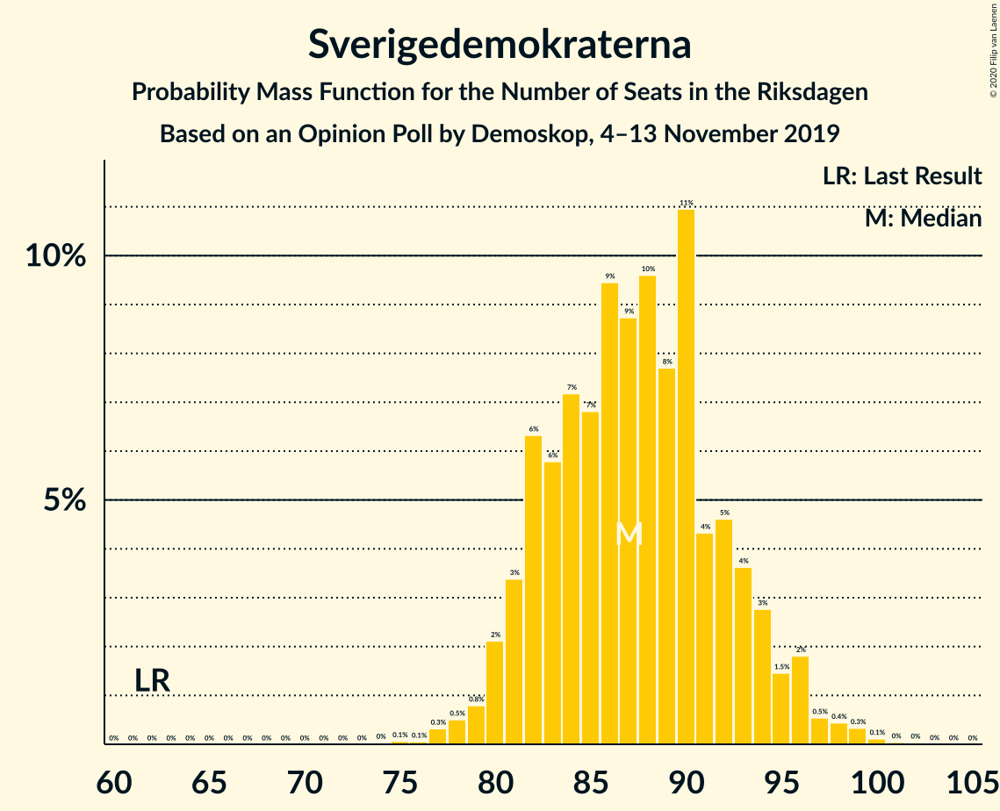
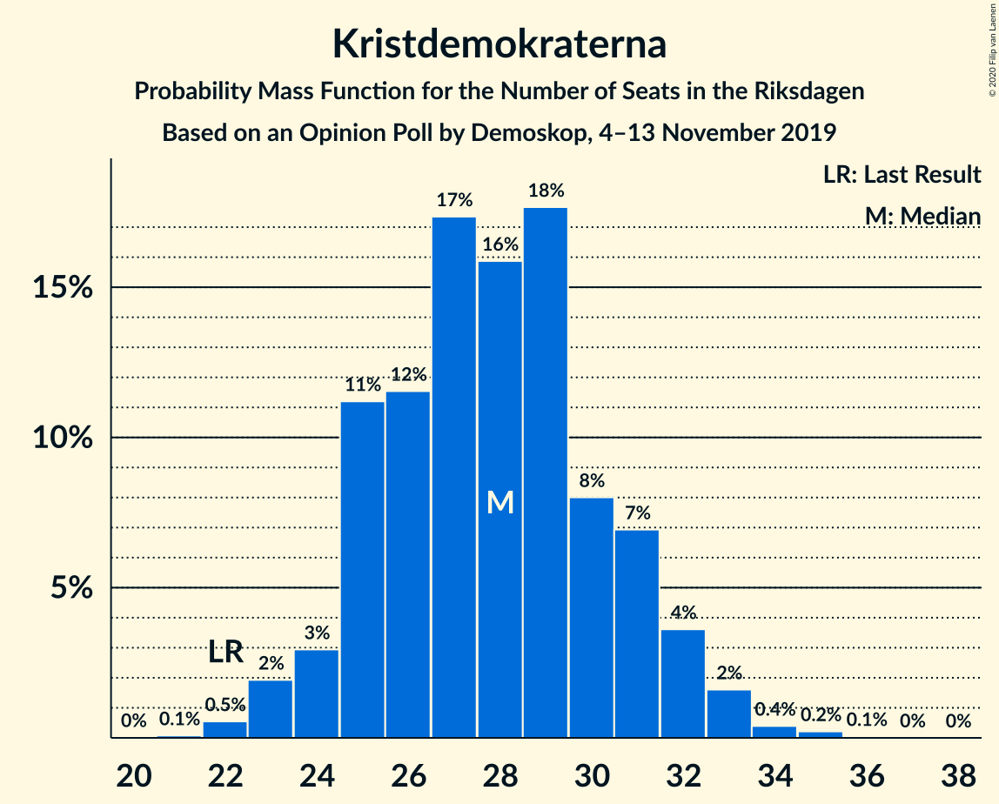
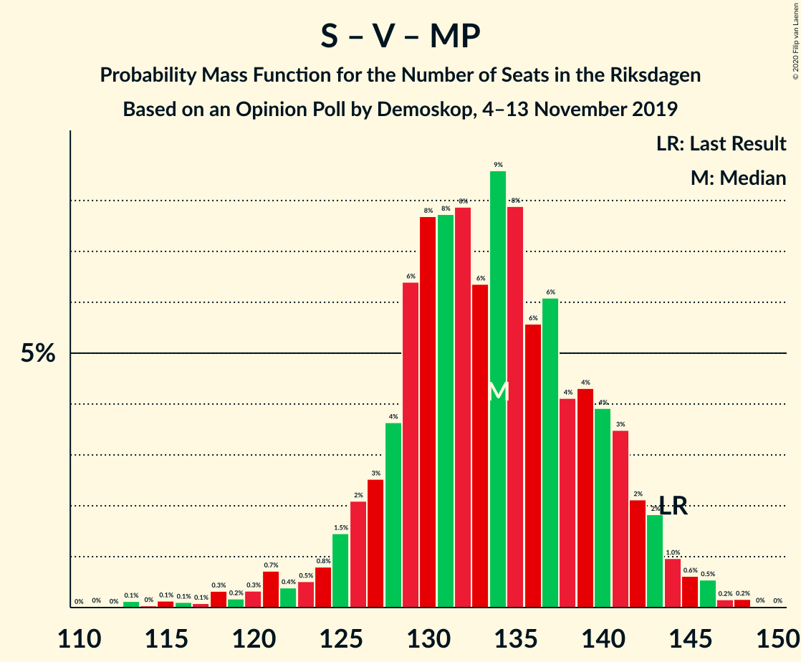
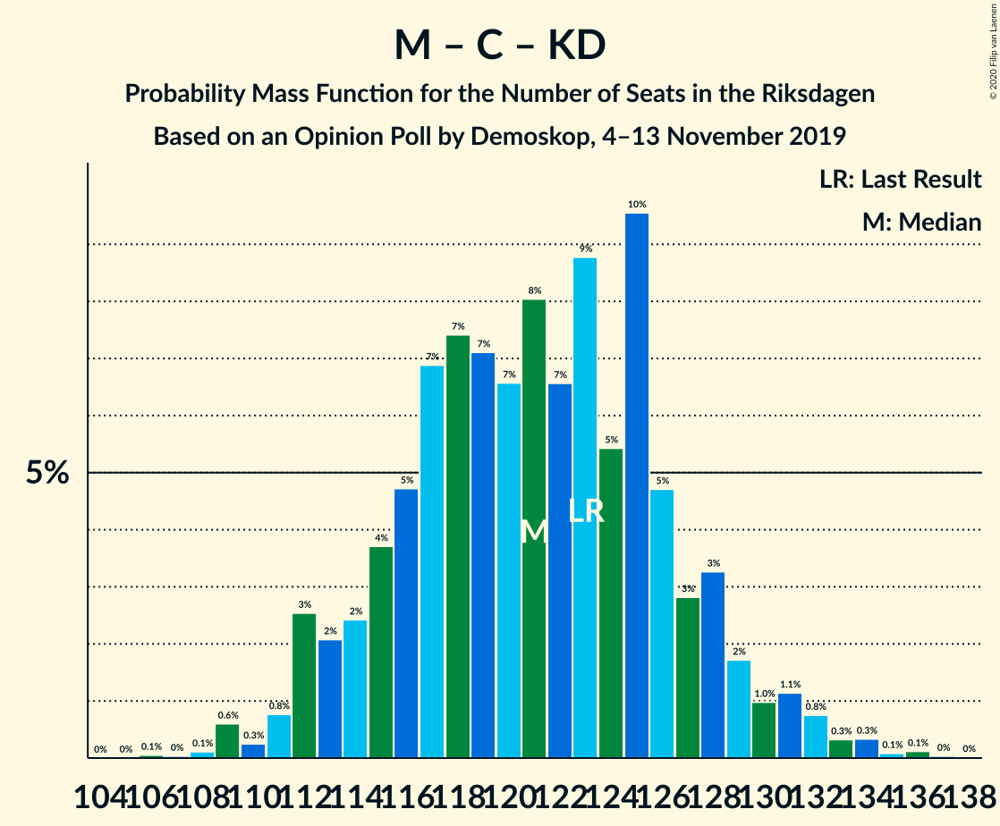
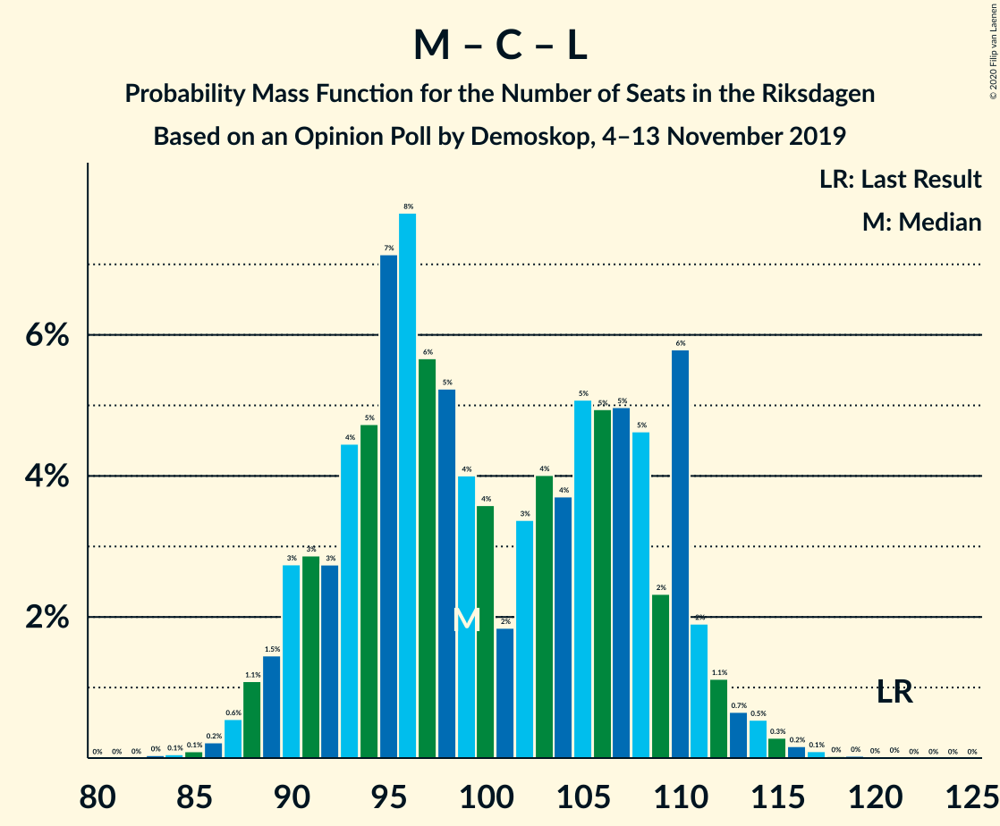

# Opinion Poll by Demoskop, 4–13 November 2019

<a href="#voting-intentions">Voting Intentions</a> | <a href="#seats">Seats</a> | <a href="#coalitions">Coalitions</a> | <a href="#technical-information">Technical Information</a>

## Voting Intentions

### Confidence Intervals

| Party | Last Result | Poll Result | 80% Confidence Interval | 90% Confidence Interval | 95% Confidence Interval | 99% Confidence Interval |
|:-----:|:-----------:|:-----------:|:-----------------------:|:-----------------------:|:-----------------------:|:-----------------------:|
| Sverigedemokraterna | 17.5% | 24.0% | 22.8–25.3% |22.5–25.6% |22.2–25.9% |21.7–26.5% |
| Sveriges socialdemokratiska arbetareparti | 28.3% | 22.2% | 21.1–23.4% |20.7–23.8% |20.5–24.1% |19.9–24.7% |
| Moderata samlingspartiet | 19.8% | 17.8% | 16.8–18.9% |16.5–19.3% |16.2–19.6% |15.7–20.1% |
| Vänsterpartiet | 8.0% | 9.8% | 9.0–10.7% |8.8–11.0% |8.6–11.2% |8.2–11.6% |
| Centerpartiet | 8.6% | 7.7% | 7.0–8.5% |6.8–8.8% |6.6–9.0% |6.3–9.4% |
| Kristdemokraterna | 6.3% | 7.6% | 6.9–8.4% |6.7–8.7% |6.5–8.9% |6.2–9.3% |
| Miljöpartiet de gröna | 4.4% | 4.8% | 4.2–5.5% |4.1–5.6% |3.9–5.8% |3.7–6.1% |
| Liberalerna | 5.5% | 3.9% | 3.4–4.5% |3.3–4.7% |3.1–4.8% |2.9–5.2% |

*Note:* The poll result column reflects the actual value used in the calculations. Published results may vary slightly, and in addition be rounded to fewer digits.

## Seats

### Confidence Intervals

| Party | Last Result | Median | 80% Confidence Interval | 90% Confidence Interval | 95% Confidence Interval | 99% Confidence Interval |
|:-----:|:-----------:|:------:|:-----------------------:|:-----------------------:|:-----------------------:|:-----------------------:|
| <a href="#sverigedemokraterna">Sverigedemokraterna</a> | 62 | 87 | 82–96 |81–96 |80–96 |78–98 |
| <a href="#sveriges-socialdemokratiska-arbetareparti">Sveriges socialdemokratiska arbetareparti</a> | 100 | 80 | 76–86 |74–88 |74–90 |72–91 |
| <a href="#moderata-samlingspartiet">Moderata samlingspartiet</a> | 70 | 65 | 61–70 |60–71 |58–72 |57–74 |
| <a href="#vänsterpartiet">Vänsterpartiet</a> | 28 | 35 | 33–38 |31–40 |31–41 |30–42 |
| <a href="#centerpartiet">Centerpartiet</a> | 31 | 29 | 25–32 |25–32 |24–33 |23–34 |
| <a href="#kristdemokraterna">Kristdemokraterna</a> | 22 | 27 | 25–31 |24–31 |23–32 |23–34 |
| <a href="#miljöpartiet-de-gröna">Miljöpartiet de gröna</a> | 16 | 18 | 15–20 |0–20 |0–21 |0–22 |
| <a href="#liberalerna">Liberalerna</a> | 20 | 0 | 0–16 |0–17 |0–18 |0–18 |

### Sverigedemokraterna

*For a full overview of the results for this party, see the [Sverigedemokraterna](party-sverigedemokraterna.html) page.*

| Number of Seats | Probability | Accumulated | Special Marks |
|:---------------:|:-----------:|:-----------:|:-------------:|
| 62 | 0% | 100% | Last Result |
| 63 | 0% | 100% |  |
| 64 | 0% | 100% |  |
| 65 | 0% | 100% |  |
| 66 | 0% | 100% |  |
| 67 | 0% | 100% |  |
| 68 | 0% | 100% |  |
| 69 | 0% | 100% |  |
| 70 | 0% | 100% |  |
| 71 | 0% | 100% |  |
| 72 | 0% | 100% |  |
| 73 | 0% | 100% |  |
| 74 | 0.2% | 100% |  |
| 75 | 0% | 99.8% |  |
| 76 | 0.1% | 99.8% |  |
| 77 | 0.1% | 99.7% |  |
| 78 | 0.4% | 99.6% |  |
| 79 | 1.1% | 99.2% |  |
| 80 | 2% | 98% |  |
| 81 | 2% | 96% |  |
| 82 | 12% | 94% |  |
| 83 | 5% | 82% |  |
| 84 | 5% | 77% |  |
| 85 | 13% | 72% |  |
| 86 | 5% | 59% |  |
| 87 | 6% | 54% | Median |
| 88 | 4% | 48% |  |
| 89 | 9% | 44% |  |
| 90 | 6% | 35% |  |
| 91 | 7% | 29% |  |
| 92 | 0.7% | 22% |  |
| 93 | 4% | 21% |  |
| 94 | 1.1% | 17% |  |
| 95 | 3% | 16% |  |
| 96 | 10% | 12% |  |
| 97 | 0.7% | 2% |  |
| 98 | 1.4% | 2% |  |
| 99 | 0.2% | 0.3% |  |
| 100 | 0% | 0.2% |  |
| 101 | 0.1% | 0.2% |  |
| 102 | 0% | 0.1% |  |
| 103 | 0% | 0% |  |

### Sveriges socialdemokratiska arbetareparti

*For a full overview of the results for this party, see the [Sveriges socialdemokratiska arbetareparti](party-sverigessocialdemokratiskaarbetareparti.html) page.*

| Number of Seats | Probability | Accumulated | Special Marks |
|:---------------:|:-----------:|:-----------:|:-------------:|
| 69 | 0% | 100% |  |
| 70 | 0.2% | 99.9% |  |
| 71 | 0.3% | 99.8% |  |
| 72 | 0.6% | 99.5% |  |
| 73 | 1.0% | 98.9% |  |
| 74 | 4% | 98% |  |
| 75 | 3% | 94% |  |
| 76 | 3% | 91% |  |
| 77 | 5% | 88% |  |
| 78 | 14% | 82% |  |
| 79 | 14% | 68% |  |
| 80 | 19% | 54% | Median |
| 81 | 7% | 35% |  |
| 82 | 4% | 28% |  |
| 83 | 3% | 24% |  |
| 84 | 6% | 21% |  |
| 85 | 3% | 15% |  |
| 86 | 3% | 12% |  |
| 87 | 2% | 8% |  |
| 88 | 2% | 7% |  |
| 89 | 2% | 5% |  |
| 90 | 2% | 3% |  |
| 91 | 1.0% | 1.2% |  |
| 92 | 0.2% | 0.3% |  |
| 93 | 0% | 0.1% |  |
| 94 | 0% | 0.1% |  |
| 95 | 0% | 0% |  |
| 96 | 0% | 0% |  |
| 97 | 0% | 0% |  |
| 98 | 0% | 0% |  |
| 99 | 0% | 0% |  |
| 100 | 0% | 0% | Last Result |

### Moderata samlingspartiet

*For a full overview of the results for this party, see the [Moderata samlingspartiet](party-moderatasamlingspartiet.html) page.*

| Number of Seats | Probability | Accumulated | Special Marks |
|:---------------:|:-----------:|:-----------:|:-------------:|
| 55 | 0.1% | 100% |  |
| 56 | 0.2% | 99.9% |  |
| 57 | 0.8% | 99.6% |  |
| 58 | 2% | 98.9% |  |
| 59 | 0.7% | 96% |  |
| 60 | 3% | 96% |  |
| 61 | 4% | 93% |  |
| 62 | 5% | 89% |  |
| 63 | 10% | 84% |  |
| 64 | 7% | 73% |  |
| 65 | 30% | 66% | Median |
| 66 | 11% | 36% |  |
| 67 | 5% | 26% |  |
| 68 | 8% | 21% |  |
| 69 | 2% | 13% |  |
| 70 | 5% | 11% | Last Result |
| 71 | 3% | 7% |  |
| 72 | 2% | 4% |  |
| 73 | 1.1% | 2% |  |
| 74 | 0.3% | 0.6% |  |
| 75 | 0.2% | 0.3% |  |
| 76 | 0.1% | 0.2% |  |
| 77 | 0.1% | 0.1% |  |
| 78 | 0% | 0% |  |

### Vänsterpartiet

*For a full overview of the results for this party, see the [Vänsterpartiet](party-vänsterpartiet.html) page.*

| Number of Seats | Probability | Accumulated | Special Marks |
|:---------------:|:-----------:|:-----------:|:-------------:|
| 28 | 0.1% | 100% | Last Result |
| 29 | 0.2% | 99.9% |  |
| 30 | 0.7% | 99.7% |  |
| 31 | 6% | 99.0% |  |
| 32 | 3% | 93% |  |
| 33 | 4% | 91% |  |
| 34 | 34% | 87% |  |
| 35 | 14% | 53% | Median |
| 36 | 3% | 39% |  |
| 37 | 9% | 36% |  |
| 38 | 19% | 27% |  |
| 39 | 3% | 8% |  |
| 40 | 2% | 6% |  |
| 41 | 3% | 4% |  |
| 42 | 0.8% | 1.3% |  |
| 43 | 0.3% | 0.5% |  |
| 44 | 0.1% | 0.2% |  |
| 45 | 0.1% | 0.1% |  |
| 46 | 0% | 0% |  |

### Centerpartiet

*For a full overview of the results for this party, see the [Centerpartiet](party-centerpartiet.html) page.*

| Number of Seats | Probability | Accumulated | Special Marks |
|:---------------:|:-----------:|:-----------:|:-------------:|
| 22 | 0.2% | 100% |  |
| 23 | 0.7% | 99.8% |  |
| 24 | 4% | 99.1% |  |
| 25 | 17% | 95% |  |
| 26 | 13% | 78% |  |
| 27 | 5% | 65% |  |
| 28 | 7% | 60% |  |
| 29 | 14% | 53% | Median |
| 30 | 19% | 39% |  |
| 31 | 7% | 20% | Last Result |
| 32 | 10% | 13% |  |
| 33 | 2% | 3% |  |
| 34 | 1.2% | 2% |  |
| 35 | 0.2% | 0.4% |  |
| 36 | 0.1% | 0.2% |  |
| 37 | 0% | 0.1% |  |
| 38 | 0% | 0% |  |

### Kristdemokraterna

*For a full overview of the results for this party, see the [Kristdemokraterna](party-kristdemokraterna.html) page.*

| Number of Seats | Probability | Accumulated | Special Marks |
|:---------------:|:-----------:|:-----------:|:-------------:|
| 21 | 0% | 100% |  |
| 22 | 0.3% | 99.9% | Last Result |
| 23 | 4% | 99.7% |  |
| 24 | 2% | 96% |  |
| 25 | 9% | 94% |  |
| 26 | 30% | 85% |  |
| 27 | 8% | 55% | Median |
| 28 | 22% | 48% |  |
| 29 | 8% | 26% |  |
| 30 | 4% | 17% |  |
| 31 | 9% | 14% |  |
| 32 | 2% | 4% |  |
| 33 | 1.1% | 2% |  |
| 34 | 0.3% | 0.7% |  |
| 35 | 0.4% | 0.4% |  |
| 36 | 0% | 0% |  |

### Miljöpartiet de gröna

*For a full overview of the results for this party, see the [Miljöpartiet de gröna](party-miljöpartietdegröna.html) page.*

| Number of Seats | Probability | Accumulated | Special Marks |
|:---------------:|:-----------:|:-----------:|:-------------:|
| 0 | 5% | 100% |  |
| 1 | 0% | 95% |  |
| 2 | 0% | 95% |  |
| 3 | 0% | 95% |  |
| 4 | 0% | 95% |  |
| 5 | 0% | 95% |  |
| 6 | 0% | 95% |  |
| 7 | 0% | 95% |  |
| 8 | 0% | 95% |  |
| 9 | 0% | 95% |  |
| 10 | 0% | 95% |  |
| 11 | 0% | 95% |  |
| 12 | 0% | 95% |  |
| 13 | 0% | 95% |  |
| 14 | 0.2% | 95% |  |
| 15 | 5% | 95% |  |
| 16 | 23% | 90% | Last Result |
| 17 | 13% | 67% |  |
| 18 | 12% | 53% | Median |
| 19 | 21% | 42% |  |
| 20 | 16% | 20% |  |
| 21 | 3% | 4% |  |
| 22 | 0.8% | 1.2% |  |
| 23 | 0.3% | 0.3% |  |
| 24 | 0% | 0.1% |  |
| 25 | 0% | 0% |  |

### Liberalerna

*For a full overview of the results for this party, see the [Liberalerna](party-liberalerna.html) page.*

| Number of Seats | Probability | Accumulated | Special Marks |
|:---------------:|:-----------:|:-----------:|:-------------:|
| 0 | 51% | 100% | Median |
| 1 | 0% | 49% |  |
| 2 | 0% | 49% |  |
| 3 | 0% | 49% |  |
| 4 | 0% | 49% |  |
| 5 | 0% | 49% |  |
| 6 | 0% | 49% |  |
| 7 | 0% | 49% |  |
| 8 | 0% | 49% |  |
| 9 | 0% | 49% |  |
| 10 | 0% | 49% |  |
| 11 | 0% | 49% |  |
| 12 | 0% | 49% |  |
| 13 | 0% | 49% |  |
| 14 | 8% | 49% |  |
| 15 | 27% | 41% |  |
| 16 | 7% | 14% |  |
| 17 | 4% | 8% |  |
| 18 | 3% | 3% |  |
| 19 | 0.1% | 0.2% |  |
| 20 | 0.1% | 0.1% | Last Result |
| 21 | 0% | 0% |  |

## Coalitions

### Confidence Intervals

| Coalition | Last Result | Median | Majority? | 80% Confidence Interval | 90% Confidence Interval | 95% Confidence Interval | 99% Confidence Interval |
|:---------:|:-----------:|:------:|:---------:|:-----------------------:|:-----------------------:|:-----------------------:|:-----------------------:|
| Sverigedemokraterna – Moderata samlingspartiet – Kristdemokraterna | 154 | 179 | 78% | 173–190 | 172–190 | 172–193 | 166–199 |
| Sveriges socialdemokratiska arbetareparti – Moderata samlingspartiet – Centerpartiet | 201 | 174 | 50% | 169–181 | 166–184 | 164–189 | 160–189 |
| Sveriges socialdemokratiska arbetareparti – Vänsterpartiet – Centerpartiet – Miljöpartiet de gröna – Liberalerna | 195 | 170 | 22% | 159–176 | 159–177 | 156–177 | 150–183 |
| Sverigedemokraterna – Moderata samlingspartiet | 132 | 151 | 0% | 146–162 | 145–162 | 144–165 | 139–169 |
| Sveriges socialdemokratiska arbetareparti – Moderata samlingspartiet | 170 | 145 | 0% | 140–152 | 139–155 | 136–157 | 133–159 |
| Sveriges socialdemokratiska arbetareparti – Centerpartiet – Miljöpartiet de gröna – Liberalerna | 167 | 134 | 0% | 124–142 | 122–143 | 120–144 | 111–146 |
| Sveriges socialdemokratiska arbetareparti – Vänsterpartiet – Miljöpartiet de gröna | 144 | 133 | 0% | 127–140 | 125–143 | 120–144 | 113–145 |
| Moderata samlingspartiet – Centerpartiet – Kristdemokraterna – Liberalerna | 143 | 130 | 0% | 120–137 | 119–139 | 118–141 | 115–143 |
| Moderata samlingspartiet – Centerpartiet – Kristdemokraterna | 123 | 121 | 0% | 115–127 | 114–131 | 113–131 | 110–136 |
| Sveriges socialdemokratiska arbetareparti – Vänsterpartiet | 128 | 115 | 0% | 110–122 | 109–126 | 107–127 | 106–130 |
| Moderata samlingspartiet – Centerpartiet – Liberalerna | 121 | 101 | 0% | 91–110 | 90–111 | 88–113 | 87–115 |
| Sveriges socialdemokratiska arbetareparti – Miljöpartiet de gröna | 116 | 97 | 0% | 92–103 | 89–106 | 86–106 | 79–109 |
| Moderata samlingspartiet – Centerpartiet | 101 | 93 | 0% | 88–99 | 87–100 | 86–101 | 82–104 |

### Sverigedemokraterna – Moderata samlingspartiet – Kristdemokraterna

| Number of Seats | Probability | Accumulated | Special Marks |
|:---------------:|:-----------:|:-----------:|:-------------:|
| 154 | 0% | 100% | Last Result |
| 155 | 0% | 100% |  |
| 156 | 0% | 100% |  |
| 157 | 0% | 100% |  |
| 158 | 0% | 100% |  |
| 159 | 0% | 100% |  |
| 160 | 0% | 100% |  |
| 161 | 0% | 100% |  |
| 162 | 0% | 100% |  |
| 163 | 0% | 100% |  |
| 164 | 0.2% | 100% |  |
| 165 | 0.1% | 99.8% |  |
| 166 | 0.4% | 99.7% |  |
| 167 | 0.1% | 99.3% |  |
| 168 | 0.3% | 99.1% |  |
| 169 | 0.3% | 98.9% |  |
| 170 | 0.4% | 98.5% |  |
| 171 | 0.3% | 98% |  |
| 172 | 6% | 98% |  |
| 173 | 10% | 92% |  |
| 174 | 3% | 82% |  |
| 175 | 3% | 78% | Majority |
| 176 | 16% | 75% |  |
| 177 | 3% | 59% |  |
| 178 | 4% | 56% |  |
| 179 | 4% | 52% | Median |
| 180 | 8% | 48% |  |
| 181 | 2% | 40% |  |
| 182 | 1.4% | 38% |  |
| 183 | 3% | 36% |  |
| 184 | 0.8% | 34% |  |
| 185 | 8% | 33% |  |
| 186 | 2% | 25% |  |
| 187 | 3% | 23% |  |
| 188 | 3% | 20% |  |
| 189 | 1.4% | 17% |  |
| 190 | 12% | 16% |  |
| 191 | 0.2% | 4% |  |
| 192 | 0.5% | 4% |  |
| 193 | 1.3% | 3% |  |
| 194 | 0.1% | 2% |  |
| 195 | 0.6% | 2% |  |
| 196 | 0% | 1.4% |  |
| 197 | 0% | 1.3% |  |
| 198 | 0.5% | 1.3% |  |
| 199 | 0.6% | 0.8% |  |
| 200 | 0.1% | 0.1% |  |
| 201 | 0% | 0.1% |  |
| 202 | 0% | 0% |  |

### Sveriges socialdemokratiska arbetareparti – Moderata samlingspartiet – Centerpartiet

| Number of Seats | Probability | Accumulated | Special Marks |
|:---------------:|:-----------:|:-----------:|:-------------:|
| 158 | 0% | 100% |  |
| 159 | 0.1% | 99.9% |  |
| 160 | 0.6% | 99.9% |  |
| 161 | 0.4% | 99.3% |  |
| 162 | 1.0% | 98.9% |  |
| 163 | 0.4% | 98% |  |
| 164 | 0.5% | 98% |  |
| 165 | 2% | 97% |  |
| 166 | 1.5% | 95% |  |
| 167 | 1.1% | 94% |  |
| 168 | 2% | 92% |  |
| 169 | 19% | 91% |  |
| 170 | 11% | 71% |  |
| 171 | 2% | 60% |  |
| 172 | 4% | 58% |  |
| 173 | 2% | 54% |  |
| 174 | 2% | 52% | Median |
| 175 | 12% | 50% | Majority |
| 176 | 2% | 38% |  |
| 177 | 17% | 36% |  |
| 178 | 7% | 19% |  |
| 179 | 0.6% | 13% |  |
| 180 | 0.6% | 12% |  |
| 181 | 2% | 11% |  |
| 182 | 2% | 9% |  |
| 183 | 0.7% | 8% |  |
| 184 | 3% | 7% |  |
| 185 | 1.0% | 4% |  |
| 186 | 0.1% | 3% |  |
| 187 | 0.1% | 3% |  |
| 188 | 0% | 3% |  |
| 189 | 2% | 3% |  |
| 190 | 0.2% | 0.4% |  |
| 191 | 0.1% | 0.2% |  |
| 192 | 0% | 0.1% |  |
| 193 | 0% | 0.1% |  |
| 194 | 0% | 0% |  |
| 195 | 0% | 0% |  |
| 196 | 0% | 0% |  |
| 197 | 0% | 0% |  |
| 198 | 0% | 0% |  |
| 199 | 0% | 0% |  |
| 200 | 0% | 0% |  |
| 201 | 0% | 0% | Last Result |

### Sveriges socialdemokratiska arbetareparti – Vänsterpartiet – Centerpartiet – Miljöpartiet de gröna – Liberalerna

| Number of Seats | Probability | Accumulated | Special Marks |
|:---------------:|:-----------:|:-----------:|:-------------:|
| 148 | 0% | 100% |  |
| 149 | 0.1% | 99.9% |  |
| 150 | 0.6% | 99.9% |  |
| 151 | 0.5% | 99.2% |  |
| 152 | 0% | 98.7% |  |
| 153 | 0% | 98.7% |  |
| 154 | 0.6% | 98.6% |  |
| 155 | 0.1% | 98% |  |
| 156 | 1.3% | 98% |  |
| 157 | 0.5% | 97% |  |
| 158 | 0.2% | 96% |  |
| 159 | 12% | 96% |  |
| 160 | 1.4% | 84% |  |
| 161 | 3% | 83% |  |
| 162 | 3% | 80% | Median |
| 163 | 2% | 77% |  |
| 164 | 8% | 75% |  |
| 165 | 0.8% | 67% |  |
| 166 | 3% | 66% |  |
| 167 | 1.4% | 64% |  |
| 168 | 2% | 62% |  |
| 169 | 8% | 60% |  |
| 170 | 4% | 52% |  |
| 171 | 4% | 48% |  |
| 172 | 3% | 44% |  |
| 173 | 16% | 41% |  |
| 174 | 3% | 25% |  |
| 175 | 3% | 22% | Majority |
| 176 | 10% | 18% |  |
| 177 | 6% | 8% |  |
| 178 | 0.3% | 2% |  |
| 179 | 0.4% | 2% |  |
| 180 | 0.3% | 1.5% |  |
| 181 | 0.3% | 1.1% |  |
| 182 | 0.1% | 0.9% |  |
| 183 | 0.4% | 0.7% |  |
| 184 | 0.1% | 0.3% |  |
| 185 | 0.2% | 0.2% |  |
| 186 | 0% | 0% |  |
| 187 | 0% | 0% |  |
| 188 | 0% | 0% |  |
| 189 | 0% | 0% |  |
| 190 | 0% | 0% |  |
| 191 | 0% | 0% |  |
| 192 | 0% | 0% |  |
| 193 | 0% | 0% |  |
| 194 | 0% | 0% |  |
| 195 | 0% | 0% | Last Result |

### Sverigedemokraterna – Moderata samlingspartiet

| Number of Seats | Probability | Accumulated | Special Marks |
|:---------------:|:-----------:|:-----------:|:-------------:|
| 132 | 0% | 100% | Last Result |
| 133 | 0% | 100% |  |
| 134 | 0% | 100% |  |
| 135 | 0% | 100% |  |
| 136 | 0% | 100% |  |
| 137 | 0% | 99.9% |  |
| 138 | 0.3% | 99.9% |  |
| 139 | 0.2% | 99.6% |  |
| 140 | 0.2% | 99.3% |  |
| 141 | 0.3% | 99.1% |  |
| 142 | 0.6% | 98.8% |  |
| 143 | 0.4% | 98% |  |
| 144 | 1.3% | 98% |  |
| 145 | 3% | 96% |  |
| 146 | 5% | 94% |  |
| 147 | 11% | 89% |  |
| 148 | 8% | 78% |  |
| 149 | 3% | 70% |  |
| 150 | 13% | 67% |  |
| 151 | 5% | 54% |  |
| 152 | 6% | 50% | Median |
| 153 | 2% | 44% |  |
| 154 | 2% | 42% |  |
| 155 | 6% | 40% |  |
| 156 | 4% | 34% |  |
| 157 | 1.1% | 30% |  |
| 158 | 2% | 29% |  |
| 159 | 11% | 27% |  |
| 160 | 0.6% | 16% |  |
| 161 | 1.0% | 15% |  |
| 162 | 11% | 14% |  |
| 163 | 0.7% | 4% |  |
| 164 | 0.1% | 3% |  |
| 165 | 0.9% | 3% |  |
| 166 | 1.2% | 2% |  |
| 167 | 0% | 0.9% |  |
| 168 | 0% | 0.8% |  |
| 169 | 0.7% | 0.8% |  |
| 170 | 0% | 0.1% |  |
| 171 | 0% | 0.1% |  |
| 172 | 0% | 0.1% |  |
| 173 | 0% | 0% |  |

### Sveriges socialdemokratiska arbetareparti – Moderata samlingspartiet

| Number of Seats | Probability | Accumulated | Special Marks |
|:---------------:|:-----------:|:-----------:|:-------------:|
| 131 | 0% | 100% |  |
| 132 | 0.4% | 99.9% |  |
| 133 | 0.6% | 99.6% |  |
| 134 | 0.3% | 98.9% |  |
| 135 | 0.1% | 98.6% |  |
| 136 | 1.1% | 98.5% |  |
| 137 | 1.2% | 97% |  |
| 138 | 1.2% | 96% |  |
| 139 | 5% | 95% |  |
| 140 | 4% | 90% |  |
| 141 | 6% | 86% |  |
| 142 | 4% | 81% |  |
| 143 | 9% | 77% |  |
| 144 | 11% | 68% |  |
| 145 | 12% | 57% | Median |
| 146 | 9% | 45% |  |
| 147 | 10% | 36% |  |
| 148 | 5% | 26% |  |
| 149 | 6% | 21% |  |
| 150 | 2% | 16% |  |
| 151 | 2% | 13% |  |
| 152 | 2% | 11% |  |
| 153 | 1.1% | 9% |  |
| 154 | 1.0% | 8% |  |
| 155 | 2% | 7% |  |
| 156 | 0.5% | 5% |  |
| 157 | 2% | 4% |  |
| 158 | 1.4% | 2% |  |
| 159 | 0.6% | 0.9% |  |
| 160 | 0.1% | 0.3% |  |
| 161 | 0% | 0.2% |  |
| 162 | 0.1% | 0.2% |  |
| 163 | 0% | 0% |  |
| 164 | 0% | 0% |  |
| 165 | 0% | 0% |  |
| 166 | 0% | 0% |  |
| 167 | 0% | 0% |  |
| 168 | 0% | 0% |  |
| 169 | 0% | 0% |  |
| 170 | 0% | 0% | Last Result |

### Sveriges socialdemokratiska arbetareparti – Centerpartiet – Miljöpartiet de gröna – Liberalerna

| Number of Seats | Probability | Accumulated | Special Marks |
|:---------------:|:-----------:|:-----------:|:-------------:|
| 110 | 0% | 100% |  |
| 111 | 0.7% | 99.9% |  |
| 112 | 0% | 99.2% |  |
| 113 | 0% | 99.2% |  |
| 114 | 0% | 99.2% |  |
| 115 | 0.1% | 99.2% |  |
| 116 | 0.1% | 99.1% |  |
| 117 | 0.1% | 99.0% |  |
| 118 | 1.1% | 99.0% |  |
| 119 | 0.3% | 98% |  |
| 120 | 0.6% | 98% |  |
| 121 | 1.0% | 97% |  |
| 122 | 1.3% | 96% |  |
| 123 | 0.8% | 95% |  |
| 124 | 4% | 94% |  |
| 125 | 8% | 90% |  |
| 126 | 4% | 81% |  |
| 127 | 6% | 78% | Median |
| 128 | 4% | 71% |  |
| 129 | 2% | 68% |  |
| 130 | 3% | 66% |  |
| 131 | 6% | 63% |  |
| 132 | 4% | 56% |  |
| 133 | 2% | 52% |  |
| 134 | 3% | 51% |  |
| 135 | 1.3% | 47% |  |
| 136 | 3% | 46% |  |
| 137 | 2% | 44% |  |
| 138 | 11% | 42% |  |
| 139 | 12% | 31% |  |
| 140 | 4% | 19% |  |
| 141 | 5% | 16% |  |
| 142 | 2% | 10% |  |
| 143 | 6% | 9% |  |
| 144 | 2% | 3% |  |
| 145 | 0.6% | 1.4% |  |
| 146 | 0.4% | 0.8% |  |
| 147 | 0.1% | 0.5% |  |
| 148 | 0.2% | 0.4% |  |
| 149 | 0.1% | 0.2% |  |
| 150 | 0.1% | 0.1% |  |
| 151 | 0% | 0% |  |
| 152 | 0% | 0% |  |
| 153 | 0% | 0% |  |
| 154 | 0% | 0% |  |
| 155 | 0% | 0% |  |
| 156 | 0% | 0% |  |
| 157 | 0% | 0% |  |
| 158 | 0% | 0% |  |
| 159 | 0% | 0% |  |
| 160 | 0% | 0% |  |
| 161 | 0% | 0% |  |
| 162 | 0% | 0% |  |
| 163 | 0% | 0% |  |
| 164 | 0% | 0% |  |
| 165 | 0% | 0% |  |
| 166 | 0% | 0% |  |
| 167 | 0% | 0% | Last Result |

### Sveriges socialdemokratiska arbetareparti – Vänsterpartiet – Miljöpartiet de gröna

| Number of Seats | Probability | Accumulated | Special Marks |
|:---------------:|:-----------:|:-----------:|:-------------:|
| 113 | 0.5% | 100% |  |
| 114 | 0% | 99.5% |  |
| 115 | 0% | 99.4% |  |
| 116 | 0% | 99.4% |  |
| 117 | 0.2% | 99.4% |  |
| 118 | 0.1% | 99.3% |  |
| 119 | 0.4% | 99.1% |  |
| 120 | 1.2% | 98.7% |  |
| 121 | 0.2% | 97% |  |
| 122 | 0.7% | 97% |  |
| 123 | 0.6% | 97% |  |
| 124 | 0.8% | 96% |  |
| 125 | 2% | 95% |  |
| 126 | 1.4% | 93% |  |
| 127 | 7% | 92% |  |
| 128 | 2% | 85% |  |
| 129 | 5% | 84% |  |
| 130 | 11% | 78% |  |
| 131 | 8% | 67% |  |
| 132 | 2% | 59% |  |
| 133 | 14% | 57% | Median |
| 134 | 8% | 43% |  |
| 135 | 13% | 35% |  |
| 136 | 2% | 21% |  |
| 137 | 5% | 20% |  |
| 138 | 2% | 14% |  |
| 139 | 2% | 13% |  |
| 140 | 1.2% | 11% |  |
| 141 | 2% | 9% |  |
| 142 | 0.5% | 7% |  |
| 143 | 3% | 7% |  |
| 144 | 2% | 3% | Last Result |
| 145 | 1.0% | 1.5% |  |
| 146 | 0.2% | 0.5% |  |
| 147 | 0% | 0.3% |  |
| 148 | 0.1% | 0.2% |  |
| 149 | 0% | 0.1% |  |
| 150 | 0% | 0% |  |

### Moderata samlingspartiet – Centerpartiet – Kristdemokraterna – Liberalerna

| Number of Seats | Probability | Accumulated | Special Marks |
|:---------------:|:-----------:|:-----------:|:-------------:|
| 110 | 0% | 100% |  |
| 111 | 0% | 99.9% |  |
| 112 | 0% | 99.9% |  |
| 113 | 0.1% | 99.9% |  |
| 114 | 0.2% | 99.8% |  |
| 115 | 0.2% | 99.6% |  |
| 116 | 0.2% | 99.4% |  |
| 117 | 1.1% | 99.1% |  |
| 118 | 3% | 98% |  |
| 119 | 3% | 96% |  |
| 120 | 6% | 93% |  |
| 121 | 4% | 87% | Median |
| 122 | 5% | 83% |  |
| 123 | 8% | 78% |  |
| 124 | 6% | 70% |  |
| 125 | 3% | 63% |  |
| 126 | 1.4% | 60% |  |
| 127 | 2% | 59% |  |
| 128 | 1.4% | 57% |  |
| 129 | 5% | 55% |  |
| 130 | 5% | 50% |  |
| 131 | 14% | 45% |  |
| 132 | 7% | 31% |  |
| 133 | 1.4% | 23% |  |
| 134 | 2% | 22% |  |
| 135 | 2% | 20% |  |
| 136 | 7% | 18% |  |
| 137 | 2% | 11% |  |
| 138 | 2% | 9% |  |
| 139 | 4% | 7% |  |
| 140 | 1.4% | 4% |  |
| 141 | 2% | 3% |  |
| 142 | 0.4% | 0.9% |  |
| 143 | 0.2% | 0.5% | Last Result |
| 144 | 0.1% | 0.3% |  |
| 145 | 0% | 0.2% |  |
| 146 | 0.1% | 0.2% |  |
| 147 | 0% | 0.1% |  |
| 148 | 0% | 0% |  |

### Moderata samlingspartiet – Centerpartiet – Kristdemokraterna

| Number of Seats | Probability | Accumulated | Special Marks |
|:---------------:|:-----------:|:-----------:|:-------------:|
| 106 | 0% | 100% |  |
| 107 | 0% | 99.9% |  |
| 108 | 0.2% | 99.9% |  |
| 109 | 0.1% | 99.8% |  |
| 110 | 0.5% | 99.7% |  |
| 111 | 0.6% | 99.2% |  |
| 112 | 1.0% | 98.6% |  |
| 113 | 0.8% | 98% |  |
| 114 | 4% | 97% |  |
| 115 | 4% | 92% |  |
| 116 | 11% | 89% |  |
| 117 | 10% | 78% |  |
| 118 | 4% | 68% |  |
| 119 | 5% | 65% |  |
| 120 | 8% | 60% |  |
| 121 | 5% | 53% | Median |
| 122 | 11% | 47% |  |
| 123 | 9% | 36% | Last Result |
| 124 | 11% | 27% |  |
| 125 | 3% | 17% |  |
| 126 | 3% | 13% |  |
| 127 | 2% | 11% |  |
| 128 | 0.9% | 9% |  |
| 129 | 1.4% | 8% |  |
| 130 | 0.3% | 7% |  |
| 131 | 4% | 6% |  |
| 132 | 0.3% | 2% |  |
| 133 | 0.4% | 2% |  |
| 134 | 0.6% | 1.3% |  |
| 135 | 0% | 0.7% |  |
| 136 | 0.6% | 0.7% |  |
| 137 | 0% | 0.1% |  |
| 138 | 0% | 0.1% |  |
| 139 | 0% | 0.1% |  |
| 140 | 0.1% | 0.1% |  |
| 141 | 0% | 0% |  |

### Sveriges socialdemokratiska arbetareparti – Vänsterpartiet

| Number of Seats | Probability | Accumulated | Special Marks |
|:---------------:|:-----------:|:-----------:|:-------------:|
| 103 | 0.1% | 100% |  |
| 104 | 0% | 99.8% |  |
| 105 | 0.1% | 99.8% |  |
| 106 | 2% | 99.7% |  |
| 107 | 0.9% | 98% |  |
| 108 | 0.8% | 97% |  |
| 109 | 5% | 96% |  |
| 110 | 2% | 92% |  |
| 111 | 4% | 90% |  |
| 112 | 8% | 86% |  |
| 113 | 13% | 78% |  |
| 114 | 10% | 65% |  |
| 115 | 6% | 55% | Median |
| 116 | 13% | 49% |  |
| 117 | 7% | 36% |  |
| 118 | 7% | 29% |  |
| 119 | 4% | 22% |  |
| 120 | 4% | 18% |  |
| 121 | 1.1% | 14% |  |
| 122 | 3% | 13% |  |
| 123 | 1.0% | 10% |  |
| 124 | 2% | 9% |  |
| 125 | 0.7% | 7% |  |
| 126 | 2% | 6% |  |
| 127 | 2% | 4% |  |
| 128 | 1.0% | 2% | Last Result |
| 129 | 0% | 1.1% |  |
| 130 | 0.7% | 1.0% |  |
| 131 | 0.1% | 0.4% |  |
| 132 | 0.2% | 0.3% |  |
| 133 | 0% | 0.1% |  |
| 134 | 0.1% | 0.1% |  |
| 135 | 0% | 0% |  |

### Moderata samlingspartiet – Centerpartiet – Liberalerna

| Number of Seats | Probability | Accumulated | Special Marks |
|:---------------:|:-----------:|:-----------:|:-------------:|
| 84 | 0% | 100% |  |
| 85 | 0% | 99.9% |  |
| 86 | 0.2% | 99.9% |  |
| 87 | 2% | 99.7% |  |
| 88 | 2% | 98% |  |
| 89 | 1.0% | 96% |  |
| 90 | 2% | 95% |  |
| 91 | 4% | 93% |  |
| 92 | 3% | 90% |  |
| 93 | 2% | 87% |  |
| 94 | 2% | 85% | Median |
| 95 | 11% | 83% |  |
| 96 | 1.3% | 72% |  |
| 97 | 5% | 71% |  |
| 98 | 7% | 66% |  |
| 99 | 3% | 59% |  |
| 100 | 5% | 57% |  |
| 101 | 2% | 52% |  |
| 102 | 2% | 50% |  |
| 103 | 3% | 48% |  |
| 104 | 4% | 45% |  |
| 105 | 12% | 41% |  |
| 106 | 10% | 30% |  |
| 107 | 2% | 19% |  |
| 108 | 1.4% | 17% |  |
| 109 | 2% | 16% |  |
| 110 | 6% | 14% |  |
| 111 | 3% | 7% |  |
| 112 | 1.5% | 4% |  |
| 113 | 0.9% | 3% |  |
| 114 | 0.8% | 2% |  |
| 115 | 0.4% | 0.9% |  |
| 116 | 0.2% | 0.4% |  |
| 117 | 0.1% | 0.3% |  |
| 118 | 0.1% | 0.2% |  |
| 119 | 0% | 0.1% |  |
| 120 | 0% | 0.1% |  |
| 121 | 0% | 0% | Last Result |

### Sveriges socialdemokratiska arbetareparti – Miljöpartiet de gröna

| Number of Seats | Probability | Accumulated | Special Marks |
|:---------------:|:-----------:|:-----------:|:-------------:|
| 77 | 0% | 100% |  |
| 78 | 0% | 99.9% |  |
| 79 | 0.6% | 99.9% |  |
| 80 | 0.1% | 99.4% |  |
| 81 | 0.8% | 99.2% |  |
| 82 | 0.1% | 98% |  |
| 83 | 0% | 98% |  |
| 84 | 0.2% | 98% |  |
| 85 | 0.2% | 98% |  |
| 86 | 0.9% | 98% |  |
| 87 | 1.1% | 97% |  |
| 88 | 0.2% | 96% |  |
| 89 | 2% | 96% |  |
| 90 | 0.7% | 94% |  |
| 91 | 2% | 94% |  |
| 92 | 5% | 92% |  |
| 93 | 2% | 87% |  |
| 94 | 7% | 85% |  |
| 95 | 2% | 78% |  |
| 96 | 11% | 76% |  |
| 97 | 21% | 65% |  |
| 98 | 2% | 44% | Median |
| 99 | 18% | 42% |  |
| 100 | 7% | 24% |  |
| 101 | 1.1% | 18% |  |
| 102 | 4% | 16% |  |
| 103 | 3% | 12% |  |
| 104 | 3% | 9% |  |
| 105 | 0.5% | 6% |  |
| 106 | 4% | 6% |  |
| 107 | 0.5% | 2% |  |
| 108 | 0.5% | 1.0% |  |
| 109 | 0.2% | 0.5% |  |
| 110 | 0.1% | 0.4% |  |
| 111 | 0.2% | 0.3% |  |
| 112 | 0% | 0.1% |  |
| 113 | 0% | 0% |  |
| 114 | 0% | 0% |  |
| 115 | 0% | 0% |  |
| 116 | 0% | 0% | Last Result |

### Moderata samlingspartiet – Centerpartiet

| Number of Seats | Probability | Accumulated | Special Marks |
|:---------------:|:-----------:|:-----------:|:-------------:|
| 81 | 0.4% | 100% |  |
| 82 | 0.1% | 99.6% |  |
| 83 | 0.3% | 99.5% |  |
| 84 | 0.3% | 99.1% |  |
| 85 | 0.5% | 98.8% |  |
| 86 | 0.9% | 98% |  |
| 87 | 3% | 97% |  |
| 88 | 6% | 94% |  |
| 89 | 4% | 88% |  |
| 90 | 14% | 85% |  |
| 91 | 11% | 71% |  |
| 92 | 7% | 60% |  |
| 93 | 2% | 52% |  |
| 94 | 4% | 50% | Median |
| 95 | 12% | 45% |  |
| 96 | 8% | 33% |  |
| 97 | 5% | 25% |  |
| 98 | 8% | 20% |  |
| 99 | 3% | 12% |  |
| 100 | 4% | 9% |  |
| 101 | 2% | 4% | Last Result |
| 102 | 1.1% | 2% |  |
| 103 | 0.7% | 1.3% |  |
| 104 | 0.3% | 0.6% |  |
| 105 | 0.1% | 0.3% |  |
| 106 | 0% | 0.2% |  |
| 107 | 0.1% | 0.1% |  |
| 108 | 0% | 0.1% |  |
| 109 | 0.1% | 0.1% |  |
| 110 | 0% | 0% |  |

## Technical Information

### Opinion Poll

+ **Polling firm:** Demoskop
+ **Commissioner(s):** —
+ **Fieldwork period:** 4–13 November 2019

### Calculations

+ **Sample size:** 2048
+ **Simulations done:** 131,072
+ **Error estimate:** 1.87%

