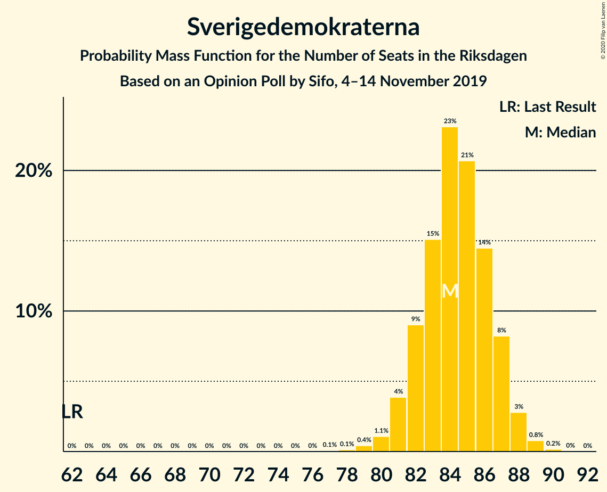
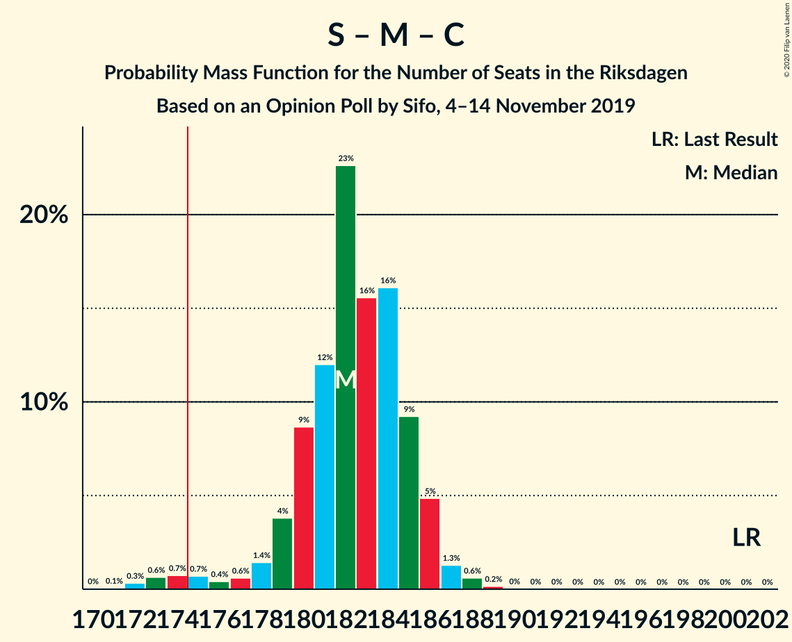

# Opinion Poll by Sifo, 4–14 November 2019

<a href="#voting-intentions">Voting Intentions</a> | <a href="#seats">Seats</a> | <a href="#coalitions">Coalitions</a> | <a href="#technical-information">Technical Information</a>

## Voting Intentions

### Confidence Intervals

| Party | Last Result | Poll Result | 80% Confidence Interval | 90% Confidence Interval | 95% Confidence Interval | 99% Confidence Interval |
|:-----:|:-----------:|:-----------:|:-----------------------:|:-----------------------:|:-----------------------:|:-----------------------:|
| Sveriges socialdemokratiska arbetareparti | 28.3% | 24.4% | 23.7–25.0% |23.6–25.1% |23.4–25.3% |23.1–25.6% |
| Sverigedemokraterna | 17.5% | 22.9% | 22.4–23.6% |22.2–23.7% |22.0–23.9% |21.8–24.2% |
| Moderata samlingspartiet | 19.8% | 17.0% | 16.4–17.5% |16.3–17.7% |16.2–17.8% |15.9–18.1% |
| Vänsterpartiet | 8.0% | 9.7% | 9.3–10.1% |9.1–10.2% |9.1–10.3% |8.9–10.5% |
| Centerpartiet | 8.6% | 8.3% | 7.9–8.7% |7.8–8.8% |7.7–8.9% |7.5–9.1% |
| Kristdemokraterna | 6.3% | 7.9% | 7.5–8.3% |7.4–8.4% |7.3–8.5% |7.1–8.7% |
| Miljöpartiet de gröna | 4.4% | 4.7% | 4.4–5.0% |4.3–5.1% |4.2–5.2% |4.1–5.3% |
| Liberalerna | 5.5% | 3.6% | 3.3–3.9% |3.3–4.0% |3.2–4.0% |3.1–4.2% |

*Note:* The poll result column reflects the actual value used in the calculations. Published results may vary slightly, and in addition be rounded to fewer digits.

## Seats

### Confidence Intervals

| Party | Last Result | Median | 80% Confidence Interval | 90% Confidence Interval | 95% Confidence Interval | 99% Confidence Interval |
|:-----:|:-----------:|:------:|:-----------------------:|:-----------------------:|:-----------------------:|:-----------------------:|
| <a href="#sveriges-socialdemokratiska-arbetareparti">Sveriges socialdemokratiska arbetareparti</a> | 100 | 90 | 87–92 |86–93 |86–93 |84–94 |
| <a href="#sverigedemokraterna">Sverigedemokraterna</a> | 62 | 84 | 82–87 |81–87 |81–88 |79–89 |
| <a href="#moderata-samlingspartiet">Moderata samlingspartiet</a> | 70 | 63 | 60–64 |60–65 |59–66 |58–67 |
| <a href="#vänsterpartiet">Vänsterpartiet</a> | 28 | 36 | 34–37 |33–38 |33–38 |33–39 |
| <a href="#centerpartiet">Centerpartiet</a> | 31 | 30 | 29–32 |29–32 |28–33 |28–33 |
| <a href="#kristdemokraterna">Kristdemokraterna</a> | 22 | 29 | 28–31 |27–31 |27–31 |26–32 |
| <a href="#miljöpartiet-de-gröna">Miljöpartiet de gröna</a> | 16 | 17 | 16–18 |16–19 |16–19 |15–19 |
| <a href="#liberalerna">Liberalerna</a> | 20 | 0 | 0 |0 |0–14 |0–15 |

### Sveriges socialdemokratiska arbetareparti

*For a full overview of the results for this party, see the [Sveriges socialdemokratiska arbetareparti](party-sverigessocialdemokratiskaarbetareparti.html) page.*

| Number of Seats | Probability | Accumulated | Special Marks |
|:---------------:|:-----------:|:-----------:|:-------------:|
| 82 | 0.1% | 100% |  |
| 83 | 0.3% | 99.9% |  |
| 84 | 0.5% | 99.6% |  |
| 85 | 1.5% | 99.1% |  |
| 86 | 4% | 98% |  |
| 87 | 7% | 94% |  |
| 88 | 20% | 86% |  |
| 89 | 15% | 66% |  |
| 90 | 22% | 51% | Median |
| 91 | 14% | 29% |  |
| 92 | 9% | 15% |  |
| 93 | 5% | 7% |  |
| 94 | 1.2% | 1.5% |  |
| 95 | 0.2% | 0.3% |  |
| 96 | 0.1% | 0.1% |  |
| 97 | 0% | 0% |  |
| 98 | 0% | 0% |  |
| 99 | 0% | 0% |  |
| 100 | 0% | 0% | Last Result |

### Sverigedemokraterna

*For a full overview of the results for this party, see the [Sverigedemokraterna](party-sverigedemokraterna.html) page.*

| Number of Seats | Probability | Accumulated | Special Marks |
|:---------------:|:-----------:|:-----------:|:-------------:|
| 62 | 0% | 100% | Last Result |
| 63 | 0% | 100% |  |
| 64 | 0% | 100% |  |
| 65 | 0% | 100% |  |
| 66 | 0% | 100% |  |
| 67 | 0% | 100% |  |
| 68 | 0% | 100% |  |
| 69 | 0% | 100% |  |
| 70 | 0% | 100% |  |
| 71 | 0% | 100% |  |
| 72 | 0% | 100% |  |
| 73 | 0% | 100% |  |
| 74 | 0% | 100% |  |
| 75 | 0% | 100% |  |
| 76 | 0% | 100% |  |
| 77 | 0.1% | 100% |  |
| 78 | 0.1% | 99.9% |  |
| 79 | 0.4% | 99.8% |  |
| 80 | 1.1% | 99.4% |  |
| 81 | 4% | 98% |  |
| 82 | 9% | 94% |  |
| 83 | 15% | 85% |  |
| 84 | 23% | 70% | Median |
| 85 | 21% | 47% |  |
| 86 | 14% | 26% |  |
| 87 | 8% | 12% |  |
| 88 | 3% | 4% |  |
| 89 | 0.8% | 1.0% |  |
| 90 | 0.2% | 0.2% |  |
| 91 | 0% | 0% |  |

### Moderata samlingspartiet

*For a full overview of the results for this party, see the [Moderata samlingspartiet](party-moderatasamlingspartiet.html) page.*

| Number of Seats | Probability | Accumulated | Special Marks |
|:---------------:|:-----------:|:-----------:|:-------------:|
| 57 | 0.3% | 100% |  |
| 58 | 0.7% | 99.7% |  |
| 59 | 3% | 98.9% |  |
| 60 | 8% | 96% |  |
| 61 | 18% | 88% |  |
| 62 | 19% | 70% |  |
| 63 | 26% | 51% | Median |
| 64 | 16% | 25% |  |
| 65 | 6% | 9% |  |
| 66 | 2% | 3% |  |
| 67 | 0.5% | 0.6% |  |
| 68 | 0% | 0.1% |  |
| 69 | 0% | 0% |  |
| 70 | 0% | 0% | Last Result |

### Vänsterpartiet

*For a full overview of the results for this party, see the [Vänsterpartiet](party-vänsterpartiet.html) page.*

| Number of Seats | Probability | Accumulated | Special Marks |
|:---------------:|:-----------:|:-----------:|:-------------:|
| 28 | 0% | 100% | Last Result |
| 29 | 0% | 100% |  |
| 30 | 0% | 100% |  |
| 31 | 0% | 100% |  |
| 32 | 0.4% | 100% |  |
| 33 | 5% | 99.5% |  |
| 34 | 16% | 95% |  |
| 35 | 21% | 79% |  |
| 36 | 30% | 57% | Median |
| 37 | 21% | 27% |  |
| 38 | 6% | 6% |  |
| 39 | 0.5% | 0.6% |  |
| 40 | 0.1% | 0.1% |  |
| 41 | 0% | 0% |  |

### Centerpartiet

*For a full overview of the results for this party, see the [Centerpartiet](party-centerpartiet.html) page.*

| Number of Seats | Probability | Accumulated | Special Marks |
|:---------------:|:-----------:|:-----------:|:-------------:|
| 27 | 0.4% | 100% |  |
| 28 | 4% | 99.6% |  |
| 29 | 18% | 95% |  |
| 30 | 28% | 77% | Median |
| 31 | 28% | 49% | Last Result |
| 32 | 17% | 21% |  |
| 33 | 4% | 4% |  |
| 34 | 0.4% | 0.5% |  |
| 35 | 0% | 0% |  |

### Kristdemokraterna

*For a full overview of the results for this party, see the [Kristdemokraterna](party-kristdemokraterna.html) page.*

| Number of Seats | Probability | Accumulated | Special Marks |
|:---------------:|:-----------:|:-----------:|:-------------:|
| 22 | 0% | 100% | Last Result |
| 23 | 0% | 100% |  |
| 24 | 0% | 100% |  |
| 25 | 0.1% | 100% |  |
| 26 | 1.1% | 99.9% |  |
| 27 | 8% | 98.9% |  |
| 28 | 30% | 91% |  |
| 29 | 26% | 61% | Median |
| 30 | 24% | 34% |  |
| 31 | 9% | 10% |  |
| 32 | 1.0% | 1.2% |  |
| 33 | 0.2% | 0.2% |  |
| 34 | 0% | 0% |  |

### Miljöpartiet de gröna

*For a full overview of the results for this party, see the [Miljöpartiet de gröna](party-miljöpartietdegröna.html) page.*

| Number of Seats | Probability | Accumulated | Special Marks |
|:---------------:|:-----------:|:-----------:|:-------------:|
| 0 | 0.1% | 100% |  |
| 1 | 0% | 99.9% |  |
| 2 | 0% | 99.9% |  |
| 3 | 0% | 99.9% |  |
| 4 | 0% | 99.9% |  |
| 5 | 0% | 99.9% |  |
| 6 | 0% | 99.9% |  |
| 7 | 0% | 99.9% |  |
| 8 | 0% | 99.9% |  |
| 9 | 0% | 99.9% |  |
| 10 | 0% | 99.9% |  |
| 11 | 0% | 99.9% |  |
| 12 | 0% | 99.9% |  |
| 13 | 0% | 99.9% |  |
| 14 | 0% | 99.9% |  |
| 15 | 2% | 99.9% |  |
| 16 | 20% | 98% | Last Result |
| 17 | 38% | 77% | Median |
| 18 | 32% | 39% |  |
| 19 | 7% | 7% |  |
| 20 | 0.4% | 0.4% |  |
| 21 | 0% | 0% |  |

### Liberalerna

*For a full overview of the results for this party, see the [Liberalerna](party-liberalerna.html) page.*

| Number of Seats | Probability | Accumulated | Special Marks |
|:---------------:|:-----------:|:-----------:|:-------------:|
| 0 | 97% | 100% | Median |
| 1 | 0% | 3% |  |
| 2 | 0% | 3% |  |
| 3 | 0% | 3% |  |
| 4 | 0% | 3% |  |
| 5 | 0% | 3% |  |
| 6 | 0% | 3% |  |
| 7 | 0% | 3% |  |
| 8 | 0% | 3% |  |
| 9 | 0% | 3% |  |
| 10 | 0% | 3% |  |
| 11 | 0% | 3% |  |
| 12 | 0% | 3% |  |
| 13 | 0% | 3% |  |
| 14 | 2% | 3% |  |
| 15 | 1.0% | 1.0% |  |
| 16 | 0% | 0% |  |
| 17 | 0% | 0% |  |
| 18 | 0% | 0% |  |
| 19 | 0% | 0% |  |
| 20 | 0% | 0% | Last Result |

## Coalitions

### Confidence Intervals

| Coalition | Last Result | Median | Majority? | 80% Confidence Interval | 90% Confidence Interval | 95% Confidence Interval | 99% Confidence Interval |
|:---------:|:-----------:|:------:|:---------:|:-----------------------:|:-----------------------:|:-----------------------:|:-----------------------:|
| Sveriges socialdemokratiska arbetareparti – Moderata samlingspartiet – Centerpartiet | 201 | 182 | 98% | 180–185 | 179–186 | 175–186 | 173–188 |
| Sverigedemokraterna – Moderata samlingspartiet – Kristdemokraterna | 154 | 176 | 73% | 173–179 | 171–179 | 170–180 | 167–181 |
| Sveriges socialdemokratiska arbetareparti – Vänsterpartiet – Centerpartiet – Miljöpartiet de gröna – Liberalerna | 195 | 173 | 27% | 170–176 | 170–178 | 169–179 | 168–182 |
| Sveriges socialdemokratiska arbetareparti – Moderata samlingspartiet | 170 | 152 | 0% | 149–154 | 148–156 | 146–156 | 143–157 |
| Sverigedemokraterna – Moderata samlingspartiet | 132 | 147 | 0% | 144–149 | 143–150 | 141–151 | 140–152 |
| Sveriges socialdemokratiska arbetareparti – Vänsterpartiet – Miljöpartiet de gröna | 144 | 142 | 0% | 139–145 | 138–146 | 137–147 | 135–148 |
| Sveriges socialdemokratiska arbetareparti – Centerpartiet – Miljöpartiet de gröna – Liberalerna | 167 | 137 | 0% | 135–140 | 134–142 | 134–145 | 132–148 |
| Moderata samlingspartiet – Centerpartiet – Kristdemokraterna – Liberalerna | 143 | 122 | 0% | 119–125 | 119–126 | 118–130 | 117–133 |
| Sveriges socialdemokratiska arbetareparti – Vänsterpartiet | 128 | 125 | 0% | 122–128 | 121–129 | 120–129 | 118–130 |
| Moderata samlingspartiet – Centerpartiet – Kristdemokraterna | 123 | 122 | 0% | 119–125 | 118–125 | 117–126 | 115–127 |
| Sveriges socialdemokratiska arbetareparti – Miljöpartiet de gröna | 116 | 107 | 0% | 104–109 | 103–110 | 102–111 | 101–112 |
| Moderata samlingspartiet – Centerpartiet – Liberalerna | 121 | 93 | 0% | 91–96 | 90–97 | 89–102 | 88–105 |
| Moderata samlingspartiet – Centerpartiet | 101 | 93 | 0% | 90–95 | 90–96 | 89–97 | 87–98 |

### Sveriges socialdemokratiska arbetareparti – Moderata samlingspartiet – Centerpartiet

| Number of Seats | Probability | Accumulated | Special Marks |
|:---------------:|:-----------:|:-----------:|:-------------:|
| 171 | 0.1% | 100% |  |
| 172 | 0.3% | 99.9% |  |
| 173 | 0.6% | 99.6% |  |
| 174 | 0.7% | 98.9% |  |
| 175 | 0.7% | 98% | Majority |
| 176 | 0.4% | 97% |  |
| 177 | 0.6% | 97% |  |
| 178 | 1.4% | 96% |  |
| 179 | 4% | 95% |  |
| 180 | 9% | 91% |  |
| 181 | 12% | 83% |  |
| 182 | 23% | 71% |  |
| 183 | 16% | 48% | Median |
| 184 | 16% | 32% |  |
| 185 | 9% | 16% |  |
| 186 | 5% | 7% |  |
| 187 | 1.3% | 2% |  |
| 188 | 0.6% | 0.9% |  |
| 189 | 0.2% | 0.3% |  |
| 190 | 0% | 0.1% |  |
| 191 | 0% | 0.1% |  |
| 192 | 0% | 0% |  |
| 193 | 0% | 0% |  |
| 194 | 0% | 0% |  |
| 195 | 0% | 0% |  |
| 196 | 0% | 0% |  |
| 197 | 0% | 0% |  |
| 198 | 0% | 0% |  |
| 199 | 0% | 0% |  |
| 200 | 0% | 0% |  |
| 201 | 0% | 0% | Last Result |

### Sverigedemokraterna – Moderata samlingspartiet – Kristdemokraterna

| Number of Seats | Probability | Accumulated | Special Marks |
|:---------------:|:-----------:|:-----------:|:-------------:|
| 154 | 0% | 100% | Last Result |
| 155 | 0% | 100% |  |
| 156 | 0% | 100% |  |
| 157 | 0% | 100% |  |
| 158 | 0% | 100% |  |
| 159 | 0% | 100% |  |
| 160 | 0% | 100% |  |
| 161 | 0% | 100% |  |
| 162 | 0% | 100% |  |
| 163 | 0% | 100% |  |
| 164 | 0% | 100% |  |
| 165 | 0.1% | 100% |  |
| 166 | 0.2% | 99.9% |  |
| 167 | 0.2% | 99.6% |  |
| 168 | 1.2% | 99.4% |  |
| 169 | 0.4% | 98% |  |
| 170 | 0.8% | 98% |  |
| 171 | 2% | 97% |  |
| 172 | 3% | 95% |  |
| 173 | 9% | 92% |  |
| 174 | 9% | 82% |  |
| 175 | 12% | 73% | Majority |
| 176 | 18% | 61% | Median |
| 177 | 22% | 43% |  |
| 178 | 10% | 21% |  |
| 179 | 6% | 11% |  |
| 180 | 3% | 5% |  |
| 181 | 1.0% | 1.3% |  |
| 182 | 0.2% | 0.3% |  |
| 183 | 0% | 0.1% |  |
| 184 | 0% | 0.1% |  |
| 185 | 0% | 0% |  |

### Sveriges socialdemokratiska arbetareparti – Vänsterpartiet – Centerpartiet – Miljöpartiet de gröna – Liberalerna

| Number of Seats | Probability | Accumulated | Special Marks |
|:---------------:|:-----------:|:-----------:|:-------------:|
| 165 | 0% | 100% |  |
| 166 | 0% | 99.9% |  |
| 167 | 0.2% | 99.9% |  |
| 168 | 1.0% | 99.7% |  |
| 169 | 3% | 98.7% |  |
| 170 | 6% | 95% |  |
| 171 | 10% | 89% |  |
| 172 | 22% | 79% |  |
| 173 | 18% | 57% | Median |
| 174 | 12% | 39% |  |
| 175 | 9% | 27% | Majority |
| 176 | 9% | 18% |  |
| 177 | 3% | 8% |  |
| 178 | 2% | 5% |  |
| 179 | 0.8% | 3% |  |
| 180 | 0.4% | 2% |  |
| 181 | 1.2% | 2% |  |
| 182 | 0.2% | 0.6% |  |
| 183 | 0.2% | 0.4% |  |
| 184 | 0.1% | 0.1% |  |
| 185 | 0% | 0% |  |
| 186 | 0% | 0% |  |
| 187 | 0% | 0% |  |
| 188 | 0% | 0% |  |
| 189 | 0% | 0% |  |
| 190 | 0% | 0% |  |
| 191 | 0% | 0% |  |
| 192 | 0% | 0% |  |
| 193 | 0% | 0% |  |
| 194 | 0% | 0% |  |
| 195 | 0% | 0% | Last Result |

### Sveriges socialdemokratiska arbetareparti – Moderata samlingspartiet

| Number of Seats | Probability | Accumulated | Special Marks |
|:---------------:|:-----------:|:-----------:|:-------------:|
| 142 | 0.2% | 100% |  |
| 143 | 0.3% | 99.8% |  |
| 144 | 0.4% | 99.5% |  |
| 145 | 1.4% | 99.1% |  |
| 146 | 0.5% | 98% |  |
| 147 | 1.0% | 97% |  |
| 148 | 2% | 96% |  |
| 149 | 9% | 94% |  |
| 150 | 8% | 85% |  |
| 151 | 19% | 77% |  |
| 152 | 20% | 58% |  |
| 153 | 10% | 38% | Median |
| 154 | 19% | 28% |  |
| 155 | 3% | 9% |  |
| 156 | 5% | 6% |  |
| 157 | 0.9% | 1.3% |  |
| 158 | 0.3% | 0.4% |  |
| 159 | 0.1% | 0.1% |  |
| 160 | 0% | 0% |  |
| 161 | 0% | 0% |  |
| 162 | 0% | 0% |  |
| 163 | 0% | 0% |  |
| 164 | 0% | 0% |  |
| 165 | 0% | 0% |  |
| 166 | 0% | 0% |  |
| 167 | 0% | 0% |  |
| 168 | 0% | 0% |  |
| 169 | 0% | 0% |  |
| 170 | 0% | 0% | Last Result |

### Sverigedemokraterna – Moderata samlingspartiet

| Number of Seats | Probability | Accumulated | Special Marks |
|:---------------:|:-----------:|:-----------:|:-------------:|
| 132 | 0% | 100% | Last Result |
| 133 | 0% | 100% |  |
| 134 | 0% | 100% |  |
| 135 | 0% | 100% |  |
| 136 | 0% | 100% |  |
| 137 | 0.1% | 100% |  |
| 138 | 0.2% | 99.9% |  |
| 139 | 0.1% | 99.7% |  |
| 140 | 1.0% | 99.5% |  |
| 141 | 1.3% | 98.5% |  |
| 142 | 1.3% | 97% |  |
| 143 | 4% | 96% |  |
| 144 | 8% | 92% |  |
| 145 | 11% | 84% |  |
| 146 | 12% | 73% |  |
| 147 | 20% | 61% | Median |
| 148 | 19% | 41% |  |
| 149 | 13% | 22% |  |
| 150 | 6% | 9% |  |
| 151 | 2% | 3% |  |
| 152 | 0.8% | 1.1% |  |
| 153 | 0.2% | 0.3% |  |
| 154 | 0% | 0.1% |  |
| 155 | 0% | 0% |  |

### Sveriges socialdemokratiska arbetareparti – Vänsterpartiet – Miljöpartiet de gröna

| Number of Seats | Probability | Accumulated | Special Marks |
|:---------------:|:-----------:|:-----------:|:-------------:|
| 132 | 0.1% | 100% |  |
| 133 | 0.1% | 99.9% |  |
| 134 | 0.3% | 99.8% |  |
| 135 | 0.6% | 99.5% |  |
| 136 | 0.4% | 98.9% |  |
| 137 | 1.3% | 98.5% |  |
| 138 | 3% | 97% |  |
| 139 | 6% | 95% |  |
| 140 | 13% | 89% |  |
| 141 | 11% | 76% |  |
| 142 | 18% | 65% |  |
| 143 | 15% | 46% | Median |
| 144 | 11% | 31% | Last Result |
| 145 | 11% | 20% |  |
| 146 | 7% | 10% |  |
| 147 | 2% | 3% |  |
| 148 | 0.7% | 0.8% |  |
| 149 | 0.1% | 0.1% |  |
| 150 | 0% | 0% |  |

### Sveriges socialdemokratiska arbetareparti – Centerpartiet – Miljöpartiet de gröna – Liberalerna

| Number of Seats | Probability | Accumulated | Special Marks |
|:---------------:|:-----------:|:-----------:|:-------------:|
| 127 | 0% | 100% |  |
| 128 | 0% | 99.9% |  |
| 129 | 0% | 99.9% |  |
| 130 | 0% | 99.9% |  |
| 131 | 0.2% | 99.9% |  |
| 132 | 0.3% | 99.7% |  |
| 133 | 2% | 99.4% |  |
| 134 | 5% | 98% |  |
| 135 | 10% | 92% |  |
| 136 | 17% | 83% |  |
| 137 | 19% | 65% | Median |
| 138 | 15% | 46% |  |
| 139 | 14% | 32% |  |
| 140 | 9% | 17% |  |
| 141 | 4% | 9% |  |
| 142 | 1.4% | 5% |  |
| 143 | 0.5% | 4% |  |
| 144 | 0.6% | 3% |  |
| 145 | 0.4% | 3% |  |
| 146 | 0.9% | 2% |  |
| 147 | 0.7% | 1.2% |  |
| 148 | 0.2% | 0.5% |  |
| 149 | 0.2% | 0.4% |  |
| 150 | 0.1% | 0.2% |  |
| 151 | 0% | 0% |  |
| 152 | 0% | 0% |  |
| 153 | 0% | 0% |  |
| 154 | 0% | 0% |  |
| 155 | 0% | 0% |  |
| 156 | 0% | 0% |  |
| 157 | 0% | 0% |  |
| 158 | 0% | 0% |  |
| 159 | 0% | 0% |  |
| 160 | 0% | 0% |  |
| 161 | 0% | 0% |  |
| 162 | 0% | 0% |  |
| 163 | 0% | 0% |  |
| 164 | 0% | 0% |  |
| 165 | 0% | 0% |  |
| 166 | 0% | 0% |  |
| 167 | 0% | 0% | Last Result |

### Moderata samlingspartiet – Centerpartiet – Kristdemokraterna – Liberalerna

| Number of Seats | Probability | Accumulated | Special Marks |
|:---------------:|:-----------:|:-----------:|:-------------:|
| 116 | 0.1% | 100% |  |
| 117 | 1.2% | 99.9% |  |
| 118 | 4% | 98.7% |  |
| 119 | 7% | 95% |  |
| 120 | 9% | 88% |  |
| 121 | 18% | 80% |  |
| 122 | 18% | 62% | Median |
| 123 | 18% | 44% |  |
| 124 | 11% | 25% |  |
| 125 | 7% | 14% |  |
| 126 | 3% | 8% |  |
| 127 | 1.4% | 5% |  |
| 128 | 0.4% | 3% |  |
| 129 | 0.2% | 3% |  |
| 130 | 0.9% | 3% |  |
| 131 | 0.6% | 2% |  |
| 132 | 0.6% | 1.3% |  |
| 133 | 0.4% | 0.7% |  |
| 134 | 0.1% | 0.3% |  |
| 135 | 0.1% | 0.2% |  |
| 136 | 0% | 0% |  |
| 137 | 0% | 0% |  |
| 138 | 0% | 0% |  |
| 139 | 0% | 0% |  |
| 140 | 0% | 0% |  |
| 141 | 0% | 0% |  |
| 142 | 0% | 0% |  |
| 143 | 0% | 0% | Last Result |

### Sveriges socialdemokratiska arbetareparti – Vänsterpartiet

| Number of Seats | Probability | Accumulated | Special Marks |
|:---------------:|:-----------:|:-----------:|:-------------:|
| 116 | 0% | 100% |  |
| 117 | 0.3% | 99.9% |  |
| 118 | 0.3% | 99.6% |  |
| 119 | 0.7% | 99.3% |  |
| 120 | 2% | 98.6% |  |
| 121 | 2% | 97% |  |
| 122 | 7% | 95% |  |
| 123 | 12% | 88% |  |
| 124 | 16% | 76% |  |
| 125 | 12% | 59% |  |
| 126 | 20% | 47% | Median |
| 127 | 14% | 28% |  |
| 128 | 6% | 13% | Last Result |
| 129 | 5% | 7% |  |
| 130 | 2% | 2% |  |
| 131 | 0.2% | 0.2% |  |
| 132 | 0% | 0.1% |  |
| 133 | 0% | 0.1% |  |
| 134 | 0% | 0% |  |

### Moderata samlingspartiet – Centerpartiet – Kristdemokraterna

| Number of Seats | Probability | Accumulated | Special Marks |
|:---------------:|:-----------:|:-----------:|:-------------:|
| 113 | 0.2% | 100% |  |
| 114 | 0.2% | 99.8% |  |
| 115 | 0.2% | 99.5% |  |
| 116 | 1.0% | 99.3% |  |
| 117 | 2% | 98% |  |
| 118 | 4% | 97% |  |
| 119 | 7% | 92% |  |
| 120 | 9% | 85% |  |
| 121 | 18% | 76% |  |
| 122 | 18% | 58% | Median |
| 123 | 18% | 40% | Last Result |
| 124 | 11% | 22% |  |
| 125 | 7% | 11% |  |
| 126 | 3% | 4% |  |
| 127 | 1.2% | 2% |  |
| 128 | 0.2% | 0.3% |  |
| 129 | 0.1% | 0.1% |  |
| 130 | 0% | 0% |  |

### Sveriges socialdemokratiska arbetareparti – Miljöpartiet de gröna

| Number of Seats | Probability | Accumulated | Special Marks |
|:---------------:|:-----------:|:-----------:|:-------------:|
| 95 | 0% | 100% |  |
| 96 | 0% | 99.9% |  |
| 97 | 0% | 99.9% |  |
| 98 | 0% | 99.9% |  |
| 99 | 0.1% | 99.9% |  |
| 100 | 0.2% | 99.7% |  |
| 101 | 0.8% | 99.5% |  |
| 102 | 1.4% | 98.7% |  |
| 103 | 4% | 97% |  |
| 104 | 7% | 94% |  |
| 105 | 16% | 87% |  |
| 106 | 18% | 71% |  |
| 107 | 19% | 52% | Median |
| 108 | 13% | 33% |  |
| 109 | 11% | 20% |  |
| 110 | 7% | 10% |  |
| 111 | 2% | 3% |  |
| 112 | 0.8% | 0.9% |  |
| 113 | 0.1% | 0.1% |  |
| 114 | 0% | 0% |  |
| 115 | 0% | 0% |  |
| 116 | 0% | 0% | Last Result |

### Moderata samlingspartiet – Centerpartiet – Liberalerna

| Number of Seats | Probability | Accumulated | Special Marks |
|:---------------:|:-----------:|:-----------:|:-------------:|
| 87 | 0.1% | 100% |  |
| 88 | 0.6% | 99.9% |  |
| 89 | 2% | 99.3% |  |
| 90 | 5% | 97% |  |
| 91 | 14% | 92% |  |
| 92 | 15% | 78% |  |
| 93 | 20% | 63% | Median |
| 94 | 18% | 43% |  |
| 95 | 14% | 25% |  |
| 96 | 5% | 11% |  |
| 97 | 2% | 6% |  |
| 98 | 0.6% | 4% |  |
| 99 | 0.3% | 3% |  |
| 100 | 0% | 3% |  |
| 101 | 0.3% | 3% |  |
| 102 | 0.9% | 3% |  |
| 103 | 0.3% | 2% |  |
| 104 | 0.9% | 2% |  |
| 105 | 0.3% | 0.7% |  |
| 106 | 0.3% | 0.4% |  |
| 107 | 0.1% | 0.1% |  |
| 108 | 0% | 0% |  |
| 109 | 0% | 0% |  |
| 110 | 0% | 0% |  |
| 111 | 0% | 0% |  |
| 112 | 0% | 0% |  |
| 113 | 0% | 0% |  |
| 114 | 0% | 0% |  |
| 115 | 0% | 0% |  |
| 116 | 0% | 0% |  |
| 117 | 0% | 0% |  |
| 118 | 0% | 0% |  |
| 119 | 0% | 0% |  |
| 120 | 0% | 0% |  |
| 121 | 0% | 0% | Last Result |

### Moderata samlingspartiet – Centerpartiet

| Number of Seats | Probability | Accumulated | Special Marks |
|:---------------:|:-----------:|:-----------:|:-------------:|
| 85 | 0.2% | 100% |  |
| 86 | 0.1% | 99.8% |  |
| 87 | 0.5% | 99.7% |  |
| 88 | 2% | 99.2% |  |
| 89 | 2% | 98% |  |
| 90 | 6% | 95% |  |
| 91 | 14% | 89% |  |
| 92 | 16% | 75% |  |
| 93 | 20% | 60% | Median |
| 94 | 18% | 40% |  |
| 95 | 14% | 22% |  |
| 96 | 5% | 8% |  |
| 97 | 2% | 3% |  |
| 98 | 0.6% | 0.7% |  |
| 99 | 0.1% | 0.2% |  |
| 100 | 0% | 0% |  |
| 101 | 0% | 0% | Last Result |

## Technical Information

### Opinion Poll

+ **Polling firm:** Sifo
+ **Commissioner(s):** —
+ **Fieldwork period:** 4–14 November 2019

### Calculations

+ **Sample size:** 8175
+ **Simulations done:** 1,048,576
+ **Error estimate:** 0.73%

