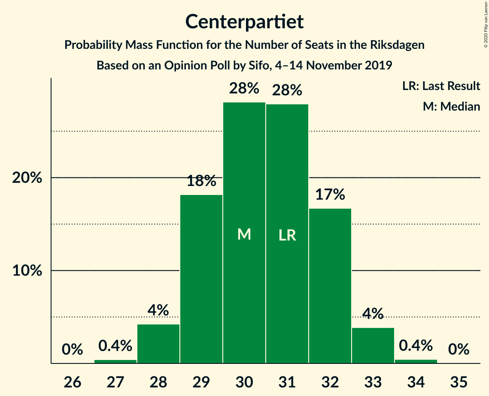
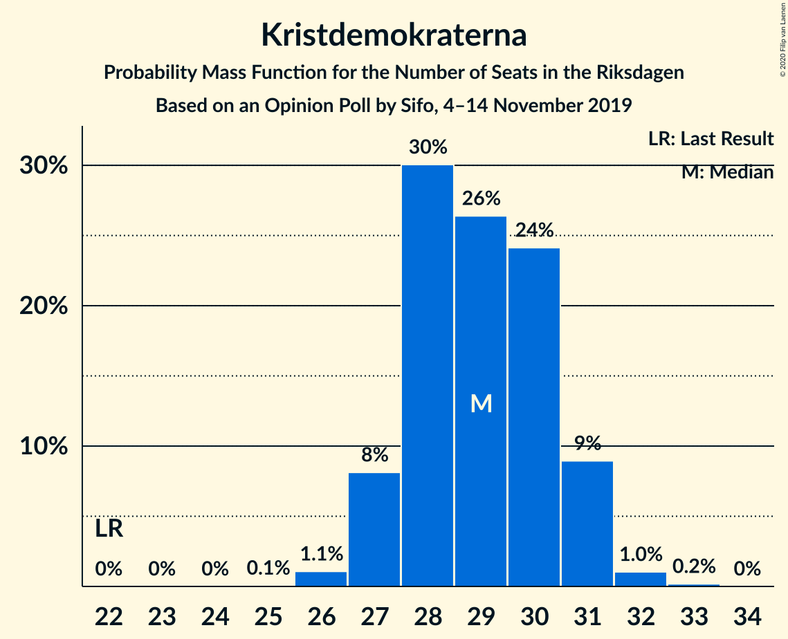
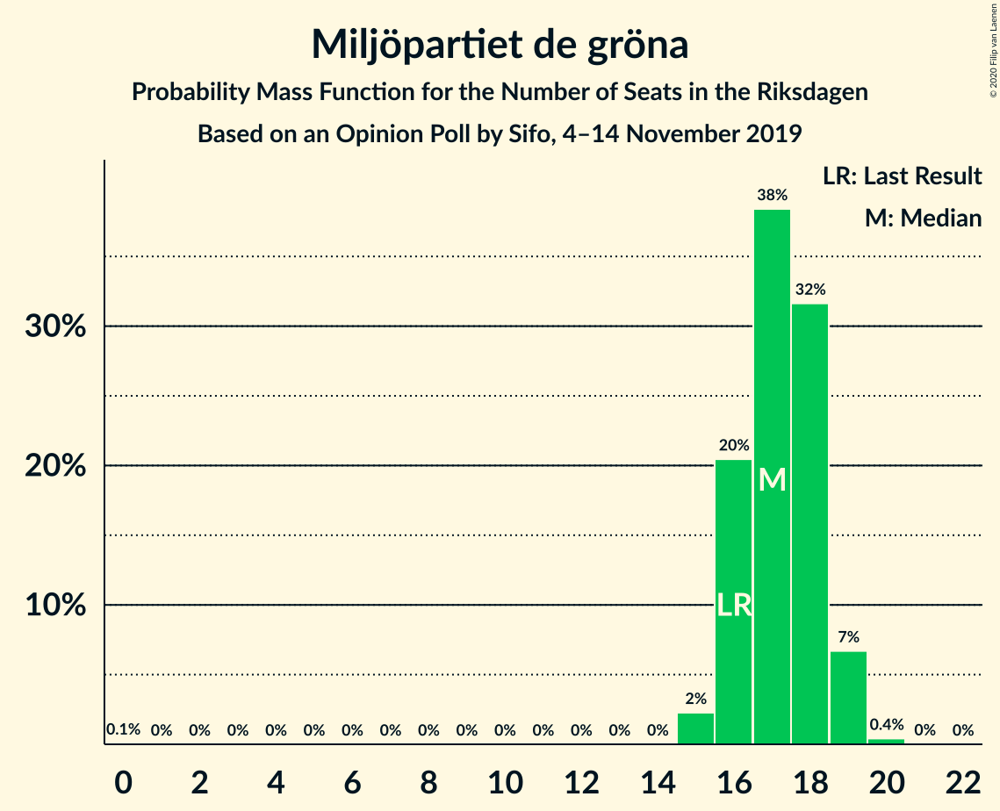
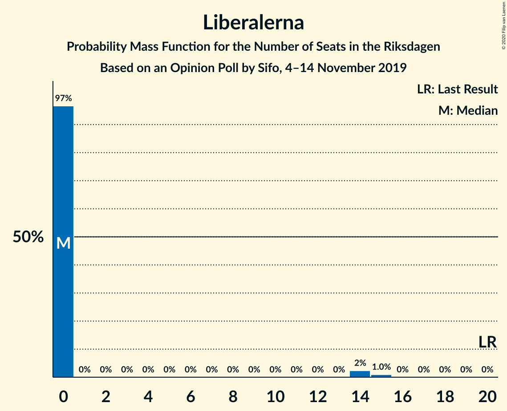
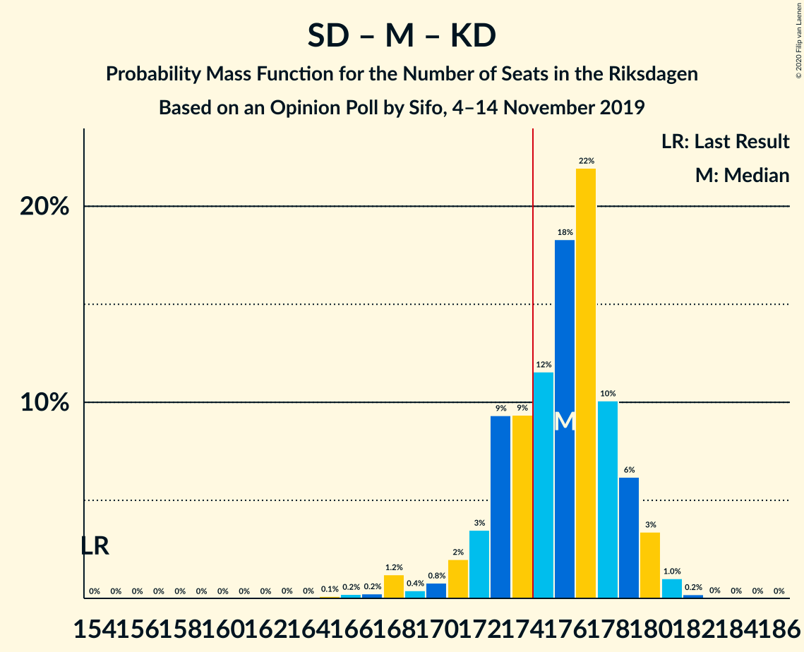
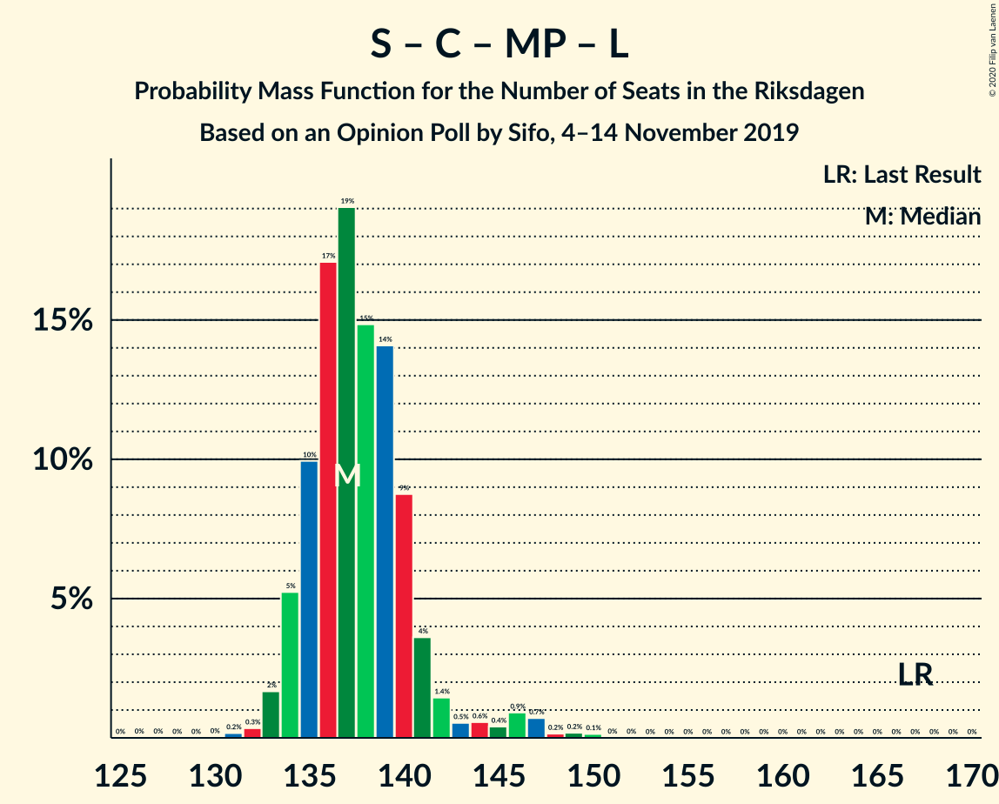
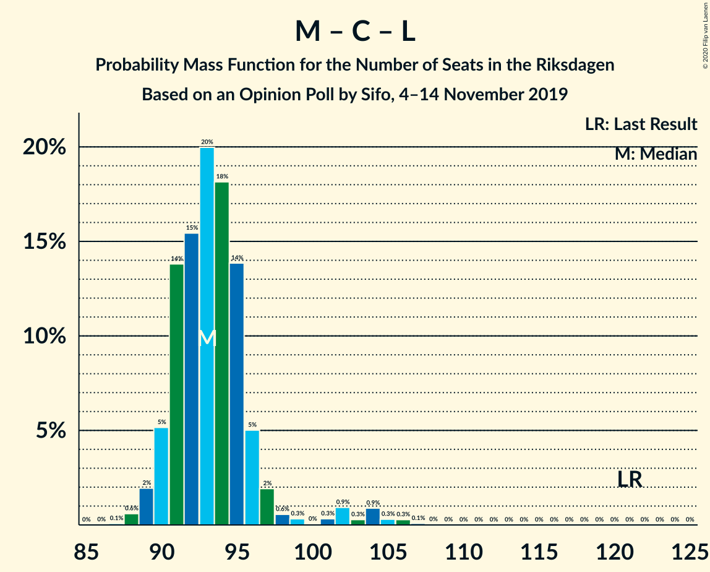

# Opinion Poll by Sifo, 4–14 November 2019

<a href="#voting-intentions">Voting Intentions</a> | <a href="#seats">Seats</a> | <a href="#coalitions">Coalitions</a> | <a href="#technical-information">Technical Information</a>

## Voting Intentions

### Confidence Intervals

| Party | Last Result | Poll Result | 80% Confidence Interval | 90% Confidence Interval | 95% Confidence Interval | 99% Confidence Interval |
|:-----:|:-----------:|:-----------:|:-----------------------:|:-----------------------:|:-----------------------:|:-----------------------:|
| Sveriges socialdemokratiska arbetareparti | 28.3% | 24.4% | 23.7–25.0% |23.6–25.1% |23.4–25.3% |23.1–25.6% |
| Sverigedemokraterna | 17.5% | 22.9% | 22.4–23.6% |22.2–23.7% |22.0–23.9% |21.8–24.2% |
| Moderata samlingspartiet | 19.8% | 17.0% | 16.4–17.5% |16.3–17.7% |16.2–17.8% |15.9–18.1% |
| Vänsterpartiet | 8.0% | 9.7% | 9.3–10.1% |9.1–10.2% |9.1–10.3% |8.9–10.5% |
| Centerpartiet | 8.6% | 8.3% | 7.9–8.7% |7.8–8.8% |7.7–8.9% |7.5–9.1% |
| Kristdemokraterna | 6.3% | 7.9% | 7.5–8.3% |7.4–8.4% |7.3–8.5% |7.1–8.7% |
| Miljöpartiet de gröna | 4.4% | 4.7% | 4.4–5.0% |4.3–5.1% |4.2–5.2% |4.1–5.3% |
| Liberalerna | 5.5% | 3.6% | 3.3–3.9% |3.3–4.0% |3.2–4.0% |3.1–4.2% |

*Note:* The poll result column reflects the actual value used in the calculations. Published results may vary slightly, and in addition be rounded to fewer digits.

## Seats

### Confidence Intervals

| Party | Last Result | Median | 80% Confidence Interval | 90% Confidence Interval | 95% Confidence Interval | 99% Confidence Interval |
|:-----:|:-----------:|:------:|:-----------------------:|:-----------------------:|:-----------------------:|:-----------------------:|
| <a href="#sveriges-socialdemokratiska-arbetareparti">Sveriges socialdemokratiska arbetareparti</a> | 100 | 89 | 87–91 |86–92 |85–92 |83–95 |
| <a href="#sverigedemokraterna">Sverigedemokraterna</a> | 62 | 85 | 82–87 |82–87 |81–88 |80–89 |
| <a href="#moderata-samlingspartiet">Moderata samlingspartiet</a> | 70 | 63 | 60–64 |60–65 |59–66 |58–67 |
| <a href="#vänsterpartiet">Vänsterpartiet</a> | 28 | 35 | 34–38 |34–38 |33–38 |32–39 |
| <a href="#centerpartiet">Centerpartiet</a> | 31 | 31 | 29–32 |29–33 |28–33 |28–34 |
| <a href="#kristdemokraterna">Kristdemokraterna</a> | 22 | 28 | 27–30 |27–31 |27–32 |26–33 |
| <a href="#miljöpartiet-de-gröna">Miljöpartiet de gröna</a> | 16 | 17 | 16–19 |16–19 |15–19 |15–20 |
| <a href="#liberalerna">Liberalerna</a> | 20 | 0 | 0 |0 |0 |0–15 |

### Sveriges socialdemokratiska arbetareparti

*For a full overview of the results for this party, see the [Sveriges socialdemokratiska arbetareparti](party-sverigessocialdemokratiskaarbetareparti.html) page.*

| Number of Seats | Probability | Accumulated | Special Marks |
|:---------------:|:-----------:|:-----------:|:-------------:|
| 82 | 0.2% | 100% |  |
| 83 | 0.5% | 99.7% |  |
| 84 | 0.7% | 99.3% |  |
| 85 | 1.5% | 98.6% |  |
| 86 | 4% | 97% |  |
| 87 | 6% | 93% |  |
| 88 | 34% | 87% |  |
| 89 | 21% | 52% | Median |
| 90 | 15% | 31% |  |
| 91 | 8% | 16% |  |
| 92 | 6% | 8% |  |
| 93 | 1.1% | 2% |  |
| 94 | 0.4% | 1.0% |  |
| 95 | 0.4% | 0.5% |  |
| 96 | 0.1% | 0.1% |  |
| 97 | 0% | 0% |  |
| 98 | 0% | 0% |  |
| 99 | 0% | 0% |  |
| 100 | 0% | 0% | Last Result |

### Sverigedemokraterna

*For a full overview of the results for this party, see the [Sverigedemokraterna](party-sverigedemokraterna.html) page.*

| Number of Seats | Probability | Accumulated | Special Marks |
|:---------------:|:-----------:|:-----------:|:-------------:|
| 62 | 0% | 100% | Last Result |
| 63 | 0% | 100% |  |
| 64 | 0% | 100% |  |
| 65 | 0% | 100% |  |
| 66 | 0% | 100% |  |
| 67 | 0% | 100% |  |
| 68 | 0% | 100% |  |
| 69 | 0% | 100% |  |
| 70 | 0% | 100% |  |
| 71 | 0% | 100% |  |
| 72 | 0% | 100% |  |
| 73 | 0% | 100% |  |
| 74 | 0% | 100% |  |
| 75 | 0% | 100% |  |
| 76 | 0% | 100% |  |
| 77 | 0.1% | 100% |  |
| 78 | 0.1% | 99.9% |  |
| 79 | 0.2% | 99.8% |  |
| 80 | 2% | 99.6% |  |
| 81 | 3% | 98% |  |
| 82 | 7% | 95% |  |
| 83 | 9% | 88% |  |
| 84 | 27% | 79% |  |
| 85 | 19% | 52% | Median |
| 86 | 23% | 33% |  |
| 87 | 8% | 11% |  |
| 88 | 1.3% | 3% |  |
| 89 | 0.8% | 1.3% |  |
| 90 | 0.5% | 0.5% |  |
| 91 | 0% | 0% |  |

### Moderata samlingspartiet

*For a full overview of the results for this party, see the [Moderata samlingspartiet](party-moderatasamlingspartiet.html) page.*

| Number of Seats | Probability | Accumulated | Special Marks |
|:---------------:|:-----------:|:-----------:|:-------------:|
| 57 | 0.2% | 100% |  |
| 58 | 0.4% | 99.8% |  |
| 59 | 2% | 99.3% |  |
| 60 | 8% | 97% |  |
| 61 | 14% | 89% |  |
| 62 | 13% | 75% |  |
| 63 | 33% | 62% | Median |
| 64 | 21% | 29% |  |
| 65 | 5% | 9% |  |
| 66 | 2% | 3% |  |
| 67 | 1.1% | 1.2% |  |
| 68 | 0.1% | 0.1% |  |
| 69 | 0% | 0% |  |
| 70 | 0% | 0% | Last Result |

### Vänsterpartiet

*For a full overview of the results for this party, see the [Vänsterpartiet](party-vänsterpartiet.html) page.*

| Number of Seats | Probability | Accumulated | Special Marks |
|:---------------:|:-----------:|:-----------:|:-------------:|
| 28 | 0% | 100% | Last Result |
| 29 | 0% | 100% |  |
| 30 | 0% | 100% |  |
| 31 | 0% | 100% |  |
| 32 | 0.6% | 100% |  |
| 33 | 2% | 99.4% |  |
| 34 | 15% | 97% |  |
| 35 | 37% | 82% | Median |
| 36 | 22% | 45% |  |
| 37 | 11% | 23% |  |
| 38 | 11% | 12% |  |
| 39 | 0.5% | 0.6% |  |
| 40 | 0.1% | 0.1% |  |
| 41 | 0% | 0% |  |

### Centerpartiet

*For a full overview of the results for this party, see the [Centerpartiet](party-centerpartiet.html) page.*

| Number of Seats | Probability | Accumulated | Special Marks |
|:---------------:|:-----------:|:-----------:|:-------------:|
| 27 | 0.5% | 100% |  |
| 28 | 3% | 99.5% |  |
| 29 | 9% | 97% |  |
| 30 | 15% | 87% |  |
| 31 | 26% | 72% | Last Result, Median |
| 32 | 36% | 46% |  |
| 33 | 9% | 10% |  |
| 34 | 0.9% | 0.9% |  |
| 35 | 0% | 0% |  |

### Kristdemokraterna

*For a full overview of the results for this party, see the [Kristdemokraterna](party-kristdemokraterna.html) page.*

| Number of Seats | Probability | Accumulated | Special Marks |
|:---------------:|:-----------:|:-----------:|:-------------:|
| 22 | 0% | 100% | Last Result |
| 23 | 0% | 100% |  |
| 24 | 0% | 100% |  |
| 25 | 0.1% | 100% |  |
| 26 | 2% | 99.9% |  |
| 27 | 9% | 98% |  |
| 28 | 61% | 89% | Median |
| 29 | 9% | 28% |  |
| 30 | 11% | 19% |  |
| 31 | 4% | 8% |  |
| 32 | 2% | 3% |  |
| 33 | 0.7% | 0.7% |  |
| 34 | 0% | 0% |  |

### Miljöpartiet de gröna

*For a full overview of the results for this party, see the [Miljöpartiet de gröna](party-miljöpartietdegröna.html) page.*

| Number of Seats | Probability | Accumulated | Special Marks |
|:---------------:|:-----------:|:-----------:|:-------------:|
| 0 | 0.1% | 100% |  |
| 1 | 0% | 99.9% |  |
| 2 | 0% | 99.9% |  |
| 3 | 0% | 99.9% |  |
| 4 | 0% | 99.9% |  |
| 5 | 0% | 99.9% |  |
| 6 | 0% | 99.9% |  |
| 7 | 0% | 99.9% |  |
| 8 | 0% | 99.9% |  |
| 9 | 0% | 99.9% |  |
| 10 | 0% | 99.9% |  |
| 11 | 0% | 99.9% |  |
| 12 | 0% | 99.9% |  |
| 13 | 0% | 99.9% |  |
| 14 | 0% | 99.9% |  |
| 15 | 2% | 99.9% |  |
| 16 | 12% | 97% | Last Result |
| 17 | 37% | 86% | Median |
| 18 | 36% | 49% |  |
| 19 | 12% | 13% |  |
| 20 | 0.5% | 0.6% |  |
| 21 | 0.1% | 0.1% |  |
| 22 | 0% | 0% |  |

### Liberalerna

*For a full overview of the results for this party, see the [Liberalerna](party-liberalerna.html) page.*

| Number of Seats | Probability | Accumulated | Special Marks |
|:---------------:|:-----------:|:-----------:|:-------------:|
| 0 | 98% | 100% | Median |
| 1 | 0% | 2% |  |
| 2 | 0% | 2% |  |
| 3 | 0% | 2% |  |
| 4 | 0% | 2% |  |
| 5 | 0% | 2% |  |
| 6 | 0% | 2% |  |
| 7 | 0% | 2% |  |
| 8 | 0% | 2% |  |
| 9 | 0% | 2% |  |
| 10 | 0% | 2% |  |
| 11 | 0% | 2% |  |
| 12 | 0% | 2% |  |
| 13 | 0% | 2% |  |
| 14 | 1.2% | 2% |  |
| 15 | 0.9% | 0.9% |  |
| 16 | 0% | 0% |  |
| 17 | 0% | 0% |  |
| 18 | 0% | 0% |  |
| 19 | 0% | 0% |  |
| 20 | 0% | 0% | Last Result |

## Coalitions

### Confidence Intervals

| Coalition | Last Result | Median | Majority? | 80% Confidence Interval | 90% Confidence Interval | 95% Confidence Interval | 99% Confidence Interval |
|:---------:|:-----------:|:------:|:---------:|:-----------------------:|:-----------------------:|:-----------------------:|:-----------------------:|
| Sveriges socialdemokratiska arbetareparti – Moderata samlingspartiet – Centerpartiet | 201 | 183 | 98.7% | 180–185 | 179–186 | 177–186 | 173–188 |
| Sverigedemokraterna – Moderata samlingspartiet – Kristdemokraterna | 154 | 176 | 73% | 173–178 | 172–179 | 171–180 | 167–181 |
| Sveriges socialdemokratiska arbetareparti – Vänsterpartiet – Centerpartiet – Miljöpartiet de gröna – Liberalerna | 195 | 173 | 27% | 171–176 | 170–177 | 169–178 | 168–182 |
| Sveriges socialdemokratiska arbetareparti – Moderata samlingspartiet | 170 | 151 | 0% | 149–154 | 148–154 | 147–155 | 143–158 |
| Sverigedemokraterna – Moderata samlingspartiet | 132 | 147 | 0% | 145–149 | 144–150 | 142–151 | 139–152 |
| Sveriges socialdemokratiska arbetareparti – Vänsterpartiet – Miljöpartiet de gröna | 144 | 141 | 0% | 140–145 | 139–146 | 137–146 | 134–148 |
| Sveriges socialdemokratiska arbetareparti – Centerpartiet – Miljöpartiet de gröna – Liberalerna | 167 | 137 | 0% | 135–140 | 135–141 | 133–143 | 132–147 |
| Sveriges socialdemokratiska arbetareparti – Vänsterpartiet | 128 | 124 | 0% | 123–127 | 121–128 | 120–128 | 118–130 |
| Moderata samlingspartiet – Centerpartiet – Kristdemokraterna – Liberalerna | 143 | 123 | 0% | 120–125 | 119–126 | 118–128 | 117–133 |
| Moderata samlingspartiet – Centerpartiet – Kristdemokraterna | 123 | 123 | 0% | 119–125 | 119–125 | 118–126 | 116–128 |
| Sveriges socialdemokratiska arbetareparti – Miljöpartiet de gröna | 116 | 106 | 0% | 105–109 | 103–110 | 102–110 | 100–112 |
| Moderata samlingspartiet – Centerpartiet – Liberalerna | 121 | 95 | 0% | 91–96 | 91–97 | 90–99 | 88–106 |
| Moderata samlingspartiet – Centerpartiet | 101 | 94 | 0% | 91–96 | 90–96 | 89–97 | 87–99 |

### Sveriges socialdemokratiska arbetareparti – Moderata samlingspartiet – Centerpartiet

| Number of Seats | Probability | Accumulated | Special Marks |
|:---------------:|:-----------:|:-----------:|:-------------:|
| 171 | 0.2% | 100% |  |
| 172 | 0.1% | 99.8% |  |
| 173 | 0.8% | 99.8% |  |
| 174 | 0.2% | 98.9% |  |
| 175 | 0.3% | 98.7% | Majority |
| 176 | 0.2% | 98% |  |
| 177 | 0.9% | 98% |  |
| 178 | 1.2% | 97% |  |
| 179 | 3% | 96% |  |
| 180 | 11% | 93% |  |
| 181 | 10% | 82% |  |
| 182 | 8% | 72% |  |
| 183 | 30% | 64% | Median |
| 184 | 15% | 34% |  |
| 185 | 11% | 19% |  |
| 186 | 6% | 8% |  |
| 187 | 0.8% | 2% |  |
| 188 | 0.5% | 0.8% |  |
| 189 | 0.1% | 0.3% |  |
| 190 | 0.1% | 0.2% |  |
| 191 | 0% | 0.1% |  |
| 192 | 0% | 0.1% |  |
| 193 | 0% | 0% |  |
| 194 | 0% | 0% |  |
| 195 | 0% | 0% |  |
| 196 | 0% | 0% |  |
| 197 | 0% | 0% |  |
| 198 | 0% | 0% |  |
| 199 | 0% | 0% |  |
| 200 | 0% | 0% |  |
| 201 | 0% | 0% | Last Result |

### Sverigedemokraterna – Moderata samlingspartiet – Kristdemokraterna

| Number of Seats | Probability | Accumulated | Special Marks |
|:---------------:|:-----------:|:-----------:|:-------------:|
| 154 | 0% | 100% | Last Result |
| 155 | 0% | 100% |  |
| 156 | 0% | 100% |  |
| 157 | 0% | 100% |  |
| 158 | 0% | 100% |  |
| 159 | 0% | 100% |  |
| 160 | 0% | 100% |  |
| 161 | 0% | 100% |  |
| 162 | 0% | 100% |  |
| 163 | 0% | 100% |  |
| 164 | 0% | 100% |  |
| 165 | 0% | 100% |  |
| 166 | 0.1% | 99.9% |  |
| 167 | 0.5% | 99.8% |  |
| 168 | 0.1% | 99.3% |  |
| 169 | 0.4% | 99.2% |  |
| 170 | 0.5% | 98.8% |  |
| 171 | 2% | 98% |  |
| 172 | 2% | 96% |  |
| 173 | 7% | 95% |  |
| 174 | 14% | 87% |  |
| 175 | 17% | 73% | Majority |
| 176 | 15% | 56% | Median |
| 177 | 27% | 41% |  |
| 178 | 7% | 14% |  |
| 179 | 4% | 6% |  |
| 180 | 1.1% | 3% |  |
| 181 | 1.2% | 2% |  |
| 182 | 0.2% | 0.3% |  |
| 183 | 0.1% | 0.2% |  |
| 184 | 0% | 0.1% |  |
| 185 | 0% | 0.1% |  |
| 186 | 0% | 0% |  |

### Sveriges socialdemokratiska arbetareparti – Vänsterpartiet – Centerpartiet – Miljöpartiet de gröna – Liberalerna

| Number of Seats | Probability | Accumulated | Special Marks |
|:---------------:|:-----------:|:-----------:|:-------------:|
| 164 | 0% | 100% |  |
| 165 | 0% | 99.9% |  |
| 166 | 0.1% | 99.9% |  |
| 167 | 0.2% | 99.8% |  |
| 168 | 1.2% | 99.7% |  |
| 169 | 1.1% | 98% |  |
| 170 | 4% | 97% |  |
| 171 | 7% | 94% |  |
| 172 | 27% | 86% | Median |
| 173 | 15% | 59% |  |
| 174 | 17% | 44% |  |
| 175 | 14% | 27% | Majority |
| 176 | 7% | 13% |  |
| 177 | 2% | 5% |  |
| 178 | 2% | 4% |  |
| 179 | 0.5% | 2% |  |
| 180 | 0.4% | 1.2% |  |
| 181 | 0.1% | 0.8% |  |
| 182 | 0.5% | 0.7% |  |
| 183 | 0.1% | 0.2% |  |
| 184 | 0% | 0.1% |  |
| 185 | 0% | 0% |  |
| 186 | 0% | 0% |  |
| 187 | 0% | 0% |  |
| 188 | 0% | 0% |  |
| 189 | 0% | 0% |  |
| 190 | 0% | 0% |  |
| 191 | 0% | 0% |  |
| 192 | 0% | 0% |  |
| 193 | 0% | 0% |  |
| 194 | 0% | 0% |  |
| 195 | 0% | 0% | Last Result |

### Sveriges socialdemokratiska arbetareparti – Moderata samlingspartiet

| Number of Seats | Probability | Accumulated | Special Marks |
|:---------------:|:-----------:|:-----------:|:-------------:|
| 142 | 0.4% | 100% |  |
| 143 | 0% | 99.5% |  |
| 144 | 0.7% | 99.5% |  |
| 145 | 0.2% | 98.8% |  |
| 146 | 0.4% | 98.6% |  |
| 147 | 1.4% | 98% |  |
| 148 | 3% | 97% |  |
| 149 | 14% | 94% |  |
| 150 | 2% | 80% |  |
| 151 | 33% | 78% |  |
| 152 | 9% | 45% | Median |
| 153 | 20% | 36% |  |
| 154 | 12% | 16% |  |
| 155 | 2% | 4% |  |
| 156 | 1.5% | 2% |  |
| 157 | 0.3% | 0.8% |  |
| 158 | 0.4% | 0.5% |  |
| 159 | 0.1% | 0.1% |  |
| 160 | 0% | 0.1% |  |
| 161 | 0% | 0% |  |
| 162 | 0% | 0% |  |
| 163 | 0% | 0% |  |
| 164 | 0% | 0% |  |
| 165 | 0% | 0% |  |
| 166 | 0% | 0% |  |
| 167 | 0% | 0% |  |
| 168 | 0% | 0% |  |
| 169 | 0% | 0% |  |
| 170 | 0% | 0% | Last Result |

### Sverigedemokraterna – Moderata samlingspartiet

| Number of Seats | Probability | Accumulated | Special Marks |
|:---------------:|:-----------:|:-----------:|:-------------:|
| 132 | 0% | 100% | Last Result |
| 133 | 0% | 100% |  |
| 134 | 0% | 100% |  |
| 135 | 0% | 100% |  |
| 136 | 0% | 100% |  |
| 137 | 0.1% | 100% |  |
| 138 | 0.1% | 99.9% |  |
| 139 | 0.4% | 99.8% |  |
| 140 | 0.4% | 99.4% |  |
| 141 | 0.7% | 99.1% |  |
| 142 | 1.0% | 98% |  |
| 143 | 2% | 97% |  |
| 144 | 5% | 96% |  |
| 145 | 10% | 90% |  |
| 146 | 12% | 80% |  |
| 147 | 19% | 68% |  |
| 148 | 18% | 49% | Median |
| 149 | 21% | 31% |  |
| 150 | 5% | 10% |  |
| 151 | 3% | 4% |  |
| 152 | 0.9% | 1.2% |  |
| 153 | 0.1% | 0.3% |  |
| 154 | 0.1% | 0.2% |  |
| 155 | 0.1% | 0.1% |  |
| 156 | 0% | 0% |  |

### Sveriges socialdemokratiska arbetareparti – Vänsterpartiet – Miljöpartiet de gröna

| Number of Seats | Probability | Accumulated | Special Marks |
|:---------------:|:-----------:|:-----------:|:-------------:|
| 131 | 0.1% | 100% |  |
| 132 | 0.1% | 99.9% |  |
| 133 | 0.2% | 99.8% |  |
| 134 | 0.2% | 99.6% |  |
| 135 | 0.6% | 99.4% |  |
| 136 | 0.4% | 98.8% |  |
| 137 | 1.5% | 98% |  |
| 138 | 2% | 97% |  |
| 139 | 2% | 95% |  |
| 140 | 23% | 93% |  |
| 141 | 22% | 70% | Median |
| 142 | 7% | 48% |  |
| 143 | 11% | 41% |  |
| 144 | 19% | 29% | Last Result |
| 145 | 4% | 10% |  |
| 146 | 5% | 6% |  |
| 147 | 0.7% | 1.2% |  |
| 148 | 0.4% | 0.5% |  |
| 149 | 0.1% | 0.1% |  |
| 150 | 0% | 0% |  |

### Sveriges socialdemokratiska arbetareparti – Centerpartiet – Miljöpartiet de gröna – Liberalerna

| Number of Seats | Probability | Accumulated | Special Marks |
|:---------------:|:-----------:|:-----------:|:-------------:|
| 127 | 0.1% | 100% |  |
| 128 | 0% | 99.9% |  |
| 129 | 0% | 99.9% |  |
| 130 | 0% | 99.9% |  |
| 131 | 0.1% | 99.9% |  |
| 132 | 0.5% | 99.8% |  |
| 133 | 2% | 99.3% |  |
| 134 | 2% | 97% |  |
| 135 | 7% | 95% |  |
| 136 | 3% | 88% |  |
| 137 | 40% | 85% | Median |
| 138 | 16% | 45% |  |
| 139 | 16% | 29% |  |
| 140 | 5% | 13% |  |
| 141 | 5% | 8% |  |
| 142 | 0.6% | 3% |  |
| 143 | 1.0% | 3% |  |
| 144 | 0.3% | 2% |  |
| 145 | 0.6% | 2% |  |
| 146 | 0.5% | 1.0% |  |
| 147 | 0.1% | 0.5% |  |
| 148 | 0.1% | 0.4% |  |
| 149 | 0.2% | 0.2% |  |
| 150 | 0% | 0.1% |  |
| 151 | 0% | 0.1% |  |
| 152 | 0% | 0% |  |
| 153 | 0% | 0% |  |
| 154 | 0% | 0% |  |
| 155 | 0% | 0% |  |
| 156 | 0% | 0% |  |
| 157 | 0% | 0% |  |
| 158 | 0% | 0% |  |
| 159 | 0% | 0% |  |
| 160 | 0% | 0% |  |
| 161 | 0% | 0% |  |
| 162 | 0% | 0% |  |
| 163 | 0% | 0% |  |
| 164 | 0% | 0% |  |
| 165 | 0% | 0% |  |
| 166 | 0% | 0% |  |
| 167 | 0% | 0% | Last Result |

### Sveriges socialdemokratiska arbetareparti – Vänsterpartiet

| Number of Seats | Probability | Accumulated | Special Marks |
|:---------------:|:-----------:|:-----------:|:-------------:|
| 115 | 0.1% | 100% |  |
| 116 | 0.1% | 99.9% |  |
| 117 | 0.3% | 99.8% |  |
| 118 | 0.4% | 99.5% |  |
| 119 | 0.6% | 99.1% |  |
| 120 | 2% | 98.6% |  |
| 121 | 3% | 97% |  |
| 122 | 3% | 94% |  |
| 123 | 30% | 90% |  |
| 124 | 14% | 60% | Median |
| 125 | 13% | 46% |  |
| 126 | 18% | 33% |  |
| 127 | 6% | 14% |  |
| 128 | 6% | 8% | Last Result |
| 129 | 1.2% | 2% |  |
| 130 | 0.5% | 0.9% |  |
| 131 | 0.2% | 0.3% |  |
| 132 | 0.1% | 0.2% |  |
| 133 | 0.1% | 0.1% |  |
| 134 | 0% | 0% |  |

### Moderata samlingspartiet – Centerpartiet – Kristdemokraterna – Liberalerna

| Number of Seats | Probability | Accumulated | Special Marks |
|:---------------:|:-----------:|:-----------:|:-------------:|
| 116 | 0.1% | 100% |  |
| 117 | 0.5% | 99.9% |  |
| 118 | 2% | 99.4% |  |
| 119 | 6% | 97% |  |
| 120 | 17% | 91% |  |
| 121 | 7% | 74% |  |
| 122 | 8% | 67% | Median |
| 123 | 28% | 58% |  |
| 124 | 17% | 31% |  |
| 125 | 7% | 14% |  |
| 126 | 3% | 7% |  |
| 127 | 0.5% | 3% |  |
| 128 | 0.8% | 3% |  |
| 129 | 0.2% | 2% |  |
| 130 | 0.1% | 2% |  |
| 131 | 0.3% | 2% |  |
| 132 | 0.8% | 1.4% |  |
| 133 | 0.4% | 0.7% |  |
| 134 | 0.1% | 0.2% |  |
| 135 | 0.1% | 0.1% |  |
| 136 | 0.1% | 0.1% |  |
| 137 | 0% | 0% |  |
| 138 | 0% | 0% |  |
| 139 | 0% | 0% |  |
| 140 | 0% | 0% |  |
| 141 | 0% | 0% |  |
| 142 | 0% | 0% |  |
| 143 | 0% | 0% | Last Result |

### Moderata samlingspartiet – Centerpartiet – Kristdemokraterna

| Number of Seats | Probability | Accumulated | Special Marks |
|:---------------:|:-----------:|:-----------:|:-------------:|
| 113 | 0.1% | 100% |  |
| 114 | 0.1% | 99.8% |  |
| 115 | 0.1% | 99.8% |  |
| 116 | 0.2% | 99.7% |  |
| 117 | 0.8% | 99.4% |  |
| 118 | 3% | 98.6% |  |
| 119 | 6% | 95% |  |
| 120 | 17% | 89% |  |
| 121 | 7% | 72% |  |
| 122 | 9% | 65% | Median |
| 123 | 28% | 56% | Last Result |
| 124 | 17% | 28% |  |
| 125 | 7% | 12% |  |
| 126 | 3% | 5% |  |
| 127 | 0.4% | 1.2% |  |
| 128 | 0.7% | 0.8% |  |
| 129 | 0% | 0.1% |  |
| 130 | 0% | 0% |  |

### Sveriges socialdemokratiska arbetareparti – Miljöpartiet de gröna

| Number of Seats | Probability | Accumulated | Special Marks |
|:---------------:|:-----------:|:-----------:|:-------------:|
| 95 | 0% | 100% |  |
| 96 | 0% | 99.9% |  |
| 97 | 0% | 99.9% |  |
| 98 | 0% | 99.9% |  |
| 99 | 0.4% | 99.9% |  |
| 100 | 0.2% | 99.5% |  |
| 101 | 0.6% | 99.3% |  |
| 102 | 2% | 98.7% |  |
| 103 | 2% | 96% |  |
| 104 | 3% | 94% |  |
| 105 | 28% | 91% |  |
| 106 | 19% | 64% | Median |
| 107 | 26% | 45% |  |
| 108 | 6% | 20% |  |
| 109 | 8% | 13% |  |
| 110 | 4% | 6% |  |
| 111 | 0.7% | 2% |  |
| 112 | 0.7% | 0.8% |  |
| 113 | 0.1% | 0.1% |  |
| 114 | 0% | 0% |  |
| 115 | 0% | 0% |  |
| 116 | 0% | 0% | Last Result |

### Moderata samlingspartiet – Centerpartiet – Liberalerna

| Number of Seats | Probability | Accumulated | Special Marks |
|:---------------:|:-----------:|:-----------:|:-------------:|
| 87 | 0.2% | 100% |  |
| 88 | 1.1% | 99.8% |  |
| 89 | 0.6% | 98.7% |  |
| 90 | 2% | 98% |  |
| 91 | 8% | 96% |  |
| 92 | 21% | 88% |  |
| 93 | 6% | 67% |  |
| 94 | 10% | 62% | Median |
| 95 | 28% | 51% |  |
| 96 | 18% | 24% |  |
| 97 | 2% | 6% |  |
| 98 | 0.6% | 3% |  |
| 99 | 0.8% | 3% |  |
| 100 | 0% | 2% |  |
| 101 | 0.2% | 2% |  |
| 102 | 0.3% | 2% |  |
| 103 | 0.2% | 1.5% |  |
| 104 | 0.5% | 1.2% |  |
| 105 | 0.2% | 0.7% |  |
| 106 | 0.3% | 0.5% |  |
| 107 | 0.1% | 0.2% |  |
| 108 | 0.1% | 0.1% |  |
| 109 | 0% | 0% |  |
| 110 | 0% | 0% |  |
| 111 | 0% | 0% |  |
| 112 | 0% | 0% |  |
| 113 | 0% | 0% |  |
| 114 | 0% | 0% |  |
| 115 | 0% | 0% |  |
| 116 | 0% | 0% |  |
| 117 | 0% | 0% |  |
| 118 | 0% | 0% |  |
| 119 | 0% | 0% |  |
| 120 | 0% | 0% |  |
| 121 | 0% | 0% | Last Result |

### Moderata samlingspartiet – Centerpartiet

| Number of Seats | Probability | Accumulated | Special Marks |
|:---------------:|:-----------:|:-----------:|:-------------:|
| 84 | 0.1% | 100% |  |
| 85 | 0% | 99.9% |  |
| 86 | 0.1% | 99.9% |  |
| 87 | 0.4% | 99.8% |  |
| 88 | 1.4% | 99.4% |  |
| 89 | 0.7% | 98% |  |
| 90 | 3% | 97% |  |
| 91 | 8% | 94% |  |
| 92 | 21% | 86% |  |
| 93 | 6% | 65% |  |
| 94 | 10% | 60% | Median |
| 95 | 28% | 49% |  |
| 96 | 18% | 22% |  |
| 97 | 2% | 4% |  |
| 98 | 0.6% | 1.3% |  |
| 99 | 0.7% | 0.7% |  |
| 100 | 0% | 0% |  |
| 101 | 0% | 0% | Last Result |

## Technical Information

### Opinion Poll

+ **Polling firm:** Sifo
+ **Commissioner(s):** —
+ **Fieldwork period:** 4–14 November 2019

### Calculations

+ **Sample size:** 8175
+ **Simulations done:** 131,072
+ **Error estimate:** 0.47%

