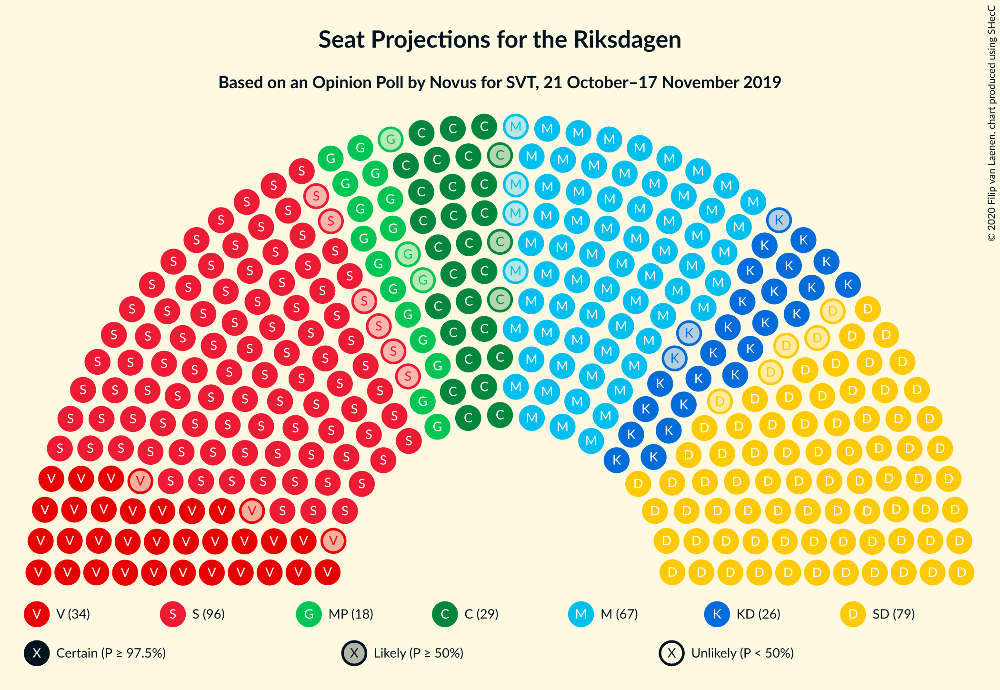
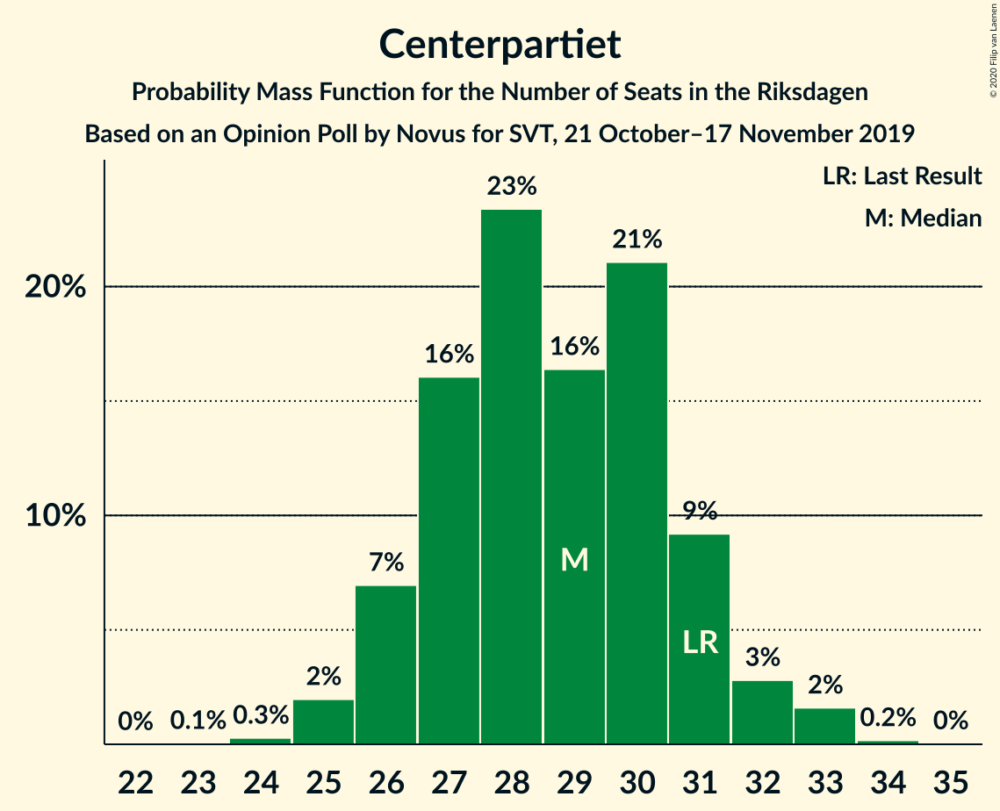
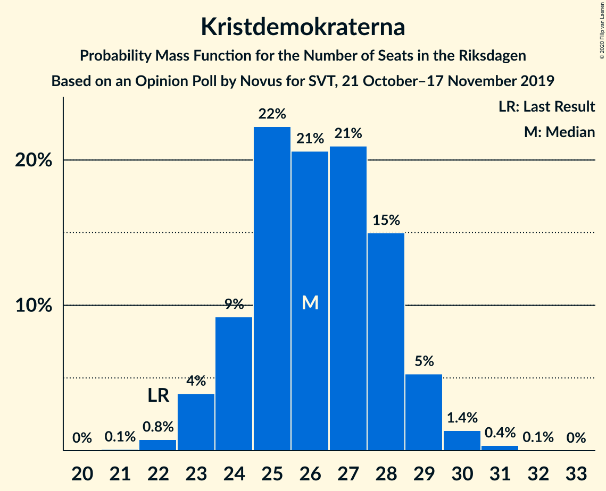
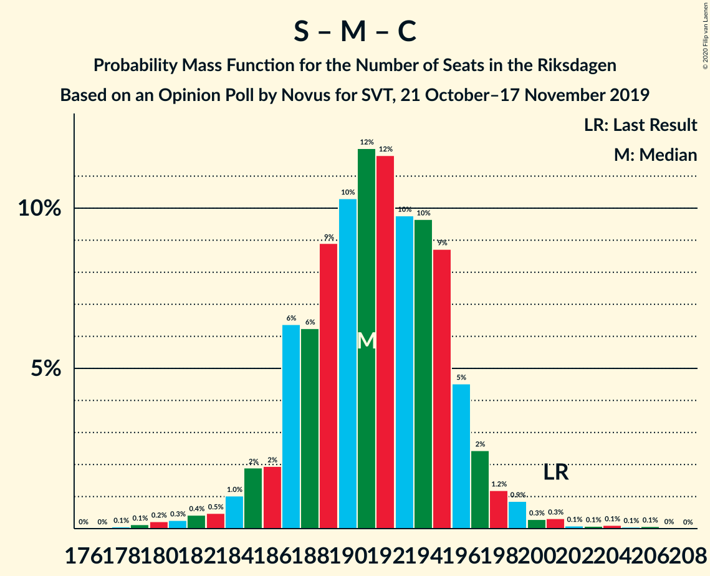
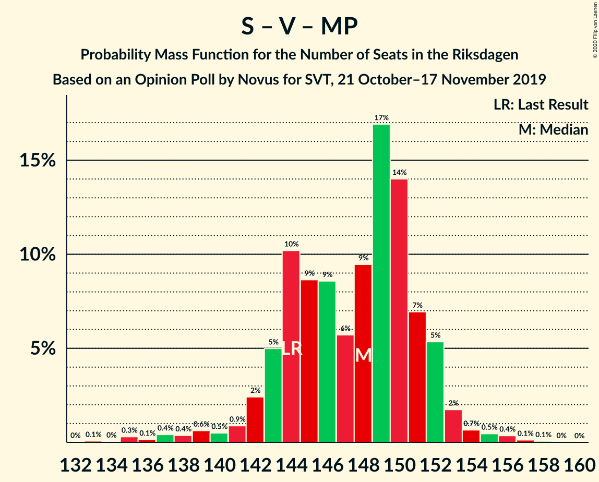
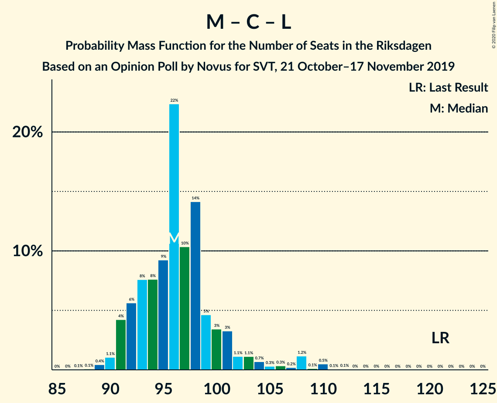

# Opinion Poll by Novus for SVT, 21 October–17 November 2019

<a href="#voting-intentions">Voting Intentions</a> | <a href="#seats">Seats</a> | <a href="#coalitions">Coalitions</a> | <a href="#technical-information">Technical Information</a>

## Voting Intentions

### Confidence Intervals

| Party | Last Result | Poll Result | 80% Confidence Interval | 90% Confidence Interval | 95% Confidence Interval | 99% Confidence Interval |
|:-----:|:-----------:|:-----------:|:-----------------------:|:-----------------------:|:-----------------------:|:-----------------------:|
| Sveriges socialdemokratiska arbetareparti | 28.3% | 26.0% | 25.1–27.0% |24.8–27.2% |24.6–27.5% |24.2–27.9% |
| Sverigedemokraterna | 17.5% | 21.5% | 20.6–22.4% |20.4–22.6% |20.2–22.9% |19.8–23.3% |
| Moderata samlingspartiet | 19.8% | 18.3% | 17.5–19.1% |17.3–19.4% |17.1–19.6% |16.7–20.0% |
| Vänsterpartiet | 8.0% | 9.3% | 8.7–10.0% |8.6–10.2% |8.4–10.3% |8.1–10.6% |
| Centerpartiet | 8.6% | 7.8% | 7.2–8.4% |7.1–8.6% |7.0–8.7% |6.7–9.0% |
| Kristdemokraterna | 6.3% | 7.1% | 6.6–7.7% |6.4–7.8% |6.3–8.0% |6.1–8.3% |
| Miljöpartiet de gröna | 4.4% | 4.8% | 4.4–5.3% |4.3–5.4% |4.1–5.6% |3.9–5.8% |
| Liberalerna | 5.5% | 3.4% | 3.0–3.8% |2.9–3.9% |2.9–4.1% |2.7–4.3% |

*Note:* The poll result column reflects the actual value used in the calculations. Published results may vary slightly, and in addition be rounded to fewer digits.

## Seats

### Confidence Intervals

| Party | Last Result | Median | 80% Confidence Interval | 90% Confidence Interval | 95% Confidence Interval | 99% Confidence Interval |
|:-----:|:-----------:|:------:|:-----------------------:|:-----------------------:|:-----------------------:|:-----------------------:|
| <a href="#sveriges-socialdemokratiska-arbetareparti">Sveriges socialdemokratiska arbetareparti</a> | 100 | 96 | 91–98 |90–100 |89–101 |89–102 |
| <a href="#sverigedemokraterna">Sverigedemokraterna</a> | 62 | 79 | 75–83 |74–83 |73–84 |73–85 |
| <a href="#moderata-samlingspartiet">Moderata samlingspartiet</a> | 70 | 67 | 64–69 |64–71 |62–71 |61–74 |
| <a href="#vänsterpartiet">Vänsterpartiet</a> | 28 | 34 | 32–36 |31–37 |31–38 |30–39 |
| <a href="#centerpartiet">Centerpartiet</a> | 31 | 29 | 27–30 |26–32 |26–32 |25–33 |
| <a href="#kristdemokraterna">Kristdemokraterna</a> | 22 | 26 | 24–28 |24–29 |23–29 |22–30 |
| <a href="#miljöpartiet-de-gröna">Miljöpartiet de gröna</a> | 16 | 17 | 16–19 |15–20 |15–20 |0–21 |
| <a href="#liberalerna">Liberalerna</a> | 20 | 0 | 0 |0–14 |0–14 |0–15 |

### Sveriges socialdemokratiska arbetareparti

*For a full overview of the results for this party, see the [Sveriges socialdemokratiska arbetareparti](party-sverigessocialdemokratiskaarbetareparti.html) page.*

| Number of Seats | Probability | Accumulated | Special Marks |
|:---------------:|:-----------:|:-----------:|:-------------:|
| 86 | 0.1% | 100% |  |
| 87 | 0.1% | 99.9% |  |
| 88 | 0.1% | 99.9% |  |
| 89 | 3% | 99.7% |  |
| 90 | 2% | 96% |  |
| 91 | 6% | 95% |  |
| 92 | 14% | 89% |  |
| 93 | 7% | 75% |  |
| 94 | 3% | 68% |  |
| 95 | 10% | 64% |  |
| 96 | 8% | 54% | Median |
| 97 | 12% | 46% |  |
| 98 | 25% | 34% |  |
| 99 | 2% | 9% |  |
| 100 | 2% | 7% | Last Result |
| 101 | 3% | 5% |  |
| 102 | 1.4% | 2% |  |
| 103 | 0.4% | 0.5% |  |
| 104 | 0.1% | 0.1% |  |
| 105 | 0% | 0% |  |

### Sverigedemokraterna

*For a full overview of the results for this party, see the [Sverigedemokraterna](party-sverigedemokraterna.html) page.*

| Number of Seats | Probability | Accumulated | Special Marks |
|:---------------:|:-----------:|:-----------:|:-------------:|
| 62 | 0% | 100% | Last Result |
| 63 | 0% | 100% |  |
| 64 | 0% | 100% |  |
| 65 | 0% | 100% |  |
| 66 | 0% | 100% |  |
| 67 | 0% | 100% |  |
| 68 | 0% | 100% |  |
| 69 | 0% | 100% |  |
| 70 | 0% | 100% |  |
| 71 | 0.1% | 100% |  |
| 72 | 0.3% | 99.9% |  |
| 73 | 2% | 99.5% |  |
| 74 | 5% | 97% |  |
| 75 | 4% | 93% |  |
| 76 | 3% | 88% |  |
| 77 | 5% | 85% |  |
| 78 | 19% | 81% |  |
| 79 | 18% | 62% | Median |
| 80 | 7% | 44% |  |
| 81 | 9% | 36% |  |
| 82 | 14% | 27% |  |
| 83 | 10% | 13% |  |
| 84 | 2% | 4% |  |
| 85 | 1.1% | 1.4% |  |
| 86 | 0.1% | 0.3% |  |
| 87 | 0.1% | 0.2% |  |
| 88 | 0.1% | 0.1% |  |
| 89 | 0% | 0% |  |

### Moderata samlingspartiet

*For a full overview of the results for this party, see the [Moderata samlingspartiet](party-moderatasamlingspartiet.html) page.*

| Number of Seats | Probability | Accumulated | Special Marks |
|:---------------:|:-----------:|:-----------:|:-------------:|
| 60 | 0.1% | 100% |  |
| 61 | 0.9% | 99.9% |  |
| 62 | 2% | 99.0% |  |
| 63 | 2% | 97% |  |
| 64 | 16% | 95% |  |
| 65 | 2% | 79% |  |
| 66 | 22% | 77% |  |
| 67 | 17% | 55% | Median |
| 68 | 22% | 37% |  |
| 69 | 7% | 15% |  |
| 70 | 3% | 8% | Last Result |
| 71 | 3% | 5% |  |
| 72 | 1.0% | 2% |  |
| 73 | 0.5% | 1.2% |  |
| 74 | 0.2% | 0.6% |  |
| 75 | 0.4% | 0.4% |  |
| 76 | 0% | 0% |  |

### Vänsterpartiet

*For a full overview of the results for this party, see the [Vänsterpartiet](party-vänsterpartiet.html) page.*

| Number of Seats | Probability | Accumulated | Special Marks |
|:---------------:|:-----------:|:-----------:|:-------------:|
| 28 | 0% | 100% | Last Result |
| 29 | 0.1% | 100% |  |
| 30 | 2% | 99.8% |  |
| 31 | 4% | 98% |  |
| 32 | 18% | 94% |  |
| 33 | 11% | 77% |  |
| 34 | 23% | 66% | Median |
| 35 | 8% | 43% |  |
| 36 | 27% | 35% |  |
| 37 | 3% | 8% |  |
| 38 | 3% | 4% |  |
| 39 | 0.7% | 1.1% |  |
| 40 | 0.3% | 0.4% |  |
| 41 | 0% | 0% |  |

### Centerpartiet

*For a full overview of the results for this party, see the [Centerpartiet](party-centerpartiet.html) page.*

| Number of Seats | Probability | Accumulated | Special Marks |
|:---------------:|:-----------:|:-----------:|:-------------:|
| 23 | 0.1% | 100% |  |
| 24 | 0.3% | 99.9% |  |
| 25 | 1.2% | 99.7% |  |
| 26 | 7% | 98% |  |
| 27 | 6% | 92% |  |
| 28 | 33% | 86% |  |
| 29 | 16% | 53% | Median |
| 30 | 28% | 36% |  |
| 31 | 2% | 9% | Last Result |
| 32 | 6% | 7% |  |
| 33 | 0.4% | 0.6% |  |
| 34 | 0.1% | 0.2% |  |
| 35 | 0.1% | 0.1% |  |
| 36 | 0% | 0% |  |

### Kristdemokraterna

*For a full overview of the results for this party, see the [Kristdemokraterna](party-kristdemokraterna.html) page.*

| Number of Seats | Probability | Accumulated | Special Marks |
|:---------------:|:-----------:|:-----------:|:-------------:|
| 21 | 0.2% | 100% |  |
| 22 | 0.6% | 99.8% | Last Result |
| 23 | 2% | 99.3% |  |
| 24 | 10% | 97% |  |
| 25 | 17% | 87% |  |
| 26 | 24% | 71% | Median |
| 27 | 30% | 47% |  |
| 28 | 11% | 17% |  |
| 29 | 5% | 6% |  |
| 30 | 0.8% | 1.2% |  |
| 31 | 0.4% | 0.4% |  |
| 32 | 0% | 0.1% |  |
| 33 | 0% | 0% |  |

### Miljöpartiet de gröna

*For a full overview of the results for this party, see the [Miljöpartiet de gröna](party-miljöpartietdegröna.html) page.*

| Number of Seats | Probability | Accumulated | Special Marks |
|:---------------:|:-----------:|:-----------:|:-------------:|
| 0 | 0.7% | 100% |  |
| 1 | 0% | 99.3% |  |
| 2 | 0% | 99.3% |  |
| 3 | 0% | 99.3% |  |
| 4 | 0% | 99.3% |  |
| 5 | 0% | 99.3% |  |
| 6 | 0% | 99.3% |  |
| 7 | 0% | 99.3% |  |
| 8 | 0% | 99.3% |  |
| 9 | 0% | 99.3% |  |
| 10 | 0% | 99.3% |  |
| 11 | 0% | 99.3% |  |
| 12 | 0% | 99.3% |  |
| 13 | 0% | 99.3% |  |
| 14 | 0% | 99.3% |  |
| 15 | 6% | 99.3% |  |
| 16 | 7% | 93% | Last Result |
| 17 | 46% | 86% | Median |
| 18 | 22% | 40% |  |
| 19 | 9% | 18% |  |
| 20 | 7% | 9% |  |
| 21 | 2% | 2% |  |
| 22 | 0.2% | 0.2% |  |
| 23 | 0.1% | 0.1% |  |
| 24 | 0% | 0% |  |

### Liberalerna

*For a full overview of the results for this party, see the [Liberalerna](party-liberalerna.html) page.*

| Number of Seats | Probability | Accumulated | Special Marks |
|:---------------:|:-----------:|:-----------:|:-------------:|
| 0 | 94% | 100% | Median |
| 1 | 0% | 6% |  |
| 2 | 0% | 6% |  |
| 3 | 0% | 6% |  |
| 4 | 0% | 6% |  |
| 5 | 0% | 6% |  |
| 6 | 0% | 6% |  |
| 7 | 0% | 6% |  |
| 8 | 0% | 6% |  |
| 9 | 0% | 6% |  |
| 10 | 0% | 6% |  |
| 11 | 0% | 6% |  |
| 12 | 0% | 6% |  |
| 13 | 0% | 6% |  |
| 14 | 4% | 6% |  |
| 15 | 2% | 2% |  |
| 16 | 0.1% | 0.1% |  |
| 17 | 0% | 0% |  |
| 18 | 0% | 0% |  |
| 19 | 0% | 0% |  |
| 20 | 0% | 0% | Last Result |

## Coalitions

### Confidence Intervals

| Coalition | Last Result | Median | Majority? | 80% Confidence Interval | 90% Confidence Interval | 95% Confidence Interval | 99% Confidence Interval |
|:---------:|:-----------:|:------:|:---------:|:-----------------------:|:-----------------------:|:-----------------------:|:-----------------------:|
| Sveriges socialdemokratiska arbetareparti – Moderata samlingspartiet – Centerpartiet | 201 | 190 | 100% | 187–195 | 185–196 | 184–198 | 182–203 |
| Sveriges socialdemokratiska arbetareparti – Vänsterpartiet – Centerpartiet – Miljöpartiet de gröna – Liberalerna | 195 | 177 | 68% | 173–181 | 172–183 | 170–183 | 167–188 |
| Sverigedemokraterna – Moderata samlingspartiet – Kristdemokraterna | 154 | 172 | 32% | 168–176 | 166–177 | 166–179 | 161–182 |
| Sveriges socialdemokratiska arbetareparti – Moderata samlingspartiet | 170 | 162 | 0.4% | 158–166 | 157–168 | 155–170 | 155–173 |
| Sveriges socialdemokratiska arbetareparti – Vänsterpartiet – Miljöpartiet de gröna | 144 | 147 | 0% | 144–152 | 139–153 | 139–153 | 138–155 |
| Sverigedemokraterna – Moderata samlingspartiet | 132 | 146 | 0% | 142–150 | 140–151 | 140–151 | 136–155 |
| Sveriges socialdemokratiska arbetareparti – Centerpartiet – Miljöpartiet de gröna – Liberalerna | 167 | 143 | 0% | 137–147 | 137–149 | 136–149 | 132–155 |
| Sveriges socialdemokratiska arbetareparti – Vänsterpartiet | 128 | 130 | 0% | 125–134 | 124–135 | 123–136 | 121–138 |
| Moderata samlingspartiet – Centerpartiet – Kristdemokraterna – Liberalerna | 143 | 123 | 0% | 119–127 | 118–130 | 116–136 | 116–136 |
| Moderata samlingspartiet – Centerpartiet – Kristdemokraterna | 123 | 122 | 0% | 119–126 | 117–127 | 116–127 | 114–131 |
| Sveriges socialdemokratiska arbetareparti – Miljöpartiet de gröna | 116 | 114 | 0% | 109–116 | 107–118 | 105–119 | 102–120 |
| Moderata samlingspartiet – Centerpartiet – Liberalerna | 121 | 96 | 0% | 92–100 | 92–104 | 91–110 | 89–110 |
| Moderata samlingspartiet – Centerpartiet | 101 | 96 | 0% | 92–98 | 91–100 | 90–101 | 87–104 |

### Sveriges socialdemokratiska arbetareparti – Moderata samlingspartiet – Centerpartiet

| Number of Seats | Probability | Accumulated | Special Marks |
|:---------------:|:-----------:|:-----------:|:-------------:|
| 180 | 0.1% | 100% |  |
| 181 | 0.3% | 99.9% |  |
| 182 | 1.2% | 99.5% |  |
| 183 | 0.4% | 98% |  |
| 184 | 0.6% | 98% |  |
| 185 | 3% | 97% |  |
| 186 | 2% | 95% |  |
| 187 | 10% | 93% |  |
| 188 | 16% | 83% |  |
| 189 | 4% | 67% |  |
| 190 | 16% | 64% |  |
| 191 | 3% | 47% |  |
| 192 | 6% | 44% | Median |
| 193 | 7% | 38% |  |
| 194 | 16% | 31% |  |
| 195 | 6% | 15% |  |
| 196 | 4% | 9% |  |
| 197 | 1.1% | 5% |  |
| 198 | 2% | 4% |  |
| 199 | 1.3% | 2% |  |
| 200 | 0.1% | 0.7% |  |
| 201 | 0% | 0.6% | Last Result |
| 202 | 0% | 0.6% |  |
| 203 | 0.1% | 0.6% |  |
| 204 | 0% | 0.4% |  |
| 205 | 0% | 0.4% |  |
| 206 | 0.4% | 0.4% |  |
| 207 | 0% | 0% |  |

### Sveriges socialdemokratiska arbetareparti – Vänsterpartiet – Centerpartiet – Miljöpartiet de gröna – Liberalerna

| Number of Seats | Probability | Accumulated | Special Marks |
|:---------------:|:-----------:|:-----------:|:-------------:|
| 165 | 0.1% | 100% |  |
| 166 | 0.2% | 99.9% |  |
| 167 | 0.4% | 99.7% |  |
| 168 | 0.2% | 99.3% |  |
| 169 | 0.4% | 99.1% |  |
| 170 | 3% | 98.7% |  |
| 171 | 0.5% | 96% |  |
| 172 | 2% | 96% |  |
| 173 | 18% | 93% |  |
| 174 | 7% | 75% |  |
| 175 | 9% | 68% | Majority |
| 176 | 5% | 59% | Median |
| 177 | 18% | 54% |  |
| 178 | 0.9% | 35% |  |
| 179 | 6% | 34% |  |
| 180 | 19% | 29% |  |
| 181 | 0.8% | 10% |  |
| 182 | 1.1% | 9% |  |
| 183 | 6% | 8% |  |
| 184 | 1.1% | 2% |  |
| 185 | 0.3% | 1.2% |  |
| 186 | 0.2% | 0.9% |  |
| 187 | 0.1% | 0.6% |  |
| 188 | 0% | 0.5% |  |
| 189 | 0.4% | 0.5% |  |
| 190 | 0.1% | 0.1% |  |
| 191 | 0% | 0% |  |
| 192 | 0% | 0% |  |
| 193 | 0% | 0% |  |
| 194 | 0% | 0% |  |
| 195 | 0% | 0% | Last Result |

### Sverigedemokraterna – Moderata samlingspartiet – Kristdemokraterna

| Number of Seats | Probability | Accumulated | Special Marks |
|:---------------:|:-----------:|:-----------:|:-------------:|
| 154 | 0% | 100% | Last Result |
| 155 | 0% | 100% |  |
| 156 | 0% | 100% |  |
| 157 | 0% | 100% |  |
| 158 | 0% | 100% |  |
| 159 | 0.1% | 100% |  |
| 160 | 0.4% | 99.9% |  |
| 161 | 0% | 99.5% |  |
| 162 | 0.1% | 99.5% |  |
| 163 | 0.2% | 99.4% |  |
| 164 | 0.3% | 99.1% |  |
| 165 | 1.1% | 98.8% |  |
| 166 | 6% | 98% |  |
| 167 | 1.1% | 92% |  |
| 168 | 0.8% | 91% |  |
| 169 | 19% | 90% |  |
| 170 | 6% | 71% |  |
| 171 | 0.9% | 66% |  |
| 172 | 18% | 65% | Median |
| 173 | 5% | 46% |  |
| 174 | 9% | 41% |  |
| 175 | 7% | 32% | Majority |
| 176 | 18% | 25% |  |
| 177 | 2% | 7% |  |
| 178 | 0.5% | 4% |  |
| 179 | 3% | 4% |  |
| 180 | 0.4% | 1.3% |  |
| 181 | 0.2% | 0.9% |  |
| 182 | 0.4% | 0.7% |  |
| 183 | 0.2% | 0.3% |  |
| 184 | 0.1% | 0.1% |  |
| 185 | 0% | 0% |  |

### Sveriges socialdemokratiska arbetareparti – Moderata samlingspartiet

| Number of Seats | Probability | Accumulated | Special Marks |
|:---------------:|:-----------:|:-----------:|:-------------:|
| 151 | 0% | 100% |  |
| 152 | 0.2% | 99.9% |  |
| 153 | 0.1% | 99.7% |  |
| 154 | 0.1% | 99.7% |  |
| 155 | 3% | 99.6% |  |
| 156 | 0.7% | 96% |  |
| 157 | 3% | 96% |  |
| 158 | 5% | 93% |  |
| 159 | 3% | 87% |  |
| 160 | 16% | 84% |  |
| 161 | 8% | 68% |  |
| 162 | 14% | 60% |  |
| 163 | 14% | 46% | Median |
| 164 | 18% | 32% |  |
| 165 | 3% | 14% |  |
| 166 | 3% | 11% |  |
| 167 | 0.7% | 8% |  |
| 168 | 3% | 8% |  |
| 169 | 1.2% | 5% |  |
| 170 | 2% | 3% | Last Result |
| 171 | 0.6% | 1.2% |  |
| 172 | 0.1% | 0.6% |  |
| 173 | 0.1% | 0.5% |  |
| 174 | 0% | 0.5% |  |
| 175 | 0% | 0.4% | Majority |
| 176 | 0% | 0.4% |  |
| 177 | 0.4% | 0.4% |  |
| 178 | 0% | 0% |  |

### Sveriges socialdemokratiska arbetareparti – Vänsterpartiet – Miljöpartiet de gröna

| Number of Seats | Probability | Accumulated | Special Marks |
|:---------------:|:-----------:|:-----------:|:-------------:|
| 133 | 0% | 100% |  |
| 134 | 0% | 99.9% |  |
| 135 | 0% | 99.9% |  |
| 136 | 0.1% | 99.9% |  |
| 137 | 0.2% | 99.9% |  |
| 138 | 1.4% | 99.6% |  |
| 139 | 3% | 98% |  |
| 140 | 0.3% | 95% |  |
| 141 | 0.7% | 95% |  |
| 142 | 0.6% | 94% |  |
| 143 | 0.5% | 93% |  |
| 144 | 6% | 93% | Last Result |
| 145 | 26% | 87% |  |
| 146 | 10% | 61% |  |
| 147 | 17% | 51% | Median |
| 148 | 6% | 34% |  |
| 149 | 2% | 28% |  |
| 150 | 2% | 26% |  |
| 151 | 4% | 24% |  |
| 152 | 13% | 19% |  |
| 153 | 5% | 7% |  |
| 154 | 0.7% | 1.3% |  |
| 155 | 0.5% | 0.6% |  |
| 156 | 0.1% | 0.2% |  |
| 157 | 0% | 0.1% |  |
| 158 | 0% | 0.1% |  |
| 159 | 0% | 0% |  |

### Sverigedemokraterna – Moderata samlingspartiet

| Number of Seats | Probability | Accumulated | Special Marks |
|:---------------:|:-----------:|:-----------:|:-------------:|
| 132 | 0% | 100% | Last Result |
| 133 | 0% | 100% |  |
| 134 | 0% | 100% |  |
| 135 | 0.4% | 99.9% |  |
| 136 | 0% | 99.5% |  |
| 137 | 0.2% | 99.5% |  |
| 138 | 0.6% | 99.2% |  |
| 139 | 0.6% | 98.6% |  |
| 140 | 4% | 98% |  |
| 141 | 3% | 94% |  |
| 142 | 14% | 91% |  |
| 143 | 3% | 78% |  |
| 144 | 7% | 74% |  |
| 145 | 16% | 67% |  |
| 146 | 5% | 51% | Median |
| 147 | 9% | 47% |  |
| 148 | 6% | 38% |  |
| 149 | 6% | 31% |  |
| 150 | 19% | 25% |  |
| 151 | 4% | 6% |  |
| 152 | 0.7% | 2% |  |
| 153 | 0.3% | 2% |  |
| 154 | 0.4% | 1.3% |  |
| 155 | 0.5% | 0.9% |  |
| 156 | 0.4% | 0.4% |  |
| 157 | 0% | 0% |  |

### Sveriges socialdemokratiska arbetareparti – Centerpartiet – Miljöpartiet de gröna – Liberalerna

| Number of Seats | Probability | Accumulated | Special Marks |
|:---------------:|:-----------:|:-----------:|:-------------:|
| 129 | 0.1% | 100% |  |
| 130 | 0% | 99.9% |  |
| 131 | 0.4% | 99.9% |  |
| 132 | 0.1% | 99.5% |  |
| 133 | 0.2% | 99.5% |  |
| 134 | 0.1% | 99.3% |  |
| 135 | 0.6% | 99.2% |  |
| 136 | 2% | 98.6% |  |
| 137 | 14% | 96% |  |
| 138 | 1.3% | 83% |  |
| 139 | 3% | 81% |  |
| 140 | 10% | 78% |  |
| 141 | 7% | 68% |  |
| 142 | 10% | 61% | Median |
| 143 | 4% | 51% |  |
| 144 | 14% | 47% |  |
| 145 | 16% | 34% |  |
| 146 | 7% | 17% |  |
| 147 | 3% | 10% |  |
| 148 | 1.3% | 7% |  |
| 149 | 4% | 6% |  |
| 150 | 0.4% | 2% |  |
| 151 | 0.6% | 2% |  |
| 152 | 0.1% | 1.2% |  |
| 153 | 0.1% | 1.1% |  |
| 154 | 0.4% | 1.0% |  |
| 155 | 0.4% | 0.5% |  |
| 156 | 0% | 0.1% |  |
| 157 | 0% | 0.1% |  |
| 158 | 0% | 0% |  |
| 159 | 0% | 0% |  |
| 160 | 0% | 0% |  |
| 161 | 0% | 0% |  |
| 162 | 0% | 0% |  |
| 163 | 0% | 0% |  |
| 164 | 0% | 0% |  |
| 165 | 0% | 0% |  |
| 166 | 0% | 0% |  |
| 167 | 0% | 0% | Last Result |

### Sveriges socialdemokratiska arbetareparti – Vänsterpartiet

| Number of Seats | Probability | Accumulated | Special Marks |
|:---------------:|:-----------:|:-----------:|:-------------:|
| 119 | 0% | 100% |  |
| 120 | 0.1% | 99.9% |  |
| 121 | 0.4% | 99.9% |  |
| 122 | 0.9% | 99.5% |  |
| 123 | 3% | 98.6% |  |
| 124 | 0.8% | 95% |  |
| 125 | 6% | 95% |  |
| 126 | 3% | 89% |  |
| 127 | 9% | 85% |  |
| 128 | 16% | 76% | Last Result |
| 129 | 8% | 60% |  |
| 130 | 18% | 53% | Median |
| 131 | 7% | 34% |  |
| 132 | 4% | 27% |  |
| 133 | 4% | 24% |  |
| 134 | 13% | 19% |  |
| 135 | 3% | 6% |  |
| 136 | 1.0% | 3% |  |
| 137 | 0.5% | 2% |  |
| 138 | 1.0% | 1.2% |  |
| 139 | 0.1% | 0.1% |  |
| 140 | 0% | 0.1% |  |
| 141 | 0% | 0% |  |

### Moderata samlingspartiet – Centerpartiet – Kristdemokraterna – Liberalerna

| Number of Seats | Probability | Accumulated | Special Marks |
|:---------------:|:-----------:|:-----------:|:-------------:|
| 113 | 0% | 100% |  |
| 114 | 0% | 99.9% |  |
| 115 | 0.2% | 99.9% |  |
| 116 | 3% | 99.7% |  |
| 117 | 2% | 97% |  |
| 118 | 1.4% | 95% |  |
| 119 | 16% | 94% |  |
| 120 | 10% | 78% |  |
| 121 | 1.0% | 68% |  |
| 122 | 15% | 67% | Median |
| 123 | 26% | 51% |  |
| 124 | 8% | 26% |  |
| 125 | 1.2% | 18% |  |
| 126 | 5% | 16% |  |
| 127 | 4% | 11% |  |
| 128 | 0.8% | 7% |  |
| 129 | 1.4% | 7% |  |
| 130 | 0.2% | 5% |  |
| 131 | 0.6% | 5% |  |
| 132 | 1.0% | 4% |  |
| 133 | 0.2% | 3% |  |
| 134 | 0.1% | 3% |  |
| 135 | 0.6% | 3% |  |
| 136 | 2% | 3% |  |
| 137 | 0% | 0.1% |  |
| 138 | 0% | 0.1% |  |
| 139 | 0% | 0% |  |
| 140 | 0% | 0% |  |
| 141 | 0% | 0% |  |
| 142 | 0% | 0% |  |
| 143 | 0% | 0% | Last Result |

### Moderata samlingspartiet – Centerpartiet – Kristdemokraterna

| Number of Seats | Probability | Accumulated | Special Marks |
|:---------------:|:-----------:|:-----------:|:-------------:|
| 112 | 0% | 100% |  |
| 113 | 0.1% | 99.9% |  |
| 114 | 1.0% | 99.8% |  |
| 115 | 0.6% | 98.9% |  |
| 116 | 3% | 98% |  |
| 117 | 2% | 95% |  |
| 118 | 2% | 93% |  |
| 119 | 16% | 91% |  |
| 120 | 11% | 76% |  |
| 121 | 1.0% | 65% |  |
| 122 | 18% | 64% | Median |
| 123 | 26% | 46% | Last Result |
| 124 | 8% | 20% |  |
| 125 | 1.2% | 12% |  |
| 126 | 5% | 11% |  |
| 127 | 4% | 6% |  |
| 128 | 0.3% | 2% |  |
| 129 | 0.5% | 1.2% |  |
| 130 | 0.1% | 0.7% |  |
| 131 | 0.5% | 0.6% |  |
| 132 | 0% | 0.1% |  |
| 133 | 0% | 0.1% |  |
| 134 | 0% | 0% |  |

### Sveriges socialdemokratiska arbetareparti – Miljöpartiet de gröna

| Number of Seats | Probability | Accumulated | Special Marks |
|:---------------:|:-----------:|:-----------:|:-------------:|
| 97 | 0% | 100% |  |
| 98 | 0% | 99.9% |  |
| 99 | 0% | 99.9% |  |
| 100 | 0% | 99.9% |  |
| 101 | 0% | 99.9% |  |
| 102 | 0.4% | 99.9% |  |
| 103 | 0.2% | 99.5% |  |
| 104 | 0.2% | 99.3% |  |
| 105 | 3% | 99.2% |  |
| 106 | 0.2% | 96% |  |
| 107 | 1.2% | 96% |  |
| 108 | 2% | 95% |  |
| 109 | 13% | 93% |  |
| 110 | 9% | 80% |  |
| 111 | 7% | 71% |  |
| 112 | 4% | 63% |  |
| 113 | 9% | 59% | Median |
| 114 | 11% | 50% |  |
| 115 | 19% | 40% |  |
| 116 | 14% | 21% | Last Result |
| 117 | 2% | 7% |  |
| 118 | 2% | 6% |  |
| 119 | 2% | 4% |  |
| 120 | 1.2% | 2% |  |
| 121 | 0.3% | 0.4% |  |
| 122 | 0% | 0.1% |  |
| 123 | 0.1% | 0.1% |  |
| 124 | 0% | 0% |  |

### Moderata samlingspartiet – Centerpartiet – Liberalerna

| Number of Seats | Probability | Accumulated | Special Marks |
|:---------------:|:-----------:|:-----------:|:-------------:|
| 87 | 0% | 100% |  |
| 88 | 0.1% | 99.9% |  |
| 89 | 0.4% | 99.9% |  |
| 90 | 2% | 99.5% |  |
| 91 | 1.5% | 98% |  |
| 92 | 13% | 96% |  |
| 93 | 2% | 84% |  |
| 94 | 9% | 81% |  |
| 95 | 6% | 73% |  |
| 96 | 35% | 67% | Median |
| 97 | 4% | 32% |  |
| 98 | 13% | 28% |  |
| 99 | 4% | 15% |  |
| 100 | 1.4% | 11% |  |
| 101 | 2% | 10% |  |
| 102 | 1.1% | 7% |  |
| 103 | 0.2% | 6% |  |
| 104 | 1.2% | 6% |  |
| 105 | 0.1% | 5% |  |
| 106 | 0.3% | 4% |  |
| 107 | 0.1% | 4% |  |
| 108 | 1.5% | 4% |  |
| 109 | 0.1% | 3% |  |
| 110 | 2% | 3% |  |
| 111 | 0% | 0.2% |  |
| 112 | 0.1% | 0.2% |  |
| 113 | 0% | 0% |  |
| 114 | 0% | 0% |  |
| 115 | 0% | 0% |  |
| 116 | 0% | 0% |  |
| 117 | 0% | 0% |  |
| 118 | 0% | 0% |  |
| 119 | 0% | 0% |  |
| 120 | 0% | 0% |  |
| 121 | 0% | 0% | Last Result |

### Moderata samlingspartiet – Centerpartiet

| Number of Seats | Probability | Accumulated | Special Marks |
|:---------------:|:-----------:|:-----------:|:-------------:|
| 87 | 0.5% | 100% |  |
| 88 | 0.1% | 99.5% |  |
| 89 | 0.9% | 99.3% |  |
| 90 | 2% | 98% |  |
| 91 | 2% | 96% |  |
| 92 | 13% | 95% |  |
| 93 | 4% | 82% |  |
| 94 | 9% | 78% |  |
| 95 | 6% | 69% |  |
| 96 | 37% | 64% | Median |
| 97 | 4% | 27% |  |
| 98 | 14% | 23% |  |
| 99 | 4% | 9% |  |
| 100 | 1.4% | 5% |  |
| 101 | 2% | 4% | Last Result |
| 102 | 1.1% | 2% |  |
| 103 | 0.2% | 0.7% |  |
| 104 | 0.4% | 0.5% |  |
| 105 | 0.1% | 0.1% |  |
| 106 | 0% | 0% |  |

## Technical Information

### Opinion Poll

+ **Polling firm:** Novus
+ **Commissioner(s):** SVT
+ **Fieldwork period:** 21 October–17 November 2019

### Calculations

+ **Sample size:** 3619
+ **Simulations done:** 131,072
+ **Error estimate:** 1.52%

