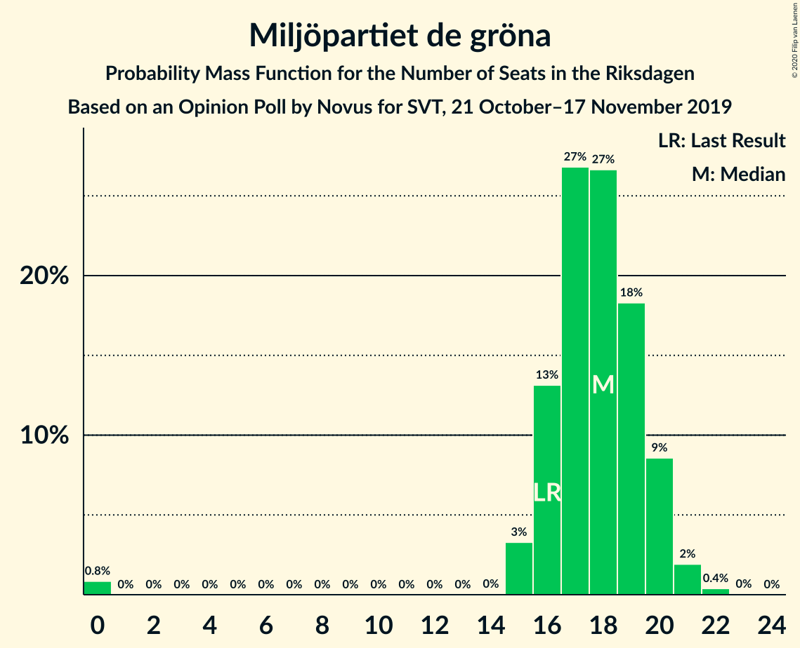
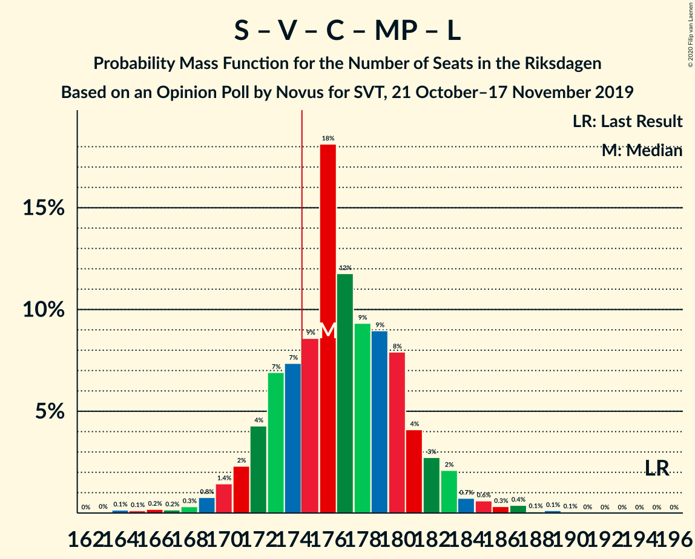
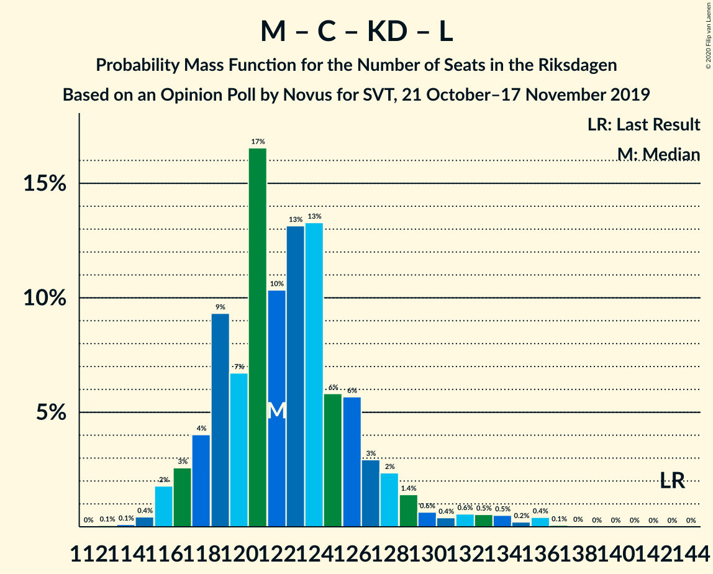

# Opinion Poll by Novus for SVT, 21 October–17 November 2019

<a href="#voting-intentions">Voting Intentions</a> | <a href="#seats">Seats</a> | <a href="#coalitions">Coalitions</a> | <a href="#technical-information">Technical Information</a>

## Voting Intentions

### Confidence Intervals

| Party | Last Result | Poll Result | 80% Confidence Interval | 90% Confidence Interval | 95% Confidence Interval | 99% Confidence Interval |
|:-----:|:-----------:|:-----------:|:-----------------------:|:-----------------------:|:-----------------------:|:-----------------------:|
| Sveriges socialdemokratiska arbetareparti | 28.3% | 26.0% | 25.1–27.0% |24.8–27.2% |24.6–27.5% |24.2–27.9% |
| Sverigedemokraterna | 17.5% | 21.5% | 20.6–22.4% |20.4–22.6% |20.2–22.9% |19.8–23.3% |
| Moderata samlingspartiet | 19.8% | 18.3% | 17.5–19.1% |17.3–19.4% |17.1–19.6% |16.7–20.0% |
| Vänsterpartiet | 8.0% | 9.3% | 8.7–10.0% |8.6–10.2% |8.4–10.3% |8.1–10.6% |
| Centerpartiet | 8.6% | 7.8% | 7.2–8.4% |7.1–8.6% |7.0–8.7% |6.7–9.0% |
| Kristdemokraterna | 6.3% | 7.1% | 6.6–7.7% |6.4–7.8% |6.3–8.0% |6.1–8.3% |
| Miljöpartiet de gröna | 4.4% | 4.8% | 4.4–5.3% |4.3–5.4% |4.1–5.6% |3.9–5.8% |
| Liberalerna | 5.5% | 3.4% | 3.0–3.8% |2.9–3.9% |2.9–4.1% |2.7–4.3% |

*Note:* The poll result column reflects the actual value used in the calculations. Published results may vary slightly, and in addition be rounded to fewer digits.

## Seats

### Confidence Intervals

| Party | Last Result | Median | 80% Confidence Interval | 90% Confidence Interval | 95% Confidence Interval | 99% Confidence Interval |
|:-----:|:-----------:|:------:|:-----------------------:|:-----------------------:|:-----------------------:|:-----------------------:|
| <a href="#sveriges-socialdemokratiska-arbetareparti">Sveriges socialdemokratiska arbetareparti</a> | 100 | 96 | 92–99 |91–100 |90–101 |88–103 |
| <a href="#sverigedemokraterna">Sverigedemokraterna</a> | 62 | 79 | 75–83 |75–83 |74–84 |72–86 |
| <a href="#moderata-samlingspartiet">Moderata samlingspartiet</a> | 70 | 67 | 64–70 |63–71 |63–72 |61–74 |
| <a href="#vänsterpartiet">Vänsterpartiet</a> | 28 | 34 | 32–36 |31–37 |31–38 |30–39 |
| <a href="#centerpartiet">Centerpartiet</a> | 31 | 29 | 27–31 |26–31 |26–32 |25–33 |
| <a href="#kristdemokraterna">Kristdemokraterna</a> | 22 | 26 | 24–28 |24–29 |23–29 |22–30 |
| <a href="#miljöpartiet-de-gröna">Miljöpartiet de gröna</a> | 16 | 18 | 16–20 |16–20 |15–20 |0–21 |
| <a href="#liberalerna">Liberalerna</a> | 20 | 0 | 0 |0 |0–14 |0–15 |

### Sveriges socialdemokratiska arbetareparti

*For a full overview of the results for this party, see the [Sveriges socialdemokratiska arbetareparti](party-sverigessocialdemokratiskaarbetareparti.html) page.*

| Number of Seats | Probability | Accumulated | Special Marks |
|:---------------:|:-----------:|:-----------:|:-------------:|
| 86 | 0.1% | 100% |  |
| 87 | 0.1% | 99.8% |  |
| 88 | 0.4% | 99.7% |  |
| 89 | 1.4% | 99.4% |  |
| 90 | 2% | 98% |  |
| 91 | 4% | 96% |  |
| 92 | 6% | 92% |  |
| 93 | 7% | 86% |  |
| 94 | 17% | 79% |  |
| 95 | 10% | 63% |  |
| 96 | 11% | 52% | Median |
| 97 | 14% | 41% |  |
| 98 | 15% | 27% |  |
| 99 | 5% | 12% |  |
| 100 | 3% | 7% | Last Result |
| 101 | 2% | 4% |  |
| 102 | 1.1% | 2% |  |
| 103 | 0.3% | 0.5% |  |
| 104 | 0.1% | 0.2% |  |
| 105 | 0.1% | 0.1% |  |
| 106 | 0% | 0% |  |

### Sverigedemokraterna

*For a full overview of the results for this party, see the [Sverigedemokraterna](party-sverigedemokraterna.html) page.*

| Number of Seats | Probability | Accumulated | Special Marks |
|:---------------:|:-----------:|:-----------:|:-------------:|
| 62 | 0% | 100% | Last Result |
| 63 | 0% | 100% |  |
| 64 | 0% | 100% |  |
| 65 | 0% | 100% |  |
| 66 | 0% | 100% |  |
| 67 | 0% | 100% |  |
| 68 | 0% | 100% |  |
| 69 | 0% | 100% |  |
| 70 | 0% | 100% |  |
| 71 | 0.2% | 99.9% |  |
| 72 | 0.3% | 99.7% |  |
| 73 | 2% | 99.4% |  |
| 74 | 2% | 98% |  |
| 75 | 6% | 96% |  |
| 76 | 10% | 90% |  |
| 77 | 6% | 80% |  |
| 78 | 14% | 74% |  |
| 79 | 21% | 60% | Median |
| 80 | 13% | 40% |  |
| 81 | 10% | 27% |  |
| 82 | 6% | 17% |  |
| 83 | 6% | 11% |  |
| 84 | 3% | 5% |  |
| 85 | 0.9% | 2% |  |
| 86 | 0.6% | 0.8% |  |
| 87 | 0.1% | 0.2% |  |
| 88 | 0.1% | 0.1% |  |
| 89 | 0% | 0% |  |

### Moderata samlingspartiet

*For a full overview of the results for this party, see the [Moderata samlingspartiet](party-moderatasamlingspartiet.html) page.*

| Number of Seats | Probability | Accumulated | Special Marks |
|:---------------:|:-----------:|:-----------:|:-------------:|
| 59 | 0% | 100% |  |
| 60 | 0.1% | 99.9% |  |
| 61 | 0.7% | 99.8% |  |
| 62 | 1.3% | 99.1% |  |
| 63 | 6% | 98% |  |
| 64 | 8% | 92% |  |
| 65 | 10% | 84% |  |
| 66 | 10% | 73% |  |
| 67 | 18% | 64% | Median |
| 68 | 16% | 46% |  |
| 69 | 15% | 30% |  |
| 70 | 5% | 14% | Last Result |
| 71 | 5% | 10% |  |
| 72 | 3% | 5% |  |
| 73 | 0.9% | 2% |  |
| 74 | 0.6% | 0.8% |  |
| 75 | 0.2% | 0.2% |  |
| 76 | 0% | 0% |  |

### Vänsterpartiet

*For a full overview of the results for this party, see the [Vänsterpartiet](party-vänsterpartiet.html) page.*

| Number of Seats | Probability | Accumulated | Special Marks |
|:---------------:|:-----------:|:-----------:|:-------------:|
| 28 | 0% | 100% | Last Result |
| 29 | 0.3% | 100% |  |
| 30 | 1.3% | 99.7% |  |
| 31 | 4% | 98% |  |
| 32 | 12% | 95% |  |
| 33 | 15% | 83% |  |
| 34 | 27% | 68% | Median |
| 35 | 13% | 40% |  |
| 36 | 18% | 27% |  |
| 37 | 5% | 9% |  |
| 38 | 3% | 4% |  |
| 39 | 0.6% | 0.9% |  |
| 40 | 0.3% | 0.3% |  |
| 41 | 0% | 0% |  |

### Centerpartiet

*For a full overview of the results for this party, see the [Centerpartiet](party-centerpartiet.html) page.*

| Number of Seats | Probability | Accumulated | Special Marks |
|:---------------:|:-----------:|:-----------:|:-------------:|
| 23 | 0.1% | 100% |  |
| 24 | 0.3% | 99.9% |  |
| 25 | 2% | 99.7% |  |
| 26 | 7% | 98% |  |
| 27 | 16% | 91% |  |
| 28 | 23% | 75% |  |
| 29 | 16% | 51% | Median |
| 30 | 21% | 35% |  |
| 31 | 9% | 14% | Last Result |
| 32 | 3% | 5% |  |
| 33 | 2% | 2% |  |
| 34 | 0.2% | 0.2% |  |
| 35 | 0% | 0% |  |

### Kristdemokraterna

*For a full overview of the results for this party, see the [Kristdemokraterna](party-kristdemokraterna.html) page.*

| Number of Seats | Probability | Accumulated | Special Marks |
|:---------------:|:-----------:|:-----------:|:-------------:|
| 21 | 0.1% | 100% |  |
| 22 | 0.8% | 99.9% | Last Result |
| 23 | 4% | 99.1% |  |
| 24 | 9% | 95% |  |
| 25 | 22% | 86% |  |
| 26 | 21% | 64% | Median |
| 27 | 21% | 43% |  |
| 28 | 15% | 22% |  |
| 29 | 5% | 7% |  |
| 30 | 1.4% | 2% |  |
| 31 | 0.4% | 0.4% |  |
| 32 | 0.1% | 0.1% |  |
| 33 | 0% | 0% |  |

### Miljöpartiet de gröna

*For a full overview of the results for this party, see the [Miljöpartiet de gröna](party-miljöpartietdegröna.html) page.*

| Number of Seats | Probability | Accumulated | Special Marks |
|:---------------:|:-----------:|:-----------:|:-------------:|
| 0 | 0.8% | 100% |  |
| 1 | 0% | 99.2% |  |
| 2 | 0% | 99.2% |  |
| 3 | 0% | 99.2% |  |
| 4 | 0% | 99.2% |  |
| 5 | 0% | 99.2% |  |
| 6 | 0% | 99.2% |  |
| 7 | 0% | 99.2% |  |
| 8 | 0% | 99.2% |  |
| 9 | 0% | 99.2% |  |
| 10 | 0% | 99.2% |  |
| 11 | 0% | 99.2% |  |
| 12 | 0% | 99.2% |  |
| 13 | 0% | 99.2% |  |
| 14 | 0% | 99.2% |  |
| 15 | 3% | 99.1% |  |
| 16 | 13% | 96% | Last Result |
| 17 | 27% | 83% |  |
| 18 | 27% | 56% | Median |
| 19 | 18% | 29% |  |
| 20 | 9% | 11% |  |
| 21 | 2% | 2% |  |
| 22 | 0.4% | 0.4% |  |
| 23 | 0% | 0% |  |

### Liberalerna

*For a full overview of the results for this party, see the [Liberalerna](party-liberalerna.html) page.*

| Number of Seats | Probability | Accumulated | Special Marks |
|:---------------:|:-----------:|:-----------:|:-------------:|
| 0 | 97% | 100% | Median |
| 1 | 0% | 3% |  |
| 2 | 0% | 3% |  |
| 3 | 0% | 3% |  |
| 4 | 0% | 3% |  |
| 5 | 0% | 3% |  |
| 6 | 0% | 3% |  |
| 7 | 0% | 3% |  |
| 8 | 0% | 3% |  |
| 9 | 0% | 3% |  |
| 10 | 0% | 3% |  |
| 11 | 0% | 3% |  |
| 12 | 0% | 3% |  |
| 13 | 0% | 3% |  |
| 14 | 2% | 3% |  |
| 15 | 1.5% | 2% |  |
| 16 | 0.1% | 0.2% |  |
| 17 | 0% | 0% |  |
| 18 | 0% | 0% |  |
| 19 | 0% | 0% |  |
| 20 | 0% | 0% | Last Result |

## Coalitions

### Confidence Intervals

| Coalition | Last Result | Median | Majority? | 80% Confidence Interval | 90% Confidence Interval | 95% Confidence Interval | 99% Confidence Interval |
|:---------:|:-----------:|:------:|:---------:|:-----------------------:|:-----------------------:|:-----------------------:|:-----------------------:|
| Sveriges socialdemokratiska arbetareparti – Moderata samlingspartiet – Centerpartiet | 201 | 191 | 100% | 187–196 | 186–197 | 184–198 | 181–201 |
| Sveriges socialdemokratiska arbetareparti – Vänsterpartiet – Centerpartiet – Miljöpartiet de gröna – Liberalerna | 195 | 176 | 76% | 173–181 | 171–182 | 170–183 | 166–187 |
| Sverigedemokraterna – Moderata samlingspartiet – Kristdemokraterna | 154 | 173 | 24% | 168–176 | 167–178 | 166–179 | 162–183 |
| Sveriges socialdemokratiska arbetareparti – Moderata samlingspartiet | 170 | 163 | 0.2% | 158–167 | 157–168 | 156–169 | 153–172 |
| Sveriges socialdemokratiska arbetareparti – Vänsterpartiet – Miljöpartiet de gröna | 144 | 148 | 0% | 143–151 | 142–152 | 141–153 | 136–156 |
| Sverigedemokraterna – Moderata samlingspartiet | 132 | 146 | 0% | 142–150 | 141–152 | 140–152 | 137–155 |
| Sveriges socialdemokratiska arbetareparti – Centerpartiet – Miljöpartiet de gröna – Liberalerna | 167 | 142 | 0% | 138–147 | 137–148 | 136–150 | 131–154 |
| Sveriges socialdemokratiska arbetareparti – Vänsterpartiet | 128 | 130 | 0% | 126–134 | 125–135 | 124–135 | 121–138 |
| Moderata samlingspartiet – Centerpartiet – Kristdemokraterna – Liberalerna | 143 | 122 | 0% | 119–127 | 118–128 | 117–131 | 115–136 |
| Moderata samlingspartiet – Centerpartiet – Kristdemokraterna | 123 | 122 | 0% | 118–126 | 117–127 | 116–128 | 114–130 |
| Sveriges socialdemokratiska arbetareparti – Miljöpartiet de gröna | 116 | 113 | 0% | 109–117 | 108–118 | 107–119 | 101–120 |
| Moderata samlingspartiet – Centerpartiet – Liberalerna | 121 | 96 | 0% | 92–100 | 91–102 | 91–106 | 89–110 |
| Moderata samlingspartiet – Centerpartiet | 101 | 96 | 0% | 92–99 | 91–101 | 90–101 | 89–103 |

### Sveriges socialdemokratiska arbetareparti – Moderata samlingspartiet – Centerpartiet

| Number of Seats | Probability | Accumulated | Special Marks |
|:---------------:|:-----------:|:-----------:|:-------------:|
| 178 | 0.1% | 100% |  |
| 179 | 0.1% | 99.9% |  |
| 180 | 0.2% | 99.8% |  |
| 181 | 0.3% | 99.6% |  |
| 182 | 0.4% | 99.3% |  |
| 183 | 0.5% | 98.9% |  |
| 184 | 1.0% | 98% |  |
| 185 | 2% | 97% |  |
| 186 | 2% | 95% |  |
| 187 | 6% | 94% |  |
| 188 | 6% | 87% |  |
| 189 | 9% | 81% |  |
| 190 | 10% | 72% |  |
| 191 | 12% | 62% |  |
| 192 | 12% | 50% | Median |
| 193 | 10% | 38% |  |
| 194 | 10% | 28% |  |
| 195 | 9% | 19% |  |
| 196 | 5% | 10% |  |
| 197 | 2% | 6% |  |
| 198 | 1.2% | 3% |  |
| 199 | 0.9% | 2% |  |
| 200 | 0.3% | 1.0% |  |
| 201 | 0.3% | 0.7% | Last Result |
| 202 | 0.1% | 0.4% |  |
| 203 | 0.1% | 0.3% |  |
| 204 | 0.1% | 0.3% |  |
| 205 | 0.1% | 0.2% |  |
| 206 | 0.1% | 0.1% |  |
| 207 | 0% | 0% |  |

### Sveriges socialdemokratiska arbetareparti – Vänsterpartiet – Centerpartiet – Miljöpartiet de gröna – Liberalerna

| Number of Seats | Probability | Accumulated | Special Marks |
|:---------------:|:-----------:|:-----------:|:-------------:|
| 163 | 0% | 100% |  |
| 164 | 0.1% | 99.9% |  |
| 165 | 0.1% | 99.8% |  |
| 166 | 0.2% | 99.7% |  |
| 167 | 0.2% | 99.5% |  |
| 168 | 0.3% | 99.3% |  |
| 169 | 0.8% | 99.0% |  |
| 170 | 1.4% | 98% |  |
| 171 | 2% | 97% |  |
| 172 | 4% | 94% |  |
| 173 | 7% | 90% |  |
| 174 | 7% | 83% |  |
| 175 | 9% | 76% | Majority |
| 176 | 18% | 67% |  |
| 177 | 12% | 49% | Median |
| 178 | 9% | 37% |  |
| 179 | 9% | 28% |  |
| 180 | 8% | 19% |  |
| 181 | 4% | 11% |  |
| 182 | 3% | 7% |  |
| 183 | 2% | 4% |  |
| 184 | 0.7% | 2% |  |
| 185 | 0.6% | 2% |  |
| 186 | 0.3% | 1.0% |  |
| 187 | 0.4% | 0.7% |  |
| 188 | 0.1% | 0.3% |  |
| 189 | 0.1% | 0.2% |  |
| 190 | 0.1% | 0.1% |  |
| 191 | 0% | 0% |  |
| 192 | 0% | 0% |  |
| 193 | 0% | 0% |  |
| 194 | 0% | 0% |  |
| 195 | 0% | 0% | Last Result |

### Sverigedemokraterna – Moderata samlingspartiet – Kristdemokraterna

| Number of Seats | Probability | Accumulated | Special Marks |
|:---------------:|:-----------:|:-----------:|:-------------:|
| 154 | 0% | 100% | Last Result |
| 155 | 0% | 100% |  |
| 156 | 0% | 100% |  |
| 157 | 0% | 100% |  |
| 158 | 0% | 100% |  |
| 159 | 0.1% | 100% |  |
| 160 | 0.1% | 99.9% |  |
| 161 | 0.1% | 99.8% |  |
| 162 | 0.4% | 99.7% |  |
| 163 | 0.3% | 99.3% |  |
| 164 | 0.6% | 99.0% |  |
| 165 | 0.7% | 98% |  |
| 166 | 2% | 98% |  |
| 167 | 3% | 96% |  |
| 168 | 4% | 93% |  |
| 169 | 8% | 89% |  |
| 170 | 9% | 81% |  |
| 171 | 9% | 72% |  |
| 172 | 12% | 63% | Median |
| 173 | 18% | 51% |  |
| 174 | 9% | 33% |  |
| 175 | 7% | 24% | Majority |
| 176 | 7% | 17% |  |
| 177 | 4% | 10% |  |
| 178 | 2% | 6% |  |
| 179 | 1.4% | 3% |  |
| 180 | 0.8% | 2% |  |
| 181 | 0.3% | 1.0% |  |
| 182 | 0.2% | 0.7% |  |
| 183 | 0.2% | 0.5% |  |
| 184 | 0.1% | 0.3% |  |
| 185 | 0.1% | 0.2% |  |
| 186 | 0% | 0.1% |  |
| 187 | 0% | 0% |  |

### Sveriges socialdemokratiska arbetareparti – Moderata samlingspartiet

| Number of Seats | Probability | Accumulated | Special Marks |
|:---------------:|:-----------:|:-----------:|:-------------:|
| 150 | 0% | 100% |  |
| 151 | 0.1% | 99.9% |  |
| 152 | 0.3% | 99.9% |  |
| 153 | 0.4% | 99.6% |  |
| 154 | 0.3% | 99.3% |  |
| 155 | 1.0% | 99.0% |  |
| 156 | 0.8% | 98% |  |
| 157 | 2% | 97% |  |
| 158 | 7% | 95% |  |
| 159 | 4% | 88% |  |
| 160 | 11% | 84% |  |
| 161 | 13% | 74% |  |
| 162 | 10% | 61% |  |
| 163 | 8% | 51% | Median |
| 164 | 8% | 42% |  |
| 165 | 10% | 34% |  |
| 166 | 10% | 23% |  |
| 167 | 7% | 14% |  |
| 168 | 3% | 7% |  |
| 169 | 2% | 4% |  |
| 170 | 1.4% | 2% | Last Result |
| 171 | 0.3% | 1.0% |  |
| 172 | 0.3% | 0.7% |  |
| 173 | 0.1% | 0.4% |  |
| 174 | 0% | 0.3% |  |
| 175 | 0.1% | 0.2% | Majority |
| 176 | 0% | 0.1% |  |
| 177 | 0.1% | 0.1% |  |
| 178 | 0% | 0% |  |

### Sveriges socialdemokratiska arbetareparti – Vänsterpartiet – Miljöpartiet de gröna

| Number of Seats | Probability | Accumulated | Special Marks |
|:---------------:|:-----------:|:-----------:|:-------------:|
| 132 | 0% | 100% |  |
| 133 | 0.1% | 99.9% |  |
| 134 | 0% | 99.9% |  |
| 135 | 0.3% | 99.8% |  |
| 136 | 0.1% | 99.5% |  |
| 137 | 0.4% | 99.4% |  |
| 138 | 0.4% | 99.0% |  |
| 139 | 0.6% | 98.6% |  |
| 140 | 0.5% | 98% |  |
| 141 | 0.9% | 98% |  |
| 142 | 2% | 97% |  |
| 143 | 5% | 94% |  |
| 144 | 10% | 89% | Last Result |
| 145 | 9% | 79% |  |
| 146 | 9% | 70% |  |
| 147 | 6% | 62% |  |
| 148 | 9% | 56% | Median |
| 149 | 17% | 47% |  |
| 150 | 14% | 30% |  |
| 151 | 7% | 16% |  |
| 152 | 5% | 9% |  |
| 153 | 2% | 3% |  |
| 154 | 0.7% | 2% |  |
| 155 | 0.5% | 1.0% |  |
| 156 | 0.4% | 0.6% |  |
| 157 | 0.1% | 0.2% |  |
| 158 | 0.1% | 0.1% |  |
| 159 | 0% | 0% |  |

### Sverigedemokraterna – Moderata samlingspartiet

| Number of Seats | Probability | Accumulated | Special Marks |
|:---------------:|:-----------:|:-----------:|:-------------:|
| 132 | 0% | 100% | Last Result |
| 133 | 0% | 100% |  |
| 134 | 0.1% | 100% |  |
| 135 | 0.1% | 99.9% |  |
| 136 | 0.1% | 99.8% |  |
| 137 | 0.4% | 99.7% |  |
| 138 | 0.7% | 99.4% |  |
| 139 | 0.9% | 98.7% |  |
| 140 | 2% | 98% |  |
| 141 | 2% | 96% |  |
| 142 | 5% | 93% |  |
| 143 | 10% | 88% |  |
| 144 | 10% | 78% |  |
| 145 | 9% | 68% |  |
| 146 | 13% | 59% | Median |
| 147 | 10% | 46% |  |
| 148 | 15% | 36% |  |
| 149 | 5% | 21% |  |
| 150 | 6% | 16% |  |
| 151 | 4% | 9% |  |
| 152 | 3% | 6% |  |
| 153 | 1.2% | 2% |  |
| 154 | 0.5% | 1.3% |  |
| 155 | 0.3% | 0.8% |  |
| 156 | 0.2% | 0.5% |  |
| 157 | 0.2% | 0.3% |  |
| 158 | 0% | 0.1% |  |
| 159 | 0% | 0% |  |

### Sveriges socialdemokratiska arbetareparti – Centerpartiet – Miljöpartiet de gröna – Liberalerna

| Number of Seats | Probability | Accumulated | Special Marks |
|:---------------:|:-----------:|:-----------:|:-------------:|
| 127 | 0% | 100% |  |
| 128 | 0.1% | 99.9% |  |
| 129 | 0% | 99.8% |  |
| 130 | 0.2% | 99.8% |  |
| 131 | 0.2% | 99.6% |  |
| 132 | 0.1% | 99.4% |  |
| 133 | 0.1% | 99.3% |  |
| 134 | 0.4% | 99.2% |  |
| 135 | 0.7% | 98.7% |  |
| 136 | 2% | 98% |  |
| 137 | 4% | 96% |  |
| 138 | 4% | 93% |  |
| 139 | 6% | 89% |  |
| 140 | 9% | 82% |  |
| 141 | 9% | 73% |  |
| 142 | 17% | 64% |  |
| 143 | 10% | 46% | Median |
| 144 | 11% | 36% |  |
| 145 | 9% | 25% |  |
| 146 | 5% | 15% |  |
| 147 | 4% | 11% |  |
| 148 | 2% | 6% |  |
| 149 | 2% | 5% |  |
| 150 | 0.9% | 3% |  |
| 151 | 0.4% | 2% |  |
| 152 | 0.4% | 1.4% |  |
| 153 | 0.4% | 1.0% |  |
| 154 | 0.2% | 0.6% |  |
| 155 | 0.2% | 0.4% |  |
| 156 | 0.2% | 0.3% |  |
| 157 | 0.1% | 0.1% |  |
| 158 | 0% | 0% |  |
| 159 | 0% | 0% |  |
| 160 | 0% | 0% |  |
| 161 | 0% | 0% |  |
| 162 | 0% | 0% |  |
| 163 | 0% | 0% |  |
| 164 | 0% | 0% |  |
| 165 | 0% | 0% |  |
| 166 | 0% | 0% |  |
| 167 | 0% | 0% | Last Result |

### Sveriges socialdemokratiska arbetareparti – Vänsterpartiet

| Number of Seats | Probability | Accumulated | Special Marks |
|:---------------:|:-----------:|:-----------:|:-------------:|
| 119 | 0.1% | 100% |  |
| 120 | 0.1% | 99.8% |  |
| 121 | 0.2% | 99.7% |  |
| 122 | 0.7% | 99.5% |  |
| 123 | 1.0% | 98.7% |  |
| 124 | 2% | 98% |  |
| 125 | 3% | 96% |  |
| 126 | 5% | 92% |  |
| 127 | 10% | 87% |  |
| 128 | 12% | 77% | Last Result |
| 129 | 12% | 65% |  |
| 130 | 10% | 54% | Median |
| 131 | 10% | 43% |  |
| 132 | 16% | 33% |  |
| 133 | 7% | 17% |  |
| 134 | 5% | 11% |  |
| 135 | 3% | 6% |  |
| 136 | 1.0% | 2% |  |
| 137 | 0.6% | 1.4% |  |
| 138 | 0.5% | 0.8% |  |
| 139 | 0.1% | 0.3% |  |
| 140 | 0.1% | 0.2% |  |
| 141 | 0.1% | 0.1% |  |
| 142 | 0% | 0.1% |  |
| 143 | 0% | 0% |  |

### Moderata samlingspartiet – Centerpartiet – Kristdemokraterna – Liberalerna

| Number of Seats | Probability | Accumulated | Special Marks |
|:---------------:|:-----------:|:-----------:|:-------------:|
| 113 | 0.1% | 100% |  |
| 114 | 0.1% | 99.9% |  |
| 115 | 0.4% | 99.8% |  |
| 116 | 2% | 99.4% |  |
| 117 | 3% | 98% |  |
| 118 | 4% | 95% |  |
| 119 | 9% | 91% |  |
| 120 | 7% | 82% |  |
| 121 | 17% | 75% |  |
| 122 | 10% | 58% | Median |
| 123 | 13% | 48% |  |
| 124 | 13% | 35% |  |
| 125 | 6% | 22% |  |
| 126 | 6% | 16% |  |
| 127 | 3% | 10% |  |
| 128 | 2% | 7% |  |
| 129 | 1.4% | 5% |  |
| 130 | 0.6% | 3% |  |
| 131 | 0.4% | 3% |  |
| 132 | 0.6% | 2% |  |
| 133 | 0.5% | 2% |  |
| 134 | 0.5% | 1.3% |  |
| 135 | 0.2% | 0.8% |  |
| 136 | 0.4% | 0.6% |  |
| 137 | 0.1% | 0.2% |  |
| 138 | 0% | 0.1% |  |
| 139 | 0% | 0% |  |
| 140 | 0% | 0% |  |
| 141 | 0% | 0% |  |
| 142 | 0% | 0% |  |
| 143 | 0% | 0% | Last Result |

### Moderata samlingspartiet – Centerpartiet – Kristdemokraterna

| Number of Seats | Probability | Accumulated | Special Marks |
|:---------------:|:-----------:|:-----------:|:-------------:|
| 111 | 0% | 100% |  |
| 112 | 0.1% | 99.9% |  |
| 113 | 0.2% | 99.9% |  |
| 114 | 0.4% | 99.6% |  |
| 115 | 0.8% | 99.3% |  |
| 116 | 2% | 98% |  |
| 117 | 3% | 96% |  |
| 118 | 5% | 93% |  |
| 119 | 10% | 89% |  |
| 120 | 7% | 79% |  |
| 121 | 17% | 72% |  |
| 122 | 11% | 55% | Median |
| 123 | 13% | 45% | Last Result |
| 124 | 13% | 32% |  |
| 125 | 6% | 18% |  |
| 126 | 6% | 12% |  |
| 127 | 3% | 7% |  |
| 128 | 2% | 4% |  |
| 129 | 1.0% | 2% |  |
| 130 | 0.5% | 0.8% |  |
| 131 | 0.2% | 0.3% |  |
| 132 | 0.1% | 0.2% |  |
| 133 | 0.1% | 0.1% |  |
| 134 | 0% | 0% |  |

### Sveriges socialdemokratiska arbetareparti – Miljöpartiet de gröna

| Number of Seats | Probability | Accumulated | Special Marks |
|:---------------:|:-----------:|:-----------:|:-------------:|
| 96 | 0.1% | 100% |  |
| 97 | 0.1% | 99.9% |  |
| 98 | 0.1% | 99.8% |  |
| 99 | 0% | 99.8% |  |
| 100 | 0% | 99.7% |  |
| 101 | 0.2% | 99.7% |  |
| 102 | 0.2% | 99.5% |  |
| 103 | 0.2% | 99.3% |  |
| 104 | 0.2% | 99.1% |  |
| 105 | 0.7% | 98.9% |  |
| 106 | 0.5% | 98% |  |
| 107 | 1.2% | 98% |  |
| 108 | 2% | 96% |  |
| 109 | 6% | 94% |  |
| 110 | 7% | 88% |  |
| 111 | 8% | 81% |  |
| 112 | 12% | 73% |  |
| 113 | 11% | 61% |  |
| 114 | 11% | 50% | Median |
| 115 | 16% | 39% |  |
| 116 | 9% | 23% | Last Result |
| 117 | 7% | 14% |  |
| 118 | 3% | 7% |  |
| 119 | 2% | 4% |  |
| 120 | 1.0% | 2% |  |
| 121 | 0.3% | 0.5% |  |
| 122 | 0.1% | 0.2% |  |
| 123 | 0.1% | 0.1% |  |
| 124 | 0% | 0% |  |

### Moderata samlingspartiet – Centerpartiet – Liberalerna

| Number of Seats | Probability | Accumulated | Special Marks |
|:---------------:|:-----------:|:-----------:|:-------------:|
| 87 | 0.1% | 100% |  |
| 88 | 0.1% | 99.9% |  |
| 89 | 0.4% | 99.9% |  |
| 90 | 1.1% | 99.4% |  |
| 91 | 4% | 98% |  |
| 92 | 6% | 94% |  |
| 93 | 8% | 88% |  |
| 94 | 8% | 81% |  |
| 95 | 9% | 73% |  |
| 96 | 22% | 64% | Median |
| 97 | 10% | 42% |  |
| 98 | 14% | 31% |  |
| 99 | 5% | 17% |  |
| 100 | 3% | 12% |  |
| 101 | 3% | 9% |  |
| 102 | 1.1% | 6% |  |
| 103 | 1.1% | 5% |  |
| 104 | 0.7% | 4% |  |
| 105 | 0.3% | 3% |  |
| 106 | 0.3% | 3% |  |
| 107 | 0.2% | 2% |  |
| 108 | 1.2% | 2% |  |
| 109 | 0.1% | 0.8% |  |
| 110 | 0.5% | 0.7% |  |
| 111 | 0.1% | 0.2% |  |
| 112 | 0.1% | 0.1% |  |
| 113 | 0% | 0% |  |
| 114 | 0% | 0% |  |
| 115 | 0% | 0% |  |
| 116 | 0% | 0% |  |
| 117 | 0% | 0% |  |
| 118 | 0% | 0% |  |
| 119 | 0% | 0% |  |
| 120 | 0% | 0% |  |
| 121 | 0% | 0% | Last Result |

### Moderata samlingspartiet – Centerpartiet

| Number of Seats | Probability | Accumulated | Special Marks |
|:---------------:|:-----------:|:-----------:|:-------------:|
| 86 | 0% | 100% |  |
| 87 | 0.2% | 99.9% |  |
| 88 | 0.2% | 99.8% |  |
| 89 | 0.7% | 99.6% |  |
| 90 | 1.5% | 98.9% |  |
| 91 | 5% | 97% |  |
| 92 | 6% | 93% |  |
| 93 | 8% | 87% |  |
| 94 | 8% | 79% |  |
| 95 | 9% | 70% |  |
| 96 | 23% | 61% | Median |
| 97 | 10% | 38% |  |
| 98 | 14% | 28% |  |
| 99 | 5% | 14% |  |
| 100 | 3% | 9% |  |
| 101 | 3% | 6% | Last Result |
| 102 | 1.1% | 2% |  |
| 103 | 1.0% | 1.4% |  |
| 104 | 0.2% | 0.4% |  |
| 105 | 0.1% | 0.1% |  |
| 106 | 0% | 0.1% |  |
| 107 | 0% | 0% |  |

## Technical Information

### Opinion Poll

+ **Polling firm:** Novus
+ **Commissioner(s):** SVT
+ **Fieldwork period:** 21 October–17 November 2019

### Calculations

+ **Sample size:** 3619
+ **Simulations done:** 1,048,576
+ **Error estimate:** 1.02%

