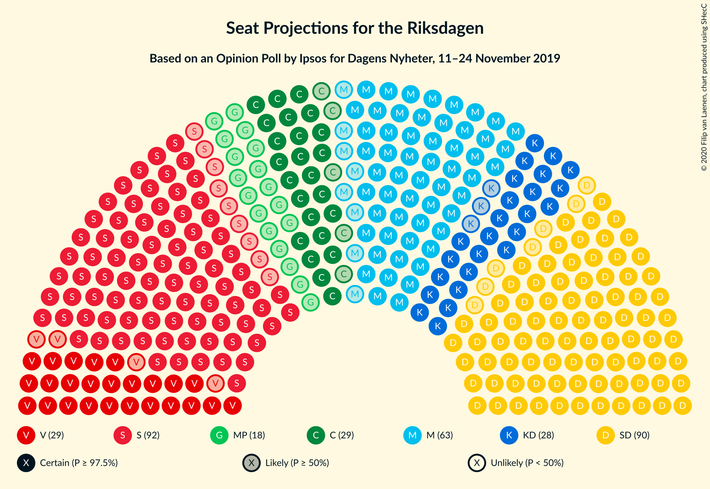
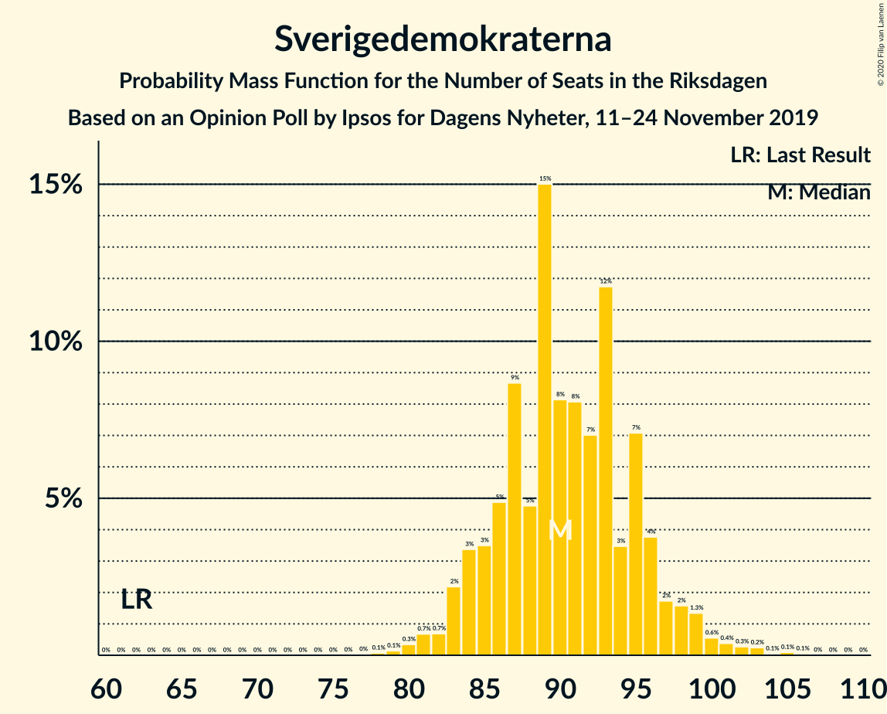
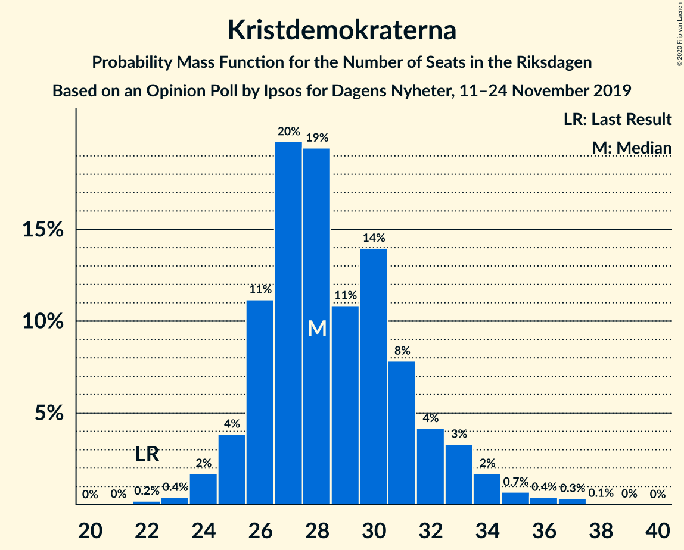
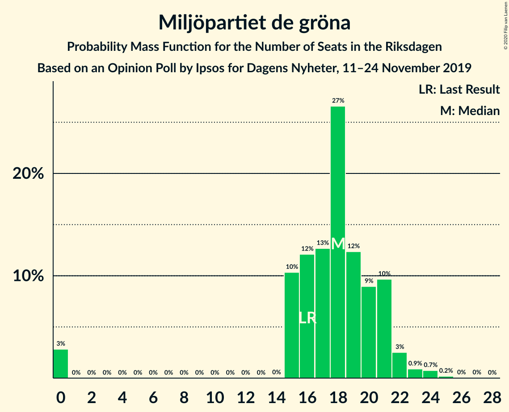
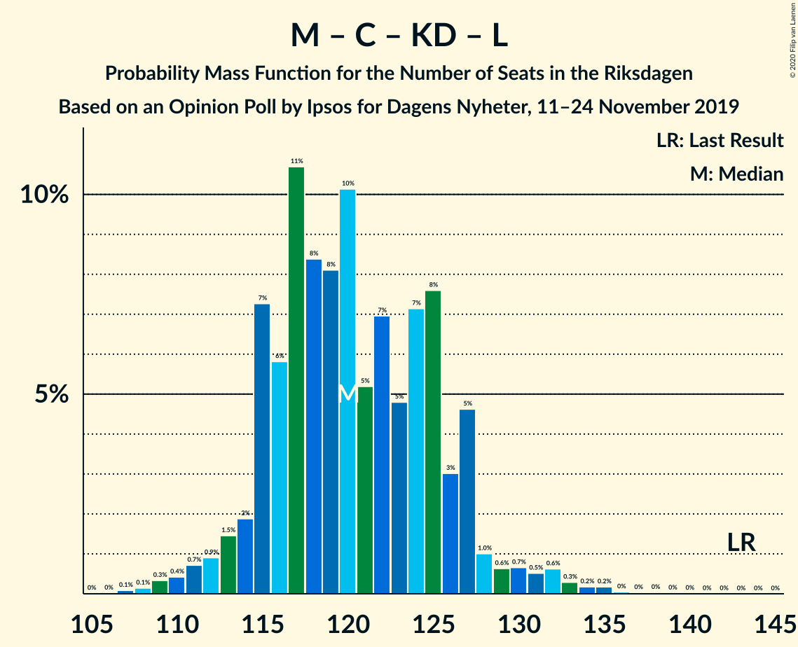
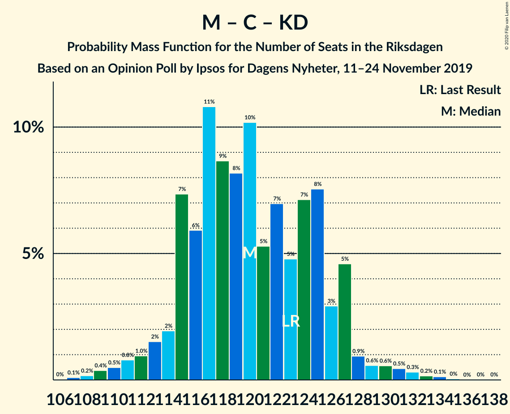

# Opinion Poll by Ipsos for Dagens Nyheter, 11–24 November 2019

<a href="#voting-intentions">Voting Intentions</a> | <a href="#seats">Seats</a> | <a href="#coalitions">Coalitions</a> | <a href="#technical-information">Technical Information</a>

## Voting Intentions

### Confidence Intervals

| Party | Last Result | Poll Result | 80% Confidence Interval | 90% Confidence Interval | 95% Confidence Interval | 99% Confidence Interval |
|:-----:|:-----------:|:-----------:|:-----------------------:|:-----------------------:|:-----------------------:|:-----------------------:|
| Sveriges socialdemokratiska arbetareparti | 28.3% | 24.8% | 23.4–26.2% |23.0–26.6% |22.7–27.0% |22.0–27.7% |
| Sverigedemokraterna | 17.5% | 24.8% | 23.4–26.2% |23.0–26.6% |22.7–27.0% |22.0–27.7% |
| Moderata samlingspartiet | 19.8% | 16.8% | 15.7–18.1% |15.3–18.5% |15.0–18.8% |14.5–19.4% |
| Centerpartiet | 8.6% | 7.9% | 7.1–8.9% |6.9–9.2% |6.7–9.4% |6.3–9.9% |
| Vänsterpartiet | 8.0% | 7.9% | 7.1–8.9% |6.9–9.2% |6.7–9.4% |6.3–9.9% |
| Kristdemokraterna | 6.3% | 7.9% | 7.1–8.9% |6.9–9.2% |6.7–9.4% |6.3–9.9% |
| Miljöpartiet de gröna | 4.4% | 5.0% | 4.3–5.7% |4.1–6.0% |4.0–6.2% |3.7–6.6% |
| Liberalerna | 5.5% | 3.0% | 2.5–3.6% |2.3–3.8% |2.2–3.9% |2.0–4.3% |

*Note:* The poll result column reflects the actual value used in the calculations. Published results may vary slightly, and in addition be rounded to fewer digits.

## Seats

### Confidence Intervals

| Party | Last Result | Median | 80% Confidence Interval | 90% Confidence Interval | 95% Confidence Interval | 99% Confidence Interval |
|:-----:|:-----------:|:------:|:-----------------------:|:-----------------------:|:-----------------------:|:-----------------------:|
| <a href="#sveriges-socialdemokratiska-arbetareparti">Sveriges socialdemokratiska arbetareparti</a> | 100 | 92 | 86–97 |84–98 |83–100 |81–103 |
| <a href="#sverigedemokraterna">Sverigedemokraterna</a> | 62 | 90 | 85–96 |84–97 |83–99 |80–102 |
| <a href="#moderata-samlingspartiet">Moderata samlingspartiet</a> | 70 | 63 | 58–67 |56–68 |55–69 |53–71 |
| <a href="#centerpartiet">Centerpartiet</a> | 31 | 29 | 26–32 |25–33 |24–34 |23–36 |
| <a href="#vänsterpartiet">Vänsterpartiet</a> | 28 | 29 | 27–31 |26–34 |25–35 |23–37 |
| <a href="#kristdemokraterna">Kristdemokraterna</a> | 22 | 28 | 26–32 |25–33 |25–34 |23–36 |
| <a href="#miljöpartiet-de-gröna">Miljöpartiet de gröna</a> | 16 | 18 | 15–21 |15–21 |0–22 |0–24 |
| <a href="#liberalerna">Liberalerna</a> | 20 | 0 | 0 |0 |0 |0–15 |

### Sveriges socialdemokratiska arbetareparti

*For a full overview of the results for this party, see the [Sveriges socialdemokratiska arbetareparti](party-sverigessocialdemokratiskaarbetareparti.html) page.*

| Number of Seats | Probability | Accumulated | Special Marks |
|:---------------:|:-----------:|:-----------:|:-------------:|
| 77 | 0% | 100% |  |
| 78 | 0% | 99.9% |  |
| 79 | 0.1% | 99.9% |  |
| 80 | 0.2% | 99.8% |  |
| 81 | 0.5% | 99.5% |  |
| 82 | 0.5% | 99.1% |  |
| 83 | 2% | 98.6% |  |
| 84 | 2% | 97% |  |
| 85 | 1.5% | 95% |  |
| 86 | 5% | 93% |  |
| 87 | 6% | 88% |  |
| 88 | 5% | 82% |  |
| 89 | 5% | 77% |  |
| 90 | 9% | 72% |  |
| 91 | 12% | 63% |  |
| 92 | 8% | 51% | Median |
| 93 | 8% | 44% |  |
| 94 | 12% | 36% |  |
| 95 | 3% | 23% |  |
| 96 | 9% | 20% |  |
| 97 | 3% | 11% |  |
| 98 | 4% | 8% |  |
| 99 | 0.8% | 4% |  |
| 100 | 2% | 3% | Last Result |
| 101 | 0.6% | 2% |  |
| 102 | 0.2% | 1.0% |  |
| 103 | 0.4% | 0.9% |  |
| 104 | 0.4% | 0.5% |  |
| 105 | 0% | 0.1% |  |
| 106 | 0% | 0.1% |  |
| 107 | 0% | 0% |  |

### Sverigedemokraterna

*For a full overview of the results for this party, see the [Sverigedemokraterna](party-sverigedemokraterna.html) page.*

| Number of Seats | Probability | Accumulated | Special Marks |
|:---------------:|:-----------:|:-----------:|:-------------:|
| 62 | 0% | 100% | Last Result |
| 63 | 0% | 100% |  |
| 64 | 0% | 100% |  |
| 65 | 0% | 100% |  |
| 66 | 0% | 100% |  |
| 67 | 0% | 100% |  |
| 68 | 0% | 100% |  |
| 69 | 0% | 100% |  |
| 70 | 0% | 100% |  |
| 71 | 0% | 100% |  |
| 72 | 0% | 100% |  |
| 73 | 0% | 100% |  |
| 74 | 0% | 100% |  |
| 75 | 0% | 100% |  |
| 76 | 0% | 100% |  |
| 77 | 0% | 100% |  |
| 78 | 0.1% | 100% |  |
| 79 | 0.1% | 99.9% |  |
| 80 | 0.3% | 99.7% |  |
| 81 | 0.7% | 99.4% |  |
| 82 | 0.7% | 98.7% |  |
| 83 | 2% | 98% |  |
| 84 | 3% | 96% |  |
| 85 | 3% | 92% |  |
| 86 | 5% | 89% |  |
| 87 | 9% | 84% |  |
| 88 | 5% | 75% |  |
| 89 | 15% | 71% |  |
| 90 | 8% | 56% | Median |
| 91 | 8% | 47% |  |
| 92 | 7% | 39% |  |
| 93 | 12% | 32% |  |
| 94 | 3% | 21% |  |
| 95 | 7% | 17% |  |
| 96 | 4% | 10% |  |
| 97 | 2% | 6% |  |
| 98 | 2% | 5% |  |
| 99 | 1.3% | 3% |  |
| 100 | 0.6% | 2% |  |
| 101 | 0.4% | 1.1% |  |
| 102 | 0.3% | 0.7% |  |
| 103 | 0.2% | 0.5% |  |
| 104 | 0.1% | 0.2% |  |
| 105 | 0.1% | 0.2% |  |
| 106 | 0.1% | 0.1% |  |
| 107 | 0% | 0% |  |

### Moderata samlingspartiet

*For a full overview of the results for this party, see the [Moderata samlingspartiet](party-moderatasamlingspartiet.html) page.*

| Number of Seats | Probability | Accumulated | Special Marks |
|:---------------:|:-----------:|:-----------:|:-------------:|
| 50 | 0% | 100% |  |
| 51 | 0.1% | 99.9% |  |
| 52 | 0.2% | 99.8% |  |
| 53 | 0.5% | 99.6% |  |
| 54 | 1.0% | 99.1% |  |
| 55 | 1.5% | 98% |  |
| 56 | 2% | 97% |  |
| 57 | 4% | 95% |  |
| 58 | 5% | 90% |  |
| 59 | 4% | 86% |  |
| 60 | 8% | 81% |  |
| 61 | 10% | 73% |  |
| 62 | 11% | 63% |  |
| 63 | 9% | 52% | Median |
| 64 | 10% | 43% |  |
| 65 | 12% | 32% |  |
| 66 | 7% | 20% |  |
| 67 | 5% | 13% |  |
| 68 | 4% | 8% |  |
| 69 | 3% | 4% |  |
| 70 | 0.9% | 2% | Last Result |
| 71 | 0.6% | 1.0% |  |
| 72 | 0.3% | 0.4% |  |
| 73 | 0.1% | 0.2% |  |
| 74 | 0.1% | 0.1% |  |
| 75 | 0% | 0% |  |

### Centerpartiet

*For a full overview of the results for this party, see the [Centerpartiet](party-centerpartiet.html) page.*

| Number of Seats | Probability | Accumulated | Special Marks |
|:---------------:|:-----------:|:-----------:|:-------------:|
| 21 | 0.1% | 100% |  |
| 22 | 0.1% | 99.9% |  |
| 23 | 0.7% | 99.8% |  |
| 24 | 3% | 99.1% |  |
| 25 | 3% | 97% |  |
| 26 | 9% | 93% |  |
| 27 | 13% | 84% |  |
| 28 | 10% | 72% |  |
| 29 | 20% | 61% | Median |
| 30 | 17% | 41% |  |
| 31 | 8% | 24% | Last Result |
| 32 | 8% | 16% |  |
| 33 | 5% | 8% |  |
| 34 | 2% | 4% |  |
| 35 | 2% | 2% |  |
| 36 | 0.3% | 0.6% |  |
| 37 | 0.2% | 0.3% |  |
| 38 | 0.1% | 0.1% |  |
| 39 | 0% | 0% |  |

### Vänsterpartiet

*For a full overview of the results for this party, see the [Vänsterpartiet](party-vänsterpartiet.html) page.*

| Number of Seats | Probability | Accumulated | Special Marks |
|:---------------:|:-----------:|:-----------:|:-------------:|
| 22 | 0.2% | 100% |  |
| 23 | 0.5% | 99.8% |  |
| 24 | 1.2% | 99.3% |  |
| 25 | 1.3% | 98% |  |
| 26 | 4% | 97% |  |
| 27 | 16% | 93% |  |
| 28 | 21% | 76% | Last Result |
| 29 | 24% | 55% | Median |
| 30 | 15% | 31% |  |
| 31 | 7% | 16% |  |
| 32 | 3% | 9% |  |
| 33 | 1.3% | 6% |  |
| 34 | 1.3% | 5% |  |
| 35 | 2% | 4% |  |
| 36 | 1.3% | 2% |  |
| 37 | 0.6% | 0.7% |  |
| 38 | 0.1% | 0.1% |  |
| 39 | 0% | 0% |  |

### Kristdemokraterna

*For a full overview of the results for this party, see the [Kristdemokraterna](party-kristdemokraterna.html) page.*

| Number of Seats | Probability | Accumulated | Special Marks |
|:---------------:|:-----------:|:-----------:|:-------------:|
| 22 | 0.2% | 100% | Last Result |
| 23 | 0.4% | 99.8% |  |
| 24 | 2% | 99.3% |  |
| 25 | 4% | 98% |  |
| 26 | 11% | 94% |  |
| 27 | 20% | 83% |  |
| 28 | 19% | 63% | Median |
| 29 | 11% | 43% |  |
| 30 | 14% | 33% |  |
| 31 | 8% | 19% |  |
| 32 | 4% | 11% |  |
| 33 | 3% | 7% |  |
| 34 | 2% | 3% |  |
| 35 | 0.7% | 2% |  |
| 36 | 0.4% | 0.9% |  |
| 37 | 0.3% | 0.5% |  |
| 38 | 0.1% | 0.2% |  |
| 39 | 0% | 0.1% |  |
| 40 | 0% | 0% |  |

### Miljöpartiet de gröna

*For a full overview of the results for this party, see the [Miljöpartiet de gröna](party-miljöpartietdegröna.html) page.*

| Number of Seats | Probability | Accumulated | Special Marks |
|:---------------:|:-----------:|:-----------:|:-------------:|
| 0 | 3% | 100% |  |
| 1 | 0% | 97% |  |
| 2 | 0% | 97% |  |
| 3 | 0% | 97% |  |
| 4 | 0% | 97% |  |
| 5 | 0% | 97% |  |
| 6 | 0% | 97% |  |
| 7 | 0% | 97% |  |
| 8 | 0% | 97% |  |
| 9 | 0% | 97% |  |
| 10 | 0% | 97% |  |
| 11 | 0% | 97% |  |
| 12 | 0% | 97% |  |
| 13 | 0% | 97% |  |
| 14 | 0% | 97% |  |
| 15 | 10% | 97% |  |
| 16 | 12% | 87% | Last Result |
| 17 | 13% | 75% |  |
| 18 | 27% | 62% | Median |
| 19 | 12% | 35% |  |
| 20 | 9% | 23% |  |
| 21 | 10% | 14% |  |
| 22 | 3% | 4% |  |
| 23 | 0.9% | 2% |  |
| 24 | 0.7% | 1.0% |  |
| 25 | 0.2% | 0.3% |  |
| 26 | 0% | 0.1% |  |
| 27 | 0% | 0% |  |

### Liberalerna

*For a full overview of the results for this party, see the [Liberalerna](party-liberalerna.html) page.*

| Number of Seats | Probability | Accumulated | Special Marks |
|:---------------:|:-----------:|:-----------:|:-------------:|
| 0 | 98.7% | 100% | Median |
| 1 | 0% | 1.3% |  |
| 2 | 0% | 1.3% |  |
| 3 | 0% | 1.3% |  |
| 4 | 0% | 1.3% |  |
| 5 | 0% | 1.3% |  |
| 6 | 0% | 1.3% |  |
| 7 | 0% | 1.3% |  |
| 8 | 0% | 1.3% |  |
| 9 | 0% | 1.3% |  |
| 10 | 0% | 1.3% |  |
| 11 | 0% | 1.3% |  |
| 12 | 0% | 1.3% |  |
| 13 | 0% | 1.3% |  |
| 14 | 0.5% | 1.3% |  |
| 15 | 0.6% | 0.8% |  |
| 16 | 0.1% | 0.2% |  |
| 17 | 0% | 0% |  |
| 18 | 0% | 0% |  |
| 19 | 0% | 0% |  |
| 20 | 0% | 0% | Last Result |

## Coalitions

### Confidence Intervals

| Coalition | Last Result | Median | Majority? | 80% Confidence Interval | 90% Confidence Interval | 95% Confidence Interval | 99% Confidence Interval |
|:---------:|:-----------:|:------:|:---------:|:-----------------------:|:-----------------------:|:-----------------------:|:-----------------------:|
| Sverigedemokraterna – Moderata samlingspartiet – Kristdemokraterna | 154 | 181 | 93% | 176–188 | 174–189 | 173–192 | 169–198 |
| Sveriges socialdemokratiska arbetareparti – Moderata samlingspartiet – Centerpartiet | 201 | 184 | 95% | 176–189 | 174–190 | 172–192 | 168–197 |
| Sveriges socialdemokratiska arbetareparti – Centerpartiet – Vänsterpartiet – Miljöpartiet de gröna – Liberalerna | 195 | 168 | 7% | 161–173 | 160–175 | 157–176 | 151–180 |
| Sverigedemokraterna – Moderata samlingspartiet | 132 | 153 | 0% | 147–159 | 145–161 | 144–162 | 141–167 |
| Sveriges socialdemokratiska arbetareparti – Moderata samlingspartiet | 170 | 155 | 0% | 148–160 | 145–161 | 143–162 | 139–167 |
| Sveriges socialdemokratiska arbetareparti – Centerpartiet – Miljöpartiet de gröna – Liberalerna | 167 | 139 | 0% | 132–144 | 130–146 | 128–147 | 121–151 |
| Sveriges socialdemokratiska arbetareparti – Vänsterpartiet – Miljöpartiet de gröna | 144 | 139 | 0% | 132–144 | 131–146 | 128–147 | 121–150 |
| Moderata samlingspartiet – Centerpartiet – Kristdemokraterna – Liberalerna | 143 | 120 | 0% | 115–126 | 114–127 | 112–130 | 109–134 |
| Sveriges socialdemokratiska arbetareparti – Vänsterpartiet | 128 | 121 | 0% | 115–126 | 114–128 | 112–129 | 109–134 |
| Moderata samlingspartiet – Centerpartiet – Kristdemokraterna | 123 | 120 | 0% | 115–126 | 114–127 | 112–128 | 109–132 |
| Sveriges socialdemokratiska arbetareparti – Miljöpartiet de gröna | 116 | 110 | 0% | 103–115 | 101–117 | 99–118 | 90–120 |
| Moderata samlingspartiet – Centerpartiet – Liberalerna | 121 | 92 | 0% | 86–97 | 85–99 | 84–100 | 81–105 |
| Moderata samlingspartiet – Centerpartiet | 101 | 91 | 0% | 86–97 | 85–99 | 84–100 | 81–102 |

### Sverigedemokraterna – Moderata samlingspartiet – Kristdemokraterna

| Number of Seats | Probability | Accumulated | Special Marks |
|:---------------:|:-----------:|:-----------:|:-------------:|
| 154 | 0% | 100% | Last Result |
| 155 | 0% | 100% |  |
| 156 | 0% | 100% |  |
| 157 | 0% | 100% |  |
| 158 | 0% | 100% |  |
| 159 | 0% | 100% |  |
| 160 | 0% | 100% |  |
| 161 | 0% | 100% |  |
| 162 | 0% | 100% |  |
| 163 | 0% | 100% |  |
| 164 | 0% | 100% |  |
| 165 | 0% | 100% |  |
| 166 | 0.1% | 99.9% |  |
| 167 | 0.1% | 99.9% |  |
| 168 | 0.1% | 99.8% |  |
| 169 | 0.4% | 99.7% |  |
| 170 | 0.4% | 99.4% |  |
| 171 | 0.3% | 99.0% |  |
| 172 | 0.9% | 98.7% |  |
| 173 | 3% | 98% |  |
| 174 | 2% | 95% |  |
| 175 | 1.0% | 93% | Majority |
| 176 | 6% | 92% |  |
| 177 | 9% | 86% |  |
| 178 | 6% | 77% |  |
| 179 | 4% | 71% |  |
| 180 | 8% | 67% |  |
| 181 | 10% | 59% | Median |
| 182 | 9% | 50% |  |
| 183 | 6% | 41% |  |
| 184 | 13% | 35% |  |
| 185 | 4% | 22% |  |
| 186 | 1.5% | 18% |  |
| 187 | 3% | 16% |  |
| 188 | 7% | 13% |  |
| 189 | 2% | 6% |  |
| 190 | 0.6% | 5% |  |
| 191 | 1.4% | 4% |  |
| 192 | 1.0% | 3% |  |
| 193 | 0.2% | 2% |  |
| 194 | 0.4% | 2% |  |
| 195 | 0.5% | 1.2% |  |
| 196 | 0.1% | 0.7% |  |
| 197 | 0.1% | 0.6% |  |
| 198 | 0.2% | 0.5% |  |
| 199 | 0.2% | 0.4% |  |
| 200 | 0% | 0.1% |  |
| 201 | 0% | 0.1% |  |
| 202 | 0.1% | 0.1% |  |
| 203 | 0% | 0% |  |

### Sveriges socialdemokratiska arbetareparti – Moderata samlingspartiet – Centerpartiet

| Number of Seats | Probability | Accumulated | Special Marks |
|:---------------:|:-----------:|:-----------:|:-------------:|
| 164 | 0% | 100% |  |
| 165 | 0% | 99.9% |  |
| 166 | 0.1% | 99.9% |  |
| 167 | 0.1% | 99.8% |  |
| 168 | 0.3% | 99.7% |  |
| 169 | 0.3% | 99.4% |  |
| 170 | 0.6% | 99.1% |  |
| 171 | 0.6% | 98.6% |  |
| 172 | 0.6% | 98% |  |
| 173 | 1.2% | 97% |  |
| 174 | 2% | 96% |  |
| 175 | 2% | 95% | Majority |
| 176 | 3% | 93% |  |
| 177 | 3% | 90% |  |
| 178 | 5% | 87% |  |
| 179 | 2% | 82% |  |
| 180 | 6% | 80% |  |
| 181 | 5% | 74% |  |
| 182 | 5% | 69% |  |
| 183 | 12% | 64% |  |
| 184 | 8% | 51% | Median |
| 185 | 9% | 44% |  |
| 186 | 8% | 34% |  |
| 187 | 9% | 26% |  |
| 188 | 5% | 17% |  |
| 189 | 4% | 12% |  |
| 190 | 4% | 8% |  |
| 191 | 1.1% | 4% |  |
| 192 | 0.7% | 3% |  |
| 193 | 0.9% | 2% |  |
| 194 | 0.3% | 1.3% |  |
| 195 | 0.2% | 1.1% |  |
| 196 | 0.3% | 0.9% |  |
| 197 | 0.1% | 0.5% |  |
| 198 | 0.1% | 0.4% |  |
| 199 | 0.2% | 0.3% |  |
| 200 | 0% | 0.1% |  |
| 201 | 0% | 0.1% | Last Result |
| 202 | 0% | 0.1% |  |
| 203 | 0% | 0% |  |

### Sveriges socialdemokratiska arbetareparti – Centerpartiet – Vänsterpartiet – Miljöpartiet de gröna – Liberalerna

| Number of Seats | Probability | Accumulated | Special Marks |
|:---------------:|:-----------:|:-----------:|:-------------:|
| 147 | 0.1% | 100% |  |
| 148 | 0% | 99.9% |  |
| 149 | 0% | 99.9% |  |
| 150 | 0.2% | 99.9% |  |
| 151 | 0.2% | 99.6% |  |
| 152 | 0.1% | 99.5% |  |
| 153 | 0.1% | 99.4% |  |
| 154 | 0.5% | 99.3% |  |
| 155 | 0.4% | 98.8% |  |
| 156 | 0.2% | 98% |  |
| 157 | 1.0% | 98% |  |
| 158 | 1.4% | 97% |  |
| 159 | 0.6% | 96% |  |
| 160 | 2% | 95% |  |
| 161 | 7% | 94% |  |
| 162 | 3% | 87% |  |
| 163 | 1.5% | 84% |  |
| 164 | 4% | 82% |  |
| 165 | 13% | 78% |  |
| 166 | 6% | 65% |  |
| 167 | 9% | 59% |  |
| 168 | 10% | 50% | Median |
| 169 | 8% | 41% |  |
| 170 | 4% | 33% |  |
| 171 | 6% | 29% |  |
| 172 | 9% | 23% |  |
| 173 | 6% | 14% |  |
| 174 | 1.0% | 8% |  |
| 175 | 2% | 7% | Majority |
| 176 | 3% | 5% |  |
| 177 | 0.9% | 2% |  |
| 178 | 0.3% | 1.3% |  |
| 179 | 0.4% | 1.0% |  |
| 180 | 0.4% | 0.6% |  |
| 181 | 0.1% | 0.3% |  |
| 182 | 0.1% | 0.2% |  |
| 183 | 0.1% | 0.1% |  |
| 184 | 0% | 0.1% |  |
| 185 | 0% | 0% |  |
| 186 | 0% | 0% |  |
| 187 | 0% | 0% |  |
| 188 | 0% | 0% |  |
| 189 | 0% | 0% |  |
| 190 | 0% | 0% |  |
| 191 | 0% | 0% |  |
| 192 | 0% | 0% |  |
| 193 | 0% | 0% |  |
| 194 | 0% | 0% |  |
| 195 | 0% | 0% | Last Result |

### Sverigedemokraterna – Moderata samlingspartiet

| Number of Seats | Probability | Accumulated | Special Marks |
|:---------------:|:-----------:|:-----------:|:-------------:|
| 132 | 0% | 100% | Last Result |
| 133 | 0% | 100% |  |
| 134 | 0% | 100% |  |
| 135 | 0% | 100% |  |
| 136 | 0% | 100% |  |
| 137 | 0% | 100% |  |
| 138 | 0.1% | 99.9% |  |
| 139 | 0.1% | 99.8% |  |
| 140 | 0.2% | 99.7% |  |
| 141 | 0.6% | 99.5% |  |
| 142 | 0.5% | 98.9% |  |
| 143 | 0.7% | 98% |  |
| 144 | 1.2% | 98% |  |
| 145 | 3% | 97% |  |
| 146 | 2% | 94% |  |
| 147 | 3% | 92% |  |
| 148 | 7% | 89% |  |
| 149 | 6% | 82% |  |
| 150 | 5% | 75% |  |
| 151 | 7% | 70% |  |
| 152 | 8% | 63% |  |
| 153 | 7% | 55% | Median |
| 154 | 12% | 48% |  |
| 155 | 8% | 36% |  |
| 156 | 7% | 28% |  |
| 157 | 5% | 21% |  |
| 158 | 3% | 17% |  |
| 159 | 5% | 13% |  |
| 160 | 3% | 9% |  |
| 161 | 1.4% | 6% |  |
| 162 | 2% | 4% |  |
| 163 | 0.5% | 2% |  |
| 164 | 0.7% | 2% |  |
| 165 | 0.4% | 1.2% |  |
| 166 | 0.1% | 0.8% |  |
| 167 | 0.2% | 0.7% |  |
| 168 | 0.1% | 0.5% |  |
| 169 | 0.1% | 0.4% |  |
| 170 | 0.1% | 0.2% |  |
| 171 | 0% | 0.1% |  |
| 172 | 0% | 0.1% |  |
| 173 | 0% | 0% |  |

### Sveriges socialdemokratiska arbetareparti – Moderata samlingspartiet

| Number of Seats | Probability | Accumulated | Special Marks |
|:---------------:|:-----------:|:-----------:|:-------------:|
| 136 | 0% | 100% |  |
| 137 | 0.1% | 99.9% |  |
| 138 | 0.1% | 99.8% |  |
| 139 | 0.3% | 99.7% |  |
| 140 | 0.3% | 99.4% |  |
| 141 | 0.4% | 99.1% |  |
| 142 | 1.0% | 98.7% |  |
| 143 | 1.0% | 98% |  |
| 144 | 1.2% | 97% |  |
| 145 | 2% | 95% |  |
| 146 | 2% | 94% |  |
| 147 | 2% | 92% |  |
| 148 | 4% | 90% |  |
| 149 | 4% | 87% |  |
| 150 | 3% | 83% |  |
| 151 | 4% | 80% |  |
| 152 | 5% | 76% |  |
| 153 | 9% | 71% |  |
| 154 | 10% | 62% |  |
| 155 | 9% | 52% | Median |
| 156 | 8% | 43% |  |
| 157 | 8% | 35% |  |
| 158 | 11% | 28% |  |
| 159 | 6% | 16% |  |
| 160 | 4% | 11% |  |
| 161 | 3% | 7% |  |
| 162 | 2% | 4% |  |
| 163 | 0.8% | 2% |  |
| 164 | 0.7% | 2% |  |
| 165 | 0.3% | 1.0% |  |
| 166 | 0.1% | 0.7% |  |
| 167 | 0.2% | 0.6% |  |
| 168 | 0.3% | 0.4% |  |
| 169 | 0.1% | 0.1% |  |
| 170 | 0% | 0% | Last Result |

### Sveriges socialdemokratiska arbetareparti – Centerpartiet – Miljöpartiet de gröna – Liberalerna

| Number of Seats | Probability | Accumulated | Special Marks |
|:---------------:|:-----------:|:-----------:|:-------------:|
| 117 | 0% | 100% |  |
| 118 | 0.1% | 99.9% |  |
| 119 | 0.1% | 99.9% |  |
| 120 | 0.2% | 99.8% |  |
| 121 | 0.2% | 99.6% |  |
| 122 | 0.1% | 99.5% |  |
| 123 | 0.3% | 99.3% |  |
| 124 | 0.3% | 99.0% |  |
| 125 | 0.2% | 98.7% |  |
| 126 | 0.3% | 98% |  |
| 127 | 0.5% | 98% |  |
| 128 | 0.7% | 98% |  |
| 129 | 1.0% | 97% |  |
| 130 | 2% | 96% |  |
| 131 | 2% | 94% |  |
| 132 | 5% | 92% |  |
| 133 | 4% | 88% |  |
| 134 | 3% | 83% |  |
| 135 | 6% | 81% |  |
| 136 | 6% | 74% |  |
| 137 | 6% | 68% |  |
| 138 | 9% | 62% |  |
| 139 | 5% | 53% | Median |
| 140 | 10% | 48% |  |
| 141 | 12% | 38% |  |
| 142 | 4% | 26% |  |
| 143 | 4% | 22% |  |
| 144 | 10% | 18% |  |
| 145 | 2% | 8% |  |
| 146 | 2% | 6% |  |
| 147 | 2% | 4% |  |
| 148 | 0.5% | 2% |  |
| 149 | 0.4% | 1.3% |  |
| 150 | 0.3% | 0.9% |  |
| 151 | 0.2% | 0.6% |  |
| 152 | 0.2% | 0.4% |  |
| 153 | 0.1% | 0.2% |  |
| 154 | 0% | 0.1% |  |
| 155 | 0% | 0.1% |  |
| 156 | 0% | 0% |  |
| 157 | 0% | 0% |  |
| 158 | 0% | 0% |  |
| 159 | 0% | 0% |  |
| 160 | 0% | 0% |  |
| 161 | 0% | 0% |  |
| 162 | 0% | 0% |  |
| 163 | 0% | 0% |  |
| 164 | 0% | 0% |  |
| 165 | 0% | 0% |  |
| 166 | 0% | 0% |  |
| 167 | 0% | 0% | Last Result |

### Sveriges socialdemokratiska arbetareparti – Vänsterpartiet – Miljöpartiet de gröna

| Number of Seats | Probability | Accumulated | Special Marks |
|:---------------:|:-----------:|:-----------:|:-------------:|
| 117 | 0% | 100% |  |
| 118 | 0.1% | 99.9% |  |
| 119 | 0.2% | 99.9% |  |
| 120 | 0.1% | 99.7% |  |
| 121 | 0.1% | 99.5% |  |
| 122 | 0.2% | 99.4% |  |
| 123 | 0.4% | 99.3% |  |
| 124 | 0.1% | 98.8% |  |
| 125 | 0.2% | 98.7% |  |
| 126 | 0.3% | 98% |  |
| 127 | 0.4% | 98% |  |
| 128 | 0.5% | 98% |  |
| 129 | 0.9% | 97% |  |
| 130 | 1.2% | 96% |  |
| 131 | 3% | 95% |  |
| 132 | 3% | 92% |  |
| 133 | 4% | 89% |  |
| 134 | 5% | 85% |  |
| 135 | 8% | 80% |  |
| 136 | 6% | 73% |  |
| 137 | 8% | 67% |  |
| 138 | 9% | 59% |  |
| 139 | 8% | 50% | Median |
| 140 | 10% | 43% |  |
| 141 | 8% | 32% |  |
| 142 | 6% | 24% |  |
| 143 | 6% | 18% |  |
| 144 | 4% | 12% | Last Result |
| 145 | 3% | 8% |  |
| 146 | 2% | 5% |  |
| 147 | 1.2% | 3% |  |
| 148 | 0.7% | 2% |  |
| 149 | 0.4% | 1.0% |  |
| 150 | 0.2% | 0.6% |  |
| 151 | 0.1% | 0.3% |  |
| 152 | 0.1% | 0.2% |  |
| 153 | 0.1% | 0.1% |  |
| 154 | 0% | 0% |  |

### Moderata samlingspartiet – Centerpartiet – Kristdemokraterna – Liberalerna

| Number of Seats | Probability | Accumulated | Special Marks |
|:---------------:|:-----------:|:-----------:|:-------------:|
| 107 | 0.1% | 100% |  |
| 108 | 0.1% | 99.9% |  |
| 109 | 0.3% | 99.7% |  |
| 110 | 0.4% | 99.4% |  |
| 111 | 0.7% | 99.0% |  |
| 112 | 0.9% | 98% |  |
| 113 | 1.5% | 97% |  |
| 114 | 2% | 96% |  |
| 115 | 7% | 94% |  |
| 116 | 6% | 87% |  |
| 117 | 11% | 81% |  |
| 118 | 8% | 70% |  |
| 119 | 8% | 62% |  |
| 120 | 10% | 54% | Median |
| 121 | 5% | 44% |  |
| 122 | 7% | 38% |  |
| 123 | 5% | 31% |  |
| 124 | 7% | 27% |  |
| 125 | 8% | 19% |  |
| 126 | 3% | 12% |  |
| 127 | 5% | 9% |  |
| 128 | 1.0% | 4% |  |
| 129 | 0.6% | 3% |  |
| 130 | 0.7% | 3% |  |
| 131 | 0.5% | 2% |  |
| 132 | 0.6% | 1.4% |  |
| 133 | 0.3% | 0.8% |  |
| 134 | 0.2% | 0.5% |  |
| 135 | 0.2% | 0.3% |  |
| 136 | 0% | 0.2% |  |
| 137 | 0% | 0.1% |  |
| 138 | 0% | 0.1% |  |
| 139 | 0% | 0% |  |
| 140 | 0% | 0% |  |
| 141 | 0% | 0% |  |
| 142 | 0% | 0% |  |
| 143 | 0% | 0% | Last Result |

### Sveriges socialdemokratiska arbetareparti – Vänsterpartiet

| Number of Seats | Probability | Accumulated | Special Marks |
|:---------------:|:-----------:|:-----------:|:-------------:|
| 105 | 0% | 100% |  |
| 106 | 0.1% | 99.9% |  |
| 107 | 0.1% | 99.9% |  |
| 108 | 0.2% | 99.8% |  |
| 109 | 0.3% | 99.6% |  |
| 110 | 0.4% | 99.3% |  |
| 111 | 0.9% | 98.9% |  |
| 112 | 1.4% | 98% |  |
| 113 | 2% | 97% |  |
| 114 | 3% | 95% |  |
| 115 | 5% | 92% |  |
| 116 | 5% | 87% |  |
| 117 | 6% | 83% |  |
| 118 | 7% | 77% |  |
| 119 | 8% | 70% |  |
| 120 | 10% | 62% |  |
| 121 | 11% | 52% | Median |
| 122 | 10% | 41% |  |
| 123 | 7% | 31% |  |
| 124 | 5% | 24% |  |
| 125 | 7% | 19% |  |
| 126 | 3% | 12% |  |
| 127 | 4% | 9% |  |
| 128 | 2% | 5% | Last Result |
| 129 | 1.1% | 3% |  |
| 130 | 0.6% | 2% |  |
| 131 | 0.4% | 2% |  |
| 132 | 0.4% | 1.2% |  |
| 133 | 0.3% | 0.9% |  |
| 134 | 0.4% | 0.6% |  |
| 135 | 0.2% | 0.2% |  |
| 136 | 0% | 0.1% |  |
| 137 | 0% | 0.1% |  |
| 138 | 0% | 0% |  |

### Moderata samlingspartiet – Centerpartiet – Kristdemokraterna

| Number of Seats | Probability | Accumulated | Special Marks |
|:---------------:|:-----------:|:-----------:|:-------------:|
| 106 | 0% | 100% |  |
| 107 | 0.1% | 99.9% |  |
| 108 | 0.2% | 99.8% |  |
| 109 | 0.4% | 99.7% |  |
| 110 | 0.5% | 99.3% |  |
| 111 | 0.8% | 98.8% |  |
| 112 | 1.0% | 98% |  |
| 113 | 2% | 97% |  |
| 114 | 2% | 96% |  |
| 115 | 7% | 94% |  |
| 116 | 6% | 86% |  |
| 117 | 11% | 80% |  |
| 118 | 9% | 70% |  |
| 119 | 8% | 61% |  |
| 120 | 10% | 53% | Median |
| 121 | 5% | 42% |  |
| 122 | 7% | 37% |  |
| 123 | 5% | 30% | Last Result |
| 124 | 7% | 25% |  |
| 125 | 8% | 18% |  |
| 126 | 3% | 11% |  |
| 127 | 5% | 8% |  |
| 128 | 0.9% | 3% |  |
| 129 | 0.6% | 2% |  |
| 130 | 0.6% | 2% |  |
| 131 | 0.5% | 1.2% |  |
| 132 | 0.3% | 0.7% |  |
| 133 | 0.2% | 0.4% |  |
| 134 | 0.1% | 0.2% |  |
| 135 | 0% | 0.1% |  |
| 136 | 0% | 0.1% |  |
| 137 | 0% | 0% |  |

### Sveriges socialdemokratiska arbetareparti – Miljöpartiet de gröna

| Number of Seats | Probability | Accumulated | Special Marks |
|:---------------:|:-----------:|:-----------:|:-------------:|
| 87 | 0% | 100% |  |
| 88 | 0.1% | 99.9% |  |
| 89 | 0.2% | 99.9% |  |
| 90 | 0.2% | 99.6% |  |
| 91 | 0% | 99.5% |  |
| 92 | 0.5% | 99.4% |  |
| 93 | 0.1% | 98.9% |  |
| 94 | 0.1% | 98.8% |  |
| 95 | 0.3% | 98.7% |  |
| 96 | 0.2% | 98% |  |
| 97 | 0.1% | 98% |  |
| 98 | 0.2% | 98% |  |
| 99 | 0.6% | 98% |  |
| 100 | 1.2% | 97% |  |
| 101 | 1.0% | 96% |  |
| 102 | 4% | 95% |  |
| 103 | 4% | 91% |  |
| 104 | 3% | 88% |  |
| 105 | 7% | 85% |  |
| 106 | 7% | 78% |  |
| 107 | 3% | 71% |  |
| 108 | 8% | 69% |  |
| 109 | 9% | 61% |  |
| 110 | 5% | 52% | Median |
| 111 | 11% | 47% |  |
| 112 | 11% | 36% |  |
| 113 | 4% | 25% |  |
| 114 | 7% | 21% |  |
| 115 | 7% | 14% |  |
| 116 | 2% | 7% | Last Result |
| 117 | 2% | 5% |  |
| 118 | 2% | 3% |  |
| 119 | 0.2% | 1.0% |  |
| 120 | 0.5% | 0.8% |  |
| 121 | 0.2% | 0.3% |  |
| 122 | 0% | 0.2% |  |
| 123 | 0.1% | 0.1% |  |
| 124 | 0% | 0.1% |  |
| 125 | 0% | 0% |  |

### Moderata samlingspartiet – Centerpartiet – Liberalerna

| Number of Seats | Probability | Accumulated | Special Marks |
|:---------------:|:-----------:|:-----------:|:-------------:|
| 78 | 0% | 100% |  |
| 79 | 0.1% | 99.9% |  |
| 80 | 0.2% | 99.8% |  |
| 81 | 0.3% | 99.7% |  |
| 82 | 0.5% | 99.4% |  |
| 83 | 1.0% | 98.9% |  |
| 84 | 2% | 98% |  |
| 85 | 2% | 96% |  |
| 86 | 4% | 94% |  |
| 87 | 7% | 90% |  |
| 88 | 5% | 83% |  |
| 89 | 8% | 77% |  |
| 90 | 9% | 69% |  |
| 91 | 10% | 60% |  |
| 92 | 7% | 51% | Median |
| 93 | 9% | 44% |  |
| 94 | 9% | 34% |  |
| 95 | 5% | 25% |  |
| 96 | 6% | 20% |  |
| 97 | 5% | 14% |  |
| 98 | 3% | 9% |  |
| 99 | 3% | 6% |  |
| 100 | 1.4% | 4% |  |
| 101 | 0.6% | 2% |  |
| 102 | 0.5% | 2% |  |
| 103 | 0.4% | 1.2% |  |
| 104 | 0.2% | 0.8% |  |
| 105 | 0.2% | 0.6% |  |
| 106 | 0.1% | 0.4% |  |
| 107 | 0.1% | 0.3% |  |
| 108 | 0.1% | 0.2% |  |
| 109 | 0.1% | 0.1% |  |
| 110 | 0% | 0.1% |  |
| 111 | 0% | 0% |  |
| 112 | 0% | 0% |  |
| 113 | 0% | 0% |  |
| 114 | 0% | 0% |  |
| 115 | 0% | 0% |  |
| 116 | 0% | 0% |  |
| 117 | 0% | 0% |  |
| 118 | 0% | 0% |  |
| 119 | 0% | 0% |  |
| 120 | 0% | 0% |  |
| 121 | 0% | 0% | Last Result |

### Moderata samlingspartiet – Centerpartiet

| Number of Seats | Probability | Accumulated | Special Marks |
|:---------------:|:-----------:|:-----------:|:-------------:|
| 78 | 0% | 100% |  |
| 79 | 0.1% | 99.9% |  |
| 80 | 0.2% | 99.8% |  |
| 81 | 0.3% | 99.6% |  |
| 82 | 0.6% | 99.3% |  |
| 83 | 1.1% | 98.7% |  |
| 84 | 2% | 98% |  |
| 85 | 2% | 96% |  |
| 86 | 4% | 93% |  |
| 87 | 7% | 89% |  |
| 88 | 5% | 82% |  |
| 89 | 8% | 77% |  |
| 90 | 9% | 68% |  |
| 91 | 10% | 60% |  |
| 92 | 7% | 50% | Median |
| 93 | 9% | 42% |  |
| 94 | 9% | 33% |  |
| 95 | 5% | 24% |  |
| 96 | 6% | 18% |  |
| 97 | 5% | 13% |  |
| 98 | 3% | 8% |  |
| 99 | 2% | 5% |  |
| 100 | 1.3% | 3% |  |
| 101 | 0.5% | 1.3% | Last Result |
| 102 | 0.4% | 0.8% |  |
| 103 | 0.2% | 0.4% |  |
| 104 | 0.1% | 0.2% |  |
| 105 | 0.1% | 0.1% |  |
| 106 | 0% | 0% |  |

## Technical Information

### Opinion Poll

+ **Polling firm:** Ipsos
+ **Commissioner(s):** Dagens Nyheter
+ **Fieldwork period:** 11–24 November 2019

### Calculations

+ **Sample size:** 1551
+ **Simulations done:** 1,048,576
+ **Error estimate:** 1.25%

