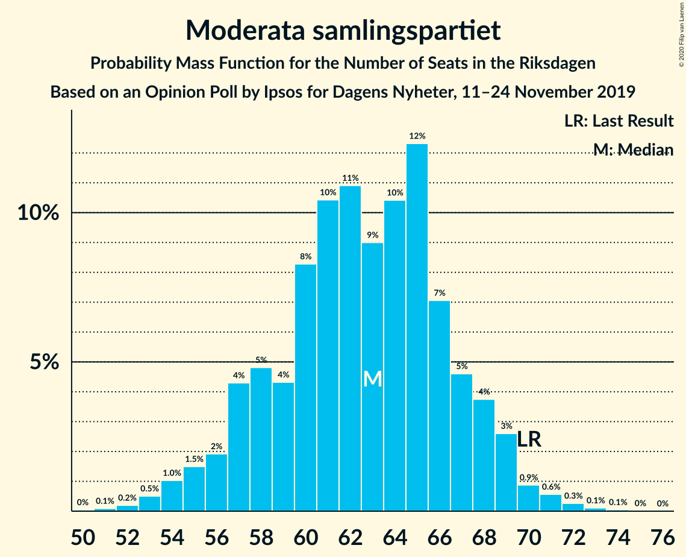
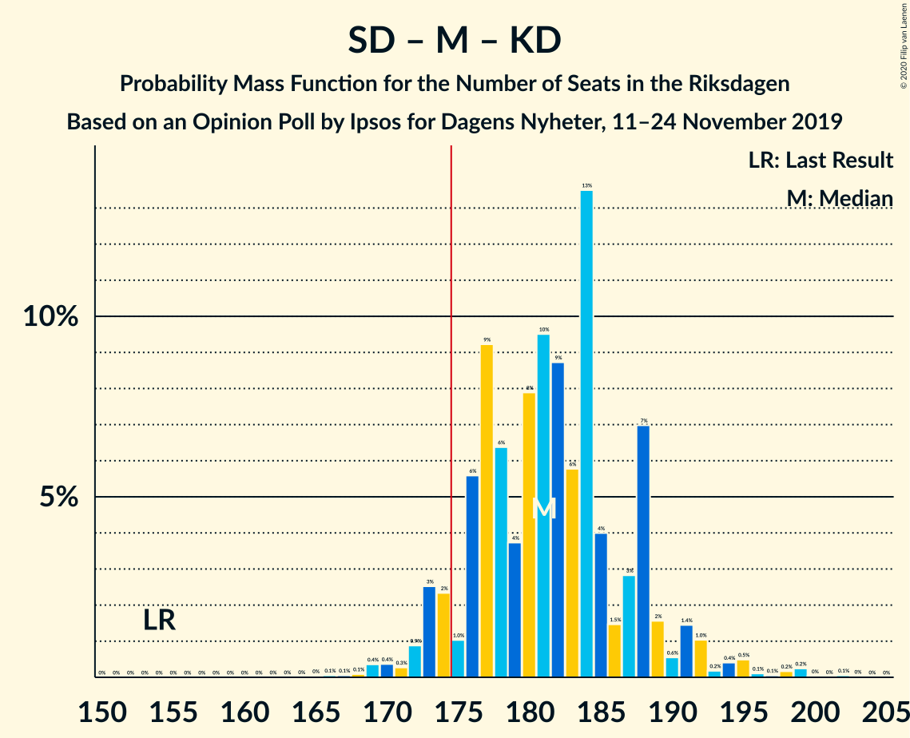

# Opinion Poll by Ipsos for Dagens Nyheter, 11–24 November 2019

<a href="#voting-intentions">Voting Intentions</a> | <a href="#seats">Seats</a> | <a href="#coalitions">Coalitions</a> | <a href="#technical-information">Technical Information</a>

## Voting Intentions

### Confidence Intervals

| Party | Last Result | Poll Result | 80% Confidence Interval | 90% Confidence Interval | 95% Confidence Interval | 99% Confidence Interval |
|:-----:|:-----------:|:-----------:|:-----------------------:|:-----------------------:|:-----------------------:|:-----------------------:|
| Sveriges socialdemokratiska arbetareparti | 28.3% | 24.8% | 23.4–26.2% |23.0–26.6% |22.7–27.0% |22.0–27.7% |
| Sverigedemokraterna | 17.5% | 24.8% | 23.4–26.2% |23.0–26.6% |22.7–27.0% |22.0–27.7% |
| Moderata samlingspartiet | 19.8% | 16.8% | 15.7–18.1% |15.3–18.5% |15.0–18.8% |14.5–19.4% |
| Centerpartiet | 8.6% | 7.9% | 7.1–8.9% |6.9–9.2% |6.7–9.4% |6.3–9.9% |
| Vänsterpartiet | 8.0% | 7.9% | 7.1–8.9% |6.9–9.2% |6.7–9.4% |6.3–9.9% |
| Kristdemokraterna | 6.3% | 7.9% | 7.1–8.9% |6.9–9.2% |6.7–9.4% |6.3–9.9% |
| Miljöpartiet de gröna | 4.4% | 5.0% | 4.3–5.7% |4.1–6.0% |4.0–6.2% |3.7–6.6% |
| Liberalerna | 5.5% | 3.0% | 2.5–3.6% |2.3–3.8% |2.2–3.9% |2.0–4.3% |

*Note:* The poll result column reflects the actual value used in the calculations. Published results may vary slightly, and in addition be rounded to fewer digits.

## Seats

### Confidence Intervals

| Party | Last Result | Median | 80% Confidence Interval | 90% Confidence Interval | 95% Confidence Interval | 99% Confidence Interval |
|:-----:|:-----------:|:------:|:-----------------------:|:-----------------------:|:-----------------------:|:-----------------------:|
| <a href="#sveriges-socialdemokratiska-arbetareparti">Sveriges socialdemokratiska arbetareparti</a> | 100 | 92 | 87–96 |84–97 |84–98 |81–101 |
| <a href="#sverigedemokraterna">Sverigedemokraterna</a> | 62 | 91 | 84–95 |83–96 |82–98 |80–103 |
| <a href="#moderata-samlingspartiet">Moderata samlingspartiet</a> | 70 | 62 | 57–66 |57–68 |57–69 |54–71 |
| <a href="#centerpartiet">Centerpartiet</a> | 31 | 28 | 26–32 |25–33 |25–35 |23–36 |
| <a href="#vänsterpartiet">Vänsterpartiet</a> | 28 | 28 | 27–31 |26–31 |26–34 |24–37 |
| <a href="#kristdemokraterna">Kristdemokraterna</a> | 22 | 28 | 26–32 |25–33 |25–33 |24–37 |
| <a href="#miljöpartiet-de-gröna">Miljöpartiet de gröna</a> | 16 | 18 | 16–21 |15–21 |15–21 |0–23 |
| <a href="#liberalerna">Liberalerna</a> | 20 | 0 | 0 |0 |0 |0–15 |

### Sveriges socialdemokratiska arbetareparti

*For a full overview of the results for this party, see the [Sveriges socialdemokratiska arbetareparti](party-sverigessocialdemokratiskaarbetareparti.html) page.*

| Number of Seats | Probability | Accumulated | Special Marks |
|:---------------:|:-----------:|:-----------:|:-------------:|
| 78 | 0% | 100% |  |
| 79 | 0.1% | 99.9% |  |
| 80 | 0.2% | 99.9% |  |
| 81 | 0.4% | 99.7% |  |
| 82 | 0.2% | 99.2% |  |
| 83 | 1.4% | 99.0% |  |
| 84 | 3% | 98% |  |
| 85 | 0.6% | 95% |  |
| 86 | 3% | 94% |  |
| 87 | 2% | 91% |  |
| 88 | 1.2% | 89% |  |
| 89 | 2% | 88% |  |
| 90 | 6% | 85% |  |
| 91 | 14% | 80% |  |
| 92 | 16% | 65% | Median |
| 93 | 12% | 49% |  |
| 94 | 3% | 37% |  |
| 95 | 6% | 34% |  |
| 96 | 22% | 28% |  |
| 97 | 3% | 6% |  |
| 98 | 2% | 3% |  |
| 99 | 0.2% | 1.0% |  |
| 100 | 0.2% | 0.8% | Last Result |
| 101 | 0.1% | 0.6% |  |
| 102 | 0.1% | 0.5% |  |
| 103 | 0.3% | 0.3% |  |
| 104 | 0% | 0.1% |  |
| 105 | 0% | 0% |  |

### Sverigedemokraterna

*For a full overview of the results for this party, see the [Sverigedemokraterna](party-sverigedemokraterna.html) page.*

| Number of Seats | Probability | Accumulated | Special Marks |
|:---------------:|:-----------:|:-----------:|:-------------:|
| 62 | 0% | 100% | Last Result |
| 63 | 0% | 100% |  |
| 64 | 0% | 100% |  |
| 65 | 0% | 100% |  |
| 66 | 0% | 100% |  |
| 67 | 0% | 100% |  |
| 68 | 0% | 100% |  |
| 69 | 0% | 100% |  |
| 70 | 0% | 100% |  |
| 71 | 0% | 100% |  |
| 72 | 0% | 100% |  |
| 73 | 0% | 100% |  |
| 74 | 0% | 100% |  |
| 75 | 0% | 100% |  |
| 76 | 0% | 100% |  |
| 77 | 0% | 100% |  |
| 78 | 0% | 100% |  |
| 79 | 0.1% | 99.9% |  |
| 80 | 0.4% | 99.9% |  |
| 81 | 1.3% | 99.4% |  |
| 82 | 0.9% | 98% |  |
| 83 | 3% | 97% |  |
| 84 | 6% | 94% |  |
| 85 | 2% | 89% |  |
| 86 | 2% | 86% |  |
| 87 | 12% | 84% |  |
| 88 | 3% | 72% |  |
| 89 | 7% | 69% |  |
| 90 | 3% | 62% |  |
| 91 | 12% | 59% | Median |
| 92 | 3% | 46% |  |
| 93 | 24% | 43% |  |
| 94 | 2% | 19% |  |
| 95 | 12% | 18% |  |
| 96 | 2% | 6% |  |
| 97 | 0.8% | 4% |  |
| 98 | 1.0% | 3% |  |
| 99 | 0.4% | 2% |  |
| 100 | 0.4% | 1.4% |  |
| 101 | 0.1% | 1.1% |  |
| 102 | 0.5% | 1.0% |  |
| 103 | 0.4% | 0.5% |  |
| 104 | 0% | 0.1% |  |
| 105 | 0.1% | 0.1% |  |
| 106 | 0% | 0% |  |

### Moderata samlingspartiet

*For a full overview of the results for this party, see the [Moderata samlingspartiet](party-moderatasamlingspartiet.html) page.*

| Number of Seats | Probability | Accumulated | Special Marks |
|:---------------:|:-----------:|:-----------:|:-------------:|
| 51 | 0% | 100% |  |
| 52 | 0.1% | 99.9% |  |
| 53 | 0.3% | 99.8% |  |
| 54 | 0.4% | 99.5% |  |
| 55 | 0.7% | 99.1% |  |
| 56 | 0.7% | 98% |  |
| 57 | 10% | 98% |  |
| 58 | 1.3% | 88% |  |
| 59 | 2% | 87% |  |
| 60 | 18% | 84% |  |
| 61 | 11% | 66% |  |
| 62 | 8% | 55% | Median |
| 63 | 10% | 46% |  |
| 64 | 5% | 36% |  |
| 65 | 17% | 31% |  |
| 66 | 7% | 14% |  |
| 67 | 2% | 7% |  |
| 68 | 2% | 5% |  |
| 69 | 2% | 3% |  |
| 70 | 0.1% | 0.7% | Last Result |
| 71 | 0.3% | 0.6% |  |
| 72 | 0.2% | 0.3% |  |
| 73 | 0% | 0% |  |

### Centerpartiet

*For a full overview of the results for this party, see the [Centerpartiet](party-centerpartiet.html) page.*

| Number of Seats | Probability | Accumulated | Special Marks |
|:---------------:|:-----------:|:-----------:|:-------------:|
| 22 | 0.2% | 100% |  |
| 23 | 0.4% | 99.8% |  |
| 24 | 2% | 99.5% |  |
| 25 | 3% | 98% |  |
| 26 | 16% | 94% |  |
| 27 | 15% | 78% |  |
| 28 | 13% | 63% | Median |
| 29 | 14% | 50% |  |
| 30 | 15% | 35% |  |
| 31 | 7% | 21% | Last Result |
| 32 | 5% | 14% |  |
| 33 | 4% | 9% |  |
| 34 | 0.8% | 4% |  |
| 35 | 3% | 4% |  |
| 36 | 0.3% | 0.5% |  |
| 37 | 0.1% | 0.2% |  |
| 38 | 0.1% | 0.1% |  |
| 39 | 0% | 0% |  |

### Vänsterpartiet

*For a full overview of the results for this party, see the [Vänsterpartiet](party-vänsterpartiet.html) page.*

| Number of Seats | Probability | Accumulated | Special Marks |
|:---------------:|:-----------:|:-----------:|:-------------:|
| 21 | 0.1% | 100% |  |
| 22 | 0.2% | 99.9% |  |
| 23 | 0.2% | 99.8% |  |
| 24 | 0.5% | 99.5% |  |
| 25 | 0.6% | 99.0% |  |
| 26 | 6% | 98% |  |
| 27 | 31% | 92% |  |
| 28 | 12% | 61% | Last Result, Median |
| 29 | 27% | 49% |  |
| 30 | 12% | 22% |  |
| 31 | 6% | 10% |  |
| 32 | 1.1% | 4% |  |
| 33 | 0.7% | 3% |  |
| 34 | 0.5% | 3% |  |
| 35 | 0.5% | 2% |  |
| 36 | 1.0% | 2% |  |
| 37 | 0.5% | 0.6% |  |
| 38 | 0.1% | 0.1% |  |
| 39 | 0% | 0% |  |

### Kristdemokraterna

*For a full overview of the results for this party, see the [Kristdemokraterna](party-kristdemokraterna.html) page.*

| Number of Seats | Probability | Accumulated | Special Marks |
|:---------------:|:-----------:|:-----------:|:-------------:|
| 22 | 0.1% | 100% | Last Result |
| 23 | 0.2% | 99.9% |  |
| 24 | 0.7% | 99.7% |  |
| 25 | 6% | 98.9% |  |
| 26 | 13% | 93% |  |
| 27 | 16% | 80% |  |
| 28 | 27% | 65% | Median |
| 29 | 10% | 38% |  |
| 30 | 13% | 29% |  |
| 31 | 5% | 16% |  |
| 32 | 5% | 11% |  |
| 33 | 4% | 5% |  |
| 34 | 0.6% | 2% |  |
| 35 | 0.4% | 1.0% |  |
| 36 | 0.1% | 0.7% |  |
| 37 | 0.4% | 0.6% |  |
| 38 | 0.1% | 0.2% |  |
| 39 | 0% | 0% |  |

### Miljöpartiet de gröna

*For a full overview of the results for this party, see the [Miljöpartiet de gröna](party-miljöpartietdegröna.html) page.*

| Number of Seats | Probability | Accumulated | Special Marks |
|:---------------:|:-----------:|:-----------:|:-------------:|
| 0 | 2% | 100% |  |
| 1 | 0% | 98% |  |
| 2 | 0% | 98% |  |
| 3 | 0% | 98% |  |
| 4 | 0% | 98% |  |
| 5 | 0% | 98% |  |
| 6 | 0% | 98% |  |
| 7 | 0% | 98% |  |
| 8 | 0% | 98% |  |
| 9 | 0% | 98% |  |
| 10 | 0% | 98% |  |
| 11 | 0% | 98% |  |
| 12 | 0% | 98% |  |
| 13 | 0% | 98% |  |
| 14 | 0% | 98% |  |
| 15 | 5% | 98% |  |
| 16 | 8% | 93% | Last Result |
| 17 | 6% | 85% |  |
| 18 | 36% | 79% | Median |
| 19 | 19% | 42% |  |
| 20 | 10% | 23% |  |
| 21 | 11% | 13% |  |
| 22 | 0.9% | 2% |  |
| 23 | 0.8% | 1.2% |  |
| 24 | 0.3% | 0.4% |  |
| 25 | 0.1% | 0.1% |  |
| 26 | 0% | 0% |  |

### Liberalerna

*For a full overview of the results for this party, see the [Liberalerna](party-liberalerna.html) page.*

| Number of Seats | Probability | Accumulated | Special Marks |
|:---------------:|:-----------:|:-----------:|:-------------:|
| 0 | 99.1% | 100% | Median |
| 1 | 0% | 0.9% |  |
| 2 | 0% | 0.9% |  |
| 3 | 0% | 0.9% |  |
| 4 | 0% | 0.9% |  |
| 5 | 0% | 0.9% |  |
| 6 | 0% | 0.9% |  |
| 7 | 0% | 0.9% |  |
| 8 | 0% | 0.9% |  |
| 9 | 0% | 0.9% |  |
| 10 | 0% | 0.9% |  |
| 11 | 0% | 0.9% |  |
| 12 | 0% | 0.9% |  |
| 13 | 0% | 0.9% |  |
| 14 | 0.2% | 0.9% |  |
| 15 | 0.6% | 0.7% |  |
| 16 | 0.1% | 0.1% |  |
| 17 | 0.1% | 0.1% |  |
| 18 | 0% | 0% |  |
| 19 | 0% | 0% |  |
| 20 | 0% | 0% | Last Result |

## Coalitions

### Confidence Intervals

| Coalition | Last Result | Median | Majority? | 80% Confidence Interval | 90% Confidence Interval | 95% Confidence Interval | 99% Confidence Interval |
|:---------:|:-----------:|:------:|:---------:|:-----------------------:|:-----------------------:|:-----------------------:|:-----------------------:|
| Sverigedemokraterna – Moderata samlingspartiet – Kristdemokraterna | 154 | 182 | 96% | 176–186 | 176–189 | 173–192 | 170–198 |
| Sveriges socialdemokratiska arbetareparti – Moderata samlingspartiet – Centerpartiet | 201 | 183 | 97% | 178–188 | 177–188 | 174–189 | 171–193 |
| Sveriges socialdemokratiska arbetareparti – Centerpartiet – Vänsterpartiet – Miljöpartiet de gröna – Liberalerna | 195 | 167 | 4% | 163–173 | 160–173 | 157–176 | 151–179 |
| Sveriges socialdemokratiska arbetareparti – Moderata samlingspartiet | 170 | 155 | 0% | 151–158 | 148–159 | 146–161 | 141–163 |
| Sverigedemokraterna – Moderata samlingspartiet | 132 | 153 | 0% | 148–157 | 145–159 | 145–161 | 141–167 |
| Sveriges socialdemokratiska arbetareparti – Centerpartiet – Miljöpartiet de gröna – Liberalerna | 167 | 140 | 0% | 132–144 | 130–144 | 128–146 | 120–151 |
| Sveriges socialdemokratiska arbetareparti – Vänsterpartiet – Miljöpartiet de gröna | 144 | 140 | 0% | 133–143 | 132–144 | 129–145 | 120–150 |
| Moderata samlingspartiet – Centerpartiet – Kristdemokraterna – Liberalerna | 143 | 119 | 0% | 115–124 | 114–126 | 113–130 | 109–134 |
| Moderata samlingspartiet – Centerpartiet – Kristdemokraterna | 123 | 118 | 0% | 115–124 | 114–126 | 113–128 | 109–133 |
| Sveriges socialdemokratiska arbetareparti – Vänsterpartiet | 128 | 122 | 0% | 117–125 | 114–126 | 113–127 | 110–131 |
| Sveriges socialdemokratiska arbetareparti – Miljöpartiet de gröna | 116 | 111 | 0% | 104–114 | 102–115 | 100–116 | 89–118 |
| Moderata samlingspartiet – Centerpartiet – Liberalerna | 121 | 91 | 0% | 87–96 | 86–98 | 84–100 | 82–105 |
| Moderata samlingspartiet – Centerpartiet | 101 | 91 | 0% | 87–96 | 86–98 | 84–98 | 81–102 |

### Sverigedemokraterna – Moderata samlingspartiet – Kristdemokraterna

| Number of Seats | Probability | Accumulated | Special Marks |
|:---------------:|:-----------:|:-----------:|:-------------:|
| 154 | 0% | 100% | Last Result |
| 155 | 0% | 100% |  |
| 156 | 0% | 100% |  |
| 157 | 0% | 100% |  |
| 158 | 0% | 100% |  |
| 159 | 0% | 100% |  |
| 160 | 0% | 100% |  |
| 161 | 0% | 100% |  |
| 162 | 0% | 100% |  |
| 163 | 0% | 100% |  |
| 164 | 0% | 100% |  |
| 165 | 0% | 100% |  |
| 166 | 0.1% | 100% |  |
| 167 | 0% | 99.9% |  |
| 168 | 0.1% | 99.8% |  |
| 169 | 0.1% | 99.8% |  |
| 170 | 0.3% | 99.7% |  |
| 171 | 0.4% | 99.4% |  |
| 172 | 0.4% | 99.0% |  |
| 173 | 1.5% | 98.6% |  |
| 174 | 1.4% | 97% |  |
| 175 | 0.3% | 96% | Majority |
| 176 | 9% | 95% |  |
| 177 | 9% | 86% |  |
| 178 | 8% | 77% |  |
| 179 | 0.8% | 69% |  |
| 180 | 0.5% | 68% |  |
| 181 | 9% | 67% | Median |
| 182 | 36% | 58% |  |
| 183 | 7% | 22% |  |
| 184 | 1.3% | 15% |  |
| 185 | 2% | 14% |  |
| 186 | 2% | 12% |  |
| 187 | 0.8% | 10% |  |
| 188 | 4% | 9% |  |
| 189 | 0.2% | 5% |  |
| 190 | 0.4% | 5% |  |
| 191 | 2% | 4% |  |
| 192 | 1.3% | 3% |  |
| 193 | 0.2% | 1.4% |  |
| 194 | 0.2% | 1.2% |  |
| 195 | 0.3% | 1.0% |  |
| 196 | 0.1% | 0.7% |  |
| 197 | 0% | 0.5% |  |
| 198 | 0.1% | 0.5% |  |
| 199 | 0.3% | 0.4% |  |
| 200 | 0% | 0.1% |  |
| 201 | 0% | 0.1% |  |
| 202 | 0% | 0.1% |  |
| 203 | 0% | 0.1% |  |
| 204 | 0% | 0% |  |

### Sveriges socialdemokratiska arbetareparti – Moderata samlingspartiet – Centerpartiet

| Number of Seats | Probability | Accumulated | Special Marks |
|:---------------:|:-----------:|:-----------:|:-------------:|
| 166 | 0% | 100% |  |
| 167 | 0.1% | 99.9% |  |
| 168 | 0.1% | 99.9% |  |
| 169 | 0.1% | 99.8% |  |
| 170 | 0.1% | 99.7% |  |
| 171 | 0.4% | 99.6% |  |
| 172 | 0.2% | 99.2% |  |
| 173 | 1.0% | 99.0% |  |
| 174 | 0.6% | 98% |  |
| 175 | 0.5% | 97% | Majority |
| 176 | 1.4% | 97% |  |
| 177 | 3% | 95% |  |
| 178 | 3% | 92% |  |
| 179 | 0.8% | 89% |  |
| 180 | 3% | 89% |  |
| 181 | 12% | 86% |  |
| 182 | 6% | 74% | Median |
| 183 | 25% | 67% |  |
| 184 | 3% | 42% |  |
| 185 | 12% | 40% |  |
| 186 | 12% | 28% |  |
| 187 | 4% | 16% |  |
| 188 | 8% | 12% |  |
| 189 | 2% | 4% |  |
| 190 | 0.4% | 2% |  |
| 191 | 0.4% | 1.3% |  |
| 192 | 0.2% | 0.9% |  |
| 193 | 0.3% | 0.7% |  |
| 194 | 0% | 0.4% |  |
| 195 | 0% | 0.4% |  |
| 196 | 0% | 0.4% |  |
| 197 | 0% | 0.3% |  |
| 198 | 0.1% | 0.3% |  |
| 199 | 0.2% | 0.3% |  |
| 200 | 0% | 0.1% |  |
| 201 | 0% | 0% | Last Result |

### Sveriges socialdemokratiska arbetareparti – Centerpartiet – Vänsterpartiet – Miljöpartiet de gröna – Liberalerna

| Number of Seats | Probability | Accumulated | Special Marks |
|:---------------:|:-----------:|:-----------:|:-------------:|
| 146 | 0% | 100% |  |
| 147 | 0% | 99.9% |  |
| 148 | 0% | 99.9% |  |
| 149 | 0% | 99.9% |  |
| 150 | 0.3% | 99.9% |  |
| 151 | 0.1% | 99.6% |  |
| 152 | 0% | 99.5% |  |
| 153 | 0.1% | 99.5% |  |
| 154 | 0.3% | 99.3% |  |
| 155 | 0.2% | 99.0% |  |
| 156 | 0.2% | 98.8% |  |
| 157 | 1.3% | 98.6% |  |
| 158 | 2% | 97% |  |
| 159 | 0.4% | 96% |  |
| 160 | 0.2% | 95% |  |
| 161 | 4% | 95% |  |
| 162 | 0.8% | 91% |  |
| 163 | 2% | 90% |  |
| 164 | 2% | 88% |  |
| 165 | 1.3% | 86% |  |
| 166 | 7% | 85% | Median |
| 167 | 36% | 78% |  |
| 168 | 9% | 42% |  |
| 169 | 0.5% | 33% |  |
| 170 | 0.8% | 32% |  |
| 171 | 8% | 31% |  |
| 172 | 9% | 23% |  |
| 173 | 9% | 14% |  |
| 174 | 0.3% | 5% |  |
| 175 | 1.4% | 4% | Majority |
| 176 | 1.5% | 3% |  |
| 177 | 0.4% | 1.4% |  |
| 178 | 0.4% | 1.0% |  |
| 179 | 0.3% | 0.6% |  |
| 180 | 0.1% | 0.3% |  |
| 181 | 0.1% | 0.2% |  |
| 182 | 0% | 0.2% |  |
| 183 | 0.1% | 0.1% |  |
| 184 | 0% | 0% |  |
| 185 | 0% | 0% |  |
| 186 | 0% | 0% |  |
| 187 | 0% | 0% |  |
| 188 | 0% | 0% |  |
| 189 | 0% | 0% |  |
| 190 | 0% | 0% |  |
| 191 | 0% | 0% |  |
| 192 | 0% | 0% |  |
| 193 | 0% | 0% |  |
| 194 | 0% | 0% |  |
| 195 | 0% | 0% | Last Result |

### Sveriges socialdemokratiska arbetareparti – Moderata samlingspartiet

| Number of Seats | Probability | Accumulated | Special Marks |
|:---------------:|:-----------:|:-----------:|:-------------:|
| 136 | 0% | 100% |  |
| 137 | 0% | 99.9% |  |
| 138 | 0% | 99.9% |  |
| 139 | 0% | 99.9% |  |
| 140 | 0.2% | 99.8% |  |
| 141 | 0.3% | 99.7% |  |
| 142 | 0.2% | 99.4% |  |
| 143 | 0.4% | 99.3% |  |
| 144 | 0.5% | 98.9% |  |
| 145 | 0.8% | 98% |  |
| 146 | 0.7% | 98% |  |
| 147 | 0.8% | 97% |  |
| 148 | 1.5% | 96% |  |
| 149 | 2% | 95% |  |
| 150 | 2% | 93% |  |
| 151 | 3% | 90% |  |
| 152 | 13% | 88% |  |
| 153 | 10% | 74% |  |
| 154 | 8% | 64% | Median |
| 155 | 11% | 55% |  |
| 156 | 8% | 44% |  |
| 157 | 16% | 36% |  |
| 158 | 14% | 20% |  |
| 159 | 2% | 6% |  |
| 160 | 2% | 4% |  |
| 161 | 1.3% | 3% |  |
| 162 | 0.6% | 1.2% |  |
| 163 | 0.2% | 0.6% |  |
| 164 | 0.1% | 0.5% |  |
| 165 | 0% | 0.4% |  |
| 166 | 0% | 0.4% |  |
| 167 | 0.3% | 0.3% |  |
| 168 | 0% | 0.1% |  |
| 169 | 0% | 0% |  |
| 170 | 0% | 0% | Last Result |

### Sverigedemokraterna – Moderata samlingspartiet

| Number of Seats | Probability | Accumulated | Special Marks |
|:---------------:|:-----------:|:-----------:|:-------------:|
| 132 | 0% | 100% | Last Result |
| 133 | 0% | 100% |  |
| 134 | 0% | 100% |  |
| 135 | 0% | 100% |  |
| 136 | 0% | 100% |  |
| 137 | 0% | 100% |  |
| 138 | 0.1% | 100% |  |
| 139 | 0.1% | 99.9% |  |
| 140 | 0% | 99.8% |  |
| 141 | 0.4% | 99.8% |  |
| 142 | 0.6% | 99.3% |  |
| 143 | 0.3% | 98.7% |  |
| 144 | 0.7% | 98% |  |
| 145 | 3% | 98% |  |
| 146 | 0.9% | 94% |  |
| 147 | 3% | 94% |  |
| 148 | 9% | 91% |  |
| 149 | 9% | 82% |  |
| 150 | 1.3% | 73% |  |
| 151 | 3% | 71% |  |
| 152 | 16% | 69% |  |
| 153 | 4% | 53% | Median |
| 154 | 13% | 49% |  |
| 155 | 15% | 36% |  |
| 156 | 5% | 21% |  |
| 157 | 6% | 16% |  |
| 158 | 2% | 10% |  |
| 159 | 3% | 7% |  |
| 160 | 1.4% | 4% |  |
| 161 | 0.5% | 3% |  |
| 162 | 0.3% | 2% |  |
| 163 | 0.4% | 2% |  |
| 164 | 0.5% | 2% |  |
| 165 | 0.3% | 1.0% |  |
| 166 | 0.1% | 0.6% |  |
| 167 | 0.1% | 0.5% |  |
| 168 | 0.1% | 0.5% |  |
| 169 | 0.3% | 0.4% |  |
| 170 | 0% | 0.1% |  |
| 171 | 0% | 0% |  |

### Sveriges socialdemokratiska arbetareparti – Centerpartiet – Miljöpartiet de gröna – Liberalerna

| Number of Seats | Probability | Accumulated | Special Marks |
|:---------------:|:-----------:|:-----------:|:-------------:|
| 117 | 0.1% | 100% |  |
| 118 | 0.1% | 99.9% |  |
| 119 | 0.1% | 99.9% |  |
| 120 | 0.3% | 99.8% |  |
| 121 | 0% | 99.5% |  |
| 122 | 0.1% | 99.5% |  |
| 123 | 0.2% | 99.3% |  |
| 124 | 0.1% | 99.1% |  |
| 125 | 0.1% | 99.0% |  |
| 126 | 0.2% | 99.0% |  |
| 127 | 1.3% | 98.8% |  |
| 128 | 1.4% | 98% |  |
| 129 | 0.6% | 96% |  |
| 130 | 3% | 95% |  |
| 131 | 3% | 93% |  |
| 132 | 0.6% | 90% |  |
| 133 | 0.5% | 90% |  |
| 134 | 0.3% | 89% |  |
| 135 | 0.5% | 89% |  |
| 136 | 0.7% | 88% |  |
| 137 | 4% | 88% |  |
| 138 | 14% | 84% | Median |
| 139 | 2% | 70% |  |
| 140 | 32% | 68% |  |
| 141 | 13% | 35% |  |
| 142 | 2% | 23% |  |
| 143 | 5% | 21% |  |
| 144 | 12% | 16% |  |
| 145 | 1.5% | 4% |  |
| 146 | 1.3% | 3% |  |
| 147 | 0.5% | 1.5% |  |
| 148 | 0.1% | 1.0% |  |
| 149 | 0% | 0.9% |  |
| 150 | 0.3% | 0.9% |  |
| 151 | 0.2% | 0.6% |  |
| 152 | 0% | 0.4% |  |
| 153 | 0.2% | 0.3% |  |
| 154 | 0.1% | 0.1% |  |
| 155 | 0% | 0.1% |  |
| 156 | 0% | 0% |  |
| 157 | 0% | 0% |  |
| 158 | 0% | 0% |  |
| 159 | 0% | 0% |  |
| 160 | 0% | 0% |  |
| 161 | 0% | 0% |  |
| 162 | 0% | 0% |  |
| 163 | 0% | 0% |  |
| 164 | 0% | 0% |  |
| 165 | 0% | 0% |  |
| 166 | 0% | 0% |  |
| 167 | 0% | 0% | Last Result |

### Sveriges socialdemokratiska arbetareparti – Vänsterpartiet – Miljöpartiet de gröna

| Number of Seats | Probability | Accumulated | Special Marks |
|:---------------:|:-----------:|:-----------:|:-------------:|
| 117 | 0.1% | 100% |  |
| 118 | 0% | 99.9% |  |
| 119 | 0.3% | 99.9% |  |
| 120 | 0.2% | 99.6% |  |
| 121 | 0.1% | 99.3% |  |
| 122 | 0.1% | 99.3% |  |
| 123 | 0.1% | 99.1% |  |
| 124 | 0.1% | 99.0% |  |
| 125 | 0.1% | 98.9% |  |
| 126 | 0.1% | 98.8% |  |
| 127 | 0.3% | 98.6% |  |
| 128 | 0.2% | 98% |  |
| 129 | 0.7% | 98% |  |
| 130 | 1.2% | 97% |  |
| 131 | 0.8% | 96% |  |
| 132 | 2% | 95% |  |
| 133 | 4% | 94% |  |
| 134 | 0.7% | 90% |  |
| 135 | 3% | 89% |  |
| 136 | 5% | 86% |  |
| 137 | 5% | 81% |  |
| 138 | 14% | 76% | Median |
| 139 | 8% | 61% |  |
| 140 | 15% | 54% |  |
| 141 | 17% | 39% |  |
| 142 | 4% | 22% |  |
| 143 | 10% | 18% |  |
| 144 | 5% | 8% | Last Result |
| 145 | 0.8% | 3% |  |
| 146 | 0.4% | 2% |  |
| 147 | 0.3% | 1.4% |  |
| 148 | 0.3% | 1.1% |  |
| 149 | 0.3% | 0.8% |  |
| 150 | 0.3% | 0.5% |  |
| 151 | 0.1% | 0.3% |  |
| 152 | 0% | 0.1% |  |
| 153 | 0.1% | 0.1% |  |
| 154 | 0% | 0% |  |

### Moderata samlingspartiet – Centerpartiet – Kristdemokraterna – Liberalerna

| Number of Seats | Probability | Accumulated | Special Marks |
|:---------------:|:-----------:|:-----------:|:-------------:|
| 107 | 0.2% | 100% |  |
| 108 | 0.1% | 99.8% |  |
| 109 | 0.3% | 99.7% |  |
| 110 | 0.2% | 99.4% |  |
| 111 | 0.1% | 99.2% |  |
| 112 | 0.5% | 99.1% |  |
| 113 | 2% | 98.7% |  |
| 114 | 3% | 96% |  |
| 115 | 18% | 93% |  |
| 116 | 13% | 75% |  |
| 117 | 7% | 61% |  |
| 118 | 4% | 55% | Median |
| 119 | 1.1% | 51% |  |
| 120 | 4% | 50% |  |
| 121 | 5% | 46% |  |
| 122 | 15% | 41% |  |
| 123 | 7% | 26% |  |
| 124 | 9% | 19% |  |
| 125 | 3% | 10% |  |
| 126 | 2% | 7% |  |
| 127 | 0.9% | 4% |  |
| 128 | 0.3% | 3% |  |
| 129 | 0.2% | 3% |  |
| 130 | 0.8% | 3% |  |
| 131 | 0.7% | 2% |  |
| 132 | 0.4% | 1.2% |  |
| 133 | 0.2% | 0.8% |  |
| 134 | 0.4% | 0.6% |  |
| 135 | 0.1% | 0.2% |  |
| 136 | 0% | 0.1% |  |
| 137 | 0% | 0.1% |  |
| 138 | 0% | 0% |  |
| 139 | 0% | 0% |  |
| 140 | 0% | 0% |  |
| 141 | 0% | 0% |  |
| 142 | 0% | 0% |  |
| 143 | 0% | 0% | Last Result |

### Moderata samlingspartiet – Centerpartiet – Kristdemokraterna

| Number of Seats | Probability | Accumulated | Special Marks |
|:---------------:|:-----------:|:-----------:|:-------------:|
| 106 | 0% | 100% |  |
| 107 | 0.2% | 99.9% |  |
| 108 | 0.1% | 99.8% |  |
| 109 | 0.4% | 99.6% |  |
| 110 | 0.2% | 99.3% |  |
| 111 | 0.2% | 99.1% |  |
| 112 | 0.5% | 98.9% |  |
| 113 | 2% | 98% |  |
| 114 | 3% | 96% |  |
| 115 | 18% | 93% |  |
| 116 | 13% | 74% |  |
| 117 | 7% | 61% |  |
| 118 | 4% | 54% | Median |
| 119 | 1.1% | 50% |  |
| 120 | 4% | 49% |  |
| 121 | 5% | 45% |  |
| 122 | 15% | 40% |  |
| 123 | 7% | 25% | Last Result |
| 124 | 9% | 18% |  |
| 125 | 3% | 9% |  |
| 126 | 2% | 6% |  |
| 127 | 0.9% | 4% |  |
| 128 | 0.3% | 3% |  |
| 129 | 0.1% | 2% |  |
| 130 | 0.8% | 2% |  |
| 131 | 0.7% | 1.4% |  |
| 132 | 0.1% | 0.7% |  |
| 133 | 0.1% | 0.5% |  |
| 134 | 0.4% | 0.4% |  |
| 135 | 0% | 0.1% |  |
| 136 | 0% | 0% |  |

### Sveriges socialdemokratiska arbetareparti – Vänsterpartiet

| Number of Seats | Probability | Accumulated | Special Marks |
|:---------------:|:-----------:|:-----------:|:-------------:|
| 107 | 0.1% | 100% |  |
| 108 | 0.1% | 99.8% |  |
| 109 | 0.2% | 99.7% |  |
| 110 | 0.4% | 99.5% |  |
| 111 | 0.4% | 99.2% |  |
| 112 | 0.5% | 98.8% |  |
| 113 | 1.2% | 98% |  |
| 114 | 3% | 97% |  |
| 115 | 0.8% | 94% |  |
| 116 | 3% | 93% |  |
| 117 | 8% | 90% |  |
| 118 | 7% | 82% |  |
| 119 | 14% | 75% |  |
| 120 | 4% | 61% | Median |
| 121 | 6% | 57% |  |
| 122 | 14% | 50% |  |
| 123 | 13% | 36% |  |
| 124 | 7% | 24% |  |
| 125 | 11% | 17% |  |
| 126 | 1.4% | 6% |  |
| 127 | 3% | 5% |  |
| 128 | 0.7% | 2% | Last Result |
| 129 | 0.4% | 1.4% |  |
| 130 | 0.3% | 1.0% |  |
| 131 | 0.2% | 0.7% |  |
| 132 | 0.2% | 0.5% |  |
| 133 | 0% | 0.3% |  |
| 134 | 0.1% | 0.3% |  |
| 135 | 0.2% | 0.2% |  |
| 136 | 0% | 0% |  |

### Sveriges socialdemokratiska arbetareparti – Miljöpartiet de gröna

| Number of Seats | Probability | Accumulated | Special Marks |
|:---------------:|:-----------:|:-----------:|:-------------:|
| 88 | 0.1% | 100% |  |
| 89 | 0.7% | 99.9% |  |
| 90 | 0% | 99.2% |  |
| 91 | 0% | 99.2% |  |
| 92 | 0.2% | 99.2% |  |
| 93 | 0% | 99.0% |  |
| 94 | 0% | 99.0% |  |
| 95 | 0% | 99.0% |  |
| 96 | 0.3% | 98.9% |  |
| 97 | 0.2% | 98.6% |  |
| 98 | 0.1% | 98% |  |
| 99 | 0.7% | 98% |  |
| 100 | 1.0% | 98% |  |
| 101 | 1.0% | 97% |  |
| 102 | 2% | 96% |  |
| 103 | 3% | 93% |  |
| 104 | 0.9% | 90% |  |
| 105 | 0.7% | 89% |  |
| 106 | 0.5% | 89% |  |
| 107 | 1.5% | 88% |  |
| 108 | 7% | 87% |  |
| 109 | 4% | 80% |  |
| 110 | 4% | 76% | Median |
| 111 | 31% | 72% |  |
| 112 | 9% | 41% |  |
| 113 | 5% | 32% |  |
| 114 | 21% | 27% |  |
| 115 | 4% | 7% |  |
| 116 | 2% | 3% | Last Result |
| 117 | 0.3% | 1.1% |  |
| 118 | 0.5% | 0.8% |  |
| 119 | 0.1% | 0.4% |  |
| 120 | 0% | 0.3% |  |
| 121 | 0% | 0.2% |  |
| 122 | 0% | 0.2% |  |
| 123 | 0.1% | 0.2% |  |
| 124 | 0% | 0% |  |

### Moderata samlingspartiet – Centerpartiet – Liberalerna

| Number of Seats | Probability | Accumulated | Special Marks |
|:---------------:|:-----------:|:-----------:|:-------------:|
| 78 | 0% | 100% |  |
| 79 | 0% | 99.9% |  |
| 80 | 0.1% | 99.9% |  |
| 81 | 0.3% | 99.8% |  |
| 82 | 0.4% | 99.5% |  |
| 83 | 0.3% | 99.1% |  |
| 84 | 2% | 98.8% |  |
| 85 | 1.0% | 97% |  |
| 86 | 4% | 96% |  |
| 87 | 19% | 92% |  |
| 88 | 0.9% | 72% |  |
| 89 | 13% | 71% |  |
| 90 | 5% | 58% | Median |
| 91 | 7% | 53% |  |
| 92 | 15% | 46% |  |
| 93 | 6% | 32% |  |
| 94 | 6% | 26% |  |
| 95 | 7% | 20% |  |
| 96 | 3% | 13% |  |
| 97 | 3% | 10% |  |
| 98 | 3% | 7% |  |
| 99 | 0.5% | 3% |  |
| 100 | 0.8% | 3% |  |
| 101 | 0.7% | 2% |  |
| 102 | 0.2% | 1.1% |  |
| 103 | 0.4% | 0.9% |  |
| 104 | 0% | 0.6% |  |
| 105 | 0.1% | 0.5% |  |
| 106 | 0.1% | 0.5% |  |
| 107 | 0.2% | 0.3% |  |
| 108 | 0% | 0.1% |  |
| 109 | 0.1% | 0.1% |  |
| 110 | 0% | 0% |  |
| 111 | 0% | 0% |  |
| 112 | 0% | 0% |  |
| 113 | 0% | 0% |  |
| 114 | 0% | 0% |  |
| 115 | 0% | 0% |  |
| 116 | 0% | 0% |  |
| 117 | 0% | 0% |  |
| 118 | 0% | 0% |  |
| 119 | 0% | 0% |  |
| 120 | 0% | 0% |  |
| 121 | 0% | 0% | Last Result |

### Moderata samlingspartiet – Centerpartiet

| Number of Seats | Probability | Accumulated | Special Marks |
|:---------------:|:-----------:|:-----------:|:-------------:|
| 78 | 0% | 100% |  |
| 79 | 0% | 99.9% |  |
| 80 | 0.1% | 99.9% |  |
| 81 | 0.4% | 99.8% |  |
| 82 | 0.4% | 99.4% |  |
| 83 | 0.4% | 99.0% |  |
| 84 | 2% | 98.6% |  |
| 85 | 1.0% | 97% |  |
| 86 | 5% | 96% |  |
| 87 | 19% | 91% |  |
| 88 | 1.0% | 72% |  |
| 89 | 13% | 71% |  |
| 90 | 5% | 58% | Median |
| 91 | 7% | 53% |  |
| 92 | 15% | 46% |  |
| 93 | 6% | 31% |  |
| 94 | 6% | 25% |  |
| 95 | 7% | 19% |  |
| 96 | 3% | 12% |  |
| 97 | 3% | 9% |  |
| 98 | 3% | 6% |  |
| 99 | 0.5% | 2% |  |
| 100 | 0.8% | 2% |  |
| 101 | 0.6% | 1.1% | Last Result |
| 102 | 0.1% | 0.5% |  |
| 103 | 0.3% | 0.4% |  |
| 104 | 0% | 0.1% |  |
| 105 | 0% | 0% |  |

## Technical Information

### Opinion Poll

+ **Polling firm:** Ipsos
+ **Commissioner(s):** Dagens Nyheter
+ **Fieldwork period:** 11–24 November 2019

### Calculations

+ **Sample size:** 1551
+ **Simulations done:** 131,072
+ **Error estimate:** 1.52%

