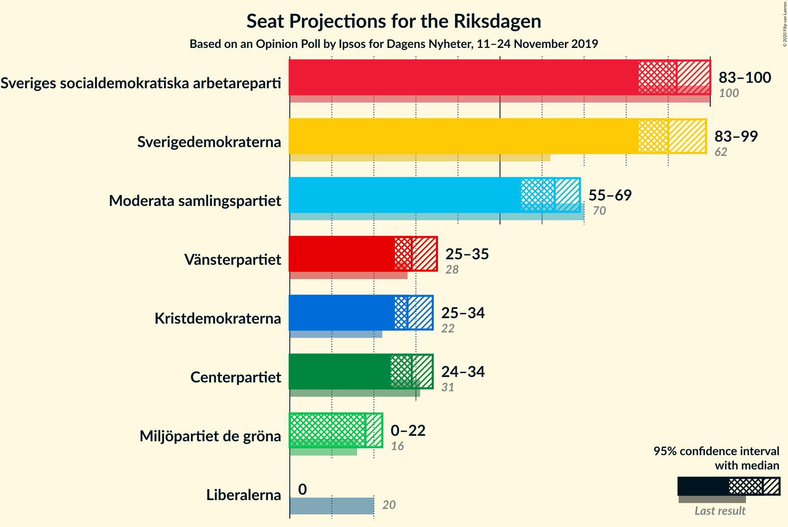
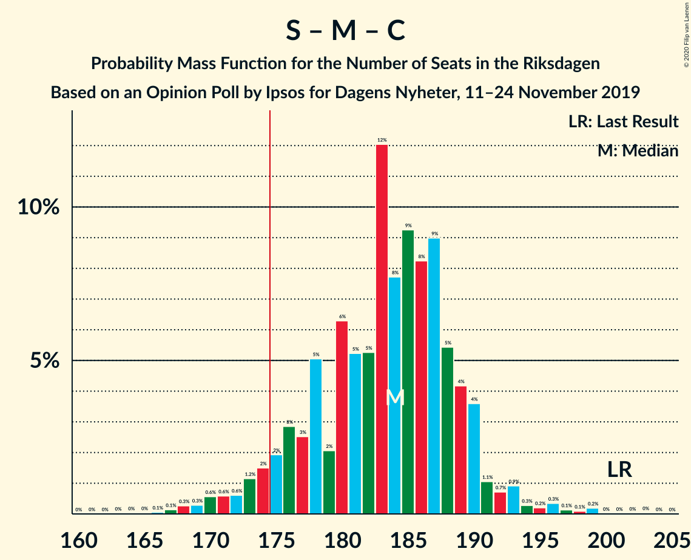

# Opinion Poll by Ipsos for Dagens Nyheter, 11–24 November 2019

<a href="#voting-intentions">Voting Intentions</a> | <a href="#seats">Seats</a> | <a href="#coalitions">Coalitions</a> | <a href="#technical-information">Technical Information</a>

## Voting Intentions

### Confidence Intervals

| Party | Last Result | Poll Result | 80% Confidence Interval | 90% Confidence Interval | 95% Confidence Interval | 99% Confidence Interval |
|:-----:|:-----------:|:-----------:|:-----------------------:|:-----------------------:|:-----------------------:|:-----------------------:|
| Sveriges socialdemokratiska arbetareparti | 28.3% | 24.8% | 23.4–26.2% |23.0–26.6% |22.7–27.0% |22.0–27.7% |
| Sverigedemokraterna | 17.5% | 24.8% | 23.4–26.2% |23.0–26.6% |22.7–27.0% |22.0–27.7% |
| Moderata samlingspartiet | 19.8% | 16.8% | 15.7–18.1% |15.3–18.5% |15.0–18.8% |14.5–19.4% |
| Centerpartiet | 8.6% | 7.9% | 7.1–8.9% |6.9–9.2% |6.7–9.4% |6.3–9.9% |
| Vänsterpartiet | 8.0% | 7.9% | 7.1–8.9% |6.9–9.2% |6.7–9.4% |6.3–9.9% |
| Kristdemokraterna | 6.3% | 7.9% | 7.1–8.9% |6.9–9.2% |6.7–9.4% |6.3–9.9% |
| Miljöpartiet de gröna | 4.4% | 5.0% | 4.3–5.7% |4.1–6.0% |4.0–6.2% |3.7–6.6% |
| Liberalerna | 5.5% | 3.0% | 2.5–3.6% |2.3–3.8% |2.2–3.9% |2.0–4.3% |

*Note:* The poll result column reflects the actual value used in the calculations. Published results may vary slightly, and in addition be rounded to fewer digits.

## Seats

### Confidence Intervals

| Party | Last Result | Median | 80% Confidence Interval | 90% Confidence Interval | 95% Confidence Interval | 99% Confidence Interval |
|:-----:|:-----------:|:------:|:-----------------------:|:-----------------------:|:-----------------------:|:-----------------------:|
| <a href="#sveriges-socialdemokratiska-arbetareparti">Sveriges socialdemokratiska arbetareparti</a> | 100 | 93 | 87–96 |84–98 |83–100 |81–102 |
| <a href="#sverigedemokraterna">Sverigedemokraterna</a> | 62 | 90 | 85–95 |84–97 |83–99 |80–103 |
| <a href="#moderata-samlingspartiet">Moderata samlingspartiet</a> | 70 | 62 | 58–66 |57–68 |56–68 |54–71 |
| <a href="#centerpartiet">Centerpartiet</a> | 31 | 29 | 26–32 |25–33 |25–35 |23–36 |
| <a href="#vänsterpartiet">Vänsterpartiet</a> | 28 | 28 | 27–31 |26–32 |26–35 |23–37 |
| <a href="#kristdemokraterna">Kristdemokraterna</a> | 22 | 28 | 26–31 |25–33 |25–33 |24–36 |
| <a href="#miljöpartiet-de-gröna">Miljöpartiet de gröna</a> | 16 | 18 | 16–21 |15–21 |0–21 |0–24 |
| <a href="#liberalerna">Liberalerna</a> | 20 | 0 | 0 |0 |0 |0–15 |

### Sveriges socialdemokratiska arbetareparti

*For a full overview of the results for this party, see the [Sveriges socialdemokratiska arbetareparti](party-sverigessocialdemokratiskaarbetareparti.html) page.*

| Number of Seats | Probability | Accumulated | Special Marks |
|:---------------:|:-----------:|:-----------:|:-------------:|
| 79 | 0.1% | 100% |  |
| 80 | 0.2% | 99.8% |  |
| 81 | 0.5% | 99.7% |  |
| 82 | 0.2% | 99.2% |  |
| 83 | 3% | 99.0% |  |
| 84 | 3% | 96% |  |
| 85 | 0.7% | 94% |  |
| 86 | 3% | 93% |  |
| 87 | 6% | 90% |  |
| 88 | 2% | 84% |  |
| 89 | 2% | 82% |  |
| 90 | 5% | 80% |  |
| 91 | 9% | 75% |  |
| 92 | 10% | 67% |  |
| 93 | 10% | 57% | Median |
| 94 | 15% | 47% |  |
| 95 | 5% | 32% |  |
| 96 | 18% | 27% |  |
| 97 | 2% | 9% |  |
| 98 | 2% | 7% |  |
| 99 | 0.7% | 5% |  |
| 100 | 4% | 4% | Last Result |
| 101 | 0.1% | 0.7% |  |
| 102 | 0.1% | 0.6% |  |
| 103 | 0.4% | 0.5% |  |
| 104 | 0% | 0.1% |  |
| 105 | 0% | 0.1% |  |
| 106 | 0% | 0.1% |  |
| 107 | 0% | 0% |  |

### Sverigedemokraterna

*For a full overview of the results for this party, see the [Sverigedemokraterna](party-sverigedemokraterna.html) page.*

| Number of Seats | Probability | Accumulated | Special Marks |
|:---------------:|:-----------:|:-----------:|:-------------:|
| 62 | 0% | 100% | Last Result |
| 63 | 0% | 100% |  |
| 64 | 0% | 100% |  |
| 65 | 0% | 100% |  |
| 66 | 0% | 100% |  |
| 67 | 0% | 100% |  |
| 68 | 0% | 100% |  |
| 69 | 0% | 100% |  |
| 70 | 0% | 100% |  |
| 71 | 0% | 100% |  |
| 72 | 0% | 100% |  |
| 73 | 0% | 100% |  |
| 74 | 0% | 100% |  |
| 75 | 0% | 100% |  |
| 76 | 0% | 100% |  |
| 77 | 0% | 100% |  |
| 78 | 0.1% | 99.9% |  |
| 79 | 0.1% | 99.9% |  |
| 80 | 0.5% | 99.8% |  |
| 81 | 1.1% | 99.3% |  |
| 82 | 0.7% | 98% |  |
| 83 | 2% | 98% |  |
| 84 | 4% | 95% |  |
| 85 | 2% | 91% |  |
| 86 | 3% | 89% |  |
| 87 | 12% | 87% |  |
| 88 | 3% | 75% |  |
| 89 | 18% | 71% |  |
| 90 | 5% | 54% | Median |
| 91 | 11% | 49% |  |
| 92 | 4% | 38% |  |
| 93 | 16% | 34% |  |
| 94 | 2% | 18% |  |
| 95 | 7% | 16% |  |
| 96 | 3% | 9% |  |
| 97 | 1.1% | 5% |  |
| 98 | 1.2% | 4% |  |
| 99 | 1.3% | 3% |  |
| 100 | 0.4% | 2% |  |
| 101 | 0.5% | 2% |  |
| 102 | 0.3% | 1.0% |  |
| 103 | 0.6% | 0.7% |  |
| 104 | 0% | 0.1% |  |
| 105 | 0.1% | 0.1% |  |
| 106 | 0% | 0% |  |

### Moderata samlingspartiet

*For a full overview of the results for this party, see the [Moderata samlingspartiet](party-moderatasamlingspartiet.html) page.*

| Number of Seats | Probability | Accumulated | Special Marks |
|:---------------:|:-----------:|:-----------:|:-------------:|
| 51 | 0.1% | 100% |  |
| 52 | 0.1% | 99.9% |  |
| 53 | 0.2% | 99.8% |  |
| 54 | 0.5% | 99.6% |  |
| 55 | 0.9% | 99.1% |  |
| 56 | 1.1% | 98% |  |
| 57 | 6% | 97% |  |
| 58 | 5% | 91% |  |
| 59 | 5% | 86% |  |
| 60 | 11% | 81% |  |
| 61 | 13% | 71% |  |
| 62 | 14% | 57% | Median |
| 63 | 7% | 44% |  |
| 64 | 7% | 36% |  |
| 65 | 15% | 29% |  |
| 66 | 7% | 14% |  |
| 67 | 2% | 7% |  |
| 68 | 3% | 5% |  |
| 69 | 1.4% | 2% |  |
| 70 | 0.4% | 1.0% | Last Result |
| 71 | 0.3% | 0.5% |  |
| 72 | 0.1% | 0.2% |  |
| 73 | 0% | 0.1% |  |
| 74 | 0% | 0% |  |

### Centerpartiet

*For a full overview of the results for this party, see the [Centerpartiet](party-centerpartiet.html) page.*

| Number of Seats | Probability | Accumulated | Special Marks |
|:---------------:|:-----------:|:-----------:|:-------------:|
| 22 | 0.1% | 100% |  |
| 23 | 0.4% | 99.8% |  |
| 24 | 2% | 99.4% |  |
| 25 | 3% | 98% |  |
| 26 | 13% | 95% |  |
| 27 | 14% | 81% |  |
| 28 | 10% | 68% |  |
| 29 | 23% | 58% | Median |
| 30 | 12% | 35% |  |
| 31 | 6% | 23% | Last Result |
| 32 | 9% | 18% |  |
| 33 | 4% | 8% |  |
| 34 | 0.9% | 4% |  |
| 35 | 3% | 3% |  |
| 36 | 0.3% | 0.5% |  |
| 37 | 0.1% | 0.2% |  |
| 38 | 0.1% | 0.1% |  |
| 39 | 0% | 0% |  |

### Vänsterpartiet

*For a full overview of the results for this party, see the [Vänsterpartiet](party-vänsterpartiet.html) page.*

| Number of Seats | Probability | Accumulated | Special Marks |
|:---------------:|:-----------:|:-----------:|:-------------:|
| 21 | 0.1% | 100% |  |
| 22 | 0.2% | 99.9% |  |
| 23 | 0.3% | 99.7% |  |
| 24 | 0.6% | 99.4% |  |
| 25 | 0.8% | 98.8% |  |
| 26 | 5% | 98% |  |
| 27 | 24% | 93% |  |
| 28 | 22% | 69% | Last Result, Median |
| 29 | 25% | 47% |  |
| 30 | 10% | 22% |  |
| 31 | 6% | 12% |  |
| 32 | 1.2% | 6% |  |
| 33 | 0.8% | 4% |  |
| 34 | 0.8% | 4% |  |
| 35 | 1.2% | 3% |  |
| 36 | 0.9% | 2% |  |
| 37 | 0.6% | 0.8% |  |
| 38 | 0.1% | 0.2% |  |
| 39 | 0% | 0% |  |

### Kristdemokraterna

*For a full overview of the results for this party, see the [Kristdemokraterna](party-kristdemokraterna.html) page.*

| Number of Seats | Probability | Accumulated | Special Marks |
|:---------------:|:-----------:|:-----------:|:-------------:|
| 22 | 0.1% | 100% | Last Result |
| 23 | 0.3% | 99.9% |  |
| 24 | 0.9% | 99.6% |  |
| 25 | 5% | 98.8% |  |
| 26 | 13% | 94% |  |
| 27 | 22% | 81% |  |
| 28 | 23% | 59% | Median |
| 29 | 12% | 35% |  |
| 30 | 9% | 24% |  |
| 31 | 5% | 15% |  |
| 32 | 4% | 10% |  |
| 33 | 3% | 6% |  |
| 34 | 1.4% | 2% |  |
| 35 | 0.3% | 0.9% |  |
| 36 | 0.1% | 0.6% |  |
| 37 | 0.3% | 0.5% |  |
| 38 | 0.1% | 0.2% |  |
| 39 | 0% | 0% |  |

### Miljöpartiet de gröna

*For a full overview of the results for this party, see the [Miljöpartiet de gröna](party-miljöpartietdegröna.html) page.*

| Number of Seats | Probability | Accumulated | Special Marks |
|:---------------:|:-----------:|:-----------:|:-------------:|
| 0 | 3% | 100% |  |
| 1 | 0% | 97% |  |
| 2 | 0% | 97% |  |
| 3 | 0% | 97% |  |
| 4 | 0% | 97% |  |
| 5 | 0% | 97% |  |
| 6 | 0% | 97% |  |
| 7 | 0% | 97% |  |
| 8 | 0% | 97% |  |
| 9 | 0% | 97% |  |
| 10 | 0% | 97% |  |
| 11 | 0% | 97% |  |
| 12 | 0% | 97% |  |
| 13 | 0% | 97% |  |
| 14 | 0% | 97% |  |
| 15 | 6% | 97% |  |
| 16 | 9% | 92% | Last Result |
| 17 | 11% | 82% |  |
| 18 | 31% | 72% | Median |
| 19 | 13% | 40% |  |
| 20 | 8% | 27% |  |
| 21 | 17% | 19% |  |
| 22 | 0.9% | 2% |  |
| 23 | 0.8% | 1.3% |  |
| 24 | 0.4% | 0.5% |  |
| 25 | 0.1% | 0.1% |  |
| 26 | 0% | 0% |  |

### Liberalerna

*For a full overview of the results for this party, see the [Liberalerna](party-liberalerna.html) page.*

| Number of Seats | Probability | Accumulated | Special Marks |
|:---------------:|:-----------:|:-----------:|:-------------:|
| 0 | 98.9% | 100% | Median |
| 1 | 0% | 1.1% |  |
| 2 | 0% | 1.1% |  |
| 3 | 0% | 1.1% |  |
| 4 | 0% | 1.1% |  |
| 5 | 0% | 1.1% |  |
| 6 | 0% | 1.1% |  |
| 7 | 0% | 1.1% |  |
| 8 | 0% | 1.1% |  |
| 9 | 0% | 1.1% |  |
| 10 | 0% | 1.1% |  |
| 11 | 0% | 1.1% |  |
| 12 | 0% | 1.1% |  |
| 13 | 0% | 1.1% |  |
| 14 | 0.4% | 1.1% |  |
| 15 | 0.6% | 0.7% |  |
| 16 | 0.1% | 0.1% |  |
| 17 | 0% | 0% |  |
| 18 | 0% | 0% |  |
| 19 | 0% | 0% |  |
| 20 | 0% | 0% | Last Result |

## Coalitions

### Confidence Intervals

| Coalition | Last Result | Median | Majority? | 80% Confidence Interval | 90% Confidence Interval | 95% Confidence Interval | 99% Confidence Interval |
|:---------:|:-----------:|:------:|:---------:|:-----------------------:|:-----------------------:|:-----------------------:|:-----------------------:|
| Sverigedemokraterna – Moderata samlingspartiet – Kristdemokraterna | 154 | 181 | 94% | 176–188 | 174–191 | 173–192 | 170–199 |
| Sveriges socialdemokratiska arbetareparti – Moderata samlingspartiet – Centerpartiet | 201 | 184 | 97% | 178–189 | 176–190 | 174–190 | 170–195 |
| Sveriges socialdemokratiska arbetareparti – Centerpartiet – Vänsterpartiet – Miljöpartiet de gröna – Liberalerna | 195 | 168 | 6% | 161–173 | 158–175 | 157–176 | 150–179 |
| Sverigedemokraterna – Moderata samlingspartiet | 132 | 152 | 0% | 148–159 | 145–161 | 144–163 | 141–169 |
| Sveriges socialdemokratiska arbetareparti – Moderata samlingspartiet | 170 | 155 | 0% | 149–159 | 148–160 | 145–161 | 141–164 |
| Sveriges socialdemokratiska arbetareparti – Vänsterpartiet – Miljöpartiet de gröna | 144 | 140 | 0% | 132–144 | 130–145 | 128–146 | 119–149 |
| Sveriges socialdemokratiska arbetareparti – Centerpartiet – Miljöpartiet de gröna – Liberalerna | 167 | 140 | 0% | 131–144 | 130–145 | 127–146 | 120–150 |
| Moderata samlingspartiet – Centerpartiet – Kristdemokraterna – Liberalerna | 143 | 118 | 0% | 115–125 | 114–127 | 113–130 | 109–133 |
| Sveriges socialdemokratiska arbetareparti – Vänsterpartiet | 128 | 122 | 0% | 116–126 | 114–128 | 112–129 | 110–133 |
| Moderata samlingspartiet – Centerpartiet – Kristdemokraterna | 123 | 118 | 0% | 115–125 | 114–126 | 113–127 | 109–132 |
| Sveriges socialdemokratiska arbetareparti – Miljöpartiet de gröna | 116 | 111 | 0% | 103–115 | 100–117 | 99–117 | 89–118 |
| Moderata samlingspartiet – Centerpartiet – Liberalerna | 121 | 91 | 0% | 86–97 | 86–98 | 85–100 | 81–105 |
| Moderata samlingspartiet – Centerpartiet | 101 | 91 | 0% | 86–97 | 85–97 | 84–99 | 81–101 |

### Sverigedemokraterna – Moderata samlingspartiet – Kristdemokraterna

| Number of Seats | Probability | Accumulated | Special Marks |
|:---------------:|:-----------:|:-----------:|:-------------:|
| 154 | 0% | 100% | Last Result |
| 155 | 0% | 100% |  |
| 156 | 0% | 100% |  |
| 157 | 0% | 100% |  |
| 158 | 0% | 100% |  |
| 159 | 0% | 100% |  |
| 160 | 0% | 100% |  |
| 161 | 0% | 100% |  |
| 162 | 0% | 100% |  |
| 163 | 0% | 100% |  |
| 164 | 0% | 100% |  |
| 165 | 0% | 100% |  |
| 166 | 0.1% | 100% |  |
| 167 | 0% | 99.9% |  |
| 168 | 0% | 99.8% |  |
| 169 | 0.2% | 99.8% |  |
| 170 | 0.2% | 99.6% |  |
| 171 | 0.4% | 99.4% |  |
| 172 | 0.3% | 99.0% |  |
| 173 | 2% | 98.7% |  |
| 174 | 2% | 96% |  |
| 175 | 0.3% | 94% | Majority |
| 176 | 6% | 94% |  |
| 177 | 19% | 88% |  |
| 178 | 12% | 69% |  |
| 179 | 1.1% | 57% |  |
| 180 | 1.2% | 56% | Median |
| 181 | 7% | 55% |  |
| 182 | 23% | 48% |  |
| 183 | 5% | 25% |  |
| 184 | 2% | 20% |  |
| 185 | 2% | 18% |  |
| 186 | 1.5% | 16% |  |
| 187 | 4% | 15% |  |
| 188 | 5% | 11% |  |
| 189 | 0.4% | 6% |  |
| 190 | 0.3% | 6% |  |
| 191 | 2% | 5% |  |
| 192 | 2% | 4% |  |
| 193 | 0.2% | 2% |  |
| 194 | 0.6% | 2% |  |
| 195 | 0.2% | 1.1% |  |
| 196 | 0.1% | 0.9% |  |
| 197 | 0% | 0.8% |  |
| 198 | 0.1% | 0.8% |  |
| 199 | 0.6% | 0.7% |  |
| 200 | 0.1% | 0.1% |  |
| 201 | 0% | 0% |  |

### Sveriges socialdemokratiska arbetareparti – Moderata samlingspartiet – Centerpartiet

| Number of Seats | Probability | Accumulated | Special Marks |
|:---------------:|:-----------:|:-----------:|:-------------:|
| 164 | 0% | 100% |  |
| 165 | 0% | 99.9% |  |
| 166 | 0% | 99.9% |  |
| 167 | 0% | 99.9% |  |
| 168 | 0.1% | 99.8% |  |
| 169 | 0.1% | 99.7% |  |
| 170 | 0.1% | 99.6% |  |
| 171 | 0.4% | 99.5% |  |
| 172 | 0.5% | 99.1% |  |
| 173 | 0.7% | 98.6% |  |
| 174 | 1.3% | 98% |  |
| 175 | 0.8% | 97% | Majority |
| 176 | 2% | 96% |  |
| 177 | 4% | 94% |  |
| 178 | 2% | 90% |  |
| 179 | 1.0% | 88% |  |
| 180 | 4% | 87% |  |
| 181 | 7% | 83% |  |
| 182 | 4% | 76% |  |
| 183 | 20% | 71% |  |
| 184 | 8% | 51% | Median |
| 185 | 13% | 43% |  |
| 186 | 11% | 30% |  |
| 187 | 3% | 20% |  |
| 188 | 6% | 16% |  |
| 189 | 3% | 11% |  |
| 190 | 5% | 7% |  |
| 191 | 0.5% | 2% |  |
| 192 | 0.6% | 1.4% |  |
| 193 | 0.2% | 0.8% |  |
| 194 | 0.1% | 0.6% |  |
| 195 | 0.1% | 0.5% |  |
| 196 | 0% | 0.5% |  |
| 197 | 0% | 0.5% |  |
| 198 | 0.2% | 0.5% |  |
| 199 | 0.2% | 0.3% |  |
| 200 | 0% | 0.1% |  |
| 201 | 0% | 0% | Last Result |

### Sveriges socialdemokratiska arbetareparti – Centerpartiet – Vänsterpartiet – Miljöpartiet de gröna – Liberalerna

| Number of Seats | Probability | Accumulated | Special Marks |
|:---------------:|:-----------:|:-----------:|:-------------:|
| 149 | 0.1% | 100% |  |
| 150 | 0.6% | 99.9% |  |
| 151 | 0.1% | 99.3% |  |
| 152 | 0% | 99.2% |  |
| 153 | 0.1% | 99.2% |  |
| 154 | 0.2% | 99.1% |  |
| 155 | 0.6% | 98.9% |  |
| 156 | 0.2% | 98% |  |
| 157 | 2% | 98% |  |
| 158 | 2% | 96% |  |
| 159 | 0.3% | 95% |  |
| 160 | 0.4% | 94% |  |
| 161 | 5% | 94% |  |
| 162 | 4% | 89% |  |
| 163 | 1.5% | 85% |  |
| 164 | 2% | 84% |  |
| 165 | 2% | 82% |  |
| 166 | 5% | 80% |  |
| 167 | 23% | 75% |  |
| 168 | 7% | 52% | Median |
| 169 | 1.2% | 45% |  |
| 170 | 1.1% | 44% |  |
| 171 | 12% | 43% |  |
| 172 | 19% | 31% |  |
| 173 | 6% | 12% |  |
| 174 | 0.3% | 6% |  |
| 175 | 2% | 6% | Majority |
| 176 | 2% | 4% |  |
| 177 | 0.3% | 1.3% |  |
| 178 | 0.4% | 1.0% |  |
| 179 | 0.2% | 0.6% |  |
| 180 | 0.2% | 0.4% |  |
| 181 | 0% | 0.2% |  |
| 182 | 0% | 0.2% |  |
| 183 | 0.1% | 0.1% |  |
| 184 | 0% | 0% |  |
| 185 | 0% | 0% |  |
| 186 | 0% | 0% |  |
| 187 | 0% | 0% |  |
| 188 | 0% | 0% |  |
| 189 | 0% | 0% |  |
| 190 | 0% | 0% |  |
| 191 | 0% | 0% |  |
| 192 | 0% | 0% |  |
| 193 | 0% | 0% |  |
| 194 | 0% | 0% |  |
| 195 | 0% | 0% | Last Result |

### Sverigedemokraterna – Moderata samlingspartiet

| Number of Seats | Probability | Accumulated | Special Marks |
|:---------------:|:-----------:|:-----------:|:-------------:|
| 132 | 0% | 100% | Last Result |
| 133 | 0% | 100% |  |
| 134 | 0% | 100% |  |
| 135 | 0% | 100% |  |
| 136 | 0% | 100% |  |
| 137 | 0% | 100% |  |
| 138 | 0.1% | 100% |  |
| 139 | 0.1% | 99.9% |  |
| 140 | 0.1% | 99.8% |  |
| 141 | 0.4% | 99.7% |  |
| 142 | 0.5% | 99.4% |  |
| 143 | 0.5% | 98.9% |  |
| 144 | 0.9% | 98% |  |
| 145 | 3% | 97% |  |
| 146 | 2% | 95% |  |
| 147 | 3% | 93% |  |
| 148 | 9% | 90% |  |
| 149 | 9% | 82% |  |
| 150 | 7% | 73% |  |
| 151 | 9% | 66% |  |
| 152 | 11% | 57% | Median |
| 153 | 3% | 46% |  |
| 154 | 10% | 43% |  |
| 155 | 11% | 33% |  |
| 156 | 4% | 22% |  |
| 157 | 4% | 18% |  |
| 158 | 2% | 14% |  |
| 159 | 5% | 12% |  |
| 160 | 1.1% | 6% |  |
| 161 | 2% | 5% |  |
| 162 | 0.8% | 4% |  |
| 163 | 0.7% | 3% |  |
| 164 | 0.5% | 2% |  |
| 165 | 0.6% | 2% |  |
| 166 | 0.1% | 0.9% |  |
| 167 | 0.1% | 0.8% |  |
| 168 | 0.2% | 0.7% |  |
| 169 | 0.2% | 0.5% |  |
| 170 | 0.3% | 0.4% |  |
| 171 | 0% | 0.1% |  |
| 172 | 0% | 0% |  |

### Sveriges socialdemokratiska arbetareparti – Moderata samlingspartiet

| Number of Seats | Probability | Accumulated | Special Marks |
|:---------------:|:-----------:|:-----------:|:-------------:|
| 135 | 0% | 100% |  |
| 136 | 0% | 99.9% |  |
| 137 | 0.1% | 99.9% |  |
| 138 | 0.1% | 99.8% |  |
| 139 | 0.1% | 99.8% |  |
| 140 | 0.2% | 99.7% |  |
| 141 | 0.2% | 99.5% |  |
| 142 | 0.2% | 99.3% |  |
| 143 | 0.3% | 99.2% |  |
| 144 | 0.5% | 98.9% |  |
| 145 | 0.9% | 98% |  |
| 146 | 1.1% | 97% |  |
| 147 | 1.2% | 96% |  |
| 148 | 3% | 95% |  |
| 149 | 3% | 92% |  |
| 150 | 2% | 90% |  |
| 151 | 2% | 87% |  |
| 152 | 9% | 85% |  |
| 153 | 9% | 76% |  |
| 154 | 9% | 67% |  |
| 155 | 12% | 58% | Median |
| 156 | 11% | 46% |  |
| 157 | 10% | 35% |  |
| 158 | 15% | 26% |  |
| 159 | 5% | 11% |  |
| 160 | 3% | 6% |  |
| 161 | 1.4% | 3% |  |
| 162 | 0.5% | 1.5% |  |
| 163 | 0.4% | 1.0% |  |
| 164 | 0.2% | 0.6% |  |
| 165 | 0% | 0.4% |  |
| 166 | 0% | 0.4% |  |
| 167 | 0.3% | 0.3% |  |
| 168 | 0% | 0.1% |  |
| 169 | 0% | 0% |  |
| 170 | 0% | 0% | Last Result |

### Sveriges socialdemokratiska arbetareparti – Vänsterpartiet – Miljöpartiet de gröna

| Number of Seats | Probability | Accumulated | Special Marks |
|:---------------:|:-----------:|:-----------:|:-------------:|
| 117 | 0.1% | 100% |  |
| 118 | 0.1% | 99.9% |  |
| 119 | 0.5% | 99.9% |  |
| 120 | 0.1% | 99.4% |  |
| 121 | 0.1% | 99.2% |  |
| 122 | 0.2% | 99.2% |  |
| 123 | 0.5% | 99.0% |  |
| 124 | 0.1% | 98% |  |
| 125 | 0.1% | 98% |  |
| 126 | 0.2% | 98% |  |
| 127 | 0.4% | 98% |  |
| 128 | 0.6% | 98% |  |
| 129 | 2% | 97% |  |
| 130 | 1.0% | 96% |  |
| 131 | 1.2% | 95% |  |
| 132 | 4% | 93% |  |
| 133 | 4% | 89% |  |
| 134 | 2% | 86% |  |
| 135 | 3% | 84% |  |
| 136 | 4% | 81% |  |
| 137 | 4% | 77% |  |
| 138 | 9% | 73% |  |
| 139 | 8% | 65% | Median |
| 140 | 12% | 56% |  |
| 141 | 13% | 44% |  |
| 142 | 7% | 32% |  |
| 143 | 15% | 25% |  |
| 144 | 4% | 11% | Last Result |
| 145 | 3% | 7% |  |
| 146 | 2% | 4% |  |
| 147 | 0.6% | 2% |  |
| 148 | 0.3% | 1.0% |  |
| 149 | 0.2% | 0.7% |  |
| 150 | 0.2% | 0.5% |  |
| 151 | 0.1% | 0.3% |  |
| 152 | 0.1% | 0.2% |  |
| 153 | 0% | 0.1% |  |
| 154 | 0% | 0% |  |

### Sveriges socialdemokratiska arbetareparti – Centerpartiet – Miljöpartiet de gröna – Liberalerna

| Number of Seats | Probability | Accumulated | Special Marks |
|:---------------:|:-----------:|:-----------:|:-------------:|
| 117 | 0.1% | 100% |  |
| 118 | 0% | 99.9% |  |
| 119 | 0.1% | 99.9% |  |
| 120 | 0.6% | 99.8% |  |
| 121 | 0% | 99.2% |  |
| 122 | 0.1% | 99.2% |  |
| 123 | 0.2% | 99.1% |  |
| 124 | 0.6% | 98.9% |  |
| 125 | 0.1% | 98% |  |
| 126 | 0.1% | 98% |  |
| 127 | 0.8% | 98% |  |
| 128 | 1.0% | 97% |  |
| 129 | 0.8% | 96% |  |
| 130 | 3% | 95% |  |
| 131 | 2% | 92% |  |
| 132 | 1.5% | 90% |  |
| 133 | 5% | 88% |  |
| 134 | 2% | 84% |  |
| 135 | 0.6% | 82% |  |
| 136 | 1.1% | 81% |  |
| 137 | 3% | 80% |  |
| 138 | 8% | 78% |  |
| 139 | 2% | 70% |  |
| 140 | 21% | 68% | Median |
| 141 | 9% | 47% |  |
| 142 | 2% | 38% |  |
| 143 | 9% | 36% |  |
| 144 | 22% | 27% |  |
| 145 | 1.1% | 5% |  |
| 146 | 2% | 4% |  |
| 147 | 1.2% | 2% |  |
| 148 | 0.1% | 0.9% |  |
| 149 | 0.1% | 0.7% |  |
| 150 | 0.2% | 0.7% |  |
| 151 | 0.1% | 0.4% |  |
| 152 | 0% | 0.3% |  |
| 153 | 0.1% | 0.3% |  |
| 154 | 0.1% | 0.1% |  |
| 155 | 0% | 0.1% |  |
| 156 | 0% | 0% |  |
| 157 | 0% | 0% |  |
| 158 | 0% | 0% |  |
| 159 | 0% | 0% |  |
| 160 | 0% | 0% |  |
| 161 | 0% | 0% |  |
| 162 | 0% | 0% |  |
| 163 | 0% | 0% |  |
| 164 | 0% | 0% |  |
| 165 | 0% | 0% |  |
| 166 | 0% | 0% |  |
| 167 | 0% | 0% | Last Result |

### Moderata samlingspartiet – Centerpartiet – Kristdemokraterna – Liberalerna

| Number of Seats | Probability | Accumulated | Special Marks |
|:---------------:|:-----------:|:-----------:|:-------------:|
| 107 | 0.2% | 100% |  |
| 108 | 0.2% | 99.8% |  |
| 109 | 0.3% | 99.6% |  |
| 110 | 0.3% | 99.3% |  |
| 111 | 0.3% | 99.1% |  |
| 112 | 0.4% | 98.8% |  |
| 113 | 1.4% | 98% |  |
| 114 | 3% | 97% |  |
| 115 | 16% | 94% |  |
| 116 | 11% | 78% |  |
| 117 | 9% | 66% |  |
| 118 | 8% | 57% |  |
| 119 | 2% | 49% | Median |
| 120 | 3% | 47% |  |
| 121 | 4% | 44% |  |
| 122 | 11% | 40% |  |
| 123 | 7% | 29% |  |
| 124 | 10% | 22% |  |
| 125 | 4% | 11% |  |
| 126 | 3% | 8% |  |
| 127 | 2% | 5% |  |
| 128 | 0.5% | 3% |  |
| 129 | 0.2% | 3% |  |
| 130 | 0.5% | 3% |  |
| 131 | 0.7% | 2% |  |
| 132 | 0.6% | 1.3% |  |
| 133 | 0.2% | 0.7% |  |
| 134 | 0.3% | 0.5% |  |
| 135 | 0.1% | 0.2% |  |
| 136 | 0% | 0.1% |  |
| 137 | 0% | 0.1% |  |
| 138 | 0% | 0% |  |
| 139 | 0% | 0% |  |
| 140 | 0% | 0% |  |
| 141 | 0% | 0% |  |
| 142 | 0% | 0% |  |
| 143 | 0% | 0% | Last Result |

### Sveriges socialdemokratiska arbetareparti – Vänsterpartiet

| Number of Seats | Probability | Accumulated | Special Marks |
|:---------------:|:-----------:|:-----------:|:-------------:|
| 107 | 0.1% | 100% |  |
| 108 | 0.1% | 99.9% |  |
| 109 | 0.2% | 99.7% |  |
| 110 | 0.3% | 99.5% |  |
| 111 | 1.2% | 99.2% |  |
| 112 | 2% | 98% |  |
| 113 | 1.1% | 96% |  |
| 114 | 3% | 95% |  |
| 115 | 2% | 93% |  |
| 116 | 5% | 91% |  |
| 117 | 5% | 86% |  |
| 118 | 5% | 81% |  |
| 119 | 10% | 76% |  |
| 120 | 4% | 66% |  |
| 121 | 10% | 62% | Median |
| 122 | 16% | 52% |  |
| 123 | 10% | 36% |  |
| 124 | 6% | 26% |  |
| 125 | 9% | 20% |  |
| 126 | 3% | 11% |  |
| 127 | 2% | 8% |  |
| 128 | 3% | 6% | Last Result |
| 129 | 2% | 3% |  |
| 130 | 0.3% | 1.3% |  |
| 131 | 0.2% | 1.0% |  |
| 132 | 0.2% | 0.8% |  |
| 133 | 0.2% | 0.6% |  |
| 134 | 0.2% | 0.4% |  |
| 135 | 0.1% | 0.2% |  |
| 136 | 0% | 0% |  |

### Moderata samlingspartiet – Centerpartiet – Kristdemokraterna

| Number of Seats | Probability | Accumulated | Special Marks |
|:---------------:|:-----------:|:-----------:|:-------------:|
| 107 | 0.2% | 100% |  |
| 108 | 0.2% | 99.8% |  |
| 109 | 0.3% | 99.6% |  |
| 110 | 0.4% | 99.2% |  |
| 111 | 0.3% | 98.9% |  |
| 112 | 0.5% | 98.5% |  |
| 113 | 1.5% | 98% |  |
| 114 | 3% | 97% |  |
| 115 | 16% | 93% |  |
| 116 | 11% | 77% |  |
| 117 | 10% | 66% |  |
| 118 | 8% | 56% |  |
| 119 | 2% | 48% | Median |
| 120 | 3% | 46% |  |
| 121 | 4% | 43% |  |
| 122 | 11% | 39% |  |
| 123 | 7% | 28% | Last Result |
| 124 | 10% | 21% |  |
| 125 | 4% | 10% |  |
| 126 | 3% | 7% |  |
| 127 | 2% | 4% |  |
| 128 | 0.4% | 2% |  |
| 129 | 0.1% | 2% |  |
| 130 | 0.5% | 2% |  |
| 131 | 0.7% | 1.3% |  |
| 132 | 0.2% | 0.7% |  |
| 133 | 0.1% | 0.5% |  |
| 134 | 0.3% | 0.3% |  |
| 135 | 0.1% | 0.1% |  |
| 136 | 0% | 0% |  |

### Sveriges socialdemokratiska arbetareparti – Miljöpartiet de gröna

| Number of Seats | Probability | Accumulated | Special Marks |
|:---------------:|:-----------:|:-----------:|:-------------:|
| 88 | 0.1% | 100% |  |
| 89 | 0.7% | 99.8% |  |
| 90 | 0% | 99.2% |  |
| 91 | 0% | 99.2% |  |
| 92 | 0.8% | 99.2% |  |
| 93 | 0% | 98% |  |
| 94 | 0% | 98% |  |
| 95 | 0.2% | 98% |  |
| 96 | 0.2% | 98% |  |
| 97 | 0.1% | 98% |  |
| 98 | 0.1% | 98% |  |
| 99 | 0.8% | 98% |  |
| 100 | 2% | 97% |  |
| 101 | 0.7% | 95% |  |
| 102 | 2% | 94% |  |
| 103 | 6% | 92% |  |
| 104 | 2% | 86% |  |
| 105 | 1.1% | 84% |  |
| 106 | 3% | 83% |  |
| 107 | 1.4% | 80% |  |
| 108 | 4% | 79% |  |
| 109 | 3% | 75% |  |
| 110 | 4% | 72% |  |
| 111 | 21% | 69% | Median |
| 112 | 8% | 48% |  |
| 113 | 4% | 40% |  |
| 114 | 16% | 36% |  |
| 115 | 12% | 19% |  |
| 116 | 2% | 7% | Last Result |
| 117 | 4% | 5% |  |
| 118 | 1.2% | 2% |  |
| 119 | 0.2% | 0.4% |  |
| 120 | 0.1% | 0.2% |  |
| 121 | 0% | 0.2% |  |
| 122 | 0% | 0.1% |  |
| 123 | 0.1% | 0.1% |  |
| 124 | 0% | 0% |  |

### Moderata samlingspartiet – Centerpartiet – Liberalerna

| Number of Seats | Probability | Accumulated | Special Marks |
|:---------------:|:-----------:|:-----------:|:-------------:|
| 79 | 0.1% | 100% |  |
| 80 | 0.2% | 99.9% |  |
| 81 | 0.3% | 99.8% |  |
| 82 | 0.5% | 99.5% |  |
| 83 | 0.3% | 98.9% |  |
| 84 | 1.1% | 98.6% |  |
| 85 | 2% | 98% |  |
| 86 | 6% | 95% |  |
| 87 | 13% | 89% |  |
| 88 | 4% | 76% |  |
| 89 | 8% | 72% |  |
| 90 | 10% | 64% |  |
| 91 | 11% | 54% | Median |
| 92 | 8% | 44% |  |
| 93 | 5% | 35% |  |
| 94 | 5% | 30% |  |
| 95 | 5% | 25% |  |
| 96 | 8% | 20% |  |
| 97 | 6% | 12% |  |
| 98 | 2% | 6% |  |
| 99 | 0.8% | 3% |  |
| 100 | 0.9% | 3% |  |
| 101 | 0.6% | 2% |  |
| 102 | 0.2% | 1.2% |  |
| 103 | 0.2% | 1.0% |  |
| 104 | 0.1% | 0.7% |  |
| 105 | 0.3% | 0.7% |  |
| 106 | 0.1% | 0.3% |  |
| 107 | 0.1% | 0.2% |  |
| 108 | 0% | 0.1% |  |
| 109 | 0.1% | 0.1% |  |
| 110 | 0% | 0% |  |
| 111 | 0% | 0% |  |
| 112 | 0% | 0% |  |
| 113 | 0% | 0% |  |
| 114 | 0% | 0% |  |
| 115 | 0% | 0% |  |
| 116 | 0% | 0% |  |
| 117 | 0% | 0% |  |
| 118 | 0% | 0% |  |
| 119 | 0% | 0% |  |
| 120 | 0% | 0% |  |
| 121 | 0% | 0% | Last Result |

### Moderata samlingspartiet – Centerpartiet

| Number of Seats | Probability | Accumulated | Special Marks |
|:---------------:|:-----------:|:-----------:|:-------------:|
| 79 | 0.1% | 100% |  |
| 80 | 0.2% | 99.9% |  |
| 81 | 0.4% | 99.7% |  |
| 82 | 0.5% | 99.4% |  |
| 83 | 0.4% | 98.8% |  |
| 84 | 1.1% | 98% |  |
| 85 | 2% | 97% |  |
| 86 | 6% | 95% |  |
| 87 | 13% | 89% |  |
| 88 | 4% | 75% |  |
| 89 | 8% | 71% |  |
| 90 | 10% | 63% |  |
| 91 | 11% | 54% | Median |
| 92 | 9% | 43% |  |
| 93 | 5% | 34% |  |
| 94 | 5% | 29% |  |
| 95 | 5% | 24% |  |
| 96 | 8% | 19% |  |
| 97 | 6% | 11% |  |
| 98 | 2% | 5% |  |
| 99 | 0.8% | 3% |  |
| 100 | 0.8% | 2% |  |
| 101 | 0.5% | 1.0% | Last Result |
| 102 | 0.1% | 0.5% |  |
| 103 | 0.2% | 0.3% |  |
| 104 | 0.1% | 0.1% |  |
| 105 | 0% | 0.1% |  |
| 106 | 0% | 0% |  |

## Technical Information

### Opinion Poll

+ **Polling firm:** Ipsos
+ **Commissioner(s):** Dagens Nyheter
+ **Fieldwork period:** 11–24 November 2019

### Calculations

+ **Sample size:** 1551
+ **Simulations done:** 262,144
+ **Error estimate:** 0.85%

