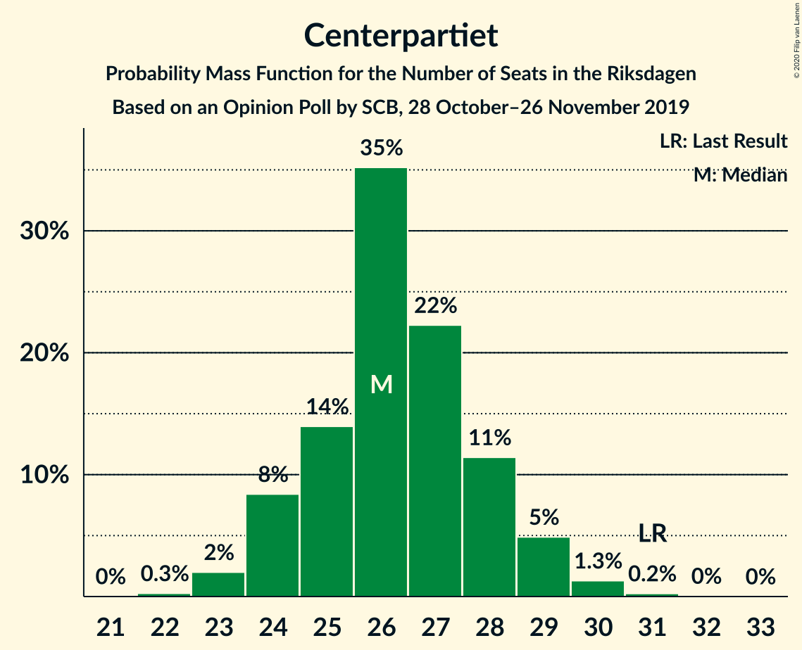
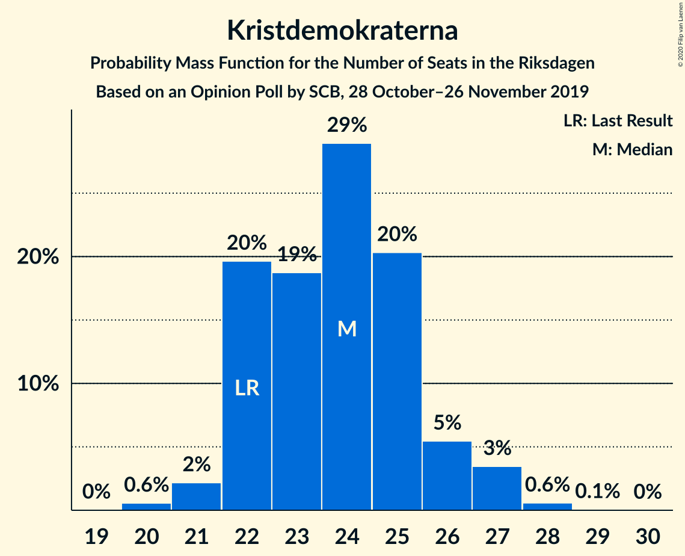
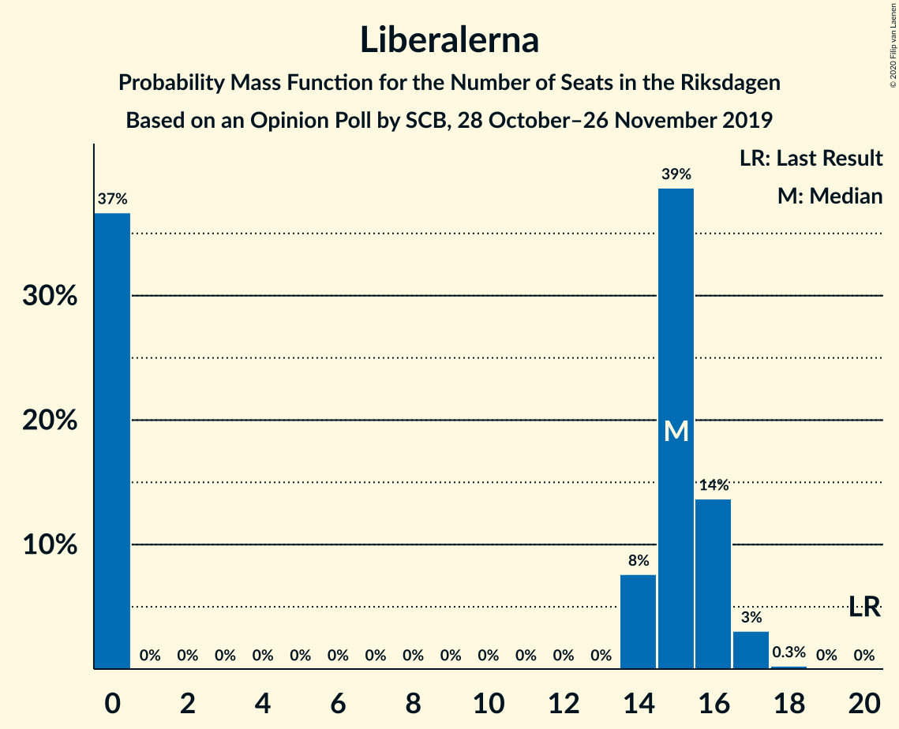

# Opinion Poll by SCB, 28 October–26 November 2019

<a href="#voting-intentions">Voting Intentions</a> | <a href="#seats">Seats</a> | <a href="#coalitions">Coalitions</a> | <a href="#technical-information">Technical Information</a>

## Voting Intentions

### Confidence Intervals

| Party | Last Result | Poll Result | 80% Confidence Interval | 90% Confidence Interval | 95% Confidence Interval | 99% Confidence Interval |
|:-----:|:-----------:|:-----------:|:-----------------------:|:-----------------------:|:-----------------------:|:-----------------------:|
| Sveriges socialdemokratiska arbetareparti | 28.3% | 26.3% | 25.5–27.2% |25.3–27.4% |25.1–27.6% |24.7–28.0% |
| Sverigedemokraterna | 17.5% | 22.6% | 21.8–23.4% |21.6–23.6% |21.4–23.8% |21.0–24.2% |
| Moderata samlingspartiet | 19.8% | 18.3% | 17.6–19.1% |17.4–19.3% |17.2–19.4% |16.9–19.8% |
| Vänsterpartiet | 8.0% | 8.1% | 7.6–8.6% |7.5–8.8% |7.3–8.9% |7.1–9.2% |
| Centerpartiet | 8.6% | 7.3% | 6.8–7.8% |6.7–8.0% |6.6–8.1% |6.4–8.3% |
| Kristdemokraterna | 6.3% | 6.6% | 6.2–7.1% |6.0–7.2% |5.9–7.4% |5.7–7.6% |
| Miljöpartiet de gröna | 4.4% | 5.1% | 4.7–5.5% |4.6–5.7% |4.5–5.8% |4.3–6.0% |
| Liberalerna | 5.5% | 4.1% | 3.7–4.5% |3.6–4.6% |3.6–4.7% |3.4–4.9% |

*Note:* The poll result column reflects the actual value used in the calculations. Published results may vary slightly, and in addition be rounded to fewer digits.

## Seats

### Confidence Intervals

| Party | Last Result | Median | 80% Confidence Interval | 90% Confidence Interval | 95% Confidence Interval | 99% Confidence Interval |
|:-----:|:-----------:|:------:|:-----------------------:|:-----------------------:|:-----------------------:|:-----------------------:|
| <a href="#sveriges-socialdemokratiska-arbetareparti">Sveriges socialdemokratiska arbetareparti</a> | 100 | 94 | 91–99 |90–100 |89–101 |87–103 |
| <a href="#sverigedemokraterna">Sverigedemokraterna</a> | 62 | 80 | 78–84 |77–86 |76–87 |75–89 |
| <a href="#moderata-samlingspartiet">Moderata samlingspartiet</a> | 70 | 66 | 63–69 |62–70 |61–71 |60–72 |
| <a href="#vänsterpartiet">Vänsterpartiet</a> | 28 | 29 | 27–31 |26–31 |26–32 |26–33 |
| <a href="#centerpartiet">Centerpartiet</a> | 31 | 26 | 25–28 |24–29 |24–29 |23–30 |
| <a href="#kristdemokraterna">Kristdemokraterna</a> | 22 | 24 | 22–26 |22–27 |22–27 |20–28 |
| <a href="#miljöpartiet-de-gröna">Miljöpartiet de gröna</a> | 16 | 18 | 17–20 |17–21 |16–21 |15–22 |
| <a href="#liberalerna">Liberalerna</a> | 20 | 15 | 0–16 |0–16 |0–16 |0–17 |

### Sveriges socialdemokratiska arbetareparti

*For a full overview of the results for this party, see the [Sveriges socialdemokratiska arbetareparti](party-sverigessocialdemokratiskaarbetareparti.html) page.*

| Number of Seats | Probability | Accumulated | Special Marks |
|:---------------:|:-----------:|:-----------:|:-------------:|
| 86 | 0% | 100% |  |
| 87 | 2% | 99.9% |  |
| 88 | 0.7% | 98% |  |
| 89 | 1.4% | 98% |  |
| 90 | 4% | 96% |  |
| 91 | 6% | 92% |  |
| 92 | 4% | 87% |  |
| 93 | 14% | 82% |  |
| 94 | 31% | 68% | Median |
| 95 | 4% | 38% |  |
| 96 | 11% | 33% |  |
| 97 | 4% | 22% |  |
| 98 | 3% | 18% |  |
| 99 | 8% | 15% |  |
| 100 | 4% | 7% | Last Result |
| 101 | 1.5% | 3% |  |
| 102 | 0.6% | 1.4% |  |
| 103 | 0.7% | 0.8% |  |
| 104 | 0.1% | 0.1% |  |
| 105 | 0% | 0% |  |

### Sverigedemokraterna

*For a full overview of the results for this party, see the [Sverigedemokraterna](party-sverigedemokraterna.html) page.*

| Number of Seats | Probability | Accumulated | Special Marks |
|:---------------:|:-----------:|:-----------:|:-------------:|
| 62 | 0% | 100% | Last Result |
| 63 | 0% | 100% |  |
| 64 | 0% | 100% |  |
| 65 | 0% | 100% |  |
| 66 | 0% | 100% |  |
| 67 | 0% | 100% |  |
| 68 | 0% | 100% |  |
| 69 | 0% | 100% |  |
| 70 | 0% | 100% |  |
| 71 | 0% | 100% |  |
| 72 | 0% | 100% |  |
| 73 | 0.1% | 100% |  |
| 74 | 0.2% | 99.9% |  |
| 75 | 2% | 99.8% |  |
| 76 | 1.0% | 98% |  |
| 77 | 3% | 97% |  |
| 78 | 7% | 94% |  |
| 79 | 6% | 87% |  |
| 80 | 34% | 80% | Median |
| 81 | 14% | 46% |  |
| 82 | 8% | 32% |  |
| 83 | 6% | 24% |  |
| 84 | 7% | 17% |  |
| 85 | 3% | 10% |  |
| 86 | 3% | 7% |  |
| 87 | 3% | 4% |  |
| 88 | 0.3% | 1.0% |  |
| 89 | 0.7% | 0.8% |  |
| 90 | 0.1% | 0.1% |  |
| 91 | 0% | 0% |  |

### Moderata samlingspartiet

*For a full overview of the results for this party, see the [Moderata samlingspartiet](party-moderatasamlingspartiet.html) page.*

| Number of Seats | Probability | Accumulated | Special Marks |
|:---------------:|:-----------:|:-----------:|:-------------:|
| 58 | 0.1% | 100% |  |
| 59 | 0.2% | 99.9% |  |
| 60 | 0.6% | 99.7% |  |
| 61 | 3% | 99.1% |  |
| 62 | 3% | 97% |  |
| 63 | 29% | 93% |  |
| 64 | 7% | 64% |  |
| 65 | 7% | 58% |  |
| 66 | 15% | 51% | Median |
| 67 | 13% | 35% |  |
| 68 | 8% | 22% |  |
| 69 | 9% | 14% |  |
| 70 | 3% | 5% | Last Result |
| 71 | 2% | 3% |  |
| 72 | 0.5% | 0.8% |  |
| 73 | 0.2% | 0.3% |  |
| 74 | 0.1% | 0.1% |  |
| 75 | 0% | 0% |  |

### Vänsterpartiet

*For a full overview of the results for this party, see the [Vänsterpartiet](party-vänsterpartiet.html) page.*

| Number of Seats | Probability | Accumulated | Special Marks |
|:---------------:|:-----------:|:-----------:|:-------------:|
| 24 | 0.2% | 100% |  |
| 25 | 0.2% | 99.8% |  |
| 26 | 6% | 99.5% |  |
| 27 | 11% | 94% |  |
| 28 | 6% | 83% | Last Result |
| 29 | 50% | 77% | Median |
| 30 | 9% | 27% |  |
| 31 | 14% | 18% |  |
| 32 | 3% | 4% |  |
| 33 | 0.8% | 1.0% |  |
| 34 | 0.2% | 0.3% |  |
| 35 | 0% | 0% |  |

### Centerpartiet

*For a full overview of the results for this party, see the [Centerpartiet](party-centerpartiet.html) page.*

| Number of Seats | Probability | Accumulated | Special Marks |
|:---------------:|:-----------:|:-----------:|:-------------:|
| 22 | 0.3% | 100% |  |
| 23 | 2% | 99.7% |  |
| 24 | 6% | 98% |  |
| 25 | 13% | 92% |  |
| 26 | 47% | 79% | Median |
| 27 | 19% | 32% |  |
| 28 | 7% | 12% |  |
| 29 | 4% | 5% |  |
| 30 | 1.2% | 1.4% |  |
| 31 | 0.3% | 0.3% | Last Result |
| 32 | 0% | 0% |  |

### Kristdemokraterna

*For a full overview of the results for this party, see the [Kristdemokraterna](party-kristdemokraterna.html) page.*

| Number of Seats | Probability | Accumulated | Special Marks |
|:---------------:|:-----------:|:-----------:|:-------------:|
| 20 | 0.5% | 100% |  |
| 21 | 2% | 99.5% |  |
| 22 | 14% | 98% | Last Result |
| 23 | 15% | 84% |  |
| 24 | 48% | 68% | Median |
| 25 | 10% | 21% |  |
| 26 | 4% | 11% |  |
| 27 | 6% | 7% |  |
| 28 | 0.9% | 1.0% |  |
| 29 | 0.1% | 0.1% |  |
| 30 | 0% | 0% |  |

### Miljöpartiet de gröna

*For a full overview of the results for this party, see the [Miljöpartiet de gröna](party-miljöpartietdegröna.html) page.*

| Number of Seats | Probability | Accumulated | Special Marks |
|:---------------:|:-----------:|:-----------:|:-------------:|
| 15 | 1.1% | 100% |  |
| 16 | 2% | 98.8% | Last Result |
| 17 | 13% | 96% |  |
| 18 | 48% | 83% | Median |
| 19 | 19% | 35% |  |
| 20 | 11% | 17% |  |
| 21 | 5% | 6% |  |
| 22 | 0.5% | 0.6% |  |
| 23 | 0.1% | 0.1% |  |
| 24 | 0% | 0% |  |

### Liberalerna

*For a full overview of the results for this party, see the [Liberalerna](party-liberalerna.html) page.*

| Number of Seats | Probability | Accumulated | Special Marks |
|:---------------:|:-----------:|:-----------:|:-------------:|
| 0 | 31% | 100% |  |
| 1 | 0% | 69% |  |
| 2 | 0% | 69% |  |
| 3 | 0% | 69% |  |
| 4 | 0% | 69% |  |
| 5 | 0% | 69% |  |
| 6 | 0% | 69% |  |
| 7 | 0% | 69% |  |
| 8 | 0% | 69% |  |
| 9 | 0% | 69% |  |
| 10 | 0% | 69% |  |
| 11 | 0% | 69% |  |
| 12 | 0% | 69% |  |
| 13 | 0% | 69% |  |
| 14 | 5% | 69% |  |
| 15 | 49% | 65% | Median |
| 16 | 13% | 16% |  |
| 17 | 2% | 2% |  |
| 18 | 0.3% | 0.3% |  |
| 19 | 0% | 0% |  |
| 20 | 0% | 0% | Last Result |

## Coalitions

### Confidence Intervals

| Coalition | Last Result | Median | Majority? | 80% Confidence Interval | 90% Confidence Interval | 95% Confidence Interval | 99% Confidence Interval |
|:---------:|:-----------:|:------:|:---------:|:-----------------------:|:-----------------------:|:-----------------------:|:-----------------------:|
| Sveriges socialdemokratiska arbetareparti – Moderata samlingspartiet – Centerpartiet | 201 | 184 | 100% | 182–193 | 180–194 | 179–196 | 178–198 |
| Sveriges socialdemokratiska arbetareparti – Vänsterpartiet – Centerpartiet – Miljöpartiet de gröna – Liberalerna | 195 | 180 | 78% | 172–183 | 171–184 | 170–185 | 168–187 |
| Sverigedemokraterna – Moderata samlingspartiet – Kristdemokraterna | 154 | 169 | 22% | 166–177 | 165–178 | 164–179 | 162–181 |
| Sveriges socialdemokratiska arbetareparti – Moderata samlingspartiet | 170 | 159 | 0% | 155–167 | 155–168 | 153–169 | 151–170 |
| Sveriges socialdemokratiska arbetareparti – Centerpartiet – Miljöpartiet de gröna – Liberalerna | 167 | 152 | 0% | 142–155 | 141–156 | 140–156 | 139–159 |
| Sverigedemokraterna – Moderata samlingspartiet | 132 | 146 | 0% | 143–152 | 141–153 | 140–155 | 139–156 |
| Sveriges socialdemokratiska arbetareparti – Vänsterpartiet – Miljöpartiet de gröna | 144 | 141 | 0% | 137–148 | 136–149 | 135–151 | 133–151 |
| Moderata samlingspartiet – Centerpartiet – Kristdemokraterna – Liberalerna | 143 | 128 | 0% | 117–132 | 116–132 | 116–134 | 113–135 |
| Sveriges socialdemokratiska arbetareparti – Vänsterpartiet | 128 | 123 | 0% | 119–129 | 118–130 | 118–132 | 115–133 |
| Moderata samlingspartiet – Centerpartiet – Kristdemokraterna | 123 | 115 | 0% | 113–120 | 112–123 | 111–123 | 108–125 |
| Sveriges socialdemokratiska arbetareparti – Miljöpartiet de gröna | 116 | 112 | 0% | 109–118 | 108–119 | 107–120 | 105–122 |
| Moderata samlingspartiet – Centerpartiet – Liberalerna | 121 | 104 | 0% | 93–108 | 92–109 | 92–110 | 89–112 |
| Moderata samlingspartiet – Centerpartiet | 101 | 91 | 0% | 89–96 | 88–96 | 87–98 | 85–99 |

### Sveriges socialdemokratiska arbetareparti – Moderata samlingspartiet – Centerpartiet

| Number of Seats | Probability | Accumulated | Special Marks |
|:---------------:|:-----------:|:-----------:|:-------------:|
| 176 | 0.1% | 100% |  |
| 177 | 0.4% | 99.9% |  |
| 178 | 0.9% | 99.5% |  |
| 179 | 2% | 98.6% |  |
| 180 | 2% | 96% |  |
| 181 | 2% | 94% |  |
| 182 | 5% | 92% |  |
| 183 | 30% | 88% |  |
| 184 | 9% | 58% |  |
| 185 | 5% | 49% |  |
| 186 | 7% | 44% | Median |
| 187 | 3% | 36% |  |
| 188 | 2% | 33% |  |
| 189 | 4% | 32% |  |
| 190 | 2% | 27% |  |
| 191 | 6% | 25% |  |
| 192 | 6% | 18% |  |
| 193 | 5% | 12% |  |
| 194 | 3% | 7% |  |
| 195 | 1.4% | 4% |  |
| 196 | 1.4% | 3% |  |
| 197 | 0.6% | 2% |  |
| 198 | 0.7% | 1.0% |  |
| 199 | 0.2% | 0.3% |  |
| 200 | 0.1% | 0.1% |  |
| 201 | 0% | 0% | Last Result |

### Sveriges socialdemokratiska arbetareparti – Vänsterpartiet – Centerpartiet – Miljöpartiet de gröna – Liberalerna

| Number of Seats | Probability | Accumulated | Special Marks |
|:---------------:|:-----------:|:-----------:|:-------------:|
| 165 | 0% | 100% |  |
| 166 | 0% | 99.9% |  |
| 167 | 0.2% | 99.9% |  |
| 168 | 0.3% | 99.7% |  |
| 169 | 2% | 99.4% |  |
| 170 | 0.9% | 98% |  |
| 171 | 2% | 97% |  |
| 172 | 6% | 95% |  |
| 173 | 6% | 89% |  |
| 174 | 5% | 83% |  |
| 175 | 6% | 78% | Majority |
| 176 | 3% | 72% |  |
| 177 | 7% | 70% |  |
| 178 | 4% | 63% |  |
| 179 | 4% | 58% |  |
| 180 | 4% | 54% |  |
| 181 | 8% | 50% |  |
| 182 | 29% | 41% | Median |
| 183 | 5% | 13% |  |
| 184 | 4% | 7% |  |
| 185 | 2% | 3% |  |
| 186 | 0.3% | 1.4% |  |
| 187 | 0.8% | 1.1% |  |
| 188 | 0.2% | 0.3% |  |
| 189 | 0.1% | 0.1% |  |
| 190 | 0% | 0% |  |
| 191 | 0% | 0% |  |
| 192 | 0% | 0% |  |
| 193 | 0% | 0% |  |
| 194 | 0% | 0% |  |
| 195 | 0% | 0% | Last Result |

### Sverigedemokraterna – Moderata samlingspartiet – Kristdemokraterna

| Number of Seats | Probability | Accumulated | Special Marks |
|:---------------:|:-----------:|:-----------:|:-------------:|
| 154 | 0% | 100% | Last Result |
| 155 | 0% | 100% |  |
| 156 | 0% | 100% |  |
| 157 | 0% | 100% |  |
| 158 | 0% | 100% |  |
| 159 | 0% | 100% |  |
| 160 | 0.1% | 100% |  |
| 161 | 0.2% | 99.9% |  |
| 162 | 0.8% | 99.7% |  |
| 163 | 0.3% | 98.9% |  |
| 164 | 2% | 98.6% |  |
| 165 | 4% | 97% |  |
| 166 | 5% | 93% |  |
| 167 | 29% | 87% |  |
| 168 | 8% | 59% |  |
| 169 | 4% | 50% |  |
| 170 | 4% | 46% | Median |
| 171 | 4% | 42% |  |
| 172 | 7% | 37% |  |
| 173 | 3% | 30% |  |
| 174 | 6% | 28% |  |
| 175 | 5% | 22% | Majority |
| 176 | 6% | 17% |  |
| 177 | 6% | 11% |  |
| 178 | 2% | 5% |  |
| 179 | 0.9% | 3% |  |
| 180 | 2% | 2% |  |
| 181 | 0.3% | 0.6% |  |
| 182 | 0.2% | 0.3% |  |
| 183 | 0% | 0.1% |  |
| 184 | 0% | 0.1% |  |
| 185 | 0% | 0% |  |

### Sveriges socialdemokratiska arbetareparti – Moderata samlingspartiet

| Number of Seats | Probability | Accumulated | Special Marks |
|:---------------:|:-----------:|:-----------:|:-------------:|
| 150 | 0% | 100% |  |
| 151 | 0.9% | 99.9% |  |
| 152 | 0.4% | 99.1% |  |
| 153 | 2% | 98.7% |  |
| 154 | 2% | 97% |  |
| 155 | 5% | 95% |  |
| 156 | 2% | 90% |  |
| 157 | 29% | 87% |  |
| 158 | 6% | 58% |  |
| 159 | 9% | 52% |  |
| 160 | 6% | 44% | Median |
| 161 | 4% | 37% |  |
| 162 | 4% | 33% |  |
| 163 | 4% | 29% |  |
| 164 | 2% | 25% |  |
| 165 | 10% | 23% |  |
| 166 | 3% | 13% |  |
| 167 | 4% | 10% |  |
| 168 | 4% | 7% |  |
| 169 | 2% | 3% |  |
| 170 | 0.6% | 1.0% | Last Result |
| 171 | 0.1% | 0.4% |  |
| 172 | 0.2% | 0.2% |  |
| 173 | 0% | 0% |  |

### Sveriges socialdemokratiska arbetareparti – Centerpartiet – Miljöpartiet de gröna – Liberalerna

| Number of Seats | Probability | Accumulated | Special Marks |
|:---------------:|:-----------:|:-----------:|:-------------:|
| 136 | 0% | 100% |  |
| 137 | 0.1% | 99.9% |  |
| 138 | 0.2% | 99.8% |  |
| 139 | 0.4% | 99.6% |  |
| 140 | 2% | 99.2% |  |
| 141 | 2% | 97% |  |
| 142 | 9% | 95% |  |
| 143 | 1.3% | 86% |  |
| 144 | 6% | 85% |  |
| 145 | 3% | 79% |  |
| 146 | 3% | 76% |  |
| 147 | 5% | 73% |  |
| 148 | 3% | 68% |  |
| 149 | 4% | 65% |  |
| 150 | 3% | 60% |  |
| 151 | 5% | 57% |  |
| 152 | 10% | 52% |  |
| 153 | 27% | 42% | Median |
| 154 | 4% | 15% |  |
| 155 | 5% | 11% |  |
| 156 | 4% | 6% |  |
| 157 | 1.4% | 2% |  |
| 158 | 0.3% | 0.8% |  |
| 159 | 0.5% | 0.5% |  |
| 160 | 0.1% | 0.1% |  |
| 161 | 0% | 0% |  |
| 162 | 0% | 0% |  |
| 163 | 0% | 0% |  |
| 164 | 0% | 0% |  |
| 165 | 0% | 0% |  |
| 166 | 0% | 0% |  |
| 167 | 0% | 0% | Last Result |

### Sverigedemokraterna – Moderata samlingspartiet

| Number of Seats | Probability | Accumulated | Special Marks |
|:---------------:|:-----------:|:-----------:|:-------------:|
| 132 | 0% | 100% | Last Result |
| 133 | 0% | 100% |  |
| 134 | 0% | 100% |  |
| 135 | 0% | 100% |  |
| 136 | 0% | 100% |  |
| 137 | 0.1% | 100% |  |
| 138 | 0.2% | 99.9% |  |
| 139 | 0.4% | 99.7% |  |
| 140 | 2% | 99.2% |  |
| 141 | 3% | 97% |  |
| 142 | 2% | 95% |  |
| 143 | 30% | 92% |  |
| 144 | 7% | 63% |  |
| 145 | 4% | 55% |  |
| 146 | 9% | 52% | Median |
| 147 | 6% | 43% |  |
| 148 | 8% | 38% |  |
| 149 | 4% | 30% |  |
| 150 | 8% | 26% |  |
| 151 | 4% | 18% |  |
| 152 | 7% | 15% |  |
| 153 | 4% | 8% |  |
| 154 | 1.3% | 4% |  |
| 155 | 0.8% | 3% |  |
| 156 | 1.3% | 2% |  |
| 157 | 0.3% | 0.5% |  |
| 158 | 0.1% | 0.1% |  |
| 159 | 0.1% | 0.1% |  |
| 160 | 0% | 0% |  |

### Sveriges socialdemokratiska arbetareparti – Vänsterpartiet – Miljöpartiet de gröna

| Number of Seats | Probability | Accumulated | Special Marks |
|:---------------:|:-----------:|:-----------:|:-------------:|
| 132 | 0% | 100% |  |
| 133 | 0.7% | 99.9% |  |
| 134 | 0.7% | 99.2% |  |
| 135 | 2% | 98% |  |
| 136 | 5% | 97% |  |
| 137 | 3% | 91% |  |
| 138 | 2% | 88% |  |
| 139 | 8% | 86% |  |
| 140 | 9% | 78% |  |
| 141 | 32% | 69% | Median |
| 142 | 2% | 37% |  |
| 143 | 4% | 35% |  |
| 144 | 5% | 32% | Last Result |
| 145 | 7% | 27% |  |
| 146 | 4% | 20% |  |
| 147 | 5% | 16% |  |
| 148 | 2% | 11% |  |
| 149 | 6% | 9% |  |
| 150 | 0.5% | 3% |  |
| 151 | 2% | 3% |  |
| 152 | 0.1% | 0.2% |  |
| 153 | 0.1% | 0.1% |  |
| 154 | 0% | 0% |  |

### Moderata samlingspartiet – Centerpartiet – Kristdemokraterna – Liberalerna

| Number of Seats | Probability | Accumulated | Special Marks |
|:---------------:|:-----------:|:-----------:|:-------------:|
| 112 | 0.4% | 100% |  |
| 113 | 0.4% | 99.5% |  |
| 114 | 0.3% | 99.2% |  |
| 115 | 0.6% | 98.8% |  |
| 116 | 6% | 98% |  |
| 117 | 5% | 92% |  |
| 118 | 5% | 88% |  |
| 119 | 2% | 83% |  |
| 120 | 3% | 81% |  |
| 121 | 0.9% | 78% |  |
| 122 | 2% | 77% |  |
| 123 | 5% | 75% |  |
| 124 | 2% | 70% |  |
| 125 | 0.8% | 68% |  |
| 126 | 2% | 67% |  |
| 127 | 4% | 66% |  |
| 128 | 29% | 62% |  |
| 129 | 7% | 33% |  |
| 130 | 8% | 26% |  |
| 131 | 7% | 18% | Median |
| 132 | 7% | 12% |  |
| 133 | 2% | 5% |  |
| 134 | 1.4% | 3% |  |
| 135 | 0.9% | 1.3% |  |
| 136 | 0.3% | 0.4% |  |
| 137 | 0.1% | 0.1% |  |
| 138 | 0% | 0% |  |
| 139 | 0% | 0% |  |
| 140 | 0% | 0% |  |
| 141 | 0% | 0% |  |
| 142 | 0% | 0% |  |
| 143 | 0% | 0% | Last Result |

### Sveriges socialdemokratiska arbetareparti – Vänsterpartiet

| Number of Seats | Probability | Accumulated | Special Marks |
|:---------------:|:-----------:|:-----------:|:-------------:|
| 114 | 0.1% | 100% |  |
| 115 | 0.8% | 99.9% |  |
| 116 | 1.0% | 99.2% |  |
| 117 | 0.6% | 98% |  |
| 118 | 4% | 98% |  |
| 119 | 6% | 94% |  |
| 120 | 7% | 88% |  |
| 121 | 7% | 81% |  |
| 122 | 8% | 75% |  |
| 123 | 29% | 66% | Median |
| 124 | 4% | 38% |  |
| 125 | 5% | 34% |  |
| 126 | 7% | 28% |  |
| 127 | 6% | 21% |  |
| 128 | 4% | 15% | Last Result |
| 129 | 3% | 12% |  |
| 130 | 5% | 8% |  |
| 131 | 0.7% | 3% |  |
| 132 | 1.5% | 3% |  |
| 133 | 1.1% | 1.2% |  |
| 134 | 0% | 0.1% |  |
| 135 | 0.1% | 0.1% |  |
| 136 | 0% | 0% |  |

### Moderata samlingspartiet – Centerpartiet – Kristdemokraterna

| Number of Seats | Probability | Accumulated | Special Marks |
|:---------------:|:-----------:|:-----------:|:-------------:|
| 107 | 0.2% | 100% |  |
| 108 | 0.6% | 99.8% |  |
| 109 | 1.1% | 99.2% |  |
| 110 | 0.5% | 98% |  |
| 111 | 2% | 98% |  |
| 112 | 3% | 95% |  |
| 113 | 35% | 92% |  |
| 114 | 4% | 57% |  |
| 115 | 8% | 53% |  |
| 116 | 10% | 45% | Median |
| 117 | 11% | 35% |  |
| 118 | 9% | 24% |  |
| 119 | 3% | 15% |  |
| 120 | 3% | 13% |  |
| 121 | 1.1% | 9% |  |
| 122 | 2% | 8% |  |
| 123 | 5% | 6% | Last Result |
| 124 | 0.7% | 1.3% |  |
| 125 | 0.3% | 0.5% |  |
| 126 | 0.2% | 0.2% |  |
| 127 | 0% | 0.1% |  |
| 128 | 0% | 0% |  |

### Sveriges socialdemokratiska arbetareparti – Miljöpartiet de gröna

| Number of Seats | Probability | Accumulated | Special Marks |
|:---------------:|:-----------:|:-----------:|:-------------:|
| 104 | 0.1% | 100% |  |
| 105 | 0.9% | 99.8% |  |
| 106 | 1.4% | 99.0% |  |
| 107 | 2% | 98% |  |
| 108 | 4% | 96% |  |
| 109 | 2% | 91% |  |
| 110 | 10% | 89% |  |
| 111 | 8% | 79% |  |
| 112 | 30% | 71% | Median |
| 113 | 5% | 41% |  |
| 114 | 6% | 37% |  |
| 115 | 9% | 31% |  |
| 116 | 4% | 22% | Last Result |
| 117 | 5% | 18% |  |
| 118 | 7% | 13% |  |
| 119 | 4% | 7% |  |
| 120 | 2% | 3% |  |
| 121 | 0.6% | 1.5% |  |
| 122 | 0.7% | 0.9% |  |
| 123 | 0.1% | 0.2% |  |
| 124 | 0.1% | 0.1% |  |
| 125 | 0% | 0% |  |

### Moderata samlingspartiet – Centerpartiet – Liberalerna

| Number of Seats | Probability | Accumulated | Special Marks |
|:---------------:|:-----------:|:-----------:|:-------------:|
| 87 | 0% | 100% |  |
| 88 | 0% | 99.9% |  |
| 89 | 0.6% | 99.9% |  |
| 90 | 0.3% | 99.3% |  |
| 91 | 1.0% | 99.0% |  |
| 92 | 6% | 98% |  |
| 93 | 5% | 92% |  |
| 94 | 3% | 87% |  |
| 95 | 4% | 84% |  |
| 96 | 7% | 80% |  |
| 97 | 0.7% | 73% |  |
| 98 | 2% | 72% |  |
| 99 | 0.6% | 70% |  |
| 100 | 0.6% | 70% |  |
| 101 | 0.6% | 69% |  |
| 102 | 2% | 68% |  |
| 103 | 3% | 67% |  |
| 104 | 29% | 64% |  |
| 105 | 2% | 34% |  |
| 106 | 6% | 32% |  |
| 107 | 10% | 26% | Median |
| 108 | 10% | 16% |  |
| 109 | 1.4% | 6% |  |
| 110 | 3% | 4% |  |
| 111 | 0.6% | 1.2% |  |
| 112 | 0.5% | 0.6% |  |
| 113 | 0.1% | 0.1% |  |
| 114 | 0% | 0% |  |
| 115 | 0% | 0% |  |
| 116 | 0% | 0% |  |
| 117 | 0% | 0% |  |
| 118 | 0% | 0% |  |
| 119 | 0% | 0% |  |
| 120 | 0% | 0% |  |
| 121 | 0% | 0% | Last Result |

### Moderata samlingspartiet – Centerpartiet

| Number of Seats | Probability | Accumulated | Special Marks |
|:---------------:|:-----------:|:-----------:|:-------------:|
| 84 | 0.2% | 100% |  |
| 85 | 0.4% | 99.8% |  |
| 86 | 0.8% | 99.4% |  |
| 87 | 1.4% | 98.6% |  |
| 88 | 4% | 97% |  |
| 89 | 30% | 93% |  |
| 90 | 2% | 63% |  |
| 91 | 13% | 61% |  |
| 92 | 12% | 49% | Median |
| 93 | 13% | 36% |  |
| 94 | 5% | 23% |  |
| 95 | 7% | 18% |  |
| 96 | 8% | 12% |  |
| 97 | 1.0% | 4% |  |
| 98 | 2% | 3% |  |
| 99 | 0.5% | 1.0% |  |
| 100 | 0.3% | 0.5% |  |
| 101 | 0.1% | 0.2% | Last Result |
| 102 | 0.1% | 0.1% |  |
| 103 | 0% | 0% |  |

## Technical Information

### Opinion Poll

+ **Polling firm:** SCB
+ **Commissioner(s):** —
+ **Fieldwork period:** 28 October–26 November 2019

### Calculations

+ **Sample size:** 4645
+ **Simulations done:** 262,144
+ **Error estimate:** 0.90%

