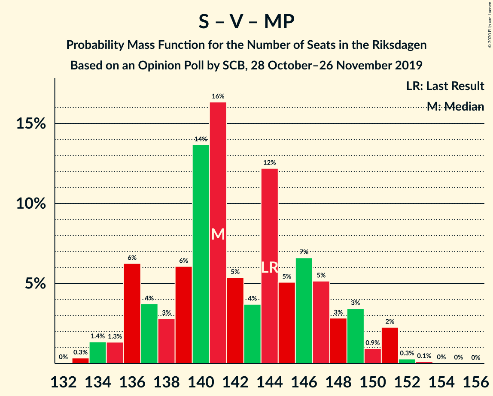
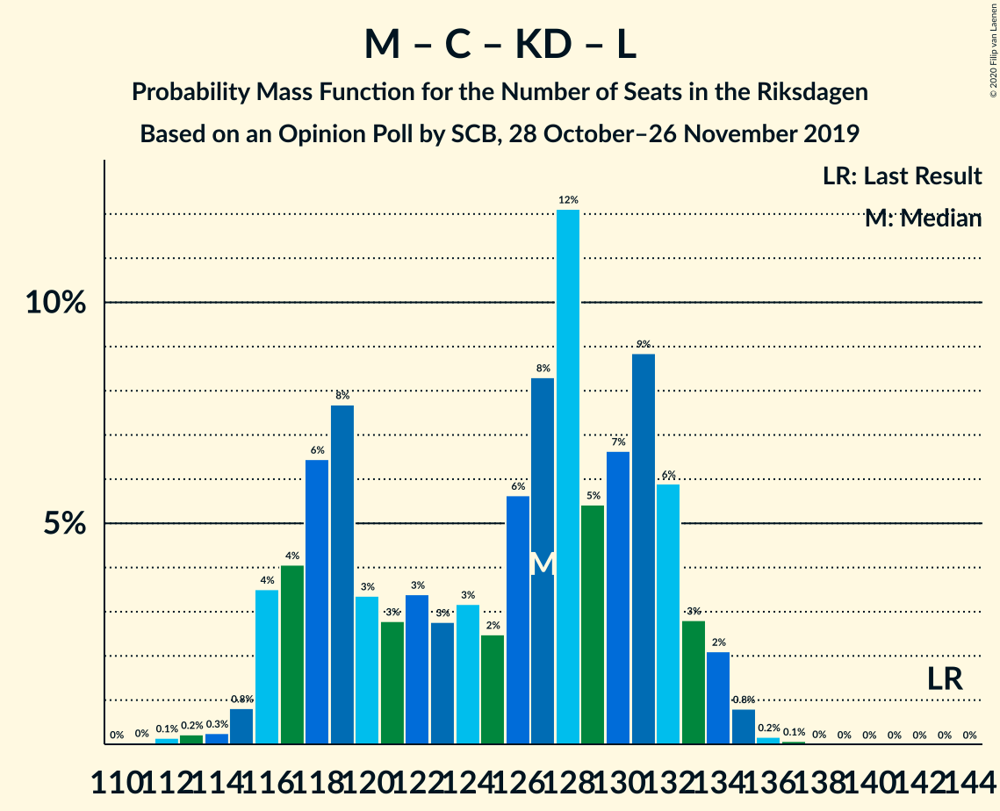

# Opinion Poll by SCB, 28 October–26 November 2019

<a href="#voting-intentions">Voting Intentions</a> | <a href="#seats">Seats</a> | <a href="#coalitions">Coalitions</a> | <a href="#technical-information">Technical Information</a>

## Voting Intentions

### Confidence Intervals

| Party | Last Result | Poll Result | 80% Confidence Interval | 90% Confidence Interval | 95% Confidence Interval | 99% Confidence Interval |
|:-----:|:-----------:|:-----------:|:-----------------------:|:-----------------------:|:-----------------------:|:-----------------------:|
| Sveriges socialdemokratiska arbetareparti | 28.3% | 26.3% | 25.5–27.2% |25.3–27.4% |25.1–27.6% |24.7–28.0% |
| Sverigedemokraterna | 17.5% | 22.6% | 21.8–23.4% |21.6–23.6% |21.4–23.8% |21.0–24.2% |
| Moderata samlingspartiet | 19.8% | 18.3% | 17.6–19.1% |17.4–19.3% |17.2–19.4% |16.9–19.8% |
| Vänsterpartiet | 8.0% | 8.1% | 7.6–8.6% |7.5–8.8% |7.3–8.9% |7.1–9.2% |
| Centerpartiet | 8.6% | 7.3% | 6.8–7.8% |6.7–8.0% |6.6–8.1% |6.4–8.3% |
| Kristdemokraterna | 6.3% | 6.6% | 6.2–7.1% |6.0–7.2% |5.9–7.4% |5.7–7.6% |
| Miljöpartiet de gröna | 4.4% | 5.1% | 4.7–5.5% |4.6–5.7% |4.5–5.8% |4.3–6.0% |
| Liberalerna | 5.5% | 4.1% | 3.7–4.5% |3.6–4.6% |3.6–4.7% |3.4–4.9% |

*Note:* The poll result column reflects the actual value used in the calculations. Published results may vary slightly, and in addition be rounded to fewer digits.

## Seats

### Confidence Intervals

| Party | Last Result | Median | 80% Confidence Interval | 90% Confidence Interval | 95% Confidence Interval | 99% Confidence Interval |
|:-----:|:-----------:|:------:|:-----------------------:|:-----------------------:|:-----------------------:|:-----------------------:|
| <a href="#sveriges-socialdemokratiska-arbetareparti">Sveriges socialdemokratiska arbetareparti</a> | 100 | 94 | 91–99 |90–100 |89–101 |87–103 |
| <a href="#sverigedemokraterna">Sverigedemokraterna</a> | 62 | 81 | 78–85 |77–86 |76–87 |75–88 |
| <a href="#moderata-samlingspartiet">Moderata samlingspartiet</a> | 70 | 66 | 63–69 |62–70 |61–71 |60–72 |
| <a href="#vänsterpartiet">Vänsterpartiet</a> | 28 | 29 | 27–31 |27–32 |26–32 |25–33 |
| <a href="#centerpartiet">Centerpartiet</a> | 31 | 26 | 24–28 |24–29 |24–29 |23–30 |
| <a href="#kristdemokraterna">Kristdemokraterna</a> | 22 | 24 | 22–25 |22–26 |21–27 |20–28 |
| <a href="#miljöpartiet-de-gröna">Miljöpartiet de gröna</a> | 16 | 18 | 17–20 |16–21 |16–21 |15–22 |
| <a href="#liberalerna">Liberalerna</a> | 20 | 15 | 0–16 |0–16 |0–17 |0–17 |

### Sveriges socialdemokratiska arbetareparti

*For a full overview of the results for this party, see the [Sveriges socialdemokratiska arbetareparti](party-sverigessocialdemokratiskaarbetareparti.html) page.*

| Number of Seats | Probability | Accumulated | Special Marks |
|:---------------:|:-----------:|:-----------:|:-------------:|
| 86 | 0.1% | 100% |  |
| 87 | 0.7% | 99.8% |  |
| 88 | 0.6% | 99.1% |  |
| 89 | 2% | 98.5% |  |
| 90 | 4% | 96% |  |
| 91 | 7% | 92% |  |
| 92 | 7% | 84% |  |
| 93 | 13% | 78% |  |
| 94 | 16% | 65% | Median |
| 95 | 13% | 49% |  |
| 96 | 12% | 36% |  |
| 97 | 6% | 24% |  |
| 98 | 7% | 18% |  |
| 99 | 3% | 11% |  |
| 100 | 4% | 7% | Last Result |
| 101 | 2% | 3% |  |
| 102 | 0.7% | 1.2% |  |
| 103 | 0.4% | 0.5% |  |
| 104 | 0.1% | 0.1% |  |
| 105 | 0.1% | 0.1% |  |
| 106 | 0% | 0% |  |

### Sverigedemokraterna

*For a full overview of the results for this party, see the [Sverigedemokraterna](party-sverigedemokraterna.html) page.*

| Number of Seats | Probability | Accumulated | Special Marks |
|:---------------:|:-----------:|:-----------:|:-------------:|
| 62 | 0% | 100% | Last Result |
| 63 | 0% | 100% |  |
| 64 | 0% | 100% |  |
| 65 | 0% | 100% |  |
| 66 | 0% | 100% |  |
| 67 | 0% | 100% |  |
| 68 | 0% | 100% |  |
| 69 | 0% | 100% |  |
| 70 | 0% | 100% |  |
| 71 | 0% | 100% |  |
| 72 | 0% | 100% |  |
| 73 | 0.1% | 100% |  |
| 74 | 0.2% | 99.9% |  |
| 75 | 1.0% | 99.7% |  |
| 76 | 2% | 98.8% |  |
| 77 | 6% | 97% |  |
| 78 | 6% | 92% |  |
| 79 | 10% | 86% |  |
| 80 | 16% | 76% |  |
| 81 | 12% | 60% | Median |
| 82 | 16% | 48% |  |
| 83 | 10% | 32% |  |
| 84 | 6% | 22% |  |
| 85 | 6% | 16% |  |
| 86 | 6% | 10% |  |
| 87 | 3% | 4% |  |
| 88 | 0.8% | 1.2% |  |
| 89 | 0.3% | 0.5% |  |
| 90 | 0.1% | 0.1% |  |
| 91 | 0% | 0% |  |

### Moderata samlingspartiet

*For a full overview of the results for this party, see the [Moderata samlingspartiet](party-moderatasamlingspartiet.html) page.*

| Number of Seats | Probability | Accumulated | Special Marks |
|:---------------:|:-----------:|:-----------:|:-------------:|
| 59 | 0.1% | 100% |  |
| 60 | 0.6% | 99.8% |  |
| 61 | 2% | 99.3% |  |
| 62 | 4% | 97% |  |
| 63 | 14% | 93% |  |
| 64 | 16% | 78% |  |
| 65 | 11% | 62% |  |
| 66 | 14% | 52% | Median |
| 67 | 12% | 38% |  |
| 68 | 10% | 26% |  |
| 69 | 9% | 16% |  |
| 70 | 4% | 7% | Last Result |
| 71 | 2% | 3% |  |
| 72 | 0.6% | 1.0% |  |
| 73 | 0.3% | 0.4% |  |
| 74 | 0.1% | 0.1% |  |
| 75 | 0% | 0% |  |

### Vänsterpartiet

*For a full overview of the results for this party, see the [Vänsterpartiet](party-vänsterpartiet.html) page.*

| Number of Seats | Probability | Accumulated | Special Marks |
|:---------------:|:-----------:|:-----------:|:-------------:|
| 24 | 0.1% | 100% |  |
| 25 | 0.4% | 99.9% |  |
| 26 | 4% | 99.5% |  |
| 27 | 12% | 95% |  |
| 28 | 8% | 83% | Last Result |
| 29 | 44% | 75% | Median |
| 30 | 12% | 31% |  |
| 31 | 12% | 19% |  |
| 32 | 5% | 6% |  |
| 33 | 0.8% | 1.3% |  |
| 34 | 0.5% | 0.5% |  |
| 35 | 0% | 0% |  |

### Centerpartiet

*For a full overview of the results for this party, see the [Centerpartiet](party-centerpartiet.html) page.*

| Number of Seats | Probability | Accumulated | Special Marks |
|:---------------:|:-----------:|:-----------:|:-------------:|
| 22 | 0.3% | 100% |  |
| 23 | 2% | 99.7% |  |
| 24 | 8% | 98% |  |
| 25 | 14% | 89% |  |
| 26 | 35% | 75% | Median |
| 27 | 22% | 40% |  |
| 28 | 11% | 18% |  |
| 29 | 5% | 6% |  |
| 30 | 1.3% | 2% |  |
| 31 | 0.2% | 0.3% | Last Result |
| 32 | 0% | 0.1% |  |
| 33 | 0% | 0% |  |

### Kristdemokraterna

*For a full overview of the results for this party, see the [Kristdemokraterna](party-kristdemokraterna.html) page.*

| Number of Seats | Probability | Accumulated | Special Marks |
|:---------------:|:-----------:|:-----------:|:-------------:|
| 20 | 0.6% | 100% |  |
| 21 | 2% | 99.4% |  |
| 22 | 20% | 97% | Last Result |
| 23 | 19% | 78% |  |
| 24 | 29% | 59% | Median |
| 25 | 20% | 30% |  |
| 26 | 5% | 10% |  |
| 27 | 3% | 4% |  |
| 28 | 0.6% | 0.7% |  |
| 29 | 0.1% | 0.1% |  |
| 30 | 0% | 0% |  |

### Miljöpartiet de gröna

*For a full overview of the results for this party, see the [Miljöpartiet de gröna](party-miljöpartietdegröna.html) page.*

| Number of Seats | Probability | Accumulated | Special Marks |
|:---------------:|:-----------:|:-----------:|:-------------:|
| 15 | 0.6% | 100% |  |
| 16 | 7% | 99.4% | Last Result |
| 17 | 12% | 92% |  |
| 18 | 37% | 80% | Median |
| 19 | 22% | 43% |  |
| 20 | 14% | 21% |  |
| 21 | 6% | 7% |  |
| 22 | 0.5% | 0.6% |  |
| 23 | 0.1% | 0.1% |  |
| 24 | 0% | 0% |  |

### Liberalerna

*For a full overview of the results for this party, see the [Liberalerna](party-liberalerna.html) page.*

| Number of Seats | Probability | Accumulated | Special Marks |
|:---------------:|:-----------:|:-----------:|:-------------:|
| 0 | 37% | 100% |  |
| 1 | 0% | 63% |  |
| 2 | 0% | 63% |  |
| 3 | 0% | 63% |  |
| 4 | 0% | 63% |  |
| 5 | 0% | 63% |  |
| 6 | 0% | 63% |  |
| 7 | 0% | 63% |  |
| 8 | 0% | 63% |  |
| 9 | 0% | 63% |  |
| 10 | 0% | 63% |  |
| 11 | 0% | 63% |  |
| 12 | 0% | 63% |  |
| 13 | 0% | 63% |  |
| 14 | 8% | 63% |  |
| 15 | 39% | 56% | Median |
| 16 | 14% | 17% |  |
| 17 | 3% | 3% |  |
| 18 | 0.3% | 0.3% |  |
| 19 | 0% | 0% |  |
| 20 | 0% | 0% | Last Result |

## Coalitions

### Confidence Intervals

| Coalition | Last Result | Median | Majority? | 80% Confidence Interval | 90% Confidence Interval | 95% Confidence Interval | 99% Confidence Interval |
|:---------:|:-----------:|:------:|:---------:|:-----------------------:|:-----------------------:|:-----------------------:|:-----------------------:|
| Sveriges socialdemokratiska arbetareparti – Moderata samlingspartiet – Centerpartiet | 201 | 185 | 100% | 182–193 | 180–195 | 179–196 | 178–198 |
| Sveriges socialdemokratiska arbetareparti – Vänsterpartiet – Centerpartiet – Miljöpartiet de gröna – Liberalerna | 195 | 179 | 74% | 171–183 | 170–184 | 169–185 | 168–187 |
| Sverigedemokraterna – Moderata samlingspartiet – Kristdemokraterna | 154 | 170 | 26% | 166–178 | 165–179 | 164–180 | 162–181 |
| Sveriges socialdemokratiska arbetareparti – Moderata samlingspartiet | 170 | 160 | 0% | 155–166 | 154–168 | 153–169 | 151–171 |
| Sveriges socialdemokratiska arbetareparti – Centerpartiet – Miljöpartiet de gröna – Liberalerna | 167 | 151 | 0% | 142–155 | 141–156 | 139–157 | 137–159 |
| Sverigedemokraterna – Moderata samlingspartiet | 132 | 146 | 0% | 142–153 | 141–155 | 140–155 | 138–157 |
| Sveriges socialdemokratiska arbetareparti – Vänsterpartiet – Miljöpartiet de gröna | 144 | 141 | 0% | 137–147 | 136–149 | 135–151 | 134–151 |
| Moderata samlingspartiet – Centerpartiet – Kristdemokraterna – Liberalerna | 143 | 127 | 0% | 118–132 | 117–133 | 116–134 | 114–135 |
| Sveriges socialdemokratiska arbetareparti – Vänsterpartiet | 128 | 123 | 0% | 119–128 | 118–130 | 117–131 | 115–133 |
| Moderata samlingspartiet – Centerpartiet – Kristdemokraterna | 123 | 116 | 0% | 112–121 | 110–122 | 110–123 | 108–125 |
| Sveriges socialdemokratiska arbetareparti – Miljöpartiet de gröna | 116 | 113 | 0% | 109–118 | 107–119 | 107–120 | 105–121 |
| Moderata samlingspartiet – Centerpartiet – Liberalerna | 121 | 104 | 0% | 93–108 | 92–109 | 91–110 | 90–111 |
| Moderata samlingspartiet – Centerpartiet | 101 | 92 | 0% | 89–96 | 88–97 | 87–98 | 85–100 |

### Sveriges socialdemokratiska arbetareparti – Moderata samlingspartiet – Centerpartiet

| Number of Seats | Probability | Accumulated | Special Marks |
|:---------------:|:-----------:|:-----------:|:-------------:|
| 175 | 0.1% | 100% | Majority |
| 176 | 0.1% | 99.9% |  |
| 177 | 0.3% | 99.8% |  |
| 178 | 1.0% | 99.5% |  |
| 179 | 2% | 98.5% |  |
| 180 | 2% | 97% |  |
| 181 | 3% | 94% |  |
| 182 | 6% | 91% |  |
| 183 | 19% | 86% |  |
| 184 | 11% | 67% |  |
| 185 | 6% | 56% |  |
| 186 | 6% | 49% | Median |
| 187 | 4% | 44% |  |
| 188 | 3% | 39% |  |
| 189 | 6% | 36% |  |
| 190 | 3% | 30% |  |
| 191 | 7% | 27% |  |
| 192 | 6% | 19% |  |
| 193 | 5% | 13% |  |
| 194 | 3% | 8% |  |
| 195 | 2% | 5% |  |
| 196 | 2% | 3% |  |
| 197 | 0.8% | 1.5% |  |
| 198 | 0.4% | 0.7% |  |
| 199 | 0.1% | 0.2% |  |
| 200 | 0.1% | 0.1% |  |
| 201 | 0% | 0% | Last Result |

### Sveriges socialdemokratiska arbetareparti – Vänsterpartiet – Centerpartiet – Miljöpartiet de gröna – Liberalerna

| Number of Seats | Probability | Accumulated | Special Marks |
|:---------------:|:-----------:|:-----------:|:-------------:|
| 166 | 0.1% | 100% |  |
| 167 | 0.2% | 99.9% |  |
| 168 | 0.8% | 99.7% |  |
| 169 | 1.5% | 98.9% |  |
| 170 | 2% | 97% |  |
| 171 | 7% | 95% |  |
| 172 | 4% | 88% |  |
| 173 | 6% | 84% |  |
| 174 | 4% | 78% |  |
| 175 | 7% | 74% | Majority |
| 176 | 4% | 68% |  |
| 177 | 5% | 64% |  |
| 178 | 4% | 58% |  |
| 179 | 8% | 54% |  |
| 180 | 6% | 47% |  |
| 181 | 13% | 41% |  |
| 182 | 13% | 28% | Median |
| 183 | 5% | 15% |  |
| 184 | 5% | 10% |  |
| 185 | 2% | 4% |  |
| 186 | 1.3% | 2% |  |
| 187 | 0.5% | 0.8% |  |
| 188 | 0.2% | 0.3% |  |
| 189 | 0.1% | 0.1% |  |
| 190 | 0% | 0% |  |
| 191 | 0% | 0% |  |
| 192 | 0% | 0% |  |
| 193 | 0% | 0% |  |
| 194 | 0% | 0% |  |
| 195 | 0% | 0% | Last Result |

### Sverigedemokraterna – Moderata samlingspartiet – Kristdemokraterna

| Number of Seats | Probability | Accumulated | Special Marks |
|:---------------:|:-----------:|:-----------:|:-------------:|
| 154 | 0% | 100% | Last Result |
| 155 | 0% | 100% |  |
| 156 | 0% | 100% |  |
| 157 | 0% | 100% |  |
| 158 | 0% | 100% |  |
| 159 | 0% | 100% |  |
| 160 | 0.1% | 100% |  |
| 161 | 0.2% | 99.9% |  |
| 162 | 0.5% | 99.7% |  |
| 163 | 1.3% | 99.2% |  |
| 164 | 2% | 98% |  |
| 165 | 5% | 96% |  |
| 166 | 5% | 90% |  |
| 167 | 13% | 85% |  |
| 168 | 13% | 72% |  |
| 169 | 6% | 59% |  |
| 170 | 8% | 53% |  |
| 171 | 4% | 46% | Median |
| 172 | 5% | 42% |  |
| 173 | 4% | 36% |  |
| 174 | 7% | 32% |  |
| 175 | 4% | 26% | Majority |
| 176 | 6% | 22% |  |
| 177 | 4% | 16% |  |
| 178 | 7% | 12% |  |
| 179 | 2% | 5% |  |
| 180 | 1.5% | 3% |  |
| 181 | 0.8% | 1.1% |  |
| 182 | 0.2% | 0.3% |  |
| 183 | 0.1% | 0.1% |  |
| 184 | 0% | 0% |  |

### Sveriges socialdemokratiska arbetareparti – Moderata samlingspartiet

| Number of Seats | Probability | Accumulated | Special Marks |
|:---------------:|:-----------:|:-----------:|:-------------:|
| 150 | 0.1% | 100% |  |
| 151 | 0.5% | 99.9% |  |
| 152 | 0.4% | 99.4% |  |
| 153 | 2% | 99.0% |  |
| 154 | 3% | 97% |  |
| 155 | 5% | 94% |  |
| 156 | 6% | 90% |  |
| 157 | 16% | 84% |  |
| 158 | 8% | 68% |  |
| 159 | 8% | 60% |  |
| 160 | 6% | 51% | Median |
| 161 | 8% | 45% |  |
| 162 | 5% | 37% |  |
| 163 | 6% | 32% |  |
| 164 | 5% | 26% |  |
| 165 | 5% | 20% |  |
| 166 | 6% | 15% |  |
| 167 | 3% | 9% |  |
| 168 | 3% | 6% |  |
| 169 | 2% | 3% |  |
| 170 | 0.5% | 1.3% | Last Result |
| 171 | 0.6% | 0.9% |  |
| 172 | 0.2% | 0.3% |  |
| 173 | 0% | 0.1% |  |
| 174 | 0% | 0% |  |

### Sveriges socialdemokratiska arbetareparti – Centerpartiet – Miljöpartiet de gröna – Liberalerna

| Number of Seats | Probability | Accumulated | Special Marks |
|:---------------:|:-----------:|:-----------:|:-------------:|
| 136 | 0% | 100% |  |
| 137 | 0.4% | 99.9% |  |
| 138 | 0.4% | 99.5% |  |
| 139 | 2% | 99.1% |  |
| 140 | 2% | 97% |  |
| 141 | 2% | 95% |  |
| 142 | 8% | 93% |  |
| 143 | 6% | 85% |  |
| 144 | 4% | 79% |  |
| 145 | 4% | 75% |  |
| 146 | 4% | 71% |  |
| 147 | 3% | 67% |  |
| 148 | 6% | 63% |  |
| 149 | 3% | 58% |  |
| 150 | 5% | 55% |  |
| 151 | 7% | 50% |  |
| 152 | 15% | 43% |  |
| 153 | 12% | 28% | Median |
| 154 | 4% | 16% |  |
| 155 | 6% | 11% |  |
| 156 | 3% | 6% |  |
| 157 | 2% | 3% |  |
| 158 | 0.7% | 1.3% |  |
| 159 | 0.4% | 0.6% |  |
| 160 | 0.1% | 0.1% |  |
| 161 | 0% | 0% |  |
| 162 | 0% | 0% |  |
| 163 | 0% | 0% |  |
| 164 | 0% | 0% |  |
| 165 | 0% | 0% |  |
| 166 | 0% | 0% |  |
| 167 | 0% | 0% | Last Result |

### Sverigedemokraterna – Moderata samlingspartiet

| Number of Seats | Probability | Accumulated | Special Marks |
|:---------------:|:-----------:|:-----------:|:-------------:|
| 132 | 0% | 100% | Last Result |
| 133 | 0% | 100% |  |
| 134 | 0% | 100% |  |
| 135 | 0% | 100% |  |
| 136 | 0% | 100% |  |
| 137 | 0.1% | 100% |  |
| 138 | 0.4% | 99.9% |  |
| 139 | 0.4% | 99.5% |  |
| 140 | 2% | 99.0% |  |
| 141 | 4% | 97% |  |
| 142 | 4% | 93% |  |
| 143 | 13% | 89% |  |
| 144 | 7% | 76% |  |
| 145 | 6% | 69% |  |
| 146 | 15% | 63% |  |
| 147 | 6% | 48% | Median |
| 148 | 6% | 42% |  |
| 149 | 7% | 36% |  |
| 150 | 6% | 29% |  |
| 151 | 4% | 23% |  |
| 152 | 5% | 19% |  |
| 153 | 7% | 15% |  |
| 154 | 2% | 8% |  |
| 155 | 4% | 6% |  |
| 156 | 0.7% | 2% |  |
| 157 | 0.6% | 0.9% |  |
| 158 | 0.2% | 0.3% |  |
| 159 | 0.1% | 0.1% |  |
| 160 | 0% | 0% |  |

### Sveriges socialdemokratiska arbetareparti – Vänsterpartiet – Miljöpartiet de gröna

| Number of Seats | Probability | Accumulated | Special Marks |
|:---------------:|:-----------:|:-----------:|:-------------:|
| 132 | 0% | 100% |  |
| 133 | 0.3% | 99.9% |  |
| 134 | 1.4% | 99.6% |  |
| 135 | 1.3% | 98% |  |
| 136 | 6% | 97% |  |
| 137 | 4% | 91% |  |
| 138 | 3% | 87% |  |
| 139 | 6% | 84% |  |
| 140 | 14% | 78% |  |
| 141 | 16% | 64% | Median |
| 142 | 5% | 48% |  |
| 143 | 4% | 43% |  |
| 144 | 12% | 39% | Last Result |
| 145 | 5% | 27% |  |
| 146 | 7% | 22% |  |
| 147 | 5% | 15% |  |
| 148 | 3% | 10% |  |
| 149 | 3% | 7% |  |
| 150 | 0.9% | 4% |  |
| 151 | 2% | 3% |  |
| 152 | 0.3% | 0.5% |  |
| 153 | 0.1% | 0.2% |  |
| 154 | 0% | 0.1% |  |
| 155 | 0% | 0% |  |

### Moderata samlingspartiet – Centerpartiet – Kristdemokraterna – Liberalerna

| Number of Seats | Probability | Accumulated | Special Marks |
|:---------------:|:-----------:|:-----------:|:-------------:|
| 112 | 0.1% | 100% |  |
| 113 | 0.2% | 99.8% |  |
| 114 | 0.3% | 99.6% |  |
| 115 | 0.8% | 99.3% |  |
| 116 | 4% | 98.5% |  |
| 117 | 4% | 95% |  |
| 118 | 6% | 91% |  |
| 119 | 8% | 84% |  |
| 120 | 3% | 77% |  |
| 121 | 3% | 73% |  |
| 122 | 3% | 71% |  |
| 123 | 3% | 67% |  |
| 124 | 3% | 65% |  |
| 125 | 2% | 61% |  |
| 126 | 6% | 59% |  |
| 127 | 8% | 53% |  |
| 128 | 12% | 45% |  |
| 129 | 5% | 33% |  |
| 130 | 7% | 27% |  |
| 131 | 9% | 21% | Median |
| 132 | 6% | 12% |  |
| 133 | 3% | 6% |  |
| 134 | 2% | 3% |  |
| 135 | 0.8% | 1.1% |  |
| 136 | 0.2% | 0.3% |  |
| 137 | 0.1% | 0.1% |  |
| 138 | 0% | 0% |  |
| 139 | 0% | 0% |  |
| 140 | 0% | 0% |  |
| 141 | 0% | 0% |  |
| 142 | 0% | 0% |  |
| 143 | 0% | 0% | Last Result |

### Sveriges socialdemokratiska arbetareparti – Vänsterpartiet

| Number of Seats | Probability | Accumulated | Special Marks |
|:---------------:|:-----------:|:-----------:|:-------------:|
| 114 | 0.1% | 100% |  |
| 115 | 0.5% | 99.9% |  |
| 116 | 0.6% | 99.4% |  |
| 117 | 2% | 98.8% |  |
| 118 | 4% | 97% |  |
| 119 | 5% | 93% |  |
| 120 | 6% | 88% |  |
| 121 | 7% | 82% |  |
| 122 | 12% | 76% |  |
| 123 | 15% | 64% | Median |
| 124 | 11% | 49% |  |
| 125 | 9% | 38% |  |
| 126 | 6% | 29% |  |
| 127 | 9% | 23% |  |
| 128 | 5% | 14% | Last Result |
| 129 | 3% | 9% |  |
| 130 | 4% | 6% |  |
| 131 | 1.2% | 3% |  |
| 132 | 0.8% | 2% |  |
| 133 | 0.7% | 0.9% |  |
| 134 | 0.1% | 0.2% |  |
| 135 | 0.1% | 0.1% |  |
| 136 | 0% | 0% |  |

### Moderata samlingspartiet – Centerpartiet – Kristdemokraterna

| Number of Seats | Probability | Accumulated | Special Marks |
|:---------------:|:-----------:|:-----------:|:-------------:|
| 106 | 0% | 100% |  |
| 107 | 0.1% | 99.9% |  |
| 108 | 0.4% | 99.8% |  |
| 109 | 2% | 99.4% |  |
| 110 | 3% | 98% |  |
| 111 | 4% | 95% |  |
| 112 | 11% | 90% |  |
| 113 | 13% | 80% |  |
| 114 | 7% | 67% |  |
| 115 | 8% | 60% |  |
| 116 | 10% | 53% | Median |
| 117 | 11% | 43% |  |
| 118 | 8% | 32% |  |
| 119 | 10% | 24% |  |
| 120 | 4% | 14% |  |
| 121 | 3% | 10% |  |
| 122 | 3% | 7% |  |
| 123 | 2% | 4% | Last Result |
| 124 | 1.1% | 2% |  |
| 125 | 0.2% | 0.5% |  |
| 126 | 0.2% | 0.3% |  |
| 127 | 0.1% | 0.1% |  |
| 128 | 0% | 0% |  |

### Sveriges socialdemokratiska arbetareparti – Miljöpartiet de gröna

| Number of Seats | Probability | Accumulated | Special Marks |
|:---------------:|:-----------:|:-----------:|:-------------:|
| 104 | 0.2% | 100% |  |
| 105 | 0.4% | 99.7% |  |
| 106 | 2% | 99.3% |  |
| 107 | 3% | 98% |  |
| 108 | 5% | 95% |  |
| 109 | 4% | 90% |  |
| 110 | 8% | 86% |  |
| 111 | 12% | 78% |  |
| 112 | 15% | 66% | Median |
| 113 | 9% | 50% |  |
| 114 | 6% | 41% |  |
| 115 | 12% | 35% |  |
| 116 | 5% | 24% | Last Result |
| 117 | 7% | 19% |  |
| 118 | 4% | 12% |  |
| 119 | 4% | 7% |  |
| 120 | 2% | 4% |  |
| 121 | 2% | 2% |  |
| 122 | 0.3% | 0.5% |  |
| 123 | 0.1% | 0.2% |  |
| 124 | 0.1% | 0.1% |  |
| 125 | 0% | 0% |  |

### Moderata samlingspartiet – Centerpartiet – Liberalerna

| Number of Seats | Probability | Accumulated | Special Marks |
|:---------------:|:-----------:|:-----------:|:-------------:|
| 88 | 0.1% | 100% |  |
| 89 | 0.3% | 99.9% |  |
| 90 | 0.6% | 99.6% |  |
| 91 | 2% | 99.1% |  |
| 92 | 3% | 97% |  |
| 93 | 6% | 94% |  |
| 94 | 8% | 89% |  |
| 95 | 5% | 81% |  |
| 96 | 6% | 76% |  |
| 97 | 4% | 71% |  |
| 98 | 2% | 67% |  |
| 99 | 1.1% | 65% |  |
| 100 | 0.9% | 64% |  |
| 101 | 2% | 63% |  |
| 102 | 3% | 61% |  |
| 103 | 5% | 59% |  |
| 104 | 13% | 54% |  |
| 105 | 11% | 42% |  |
| 106 | 6% | 31% |  |
| 107 | 10% | 25% | Median |
| 108 | 8% | 15% |  |
| 109 | 4% | 7% |  |
| 110 | 2% | 3% |  |
| 111 | 0.9% | 1.3% |  |
| 112 | 0.3% | 0.4% |  |
| 113 | 0.1% | 0.1% |  |
| 114 | 0% | 0% |  |
| 115 | 0% | 0% |  |
| 116 | 0% | 0% |  |
| 117 | 0% | 0% |  |
| 118 | 0% | 0% |  |
| 119 | 0% | 0% |  |
| 120 | 0% | 0% |  |
| 121 | 0% | 0% | Last Result |

### Moderata samlingspartiet – Centerpartiet

| Number of Seats | Probability | Accumulated | Special Marks |
|:---------------:|:-----------:|:-----------:|:-------------:|
| 84 | 0.2% | 100% |  |
| 85 | 0.7% | 99.7% |  |
| 86 | 0.7% | 99.1% |  |
| 87 | 3% | 98% |  |
| 88 | 4% | 95% |  |
| 89 | 16% | 91% |  |
| 90 | 10% | 76% |  |
| 91 | 12% | 66% |  |
| 92 | 10% | 54% | Median |
| 93 | 13% | 44% |  |
| 94 | 10% | 31% |  |
| 95 | 8% | 21% |  |
| 96 | 6% | 13% |  |
| 97 | 4% | 8% |  |
| 98 | 2% | 3% |  |
| 99 | 1.0% | 2% |  |
| 100 | 0.5% | 0.8% |  |
| 101 | 0.1% | 0.3% | Last Result |
| 102 | 0.1% | 0.1% |  |
| 103 | 0% | 0% |  |

## Technical Information

### Opinion Poll

+ **Polling firm:** SCB
+ **Commissioner(s):** —
+ **Fieldwork period:** 28 October–26 November 2019

### Calculations

+ **Sample size:** 4645
+ **Simulations done:** 1,048,576
+ **Error estimate:** 0.75%

