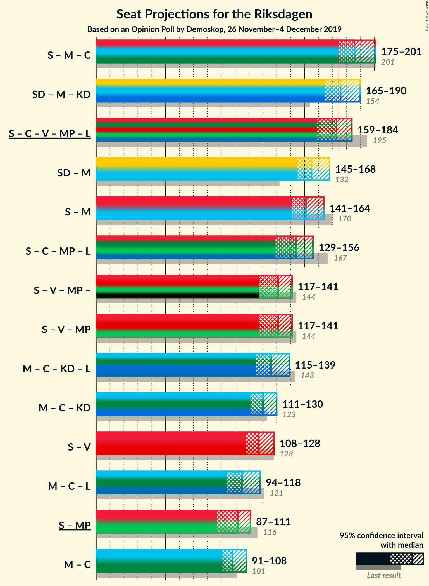
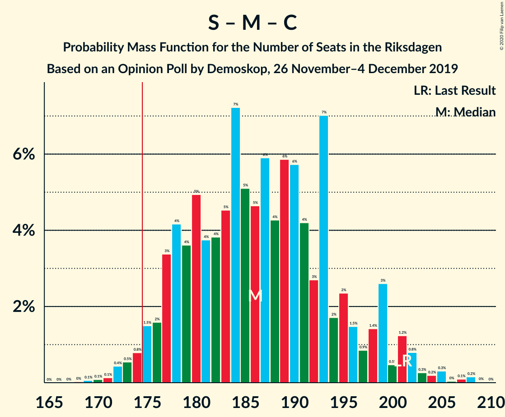
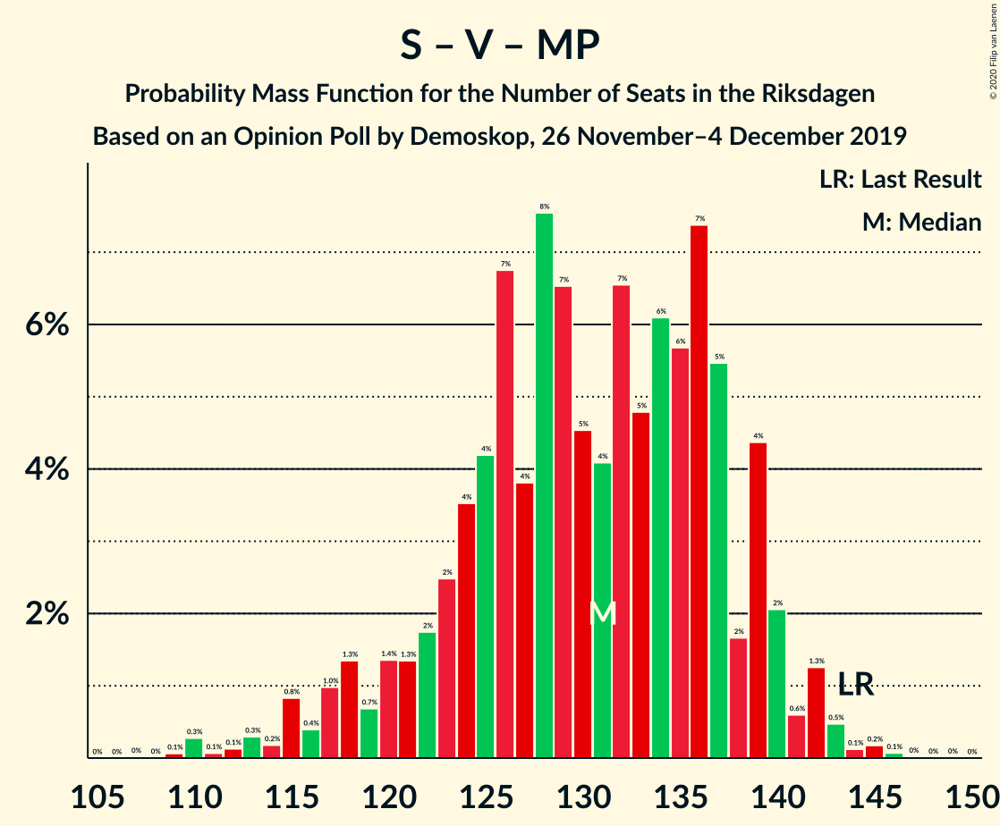

# Opinion Poll by Demoskop, 26 November–4 December 2019

<a href="#voting-intentions">Voting Intentions</a> | <a href="#seats">Seats</a> | <a href="#coalitions">Coalitions</a> | <a href="#technical-information">Technical Information</a>

## Voting Intentions

### Confidence Intervals

| Party | Last Result | Poll Result | 80% Confidence Interval | 90% Confidence Interval | 95% Confidence Interval | 99% Confidence Interval |
|:-----:|:-----------:|:-----------:|:-----------------------:|:-----------------------:|:-----------------------:|:-----------------------:|
| Sverigedemokraterna | 17.5% | 25.4% | 24.2–26.7% |23.9–27.0% |23.6–27.3% |23.0–27.9% |
| Sveriges socialdemokratiska arbetareparti | 28.3% | 24.3% | 23.1–25.5% |22.8–25.9% |22.5–26.2% |21.9–26.8% |
| Moderata samlingspartiet | 19.8% | 17.5% | 16.5–18.6% |16.2–18.9% |15.9–19.2% |15.4–19.8% |
| Centerpartiet | 8.6% | 9.6% | 8.8–10.5% |8.6–10.7% |8.4–11.0% |8.1–11.4% |
| Vänsterpartiet | 8.0% | 7.9% | 7.2–8.7% |7.0–8.9% |6.8–9.1% |6.5–9.5% |
| Kristdemokraterna | 6.3% | 5.9% | 5.3–6.6% |5.1–6.8% |5.0–7.0% |4.7–7.4% |
| Miljöpartiet de gröna | 4.4% | 4.4% | 3.8–5.0% |3.7–5.2% |3.6–5.3% |3.3–5.7% |
| Liberalerna | 5.5% | 3.9% | 3.4–4.5% |3.3–4.7% |3.1–4.8% |2.9–5.1% |

*Note:* The poll result column reflects the actual value used in the calculations. Published results may vary slightly, and in addition be rounded to fewer digits.

## Seats

### Confidence Intervals

| Party | Last Result | Median | 80% Confidence Interval | 90% Confidence Interval | 95% Confidence Interval | 99% Confidence Interval |
|:-----:|:-----------:|:------:|:-----------------------:|:-----------------------:|:-----------------------:|:-----------------------:|
| <a href="#sverigedemokraterna">Sverigedemokraterna</a> | 62 | 92 | 87–98 |85–99 |84–101 |82–104 |
| <a href="#sveriges-socialdemokratiska-arbetareparti">Sveriges socialdemokratiska arbetareparti</a> | 100 | 88 | 83–94 |81–95 |79–96 |78–100 |
| <a href="#moderata-samlingspartiet">Moderata samlingspartiet</a> | 70 | 63 | 59–68 |58–70 |57–71 |55–73 |
| <a href="#centerpartiet">Centerpartiet</a> | 31 | 35 | 32–38 |31–39 |30–40 |29–42 |
| <a href="#vänsterpartiet">Vänsterpartiet</a> | 28 | 29 | 26–32 |25–33 |24–33 |23–35 |
| <a href="#kristdemokraterna">Kristdemokraterna</a> | 22 | 21 | 19–24 |18–25 |18–26 |17–27 |
| <a href="#miljöpartiet-de-gröna">Miljöpartiet de gröna</a> | 16 | 16 | 0–18 |0–19 |0–19 |0–21 |
| <a href="#liberalerna">Liberalerna</a> | 20 | 0 | 0–16 |0–17 |0–17 |0–18 |

### Sverigedemokraterna

*For a full overview of the results for this party, see the [Sverigedemokraterna](party-sverigedemokraterna.html) page.*

| Number of Seats | Probability | Accumulated | Special Marks |
|:---------------:|:-----------:|:-----------:|:-------------:|
| 62 | 0% | 100% | Last Result |
| 63 | 0% | 100% |  |
| 64 | 0% | 100% |  |
| 65 | 0% | 100% |  |
| 66 | 0% | 100% |  |
| 67 | 0% | 100% |  |
| 68 | 0% | 100% |  |
| 69 | 0% | 100% |  |
| 70 | 0% | 100% |  |
| 71 | 0% | 100% |  |
| 72 | 0% | 100% |  |
| 73 | 0% | 100% |  |
| 74 | 0% | 100% |  |
| 75 | 0% | 100% |  |
| 76 | 0% | 100% |  |
| 77 | 0% | 100% |  |
| 78 | 0% | 100% |  |
| 79 | 0% | 100% |  |
| 80 | 0.1% | 99.9% |  |
| 81 | 0.2% | 99.8% |  |
| 82 | 0.5% | 99.7% |  |
| 83 | 0.8% | 99.1% |  |
| 84 | 1.4% | 98% |  |
| 85 | 2% | 97% |  |
| 86 | 4% | 94% |  |
| 87 | 5% | 90% |  |
| 88 | 8% | 85% |  |
| 89 | 8% | 78% |  |
| 90 | 11% | 70% |  |
| 91 | 7% | 58% |  |
| 92 | 6% | 52% | Median |
| 93 | 7% | 45% |  |
| 94 | 10% | 38% |  |
| 95 | 8% | 28% |  |
| 96 | 5% | 20% |  |
| 97 | 5% | 15% |  |
| 98 | 3% | 10% |  |
| 99 | 2% | 7% |  |
| 100 | 2% | 5% |  |
| 101 | 0.8% | 3% |  |
| 102 | 0.6% | 2% |  |
| 103 | 0.7% | 2% |  |
| 104 | 0.5% | 0.9% |  |
| 105 | 0.2% | 0.3% |  |
| 106 | 0.1% | 0.2% |  |
| 107 | 0% | 0.1% |  |
| 108 | 0% | 0% |  |

### Sveriges socialdemokratiska arbetareparti

*For a full overview of the results for this party, see the [Sveriges socialdemokratiska arbetareparti](party-sverigessocialdemokratiskaarbetareparti.html) page.*

| Number of Seats | Probability | Accumulated | Special Marks |
|:---------------:|:-----------:|:-----------:|:-------------:|
| 75 | 0% | 100% |  |
| 76 | 0.1% | 99.9% |  |
| 77 | 0.1% | 99.9% |  |
| 78 | 0.3% | 99.7% |  |
| 79 | 2% | 99.4% |  |
| 80 | 2% | 97% |  |
| 81 | 3% | 95% |  |
| 82 | 2% | 92% |  |
| 83 | 4% | 90% |  |
| 84 | 5% | 86% |  |
| 85 | 10% | 81% |  |
| 86 | 11% | 71% |  |
| 87 | 9% | 60% |  |
| 88 | 7% | 51% | Median |
| 89 | 4% | 44% |  |
| 90 | 4% | 39% |  |
| 91 | 11% | 36% |  |
| 92 | 8% | 25% |  |
| 93 | 5% | 17% |  |
| 94 | 5% | 12% |  |
| 95 | 3% | 7% |  |
| 96 | 2% | 4% |  |
| 97 | 0.6% | 2% |  |
| 98 | 0.3% | 1.5% |  |
| 99 | 0.3% | 1.1% |  |
| 100 | 0.4% | 0.8% | Last Result |
| 101 | 0.2% | 0.4% |  |
| 102 | 0.1% | 0.2% |  |
| 103 | 0% | 0.1% |  |
| 104 | 0% | 0% |  |

### Moderata samlingspartiet

*For a full overview of the results for this party, see the [Moderata samlingspartiet](party-moderatasamlingspartiet.html) page.*

| Number of Seats | Probability | Accumulated | Special Marks |
|:---------------:|:-----------:|:-----------:|:-------------:|
| 53 | 0.1% | 100% |  |
| 54 | 0.2% | 99.9% |  |
| 55 | 0.5% | 99.7% |  |
| 56 | 1.0% | 99.2% |  |
| 57 | 2% | 98% |  |
| 58 | 3% | 97% |  |
| 59 | 6% | 94% |  |
| 60 | 4% | 88% |  |
| 61 | 13% | 83% |  |
| 62 | 13% | 70% |  |
| 63 | 10% | 58% | Median |
| 64 | 12% | 48% |  |
| 65 | 10% | 37% |  |
| 66 | 8% | 26% |  |
| 67 | 6% | 18% |  |
| 68 | 5% | 13% |  |
| 69 | 3% | 8% |  |
| 70 | 2% | 5% | Last Result |
| 71 | 2% | 3% |  |
| 72 | 1.0% | 2% |  |
| 73 | 0.3% | 0.6% |  |
| 74 | 0.2% | 0.3% |  |
| 75 | 0.1% | 0.1% |  |
| 76 | 0% | 0.1% |  |
| 77 | 0% | 0% |  |

### Centerpartiet

*For a full overview of the results for this party, see the [Centerpartiet](party-centerpartiet.html) page.*

| Number of Seats | Probability | Accumulated | Special Marks |
|:---------------:|:-----------:|:-----------:|:-------------:|
| 27 | 0.1% | 100% |  |
| 28 | 0.2% | 99.9% |  |
| 29 | 0.9% | 99.7% |  |
| 30 | 1.5% | 98.8% |  |
| 31 | 5% | 97% | Last Result |
| 32 | 7% | 93% |  |
| 33 | 15% | 86% |  |
| 34 | 16% | 71% |  |
| 35 | 12% | 55% | Median |
| 36 | 14% | 43% |  |
| 37 | 13% | 30% |  |
| 38 | 8% | 17% |  |
| 39 | 6% | 9% |  |
| 40 | 2% | 4% |  |
| 41 | 1.2% | 2% |  |
| 42 | 0.6% | 0.9% |  |
| 43 | 0.2% | 0.3% |  |
| 44 | 0.1% | 0.1% |  |
| 45 | 0% | 0% |  |

### Vänsterpartiet

*For a full overview of the results for this party, see the [Vänsterpartiet](party-vänsterpartiet.html) page.*

| Number of Seats | Probability | Accumulated | Special Marks |
|:---------------:|:-----------:|:-----------:|:-------------:|
| 22 | 0.1% | 100% |  |
| 23 | 0.6% | 99.8% |  |
| 24 | 2% | 99.2% |  |
| 25 | 4% | 97% |  |
| 26 | 7% | 93% |  |
| 27 | 15% | 85% |  |
| 28 | 16% | 71% | Last Result |
| 29 | 18% | 54% | Median |
| 30 | 14% | 36% |  |
| 31 | 9% | 22% |  |
| 32 | 7% | 12% |  |
| 33 | 3% | 6% |  |
| 34 | 2% | 2% |  |
| 35 | 0.5% | 0.7% |  |
| 36 | 0.1% | 0.2% |  |
| 37 | 0.1% | 0.1% |  |
| 38 | 0% | 0% |  |

### Kristdemokraterna

*For a full overview of the results for this party, see the [Kristdemokraterna](party-kristdemokraterna.html) page.*

| Number of Seats | Probability | Accumulated | Special Marks |
|:---------------:|:-----------:|:-----------:|:-------------:|
| 16 | 0.2% | 100% |  |
| 17 | 2% | 99.7% |  |
| 18 | 3% | 98% |  |
| 19 | 10% | 95% |  |
| 20 | 16% | 85% |  |
| 21 | 20% | 69% | Median |
| 22 | 16% | 49% | Last Result |
| 23 | 16% | 33% |  |
| 24 | 9% | 17% |  |
| 25 | 5% | 8% |  |
| 26 | 1.5% | 3% |  |
| 27 | 0.9% | 1.1% |  |
| 28 | 0.1% | 0.2% |  |
| 29 | 0.1% | 0.1% |  |
| 30 | 0% | 0% |  |

### Miljöpartiet de gröna

*For a full overview of the results for this party, see the [Miljöpartiet de gröna](party-miljöpartietdegröna.html) page.*

| Number of Seats | Probability | Accumulated | Special Marks |
|:---------------:|:-----------:|:-----------:|:-------------:|
| 0 | 18% | 100% |  |
| 1 | 0% | 82% |  |
| 2 | 0% | 82% |  |
| 3 | 0% | 82% |  |
| 4 | 0% | 82% |  |
| 5 | 0% | 82% |  |
| 6 | 0% | 82% |  |
| 7 | 0% | 82% |  |
| 8 | 0% | 82% |  |
| 9 | 0% | 82% |  |
| 10 | 0% | 82% |  |
| 11 | 0% | 82% |  |
| 12 | 0% | 82% |  |
| 13 | 0% | 82% |  |
| 14 | 6% | 82% |  |
| 15 | 18% | 76% |  |
| 16 | 21% | 59% | Last Result, Median |
| 17 | 23% | 38% |  |
| 18 | 7% | 15% |  |
| 19 | 6% | 8% |  |
| 20 | 2% | 2% |  |
| 21 | 0.4% | 0.6% |  |
| 22 | 0.1% | 0.1% |  |
| 23 | 0% | 0% |  |

### Liberalerna

*For a full overview of the results for this party, see the [Liberalerna](party-liberalerna.html) page.*

| Number of Seats | Probability | Accumulated | Special Marks |
|:---------------:|:-----------:|:-----------:|:-------------:|
| 0 | 58% | 100% | Median |
| 1 | 0% | 42% |  |
| 2 | 0% | 42% |  |
| 3 | 0% | 42% |  |
| 4 | 0% | 42% |  |
| 5 | 0% | 42% |  |
| 6 | 0% | 42% |  |
| 7 | 0% | 42% |  |
| 8 | 0% | 42% |  |
| 9 | 0% | 42% |  |
| 10 | 0% | 42% |  |
| 11 | 0% | 42% |  |
| 12 | 0% | 42% |  |
| 13 | 0% | 42% |  |
| 14 | 8% | 42% |  |
| 15 | 18% | 34% |  |
| 16 | 9% | 16% |  |
| 17 | 5% | 6% |  |
| 18 | 1.5% | 2% |  |
| 19 | 0.2% | 0.3% |  |
| 20 | 0% | 0.1% | Last Result |
| 21 | 0% | 0% |  |

## Coalitions

### Confidence Intervals

| Coalition | Last Result | Median | Majority? | 80% Confidence Interval | 90% Confidence Interval | 95% Confidence Interval | 99% Confidence Interval |
|:---------:|:-----------:|:------:|:---------:|:-----------------------:|:-----------------------:|:-----------------------:|:-----------------------:|
| Sveriges socialdemokratiska arbetareparti – Moderata samlingspartiet – Centerpartiet | 201 | 186 | 98% | 178–195 | 176–199 | 175–201 | 172–205 |
| Sverigedemokraterna – Moderata samlingspartiet – Kristdemokraterna | 154 | 176 | 64% | 169–186 | 167–188 | 165–190 | 164–195 |
| Sveriges socialdemokratiska arbetareparti – Centerpartiet – Vänsterpartiet – Miljöpartiet de gröna – Liberalerna | 195 | 173 | 36% | 163–180 | 161–182 | 159–184 | 154–185 |
| Sverigedemokraterna – Moderata samlingspartiet | 132 | 155 | 0% | 148–163 | 147–165 | 145–168 | 142–173 |
| Sveriges socialdemokratiska arbetareparti – Moderata samlingspartiet | 170 | 151 | 0% | 144–160 | 142–162 | 141–164 | 138–168 |
| Sveriges socialdemokratiska arbetareparti – Centerpartiet – Miljöpartiet de gröna – Liberalerna | 167 | 144 | 0% | 133–151 | 129–154 | 129–156 | 123–158 |
| Sveriges socialdemokratiska arbetareparti – Vänsterpartiet – Miljöpartiet de gröna | 144 | 131 | 0% | 123–138 | 119–139 | 117–141 | 112–143 |
| Moderata samlingspartiet – Centerpartiet – Kristdemokraterna – Liberalerna | 143 | 126 | 0% | 118–136 | 116–138 | 115–139 | 112–144 |
| Moderata samlingspartiet – Centerpartiet – Kristdemokraterna | 123 | 120 | 0% | 114–127 | 112–129 | 111–130 | 108–134 |
| Sveriges socialdemokratiska arbetareparti – Vänsterpartiet | 128 | 117 | 0% | 110–124 | 108–126 | 108–128 | 105–131 |
| Moderata samlingspartiet – Centerpartiet – Liberalerna | 121 | 105 | 0% | 97–114 | 94–116 | 94–118 | 91–121 |
| Sveriges socialdemokratiska arbetareparti – Miljöpartiet de gröna | 116 | 102 | 0% | 94–109 | 89–110 | 87–111 | 84–114 |
| Moderata samlingspartiet – Centerpartiet | 101 | 98 | 0% | 93–105 | 91–106 | 91–108 | 88–110 |

### Sveriges socialdemokratiska arbetareparti – Moderata samlingspartiet – Centerpartiet

| Number of Seats | Probability | Accumulated | Special Marks |
|:---------------:|:-----------:|:-----------:|:-------------:|
| 169 | 0.1% | 100% |  |
| 170 | 0.1% | 99.9% |  |
| 171 | 0.1% | 99.8% |  |
| 172 | 0.4% | 99.7% |  |
| 173 | 0.5% | 99.3% |  |
| 174 | 0.8% | 98.7% |  |
| 175 | 1.5% | 98% | Majority |
| 176 | 2% | 96% |  |
| 177 | 3% | 95% |  |
| 178 | 4% | 91% |  |
| 179 | 4% | 87% |  |
| 180 | 5% | 84% |  |
| 181 | 4% | 79% |  |
| 182 | 4% | 75% |  |
| 183 | 5% | 71% |  |
| 184 | 7% | 67% |  |
| 185 | 5% | 59% |  |
| 186 | 5% | 54% | Median |
| 187 | 6% | 50% |  |
| 188 | 4% | 44% |  |
| 189 | 6% | 39% |  |
| 190 | 6% | 34% |  |
| 191 | 4% | 28% |  |
| 192 | 3% | 24% |  |
| 193 | 7% | 21% |  |
| 194 | 2% | 14% |  |
| 195 | 2% | 12% |  |
| 196 | 1.5% | 10% |  |
| 197 | 0.9% | 8% |  |
| 198 | 1.4% | 8% |  |
| 199 | 3% | 6% |  |
| 200 | 0.5% | 4% |  |
| 201 | 1.2% | 3% | Last Result |
| 202 | 0.8% | 2% |  |
| 203 | 0.3% | 1.1% |  |
| 204 | 0.2% | 0.8% |  |
| 205 | 0.3% | 0.6% |  |
| 206 | 0% | 0.3% |  |
| 207 | 0.1% | 0.3% |  |
| 208 | 0.2% | 0.2% |  |
| 209 | 0% | 0% |  |

### Sverigedemokraterna – Moderata samlingspartiet – Kristdemokraterna

| Number of Seats | Probability | Accumulated | Special Marks |
|:---------------:|:-----------:|:-----------:|:-------------:|
| 154 | 0% | 100% | Last Result |
| 155 | 0% | 100% |  |
| 156 | 0% | 100% |  |
| 157 | 0% | 100% |  |
| 158 | 0% | 100% |  |
| 159 | 0% | 100% |  |
| 160 | 0% | 99.9% |  |
| 161 | 0.1% | 99.9% |  |
| 162 | 0.1% | 99.8% |  |
| 163 | 0.1% | 99.7% |  |
| 164 | 1.5% | 99.6% |  |
| 165 | 1.5% | 98% |  |
| 166 | 0.8% | 97% |  |
| 167 | 2% | 96% |  |
| 168 | 0.8% | 94% |  |
| 169 | 4% | 93% |  |
| 170 | 6% | 89% |  |
| 171 | 9% | 83% |  |
| 172 | 3% | 75% |  |
| 173 | 3% | 72% |  |
| 174 | 5% | 68% |  |
| 175 | 4% | 64% | Majority |
| 176 | 13% | 60% | Median |
| 177 | 3% | 47% |  |
| 178 | 3% | 44% |  |
| 179 | 4% | 40% |  |
| 180 | 4% | 36% |  |
| 181 | 7% | 32% |  |
| 182 | 5% | 25% |  |
| 183 | 4% | 20% |  |
| 184 | 4% | 16% |  |
| 185 | 2% | 12% |  |
| 186 | 2% | 10% |  |
| 187 | 2% | 9% |  |
| 188 | 2% | 7% |  |
| 189 | 1.4% | 5% |  |
| 190 | 1.2% | 3% |  |
| 191 | 0.6% | 2% |  |
| 192 | 0.4% | 2% |  |
| 193 | 0.3% | 1.3% |  |
| 194 | 0.4% | 1.0% |  |
| 195 | 0.3% | 0.6% |  |
| 196 | 0% | 0.3% |  |
| 197 | 0.2% | 0.3% |  |
| 198 | 0% | 0% |  |

### Sveriges socialdemokratiska arbetareparti – Centerpartiet – Vänsterpartiet – Miljöpartiet de gröna – Liberalerna

| Number of Seats | Probability | Accumulated | Special Marks |
|:---------------:|:-----------:|:-----------:|:-------------:|
| 152 | 0.2% | 100% |  |
| 153 | 0% | 99.7% |  |
| 154 | 0.3% | 99.7% |  |
| 155 | 0.4% | 99.4% |  |
| 156 | 0.3% | 99.0% |  |
| 157 | 0.4% | 98.7% |  |
| 158 | 0.6% | 98% |  |
| 159 | 1.2% | 98% |  |
| 160 | 1.4% | 97% |  |
| 161 | 2% | 95% |  |
| 162 | 2% | 93% |  |
| 163 | 2% | 91% |  |
| 164 | 2% | 90% |  |
| 165 | 4% | 88% |  |
| 166 | 4% | 84% |  |
| 167 | 5% | 80% |  |
| 168 | 7% | 75% | Median |
| 169 | 4% | 68% |  |
| 170 | 4% | 64% |  |
| 171 | 3% | 60% |  |
| 172 | 3% | 56% |  |
| 173 | 13% | 53% |  |
| 174 | 4% | 40% |  |
| 175 | 5% | 36% | Majority |
| 176 | 3% | 32% |  |
| 177 | 3% | 28% |  |
| 178 | 9% | 25% |  |
| 179 | 6% | 17% |  |
| 180 | 4% | 11% |  |
| 181 | 0.8% | 7% |  |
| 182 | 2% | 6% |  |
| 183 | 0.8% | 4% |  |
| 184 | 1.5% | 3% |  |
| 185 | 1.5% | 2% |  |
| 186 | 0.1% | 0.4% |  |
| 187 | 0.1% | 0.3% |  |
| 188 | 0.1% | 0.2% |  |
| 189 | 0% | 0.1% |  |
| 190 | 0% | 0.1% |  |
| 191 | 0% | 0% |  |
| 192 | 0% | 0% |  |
| 193 | 0% | 0% |  |
| 194 | 0% | 0% |  |
| 195 | 0% | 0% | Last Result |

### Sverigedemokraterna – Moderata samlingspartiet

| Number of Seats | Probability | Accumulated | Special Marks |
|:---------------:|:-----------:|:-----------:|:-------------:|
| 132 | 0% | 100% | Last Result |
| 133 | 0% | 100% |  |
| 134 | 0% | 100% |  |
| 135 | 0% | 100% |  |
| 136 | 0% | 100% |  |
| 137 | 0% | 100% |  |
| 138 | 0% | 100% |  |
| 139 | 0% | 100% |  |
| 140 | 0.1% | 99.9% |  |
| 141 | 0.1% | 99.8% |  |
| 142 | 0.3% | 99.7% |  |
| 143 | 0.3% | 99.4% |  |
| 144 | 1.1% | 99.1% |  |
| 145 | 1.0% | 98% |  |
| 146 | 2% | 97% |  |
| 147 | 4% | 95% |  |
| 148 | 3% | 92% |  |
| 149 | 5% | 89% |  |
| 150 | 3% | 83% |  |
| 151 | 8% | 81% |  |
| 152 | 8% | 72% |  |
| 153 | 4% | 64% |  |
| 154 | 5% | 60% |  |
| 155 | 8% | 55% | Median |
| 156 | 6% | 47% |  |
| 157 | 5% | 41% |  |
| 158 | 5% | 36% |  |
| 159 | 4% | 31% |  |
| 160 | 5% | 27% |  |
| 161 | 6% | 22% |  |
| 162 | 5% | 16% |  |
| 163 | 0.9% | 11% |  |
| 164 | 3% | 10% |  |
| 165 | 3% | 7% |  |
| 166 | 1.2% | 4% |  |
| 167 | 0.4% | 3% |  |
| 168 | 0.8% | 3% |  |
| 169 | 0.4% | 2% |  |
| 170 | 0.3% | 2% |  |
| 171 | 0.5% | 1.2% |  |
| 172 | 0.1% | 0.7% |  |
| 173 | 0.3% | 0.6% |  |
| 174 | 0.3% | 0.3% |  |
| 175 | 0% | 0% | Majority |

### Sveriges socialdemokratiska arbetareparti – Moderata samlingspartiet

| Number of Seats | Probability | Accumulated | Special Marks |
|:---------------:|:-----------:|:-----------:|:-------------:|
| 135 | 0.1% | 100% |  |
| 136 | 0.1% | 99.9% |  |
| 137 | 0.2% | 99.9% |  |
| 138 | 0.4% | 99.7% |  |
| 139 | 0.4% | 99.3% |  |
| 140 | 1.2% | 98.9% |  |
| 141 | 1.1% | 98% |  |
| 142 | 2% | 97% |  |
| 143 | 1.4% | 95% |  |
| 144 | 4% | 93% |  |
| 145 | 5% | 89% |  |
| 146 | 5% | 84% |  |
| 147 | 6% | 79% |  |
| 148 | 8% | 73% |  |
| 149 | 6% | 65% |  |
| 150 | 6% | 60% |  |
| 151 | 6% | 53% | Median |
| 152 | 5% | 47% |  |
| 153 | 5% | 42% |  |
| 154 | 6% | 37% |  |
| 155 | 4% | 31% |  |
| 156 | 7% | 27% |  |
| 157 | 2% | 20% |  |
| 158 | 4% | 18% |  |
| 159 | 2% | 14% |  |
| 160 | 4% | 12% |  |
| 161 | 2% | 8% |  |
| 162 | 2% | 6% |  |
| 163 | 0.6% | 4% |  |
| 164 | 2% | 4% |  |
| 165 | 1.0% | 2% |  |
| 166 | 0.2% | 1.1% |  |
| 167 | 0.2% | 0.9% |  |
| 168 | 0.2% | 0.7% |  |
| 169 | 0.3% | 0.5% |  |
| 170 | 0.1% | 0.2% | Last Result |
| 171 | 0.1% | 0.1% |  |
| 172 | 0% | 0% |  |

### Sveriges socialdemokratiska arbetareparti – Centerpartiet – Miljöpartiet de gröna – Liberalerna

| Number of Seats | Probability | Accumulated | Special Marks |
|:---------------:|:-----------:|:-----------:|:-------------:|
| 121 | 0.1% | 100% |  |
| 122 | 0% | 99.9% |  |
| 123 | 0.4% | 99.9% |  |
| 124 | 0.3% | 99.4% |  |
| 125 | 0.2% | 99.1% |  |
| 126 | 0.2% | 98.9% |  |
| 127 | 0.2% | 98.7% |  |
| 128 | 0.9% | 98% |  |
| 129 | 3% | 98% |  |
| 130 | 0.5% | 95% |  |
| 131 | 0.9% | 94% |  |
| 132 | 1.3% | 93% |  |
| 133 | 3% | 92% |  |
| 134 | 2% | 89% |  |
| 135 | 2% | 88% |  |
| 136 | 2% | 86% |  |
| 137 | 5% | 84% |  |
| 138 | 3% | 80% |  |
| 139 | 6% | 76% | Median |
| 140 | 6% | 71% |  |
| 141 | 5% | 64% |  |
| 142 | 4% | 60% |  |
| 143 | 4% | 55% |  |
| 144 | 4% | 51% |  |
| 145 | 10% | 48% |  |
| 146 | 4% | 37% |  |
| 147 | 3% | 33% |  |
| 148 | 2% | 30% |  |
| 149 | 7% | 28% |  |
| 150 | 5% | 21% |  |
| 151 | 6% | 16% |  |
| 152 | 2% | 10% |  |
| 153 | 2% | 8% |  |
| 154 | 1.0% | 6% |  |
| 155 | 1.3% | 5% |  |
| 156 | 2% | 4% |  |
| 157 | 1.1% | 2% |  |
| 158 | 0.5% | 0.8% |  |
| 159 | 0.1% | 0.3% |  |
| 160 | 0.1% | 0.2% |  |
| 161 | 0.1% | 0.1% |  |
| 162 | 0% | 0% |  |
| 163 | 0% | 0% |  |
| 164 | 0% | 0% |  |
| 165 | 0% | 0% |  |
| 166 | 0% | 0% |  |
| 167 | 0% | 0% | Last Result |

### Sveriges socialdemokratiska arbetareparti – Vänsterpartiet – Miljöpartiet de gröna

| Number of Seats | Probability | Accumulated | Special Marks |
|:---------------:|:-----------:|:-----------:|:-------------:|
| 109 | 0.1% | 100% |  |
| 110 | 0.3% | 99.9% |  |
| 111 | 0.1% | 99.6% |  |
| 112 | 0.1% | 99.6% |  |
| 113 | 0.3% | 99.4% |  |
| 114 | 0.2% | 99.1% |  |
| 115 | 0.8% | 99.0% |  |
| 116 | 0.4% | 98% |  |
| 117 | 1.0% | 98% |  |
| 118 | 1.3% | 97% |  |
| 119 | 0.7% | 95% |  |
| 120 | 1.4% | 95% |  |
| 121 | 1.3% | 93% |  |
| 122 | 2% | 92% |  |
| 123 | 2% | 90% |  |
| 124 | 4% | 88% |  |
| 125 | 4% | 84% |  |
| 126 | 7% | 80% |  |
| 127 | 4% | 73% |  |
| 128 | 8% | 69% |  |
| 129 | 7% | 62% |  |
| 130 | 5% | 55% |  |
| 131 | 4% | 51% |  |
| 132 | 7% | 47% |  |
| 133 | 5% | 40% | Median |
| 134 | 6% | 35% |  |
| 135 | 6% | 29% |  |
| 136 | 7% | 24% |  |
| 137 | 5% | 16% |  |
| 138 | 2% | 11% |  |
| 139 | 4% | 9% |  |
| 140 | 2% | 5% |  |
| 141 | 0.6% | 3% |  |
| 142 | 1.3% | 2% |  |
| 143 | 0.5% | 0.9% |  |
| 144 | 0.1% | 0.4% | Last Result |
| 145 | 0.2% | 0.3% |  |
| 146 | 0.1% | 0.1% |  |
| 147 | 0% | 0% |  |

### Moderata samlingspartiet – Centerpartiet – Kristdemokraterna – Liberalerna

| Number of Seats | Probability | Accumulated | Special Marks |
|:---------------:|:-----------:|:-----------:|:-------------:|
| 110 | 0.1% | 100% |  |
| 111 | 0.1% | 99.9% |  |
| 112 | 0.4% | 99.8% |  |
| 113 | 0.4% | 99.4% |  |
| 114 | 0.5% | 99.1% |  |
| 115 | 1.5% | 98.5% |  |
| 116 | 2% | 97% |  |
| 117 | 3% | 95% |  |
| 118 | 5% | 92% |  |
| 119 | 3% | 87% | Median |
| 120 | 5% | 85% |  |
| 121 | 7% | 80% |  |
| 122 | 4% | 73% |  |
| 123 | 8% | 69% |  |
| 124 | 3% | 61% |  |
| 125 | 4% | 58% |  |
| 126 | 6% | 54% |  |
| 127 | 3% | 49% |  |
| 128 | 6% | 46% |  |
| 129 | 5% | 40% |  |
| 130 | 4% | 36% |  |
| 131 | 7% | 32% |  |
| 132 | 3% | 25% |  |
| 133 | 4% | 21% |  |
| 134 | 3% | 17% |  |
| 135 | 4% | 14% |  |
| 136 | 4% | 11% |  |
| 137 | 1.2% | 7% |  |
| 138 | 2% | 5% |  |
| 139 | 1.2% | 3% |  |
| 140 | 0.6% | 2% |  |
| 141 | 0.5% | 2% |  |
| 142 | 0.3% | 1.0% |  |
| 143 | 0.1% | 0.7% | Last Result |
| 144 | 0.4% | 0.6% |  |
| 145 | 0.1% | 0.2% |  |
| 146 | 0% | 0.1% |  |
| 147 | 0% | 0.1% |  |
| 148 | 0.1% | 0.1% |  |
| 149 | 0% | 0% |  |

### Moderata samlingspartiet – Centerpartiet – Kristdemokraterna

| Number of Seats | Probability | Accumulated | Special Marks |
|:---------------:|:-----------:|:-----------:|:-------------:|
| 105 | 0% | 100% |  |
| 106 | 0.2% | 99.9% |  |
| 107 | 0.1% | 99.7% |  |
| 108 | 0.2% | 99.7% |  |
| 109 | 0.5% | 99.4% |  |
| 110 | 0.9% | 98.9% |  |
| 111 | 3% | 98% |  |
| 112 | 1.4% | 95% |  |
| 113 | 3% | 94% |  |
| 114 | 3% | 91% |  |
| 115 | 5% | 88% |  |
| 116 | 7% | 83% |  |
| 117 | 9% | 76% |  |
| 118 | 7% | 67% |  |
| 119 | 5% | 60% | Median |
| 120 | 8% | 55% |  |
| 121 | 9% | 46% |  |
| 122 | 7% | 38% |  |
| 123 | 9% | 31% | Last Result |
| 124 | 4% | 22% |  |
| 125 | 3% | 18% |  |
| 126 | 3% | 15% |  |
| 127 | 2% | 12% |  |
| 128 | 4% | 10% |  |
| 129 | 3% | 6% |  |
| 130 | 0.9% | 3% |  |
| 131 | 0.4% | 2% |  |
| 132 | 0.2% | 2% |  |
| 133 | 0.6% | 1.3% |  |
| 134 | 0.4% | 0.7% |  |
| 135 | 0.1% | 0.3% |  |
| 136 | 0% | 0.2% |  |
| 137 | 0% | 0.1% |  |
| 138 | 0.1% | 0.1% |  |
| 139 | 0% | 0% |  |

### Sveriges socialdemokratiska arbetareparti – Vänsterpartiet

| Number of Seats | Probability | Accumulated | Special Marks |
|:---------------:|:-----------:|:-----------:|:-------------:|
| 102 | 0.1% | 100% |  |
| 103 | 0.1% | 99.9% |  |
| 104 | 0.1% | 99.8% |  |
| 105 | 0.4% | 99.7% |  |
| 106 | 1.0% | 99.3% |  |
| 107 | 0.5% | 98% |  |
| 108 | 4% | 98% |  |
| 109 | 2% | 93% |  |
| 110 | 2% | 91% |  |
| 111 | 4% | 89% |  |
| 112 | 7% | 85% |  |
| 113 | 4% | 78% |  |
| 114 | 7% | 74% |  |
| 115 | 11% | 67% |  |
| 116 | 5% | 56% |  |
| 117 | 6% | 51% | Median |
| 118 | 7% | 45% |  |
| 119 | 8% | 38% |  |
| 120 | 6% | 30% |  |
| 121 | 4% | 24% |  |
| 122 | 5% | 21% |  |
| 123 | 5% | 16% |  |
| 124 | 2% | 11% |  |
| 125 | 2% | 9% |  |
| 126 | 3% | 7% |  |
| 127 | 0.7% | 3% |  |
| 128 | 1.5% | 3% | Last Result |
| 129 | 0.4% | 1.1% |  |
| 130 | 0.1% | 0.7% |  |
| 131 | 0.1% | 0.5% |  |
| 132 | 0.3% | 0.4% |  |
| 133 | 0.1% | 0.2% |  |
| 134 | 0.1% | 0.1% |  |
| 135 | 0% | 0% |  |

### Moderata samlingspartiet – Centerpartiet – Liberalerna

| Number of Seats | Probability | Accumulated | Special Marks |
|:---------------:|:-----------:|:-----------:|:-------------:|
| 89 | 0% | 100% |  |
| 90 | 0.2% | 99.9% |  |
| 91 | 0.5% | 99.8% |  |
| 92 | 0.4% | 99.3% |  |
| 93 | 0.9% | 98.9% |  |
| 94 | 4% | 98% |  |
| 95 | 2% | 94% |  |
| 96 | 2% | 92% |  |
| 97 | 6% | 91% |  |
| 98 | 8% | 85% | Median |
| 99 | 3% | 77% |  |
| 100 | 4% | 74% |  |
| 101 | 6% | 70% |  |
| 102 | 6% | 64% |  |
| 103 | 4% | 58% |  |
| 104 | 3% | 54% |  |
| 105 | 6% | 51% |  |
| 106 | 5% | 46% |  |
| 107 | 3% | 41% |  |
| 108 | 3% | 38% |  |
| 109 | 4% | 36% |  |
| 110 | 5% | 31% |  |
| 111 | 3% | 26% |  |
| 112 | 6% | 23% |  |
| 113 | 4% | 16% |  |
| 114 | 3% | 12% |  |
| 115 | 2% | 9% |  |
| 116 | 3% | 7% |  |
| 117 | 2% | 4% |  |
| 118 | 0.9% | 3% |  |
| 119 | 0.5% | 2% |  |
| 120 | 0.4% | 1.1% |  |
| 121 | 0.3% | 0.7% | Last Result |
| 122 | 0.1% | 0.4% |  |
| 123 | 0.1% | 0.2% |  |
| 124 | 0.1% | 0.2% |  |
| 125 | 0.1% | 0.1% |  |
| 126 | 0% | 0% |  |

### Sveriges socialdemokratiska arbetareparti – Miljöpartiet de gröna

| Number of Seats | Probability | Accumulated | Special Marks |
|:---------------:|:-----------:|:-----------:|:-------------:|
| 81 | 0% | 100% |  |
| 82 | 0.1% | 99.9% |  |
| 83 | 0.1% | 99.8% |  |
| 84 | 0.4% | 99.7% |  |
| 85 | 0.4% | 99.3% |  |
| 86 | 0.8% | 98.9% |  |
| 87 | 0.8% | 98% |  |
| 88 | 1.3% | 97% |  |
| 89 | 1.3% | 96% |  |
| 90 | 0.7% | 95% |  |
| 91 | 1.1% | 94% |  |
| 92 | 0.6% | 93% |  |
| 93 | 2% | 92% |  |
| 94 | 4% | 90% |  |
| 95 | 3% | 86% |  |
| 96 | 3% | 83% |  |
| 97 | 5% | 81% |  |
| 98 | 3% | 76% |  |
| 99 | 6% | 73% |  |
| 100 | 7% | 67% |  |
| 101 | 6% | 60% |  |
| 102 | 6% | 54% |  |
| 103 | 6% | 48% |  |
| 104 | 6% | 42% | Median |
| 105 | 4% | 37% |  |
| 106 | 7% | 32% |  |
| 107 | 5% | 26% |  |
| 108 | 10% | 20% |  |
| 109 | 5% | 11% |  |
| 110 | 2% | 5% |  |
| 111 | 1.4% | 3% |  |
| 112 | 1.0% | 2% |  |
| 113 | 0.4% | 1.0% |  |
| 114 | 0.3% | 0.6% |  |
| 115 | 0.2% | 0.3% |  |
| 116 | 0.1% | 0.1% | Last Result |
| 117 | 0% | 0.1% |  |
| 118 | 0% | 0% |  |

### Moderata samlingspartiet – Centerpartiet

| Number of Seats | Probability | Accumulated | Special Marks |
|:---------------:|:-----------:|:-----------:|:-------------:|
| 85 | 0% | 100% |  |
| 86 | 0.1% | 99.9% |  |
| 87 | 0.3% | 99.9% |  |
| 88 | 0.3% | 99.5% |  |
| 89 | 0.4% | 99.2% |  |
| 90 | 0.9% | 98.8% |  |
| 91 | 4% | 98% |  |
| 92 | 2% | 94% |  |
| 93 | 2% | 91% |  |
| 94 | 9% | 89% |  |
| 95 | 8% | 80% |  |
| 96 | 3% | 72% |  |
| 97 | 9% | 69% |  |
| 98 | 15% | 60% | Median |
| 99 | 5% | 45% |  |
| 100 | 6% | 40% |  |
| 101 | 8% | 34% | Last Result |
| 102 | 8% | 26% |  |
| 103 | 4% | 17% |  |
| 104 | 3% | 14% |  |
| 105 | 5% | 11% |  |
| 106 | 1.4% | 5% |  |
| 107 | 1.2% | 4% |  |
| 108 | 1.3% | 3% |  |
| 109 | 0.7% | 2% |  |
| 110 | 0.4% | 0.9% |  |
| 111 | 0.1% | 0.5% |  |
| 112 | 0.1% | 0.3% |  |
| 113 | 0.1% | 0.2% |  |
| 114 | 0% | 0.1% |  |
| 115 | 0% | 0% |  |

## Technical Information

### Opinion Poll

+ **Polling firm:** Demoskop
+ **Commissioner(s):** —
+ **Fieldwork period:** 26 November–4 December 2019

### Calculations

+ **Sample size:** 2079
+ **Simulations done:** 1,048,576
+ **Error estimate:** 1.04%

