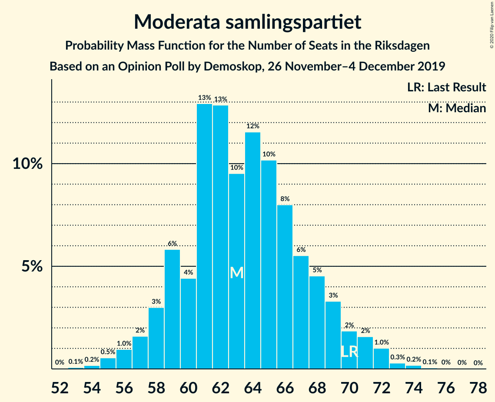
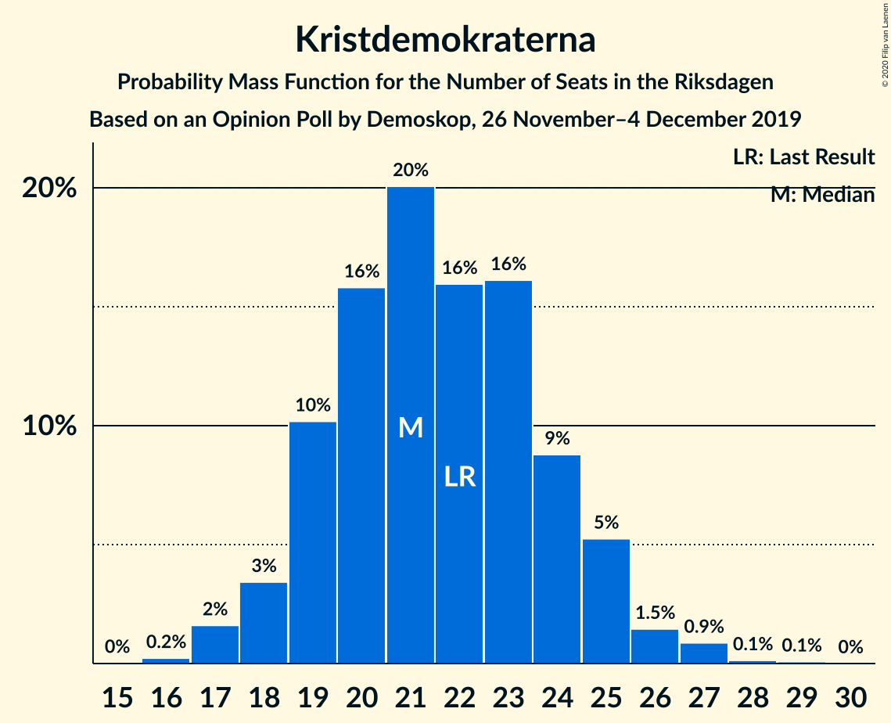
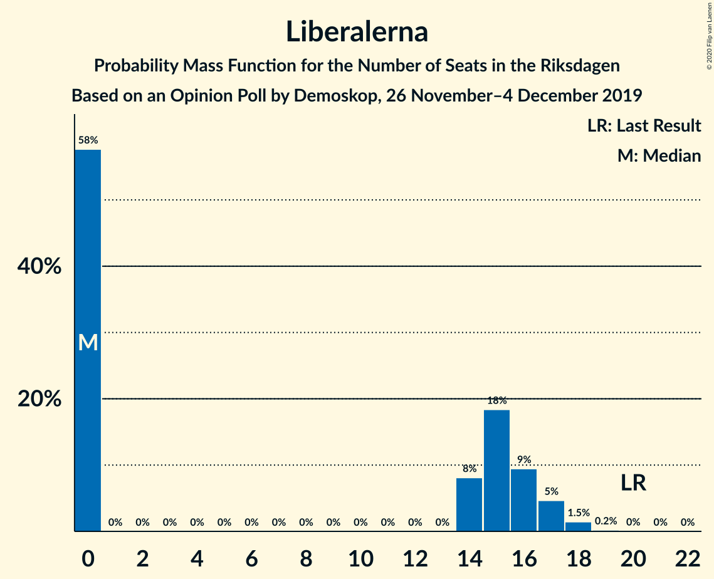
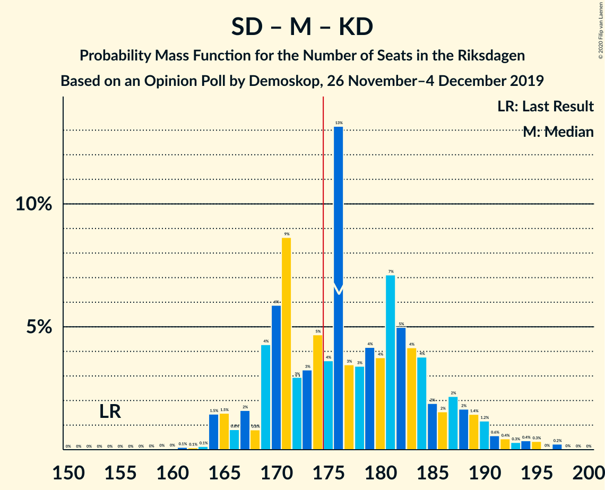
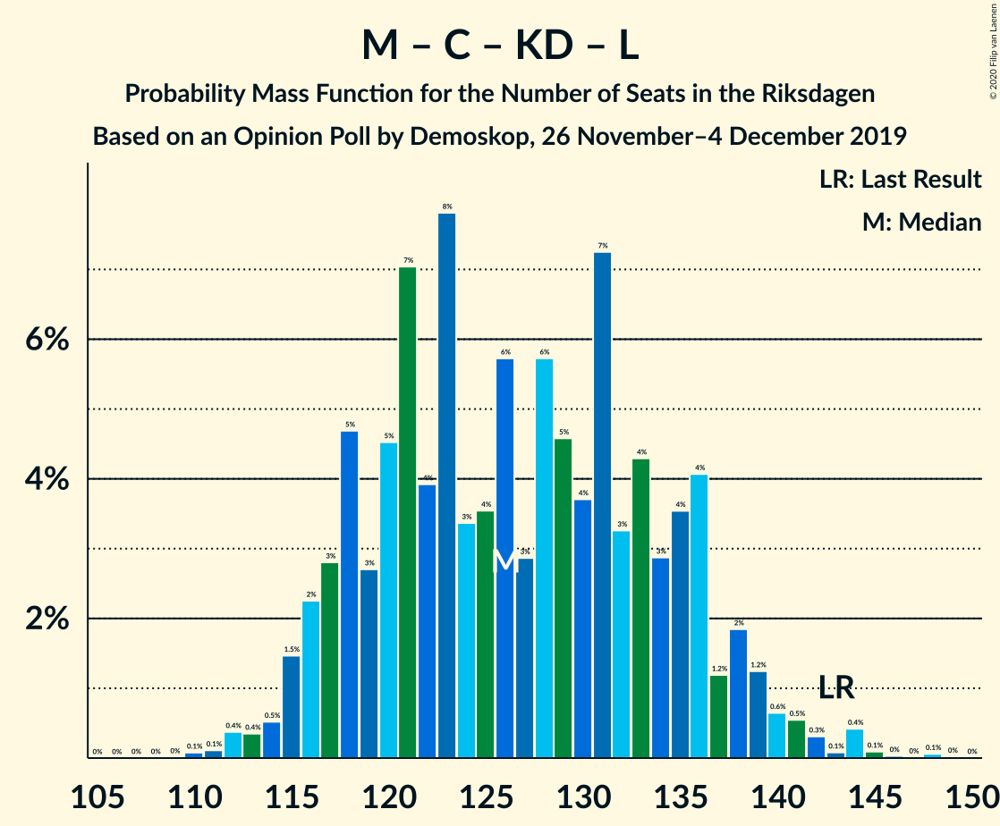
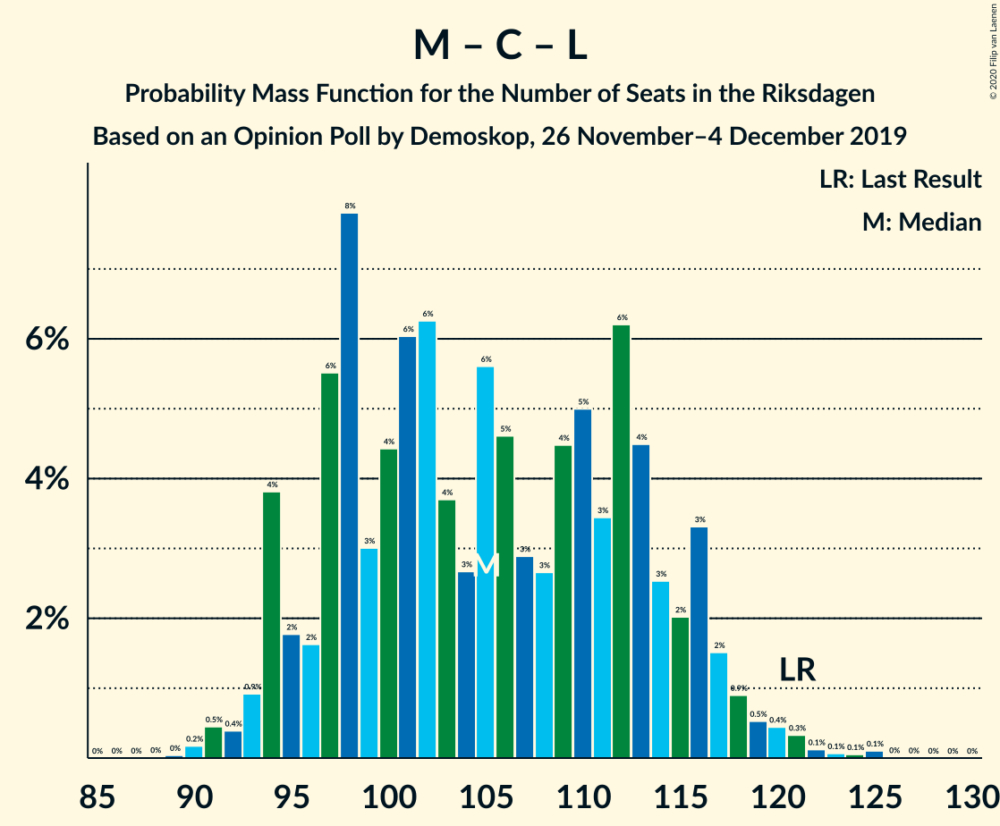

# Opinion Poll by Demoskop, 26 November–4 December 2019

<a href="#voting-intentions">Voting Intentions</a> | <a href="#seats">Seats</a> | <a href="#coalitions">Coalitions</a> | <a href="#technical-information">Technical Information</a>

## Voting Intentions

### Confidence Intervals

| Party | Last Result | Poll Result | 80% Confidence Interval | 90% Confidence Interval | 95% Confidence Interval | 99% Confidence Interval |
|:-----:|:-----------:|:-----------:|:-----------------------:|:-----------------------:|:-----------------------:|:-----------------------:|
| Sverigedemokraterna | 17.5% | 25.4% | 24.2–26.7% |23.9–27.0% |23.6–27.3% |23.0–27.9% |
| Sveriges socialdemokratiska arbetareparti | 28.3% | 24.3% | 23.1–25.5% |22.8–25.9% |22.5–26.2% |21.9–26.8% |
| Moderata samlingspartiet | 19.8% | 17.5% | 16.5–18.6% |16.2–18.9% |15.9–19.2% |15.4–19.8% |
| Centerpartiet | 8.6% | 9.6% | 8.8–10.5% |8.6–10.7% |8.4–11.0% |8.1–11.4% |
| Vänsterpartiet | 8.0% | 7.9% | 7.2–8.7% |7.0–8.9% |6.8–9.1% |6.5–9.5% |
| Kristdemokraterna | 6.3% | 5.9% | 5.3–6.6% |5.1–6.8% |5.0–7.0% |4.7–7.4% |
| Miljöpartiet de gröna | 4.4% | 4.4% | 3.8–5.0% |3.7–5.2% |3.6–5.3% |3.3–5.7% |
| Liberalerna | 5.5% | 3.9% | 3.4–4.5% |3.3–4.7% |3.1–4.8% |2.9–5.1% |

*Note:* The poll result column reflects the actual value used in the calculations. Published results may vary slightly, and in addition be rounded to fewer digits.

## Seats

### Confidence Intervals

| Party | Last Result | Median | 80% Confidence Interval | 90% Confidence Interval | 95% Confidence Interval | 99% Confidence Interval |
|:-----:|:-----------:|:------:|:-----------------------:|:-----------------------:|:-----------------------:|:-----------------------:|
| <a href="#sverigedemokraterna">Sverigedemokraterna</a> | 62 | 90 | 86–98 |85–100 |85–100 |82–105 |
| <a href="#sveriges-socialdemokratiska-arbetareparti">Sveriges socialdemokratiska arbetareparti</a> | 100 | 91 | 84–95 |79–96 |79–96 |77–98 |
| <a href="#moderata-samlingspartiet">Moderata samlingspartiet</a> | 70 | 65 | 59–68 |58–70 |57–71 |54–72 |
| <a href="#centerpartiet">Centerpartiet</a> | 31 | 36 | 33–38 |31–39 |30–39 |29–42 |
| <a href="#vänsterpartiet">Vänsterpartiet</a> | 28 | 28 | 26–32 |25–32 |25–33 |23–35 |
| <a href="#kristdemokraterna">Kristdemokraterna</a> | 22 | 21 | 20–24 |18–25 |18–25 |17–27 |
| <a href="#miljöpartiet-de-gröna">Miljöpartiet de gröna</a> | 16 | 16 | 0–18 |0–19 |0–20 |0–20 |
| <a href="#liberalerna">Liberalerna</a> | 20 | 0 | 0–15 |0–16 |0–17 |0–18 |

### Sverigedemokraterna

*For a full overview of the results for this party, see the [Sverigedemokraterna](party-sverigedemokraterna.html) page.*

| Number of Seats | Probability | Accumulated | Special Marks |
|:---------------:|:-----------:|:-----------:|:-------------:|
| 62 | 0% | 100% | Last Result |
| 63 | 0% | 100% |  |
| 64 | 0% | 100% |  |
| 65 | 0% | 100% |  |
| 66 | 0% | 100% |  |
| 67 | 0% | 100% |  |
| 68 | 0% | 100% |  |
| 69 | 0% | 100% |  |
| 70 | 0% | 100% |  |
| 71 | 0% | 100% |  |
| 72 | 0% | 100% |  |
| 73 | 0% | 100% |  |
| 74 | 0% | 100% |  |
| 75 | 0% | 100% |  |
| 76 | 0% | 100% |  |
| 77 | 0% | 100% |  |
| 78 | 0% | 100% |  |
| 79 | 0% | 100% |  |
| 80 | 0.2% | 100% |  |
| 81 | 0.1% | 99.7% |  |
| 82 | 0.3% | 99.6% |  |
| 83 | 0.4% | 99.3% |  |
| 84 | 0.6% | 98.9% |  |
| 85 | 5% | 98% |  |
| 86 | 3% | 93% |  |
| 87 | 1.1% | 90% |  |
| 88 | 5% | 89% |  |
| 89 | 4% | 84% |  |
| 90 | 36% | 80% | Median |
| 91 | 5% | 45% |  |
| 92 | 2% | 40% |  |
| 93 | 10% | 38% |  |
| 94 | 3% | 28% |  |
| 95 | 1.3% | 25% |  |
| 96 | 1.3% | 23% |  |
| 97 | 4% | 22% |  |
| 98 | 9% | 18% |  |
| 99 | 1.2% | 9% |  |
| 100 | 6% | 8% |  |
| 101 | 0.4% | 2% |  |
| 102 | 0.2% | 1.5% |  |
| 103 | 0.1% | 1.3% |  |
| 104 | 0.6% | 1.2% |  |
| 105 | 0.1% | 0.5% |  |
| 106 | 0.2% | 0.4% |  |
| 107 | 0.1% | 0.2% |  |
| 108 | 0% | 0.1% |  |
| 109 | 0% | 0.1% |  |
| 110 | 0% | 0% |  |

### Sveriges socialdemokratiska arbetareparti

*For a full overview of the results for this party, see the [Sveriges socialdemokratiska arbetareparti](party-sverigessocialdemokratiskaarbetareparti.html) page.*

| Number of Seats | Probability | Accumulated | Special Marks |
|:---------------:|:-----------:|:-----------:|:-------------:|
| 75 | 0.2% | 100% |  |
| 76 | 0% | 99.8% |  |
| 77 | 0.3% | 99.8% |  |
| 78 | 0.2% | 99.5% |  |
| 79 | 5% | 99.2% |  |
| 80 | 0.2% | 94% |  |
| 81 | 0.8% | 94% |  |
| 82 | 2% | 93% |  |
| 83 | 1.3% | 92% |  |
| 84 | 0.6% | 90% |  |
| 85 | 2% | 90% |  |
| 86 | 7% | 88% |  |
| 87 | 7% | 81% |  |
| 88 | 4% | 74% |  |
| 89 | 4% | 70% |  |
| 90 | 11% | 65% |  |
| 91 | 36% | 55% | Median |
| 92 | 4% | 18% |  |
| 93 | 0.5% | 15% |  |
| 94 | 4% | 14% |  |
| 95 | 2% | 10% |  |
| 96 | 7% | 8% |  |
| 97 | 0.1% | 1.1% |  |
| 98 | 0.5% | 1.0% |  |
| 99 | 0.4% | 0.5% |  |
| 100 | 0% | 0.1% | Last Result |
| 101 | 0% | 0.1% |  |
| 102 | 0% | 0% |  |

### Moderata samlingspartiet

*For a full overview of the results for this party, see the [Moderata samlingspartiet](party-moderatasamlingspartiet.html) page.*

| Number of Seats | Probability | Accumulated | Special Marks |
|:---------------:|:-----------:|:-----------:|:-------------:|
| 54 | 0.5% | 100% |  |
| 55 | 0.3% | 99.4% |  |
| 56 | 0.3% | 99.2% |  |
| 57 | 3% | 98.8% |  |
| 58 | 2% | 96% |  |
| 59 | 8% | 94% |  |
| 60 | 2% | 86% |  |
| 61 | 2% | 84% |  |
| 62 | 12% | 82% |  |
| 63 | 9% | 70% |  |
| 64 | 4% | 61% |  |
| 65 | 33% | 57% | Median |
| 66 | 9% | 24% |  |
| 67 | 4% | 15% |  |
| 68 | 4% | 11% |  |
| 69 | 3% | 8% |  |
| 70 | 0.4% | 5% | Last Result |
| 71 | 3% | 5% |  |
| 72 | 1.2% | 2% |  |
| 73 | 0.1% | 0.3% |  |
| 74 | 0.1% | 0.2% |  |
| 75 | 0% | 0.2% |  |
| 76 | 0.1% | 0.1% |  |
| 77 | 0% | 0% |  |

### Centerpartiet

*For a full overview of the results for this party, see the [Centerpartiet](party-centerpartiet.html) page.*

| Number of Seats | Probability | Accumulated | Special Marks |
|:---------------:|:-----------:|:-----------:|:-------------:|
| 27 | 0% | 100% |  |
| 28 | 0.1% | 99.9% |  |
| 29 | 2% | 99.8% |  |
| 30 | 2% | 98% |  |
| 31 | 4% | 97% | Last Result |
| 32 | 2% | 93% |  |
| 33 | 15% | 91% |  |
| 34 | 7% | 75% |  |
| 35 | 16% | 69% |  |
| 36 | 3% | 53% | Median |
| 37 | 33% | 50% |  |
| 38 | 9% | 16% |  |
| 39 | 5% | 7% |  |
| 40 | 0.8% | 2% |  |
| 41 | 1.1% | 2% |  |
| 42 | 0.4% | 0.6% |  |
| 43 | 0.1% | 0.2% |  |
| 44 | 0% | 0.1% |  |
| 45 | 0% | 0% |  |

### Vänsterpartiet

*For a full overview of the results for this party, see the [Vänsterpartiet](party-vänsterpartiet.html) page.*

| Number of Seats | Probability | Accumulated | Special Marks |
|:---------------:|:-----------:|:-----------:|:-------------:|
| 21 | 0.1% | 100% |  |
| 22 | 0.1% | 99.9% |  |
| 23 | 0.5% | 99.9% |  |
| 24 | 2% | 99.4% |  |
| 25 | 3% | 98% |  |
| 26 | 7% | 95% |  |
| 27 | 7% | 87% |  |
| 28 | 35% | 80% | Last Result, Median |
| 29 | 16% | 45% |  |
| 30 | 10% | 30% |  |
| 31 | 5% | 19% |  |
| 32 | 10% | 14% |  |
| 33 | 2% | 4% |  |
| 34 | 1.2% | 2% |  |
| 35 | 0.4% | 0.6% |  |
| 36 | 0.1% | 0.2% |  |
| 37 | 0.1% | 0.1% |  |
| 38 | 0% | 0% |  |

### Kristdemokraterna

*For a full overview of the results for this party, see the [Kristdemokraterna](party-kristdemokraterna.html) page.*

| Number of Seats | Probability | Accumulated | Special Marks |
|:---------------:|:-----------:|:-----------:|:-------------:|
| 16 | 0.1% | 100% |  |
| 17 | 2% | 99.9% |  |
| 18 | 4% | 98% |  |
| 19 | 3% | 94% |  |
| 20 | 19% | 91% |  |
| 21 | 36% | 72% | Median |
| 22 | 4% | 36% | Last Result |
| 23 | 11% | 32% |  |
| 24 | 14% | 21% |  |
| 25 | 6% | 7% |  |
| 26 | 0.5% | 1.1% |  |
| 27 | 0.4% | 0.5% |  |
| 28 | 0.1% | 0.1% |  |
| 29 | 0% | 0% |  |

### Miljöpartiet de gröna

*For a full overview of the results for this party, see the [Miljöpartiet de gröna](party-miljöpartietdegröna.html) page.*

| Number of Seats | Probability | Accumulated | Special Marks |
|:---------------:|:-----------:|:-----------:|:-------------:|
| 0 | 17% | 100% |  |
| 1 | 0% | 83% |  |
| 2 | 0% | 83% |  |
| 3 | 0% | 83% |  |
| 4 | 0% | 83% |  |
| 5 | 0% | 83% |  |
| 6 | 0% | 83% |  |
| 7 | 0% | 83% |  |
| 8 | 0% | 83% |  |
| 9 | 0% | 83% |  |
| 10 | 0% | 83% |  |
| 11 | 0% | 83% |  |
| 12 | 0% | 83% |  |
| 13 | 0% | 83% |  |
| 14 | 2% | 83% |  |
| 15 | 20% | 81% |  |
| 16 | 13% | 61% | Last Result, Median |
| 17 | 36% | 48% |  |
| 18 | 4% | 11% |  |
| 19 | 3% | 7% |  |
| 20 | 3% | 4% |  |
| 21 | 0.2% | 0.3% |  |
| 22 | 0% | 0% |  |

### Liberalerna

*For a full overview of the results for this party, see the [Liberalerna](party-liberalerna.html) page.*

| Number of Seats | Probability | Accumulated | Special Marks |
|:---------------:|:-----------:|:-----------:|:-------------:|
| 0 | 74% | 100% | Median |
| 1 | 0% | 26% |  |
| 2 | 0% | 26% |  |
| 3 | 0% | 26% |  |
| 4 | 0% | 26% |  |
| 5 | 0% | 26% |  |
| 6 | 0% | 26% |  |
| 7 | 0% | 26% |  |
| 8 | 0% | 26% |  |
| 9 | 0% | 26% |  |
| 10 | 0% | 26% |  |
| 11 | 0% | 26% |  |
| 12 | 0% | 26% |  |
| 13 | 0% | 26% |  |
| 14 | 5% | 26% |  |
| 15 | 13% | 21% |  |
| 16 | 4% | 8% |  |
| 17 | 2% | 4% |  |
| 18 | 2% | 2% |  |
| 19 | 0.3% | 0.4% |  |
| 20 | 0.1% | 0.1% | Last Result |
| 21 | 0% | 0% |  |

## Coalitions

### Confidence Intervals

| Coalition | Last Result | Median | Majority? | 80% Confidence Interval | 90% Confidence Interval | 95% Confidence Interval | 99% Confidence Interval |
|:---------:|:-----------:|:------:|:---------:|:-----------------------:|:-----------------------:|:-----------------------:|:-----------------------:|
| Sveriges socialdemokratiska arbetareparti – Moderata samlingspartiet – Centerpartiet | 201 | 191 | 98.5% | 180–195 | 176–198 | 176–202 | 172–205 |
| Sverigedemokraterna – Moderata samlingspartiet – Kristdemokraterna | 154 | 176 | 78% | 169–188 | 167–189 | 164–189 | 164–194 |
| Sveriges socialdemokratiska arbetareparti – Centerpartiet – Vänsterpartiet – Miljöpartiet de gröna – Liberalerna | 195 | 173 | 22% | 161–180 | 160–182 | 160–185 | 155–185 |
| Sverigedemokraterna – Moderata samlingspartiet | 132 | 155 | 0% | 148–164 | 145–166 | 144–168 | 142–173 |
| Sveriges socialdemokratiska arbetareparti – Moderata samlingspartiet | 170 | 156 | 0% | 145–162 | 141–163 | 141–165 | 138–167 |
| Sveriges socialdemokratiska arbetareparti – Centerpartiet – Miljöpartiet de gröna – Liberalerna | 167 | 145 | 0% | 130–153 | 129–156 | 129–156 | 125–157 |
| Sveriges socialdemokratiska arbetareparti – Vänsterpartiet – Miljöpartiet de gröna | 144 | 135 | 0% | 123–136 | 122–139 | 120–140 | 115–142 |
| Moderata samlingspartiet – Centerpartiet – Kristdemokraterna – Liberalerna | 143 | 123 | 0% | 120–134 | 117–136 | 115–139 | 114–142 |
| Moderata samlingspartiet – Centerpartiet – Kristdemokraterna | 123 | 123 | 0% | 114–126 | 111–129 | 111–129 | 106–134 |
| Sveriges socialdemokratiska arbetareparti – Vänsterpartiet | 128 | 119 | 0% | 112–124 | 108–128 | 108–128 | 105–128 |
| Moderata samlingspartiet – Centerpartiet – Liberalerna | 121 | 102 | 0% | 97–112 | 97–114 | 95–116 | 92–119 |
| Sveriges socialdemokratiska arbetareparti – Miljöpartiet de gröna | 116 | 106 | 0% | 94–108 | 92–108 | 90–110 | 85–112 |
| Moderata samlingspartiet – Centerpartiet | 101 | 101 | 0% | 93–104 | 91–107 | 90–108 | 87–110 |

### Sveriges socialdemokratiska arbetareparti – Moderata samlingspartiet – Centerpartiet

| Number of Seats | Probability | Accumulated | Special Marks |
|:---------------:|:-----------:|:-----------:|:-------------:|
| 170 | 0.1% | 100% |  |
| 171 | 0.1% | 99.9% |  |
| 172 | 0.5% | 99.8% |  |
| 173 | 0.2% | 99.2% |  |
| 174 | 0.5% | 99.0% |  |
| 175 | 0.8% | 98.5% | Majority |
| 176 | 4% | 98% |  |
| 177 | 2% | 94% |  |
| 178 | 1.0% | 92% |  |
| 179 | 0.4% | 91% |  |
| 180 | 4% | 91% |  |
| 181 | 2% | 87% |  |
| 182 | 4% | 84% |  |
| 183 | 3% | 81% |  |
| 184 | 5% | 77% |  |
| 185 | 5% | 73% |  |
| 186 | 2% | 68% |  |
| 187 | 3% | 66% |  |
| 188 | 2% | 63% |  |
| 189 | 1.5% | 61% |  |
| 190 | 3% | 60% |  |
| 191 | 8% | 57% |  |
| 192 | 3% | 49% | Median |
| 193 | 31% | 46% |  |
| 194 | 0.4% | 15% |  |
| 195 | 7% | 15% |  |
| 196 | 1.2% | 8% |  |
| 197 | 0.9% | 7% |  |
| 198 | 0.8% | 6% |  |
| 199 | 0.6% | 5% |  |
| 200 | 0.2% | 4% |  |
| 201 | 0.1% | 4% | Last Result |
| 202 | 3% | 4% |  |
| 203 | 0.1% | 1.4% |  |
| 204 | 0.8% | 1.3% |  |
| 205 | 0.5% | 0.5% |  |
| 206 | 0% | 0% |  |

### Sverigedemokraterna – Moderata samlingspartiet – Kristdemokraterna

| Number of Seats | Probability | Accumulated | Special Marks |
|:---------------:|:-----------:|:-----------:|:-------------:|
| 154 | 0% | 100% | Last Result |
| 155 | 0% | 100% |  |
| 156 | 0% | 100% |  |
| 157 | 0% | 100% |  |
| 158 | 0% | 100% |  |
| 159 | 0.1% | 100% |  |
| 160 | 0% | 99.9% |  |
| 161 | 0.1% | 99.9% |  |
| 162 | 0% | 99.8% |  |
| 163 | 0.2% | 99.8% |  |
| 164 | 4% | 99.6% |  |
| 165 | 0.1% | 95% |  |
| 166 | 0.2% | 95% |  |
| 167 | 2% | 95% |  |
| 168 | 0.5% | 93% |  |
| 169 | 4% | 92% |  |
| 170 | 1.2% | 88% |  |
| 171 | 1.5% | 87% |  |
| 172 | 3% | 86% |  |
| 173 | 2% | 83% |  |
| 174 | 2% | 81% |  |
| 175 | 1.2% | 78% | Majority |
| 176 | 39% | 77% | Median |
| 177 | 3% | 38% |  |
| 178 | 2% | 34% |  |
| 179 | 2% | 32% |  |
| 180 | 5% | 30% |  |
| 181 | 3% | 25% |  |
| 182 | 2% | 23% |  |
| 183 | 1.1% | 21% |  |
| 184 | 0.3% | 20% |  |
| 185 | 4% | 19% |  |
| 186 | 1.5% | 15% |  |
| 187 | 1.5% | 14% |  |
| 188 | 7% | 12% |  |
| 189 | 4% | 6% |  |
| 190 | 0.2% | 2% |  |
| 191 | 0.4% | 2% |  |
| 192 | 0.4% | 1.2% |  |
| 193 | 0.3% | 0.9% |  |
| 194 | 0.5% | 0.6% |  |
| 195 | 0% | 0.1% |  |
| 196 | 0% | 0.1% |  |
| 197 | 0% | 0.1% |  |
| 198 | 0% | 0% |  |

### Sveriges socialdemokratiska arbetareparti – Centerpartiet – Vänsterpartiet – Miljöpartiet de gröna – Liberalerna

| Number of Seats | Probability | Accumulated | Special Marks |
|:---------------:|:-----------:|:-----------:|:-------------:|
| 152 | 0% | 100% |  |
| 153 | 0% | 99.9% |  |
| 154 | 0% | 99.9% |  |
| 155 | 0.5% | 99.9% |  |
| 156 | 0.3% | 99.4% |  |
| 157 | 0.4% | 99.1% |  |
| 158 | 0.4% | 98.8% |  |
| 159 | 0.2% | 98% |  |
| 160 | 4% | 98% |  |
| 161 | 7% | 94% |  |
| 162 | 1.5% | 88% |  |
| 163 | 1.5% | 86% |  |
| 164 | 4% | 85% |  |
| 165 | 0.3% | 81% |  |
| 166 | 1.1% | 80% |  |
| 167 | 2% | 79% |  |
| 168 | 3% | 77% |  |
| 169 | 5% | 75% |  |
| 170 | 2% | 70% |  |
| 171 | 2% | 68% | Median |
| 172 | 3% | 66% |  |
| 173 | 39% | 62% |  |
| 174 | 1.2% | 23% |  |
| 175 | 2% | 22% | Majority |
| 176 | 2% | 19% |  |
| 177 | 3% | 17% |  |
| 178 | 1.5% | 14% |  |
| 179 | 1.2% | 13% |  |
| 180 | 4% | 12% |  |
| 181 | 0.5% | 8% |  |
| 182 | 2% | 7% |  |
| 183 | 0.2% | 5% |  |
| 184 | 0.1% | 5% |  |
| 185 | 4% | 5% |  |
| 186 | 0.2% | 0.4% |  |
| 187 | 0% | 0.2% |  |
| 188 | 0.1% | 0.2% |  |
| 189 | 0% | 0.1% |  |
| 190 | 0.1% | 0.1% |  |
| 191 | 0% | 0% |  |
| 192 | 0% | 0% |  |
| 193 | 0% | 0% |  |
| 194 | 0% | 0% |  |
| 195 | 0% | 0% | Last Result |

### Sverigedemokraterna – Moderata samlingspartiet

| Number of Seats | Probability | Accumulated | Special Marks |
|:---------------:|:-----------:|:-----------:|:-------------:|
| 132 | 0% | 100% | Last Result |
| 133 | 0% | 100% |  |
| 134 | 0% | 100% |  |
| 135 | 0% | 100% |  |
| 136 | 0% | 100% |  |
| 137 | 0% | 100% |  |
| 138 | 0% | 100% |  |
| 139 | 0% | 100% |  |
| 140 | 0% | 99.9% |  |
| 141 | 0.2% | 99.9% |  |
| 142 | 0.2% | 99.7% |  |
| 143 | 0.1% | 99.5% |  |
| 144 | 4% | 99.4% |  |
| 145 | 1.2% | 95% |  |
| 146 | 2% | 94% |  |
| 147 | 2% | 92% |  |
| 148 | 1.0% | 90% |  |
| 149 | 1.3% | 89% |  |
| 150 | 1.5% | 88% |  |
| 151 | 1.3% | 86% |  |
| 152 | 8% | 85% |  |
| 153 | 3% | 77% |  |
| 154 | 3% | 74% |  |
| 155 | 31% | 71% | Median |
| 156 | 10% | 40% |  |
| 157 | 2% | 31% |  |
| 158 | 1.2% | 29% |  |
| 159 | 2% | 27% |  |
| 160 | 3% | 25% |  |
| 161 | 0.8% | 22% |  |
| 162 | 5% | 21% |  |
| 163 | 0.3% | 16% |  |
| 164 | 9% | 15% |  |
| 165 | 1.0% | 6% |  |
| 166 | 0.4% | 5% |  |
| 167 | 0.1% | 5% |  |
| 168 | 3% | 5% |  |
| 169 | 0.7% | 2% |  |
| 170 | 0.2% | 1.0% |  |
| 171 | 0.1% | 0.8% |  |
| 172 | 0.1% | 0.8% |  |
| 173 | 0.5% | 0.7% |  |
| 174 | 0.1% | 0.1% |  |
| 175 | 0% | 0% | Majority |

### Sveriges socialdemokratiska arbetareparti – Moderata samlingspartiet

| Number of Seats | Probability | Accumulated | Special Marks |
|:---------------:|:-----------:|:-----------:|:-------------:|
| 137 | 0.4% | 100% |  |
| 138 | 0.2% | 99.5% |  |
| 139 | 0.3% | 99.4% |  |
| 140 | 0.2% | 99.1% |  |
| 141 | 4% | 98.8% |  |
| 142 | 1.1% | 95% |  |
| 143 | 0.4% | 94% |  |
| 144 | 2% | 93% |  |
| 145 | 3% | 92% |  |
| 146 | 1.0% | 89% |  |
| 147 | 2% | 88% |  |
| 148 | 4% | 86% |  |
| 149 | 9% | 82% |  |
| 150 | 6% | 73% |  |
| 151 | 4% | 67% |  |
| 152 | 3% | 64% |  |
| 153 | 8% | 61% |  |
| 154 | 2% | 53% |  |
| 155 | 0.7% | 51% |  |
| 156 | 30% | 50% | Median |
| 157 | 1.4% | 20% |  |
| 158 | 1.0% | 19% |  |
| 159 | 4% | 18% |  |
| 160 | 0.1% | 14% |  |
| 161 | 2% | 14% |  |
| 162 | 7% | 12% |  |
| 163 | 0.3% | 5% |  |
| 164 | 0.5% | 5% |  |
| 165 | 3% | 4% |  |
| 166 | 0.8% | 2% |  |
| 167 | 0.5% | 0.7% |  |
| 168 | 0.1% | 0.2% |  |
| 169 | 0.1% | 0.2% |  |
| 170 | 0% | 0% | Last Result |

### Sveriges socialdemokratiska arbetareparti – Centerpartiet – Miljöpartiet de gröna – Liberalerna

| Number of Seats | Probability | Accumulated | Special Marks |
|:---------------:|:-----------:|:-----------:|:-------------:|
| 120 | 0% | 100% |  |
| 121 | 0% | 99.9% |  |
| 122 | 0% | 99.9% |  |
| 123 | 0.1% | 99.9% |  |
| 124 | 0.1% | 99.9% |  |
| 125 | 0.4% | 99.8% |  |
| 126 | 0.1% | 99.4% |  |
| 127 | 0.3% | 99.3% |  |
| 128 | 0.2% | 99.0% |  |
| 129 | 8% | 98.7% |  |
| 130 | 0.6% | 91% |  |
| 131 | 3% | 90% |  |
| 132 | 1.1% | 87% |  |
| 133 | 0.2% | 86% |  |
| 134 | 0.4% | 86% |  |
| 135 | 0.6% | 85% |  |
| 136 | 0.8% | 85% |  |
| 137 | 1.4% | 84% |  |
| 138 | 5% | 83% |  |
| 139 | 3% | 77% |  |
| 140 | 3% | 75% |  |
| 141 | 7% | 72% |  |
| 142 | 1.1% | 65% |  |
| 143 | 7% | 64% | Median |
| 144 | 6% | 56% |  |
| 145 | 29% | 51% |  |
| 146 | 2% | 21% |  |
| 147 | 1.4% | 20% |  |
| 148 | 2% | 18% |  |
| 149 | 2% | 16% |  |
| 150 | 3% | 14% |  |
| 151 | 0.4% | 12% |  |
| 152 | 0.4% | 11% |  |
| 153 | 3% | 11% |  |
| 154 | 1.3% | 8% |  |
| 155 | 0.6% | 7% |  |
| 156 | 5% | 6% |  |
| 157 | 0.7% | 1.2% |  |
| 158 | 0.2% | 0.5% |  |
| 159 | 0.2% | 0.3% |  |
| 160 | 0% | 0.1% |  |
| 161 | 0.1% | 0.1% |  |
| 162 | 0% | 0% |  |
| 163 | 0% | 0% |  |
| 164 | 0% | 0% |  |
| 165 | 0% | 0% |  |
| 166 | 0% | 0% |  |
| 167 | 0% | 0% | Last Result |

### Sveriges socialdemokratiska arbetareparti – Vänsterpartiet – Miljöpartiet de gröna

| Number of Seats | Probability | Accumulated | Special Marks |
|:---------------:|:-----------:|:-----------:|:-------------:|
| 110 | 0% | 100% |  |
| 111 | 0.2% | 99.9% |  |
| 112 | 0% | 99.7% |  |
| 113 | 0.1% | 99.7% |  |
| 114 | 0% | 99.6% |  |
| 115 | 0.3% | 99.5% |  |
| 116 | 0.1% | 99.2% |  |
| 117 | 0.4% | 99.1% |  |
| 118 | 1.0% | 98.7% |  |
| 119 | 0.1% | 98% |  |
| 120 | 1.1% | 98% |  |
| 121 | 0.8% | 97% |  |
| 122 | 1.3% | 96% |  |
| 123 | 9% | 94% |  |
| 124 | 0.6% | 86% |  |
| 125 | 0.6% | 85% |  |
| 126 | 2% | 85% |  |
| 127 | 1.4% | 83% |  |
| 128 | 8% | 82% |  |
| 129 | 6% | 74% |  |
| 130 | 4% | 68% |  |
| 131 | 2% | 64% |  |
| 132 | 3% | 62% |  |
| 133 | 2% | 59% |  |
| 134 | 2% | 56% |  |
| 135 | 15% | 55% | Median |
| 136 | 31% | 40% |  |
| 137 | 2% | 8% |  |
| 138 | 1.0% | 6% |  |
| 139 | 2% | 5% |  |
| 140 | 1.3% | 3% |  |
| 141 | 0.2% | 2% |  |
| 142 | 1.3% | 2% |  |
| 143 | 0.4% | 0.5% |  |
| 144 | 0% | 0.1% | Last Result |
| 145 | 0% | 0.1% |  |
| 146 | 0% | 0% |  |

### Moderata samlingspartiet – Centerpartiet – Kristdemokraterna – Liberalerna

| Number of Seats | Probability | Accumulated | Special Marks |
|:---------------:|:-----------:|:-----------:|:-------------:|
| 111 | 0.2% | 100% |  |
| 112 | 0% | 99.7% |  |
| 113 | 0.1% | 99.7% |  |
| 114 | 0.4% | 99.6% |  |
| 115 | 3% | 99.2% |  |
| 116 | 0.3% | 96% |  |
| 117 | 2% | 96% |  |
| 118 | 0.4% | 94% |  |
| 119 | 3% | 94% |  |
| 120 | 5% | 91% |  |
| 121 | 8% | 86% |  |
| 122 | 0.6% | 77% | Median |
| 123 | 37% | 77% |  |
| 124 | 1.5% | 40% |  |
| 125 | 4% | 39% |  |
| 126 | 5% | 34% |  |
| 127 | 0.7% | 29% |  |
| 128 | 3% | 29% |  |
| 129 | 9% | 25% |  |
| 130 | 2% | 17% |  |
| 131 | 1.3% | 15% |  |
| 132 | 3% | 14% |  |
| 133 | 0.6% | 11% |  |
| 134 | 2% | 11% |  |
| 135 | 0.8% | 9% |  |
| 136 | 5% | 8% |  |
| 137 | 0.2% | 3% |  |
| 138 | 0.5% | 3% |  |
| 139 | 2% | 3% |  |
| 140 | 0% | 1.0% |  |
| 141 | 0.4% | 1.0% |  |
| 142 | 0.4% | 0.6% |  |
| 143 | 0% | 0.2% | Last Result |
| 144 | 0% | 0.2% |  |
| 145 | 0.1% | 0.2% |  |
| 146 | 0% | 0.1% |  |
| 147 | 0% | 0.1% |  |
| 148 | 0% | 0.1% |  |
| 149 | 0.1% | 0.1% |  |
| 150 | 0% | 0% |  |

### Moderata samlingspartiet – Centerpartiet – Kristdemokraterna

| Number of Seats | Probability | Accumulated | Special Marks |
|:---------------:|:-----------:|:-----------:|:-------------:|
| 106 | 0.7% | 100% |  |
| 107 | 0.2% | 99.3% |  |
| 108 | 0.1% | 99.1% |  |
| 109 | 0.2% | 99.1% |  |
| 110 | 0.2% | 98.9% |  |
| 111 | 4% | 98.7% |  |
| 112 | 0.3% | 95% |  |
| 113 | 0.3% | 94% |  |
| 114 | 8% | 94% |  |
| 115 | 3% | 86% |  |
| 116 | 2% | 83% |  |
| 117 | 2% | 81% |  |
| 118 | 2% | 79% |  |
| 119 | 4% | 77% |  |
| 120 | 6% | 73% |  |
| 121 | 12% | 67% |  |
| 122 | 1.4% | 55% | Median |
| 123 | 37% | 53% | Last Result |
| 124 | 1.5% | 16% |  |
| 125 | 3% | 14% |  |
| 126 | 2% | 11% |  |
| 127 | 0.8% | 9% |  |
| 128 | 0.6% | 8% |  |
| 129 | 5% | 7% |  |
| 130 | 1.0% | 2% |  |
| 131 | 0.2% | 1.4% |  |
| 132 | 0.1% | 1.1% |  |
| 133 | 0% | 1.0% |  |
| 134 | 0.8% | 1.0% |  |
| 135 | 0.1% | 0.2% |  |
| 136 | 0% | 0.1% |  |
| 137 | 0% | 0% |  |

### Sveriges socialdemokratiska arbetareparti – Vänsterpartiet

| Number of Seats | Probability | Accumulated | Special Marks |
|:---------------:|:-----------:|:-----------:|:-------------:|
| 102 | 0% | 100% |  |
| 103 | 0.3% | 99.9% |  |
| 104 | 0.1% | 99.6% |  |
| 105 | 0.2% | 99.5% |  |
| 106 | 0.4% | 99.4% |  |
| 107 | 0.2% | 98.9% |  |
| 108 | 5% | 98.7% |  |
| 109 | 1.0% | 94% |  |
| 110 | 1.3% | 93% |  |
| 111 | 0.9% | 92% |  |
| 112 | 1.1% | 91% |  |
| 113 | 6% | 90% |  |
| 114 | 4% | 84% |  |
| 115 | 4% | 80% |  |
| 116 | 6% | 76% |  |
| 117 | 2% | 69% |  |
| 118 | 4% | 67% |  |
| 119 | 30% | 63% | Median |
| 120 | 14% | 33% |  |
| 121 | 0.8% | 20% |  |
| 122 | 3% | 19% |  |
| 123 | 5% | 15% |  |
| 124 | 0.9% | 11% |  |
| 125 | 0.9% | 10% |  |
| 126 | 0.5% | 9% |  |
| 127 | 1.3% | 8% |  |
| 128 | 7% | 7% | Last Result |
| 129 | 0.1% | 0.2% |  |
| 130 | 0% | 0.2% |  |
| 131 | 0% | 0.1% |  |
| 132 | 0% | 0.1% |  |
| 133 | 0% | 0.1% |  |
| 134 | 0% | 0% |  |

### Moderata samlingspartiet – Centerpartiet – Liberalerna

| Number of Seats | Probability | Accumulated | Special Marks |
|:---------------:|:-----------:|:-----------:|:-------------:|
| 89 | 0.1% | 100% |  |
| 90 | 0% | 99.9% |  |
| 91 | 0.3% | 99.9% |  |
| 92 | 0.8% | 99.6% |  |
| 93 | 0.3% | 98.7% |  |
| 94 | 0.5% | 98% |  |
| 95 | 2% | 98% |  |
| 96 | 0.7% | 96% |  |
| 97 | 6% | 95% |  |
| 98 | 0.3% | 90% |  |
| 99 | 9% | 89% |  |
| 100 | 3% | 80% |  |
| 101 | 9% | 77% | Median |
| 102 | 31% | 68% |  |
| 103 | 3% | 37% |  |
| 104 | 4% | 35% |  |
| 105 | 3% | 31% |  |
| 106 | 3% | 28% |  |
| 107 | 2% | 25% |  |
| 108 | 4% | 23% |  |
| 109 | 4% | 18% |  |
| 110 | 2% | 14% |  |
| 111 | 0.4% | 12% |  |
| 112 | 5% | 12% |  |
| 113 | 2% | 7% |  |
| 114 | 0.6% | 5% |  |
| 115 | 1.5% | 5% |  |
| 116 | 1.0% | 3% |  |
| 117 | 0.7% | 2% |  |
| 118 | 0.5% | 1.4% |  |
| 119 | 0.4% | 0.9% |  |
| 120 | 0.1% | 0.5% |  |
| 121 | 0.2% | 0.4% | Last Result |
| 122 | 0% | 0.2% |  |
| 123 | 0% | 0.2% |  |
| 124 | 0% | 0.1% |  |
| 125 | 0.1% | 0.1% |  |
| 126 | 0% | 0% |  |

### Sveriges socialdemokratiska arbetareparti – Miljöpartiet de gröna

| Number of Seats | Probability | Accumulated | Special Marks |
|:---------------:|:-----------:|:-----------:|:-------------:|
| 81 | 0% | 100% |  |
| 82 | 0% | 99.9% |  |
| 83 | 0% | 99.9% |  |
| 84 | 0.3% | 99.9% |  |
| 85 | 0.5% | 99.6% |  |
| 86 | 0.9% | 99.1% |  |
| 87 | 0.2% | 98% |  |
| 88 | 0% | 98% |  |
| 89 | 0.4% | 98% |  |
| 90 | 1.2% | 98% |  |
| 91 | 0.6% | 96% |  |
| 92 | 0.9% | 96% |  |
| 93 | 0.3% | 95% |  |
| 94 | 8% | 95% |  |
| 95 | 1.3% | 87% |  |
| 96 | 7% | 85% |  |
| 97 | 2% | 78% |  |
| 98 | 2% | 77% |  |
| 99 | 0.3% | 75% |  |
| 100 | 0.7% | 74% |  |
| 101 | 1.3% | 74% |  |
| 102 | 4% | 72% |  |
| 103 | 4% | 68% |  |
| 104 | 2% | 64% |  |
| 105 | 12% | 62% |  |
| 106 | 8% | 50% |  |
| 107 | 5% | 42% | Median |
| 108 | 34% | 37% |  |
| 109 | 0.9% | 4% |  |
| 110 | 1.3% | 3% |  |
| 111 | 0.9% | 1.5% |  |
| 112 | 0.1% | 0.6% |  |
| 113 | 0.1% | 0.5% |  |
| 114 | 0.1% | 0.4% |  |
| 115 | 0.2% | 0.3% |  |
| 116 | 0% | 0.1% | Last Result |
| 117 | 0% | 0% |  |

### Moderata samlingspartiet – Centerpartiet

| Number of Seats | Probability | Accumulated | Special Marks |
|:---------------:|:-----------:|:-----------:|:-------------:|
| 85 | 0% | 100% |  |
| 86 | 0% | 99.9% |  |
| 87 | 0.6% | 99.9% |  |
| 88 | 0.2% | 99.3% |  |
| 89 | 0.7% | 99.1% |  |
| 90 | 1.1% | 98% |  |
| 91 | 3% | 97% |  |
| 92 | 2% | 94% |  |
| 93 | 2% | 92% |  |
| 94 | 6% | 90% |  |
| 95 | 4% | 84% |  |
| 96 | 1.5% | 80% |  |
| 97 | 10% | 79% |  |
| 98 | 1.3% | 69% |  |
| 99 | 10% | 67% |  |
| 100 | 4% | 57% |  |
| 101 | 9% | 53% | Last Result, Median |
| 102 | 31% | 43% |  |
| 103 | 3% | 13% |  |
| 104 | 3% | 10% |  |
| 105 | 0.8% | 7% |  |
| 106 | 1.0% | 6% |  |
| 107 | 1.0% | 5% |  |
| 108 | 3% | 4% |  |
| 109 | 0.1% | 1.4% |  |
| 110 | 1.1% | 1.4% |  |
| 111 | 0% | 0.2% |  |
| 112 | 0.2% | 0.2% |  |
| 113 | 0% | 0% |  |

## Technical Information

### Opinion Poll

+ **Polling firm:** Demoskop
+ **Commissioner(s):** —
+ **Fieldwork period:** 26 November–4 December 2019

### Calculations

+ **Sample size:** 2079
+ **Simulations done:** 131,072
+ **Error estimate:** 0.78%

