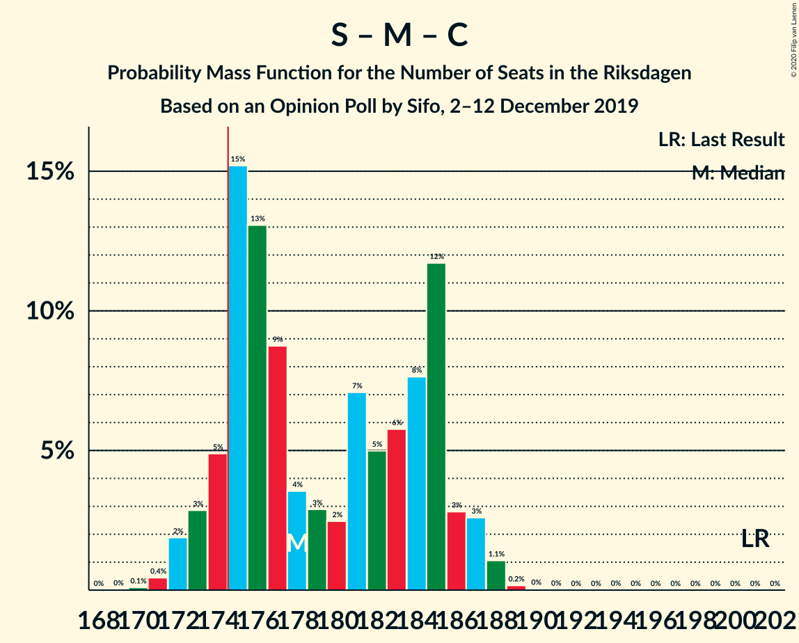
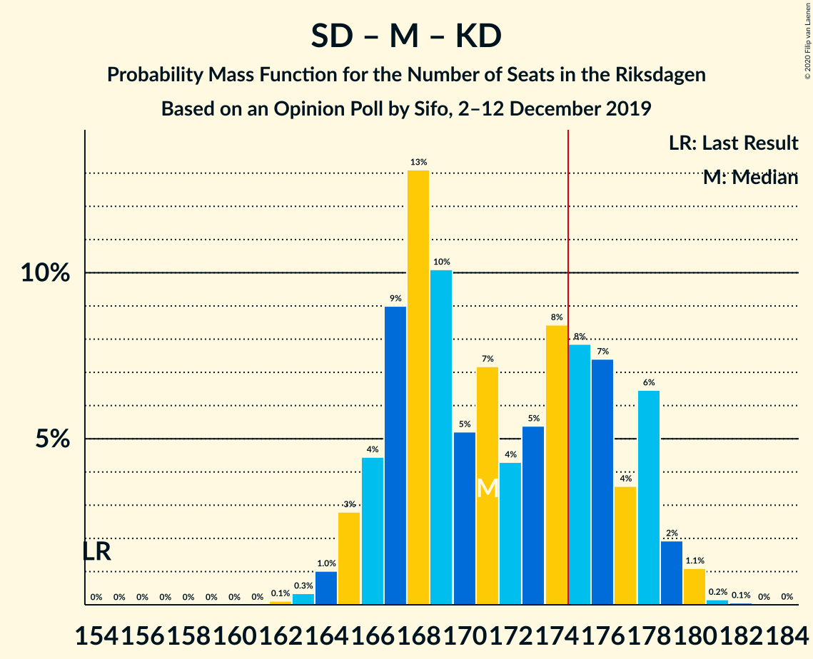
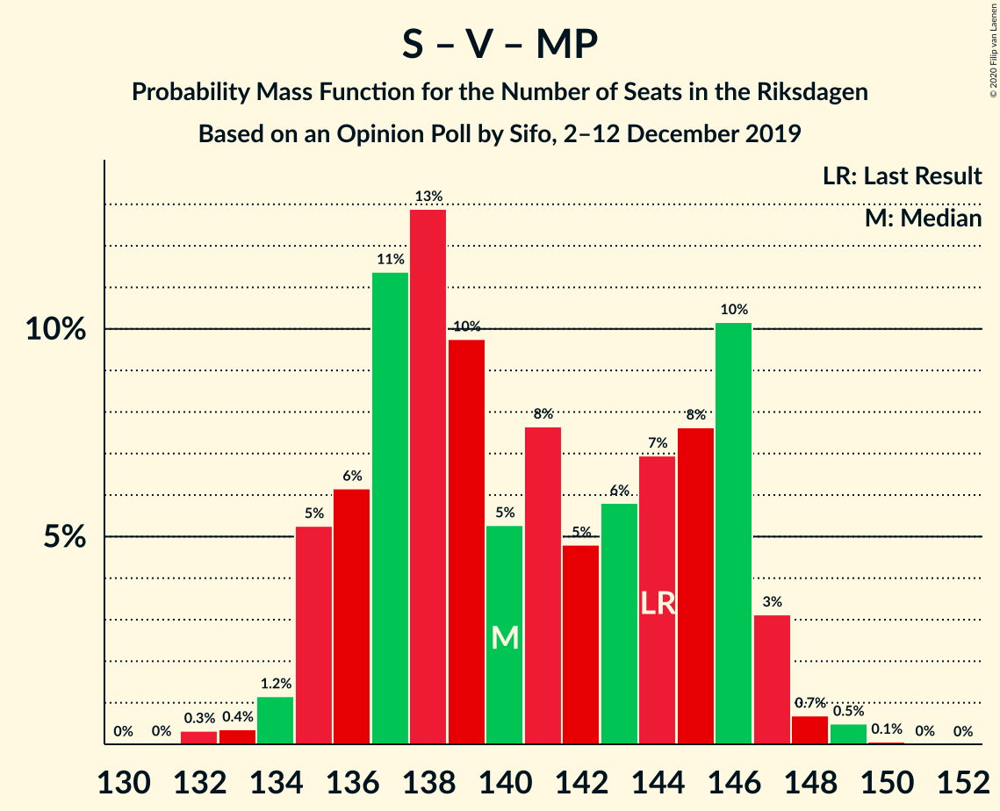
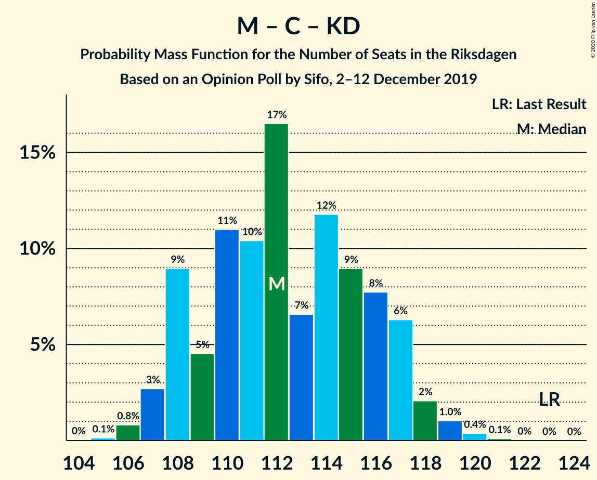

# Opinion Poll by Sifo, 2–12 December 2019

<a href="#voting-intentions">Voting Intentions</a> | <a href="#seats">Seats</a> | <a href="#coalitions">Coalitions</a> | <a href="#technical-information">Technical Information</a>

## Voting Intentions

### Confidence Intervals

| Party | Last Result | Poll Result | 80% Confidence Interval | 90% Confidence Interval | 95% Confidence Interval | 99% Confidence Interval |
|:-----:|:-----------:|:-----------:|:-----------------------:|:-----------------------:|:-----------------------:|:-----------------------:|
| Sveriges socialdemokratiska arbetareparti | 28.3% | 24.6% | 24.0–25.3% |23.9–25.4% |23.7–25.6% |23.4–25.9% |
| Sverigedemokraterna | 17.5% | 24.4% | 23.8–25.0% |23.6–25.2% |23.5–25.4% |23.2–25.7% |
| Moderata samlingspartiet | 19.8% | 17.2% | 16.7–17.8% |16.5–17.9% |16.4–18.0% |16.2–18.3% |
| Vänsterpartiet | 8.0% | 9.7% | 9.3–10.2% |9.2–10.3% |9.1–10.4% |8.9–10.6% |
| Centerpartiet | 8.6% | 8.0% | 7.6–8.4% |7.5–8.5% |7.4–8.6% |7.3–8.8% |
| Kristdemokraterna | 6.3% | 6.0% | 5.7–6.4% |5.6–6.5% |5.5–6.5% |5.3–6.7% |
| Miljöpartiet de gröna | 4.4% | 4.7% | 4.4–5.0% |4.3–5.1% |4.3–5.2% |4.1–5.3% |
| Liberalerna | 5.5% | 4.0% | 3.7–4.3% |3.7–4.4% |3.6–4.5% |3.5–4.6% |

*Note:* The poll result column reflects the actual value used in the calculations. Published results may vary slightly, and in addition be rounded to fewer digits.

## Seats

### Confidence Intervals

| Party | Last Result | Median | 80% Confidence Interval | 90% Confidence Interval | 95% Confidence Interval | 99% Confidence Interval |
|:-----:|:-----------:|:------:|:-----------------------:|:-----------------------:|:-----------------------:|:-----------------------:|
| <a href="#sveriges-socialdemokratiska-arbetareparti">Sveriges socialdemokratiska arbetareparti</a> | 100 | 88 | 85–92 |85–93 |84–93 |83–95 |
| <a href="#sverigedemokraterna">Sverigedemokraterna</a> | 62 | 87 | 85–91 |84–93 |83–93 |82–94 |
| <a href="#moderata-samlingspartiet">Moderata samlingspartiet</a> | 70 | 62 | 59–64 |59–65 |58–66 |57–67 |
| <a href="#vänsterpartiet">Vänsterpartiet</a> | 28 | 35 | 33–37 |33–37 |33–37 |32–39 |
| <a href="#centerpartiet">Centerpartiet</a> | 31 | 29 | 27–31 |27–31 |26–31 |26–32 |
| <a href="#kristdemokraterna">Kristdemokraterna</a> | 22 | 22 | 20–23 |20–24 |20–24 |19–24 |
| <a href="#miljöpartiet-de-gröna">Miljöpartiet de gröna</a> | 16 | 17 | 16–18 |16–18 |15–19 |15–19 |
| <a href="#liberalerna">Liberalerna</a> | 20 | 14 | 0–15 |0–16 |0–16 |0–16 |

### Sveriges socialdemokratiska arbetareparti

*For a full overview of the results for this party, see the [Sveriges socialdemokratiska arbetareparti](party-sverigessocialdemokratiskaarbetareparti.html) page.*

| Number of Seats | Probability | Accumulated | Special Marks |
|:---------------:|:-----------:|:-----------:|:-------------:|
| 82 | 0.1% | 100% |  |
| 83 | 0.7% | 99.9% |  |
| 84 | 3% | 99.1% |  |
| 85 | 7% | 96% |  |
| 86 | 24% | 89% |  |
| 87 | 6% | 65% |  |
| 88 | 13% | 59% | Median |
| 89 | 9% | 46% |  |
| 90 | 14% | 36% |  |
| 91 | 6% | 22% |  |
| 92 | 8% | 16% |  |
| 93 | 6% | 9% |  |
| 94 | 1.3% | 2% |  |
| 95 | 0.9% | 1.0% |  |
| 96 | 0.1% | 0.1% |  |
| 97 | 0% | 0% |  |
| 98 | 0% | 0% |  |
| 99 | 0% | 0% |  |
| 100 | 0% | 0% | Last Result |

### Sverigedemokraterna

*For a full overview of the results for this party, see the [Sverigedemokraterna](party-sverigedemokraterna.html) page.*

| Number of Seats | Probability | Accumulated | Special Marks |
|:---------------:|:-----------:|:-----------:|:-------------:|
| 62 | 0% | 100% | Last Result |
| 63 | 0% | 100% |  |
| 64 | 0% | 100% |  |
| 65 | 0% | 100% |  |
| 66 | 0% | 100% |  |
| 67 | 0% | 100% |  |
| 68 | 0% | 100% |  |
| 69 | 0% | 100% |  |
| 70 | 0% | 100% |  |
| 71 | 0% | 100% |  |
| 72 | 0% | 100% |  |
| 73 | 0% | 100% |  |
| 74 | 0% | 100% |  |
| 75 | 0% | 100% |  |
| 76 | 0% | 100% |  |
| 77 | 0% | 100% |  |
| 78 | 0% | 100% |  |
| 79 | 0% | 100% |  |
| 80 | 0% | 100% |  |
| 81 | 0.2% | 100% |  |
| 82 | 0.4% | 99.7% |  |
| 83 | 2% | 99.3% |  |
| 84 | 3% | 97% |  |
| 85 | 8% | 94% |  |
| 86 | 28% | 85% |  |
| 87 | 9% | 57% | Median |
| 88 | 11% | 48% |  |
| 89 | 10% | 37% |  |
| 90 | 7% | 28% |  |
| 91 | 11% | 21% |  |
| 92 | 4% | 9% |  |
| 93 | 4% | 5% |  |
| 94 | 1.5% | 2% |  |
| 95 | 0.1% | 0.1% |  |
| 96 | 0.1% | 0.1% |  |
| 97 | 0% | 0% |  |

### Moderata samlingspartiet

*For a full overview of the results for this party, see the [Moderata samlingspartiet](party-moderatasamlingspartiet.html) page.*

| Number of Seats | Probability | Accumulated | Special Marks |
|:---------------:|:-----------:|:-----------:|:-------------:|
| 56 | 0.1% | 100% |  |
| 57 | 0.7% | 99.9% |  |
| 58 | 4% | 99.2% |  |
| 59 | 7% | 95% |  |
| 60 | 13% | 88% |  |
| 61 | 20% | 75% |  |
| 62 | 19% | 55% | Median |
| 63 | 16% | 37% |  |
| 64 | 13% | 20% |  |
| 65 | 3% | 7% |  |
| 66 | 3% | 4% |  |
| 67 | 0.7% | 0.9% |  |
| 68 | 0.2% | 0.2% |  |
| 69 | 0% | 0% |  |
| 70 | 0% | 0% | Last Result |

### Vänsterpartiet

*For a full overview of the results for this party, see the [Vänsterpartiet](party-vänsterpartiet.html) page.*

| Number of Seats | Probability | Accumulated | Special Marks |
|:---------------:|:-----------:|:-----------:|:-------------:|
| 28 | 0% | 100% | Last Result |
| 29 | 0% | 100% |  |
| 30 | 0% | 100% |  |
| 31 | 0.3% | 100% |  |
| 32 | 2% | 99.6% |  |
| 33 | 9% | 98% |  |
| 34 | 18% | 89% |  |
| 35 | 32% | 71% | Median |
| 36 | 25% | 39% |  |
| 37 | 12% | 14% |  |
| 38 | 1.0% | 2% |  |
| 39 | 0.8% | 1.0% |  |
| 40 | 0.2% | 0.2% |  |
| 41 | 0% | 0% |  |

### Centerpartiet

*For a full overview of the results for this party, see the [Centerpartiet](party-centerpartiet.html) page.*

| Number of Seats | Probability | Accumulated | Special Marks |
|:---------------:|:-----------:|:-----------:|:-------------:|
| 25 | 0.4% | 100% |  |
| 26 | 2% | 99.6% |  |
| 27 | 10% | 97% |  |
| 28 | 32% | 87% |  |
| 29 | 29% | 55% | Median |
| 30 | 16% | 27% |  |
| 31 | 9% | 10% | Last Result |
| 32 | 2% | 2% |  |
| 33 | 0.2% | 0.2% |  |
| 34 | 0% | 0% |  |

### Kristdemokraterna

*For a full overview of the results for this party, see the [Kristdemokraterna](party-kristdemokraterna.html) page.*

| Number of Seats | Probability | Accumulated | Special Marks |
|:---------------:|:-----------:|:-----------:|:-------------:|
| 18 | 0.1% | 100% |  |
| 19 | 2% | 99.9% |  |
| 20 | 11% | 98% |  |
| 21 | 35% | 87% |  |
| 22 | 34% | 52% | Last Result, Median |
| 23 | 13% | 19% |  |
| 24 | 6% | 6% |  |
| 25 | 0.2% | 0.2% |  |
| 26 | 0% | 0% |  |

### Miljöpartiet de gröna

*For a full overview of the results for this party, see the [Miljöpartiet de gröna](party-miljöpartietdegröna.html) page.*

| Number of Seats | Probability | Accumulated | Special Marks |
|:---------------:|:-----------:|:-----------:|:-------------:|
| 14 | 0.1% | 100% |  |
| 15 | 4% | 99.9% |  |
| 16 | 33% | 95% | Last Result |
| 17 | 39% | 62% | Median |
| 18 | 19% | 24% |  |
| 19 | 4% | 5% |  |
| 20 | 0.3% | 0.3% |  |
| 21 | 0% | 0% |  |

### Liberalerna

*For a full overview of the results for this party, see the [Liberalerna](party-liberalerna.html) page.*

| Number of Seats | Probability | Accumulated | Special Marks |
|:---------------:|:-----------:|:-----------:|:-------------:|
| 0 | 42% | 100% |  |
| 1 | 0% | 58% |  |
| 2 | 0% | 58% |  |
| 3 | 0% | 58% |  |
| 4 | 0% | 58% |  |
| 5 | 0% | 58% |  |
| 6 | 0% | 58% |  |
| 7 | 0% | 58% |  |
| 8 | 0% | 58% |  |
| 9 | 0% | 58% |  |
| 10 | 0% | 58% |  |
| 11 | 0% | 58% |  |
| 12 | 0% | 58% |  |
| 13 | 0% | 58% |  |
| 14 | 21% | 58% | Median |
| 15 | 30% | 37% |  |
| 16 | 7% | 7% |  |
| 17 | 0.2% | 0.2% |  |
| 18 | 0% | 0% |  |
| 19 | 0% | 0% |  |
| 20 | 0% | 0% | Last Result |

## Coalitions

### Confidence Intervals

| Coalition | Last Result | Median | Majority? | 80% Confidence Interval | 90% Confidence Interval | 95% Confidence Interval | 99% Confidence Interval |
|:---------:|:-----------:|:------:|:---------:|:-----------------------:|:-----------------------:|:-----------------------:|:-----------------------:|
| Sveriges socialdemokratiska arbetareparti – Moderata samlingspartiet – Centerpartiet | 201 | 178 | 88% | 174–185 | 173–186 | 172–187 | 171–188 |
| Sveriges socialdemokratiska arbetareparti – Vänsterpartiet – Centerpartiet – Miljöpartiet de gröna – Liberalerna | 195 | 179 | 72% | 172–182 | 171–183 | 170–184 | 169–186 |
| Sverigedemokraterna – Moderata samlingspartiet – Kristdemokraterna | 154 | 170 | 28% | 167–177 | 166–178 | 165–179 | 163–180 |
| Sverigedemokraterna – Moderata samlingspartiet | 132 | 149 | 0% | 145–155 | 145–156 | 144–157 | 142–158 |
| Sveriges socialdemokratiska arbetareparti – Moderata samlingspartiet | 170 | 149 | 0% | 146–155 | 145–157 | 144–157 | 143–159 |
| Sveriges socialdemokratiska arbetareparti – Centerpartiet – Miljöpartiet de gröna – Liberalerna | 167 | 144 | 0% | 136–148 | 135–149 | 134–150 | 133–151 |
| Sveriges socialdemokratiska arbetareparti – Vänsterpartiet – Miljöpartiet de gröna | 144 | 140 | 0% | 136–146 | 135–146 | 135–147 | 134–149 |
| Sveriges socialdemokratiska arbetareparti – Vänsterpartiet | 128 | 123 | 0% | 120–128 | 119–129 | 119–129 | 117–132 |
| Moderata samlingspartiet – Centerpartiet – Kristdemokraterna – Liberalerna | 143 | 123 | 0% | 113–127 | 112–128 | 112–129 | 111–130 |
| Moderata samlingspartiet – Centerpartiet – Kristdemokraterna | 123 | 112 | 0% | 108–116 | 107–117 | 107–118 | 106–119 |
| Sveriges socialdemokratiska arbetareparti – Miljöpartiet de gröna | 116 | 105 | 0% | 102–110 | 101–110 | 101–111 | 99–112 |
| Moderata samlingspartiet – Centerpartiet – Liberalerna | 121 | 102 | 0% | 91–105 | 90–106 | 90–107 | 89–108 |
| Moderata samlingspartiet – Centerpartiet | 101 | 90 | 0% | 87–94 | 87–95 | 86–96 | 85–97 |

### Sveriges socialdemokratiska arbetareparti – Moderata samlingspartiet – Centerpartiet

| Number of Seats | Probability | Accumulated | Special Marks |
|:---------------:|:-----------:|:-----------:|:-------------:|
| 170 | 0.1% | 100% |  |
| 171 | 0.5% | 99.9% |  |
| 172 | 2% | 99.4% |  |
| 173 | 3% | 97% |  |
| 174 | 6% | 94% |  |
| 175 | 17% | 88% | Majority |
| 176 | 9% | 71% |  |
| 177 | 11% | 61% |  |
| 178 | 2% | 50% |  |
| 179 | 4% | 48% | Median |
| 180 | 4% | 44% |  |
| 181 | 7% | 40% |  |
| 182 | 5% | 33% |  |
| 183 | 8% | 28% |  |
| 184 | 4% | 20% |  |
| 185 | 9% | 16% |  |
| 186 | 2% | 6% |  |
| 187 | 3% | 4% |  |
| 188 | 0.7% | 0.9% |  |
| 189 | 0.1% | 0.1% |  |
| 190 | 0% | 0.1% |  |
| 191 | 0% | 0% |  |
| 192 | 0% | 0% |  |
| 193 | 0% | 0% |  |
| 194 | 0% | 0% |  |
| 195 | 0% | 0% |  |
| 196 | 0% | 0% |  |
| 197 | 0% | 0% |  |
| 198 | 0% | 0% |  |
| 199 | 0% | 0% |  |
| 200 | 0% | 0% |  |
| 201 | 0% | 0% | Last Result |

### Sveriges socialdemokratiska arbetareparti – Vänsterpartiet – Centerpartiet – Miljöpartiet de gröna – Liberalerna

| Number of Seats | Probability | Accumulated | Special Marks |
|:---------------:|:-----------:|:-----------:|:-------------:|
| 167 | 0% | 100% |  |
| 168 | 0.2% | 99.9% |  |
| 169 | 1.1% | 99.7% |  |
| 170 | 3% | 98.6% |  |
| 171 | 3% | 95% |  |
| 172 | 4% | 92% |  |
| 173 | 6% | 88% |  |
| 174 | 9% | 81% |  |
| 175 | 6% | 72% | Majority |
| 176 | 6% | 66% |  |
| 177 | 3% | 60% |  |
| 178 | 7% | 57% |  |
| 179 | 5% | 50% |  |
| 180 | 11% | 46% |  |
| 181 | 15% | 34% |  |
| 182 | 10% | 19% |  |
| 183 | 4% | 9% | Median |
| 184 | 3% | 5% |  |
| 185 | 0.6% | 1.2% |  |
| 186 | 0.5% | 0.6% |  |
| 187 | 0% | 0.1% |  |
| 188 | 0% | 0% |  |
| 189 | 0% | 0% |  |
| 190 | 0% | 0% |  |
| 191 | 0% | 0% |  |
| 192 | 0% | 0% |  |
| 193 | 0% | 0% |  |
| 194 | 0% | 0% |  |
| 195 | 0% | 0% | Last Result |

### Sverigedemokraterna – Moderata samlingspartiet – Kristdemokraterna

| Number of Seats | Probability | Accumulated | Special Marks |
|:---------------:|:-----------:|:-----------:|:-------------:|
| 154 | 0% | 100% | Last Result |
| 155 | 0% | 100% |  |
| 156 | 0% | 100% |  |
| 157 | 0% | 100% |  |
| 158 | 0% | 100% |  |
| 159 | 0% | 100% |  |
| 160 | 0% | 100% |  |
| 161 | 0% | 100% |  |
| 162 | 0% | 100% |  |
| 163 | 0.5% | 99.9% |  |
| 164 | 0.6% | 99.4% |  |
| 165 | 3% | 98.8% |  |
| 166 | 4% | 95% |  |
| 167 | 10% | 91% |  |
| 168 | 15% | 81% |  |
| 169 | 11% | 66% |  |
| 170 | 5% | 54% |  |
| 171 | 7% | 50% | Median |
| 172 | 3% | 43% |  |
| 173 | 6% | 40% |  |
| 174 | 6% | 34% |  |
| 175 | 9% | 28% | Majority |
| 176 | 6% | 19% |  |
| 177 | 4% | 12% |  |
| 178 | 3% | 8% |  |
| 179 | 3% | 5% |  |
| 180 | 1.1% | 1.4% |  |
| 181 | 0.2% | 0.3% |  |
| 182 | 0% | 0.1% |  |
| 183 | 0% | 0% |  |

### Sverigedemokraterna – Moderata samlingspartiet

| Number of Seats | Probability | Accumulated | Special Marks |
|:---------------:|:-----------:|:-----------:|:-------------:|
| 132 | 0% | 100% | Last Result |
| 133 | 0% | 100% |  |
| 134 | 0% | 100% |  |
| 135 | 0% | 100% |  |
| 136 | 0% | 100% |  |
| 137 | 0% | 100% |  |
| 138 | 0% | 100% |  |
| 139 | 0% | 100% |  |
| 140 | 0% | 100% |  |
| 141 | 0.1% | 100% |  |
| 142 | 0.5% | 99.9% |  |
| 143 | 1.0% | 99.4% |  |
| 144 | 3% | 98% |  |
| 145 | 7% | 95% |  |
| 146 | 11% | 88% |  |
| 147 | 15% | 78% |  |
| 148 | 10% | 62% |  |
| 149 | 7% | 52% | Median |
| 150 | 4% | 45% |  |
| 151 | 6% | 41% |  |
| 152 | 10% | 35% |  |
| 153 | 6% | 25% |  |
| 154 | 4% | 19% |  |
| 155 | 8% | 15% |  |
| 156 | 3% | 7% |  |
| 157 | 3% | 4% |  |
| 158 | 0.7% | 1.0% |  |
| 159 | 0.2% | 0.3% |  |
| 160 | 0% | 0% |  |

### Sveriges socialdemokratiska arbetareparti – Moderata samlingspartiet

| Number of Seats | Probability | Accumulated | Special Marks |
|:---------------:|:-----------:|:-----------:|:-------------:|
| 142 | 0.1% | 100% |  |
| 143 | 0.9% | 99.8% |  |
| 144 | 2% | 98.9% |  |
| 145 | 5% | 97% |  |
| 146 | 6% | 92% |  |
| 147 | 19% | 86% |  |
| 148 | 9% | 68% |  |
| 149 | 11% | 59% |  |
| 150 | 4% | 48% | Median |
| 151 | 4% | 44% |  |
| 152 | 8% | 40% |  |
| 153 | 5% | 32% |  |
| 154 | 12% | 27% |  |
| 155 | 8% | 16% |  |
| 156 | 3% | 8% |  |
| 157 | 4% | 5% |  |
| 158 | 1.3% | 2% |  |
| 159 | 0.4% | 0.6% |  |
| 160 | 0.1% | 0.1% |  |
| 161 | 0% | 0% |  |
| 162 | 0% | 0% |  |
| 163 | 0% | 0% |  |
| 164 | 0% | 0% |  |
| 165 | 0% | 0% |  |
| 166 | 0% | 0% |  |
| 167 | 0% | 0% |  |
| 168 | 0% | 0% |  |
| 169 | 0% | 0% |  |
| 170 | 0% | 0% | Last Result |

### Sveriges socialdemokratiska arbetareparti – Centerpartiet – Miljöpartiet de gröna – Liberalerna

| Number of Seats | Probability | Accumulated | Special Marks |
|:---------------:|:-----------:|:-----------:|:-------------:|
| 132 | 0.1% | 100% |  |
| 133 | 1.1% | 99.9% |  |
| 134 | 3% | 98.8% |  |
| 135 | 4% | 96% |  |
| 136 | 3% | 92% |  |
| 137 | 9% | 89% |  |
| 138 | 6% | 80% |  |
| 139 | 9% | 74% |  |
| 140 | 5% | 66% |  |
| 141 | 1.5% | 60% |  |
| 142 | 2% | 59% |  |
| 143 | 5% | 57% |  |
| 144 | 6% | 52% |  |
| 145 | 8% | 46% |  |
| 146 | 14% | 39% |  |
| 147 | 11% | 25% |  |
| 148 | 7% | 14% | Median |
| 149 | 4% | 7% |  |
| 150 | 3% | 3% |  |
| 151 | 0.3% | 0.7% |  |
| 152 | 0.4% | 0.4% |  |
| 153 | 0.1% | 0.1% |  |
| 154 | 0% | 0% |  |
| 155 | 0% | 0% |  |
| 156 | 0% | 0% |  |
| 157 | 0% | 0% |  |
| 158 | 0% | 0% |  |
| 159 | 0% | 0% |  |
| 160 | 0% | 0% |  |
| 161 | 0% | 0% |  |
| 162 | 0% | 0% |  |
| 163 | 0% | 0% |  |
| 164 | 0% | 0% |  |
| 165 | 0% | 0% |  |
| 166 | 0% | 0% |  |
| 167 | 0% | 0% | Last Result |

### Sveriges socialdemokratiska arbetareparti – Vänsterpartiet – Miljöpartiet de gröna

| Number of Seats | Probability | Accumulated | Special Marks |
|:---------------:|:-----------:|:-----------:|:-------------:|
| 132 | 0.1% | 100% |  |
| 133 | 0.3% | 99.8% |  |
| 134 | 1.1% | 99.5% |  |
| 135 | 4% | 98% |  |
| 136 | 6% | 95% |  |
| 137 | 16% | 89% |  |
| 138 | 16% | 73% |  |
| 139 | 7% | 57% |  |
| 140 | 5% | 50% | Median |
| 141 | 8% | 45% |  |
| 142 | 7% | 38% |  |
| 143 | 4% | 31% |  |
| 144 | 7% | 27% | Last Result |
| 145 | 8% | 19% |  |
| 146 | 8% | 11% |  |
| 147 | 2% | 3% |  |
| 148 | 0.8% | 2% |  |
| 149 | 0.7% | 0.8% |  |
| 150 | 0.1% | 0.1% |  |
| 151 | 0% | 0% |  |

### Sveriges socialdemokratiska arbetareparti – Vänsterpartiet

| Number of Seats | Probability | Accumulated | Special Marks |
|:---------------:|:-----------:|:-----------:|:-------------:|
| 115 | 0% | 100% |  |
| 116 | 0.2% | 99.9% |  |
| 117 | 0.8% | 99.7% |  |
| 118 | 1.2% | 98.9% |  |
| 119 | 6% | 98% |  |
| 120 | 9% | 92% |  |
| 121 | 20% | 82% |  |
| 122 | 8% | 62% |  |
| 123 | 7% | 54% | Median |
| 124 | 11% | 47% |  |
| 125 | 5% | 36% |  |
| 126 | 7% | 31% |  |
| 127 | 8% | 24% |  |
| 128 | 8% | 16% | Last Result |
| 129 | 6% | 8% |  |
| 130 | 0.7% | 2% |  |
| 131 | 0.8% | 2% |  |
| 132 | 0.8% | 0.8% |  |
| 133 | 0% | 0% |  |

### Moderata samlingspartiet – Centerpartiet – Kristdemokraterna – Liberalerna

| Number of Seats | Probability | Accumulated | Special Marks |
|:---------------:|:-----------:|:-----------:|:-------------:|
| 110 | 0.2% | 100% |  |
| 111 | 0.9% | 99.7% |  |
| 112 | 6% | 98.8% |  |
| 113 | 4% | 93% |  |
| 114 | 8% | 89% |  |
| 115 | 8% | 81% |  |
| 116 | 5% | 73% |  |
| 117 | 6% | 67% |  |
| 118 | 3% | 62% |  |
| 119 | 0.9% | 59% |  |
| 120 | 0.8% | 58% |  |
| 121 | 1.3% | 58% |  |
| 122 | 6% | 56% |  |
| 123 | 4% | 50% |  |
| 124 | 4% | 46% |  |
| 125 | 16% | 43% |  |
| 126 | 17% | 27% |  |
| 127 | 5% | 10% | Median |
| 128 | 2% | 5% |  |
| 129 | 3% | 3% |  |
| 130 | 0.5% | 0.6% |  |
| 131 | 0.1% | 0.1% |  |
| 132 | 0% | 0% |  |
| 133 | 0% | 0% |  |
| 134 | 0% | 0% |  |
| 135 | 0% | 0% |  |
| 136 | 0% | 0% |  |
| 137 | 0% | 0% |  |
| 138 | 0% | 0% |  |
| 139 | 0% | 0% |  |
| 140 | 0% | 0% |  |
| 141 | 0% | 0% |  |
| 142 | 0% | 0% |  |
| 143 | 0% | 0% | Last Result |

### Moderata samlingspartiet – Centerpartiet – Kristdemokraterna

| Number of Seats | Probability | Accumulated | Special Marks |
|:---------------:|:-----------:|:-----------:|:-------------:|
| 105 | 0.1% | 100% |  |
| 106 | 1.2% | 99.8% |  |
| 107 | 4% | 98.7% |  |
| 108 | 6% | 95% |  |
| 109 | 4% | 89% |  |
| 110 | 17% | 85% |  |
| 111 | 9% | 68% |  |
| 112 | 18% | 59% |  |
| 113 | 7% | 41% | Median |
| 114 | 11% | 34% |  |
| 115 | 9% | 23% |  |
| 116 | 5% | 15% |  |
| 117 | 6% | 9% |  |
| 118 | 3% | 4% |  |
| 119 | 0.9% | 1.3% |  |
| 120 | 0.2% | 0.4% |  |
| 121 | 0.1% | 0.2% |  |
| 122 | 0% | 0% |  |
| 123 | 0% | 0% | Last Result |

### Sveriges socialdemokratiska arbetareparti – Miljöpartiet de gröna

| Number of Seats | Probability | Accumulated | Special Marks |
|:---------------:|:-----------:|:-----------:|:-------------:|
| 98 | 0.1% | 100% |  |
| 99 | 0.5% | 99.9% |  |
| 100 | 1.1% | 99.3% |  |
| 101 | 7% | 98% |  |
| 102 | 13% | 91% |  |
| 103 | 15% | 78% |  |
| 104 | 10% | 63% |  |
| 105 | 10% | 53% | Median |
| 106 | 8% | 43% |  |
| 107 | 6% | 35% |  |
| 108 | 12% | 29% |  |
| 109 | 5% | 17% |  |
| 110 | 9% | 12% |  |
| 111 | 2% | 3% |  |
| 112 | 1.2% | 2% |  |
| 113 | 0.2% | 0.3% |  |
| 114 | 0% | 0.1% |  |
| 115 | 0% | 0% |  |
| 116 | 0% | 0% | Last Result |

### Moderata samlingspartiet – Centerpartiet – Liberalerna

| Number of Seats | Probability | Accumulated | Special Marks |
|:---------------:|:-----------:|:-----------:|:-------------:|
| 87 | 0.1% | 100% |  |
| 88 | 0.1% | 99.9% |  |
| 89 | 0.9% | 99.8% |  |
| 90 | 5% | 99.0% |  |
| 91 | 5% | 94% |  |
| 92 | 7% | 89% |  |
| 93 | 10% | 81% |  |
| 94 | 6% | 71% |  |
| 95 | 4% | 65% |  |
| 96 | 2% | 61% |  |
| 97 | 0.7% | 59% |  |
| 98 | 0.2% | 58% |  |
| 99 | 0.9% | 58% |  |
| 100 | 3% | 57% |  |
| 101 | 2% | 55% |  |
| 102 | 5% | 52% |  |
| 103 | 10% | 47% |  |
| 104 | 18% | 37% |  |
| 105 | 12% | 19% | Median |
| 106 | 3% | 8% |  |
| 107 | 4% | 5% |  |
| 108 | 0.6% | 0.9% |  |
| 109 | 0.2% | 0.2% |  |
| 110 | 0% | 0% |  |
| 111 | 0% | 0% |  |
| 112 | 0% | 0% |  |
| 113 | 0% | 0% |  |
| 114 | 0% | 0% |  |
| 115 | 0% | 0% |  |
| 116 | 0% | 0% |  |
| 117 | 0% | 0% |  |
| 118 | 0% | 0% |  |
| 119 | 0% | 0% |  |
| 120 | 0% | 0% |  |
| 121 | 0% | 0% | Last Result |

### Moderata samlingspartiet – Centerpartiet

| Number of Seats | Probability | Accumulated | Special Marks |
|:---------------:|:-----------:|:-----------:|:-------------:|
| 84 | 0.1% | 100% |  |
| 85 | 1.1% | 99.8% |  |
| 86 | 3% | 98.8% |  |
| 87 | 6% | 95% |  |
| 88 | 10% | 89% |  |
| 89 | 16% | 79% |  |
| 90 | 14% | 63% |  |
| 91 | 13% | 49% | Median |
| 92 | 11% | 36% |  |
| 93 | 11% | 25% |  |
| 94 | 6% | 14% |  |
| 95 | 4% | 7% |  |
| 96 | 2% | 3% |  |
| 97 | 0.7% | 1.0% |  |
| 98 | 0.2% | 0.2% |  |
| 99 | 0% | 0% |  |
| 100 | 0% | 0% |  |
| 101 | 0% | 0% | Last Result |

## Technical Information

### Opinion Poll

+ **Polling firm:** Sifo
+ **Commissioner(s):** —
+ **Fieldwork period:** 2–12 December 2019

### Calculations

+ **Sample size:** 8214
+ **Simulations done:** 524,288
+ **Error estimate:** 0.49%

