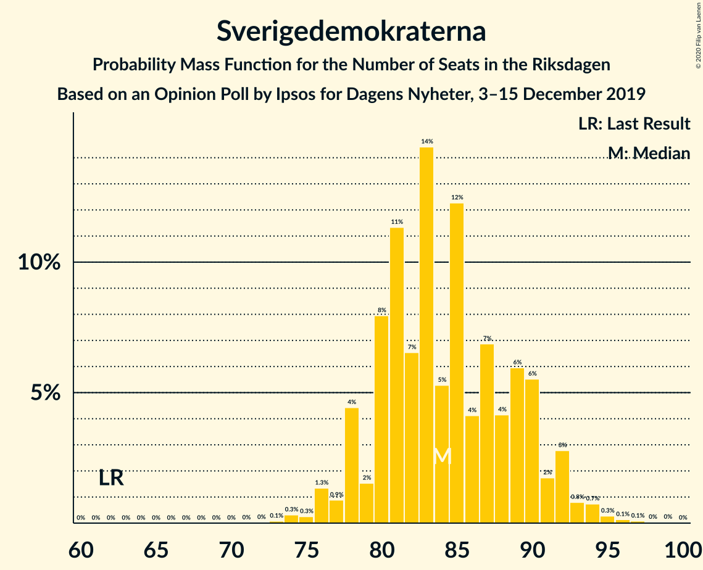
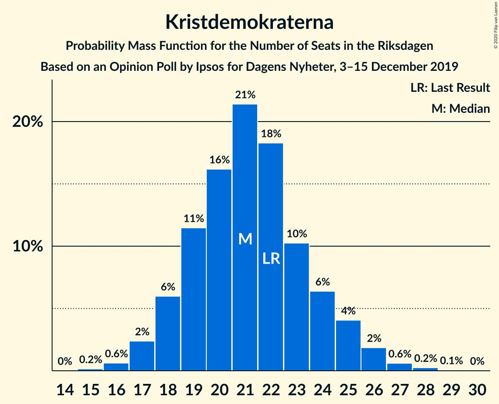
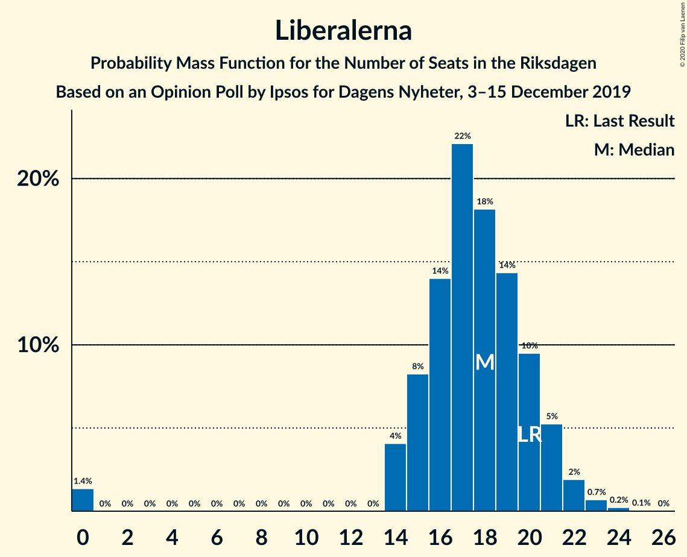
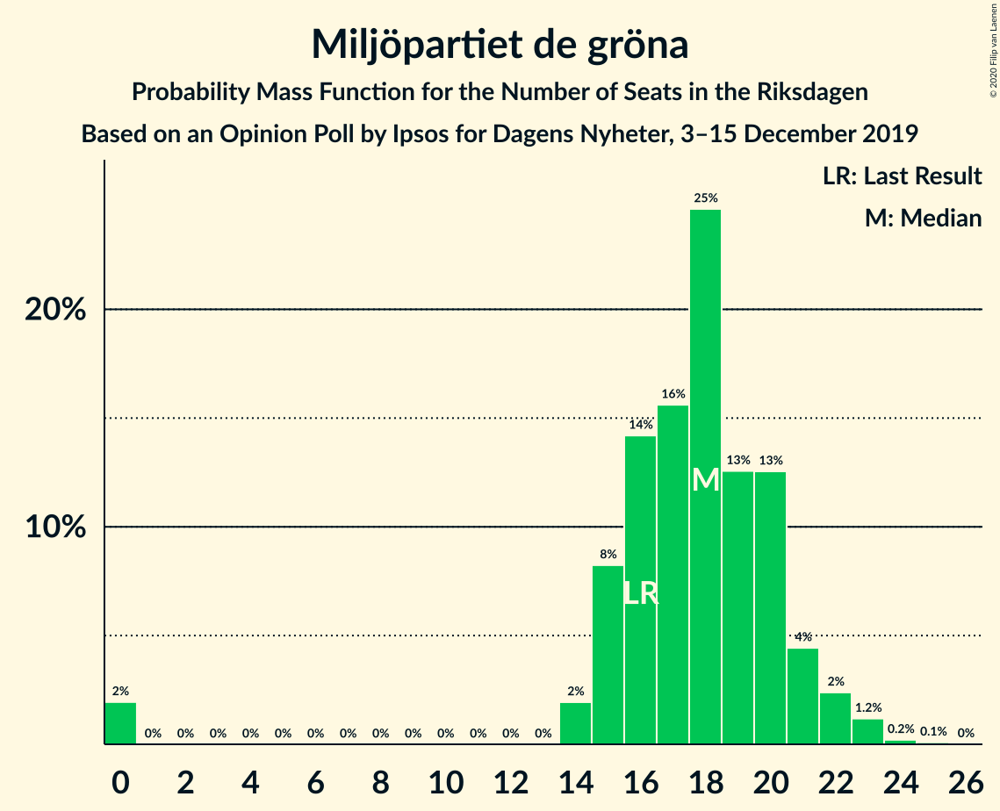
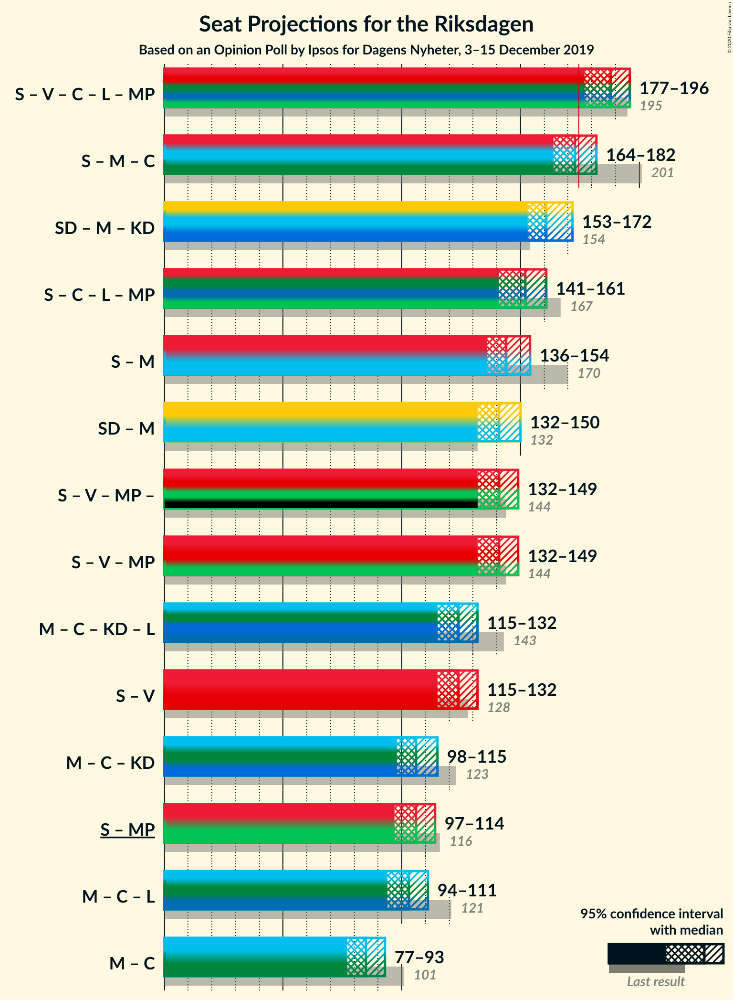
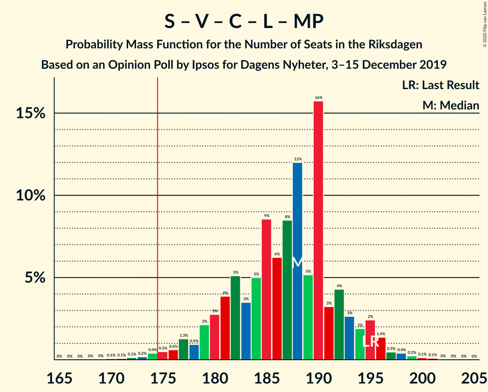
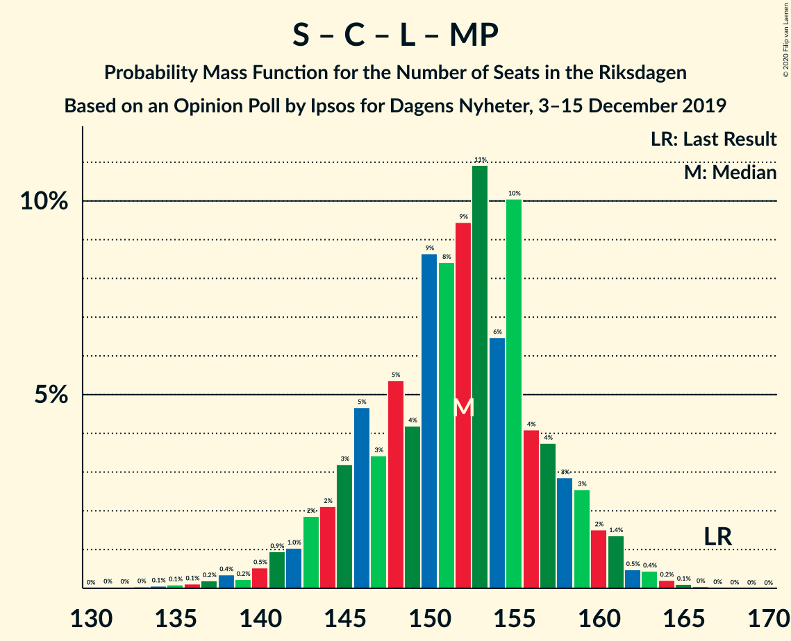
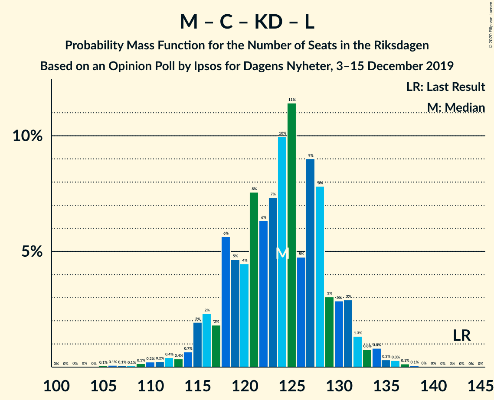
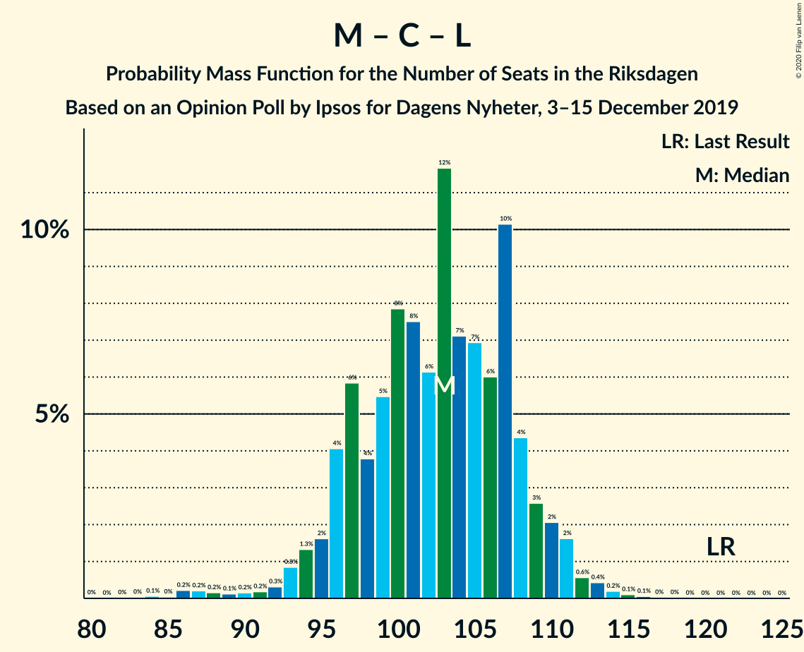

# Opinion Poll by Ipsos for Dagens Nyheter, 3–15 December 2019

<a href="#voting-intentions">Voting Intentions</a> | <a href="#seats">Seats</a> | <a href="#coalitions">Coalitions</a> | <a href="#technical-information">Technical Information</a>

## Voting Intentions

### Confidence Intervals

| Party | Last Result | Poll Result | 80% Confidence Interval | 90% Confidence Interval | 95% Confidence Interval | 99% Confidence Interval |
|:-----:|:-----------:|:-----------:|:-----------------------:|:-----------------------:|:-----------------------:|:-----------------------:|
| Sveriges socialdemokratiska arbetareparti | 28.3% | 25.0% | 23.6–26.4% |23.2–26.9% |22.9–27.2% |22.3–27.9% |
| Sverigedemokraterna | 17.5% | 24.0% | 22.6–25.4% |22.3–25.8% |21.9–26.2% |21.3–26.9% |
| Moderata samlingspartiet | 19.8% | 16.0% | 14.9–17.3% |14.6–17.6% |14.3–17.9% |13.8–18.5% |
| Vänsterpartiet | 8.0% | 10.0% | 9.1–11.0% |8.8–11.3% |8.6–11.6% |8.2–12.1% |
| Centerpartiet | 8.6% | 8.0% | 7.2–9.0% |7.0–9.2% |6.8–9.5% |6.4–9.9% |
| Kristdemokraterna | 6.3% | 6.0% | 5.3–6.8% |5.1–7.1% |4.9–7.3% |4.6–7.7% |
| Liberalerna | 5.5% | 5.0% | 4.4–5.8% |4.2–6.0% |4.0–6.2% |3.8–6.6% |
| Miljöpartiet de gröna | 4.4% | 5.0% | 4.4–5.8% |4.2–6.0% |4.0–6.2% |3.8–6.6% |

*Note:* The poll result column reflects the actual value used in the calculations. Published results may vary slightly, and in addition be rounded to fewer digits.

## Seats

### Confidence Intervals

| Party | Last Result | Median | 80% Confidence Interval | 90% Confidence Interval | 95% Confidence Interval | 99% Confidence Interval |
|:-----:|:-----------:|:------:|:-----------------------:|:-----------------------:|:-----------------------:|:-----------------------:|
| <a href="#sveriges-socialdemokratiska-arbetareparti">Sveriges socialdemokratiska arbetareparti</a> | 100 | 87 | 82–92 |81–94 |79–96 |78–98 |
| <a href="#sverigedemokraterna">Sverigedemokraterna</a> | 62 | 85 | 78–88 |76–90 |76–91 |74–94 |
| <a href="#moderata-samlingspartiet">Moderata samlingspartiet</a> | 70 | 53 | 52–60 |51–61 |50–62 |48–65 |
| <a href="#vänsterpartiet">Vänsterpartiet</a> | 28 | 37 | 33–39 |31–40 |30–40 |29–43 |
| <a href="#centerpartiet">Centerpartiet</a> | 31 | 28 | 26–32 |24–33 |23–34 |23–36 |
| <a href="#kristdemokraterna">Kristdemokraterna</a> | 22 | 21 | 19–25 |19–25 |18–26 |16–27 |
| <a href="#liberalerna">Liberalerna</a> | 20 | 19 | 16–20 |14–21 |14–22 |0–24 |
| <a href="#miljöpartiet-de-gröna">Miljöpartiet de gröna</a> | 16 | 19 | 16–21 |15–22 |14–23 |0–23 |

### Sveriges socialdemokratiska arbetareparti

*For a full overview of the results for this party, see the [Sveriges socialdemokratiska arbetareparti](party-sverigessocialdemokratiskaarbetareparti.html) page.*

| Number of Seats | Probability | Accumulated | Special Marks |
|:---------------:|:-----------:|:-----------:|:-------------:|
| 74 | 0% | 100% |  |
| 75 | 0.1% | 99.9% |  |
| 76 | 0.1% | 99.9% |  |
| 77 | 0.1% | 99.8% |  |
| 78 | 0.2% | 99.7% |  |
| 79 | 2% | 99.5% |  |
| 80 | 0.6% | 97% |  |
| 81 | 3% | 97% |  |
| 82 | 5% | 93% |  |
| 83 | 3% | 88% |  |
| 84 | 4% | 85% |  |
| 85 | 4% | 81% |  |
| 86 | 11% | 77% |  |
| 87 | 34% | 66% | Median |
| 88 | 3% | 32% |  |
| 89 | 6% | 29% |  |
| 90 | 2% | 22% |  |
| 91 | 6% | 21% |  |
| 92 | 5% | 14% |  |
| 93 | 2% | 9% |  |
| 94 | 4% | 7% |  |
| 95 | 0.5% | 3% |  |
| 96 | 1.2% | 3% |  |
| 97 | 0.4% | 1.3% |  |
| 98 | 0.4% | 0.9% |  |
| 99 | 0.3% | 0.5% |  |
| 100 | 0.1% | 0.2% | Last Result |
| 101 | 0.1% | 0.2% |  |
| 102 | 0% | 0.1% |  |
| 103 | 0% | 0% |  |

### Sverigedemokraterna

*For a full overview of the results for this party, see the [Sverigedemokraterna](party-sverigedemokraterna.html) page.*

| Number of Seats | Probability | Accumulated | Special Marks |
|:---------------:|:-----------:|:-----------:|:-------------:|
| 62 | 0% | 100% | Last Result |
| 63 | 0% | 100% |  |
| 64 | 0% | 100% |  |
| 65 | 0% | 100% |  |
| 66 | 0% | 100% |  |
| 67 | 0% | 100% |  |
| 68 | 0% | 100% |  |
| 69 | 0% | 100% |  |
| 70 | 0% | 100% |  |
| 71 | 0% | 100% |  |
| 72 | 0.1% | 100% |  |
| 73 | 0.1% | 99.8% |  |
| 74 | 0.6% | 99.7% |  |
| 75 | 0.5% | 99.1% |  |
| 76 | 4% | 98.6% |  |
| 77 | 2% | 94% |  |
| 78 | 6% | 92% |  |
| 79 | 2% | 86% |  |
| 80 | 3% | 85% |  |
| 81 | 3% | 81% |  |
| 82 | 5% | 78% |  |
| 83 | 13% | 73% |  |
| 84 | 4% | 60% |  |
| 85 | 34% | 56% | Median |
| 86 | 3% | 22% |  |
| 87 | 3% | 19% |  |
| 88 | 6% | 15% |  |
| 89 | 3% | 10% |  |
| 90 | 3% | 6% |  |
| 91 | 2% | 4% |  |
| 92 | 0.8% | 2% |  |
| 93 | 0.6% | 1.3% |  |
| 94 | 0.4% | 0.7% |  |
| 95 | 0.1% | 0.3% |  |
| 96 | 0.1% | 0.2% |  |
| 97 | 0.1% | 0.1% |  |
| 98 | 0% | 0.1% |  |
| 99 | 0% | 0.1% |  |
| 100 | 0% | 0% |  |

### Moderata samlingspartiet

*For a full overview of the results for this party, see the [Moderata samlingspartiet](party-moderatasamlingspartiet.html) page.*

| Number of Seats | Probability | Accumulated | Special Marks |
|:---------------:|:-----------:|:-----------:|:-------------:|
| 46 | 0.1% | 100% |  |
| 47 | 0.1% | 99.8% |  |
| 48 | 1.3% | 99.8% |  |
| 49 | 0.3% | 98% |  |
| 50 | 2% | 98% |  |
| 51 | 5% | 96% |  |
| 52 | 3% | 91% |  |
| 53 | 40% | 89% | Median |
| 54 | 5% | 48% |  |
| 55 | 4% | 43% |  |
| 56 | 10% | 39% |  |
| 57 | 6% | 29% |  |
| 58 | 6% | 23% |  |
| 59 | 6% | 17% |  |
| 60 | 4% | 11% |  |
| 61 | 3% | 8% |  |
| 62 | 2% | 4% |  |
| 63 | 0.6% | 2% |  |
| 64 | 0.6% | 1.3% |  |
| 65 | 0.3% | 0.7% |  |
| 66 | 0.1% | 0.4% |  |
| 67 | 0.2% | 0.3% |  |
| 68 | 0% | 0.1% |  |
| 69 | 0% | 0% |  |
| 70 | 0% | 0% | Last Result |

### Vänsterpartiet

*For a full overview of the results for this party, see the [Vänsterpartiet](party-vänsterpartiet.html) page.*

| Number of Seats | Probability | Accumulated | Special Marks |
|:---------------:|:-----------:|:-----------:|:-------------:|
| 27 | 0% | 100% |  |
| 28 | 0.4% | 99.9% | Last Result |
| 29 | 1.2% | 99.6% |  |
| 30 | 2% | 98% |  |
| 31 | 2% | 96% |  |
| 32 | 4% | 94% |  |
| 33 | 4% | 90% |  |
| 34 | 10% | 87% |  |
| 35 | 12% | 77% |  |
| 36 | 4% | 65% |  |
| 37 | 37% | 60% | Median |
| 38 | 13% | 24% |  |
| 39 | 5% | 11% |  |
| 40 | 4% | 6% |  |
| 41 | 0.6% | 2% |  |
| 42 | 0.9% | 2% |  |
| 43 | 0.4% | 0.7% |  |
| 44 | 0.2% | 0.2% |  |
| 45 | 0% | 0.1% |  |
| 46 | 0% | 0% |  |

### Centerpartiet

*For a full overview of the results for this party, see the [Centerpartiet](party-centerpartiet.html) page.*

| Number of Seats | Probability | Accumulated | Special Marks |
|:---------------:|:-----------:|:-----------:|:-------------:|
| 20 | 0.1% | 100% |  |
| 21 | 0.1% | 99.9% |  |
| 22 | 0.3% | 99.9% |  |
| 23 | 3% | 99.5% |  |
| 24 | 3% | 97% |  |
| 25 | 3% | 94% |  |
| 26 | 6% | 91% |  |
| 27 | 5% | 84% |  |
| 28 | 33% | 79% | Median |
| 29 | 21% | 46% |  |
| 30 | 5% | 25% |  |
| 31 | 8% | 21% | Last Result |
| 32 | 6% | 12% |  |
| 33 | 2% | 6% |  |
| 34 | 2% | 4% |  |
| 35 | 1.0% | 2% |  |
| 36 | 0.7% | 1.0% |  |
| 37 | 0.2% | 0.2% |  |
| 38 | 0.1% | 0.1% |  |
| 39 | 0% | 0% |  |

### Kristdemokraterna

*For a full overview of the results for this party, see the [Kristdemokraterna](party-kristdemokraterna.html) page.*

| Number of Seats | Probability | Accumulated | Special Marks |
|:---------------:|:-----------:|:-----------:|:-------------:|
| 14 | 0.1% | 100% |  |
| 15 | 0.3% | 99.9% |  |
| 16 | 0.3% | 99.7% |  |
| 17 | 1.4% | 99.4% |  |
| 18 | 2% | 98% |  |
| 19 | 9% | 96% |  |
| 20 | 5% | 87% |  |
| 21 | 36% | 82% | Median |
| 22 | 7% | 46% | Last Result |
| 23 | 11% | 40% |  |
| 24 | 10% | 29% |  |
| 25 | 15% | 19% |  |
| 26 | 3% | 4% |  |
| 27 | 0.5% | 0.8% |  |
| 28 | 0.2% | 0.3% |  |
| 29 | 0.1% | 0.2% |  |
| 30 | 0.1% | 0.1% |  |
| 31 | 0% | 0% |  |

### Liberalerna

*For a full overview of the results for this party, see the [Liberalerna](party-liberalerna.html) page.*

| Number of Seats | Probability | Accumulated | Special Marks |
|:---------------:|:-----------:|:-----------:|:-------------:|
| 0 | 2% | 100% |  |
| 1 | 0% | 98% |  |
| 2 | 0% | 98% |  |
| 3 | 0% | 98% |  |
| 4 | 0% | 98% |  |
| 5 | 0% | 98% |  |
| 6 | 0% | 98% |  |
| 7 | 0% | 98% |  |
| 8 | 0% | 98% |  |
| 9 | 0% | 98% |  |
| 10 | 0% | 98% |  |
| 11 | 0% | 98% |  |
| 12 | 0% | 98% |  |
| 13 | 0% | 98% |  |
| 14 | 3% | 98% |  |
| 15 | 3% | 95% |  |
| 16 | 8% | 91% |  |
| 17 | 22% | 84% |  |
| 18 | 11% | 62% |  |
| 19 | 37% | 52% | Median |
| 20 | 6% | 15% | Last Result |
| 21 | 5% | 9% |  |
| 22 | 2% | 4% |  |
| 23 | 2% | 2% |  |
| 24 | 0.5% | 0.5% |  |
| 25 | 0% | 0% |  |

### Miljöpartiet de gröna

*For a full overview of the results for this party, see the [Miljöpartiet de gröna](party-miljöpartietdegröna.html) page.*

| Number of Seats | Probability | Accumulated | Special Marks |
|:---------------:|:-----------:|:-----------:|:-------------:|
| 0 | 1.3% | 100% |  |
| 1 | 0% | 98.7% |  |
| 2 | 0% | 98.7% |  |
| 3 | 0% | 98.7% |  |
| 4 | 0% | 98.7% |  |
| 5 | 0% | 98.7% |  |
| 6 | 0% | 98.7% |  |
| 7 | 0% | 98.7% |  |
| 8 | 0% | 98.7% |  |
| 9 | 0% | 98.7% |  |
| 10 | 0% | 98.7% |  |
| 11 | 0% | 98.7% |  |
| 12 | 0% | 98.7% |  |
| 13 | 0% | 98.7% |  |
| 14 | 3% | 98.7% |  |
| 15 | 2% | 96% |  |
| 16 | 10% | 94% | Last Result |
| 17 | 9% | 84% |  |
| 18 | 16% | 75% |  |
| 19 | 37% | 58% | Median |
| 20 | 8% | 21% |  |
| 21 | 7% | 13% |  |
| 22 | 4% | 6% |  |
| 23 | 2% | 3% |  |
| 24 | 0.4% | 0.5% |  |
| 25 | 0.1% | 0.1% |  |
| 26 | 0% | 0% |  |

## Coalitions

### Confidence Intervals

| Coalition | Last Result | Median | Majority? | 80% Confidence Interval | 90% Confidence Interval | 95% Confidence Interval | 99% Confidence Interval |
|:---------:|:-----------:|:------:|:---------:|:-----------------------:|:-----------------------:|:-----------------------:|:-----------------------:|
| Sveriges socialdemokratiska arbetareparti – Vänsterpartiet – Centerpartiet – Liberalerna – Miljöpartiet de gröna | 195 | 190 | 99.1% | 181–193 | 179–196 | 178–196 | 174–199 |
| Sveriges socialdemokratiska arbetareparti – Moderata samlingspartiet – Centerpartiet | 201 | 168 | 23% | 167–179 | 165–181 | 164–182 | 160–185 |
| Sverigedemokraterna – Moderata samlingspartiet – Kristdemokraterna | 154 | 159 | 0.9% | 156–168 | 153–170 | 153–171 | 150–175 |
| Sveriges socialdemokratiska arbetareparti – Centerpartiet – Liberalerna – Miljöpartiet de gröna | 167 | 153 | 0% | 146–157 | 144–160 | 141–161 | 138–164 |
| Sveriges socialdemokratiska arbetareparti – Moderata samlingspartiet | 170 | 140 | 0% | 138–149 | 136–151 | 134–155 | 133–158 |
| Sveriges socialdemokratiska arbetareparti – Vänsterpartiet – Miljöpartiet de gröna | 144 | 143 | 0% | 136–147 | 133–148 | 131–149 | 128–153 |
| Sverigedemokraterna – Moderata samlingspartiet | 132 | 138 | 0% | 134–145 | 132–148 | 130–149 | 130–155 |
| Moderata samlingspartiet – Centerpartiet – Kristdemokraterna – Liberalerna | 143 | 122 | 0% | 119–130 | 117–133 | 115–133 | 109–136 |
| Sveriges socialdemokratiska arbetareparti – Vänsterpartiet | 128 | 124 | 0% | 117–128 | 115–129 | 113–131 | 112–136 |
| Moderata samlingspartiet – Centerpartiet – Kristdemokraterna | 123 | 105 | 0% | 102–113 | 100–115 | 99–115 | 96–117 |
| Sveriges socialdemokratiska arbetareparti – Miljöpartiet de gröna | 116 | 106 | 0% | 100–111 | 98–112 | 97–114 | 92–116 |
| Moderata samlingspartiet – Centerpartiet – Liberalerna | 121 | 100 | 0% | 97–108 | 95–110 | 94–111 | 86–113 |
| Moderata samlingspartiet – Centerpartiet | 101 | 82 | 0% | 80–90 | 79–91 | 77–93 | 75–95 |

### Sveriges socialdemokratiska arbetareparti – Vänsterpartiet – Centerpartiet – Liberalerna – Miljöpartiet de gröna

| Number of Seats | Probability | Accumulated | Special Marks |
|:---------------:|:-----------:|:-----------:|:-------------:|
| 169 | 0% | 100% |  |
| 170 | 0.1% | 99.9% |  |
| 171 | 0.1% | 99.8% |  |
| 172 | 0.1% | 99.7% |  |
| 173 | 0.1% | 99.7% |  |
| 174 | 0.4% | 99.5% |  |
| 175 | 0.2% | 99.1% | Majority |
| 176 | 0.3% | 98.9% |  |
| 177 | 0.3% | 98.6% |  |
| 178 | 2% | 98% |  |
| 179 | 3% | 97% |  |
| 180 | 0.9% | 93% |  |
| 181 | 3% | 93% |  |
| 182 | 2% | 90% |  |
| 183 | 5% | 87% |  |
| 184 | 2% | 83% |  |
| 185 | 5% | 81% |  |
| 186 | 7% | 77% |  |
| 187 | 2% | 70% |  |
| 188 | 10% | 68% |  |
| 189 | 6% | 58% |  |
| 190 | 33% | 52% | Median |
| 191 | 4% | 20% |  |
| 192 | 5% | 16% |  |
| 193 | 3% | 11% |  |
| 194 | 2% | 9% |  |
| 195 | 2% | 7% | Last Result |
| 196 | 3% | 5% |  |
| 197 | 0.9% | 2% |  |
| 198 | 0.6% | 1.2% |  |
| 199 | 0.2% | 0.6% |  |
| 200 | 0.3% | 0.4% |  |
| 201 | 0.1% | 0.1% |  |
| 202 | 0% | 0.1% |  |
| 203 | 0% | 0% |  |

### Sveriges socialdemokratiska arbetareparti – Moderata samlingspartiet – Centerpartiet

| Number of Seats | Probability | Accumulated | Special Marks |
|:---------------:|:-----------:|:-----------:|:-------------:|
| 157 | 0.1% | 100% |  |
| 158 | 0% | 99.9% |  |
| 159 | 0.1% | 99.9% |  |
| 160 | 0.4% | 99.8% |  |
| 161 | 0.3% | 99.4% |  |
| 162 | 0.3% | 99.1% |  |
| 163 | 1.1% | 98.8% |  |
| 164 | 1.4% | 98% |  |
| 165 | 3% | 96% |  |
| 166 | 2% | 93% |  |
| 167 | 2% | 91% |  |
| 168 | 39% | 88% | Median |
| 169 | 4% | 49% |  |
| 170 | 4% | 45% |  |
| 171 | 7% | 41% |  |
| 172 | 4% | 34% |  |
| 173 | 2% | 30% |  |
| 174 | 5% | 27% |  |
| 175 | 7% | 23% | Majority |
| 176 | 1.2% | 16% |  |
| 177 | 3% | 15% |  |
| 178 | 1.5% | 12% |  |
| 179 | 3% | 11% |  |
| 180 | 2% | 7% |  |
| 181 | 2% | 5% |  |
| 182 | 0.9% | 3% |  |
| 183 | 0.9% | 2% |  |
| 184 | 0.6% | 1.4% |  |
| 185 | 0.3% | 0.8% |  |
| 186 | 0.1% | 0.5% |  |
| 187 | 0% | 0.4% |  |
| 188 | 0% | 0.3% |  |
| 189 | 0% | 0.3% |  |
| 190 | 0.1% | 0.3% |  |
| 191 | 0.1% | 0.2% |  |
| 192 | 0% | 0.1% |  |
| 193 | 0.1% | 0.1% |  |
| 194 | 0% | 0% |  |
| 195 | 0% | 0% |  |
| 196 | 0% | 0% |  |
| 197 | 0% | 0% |  |
| 198 | 0% | 0% |  |
| 199 | 0% | 0% |  |
| 200 | 0% | 0% |  |
| 201 | 0% | 0% | Last Result |

### Sverigedemokraterna – Moderata samlingspartiet – Kristdemokraterna

| Number of Seats | Probability | Accumulated | Special Marks |
|:---------------:|:-----------:|:-----------:|:-------------:|
| 147 | 0% | 100% |  |
| 148 | 0.1% | 99.9% |  |
| 149 | 0.3% | 99.9% |  |
| 150 | 0.2% | 99.6% |  |
| 151 | 0.6% | 99.4% |  |
| 152 | 0.9% | 98.8% |  |
| 153 | 3% | 98% |  |
| 154 | 2% | 95% | Last Result |
| 155 | 2% | 93% |  |
| 156 | 3% | 91% |  |
| 157 | 5% | 89% |  |
| 158 | 4% | 84% |  |
| 159 | 33% | 80% | Median |
| 160 | 6% | 48% |  |
| 161 | 10% | 42% |  |
| 162 | 2% | 32% |  |
| 163 | 7% | 30% |  |
| 164 | 5% | 23% |  |
| 165 | 2% | 19% |  |
| 166 | 5% | 17% |  |
| 167 | 2% | 13% |  |
| 168 | 3% | 10% |  |
| 169 | 0.9% | 7% |  |
| 170 | 3% | 7% |  |
| 171 | 2% | 3% |  |
| 172 | 0.3% | 2% |  |
| 173 | 0.3% | 1.4% |  |
| 174 | 0.2% | 1.1% |  |
| 175 | 0.4% | 0.9% | Majority |
| 176 | 0.1% | 0.5% |  |
| 177 | 0.1% | 0.3% |  |
| 178 | 0.1% | 0.3% |  |
| 179 | 0.1% | 0.2% |  |
| 180 | 0% | 0.1% |  |
| 181 | 0% | 0% |  |

### Sveriges socialdemokratiska arbetareparti – Centerpartiet – Liberalerna – Miljöpartiet de gröna

| Number of Seats | Probability | Accumulated | Special Marks |
|:---------------:|:-----------:|:-----------:|:-------------:|
| 132 | 0.1% | 100% |  |
| 133 | 0% | 99.9% |  |
| 134 | 0% | 99.9% |  |
| 135 | 0% | 99.8% |  |
| 136 | 0.1% | 99.8% |  |
| 137 | 0% | 99.7% |  |
| 138 | 0.2% | 99.6% |  |
| 139 | 0.2% | 99.5% |  |
| 140 | 0.5% | 99.3% |  |
| 141 | 1.4% | 98.8% |  |
| 142 | 0.3% | 97% |  |
| 143 | 0.8% | 97% |  |
| 144 | 3% | 96% |  |
| 145 | 4% | 94% |  |
| 146 | 3% | 90% |  |
| 147 | 3% | 88% |  |
| 148 | 4% | 85% |  |
| 149 | 1.4% | 81% |  |
| 150 | 12% | 79% |  |
| 151 | 2% | 68% |  |
| 152 | 8% | 65% |  |
| 153 | 33% | 57% | Median |
| 154 | 2% | 24% |  |
| 155 | 6% | 22% |  |
| 156 | 4% | 17% |  |
| 157 | 4% | 13% |  |
| 158 | 1.4% | 8% |  |
| 159 | 1.4% | 7% |  |
| 160 | 0.7% | 6% |  |
| 161 | 3% | 5% |  |
| 162 | 0.2% | 2% |  |
| 163 | 0.6% | 2% |  |
| 164 | 0.7% | 1.0% |  |
| 165 | 0.2% | 0.3% |  |
| 166 | 0% | 0.1% |  |
| 167 | 0% | 0% | Last Result |

### Sveriges socialdemokratiska arbetareparti – Moderata samlingspartiet

| Number of Seats | Probability | Accumulated | Special Marks |
|:---------------:|:-----------:|:-----------:|:-------------:|
| 130 | 0% | 100% |  |
| 131 | 0.1% | 99.9% |  |
| 132 | 0.2% | 99.8% |  |
| 133 | 0.8% | 99.7% |  |
| 134 | 2% | 98.8% |  |
| 135 | 1.0% | 97% |  |
| 136 | 3% | 96% |  |
| 137 | 2% | 93% |  |
| 138 | 3% | 91% |  |
| 139 | 10% | 88% |  |
| 140 | 35% | 79% | Median |
| 141 | 4% | 44% |  |
| 142 | 5% | 39% |  |
| 143 | 3% | 35% |  |
| 144 | 4% | 32% |  |
| 145 | 3% | 28% |  |
| 146 | 4% | 25% |  |
| 147 | 3% | 21% |  |
| 148 | 7% | 18% |  |
| 149 | 2% | 11% |  |
| 150 | 3% | 9% |  |
| 151 | 0.6% | 5% |  |
| 152 | 1.4% | 5% |  |
| 153 | 0.3% | 3% |  |
| 154 | 0.5% | 3% |  |
| 155 | 1.2% | 3% |  |
| 156 | 0.5% | 1.4% |  |
| 157 | 0.4% | 1.0% |  |
| 158 | 0.2% | 0.6% |  |
| 159 | 0% | 0.4% |  |
| 160 | 0.1% | 0.4% |  |
| 161 | 0% | 0.2% |  |
| 162 | 0.1% | 0.2% |  |
| 163 | 0.1% | 0.1% |  |
| 164 | 0% | 0% |  |
| 165 | 0% | 0% |  |
| 166 | 0% | 0% |  |
| 167 | 0% | 0% |  |
| 168 | 0% | 0% |  |
| 169 | 0% | 0% |  |
| 170 | 0% | 0% | Last Result |

### Sveriges socialdemokratiska arbetareparti – Vänsterpartiet – Miljöpartiet de gröna

| Number of Seats | Probability | Accumulated | Special Marks |
|:---------------:|:-----------:|:-----------:|:-------------:|
| 123 | 0% | 100% |  |
| 124 | 0% | 99.9% |  |
| 125 | 0% | 99.9% |  |
| 126 | 0% | 99.9% |  |
| 127 | 0.2% | 99.9% |  |
| 128 | 0.4% | 99.7% |  |
| 129 | 0.5% | 99.3% |  |
| 130 | 0.2% | 98.8% |  |
| 131 | 1.3% | 98.6% |  |
| 132 | 1.3% | 97% |  |
| 133 | 2% | 96% |  |
| 134 | 2% | 94% |  |
| 135 | 2% | 92% |  |
| 136 | 2% | 90% |  |
| 137 | 7% | 88% |  |
| 138 | 3% | 81% |  |
| 139 | 1.2% | 78% |  |
| 140 | 5% | 77% |  |
| 141 | 7% | 72% |  |
| 142 | 10% | 66% |  |
| 143 | 32% | 55% | Median |
| 144 | 4% | 23% | Last Result |
| 145 | 2% | 19% |  |
| 146 | 6% | 17% |  |
| 147 | 4% | 11% |  |
| 148 | 3% | 7% |  |
| 149 | 2% | 4% |  |
| 150 | 0.6% | 2% |  |
| 151 | 0.6% | 1.5% |  |
| 152 | 0.2% | 0.9% |  |
| 153 | 0.5% | 0.7% |  |
| 154 | 0.1% | 0.2% |  |
| 155 | 0% | 0.1% |  |
| 156 | 0% | 0.1% |  |
| 157 | 0% | 0.1% |  |
| 158 | 0% | 0% |  |

### Sverigedemokraterna – Moderata samlingspartiet

| Number of Seats | Probability | Accumulated | Special Marks |
|:---------------:|:-----------:|:-----------:|:-------------:|
| 127 | 0.1% | 100% |  |
| 128 | 0.1% | 99.9% |  |
| 129 | 0.2% | 99.8% |  |
| 130 | 3% | 99.6% |  |
| 131 | 0.7% | 96% |  |
| 132 | 2% | 96% | Last Result |
| 133 | 3% | 94% |  |
| 134 | 4% | 91% |  |
| 135 | 8% | 87% |  |
| 136 | 10% | 79% |  |
| 137 | 4% | 69% |  |
| 138 | 30% | 65% | Median |
| 139 | 3% | 35% |  |
| 140 | 2% | 32% |  |
| 141 | 3% | 30% |  |
| 142 | 3% | 27% |  |
| 143 | 7% | 25% |  |
| 144 | 5% | 18% |  |
| 145 | 5% | 13% |  |
| 146 | 2% | 8% |  |
| 147 | 0.8% | 6% |  |
| 148 | 1.0% | 5% |  |
| 149 | 2% | 4% |  |
| 150 | 0.4% | 2% |  |
| 151 | 0.2% | 2% |  |
| 152 | 0.3% | 1.3% |  |
| 153 | 0.4% | 1.0% |  |
| 154 | 0.1% | 0.6% |  |
| 155 | 0.3% | 0.5% |  |
| 156 | 0.1% | 0.3% |  |
| 157 | 0% | 0.2% |  |
| 158 | 0% | 0.1% |  |
| 159 | 0% | 0.1% |  |
| 160 | 0% | 0.1% |  |
| 161 | 0% | 0% |  |

### Moderata samlingspartiet – Centerpartiet – Kristdemokraterna – Liberalerna

| Number of Seats | Probability | Accumulated | Special Marks |
|:---------------:|:-----------:|:-----------:|:-------------:|
| 105 | 0.3% | 100% |  |
| 106 | 0% | 99.7% |  |
| 107 | 0.1% | 99.6% |  |
| 108 | 0% | 99.5% |  |
| 109 | 0.1% | 99.5% |  |
| 110 | 0.1% | 99.4% |  |
| 111 | 0.1% | 99.3% |  |
| 112 | 0.2% | 99.2% |  |
| 113 | 0.5% | 99.0% |  |
| 114 | 0.3% | 98.5% |  |
| 115 | 1.0% | 98% |  |
| 116 | 0.5% | 97% |  |
| 117 | 3% | 97% |  |
| 118 | 2% | 94% |  |
| 119 | 5% | 92% |  |
| 120 | 4% | 87% |  |
| 121 | 32% | 83% | Median |
| 122 | 2% | 51% |  |
| 123 | 2% | 48% |  |
| 124 | 12% | 46% |  |
| 125 | 4% | 33% |  |
| 126 | 3% | 30% |  |
| 127 | 8% | 27% |  |
| 128 | 3% | 18% |  |
| 129 | 2% | 15% |  |
| 130 | 4% | 13% |  |
| 131 | 3% | 9% |  |
| 132 | 0.9% | 6% |  |
| 133 | 3% | 5% |  |
| 134 | 0.6% | 2% |  |
| 135 | 1.1% | 2% |  |
| 136 | 0.2% | 0.6% |  |
| 137 | 0.3% | 0.4% |  |
| 138 | 0.1% | 0.1% |  |
| 139 | 0% | 0.1% |  |
| 140 | 0% | 0% |  |
| 141 | 0% | 0% |  |
| 142 | 0% | 0% |  |
| 143 | 0% | 0% | Last Result |

### Sveriges socialdemokratiska arbetareparti – Vänsterpartiet

| Number of Seats | Probability | Accumulated | Special Marks |
|:---------------:|:-----------:|:-----------:|:-------------:|
| 111 | 0.4% | 100% |  |
| 112 | 0.1% | 99.6% |  |
| 113 | 3% | 99.4% |  |
| 114 | 1.3% | 97% |  |
| 115 | 4% | 95% |  |
| 116 | 2% | 92% |  |
| 117 | 3% | 90% |  |
| 118 | 2% | 87% |  |
| 119 | 0.8% | 86% |  |
| 120 | 3% | 85% |  |
| 121 | 4% | 82% |  |
| 122 | 5% | 79% |  |
| 123 | 4% | 73% |  |
| 124 | 38% | 70% | Median |
| 125 | 4% | 31% |  |
| 126 | 11% | 27% |  |
| 127 | 6% | 17% |  |
| 128 | 5% | 11% | Last Result |
| 129 | 2% | 6% |  |
| 130 | 0.4% | 3% |  |
| 131 | 1.1% | 3% |  |
| 132 | 0.1% | 2% |  |
| 133 | 0.5% | 2% |  |
| 134 | 0.5% | 1.1% |  |
| 135 | 0.1% | 0.6% |  |
| 136 | 0.3% | 0.5% |  |
| 137 | 0.1% | 0.2% |  |
| 138 | 0% | 0.1% |  |
| 139 | 0% | 0.1% |  |
| 140 | 0% | 0% |  |

### Moderata samlingspartiet – Centerpartiet – Kristdemokraterna

| Number of Seats | Probability | Accumulated | Special Marks |
|:---------------:|:-----------:|:-----------:|:-------------:|
| 93 | 0.1% | 100% |  |
| 94 | 0% | 99.9% |  |
| 95 | 0.1% | 99.9% |  |
| 96 | 0.4% | 99.8% |  |
| 97 | 0.2% | 99.4% |  |
| 98 | 0.5% | 99.2% |  |
| 99 | 4% | 98.7% |  |
| 100 | 0.6% | 95% |  |
| 101 | 4% | 95% |  |
| 102 | 29% | 90% | Median |
| 103 | 5% | 61% |  |
| 104 | 5% | 56% |  |
| 105 | 4% | 51% |  |
| 106 | 4% | 47% |  |
| 107 | 14% | 43% |  |
| 108 | 5% | 29% |  |
| 109 | 4% | 24% |  |
| 110 | 5% | 20% |  |
| 111 | 3% | 16% |  |
| 112 | 2% | 13% |  |
| 113 | 5% | 11% |  |
| 114 | 0.5% | 6% |  |
| 115 | 4% | 6% |  |
| 116 | 1.3% | 2% |  |
| 117 | 0.3% | 0.7% |  |
| 118 | 0.2% | 0.4% |  |
| 119 | 0.1% | 0.2% |  |
| 120 | 0% | 0.2% |  |
| 121 | 0.1% | 0.1% |  |
| 122 | 0% | 0.1% |  |
| 123 | 0% | 0% | Last Result |

### Sveriges socialdemokratiska arbetareparti – Miljöpartiet de gröna

| Number of Seats | Probability | Accumulated | Special Marks |
|:---------------:|:-----------:|:-----------:|:-------------:|
| 87 | 0% | 100% |  |
| 88 | 0.2% | 99.9% |  |
| 89 | 0.1% | 99.8% |  |
| 90 | 0% | 99.6% |  |
| 91 | 0% | 99.6% |  |
| 92 | 0.2% | 99.6% |  |
| 93 | 0.1% | 99.4% |  |
| 94 | 0.3% | 99.3% |  |
| 95 | 0.3% | 99.1% |  |
| 96 | 0.6% | 98.8% |  |
| 97 | 1.3% | 98% |  |
| 98 | 2% | 97% |  |
| 99 | 3% | 95% |  |
| 100 | 3% | 92% |  |
| 101 | 4% | 90% |  |
| 102 | 6% | 86% |  |
| 103 | 4% | 80% |  |
| 104 | 10% | 76% |  |
| 105 | 4% | 66% |  |
| 106 | 34% | 62% | Median |
| 107 | 7% | 28% |  |
| 108 | 1.4% | 21% |  |
| 109 | 3% | 20% |  |
| 110 | 3% | 17% |  |
| 111 | 5% | 13% |  |
| 112 | 4% | 8% |  |
| 113 | 1.0% | 5% |  |
| 114 | 2% | 4% |  |
| 115 | 1.5% | 2% |  |
| 116 | 0.4% | 0.7% | Last Result |
| 117 | 0.1% | 0.3% |  |
| 118 | 0.1% | 0.2% |  |
| 119 | 0.1% | 0.1% |  |
| 120 | 0% | 0.1% |  |
| 121 | 0% | 0% |  |

### Moderata samlingspartiet – Centerpartiet – Liberalerna

| Number of Seats | Probability | Accumulated | Special Marks |
|:---------------:|:-----------:|:-----------:|:-------------:|
| 83 | 0% | 100% |  |
| 84 | 0% | 99.9% |  |
| 85 | 0.1% | 99.9% |  |
| 86 | 0.4% | 99.8% |  |
| 87 | 0.1% | 99.5% |  |
| 88 | 0.4% | 99.4% |  |
| 89 | 0.8% | 98.9% |  |
| 90 | 0% | 98% |  |
| 91 | 0.1% | 98% |  |
| 92 | 0.2% | 98% |  |
| 93 | 0.2% | 98% |  |
| 94 | 2% | 98% |  |
| 95 | 2% | 96% |  |
| 96 | 3% | 94% |  |
| 97 | 2% | 92% |  |
| 98 | 6% | 89% |  |
| 99 | 8% | 83% |  |
| 100 | 30% | 75% | Median |
| 101 | 7% | 45% |  |
| 102 | 4% | 38% |  |
| 103 | 5% | 34% |  |
| 104 | 9% | 29% |  |
| 105 | 4% | 20% |  |
| 106 | 1.5% | 16% |  |
| 107 | 3% | 14% |  |
| 108 | 4% | 12% |  |
| 109 | 2% | 8% |  |
| 110 | 2% | 6% |  |
| 111 | 2% | 4% |  |
| 112 | 0.7% | 2% |  |
| 113 | 0.6% | 1.0% |  |
| 114 | 0.1% | 0.4% |  |
| 115 | 0.2% | 0.2% |  |
| 116 | 0% | 0.1% |  |
| 117 | 0% | 0% |  |
| 118 | 0% | 0% |  |
| 119 | 0% | 0% |  |
| 120 | 0% | 0% |  |
| 121 | 0% | 0% | Last Result |

### Moderata samlingspartiet – Centerpartiet

| Number of Seats | Probability | Accumulated | Special Marks |
|:---------------:|:-----------:|:-----------:|:-------------:|
| 73 | 0.1% | 100% |  |
| 74 | 0.1% | 99.9% |  |
| 75 | 0.7% | 99.8% |  |
| 76 | 0.3% | 99.1% |  |
| 77 | 1.4% | 98.8% |  |
| 78 | 0.4% | 97% |  |
| 79 | 3% | 97% |  |
| 80 | 6% | 94% |  |
| 81 | 31% | 88% | Median |
| 82 | 12% | 57% |  |
| 83 | 6% | 45% |  |
| 84 | 6% | 39% |  |
| 85 | 2% | 33% |  |
| 86 | 5% | 31% |  |
| 87 | 7% | 26% |  |
| 88 | 7% | 19% |  |
| 89 | 2% | 12% |  |
| 90 | 4% | 10% |  |
| 91 | 2% | 6% |  |
| 92 | 0.9% | 4% |  |
| 93 | 1.2% | 3% |  |
| 94 | 1.4% | 2% |  |
| 95 | 0.5% | 0.8% |  |
| 96 | 0.1% | 0.3% |  |
| 97 | 0.1% | 0.2% |  |
| 98 | 0% | 0.1% |  |
| 99 | 0% | 0% |  |
| 100 | 0% | 0% |  |
| 101 | 0% | 0% | Last Result |

## Technical Information

### Opinion Poll

+ **Polling firm:** Ipsos
+ **Commissioner(s):** Dagens Nyheter
+ **Fieldwork period:** 3–15 December 2019

### Calculations

+ **Sample size:** 1572
+ **Simulations done:** 131,072
+ **Error estimate:** 1.11%

