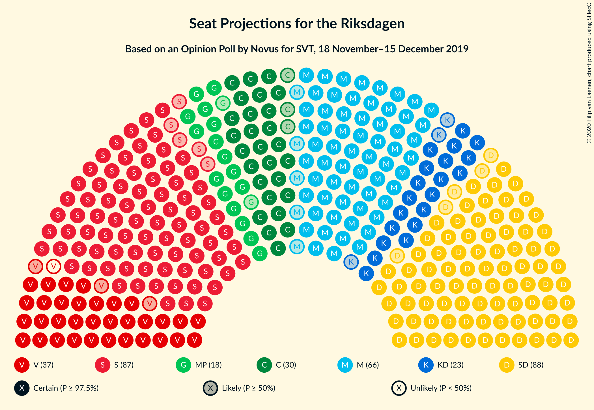
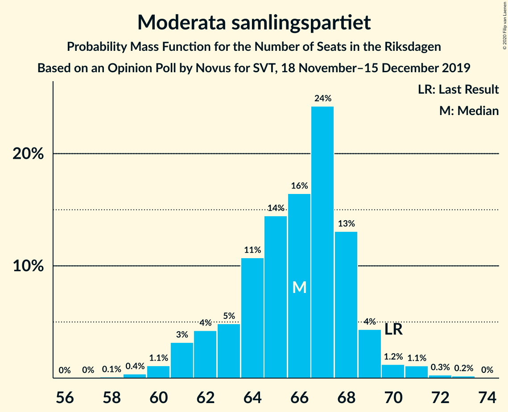
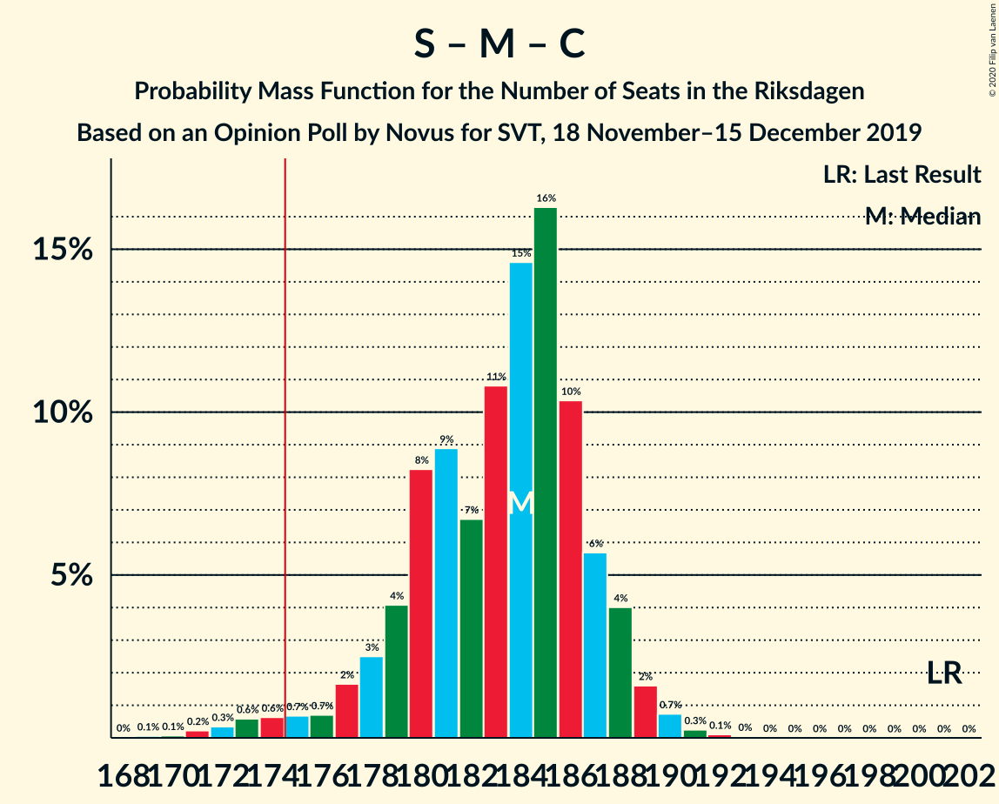
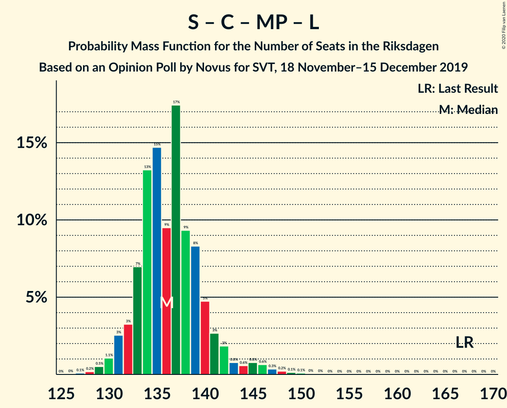

# Opinion Poll by Novus for SVT, 18 November–15 December 2019

<a href="#voting-intentions">Voting Intentions</a> | <a href="#seats">Seats</a> | <a href="#coalitions">Coalitions</a> | <a href="#technical-information">Technical Information</a>

## Voting Intentions

### Confidence Intervals

| Party | Last Result | Poll Result | 80% Confidence Interval | 90% Confidence Interval | 95% Confidence Interval | 99% Confidence Interval |
|:-----:|:-----------:|:-----------:|:-----------------------:|:-----------------------:|:-----------------------:|:-----------------------:|
| Sverigedemokraterna | 17.5% | 24.0% | 23.2–24.9% |22.9–25.1% |22.7–25.4% |22.3–25.8% |
| Sveriges socialdemokratiska arbetareparti | 28.3% | 23.7% | 22.9–24.6% |22.6–24.8% |22.4–25.1% |22.0–25.5% |
| Moderata samlingspartiet | 19.8% | 17.9% | 17.1–18.7% |16.9–18.9% |16.7–19.1% |16.4–19.5% |
| Vänsterpartiet | 8.0% | 9.9% | 9.3–10.5% |9.1–10.7% |9.0–10.9% |8.7–11.2% |
| Centerpartiet | 8.6% | 8.3% | 7.8–8.9% |7.6–9.1% |7.5–9.2% |7.2–9.5% |
| Kristdemokraterna | 6.3% | 6.2% | 5.7–6.7% |5.6–6.9% |5.5–7.0% |5.3–7.3% |
| Miljöpartiet de gröna | 4.4% | 5.0% | 4.6–5.5% |4.5–5.6% |4.4–5.7% |4.2–6.0% |
| Liberalerna | 5.5% | 3.5% | 3.2–3.9% |3.0–4.0% |3.0–4.1% |2.8–4.3% |

*Note:* The poll result column reflects the actual value used in the calculations. Published results may vary slightly, and in addition be rounded to fewer digits.

## Seats

### Confidence Intervals

| Party | Last Result | Median | 80% Confidence Interval | 90% Confidence Interval | 95% Confidence Interval | 99% Confidence Interval |
|:-----:|:-----------:|:------:|:-----------------------:|:-----------------------:|:-----------------------:|:-----------------------:|
| <a href="#sverigedemokraterna">Sverigedemokraterna</a> | 62 | 88 | 85–91 |84–92 |83–93 |81–94 |
| <a href="#sveriges-socialdemokratiska-arbetareparti">Sveriges socialdemokratiska arbetareparti</a> | 100 | 87 | 84–90 |83–91 |82–92 |79–93 |
| <a href="#moderata-samlingspartiet">Moderata samlingspartiet</a> | 70 | 66 | 63–68 |62–69 |61–70 |59–72 |
| <a href="#vänsterpartiet">Vänsterpartiet</a> | 28 | 36 | 34–38 |33–39 |33–40 |32–41 |
| <a href="#centerpartiet">Centerpartiet</a> | 31 | 30 | 28–33 |28–33 |27–34 |26–35 |
| <a href="#kristdemokraterna">Kristdemokraterna</a> | 22 | 23 | 21–24 |21–25 |20–25 |19–27 |
| <a href="#miljöpartiet-de-gröna">Miljöpartiet de gröna</a> | 16 | 18 | 17–20 |16–20 |16–21 |15–22 |
| <a href="#liberalerna">Liberalerna</a> | 20 | 0 | 0 |0 |0–15 |0–15 |

### Sverigedemokraterna

*For a full overview of the results for this party, see the [Sverigedemokraterna](party-sverigedemokraterna.html) page.*

| Number of Seats | Probability | Accumulated | Special Marks |
|:---------------:|:-----------:|:-----------:|:-------------:|
| 62 | 0% | 100% | Last Result |
| 63 | 0% | 100% |  |
| 64 | 0% | 100% |  |
| 65 | 0% | 100% |  |
| 66 | 0% | 100% |  |
| 67 | 0% | 100% |  |
| 68 | 0% | 100% |  |
| 69 | 0% | 100% |  |
| 70 | 0% | 100% |  |
| 71 | 0% | 100% |  |
| 72 | 0% | 100% |  |
| 73 | 0% | 100% |  |
| 74 | 0% | 100% |  |
| 75 | 0% | 100% |  |
| 76 | 0% | 100% |  |
| 77 | 0% | 100% |  |
| 78 | 0% | 100% |  |
| 79 | 0.1% | 100% |  |
| 80 | 0.1% | 99.9% |  |
| 81 | 0.4% | 99.7% |  |
| 82 | 0.9% | 99.4% |  |
| 83 | 3% | 98% |  |
| 84 | 4% | 96% |  |
| 85 | 10% | 92% |  |
| 86 | 12% | 82% |  |
| 87 | 16% | 70% |  |
| 88 | 15% | 54% | Median |
| 89 | 15% | 39% |  |
| 90 | 14% | 24% |  |
| 91 | 4% | 10% |  |
| 92 | 3% | 6% |  |
| 93 | 2% | 3% |  |
| 94 | 0.5% | 1.0% |  |
| 95 | 0.3% | 0.5% |  |
| 96 | 0.1% | 0.1% |  |
| 97 | 0% | 0% |  |

### Sveriges socialdemokratiska arbetareparti

*For a full overview of the results for this party, see the [Sveriges socialdemokratiska arbetareparti](party-sverigessocialdemokratiskaarbetareparti.html) page.*

| Number of Seats | Probability | Accumulated | Special Marks |
|:---------------:|:-----------:|:-----------:|:-------------:|
| 78 | 0.1% | 100% |  |
| 79 | 0.4% | 99.9% |  |
| 80 | 0.7% | 99.4% |  |
| 81 | 1.1% | 98.8% |  |
| 82 | 3% | 98% |  |
| 83 | 4% | 95% |  |
| 84 | 5% | 91% |  |
| 85 | 13% | 85% |  |
| 86 | 16% | 72% |  |
| 87 | 17% | 56% | Median |
| 88 | 12% | 39% |  |
| 89 | 13% | 27% |  |
| 90 | 6% | 14% |  |
| 91 | 4% | 7% |  |
| 92 | 2% | 3% |  |
| 93 | 0.8% | 1.2% |  |
| 94 | 0.2% | 0.3% |  |
| 95 | 0.1% | 0.1% |  |
| 96 | 0% | 0% |  |
| 97 | 0% | 0% |  |
| 98 | 0% | 0% |  |
| 99 | 0% | 0% |  |
| 100 | 0% | 0% | Last Result |

### Moderata samlingspartiet

*For a full overview of the results for this party, see the [Moderata samlingspartiet](party-moderatasamlingspartiet.html) page.*

| Number of Seats | Probability | Accumulated | Special Marks |
|:---------------:|:-----------:|:-----------:|:-------------:|
| 58 | 0.1% | 100% |  |
| 59 | 0.4% | 99.9% |  |
| 60 | 1.1% | 99.5% |  |
| 61 | 3% | 98% |  |
| 62 | 4% | 95% |  |
| 63 | 5% | 91% |  |
| 64 | 11% | 86% |  |
| 65 | 14% | 75% |  |
| 66 | 16% | 61% | Median |
| 67 | 24% | 44% |  |
| 68 | 13% | 20% |  |
| 69 | 4% | 7% |  |
| 70 | 1.2% | 3% | Last Result |
| 71 | 1.1% | 2% |  |
| 72 | 0.3% | 0.5% |  |
| 73 | 0.2% | 0.2% |  |
| 74 | 0% | 0% |  |

### Vänsterpartiet

*For a full overview of the results for this party, see the [Vänsterpartiet](party-vänsterpartiet.html) page.*

| Number of Seats | Probability | Accumulated | Special Marks |
|:---------------:|:-----------:|:-----------:|:-------------:|
| 28 | 0% | 100% | Last Result |
| 29 | 0% | 100% |  |
| 30 | 0% | 100% |  |
| 31 | 0.2% | 100% |  |
| 32 | 1.0% | 99.7% |  |
| 33 | 5% | 98.7% |  |
| 34 | 13% | 94% |  |
| 35 | 13% | 82% |  |
| 36 | 19% | 69% | Median |
| 37 | 29% | 50% |  |
| 38 | 12% | 21% |  |
| 39 | 6% | 9% |  |
| 40 | 2% | 3% |  |
| 41 | 0.4% | 0.6% |  |
| 42 | 0.1% | 0.1% |  |
| 43 | 0% | 0% |  |

### Centerpartiet

*For a full overview of the results for this party, see the [Centerpartiet](party-centerpartiet.html) page.*

| Number of Seats | Probability | Accumulated | Special Marks |
|:---------------:|:-----------:|:-----------:|:-------------:|
| 25 | 0.1% | 100% |  |
| 26 | 0.6% | 99.9% |  |
| 27 | 3% | 99.3% |  |
| 28 | 7% | 97% |  |
| 29 | 17% | 89% |  |
| 30 | 23% | 72% | Median |
| 31 | 21% | 50% | Last Result |
| 32 | 18% | 29% |  |
| 33 | 8% | 11% |  |
| 34 | 2% | 3% |  |
| 35 | 0.5% | 0.6% |  |
| 36 | 0.1% | 0.1% |  |
| 37 | 0% | 0% |  |

### Kristdemokraterna

*For a full overview of the results for this party, see the [Kristdemokraterna](party-kristdemokraterna.html) page.*

| Number of Seats | Probability | Accumulated | Special Marks |
|:---------------:|:-----------:|:-----------:|:-------------:|
| 19 | 0.6% | 100% |  |
| 20 | 4% | 99.4% |  |
| 21 | 11% | 96% |  |
| 22 | 26% | 84% | Last Result |
| 23 | 29% | 58% | Median |
| 24 | 21% | 29% |  |
| 25 | 6% | 9% |  |
| 26 | 2% | 2% |  |
| 27 | 0.5% | 0.6% |  |
| 28 | 0.1% | 0.1% |  |
| 29 | 0% | 0% |  |

### Miljöpartiet de gröna

*For a full overview of the results for this party, see the [Miljöpartiet de gröna](party-miljöpartietdegröna.html) page.*

| Number of Seats | Probability | Accumulated | Special Marks |
|:---------------:|:-----------:|:-----------:|:-------------:|
| 0 | 0.1% | 100% |  |
| 1 | 0% | 99.9% |  |
| 2 | 0% | 99.9% |  |
| 3 | 0% | 99.9% |  |
| 4 | 0% | 99.9% |  |
| 5 | 0% | 99.9% |  |
| 6 | 0% | 99.9% |  |
| 7 | 0% | 99.9% |  |
| 8 | 0% | 99.9% |  |
| 9 | 0% | 99.9% |  |
| 10 | 0% | 99.9% |  |
| 11 | 0% | 99.9% |  |
| 12 | 0% | 99.9% |  |
| 13 | 0% | 99.9% |  |
| 14 | 0% | 99.9% |  |
| 15 | 0.7% | 99.9% |  |
| 16 | 5% | 99.2% | Last Result |
| 17 | 21% | 94% |  |
| 18 | 28% | 74% | Median |
| 19 | 26% | 46% |  |
| 20 | 15% | 20% |  |
| 21 | 4% | 5% |  |
| 22 | 0.9% | 1.0% |  |
| 23 | 0.1% | 0.1% |  |
| 24 | 0% | 0% |  |

### Liberalerna

*For a full overview of the results for this party, see the [Liberalerna](party-liberalerna.html) page.*

| Number of Seats | Probability | Accumulated | Special Marks |
|:---------------:|:-----------:|:-----------:|:-------------:|
| 0 | 96% | 100% | Median |
| 1 | 0% | 4% |  |
| 2 | 0% | 4% |  |
| 3 | 0% | 4% |  |
| 4 | 0% | 4% |  |
| 5 | 0% | 4% |  |
| 6 | 0% | 4% |  |
| 7 | 0% | 4% |  |
| 8 | 0% | 4% |  |
| 9 | 0% | 4% |  |
| 10 | 0% | 4% |  |
| 11 | 0% | 4% |  |
| 12 | 0% | 4% |  |
| 13 | 0% | 4% |  |
| 14 | 2% | 4% |  |
| 15 | 2% | 3% |  |
| 16 | 0.4% | 0.4% |  |
| 17 | 0% | 0% |  |
| 18 | 0% | 0% |  |
| 19 | 0% | 0% |  |
| 20 | 0% | 0% | Last Result |

## Coalitions

### Confidence Intervals

| Coalition | Last Result | Median | Majority? | 80% Confidence Interval | 90% Confidence Interval | 95% Confidence Interval | 99% Confidence Interval |
|:---------:|:-----------:|:------:|:---------:|:-----------------------:|:-----------------------:|:-----------------------:|:-----------------------:|
| Sveriges socialdemokratiska arbetareparti – Moderata samlingspartiet – Centerpartiet | 201 | 184 | 98% | 179–187 | 177–188 | 175–189 | 172–190 |
| Sverigedemokraterna – Moderata samlingspartiet – Kristdemokraterna | 154 | 177 | 76% | 173–180 | 171–181 | 170–182 | 167–184 |
| Sveriges socialdemokratiska arbetareparti – Vänsterpartiet – Centerpartiet – Miljöpartiet de gröna – Liberalerna | 195 | 172 | 24% | 169–176 | 168–178 | 167–179 | 165–182 |
| Sverigedemokraterna – Moderata samlingspartiet | 132 | 154 | 0% | 150–157 | 149–158 | 147–159 | 144–161 |
| Sveriges socialdemokratiska arbetareparti – Moderata samlingspartiet | 170 | 153 | 0% | 149–156 | 147–157 | 146–158 | 142–160 |
| Sveriges socialdemokratiska arbetareparti – Vänsterpartiet – Miljöpartiet de gröna | 144 | 142 | 0% | 138–145 | 136–146 | 134–147 | 132–149 |
| Sveriges socialdemokratiska arbetareparti – Centerpartiet – Miljöpartiet de gröna – Liberalerna | 167 | 136 | 0% | 133–140 | 132–142 | 131–144 | 129–148 |
| Moderata samlingspartiet – Centerpartiet – Kristdemokraterna – Liberalerna | 143 | 120 | 0% | 116–123 | 115–125 | 114–129 | 112–132 |
| Sveriges socialdemokratiska arbetareparti – Vänsterpartiet | 128 | 123 | 0% | 119–127 | 118–128 | 117–128 | 114–130 |
| Moderata samlingspartiet – Centerpartiet – Kristdemokraterna | 123 | 120 | 0% | 115–122 | 114–123 | 113–124 | 111–126 |
| Sveriges socialdemokratiska arbetareparti – Miljöpartiet de gröna | 116 | 105 | 0% | 102–108 | 101–109 | 99–111 | 97–112 |
| Moderata samlingspartiet – Centerpartiet – Liberalerna | 121 | 97 | 0% | 93–100 | 92–102 | 92–107 | 90–110 |
| Moderata samlingspartiet – Centerpartiet | 101 | 97 | 0% | 93–99 | 92–100 | 91–101 | 88–103 |

### Sveriges socialdemokratiska arbetareparti – Moderata samlingspartiet – Centerpartiet

| Number of Seats | Probability | Accumulated | Special Marks |
|:---------------:|:-----------:|:-----------:|:-------------:|
| 169 | 0.1% | 100% |  |
| 170 | 0.1% | 99.9% |  |
| 171 | 0.2% | 99.8% |  |
| 172 | 0.3% | 99.6% |  |
| 173 | 0.6% | 99.3% |  |
| 174 | 0.6% | 98.7% |  |
| 175 | 0.7% | 98% | Majority |
| 176 | 0.7% | 97% |  |
| 177 | 2% | 97% |  |
| 178 | 3% | 95% |  |
| 179 | 4% | 92% |  |
| 180 | 8% | 88% |  |
| 181 | 9% | 80% |  |
| 182 | 7% | 71% |  |
| 183 | 11% | 65% | Median |
| 184 | 15% | 54% |  |
| 185 | 16% | 39% |  |
| 186 | 10% | 23% |  |
| 187 | 6% | 12% |  |
| 188 | 4% | 7% |  |
| 189 | 2% | 3% |  |
| 190 | 0.7% | 1.2% |  |
| 191 | 0.3% | 0.4% |  |
| 192 | 0.1% | 0.2% |  |
| 193 | 0% | 0.1% |  |
| 194 | 0% | 0% |  |
| 195 | 0% | 0% |  |
| 196 | 0% | 0% |  |
| 197 | 0% | 0% |  |
| 198 | 0% | 0% |  |
| 199 | 0% | 0% |  |
| 200 | 0% | 0% |  |
| 201 | 0% | 0% | Last Result |

### Sverigedemokraterna – Moderata samlingspartiet – Kristdemokraterna

| Number of Seats | Probability | Accumulated | Special Marks |
|:---------------:|:-----------:|:-----------:|:-------------:|
| 154 | 0% | 100% | Last Result |
| 155 | 0% | 100% |  |
| 156 | 0% | 100% |  |
| 157 | 0% | 100% |  |
| 158 | 0% | 100% |  |
| 159 | 0% | 100% |  |
| 160 | 0% | 100% |  |
| 161 | 0% | 100% |  |
| 162 | 0% | 100% |  |
| 163 | 0.1% | 100% |  |
| 164 | 0.1% | 99.9% |  |
| 165 | 0.2% | 99.9% |  |
| 166 | 0.2% | 99.7% |  |
| 167 | 0.4% | 99.5% |  |
| 168 | 0.5% | 99.2% |  |
| 169 | 0.9% | 98.7% |  |
| 170 | 1.5% | 98% |  |
| 171 | 2% | 96% |  |
| 172 | 4% | 95% |  |
| 173 | 5% | 91% |  |
| 174 | 10% | 86% |  |
| 175 | 15% | 76% | Majority |
| 176 | 11% | 62% |  |
| 177 | 12% | 50% | Median |
| 178 | 17% | 38% |  |
| 179 | 8% | 21% |  |
| 180 | 7% | 13% |  |
| 181 | 3% | 6% |  |
| 182 | 2% | 4% |  |
| 183 | 0.7% | 1.5% |  |
| 184 | 0.5% | 0.7% |  |
| 185 | 0.1% | 0.3% |  |
| 186 | 0.1% | 0.1% |  |
| 187 | 0% | 0.1% |  |
| 188 | 0% | 0% |  |

### Sveriges socialdemokratiska arbetareparti – Vänsterpartiet – Centerpartiet – Miljöpartiet de gröna – Liberalerna

| Number of Seats | Probability | Accumulated | Special Marks |
|:---------------:|:-----------:|:-----------:|:-------------:|
| 162 | 0% | 100% |  |
| 163 | 0.1% | 99.9% |  |
| 164 | 0.1% | 99.9% |  |
| 165 | 0.5% | 99.7% |  |
| 166 | 0.7% | 99.3% |  |
| 167 | 2% | 98.5% |  |
| 168 | 3% | 96% |  |
| 169 | 7% | 94% |  |
| 170 | 8% | 87% |  |
| 171 | 17% | 79% | Median |
| 172 | 12% | 62% |  |
| 173 | 11% | 50% |  |
| 174 | 15% | 38% |  |
| 175 | 10% | 24% | Majority |
| 176 | 5% | 14% |  |
| 177 | 4% | 9% |  |
| 178 | 2% | 5% |  |
| 179 | 1.5% | 4% |  |
| 180 | 0.9% | 2% |  |
| 181 | 0.5% | 1.3% |  |
| 182 | 0.4% | 0.8% |  |
| 183 | 0.2% | 0.5% |  |
| 184 | 0.2% | 0.3% |  |
| 185 | 0.1% | 0.1% |  |
| 186 | 0.1% | 0.1% |  |
| 187 | 0% | 0% |  |
| 188 | 0% | 0% |  |
| 189 | 0% | 0% |  |
| 190 | 0% | 0% |  |
| 191 | 0% | 0% |  |
| 192 | 0% | 0% |  |
| 193 | 0% | 0% |  |
| 194 | 0% | 0% |  |
| 195 | 0% | 0% | Last Result |

### Sverigedemokraterna – Moderata samlingspartiet

| Number of Seats | Probability | Accumulated | Special Marks |
|:---------------:|:-----------:|:-----------:|:-------------:|
| 132 | 0% | 100% | Last Result |
| 133 | 0% | 100% |  |
| 134 | 0% | 100% |  |
| 135 | 0% | 100% |  |
| 136 | 0% | 100% |  |
| 137 | 0% | 100% |  |
| 138 | 0% | 100% |  |
| 139 | 0% | 100% |  |
| 140 | 0% | 100% |  |
| 141 | 0% | 100% |  |
| 142 | 0.1% | 99.9% |  |
| 143 | 0.2% | 99.9% |  |
| 144 | 0.2% | 99.7% |  |
| 145 | 0.4% | 99.5% |  |
| 146 | 0.7% | 99.1% |  |
| 147 | 1.3% | 98% |  |
| 148 | 1.5% | 97% |  |
| 149 | 4% | 96% |  |
| 150 | 5% | 92% |  |
| 151 | 7% | 87% |  |
| 152 | 17% | 79% |  |
| 153 | 9% | 63% |  |
| 154 | 13% | 54% | Median |
| 155 | 19% | 41% |  |
| 156 | 5% | 21% |  |
| 157 | 8% | 16% |  |
| 158 | 4% | 8% |  |
| 159 | 1.4% | 4% |  |
| 160 | 1.4% | 2% |  |
| 161 | 0.5% | 0.7% |  |
| 162 | 0.1% | 0.3% |  |
| 163 | 0.1% | 0.1% |  |
| 164 | 0% | 0% |  |

### Sveriges socialdemokratiska arbetareparti – Moderata samlingspartiet

| Number of Seats | Probability | Accumulated | Special Marks |
|:---------------:|:-----------:|:-----------:|:-------------:|
| 140 | 0% | 100% |  |
| 141 | 0.2% | 99.9% |  |
| 142 | 0.2% | 99.7% |  |
| 143 | 0.5% | 99.5% |  |
| 144 | 0.7% | 99.0% |  |
| 145 | 0.8% | 98% |  |
| 146 | 1.1% | 98% |  |
| 147 | 2% | 96% |  |
| 148 | 2% | 94% |  |
| 149 | 5% | 92% |  |
| 150 | 5% | 86% |  |
| 151 | 13% | 82% |  |
| 152 | 10% | 69% |  |
| 153 | 18% | 58% | Median |
| 154 | 12% | 41% |  |
| 155 | 14% | 28% |  |
| 156 | 6% | 15% |  |
| 157 | 5% | 8% |  |
| 158 | 2% | 4% |  |
| 159 | 1.2% | 2% |  |
| 160 | 0.5% | 0.7% |  |
| 161 | 0.1% | 0.2% |  |
| 162 | 0.1% | 0.1% |  |
| 163 | 0% | 0% |  |
| 164 | 0% | 0% |  |
| 165 | 0% | 0% |  |
| 166 | 0% | 0% |  |
| 167 | 0% | 0% |  |
| 168 | 0% | 0% |  |
| 169 | 0% | 0% |  |
| 170 | 0% | 0% | Last Result |

### Sveriges socialdemokratiska arbetareparti – Vänsterpartiet – Miljöpartiet de gröna

| Number of Seats | Probability | Accumulated | Special Marks |
|:---------------:|:-----------:|:-----------:|:-------------:|
| 129 | 0% | 100% |  |
| 130 | 0% | 99.9% |  |
| 131 | 0.2% | 99.9% |  |
| 132 | 0.7% | 99.7% |  |
| 133 | 0.7% | 99.0% |  |
| 134 | 0.9% | 98% |  |
| 135 | 1.4% | 97% |  |
| 136 | 1.4% | 96% |  |
| 137 | 3% | 95% |  |
| 138 | 5% | 92% |  |
| 139 | 9% | 87% |  |
| 140 | 8% | 77% |  |
| 141 | 12% | 69% | Median |
| 142 | 24% | 57% |  |
| 143 | 10% | 33% |  |
| 144 | 9% | 23% | Last Result |
| 145 | 8% | 14% |  |
| 146 | 3% | 7% |  |
| 147 | 2% | 4% |  |
| 148 | 1.1% | 2% |  |
| 149 | 0.4% | 0.7% |  |
| 150 | 0.2% | 0.3% |  |
| 151 | 0% | 0.1% |  |
| 152 | 0% | 0% |  |

### Sveriges socialdemokratiska arbetareparti – Centerpartiet – Miljöpartiet de gröna – Liberalerna

| Number of Seats | Probability | Accumulated | Special Marks |
|:---------------:|:-----------:|:-----------:|:-------------:|
| 126 | 0% | 100% |  |
| 127 | 0.1% | 99.9% |  |
| 128 | 0.2% | 99.8% |  |
| 129 | 0.5% | 99.7% |  |
| 130 | 1.1% | 99.2% |  |
| 131 | 3% | 98% |  |
| 132 | 3% | 96% |  |
| 133 | 7% | 92% |  |
| 134 | 13% | 85% |  |
| 135 | 15% | 72% | Median |
| 136 | 9% | 57% |  |
| 137 | 17% | 48% |  |
| 138 | 9% | 30% |  |
| 139 | 8% | 21% |  |
| 140 | 5% | 13% |  |
| 141 | 3% | 8% |  |
| 142 | 2% | 5% |  |
| 143 | 0.8% | 4% |  |
| 144 | 0.6% | 3% |  |
| 145 | 0.8% | 2% |  |
| 146 | 0.6% | 1.5% |  |
| 147 | 0.3% | 0.9% |  |
| 148 | 0.2% | 0.5% |  |
| 149 | 0.1% | 0.3% |  |
| 150 | 0.1% | 0.2% |  |
| 151 | 0% | 0.1% |  |
| 152 | 0% | 0% |  |
| 153 | 0% | 0% |  |
| 154 | 0% | 0% |  |
| 155 | 0% | 0% |  |
| 156 | 0% | 0% |  |
| 157 | 0% | 0% |  |
| 158 | 0% | 0% |  |
| 159 | 0% | 0% |  |
| 160 | 0% | 0% |  |
| 161 | 0% | 0% |  |
| 162 | 0% | 0% |  |
| 163 | 0% | 0% |  |
| 164 | 0% | 0% |  |
| 165 | 0% | 0% |  |
| 166 | 0% | 0% |  |
| 167 | 0% | 0% | Last Result |

### Moderata samlingspartiet – Centerpartiet – Kristdemokraterna – Liberalerna

| Number of Seats | Probability | Accumulated | Special Marks |
|:---------------:|:-----------:|:-----------:|:-------------:|
| 111 | 0.2% | 100% |  |
| 112 | 0.8% | 99.8% |  |
| 113 | 1.0% | 99.0% |  |
| 114 | 2% | 98% |  |
| 115 | 5% | 96% |  |
| 116 | 8% | 91% |  |
| 117 | 10% | 84% |  |
| 118 | 7% | 73% |  |
| 119 | 6% | 66% | Median |
| 120 | 18% | 60% |  |
| 121 | 20% | 42% |  |
| 122 | 12% | 22% |  |
| 123 | 2% | 10% |  |
| 124 | 2% | 8% |  |
| 125 | 1.3% | 6% |  |
| 126 | 1.1% | 5% |  |
| 127 | 0.5% | 4% |  |
| 128 | 0.4% | 3% |  |
| 129 | 0.5% | 3% |  |
| 130 | 0.3% | 2% |  |
| 131 | 0.9% | 2% |  |
| 132 | 0.6% | 0.9% |  |
| 133 | 0.2% | 0.4% |  |
| 134 | 0.1% | 0.2% |  |
| 135 | 0.1% | 0.1% |  |
| 136 | 0% | 0% |  |
| 137 | 0% | 0% |  |
| 138 | 0% | 0% |  |
| 139 | 0% | 0% |  |
| 140 | 0% | 0% |  |
| 141 | 0% | 0% |  |
| 142 | 0% | 0% |  |
| 143 | 0% | 0% | Last Result |

### Sveriges socialdemokratiska arbetareparti – Vänsterpartiet

| Number of Seats | Probability | Accumulated | Special Marks |
|:---------------:|:-----------:|:-----------:|:-------------:|
| 112 | 0% | 100% |  |
| 113 | 0.1% | 99.9% |  |
| 114 | 0.4% | 99.8% |  |
| 115 | 0.6% | 99.4% |  |
| 116 | 0.8% | 98.7% |  |
| 117 | 2% | 98% |  |
| 118 | 2% | 96% |  |
| 119 | 6% | 94% |  |
| 120 | 6% | 88% |  |
| 121 | 8% | 83% |  |
| 122 | 10% | 75% |  |
| 123 | 19% | 65% | Median |
| 124 | 15% | 45% |  |
| 125 | 10% | 30% |  |
| 126 | 10% | 20% |  |
| 127 | 5% | 10% |  |
| 128 | 3% | 5% | Last Result |
| 129 | 1.4% | 2% |  |
| 130 | 0.7% | 1.0% |  |
| 131 | 0.2% | 0.4% |  |
| 132 | 0.1% | 0.1% |  |
| 133 | 0% | 0.1% |  |
| 134 | 0% | 0% |  |

### Moderata samlingspartiet – Centerpartiet – Kristdemokraterna

| Number of Seats | Probability | Accumulated | Special Marks |
|:---------------:|:-----------:|:-----------:|:-------------:|
| 109 | 0.1% | 100% |  |
| 110 | 0.2% | 99.8% |  |
| 111 | 0.6% | 99.6% |  |
| 112 | 1.2% | 99.0% |  |
| 113 | 1.4% | 98% |  |
| 114 | 2% | 96% |  |
| 115 | 5% | 94% |  |
| 116 | 9% | 89% |  |
| 117 | 11% | 80% |  |
| 118 | 7% | 70% |  |
| 119 | 7% | 62% | Median |
| 120 | 18% | 56% |  |
| 121 | 20% | 38% |  |
| 122 | 12% | 18% |  |
| 123 | 2% | 6% | Last Result |
| 124 | 2% | 4% |  |
| 125 | 1.0% | 2% |  |
| 126 | 0.7% | 0.9% |  |
| 127 | 0.2% | 0.2% |  |
| 128 | 0% | 0.1% |  |
| 129 | 0% | 0% |  |

### Sveriges socialdemokratiska arbetareparti – Miljöpartiet de gröna

| Number of Seats | Probability | Accumulated | Special Marks |
|:---------------:|:-----------:|:-----------:|:-------------:|
| 93 | 0% | 100% |  |
| 94 | 0% | 99.9% |  |
| 95 | 0% | 99.9% |  |
| 96 | 0.1% | 99.9% |  |
| 97 | 0.8% | 99.7% |  |
| 98 | 0.6% | 98.9% |  |
| 99 | 1.0% | 98% |  |
| 100 | 2% | 97% |  |
| 101 | 2% | 95% |  |
| 102 | 11% | 93% |  |
| 103 | 4% | 83% |  |
| 104 | 11% | 78% |  |
| 105 | 28% | 68% | Median |
| 106 | 7% | 40% |  |
| 107 | 10% | 33% |  |
| 108 | 15% | 23% |  |
| 109 | 4% | 8% |  |
| 110 | 2% | 5% |  |
| 111 | 1.4% | 3% |  |
| 112 | 1.0% | 1.2% |  |
| 113 | 0.1% | 0.2% |  |
| 114 | 0.1% | 0.1% |  |
| 115 | 0% | 0% |  |
| 116 | 0% | 0% | Last Result |

### Moderata samlingspartiet – Centerpartiet – Liberalerna

| Number of Seats | Probability | Accumulated | Special Marks |
|:---------------:|:-----------:|:-----------:|:-------------:|
| 88 | 0.1% | 100% |  |
| 89 | 0.2% | 99.9% |  |
| 90 | 0.2% | 99.7% |  |
| 91 | 1.1% | 99.4% |  |
| 92 | 5% | 98% |  |
| 93 | 13% | 93% |  |
| 94 | 7% | 80% |  |
| 95 | 3% | 73% |  |
| 96 | 6% | 70% | Median |
| 97 | 16% | 64% |  |
| 98 | 22% | 48% |  |
| 99 | 15% | 26% |  |
| 100 | 3% | 10% |  |
| 101 | 1.0% | 7% |  |
| 102 | 1.1% | 6% |  |
| 103 | 0.9% | 5% |  |
| 104 | 0.5% | 4% |  |
| 105 | 0.5% | 4% |  |
| 106 | 0.3% | 3% |  |
| 107 | 0.5% | 3% |  |
| 108 | 0.9% | 2% |  |
| 109 | 0.7% | 1.3% |  |
| 110 | 0.3% | 0.6% |  |
| 111 | 0.1% | 0.3% |  |
| 112 | 0.1% | 0.2% |  |
| 113 | 0.1% | 0.1% |  |
| 114 | 0% | 0% |  |
| 115 | 0% | 0% |  |
| 116 | 0% | 0% |  |
| 117 | 0% | 0% |  |
| 118 | 0% | 0% |  |
| 119 | 0% | 0% |  |
| 120 | 0% | 0% |  |
| 121 | 0% | 0% | Last Result |

### Moderata samlingspartiet – Centerpartiet

| Number of Seats | Probability | Accumulated | Special Marks |
|:---------------:|:-----------:|:-----------:|:-------------:|
| 87 | 0.1% | 100% |  |
| 88 | 0.4% | 99.8% |  |
| 89 | 0.4% | 99.5% |  |
| 90 | 0.6% | 99.0% |  |
| 91 | 1.4% | 98% |  |
| 92 | 6% | 97% |  |
| 93 | 14% | 91% |  |
| 94 | 8% | 77% |  |
| 95 | 3% | 69% |  |
| 96 | 6% | 66% | Median |
| 97 | 16% | 60% |  |
| 98 | 23% | 44% |  |
| 99 | 15% | 21% |  |
| 100 | 3% | 6% |  |
| 101 | 1.0% | 3% | Last Result |
| 102 | 0.9% | 2% |  |
| 103 | 0.7% | 0.9% |  |
| 104 | 0.2% | 0.3% |  |
| 105 | 0.1% | 0.1% |  |
| 106 | 0% | 0% |  |

## Technical Information

### Opinion Poll

+ **Polling firm:** Novus
+ **Commissioner(s):** SVT
+ **Fieldwork period:** 18 November–15 December 2019

### Calculations

+ **Sample size:** 3994
+ **Simulations done:** 1,048,576
+ **Error estimate:** 0.53%

