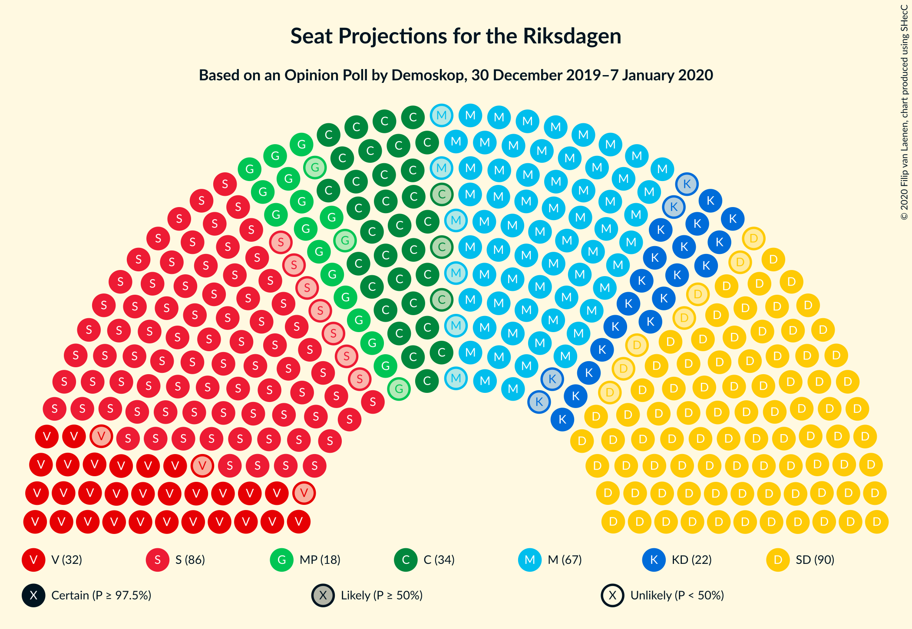
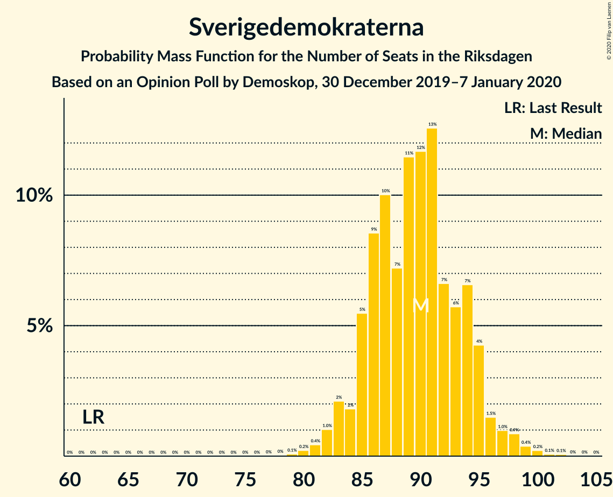
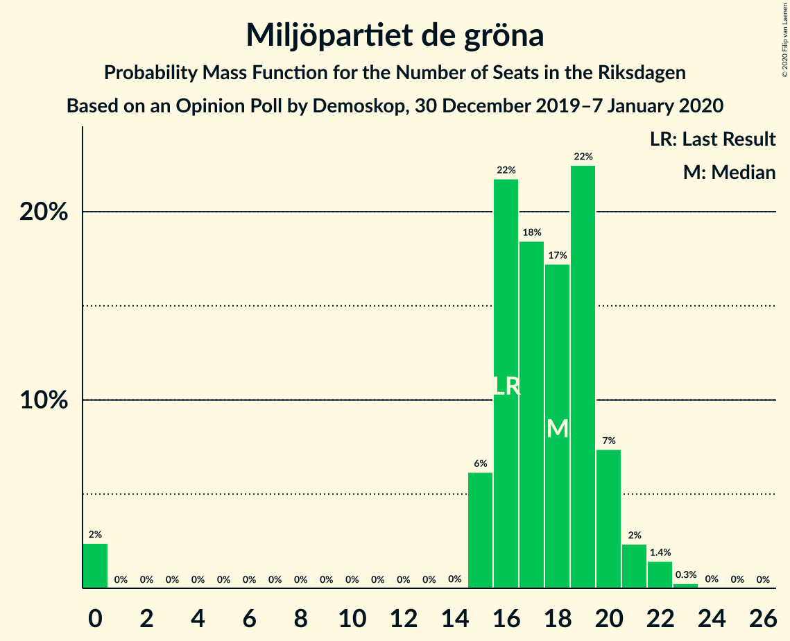
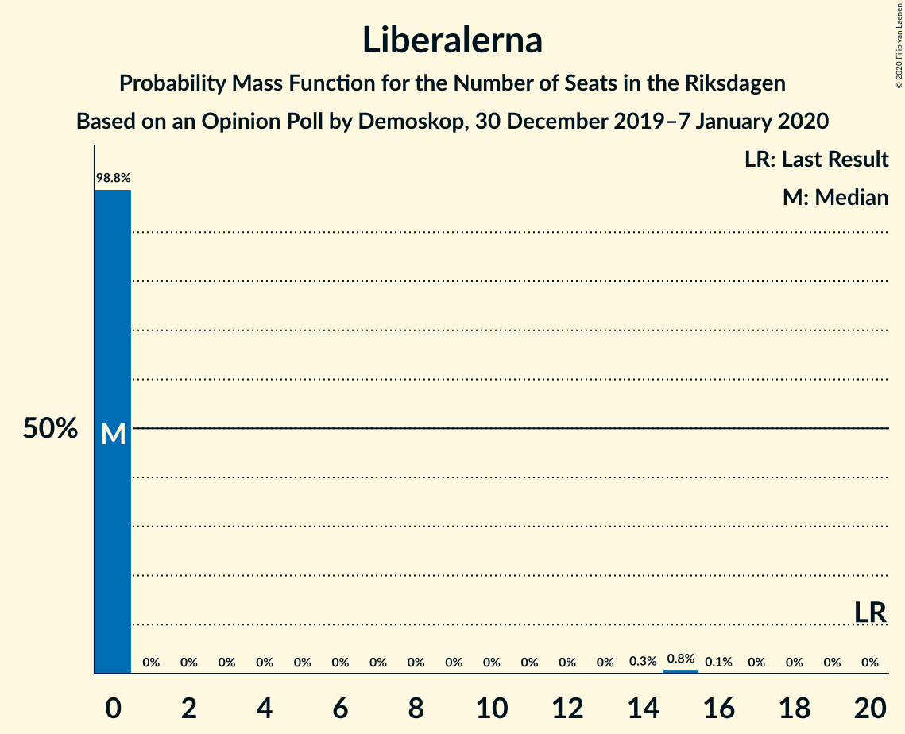
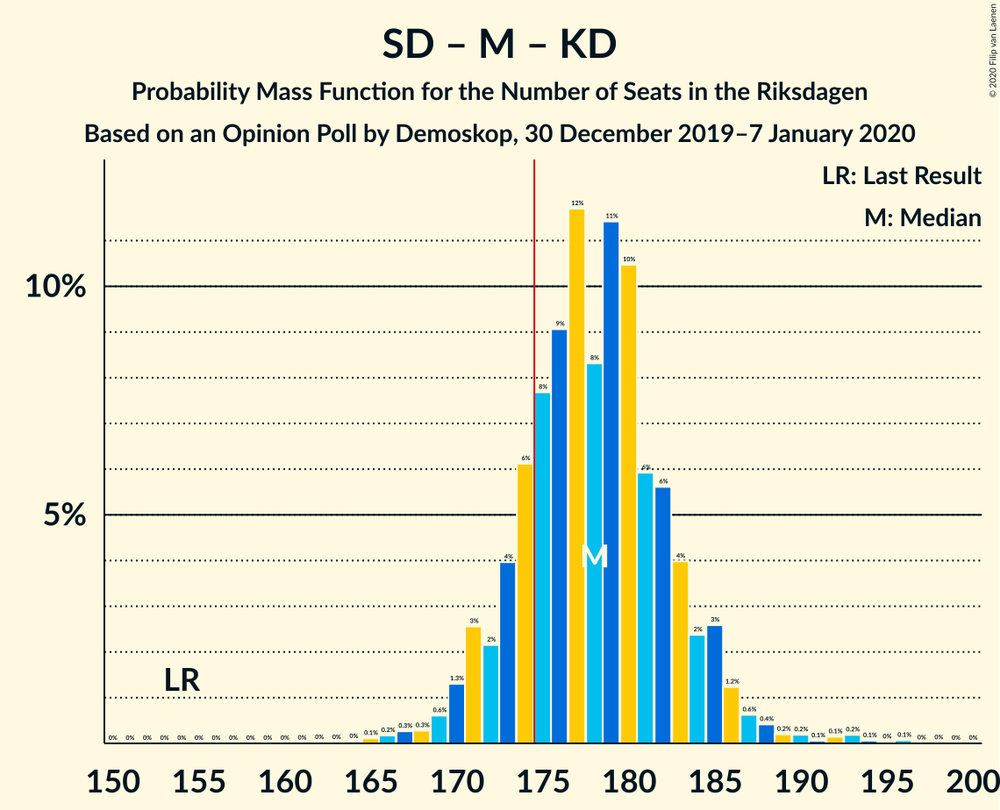
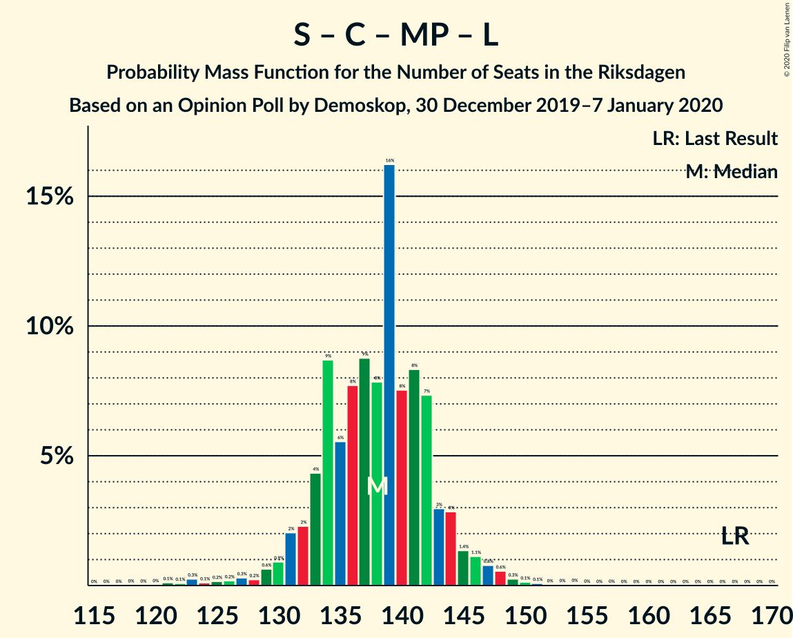
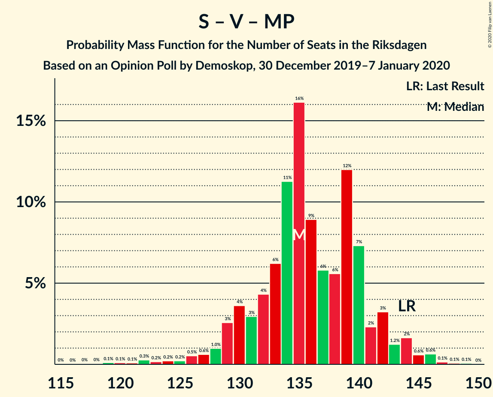
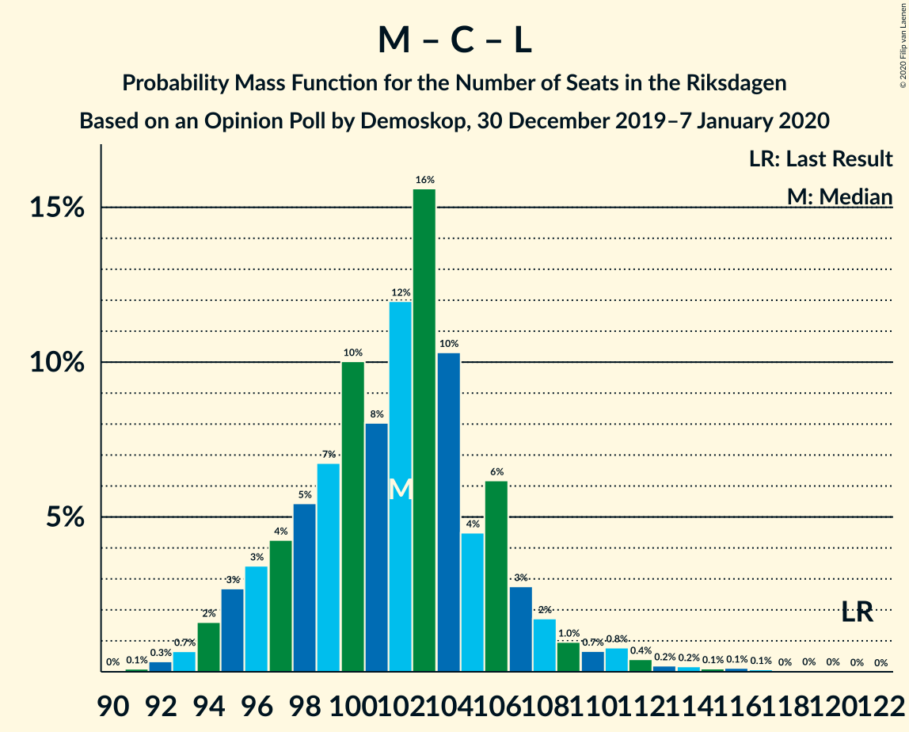

# Opinion Poll by Demoskop, 30 December 2019–7 January 2020

<a href="#voting-intentions">Voting Intentions</a> | <a href="#seats">Seats</a> | <a href="#coalitions">Coalitions</a> | <a href="#technical-information">Technical Information</a>

## Voting Intentions

### Confidence Intervals

| Party | Last Result | Poll Result | 80% Confidence Interval | 90% Confidence Interval | 95% Confidence Interval | 99% Confidence Interval |
|:-----:|:-----------:|:-----------:|:-----------------------:|:-----------------------:|:-----------------------:|:-----------------------:|
| Sverigedemokraterna | 17.5% | 24.5% | 23.3–25.7% |23.0–26.1% |22.7–26.4% |22.1–27.0% |
| Sveriges socialdemokratiska arbetareparti | 28.3% | 23.4% | 22.2–24.6% |21.9–25.0% |21.6–25.3% |21.1–25.8% |
| Moderata samlingspartiet | 19.8% | 18.2% | 17.1–19.3% |16.8–19.6% |16.6–19.9% |16.1–20.4% |
| Centerpartiet | 8.6% | 9.5% | 8.7–10.4% |8.5–10.6% |8.3–10.9% |8.0–11.3% |
| Vänsterpartiet | 8.0% | 9.0% | 8.2–9.8% |8.0–10.1% |7.8–10.3% |7.5–10.7% |
| Kristdemokraterna | 6.3% | 5.9% | 5.3–6.6% |5.1–6.8% |5.0–7.0% |4.7–7.4% |
| Miljöpartiet de gröna | 4.4% | 4.8% | 4.2–5.4% |4.1–5.6% |3.9–5.8% |3.7–6.1% |
| Liberalerna | 5.5% | 3.1% | 2.6–3.6% |2.5–3.8% |2.4–3.9% |2.2–4.2% |

*Note:* The poll result column reflects the actual value used in the calculations. Published results may vary slightly, and in addition be rounded to fewer digits.

## Seats

### Confidence Intervals

| Party | Last Result | Median | 80% Confidence Interval | 90% Confidence Interval | 95% Confidence Interval | 99% Confidence Interval |
|:-----:|:-----------:|:------:|:-----------------------:|:-----------------------:|:-----------------------:|:-----------------------:|
| <a href="#sverigedemokraterna">Sverigedemokraterna</a> | 62 | 90 | 85–94 |84–95 |83–97 |81–99 |
| <a href="#sveriges-socialdemokratiska-arbetareparti">Sveriges socialdemokratiska arbetareparti</a> | 100 | 86 | 81–90 |80–91 |79–93 |77–96 |
| <a href="#moderata-samlingspartiet">Moderata samlingspartiet</a> | 70 | 67 | 63–70 |62–71 |61–73 |59–74 |
| <a href="#centerpartiet">Centerpartiet</a> | 31 | 35 | 32–38 |32–39 |31–40 |29–41 |
| <a href="#vänsterpartiet">Vänsterpartiet</a> | 28 | 33 | 30–36 |29–37 |29–38 |27–39 |
| <a href="#kristdemokraterna">Kristdemokraterna</a> | 22 | 22 | 19–24 |19–25 |18–26 |17–27 |
| <a href="#miljöpartiet-de-gröna">Miljöpartiet de gröna</a> | 16 | 18 | 16–20 |15–20 |15–21 |0–22 |
| <a href="#liberalerna">Liberalerna</a> | 20 | 0 | 0 |0 |0 |0–15 |

### Sverigedemokraterna

*For a full overview of the results for this party, see the [Sverigedemokraterna](party-sverigedemokraterna.html) page.*

| Number of Seats | Probability | Accumulated | Special Marks |
|:---------------:|:-----------:|:-----------:|:-------------:|
| 62 | 0% | 100% | Last Result |
| 63 | 0% | 100% |  |
| 64 | 0% | 100% |  |
| 65 | 0% | 100% |  |
| 66 | 0% | 100% |  |
| 67 | 0% | 100% |  |
| 68 | 0% | 100% |  |
| 69 | 0% | 100% |  |
| 70 | 0% | 100% |  |
| 71 | 0% | 100% |  |
| 72 | 0% | 100% |  |
| 73 | 0% | 100% |  |
| 74 | 0% | 100% |  |
| 75 | 0% | 100% |  |
| 76 | 0% | 100% |  |
| 77 | 0% | 100% |  |
| 78 | 0% | 100% |  |
| 79 | 0.1% | 99.9% |  |
| 80 | 0.2% | 99.9% |  |
| 81 | 0.4% | 99.6% |  |
| 82 | 1.0% | 99.2% |  |
| 83 | 2% | 98% |  |
| 84 | 2% | 96% |  |
| 85 | 5% | 94% |  |
| 86 | 9% | 89% |  |
| 87 | 10% | 80% |  |
| 88 | 7% | 70% |  |
| 89 | 11% | 63% |  |
| 90 | 12% | 52% | Median |
| 91 | 13% | 40% |  |
| 92 | 7% | 27% |  |
| 93 | 6% | 21% |  |
| 94 | 7% | 15% |  |
| 95 | 4% | 8% |  |
| 96 | 1.5% | 4% |  |
| 97 | 1.0% | 3% |  |
| 98 | 0.9% | 2% |  |
| 99 | 0.4% | 0.8% |  |
| 100 | 0.2% | 0.4% |  |
| 101 | 0.1% | 0.2% |  |
| 102 | 0.1% | 0.1% |  |
| 103 | 0% | 0% |  |

### Sveriges socialdemokratiska arbetareparti

*For a full overview of the results for this party, see the [Sveriges socialdemokratiska arbetareparti](party-sverigessocialdemokratiskaarbetareparti.html) page.*

| Number of Seats | Probability | Accumulated | Special Marks |
|:---------------:|:-----------:|:-----------:|:-------------:|
| 75 | 0.1% | 100% |  |
| 76 | 0.2% | 99.9% |  |
| 77 | 0.4% | 99.7% |  |
| 78 | 0.8% | 99.3% |  |
| 79 | 2% | 98.5% |  |
| 80 | 2% | 96% |  |
| 81 | 4% | 94% |  |
| 82 | 8% | 90% |  |
| 83 | 8% | 82% |  |
| 84 | 15% | 74% |  |
| 85 | 8% | 59% |  |
| 86 | 14% | 51% | Median |
| 87 | 8% | 37% |  |
| 88 | 11% | 29% |  |
| 89 | 7% | 18% |  |
| 90 | 4% | 11% |  |
| 91 | 3% | 8% |  |
| 92 | 2% | 5% |  |
| 93 | 1.1% | 3% |  |
| 94 | 0.5% | 1.5% |  |
| 95 | 0.4% | 0.9% |  |
| 96 | 0.3% | 0.5% |  |
| 97 | 0.1% | 0.2% |  |
| 98 | 0.1% | 0.1% |  |
| 99 | 0% | 0% |  |
| 100 | 0% | 0% | Last Result |

### Moderata samlingspartiet

*For a full overview of the results for this party, see the [Moderata samlingspartiet](party-moderatasamlingspartiet.html) page.*

| Number of Seats | Probability | Accumulated | Special Marks |
|:---------------:|:-----------:|:-----------:|:-------------:|
| 57 | 0.1% | 100% |  |
| 58 | 0.3% | 99.9% |  |
| 59 | 0.7% | 99.6% |  |
| 60 | 0.9% | 98.9% |  |
| 61 | 2% | 98% |  |
| 62 | 6% | 96% |  |
| 63 | 8% | 90% |  |
| 64 | 5% | 82% |  |
| 65 | 7% | 78% |  |
| 66 | 19% | 71% |  |
| 67 | 16% | 52% | Median |
| 68 | 9% | 36% |  |
| 69 | 10% | 28% |  |
| 70 | 10% | 17% | Last Result |
| 71 | 3% | 7% |  |
| 72 | 2% | 5% |  |
| 73 | 2% | 3% |  |
| 74 | 1.1% | 2% |  |
| 75 | 0.3% | 0.5% |  |
| 76 | 0.1% | 0.2% |  |
| 77 | 0.1% | 0.2% |  |
| 78 | 0% | 0.1% |  |
| 79 | 0% | 0% |  |

### Centerpartiet

*For a full overview of the results for this party, see the [Centerpartiet](party-centerpartiet.html) page.*

| Number of Seats | Probability | Accumulated | Special Marks |
|:---------------:|:-----------:|:-----------:|:-------------:|
| 28 | 0.1% | 100% |  |
| 29 | 0.4% | 99.8% |  |
| 30 | 2% | 99.4% |  |
| 31 | 2% | 98% | Last Result |
| 32 | 10% | 95% |  |
| 33 | 7% | 85% |  |
| 34 | 24% | 78% |  |
| 35 | 12% | 54% | Median |
| 36 | 23% | 43% |  |
| 37 | 7% | 20% |  |
| 38 | 7% | 13% |  |
| 39 | 3% | 5% |  |
| 40 | 2% | 3% |  |
| 41 | 0.5% | 0.9% |  |
| 42 | 0.3% | 0.4% |  |
| 43 | 0.1% | 0.1% |  |
| 44 | 0% | 0% |  |

### Vänsterpartiet

*For a full overview of the results for this party, see the [Vänsterpartiet](party-vänsterpartiet.html) page.*

| Number of Seats | Probability | Accumulated | Special Marks |
|:---------------:|:-----------:|:-----------:|:-------------:|
| 26 | 0.1% | 100% |  |
| 27 | 0.4% | 99.9% |  |
| 28 | 1.5% | 99.5% | Last Result |
| 29 | 3% | 98% |  |
| 30 | 8% | 95% |  |
| 31 | 12% | 87% |  |
| 32 | 19% | 74% |  |
| 33 | 13% | 56% | Median |
| 34 | 20% | 43% |  |
| 35 | 9% | 23% |  |
| 36 | 7% | 14% |  |
| 37 | 3% | 6% |  |
| 38 | 2% | 3% |  |
| 39 | 0.6% | 1.0% |  |
| 40 | 0.3% | 0.4% |  |
| 41 | 0.1% | 0.1% |  |
| 42 | 0% | 0% |  |

### Kristdemokraterna

*For a full overview of the results for this party, see the [Kristdemokraterna](party-kristdemokraterna.html) page.*

| Number of Seats | Probability | Accumulated | Special Marks |
|:---------------:|:-----------:|:-----------:|:-------------:|
| 16 | 0.1% | 100% |  |
| 17 | 0.7% | 99.9% |  |
| 18 | 3% | 99.2% |  |
| 19 | 7% | 97% |  |
| 20 | 17% | 90% |  |
| 21 | 17% | 73% |  |
| 22 | 25% | 56% | Last Result, Median |
| 23 | 13% | 31% |  |
| 24 | 10% | 18% |  |
| 25 | 6% | 8% |  |
| 26 | 2% | 3% |  |
| 27 | 0.5% | 0.8% |  |
| 28 | 0.2% | 0.2% |  |
| 29 | 0.1% | 0.1% |  |
| 30 | 0% | 0% |  |

### Miljöpartiet de gröna

*For a full overview of the results for this party, see the [Miljöpartiet de gröna](party-miljöpartietdegröna.html) page.*

| Number of Seats | Probability | Accumulated | Special Marks |
|:---------------:|:-----------:|:-----------:|:-------------:|
| 0 | 2% | 100% |  |
| 1 | 0% | 98% |  |
| 2 | 0% | 98% |  |
| 3 | 0% | 98% |  |
| 4 | 0% | 98% |  |
| 5 | 0% | 98% |  |
| 6 | 0% | 98% |  |
| 7 | 0% | 98% |  |
| 8 | 0% | 98% |  |
| 9 | 0% | 98% |  |
| 10 | 0% | 98% |  |
| 11 | 0% | 98% |  |
| 12 | 0% | 98% |  |
| 13 | 0% | 98% |  |
| 14 | 0% | 98% |  |
| 15 | 6% | 98% |  |
| 16 | 22% | 91% | Last Result |
| 17 | 18% | 70% |  |
| 18 | 17% | 51% | Median |
| 19 | 22% | 34% |  |
| 20 | 7% | 12% |  |
| 21 | 2% | 4% |  |
| 22 | 1.4% | 2% |  |
| 23 | 0.3% | 0.3% |  |
| 24 | 0% | 0.1% |  |
| 25 | 0% | 0% |  |

### Liberalerna

*For a full overview of the results for this party, see the [Liberalerna](party-liberalerna.html) page.*

| Number of Seats | Probability | Accumulated | Special Marks |
|:---------------:|:-----------:|:-----------:|:-------------:|
| 0 | 98.8% | 100% | Median |
| 1 | 0% | 1.2% |  |
| 2 | 0% | 1.2% |  |
| 3 | 0% | 1.2% |  |
| 4 | 0% | 1.2% |  |
| 5 | 0% | 1.2% |  |
| 6 | 0% | 1.2% |  |
| 7 | 0% | 1.2% |  |
| 8 | 0% | 1.2% |  |
| 9 | 0% | 1.2% |  |
| 10 | 0% | 1.2% |  |
| 11 | 0% | 1.2% |  |
| 12 | 0% | 1.2% |  |
| 13 | 0% | 1.2% |  |
| 14 | 0.3% | 1.2% |  |
| 15 | 0.8% | 0.9% |  |
| 16 | 0.1% | 0.1% |  |
| 17 | 0% | 0% |  |
| 18 | 0% | 0% |  |
| 19 | 0% | 0% |  |
| 20 | 0% | 0% | Last Result |

## Coalitions

### Confidence Intervals

| Coalition | Last Result | Median | Majority? | 80% Confidence Interval | 90% Confidence Interval | 95% Confidence Interval | 99% Confidence Interval |
|:---------:|:-----------:|:------:|:---------:|:-----------------------:|:-----------------------:|:-----------------------:|:-----------------------:|
| Sveriges socialdemokratiska arbetareparti – Moderata samlingspartiet – Centerpartiet | 201 | 187 | 99.7% | 182–192 | 181–194 | 179–196 | 176–201 |
| Sverigedemokraterna – Moderata samlingspartiet – Kristdemokraterna | 154 | 178 | 82% | 173–183 | 171–185 | 170–186 | 167–192 |
| Sveriges socialdemokratiska arbetareparti – Centerpartiet – Vänsterpartiet – Miljöpartiet de gröna – Liberalerna | 195 | 171 | 18% | 166–176 | 164–178 | 163–179 | 157–182 |
| Sverigedemokraterna – Moderata samlingspartiet | 132 | 156 | 0% | 151–161 | 150–163 | 149–164 | 146–168 |
| Sveriges socialdemokratiska arbetareparti – Moderata samlingspartiet | 170 | 152 | 0% | 147–157 | 145–159 | 144–161 | 142–165 |
| Sveriges socialdemokratiska arbetareparti – Centerpartiet – Miljöpartiet de gröna – Liberalerna | 167 | 138 | 0% | 133–143 | 131–144 | 130–146 | 123–149 |
| Sveriges socialdemokratiska arbetareparti – Vänsterpartiet – Miljöpartiet de gröna | 144 | 135 | 0% | 131–140 | 129–142 | 128–144 | 122–146 |
| Moderata samlingspartiet – Centerpartiet – Kristdemokraterna – Liberalerna | 143 | 124 | 0% | 119–128 | 117–130 | 116–132 | 113–136 |
| Moderata samlingspartiet – Centerpartiet – Kristdemokraterna | 123 | 123 | 0% | 118–128 | 117–129 | 116–131 | 113–134 |
| Sveriges socialdemokratiska arbetareparti – Vänsterpartiet | 128 | 119 | 0% | 114–123 | 112–125 | 111–127 | 109–130 |
| Sveriges socialdemokratiska arbetareparti – Miljöpartiet de gröna | 116 | 103 | 0% | 98–107 | 97–109 | 95–110 | 88–113 |
| Moderata samlingspartiet – Centerpartiet – Liberalerna | 121 | 102 | 0% | 97–106 | 95–108 | 94–110 | 93–114 |
| Moderata samlingspartiet – Centerpartiet | 101 | 102 | 0% | 97–106 | 95–107 | 94–109 | 92–112 |

### Sveriges socialdemokratiska arbetareparti – Moderata samlingspartiet – Centerpartiet

| Number of Seats | Probability | Accumulated | Special Marks |
|:---------------:|:-----------:|:-----------:|:-------------:|
| 172 | 0% | 100% |  |
| 173 | 0% | 99.9% |  |
| 174 | 0.2% | 99.9% |  |
| 175 | 0.1% | 99.7% | Majority |
| 176 | 0.3% | 99.6% |  |
| 177 | 0.4% | 99.4% |  |
| 178 | 0.7% | 98.9% |  |
| 179 | 1.0% | 98% |  |
| 180 | 2% | 97% |  |
| 181 | 5% | 96% |  |
| 182 | 3% | 91% |  |
| 183 | 7% | 88% |  |
| 184 | 10% | 81% |  |
| 185 | 6% | 71% |  |
| 186 | 6% | 66% |  |
| 187 | 13% | 59% |  |
| 188 | 7% | 46% | Median |
| 189 | 9% | 39% |  |
| 190 | 12% | 30% |  |
| 191 | 5% | 17% |  |
| 192 | 4% | 12% |  |
| 193 | 3% | 8% |  |
| 194 | 2% | 6% |  |
| 195 | 0.8% | 4% |  |
| 196 | 0.8% | 3% |  |
| 197 | 0.6% | 2% |  |
| 198 | 0.2% | 1.4% |  |
| 199 | 0.2% | 1.2% |  |
| 200 | 0.3% | 1.0% |  |
| 201 | 0.2% | 0.7% | Last Result |
| 202 | 0.1% | 0.4% |  |
| 203 | 0.1% | 0.4% |  |
| 204 | 0.1% | 0.3% |  |
| 205 | 0.1% | 0.1% |  |
| 206 | 0% | 0.1% |  |
| 207 | 0% | 0.1% |  |
| 208 | 0% | 0% |  |

### Sverigedemokraterna – Moderata samlingspartiet – Kristdemokraterna

| Number of Seats | Probability | Accumulated | Special Marks |
|:---------------:|:-----------:|:-----------:|:-------------:|
| 154 | 0% | 100% | Last Result |
| 155 | 0% | 100% |  |
| 156 | 0% | 100% |  |
| 157 | 0% | 100% |  |
| 158 | 0% | 100% |  |
| 159 | 0% | 100% |  |
| 160 | 0% | 100% |  |
| 161 | 0% | 100% |  |
| 162 | 0% | 100% |  |
| 163 | 0% | 100% |  |
| 164 | 0% | 100% |  |
| 165 | 0.1% | 99.9% |  |
| 166 | 0.2% | 99.8% |  |
| 167 | 0.3% | 99.6% |  |
| 168 | 0.3% | 99.4% |  |
| 169 | 0.6% | 99.1% |  |
| 170 | 1.3% | 98% |  |
| 171 | 3% | 97% |  |
| 172 | 2% | 95% |  |
| 173 | 4% | 92% |  |
| 174 | 6% | 88% |  |
| 175 | 8% | 82% | Majority |
| 176 | 9% | 75% |  |
| 177 | 12% | 66% |  |
| 178 | 8% | 54% |  |
| 179 | 11% | 46% | Median |
| 180 | 10% | 34% |  |
| 181 | 6% | 24% |  |
| 182 | 6% | 18% |  |
| 183 | 4% | 12% |  |
| 184 | 2% | 8% |  |
| 185 | 3% | 6% |  |
| 186 | 1.2% | 3% |  |
| 187 | 0.6% | 2% |  |
| 188 | 0.4% | 1.4% |  |
| 189 | 0.2% | 1.0% |  |
| 190 | 0.2% | 0.8% |  |
| 191 | 0.1% | 0.6% |  |
| 192 | 0.1% | 0.5% |  |
| 193 | 0.2% | 0.4% |  |
| 194 | 0.1% | 0.2% |  |
| 195 | 0% | 0.1% |  |
| 196 | 0.1% | 0.1% |  |
| 197 | 0% | 0% |  |

### Sveriges socialdemokratiska arbetareparti – Centerpartiet – Vänsterpartiet – Miljöpartiet de gröna – Liberalerna

| Number of Seats | Probability | Accumulated | Special Marks |
|:---------------:|:-----------:|:-----------:|:-------------:|
| 153 | 0.1% | 100% |  |
| 154 | 0% | 99.9% |  |
| 155 | 0.1% | 99.9% |  |
| 156 | 0.2% | 99.8% |  |
| 157 | 0.1% | 99.6% |  |
| 158 | 0.1% | 99.5% |  |
| 159 | 0.2% | 99.4% |  |
| 160 | 0.2% | 99.2% |  |
| 161 | 0.4% | 99.0% |  |
| 162 | 0.6% | 98.6% |  |
| 163 | 1.2% | 98% |  |
| 164 | 3% | 97% |  |
| 165 | 2% | 94% |  |
| 166 | 4% | 92% |  |
| 167 | 6% | 88% |  |
| 168 | 6% | 82% |  |
| 169 | 10% | 76% |  |
| 170 | 11% | 66% |  |
| 171 | 8% | 54% |  |
| 172 | 12% | 46% | Median |
| 173 | 9% | 34% |  |
| 174 | 8% | 25% |  |
| 175 | 6% | 18% | Majority |
| 176 | 4% | 12% |  |
| 177 | 2% | 8% |  |
| 178 | 3% | 5% |  |
| 179 | 1.3% | 3% |  |
| 180 | 0.6% | 2% |  |
| 181 | 0.3% | 0.9% |  |
| 182 | 0.3% | 0.6% |  |
| 183 | 0.2% | 0.4% |  |
| 184 | 0.1% | 0.2% |  |
| 185 | 0% | 0.1% |  |
| 186 | 0% | 0% |  |
| 187 | 0% | 0% |  |
| 188 | 0% | 0% |  |
| 189 | 0% | 0% |  |
| 190 | 0% | 0% |  |
| 191 | 0% | 0% |  |
| 192 | 0% | 0% |  |
| 193 | 0% | 0% |  |
| 194 | 0% | 0% |  |
| 195 | 0% | 0% | Last Result |

### Sverigedemokraterna – Moderata samlingspartiet

| Number of Seats | Probability | Accumulated | Special Marks |
|:---------------:|:-----------:|:-----------:|:-------------:|
| 132 | 0% | 100% | Last Result |
| 133 | 0% | 100% |  |
| 134 | 0% | 100% |  |
| 135 | 0% | 100% |  |
| 136 | 0% | 100% |  |
| 137 | 0% | 100% |  |
| 138 | 0% | 100% |  |
| 139 | 0% | 100% |  |
| 140 | 0% | 100% |  |
| 141 | 0% | 100% |  |
| 142 | 0% | 100% |  |
| 143 | 0% | 100% |  |
| 144 | 0.1% | 99.9% |  |
| 145 | 0.2% | 99.8% |  |
| 146 | 0.5% | 99.6% |  |
| 147 | 0.4% | 99.1% |  |
| 148 | 0.7% | 98.7% |  |
| 149 | 2% | 98% |  |
| 150 | 4% | 96% |  |
| 151 | 3% | 92% |  |
| 152 | 5% | 89% |  |
| 153 | 8% | 83% |  |
| 154 | 5% | 75% |  |
| 155 | 7% | 70% |  |
| 156 | 19% | 62% |  |
| 157 | 12% | 44% | Median |
| 158 | 2% | 32% |  |
| 159 | 5% | 29% |  |
| 160 | 14% | 24% |  |
| 161 | 3% | 11% |  |
| 162 | 2% | 8% |  |
| 163 | 2% | 6% |  |
| 164 | 2% | 4% |  |
| 165 | 0.9% | 2% |  |
| 166 | 0.3% | 1.4% |  |
| 167 | 0.4% | 1.1% |  |
| 168 | 0.3% | 0.6% |  |
| 169 | 0.1% | 0.3% |  |
| 170 | 0.1% | 0.2% |  |
| 171 | 0% | 0.2% |  |
| 172 | 0.1% | 0.1% |  |
| 173 | 0% | 0.1% |  |
| 174 | 0% | 0% |  |

### Sveriges socialdemokratiska arbetareparti – Moderata samlingspartiet

| Number of Seats | Probability | Accumulated | Special Marks |
|:---------------:|:-----------:|:-----------:|:-------------:|
| 139 | 0% | 100% |  |
| 140 | 0.1% | 99.9% |  |
| 141 | 0.2% | 99.8% |  |
| 142 | 0.4% | 99.7% |  |
| 143 | 0.5% | 99.3% |  |
| 144 | 1.3% | 98.8% |  |
| 145 | 3% | 97% |  |
| 146 | 2% | 95% |  |
| 147 | 4% | 93% |  |
| 148 | 7% | 88% |  |
| 149 | 5% | 81% |  |
| 150 | 7% | 76% |  |
| 151 | 11% | 68% |  |
| 152 | 8% | 58% |  |
| 153 | 13% | 49% | Median |
| 154 | 9% | 36% |  |
| 155 | 10% | 27% |  |
| 156 | 4% | 17% |  |
| 157 | 4% | 13% |  |
| 158 | 3% | 8% |  |
| 159 | 1.3% | 5% |  |
| 160 | 2% | 4% |  |
| 161 | 0.8% | 3% |  |
| 162 | 0.5% | 2% |  |
| 163 | 0.5% | 1.3% |  |
| 164 | 0.2% | 0.9% |  |
| 165 | 0.3% | 0.7% |  |
| 166 | 0.1% | 0.4% |  |
| 167 | 0.1% | 0.2% |  |
| 168 | 0.1% | 0.2% |  |
| 169 | 0% | 0.1% |  |
| 170 | 0% | 0% | Last Result |

### Sveriges socialdemokratiska arbetareparti – Centerpartiet – Miljöpartiet de gröna – Liberalerna

| Number of Seats | Probability | Accumulated | Special Marks |
|:---------------:|:-----------:|:-----------:|:-------------:|
| 119 | 0% | 100% |  |
| 120 | 0% | 99.9% |  |
| 121 | 0.1% | 99.9% |  |
| 122 | 0.1% | 99.8% |  |
| 123 | 0.3% | 99.7% |  |
| 124 | 0.1% | 99.5% |  |
| 125 | 0.2% | 99.3% |  |
| 126 | 0.2% | 99.2% |  |
| 127 | 0.3% | 99.0% |  |
| 128 | 0.2% | 98.7% |  |
| 129 | 0.6% | 98% |  |
| 130 | 0.9% | 98% |  |
| 131 | 2% | 97% |  |
| 132 | 2% | 95% |  |
| 133 | 4% | 93% |  |
| 134 | 9% | 88% |  |
| 135 | 6% | 80% |  |
| 136 | 8% | 74% |  |
| 137 | 9% | 66% |  |
| 138 | 8% | 58% |  |
| 139 | 16% | 50% | Median |
| 140 | 8% | 33% |  |
| 141 | 8% | 26% |  |
| 142 | 7% | 18% |  |
| 143 | 3% | 10% |  |
| 144 | 3% | 7% |  |
| 145 | 1.4% | 4% |  |
| 146 | 1.1% | 3% |  |
| 147 | 0.8% | 2% |  |
| 148 | 0.6% | 1.2% |  |
| 149 | 0.3% | 0.6% |  |
| 150 | 0.1% | 0.4% |  |
| 151 | 0.1% | 0.2% |  |
| 152 | 0% | 0.1% |  |
| 153 | 0% | 0.1% |  |
| 154 | 0% | 0.1% |  |
| 155 | 0% | 0% |  |
| 156 | 0% | 0% |  |
| 157 | 0% | 0% |  |
| 158 | 0% | 0% |  |
| 159 | 0% | 0% |  |
| 160 | 0% | 0% |  |
| 161 | 0% | 0% |  |
| 162 | 0% | 0% |  |
| 163 | 0% | 0% |  |
| 164 | 0% | 0% |  |
| 165 | 0% | 0% |  |
| 166 | 0% | 0% |  |
| 167 | 0% | 0% | Last Result |

### Sveriges socialdemokratiska arbetareparti – Vänsterpartiet – Miljöpartiet de gröna

| Number of Seats | Probability | Accumulated | Special Marks |
|:---------------:|:-----------:|:-----------:|:-------------:|
| 116 | 0% | 100% |  |
| 117 | 0% | 99.9% |  |
| 118 | 0% | 99.9% |  |
| 119 | 0.1% | 99.8% |  |
| 120 | 0.1% | 99.7% |  |
| 121 | 0.1% | 99.6% |  |
| 122 | 0.3% | 99.6% |  |
| 123 | 0.2% | 99.3% |  |
| 124 | 0.2% | 99.1% |  |
| 125 | 0.2% | 98.9% |  |
| 126 | 0.5% | 98.7% |  |
| 127 | 0.6% | 98% |  |
| 128 | 1.0% | 98% |  |
| 129 | 3% | 97% |  |
| 130 | 4% | 94% |  |
| 131 | 3% | 90% |  |
| 132 | 4% | 87% |  |
| 133 | 6% | 83% |  |
| 134 | 11% | 77% |  |
| 135 | 16% | 66% |  |
| 136 | 9% | 50% |  |
| 137 | 6% | 41% | Median |
| 138 | 6% | 35% |  |
| 139 | 12% | 29% |  |
| 140 | 7% | 17% |  |
| 141 | 2% | 10% |  |
| 142 | 3% | 8% |  |
| 143 | 1.2% | 4% |  |
| 144 | 2% | 3% | Last Result |
| 145 | 0.6% | 2% |  |
| 146 | 0.6% | 0.9% |  |
| 147 | 0.1% | 0.3% |  |
| 148 | 0.1% | 0.2% |  |
| 149 | 0.1% | 0.1% |  |
| 150 | 0% | 0% |  |

### Moderata samlingspartiet – Centerpartiet – Kristdemokraterna – Liberalerna

| Number of Seats | Probability | Accumulated | Special Marks |
|:---------------:|:-----------:|:-----------:|:-------------:|
| 111 | 0% | 100% |  |
| 112 | 0.1% | 99.9% |  |
| 113 | 0.3% | 99.8% |  |
| 114 | 0.6% | 99.5% |  |
| 115 | 0.8% | 98.9% |  |
| 116 | 1.3% | 98% |  |
| 117 | 2% | 97% |  |
| 118 | 5% | 95% |  |
| 119 | 4% | 90% |  |
| 120 | 7% | 86% |  |
| 121 | 9% | 79% |  |
| 122 | 10% | 70% |  |
| 123 | 10% | 61% |  |
| 124 | 13% | 51% | Median |
| 125 | 7% | 37% |  |
| 126 | 8% | 30% |  |
| 127 | 7% | 22% |  |
| 128 | 6% | 15% |  |
| 129 | 3% | 8% |  |
| 130 | 2% | 6% |  |
| 131 | 2% | 4% |  |
| 132 | 0.9% | 3% |  |
| 133 | 0.5% | 2% |  |
| 134 | 0.3% | 1.2% |  |
| 135 | 0.3% | 0.9% |  |
| 136 | 0.2% | 0.6% |  |
| 137 | 0.1% | 0.4% |  |
| 138 | 0.1% | 0.2% |  |
| 139 | 0% | 0.2% |  |
| 140 | 0.1% | 0.1% |  |
| 141 | 0% | 0.1% |  |
| 142 | 0% | 0% |  |
| 143 | 0% | 0% | Last Result |

### Moderata samlingspartiet – Centerpartiet – Kristdemokraterna

| Number of Seats | Probability | Accumulated | Special Marks |
|:---------------:|:-----------:|:-----------:|:-------------:|
| 111 | 0.1% | 100% |  |
| 112 | 0.2% | 99.9% |  |
| 113 | 0.4% | 99.7% |  |
| 114 | 0.7% | 99.4% |  |
| 115 | 0.8% | 98.7% |  |
| 116 | 2% | 98% |  |
| 117 | 2% | 96% |  |
| 118 | 5% | 94% |  |
| 119 | 4% | 89% |  |
| 120 | 7% | 85% |  |
| 121 | 9% | 78% |  |
| 122 | 10% | 69% |  |
| 123 | 10% | 60% | Last Result |
| 124 | 14% | 50% | Median |
| 125 | 8% | 36% |  |
| 126 | 8% | 29% |  |
| 127 | 7% | 21% |  |
| 128 | 6% | 14% |  |
| 129 | 3% | 7% |  |
| 130 | 1.4% | 5% |  |
| 131 | 1.4% | 3% |  |
| 132 | 0.8% | 2% |  |
| 133 | 0.4% | 1.0% |  |
| 134 | 0.2% | 0.6% |  |
| 135 | 0.2% | 0.4% |  |
| 136 | 0.1% | 0.2% |  |
| 137 | 0.1% | 0.1% |  |
| 138 | 0% | 0.1% |  |
| 139 | 0% | 0% |  |

### Sveriges socialdemokratiska arbetareparti – Vänsterpartiet

| Number of Seats | Probability | Accumulated | Special Marks |
|:---------------:|:-----------:|:-----------:|:-------------:|
| 106 | 0% | 100% |  |
| 107 | 0.1% | 99.9% |  |
| 108 | 0.2% | 99.8% |  |
| 109 | 0.3% | 99.6% |  |
| 110 | 0.7% | 99.3% |  |
| 111 | 1.5% | 98.6% |  |
| 112 | 3% | 97% |  |
| 113 | 2% | 94% |  |
| 114 | 3% | 92% |  |
| 115 | 9% | 89% |  |
| 116 | 12% | 79% |  |
| 117 | 6% | 67% |  |
| 118 | 10% | 61% |  |
| 119 | 12% | 51% | Median |
| 120 | 11% | 39% |  |
| 121 | 6% | 28% |  |
| 122 | 7% | 22% |  |
| 123 | 6% | 15% |  |
| 124 | 3% | 9% |  |
| 125 | 2% | 6% |  |
| 126 | 1.2% | 4% |  |
| 127 | 1.2% | 3% |  |
| 128 | 0.5% | 2% | Last Result |
| 129 | 0.6% | 1.1% |  |
| 130 | 0.1% | 0.5% |  |
| 131 | 0.2% | 0.4% |  |
| 132 | 0.2% | 0.3% |  |
| 133 | 0.1% | 0.1% |  |
| 134 | 0% | 0% |  |

### Sveriges socialdemokratiska arbetareparti – Miljöpartiet de gröna

| Number of Seats | Probability | Accumulated | Special Marks |
|:---------------:|:-----------:|:-----------:|:-------------:|
| 82 | 0% | 100% |  |
| 83 | 0% | 99.9% |  |
| 84 | 0% | 99.9% |  |
| 85 | 0.1% | 99.9% |  |
| 86 | 0.1% | 99.8% |  |
| 87 | 0.1% | 99.7% |  |
| 88 | 0.2% | 99.6% |  |
| 89 | 0.5% | 99.4% |  |
| 90 | 0.1% | 98.9% |  |
| 91 | 0.2% | 98.8% |  |
| 92 | 0.2% | 98.6% |  |
| 93 | 0.3% | 98% |  |
| 94 | 0.6% | 98% |  |
| 95 | 0.8% | 98% |  |
| 96 | 1.0% | 97% |  |
| 97 | 2% | 96% |  |
| 98 | 5% | 94% |  |
| 99 | 5% | 89% |  |
| 100 | 11% | 83% |  |
| 101 | 6% | 72% |  |
| 102 | 8% | 67% |  |
| 103 | 15% | 59% |  |
| 104 | 10% | 43% | Median |
| 105 | 9% | 34% |  |
| 106 | 9% | 25% |  |
| 107 | 6% | 16% |  |
| 108 | 4% | 10% |  |
| 109 | 3% | 6% |  |
| 110 | 1.3% | 3% |  |
| 111 | 0.7% | 2% |  |
| 112 | 0.8% | 1.4% |  |
| 113 | 0.4% | 0.6% |  |
| 114 | 0.1% | 0.2% |  |
| 115 | 0% | 0.1% |  |
| 116 | 0% | 0% | Last Result |

### Moderata samlingspartiet – Centerpartiet – Liberalerna

| Number of Seats | Probability | Accumulated | Special Marks |
|:---------------:|:-----------:|:-----------:|:-------------:|
| 90 | 0% | 100% |  |
| 91 | 0.1% | 99.9% |  |
| 92 | 0.3% | 99.9% |  |
| 93 | 0.7% | 99.5% |  |
| 94 | 2% | 98.9% |  |
| 95 | 3% | 97% |  |
| 96 | 3% | 95% |  |
| 97 | 4% | 91% |  |
| 98 | 5% | 87% |  |
| 99 | 7% | 81% |  |
| 100 | 10% | 75% |  |
| 101 | 8% | 65% |  |
| 102 | 12% | 57% | Median |
| 103 | 16% | 45% |  |
| 104 | 10% | 29% |  |
| 105 | 4% | 19% |  |
| 106 | 6% | 14% |  |
| 107 | 3% | 8% |  |
| 108 | 2% | 5% |  |
| 109 | 1.0% | 4% |  |
| 110 | 0.7% | 3% |  |
| 111 | 0.8% | 2% |  |
| 112 | 0.4% | 1.2% |  |
| 113 | 0.2% | 0.8% |  |
| 114 | 0.2% | 0.6% |  |
| 115 | 0.1% | 0.4% |  |
| 116 | 0.1% | 0.3% |  |
| 117 | 0.1% | 0.2% |  |
| 118 | 0% | 0.1% |  |
| 119 | 0% | 0.1% |  |
| 120 | 0% | 0.1% |  |
| 121 | 0% | 0% | Last Result |

### Moderata samlingspartiet – Centerpartiet

| Number of Seats | Probability | Accumulated | Special Marks |
|:---------------:|:-----------:|:-----------:|:-------------:|
| 90 | 0% | 100% |  |
| 91 | 0.1% | 99.9% |  |
| 92 | 0.4% | 99.8% |  |
| 93 | 0.7% | 99.4% |  |
| 94 | 2% | 98.7% |  |
| 95 | 3% | 97% |  |
| 96 | 4% | 94% |  |
| 97 | 4% | 91% |  |
| 98 | 6% | 86% |  |
| 99 | 7% | 81% |  |
| 100 | 10% | 74% |  |
| 101 | 8% | 64% | Last Result |
| 102 | 12% | 56% | Median |
| 103 | 16% | 44% |  |
| 104 | 10% | 28% |  |
| 105 | 5% | 18% |  |
| 106 | 6% | 13% |  |
| 107 | 3% | 7% |  |
| 108 | 2% | 4% |  |
| 109 | 0.9% | 3% |  |
| 110 | 0.6% | 2% |  |
| 111 | 0.6% | 1.1% |  |
| 112 | 0.3% | 0.6% |  |
| 113 | 0.1% | 0.3% |  |
| 114 | 0.1% | 0.2% |  |
| 115 | 0% | 0.1% |  |
| 116 | 0% | 0% |  |

## Technical Information

### Opinion Poll

+ **Polling firm:** Demoskop
+ **Commissioner(s):** —
+ **Fieldwork period:** 30 December 2019–7 January 2020

### Calculations

+ **Sample size:** 2112
+ **Simulations done:** 1,048,576
+ **Error estimate:** 1.14%

