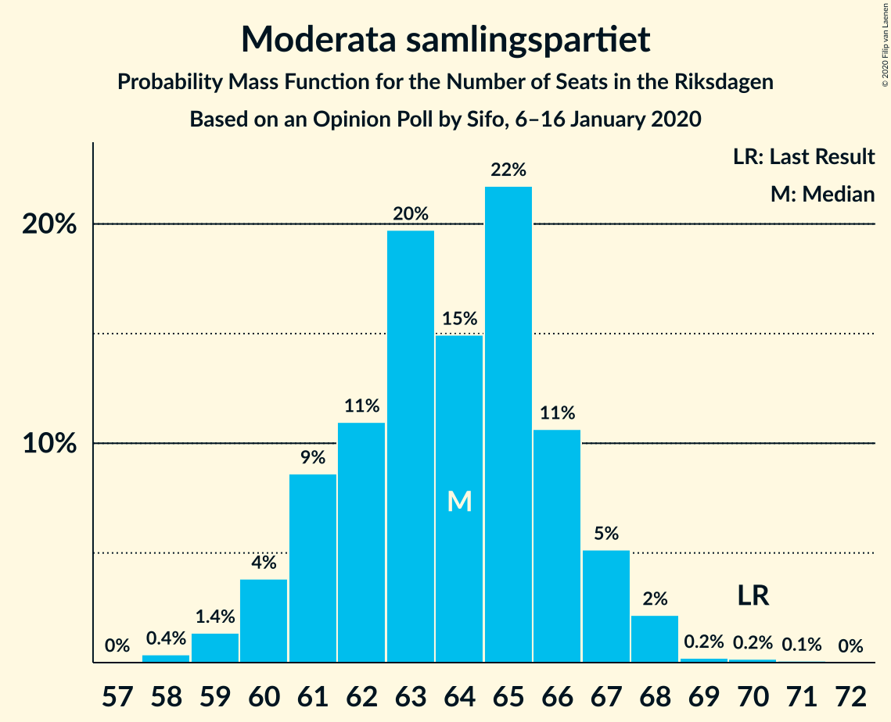
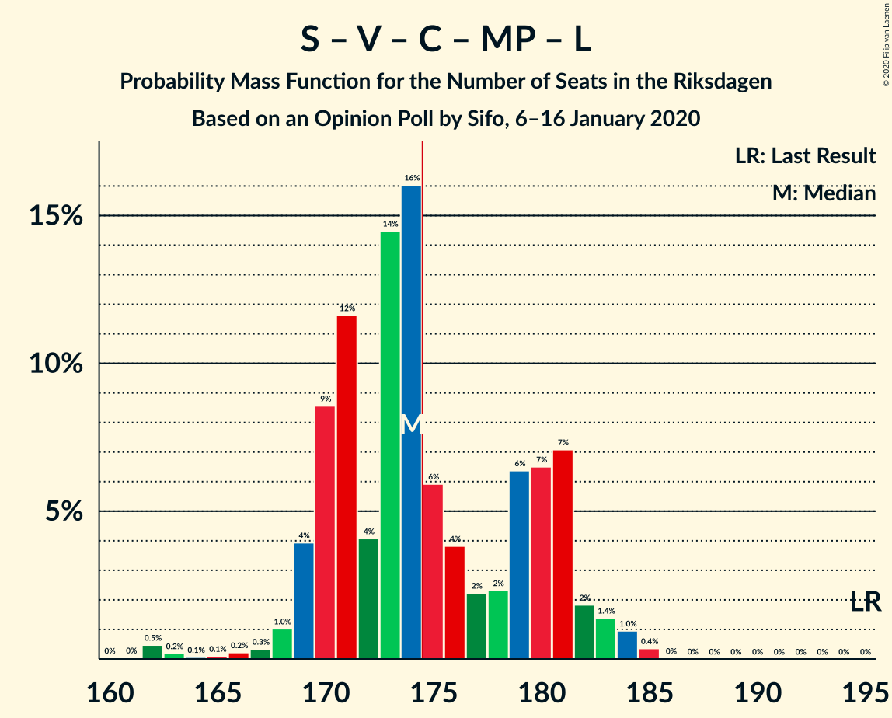
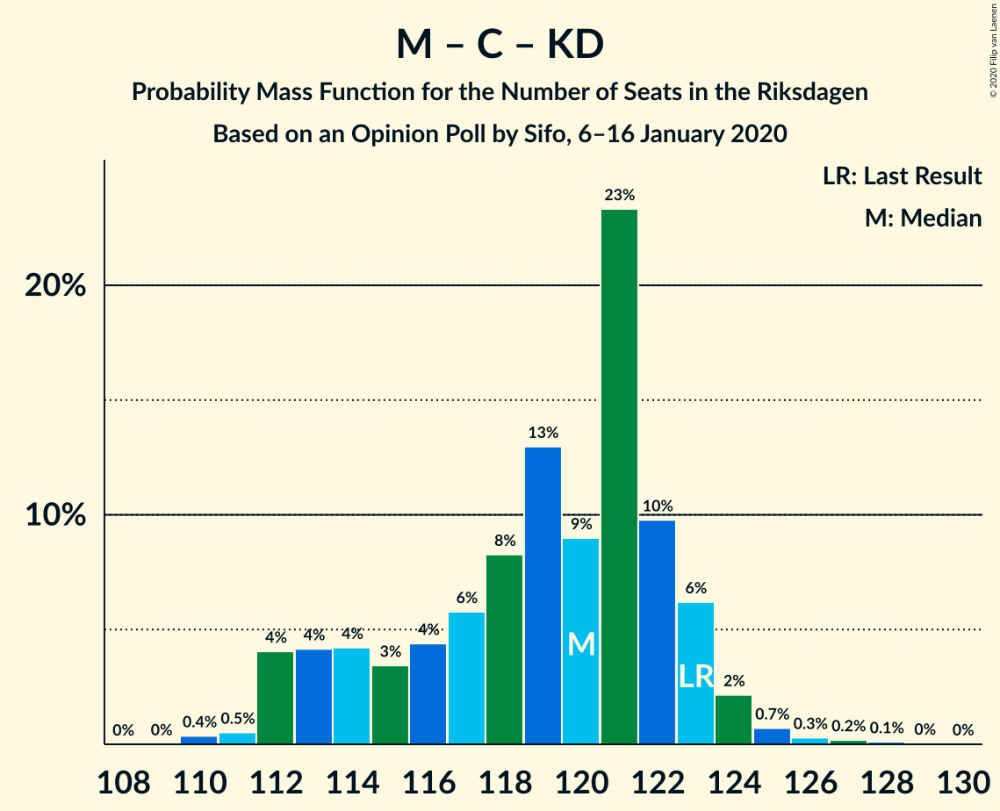

# Opinion Poll by Sifo, 6–16 January 2020

<a href="#voting-intentions">Voting Intentions</a> | <a href="#seats">Seats</a> | <a href="#coalitions">Coalitions</a> | <a href="#technical-information">Technical Information</a>

## Voting Intentions

### Confidence Intervals

| Party | Last Result | Poll Result | 80% Confidence Interval | 90% Confidence Interval | 95% Confidence Interval | 99% Confidence Interval |
|:-----:|:-----------:|:-----------:|:-----------------------:|:-----------------------:|:-----------------------:|:-----------------------:|
| Sverigedemokraterna | 17.5% | 23.8% | 23.2–24.4% |23.0–24.6% |22.9–24.8% |22.6–25.1% |
| Sveriges socialdemokratiska arbetareparti | 28.3% | 23.5% | 22.9–24.1% |22.7–24.3% |22.6–24.5% |22.3–24.8% |
| Moderata samlingspartiet | 19.8% | 17.5% | 16.9–18.1% |16.8–18.2% |16.7–18.4% |16.4–18.6% |
| Vänsterpartiet | 8.0% | 10.2% | 9.8–10.7% |9.6–10.8% |9.5–10.9% |9.3–11.1% |
| Centerpartiet | 8.6% | 8.5% | 8.1–8.9% |8.0–9.0% |7.9–9.1% |7.7–9.3% |
| Kristdemokraterna | 6.3% | 6.6% | 6.2–7.0% |6.1–7.1% |6.1–7.2% |5.9–7.4% |
| Miljöpartiet de gröna | 4.4% | 4.5% | 4.2–4.8% |4.1–4.9% |4.1–5.0% |3.9–5.2% |
| Liberalerna | 5.5% | 3.9% | 3.6–4.2% |3.6–4.3% |3.5–4.4% |3.4–4.5% |

*Note:* The poll result column reflects the actual value used in the calculations. Published results may vary slightly, and in addition be rounded to fewer digits.

## Seats

### Confidence Intervals

| Party | Last Result | Median | 80% Confidence Interval | 90% Confidence Interval | 95% Confidence Interval | 99% Confidence Interval |
|:-----:|:-----------:|:------:|:-----------------------:|:-----------------------:|:-----------------------:|:-----------------------:|
| <a href="#sverigedemokraterna">Sverigedemokraterna</a> | 62 | 86 | 85–89 |83–90 |81–91 |80–92 |
| <a href="#sveriges-socialdemokratiska-arbetareparti">Sveriges socialdemokratiska arbetareparti</a> | 100 | 87 | 83–88 |82–89 |81–89 |80–91 |
| <a href="#moderata-samlingspartiet">Moderata samlingspartiet</a> | 70 | 64 | 61–65 |61–67 |60–68 |59–68 |
| <a href="#vänsterpartiet">Vänsterpartiet</a> | 28 | 38 | 36–39 |35–39 |35–40 |34–41 |
| <a href="#centerpartiet">Centerpartiet</a> | 31 | 31 | 29–32 |29–33 |29–34 |27–35 |
| <a href="#kristdemokraterna">Kristdemokraterna</a> | 22 | 25 | 22–25 |22–26 |22–27 |21–27 |
| <a href="#miljöpartiet-de-gröna">Miljöpartiet de gröna</a> | 16 | 16 | 16–17 |16–17 |15–18 |0–19 |
| <a href="#liberalerna">Liberalerna</a> | 20 | 0 | 0–14 |0–15 |0–16 |0–16 |

### Sverigedemokraterna

*For a full overview of the results for this party, see the [Sverigedemokraterna](party-sverigedemokraterna.html) page.*

| Number of Seats | Probability | Accumulated | Special Marks |
|:---------------:|:-----------:|:-----------:|:-------------:|
| 62 | 0% | 100% | Last Result |
| 63 | 0% | 100% |  |
| 64 | 0% | 100% |  |
| 65 | 0% | 100% |  |
| 66 | 0% | 100% |  |
| 67 | 0% | 100% |  |
| 68 | 0% | 100% |  |
| 69 | 0% | 100% |  |
| 70 | 0% | 100% |  |
| 71 | 0% | 100% |  |
| 72 | 0% | 100% |  |
| 73 | 0% | 100% |  |
| 74 | 0% | 100% |  |
| 75 | 0% | 100% |  |
| 76 | 0% | 100% |  |
| 77 | 0% | 100% |  |
| 78 | 0% | 100% |  |
| 79 | 0% | 100% |  |
| 80 | 0.8% | 100% |  |
| 81 | 2% | 99.2% |  |
| 82 | 1.1% | 97% |  |
| 83 | 1.2% | 96% |  |
| 84 | 5% | 95% |  |
| 85 | 15% | 90% |  |
| 86 | 50% | 75% | Median |
| 87 | 7% | 26% |  |
| 88 | 7% | 19% |  |
| 89 | 7% | 12% |  |
| 90 | 2% | 5% |  |
| 91 | 2% | 3% |  |
| 92 | 0.9% | 1.1% |  |
| 93 | 0% | 0.3% |  |
| 94 | 0.2% | 0.2% |  |
| 95 | 0% | 0% |  |

### Sveriges socialdemokratiska arbetareparti

*For a full overview of the results for this party, see the [Sveriges socialdemokratiska arbetareparti](party-sverigessocialdemokratiskaarbetareparti.html) page.*

| Number of Seats | Probability | Accumulated | Special Marks |
|:---------------:|:-----------:|:-----------:|:-------------:|
| 78 | 0.1% | 100% |  |
| 79 | 0.2% | 99.9% |  |
| 80 | 1.5% | 99.7% |  |
| 81 | 2% | 98% |  |
| 82 | 4% | 96% |  |
| 83 | 15% | 92% |  |
| 84 | 5% | 77% |  |
| 85 | 7% | 73% |  |
| 86 | 5% | 66% |  |
| 87 | 29% | 61% | Median |
| 88 | 27% | 33% |  |
| 89 | 3% | 6% |  |
| 90 | 2% | 2% |  |
| 91 | 0.5% | 0.7% |  |
| 92 | 0.1% | 0.2% |  |
| 93 | 0% | 0.1% |  |
| 94 | 0.1% | 0.1% |  |
| 95 | 0% | 0% |  |
| 96 | 0% | 0% |  |
| 97 | 0% | 0% |  |
| 98 | 0% | 0% |  |
| 99 | 0% | 0% |  |
| 100 | 0% | 0% | Last Result |

### Moderata samlingspartiet

*For a full overview of the results for this party, see the [Moderata samlingspartiet](party-moderatasamlingspartiet.html) page.*

| Number of Seats | Probability | Accumulated | Special Marks |
|:---------------:|:-----------:|:-----------:|:-------------:|
| 58 | 0.1% | 100% |  |
| 59 | 2% | 99.8% |  |
| 60 | 2% | 98% |  |
| 61 | 14% | 96% |  |
| 62 | 7% | 81% |  |
| 63 | 10% | 74% |  |
| 64 | 28% | 64% | Median |
| 65 | 27% | 35% |  |
| 66 | 3% | 9% |  |
| 67 | 1.1% | 6% |  |
| 68 | 4% | 5% |  |
| 69 | 0.1% | 0.3% |  |
| 70 | 0.2% | 0.2% | Last Result |
| 71 | 0% | 0% |  |

### Vänsterpartiet

*For a full overview of the results for this party, see the [Vänsterpartiet](party-vänsterpartiet.html) page.*

| Number of Seats | Probability | Accumulated | Special Marks |
|:---------------:|:-----------:|:-----------:|:-------------:|
| 28 | 0% | 100% | Last Result |
| 29 | 0% | 100% |  |
| 30 | 0% | 100% |  |
| 31 | 0% | 100% |  |
| 32 | 0% | 100% |  |
| 33 | 0.1% | 100% |  |
| 34 | 2% | 99.8% |  |
| 35 | 4% | 98% |  |
| 36 | 12% | 94% |  |
| 37 | 19% | 82% |  |
| 38 | 31% | 63% | Median |
| 39 | 27% | 32% |  |
| 40 | 4% | 5% |  |
| 41 | 0.5% | 0.6% |  |
| 42 | 0.1% | 0.1% |  |
| 43 | 0% | 0% |  |

### Centerpartiet

*For a full overview of the results for this party, see the [Centerpartiet](party-centerpartiet.html) page.*

| Number of Seats | Probability | Accumulated | Special Marks |
|:---------------:|:-----------:|:-----------:|:-------------:|
| 27 | 0.5% | 100% |  |
| 28 | 0.8% | 99.5% |  |
| 29 | 9% | 98.7% |  |
| 30 | 21% | 90% |  |
| 31 | 30% | 69% | Last Result, Median |
| 32 | 31% | 39% |  |
| 33 | 5% | 8% |  |
| 34 | 3% | 3% |  |
| 35 | 0.5% | 0.6% |  |
| 36 | 0% | 0% |  |

### Kristdemokraterna

*For a full overview of the results for this party, see the [Kristdemokraterna](party-kristdemokraterna.html) page.*

| Number of Seats | Probability | Accumulated | Special Marks |
|:---------------:|:-----------:|:-----------:|:-------------:|
| 21 | 2% | 100% |  |
| 22 | 16% | 98% | Last Result |
| 23 | 9% | 82% |  |
| 24 | 13% | 73% |  |
| 25 | 52% | 60% | Median |
| 26 | 5% | 8% |  |
| 27 | 3% | 3% |  |
| 28 | 0.1% | 0.1% |  |
| 29 | 0% | 0% |  |

### Miljöpartiet de gröna

*For a full overview of the results for this party, see the [Miljöpartiet de gröna](party-miljöpartietdegröna.html) page.*

| Number of Seats | Probability | Accumulated | Special Marks |
|:---------------:|:-----------:|:-----------:|:-------------:|
| 0 | 0.7% | 100% |  |
| 1 | 0% | 99.3% |  |
| 2 | 0% | 99.3% |  |
| 3 | 0% | 99.3% |  |
| 4 | 0% | 99.3% |  |
| 5 | 0% | 99.3% |  |
| 6 | 0% | 99.3% |  |
| 7 | 0% | 99.3% |  |
| 8 | 0% | 99.3% |  |
| 9 | 0% | 99.3% |  |
| 10 | 0% | 99.3% |  |
| 11 | 0% | 99.3% |  |
| 12 | 0% | 99.3% |  |
| 13 | 0% | 99.3% |  |
| 14 | 0.1% | 99.3% |  |
| 15 | 3% | 99.1% |  |
| 16 | 63% | 96% | Last Result, Median |
| 17 | 27% | 32% |  |
| 18 | 4% | 5% |  |
| 19 | 0.8% | 0.8% |  |
| 20 | 0% | 0% |  |

### Liberalerna

*For a full overview of the results for this party, see the [Liberalerna](party-liberalerna.html) page.*

| Number of Seats | Probability | Accumulated | Special Marks |
|:---------------:|:-----------:|:-----------:|:-------------:|
| 0 | 74% | 100% | Median |
| 1 | 0% | 26% |  |
| 2 | 0% | 26% |  |
| 3 | 0% | 26% |  |
| 4 | 0% | 26% |  |
| 5 | 0% | 26% |  |
| 6 | 0% | 26% |  |
| 7 | 0% | 26% |  |
| 8 | 0% | 26% |  |
| 9 | 0% | 26% |  |
| 10 | 0% | 26% |  |
| 11 | 0% | 26% |  |
| 12 | 0% | 26% |  |
| 13 | 0% | 26% |  |
| 14 | 16% | 26% |  |
| 15 | 7% | 10% |  |
| 16 | 3% | 3% |  |
| 17 | 0% | 0% |  |
| 18 | 0% | 0% |  |
| 19 | 0% | 0% |  |
| 20 | 0% | 0% | Last Result |

## Coalitions

### Confidence Intervals

| Coalition | Last Result | Median | Majority? | 80% Confidence Interval | 90% Confidence Interval | 95% Confidence Interval | 99% Confidence Interval |
|:---------:|:-----------:|:------:|:---------:|:-----------------------:|:-----------------------:|:-----------------------:|:-----------------------:|
| Sveriges socialdemokratiska arbetareparti – Moderata samlingspartiet – Centerpartiet | 201 | 183 | 82% | 174–184 | 174–185 | 172–185 | 171–189 |
| Sveriges socialdemokratiska arbetareparti – Vänsterpartiet – Centerpartiet – Miljöpartiet de gröna – Liberalerna | 195 | 174 | 29% | 171–181 | 170–182 | 170–183 | 167–184 |
| Sverigedemokraterna – Moderata samlingspartiet – Kristdemokraterna | 154 | 175 | 71% | 168–178 | 167–179 | 166–179 | 165–182 |
| Sverigedemokraterna – Moderata samlingspartiet | 132 | 150 | 0% | 146–153 | 145–155 | 143–155 | 141–157 |
| Sveriges socialdemokratiska arbetareparti – Moderata samlingspartiet | 170 | 152 | 0% | 144–152 | 144–153 | 143–155 | 141–157 |
| Sveriges socialdemokratiska arbetareparti – Centerpartiet – Miljöpartiet de gröna – Liberalerna | 167 | 136 | 0% | 133–144 | 132–146 | 132–147 | 129–148 |
| Sveriges socialdemokratiska arbetareparti – Vänsterpartiet – Miljöpartiet de gröna | 144 | 142 | 0% | 136–142 | 134–143 | 133–144 | 129–145 |
| Moderata samlingspartiet – Centerpartiet – Kristdemokraterna – Liberalerna | 143 | 121 | 0% | 119–128 | 118–130 | 117–132 | 114–135 |
| Sveriges socialdemokratiska arbetareparti – Vänsterpartiet | 128 | 126 | 0% | 120–126 | 118–127 | 116–127 | 116–129 |
| Moderata samlingspartiet – Centerpartiet – Kristdemokraterna | 123 | 121 | 0% | 113–122 | 113–123 | 111–124 | 110–126 |
| Moderata samlingspartiet – Centerpartiet – Liberalerna | 121 | 96 | 0% | 94–106 | 94–108 | 93–108 | 91–111 |
| Sveriges socialdemokratiska arbetareparti – Miljöpartiet de gröna | 116 | 103 | 0% | 100–104 | 98–106 | 97–106 | 90–107 |
| Moderata samlingspartiet – Centerpartiet | 101 | 96 | 0% | 91–97 | 90–99 | 89–100 | 88–101 |

### Sveriges socialdemokratiska arbetareparti – Moderata samlingspartiet – Centerpartiet

| Number of Seats | Probability | Accumulated | Special Marks |
|:---------------:|:-----------:|:-----------:|:-------------:|
| 169 | 0.1% | 100% |  |
| 170 | 0.1% | 99.9% |  |
| 171 | 1.5% | 99.8% |  |
| 172 | 2% | 98% |  |
| 173 | 0.7% | 97% |  |
| 174 | 14% | 96% |  |
| 175 | 2% | 82% | Majority |
| 176 | 2% | 79% |  |
| 177 | 2% | 77% |  |
| 178 | 3% | 75% |  |
| 179 | 1.4% | 73% |  |
| 180 | 3% | 71% |  |
| 181 | 5% | 68% |  |
| 182 | 6% | 63% | Median |
| 183 | 27% | 57% |  |
| 184 | 23% | 30% |  |
| 185 | 4% | 7% |  |
| 186 | 1.2% | 2% |  |
| 187 | 0.2% | 1.3% |  |
| 188 | 0.6% | 1.1% |  |
| 189 | 0.2% | 0.6% |  |
| 190 | 0% | 0.3% |  |
| 191 | 0.2% | 0.3% |  |
| 192 | 0% | 0.1% |  |
| 193 | 0.1% | 0.1% |  |
| 194 | 0% | 0.1% |  |
| 195 | 0% | 0% |  |
| 196 | 0% | 0% |  |
| 197 | 0% | 0% |  |
| 198 | 0% | 0% |  |
| 199 | 0% | 0% |  |
| 200 | 0% | 0% |  |
| 201 | 0% | 0% | Last Result |

### Sveriges socialdemokratiska arbetareparti – Vänsterpartiet – Centerpartiet – Miljöpartiet de gröna – Liberalerna

| Number of Seats | Probability | Accumulated | Special Marks |
|:---------------:|:-----------:|:-----------:|:-------------:|
| 163 | 0.1% | 100% |  |
| 164 | 0.1% | 99.8% |  |
| 165 | 0% | 99.7% |  |
| 166 | 0.1% | 99.7% |  |
| 167 | 0.2% | 99.6% |  |
| 168 | 0.1% | 99.4% |  |
| 169 | 0.9% | 99.2% |  |
| 170 | 7% | 98% |  |
| 171 | 5% | 91% |  |
| 172 | 2% | 86% | Median |
| 173 | 29% | 85% |  |
| 174 | 27% | 56% |  |
| 175 | 2% | 29% | Majority |
| 176 | 2% | 27% |  |
| 177 | 2% | 25% |  |
| 178 | 1.4% | 24% |  |
| 179 | 3% | 22% |  |
| 180 | 0.7% | 19% |  |
| 181 | 13% | 18% |  |
| 182 | 3% | 6% |  |
| 183 | 1.2% | 3% |  |
| 184 | 0.9% | 1.4% |  |
| 185 | 0.5% | 0.5% |  |
| 186 | 0% | 0% |  |
| 187 | 0% | 0% |  |
| 188 | 0% | 0% |  |
| 189 | 0% | 0% |  |
| 190 | 0% | 0% |  |
| 191 | 0% | 0% |  |
| 192 | 0% | 0% |  |
| 193 | 0% | 0% |  |
| 194 | 0% | 0% |  |
| 195 | 0% | 0% | Last Result |

### Sverigedemokraterna – Moderata samlingspartiet – Kristdemokraterna

| Number of Seats | Probability | Accumulated | Special Marks |
|:---------------:|:-----------:|:-----------:|:-------------:|
| 154 | 0% | 100% | Last Result |
| 155 | 0% | 100% |  |
| 156 | 0% | 100% |  |
| 157 | 0% | 100% |  |
| 158 | 0% | 100% |  |
| 159 | 0% | 100% |  |
| 160 | 0% | 100% |  |
| 161 | 0% | 100% |  |
| 162 | 0% | 100% |  |
| 163 | 0% | 100% |  |
| 164 | 0.5% | 100% |  |
| 165 | 0.9% | 99.5% |  |
| 166 | 1.2% | 98.6% |  |
| 167 | 3% | 97% |  |
| 168 | 13% | 94% |  |
| 169 | 0.7% | 82% |  |
| 170 | 3% | 81% |  |
| 171 | 1.4% | 78% |  |
| 172 | 2% | 76% |  |
| 173 | 2% | 75% |  |
| 174 | 2% | 73% |  |
| 175 | 27% | 71% | Median, Majority |
| 176 | 29% | 44% |  |
| 177 | 2% | 15% |  |
| 178 | 5% | 14% |  |
| 179 | 7% | 9% |  |
| 180 | 0.9% | 2% |  |
| 181 | 0.1% | 0.8% |  |
| 182 | 0.2% | 0.6% |  |
| 183 | 0.1% | 0.4% |  |
| 184 | 0% | 0.3% |  |
| 185 | 0.1% | 0.3% |  |
| 186 | 0.1% | 0.2% |  |
| 187 | 0% | 0% |  |

### Sverigedemokraterna – Moderata samlingspartiet

| Number of Seats | Probability | Accumulated | Special Marks |
|:---------------:|:-----------:|:-----------:|:-------------:|
| 132 | 0% | 100% | Last Result |
| 133 | 0% | 100% |  |
| 134 | 0% | 100% |  |
| 135 | 0% | 100% |  |
| 136 | 0% | 100% |  |
| 137 | 0% | 100% |  |
| 138 | 0% | 100% |  |
| 139 | 0% | 100% |  |
| 140 | 0.1% | 100% |  |
| 141 | 0.8% | 99.9% |  |
| 142 | 0.1% | 99.1% |  |
| 143 | 2% | 99.0% |  |
| 144 | 2% | 97% |  |
| 145 | 3% | 95% |  |
| 146 | 10% | 92% |  |
| 147 | 3% | 81% |  |
| 148 | 5% | 79% |  |
| 149 | 1.2% | 74% |  |
| 150 | 26% | 73% | Median |
| 151 | 31% | 47% |  |
| 152 | 2% | 16% |  |
| 153 | 5% | 14% |  |
| 154 | 2% | 9% |  |
| 155 | 4% | 7% |  |
| 156 | 2% | 2% |  |
| 157 | 0.3% | 0.7% |  |
| 158 | 0.1% | 0.4% |  |
| 159 | 0.1% | 0.3% |  |
| 160 | 0.1% | 0.2% |  |
| 161 | 0% | 0.1% |  |
| 162 | 0.1% | 0.1% |  |
| 163 | 0% | 0% |  |

### Sveriges socialdemokratiska arbetareparti – Moderata samlingspartiet

| Number of Seats | Probability | Accumulated | Special Marks |
|:---------------:|:-----------:|:-----------:|:-------------:|
| 139 | 0.1% | 100% |  |
| 140 | 0.1% | 99.9% |  |
| 141 | 0.4% | 99.8% |  |
| 142 | 2% | 99.4% |  |
| 143 | 2% | 98% |  |
| 144 | 11% | 96% |  |
| 145 | 7% | 85% |  |
| 146 | 1.3% | 78% |  |
| 147 | 5% | 77% |  |
| 148 | 3% | 72% |  |
| 149 | 2% | 68% |  |
| 150 | 6% | 66% |  |
| 151 | 3% | 60% | Median |
| 152 | 47% | 56% |  |
| 153 | 4% | 9% |  |
| 154 | 2% | 5% |  |
| 155 | 1.2% | 3% |  |
| 156 | 0.6% | 1.4% |  |
| 157 | 0.6% | 0.8% |  |
| 158 | 0% | 0.2% |  |
| 159 | 0% | 0.1% |  |
| 160 | 0% | 0.1% |  |
| 161 | 0.1% | 0.1% |  |
| 162 | 0% | 0% |  |
| 163 | 0% | 0% |  |
| 164 | 0% | 0% |  |
| 165 | 0% | 0% |  |
| 166 | 0% | 0% |  |
| 167 | 0% | 0% |  |
| 168 | 0% | 0% |  |
| 169 | 0% | 0% |  |
| 170 | 0% | 0% | Last Result |

### Sveriges socialdemokratiska arbetareparti – Centerpartiet – Miljöpartiet de gröna – Liberalerna

| Number of Seats | Probability | Accumulated | Special Marks |
|:---------------:|:-----------:|:-----------:|:-------------:|
| 123 | 0.1% | 100% |  |
| 124 | 0% | 99.9% |  |
| 125 | 0.1% | 99.9% |  |
| 126 | 0.1% | 99.8% |  |
| 127 | 0% | 99.7% |  |
| 128 | 0% | 99.7% |  |
| 129 | 0.2% | 99.7% |  |
| 130 | 0.9% | 99.4% |  |
| 131 | 0.4% | 98.6% |  |
| 132 | 5% | 98% |  |
| 133 | 4% | 94% |  |
| 134 | 28% | 89% | Median |
| 135 | 4% | 61% |  |
| 136 | 25% | 57% |  |
| 137 | 3% | 32% |  |
| 138 | 2% | 29% |  |
| 139 | 1.0% | 27% |  |
| 140 | 2% | 26% |  |
| 141 | 2% | 24% |  |
| 142 | 1.1% | 22% |  |
| 143 | 1.4% | 21% |  |
| 144 | 11% | 20% |  |
| 145 | 2% | 8% |  |
| 146 | 4% | 7% |  |
| 147 | 2% | 3% |  |
| 148 | 0.5% | 1.0% |  |
| 149 | 0.4% | 0.4% |  |
| 150 | 0.1% | 0.1% |  |
| 151 | 0% | 0% |  |
| 152 | 0% | 0% |  |
| 153 | 0% | 0% |  |
| 154 | 0% | 0% |  |
| 155 | 0% | 0% |  |
| 156 | 0% | 0% |  |
| 157 | 0% | 0% |  |
| 158 | 0% | 0% |  |
| 159 | 0% | 0% |  |
| 160 | 0% | 0% |  |
| 161 | 0% | 0% |  |
| 162 | 0% | 0% |  |
| 163 | 0% | 0% |  |
| 164 | 0% | 0% |  |
| 165 | 0% | 0% |  |
| 166 | 0% | 0% |  |
| 167 | 0% | 0% | Last Result |

### Sveriges socialdemokratiska arbetareparti – Vänsterpartiet – Miljöpartiet de gröna

| Number of Seats | Probability | Accumulated | Special Marks |
|:---------------:|:-----------:|:-----------:|:-------------:|
| 123 | 0.1% | 100% |  |
| 124 | 0.2% | 99.9% |  |
| 125 | 0% | 99.6% |  |
| 126 | 0% | 99.6% |  |
| 127 | 0% | 99.6% |  |
| 128 | 0% | 99.6% |  |
| 129 | 0.2% | 99.6% |  |
| 130 | 0.1% | 99.3% |  |
| 131 | 0.2% | 99.3% |  |
| 132 | 0.9% | 99.1% |  |
| 133 | 2% | 98% |  |
| 134 | 2% | 97% |  |
| 135 | 1.0% | 94% |  |
| 136 | 6% | 93% |  |
| 137 | 11% | 88% |  |
| 138 | 7% | 76% |  |
| 139 | 3% | 69% |  |
| 140 | 7% | 66% |  |
| 141 | 6% | 59% | Median |
| 142 | 46% | 54% |  |
| 143 | 5% | 8% |  |
| 144 | 1.1% | 3% | Last Result |
| 145 | 1.4% | 2% |  |
| 146 | 0.4% | 0.5% |  |
| 147 | 0.1% | 0.1% |  |
| 148 | 0% | 0% |  |

### Moderata samlingspartiet – Centerpartiet – Kristdemokraterna – Liberalerna

| Number of Seats | Probability | Accumulated | Special Marks |
|:---------------:|:-----------:|:-----------:|:-------------:|
| 114 | 0.5% | 100% |  |
| 115 | 0.2% | 99.5% |  |
| 116 | 0.4% | 99.3% |  |
| 117 | 2% | 98.9% |  |
| 118 | 2% | 97% |  |
| 119 | 6% | 94% |  |
| 120 | 4% | 88% | Median |
| 121 | 48% | 84% |  |
| 122 | 2% | 36% |  |
| 123 | 4% | 34% |  |
| 124 | 3% | 30% |  |
| 125 | 2% | 27% |  |
| 126 | 2% | 25% |  |
| 127 | 11% | 24% |  |
| 128 | 3% | 13% |  |
| 129 | 4% | 9% |  |
| 130 | 1.3% | 6% |  |
| 131 | 1.2% | 5% |  |
| 132 | 2% | 3% |  |
| 133 | 0.9% | 2% |  |
| 134 | 0.3% | 1.0% |  |
| 135 | 0.2% | 0.6% |  |
| 136 | 0.1% | 0.4% |  |
| 137 | 0.1% | 0.4% |  |
| 138 | 0.3% | 0.3% |  |
| 139 | 0% | 0% |  |
| 140 | 0% | 0% |  |
| 141 | 0% | 0% |  |
| 142 | 0% | 0% |  |
| 143 | 0% | 0% | Last Result |

### Sveriges socialdemokratiska arbetareparti – Vänsterpartiet

| Number of Seats | Probability | Accumulated | Special Marks |
|:---------------:|:-----------:|:-----------:|:-------------:|
| 114 | 0.1% | 100% |  |
| 115 | 0.2% | 99.9% |  |
| 116 | 3% | 99.7% |  |
| 117 | 0.5% | 97% |  |
| 118 | 2% | 96% |  |
| 119 | 2% | 94% |  |
| 120 | 14% | 92% |  |
| 121 | 5% | 78% |  |
| 122 | 4% | 73% |  |
| 123 | 5% | 69% |  |
| 124 | 7% | 64% |  |
| 125 | 5% | 56% | Median |
| 126 | 45% | 51% |  |
| 127 | 3% | 6% |  |
| 128 | 1.4% | 2% | Last Result |
| 129 | 0.6% | 1.1% |  |
| 130 | 0.3% | 0.5% |  |
| 131 | 0.1% | 0.2% |  |
| 132 | 0% | 0% |  |

### Moderata samlingspartiet – Centerpartiet – Kristdemokraterna

| Number of Seats | Probability | Accumulated | Special Marks |
|:---------------:|:-----------:|:-----------:|:-------------:|
| 110 | 1.4% | 100% |  |
| 111 | 1.3% | 98.5% |  |
| 112 | 0.5% | 97% |  |
| 113 | 11% | 97% |  |
| 114 | 5% | 86% |  |
| 115 | 2% | 80% |  |
| 116 | 3% | 78% |  |
| 117 | 4% | 75% |  |
| 118 | 3% | 72% |  |
| 119 | 7% | 69% |  |
| 120 | 4% | 62% | Median |
| 121 | 48% | 59% |  |
| 122 | 2% | 10% |  |
| 123 | 4% | 8% | Last Result |
| 124 | 3% | 4% |  |
| 125 | 0.2% | 0.8% |  |
| 126 | 0.4% | 0.6% |  |
| 127 | 0.2% | 0.3% |  |
| 128 | 0% | 0.1% |  |
| 129 | 0% | 0% |  |

### Moderata samlingspartiet – Centerpartiet – Liberalerna

| Number of Seats | Probability | Accumulated | Special Marks |
|:---------------:|:-----------:|:-----------:|:-------------:|
| 91 | 0.5% | 100% |  |
| 92 | 1.5% | 99.4% |  |
| 93 | 2% | 98% |  |
| 94 | 7% | 96% |  |
| 95 | 4% | 89% | Median |
| 96 | 48% | 86% |  |
| 97 | 4% | 37% |  |
| 98 | 2% | 34% |  |
| 99 | 2% | 32% |  |
| 100 | 3% | 30% |  |
| 101 | 0.6% | 27% |  |
| 102 | 0.2% | 26% |  |
| 103 | 3% | 26% |  |
| 104 | 2% | 23% |  |
| 105 | 11% | 22% |  |
| 106 | 4% | 11% |  |
| 107 | 2% | 7% |  |
| 108 | 3% | 5% |  |
| 109 | 2% | 2% |  |
| 110 | 0.1% | 0.8% |  |
| 111 | 0.3% | 0.7% |  |
| 112 | 0% | 0.4% |  |
| 113 | 0.3% | 0.3% |  |
| 114 | 0% | 0% |  |
| 115 | 0% | 0% |  |
| 116 | 0% | 0% |  |
| 117 | 0% | 0% |  |
| 118 | 0% | 0% |  |
| 119 | 0% | 0% |  |
| 120 | 0% | 0% |  |
| 121 | 0% | 0% | Last Result |

### Sveriges socialdemokratiska arbetareparti – Miljöpartiet de gröna

| Number of Seats | Probability | Accumulated | Special Marks |
|:---------------:|:-----------:|:-----------:|:-------------:|
| 85 | 0% | 100% |  |
| 86 | 0% | 99.9% |  |
| 87 | 0% | 99.9% |  |
| 88 | 0.3% | 99.9% |  |
| 89 | 0.1% | 99.6% |  |
| 90 | 0.1% | 99.5% |  |
| 91 | 0% | 99.4% |  |
| 92 | 0% | 99.4% |  |
| 93 | 0% | 99.4% |  |
| 94 | 0.2% | 99.3% |  |
| 95 | 0.2% | 99.2% |  |
| 96 | 0.6% | 99.0% |  |
| 97 | 2% | 98% |  |
| 98 | 3% | 96% |  |
| 99 | 3% | 93% |  |
| 100 | 16% | 90% |  |
| 101 | 5% | 74% |  |
| 102 | 8% | 69% |  |
| 103 | 26% | 61% | Median |
| 104 | 28% | 35% |  |
| 105 | 2% | 7% |  |
| 106 | 3% | 6% |  |
| 107 | 2% | 2% |  |
| 108 | 0.4% | 0.5% |  |
| 109 | 0.1% | 0.1% |  |
| 110 | 0% | 0% |  |
| 111 | 0% | 0% |  |
| 112 | 0% | 0% |  |
| 113 | 0% | 0% |  |
| 114 | 0% | 0% |  |
| 115 | 0% | 0% |  |
| 116 | 0% | 0% | Last Result |

### Moderata samlingspartiet – Centerpartiet

| Number of Seats | Probability | Accumulated | Special Marks |
|:---------------:|:-----------:|:-----------:|:-------------:|
| 87 | 0.1% | 100% |  |
| 88 | 2% | 99.9% |  |
| 89 | 0.8% | 98% |  |
| 90 | 3% | 97% |  |
| 91 | 11% | 94% |  |
| 92 | 7% | 83% |  |
| 93 | 5% | 77% |  |
| 94 | 8% | 72% |  |
| 95 | 4% | 64% | Median |
| 96 | 49% | 60% |  |
| 97 | 4% | 12% |  |
| 98 | 2% | 8% |  |
| 99 | 2% | 5% |  |
| 100 | 3% | 4% |  |
| 101 | 0.5% | 0.7% | Last Result |
| 102 | 0.1% | 0.2% |  |
| 103 | 0.1% | 0.1% |  |
| 104 | 0% | 0% |  |

## Technical Information

### Opinion Poll

+ **Polling firm:** Sifo
+ **Commissioner(s):** —
+ **Fieldwork period:** 6–16 January 2020

### Calculations

+ **Sample size:** 7747
+ **Simulations done:** 131,072
+ **Error estimate:** 0.52%

