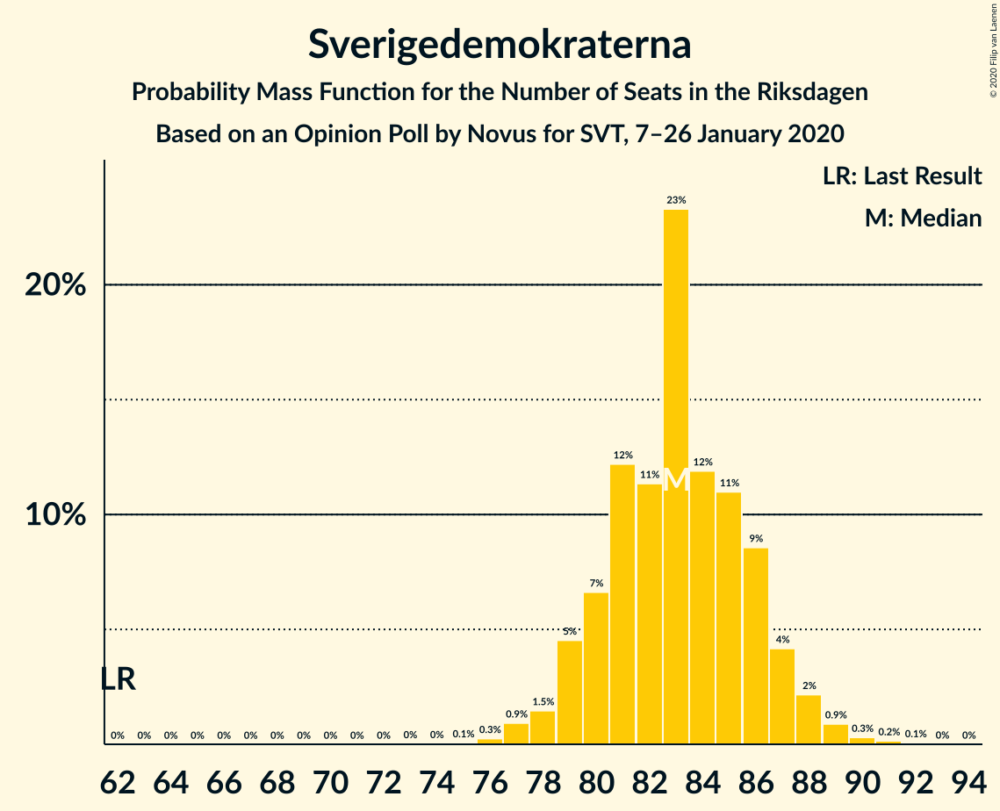
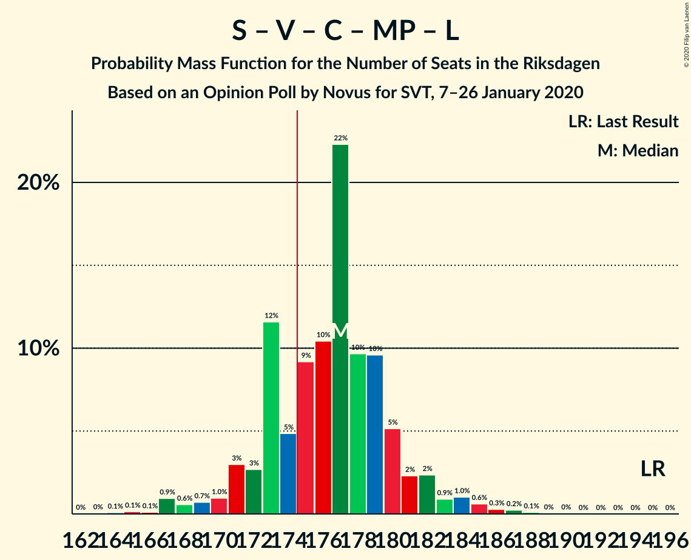

# Opinion Poll by Novus for SVT, 7–26 January 2020

<a href="#voting-intentions">Voting Intentions</a> | <a href="#seats">Seats</a> | <a href="#coalitions">Coalitions</a> | <a href="#technical-information">Technical Information</a>

## Voting Intentions

### Confidence Intervals

| Party | Last Result | Poll Result | 80% Confidence Interval | 90% Confidence Interval | 95% Confidence Interval | 99% Confidence Interval |
|:-----:|:-----------:|:-----------:|:-----------------------:|:-----------------------:|:-----------------------:|:-----------------------:|
| Sveriges socialdemokratiska arbetareparti | 28.3% | 24.2% | 23.4–25.0% |23.2–25.3% |23.0–25.5% |22.6–25.9% |
| Sverigedemokraterna | 17.5% | 22.6% | 21.8–23.4% |21.6–23.7% |21.4–23.9% |21.0–24.3% |
| Moderata samlingspartiet | 19.8% | 18.3% | 17.6–19.1% |17.4–19.3% |17.2–19.5% |16.8–19.9% |
| Vänsterpartiet | 8.0% | 10.4% | 9.8–11.0% |9.7–11.2% |9.5–11.3% |9.3–11.6% |
| Centerpartiet | 8.6% | 8.7% | 8.2–9.3% |8.0–9.4% |7.9–9.6% |7.7–9.8% |
| Kristdemokraterna | 6.3% | 6.1% | 5.7–6.6% |5.5–6.7% |5.4–6.8% |5.2–7.1% |
| Miljöpartiet de gröna | 4.4% | 4.6% | 4.2–5.0% |4.1–5.2% |4.0–5.3% |3.8–5.5% |
| Liberalerna | 5.5% | 3.5% | 3.2–3.9% |3.1–4.0% |3.0–4.1% |2.8–4.3% |

*Note:* The poll result column reflects the actual value used in the calculations. Published results may vary slightly, and in addition be rounded to fewer digits.

## Seats

### Confidence Intervals

| Party | Last Result | Median | 80% Confidence Interval | 90% Confidence Interval | 95% Confidence Interval | 99% Confidence Interval |
|:-----:|:-----------:|:------:|:-----------------------:|:-----------------------:|:-----------------------:|:-----------------------:|
| <a href="#sveriges-socialdemokratiska-arbetareparti">Sveriges socialdemokratiska arbetareparti</a> | 100 | 89 | 86–92 |85–93 |84–94 |82–96 |
| <a href="#sverigedemokraterna">Sverigedemokraterna</a> | 62 | 83 | 80–86 |79–87 |78–88 |77–90 |
| <a href="#moderata-samlingspartiet">Moderata samlingspartiet</a> | 70 | 67 | 64–70 |63–71 |63–72 |61–73 |
| <a href="#vänsterpartiet">Vänsterpartiet</a> | 28 | 38 | 36–40 |35–41 |35–42 |34–43 |
| <a href="#centerpartiet">Centerpartiet</a> | 31 | 32 | 30–34 |29–34 |29–35 |28–36 |
| <a href="#kristdemokraterna">Kristdemokraterna</a> | 22 | 22 | 21–24 |20–25 |20–25 |19–26 |
| <a href="#miljöpartiet-de-gröna">Miljöpartiet de gröna</a> | 16 | 17 | 16–19 |15–19 |14–19 |0–20 |
| <a href="#liberalerna">Liberalerna</a> | 20 | 0 | 0 |0 |0–14 |0–15 |

### Sveriges socialdemokratiska arbetareparti

*For a full overview of the results for this party, see the [Sveriges socialdemokratiska arbetareparti](party-sverigessocialdemokratiskaarbetareparti.html) page.*

| Number of Seats | Probability | Accumulated | Special Marks |
|:---------------:|:-----------:|:-----------:|:-------------:|
| 80 | 0.1% | 100% |  |
| 81 | 0.1% | 99.9% |  |
| 82 | 0.3% | 99.8% |  |
| 83 | 1.2% | 99.5% |  |
| 84 | 3% | 98% |  |
| 85 | 5% | 95% |  |
| 86 | 8% | 91% |  |
| 87 | 7% | 82% |  |
| 88 | 13% | 75% |  |
| 89 | 23% | 62% | Median |
| 90 | 15% | 39% |  |
| 91 | 12% | 24% |  |
| 92 | 4% | 12% |  |
| 93 | 5% | 8% |  |
| 94 | 2% | 3% |  |
| 95 | 0.9% | 2% |  |
| 96 | 0.5% | 0.8% |  |
| 97 | 0.2% | 0.3% |  |
| 98 | 0.1% | 0.1% |  |
| 99 | 0% | 0% |  |
| 100 | 0% | 0% | Last Result |

### Sverigedemokraterna

*For a full overview of the results for this party, see the [Sverigedemokraterna](party-sverigedemokraterna.html) page.*

| Number of Seats | Probability | Accumulated | Special Marks |
|:---------------:|:-----------:|:-----------:|:-------------:|
| 62 | 0% | 100% | Last Result |
| 63 | 0% | 100% |  |
| 64 | 0% | 100% |  |
| 65 | 0% | 100% |  |
| 66 | 0% | 100% |  |
| 67 | 0% | 100% |  |
| 68 | 0% | 100% |  |
| 69 | 0% | 100% |  |
| 70 | 0% | 100% |  |
| 71 | 0% | 100% |  |
| 72 | 0% | 100% |  |
| 73 | 0% | 100% |  |
| 74 | 0% | 100% |  |
| 75 | 0.1% | 99.9% |  |
| 76 | 0.3% | 99.9% |  |
| 77 | 0.9% | 99.6% |  |
| 78 | 1.5% | 98.7% |  |
| 79 | 5% | 97% |  |
| 80 | 7% | 93% |  |
| 81 | 12% | 86% |  |
| 82 | 11% | 74% |  |
| 83 | 23% | 63% | Median |
| 84 | 12% | 39% |  |
| 85 | 11% | 27% |  |
| 86 | 9% | 16% |  |
| 87 | 4% | 8% |  |
| 88 | 2% | 4% |  |
| 89 | 0.9% | 1.4% |  |
| 90 | 0.3% | 0.5% |  |
| 91 | 0.2% | 0.2% |  |
| 92 | 0.1% | 0.1% |  |
| 93 | 0% | 0% |  |

### Moderata samlingspartiet

*For a full overview of the results for this party, see the [Moderata samlingspartiet](party-moderatasamlingspartiet.html) page.*

| Number of Seats | Probability | Accumulated | Special Marks |
|:---------------:|:-----------:|:-----------:|:-------------:|
| 60 | 0.1% | 100% |  |
| 61 | 0.4% | 99.9% |  |
| 62 | 1.0% | 99.5% |  |
| 63 | 4% | 98% |  |
| 64 | 5% | 95% |  |
| 65 | 12% | 90% |  |
| 66 | 14% | 78% |  |
| 67 | 25% | 65% | Median |
| 68 | 15% | 40% |  |
| 69 | 9% | 25% |  |
| 70 | 8% | 16% | Last Result |
| 71 | 4% | 8% |  |
| 72 | 2% | 3% |  |
| 73 | 1.1% | 1.4% |  |
| 74 | 0.2% | 0.3% |  |
| 75 | 0.1% | 0.1% |  |
| 76 | 0% | 0% |  |

### Vänsterpartiet

*For a full overview of the results for this party, see the [Vänsterpartiet](party-vänsterpartiet.html) page.*

| Number of Seats | Probability | Accumulated | Special Marks |
|:---------------:|:-----------:|:-----------:|:-------------:|
| 28 | 0% | 100% | Last Result |
| 29 | 0% | 100% |  |
| 30 | 0% | 100% |  |
| 31 | 0% | 100% |  |
| 32 | 0% | 100% |  |
| 33 | 0.2% | 100% |  |
| 34 | 1.1% | 99.7% |  |
| 35 | 4% | 98.7% |  |
| 36 | 10% | 95% |  |
| 37 | 17% | 84% |  |
| 38 | 19% | 67% | Median |
| 39 | 27% | 48% |  |
| 40 | 12% | 21% |  |
| 41 | 7% | 9% |  |
| 42 | 2% | 3% |  |
| 43 | 0.5% | 0.7% |  |
| 44 | 0.1% | 0.2% |  |
| 45 | 0% | 0% |  |

### Centerpartiet

*For a full overview of the results for this party, see the [Centerpartiet](party-centerpartiet.html) page.*

| Number of Seats | Probability | Accumulated | Special Marks |
|:---------------:|:-----------:|:-----------:|:-------------:|
| 27 | 0.1% | 100% |  |
| 28 | 0.7% | 99.8% |  |
| 29 | 4% | 99.1% |  |
| 30 | 17% | 95% |  |
| 31 | 16% | 78% | Last Result |
| 32 | 25% | 61% | Median |
| 33 | 20% | 36% |  |
| 34 | 11% | 16% |  |
| 35 | 3% | 5% |  |
| 36 | 1.3% | 2% |  |
| 37 | 0.4% | 0.4% |  |
| 38 | 0% | 0.1% |  |
| 39 | 0% | 0% |  |

### Kristdemokraterna

*For a full overview of the results for this party, see the [Kristdemokraterna](party-kristdemokraterna.html) page.*

| Number of Seats | Probability | Accumulated | Special Marks |
|:---------------:|:-----------:|:-----------:|:-------------:|
| 18 | 0.1% | 100% |  |
| 19 | 1.0% | 99.9% |  |
| 20 | 6% | 98.9% |  |
| 21 | 16% | 93% |  |
| 22 | 34% | 77% | Last Result, Median |
| 23 | 25% | 43% |  |
| 24 | 12% | 19% |  |
| 25 | 5% | 6% |  |
| 26 | 1.2% | 1.4% |  |
| 27 | 0.2% | 0.2% |  |
| 28 | 0% | 0% |  |

### Miljöpartiet de gröna

*For a full overview of the results for this party, see the [Miljöpartiet de gröna](party-miljöpartietdegröna.html) page.*

| Number of Seats | Probability | Accumulated | Special Marks |
|:---------------:|:-----------:|:-----------:|:-------------:|
| 0 | 2% | 100% |  |
| 1 | 0% | 98% |  |
| 2 | 0% | 98% |  |
| 3 | 0% | 98% |  |
| 4 | 0% | 98% |  |
| 5 | 0% | 98% |  |
| 6 | 0% | 98% |  |
| 7 | 0% | 98% |  |
| 8 | 0% | 98% |  |
| 9 | 0% | 98% |  |
| 10 | 0% | 98% |  |
| 11 | 0% | 98% |  |
| 12 | 0% | 98% |  |
| 13 | 0% | 98% |  |
| 14 | 0.1% | 98% |  |
| 15 | 7% | 97% |  |
| 16 | 23% | 91% | Last Result |
| 17 | 38% | 68% | Median |
| 18 | 18% | 30% |  |
| 19 | 10% | 11% |  |
| 20 | 1.4% | 2% |  |
| 21 | 0.2% | 0.2% |  |
| 22 | 0% | 0% |  |

### Liberalerna

*For a full overview of the results for this party, see the [Liberalerna](party-liberalerna.html) page.*

| Number of Seats | Probability | Accumulated | Special Marks |
|:---------------:|:-----------:|:-----------:|:-------------:|
| 0 | 96% | 100% | Median |
| 1 | 0% | 4% |  |
| 2 | 0% | 4% |  |
| 3 | 0% | 4% |  |
| 4 | 0% | 4% |  |
| 5 | 0% | 4% |  |
| 6 | 0% | 4% |  |
| 7 | 0% | 4% |  |
| 8 | 0% | 4% |  |
| 9 | 0% | 4% |  |
| 10 | 0% | 4% |  |
| 11 | 0% | 4% |  |
| 12 | 0% | 4% |  |
| 13 | 0% | 4% |  |
| 14 | 2% | 4% |  |
| 15 | 2% | 2% |  |
| 16 | 0.2% | 0.2% |  |
| 17 | 0% | 0% |  |
| 18 | 0% | 0% |  |
| 19 | 0% | 0% |  |
| 20 | 0% | 0% | Last Result |

## Coalitions

### Confidence Intervals

| Coalition | Last Result | Median | Majority? | 80% Confidence Interval | 90% Confidence Interval | 95% Confidence Interval | 99% Confidence Interval |
|:---------:|:-----------:|:------:|:---------:|:-----------------------:|:-----------------------:|:-----------------------:|:-----------------------:|
| Sveriges socialdemokratiska arbetareparti – Moderata samlingspartiet – Centerpartiet | 201 | 188 | 99.9% | 184–192 | 183–193 | 181–196 | 178–199 |
| Sveriges socialdemokratiska arbetareparti – Vänsterpartiet – Centerpartiet – Miljöpartiet de gröna – Liberalerna | 195 | 177 | 74% | 173–180 | 171–182 | 169–183 | 167–186 |
| Sverigedemokraterna – Moderata samlingspartiet – Kristdemokraterna | 154 | 172 | 26% | 169–176 | 167–178 | 166–180 | 163–182 |
| Sveriges socialdemokratiska arbetareparti – Moderata samlingspartiet | 170 | 156 | 0% | 152–160 | 151–161 | 149–163 | 147–166 |
| Sverigedemokraterna – Moderata samlingspartiet | 132 | 150 | 0% | 147–154 | 145–155 | 144–157 | 141–159 |
| Sveriges socialdemokratiska arbetareparti – Vänsterpartiet – Miljöpartiet de gröna | 144 | 145 | 0% | 140–148 | 138–148 | 136–149 | 132–151 |
| Sveriges socialdemokratiska arbetareparti – Centerpartiet – Miljöpartiet de gröna – Liberalerna | 167 | 138 | 0% | 134–142 | 133–144 | 131–147 | 127–149 |
| Sveriges socialdemokratiska arbetareparti – Vänsterpartiet | 128 | 127 | 0% | 123–131 | 122–132 | 121–133 | 119–136 |
| Moderata samlingspartiet – Centerpartiet – Kristdemokraterna – Liberalerna | 143 | 121 | 0% | 119–126 | 118–128 | 117–132 | 115–134 |
| Moderata samlingspartiet – Centerpartiet – Kristdemokraterna | 123 | 121 | 0% | 118–125 | 117–126 | 116–128 | 113–130 |
| Sveriges socialdemokratiska arbetareparti – Miljöpartiet de gröna | 116 | 106 | 0% | 102–109 | 101–110 | 97–111 | 92–112 |
| Moderata samlingspartiet – Centerpartiet – Liberalerna | 121 | 99 | 0% | 96–103 | 95–106 | 94–109 | 93–112 |
| Moderata samlingspartiet – Centerpartiet | 101 | 99 | 0% | 96–102 | 95–104 | 94–105 | 92–107 |

### Sveriges socialdemokratiska arbetareparti – Moderata samlingspartiet – Centerpartiet

| Number of Seats | Probability | Accumulated | Special Marks |
|:---------------:|:-----------:|:-----------:|:-------------:|
| 174 | 0% | 100% |  |
| 175 | 0% | 99.9% | Majority |
| 176 | 0.2% | 99.9% |  |
| 177 | 0.2% | 99.7% |  |
| 178 | 0.3% | 99.6% |  |
| 179 | 0.7% | 99.3% |  |
| 180 | 0.5% | 98.6% |  |
| 181 | 2% | 98% |  |
| 182 | 0.9% | 96% |  |
| 183 | 3% | 95% |  |
| 184 | 4% | 92% |  |
| 185 | 5% | 88% |  |
| 186 | 12% | 83% |  |
| 187 | 11% | 70% |  |
| 188 | 19% | 59% | Median |
| 189 | 13% | 40% |  |
| 190 | 6% | 27% |  |
| 191 | 9% | 21% |  |
| 192 | 4% | 12% |  |
| 193 | 4% | 8% |  |
| 194 | 2% | 5% |  |
| 195 | 0.7% | 3% |  |
| 196 | 0.3% | 3% |  |
| 197 | 0.4% | 2% |  |
| 198 | 0.9% | 2% |  |
| 199 | 0.5% | 0.9% |  |
| 200 | 0.3% | 0.4% |  |
| 201 | 0% | 0.1% | Last Result |
| 202 | 0% | 0.1% |  |
| 203 | 0% | 0.1% |  |
| 204 | 0% | 0% |  |

### Sveriges socialdemokratiska arbetareparti – Vänsterpartiet – Centerpartiet – Miljöpartiet de gröna – Liberalerna

| Number of Seats | Probability | Accumulated | Special Marks |
|:---------------:|:-----------:|:-----------:|:-------------:|
| 162 | 0% | 100% |  |
| 163 | 0% | 99.9% |  |
| 164 | 0.1% | 99.9% |  |
| 165 | 0.1% | 99.8% |  |
| 166 | 0.1% | 99.7% |  |
| 167 | 0.9% | 99.6% |  |
| 168 | 0.6% | 98.6% |  |
| 169 | 0.7% | 98% |  |
| 170 | 1.0% | 97% |  |
| 171 | 3% | 96% |  |
| 172 | 3% | 93% |  |
| 173 | 12% | 91% |  |
| 174 | 5% | 79% |  |
| 175 | 9% | 74% | Majority |
| 176 | 10% | 65% | Median |
| 177 | 22% | 55% |  |
| 178 | 10% | 32% |  |
| 179 | 10% | 23% |  |
| 180 | 5% | 13% |  |
| 181 | 2% | 8% |  |
| 182 | 2% | 6% |  |
| 183 | 0.9% | 3% |  |
| 184 | 1.0% | 2% |  |
| 185 | 0.6% | 1.3% |  |
| 186 | 0.3% | 0.7% |  |
| 187 | 0.2% | 0.4% |  |
| 188 | 0.1% | 0.2% |  |
| 189 | 0% | 0.1% |  |
| 190 | 0% | 0% |  |
| 191 | 0% | 0% |  |
| 192 | 0% | 0% |  |
| 193 | 0% | 0% |  |
| 194 | 0% | 0% |  |
| 195 | 0% | 0% | Last Result |

### Sverigedemokraterna – Moderata samlingspartiet – Kristdemokraterna

| Number of Seats | Probability | Accumulated | Special Marks |
|:---------------:|:-----------:|:-----------:|:-------------:|
| 154 | 0% | 100% | Last Result |
| 155 | 0% | 100% |  |
| 156 | 0% | 100% |  |
| 157 | 0% | 100% |  |
| 158 | 0% | 100% |  |
| 159 | 0% | 100% |  |
| 160 | 0% | 100% |  |
| 161 | 0.1% | 99.9% |  |
| 162 | 0.2% | 99.8% |  |
| 163 | 0.3% | 99.6% |  |
| 164 | 0.6% | 99.3% |  |
| 165 | 1.0% | 98.7% |  |
| 166 | 0.9% | 98% |  |
| 167 | 2% | 97% |  |
| 168 | 2% | 94% |  |
| 169 | 5% | 92% |  |
| 170 | 10% | 87% |  |
| 171 | 10% | 77% |  |
| 172 | 22% | 68% | Median |
| 173 | 10% | 45% |  |
| 174 | 9% | 35% |  |
| 175 | 5% | 26% | Majority |
| 176 | 12% | 21% |  |
| 177 | 3% | 9% |  |
| 178 | 3% | 7% |  |
| 179 | 1.0% | 4% |  |
| 180 | 0.7% | 3% |  |
| 181 | 0.6% | 2% |  |
| 182 | 0.9% | 1.4% |  |
| 183 | 0.1% | 0.4% |  |
| 184 | 0.1% | 0.3% |  |
| 185 | 0.1% | 0.2% |  |
| 186 | 0% | 0.1% |  |
| 187 | 0% | 0.1% |  |
| 188 | 0% | 0% |  |

### Sveriges socialdemokratiska arbetareparti – Moderata samlingspartiet

| Number of Seats | Probability | Accumulated | Special Marks |
|:---------------:|:-----------:|:-----------:|:-------------:|
| 144 | 0.1% | 100% |  |
| 145 | 0.1% | 99.9% |  |
| 146 | 0.1% | 99.8% |  |
| 147 | 0.3% | 99.7% |  |
| 148 | 0.4% | 99.4% |  |
| 149 | 2% | 99.0% |  |
| 150 | 2% | 97% |  |
| 151 | 3% | 95% |  |
| 152 | 4% | 92% |  |
| 153 | 7% | 88% |  |
| 154 | 6% | 81% |  |
| 155 | 12% | 75% |  |
| 156 | 23% | 63% | Median |
| 157 | 10% | 40% |  |
| 158 | 11% | 30% |  |
| 159 | 6% | 19% |  |
| 160 | 4% | 13% |  |
| 161 | 4% | 8% |  |
| 162 | 1.4% | 4% |  |
| 163 | 0.9% | 3% |  |
| 164 | 1.1% | 2% |  |
| 165 | 0.4% | 1.1% |  |
| 166 | 0.2% | 0.7% |  |
| 167 | 0.3% | 0.4% |  |
| 168 | 0% | 0.1% |  |
| 169 | 0% | 0.1% |  |
| 170 | 0% | 0% | Last Result |

### Sverigedemokraterna – Moderata samlingspartiet

| Number of Seats | Probability | Accumulated | Special Marks |
|:---------------:|:-----------:|:-----------:|:-------------:|
| 132 | 0% | 100% | Last Result |
| 133 | 0% | 100% |  |
| 134 | 0% | 100% |  |
| 135 | 0% | 100% |  |
| 136 | 0% | 100% |  |
| 137 | 0% | 100% |  |
| 138 | 0% | 100% |  |
| 139 | 0% | 99.9% |  |
| 140 | 0.3% | 99.9% |  |
| 141 | 0.4% | 99.6% |  |
| 142 | 0.5% | 99.3% |  |
| 143 | 0.8% | 98.8% |  |
| 144 | 1.5% | 98% |  |
| 145 | 2% | 97% |  |
| 146 | 4% | 95% |  |
| 147 | 9% | 90% |  |
| 148 | 6% | 82% |  |
| 149 | 11% | 75% |  |
| 150 | 22% | 64% | Median |
| 151 | 13% | 42% |  |
| 152 | 6% | 28% |  |
| 153 | 7% | 23% |  |
| 154 | 7% | 15% |  |
| 155 | 4% | 8% |  |
| 156 | 1.1% | 4% |  |
| 157 | 0.9% | 3% |  |
| 158 | 0.7% | 2% |  |
| 159 | 1.0% | 1.3% |  |
| 160 | 0.1% | 0.3% |  |
| 161 | 0.1% | 0.2% |  |
| 162 | 0.1% | 0.1% |  |
| 163 | 0% | 0.1% |  |
| 164 | 0% | 0% |  |

### Sveriges socialdemokratiska arbetareparti – Vänsterpartiet – Miljöpartiet de gröna

| Number of Seats | Probability | Accumulated | Special Marks |
|:---------------:|:-----------:|:-----------:|:-------------:|
| 127 | 0% | 100% |  |
| 128 | 0% | 99.9% |  |
| 129 | 0.1% | 99.9% |  |
| 130 | 0.1% | 99.9% |  |
| 131 | 0.2% | 99.8% |  |
| 132 | 0.2% | 99.6% |  |
| 133 | 1.0% | 99.5% |  |
| 134 | 0.7% | 98% |  |
| 135 | 0.2% | 98% |  |
| 136 | 1.3% | 98% |  |
| 137 | 1.0% | 96% |  |
| 138 | 2% | 95% |  |
| 139 | 3% | 93% |  |
| 140 | 4% | 90% |  |
| 141 | 3% | 86% |  |
| 142 | 14% | 83% |  |
| 143 | 10% | 69% |  |
| 144 | 5% | 59% | Last Result, Median |
| 145 | 24% | 54% |  |
| 146 | 13% | 30% |  |
| 147 | 6% | 17% |  |
| 148 | 7% | 11% |  |
| 149 | 1.3% | 4% |  |
| 150 | 1.3% | 2% |  |
| 151 | 0.9% | 1.0% |  |
| 152 | 0.1% | 0.2% |  |
| 153 | 0.1% | 0.1% |  |
| 154 | 0% | 0% |  |

### Sveriges socialdemokratiska arbetareparti – Centerpartiet – Miljöpartiet de gröna – Liberalerna

| Number of Seats | Probability | Accumulated | Special Marks |
|:---------------:|:-----------:|:-----------:|:-------------:|
| 123 | 0.1% | 100% |  |
| 124 | 0% | 99.9% |  |
| 125 | 0.2% | 99.8% |  |
| 126 | 0.1% | 99.6% |  |
| 127 | 1.1% | 99.5% |  |
| 128 | 0.3% | 98% |  |
| 129 | 0.2% | 98% |  |
| 130 | 0.5% | 98% |  |
| 131 | 0.7% | 98% |  |
| 132 | 0.5% | 97% |  |
| 133 | 3% | 96% |  |
| 134 | 4% | 93% |  |
| 135 | 6% | 89% |  |
| 136 | 10% | 83% |  |
| 137 | 11% | 73% |  |
| 138 | 25% | 62% | Median |
| 139 | 7% | 37% |  |
| 140 | 9% | 29% |  |
| 141 | 8% | 21% |  |
| 142 | 5% | 12% |  |
| 143 | 3% | 8% |  |
| 144 | 1.0% | 5% |  |
| 145 | 0.9% | 4% |  |
| 146 | 0.7% | 3% |  |
| 147 | 1.0% | 3% |  |
| 148 | 0.9% | 2% |  |
| 149 | 0.4% | 0.8% |  |
| 150 | 0.1% | 0.4% |  |
| 151 | 0.2% | 0.3% |  |
| 152 | 0.1% | 0.1% |  |
| 153 | 0% | 0% |  |
| 154 | 0% | 0% |  |
| 155 | 0% | 0% |  |
| 156 | 0% | 0% |  |
| 157 | 0% | 0% |  |
| 158 | 0% | 0% |  |
| 159 | 0% | 0% |  |
| 160 | 0% | 0% |  |
| 161 | 0% | 0% |  |
| 162 | 0% | 0% |  |
| 163 | 0% | 0% |  |
| 164 | 0% | 0% |  |
| 165 | 0% | 0% |  |
| 166 | 0% | 0% |  |
| 167 | 0% | 0% | Last Result |

### Sveriges socialdemokratiska arbetareparti – Vänsterpartiet

| Number of Seats | Probability | Accumulated | Special Marks |
|:---------------:|:-----------:|:-----------:|:-------------:|
| 116 | 0% | 100% |  |
| 117 | 0.1% | 99.9% |  |
| 118 | 0.2% | 99.9% |  |
| 119 | 0.8% | 99.7% |  |
| 120 | 0.7% | 98.9% |  |
| 121 | 1.4% | 98% |  |
| 122 | 3% | 97% |  |
| 123 | 5% | 94% |  |
| 124 | 6% | 89% |  |
| 125 | 7% | 82% |  |
| 126 | 10% | 75% |  |
| 127 | 16% | 65% | Median |
| 128 | 19% | 49% | Last Result |
| 129 | 13% | 30% |  |
| 130 | 7% | 17% |  |
| 131 | 4% | 10% |  |
| 132 | 2% | 6% |  |
| 133 | 2% | 4% |  |
| 134 | 0.9% | 2% |  |
| 135 | 0.4% | 1.0% |  |
| 136 | 0.3% | 0.6% |  |
| 137 | 0.1% | 0.3% |  |
| 138 | 0.2% | 0.2% |  |
| 139 | 0% | 0% |  |

### Moderata samlingspartiet – Centerpartiet – Kristdemokraterna – Liberalerna

| Number of Seats | Probability | Accumulated | Special Marks |
|:---------------:|:-----------:|:-----------:|:-------------:|
| 113 | 0% | 100% |  |
| 114 | 0.2% | 99.9% |  |
| 115 | 0.4% | 99.8% |  |
| 116 | 2% | 99.4% |  |
| 117 | 2% | 98% |  |
| 118 | 5% | 96% |  |
| 119 | 9% | 91% |  |
| 120 | 11% | 82% |  |
| 121 | 24% | 71% | Median |
| 122 | 11% | 47% |  |
| 123 | 10% | 36% |  |
| 124 | 7% | 25% |  |
| 125 | 5% | 19% |  |
| 126 | 5% | 13% |  |
| 127 | 2% | 9% |  |
| 128 | 2% | 7% |  |
| 129 | 1.0% | 5% |  |
| 130 | 0.9% | 4% |  |
| 131 | 0.5% | 3% |  |
| 132 | 0.6% | 3% |  |
| 133 | 1.1% | 2% |  |
| 134 | 0.5% | 0.9% |  |
| 135 | 0.1% | 0.3% |  |
| 136 | 0.1% | 0.2% |  |
| 137 | 0.1% | 0.1% |  |
| 138 | 0% | 0.1% |  |
| 139 | 0% | 0% |  |
| 140 | 0% | 0% |  |
| 141 | 0% | 0% |  |
| 142 | 0% | 0% |  |
| 143 | 0% | 0% | Last Result |

### Moderata samlingspartiet – Centerpartiet – Kristdemokraterna

| Number of Seats | Probability | Accumulated | Special Marks |
|:---------------:|:-----------:|:-----------:|:-------------:|
| 111 | 0% | 100% |  |
| 112 | 0.1% | 99.9% |  |
| 113 | 0.4% | 99.9% |  |
| 114 | 0.4% | 99.4% |  |
| 115 | 0.9% | 99.1% |  |
| 116 | 3% | 98% |  |
| 117 | 2% | 96% |  |
| 118 | 6% | 93% |  |
| 119 | 9% | 88% |  |
| 120 | 12% | 78% |  |
| 121 | 24% | 67% | Median |
| 122 | 12% | 43% |  |
| 123 | 10% | 32% | Last Result |
| 124 | 7% | 21% |  |
| 125 | 5% | 15% |  |
| 126 | 4% | 9% |  |
| 127 | 2% | 5% |  |
| 128 | 2% | 3% |  |
| 129 | 0.5% | 1.2% |  |
| 130 | 0.2% | 0.7% |  |
| 131 | 0.1% | 0.5% |  |
| 132 | 0.3% | 0.4% |  |
| 133 | 0% | 0.1% |  |
| 134 | 0% | 0.1% |  |
| 135 | 0% | 0% |  |

### Sveriges socialdemokratiska arbetareparti – Miljöpartiet de gröna

| Number of Seats | Probability | Accumulated | Special Marks |
|:---------------:|:-----------:|:-----------:|:-------------:|
| 88 | 0% | 100% |  |
| 89 | 0.1% | 99.9% |  |
| 90 | 0.1% | 99.9% |  |
| 91 | 0.2% | 99.8% |  |
| 92 | 0.3% | 99.6% |  |
| 93 | 0.9% | 99.3% |  |
| 94 | 0.1% | 98% |  |
| 95 | 0.3% | 98% |  |
| 96 | 0.3% | 98% |  |
| 97 | 0.3% | 98% |  |
| 98 | 0.5% | 97% |  |
| 99 | 0.6% | 97% |  |
| 100 | 1.0% | 96% |  |
| 101 | 4% | 95% |  |
| 102 | 3% | 91% |  |
| 103 | 7% | 88% |  |
| 104 | 9% | 81% |  |
| 105 | 11% | 72% |  |
| 106 | 22% | 60% | Median |
| 107 | 15% | 38% |  |
| 108 | 10% | 24% |  |
| 109 | 6% | 13% |  |
| 110 | 4% | 7% |  |
| 111 | 2% | 3% |  |
| 112 | 0.8% | 1.1% |  |
| 113 | 0.2% | 0.4% |  |
| 114 | 0.1% | 0.1% |  |
| 115 | 0% | 0% |  |
| 116 | 0% | 0% | Last Result |

### Moderata samlingspartiet – Centerpartiet – Liberalerna

| Number of Seats | Probability | Accumulated | Special Marks |
|:---------------:|:-----------:|:-----------:|:-------------:|
| 91 | 0% | 100% |  |
| 92 | 0.1% | 99.9% |  |
| 93 | 0.6% | 99.8% |  |
| 94 | 2% | 99.2% |  |
| 95 | 4% | 97% |  |
| 96 | 4% | 94% |  |
| 97 | 12% | 89% |  |
| 98 | 14% | 77% |  |
| 99 | 19% | 64% | Median |
| 100 | 13% | 44% |  |
| 101 | 9% | 31% |  |
| 102 | 8% | 22% |  |
| 103 | 4% | 14% |  |
| 104 | 3% | 10% |  |
| 105 | 2% | 7% |  |
| 106 | 0.9% | 5% |  |
| 107 | 0.5% | 4% |  |
| 108 | 0.6% | 4% |  |
| 109 | 1.0% | 3% |  |
| 110 | 0.4% | 2% |  |
| 111 | 0.6% | 2% |  |
| 112 | 0.8% | 1.2% |  |
| 113 | 0.2% | 0.4% |  |
| 114 | 0.1% | 0.3% |  |
| 115 | 0.1% | 0.2% |  |
| 116 | 0% | 0.1% |  |
| 117 | 0% | 0% |  |
| 118 | 0% | 0% |  |
| 119 | 0% | 0% |  |
| 120 | 0% | 0% |  |
| 121 | 0% | 0% | Last Result |

### Moderata samlingspartiet – Centerpartiet

| Number of Seats | Probability | Accumulated | Special Marks |
|:---------------:|:-----------:|:-----------:|:-------------:|
| 90 | 0% | 100% |  |
| 91 | 0.1% | 99.9% |  |
| 92 | 0.6% | 99.8% |  |
| 93 | 0.9% | 99.2% |  |
| 94 | 3% | 98% |  |
| 95 | 4% | 96% |  |
| 96 | 5% | 91% |  |
| 97 | 13% | 87% |  |
| 98 | 14% | 74% |  |
| 99 | 19% | 60% | Median |
| 100 | 13% | 40% |  |
| 101 | 10% | 27% | Last Result |
| 102 | 8% | 18% |  |
| 103 | 4% | 10% |  |
| 104 | 3% | 6% |  |
| 105 | 2% | 3% |  |
| 106 | 0.5% | 1.1% |  |
| 107 | 0.3% | 0.6% |  |
| 108 | 0.3% | 0.4% |  |
| 109 | 0.1% | 0.1% |  |
| 110 | 0% | 0% |  |

## Technical Information

### Opinion Poll

+ **Polling firm:** Novus
+ **Commissioner(s):** SVT
+ **Fieldwork period:** 7–26 January 2020

### Calculations

+ **Sample size:** 4414
+ **Simulations done:** 1,048,576
+ **Error estimate:** 0.67%

