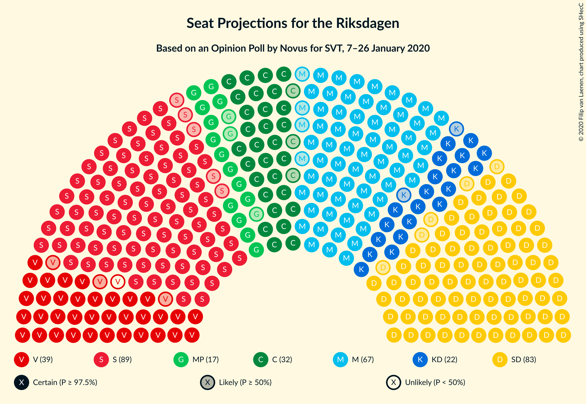
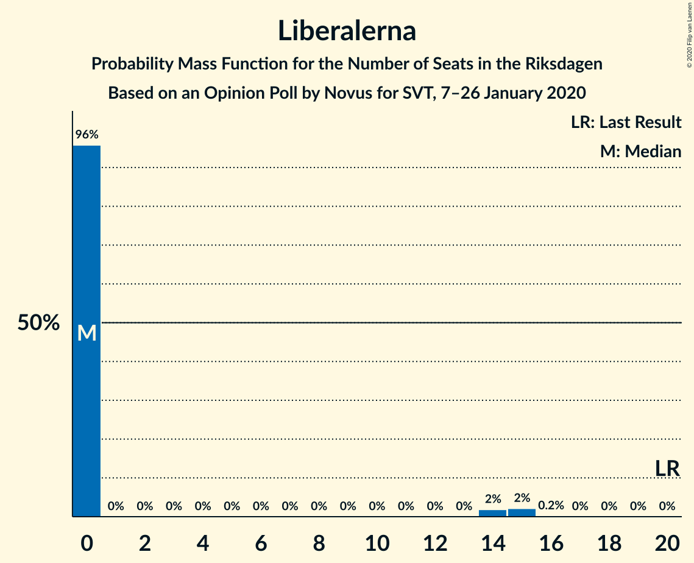
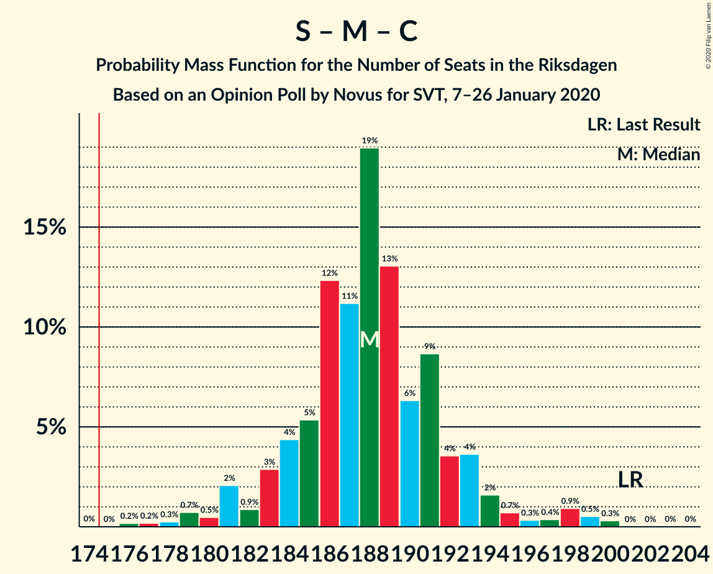
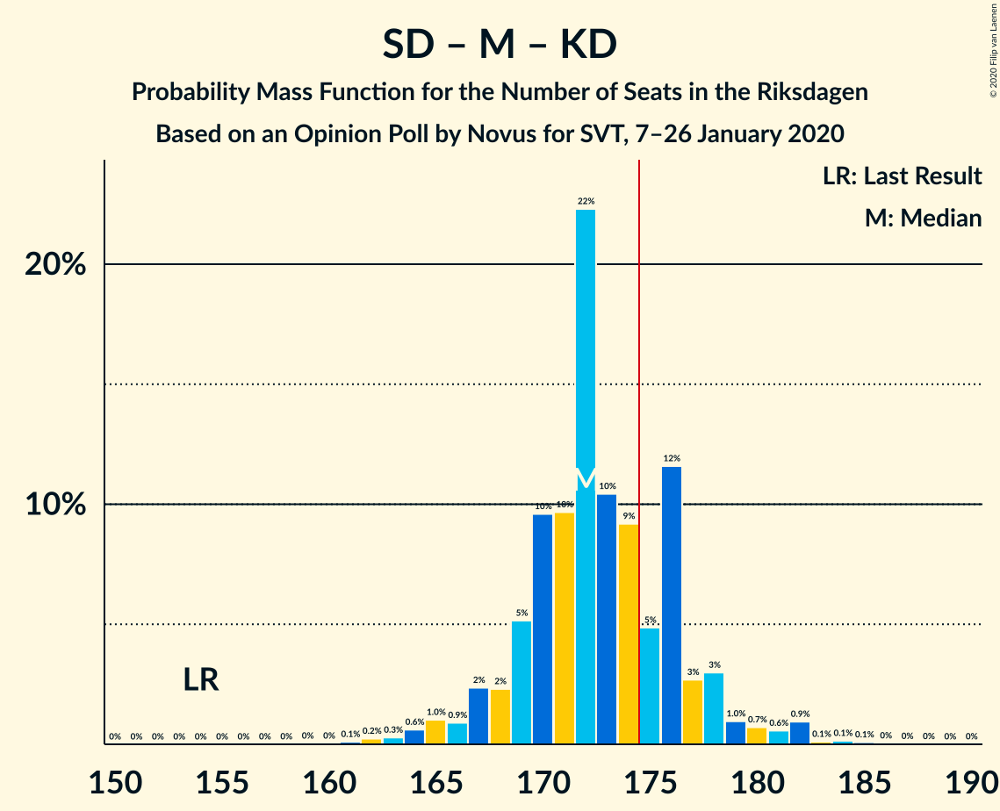

# Opinion Poll by Novus for SVT, 7–26 January 2020

<a href="#voting-intentions">Voting Intentions</a> | <a href="#seats">Seats</a> | <a href="#coalitions">Coalitions</a> | <a href="#technical-information">Technical Information</a>

## Voting Intentions

### Confidence Intervals

| Party | Last Result | Poll Result | 80% Confidence Interval | 90% Confidence Interval | 95% Confidence Interval | 99% Confidence Interval |
|:-----:|:-----------:|:-----------:|:-----------------------:|:-----------------------:|:-----------------------:|:-----------------------:|
| Sveriges socialdemokratiska arbetareparti | 28.3% | 24.2% | 23.4–25.0% |23.2–25.3% |23.0–25.5% |22.6–25.9% |
| Sverigedemokraterna | 17.5% | 22.6% | 21.8–23.4% |21.6–23.7% |21.4–23.9% |21.0–24.3% |
| Moderata samlingspartiet | 19.8% | 18.3% | 17.6–19.1% |17.4–19.3% |17.2–19.5% |16.8–19.9% |
| Vänsterpartiet | 8.0% | 10.4% | 9.8–11.0% |9.7–11.2% |9.5–11.3% |9.3–11.6% |
| Centerpartiet | 8.6% | 8.7% | 8.2–9.3% |8.0–9.4% |7.9–9.6% |7.7–9.8% |
| Kristdemokraterna | 6.3% | 6.1% | 5.7–6.6% |5.5–6.7% |5.4–6.8% |5.2–7.1% |
| Miljöpartiet de gröna | 4.4% | 4.6% | 4.2–5.0% |4.1–5.2% |4.0–5.3% |3.8–5.5% |
| Liberalerna | 5.5% | 3.5% | 3.2–3.9% |3.1–4.0% |3.0–4.1% |2.8–4.3% |

*Note:* The poll result column reflects the actual value used in the calculations. Published results may vary slightly, and in addition be rounded to fewer digits.

## Seats

### Confidence Intervals

| Party | Last Result | Median | 80% Confidence Interval | 90% Confidence Interval | 95% Confidence Interval | 99% Confidence Interval |
|:-----:|:-----------:|:------:|:-----------------------:|:-----------------------:|:-----------------------:|:-----------------------:|
| <a href="#sveriges-socialdemokratiska-arbetareparti">Sveriges socialdemokratiska arbetareparti</a> | 100 | 89 | 86–93 |85–94 |84–95 |83–96 |
| <a href="#sverigedemokraterna">Sverigedemokraterna</a> | 62 | 82 | 79–85 |79–86 |79–87 |77–89 |
| <a href="#moderata-samlingspartiet">Moderata samlingspartiet</a> | 70 | 67 | 63–70 |63–71 |63–72 |61–73 |
| <a href="#vänsterpartiet">Vänsterpartiet</a> | 28 | 38 | 36–41 |36–41 |35–42 |34–43 |
| <a href="#centerpartiet">Centerpartiet</a> | 31 | 32 | 29–34 |29–34 |29–35 |28–36 |
| <a href="#kristdemokraterna">Kristdemokraterna</a> | 22 | 22 | 21–24 |20–24 |20–25 |19–25 |
| <a href="#miljöpartiet-de-gröna">Miljöpartiet de gröna</a> | 16 | 17 | 16–18 |15–19 |15–20 |0–20 |
| <a href="#liberalerna">Liberalerna</a> | 20 | 0 | 0 |0–14 |0–14 |0–15 |

### Sveriges socialdemokratiska arbetareparti

*For a full overview of the results for this party, see the [Sveriges socialdemokratiska arbetareparti](party-sverigessocialdemokratiskaarbetareparti.html) page.*

| Number of Seats | Probability | Accumulated | Special Marks |
|:---------------:|:-----------:|:-----------:|:-------------:|
| 79 | 0.1% | 100% |  |
| 80 | 0% | 99.9% |  |
| 81 | 0% | 99.9% |  |
| 82 | 0.2% | 99.9% |  |
| 83 | 0.6% | 99.6% |  |
| 84 | 3% | 99.1% |  |
| 85 | 4% | 96% |  |
| 86 | 12% | 92% |  |
| 87 | 5% | 80% |  |
| 88 | 14% | 75% |  |
| 89 | 18% | 60% | Median |
| 90 | 11% | 43% |  |
| 91 | 9% | 32% |  |
| 92 | 9% | 23% |  |
| 93 | 9% | 14% |  |
| 94 | 2% | 5% |  |
| 95 | 2% | 3% |  |
| 96 | 0.6% | 0.8% |  |
| 97 | 0.2% | 0.2% |  |
| 98 | 0% | 0% |  |
| 99 | 0% | 0% |  |
| 100 | 0% | 0% | Last Result |

### Sverigedemokraterna

*For a full overview of the results for this party, see the [Sverigedemokraterna](party-sverigedemokraterna.html) page.*

| Number of Seats | Probability | Accumulated | Special Marks |
|:---------------:|:-----------:|:-----------:|:-------------:|
| 62 | 0% | 100% | Last Result |
| 63 | 0% | 100% |  |
| 64 | 0% | 100% |  |
| 65 | 0% | 100% |  |
| 66 | 0% | 100% |  |
| 67 | 0% | 100% |  |
| 68 | 0% | 100% |  |
| 69 | 0% | 100% |  |
| 70 | 0% | 100% |  |
| 71 | 0% | 100% |  |
| 72 | 0% | 100% |  |
| 73 | 0% | 100% |  |
| 74 | 0% | 100% |  |
| 75 | 0.1% | 100% |  |
| 76 | 0.2% | 99.9% |  |
| 77 | 0.8% | 99.7% |  |
| 78 | 1.4% | 98.9% |  |
| 79 | 13% | 98% |  |
| 80 | 6% | 85% |  |
| 81 | 18% | 79% |  |
| 82 | 15% | 61% | Median |
| 83 | 14% | 46% |  |
| 84 | 17% | 31% |  |
| 85 | 6% | 15% |  |
| 86 | 4% | 8% |  |
| 87 | 3% | 4% |  |
| 88 | 0.9% | 2% |  |
| 89 | 0.7% | 0.9% |  |
| 90 | 0.1% | 0.2% |  |
| 91 | 0% | 0.1% |  |
| 92 | 0.1% | 0.1% |  |
| 93 | 0% | 0% |  |

### Moderata samlingspartiet

*For a full overview of the results for this party, see the [Moderata samlingspartiet](party-moderatasamlingspartiet.html) page.*

| Number of Seats | Probability | Accumulated | Special Marks |
|:---------------:|:-----------:|:-----------:|:-------------:|
| 59 | 0.1% | 100% |  |
| 60 | 0% | 99.9% |  |
| 61 | 1.0% | 99.9% |  |
| 62 | 0.5% | 98.9% |  |
| 63 | 10% | 98% |  |
| 64 | 5% | 88% |  |
| 65 | 5% | 83% |  |
| 66 | 5% | 78% |  |
| 67 | 28% | 73% | Median |
| 68 | 8% | 45% |  |
| 69 | 26% | 37% |  |
| 70 | 2% | 11% | Last Result |
| 71 | 5% | 9% |  |
| 72 | 3% | 4% |  |
| 73 | 0.4% | 0.8% |  |
| 74 | 0.3% | 0.4% |  |
| 75 | 0% | 0.1% |  |
| 76 | 0% | 0.1% |  |
| 77 | 0% | 0% |  |

### Vänsterpartiet

*For a full overview of the results for this party, see the [Vänsterpartiet](party-vänsterpartiet.html) page.*

| Number of Seats | Probability | Accumulated | Special Marks |
|:---------------:|:-----------:|:-----------:|:-------------:|
| 28 | 0% | 100% | Last Result |
| 29 | 0% | 100% |  |
| 30 | 0% | 100% |  |
| 31 | 0% | 100% |  |
| 32 | 0% | 100% |  |
| 33 | 0.2% | 100% |  |
| 34 | 1.2% | 99.7% |  |
| 35 | 2% | 98.6% |  |
| 36 | 19% | 96% |  |
| 37 | 15% | 77% |  |
| 38 | 22% | 62% | Median |
| 39 | 15% | 40% |  |
| 40 | 12% | 25% |  |
| 41 | 9% | 12% |  |
| 42 | 2% | 3% |  |
| 43 | 0.4% | 0.6% |  |
| 44 | 0.2% | 0.2% |  |
| 45 | 0% | 0% |  |

### Centerpartiet

*For a full overview of the results for this party, see the [Centerpartiet](party-centerpartiet.html) page.*

| Number of Seats | Probability | Accumulated | Special Marks |
|:---------------:|:-----------:|:-----------:|:-------------:|
| 27 | 0.1% | 100% |  |
| 28 | 1.3% | 99.9% |  |
| 29 | 15% | 98.6% |  |
| 30 | 10% | 83% |  |
| 31 | 14% | 74% | Last Result |
| 32 | 28% | 59% | Median |
| 33 | 20% | 32% |  |
| 34 | 8% | 11% |  |
| 35 | 1.4% | 4% |  |
| 36 | 2% | 2% |  |
| 37 | 0.5% | 0.5% |  |
| 38 | 0% | 0% |  |

### Kristdemokraterna

*For a full overview of the results for this party, see the [Kristdemokraterna](party-kristdemokraterna.html) page.*

| Number of Seats | Probability | Accumulated | Special Marks |
|:---------------:|:-----------:|:-----------:|:-------------:|
| 18 | 0.1% | 100% |  |
| 19 | 0.4% | 99.9% |  |
| 20 | 9% | 99.5% |  |
| 21 | 28% | 90% |  |
| 22 | 20% | 62% | Last Result, Median |
| 23 | 23% | 42% |  |
| 24 | 14% | 19% |  |
| 25 | 4% | 5% |  |
| 26 | 0.2% | 0.4% |  |
| 27 | 0.2% | 0.2% |  |
| 28 | 0% | 0% |  |

### Miljöpartiet de gröna

*For a full overview of the results for this party, see the [Miljöpartiet de gröna](party-miljöpartietdegröna.html) page.*

| Number of Seats | Probability | Accumulated | Special Marks |
|:---------------:|:-----------:|:-----------:|:-------------:|
| 0 | 0.8% | 100% |  |
| 1 | 0% | 99.2% |  |
| 2 | 0% | 99.2% |  |
| 3 | 0% | 99.2% |  |
| 4 | 0% | 99.2% |  |
| 5 | 0% | 99.2% |  |
| 6 | 0% | 99.2% |  |
| 7 | 0% | 99.2% |  |
| 8 | 0% | 99.2% |  |
| 9 | 0% | 99.2% |  |
| 10 | 0% | 99.2% |  |
| 11 | 0% | 99.2% |  |
| 12 | 0% | 99.2% |  |
| 13 | 0% | 99.2% |  |
| 14 | 0% | 99.2% |  |
| 15 | 7% | 99.1% |  |
| 16 | 28% | 92% | Last Result |
| 17 | 36% | 64% | Median |
| 18 | 20% | 28% |  |
| 19 | 5% | 8% |  |
| 20 | 3% | 3% |  |
| 21 | 0.2% | 0.2% |  |
| 22 | 0% | 0% |  |

### Liberalerna

*For a full overview of the results for this party, see the [Liberalerna](party-liberalerna.html) page.*

| Number of Seats | Probability | Accumulated | Special Marks |
|:---------------:|:-----------:|:-----------:|:-------------:|
| 0 | 90% | 100% | Median |
| 1 | 0% | 10% |  |
| 2 | 0% | 10% |  |
| 3 | 0% | 10% |  |
| 4 | 0% | 10% |  |
| 5 | 0% | 10% |  |
| 6 | 0% | 10% |  |
| 7 | 0% | 10% |  |
| 8 | 0% | 10% |  |
| 9 | 0% | 10% |  |
| 10 | 0% | 10% |  |
| 11 | 0% | 10% |  |
| 12 | 0% | 10% |  |
| 13 | 0% | 10% |  |
| 14 | 9% | 10% |  |
| 15 | 1.1% | 1.4% |  |
| 16 | 0.3% | 0.3% |  |
| 17 | 0% | 0% |  |
| 18 | 0% | 0% |  |
| 19 | 0% | 0% |  |
| 20 | 0% | 0% | Last Result |

## Coalitions

### Confidence Intervals

| Coalition | Last Result | Median | Majority? | 80% Confidence Interval | 90% Confidence Interval | 95% Confidence Interval | 99% Confidence Interval |
|:---------:|:-----------:|:------:|:---------:|:-----------------------:|:-----------------------:|:-----------------------:|:-----------------------:|
| Sveriges socialdemokratiska arbetareparti – Moderata samlingspartiet – Centerpartiet | 201 | 188 | 99.9% | 182–193 | 181–194 | 181–194 | 177–197 |
| Sveriges socialdemokratiska arbetareparti – Vänsterpartiet – Centerpartiet – Miljöpartiet de gröna – Liberalerna | 195 | 177 | 81% | 173–182 | 171–184 | 171–184 | 168–185 |
| Sverigedemokraterna – Moderata samlingspartiet – Kristdemokraterna | 154 | 172 | 19% | 167–176 | 165–178 | 165–178 | 164–181 |
| Sveriges socialdemokratiska arbetareparti – Moderata samlingspartiet | 170 | 158 | 0% | 150–160 | 149–161 | 149–162 | 147–164 |
| Sverigedemokraterna – Moderata samlingspartiet | 132 | 149 | 0% | 145–153 | 144–154 | 144–156 | 140–157 |
| Sveriges socialdemokratiska arbetareparti – Vänsterpartiet – Miljöpartiet de gröna | 144 | 144 | 0% | 138–148 | 138–150 | 138–150 | 133–151 |
| Sveriges socialdemokratiska arbetareparti – Centerpartiet – Miljöpartiet de gröna – Liberalerna | 167 | 138 | 0% | 135–145 | 134–148 | 134–148 | 129–148 |
| Sveriges socialdemokratiska arbetareparti – Vänsterpartiet | 128 | 127 | 0% | 122–131 | 122–132 | 122–133 | 119–135 |
| Moderata samlingspartiet – Centerpartiet – Kristdemokraterna – Liberalerna | 143 | 121 | 0% | 119–129 | 119–130 | 118–130 | 115–134 |
| Moderata samlingspartiet – Centerpartiet – Kristdemokraterna | 123 | 121 | 0% | 116–126 | 116–126 | 116–127 | 114–129 |
| Sveriges socialdemokratiska arbetareparti – Miljöpartiet de gröna | 116 | 106 | 0% | 102–110 | 101–110 | 101–111 | 94–113 |
| Moderata samlingspartiet – Centerpartiet – Liberalerna | 121 | 100 | 0% | 96–105 | 96–109 | 95–109 | 93–112 |
| Moderata samlingspartiet – Centerpartiet | 101 | 99 | 0% | 95–103 | 95–104 | 95–105 | 91–106 |

### Sveriges socialdemokratiska arbetareparti – Moderata samlingspartiet – Centerpartiet

| Number of Seats | Probability | Accumulated | Special Marks |
|:---------------:|:-----------:|:-----------:|:-------------:|
| 174 | 0.1% | 100% |  |
| 175 | 0% | 99.9% | Majority |
| 176 | 0% | 99.9% |  |
| 177 | 0.8% | 99.9% |  |
| 178 | 0.4% | 99.2% |  |
| 179 | 0.1% | 98.8% |  |
| 180 | 0.3% | 98.7% |  |
| 181 | 8% | 98% |  |
| 182 | 1.1% | 90% |  |
| 183 | 0.8% | 89% |  |
| 184 | 4% | 88% |  |
| 185 | 8% | 84% |  |
| 186 | 6% | 76% |  |
| 187 | 12% | 70% |  |
| 188 | 10% | 58% | Median |
| 189 | 2% | 49% |  |
| 190 | 14% | 47% |  |
| 191 | 18% | 33% |  |
| 192 | 4% | 15% |  |
| 193 | 5% | 11% |  |
| 194 | 4% | 6% |  |
| 195 | 0.8% | 2% |  |
| 196 | 0.2% | 1.0% |  |
| 197 | 0.4% | 0.8% |  |
| 198 | 0% | 0.4% |  |
| 199 | 0% | 0.4% |  |
| 200 | 0.3% | 0.3% |  |
| 201 | 0% | 0.1% | Last Result |
| 202 | 0% | 0.1% |  |
| 203 | 0% | 0.1% |  |
| 204 | 0% | 0% |  |

### Sveriges socialdemokratiska arbetareparti – Vänsterpartiet – Centerpartiet – Miljöpartiet de gröna – Liberalerna

| Number of Seats | Probability | Accumulated | Special Marks |
|:---------------:|:-----------:|:-----------:|:-------------:|
| 163 | 0% | 100% |  |
| 164 | 0% | 99.9% |  |
| 165 | 0% | 99.9% |  |
| 166 | 0.1% | 99.9% |  |
| 167 | 0.1% | 99.8% |  |
| 168 | 0.2% | 99.6% |  |
| 169 | 0.1% | 99.5% |  |
| 170 | 0.9% | 99.4% |  |
| 171 | 4% | 98% |  |
| 172 | 0.3% | 94% |  |
| 173 | 8% | 94% |  |
| 174 | 4% | 86% |  |
| 175 | 4% | 81% | Majority |
| 176 | 19% | 77% | Median |
| 177 | 21% | 59% |  |
| 178 | 5% | 38% |  |
| 179 | 14% | 33% |  |
| 180 | 3% | 20% |  |
| 181 | 6% | 16% |  |
| 182 | 0.4% | 10% |  |
| 183 | 0.1% | 10% |  |
| 184 | 8% | 10% |  |
| 185 | 0.8% | 1.3% |  |
| 186 | 0.2% | 0.5% |  |
| 187 | 0.1% | 0.3% |  |
| 188 | 0% | 0.2% |  |
| 189 | 0% | 0.1% |  |
| 190 | 0.1% | 0.1% |  |
| 191 | 0% | 0% |  |
| 192 | 0% | 0% |  |
| 193 | 0% | 0% |  |
| 194 | 0% | 0% |  |
| 195 | 0% | 0% | Last Result |

### Sverigedemokraterna – Moderata samlingspartiet – Kristdemokraterna

| Number of Seats | Probability | Accumulated | Special Marks |
|:---------------:|:-----------:|:-----------:|:-------------:|
| 154 | 0% | 100% | Last Result |
| 155 | 0% | 100% |  |
| 156 | 0% | 100% |  |
| 157 | 0% | 100% |  |
| 158 | 0% | 100% |  |
| 159 | 0.1% | 100% |  |
| 160 | 0% | 99.9% |  |
| 161 | 0% | 99.9% |  |
| 162 | 0.1% | 99.8% |  |
| 163 | 0.2% | 99.7% |  |
| 164 | 0.8% | 99.5% |  |
| 165 | 8% | 98.7% |  |
| 166 | 0.1% | 90% |  |
| 167 | 0.4% | 90% |  |
| 168 | 6% | 90% |  |
| 169 | 3% | 84% |  |
| 170 | 14% | 80% |  |
| 171 | 5% | 67% | Median |
| 172 | 21% | 62% |  |
| 173 | 19% | 41% |  |
| 174 | 4% | 23% |  |
| 175 | 4% | 19% | Majority |
| 176 | 8% | 14% |  |
| 177 | 0.3% | 6% |  |
| 178 | 4% | 6% |  |
| 179 | 0.9% | 2% |  |
| 180 | 0.1% | 0.6% |  |
| 181 | 0.2% | 0.5% |  |
| 182 | 0.1% | 0.4% |  |
| 183 | 0.1% | 0.2% |  |
| 184 | 0% | 0.1% |  |
| 185 | 0% | 0.1% |  |
| 186 | 0% | 0.1% |  |
| 187 | 0% | 0% |  |

### Sveriges socialdemokratiska arbetareparti – Moderata samlingspartiet

| Number of Seats | Probability | Accumulated | Special Marks |
|:---------------:|:-----------:|:-----------:|:-------------:|
| 144 | 0% | 100% |  |
| 145 | 0% | 99.9% |  |
| 146 | 0% | 99.9% |  |
| 147 | 0.7% | 99.9% |  |
| 148 | 0.2% | 99.1% |  |
| 149 | 8% | 98.9% |  |
| 150 | 5% | 91% |  |
| 151 | 4% | 86% |  |
| 152 | 2% | 83% |  |
| 153 | 1.3% | 81% |  |
| 154 | 2% | 80% |  |
| 155 | 10% | 78% |  |
| 156 | 6% | 68% | Median |
| 157 | 11% | 62% |  |
| 158 | 15% | 51% |  |
| 159 | 14% | 36% |  |
| 160 | 13% | 22% |  |
| 161 | 5% | 9% |  |
| 162 | 2% | 4% |  |
| 163 | 0.6% | 2% |  |
| 164 | 0.5% | 0.9% |  |
| 165 | 0.2% | 0.5% |  |
| 166 | 0.1% | 0.2% |  |
| 167 | 0.1% | 0.2% |  |
| 168 | 0% | 0.1% |  |
| 169 | 0% | 0.1% |  |
| 170 | 0% | 0.1% | Last Result |
| 171 | 0% | 0% |  |

### Sverigedemokraterna – Moderata samlingspartiet

| Number of Seats | Probability | Accumulated | Special Marks |
|:---------------:|:-----------:|:-----------:|:-------------:|
| 132 | 0% | 100% | Last Result |
| 133 | 0% | 100% |  |
| 134 | 0% | 100% |  |
| 135 | 0% | 100% |  |
| 136 | 0% | 100% |  |
| 137 | 0% | 100% |  |
| 138 | 0% | 100% |  |
| 139 | 0.1% | 100% |  |
| 140 | 0.8% | 99.9% |  |
| 141 | 0.1% | 99.1% |  |
| 142 | 0.2% | 98.9% |  |
| 143 | 0.2% | 98.7% |  |
| 144 | 9% | 98.6% |  |
| 145 | 6% | 90% |  |
| 146 | 1.4% | 84% |  |
| 147 | 4% | 83% |  |
| 148 | 12% | 79% |  |
| 149 | 20% | 67% | Median |
| 150 | 12% | 47% |  |
| 151 | 4% | 35% |  |
| 152 | 6% | 31% |  |
| 153 | 19% | 25% |  |
| 154 | 1.0% | 6% |  |
| 155 | 1.3% | 5% |  |
| 156 | 2% | 4% |  |
| 157 | 0.8% | 1.3% |  |
| 158 | 0.2% | 0.5% |  |
| 159 | 0.1% | 0.3% |  |
| 160 | 0.1% | 0.2% |  |
| 161 | 0.1% | 0.2% |  |
| 162 | 0% | 0.1% |  |
| 163 | 0% | 0% |  |

### Sveriges socialdemokratiska arbetareparti – Vänsterpartiet – Miljöpartiet de gröna

| Number of Seats | Probability | Accumulated | Special Marks |
|:---------------:|:-----------:|:-----------:|:-------------:|
| 127 | 0% | 100% |  |
| 128 | 0% | 99.9% |  |
| 129 | 0% | 99.9% |  |
| 130 | 0% | 99.9% |  |
| 131 | 0% | 99.9% |  |
| 132 | 0% | 99.9% |  |
| 133 | 0.3% | 99.8% |  |
| 134 | 0.1% | 99.5% |  |
| 135 | 0.1% | 99.4% |  |
| 136 | 0.9% | 99.3% |  |
| 137 | 0.2% | 98% |  |
| 138 | 8% | 98% |  |
| 139 | 2% | 90% |  |
| 140 | 2% | 88% |  |
| 141 | 5% | 86% |  |
| 142 | 8% | 82% |  |
| 143 | 4% | 74% |  |
| 144 | 26% | 70% | Last Result, Median |
| 145 | 6% | 43% |  |
| 146 | 10% | 38% |  |
| 147 | 13% | 28% |  |
| 148 | 8% | 14% |  |
| 149 | 0.2% | 6% |  |
| 150 | 5% | 6% |  |
| 151 | 0.5% | 0.8% |  |
| 152 | 0.1% | 0.3% |  |
| 153 | 0.1% | 0.1% |  |
| 154 | 0% | 0% |  |

### Sveriges socialdemokratiska arbetareparti – Centerpartiet – Miljöpartiet de gröna – Liberalerna

| Number of Seats | Probability | Accumulated | Special Marks |
|:---------------:|:-----------:|:-----------:|:-------------:|
| 123 | 0% | 100% |  |
| 124 | 0.1% | 99.9% |  |
| 125 | 0% | 99.9% |  |
| 126 | 0% | 99.8% |  |
| 127 | 0% | 99.8% |  |
| 128 | 0.2% | 99.8% |  |
| 129 | 0.1% | 99.6% |  |
| 130 | 0.1% | 99.4% |  |
| 131 | 0.6% | 99.4% |  |
| 132 | 0.3% | 98.8% |  |
| 133 | 0.9% | 98% |  |
| 134 | 3% | 98% |  |
| 135 | 9% | 94% |  |
| 136 | 14% | 86% |  |
| 137 | 9% | 71% |  |
| 138 | 15% | 63% | Median |
| 139 | 3% | 48% |  |
| 140 | 18% | 45% |  |
| 141 | 9% | 27% |  |
| 142 | 3% | 18% |  |
| 143 | 2% | 15% |  |
| 144 | 3% | 14% |  |
| 145 | 0.4% | 10% |  |
| 146 | 1.0% | 10% |  |
| 147 | 0.7% | 9% |  |
| 148 | 8% | 8% |  |
| 149 | 0% | 0.4% |  |
| 150 | 0% | 0.4% |  |
| 151 | 0.1% | 0.3% |  |
| 152 | 0.1% | 0.2% |  |
| 153 | 0% | 0.1% |  |
| 154 | 0.1% | 0.1% |  |
| 155 | 0% | 0% |  |
| 156 | 0% | 0% |  |
| 157 | 0% | 0% |  |
| 158 | 0% | 0% |  |
| 159 | 0% | 0% |  |
| 160 | 0% | 0% |  |
| 161 | 0% | 0% |  |
| 162 | 0% | 0% |  |
| 163 | 0% | 0% |  |
| 164 | 0% | 0% |  |
| 165 | 0% | 0% |  |
| 166 | 0% | 0% |  |
| 167 | 0% | 0% | Last Result |

### Sveriges socialdemokratiska arbetareparti – Vänsterpartiet

| Number of Seats | Probability | Accumulated | Special Marks |
|:---------------:|:-----------:|:-----------:|:-------------:|
| 118 | 0.1% | 100% |  |
| 119 | 0.4% | 99.8% |  |
| 120 | 0.6% | 99.4% |  |
| 121 | 0.3% | 98.8% |  |
| 122 | 9% | 98.5% |  |
| 123 | 2% | 89% |  |
| 124 | 5% | 87% |  |
| 125 | 5% | 82% |  |
| 126 | 16% | 77% |  |
| 127 | 15% | 61% | Median |
| 128 | 5% | 47% | Last Result |
| 129 | 19% | 42% |  |
| 130 | 4% | 23% |  |
| 131 | 11% | 19% |  |
| 132 | 3% | 7% |  |
| 133 | 3% | 4% |  |
| 134 | 0.6% | 1.2% |  |
| 135 | 0.2% | 0.6% |  |
| 136 | 0.1% | 0.4% |  |
| 137 | 0% | 0.3% |  |
| 138 | 0.1% | 0.3% |  |
| 139 | 0.2% | 0.2% |  |
| 140 | 0% | 0% |  |

### Moderata samlingspartiet – Centerpartiet – Kristdemokraterna – Liberalerna

| Number of Seats | Probability | Accumulated | Special Marks |
|:---------------:|:-----------:|:-----------:|:-------------:|
| 113 | 0.2% | 100% |  |
| 114 | 0.2% | 99.8% |  |
| 115 | 0.4% | 99.6% |  |
| 116 | 0.4% | 99.2% |  |
| 117 | 0.3% | 98.8% |  |
| 118 | 2% | 98.6% |  |
| 119 | 14% | 97% |  |
| 120 | 16% | 83% |  |
| 121 | 24% | 67% | Median |
| 122 | 11% | 43% |  |
| 123 | 2% | 31% |  |
| 124 | 0.1% | 29% |  |
| 125 | 3% | 29% |  |
| 126 | 11% | 26% |  |
| 127 | 3% | 15% |  |
| 128 | 1.1% | 12% |  |
| 129 | 1.2% | 10% |  |
| 130 | 8% | 9% |  |
| 131 | 0.6% | 1.3% |  |
| 132 | 0% | 0.7% |  |
| 133 | 0.1% | 0.6% |  |
| 134 | 0.1% | 0.5% |  |
| 135 | 0.3% | 0.5% |  |
| 136 | 0.1% | 0.2% |  |
| 137 | 0.1% | 0.1% |  |
| 138 | 0% | 0% |  |
| 139 | 0% | 0% |  |
| 140 | 0% | 0% |  |
| 141 | 0% | 0% |  |
| 142 | 0% | 0% |  |
| 143 | 0% | 0% | Last Result |

### Moderata samlingspartiet – Centerpartiet – Kristdemokraterna

| Number of Seats | Probability | Accumulated | Special Marks |
|:---------------:|:-----------:|:-----------:|:-------------:|
| 113 | 0.2% | 100% |  |
| 114 | 0.3% | 99.7% |  |
| 115 | 1.4% | 99.4% |  |
| 116 | 9% | 98% |  |
| 117 | 0.3% | 89% |  |
| 118 | 2% | 89% |  |
| 119 | 14% | 87% |  |
| 120 | 16% | 74% |  |
| 121 | 24% | 58% | Median |
| 122 | 12% | 33% |  |
| 123 | 2% | 22% | Last Result |
| 124 | 0.1% | 19% |  |
| 125 | 3% | 19% |  |
| 126 | 11% | 16% |  |
| 127 | 3% | 5% |  |
| 128 | 1.1% | 2% |  |
| 129 | 0.4% | 0.5% |  |
| 130 | 0.1% | 0.2% |  |
| 131 | 0% | 0.1% |  |
| 132 | 0% | 0.1% |  |
| 133 | 0% | 0.1% |  |
| 134 | 0% | 0.1% |  |
| 135 | 0% | 0% |  |

### Sveriges socialdemokratiska arbetareparti – Miljöpartiet de gröna

| Number of Seats | Probability | Accumulated | Special Marks |
|:---------------:|:-----------:|:-----------:|:-------------:|
| 87 | 0% | 100% |  |
| 88 | 0% | 99.9% |  |
| 89 | 0% | 99.9% |  |
| 90 | 0% | 99.9% |  |
| 91 | 0% | 99.9% |  |
| 92 | 0% | 99.9% |  |
| 93 | 0% | 99.8% |  |
| 94 | 0.3% | 99.8% |  |
| 95 | 0.1% | 99.5% |  |
| 96 | 0.3% | 99.4% |  |
| 97 | 0.1% | 99.2% |  |
| 98 | 0.2% | 99.1% |  |
| 99 | 0.2% | 98.9% |  |
| 100 | 0.7% | 98.7% |  |
| 101 | 4% | 98% |  |
| 102 | 9% | 94% |  |
| 103 | 6% | 85% |  |
| 104 | 6% | 79% |  |
| 105 | 4% | 72% |  |
| 106 | 22% | 68% | Median |
| 107 | 19% | 46% |  |
| 108 | 2% | 27% |  |
| 109 | 13% | 25% |  |
| 110 | 7% | 12% |  |
| 111 | 2% | 4% |  |
| 112 | 1.4% | 2% |  |
| 113 | 0.4% | 0.7% |  |
| 114 | 0.2% | 0.2% |  |
| 115 | 0% | 0% |  |
| 116 | 0% | 0% | Last Result |

### Moderata samlingspartiet – Centerpartiet – Liberalerna

| Number of Seats | Probability | Accumulated | Special Marks |
|:---------------:|:-----------:|:-----------:|:-------------:|
| 91 | 0.2% | 100% |  |
| 92 | 0.2% | 99.8% |  |
| 93 | 0.2% | 99.6% |  |
| 94 | 0.4% | 99.4% |  |
| 95 | 3% | 99.0% |  |
| 96 | 9% | 96% |  |
| 97 | 12% | 87% |  |
| 98 | 12% | 76% |  |
| 99 | 6% | 64% | Median |
| 100 | 22% | 58% |  |
| 101 | 6% | 36% |  |
| 102 | 9% | 30% |  |
| 103 | 4% | 20% |  |
| 104 | 3% | 16% |  |
| 105 | 3% | 13% |  |
| 106 | 0.5% | 10% |  |
| 107 | 0.2% | 9% |  |
| 108 | 0.4% | 9% |  |
| 109 | 8% | 9% |  |
| 110 | 0.4% | 1.0% |  |
| 111 | 0.1% | 0.6% |  |
| 112 | 0.1% | 0.5% |  |
| 113 | 0.3% | 0.5% |  |
| 114 | 0% | 0.2% |  |
| 115 | 0.1% | 0.1% |  |
| 116 | 0% | 0.1% |  |
| 117 | 0% | 0% |  |
| 118 | 0% | 0% |  |
| 119 | 0% | 0% |  |
| 120 | 0% | 0% |  |
| 121 | 0% | 0% | Last Result |

### Moderata samlingspartiet – Centerpartiet

| Number of Seats | Probability | Accumulated | Special Marks |
|:---------------:|:-----------:|:-----------:|:-------------:|
| 91 | 0.9% | 100% |  |
| 92 | 0.3% | 99.1% |  |
| 93 | 0.5% | 98.8% |  |
| 94 | 0.7% | 98% |  |
| 95 | 11% | 98% |  |
| 96 | 9% | 87% |  |
| 97 | 12% | 78% |  |
| 98 | 12% | 66% |  |
| 99 | 6% | 54% | Median |
| 100 | 22% | 48% |  |
| 101 | 6% | 26% | Last Result |
| 102 | 9% | 20% |  |
| 103 | 4% | 10% |  |
| 104 | 3% | 6% |  |
| 105 | 2% | 3% |  |
| 106 | 0.5% | 0.8% |  |
| 107 | 0.1% | 0.2% |  |
| 108 | 0.1% | 0.1% |  |
| 109 | 0% | 0.1% |  |
| 110 | 0% | 0% |  |

## Technical Information

### Opinion Poll

+ **Polling firm:** Novus
+ **Commissioner(s):** SVT
+ **Fieldwork period:** 7–26 January 2020

### Calculations

+ **Sample size:** 4414
+ **Simulations done:** 65,536
+ **Error estimate:** 1.04%

