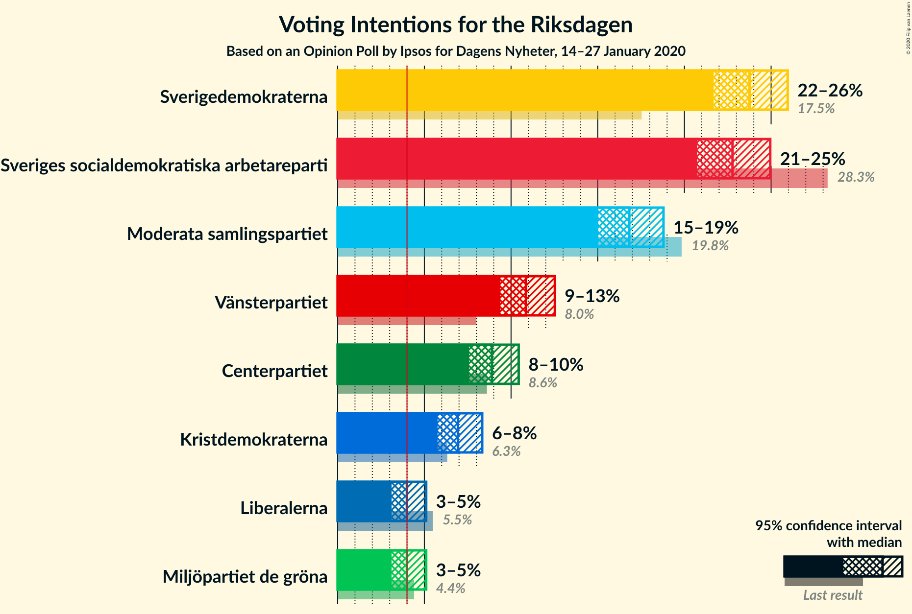
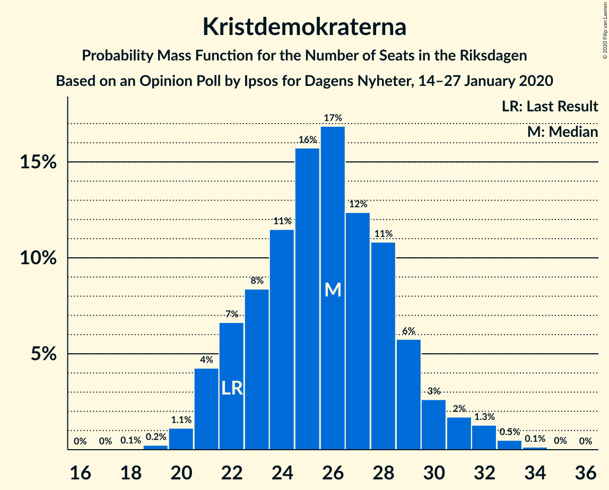
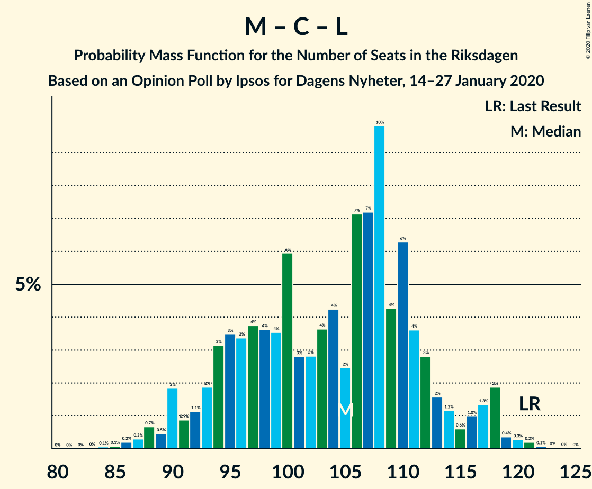

# Opinion Poll by Ipsos for Dagens Nyheter, 14–27 January 2020

<a href="#voting-intentions">Voting Intentions</a> | <a href="#seats">Seats</a> | <a href="#coalitions">Coalitions</a> | <a href="#technical-information">Technical Information</a>

## Voting Intentions

### Confidence Intervals

| Party | Last Result | Poll Result | 80% Confidence Interval | 90% Confidence Interval | 95% Confidence Interval | 99% Confidence Interval |
|:-----:|:-----------:|:-----------:|:-----------------------:|:-----------------------:|:-----------------------:|:-----------------------:|
| Sverigedemokraterna | 17.5% | 23.8% | 22.4–25.2% |22.0–25.6% |21.7–26.0% |21.0–26.7% |
| Sveriges socialdemokratiska arbetareparti | 28.3% | 22.8% | 21.4–24.2% |21.1–24.6% |20.7–25.0% |20.1–25.7% |
| Moderata samlingspartiet | 19.8% | 16.8% | 15.6–18.1% |15.3–18.5% |15.0–18.8% |14.5–19.4% |
| Vänsterpartiet | 8.0% | 10.9% | 9.9–11.9% |9.6–12.3% |9.4–12.5% |8.9–13.1% |
| Centerpartiet | 8.6% | 8.9% | 8.0–9.9% |7.8–10.2% |7.6–10.4% |7.2–10.9% |
| Kristdemokraterna | 6.3% | 6.9% | 6.2–7.8% |5.9–8.1% |5.8–8.3% |5.4–8.8% |
| Liberalerna | 5.5% | 4.0% | 3.4–4.7% |3.2–4.9% |3.1–5.1% |2.9–5.5% |
| Miljöpartiet de gröna | 4.4% | 4.0% | 3.4–4.7% |3.2–4.9% |3.1–5.1% |2.9–5.5% |

*Note:* The poll result column reflects the actual value used in the calculations. Published results may vary slightly, and in addition be rounded to fewer digits.

## Seats

### Confidence Intervals

| Party | Last Result | Median | 80% Confidence Interval | 90% Confidence Interval | 95% Confidence Interval | 99% Confidence Interval |
|:-----:|:-----------:|:------:|:-----------------------:|:-----------------------:|:-----------------------:|:-----------------------:|
| <a href="#sverigedemokraterna">Sverigedemokraterna</a> | 62 | 88 | 79–94 |79–95 |78–95 |73–99 |
| <a href="#sveriges-socialdemokratiska-arbetareparti">Sveriges socialdemokratiska arbetareparti</a> | 100 | 83 | 78–89 |75–92 |72–93 |72–97 |
| <a href="#moderata-samlingspartiet">Moderata samlingspartiet</a> | 70 | 61 | 58–66 |56–69 |55–70 |52–72 |
| <a href="#vänsterpartiet">Vänsterpartiet</a> | 28 | 40 | 35–44 |33–45 |33–47 |32–49 |
| <a href="#centerpartiet">Centerpartiet</a> | 31 | 33 | 29–37 |28–38 |28–38 |26–40 |
| <a href="#kristdemokraterna">Kristdemokraterna</a> | 22 | 26 | 22–29 |22–29 |21–30 |21–32 |
| <a href="#liberalerna">Liberalerna</a> | 20 | 14 | 0–17 |0–18 |0–18 |0–20 |
| <a href="#miljöpartiet-de-gröna">Miljöpartiet de gröna</a> | 16 | 0 | 0–17 |0–17 |0–18 |0–20 |

### Sverigedemokraterna

*For a full overview of the results for this party, see the [Sverigedemokraterna](party-sverigedemokraterna.html) page.*

| Number of Seats | Probability | Accumulated | Special Marks |
|:---------------:|:-----------:|:-----------:|:-------------:|
| 62 | 0% | 100% | Last Result |
| 63 | 0% | 100% |  |
| 64 | 0% | 100% |  |
| 65 | 0% | 100% |  |
| 66 | 0% | 100% |  |
| 67 | 0% | 100% |  |
| 68 | 0% | 100% |  |
| 69 | 0% | 100% |  |
| 70 | 0% | 100% |  |
| 71 | 0% | 100% |  |
| 72 | 0% | 100% |  |
| 73 | 0.7% | 100% |  |
| 74 | 0.1% | 99.2% |  |
| 75 | 0% | 99.1% |  |
| 76 | 0.5% | 99.1% |  |
| 77 | 0.7% | 98.6% |  |
| 78 | 1.2% | 98% |  |
| 79 | 7% | 97% |  |
| 80 | 0.4% | 89% |  |
| 81 | 3% | 89% |  |
| 82 | 2% | 85% |  |
| 83 | 3% | 84% |  |
| 84 | 7% | 81% |  |
| 85 | 10% | 74% |  |
| 86 | 8% | 64% |  |
| 87 | 4% | 56% |  |
| 88 | 5% | 52% | Median |
| 89 | 7% | 47% |  |
| 90 | 9% | 40% |  |
| 91 | 5% | 31% |  |
| 92 | 7% | 26% |  |
| 93 | 4% | 19% |  |
| 94 | 6% | 15% |  |
| 95 | 7% | 9% |  |
| 96 | 0.3% | 2% |  |
| 97 | 0.7% | 2% |  |
| 98 | 0.1% | 1.5% |  |
| 99 | 1.0% | 1.4% |  |
| 100 | 0% | 0.3% |  |
| 101 | 0.1% | 0.3% |  |
| 102 | 0.1% | 0.2% |  |
| 103 | 0% | 0.1% |  |
| 104 | 0.1% | 0.1% |  |
| 105 | 0% | 0% |  |

### Sveriges socialdemokratiska arbetareparti

*For a full overview of the results for this party, see the [Sveriges socialdemokratiska arbetareparti](party-sverigessocialdemokratiskaarbetareparti.html) page.*

| Number of Seats | Probability | Accumulated | Special Marks |
|:---------------:|:-----------:|:-----------:|:-------------:|
| 69 | 0.1% | 100% |  |
| 70 | 0% | 99.9% |  |
| 71 | 0% | 99.9% |  |
| 72 | 2% | 99.8% |  |
| 73 | 0.3% | 97% |  |
| 74 | 0.8% | 97% |  |
| 75 | 2% | 96% |  |
| 76 | 1.2% | 94% |  |
| 77 | 1.3% | 93% |  |
| 78 | 3% | 92% |  |
| 79 | 3% | 89% |  |
| 80 | 6% | 87% |  |
| 81 | 14% | 81% |  |
| 82 | 11% | 67% |  |
| 83 | 7% | 56% | Median |
| 84 | 10% | 49% |  |
| 85 | 4% | 40% |  |
| 86 | 2% | 36% |  |
| 87 | 4% | 34% |  |
| 88 | 1.0% | 31% |  |
| 89 | 20% | 30% |  |
| 90 | 0.3% | 9% |  |
| 91 | 1.0% | 9% |  |
| 92 | 4% | 8% |  |
| 93 | 2% | 4% |  |
| 94 | 0.2% | 2% |  |
| 95 | 0.5% | 2% |  |
| 96 | 0% | 2% |  |
| 97 | 2% | 2% |  |
| 98 | 0% | 0.1% |  |
| 99 | 0.1% | 0.1% |  |
| 100 | 0% | 0% | Last Result |

### Moderata samlingspartiet

*For a full overview of the results for this party, see the [Moderata samlingspartiet](party-moderatasamlingspartiet.html) page.*

| Number of Seats | Probability | Accumulated | Special Marks |
|:---------------:|:-----------:|:-----------:|:-------------:|
| 50 | 0.1% | 100% |  |
| 51 | 0.1% | 99.9% |  |
| 52 | 0.3% | 99.7% |  |
| 53 | 0.1% | 99.4% |  |
| 54 | 0.5% | 99.3% |  |
| 55 | 2% | 98.8% |  |
| 56 | 3% | 97% |  |
| 57 | 1.5% | 93% |  |
| 58 | 10% | 92% |  |
| 59 | 13% | 82% |  |
| 60 | 9% | 69% |  |
| 61 | 13% | 60% | Median |
| 62 | 7% | 48% |  |
| 63 | 10% | 40% |  |
| 64 | 3% | 30% |  |
| 65 | 13% | 27% |  |
| 66 | 6% | 14% |  |
| 67 | 3% | 8% |  |
| 68 | 0.6% | 6% |  |
| 69 | 0.7% | 5% |  |
| 70 | 3% | 4% | Last Result |
| 71 | 0.3% | 1.1% |  |
| 72 | 0.3% | 0.8% |  |
| 73 | 0.3% | 0.5% |  |
| 74 | 0.1% | 0.2% |  |
| 75 | 0% | 0.1% |  |
| 76 | 0% | 0.1% |  |
| 77 | 0% | 0% |  |

### Vänsterpartiet

*For a full overview of the results for this party, see the [Vänsterpartiet](party-vänsterpartiet.html) page.*

| Number of Seats | Probability | Accumulated | Special Marks |
|:---------------:|:-----------:|:-----------:|:-------------:|
| 28 | 0% | 100% | Last Result |
| 29 | 0% | 100% |  |
| 30 | 0% | 100% |  |
| 31 | 0.4% | 100% |  |
| 32 | 0.3% | 99.5% |  |
| 33 | 5% | 99.3% |  |
| 34 | 2% | 94% |  |
| 35 | 3% | 92% |  |
| 36 | 2% | 90% |  |
| 37 | 4% | 88% |  |
| 38 | 7% | 84% |  |
| 39 | 13% | 77% |  |
| 40 | 16% | 64% | Median |
| 41 | 7% | 47% |  |
| 42 | 17% | 40% |  |
| 43 | 11% | 23% |  |
| 44 | 3% | 12% |  |
| 45 | 5% | 9% |  |
| 46 | 0.4% | 4% |  |
| 47 | 3% | 4% |  |
| 48 | 0.3% | 0.8% |  |
| 49 | 0.3% | 0.6% |  |
| 50 | 0.2% | 0.3% |  |
| 51 | 0% | 0.1% |  |
| 52 | 0.1% | 0.1% |  |
| 53 | 0% | 0% |  |

### Centerpartiet

*For a full overview of the results for this party, see the [Centerpartiet](party-centerpartiet.html) page.*

| Number of Seats | Probability | Accumulated | Special Marks |
|:---------------:|:-----------:|:-----------:|:-------------:|
| 24 | 0.1% | 100% |  |
| 25 | 0.1% | 99.9% |  |
| 26 | 0.5% | 99.8% |  |
| 27 | 0.6% | 99.3% |  |
| 28 | 4% | 98.7% |  |
| 29 | 8% | 95% |  |
| 30 | 2% | 87% |  |
| 31 | 21% | 85% | Last Result |
| 32 | 10% | 64% |  |
| 33 | 14% | 54% | Median |
| 34 | 9% | 40% |  |
| 35 | 9% | 31% |  |
| 36 | 4% | 22% |  |
| 37 | 13% | 18% |  |
| 38 | 4% | 5% |  |
| 39 | 0.6% | 2% |  |
| 40 | 0.7% | 1.0% |  |
| 41 | 0.1% | 0.3% |  |
| 42 | 0.1% | 0.2% |  |
| 43 | 0% | 0.1% |  |
| 44 | 0% | 0% |  |

### Kristdemokraterna

*For a full overview of the results for this party, see the [Kristdemokraterna](party-kristdemokraterna.html) page.*

| Number of Seats | Probability | Accumulated | Special Marks |
|:---------------:|:-----------:|:-----------:|:-------------:|
| 19 | 0.2% | 100% |  |
| 20 | 0.2% | 99.8% |  |
| 21 | 2% | 99.6% |  |
| 22 | 8% | 97% | Last Result |
| 23 | 17% | 89% |  |
| 24 | 15% | 72% |  |
| 25 | 6% | 57% |  |
| 26 | 12% | 51% | Median |
| 27 | 6% | 39% |  |
| 28 | 16% | 33% |  |
| 29 | 12% | 17% |  |
| 30 | 3% | 5% |  |
| 31 | 1.1% | 2% |  |
| 32 | 0.4% | 0.9% |  |
| 33 | 0.4% | 0.5% |  |
| 34 | 0.1% | 0.1% |  |
| 35 | 0% | 0% |  |

### Liberalerna

*For a full overview of the results for this party, see the [Liberalerna](party-liberalerna.html) page.*

| Number of Seats | Probability | Accumulated | Special Marks |
|:---------------:|:-----------:|:-----------:|:-------------:|
| 0 | 42% | 100% |  |
| 1 | 0% | 58% |  |
| 2 | 0% | 58% |  |
| 3 | 0% | 58% |  |
| 4 | 0% | 58% |  |
| 5 | 0% | 58% |  |
| 6 | 0% | 58% |  |
| 7 | 0% | 58% |  |
| 8 | 0% | 58% |  |
| 9 | 0% | 58% |  |
| 10 | 0% | 58% |  |
| 11 | 0% | 58% |  |
| 12 | 0% | 58% |  |
| 13 | 0% | 58% |  |
| 14 | 16% | 58% | Median |
| 15 | 10% | 43% |  |
| 16 | 13% | 33% |  |
| 17 | 12% | 20% |  |
| 18 | 6% | 8% |  |
| 19 | 0.4% | 2% |  |
| 20 | 1.3% | 2% | Last Result |
| 21 | 0.2% | 0.2% |  |
| 22 | 0.1% | 0.1% |  |
| 23 | 0% | 0% |  |

### Miljöpartiet de gröna

*For a full overview of the results for this party, see the [Miljöpartiet de gröna](party-miljöpartietdegröna.html) page.*

| Number of Seats | Probability | Accumulated | Special Marks |
|:---------------:|:-----------:|:-----------:|:-------------:|
| 0 | 53% | 100% | Median |
| 1 | 0% | 47% |  |
| 2 | 0% | 47% |  |
| 3 | 0% | 47% |  |
| 4 | 0% | 47% |  |
| 5 | 0% | 47% |  |
| 6 | 0% | 47% |  |
| 7 | 0% | 47% |  |
| 8 | 0% | 47% |  |
| 9 | 0% | 47% |  |
| 10 | 0% | 47% |  |
| 11 | 0% | 47% |  |
| 12 | 0% | 47% |  |
| 13 | 0% | 47% |  |
| 14 | 8% | 47% |  |
| 15 | 12% | 39% |  |
| 16 | 11% | 27% | Last Result |
| 17 | 12% | 16% |  |
| 18 | 2% | 4% |  |
| 19 | 1.3% | 2% |  |
| 20 | 0.4% | 0.6% |  |
| 21 | 0.1% | 0.2% |  |
| 22 | 0.1% | 0.1% |  |
| 23 | 0% | 0% |  |

## Coalitions

### Confidence Intervals

| Coalition | Last Result | Median | Majority? | 80% Confidence Interval | 90% Confidence Interval | 95% Confidence Interval | 99% Confidence Interval |
|:---------:|:-----------:|:------:|:---------:|:-----------------------:|:-----------------------:|:-----------------------:|:-----------------------:|
| Sveriges socialdemokratiska arbetareparti – Moderata samlingspartiet – Centerpartiet | 201 | 179 | 68% | 169–187 | 165–192 | 164–192 | 162–199 |
| Sveriges socialdemokratiska arbetareparti – Vänsterpartiet – Centerpartiet – Liberalerna – Miljöpartiet de gröna | 195 | 175 | 52% | 165–187 | 161–187 | 161–188 | 155–191 |
| Sverigedemokraterna – Moderata samlingspartiet – Kristdemokraterna | 154 | 174 | 48% | 162–184 | 162–188 | 161–188 | 158–194 |
| Sverigedemokraterna – Moderata samlingspartiet | 132 | 150 | 0% | 138–159 | 138–160 | 136–160 | 134–165 |
| Sveriges socialdemokratiska arbetareparti – Moderata samlingspartiet | 170 | 147 | 0% | 138–154 | 134–157 | 133–160 | 131–163 |
| Sveriges socialdemokratiska arbetareparti – Centerpartiet – Liberalerna – Miljöpartiet de gröna | 167 | 133 | 0% | 120–147 | 119–147 | 115–148 | 114–151 |
| Sveriges socialdemokratiska arbetareparti – Vänsterpartiet – Miljöpartiet de gröna | 144 | 132 | 0% | 124–140 | 120–142 | 120–143 | 116–149 |
| Moderata samlingspartiet – Centerpartiet – Kristdemokraterna – Liberalerna | 143 | 130 | 0% | 119–137 | 116–140 | 116–141 | 115–146 |
| Sveriges socialdemokratiska arbetareparti – Vänsterpartiet | 128 | 124 | 0% | 116–134 | 115–134 | 113–136 | 110–140 |
| Moderata samlingspartiet – Centerpartiet – Kristdemokraterna | 123 | 120 | 0% | 114–129 | 112–131 | 110–132 | 108–135 |
| Moderata samlingspartiet – Centerpartiet – Liberalerna | 121 | 106 | 0% | 95–112 | 90–113 | 89–114 | 88–118 |
| Sveriges socialdemokratiska arbetareparti – Miljöpartiet de gröna | 116 | 91 | 0% | 82–100 | 81–103 | 81–105 | 74–107 |
| Moderata samlingspartiet – Centerpartiet | 101 | 95 | 0% | 89–101 | 88–103 | 87–104 | 84–107 |

### Sveriges socialdemokratiska arbetareparti – Moderata samlingspartiet – Centerpartiet

| Number of Seats | Probability | Accumulated | Special Marks |
|:---------------:|:-----------:|:-----------:|:-------------:|
| 158 | 0% | 100% |  |
| 159 | 0.1% | 99.9% |  |
| 160 | 0.1% | 99.9% |  |
| 161 | 0.1% | 99.8% |  |
| 162 | 0.5% | 99.7% |  |
| 163 | 0.2% | 99.2% |  |
| 164 | 4% | 99.1% |  |
| 165 | 0.4% | 95% |  |
| 166 | 0.6% | 95% |  |
| 167 | 0.4% | 94% |  |
| 168 | 0.6% | 94% |  |
| 169 | 4% | 93% |  |
| 170 | 0.7% | 89% |  |
| 171 | 1.5% | 88% |  |
| 172 | 5% | 87% |  |
| 173 | 1.2% | 81% |  |
| 174 | 12% | 80% |  |
| 175 | 2% | 68% | Majority |
| 176 | 2% | 65% |  |
| 177 | 6% | 63% | Median |
| 178 | 7% | 57% |  |
| 179 | 6% | 51% |  |
| 180 | 9% | 44% |  |
| 181 | 2% | 36% |  |
| 182 | 0.7% | 34% |  |
| 183 | 1.0% | 33% |  |
| 184 | 3% | 32% |  |
| 185 | 11% | 29% |  |
| 186 | 1.2% | 17% |  |
| 187 | 7% | 16% |  |
| 188 | 1.2% | 9% |  |
| 189 | 0.5% | 8% |  |
| 190 | 0.9% | 8% |  |
| 191 | 1.4% | 7% |  |
| 192 | 3% | 5% |  |
| 193 | 0.4% | 2% |  |
| 194 | 0.3% | 2% |  |
| 195 | 0.1% | 2% |  |
| 196 | 0% | 1.5% |  |
| 197 | 0% | 1.5% |  |
| 198 | 0.1% | 1.4% |  |
| 199 | 1.2% | 1.3% |  |
| 200 | 0% | 0.1% |  |
| 201 | 0% | 0% | Last Result |

### Sveriges socialdemokratiska arbetareparti – Vänsterpartiet – Centerpartiet – Liberalerna – Miljöpartiet de gröna

| Number of Seats | Probability | Accumulated | Special Marks |
|:---------------:|:-----------:|:-----------:|:-------------:|
| 150 | 0.1% | 100% |  |
| 151 | 0% | 99.9% |  |
| 152 | 0% | 99.9% |  |
| 153 | 0.1% | 99.9% |  |
| 154 | 0.2% | 99.8% |  |
| 155 | 0.1% | 99.6% |  |
| 156 | 0% | 99.5% |  |
| 157 | 0.2% | 99.5% |  |
| 158 | 0.3% | 99.3% |  |
| 159 | 0.1% | 99.0% |  |
| 160 | 0.7% | 99.0% |  |
| 161 | 6% | 98% |  |
| 162 | 0.2% | 92% |  |
| 163 | 0.2% | 92% |  |
| 164 | 0.7% | 91% |  |
| 165 | 11% | 91% |  |
| 166 | 2% | 80% |  |
| 167 | 2% | 79% |  |
| 168 | 0.6% | 77% |  |
| 169 | 4% | 76% |  |
| 170 | 3% | 72% | Median |
| 171 | 6% | 69% |  |
| 172 | 4% | 63% |  |
| 173 | 6% | 59% |  |
| 174 | 0.8% | 52% |  |
| 175 | 9% | 52% | Majority |
| 176 | 7% | 42% |  |
| 177 | 2% | 35% |  |
| 178 | 6% | 33% |  |
| 179 | 7% | 27% |  |
| 180 | 2% | 20% |  |
| 181 | 2% | 18% |  |
| 182 | 0.5% | 16% |  |
| 183 | 0.9% | 15% |  |
| 184 | 2% | 14% |  |
| 185 | 0.7% | 12% |  |
| 186 | 0.4% | 12% |  |
| 187 | 7% | 11% |  |
| 188 | 3% | 4% |  |
| 189 | 0.2% | 1.2% |  |
| 190 | 0.4% | 1.0% |  |
| 191 | 0.3% | 0.6% |  |
| 192 | 0.3% | 0.3% |  |
| 193 | 0% | 0.1% |  |
| 194 | 0% | 0% |  |
| 195 | 0% | 0% | Last Result |

### Sverigedemokraterna – Moderata samlingspartiet – Kristdemokraterna

| Number of Seats | Probability | Accumulated | Special Marks |
|:---------------:|:-----------:|:-----------:|:-------------:|
| 154 | 0% | 100% | Last Result |
| 155 | 0% | 100% |  |
| 156 | 0% | 100% |  |
| 157 | 0.3% | 99.9% |  |
| 158 | 0.3% | 99.7% |  |
| 159 | 0.4% | 99.4% |  |
| 160 | 0.2% | 99.0% |  |
| 161 | 3% | 98.8% |  |
| 162 | 7% | 96% |  |
| 163 | 0.4% | 89% |  |
| 164 | 0.7% | 88% |  |
| 165 | 2% | 88% |  |
| 166 | 0.9% | 86% |  |
| 167 | 0.5% | 85% |  |
| 168 | 2% | 84% |  |
| 169 | 2% | 82% |  |
| 170 | 7% | 80% |  |
| 171 | 6% | 73% |  |
| 172 | 2% | 67% |  |
| 173 | 7% | 65% |  |
| 174 | 9% | 58% |  |
| 175 | 0.8% | 48% | Median, Majority |
| 176 | 6% | 48% |  |
| 177 | 4% | 41% |  |
| 178 | 6% | 37% |  |
| 179 | 3% | 31% |  |
| 180 | 4% | 28% |  |
| 181 | 0.6% | 24% |  |
| 182 | 2% | 23% |  |
| 183 | 2% | 21% |  |
| 184 | 11% | 20% |  |
| 185 | 0.7% | 9% |  |
| 186 | 0.2% | 9% |  |
| 187 | 0.2% | 8% |  |
| 188 | 6% | 8% |  |
| 189 | 0.7% | 2% |  |
| 190 | 0.1% | 1.0% |  |
| 191 | 0.3% | 1.0% |  |
| 192 | 0.2% | 0.7% |  |
| 193 | 0% | 0.5% |  |
| 194 | 0.1% | 0.5% |  |
| 195 | 0.2% | 0.4% |  |
| 196 | 0.1% | 0.2% |  |
| 197 | 0% | 0.1% |  |
| 198 | 0% | 0.1% |  |
| 199 | 0.1% | 0.1% |  |
| 200 | 0% | 0% |  |

### Sverigedemokraterna – Moderata samlingspartiet

| Number of Seats | Probability | Accumulated | Special Marks |
|:---------------:|:-----------:|:-----------:|:-------------:|
| 130 | 0.1% | 100% |  |
| 131 | 0% | 99.9% |  |
| 132 | 0.1% | 99.9% | Last Result |
| 133 | 0.2% | 99.8% |  |
| 134 | 0.5% | 99.6% |  |
| 135 | 0.5% | 99.2% |  |
| 136 | 1.5% | 98.7% |  |
| 137 | 0.6% | 97% |  |
| 138 | 7% | 97% |  |
| 139 | 2% | 89% |  |
| 140 | 0.5% | 88% |  |
| 141 | 0.7% | 87% |  |
| 142 | 2% | 87% |  |
| 143 | 2% | 84% |  |
| 144 | 7% | 83% |  |
| 145 | 3% | 76% |  |
| 146 | 6% | 73% |  |
| 147 | 6% | 67% |  |
| 148 | 7% | 61% |  |
| 149 | 2% | 54% | Median |
| 150 | 11% | 52% |  |
| 151 | 1.3% | 41% |  |
| 152 | 8% | 40% |  |
| 153 | 0.7% | 31% |  |
| 154 | 4% | 31% |  |
| 155 | 5% | 27% |  |
| 156 | 7% | 22% |  |
| 157 | 4% | 15% |  |
| 158 | 0.8% | 11% |  |
| 159 | 0.3% | 10% |  |
| 160 | 7% | 10% |  |
| 161 | 0.8% | 2% |  |
| 162 | 0.1% | 2% |  |
| 163 | 0.6% | 1.5% |  |
| 164 | 0.2% | 0.8% |  |
| 165 | 0.2% | 0.6% |  |
| 166 | 0% | 0.4% |  |
| 167 | 0.1% | 0.4% |  |
| 168 | 0% | 0.3% |  |
| 169 | 0.2% | 0.3% |  |
| 170 | 0% | 0.1% |  |
| 171 | 0% | 0.1% |  |
| 172 | 0% | 0.1% |  |
| 173 | 0% | 0.1% |  |
| 174 | 0% | 0.1% |  |
| 175 | 0% | 0% | Majority |

### Sveriges socialdemokratiska arbetareparti – Moderata samlingspartiet

| Number of Seats | Probability | Accumulated | Special Marks |
|:---------------:|:-----------:|:-----------:|:-------------:|
| 127 | 0.1% | 100% |  |
| 128 | 0.1% | 99.9% |  |
| 129 | 0.2% | 99.8% |  |
| 130 | 0.1% | 99.6% |  |
| 131 | 0.1% | 99.5% |  |
| 132 | 0.3% | 99.4% |  |
| 133 | 4% | 99.1% |  |
| 134 | 0.3% | 95% |  |
| 135 | 0.6% | 95% |  |
| 136 | 2% | 94% |  |
| 137 | 1.2% | 92% |  |
| 138 | 4% | 91% |  |
| 139 | 6% | 87% |  |
| 140 | 8% | 81% |  |
| 141 | 4% | 73% |  |
| 142 | 1.3% | 69% |  |
| 143 | 4% | 67% |  |
| 144 | 2% | 63% | Median |
| 145 | 4% | 61% |  |
| 146 | 7% | 57% |  |
| 147 | 6% | 51% |  |
| 148 | 11% | 45% |  |
| 149 | 8% | 34% |  |
| 150 | 7% | 26% |  |
| 151 | 1.1% | 19% |  |
| 152 | 1.3% | 18% |  |
| 153 | 3% | 17% |  |
| 154 | 5% | 14% |  |
| 155 | 1.0% | 9% |  |
| 156 | 1.2% | 8% |  |
| 157 | 3% | 7% |  |
| 158 | 0.3% | 4% |  |
| 159 | 0.5% | 3% |  |
| 160 | 1.2% | 3% |  |
| 161 | 0.1% | 2% |  |
| 162 | 0.1% | 1.5% |  |
| 163 | 1.2% | 1.4% |  |
| 164 | 0% | 0.2% |  |
| 165 | 0% | 0.2% |  |
| 166 | 0% | 0.1% |  |
| 167 | 0.1% | 0.1% |  |
| 168 | 0% | 0% |  |
| 169 | 0% | 0% |  |
| 170 | 0% | 0% | Last Result |

### Sveriges socialdemokratiska arbetareparti – Centerpartiet – Liberalerna – Miljöpartiet de gröna

| Number of Seats | Probability | Accumulated | Special Marks |
|:---------------:|:-----------:|:-----------:|:-------------:|
| 111 | 0.1% | 100% |  |
| 112 | 0.1% | 99.9% |  |
| 113 | 0% | 99.8% |  |
| 114 | 2% | 99.8% |  |
| 115 | 0.3% | 98% |  |
| 116 | 0.1% | 97% |  |
| 117 | 0.5% | 97% |  |
| 118 | 0.2% | 97% |  |
| 119 | 5% | 97% |  |
| 120 | 5% | 92% |  |
| 121 | 0.4% | 87% |  |
| 122 | 0.3% | 87% |  |
| 123 | 0.2% | 86% |  |
| 124 | 0.3% | 86% |  |
| 125 | 0.2% | 86% |  |
| 126 | 7% | 86% |  |
| 127 | 6% | 79% |  |
| 128 | 2% | 73% |  |
| 129 | 6% | 71% |  |
| 130 | 1.1% | 65% | Median |
| 131 | 0.5% | 64% |  |
| 132 | 2% | 64% |  |
| 133 | 14% | 61% |  |
| 134 | 1.1% | 47% |  |
| 135 | 7% | 46% |  |
| 136 | 1.0% | 39% |  |
| 137 | 3% | 38% |  |
| 138 | 2% | 35% |  |
| 139 | 4% | 32% |  |
| 140 | 3% | 28% |  |
| 141 | 2% | 26% |  |
| 142 | 0.4% | 23% |  |
| 143 | 6% | 23% |  |
| 144 | 2% | 17% |  |
| 145 | 4% | 15% |  |
| 146 | 0.9% | 12% |  |
| 147 | 8% | 11% |  |
| 148 | 0.2% | 3% |  |
| 149 | 0.6% | 2% |  |
| 150 | 0.3% | 2% |  |
| 151 | 1.1% | 1.5% |  |
| 152 | 0% | 0.4% |  |
| 153 | 0.2% | 0.4% |  |
| 154 | 0.1% | 0.1% |  |
| 155 | 0% | 0.1% |  |
| 156 | 0.1% | 0.1% |  |
| 157 | 0% | 0% |  |
| 158 | 0% | 0% |  |
| 159 | 0% | 0% |  |
| 160 | 0% | 0% |  |
| 161 | 0% | 0% |  |
| 162 | 0% | 0% |  |
| 163 | 0% | 0% |  |
| 164 | 0% | 0% |  |
| 165 | 0% | 0% |  |
| 166 | 0% | 0% |  |
| 167 | 0% | 0% | Last Result |

### Sveriges socialdemokratiska arbetareparti – Vänsterpartiet – Miljöpartiet de gröna

| Number of Seats | Probability | Accumulated | Special Marks |
|:---------------:|:-----------:|:-----------:|:-------------:|
| 113 | 0% | 100% |  |
| 114 | 0.1% | 99.9% |  |
| 115 | 0.2% | 99.9% |  |
| 116 | 0.6% | 99.6% |  |
| 117 | 0.2% | 99.1% |  |
| 118 | 0.2% | 98.9% |  |
| 119 | 0% | 98.7% |  |
| 120 | 4% | 98.6% |  |
| 121 | 0.7% | 94% |  |
| 122 | 0.7% | 94% |  |
| 123 | 0.3% | 93% | Median |
| 124 | 10% | 93% |  |
| 125 | 0.9% | 83% |  |
| 126 | 5% | 82% |  |
| 127 | 2% | 77% |  |
| 128 | 7% | 75% |  |
| 129 | 2% | 68% |  |
| 130 | 13% | 66% |  |
| 131 | 3% | 53% |  |
| 132 | 7% | 51% |  |
| 133 | 1.4% | 43% |  |
| 134 | 11% | 42% |  |
| 135 | 2% | 31% |  |
| 136 | 2% | 30% |  |
| 137 | 2% | 27% |  |
| 138 | 9% | 25% |  |
| 139 | 1.1% | 16% |  |
| 140 | 6% | 15% |  |
| 141 | 3% | 9% |  |
| 142 | 0.9% | 5% |  |
| 143 | 2% | 5% |  |
| 144 | 0.5% | 2% | Last Result |
| 145 | 0.6% | 2% |  |
| 146 | 0% | 1.0% |  |
| 147 | 0.1% | 1.0% |  |
| 148 | 0.3% | 0.9% |  |
| 149 | 0.3% | 0.6% |  |
| 150 | 0.1% | 0.3% |  |
| 151 | 0.1% | 0.2% |  |
| 152 | 0.1% | 0.1% |  |
| 153 | 0% | 0.1% |  |
| 154 | 0% | 0% |  |

### Moderata samlingspartiet – Centerpartiet – Kristdemokraterna – Liberalerna

| Number of Seats | Probability | Accumulated | Special Marks |
|:---------------:|:-----------:|:-----------:|:-------------:|
| 109 | 0.1% | 100% |  |
| 110 | 0% | 99.9% |  |
| 111 | 0% | 99.9% |  |
| 112 | 0% | 99.9% |  |
| 113 | 0% | 99.8% |  |
| 114 | 0.2% | 99.8% |  |
| 115 | 0.2% | 99.7% |  |
| 116 | 6% | 99.4% |  |
| 117 | 0.6% | 94% |  |
| 118 | 1.4% | 93% |  |
| 119 | 2% | 92% |  |
| 120 | 2% | 90% |  |
| 121 | 0.5% | 88% |  |
| 122 | 1.2% | 87% |  |
| 123 | 4% | 86% |  |
| 124 | 2% | 82% |  |
| 125 | 5% | 80% |  |
| 126 | 8% | 75% |  |
| 127 | 1.2% | 67% |  |
| 128 | 3% | 66% |  |
| 129 | 10% | 64% |  |
| 130 | 4% | 53% |  |
| 131 | 5% | 50% |  |
| 132 | 11% | 44% |  |
| 133 | 2% | 33% |  |
| 134 | 9% | 31% | Median |
| 135 | 5% | 22% |  |
| 136 | 4% | 17% |  |
| 137 | 5% | 14% |  |
| 138 | 0.6% | 9% |  |
| 139 | 0.9% | 8% |  |
| 140 | 4% | 7% |  |
| 141 | 1.3% | 3% |  |
| 142 | 0.9% | 2% |  |
| 143 | 0.1% | 0.9% | Last Result |
| 144 | 0.1% | 0.7% |  |
| 145 | 0% | 0.7% |  |
| 146 | 0.2% | 0.6% |  |
| 147 | 0% | 0.4% |  |
| 148 | 0.2% | 0.4% |  |
| 149 | 0.2% | 0.2% |  |
| 150 | 0% | 0% |  |

### Sveriges socialdemokratiska arbetareparti – Vänsterpartiet

| Number of Seats | Probability | Accumulated | Special Marks |
|:---------------:|:-----------:|:-----------:|:-------------:|
| 106 | 0.2% | 100% |  |
| 107 | 0.1% | 99.8% |  |
| 108 | 0.1% | 99.7% |  |
| 109 | 0.1% | 99.6% |  |
| 110 | 0.1% | 99.6% |  |
| 111 | 0.5% | 99.4% |  |
| 112 | 0.1% | 98.9% |  |
| 113 | 1.3% | 98.8% |  |
| 114 | 2% | 97% |  |
| 115 | 2% | 96% |  |
| 116 | 7% | 94% |  |
| 117 | 4% | 87% |  |
| 118 | 2% | 83% |  |
| 119 | 0.8% | 81% |  |
| 120 | 7% | 80% |  |
| 121 | 10% | 73% |  |
| 122 | 1.4% | 63% |  |
| 123 | 2% | 61% | Median |
| 124 | 16% | 60% |  |
| 125 | 3% | 44% |  |
| 126 | 6% | 41% |  |
| 127 | 4% | 35% |  |
| 128 | 7% | 31% | Last Result |
| 129 | 0.2% | 24% |  |
| 130 | 7% | 24% |  |
| 131 | 0.5% | 16% |  |
| 132 | 4% | 16% |  |
| 133 | 0.7% | 12% |  |
| 134 | 7% | 11% |  |
| 135 | 0.3% | 4% |  |
| 136 | 1.1% | 3% |  |
| 137 | 0.2% | 2% |  |
| 138 | 0.6% | 2% |  |
| 139 | 0% | 2% |  |
| 140 | 1.4% | 2% |  |
| 141 | 0% | 0.1% |  |
| 142 | 0% | 0.1% |  |
| 143 | 0% | 0.1% |  |
| 144 | 0% | 0% |  |

### Moderata samlingspartiet – Centerpartiet – Kristdemokraterna

| Number of Seats | Probability | Accumulated | Special Marks |
|:---------------:|:-----------:|:-----------:|:-------------:|
| 103 | 0.1% | 100% |  |
| 104 | 0% | 99.9% |  |
| 105 | 0.1% | 99.9% |  |
| 106 | 0.1% | 99.8% |  |
| 107 | 0% | 99.7% |  |
| 108 | 0.4% | 99.6% |  |
| 109 | 0.3% | 99.3% |  |
| 110 | 2% | 98.9% |  |
| 111 | 0.6% | 97% |  |
| 112 | 5% | 97% |  |
| 113 | 0.3% | 91% |  |
| 114 | 3% | 91% |  |
| 115 | 5% | 88% |  |
| 116 | 9% | 83% |  |
| 117 | 10% | 74% |  |
| 118 | 8% | 63% |  |
| 119 | 2% | 55% |  |
| 120 | 11% | 52% | Median |
| 121 | 2% | 42% |  |
| 122 | 4% | 40% |  |
| 123 | 5% | 35% | Last Result |
| 124 | 5% | 30% |  |
| 125 | 5% | 25% |  |
| 126 | 7% | 21% |  |
| 127 | 0.8% | 13% |  |
| 128 | 2% | 12% |  |
| 129 | 2% | 11% |  |
| 130 | 0.6% | 8% |  |
| 131 | 5% | 8% |  |
| 132 | 2% | 3% |  |
| 133 | 0.2% | 0.7% |  |
| 134 | 0% | 0.5% |  |
| 135 | 0% | 0.5% |  |
| 136 | 0.1% | 0.5% |  |
| 137 | 0% | 0.4% |  |
| 138 | 0% | 0.3% |  |
| 139 | 0.2% | 0.3% |  |
| 140 | 0% | 0.1% |  |
| 141 | 0% | 0% |  |

### Moderata samlingspartiet – Centerpartiet – Liberalerna

| Number of Seats | Probability | Accumulated | Special Marks |
|:---------------:|:-----------:|:-----------:|:-------------:|
| 85 | 0.1% | 100% |  |
| 86 | 0.1% | 99.9% |  |
| 87 | 0.1% | 99.8% |  |
| 88 | 2% | 99.7% |  |
| 89 | 0.4% | 98% |  |
| 90 | 4% | 97% |  |
| 91 | 0.2% | 93% |  |
| 92 | 0.4% | 93% |  |
| 93 | 0.7% | 93% |  |
| 94 | 2% | 92% |  |
| 95 | 2% | 90% |  |
| 96 | 5% | 88% |  |
| 97 | 1.3% | 84% |  |
| 98 | 8% | 82% |  |
| 99 | 1.3% | 74% |  |
| 100 | 5% | 73% |  |
| 101 | 2% | 68% |  |
| 102 | 2% | 66% |  |
| 103 | 9% | 63% |  |
| 104 | 2% | 54% |  |
| 105 | 0.9% | 52% |  |
| 106 | 12% | 51% |  |
| 107 | 2% | 39% |  |
| 108 | 8% | 37% | Median |
| 109 | 1.5% | 29% |  |
| 110 | 5% | 28% |  |
| 111 | 9% | 23% |  |
| 112 | 7% | 14% |  |
| 113 | 4% | 7% |  |
| 114 | 1.0% | 3% |  |
| 115 | 0.5% | 2% |  |
| 116 | 0.6% | 2% |  |
| 117 | 0.2% | 0.9% |  |
| 118 | 0.3% | 0.8% |  |
| 119 | 0.2% | 0.5% |  |
| 120 | 0.1% | 0.3% |  |
| 121 | 0% | 0.2% | Last Result |
| 122 | 0% | 0.2% |  |
| 123 | 0.1% | 0.1% |  |
| 124 | 0% | 0.1% |  |
| 125 | 0% | 0% |  |

### Sveriges socialdemokratiska arbetareparti – Miljöpartiet de gröna

| Number of Seats | Probability | Accumulated | Special Marks |
|:---------------:|:-----------:|:-----------:|:-------------:|
| 74 | 0.6% | 100% |  |
| 75 | 0.1% | 99.4% |  |
| 76 | 0% | 99.3% |  |
| 77 | 0.2% | 99.3% |  |
| 78 | 0.3% | 99.1% |  |
| 79 | 0.3% | 98.7% |  |
| 80 | 0.3% | 98% |  |
| 81 | 5% | 98% |  |
| 82 | 6% | 94% |  |
| 83 | 2% | 88% | Median |
| 84 | 9% | 86% |  |
| 85 | 0.9% | 76% |  |
| 86 | 0.5% | 76% |  |
| 87 | 4% | 75% |  |
| 88 | 0.7% | 71% |  |
| 89 | 18% | 71% |  |
| 90 | 2% | 53% |  |
| 91 | 1.2% | 51% |  |
| 92 | 4% | 49% |  |
| 93 | 4% | 45% |  |
| 94 | 4% | 41% |  |
| 95 | 4% | 37% |  |
| 96 | 2% | 33% |  |
| 97 | 7% | 31% |  |
| 98 | 11% | 24% |  |
| 99 | 2% | 13% |  |
| 100 | 2% | 11% |  |
| 101 | 1.0% | 9% |  |
| 102 | 2% | 8% |  |
| 103 | 2% | 7% |  |
| 104 | 1.2% | 5% |  |
| 105 | 3% | 3% |  |
| 106 | 0.2% | 0.7% |  |
| 107 | 0.1% | 0.6% |  |
| 108 | 0.1% | 0.5% |  |
| 109 | 0.3% | 0.4% |  |
| 110 | 0% | 0.1% |  |
| 111 | 0.1% | 0.1% |  |
| 112 | 0% | 0.1% |  |
| 113 | 0% | 0% |  |
| 114 | 0% | 0% |  |
| 115 | 0% | 0% |  |
| 116 | 0% | 0% | Last Result |

### Moderata samlingspartiet – Centerpartiet

| Number of Seats | Probability | Accumulated | Special Marks |
|:---------------:|:-----------:|:-----------:|:-------------:|
| 81 | 0.1% | 100% |  |
| 82 | 0.1% | 99.8% |  |
| 83 | 0.1% | 99.8% |  |
| 84 | 0.3% | 99.7% |  |
| 85 | 0.7% | 99.4% |  |
| 86 | 0.7% | 98.7% |  |
| 87 | 0.6% | 98% |  |
| 88 | 4% | 97% |  |
| 89 | 12% | 93% |  |
| 90 | 6% | 81% |  |
| 91 | 0.6% | 75% |  |
| 92 | 4% | 74% |  |
| 93 | 14% | 70% |  |
| 94 | 4% | 56% | Median |
| 95 | 8% | 53% |  |
| 96 | 10% | 45% |  |
| 97 | 7% | 35% |  |
| 98 | 9% | 28% |  |
| 99 | 3% | 19% |  |
| 100 | 5% | 16% |  |
| 101 | 2% | 11% | Last Result |
| 102 | 0.9% | 9% |  |
| 103 | 6% | 8% |  |
| 104 | 0.6% | 3% |  |
| 105 | 0.3% | 2% |  |
| 106 | 1.4% | 2% |  |
| 107 | 0.1% | 0.6% |  |
| 108 | 0% | 0.5% |  |
| 109 | 0.3% | 0.4% |  |
| 110 | 0% | 0.1% |  |
| 111 | 0% | 0.1% |  |
| 112 | 0.1% | 0.1% |  |
| 113 | 0% | 0% |  |

## Technical Information

### Opinion Poll

+ **Polling firm:** Ipsos
+ **Commissioner(s):** Dagens Nyheter
+ **Fieldwork period:** 14–27 January 2020

### Calculations

+ **Sample size:** 1528
+ **Simulations done:** 131,072
+ **Error estimate:** 2.45%

