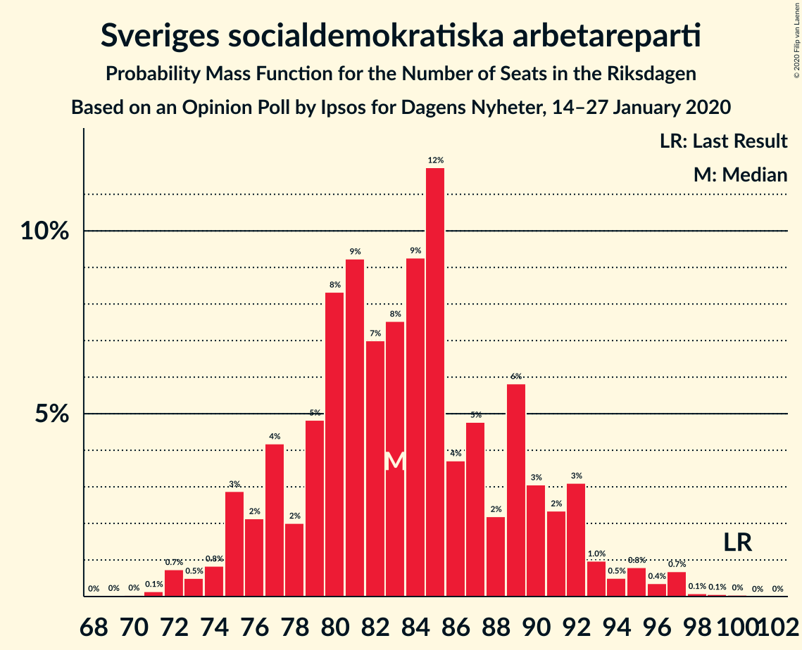
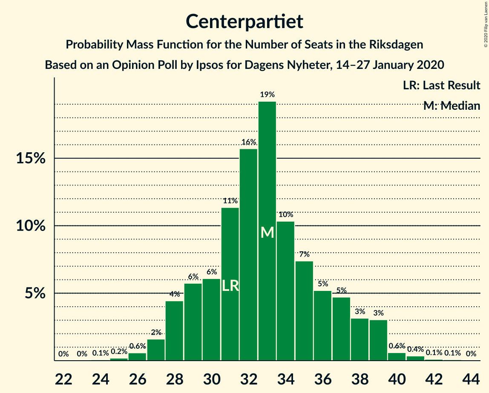
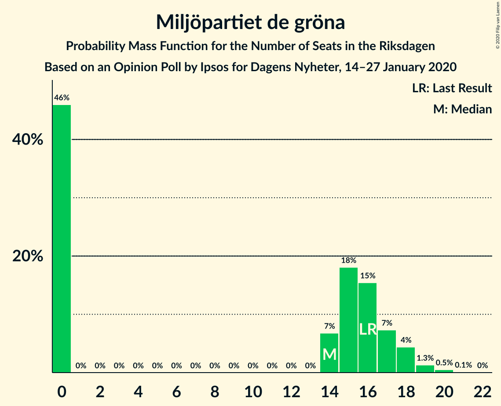
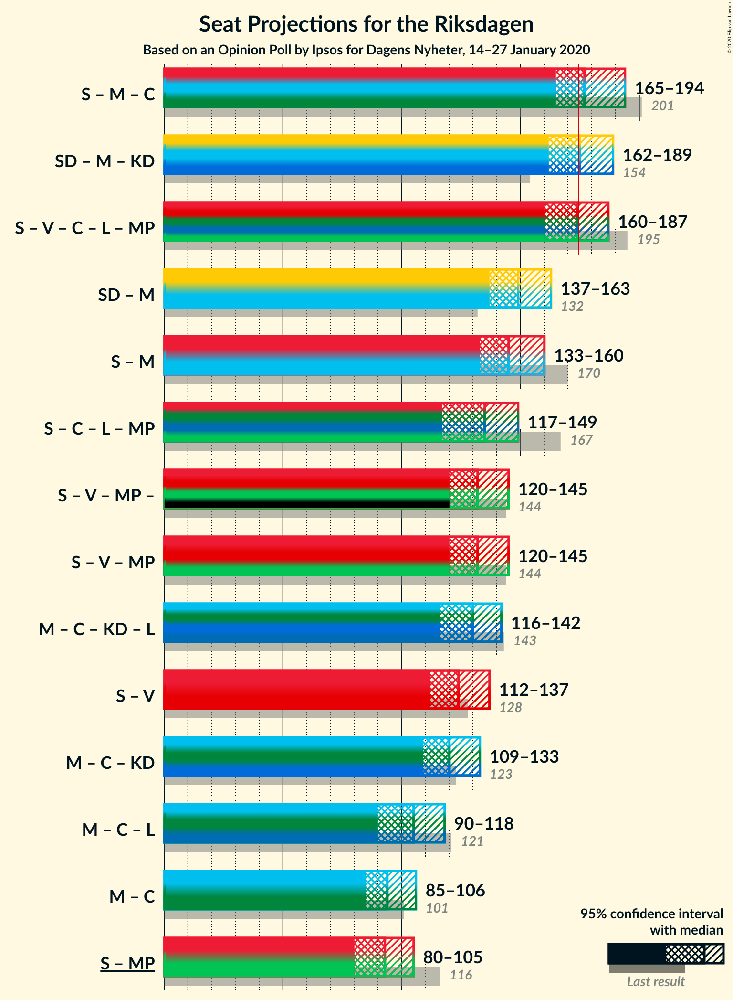
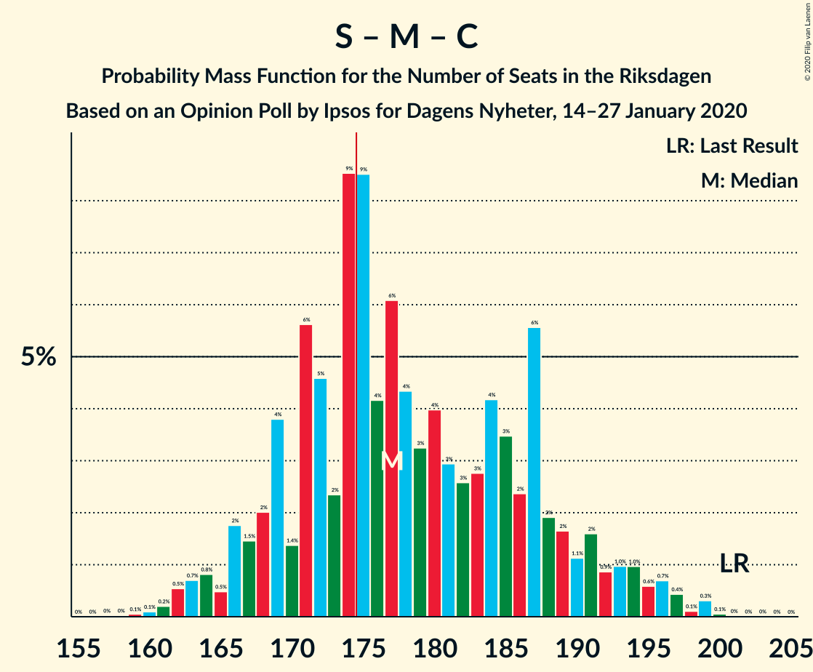

# Opinion Poll by Ipsos for Dagens Nyheter, 14–27 January 2020

<a href="#voting-intentions">Voting Intentions</a> | <a href="#seats">Seats</a> | <a href="#coalitions">Coalitions</a> | <a href="#technical-information">Technical Information</a>

## Voting Intentions

### Confidence Intervals

| Party | Last Result | Poll Result | 80% Confidence Interval | 90% Confidence Interval | 95% Confidence Interval | 99% Confidence Interval |
|:-----:|:-----------:|:-----------:|:-----------------------:|:-----------------------:|:-----------------------:|:-----------------------:|
| Sverigedemokraterna | 17.5% | 24.0% | 22.6–25.5% |22.3–25.9% |21.9–26.2% |21.3–26.9% |
| Sveriges socialdemokratiska arbetareparti | 28.3% | 23.0% | 21.6–24.4% |21.2–24.8% |20.9–25.1% |20.3–25.8% |
| Moderata samlingspartiet | 19.8% | 17.0% | 15.8–18.3% |15.5–18.7% |15.2–19.0% |14.7–19.6% |
| Vänsterpartiet | 8.0% | 11.0% | 10.0–12.1% |9.8–12.4% |9.5–12.7% |9.1–13.2% |
| Centerpartiet | 8.6% | 9.0% | 8.2–10.0% |7.9–10.3% |7.7–10.6% |7.3–11.1% |
| Kristdemokraterna | 6.3% | 7.0% | 6.2–7.9% |6.0–8.2% |5.8–8.4% |5.5–8.9% |
| Liberalerna | 5.5% | 4.0% | 3.4–4.7% |3.2–4.9% |3.1–5.1% |2.9–5.5% |
| Miljöpartiet de gröna | 4.4% | 4.0% | 3.4–4.7% |3.2–4.9% |3.1–5.1% |2.9–5.5% |

*Note:* The poll result column reflects the actual value used in the calculations. Published results may vary slightly, and in addition be rounded to fewer digits.

## Seats

### Confidence Intervals

| Party | Last Result | Median | 80% Confidence Interval | 90% Confidence Interval | 95% Confidence Interval | 99% Confidence Interval |
|:-----:|:-----------:|:------:|:-----------------------:|:-----------------------:|:-----------------------:|:-----------------------:|
| <a href="#sverigedemokraterna">Sverigedemokraterna</a> | 62 | 88 | 81–91 |80–94 |77–96 |76–100 |
| <a href="#sveriges-socialdemokratiska-arbetareparti">Sveriges socialdemokratiska arbetareparti</a> | 100 | 86 | 80–91 |77–93 |76–94 |74–96 |
| <a href="#moderata-samlingspartiet">Moderata samlingspartiet</a> | 70 | 61 | 58–69 |57–71 |55–71 |53–73 |
| <a href="#vänsterpartiet">Vänsterpartiet</a> | 28 | 39 | 36–44 |36–45 |35–48 |32–48 |
| <a href="#centerpartiet">Centerpartiet</a> | 31 | 31 | 28–35 |28–37 |27–37 |26–41 |
| <a href="#kristdemokraterna">Kristdemokraterna</a> | 22 | 27 | 22–29 |22–30 |21–31 |21–33 |
| <a href="#liberalerna">Liberalerna</a> | 20 | 0 | 0–16 |0–16 |0–18 |0–20 |
| <a href="#miljöpartiet-de-gröna">Miljöpartiet de gröna</a> | 16 | 15 | 0–17 |0–18 |0–18 |0–20 |

### Sverigedemokraterna

*For a full overview of the results for this party, see the [Sverigedemokraterna](party-sverigedemokraterna.html) page.*

| Number of Seats | Probability | Accumulated | Special Marks |
|:---------------:|:-----------:|:-----------:|:-------------:|
| 62 | 0% | 100% | Last Result |
| 63 | 0% | 100% |  |
| 64 | 0% | 100% |  |
| 65 | 0% | 100% |  |
| 66 | 0% | 100% |  |
| 67 | 0% | 100% |  |
| 68 | 0% | 100% |  |
| 69 | 0% | 100% |  |
| 70 | 0% | 100% |  |
| 71 | 0% | 100% |  |
| 72 | 0% | 100% |  |
| 73 | 0.1% | 100% |  |
| 74 | 0.2% | 99.9% |  |
| 75 | 0.1% | 99.7% |  |
| 76 | 2% | 99.6% |  |
| 77 | 0.3% | 98% |  |
| 78 | 0.7% | 97% |  |
| 79 | 0.3% | 97% |  |
| 80 | 4% | 96% |  |
| 81 | 4% | 93% |  |
| 82 | 3% | 89% |  |
| 83 | 14% | 86% |  |
| 84 | 5% | 72% |  |
| 85 | 4% | 67% |  |
| 86 | 1.2% | 64% |  |
| 87 | 10% | 63% |  |
| 88 | 19% | 52% | Median |
| 89 | 5% | 34% |  |
| 90 | 7% | 29% |  |
| 91 | 14% | 22% |  |
| 92 | 0.6% | 8% |  |
| 93 | 0.8% | 8% |  |
| 94 | 2% | 7% |  |
| 95 | 1.4% | 5% |  |
| 96 | 1.4% | 3% |  |
| 97 | 0.6% | 2% |  |
| 98 | 0.6% | 1.2% |  |
| 99 | 0% | 0.6% |  |
| 100 | 0.2% | 0.6% |  |
| 101 | 0.3% | 0.4% |  |
| 102 | 0% | 0.1% |  |
| 103 | 0% | 0.1% |  |
| 104 | 0% | 0% |  |

### Sveriges socialdemokratiska arbetareparti

*For a full overview of the results for this party, see the [Sveriges socialdemokratiska arbetareparti](party-sverigessocialdemokratiskaarbetareparti.html) page.*

| Number of Seats | Probability | Accumulated | Special Marks |
|:---------------:|:-----------:|:-----------:|:-------------:|
| 70 | 0.1% | 100% |  |
| 71 | 0.2% | 99.9% |  |
| 72 | 0.1% | 99.7% |  |
| 73 | 0.1% | 99.7% |  |
| 74 | 0.2% | 99.6% |  |
| 75 | 0.3% | 99.4% |  |
| 76 | 4% | 99.1% |  |
| 77 | 3% | 95% |  |
| 78 | 1.0% | 92% |  |
| 79 | 1.0% | 91% |  |
| 80 | 13% | 90% |  |
| 81 | 3% | 78% |  |
| 82 | 6% | 75% |  |
| 83 | 2% | 69% |  |
| 84 | 8% | 68% |  |
| 85 | 5% | 60% |  |
| 86 | 29% | 55% | Median |
| 87 | 6% | 27% |  |
| 88 | 6% | 21% |  |
| 89 | 2% | 15% |  |
| 90 | 0.8% | 12% |  |
| 91 | 6% | 12% |  |
| 92 | 0.6% | 6% |  |
| 93 | 2% | 5% |  |
| 94 | 2% | 4% |  |
| 95 | 1.4% | 2% |  |
| 96 | 0.4% | 0.9% |  |
| 97 | 0% | 0.5% |  |
| 98 | 0.4% | 0.4% |  |
| 99 | 0% | 0.1% |  |
| 100 | 0% | 0.1% | Last Result |
| 101 | 0% | 0.1% |  |
| 102 | 0% | 0% |  |

### Moderata samlingspartiet

*For a full overview of the results for this party, see the [Moderata samlingspartiet](party-moderatasamlingspartiet.html) page.*

| Number of Seats | Probability | Accumulated | Special Marks |
|:---------------:|:-----------:|:-----------:|:-------------:|
| 51 | 0.1% | 100% |  |
| 52 | 0.1% | 99.9% |  |
| 53 | 0.4% | 99.8% |  |
| 54 | 0.7% | 99.4% |  |
| 55 | 2% | 98.7% |  |
| 56 | 1.4% | 97% |  |
| 57 | 3% | 96% |  |
| 58 | 3% | 92% |  |
| 59 | 8% | 89% |  |
| 60 | 14% | 81% |  |
| 61 | 25% | 67% | Median |
| 62 | 6% | 42% |  |
| 63 | 4% | 36% |  |
| 64 | 6% | 32% |  |
| 65 | 9% | 26% |  |
| 66 | 3% | 17% |  |
| 67 | 2% | 14% |  |
| 68 | 2% | 13% |  |
| 69 | 1.0% | 10% |  |
| 70 | 2% | 9% | Last Result |
| 71 | 5% | 7% |  |
| 72 | 0.4% | 2% |  |
| 73 | 1.3% | 2% |  |
| 74 | 0% | 0.2% |  |
| 75 | 0.1% | 0.2% |  |
| 76 | 0.1% | 0.1% |  |
| 77 | 0% | 0% |  |

### Vänsterpartiet

*For a full overview of the results for this party, see the [Vänsterpartiet](party-vänsterpartiet.html) page.*

| Number of Seats | Probability | Accumulated | Special Marks |
|:---------------:|:-----------:|:-----------:|:-------------:|
| 28 | 0% | 100% | Last Result |
| 29 | 0% | 100% |  |
| 30 | 0.1% | 100% |  |
| 31 | 0% | 99.9% |  |
| 32 | 0.4% | 99.8% |  |
| 33 | 0.7% | 99.4% |  |
| 34 | 0.6% | 98.7% |  |
| 35 | 2% | 98% |  |
| 36 | 10% | 96% |  |
| 37 | 2% | 86% |  |
| 38 | 23% | 84% |  |
| 39 | 18% | 61% | Median |
| 40 | 10% | 43% |  |
| 41 | 11% | 33% |  |
| 42 | 6% | 22% |  |
| 43 | 3% | 15% |  |
| 44 | 2% | 12% |  |
| 45 | 4% | 9% |  |
| 46 | 1.1% | 5% |  |
| 47 | 0.8% | 4% |  |
| 48 | 3% | 3% |  |
| 49 | 0.2% | 0.3% |  |
| 50 | 0.1% | 0.1% |  |
| 51 | 0% | 0% |  |

### Centerpartiet

*For a full overview of the results for this party, see the [Centerpartiet](party-centerpartiet.html) page.*

| Number of Seats | Probability | Accumulated | Special Marks |
|:---------------:|:-----------:|:-----------:|:-------------:|
| 24 | 0.1% | 100% |  |
| 25 | 0.3% | 99.9% |  |
| 26 | 0.6% | 99.6% |  |
| 27 | 2% | 99.0% |  |
| 28 | 14% | 97% |  |
| 29 | 5% | 83% |  |
| 30 | 4% | 78% |  |
| 31 | 32% | 74% | Last Result, Median |
| 32 | 15% | 42% |  |
| 33 | 11% | 28% |  |
| 34 | 6% | 17% |  |
| 35 | 2% | 12% |  |
| 36 | 4% | 9% |  |
| 37 | 3% | 6% |  |
| 38 | 1.2% | 2% |  |
| 39 | 0.3% | 1.0% |  |
| 40 | 0.1% | 0.7% |  |
| 41 | 0.2% | 0.6% |  |
| 42 | 0.3% | 0.4% |  |
| 43 | 0% | 0.1% |  |
| 44 | 0.1% | 0.1% |  |
| 45 | 0% | 0.1% |  |
| 46 | 0% | 0% |  |

### Kristdemokraterna

*For a full overview of the results for this party, see the [Kristdemokraterna](party-kristdemokraterna.html) page.*

| Number of Seats | Probability | Accumulated | Special Marks |
|:---------------:|:-----------:|:-----------:|:-------------:|
| 19 | 0.2% | 100% |  |
| 20 | 0.3% | 99.8% |  |
| 21 | 2% | 99.5% |  |
| 22 | 15% | 97% | Last Result |
| 23 | 9% | 82% |  |
| 24 | 12% | 73% |  |
| 25 | 4% | 61% |  |
| 26 | 7% | 58% |  |
| 27 | 11% | 51% | Median |
| 28 | 18% | 39% |  |
| 29 | 13% | 21% |  |
| 30 | 4% | 8% |  |
| 31 | 3% | 4% |  |
| 32 | 0.3% | 0.9% |  |
| 33 | 0.2% | 0.6% |  |
| 34 | 0.3% | 0.5% |  |
| 35 | 0.1% | 0.1% |  |
| 36 | 0% | 0% |  |

### Liberalerna

*For a full overview of the results for this party, see the [Liberalerna](party-liberalerna.html) page.*

| Number of Seats | Probability | Accumulated | Special Marks |
|:---------------:|:-----------:|:-----------:|:-------------:|
| 0 | 53% | 100% | Median |
| 1 | 0% | 47% |  |
| 2 | 0% | 47% |  |
| 3 | 0% | 47% |  |
| 4 | 0% | 47% |  |
| 5 | 0% | 47% |  |
| 6 | 0% | 47% |  |
| 7 | 0% | 47% |  |
| 8 | 0% | 47% |  |
| 9 | 0% | 47% |  |
| 10 | 0% | 47% |  |
| 11 | 0% | 47% |  |
| 12 | 0% | 47% |  |
| 13 | 0% | 47% |  |
| 14 | 29% | 47% |  |
| 15 | 8% | 18% |  |
| 16 | 5% | 10% |  |
| 17 | 2% | 5% |  |
| 18 | 2% | 3% |  |
| 19 | 0.3% | 0.9% |  |
| 20 | 0.3% | 0.6% | Last Result |
| 21 | 0.3% | 0.3% |  |
| 22 | 0% | 0% |  |

### Miljöpartiet de gröna

*For a full overview of the results for this party, see the [Miljöpartiet de gröna](party-miljöpartietdegröna.html) page.*

| Number of Seats | Probability | Accumulated | Special Marks |
|:---------------:|:-----------:|:-----------:|:-------------:|
| 0 | 32% | 100% |  |
| 1 | 0% | 68% |  |
| 2 | 0% | 68% |  |
| 3 | 0% | 68% |  |
| 4 | 0% | 68% |  |
| 5 | 0% | 68% |  |
| 6 | 0% | 68% |  |
| 7 | 0% | 68% |  |
| 8 | 0% | 68% |  |
| 9 | 0% | 68% |  |
| 10 | 0% | 68% |  |
| 11 | 0% | 68% |  |
| 12 | 0% | 68% |  |
| 13 | 0% | 68% |  |
| 14 | 2% | 68% |  |
| 15 | 22% | 66% | Median |
| 16 | 27% | 44% | Last Result |
| 17 | 7% | 17% |  |
| 18 | 7% | 9% |  |
| 19 | 0.8% | 2% |  |
| 20 | 1.1% | 1.3% |  |
| 21 | 0.1% | 0.2% |  |
| 22 | 0.1% | 0.1% |  |
| 23 | 0% | 0% |  |

## Coalitions

### Confidence Intervals

| Coalition | Last Result | Median | Majority? | 80% Confidence Interval | 90% Confidence Interval | 95% Confidence Interval | 99% Confidence Interval |
|:---------:|:-----------:|:------:|:---------:|:-----------------------:|:-----------------------:|:-----------------------:|:-----------------------:|
| Sveriges socialdemokratiska arbetareparti – Moderata samlingspartiet – Centerpartiet | 201 | 178 | 76% | 169–190 | 169–192 | 167–193 | 163–198 |
| Sverigedemokraterna – Moderata samlingspartiet – Kristdemokraterna | 154 | 176 | 65% | 165–186 | 164–189 | 160–191 | 159–192 |
| Sveriges socialdemokratiska arbetareparti – Vänsterpartiet – Centerpartiet – Liberalerna – Miljöpartiet de gröna | 195 | 173 | 35% | 163–184 | 160–185 | 158–189 | 157–190 |
| Sverigedemokraterna – Moderata samlingspartiet | 132 | 149 | 0% | 142–160 | 140–160 | 137–161 | 136–166 |
| Sveriges socialdemokratiska arbetareparti – Moderata samlingspartiet | 170 | 146 | 0% | 140–155 | 139–159 | 135–161 | 133–165 |
| Sveriges socialdemokratiska arbetareparti – Centerpartiet – Liberalerna – Miljöpartiet de gröna | 167 | 133 | 0% | 122–146 | 119–146 | 117–149 | 114–150 |
| Sveriges socialdemokratiska arbetareparti – Vänsterpartiet – Miljöpartiet de gröna | 144 | 137 | 0% | 125–143 | 122–145 | 121–147 | 118–149 |
| Moderata samlingspartiet – Centerpartiet – Kristdemokraterna – Liberalerna | 143 | 127 | 0% | 118–136 | 116–136 | 114–141 | 111–145 |
| Sveriges socialdemokratiska arbetareparti – Vänsterpartiet | 128 | 125 | 0% | 116–131 | 116–134 | 115–138 | 111–140 |
| Moderata samlingspartiet – Centerpartiet – Kristdemokraterna | 123 | 120 | 0% | 113–129 | 112–131 | 110–132 | 106–134 |
| Moderata samlingspartiet – Centerpartiet – Liberalerna | 121 | 102 | 0% | 92–108 | 92–112 | 90–114 | 85–119 |
| Sveriges socialdemokratiska arbetareparti – Miljöpartiet de gröna | 116 | 98 | 0% | 85–102 | 84–104 | 81–106 | 77–108 |
| Moderata samlingspartiet – Centerpartiet | 101 | 92 | 0% | 89–102 | 87–102 | 85–104 | 81–106 |

### Sveriges socialdemokratiska arbetareparti – Moderata samlingspartiet – Centerpartiet

| Number of Seats | Probability | Accumulated | Special Marks |
|:---------------:|:-----------:|:-----------:|:-------------:|
| 159 | 0% | 100% |  |
| 160 | 0% | 99.9% |  |
| 161 | 0.1% | 99.9% |  |
| 162 | 0.1% | 99.8% |  |
| 163 | 0.5% | 99.7% |  |
| 164 | 0.3% | 99.2% |  |
| 165 | 0.3% | 98.9% |  |
| 166 | 0.3% | 98.7% |  |
| 167 | 2% | 98% |  |
| 168 | 1.0% | 96% |  |
| 169 | 8% | 95% |  |
| 170 | 4% | 87% |  |
| 171 | 2% | 83% |  |
| 172 | 0.6% | 81% |  |
| 173 | 4% | 81% |  |
| 174 | 1.0% | 77% |  |
| 175 | 5% | 76% | Majority |
| 176 | 6% | 71% |  |
| 177 | 13% | 65% |  |
| 178 | 12% | 51% | Median |
| 179 | 5% | 39% |  |
| 180 | 2% | 34% |  |
| 181 | 2% | 33% |  |
| 182 | 4% | 31% |  |
| 183 | 1.5% | 26% |  |
| 184 | 6% | 25% |  |
| 185 | 1.2% | 18% |  |
| 186 | 1.3% | 17% |  |
| 187 | 3% | 16% |  |
| 188 | 0.6% | 13% |  |
| 189 | 1.1% | 12% |  |
| 190 | 4% | 11% |  |
| 191 | 0.7% | 7% |  |
| 192 | 3% | 6% |  |
| 193 | 1.0% | 3% |  |
| 194 | 0.1% | 2% |  |
| 195 | 0.3% | 2% |  |
| 196 | 1.1% | 2% |  |
| 197 | 0% | 0.8% |  |
| 198 | 0.4% | 0.7% |  |
| 199 | 0.2% | 0.3% |  |
| 200 | 0.1% | 0.1% |  |
| 201 | 0% | 0% | Last Result |

### Sverigedemokraterna – Moderata samlingspartiet – Kristdemokraterna

| Number of Seats | Probability | Accumulated | Special Marks |
|:---------------:|:-----------:|:-----------:|:-------------:|
| 154 | 0% | 100% | Last Result |
| 155 | 0.1% | 100% |  |
| 156 | 0% | 99.9% |  |
| 157 | 0% | 99.9% |  |
| 158 | 0.1% | 99.9% |  |
| 159 | 0.8% | 99.7% |  |
| 160 | 2% | 98.9% |  |
| 161 | 0.2% | 97% |  |
| 162 | 0.4% | 97% |  |
| 163 | 1.2% | 96% |  |
| 164 | 2% | 95% |  |
| 165 | 10% | 93% |  |
| 166 | 1.4% | 83% |  |
| 167 | 1.1% | 81% |  |
| 168 | 2% | 80% |  |
| 169 | 5% | 79% |  |
| 170 | 2% | 74% |  |
| 171 | 2% | 72% |  |
| 172 | 2% | 69% |  |
| 173 | 1.3% | 68% |  |
| 174 | 1.2% | 66% |  |
| 175 | 14% | 65% | Majority |
| 176 | 2% | 51% | Median |
| 177 | 17% | 49% |  |
| 178 | 3% | 32% |  |
| 179 | 8% | 29% |  |
| 180 | 1.4% | 21% |  |
| 181 | 4% | 20% |  |
| 182 | 1.2% | 16% |  |
| 183 | 2% | 15% |  |
| 184 | 1.5% | 13% |  |
| 185 | 1.4% | 12% |  |
| 186 | 0.5% | 10% |  |
| 187 | 1.0% | 10% |  |
| 188 | 0.3% | 9% |  |
| 189 | 5% | 9% |  |
| 190 | 0.5% | 4% |  |
| 191 | 2% | 4% |  |
| 192 | 1.3% | 2% |  |
| 193 | 0.1% | 0.3% |  |
| 194 | 0.1% | 0.3% |  |
| 195 | 0.1% | 0.2% |  |
| 196 | 0.1% | 0.1% |  |
| 197 | 0% | 0.1% |  |
| 198 | 0% | 0% |  |

### Sveriges socialdemokratiska arbetareparti – Vänsterpartiet – Centerpartiet – Liberalerna – Miljöpartiet de gröna

| Number of Seats | Probability | Accumulated | Special Marks |
|:---------------:|:-----------:|:-----------:|:-------------:|
| 152 | 0% | 100% |  |
| 153 | 0.1% | 99.9% |  |
| 154 | 0.1% | 99.9% |  |
| 155 | 0.1% | 99.8% |  |
| 156 | 0.1% | 99.7% |  |
| 157 | 1.3% | 99.7% |  |
| 158 | 2% | 98% |  |
| 159 | 0.5% | 96% |  |
| 160 | 5% | 96% |  |
| 161 | 0.3% | 91% |  |
| 162 | 1.0% | 91% |  |
| 163 | 0.5% | 90% |  |
| 164 | 1.4% | 90% |  |
| 165 | 1.5% | 88% |  |
| 166 | 2% | 87% |  |
| 167 | 1.2% | 85% |  |
| 168 | 4% | 84% |  |
| 169 | 1.4% | 80% |  |
| 170 | 8% | 79% |  |
| 171 | 3% | 71% | Median |
| 172 | 17% | 68% |  |
| 173 | 2% | 51% |  |
| 174 | 14% | 49% |  |
| 175 | 1.2% | 35% | Majority |
| 176 | 1.3% | 34% |  |
| 177 | 2% | 32% |  |
| 178 | 2% | 31% |  |
| 179 | 2% | 28% |  |
| 180 | 5% | 26% |  |
| 181 | 2% | 21% |  |
| 182 | 1.1% | 20% |  |
| 183 | 1.4% | 19% |  |
| 184 | 10% | 17% |  |
| 185 | 2% | 7% |  |
| 186 | 1.2% | 5% |  |
| 187 | 0.4% | 4% |  |
| 188 | 0.2% | 3% |  |
| 189 | 2% | 3% |  |
| 190 | 0.8% | 1.1% |  |
| 191 | 0.1% | 0.3% |  |
| 192 | 0% | 0.1% |  |
| 193 | 0% | 0.1% |  |
| 194 | 0.1% | 0.1% |  |
| 195 | 0% | 0% | Last Result |

### Sverigedemokraterna – Moderata samlingspartiet

| Number of Seats | Probability | Accumulated | Special Marks |
|:---------------:|:-----------:|:-----------:|:-------------:|
| 131 | 0.1% | 100% |  |
| 132 | 0.1% | 99.9% | Last Result |
| 133 | 0.1% | 99.9% |  |
| 134 | 0.1% | 99.8% |  |
| 135 | 0.2% | 99.7% |  |
| 136 | 1.0% | 99.5% |  |
| 137 | 2% | 98% |  |
| 138 | 0.8% | 96% |  |
| 139 | 0.4% | 95% |  |
| 140 | 2% | 95% |  |
| 141 | 3% | 93% |  |
| 142 | 4% | 90% |  |
| 143 | 11% | 86% |  |
| 144 | 0.6% | 74% |  |
| 145 | 1.4% | 74% |  |
| 146 | 4% | 72% |  |
| 147 | 4% | 69% |  |
| 148 | 10% | 65% |  |
| 149 | 12% | 55% | Median |
| 150 | 6% | 43% |  |
| 151 | 2% | 37% |  |
| 152 | 4% | 35% |  |
| 153 | 9% | 31% |  |
| 154 | 2% | 22% |  |
| 155 | 5% | 20% |  |
| 156 | 1.2% | 15% |  |
| 157 | 1.1% | 14% |  |
| 158 | 0.4% | 13% |  |
| 159 | 2% | 12% |  |
| 160 | 6% | 10% |  |
| 161 | 3% | 5% |  |
| 162 | 0.5% | 2% |  |
| 163 | 0.1% | 1.1% |  |
| 164 | 0.3% | 1.0% |  |
| 165 | 0.2% | 0.7% |  |
| 166 | 0.3% | 0.5% |  |
| 167 | 0.1% | 0.3% |  |
| 168 | 0% | 0.1% |  |
| 169 | 0% | 0.1% |  |
| 170 | 0.1% | 0.1% |  |
| 171 | 0% | 0% |  |

### Sveriges socialdemokratiska arbetareparti – Moderata samlingspartiet

| Number of Seats | Probability | Accumulated | Special Marks |
|:---------------:|:-----------:|:-----------:|:-------------:|
| 127 | 0.1% | 100% |  |
| 128 | 0% | 99.9% |  |
| 129 | 0.1% | 99.9% |  |
| 130 | 0.1% | 99.8% |  |
| 131 | 0% | 99.7% |  |
| 132 | 0.1% | 99.7% |  |
| 133 | 0.4% | 99.5% |  |
| 134 | 0.2% | 99.1% |  |
| 135 | 2% | 99.0% |  |
| 136 | 0.2% | 97% |  |
| 137 | 0.3% | 96% |  |
| 138 | 0.5% | 96% |  |
| 139 | 3% | 96% |  |
| 140 | 4% | 92% |  |
| 141 | 10% | 88% |  |
| 142 | 0.6% | 78% |  |
| 143 | 6% | 77% |  |
| 144 | 5% | 71% |  |
| 145 | 3% | 66% |  |
| 146 | 14% | 63% |  |
| 147 | 16% | 49% | Median |
| 148 | 2% | 34% |  |
| 149 | 2% | 32% |  |
| 150 | 3% | 30% |  |
| 151 | 1.0% | 27% |  |
| 152 | 8% | 26% |  |
| 153 | 2% | 17% |  |
| 154 | 0.5% | 16% |  |
| 155 | 5% | 15% |  |
| 156 | 0.7% | 10% |  |
| 157 | 0.8% | 9% |  |
| 158 | 0.5% | 8% |  |
| 159 | 4% | 8% |  |
| 160 | 0.3% | 3% |  |
| 161 | 1.0% | 3% |  |
| 162 | 0.1% | 2% |  |
| 163 | 0.1% | 2% |  |
| 164 | 1.3% | 2% |  |
| 165 | 0.4% | 0.6% |  |
| 166 | 0% | 0.2% |  |
| 167 | 0.2% | 0.2% |  |
| 168 | 0% | 0% |  |
| 169 | 0% | 0% |  |
| 170 | 0% | 0% | Last Result |

### Sveriges socialdemokratiska arbetareparti – Centerpartiet – Liberalerna – Miljöpartiet de gröna

| Number of Seats | Probability | Accumulated | Special Marks |
|:---------------:|:-----------:|:-----------:|:-------------:|
| 109 | 0% | 100% |  |
| 110 | 0% | 99.9% |  |
| 111 | 0% | 99.9% |  |
| 112 | 0% | 99.9% |  |
| 113 | 0.3% | 99.9% |  |
| 114 | 0.3% | 99.6% |  |
| 115 | 0% | 99.3% |  |
| 116 | 0.1% | 99.2% |  |
| 117 | 2% | 99.1% |  |
| 118 | 0.2% | 97% |  |
| 119 | 6% | 97% |  |
| 120 | 0.1% | 91% |  |
| 121 | 0.3% | 90% |  |
| 122 | 2% | 90% |  |
| 123 | 2% | 89% |  |
| 124 | 2% | 87% |  |
| 125 | 0.3% | 85% |  |
| 126 | 0.8% | 84% |  |
| 127 | 2% | 84% |  |
| 128 | 5% | 81% |  |
| 129 | 4% | 76% |  |
| 130 | 1.5% | 72% |  |
| 131 | 3% | 71% |  |
| 132 | 8% | 68% | Median |
| 133 | 13% | 60% |  |
| 134 | 6% | 47% |  |
| 135 | 0.8% | 41% |  |
| 136 | 3% | 41% |  |
| 137 | 1.1% | 38% |  |
| 138 | 7% | 37% |  |
| 139 | 2% | 29% |  |
| 140 | 2% | 28% |  |
| 141 | 4% | 26% |  |
| 142 | 2% | 21% |  |
| 143 | 1.0% | 19% |  |
| 144 | 1.4% | 18% |  |
| 145 | 2% | 17% |  |
| 146 | 10% | 15% |  |
| 147 | 0.9% | 5% |  |
| 148 | 1.2% | 4% |  |
| 149 | 2% | 3% |  |
| 150 | 0.4% | 0.8% |  |
| 151 | 0% | 0.5% |  |
| 152 | 0.2% | 0.4% |  |
| 153 | 0.1% | 0.2% |  |
| 154 | 0.1% | 0.2% |  |
| 155 | 0.1% | 0.1% |  |
| 156 | 0% | 0.1% |  |
| 157 | 0% | 0% |  |
| 158 | 0% | 0% |  |
| 159 | 0% | 0% |  |
| 160 | 0% | 0% |  |
| 161 | 0% | 0% |  |
| 162 | 0% | 0% |  |
| 163 | 0% | 0% |  |
| 164 | 0% | 0% |  |
| 165 | 0% | 0% |  |
| 166 | 0% | 0% |  |
| 167 | 0% | 0% | Last Result |

### Sveriges socialdemokratiska arbetareparti – Vänsterpartiet – Miljöpartiet de gröna

| Number of Seats | Probability | Accumulated | Special Marks |
|:---------------:|:-----------:|:-----------:|:-------------:|
| 113 | 0% | 100% |  |
| 114 | 0.1% | 99.9% |  |
| 115 | 0.1% | 99.9% |  |
| 116 | 0.1% | 99.8% |  |
| 117 | 0.1% | 99.7% |  |
| 118 | 0.1% | 99.6% |  |
| 119 | 1.5% | 99.5% |  |
| 120 | 0.3% | 98% |  |
| 121 | 0.6% | 98% |  |
| 122 | 5% | 97% |  |
| 123 | 1.3% | 92% |  |
| 124 | 0.4% | 90% |  |
| 125 | 0.4% | 90% |  |
| 126 | 3% | 90% |  |
| 127 | 2% | 87% |  |
| 128 | 0.5% | 85% |  |
| 129 | 5% | 84% |  |
| 130 | 1.5% | 80% |  |
| 131 | 4% | 78% |  |
| 132 | 12% | 75% |  |
| 133 | 3% | 63% |  |
| 134 | 2% | 60% |  |
| 135 | 1.3% | 57% |  |
| 136 | 3% | 56% |  |
| 137 | 6% | 53% |  |
| 138 | 2% | 47% |  |
| 139 | 12% | 44% |  |
| 140 | 6% | 32% | Median |
| 141 | 11% | 26% |  |
| 142 | 0.7% | 15% |  |
| 143 | 7% | 14% |  |
| 144 | 2% | 7% | Last Result |
| 145 | 0.8% | 5% |  |
| 146 | 2% | 4% |  |
| 147 | 0.7% | 3% |  |
| 148 | 0.8% | 2% |  |
| 149 | 0.9% | 1.2% |  |
| 150 | 0% | 0.3% |  |
| 151 | 0% | 0.3% |  |
| 152 | 0% | 0.2% |  |
| 153 | 0% | 0.2% |  |
| 154 | 0.2% | 0.2% |  |
| 155 | 0% | 0% |  |

### Moderata samlingspartiet – Centerpartiet – Kristdemokraterna – Liberalerna

| Number of Seats | Probability | Accumulated | Special Marks |
|:---------------:|:-----------:|:-----------:|:-------------:|
| 111 | 0.9% | 100% |  |
| 112 | 0.1% | 99.0% |  |
| 113 | 0.1% | 99.0% |  |
| 114 | 1.4% | 98.8% |  |
| 115 | 0.2% | 97% |  |
| 116 | 5% | 97% |  |
| 117 | 2% | 93% |  |
| 118 | 0.9% | 91% |  |
| 119 | 2% | 90% | Median |
| 120 | 12% | 88% |  |
| 121 | 5% | 76% |  |
| 122 | 4% | 72% |  |
| 123 | 2% | 68% |  |
| 124 | 1.2% | 66% |  |
| 125 | 3% | 65% |  |
| 126 | 1.4% | 62% |  |
| 127 | 17% | 60% |  |
| 128 | 2% | 43% |  |
| 129 | 2% | 42% |  |
| 130 | 11% | 39% |  |
| 131 | 7% | 28% |  |
| 132 | 6% | 22% |  |
| 133 | 2% | 16% |  |
| 134 | 0.6% | 13% |  |
| 135 | 2% | 13% |  |
| 136 | 6% | 11% |  |
| 137 | 0.2% | 5% |  |
| 138 | 0.4% | 5% |  |
| 139 | 1.5% | 4% |  |
| 140 | 0.1% | 3% |  |
| 141 | 0.6% | 3% |  |
| 142 | 1.2% | 2% |  |
| 143 | 0.1% | 1.0% | Last Result |
| 144 | 0.3% | 0.9% |  |
| 145 | 0.3% | 0.6% |  |
| 146 | 0% | 0.3% |  |
| 147 | 0.1% | 0.3% |  |
| 148 | 0.1% | 0.2% |  |
| 149 | 0% | 0.1% |  |
| 150 | 0% | 0.1% |  |
| 151 | 0% | 0% |  |

### Sveriges socialdemokratiska arbetareparti – Vänsterpartiet

| Number of Seats | Probability | Accumulated | Special Marks |
|:---------------:|:-----------:|:-----------:|:-------------:|
| 106 | 0% | 100% |  |
| 107 | 0% | 99.9% |  |
| 108 | 0% | 99.9% |  |
| 109 | 0.1% | 99.9% |  |
| 110 | 0.1% | 99.8% |  |
| 111 | 0.3% | 99.7% |  |
| 112 | 0.4% | 99.4% |  |
| 113 | 0.6% | 99.0% |  |
| 114 | 0.5% | 98% |  |
| 115 | 1.2% | 98% |  |
| 116 | 8% | 97% |  |
| 117 | 4% | 89% |  |
| 118 | 0.8% | 84% |  |
| 119 | 5% | 84% |  |
| 120 | 2% | 78% |  |
| 121 | 4% | 77% |  |
| 122 | 7% | 73% |  |
| 123 | 2% | 66% |  |
| 124 | 12% | 64% |  |
| 125 | 16% | 52% | Median |
| 126 | 6% | 36% |  |
| 127 | 5% | 30% |  |
| 128 | 3% | 25% | Last Result |
| 129 | 6% | 22% |  |
| 130 | 3% | 16% |  |
| 131 | 4% | 14% |  |
| 132 | 0.2% | 10% |  |
| 133 | 2% | 10% |  |
| 134 | 3% | 8% |  |
| 135 | 0.2% | 5% |  |
| 136 | 1.0% | 5% |  |
| 137 | 0.5% | 4% |  |
| 138 | 1.2% | 3% |  |
| 139 | 1.2% | 2% |  |
| 140 | 0.2% | 0.6% |  |
| 141 | 0.3% | 0.4% |  |
| 142 | 0.1% | 0.1% |  |
| 143 | 0% | 0.1% |  |
| 144 | 0% | 0% |  |

### Moderata samlingspartiet – Centerpartiet – Kristdemokraterna

| Number of Seats | Probability | Accumulated | Special Marks |
|:---------------:|:-----------:|:-----------:|:-------------:|
| 103 | 0% | 100% |  |
| 104 | 0.1% | 99.9% |  |
| 105 | 0.1% | 99.8% |  |
| 106 | 0.2% | 99.7% |  |
| 107 | 0.3% | 99.4% |  |
| 108 | 0.9% | 99.2% |  |
| 109 | 0.7% | 98% |  |
| 110 | 0.3% | 98% |  |
| 111 | 2% | 97% |  |
| 112 | 0.6% | 95% |  |
| 113 | 13% | 95% |  |
| 114 | 2% | 82% |  |
| 115 | 0.5% | 80% |  |
| 116 | 17% | 79% |  |
| 117 | 2% | 62% |  |
| 118 | 5% | 60% |  |
| 119 | 3% | 55% | Median |
| 120 | 12% | 52% |  |
| 121 | 11% | 40% |  |
| 122 | 3% | 29% |  |
| 123 | 3% | 26% | Last Result |
| 124 | 1.1% | 23% |  |
| 125 | 3% | 22% |  |
| 126 | 2% | 20% |  |
| 127 | 5% | 18% |  |
| 128 | 1.4% | 13% |  |
| 129 | 2% | 12% |  |
| 130 | 2% | 10% |  |
| 131 | 5% | 8% |  |
| 132 | 2% | 3% |  |
| 133 | 0.2% | 0.8% |  |
| 134 | 0.3% | 0.6% |  |
| 135 | 0.1% | 0.3% |  |
| 136 | 0% | 0.2% |  |
| 137 | 0.1% | 0.2% |  |
| 138 | 0% | 0.1% |  |
| 139 | 0% | 0% |  |

### Moderata samlingspartiet – Centerpartiet – Liberalerna

| Number of Seats | Probability | Accumulated | Special Marks |
|:---------------:|:-----------:|:-----------:|:-------------:|
| 84 | 0.1% | 100% |  |
| 85 | 0.7% | 99.9% |  |
| 86 | 0% | 99.2% |  |
| 87 | 0.7% | 99.2% |  |
| 88 | 0.1% | 98% |  |
| 89 | 0.6% | 98% |  |
| 90 | 2% | 98% |  |
| 91 | 0.2% | 96% |  |
| 92 | 12% | 96% | Median |
| 93 | 6% | 83% |  |
| 94 | 2% | 78% |  |
| 95 | 2% | 76% |  |
| 96 | 3% | 74% |  |
| 97 | 5% | 71% |  |
| 98 | 4% | 66% |  |
| 99 | 3% | 62% |  |
| 100 | 0.9% | 59% |  |
| 101 | 5% | 58% |  |
| 102 | 7% | 53% |  |
| 103 | 9% | 47% |  |
| 104 | 4% | 38% |  |
| 105 | 14% | 33% |  |
| 106 | 1.2% | 19% |  |
| 107 | 8% | 18% |  |
| 108 | 0.3% | 10% |  |
| 109 | 1.2% | 10% |  |
| 110 | 0.7% | 9% |  |
| 111 | 3% | 8% |  |
| 112 | 1.3% | 5% |  |
| 113 | 0.3% | 4% |  |
| 114 | 2% | 4% |  |
| 115 | 0.3% | 2% |  |
| 116 | 0.2% | 2% |  |
| 117 | 0.1% | 1.4% |  |
| 118 | 0.7% | 1.3% |  |
| 119 | 0.2% | 0.5% |  |
| 120 | 0.1% | 0.4% |  |
| 121 | 0.2% | 0.3% | Last Result |
| 122 | 0% | 0.1% |  |
| 123 | 0% | 0.1% |  |
| 124 | 0% | 0.1% |  |
| 125 | 0% | 0.1% |  |
| 126 | 0% | 0% |  |

### Sveriges socialdemokratiska arbetareparti – Miljöpartiet de gröna

| Number of Seats | Probability | Accumulated | Special Marks |
|:---------------:|:-----------:|:-----------:|:-------------:|
| 72 | 0% | 100% |  |
| 73 | 0% | 99.9% |  |
| 74 | 0.1% | 99.9% |  |
| 75 | 0.1% | 99.9% |  |
| 76 | 0.1% | 99.8% |  |
| 77 | 0.4% | 99.7% |  |
| 78 | 0.3% | 99.3% |  |
| 79 | 0.1% | 99.0% |  |
| 80 | 1.0% | 98.9% |  |
| 81 | 1.3% | 98% |  |
| 82 | 0.6% | 97% |  |
| 83 | 0.7% | 96% |  |
| 84 | 5% | 95% |  |
| 85 | 3% | 90% |  |
| 86 | 2% | 87% |  |
| 87 | 0.4% | 85% |  |
| 88 | 6% | 85% |  |
| 89 | 0.8% | 79% |  |
| 90 | 0.5% | 78% |  |
| 91 | 8% | 77% |  |
| 92 | 2% | 70% |  |
| 93 | 3% | 68% |  |
| 94 | 3% | 65% |  |
| 95 | 2% | 62% |  |
| 96 | 8% | 60% |  |
| 97 | 2% | 52% |  |
| 98 | 8% | 50% |  |
| 99 | 1.1% | 42% |  |
| 100 | 3% | 41% |  |
| 101 | 13% | 38% | Median |
| 102 | 16% | 26% |  |
| 103 | 3% | 10% |  |
| 104 | 3% | 7% |  |
| 105 | 1.0% | 4% |  |
| 106 | 0.8% | 3% |  |
| 107 | 0.7% | 2% |  |
| 108 | 1.3% | 2% |  |
| 109 | 0.1% | 0.2% |  |
| 110 | 0% | 0.1% |  |
| 111 | 0% | 0% |  |
| 112 | 0% | 0% |  |
| 113 | 0% | 0% |  |
| 114 | 0% | 0% |  |
| 115 | 0% | 0% |  |
| 116 | 0% | 0% | Last Result |

### Moderata samlingspartiet – Centerpartiet

| Number of Seats | Probability | Accumulated | Special Marks |
|:---------------:|:-----------:|:-----------:|:-------------:|
| 79 | 0.1% | 100% |  |
| 80 | 0.1% | 99.9% |  |
| 81 | 0.3% | 99.8% |  |
| 82 | 0.1% | 99.5% |  |
| 83 | 0.3% | 99.4% |  |
| 84 | 0.7% | 99.1% |  |
| 85 | 2% | 98% |  |
| 86 | 0.3% | 97% |  |
| 87 | 2% | 96% |  |
| 88 | 2% | 94% |  |
| 89 | 8% | 92% |  |
| 90 | 5% | 84% |  |
| 91 | 13% | 79% |  |
| 92 | 18% | 66% | Median |
| 93 | 8% | 48% |  |
| 94 | 3% | 39% |  |
| 95 | 2% | 36% |  |
| 96 | 5% | 34% |  |
| 97 | 6% | 28% |  |
| 98 | 4% | 22% |  |
| 99 | 3% | 18% |  |
| 100 | 0.6% | 15% |  |
| 101 | 4% | 14% | Last Result |
| 102 | 7% | 11% |  |
| 103 | 0.9% | 4% |  |
| 104 | 1.2% | 3% |  |
| 105 | 1.5% | 2% |  |
| 106 | 0.1% | 0.6% |  |
| 107 | 0.2% | 0.5% |  |
| 108 | 0.1% | 0.3% |  |
| 109 | 0.1% | 0.2% |  |
| 110 | 0% | 0.1% |  |
| 111 | 0% | 0.1% |  |
| 112 | 0% | 0% |  |

## Technical Information

### Opinion Poll

+ **Polling firm:** Ipsos
+ **Commissioner(s):** Dagens Nyheter
+ **Fieldwork period:** 14–27 January 2020

### Calculations

+ **Sample size:** 1528
+ **Simulations done:** 131,072
+ **Error estimate:** 1.40%

