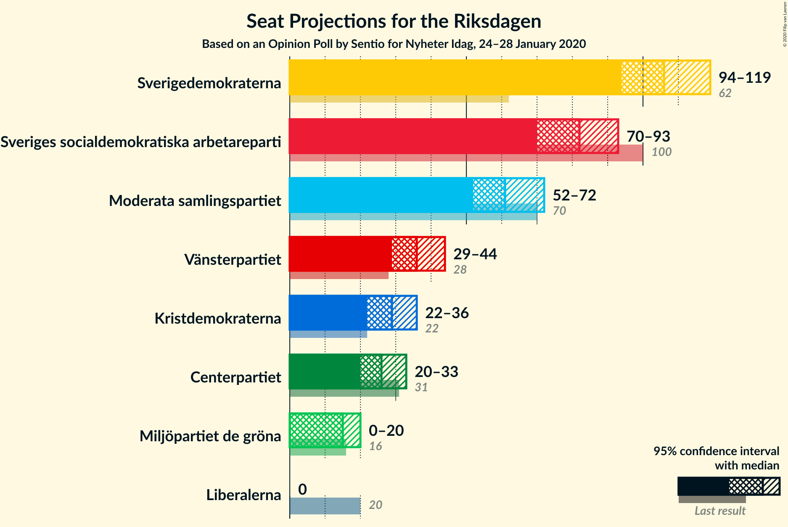

# Opinion Poll by Sentio for Nyheter Idag, 24–28 January 2020

<a href="#voting-intentions">Voting Intentions</a> | <a href="#seats">Seats</a> | <a href="#coalitions">Coalitions</a> | <a href="#technical-information">Technical Information</a>

## Voting Intentions

### Confidence Intervals

| Party | Last Result | Poll Result | 80% Confidence Interval | 90% Confidence Interval | 95% Confidence Interval | 99% Confidence Interval |
|:-----:|:-----------:|:-----------:|:-----------------------:|:-----------------------:|:-----------------------:|:-----------------------:|
| Sverigedemokraterna | 17.5% | 28.8% | 26.8–30.9% |26.2–31.5% |25.7–32.0% |24.8–33.1% |
| Sveriges socialdemokratiska arbetareparti | 28.3% | 22.1% | 20.2–24.0% |19.7–24.6% |19.3–25.1% |18.5–26.1% |
| Moderata samlingspartiet | 19.8% | 16.6% | 15.0–18.4% |14.6–18.9% |14.2–19.4% |13.4–20.3% |
| Vänsterpartiet | 8.0% | 9.6% | 8.4–11.1% |8.0–11.5% |7.8–11.9% |7.2–12.6% |
| Kristdemokraterna | 6.3% | 7.7% | 6.6–9.1% |6.3–9.5% |6.1–9.8% |5.6–10.5% |
| Centerpartiet | 8.6% | 7.0% | 5.9–8.3% |5.6–8.6% |5.4–9.0% |4.9–9.6% |
| Miljöpartiet de gröna | 4.4% | 4.1% | 3.3–5.1% |3.1–5.4% |2.9–5.7% |2.6–6.2% |
| Liberalerna | 5.5% | 2.4% | 1.8–3.3% |1.7–3.5% |1.5–3.7% |1.3–4.2% |

*Note:* The poll result column reflects the actual value used in the calculations. Published results may vary slightly, and in addition be rounded to fewer digits.

## Seats

### Confidence Intervals

| Party | Last Result | Median | 80% Confidence Interval | 90% Confidence Interval | 95% Confidence Interval | 99% Confidence Interval |
|:-----:|:-----------:|:------:|:-----------------------:|:-----------------------:|:-----------------------:|:-----------------------:|
| <a href="#sverigedemokraterna">Sverigedemokraterna</a> | 62 | 106 | 98–115 |96–117 |94–119 |90–123 |
| <a href="#sveriges-socialdemokratiska-arbetareparti">Sveriges socialdemokratiska arbetareparti</a> | 100 | 82 | 74–89 |72–91 |70–93 |68–96 |
| <a href="#moderata-samlingspartiet">Moderata samlingspartiet</a> | 70 | 61 | 55–68 |54–70 |52–72 |49–74 |
| <a href="#vänsterpartiet">Vänsterpartiet</a> | 28 | 36 | 31–41 |29–43 |29–44 |27–47 |
| <a href="#kristdemokraterna">Kristdemokraterna</a> | 22 | 29 | 25–33 |23–35 |22–36 |20–39 |
| <a href="#centerpartiet">Centerpartiet</a> | 31 | 26 | 22–30 |21–32 |20–33 |18–35 |
| <a href="#miljöpartiet-de-gröna">Miljöpartiet de gröna</a> | 16 | 15 | 0–19 |0–20 |0–20 |0–22 |
| <a href="#liberalerna">Liberalerna</a> | 20 | 0 | 0 |0 |0 |0–15 |

### Sverigedemokraterna

*For a full overview of the results for this party, see the [Sverigedemokraterna](party-sverigedemokraterna.html) page.*

| Number of Seats | Probability | Accumulated | Special Marks |
|:---------------:|:-----------:|:-----------:|:-------------:|
| 62 | 0% | 100% | Last Result |
| 63 | 0% | 100% |  |
| 64 | 0% | 100% |  |
| 65 | 0% | 100% |  |
| 66 | 0% | 100% |  |
| 67 | 0% | 100% |  |
| 68 | 0% | 100% |  |
| 69 | 0% | 100% |  |
| 70 | 0% | 100% |  |
| 71 | 0% | 100% |  |
| 72 | 0% | 100% |  |
| 73 | 0% | 100% |  |
| 74 | 0% | 100% |  |
| 75 | 0% | 100% |  |
| 76 | 0% | 100% |  |
| 77 | 0% | 100% |  |
| 78 | 0% | 100% |  |
| 79 | 0% | 100% |  |
| 80 | 0% | 100% |  |
| 81 | 0% | 100% |  |
| 82 | 0% | 100% |  |
| 83 | 0% | 100% |  |
| 84 | 0% | 100% |  |
| 85 | 0% | 100% |  |
| 86 | 0% | 100% |  |
| 87 | 0.1% | 99.9% |  |
| 88 | 0.1% | 99.9% |  |
| 89 | 0.1% | 99.8% |  |
| 90 | 0.2% | 99.7% |  |
| 91 | 0.3% | 99.5% |  |
| 92 | 0.3% | 99.2% |  |
| 93 | 0.7% | 98.9% |  |
| 94 | 0.9% | 98% |  |
| 95 | 1.0% | 97% |  |
| 96 | 2% | 96% |  |
| 97 | 3% | 95% |  |
| 98 | 4% | 92% |  |
| 99 | 3% | 88% |  |
| 100 | 4% | 85% |  |
| 101 | 6% | 81% |  |
| 102 | 5% | 75% |  |
| 103 | 5% | 70% |  |
| 104 | 5% | 65% |  |
| 105 | 8% | 60% |  |
| 106 | 6% | 52% | Median |
| 107 | 6% | 46% |  |
| 108 | 5% | 40% |  |
| 109 | 6% | 35% |  |
| 110 | 4% | 29% |  |
| 111 | 9% | 25% |  |
| 112 | 3% | 16% |  |
| 113 | 2% | 14% |  |
| 114 | 2% | 12% |  |
| 115 | 3% | 10% |  |
| 116 | 3% | 8% |  |
| 117 | 1.1% | 5% |  |
| 118 | 1.3% | 4% |  |
| 119 | 1.1% | 3% |  |
| 120 | 0.3% | 2% |  |
| 121 | 0.2% | 1.2% |  |
| 122 | 0.5% | 1.0% |  |
| 123 | 0.3% | 0.5% |  |
| 124 | 0% | 0.2% |  |
| 125 | 0.1% | 0.2% |  |
| 126 | 0.1% | 0.1% |  |
| 127 | 0% | 0.1% |  |
| 128 | 0% | 0% |  |

### Sveriges socialdemokratiska arbetareparti

*For a full overview of the results for this party, see the [Sveriges socialdemokratiska arbetareparti](party-sverigessocialdemokratiskaarbetareparti.html) page.*

| Number of Seats | Probability | Accumulated | Special Marks |
|:---------------:|:-----------:|:-----------:|:-------------:|
| 64 | 0% | 100% |  |
| 65 | 0.1% | 99.9% |  |
| 66 | 0.1% | 99.8% |  |
| 67 | 0.2% | 99.7% |  |
| 68 | 0.4% | 99.5% |  |
| 69 | 0.9% | 99.1% |  |
| 70 | 0.8% | 98% |  |
| 71 | 2% | 97% |  |
| 72 | 2% | 96% |  |
| 73 | 2% | 94% |  |
| 74 | 4% | 92% |  |
| 75 | 5% | 88% |  |
| 76 | 5% | 84% |  |
| 77 | 4% | 79% |  |
| 78 | 6% | 75% |  |
| 79 | 10% | 69% |  |
| 80 | 5% | 59% |  |
| 81 | 3% | 54% |  |
| 82 | 5% | 51% | Median |
| 83 | 8% | 45% |  |
| 84 | 7% | 38% |  |
| 85 | 5% | 31% |  |
| 86 | 4% | 26% |  |
| 87 | 6% | 22% |  |
| 88 | 4% | 16% |  |
| 89 | 4% | 12% |  |
| 90 | 2% | 8% |  |
| 91 | 2% | 6% |  |
| 92 | 1.1% | 4% |  |
| 93 | 1.3% | 3% |  |
| 94 | 0.4% | 1.4% |  |
| 95 | 0.4% | 1.0% |  |
| 96 | 0.3% | 0.6% |  |
| 97 | 0.1% | 0.4% |  |
| 98 | 0.2% | 0.3% |  |
| 99 | 0% | 0.1% |  |
| 100 | 0% | 0.1% | Last Result |
| 101 | 0% | 0.1% |  |
| 102 | 0% | 0% |  |

### Moderata samlingspartiet

*For a full overview of the results for this party, see the [Moderata samlingspartiet](party-moderatasamlingspartiet.html) page.*

| Number of Seats | Probability | Accumulated | Special Marks |
|:---------------:|:-----------:|:-----------:|:-------------:|
| 46 | 0% | 100% |  |
| 47 | 0.1% | 99.9% |  |
| 48 | 0.1% | 99.9% |  |
| 49 | 0.3% | 99.7% |  |
| 50 | 0.5% | 99.4% |  |
| 51 | 0.9% | 98.9% |  |
| 52 | 1.0% | 98% |  |
| 53 | 2% | 97% |  |
| 54 | 3% | 95% |  |
| 55 | 4% | 93% |  |
| 56 | 5% | 89% |  |
| 57 | 9% | 84% |  |
| 58 | 7% | 75% |  |
| 59 | 6% | 68% |  |
| 60 | 8% | 62% |  |
| 61 | 7% | 53% | Median |
| 62 | 7% | 46% |  |
| 63 | 8% | 39% |  |
| 64 | 6% | 31% |  |
| 65 | 5% | 25% |  |
| 66 | 4% | 20% |  |
| 67 | 5% | 16% |  |
| 68 | 3% | 11% |  |
| 69 | 2% | 8% |  |
| 70 | 2% | 6% | Last Result |
| 71 | 1.3% | 4% |  |
| 72 | 1.0% | 3% |  |
| 73 | 0.9% | 2% |  |
| 74 | 0.4% | 0.8% |  |
| 75 | 0.2% | 0.5% |  |
| 76 | 0.1% | 0.3% |  |
| 77 | 0.1% | 0.2% |  |
| 78 | 0.1% | 0.1% |  |
| 79 | 0% | 0.1% |  |
| 80 | 0% | 0% |  |

### Vänsterpartiet

*For a full overview of the results for this party, see the [Vänsterpartiet](party-vänsterpartiet.html) page.*

| Number of Seats | Probability | Accumulated | Special Marks |
|:---------------:|:-----------:|:-----------:|:-------------:|
| 24 | 0.1% | 100% |  |
| 25 | 0.1% | 99.9% |  |
| 26 | 0.3% | 99.8% |  |
| 27 | 0.5% | 99.5% |  |
| 28 | 1.2% | 99.0% | Last Result |
| 29 | 3% | 98% |  |
| 30 | 4% | 95% |  |
| 31 | 6% | 91% |  |
| 32 | 6% | 85% |  |
| 33 | 8% | 79% |  |
| 34 | 7% | 70% |  |
| 35 | 13% | 63% |  |
| 36 | 10% | 51% | Median |
| 37 | 8% | 41% |  |
| 38 | 8% | 32% |  |
| 39 | 7% | 24% |  |
| 40 | 4% | 17% |  |
| 41 | 4% | 13% |  |
| 42 | 3% | 9% |  |
| 43 | 1.4% | 5% |  |
| 44 | 2% | 4% |  |
| 45 | 1.1% | 2% |  |
| 46 | 0.4% | 1.0% |  |
| 47 | 0.3% | 0.6% |  |
| 48 | 0.2% | 0.3% |  |
| 49 | 0.1% | 0.1% |  |
| 50 | 0% | 0.1% |  |
| 51 | 0% | 0.1% |  |
| 52 | 0% | 0% |  |

### Kristdemokraterna

*For a full overview of the results for this party, see the [Kristdemokraterna](party-kristdemokraterna.html) page.*

| Number of Seats | Probability | Accumulated | Special Marks |
|:---------------:|:-----------:|:-----------:|:-------------:|
| 18 | 0% | 100% |  |
| 19 | 0.1% | 99.9% |  |
| 20 | 0.4% | 99.9% |  |
| 21 | 0.6% | 99.4% |  |
| 22 | 2% | 98.8% | Last Result |
| 23 | 3% | 97% |  |
| 24 | 4% | 94% |  |
| 25 | 7% | 90% |  |
| 26 | 7% | 83% |  |
| 27 | 10% | 76% |  |
| 28 | 14% | 66% |  |
| 29 | 7% | 52% | Median |
| 30 | 15% | 44% |  |
| 31 | 6% | 29% |  |
| 32 | 8% | 22% |  |
| 33 | 5% | 15% |  |
| 34 | 3% | 10% |  |
| 35 | 3% | 7% |  |
| 36 | 1.4% | 4% |  |
| 37 | 1.1% | 2% |  |
| 38 | 0.5% | 1.2% |  |
| 39 | 0.4% | 0.7% |  |
| 40 | 0.2% | 0.3% |  |
| 41 | 0.1% | 0.1% |  |
| 42 | 0% | 0.1% |  |
| 43 | 0% | 0% |  |

### Centerpartiet

*For a full overview of the results for this party, see the [Centerpartiet](party-centerpartiet.html) page.*

| Number of Seats | Probability | Accumulated | Special Marks |
|:---------------:|:-----------:|:-----------:|:-------------:|
| 16 | 0% | 100% |  |
| 17 | 0.2% | 99.9% |  |
| 18 | 0.3% | 99.8% |  |
| 19 | 1.1% | 99.4% |  |
| 20 | 2% | 98% |  |
| 21 | 5% | 97% |  |
| 22 | 4% | 92% |  |
| 23 | 10% | 88% |  |
| 24 | 8% | 77% |  |
| 25 | 13% | 69% |  |
| 26 | 7% | 56% | Median |
| 27 | 16% | 49% |  |
| 28 | 10% | 33% |  |
| 29 | 9% | 23% |  |
| 30 | 4% | 14% |  |
| 31 | 4% | 10% | Last Result |
| 32 | 2% | 6% |  |
| 33 | 1.4% | 3% |  |
| 34 | 1.1% | 2% |  |
| 35 | 0.5% | 1.0% |  |
| 36 | 0.3% | 0.5% |  |
| 37 | 0.1% | 0.2% |  |
| 38 | 0% | 0.1% |  |
| 39 | 0% | 0% |  |

### Miljöpartiet de gröna

*For a full overview of the results for this party, see the [Miljöpartiet de gröna](party-miljöpartietdegröna.html) page.*

| Number of Seats | Probability | Accumulated | Special Marks |
|:---------------:|:-----------:|:-----------:|:-------------:|
| 0 | 45% | 100% |  |
| 1 | 0% | 55% |  |
| 2 | 0% | 55% |  |
| 3 | 0% | 55% |  |
| 4 | 0% | 55% |  |
| 5 | 0% | 55% |  |
| 6 | 0% | 55% |  |
| 7 | 0% | 55% |  |
| 8 | 0% | 55% |  |
| 9 | 0% | 55% |  |
| 10 | 0% | 55% |  |
| 11 | 0% | 55% |  |
| 12 | 0% | 55% |  |
| 13 | 0% | 55% |  |
| 14 | 0.3% | 55% |  |
| 15 | 17% | 55% | Median |
| 16 | 14% | 38% | Last Result |
| 17 | 8% | 24% |  |
| 18 | 5% | 16% |  |
| 19 | 5% | 10% |  |
| 20 | 3% | 5% |  |
| 21 | 1.0% | 2% |  |
| 22 | 0.7% | 1.2% |  |
| 23 | 0.3% | 0.5% |  |
| 24 | 0.1% | 0.2% |  |
| 25 | 0% | 0.1% |  |
| 26 | 0% | 0% |  |

### Liberalerna

*For a full overview of the results for this party, see the [Liberalerna](party-liberalerna.html) page.*

| Number of Seats | Probability | Accumulated | Special Marks |
|:---------------:|:-----------:|:-----------:|:-------------:|
| 0 | 99.3% | 100% | Median |
| 1 | 0% | 0.7% |  |
| 2 | 0% | 0.7% |  |
| 3 | 0% | 0.7% |  |
| 4 | 0% | 0.7% |  |
| 5 | 0% | 0.7% |  |
| 6 | 0% | 0.7% |  |
| 7 | 0% | 0.7% |  |
| 8 | 0% | 0.7% |  |
| 9 | 0% | 0.7% |  |
| 10 | 0% | 0.7% |  |
| 11 | 0% | 0.7% |  |
| 12 | 0% | 0.7% |  |
| 13 | 0% | 0.7% |  |
| 14 | 0.1% | 0.7% |  |
| 15 | 0.3% | 0.7% |  |
| 16 | 0.2% | 0.3% |  |
| 17 | 0.1% | 0.1% |  |
| 18 | 0% | 0% |  |
| 19 | 0% | 0% |  |
| 20 | 0% | 0% | Last Result |

## Coalitions

### Confidence Intervals

| Coalition | Last Result | Median | Majority? | 80% Confidence Interval | 90% Confidence Interval | 95% Confidence Interval | 99% Confidence Interval |
|:---------:|:-----------:|:------:|:---------:|:-----------------------:|:-----------------------:|:-----------------------:|:-----------------------:|
| Sverigedemokraterna – Moderata samlingspartiet – Kristdemokraterna | 154 | 196 | 99.8% | 186–205 | 184–209 | 181–211 | 177–216 |
| Sveriges socialdemokratiska arbetareparti – Moderata samlingspartiet – Centerpartiet | 201 | 169 | 28% | 159–179 | 156–181 | 154–184 | 150–189 |
| Sverigedemokraterna – Moderata samlingspartiet | 132 | 167 | 16% | 158–177 | 156–179 | 153–182 | 149–186 |
| Sveriges socialdemokratiska arbetareparti – Vänsterpartiet – Centerpartiet – Miljöpartiet de gröna – Liberalerna | 195 | 153 | 0.2% | 144–163 | 140–165 | 138–168 | 133–172 |
| Sveriges socialdemokratiska arbetareparti – Moderata samlingspartiet | 170 | 143 | 0% | 133–152 | 131–155 | 129–157 | 125–162 |
| Sveriges socialdemokratiska arbetareparti – Vänsterpartiet – Miljöpartiet de gröna | 144 | 126 | 0% | 117–136 | 115–140 | 112–142 | 107–146 |
| Sveriges socialdemokratiska arbetareparti – Centerpartiet – Miljöpartiet de gröna – Liberalerna | 167 | 117 | 0% | 107–127 | 104–130 | 102–132 | 98–136 |
| Sveriges socialdemokratiska arbetareparti – Vänsterpartiet | 128 | 117 | 0% | 108–126 | 106–128 | 105–130 | 101–134 |
| Moderata samlingspartiet – Kristdemokraterna – Centerpartiet – Liberalerna | 143 | 116 | 0% | 108–125 | 106–127 | 104–129 | 100–134 |
| Moderata samlingspartiet – Kristdemokraterna – Centerpartiet | 123 | 116 | 0% | 108–125 | 106–127 | 104–129 | 100–133 |
| Sveriges socialdemokratiska arbetareparti – Miljöpartiet de gröna | 116 | 91 | 0% | 81–101 | 78–105 | 75–106 | 71–110 |
| Moderata samlingspartiet – Centerpartiet – Liberalerna | 121 | 87 | 0% | 80–95 | 79–98 | 77–100 | 73–104 |
| Moderata samlingspartiet – Centerpartiet | 101 | 87 | 0% | 80–95 | 79–97 | 77–99 | 73–103 |

### Sverigedemokraterna – Moderata samlingspartiet – Kristdemokraterna

| Number of Seats | Probability | Accumulated | Special Marks |
|:---------------:|:-----------:|:-----------:|:-------------:|
| 154 | 0% | 100% | Last Result |
| 155 | 0% | 100% |  |
| 156 | 0% | 100% |  |
| 157 | 0% | 100% |  |
| 158 | 0% | 100% |  |
| 159 | 0% | 100% |  |
| 160 | 0% | 100% |  |
| 161 | 0% | 100% |  |
| 162 | 0% | 100% |  |
| 163 | 0% | 100% |  |
| 164 | 0% | 100% |  |
| 165 | 0% | 100% |  |
| 166 | 0% | 100% |  |
| 167 | 0% | 100% |  |
| 168 | 0% | 100% |  |
| 169 | 0% | 100% |  |
| 170 | 0% | 100% |  |
| 171 | 0% | 100% |  |
| 172 | 0% | 100% |  |
| 173 | 0% | 99.9% |  |
| 174 | 0.1% | 99.9% |  |
| 175 | 0.1% | 99.8% | Majority |
| 176 | 0.1% | 99.7% |  |
| 177 | 0.2% | 99.6% |  |
| 178 | 0.6% | 99.4% |  |
| 179 | 0.3% | 98.8% |  |
| 180 | 0.5% | 98.5% |  |
| 181 | 0.7% | 98% |  |
| 182 | 0.8% | 97% |  |
| 183 | 1.3% | 97% |  |
| 184 | 1.1% | 95% |  |
| 185 | 2% | 94% |  |
| 186 | 2% | 92% |  |
| 187 | 3% | 90% |  |
| 188 | 3% | 87% |  |
| 189 | 2% | 84% |  |
| 190 | 4% | 81% |  |
| 191 | 3% | 77% |  |
| 192 | 8% | 74% |  |
| 193 | 5% | 66% |  |
| 194 | 3% | 62% |  |
| 195 | 5% | 59% |  |
| 196 | 4% | 54% | Median |
| 197 | 7% | 50% |  |
| 198 | 4% | 43% |  |
| 199 | 6% | 39% |  |
| 200 | 4% | 33% |  |
| 201 | 4% | 29% |  |
| 202 | 3% | 25% |  |
| 203 | 4% | 22% |  |
| 204 | 5% | 18% |  |
| 205 | 3% | 13% |  |
| 206 | 1.4% | 10% |  |
| 207 | 2% | 9% |  |
| 208 | 1.0% | 7% |  |
| 209 | 2% | 6% |  |
| 210 | 0.8% | 4% |  |
| 211 | 1.4% | 3% |  |
| 212 | 0.4% | 2% |  |
| 213 | 0.7% | 2% |  |
| 214 | 0.2% | 0.9% |  |
| 215 | 0.2% | 0.8% |  |
| 216 | 0.2% | 0.5% |  |
| 217 | 0.1% | 0.3% |  |
| 218 | 0.2% | 0.3% |  |
| 219 | 0% | 0.1% |  |
| 220 | 0% | 0.1% |  |
| 221 | 0% | 0.1% |  |
| 222 | 0% | 0% |  |

### Sveriges socialdemokratiska arbetareparti – Moderata samlingspartiet – Centerpartiet

| Number of Seats | Probability | Accumulated | Special Marks |
|:---------------:|:-----------:|:-----------:|:-------------:|
| 145 | 0% | 100% |  |
| 146 | 0% | 99.9% |  |
| 147 | 0.1% | 99.9% |  |
| 148 | 0.1% | 99.9% |  |
| 149 | 0.1% | 99.7% |  |
| 150 | 0.2% | 99.6% |  |
| 151 | 0.3% | 99.5% |  |
| 152 | 0.7% | 99.2% |  |
| 153 | 0.5% | 98.5% |  |
| 154 | 1.4% | 98% |  |
| 155 | 0.6% | 97% |  |
| 156 | 1.3% | 96% |  |
| 157 | 2% | 95% |  |
| 158 | 1.3% | 93% |  |
| 159 | 2% | 91% |  |
| 160 | 3% | 89% |  |
| 161 | 3% | 87% |  |
| 162 | 5% | 84% |  |
| 163 | 7% | 79% |  |
| 164 | 2% | 72% |  |
| 165 | 5% | 71% |  |
| 166 | 5% | 65% |  |
| 167 | 5% | 60% |  |
| 168 | 3% | 55% |  |
| 169 | 3% | 52% | Median |
| 170 | 5% | 48% |  |
| 171 | 4% | 43% |  |
| 172 | 7% | 39% |  |
| 173 | 2% | 32% |  |
| 174 | 2% | 30% |  |
| 175 | 6% | 28% | Majority |
| 176 | 7% | 21% |  |
| 177 | 2% | 15% |  |
| 178 | 1.3% | 13% |  |
| 179 | 3% | 12% |  |
| 180 | 3% | 9% |  |
| 181 | 2% | 6% |  |
| 182 | 0.7% | 4% |  |
| 183 | 0.3% | 3% |  |
| 184 | 1.0% | 3% |  |
| 185 | 1.0% | 2% |  |
| 186 | 0.3% | 1.1% |  |
| 187 | 0.2% | 0.8% |  |
| 188 | 0.1% | 0.7% |  |
| 189 | 0.3% | 0.6% |  |
| 190 | 0.1% | 0.2% |  |
| 191 | 0.1% | 0.2% |  |
| 192 | 0% | 0.1% |  |
| 193 | 0% | 0.1% |  |
| 194 | 0% | 0% |  |
| 195 | 0% | 0% |  |
| 196 | 0% | 0% |  |
| 197 | 0% | 0% |  |
| 198 | 0% | 0% |  |
| 199 | 0% | 0% |  |
| 200 | 0% | 0% |  |
| 201 | 0% | 0% | Last Result |

### Sverigedemokraterna – Moderata samlingspartiet

| Number of Seats | Probability | Accumulated | Special Marks |
|:---------------:|:-----------:|:-----------:|:-------------:|
| 132 | 0% | 100% | Last Result |
| 133 | 0% | 100% |  |
| 134 | 0% | 100% |  |
| 135 | 0% | 100% |  |
| 136 | 0% | 100% |  |
| 137 | 0% | 100% |  |
| 138 | 0% | 100% |  |
| 139 | 0% | 100% |  |
| 140 | 0% | 100% |  |
| 141 | 0% | 100% |  |
| 142 | 0% | 100% |  |
| 143 | 0% | 100% |  |
| 144 | 0% | 100% |  |
| 145 | 0% | 99.9% |  |
| 146 | 0.1% | 99.9% |  |
| 147 | 0.1% | 99.9% |  |
| 148 | 0.2% | 99.7% |  |
| 149 | 0.2% | 99.6% |  |
| 150 | 0.2% | 99.4% |  |
| 151 | 0.6% | 99.1% |  |
| 152 | 0.5% | 98.5% |  |
| 153 | 0.7% | 98% |  |
| 154 | 0.8% | 97% |  |
| 155 | 1.4% | 96% |  |
| 156 | 1.3% | 95% |  |
| 157 | 2% | 94% |  |
| 158 | 3% | 92% |  |
| 159 | 4% | 90% |  |
| 160 | 3% | 86% |  |
| 161 | 3% | 83% |  |
| 162 | 8% | 80% |  |
| 163 | 4% | 72% |  |
| 164 | 5% | 68% |  |
| 165 | 3% | 63% |  |
| 166 | 7% | 60% |  |
| 167 | 5% | 53% | Median |
| 168 | 5% | 48% |  |
| 169 | 7% | 44% |  |
| 170 | 4% | 36% |  |
| 171 | 5% | 33% |  |
| 172 | 3% | 28% |  |
| 173 | 6% | 25% |  |
| 174 | 3% | 19% |  |
| 175 | 2% | 16% | Majority |
| 176 | 3% | 14% |  |
| 177 | 3% | 11% |  |
| 178 | 3% | 8% |  |
| 179 | 0.9% | 6% |  |
| 180 | 0.8% | 5% |  |
| 181 | 1.2% | 4% |  |
| 182 | 0.9% | 3% |  |
| 183 | 0.3% | 2% |  |
| 184 | 0.3% | 2% |  |
| 185 | 0.7% | 1.4% |  |
| 186 | 0.2% | 0.7% |  |
| 187 | 0.2% | 0.5% |  |
| 188 | 0.1% | 0.3% |  |
| 189 | 0.1% | 0.2% |  |
| 190 | 0% | 0.1% |  |
| 191 | 0% | 0.1% |  |
| 192 | 0% | 0% |  |

### Sveriges socialdemokratiska arbetareparti – Vänsterpartiet – Centerpartiet – Miljöpartiet de gröna – Liberalerna

| Number of Seats | Probability | Accumulated | Special Marks |
|:---------------:|:-----------:|:-----------:|:-------------:|
| 128 | 0% | 100% |  |
| 129 | 0% | 99.9% |  |
| 130 | 0% | 99.9% |  |
| 131 | 0.2% | 99.9% |  |
| 132 | 0.1% | 99.7% |  |
| 133 | 0.2% | 99.7% |  |
| 134 | 0.2% | 99.5% |  |
| 135 | 0.2% | 99.2% |  |
| 136 | 0.7% | 99.1% |  |
| 137 | 0.4% | 98% |  |
| 138 | 1.4% | 98% |  |
| 139 | 0.8% | 97% |  |
| 140 | 2% | 96% |  |
| 141 | 1.0% | 94% |  |
| 142 | 2% | 93% |  |
| 143 | 1.4% | 91% |  |
| 144 | 3% | 90% |  |
| 145 | 5% | 87% |  |
| 146 | 4% | 82% |  |
| 147 | 3% | 78% |  |
| 148 | 4% | 75% |  |
| 149 | 4% | 71% |  |
| 150 | 6% | 67% |  |
| 151 | 4% | 61% |  |
| 152 | 7% | 57% |  |
| 153 | 4% | 50% |  |
| 154 | 5% | 46% |  |
| 155 | 3% | 41% |  |
| 156 | 5% | 38% |  |
| 157 | 8% | 33% |  |
| 158 | 3% | 26% |  |
| 159 | 4% | 23% | Median |
| 160 | 2% | 19% |  |
| 161 | 3% | 16% |  |
| 162 | 3% | 13% |  |
| 163 | 2% | 10% |  |
| 164 | 2% | 8% |  |
| 165 | 1.1% | 6% |  |
| 166 | 1.3% | 5% |  |
| 167 | 0.8% | 3% |  |
| 168 | 0.7% | 3% |  |
| 169 | 0.5% | 2% |  |
| 170 | 0.3% | 1.5% |  |
| 171 | 0.6% | 1.2% |  |
| 172 | 0.2% | 0.6% |  |
| 173 | 0.1% | 0.4% |  |
| 174 | 0.1% | 0.3% |  |
| 175 | 0.1% | 0.2% | Majority |
| 176 | 0% | 0.1% |  |
| 177 | 0% | 0.1% |  |
| 178 | 0% | 0% |  |
| 179 | 0% | 0% |  |
| 180 | 0% | 0% |  |
| 181 | 0% | 0% |  |
| 182 | 0% | 0% |  |
| 183 | 0% | 0% |  |
| 184 | 0% | 0% |  |
| 185 | 0% | 0% |  |
| 186 | 0% | 0% |  |
| 187 | 0% | 0% |  |
| 188 | 0% | 0% |  |
| 189 | 0% | 0% |  |
| 190 | 0% | 0% |  |
| 191 | 0% | 0% |  |
| 192 | 0% | 0% |  |
| 193 | 0% | 0% |  |
| 194 | 0% | 0% |  |
| 195 | 0% | 0% | Last Result |

### Sveriges socialdemokratiska arbetareparti – Moderata samlingspartiet

| Number of Seats | Probability | Accumulated | Special Marks |
|:---------------:|:-----------:|:-----------:|:-------------:|
| 121 | 0% | 100% |  |
| 122 | 0.1% | 99.9% |  |
| 123 | 0.1% | 99.9% |  |
| 124 | 0.1% | 99.8% |  |
| 125 | 0.2% | 99.6% |  |
| 126 | 0.3% | 99.4% |  |
| 127 | 0.9% | 99.1% |  |
| 128 | 0.6% | 98% |  |
| 129 | 0.6% | 98% |  |
| 130 | 1.0% | 97% |  |
| 131 | 2% | 96% |  |
| 132 | 3% | 94% |  |
| 133 | 3% | 91% |  |
| 134 | 1.0% | 88% |  |
| 135 | 2% | 87% |  |
| 136 | 7% | 85% |  |
| 137 | 4% | 78% |  |
| 138 | 5% | 74% |  |
| 139 | 3% | 69% |  |
| 140 | 4% | 66% |  |
| 141 | 5% | 62% |  |
| 142 | 6% | 57% |  |
| 143 | 6% | 51% | Median |
| 144 | 4% | 45% |  |
| 145 | 4% | 41% |  |
| 146 | 4% | 37% |  |
| 147 | 6% | 33% |  |
| 148 | 4% | 27% |  |
| 149 | 3% | 23% |  |
| 150 | 5% | 19% |  |
| 151 | 3% | 14% |  |
| 152 | 2% | 12% |  |
| 153 | 2% | 9% |  |
| 154 | 1.4% | 7% |  |
| 155 | 2% | 6% |  |
| 156 | 1.1% | 4% |  |
| 157 | 1.4% | 3% |  |
| 158 | 0.4% | 2% |  |
| 159 | 0.4% | 1.3% |  |
| 160 | 0.3% | 0.9% |  |
| 161 | 0.1% | 0.6% |  |
| 162 | 0.3% | 0.6% |  |
| 163 | 0.1% | 0.3% |  |
| 164 | 0.1% | 0.2% |  |
| 165 | 0.1% | 0.1% |  |
| 166 | 0% | 0% |  |
| 167 | 0% | 0% |  |
| 168 | 0% | 0% |  |
| 169 | 0% | 0% |  |
| 170 | 0% | 0% | Last Result |

### Sveriges socialdemokratiska arbetareparti – Vänsterpartiet – Miljöpartiet de gröna

| Number of Seats | Probability | Accumulated | Special Marks |
|:---------------:|:-----------:|:-----------:|:-------------:|
| 102 | 0.1% | 100% |  |
| 103 | 0.1% | 99.9% |  |
| 104 | 0.1% | 99.8% |  |
| 105 | 0.1% | 99.8% |  |
| 106 | 0.2% | 99.7% |  |
| 107 | 0.2% | 99.5% |  |
| 108 | 0.2% | 99.3% |  |
| 109 | 0.3% | 99.1% |  |
| 110 | 0.4% | 98.7% |  |
| 111 | 0.8% | 98% |  |
| 112 | 0.6% | 98% |  |
| 113 | 0.9% | 97% |  |
| 114 | 0.7% | 96% |  |
| 115 | 2% | 96% |  |
| 116 | 2% | 93% |  |
| 117 | 4% | 91% |  |
| 118 | 2% | 88% |  |
| 119 | 2% | 85% |  |
| 120 | 4% | 83% |  |
| 121 | 4% | 80% |  |
| 122 | 8% | 76% |  |
| 123 | 3% | 68% |  |
| 124 | 7% | 66% |  |
| 125 | 4% | 59% |  |
| 126 | 7% | 55% |  |
| 127 | 4% | 48% |  |
| 128 | 3% | 43% |  |
| 129 | 5% | 40% |  |
| 130 | 9% | 36% |  |
| 131 | 4% | 27% |  |
| 132 | 3% | 22% |  |
| 133 | 2% | 19% | Median |
| 134 | 2% | 17% |  |
| 135 | 3% | 15% |  |
| 136 | 2% | 12% |  |
| 137 | 2% | 10% |  |
| 138 | 1.2% | 8% |  |
| 139 | 1.4% | 7% |  |
| 140 | 1.5% | 5% |  |
| 141 | 0.9% | 4% |  |
| 142 | 0.7% | 3% |  |
| 143 | 0.7% | 2% |  |
| 144 | 0.6% | 2% | Last Result |
| 145 | 0.4% | 1.0% |  |
| 146 | 0.2% | 0.6% |  |
| 147 | 0.2% | 0.4% |  |
| 148 | 0.1% | 0.3% |  |
| 149 | 0.1% | 0.1% |  |
| 150 | 0% | 0.1% |  |
| 151 | 0% | 0% |  |

### Sveriges socialdemokratiska arbetareparti – Centerpartiet – Miljöpartiet de gröna – Liberalerna

| Number of Seats | Probability | Accumulated | Special Marks |
|:---------------:|:-----------:|:-----------:|:-------------:|
| 93 | 0% | 100% |  |
| 94 | 0% | 99.9% |  |
| 95 | 0% | 99.9% |  |
| 96 | 0.1% | 99.9% |  |
| 97 | 0.2% | 99.8% |  |
| 98 | 0.5% | 99.6% |  |
| 99 | 0.3% | 99.0% |  |
| 100 | 0.6% | 98.7% |  |
| 101 | 0.5% | 98% |  |
| 102 | 0.9% | 98% |  |
| 103 | 0.9% | 97% |  |
| 104 | 0.8% | 96% |  |
| 105 | 2% | 95% |  |
| 106 | 2% | 93% |  |
| 107 | 4% | 91% |  |
| 108 | 3% | 88% |  |
| 109 | 3% | 85% |  |
| 110 | 3% | 81% |  |
| 111 | 4% | 78% |  |
| 112 | 5% | 74% |  |
| 113 | 3% | 70% |  |
| 114 | 4% | 66% |  |
| 115 | 6% | 62% |  |
| 116 | 2% | 56% |  |
| 117 | 7% | 54% |  |
| 118 | 3% | 47% |  |
| 119 | 4% | 44% |  |
| 120 | 4% | 40% |  |
| 121 | 9% | 36% |  |
| 122 | 3% | 27% |  |
| 123 | 3% | 24% | Median |
| 124 | 3% | 21% |  |
| 125 | 3% | 18% |  |
| 126 | 3% | 15% |  |
| 127 | 2% | 12% |  |
| 128 | 1.3% | 10% |  |
| 129 | 3% | 9% |  |
| 130 | 1.4% | 6% |  |
| 131 | 1.3% | 4% |  |
| 132 | 0.9% | 3% |  |
| 133 | 0.8% | 2% |  |
| 134 | 0.3% | 1.5% |  |
| 135 | 0.5% | 1.2% |  |
| 136 | 0.2% | 0.6% |  |
| 137 | 0.1% | 0.5% |  |
| 138 | 0.1% | 0.3% |  |
| 139 | 0.1% | 0.2% |  |
| 140 | 0.1% | 0.1% |  |
| 141 | 0% | 0.1% |  |
| 142 | 0% | 0.1% |  |
| 143 | 0% | 0% |  |
| 144 | 0% | 0% |  |
| 145 | 0% | 0% |  |
| 146 | 0% | 0% |  |
| 147 | 0% | 0% |  |
| 148 | 0% | 0% |  |
| 149 | 0% | 0% |  |
| 150 | 0% | 0% |  |
| 151 | 0% | 0% |  |
| 152 | 0% | 0% |  |
| 153 | 0% | 0% |  |
| 154 | 0% | 0% |  |
| 155 | 0% | 0% |  |
| 156 | 0% | 0% |  |
| 157 | 0% | 0% |  |
| 158 | 0% | 0% |  |
| 159 | 0% | 0% |  |
| 160 | 0% | 0% |  |
| 161 | 0% | 0% |  |
| 162 | 0% | 0% |  |
| 163 | 0% | 0% |  |
| 164 | 0% | 0% |  |
| 165 | 0% | 0% |  |
| 166 | 0% | 0% |  |
| 167 | 0% | 0% | Last Result |

### Sveriges socialdemokratiska arbetareparti – Vänsterpartiet

| Number of Seats | Probability | Accumulated | Special Marks |
|:---------------:|:-----------:|:-----------:|:-------------:|
| 97 | 0% | 100% |  |
| 98 | 0.1% | 99.9% |  |
| 99 | 0.1% | 99.9% |  |
| 100 | 0.1% | 99.8% |  |
| 101 | 0.3% | 99.7% |  |
| 102 | 0.4% | 99.4% |  |
| 103 | 0.5% | 99.0% |  |
| 104 | 0.8% | 98% |  |
| 105 | 1.4% | 98% |  |
| 106 | 3% | 96% |  |
| 107 | 2% | 93% |  |
| 108 | 2% | 91% |  |
| 109 | 2% | 89% |  |
| 110 | 3% | 87% |  |
| 111 | 4% | 83% |  |
| 112 | 4% | 79% |  |
| 113 | 3% | 76% |  |
| 114 | 5% | 72% |  |
| 115 | 10% | 67% |  |
| 116 | 5% | 57% |  |
| 117 | 6% | 52% |  |
| 118 | 5% | 46% | Median |
| 119 | 3% | 41% |  |
| 120 | 5% | 38% |  |
| 121 | 3% | 33% |  |
| 122 | 6% | 30% |  |
| 123 | 2% | 24% |  |
| 124 | 6% | 22% |  |
| 125 | 3% | 15% |  |
| 126 | 5% | 12% |  |
| 127 | 1.2% | 8% |  |
| 128 | 2% | 7% | Last Result |
| 129 | 1.4% | 5% |  |
| 130 | 1.2% | 3% |  |
| 131 | 0.9% | 2% |  |
| 132 | 0.3% | 1.3% |  |
| 133 | 0.4% | 0.9% |  |
| 134 | 0.1% | 0.6% |  |
| 135 | 0.2% | 0.4% |  |
| 136 | 0.1% | 0.2% |  |
| 137 | 0% | 0.2% |  |
| 138 | 0.1% | 0.1% |  |
| 139 | 0% | 0.1% |  |
| 140 | 0% | 0% |  |

### Moderata samlingspartiet – Kristdemokraterna – Centerpartiet – Liberalerna

| Number of Seats | Probability | Accumulated | Special Marks |
|:---------------:|:-----------:|:-----------:|:-------------:|
| 96 | 0% | 100% |  |
| 97 | 0.1% | 99.9% |  |
| 98 | 0.2% | 99.9% |  |
| 99 | 0.1% | 99.7% |  |
| 100 | 0.2% | 99.6% |  |
| 101 | 0.3% | 99.4% |  |
| 102 | 0.6% | 99.1% |  |
| 103 | 0.4% | 98% |  |
| 104 | 1.1% | 98% |  |
| 105 | 1.3% | 97% |  |
| 106 | 1.1% | 96% |  |
| 107 | 2% | 95% |  |
| 108 | 3% | 93% |  |
| 109 | 3% | 90% |  |
| 110 | 3% | 87% |  |
| 111 | 7% | 84% |  |
| 112 | 3% | 77% |  |
| 113 | 4% | 74% |  |
| 114 | 12% | 70% |  |
| 115 | 5% | 58% |  |
| 116 | 4% | 53% | Median |
| 117 | 8% | 49% |  |
| 118 | 4% | 41% |  |
| 119 | 5% | 37% |  |
| 120 | 5% | 32% |  |
| 121 | 5% | 27% |  |
| 122 | 4% | 22% |  |
| 123 | 4% | 18% |  |
| 124 | 3% | 14% |  |
| 125 | 3% | 11% |  |
| 126 | 2% | 8% |  |
| 127 | 2% | 6% |  |
| 128 | 0.8% | 4% |  |
| 129 | 0.8% | 3% |  |
| 130 | 0.7% | 2% |  |
| 131 | 0.3% | 2% |  |
| 132 | 0.4% | 1.2% |  |
| 133 | 0.2% | 0.8% |  |
| 134 | 0.1% | 0.6% |  |
| 135 | 0.1% | 0.5% |  |
| 136 | 0.1% | 0.3% |  |
| 137 | 0.1% | 0.2% |  |
| 138 | 0% | 0.1% |  |
| 139 | 0% | 0.1% |  |
| 140 | 0% | 0.1% |  |
| 141 | 0% | 0% |  |
| 142 | 0% | 0% |  |
| 143 | 0% | 0% | Last Result |

### Moderata samlingspartiet – Kristdemokraterna – Centerpartiet

| Number of Seats | Probability | Accumulated | Special Marks |
|:---------------:|:-----------:|:-----------:|:-------------:|
| 96 | 0% | 100% |  |
| 97 | 0.1% | 99.9% |  |
| 98 | 0.2% | 99.9% |  |
| 99 | 0.1% | 99.7% |  |
| 100 | 0.2% | 99.6% |  |
| 101 | 0.3% | 99.4% |  |
| 102 | 0.6% | 99.0% |  |
| 103 | 0.5% | 98% |  |
| 104 | 1.1% | 98% |  |
| 105 | 1.3% | 97% |  |
| 106 | 1.1% | 95% |  |
| 107 | 2% | 94% |  |
| 108 | 3% | 92% |  |
| 109 | 3% | 90% |  |
| 110 | 3% | 87% |  |
| 111 | 7% | 84% |  |
| 112 | 3% | 77% |  |
| 113 | 4% | 74% |  |
| 114 | 12% | 69% |  |
| 115 | 5% | 57% |  |
| 116 | 4% | 53% | Median |
| 117 | 8% | 49% |  |
| 118 | 4% | 40% |  |
| 119 | 5% | 36% |  |
| 120 | 5% | 32% |  |
| 121 | 5% | 26% |  |
| 122 | 4% | 22% |  |
| 123 | 4% | 18% | Last Result |
| 124 | 3% | 13% |  |
| 125 | 3% | 10% |  |
| 126 | 2% | 7% |  |
| 127 | 2% | 6% |  |
| 128 | 0.7% | 3% |  |
| 129 | 0.7% | 3% |  |
| 130 | 0.7% | 2% |  |
| 131 | 0.3% | 1.3% |  |
| 132 | 0.3% | 1.0% |  |
| 133 | 0.2% | 0.7% |  |
| 134 | 0.1% | 0.5% |  |
| 135 | 0.1% | 0.3% |  |
| 136 | 0.1% | 0.2% |  |
| 137 | 0.1% | 0.1% |  |
| 138 | 0% | 0.1% |  |
| 139 | 0% | 0% |  |

### Sveriges socialdemokratiska arbetareparti – Miljöpartiet de gröna

| Number of Seats | Probability | Accumulated | Special Marks |
|:---------------:|:-----------:|:-----------:|:-------------:|
| 67 | 0% | 100% |  |
| 68 | 0.1% | 99.9% |  |
| 69 | 0.1% | 99.9% |  |
| 70 | 0.1% | 99.8% |  |
| 71 | 0.2% | 99.7% |  |
| 72 | 0.2% | 99.5% |  |
| 73 | 0.5% | 99.3% |  |
| 74 | 0.5% | 98.8% |  |
| 75 | 1.0% | 98% |  |
| 76 | 0.5% | 97% |  |
| 77 | 0.9% | 97% |  |
| 78 | 1.0% | 96% |  |
| 79 | 2% | 95% |  |
| 80 | 2% | 93% |  |
| 81 | 1.2% | 91% |  |
| 82 | 3% | 90% |  |
| 83 | 4% | 87% |  |
| 84 | 5% | 83% |  |
| 85 | 4% | 78% |  |
| 86 | 3% | 74% |  |
| 87 | 6% | 71% |  |
| 88 | 4% | 65% |  |
| 89 | 6% | 61% |  |
| 90 | 4% | 54% |  |
| 91 | 5% | 50% |  |
| 92 | 5% | 45% |  |
| 93 | 5% | 41% |  |
| 94 | 7% | 36% |  |
| 95 | 3% | 28% |  |
| 96 | 3% | 25% |  |
| 97 | 2% | 22% | Median |
| 98 | 3% | 19% |  |
| 99 | 3% | 16% |  |
| 100 | 2% | 13% |  |
| 101 | 1.4% | 11% |  |
| 102 | 2% | 10% |  |
| 103 | 2% | 8% |  |
| 104 | 1.1% | 6% |  |
| 105 | 2% | 5% |  |
| 106 | 1.3% | 3% |  |
| 107 | 0.6% | 2% |  |
| 108 | 0.6% | 2% |  |
| 109 | 0.4% | 1.0% |  |
| 110 | 0.2% | 0.6% |  |
| 111 | 0.2% | 0.4% |  |
| 112 | 0.1% | 0.2% |  |
| 113 | 0% | 0.1% |  |
| 114 | 0% | 0.1% |  |
| 115 | 0% | 0% |  |
| 116 | 0% | 0% | Last Result |

### Moderata samlingspartiet – Centerpartiet – Liberalerna

| Number of Seats | Probability | Accumulated | Special Marks |
|:---------------:|:-----------:|:-----------:|:-------------:|
| 69 | 0% | 100% |  |
| 70 | 0.1% | 99.9% |  |
| 71 | 0.1% | 99.8% |  |
| 72 | 0.2% | 99.8% |  |
| 73 | 0.2% | 99.6% |  |
| 74 | 0.4% | 99.4% |  |
| 75 | 0.6% | 99.0% |  |
| 76 | 0.8% | 98% |  |
| 77 | 1.0% | 98% |  |
| 78 | 1.2% | 97% |  |
| 79 | 3% | 95% |  |
| 80 | 3% | 92% |  |
| 81 | 5% | 90% |  |
| 82 | 3% | 85% |  |
| 83 | 4% | 82% |  |
| 84 | 10% | 78% |  |
| 85 | 4% | 68% |  |
| 86 | 10% | 63% |  |
| 87 | 6% | 53% | Median |
| 88 | 5% | 47% |  |
| 89 | 6% | 42% |  |
| 90 | 6% | 36% |  |
| 91 | 7% | 31% |  |
| 92 | 4% | 24% |  |
| 93 | 5% | 20% |  |
| 94 | 2% | 14% |  |
| 95 | 3% | 12% |  |
| 96 | 3% | 9% |  |
| 97 | 1.5% | 7% |  |
| 98 | 2% | 5% |  |
| 99 | 0.7% | 3% |  |
| 100 | 0.9% | 3% |  |
| 101 | 0.5% | 2% |  |
| 102 | 0.3% | 1.1% |  |
| 103 | 0.3% | 0.8% |  |
| 104 | 0.2% | 0.5% |  |
| 105 | 0.1% | 0.4% |  |
| 106 | 0.1% | 0.2% |  |
| 107 | 0.1% | 0.2% |  |
| 108 | 0% | 0.1% |  |
| 109 | 0% | 0.1% |  |
| 110 | 0% | 0.1% |  |
| 111 | 0% | 0% |  |
| 112 | 0% | 0% |  |
| 113 | 0% | 0% |  |
| 114 | 0% | 0% |  |
| 115 | 0% | 0% |  |
| 116 | 0% | 0% |  |
| 117 | 0% | 0% |  |
| 118 | 0% | 0% |  |
| 119 | 0% | 0% |  |
| 120 | 0% | 0% |  |
| 121 | 0% | 0% | Last Result |

### Moderata samlingspartiet – Centerpartiet

| Number of Seats | Probability | Accumulated | Special Marks |
|:---------------:|:-----------:|:-----------:|:-------------:|
| 69 | 0% | 100% |  |
| 70 | 0.1% | 99.9% |  |
| 71 | 0.1% | 99.8% |  |
| 72 | 0.2% | 99.8% |  |
| 73 | 0.2% | 99.6% |  |
| 74 | 0.4% | 99.4% |  |
| 75 | 0.6% | 99.0% |  |
| 76 | 0.9% | 98% |  |
| 77 | 1.0% | 98% |  |
| 78 | 1.2% | 97% |  |
| 79 | 3% | 95% |  |
| 80 | 3% | 92% |  |
| 81 | 5% | 89% |  |
| 82 | 3% | 85% |  |
| 83 | 4% | 82% |  |
| 84 | 10% | 77% |  |
| 85 | 4% | 67% |  |
| 86 | 10% | 63% |  |
| 87 | 6% | 53% | Median |
| 88 | 5% | 47% |  |
| 89 | 6% | 42% |  |
| 90 | 6% | 36% |  |
| 91 | 7% | 30% |  |
| 92 | 4% | 23% |  |
| 93 | 5% | 19% |  |
| 94 | 2% | 14% |  |
| 95 | 3% | 11% |  |
| 96 | 2% | 9% |  |
| 97 | 1.4% | 6% |  |
| 98 | 2% | 5% |  |
| 99 | 0.7% | 3% |  |
| 100 | 0.9% | 2% |  |
| 101 | 0.5% | 1.3% | Last Result |
| 102 | 0.3% | 0.8% |  |
| 103 | 0.2% | 0.5% |  |
| 104 | 0.1% | 0.3% |  |
| 105 | 0.1% | 0.2% |  |
| 106 | 0% | 0.1% |  |
| 107 | 0% | 0.1% |  |
| 108 | 0% | 0% |  |

## Technical Information

### Opinion Poll

+ **Polling firm:** Sentio
+ **Commissioner(s):** Nyheter Idag
+ **Fieldwork period:** 24–28 January 2020

### Calculations

+ **Sample size:** 789
+ **Simulations done:** 1,048,576
+ **Error estimate:** 1.65%

