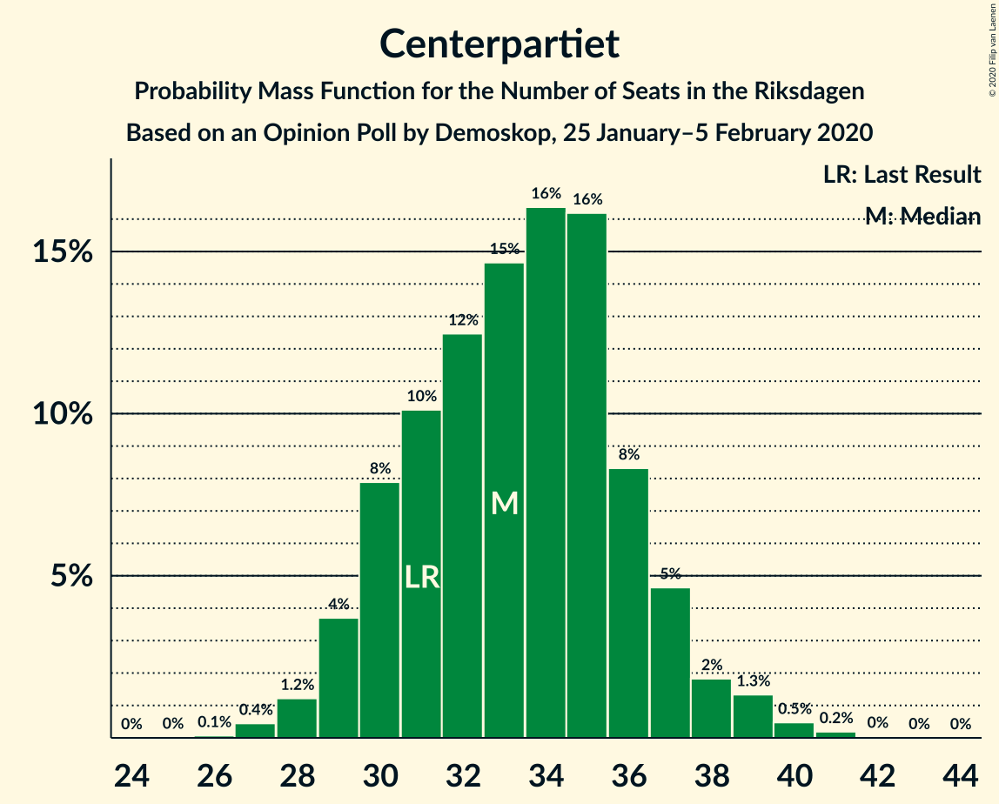
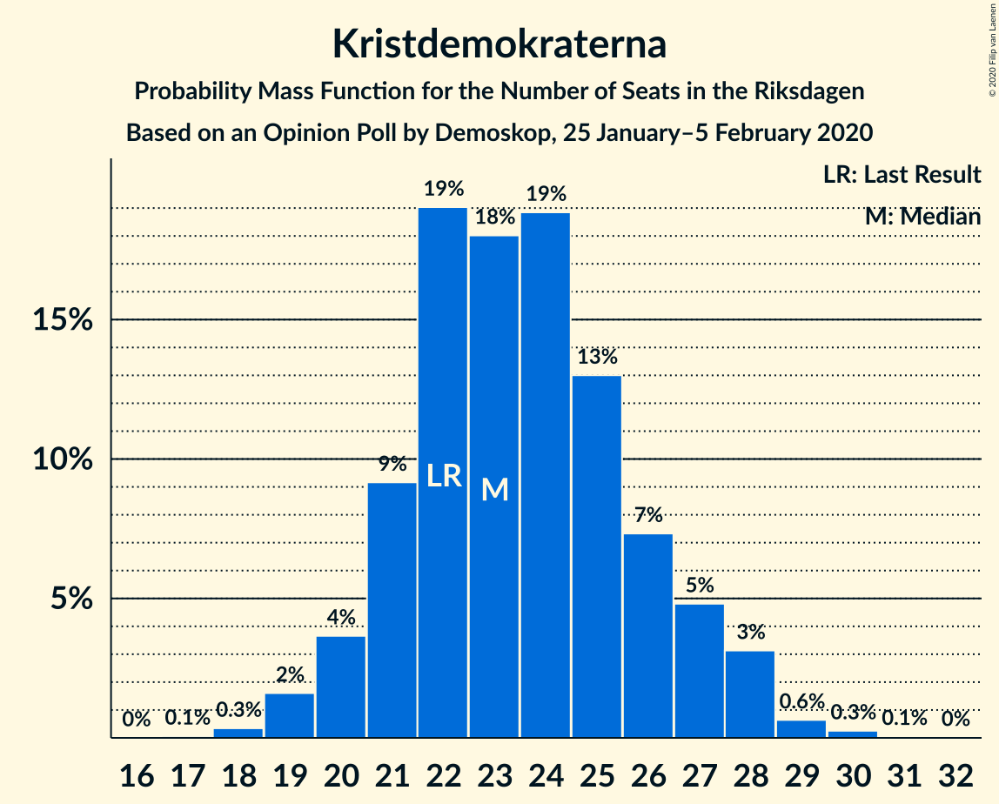
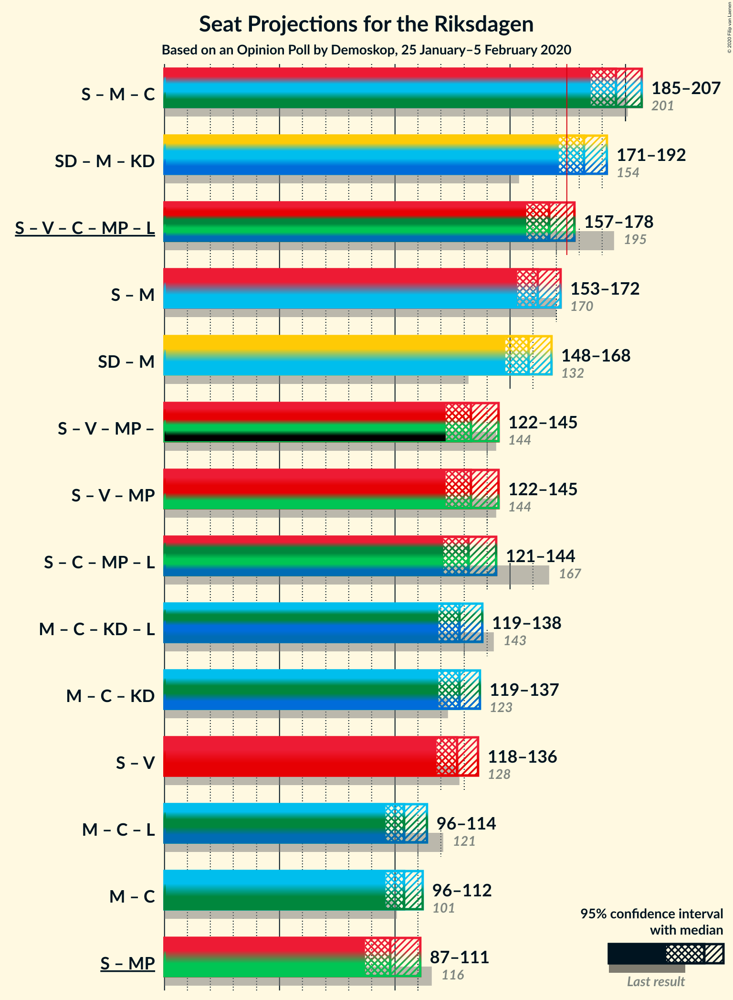
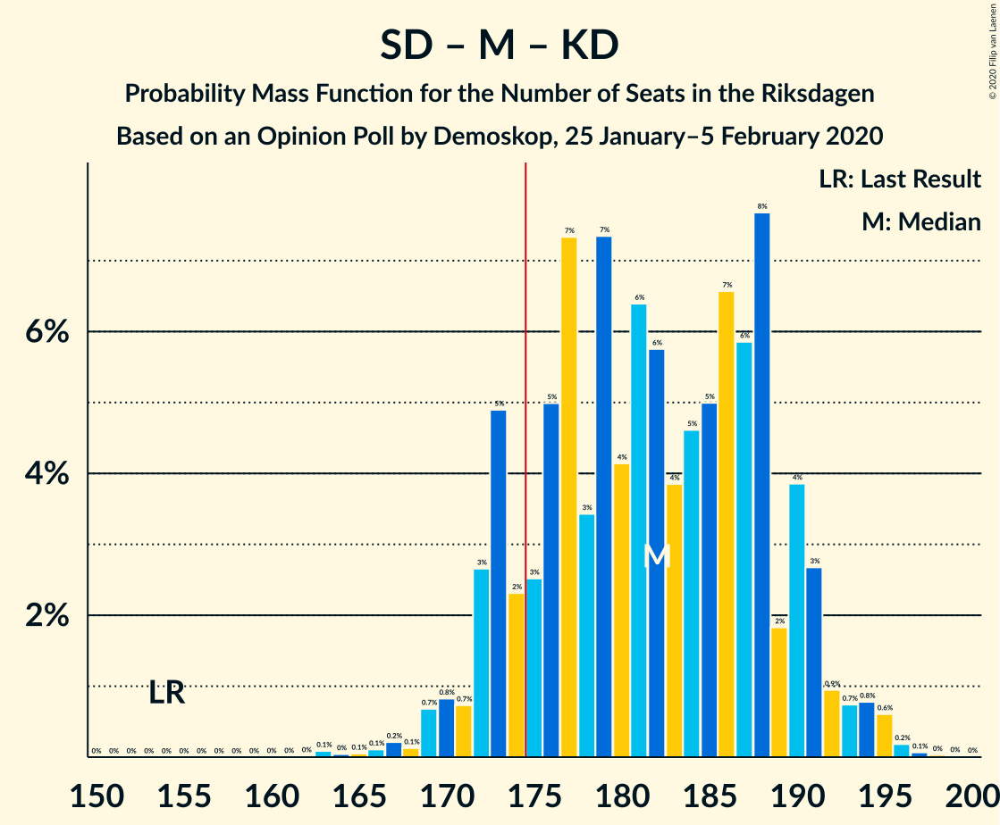
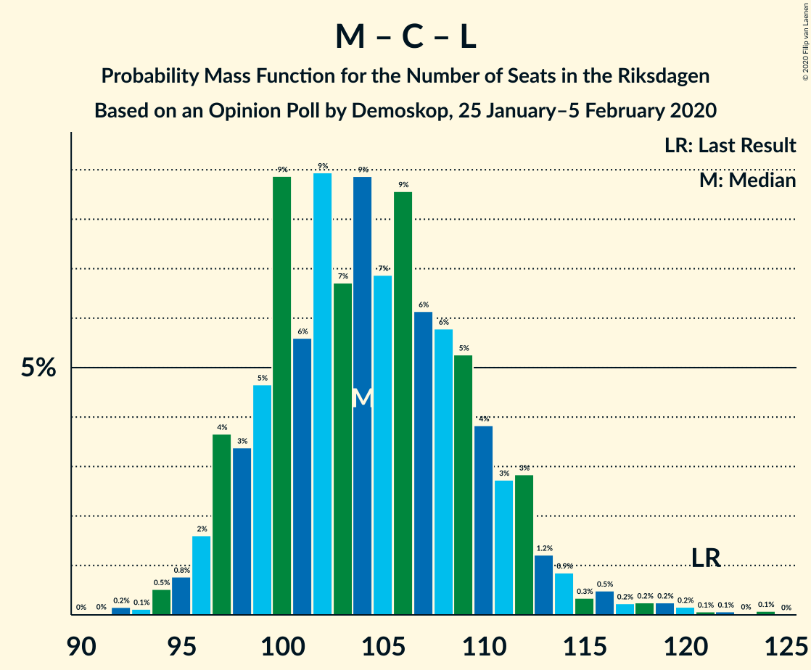

# Opinion Poll by Demoskop, 25 January–5 February 2020

<a href="#voting-intentions">Voting Intentions</a> | <a href="#seats">Seats</a> | <a href="#coalitions">Coalitions</a> | <a href="#technical-information">Technical Information</a>

## Voting Intentions

### Confidence Intervals

| Party | Last Result | Poll Result | 80% Confidence Interval | 90% Confidence Interval | 95% Confidence Interval | 99% Confidence Interval |
|:-----:|:-----------:|:-----------:|:-----------------------:|:-----------------------:|:-----------------------:|:-----------------------:|
| Sveriges socialdemokratiska arbetareparti | 28.3% | 24.7% | 23.5–26.0% |23.2–26.3% |22.9–26.6% |22.4–27.2% |
| Sverigedemokraterna | 17.5% | 23.5% | 22.4–24.7% |22.0–25.1% |21.8–25.4% |21.2–25.9% |
| Moderata samlingspartiet | 19.8% | 18.9% | 17.8–20.0% |17.5–20.3% |17.3–20.6% |16.8–21.2% |
| Vänsterpartiet | 8.0% | 9.3% | 8.6–10.2% |8.3–10.4% |8.2–10.6% |7.8–11.1% |
| Centerpartiet | 8.6% | 8.9% | 8.1–9.7% |7.9–10.0% |7.8–10.2% |7.4–10.6% |
| Kristdemokraterna | 6.3% | 6.3% | 5.7–7.0% |5.5–7.2% |5.3–7.4% |5.0–7.8% |
| Miljöpartiet de gröna | 4.4% | 3.8% | 3.3–4.4% |3.2–4.6% |3.1–4.7% |2.9–5.0% |
| Liberalerna | 5.5% | 3.2% | 2.8–3.8% |2.7–3.9% |2.5–4.1% |2.3–4.3% |

*Note:* The poll result column reflects the actual value used in the calculations. Published results may vary slightly, and in addition be rounded to fewer digits.

## Seats

### Confidence Intervals

| Party | Last Result | Median | 80% Confidence Interval | 90% Confidence Interval | 95% Confidence Interval | 99% Confidence Interval |
|:-----:|:-----------:|:------:|:-----------------------:|:-----------------------:|:-----------------------:|:-----------------------:|
| <a href="#sveriges-socialdemokratiska-arbetareparti">Sveriges socialdemokratiska arbetareparti</a> | 100 | 91 | 87–98 |85–99 |84–100 |82–103 |
| <a href="#sverigedemokraterna">Sverigedemokraterna</a> | 62 | 88 | 83–92 |82–93 |80–95 |78–98 |
| <a href="#moderata-samlingspartiet">Moderata samlingspartiet</a> | 70 | 70 | 66–75 |65–77 |64–78 |61–80 |
| <a href="#vänsterpartiet">Vänsterpartiet</a> | 28 | 34 | 31–38 |31–39 |30–40 |29–41 |
| <a href="#centerpartiet">Centerpartiet</a> | 31 | 32 | 30–36 |30–37 |29–37 |28–40 |
| <a href="#kristdemokraterna">Kristdemokraterna</a> | 22 | 23 | 21–26 |20–27 |19–27 |19–29 |
| <a href="#miljöpartiet-de-gröna">Miljöpartiet de gröna</a> | 16 | 15 | 0–16 |0–17 |0–17 |0–18 |
| <a href="#liberalerna">Liberalerna</a> | 20 | 0 | 0 |0 |0–16 |0–16 |

### Sveriges socialdemokratiska arbetareparti

*For a full overview of the results for this party, see the [Sveriges socialdemokratiska arbetareparti](party-sverigessocialdemokratiskaarbetareparti.html) page.*

| Number of Seats | Probability | Accumulated | Special Marks |
|:---------------:|:-----------:|:-----------:|:-------------:|
| 80 | 0.1% | 100% |  |
| 81 | 0.1% | 99.9% |  |
| 82 | 0.5% | 99.8% |  |
| 83 | 0.6% | 99.3% |  |
| 84 | 3% | 98.8% |  |
| 85 | 4% | 96% |  |
| 86 | 1.3% | 93% |  |
| 87 | 3% | 91% |  |
| 88 | 3% | 88% |  |
| 89 | 5% | 85% |  |
| 90 | 14% | 80% |  |
| 91 | 19% | 66% | Median |
| 92 | 7% | 46% |  |
| 93 | 9% | 39% |  |
| 94 | 6% | 30% |  |
| 95 | 9% | 24% |  |
| 96 | 3% | 15% |  |
| 97 | 3% | 13% |  |
| 98 | 3% | 10% |  |
| 99 | 4% | 7% |  |
| 100 | 2% | 4% | Last Result |
| 101 | 0.6% | 2% |  |
| 102 | 1.2% | 2% |  |
| 103 | 0.2% | 0.5% |  |
| 104 | 0.3% | 0.3% |  |
| 105 | 0% | 0% |  |

### Sverigedemokraterna

*For a full overview of the results for this party, see the [Sverigedemokraterna](party-sverigedemokraterna.html) page.*

| Number of Seats | Probability | Accumulated | Special Marks |
|:---------------:|:-----------:|:-----------:|:-------------:|
| 62 | 0% | 100% | Last Result |
| 63 | 0% | 100% |  |
| 64 | 0% | 100% |  |
| 65 | 0% | 100% |  |
| 66 | 0% | 100% |  |
| 67 | 0% | 100% |  |
| 68 | 0% | 100% |  |
| 69 | 0% | 100% |  |
| 70 | 0% | 100% |  |
| 71 | 0% | 100% |  |
| 72 | 0% | 100% |  |
| 73 | 0% | 100% |  |
| 74 | 0% | 100% |  |
| 75 | 0% | 100% |  |
| 76 | 0.1% | 100% |  |
| 77 | 0.1% | 99.9% |  |
| 78 | 2% | 99.8% |  |
| 79 | 0.7% | 98% |  |
| 80 | 0.7% | 98% |  |
| 81 | 2% | 97% |  |
| 82 | 2% | 95% |  |
| 83 | 16% | 93% |  |
| 84 | 4% | 77% |  |
| 85 | 6% | 73% |  |
| 86 | 14% | 67% |  |
| 87 | 1.3% | 53% |  |
| 88 | 8% | 52% | Median |
| 89 | 4% | 44% |  |
| 90 | 9% | 40% |  |
| 91 | 19% | 31% |  |
| 92 | 6% | 12% |  |
| 93 | 3% | 6% |  |
| 94 | 0.7% | 4% |  |
| 95 | 1.0% | 3% |  |
| 96 | 0.5% | 2% |  |
| 97 | 0.4% | 1.4% |  |
| 98 | 0.6% | 1.0% |  |
| 99 | 0.2% | 0.4% |  |
| 100 | 0.2% | 0.2% |  |
| 101 | 0% | 0% |  |

### Moderata samlingspartiet

*For a full overview of the results for this party, see the [Moderata samlingspartiet](party-moderatasamlingspartiet.html) page.*

| Number of Seats | Probability | Accumulated | Special Marks |
|:---------------:|:-----------:|:-----------:|:-------------:|
| 60 | 0.3% | 100% |  |
| 61 | 0.3% | 99.7% |  |
| 62 | 0.3% | 99.4% |  |
| 63 | 1.1% | 99.2% |  |
| 64 | 2% | 98% |  |
| 65 | 3% | 96% |  |
| 66 | 17% | 93% |  |
| 67 | 6% | 76% |  |
| 68 | 5% | 70% |  |
| 69 | 11% | 65% |  |
| 70 | 25% | 54% | Last Result, Median |
| 71 | 3% | 29% |  |
| 72 | 4% | 26% |  |
| 73 | 4% | 21% |  |
| 74 | 6% | 18% |  |
| 75 | 3% | 12% |  |
| 76 | 3% | 9% |  |
| 77 | 0.9% | 6% |  |
| 78 | 3% | 5% |  |
| 79 | 1.3% | 2% |  |
| 80 | 0.4% | 0.6% |  |
| 81 | 0% | 0.2% |  |
| 82 | 0.2% | 0.2% |  |
| 83 | 0% | 0% |  |

### Vänsterpartiet

*For a full overview of the results for this party, see the [Vänsterpartiet](party-vänsterpartiet.html) page.*

| Number of Seats | Probability | Accumulated | Special Marks |
|:---------------:|:-----------:|:-----------:|:-------------:|
| 27 | 0.1% | 100% |  |
| 28 | 0.1% | 99.9% | Last Result |
| 29 | 0.8% | 99.8% |  |
| 30 | 3% | 98.9% |  |
| 31 | 6% | 96% |  |
| 32 | 19% | 90% |  |
| 33 | 18% | 71% |  |
| 34 | 12% | 54% | Median |
| 35 | 10% | 41% |  |
| 36 | 6% | 31% |  |
| 37 | 7% | 26% |  |
| 38 | 9% | 19% |  |
| 39 | 5% | 10% |  |
| 40 | 4% | 5% |  |
| 41 | 0.5% | 0.8% |  |
| 42 | 0.1% | 0.4% |  |
| 43 | 0.2% | 0.2% |  |
| 44 | 0% | 0% |  |

### Centerpartiet

*For a full overview of the results for this party, see the [Centerpartiet](party-centerpartiet.html) page.*

| Number of Seats | Probability | Accumulated | Special Marks |
|:---------------:|:-----------:|:-----------:|:-------------:|
| 25 | 0.1% | 100% |  |
| 26 | 0.1% | 99.9% |  |
| 27 | 0.1% | 99.8% |  |
| 28 | 0.2% | 99.7% |  |
| 29 | 3% | 99.5% |  |
| 30 | 17% | 97% |  |
| 31 | 24% | 80% | Last Result |
| 32 | 6% | 56% | Median |
| 33 | 2% | 50% |  |
| 34 | 6% | 48% |  |
| 35 | 21% | 41% |  |
| 36 | 13% | 20% |  |
| 37 | 6% | 7% |  |
| 38 | 0.2% | 1.2% |  |
| 39 | 0.5% | 1.0% |  |
| 40 | 0.3% | 0.5% |  |
| 41 | 0.2% | 0.3% |  |
| 42 | 0.1% | 0.1% |  |
| 43 | 0% | 0% |  |

### Kristdemokraterna

*For a full overview of the results for this party, see the [Kristdemokraterna](party-kristdemokraterna.html) page.*

| Number of Seats | Probability | Accumulated | Special Marks |
|:---------------:|:-----------:|:-----------:|:-------------:|
| 18 | 0.4% | 100% |  |
| 19 | 2% | 99.5% |  |
| 20 | 6% | 97% |  |
| 21 | 8% | 91% |  |
| 22 | 24% | 84% | Last Result |
| 23 | 11% | 59% | Median |
| 24 | 22% | 49% |  |
| 25 | 14% | 26% |  |
| 26 | 6% | 12% |  |
| 27 | 4% | 6% |  |
| 28 | 1.4% | 2% |  |
| 29 | 0.7% | 1.0% |  |
| 30 | 0.3% | 0.3% |  |
| 31 | 0% | 0% |  |

### Miljöpartiet de gröna

*For a full overview of the results for this party, see the [Miljöpartiet de gröna](party-miljöpartietdegröna.html) page.*

| Number of Seats | Probability | Accumulated | Special Marks |
|:---------------:|:-----------:|:-----------:|:-------------:|
| 0 | 45% | 100% |  |
| 1 | 0% | 55% |  |
| 2 | 0% | 55% |  |
| 3 | 0% | 55% |  |
| 4 | 0% | 55% |  |
| 5 | 0% | 55% |  |
| 6 | 0% | 55% |  |
| 7 | 0% | 55% |  |
| 8 | 0% | 55% |  |
| 9 | 0% | 55% |  |
| 10 | 0% | 55% |  |
| 11 | 0% | 55% |  |
| 12 | 0% | 55% |  |
| 13 | 0% | 55% |  |
| 14 | 1.0% | 55% |  |
| 15 | 39% | 54% | Median |
| 16 | 8% | 14% | Last Result |
| 17 | 5% | 6% |  |
| 18 | 0.5% | 0.9% |  |
| 19 | 0.3% | 0.4% |  |
| 20 | 0.1% | 0.1% |  |
| 21 | 0% | 0% |  |

### Liberalerna

*For a full overview of the results for this party, see the [Liberalerna](party-liberalerna.html) page.*

| Number of Seats | Probability | Accumulated | Special Marks |
|:---------------:|:-----------:|:-----------:|:-------------:|
| 0 | 95% | 100% | Median |
| 1 | 0% | 5% |  |
| 2 | 0% | 5% |  |
| 3 | 0% | 5% |  |
| 4 | 0% | 5% |  |
| 5 | 0% | 5% |  |
| 6 | 0% | 5% |  |
| 7 | 0% | 5% |  |
| 8 | 0% | 5% |  |
| 9 | 0% | 5% |  |
| 10 | 0% | 5% |  |
| 11 | 0% | 5% |  |
| 12 | 0% | 5% |  |
| 13 | 0% | 5% |  |
| 14 | 0.7% | 5% |  |
| 15 | 1.5% | 4% |  |
| 16 | 2% | 3% |  |
| 17 | 0.2% | 0.2% |  |
| 18 | 0% | 0% |  |
| 19 | 0% | 0% |  |
| 20 | 0% | 0% | Last Result |

## Coalitions

### Confidence Intervals

| Coalition | Last Result | Median | Majority? | 80% Confidence Interval | 90% Confidence Interval | 95% Confidence Interval | 99% Confidence Interval |
|:---------:|:-----------:|:------:|:---------:|:-----------------------:|:-----------------------:|:-----------------------:|:-----------------------:|
| Sveriges socialdemokratiska arbetareparti – Moderata samlingspartiet – Centerpartiet | 201 | 195 | 100% | 188–204 | 185–205 | 185–206 | 180–209 |
| Sverigedemokraterna – Moderata samlingspartiet – Kristdemokraterna | 154 | 179 | 89% | 174–187 | 172–189 | 170–192 | 163–196 |
| Sveriges socialdemokratiska arbetareparti – Vänsterpartiet – Centerpartiet – Miljöpartiet de gröna – Liberalerna | 195 | 170 | 11% | 162–175 | 160–177 | 157–179 | 153–186 |
| Sveriges socialdemokratiska arbetareparti – Moderata samlingspartiet | 170 | 161 | 1.3% | 156–169 | 154–170 | 153–174 | 149–176 |
| Sverigedemokraterna – Moderata samlingspartiet | 132 | 157 | 0.1% | 152–163 | 149–166 | 147–169 | 144–171 |
| Sveriges socialdemokratiska arbetareparti – Vänsterpartiet – Miljöpartiet de gröna | 144 | 136 | 0% | 126–141 | 125–145 | 123–147 | 118–147 |
| Sveriges socialdemokratiska arbetareparti – Centerpartiet – Miljöpartiet de gröna – Liberalerna | 167 | 136 | 0% | 125–140 | 124–143 | 121–145 | 118–152 |
| Moderata samlingspartiet – Centerpartiet – Kristdemokraterna – Liberalerna | 143 | 128 | 0% | 119–134 | 119–136 | 117–138 | 116–142 |
| Sveriges socialdemokratiska arbetareparti – Vänsterpartiet | 128 | 125 | 0% | 122–133 | 119–134 | 118–136 | 115–140 |
| Moderata samlingspartiet – Centerpartiet – Kristdemokraterna | 123 | 128 | 0% | 119–133 | 119–134 | 117–135 | 116–138 |
| Moderata samlingspartiet – Centerpartiet – Liberalerna | 121 | 104 | 0% | 97–110 | 97–113 | 95–116 | 94–119 |
| Moderata samlingspartiet – Centerpartiet | 101 | 103 | 0% | 97–110 | 96–111 | 95–112 | 94–113 |
| Sveriges socialdemokratiska arbetareparti – Miljöpartiet de gröna | 116 | 101 | 0% | 91–109 | 89–109 | 88–111 | 85–113 |

### Sveriges socialdemokratiska arbetareparti – Moderata samlingspartiet – Centerpartiet

| Number of Seats | Probability | Accumulated | Special Marks |
|:---------------:|:-----------:|:-----------:|:-------------:|
| 178 | 0% | 100% |  |
| 179 | 0.4% | 99.9% |  |
| 180 | 0.4% | 99.6% |  |
| 181 | 0.2% | 99.1% |  |
| 182 | 0.2% | 99.0% |  |
| 183 | 0.6% | 98.8% |  |
| 184 | 0.2% | 98% |  |
| 185 | 3% | 98% |  |
| 186 | 2% | 95% |  |
| 187 | 1.0% | 93% |  |
| 188 | 17% | 92% |  |
| 189 | 1.3% | 75% |  |
| 190 | 4% | 74% |  |
| 191 | 3% | 69% |  |
| 192 | 0.6% | 67% |  |
| 193 | 7% | 66% | Median |
| 194 | 3% | 59% |  |
| 195 | 15% | 55% |  |
| 196 | 2% | 40% |  |
| 197 | 3% | 38% |  |
| 198 | 9% | 35% |  |
| 199 | 4% | 26% |  |
| 200 | 5% | 22% |  |
| 201 | 2% | 17% | Last Result |
| 202 | 2% | 15% |  |
| 203 | 2% | 13% |  |
| 204 | 6% | 12% |  |
| 205 | 3% | 6% |  |
| 206 | 0.7% | 3% |  |
| 207 | 0.8% | 2% |  |
| 208 | 0.5% | 1.5% |  |
| 209 | 0.5% | 0.9% |  |
| 210 | 0.2% | 0.4% |  |
| 211 | 0.1% | 0.2% |  |
| 212 | 0% | 0% |  |

### Sverigedemokraterna – Moderata samlingspartiet – Kristdemokraterna

| Number of Seats | Probability | Accumulated | Special Marks |
|:---------------:|:-----------:|:-----------:|:-------------:|
| 154 | 0% | 100% | Last Result |
| 155 | 0% | 100% |  |
| 156 | 0% | 100% |  |
| 157 | 0% | 100% |  |
| 158 | 0% | 100% |  |
| 159 | 0% | 100% |  |
| 160 | 0% | 100% |  |
| 161 | 0% | 100% |  |
| 162 | 0% | 100% |  |
| 163 | 0.5% | 100% |  |
| 164 | 0% | 99.5% |  |
| 165 | 0.2% | 99.5% |  |
| 166 | 0.2% | 99.3% |  |
| 167 | 0.2% | 99.1% |  |
| 168 | 0.2% | 98.9% |  |
| 169 | 0.2% | 98.8% |  |
| 170 | 2% | 98.5% |  |
| 171 | 1.3% | 97% |  |
| 172 | 3% | 95% |  |
| 173 | 2% | 93% |  |
| 174 | 2% | 91% |  |
| 175 | 1.1% | 89% | Majority |
| 176 | 0.6% | 88% |  |
| 177 | 15% | 87% |  |
| 178 | 4% | 72% |  |
| 179 | 19% | 68% |  |
| 180 | 3% | 49% |  |
| 181 | 6% | 45% | Median |
| 182 | 3% | 39% |  |
| 183 | 5% | 36% |  |
| 184 | 13% | 32% |  |
| 185 | 0.9% | 18% |  |
| 186 | 6% | 17% |  |
| 187 | 2% | 11% |  |
| 188 | 3% | 9% |  |
| 189 | 0.5% | 5% |  |
| 190 | 0.9% | 5% |  |
| 191 | 1.3% | 4% |  |
| 192 | 0.3% | 3% |  |
| 193 | 1.1% | 2% |  |
| 194 | 0.1% | 1.3% |  |
| 195 | 0.2% | 1.2% |  |
| 196 | 0.8% | 1.0% |  |
| 197 | 0.2% | 0.2% |  |
| 198 | 0% | 0% |  |

### Sveriges socialdemokratiska arbetareparti – Vänsterpartiet – Centerpartiet – Miljöpartiet de gröna – Liberalerna

| Number of Seats | Probability | Accumulated | Special Marks |
|:---------------:|:-----------:|:-----------:|:-------------:|
| 152 | 0.2% | 100% |  |
| 153 | 0.8% | 99.8% |  |
| 154 | 0.2% | 99.0% |  |
| 155 | 0.1% | 98.8% |  |
| 156 | 1.1% | 98.7% |  |
| 157 | 0.3% | 98% |  |
| 158 | 1.3% | 97% |  |
| 159 | 0.9% | 96% |  |
| 160 | 0.5% | 95% |  |
| 161 | 3% | 95% |  |
| 162 | 2% | 91% |  |
| 163 | 6% | 89% |  |
| 164 | 0.9% | 83% |  |
| 165 | 13% | 82% |  |
| 166 | 5% | 68% |  |
| 167 | 3% | 64% |  |
| 168 | 6% | 61% |  |
| 169 | 3% | 55% |  |
| 170 | 19% | 51% |  |
| 171 | 4% | 32% |  |
| 172 | 15% | 28% | Median |
| 173 | 0.6% | 13% |  |
| 174 | 1.1% | 12% |  |
| 175 | 2% | 11% | Majority |
| 176 | 2% | 9% |  |
| 177 | 3% | 7% |  |
| 178 | 1.3% | 5% |  |
| 179 | 2% | 3% |  |
| 180 | 0.2% | 1.5% |  |
| 181 | 0.2% | 1.2% |  |
| 182 | 0.2% | 1.1% |  |
| 183 | 0.2% | 0.9% |  |
| 184 | 0.2% | 0.7% |  |
| 185 | 0% | 0.5% |  |
| 186 | 0.5% | 0.5% |  |
| 187 | 0% | 0% |  |
| 188 | 0% | 0% |  |
| 189 | 0% | 0% |  |
| 190 | 0% | 0% |  |
| 191 | 0% | 0% |  |
| 192 | 0% | 0% |  |
| 193 | 0% | 0% |  |
| 194 | 0% | 0% |  |
| 195 | 0% | 0% | Last Result |

### Sveriges socialdemokratiska arbetareparti – Moderata samlingspartiet

| Number of Seats | Probability | Accumulated | Special Marks |
|:---------------:|:-----------:|:-----------:|:-------------:|
| 146 | 0% | 100% |  |
| 147 | 0.2% | 99.9% |  |
| 148 | 0.2% | 99.8% |  |
| 149 | 0.3% | 99.6% |  |
| 150 | 0.5% | 99.2% |  |
| 151 | 0.4% | 98.8% |  |
| 152 | 0.6% | 98% |  |
| 153 | 2% | 98% |  |
| 154 | 2% | 96% |  |
| 155 | 3% | 94% |  |
| 156 | 4% | 91% |  |
| 157 | 14% | 87% |  |
| 158 | 3% | 73% |  |
| 159 | 3% | 70% |  |
| 160 | 17% | 67% |  |
| 161 | 2% | 50% | Median |
| 162 | 11% | 48% |  |
| 163 | 7% | 37% |  |
| 164 | 1.4% | 30% |  |
| 165 | 1.2% | 28% |  |
| 166 | 4% | 27% |  |
| 167 | 5% | 23% |  |
| 168 | 5% | 18% |  |
| 169 | 6% | 13% |  |
| 170 | 3% | 8% | Last Result |
| 171 | 0.4% | 5% |  |
| 172 | 1.1% | 4% |  |
| 173 | 0.5% | 3% |  |
| 174 | 1.4% | 3% |  |
| 175 | 0.1% | 1.3% | Majority |
| 176 | 1.0% | 1.3% |  |
| 177 | 0% | 0.2% |  |
| 178 | 0.1% | 0.2% |  |
| 179 | 0% | 0.1% |  |
| 180 | 0% | 0% |  |

### Sverigedemokraterna – Moderata samlingspartiet

| Number of Seats | Probability | Accumulated | Special Marks |
|:---------------:|:-----------:|:-----------:|:-------------:|
| 132 | 0% | 100% | Last Result |
| 133 | 0% | 100% |  |
| 134 | 0% | 100% |  |
| 135 | 0% | 100% |  |
| 136 | 0% | 100% |  |
| 137 | 0% | 100% |  |
| 138 | 0% | 100% |  |
| 139 | 0% | 100% |  |
| 140 | 0% | 100% |  |
| 141 | 0% | 100% |  |
| 142 | 0% | 100% |  |
| 143 | 0.1% | 99.9% |  |
| 144 | 0.6% | 99.8% |  |
| 145 | 1.1% | 99.3% |  |
| 146 | 0% | 98% |  |
| 147 | 1.5% | 98% |  |
| 148 | 1.2% | 97% |  |
| 149 | 0.8% | 95% |  |
| 150 | 2% | 95% |  |
| 151 | 2% | 93% |  |
| 152 | 1.5% | 90% |  |
| 153 | 16% | 89% |  |
| 154 | 3% | 73% |  |
| 155 | 4% | 70% |  |
| 156 | 5% | 66% |  |
| 157 | 16% | 61% |  |
| 158 | 8% | 45% | Median |
| 159 | 9% | 37% |  |
| 160 | 5% | 27% |  |
| 161 | 3% | 22% |  |
| 162 | 6% | 20% |  |
| 163 | 4% | 13% |  |
| 164 | 2% | 9% |  |
| 165 | 1.4% | 7% |  |
| 166 | 1.3% | 6% |  |
| 167 | 2% | 5% |  |
| 168 | 0.4% | 3% |  |
| 169 | 0.6% | 3% |  |
| 170 | 0.5% | 2% |  |
| 171 | 1.0% | 1.4% |  |
| 172 | 0.1% | 0.4% |  |
| 173 | 0.2% | 0.3% |  |
| 174 | 0% | 0.1% |  |
| 175 | 0% | 0.1% | Majority |
| 176 | 0.1% | 0.1% |  |
| 177 | 0% | 0% |  |

### Sveriges socialdemokratiska arbetareparti – Vänsterpartiet – Miljöpartiet de gröna

| Number of Seats | Probability | Accumulated | Special Marks |
|:---------------:|:-----------:|:-----------:|:-------------:|
| 116 | 0.2% | 100% |  |
| 117 | 0% | 99.8% |  |
| 118 | 0.4% | 99.8% |  |
| 119 | 0.4% | 99.5% |  |
| 120 | 0.2% | 99.1% |  |
| 121 | 0.2% | 98.9% |  |
| 122 | 0.8% | 98.7% |  |
| 123 | 0.4% | 98% |  |
| 124 | 2% | 97% |  |
| 125 | 4% | 96% |  |
| 126 | 3% | 92% |  |
| 127 | 1.4% | 89% |  |
| 128 | 4% | 88% |  |
| 129 | 7% | 84% |  |
| 130 | 2% | 77% |  |
| 131 | 3% | 75% |  |
| 132 | 5% | 72% |  |
| 133 | 7% | 67% |  |
| 134 | 2% | 60% |  |
| 135 | 6% | 57% |  |
| 136 | 2% | 51% |  |
| 137 | 15% | 50% |  |
| 138 | 5% | 35% |  |
| 139 | 14% | 30% |  |
| 140 | 6% | 16% | Median |
| 141 | 1.3% | 10% |  |
| 142 | 2% | 9% |  |
| 143 | 0.3% | 7% |  |
| 144 | 1.5% | 6% | Last Result |
| 145 | 1.4% | 5% |  |
| 146 | 0.1% | 4% |  |
| 147 | 3% | 4% |  |
| 148 | 0% | 0.2% |  |
| 149 | 0.1% | 0.2% |  |
| 150 | 0% | 0% |  |

### Sveriges socialdemokratiska arbetareparti – Centerpartiet – Miljöpartiet de gröna – Liberalerna

| Number of Seats | Probability | Accumulated | Special Marks |
|:---------------:|:-----------:|:-----------:|:-------------:|
| 115 | 0.1% | 100% |  |
| 116 | 0% | 99.9% |  |
| 117 | 0.2% | 99.9% |  |
| 118 | 0.2% | 99.7% |  |
| 119 | 0.1% | 99.5% |  |
| 120 | 0.4% | 99.4% |  |
| 121 | 2% | 98.9% |  |
| 122 | 0.8% | 97% |  |
| 123 | 1.0% | 96% |  |
| 124 | 5% | 95% |  |
| 125 | 4% | 90% |  |
| 126 | 2% | 86% |  |
| 127 | 3% | 84% |  |
| 128 | 4% | 81% |  |
| 129 | 4% | 77% |  |
| 130 | 4% | 74% |  |
| 131 | 6% | 69% |  |
| 132 | 2% | 64% |  |
| 133 | 3% | 61% |  |
| 134 | 4% | 58% |  |
| 135 | 2% | 55% |  |
| 136 | 3% | 53% |  |
| 137 | 19% | 50% |  |
| 138 | 3% | 30% | Median |
| 139 | 4% | 27% |  |
| 140 | 14% | 23% |  |
| 141 | 1.1% | 9% |  |
| 142 | 2% | 7% |  |
| 143 | 1.1% | 5% |  |
| 144 | 0.9% | 4% |  |
| 145 | 1.3% | 3% |  |
| 146 | 0.5% | 2% |  |
| 147 | 0.2% | 1.3% |  |
| 148 | 0.1% | 1.1% |  |
| 149 | 0.1% | 1.0% |  |
| 150 | 0.3% | 0.9% |  |
| 151 | 0.1% | 0.6% |  |
| 152 | 0.5% | 0.5% |  |
| 153 | 0% | 0% |  |
| 154 | 0% | 0% |  |
| 155 | 0% | 0% |  |
| 156 | 0% | 0% |  |
| 157 | 0% | 0% |  |
| 158 | 0% | 0% |  |
| 159 | 0% | 0% |  |
| 160 | 0% | 0% |  |
| 161 | 0% | 0% |  |
| 162 | 0% | 0% |  |
| 163 | 0% | 0% |  |
| 164 | 0% | 0% |  |
| 165 | 0% | 0% |  |
| 166 | 0% | 0% |  |
| 167 | 0% | 0% | Last Result |

### Moderata samlingspartiet – Centerpartiet – Kristdemokraterna – Liberalerna

| Number of Seats | Probability | Accumulated | Special Marks |
|:---------------:|:-----------:|:-----------:|:-------------:|
| 114 | 0.1% | 100% |  |
| 115 | 0.2% | 99.9% |  |
| 116 | 2% | 99.7% |  |
| 117 | 0.5% | 98% |  |
| 118 | 0.3% | 97% |  |
| 119 | 18% | 97% |  |
| 120 | 2% | 80% |  |
| 121 | 2% | 78% |  |
| 122 | 3% | 76% |  |
| 123 | 3% | 73% |  |
| 124 | 3% | 70% |  |
| 125 | 5% | 67% | Median |
| 126 | 5% | 61% |  |
| 127 | 2% | 56% |  |
| 128 | 6% | 55% |  |
| 129 | 17% | 48% |  |
| 130 | 6% | 32% |  |
| 131 | 8% | 26% |  |
| 132 | 3% | 18% |  |
| 133 | 4% | 15% |  |
| 134 | 3% | 11% |  |
| 135 | 3% | 8% |  |
| 136 | 1.0% | 5% |  |
| 137 | 0.4% | 4% |  |
| 138 | 2% | 4% |  |
| 139 | 0.4% | 1.2% |  |
| 140 | 0.2% | 0.9% |  |
| 141 | 0.2% | 0.7% |  |
| 142 | 0.2% | 0.6% |  |
| 143 | 0.1% | 0.4% | Last Result |
| 144 | 0.2% | 0.3% |  |
| 145 | 0% | 0.1% |  |
| 146 | 0% | 0.1% |  |
| 147 | 0% | 0% |  |

### Sveriges socialdemokratiska arbetareparti – Vänsterpartiet

| Number of Seats | Probability | Accumulated | Special Marks |
|:---------------:|:-----------:|:-----------:|:-------------:|
| 112 | 0.2% | 100% |  |
| 113 | 0.1% | 99.8% |  |
| 114 | 0.1% | 99.7% |  |
| 115 | 0.1% | 99.6% |  |
| 116 | 0.3% | 99.5% |  |
| 117 | 1.0% | 99.2% |  |
| 118 | 0.8% | 98% |  |
| 119 | 4% | 97% |  |
| 120 | 0.9% | 93% |  |
| 121 | 0.4% | 93% |  |
| 122 | 17% | 92% |  |
| 123 | 4% | 76% |  |
| 124 | 16% | 71% |  |
| 125 | 9% | 56% | Median |
| 126 | 4% | 47% |  |
| 127 | 3% | 42% |  |
| 128 | 5% | 39% | Last Result |
| 129 | 8% | 34% |  |
| 130 | 4% | 26% |  |
| 131 | 4% | 22% |  |
| 132 | 5% | 19% |  |
| 133 | 7% | 14% |  |
| 134 | 2% | 7% |  |
| 135 | 2% | 4% |  |
| 136 | 2% | 3% |  |
| 137 | 0.1% | 1.0% |  |
| 138 | 0.2% | 0.9% |  |
| 139 | 0.1% | 0.7% |  |
| 140 | 0.2% | 0.6% |  |
| 141 | 0.1% | 0.4% |  |
| 142 | 0.3% | 0.3% |  |
| 143 | 0% | 0% |  |

### Moderata samlingspartiet – Centerpartiet – Kristdemokraterna

| Number of Seats | Probability | Accumulated | Special Marks |
|:---------------:|:-----------:|:-----------:|:-------------:|
| 113 | 0% | 100% |  |
| 114 | 0.1% | 99.9% |  |
| 115 | 0.2% | 99.8% |  |
| 116 | 2% | 99.6% |  |
| 117 | 1.0% | 98% |  |
| 118 | 0.3% | 97% |  |
| 119 | 18% | 96% |  |
| 120 | 2% | 78% |  |
| 121 | 3% | 76% |  |
| 122 | 5% | 74% |  |
| 123 | 3% | 69% | Last Result |
| 124 | 3% | 66% |  |
| 125 | 6% | 63% | Median |
| 126 | 5% | 57% |  |
| 127 | 2% | 52% |  |
| 128 | 6% | 50% |  |
| 129 | 17% | 44% |  |
| 130 | 6% | 27% |  |
| 131 | 7% | 21% |  |
| 132 | 3% | 14% |  |
| 133 | 4% | 11% |  |
| 134 | 2% | 7% |  |
| 135 | 3% | 5% |  |
| 136 | 0.6% | 2% |  |
| 137 | 0.4% | 1.3% |  |
| 138 | 0.4% | 0.9% |  |
| 139 | 0.3% | 0.5% |  |
| 140 | 0.1% | 0.2% |  |
| 141 | 0% | 0.1% |  |
| 142 | 0% | 0.1% |  |
| 143 | 0% | 0% |  |

### Moderata samlingspartiet – Centerpartiet – Liberalerna

| Number of Seats | Probability | Accumulated | Special Marks |
|:---------------:|:-----------:|:-----------:|:-------------:|
| 91 | 0.1% | 100% |  |
| 92 | 0.1% | 99.9% |  |
| 93 | 0.1% | 99.8% |  |
| 94 | 1.4% | 99.7% |  |
| 95 | 2% | 98% |  |
| 96 | 0.4% | 96% |  |
| 97 | 16% | 96% |  |
| 98 | 1.0% | 80% |  |
| 99 | 5% | 79% |  |
| 100 | 6% | 74% |  |
| 101 | 6% | 68% |  |
| 102 | 1.1% | 62% | Median |
| 103 | 10% | 61% |  |
| 104 | 3% | 51% |  |
| 105 | 18% | 47% |  |
| 106 | 5% | 29% |  |
| 107 | 4% | 25% |  |
| 108 | 4% | 20% |  |
| 109 | 1.0% | 16% |  |
| 110 | 5% | 15% |  |
| 111 | 1.3% | 10% |  |
| 112 | 3% | 8% |  |
| 113 | 2% | 5% |  |
| 114 | 0.3% | 3% |  |
| 115 | 0.2% | 3% |  |
| 116 | 2% | 3% |  |
| 117 | 0% | 0.7% |  |
| 118 | 0.1% | 0.6% |  |
| 119 | 0.1% | 0.6% |  |
| 120 | 0.2% | 0.5% |  |
| 121 | 0.1% | 0.3% | Last Result |
| 122 | 0.2% | 0.2% |  |
| 123 | 0% | 0.1% |  |
| 124 | 0% | 0% |  |

### Moderata samlingspartiet – Centerpartiet

| Number of Seats | Probability | Accumulated | Special Marks |
|:---------------:|:-----------:|:-----------:|:-------------:|
| 90 | 0% | 100% |  |
| 91 | 0.1% | 99.9% |  |
| 92 | 0.2% | 99.9% |  |
| 93 | 0.1% | 99.7% |  |
| 94 | 2% | 99.6% |  |
| 95 | 2% | 98% |  |
| 96 | 0.6% | 96% |  |
| 97 | 16% | 95% |  |
| 98 | 2% | 79% |  |
| 99 | 5% | 77% |  |
| 100 | 8% | 72% |  |
| 101 | 6% | 64% | Last Result |
| 102 | 1.2% | 58% | Median |
| 103 | 10% | 57% |  |
| 104 | 3% | 46% |  |
| 105 | 18% | 43% |  |
| 106 | 5% | 25% |  |
| 107 | 4% | 20% |  |
| 108 | 4% | 16% |  |
| 109 | 1.0% | 12% |  |
| 110 | 5% | 11% |  |
| 111 | 1.1% | 6% |  |
| 112 | 3% | 5% |  |
| 113 | 2% | 2% |  |
| 114 | 0.2% | 0.5% |  |
| 115 | 0.2% | 0.3% |  |
| 116 | 0.1% | 0.2% |  |
| 117 | 0% | 0% |  |

### Sveriges socialdemokratiska arbetareparti – Miljöpartiet de gröna

| Number of Seats | Probability | Accumulated | Special Marks |
|:---------------:|:-----------:|:-----------:|:-------------:|
| 83 | 0.2% | 100% |  |
| 84 | 0.2% | 99.8% |  |
| 85 | 0.6% | 99.7% |  |
| 86 | 0.8% | 99.0% |  |
| 87 | 0.6% | 98% |  |
| 88 | 2% | 98% |  |
| 89 | 2% | 96% |  |
| 90 | 1.0% | 94% |  |
| 91 | 4% | 93% |  |
| 92 | 4% | 89% |  |
| 93 | 7% | 84% |  |
| 94 | 1.3% | 77% |  |
| 95 | 7% | 76% |  |
| 96 | 2% | 69% |  |
| 97 | 3% | 67% |  |
| 98 | 3% | 64% |  |
| 99 | 4% | 61% |  |
| 100 | 6% | 57% |  |
| 101 | 0.9% | 51% |  |
| 102 | 3% | 50% |  |
| 103 | 3% | 47% |  |
| 104 | 0.9% | 44% |  |
| 105 | 15% | 43% |  |
| 106 | 14% | 28% | Median |
| 107 | 3% | 14% |  |
| 108 | 0.6% | 11% |  |
| 109 | 6% | 10% |  |
| 110 | 0.5% | 4% |  |
| 111 | 1.3% | 4% |  |
| 112 | 2% | 2% |  |
| 113 | 0.2% | 0.6% |  |
| 114 | 0.4% | 0.5% |  |
| 115 | 0% | 0.1% |  |
| 116 | 0% | 0.1% | Last Result |
| 117 | 0% | 0% |  |

## Technical Information

### Opinion Poll

+ **Polling firm:** Demoskop
+ **Commissioner(s):** —
+ **Fieldwork period:** 25 January–5 February 2020

### Calculations

+ **Sample size:** 2148
+ **Simulations done:** 131,072
+ **Error estimate:** 0.58%

