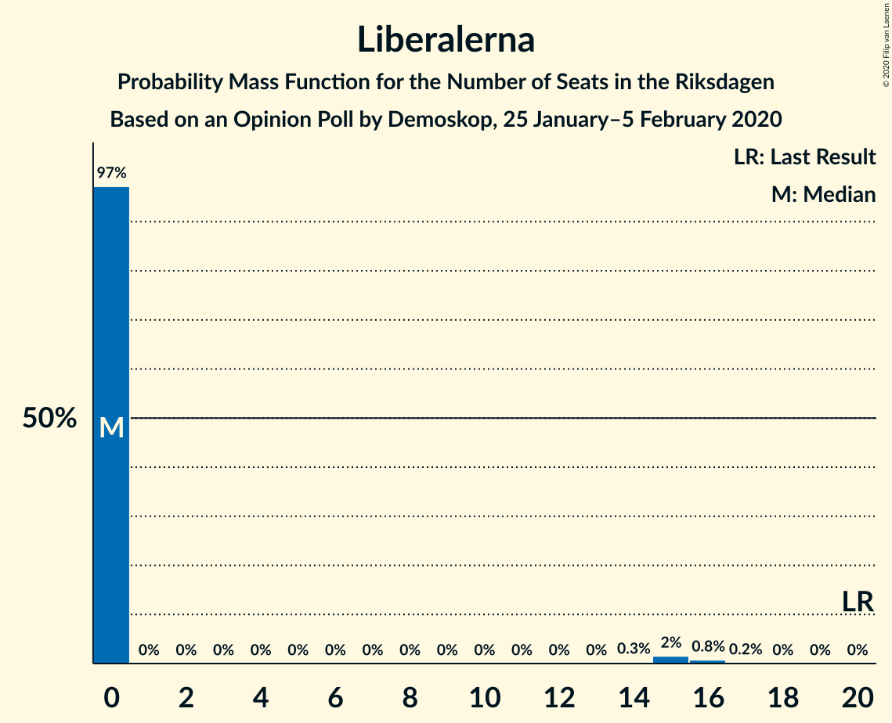
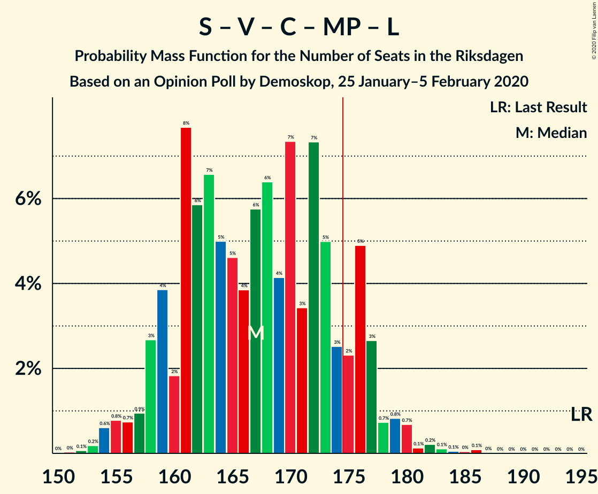
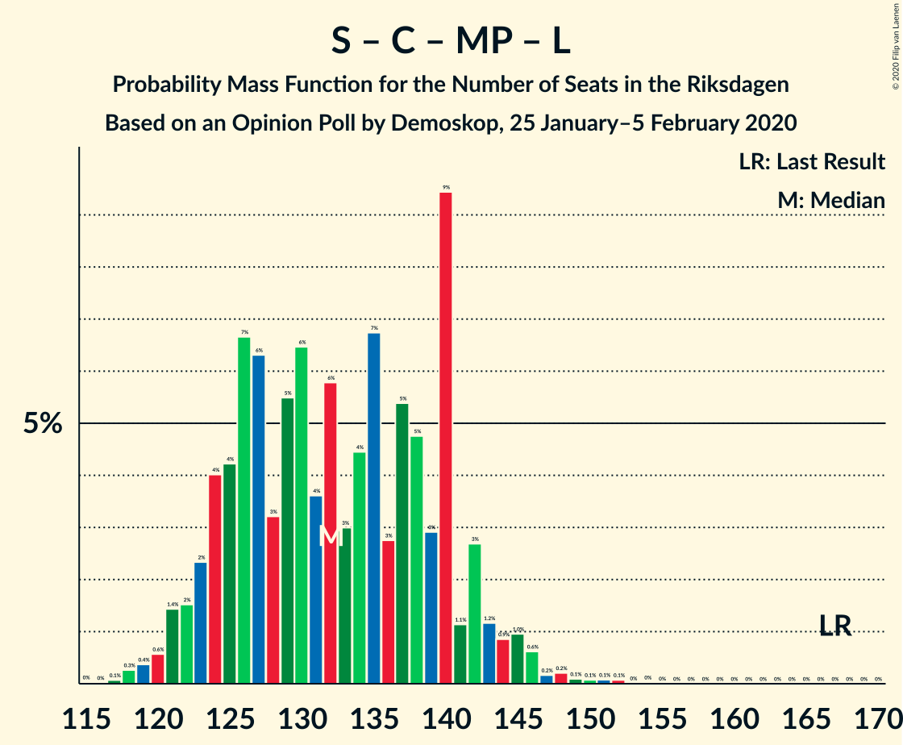

# Opinion Poll by Demoskop, 25 January–5 February 2020

<a href="#voting-intentions">Voting Intentions</a> | <a href="#seats">Seats</a> | <a href="#coalitions">Coalitions</a> | <a href="#technical-information">Technical Information</a>

## Voting Intentions

### Confidence Intervals

| Party | Last Result | Poll Result | 80% Confidence Interval | 90% Confidence Interval | 95% Confidence Interval | 99% Confidence Interval |
|:-----:|:-----------:|:-----------:|:-----------------------:|:-----------------------:|:-----------------------:|:-----------------------:|
| Sveriges socialdemokratiska arbetareparti | 28.3% | 24.7% | 23.5–26.0% |23.2–26.3% |22.9–26.6% |22.4–27.2% |
| Sverigedemokraterna | 17.5% | 23.5% | 22.4–24.7% |22.0–25.1% |21.8–25.4% |21.2–25.9% |
| Moderata samlingspartiet | 19.8% | 18.9% | 17.8–20.0% |17.5–20.3% |17.3–20.6% |16.8–21.2% |
| Vänsterpartiet | 8.0% | 9.3% | 8.6–10.2% |8.3–10.4% |8.2–10.6% |7.8–11.1% |
| Centerpartiet | 8.6% | 8.9% | 8.1–9.7% |7.9–10.0% |7.8–10.2% |7.4–10.6% |
| Kristdemokraterna | 6.3% | 6.3% | 5.7–7.0% |5.5–7.2% |5.3–7.4% |5.0–7.8% |
| Miljöpartiet de gröna | 4.4% | 3.8% | 3.3–4.4% |3.2–4.6% |3.1–4.7% |2.9–5.0% |
| Liberalerna | 5.5% | 3.2% | 2.8–3.8% |2.7–3.9% |2.5–4.1% |2.3–4.3% |

*Note:* The poll result column reflects the actual value used in the calculations. Published results may vary slightly, and in addition be rounded to fewer digits.

## Seats

### Confidence Intervals

| Party | Last Result | Median | 80% Confidence Interval | 90% Confidence Interval | 95% Confidence Interval | 99% Confidence Interval |
|:-----:|:-----------:|:------:|:-----------------------:|:-----------------------:|:-----------------------:|:-----------------------:|
| <a href="#sveriges-socialdemokratiska-arbetareparti">Sveriges socialdemokratiska arbetareparti</a> | 100 | 92 | 87–98 |86–99 |85–101 |83–103 |
| <a href="#sverigedemokraterna">Sverigedemokraterna</a> | 62 | 87 | 83–93 |82–94 |80–95 |78–98 |
| <a href="#moderata-samlingspartiet">Moderata samlingspartiet</a> | 70 | 70 | 66–75 |65–77 |63–78 |62–80 |
| <a href="#vänsterpartiet">Vänsterpartiet</a> | 28 | 35 | 32–38 |31–39 |30–40 |29–41 |
| <a href="#centerpartiet">Centerpartiet</a> | 31 | 33 | 30–36 |29–37 |29–38 |27–40 |
| <a href="#kristdemokraterna">Kristdemokraterna</a> | 22 | 23 | 21–26 |20–27 |20–28 |19–29 |
| <a href="#miljöpartiet-de-gröna">Miljöpartiet de gröna</a> | 16 | 0 | 0–16 |0–17 |0–17 |0–18 |
| <a href="#liberalerna">Liberalerna</a> | 20 | 0 | 0 |0 |0–14 |0–16 |

### Sveriges socialdemokratiska arbetareparti

*For a full overview of the results for this party, see the [Sveriges socialdemokratiska arbetareparti](party-sverigessocialdemokratiskaarbetareparti.html) page.*

| Number of Seats | Probability | Accumulated | Special Marks |
|:---------------:|:-----------:|:-----------:|:-------------:|
| 80 | 0.1% | 100% |  |
| 81 | 0.1% | 99.9% |  |
| 82 | 0.3% | 99.8% |  |
| 83 | 0.9% | 99.5% |  |
| 84 | 0.8% | 98.6% |  |
| 85 | 2% | 98% |  |
| 86 | 6% | 96% |  |
| 87 | 4% | 90% |  |
| 88 | 4% | 86% |  |
| 89 | 6% | 82% |  |
| 90 | 9% | 76% |  |
| 91 | 13% | 67% |  |
| 92 | 12% | 54% | Median |
| 93 | 7% | 42% |  |
| 94 | 9% | 35% |  |
| 95 | 7% | 26% |  |
| 96 | 5% | 19% |  |
| 97 | 4% | 14% |  |
| 98 | 5% | 10% |  |
| 99 | 2% | 5% |  |
| 100 | 1.0% | 4% | Last Result |
| 101 | 2% | 3% |  |
| 102 | 0.4% | 0.9% |  |
| 103 | 0.3% | 0.5% |  |
| 104 | 0.1% | 0.2% |  |
| 105 | 0.1% | 0.1% |  |
| 106 | 0% | 0% |  |

### Sverigedemokraterna

*For a full overview of the results for this party, see the [Sverigedemokraterna](party-sverigedemokraterna.html) page.*

| Number of Seats | Probability | Accumulated | Special Marks |
|:---------------:|:-----------:|:-----------:|:-------------:|
| 62 | 0% | 100% | Last Result |
| 63 | 0% | 100% |  |
| 64 | 0% | 100% |  |
| 65 | 0% | 100% |  |
| 66 | 0% | 100% |  |
| 67 | 0% | 100% |  |
| 68 | 0% | 100% |  |
| 69 | 0% | 100% |  |
| 70 | 0% | 100% |  |
| 71 | 0% | 100% |  |
| 72 | 0% | 100% |  |
| 73 | 0% | 100% |  |
| 74 | 0% | 100% |  |
| 75 | 0% | 100% |  |
| 76 | 0% | 99.9% |  |
| 77 | 0.2% | 99.9% |  |
| 78 | 0.6% | 99.7% |  |
| 79 | 0.9% | 99.1% |  |
| 80 | 1.3% | 98% |  |
| 81 | 1.3% | 97% |  |
| 82 | 2% | 96% |  |
| 83 | 5% | 93% |  |
| 84 | 10% | 88% |  |
| 85 | 9% | 78% |  |
| 86 | 14% | 69% |  |
| 87 | 8% | 55% | Median |
| 88 | 6% | 47% |  |
| 89 | 5% | 40% |  |
| 90 | 6% | 36% |  |
| 91 | 9% | 30% |  |
| 92 | 7% | 21% |  |
| 93 | 8% | 15% |  |
| 94 | 3% | 6% |  |
| 95 | 1.1% | 3% |  |
| 96 | 0.5% | 2% |  |
| 97 | 0.5% | 1.1% |  |
| 98 | 0.3% | 0.6% |  |
| 99 | 0.1% | 0.3% |  |
| 100 | 0.1% | 0.2% |  |
| 101 | 0.1% | 0.1% |  |
| 102 | 0% | 0% |  |

### Moderata samlingspartiet

*For a full overview of the results for this party, see the [Moderata samlingspartiet](party-moderatasamlingspartiet.html) page.*

| Number of Seats | Probability | Accumulated | Special Marks |
|:---------------:|:-----------:|:-----------:|:-------------:|
| 60 | 0.1% | 100% |  |
| 61 | 0.1% | 99.9% |  |
| 62 | 0.6% | 99.7% |  |
| 63 | 2% | 99.1% |  |
| 64 | 2% | 97% |  |
| 65 | 2% | 95% |  |
| 66 | 5% | 93% |  |
| 67 | 11% | 88% |  |
| 68 | 7% | 77% |  |
| 69 | 8% | 70% |  |
| 70 | 13% | 62% | Last Result, Median |
| 71 | 14% | 50% |  |
| 72 | 8% | 36% |  |
| 73 | 6% | 28% |  |
| 74 | 7% | 22% |  |
| 75 | 6% | 14% |  |
| 76 | 3% | 8% |  |
| 77 | 2% | 6% |  |
| 78 | 2% | 3% |  |
| 79 | 1.2% | 2% |  |
| 80 | 0.3% | 0.5% |  |
| 81 | 0.1% | 0.2% |  |
| 82 | 0.1% | 0.1% |  |
| 83 | 0% | 0.1% |  |
| 84 | 0% | 0% |  |

### Vänsterpartiet

*For a full overview of the results for this party, see the [Vänsterpartiet](party-vänsterpartiet.html) page.*

| Number of Seats | Probability | Accumulated | Special Marks |
|:---------------:|:-----------:|:-----------:|:-------------:|
| 27 | 0.1% | 100% |  |
| 28 | 0.3% | 99.9% | Last Result |
| 29 | 0.7% | 99.7% |  |
| 30 | 3% | 99.0% |  |
| 31 | 4% | 96% |  |
| 32 | 9% | 92% |  |
| 33 | 12% | 83% |  |
| 34 | 15% | 72% |  |
| 35 | 20% | 56% | Median |
| 36 | 13% | 37% |  |
| 37 | 11% | 23% |  |
| 38 | 5% | 12% |  |
| 39 | 4% | 7% |  |
| 40 | 2% | 3% |  |
| 41 | 1.0% | 1.5% |  |
| 42 | 0.3% | 0.5% |  |
| 43 | 0.1% | 0.2% |  |
| 44 | 0% | 0% |  |

### Centerpartiet

*For a full overview of the results for this party, see the [Centerpartiet](party-centerpartiet.html) page.*

| Number of Seats | Probability | Accumulated | Special Marks |
|:---------------:|:-----------:|:-----------:|:-------------:|
| 26 | 0.1% | 100% |  |
| 27 | 0.4% | 99.9% |  |
| 28 | 1.2% | 99.5% |  |
| 29 | 4% | 98% |  |
| 30 | 8% | 95% |  |
| 31 | 10% | 87% | Last Result |
| 32 | 12% | 77% |  |
| 33 | 15% | 64% | Median |
| 34 | 16% | 49% |  |
| 35 | 16% | 33% |  |
| 36 | 8% | 17% |  |
| 37 | 5% | 9% |  |
| 38 | 2% | 4% |  |
| 39 | 1.3% | 2% |  |
| 40 | 0.5% | 0.7% |  |
| 41 | 0.2% | 0.3% |  |
| 42 | 0% | 0.1% |  |
| 43 | 0% | 0% |  |

### Kristdemokraterna

*For a full overview of the results for this party, see the [Kristdemokraterna](party-kristdemokraterna.html) page.*

| Number of Seats | Probability | Accumulated | Special Marks |
|:---------------:|:-----------:|:-----------:|:-------------:|
| 17 | 0.1% | 100% |  |
| 18 | 0.3% | 99.9% |  |
| 19 | 2% | 99.6% |  |
| 20 | 4% | 98% |  |
| 21 | 9% | 94% |  |
| 22 | 19% | 85% | Last Result |
| 23 | 18% | 66% | Median |
| 24 | 19% | 48% |  |
| 25 | 13% | 29% |  |
| 26 | 7% | 16% |  |
| 27 | 5% | 9% |  |
| 28 | 3% | 4% |  |
| 29 | 0.6% | 1.0% |  |
| 30 | 0.3% | 0.3% |  |
| 31 | 0.1% | 0.1% |  |
| 32 | 0% | 0% |  |

### Miljöpartiet de gröna

*For a full overview of the results for this party, see the [Miljöpartiet de gröna](party-miljöpartietdegröna.html) page.*

| Number of Seats | Probability | Accumulated | Special Marks |
|:---------------:|:-----------:|:-----------:|:-------------:|
| 0 | 58% | 100% | Median |
| 1 | 0% | 42% |  |
| 2 | 0% | 42% |  |
| 3 | 0% | 42% |  |
| 4 | 0% | 42% |  |
| 5 | 0% | 42% |  |
| 6 | 0% | 42% |  |
| 7 | 0% | 42% |  |
| 8 | 0% | 42% |  |
| 9 | 0% | 42% |  |
| 10 | 0% | 42% |  |
| 11 | 0% | 42% |  |
| 12 | 0% | 42% |  |
| 13 | 0% | 42% |  |
| 14 | 0.3% | 42% |  |
| 15 | 28% | 42% |  |
| 16 | 8% | 14% | Last Result |
| 17 | 5% | 6% |  |
| 18 | 0.9% | 1.3% |  |
| 19 | 0.4% | 0.4% |  |
| 20 | 0.1% | 0.1% |  |
| 21 | 0% | 0% |  |

### Liberalerna

*For a full overview of the results for this party, see the [Liberalerna](party-liberalerna.html) page.*

| Number of Seats | Probability | Accumulated | Special Marks |
|:---------------:|:-----------:|:-----------:|:-------------:|
| 0 | 97% | 100% | Median |
| 1 | 0% | 3% |  |
| 2 | 0% | 3% |  |
| 3 | 0% | 3% |  |
| 4 | 0% | 3% |  |
| 5 | 0% | 3% |  |
| 6 | 0% | 3% |  |
| 7 | 0% | 3% |  |
| 8 | 0% | 3% |  |
| 9 | 0% | 3% |  |
| 10 | 0% | 3% |  |
| 11 | 0% | 3% |  |
| 12 | 0% | 3% |  |
| 13 | 0% | 3% |  |
| 14 | 0.3% | 3% |  |
| 15 | 2% | 2% |  |
| 16 | 0.8% | 0.9% |  |
| 17 | 0.2% | 0.2% |  |
| 18 | 0% | 0% |  |
| 19 | 0% | 0% |  |
| 20 | 0% | 0% | Last Result |

## Coalitions

### Confidence Intervals

| Coalition | Last Result | Median | Majority? | 80% Confidence Interval | 90% Confidence Interval | 95% Confidence Interval | 99% Confidence Interval |
|:---------:|:-----------:|:------:|:---------:|:-----------------------:|:-----------------------:|:-----------------------:|:-----------------------:|
| Sveriges socialdemokratiska arbetareparti – Moderata samlingspartiet – Centerpartiet | 201 | 196 | 100% | 188–204 | 186–205 | 185–207 | 181–209 |
| Sverigedemokraterna – Moderata samlingspartiet – Kristdemokraterna | 154 | 182 | 87% | 173–189 | 172–191 | 171–192 | 167–195 |
| Sveriges socialdemokratiska arbetareparti – Vänsterpartiet – Centerpartiet – Miljöpartiet de gröna – Liberalerna | 195 | 167 | 13% | 160–176 | 158–177 | 157–178 | 154–182 |
| Sveriges socialdemokratiska arbetareparti – Moderata samlingspartiet | 170 | 162 | 0.8% | 156–170 | 154–171 | 153–172 | 149–176 |
| Sverigedemokraterna – Moderata samlingspartiet | 132 | 158 | 0% | 151–165 | 150–167 | 148–168 | 145–171 |
| Sveriges socialdemokratiska arbetareparti – Vänsterpartiet – Miljöpartiet de gröna | 144 | 133 | 0% | 126–143 | 124–143 | 122–145 | 120–147 |
| Sveriges socialdemokratiska arbetareparti – Centerpartiet – Miljöpartiet de gröna – Liberalerna | 167 | 132 | 0% | 124–140 | 123–142 | 121–144 | 119–148 |
| Moderata samlingspartiet – Centerpartiet – Kristdemokraterna – Liberalerna | 143 | 128 | 0% | 121–135 | 120–136 | 119–138 | 116–143 |
| Moderata samlingspartiet – Centerpartiet – Kristdemokraterna | 123 | 128 | 0% | 121–134 | 119–136 | 119–137 | 116–139 |
| Sveriges socialdemokratiska arbetareparti – Vänsterpartiet | 128 | 127 | 0% | 121–133 | 120–135 | 118–136 | 115–139 |
| Moderata samlingspartiet – Centerpartiet – Liberalerna | 121 | 104 | 0% | 98–110 | 97–112 | 96–114 | 94–119 |
| Moderata samlingspartiet – Centerpartiet | 101 | 104 | 0% | 98–110 | 97–111 | 96–112 | 94–114 |
| Sveriges socialdemokratiska arbetareparti – Miljöpartiet de gröna | 116 | 98 | 0% | 90–107 | 89–109 | 87–111 | 85–113 |

### Sveriges socialdemokratiska arbetareparti – Moderata samlingspartiet – Centerpartiet

| Number of Seats | Probability | Accumulated | Special Marks |
|:---------------:|:-----------:|:-----------:|:-------------:|
| 177 | 0.1% | 100% |  |
| 178 | 0% | 99.9% |  |
| 179 | 0.1% | 99.9% |  |
| 180 | 0.1% | 99.7% |  |
| 181 | 0.1% | 99.6% |  |
| 182 | 0.3% | 99.5% |  |
| 183 | 0.4% | 99.2% |  |
| 184 | 1.0% | 98.8% |  |
| 185 | 1.2% | 98% |  |
| 186 | 2% | 97% |  |
| 187 | 3% | 95% |  |
| 188 | 5% | 92% |  |
| 189 | 2% | 88% |  |
| 190 | 6% | 86% |  |
| 191 | 5% | 81% |  |
| 192 | 9% | 76% |  |
| 193 | 5% | 67% |  |
| 194 | 5% | 62% |  |
| 195 | 5% | 57% | Median |
| 196 | 4% | 52% |  |
| 197 | 8% | 48% |  |
| 198 | 5% | 40% |  |
| 199 | 5% | 35% |  |
| 200 | 6% | 30% |  |
| 201 | 5% | 25% | Last Result |
| 202 | 3% | 20% |  |
| 203 | 5% | 17% |  |
| 204 | 5% | 12% |  |
| 205 | 3% | 8% |  |
| 206 | 2% | 5% |  |
| 207 | 0.9% | 3% |  |
| 208 | 0.9% | 2% |  |
| 209 | 0.3% | 0.8% |  |
| 210 | 0.3% | 0.5% |  |
| 211 | 0.1% | 0.2% |  |
| 212 | 0% | 0.1% |  |
| 213 | 0% | 0% |  |

### Sverigedemokraterna – Moderata samlingspartiet – Kristdemokraterna

| Number of Seats | Probability | Accumulated | Special Marks |
|:---------------:|:-----------:|:-----------:|:-------------:|
| 154 | 0% | 100% | Last Result |
| 155 | 0% | 100% |  |
| 156 | 0% | 100% |  |
| 157 | 0% | 100% |  |
| 158 | 0% | 100% |  |
| 159 | 0% | 100% |  |
| 160 | 0% | 100% |  |
| 161 | 0% | 100% |  |
| 162 | 0% | 100% |  |
| 163 | 0.1% | 100% |  |
| 164 | 0% | 99.9% |  |
| 165 | 0.1% | 99.8% |  |
| 166 | 0.1% | 99.8% |  |
| 167 | 0.2% | 99.7% |  |
| 168 | 0.1% | 99.5% |  |
| 169 | 0.7% | 99.3% |  |
| 170 | 0.8% | 98.7% |  |
| 171 | 0.7% | 98% |  |
| 172 | 3% | 97% |  |
| 173 | 5% | 94% |  |
| 174 | 2% | 90% |  |
| 175 | 3% | 87% | Majority |
| 176 | 5% | 85% |  |
| 177 | 7% | 80% |  |
| 178 | 3% | 72% |  |
| 179 | 7% | 69% |  |
| 180 | 4% | 62% | Median |
| 181 | 6% | 57% |  |
| 182 | 6% | 51% |  |
| 183 | 4% | 45% |  |
| 184 | 5% | 41% |  |
| 185 | 5% | 37% |  |
| 186 | 7% | 32% |  |
| 187 | 6% | 25% |  |
| 188 | 8% | 19% |  |
| 189 | 2% | 12% |  |
| 190 | 4% | 10% |  |
| 191 | 3% | 6% |  |
| 192 | 0.9% | 3% |  |
| 193 | 0.7% | 2% |  |
| 194 | 0.8% | 2% |  |
| 195 | 0.6% | 0.9% |  |
| 196 | 0.2% | 0.3% |  |
| 197 | 0.1% | 0.1% |  |
| 198 | 0% | 0.1% |  |
| 199 | 0% | 0% |  |

### Sveriges socialdemokratiska arbetareparti – Vänsterpartiet – Centerpartiet – Miljöpartiet de gröna – Liberalerna

| Number of Seats | Probability | Accumulated | Special Marks |
|:---------------:|:-----------:|:-----------:|:-------------:|
| 151 | 0% | 100% |  |
| 152 | 0.1% | 99.9% |  |
| 153 | 0.2% | 99.9% |  |
| 154 | 0.6% | 99.7% |  |
| 155 | 0.8% | 99.1% |  |
| 156 | 0.7% | 98% |  |
| 157 | 0.9% | 98% |  |
| 158 | 3% | 97% |  |
| 159 | 4% | 94% |  |
| 160 | 2% | 90% | Median |
| 161 | 8% | 88% |  |
| 162 | 6% | 81% |  |
| 163 | 7% | 75% |  |
| 164 | 5% | 68% |  |
| 165 | 5% | 63% |  |
| 166 | 4% | 59% |  |
| 167 | 6% | 55% |  |
| 168 | 6% | 49% |  |
| 169 | 4% | 43% |  |
| 170 | 7% | 38% |  |
| 171 | 3% | 31% |  |
| 172 | 7% | 28% |  |
| 173 | 5% | 20% |  |
| 174 | 3% | 15% |  |
| 175 | 2% | 13% | Majority |
| 176 | 5% | 10% |  |
| 177 | 3% | 6% |  |
| 178 | 0.7% | 3% |  |
| 179 | 0.8% | 2% |  |
| 180 | 0.7% | 1.3% |  |
| 181 | 0.1% | 0.7% |  |
| 182 | 0.2% | 0.5% |  |
| 183 | 0.1% | 0.3% |  |
| 184 | 0.1% | 0.2% |  |
| 185 | 0% | 0.2% |  |
| 186 | 0.1% | 0.1% |  |
| 187 | 0% | 0% |  |
| 188 | 0% | 0% |  |
| 189 | 0% | 0% |  |
| 190 | 0% | 0% |  |
| 191 | 0% | 0% |  |
| 192 | 0% | 0% |  |
| 193 | 0% | 0% |  |
| 194 | 0% | 0% |  |
| 195 | 0% | 0% | Last Result |

### Sveriges socialdemokratiska arbetareparti – Moderata samlingspartiet

| Number of Seats | Probability | Accumulated | Special Marks |
|:---------------:|:-----------:|:-----------:|:-------------:|
| 145 | 0.1% | 100% |  |
| 146 | 0% | 99.9% |  |
| 147 | 0.1% | 99.9% |  |
| 148 | 0.1% | 99.8% |  |
| 149 | 0.1% | 99.6% |  |
| 150 | 0.5% | 99.5% |  |
| 151 | 0.4% | 99.0% |  |
| 152 | 0.5% | 98.6% |  |
| 153 | 3% | 98% |  |
| 154 | 2% | 96% |  |
| 155 | 2% | 94% |  |
| 156 | 5% | 92% |  |
| 157 | 6% | 87% |  |
| 158 | 4% | 81% |  |
| 159 | 9% | 77% |  |
| 160 | 7% | 68% |  |
| 161 | 4% | 61% |  |
| 162 | 9% | 57% | Median |
| 163 | 6% | 48% |  |
| 164 | 6% | 42% |  |
| 165 | 5% | 36% |  |
| 166 | 6% | 32% |  |
| 167 | 6% | 26% |  |
| 168 | 4% | 20% |  |
| 169 | 4% | 16% |  |
| 170 | 4% | 12% | Last Result |
| 171 | 2% | 7% |  |
| 172 | 3% | 5% |  |
| 173 | 0.9% | 2% |  |
| 174 | 0.6% | 1.4% |  |
| 175 | 0.2% | 0.8% | Majority |
| 176 | 0.4% | 0.6% |  |
| 177 | 0.1% | 0.2% |  |
| 178 | 0.1% | 0.1% |  |
| 179 | 0% | 0% |  |

### Sverigedemokraterna – Moderata samlingspartiet

| Number of Seats | Probability | Accumulated | Special Marks |
|:---------------:|:-----------:|:-----------:|:-------------:|
| 132 | 0% | 100% | Last Result |
| 133 | 0% | 100% |  |
| 134 | 0% | 100% |  |
| 135 | 0% | 100% |  |
| 136 | 0% | 100% |  |
| 137 | 0% | 100% |  |
| 138 | 0% | 100% |  |
| 139 | 0% | 100% |  |
| 140 | 0% | 100% |  |
| 141 | 0% | 100% |  |
| 142 | 0.1% | 100% |  |
| 143 | 0.1% | 99.9% |  |
| 144 | 0.2% | 99.7% |  |
| 145 | 0.3% | 99.6% |  |
| 146 | 0.6% | 99.3% |  |
| 147 | 0.5% | 98.7% |  |
| 148 | 2% | 98% |  |
| 149 | 1.2% | 96% |  |
| 150 | 2% | 95% |  |
| 151 | 6% | 93% |  |
| 152 | 4% | 87% |  |
| 153 | 5% | 83% |  |
| 154 | 5% | 78% |  |
| 155 | 5% | 74% |  |
| 156 | 7% | 69% |  |
| 157 | 7% | 61% | Median |
| 158 | 7% | 54% |  |
| 159 | 4% | 48% |  |
| 160 | 6% | 44% |  |
| 161 | 9% | 38% |  |
| 162 | 4% | 29% |  |
| 163 | 5% | 25% |  |
| 164 | 7% | 20% |  |
| 165 | 4% | 13% |  |
| 166 | 3% | 9% |  |
| 167 | 2% | 6% |  |
| 168 | 2% | 4% |  |
| 169 | 0.6% | 2% |  |
| 170 | 0.5% | 1.4% |  |
| 171 | 0.7% | 0.9% |  |
| 172 | 0.1% | 0.2% |  |
| 173 | 0.1% | 0.2% |  |
| 174 | 0.1% | 0.1% |  |
| 175 | 0% | 0% | Majority |

### Sveriges socialdemokratiska arbetareparti – Vänsterpartiet – Miljöpartiet de gröna

| Number of Seats | Probability | Accumulated | Special Marks |
|:---------------:|:-----------:|:-----------:|:-------------:|
| 116 | 0% | 100% |  |
| 117 | 0% | 99.9% |  |
| 118 | 0.2% | 99.9% |  |
| 119 | 0.1% | 99.7% |  |
| 120 | 0.8% | 99.6% |  |
| 121 | 0.5% | 98.8% |  |
| 122 | 1.0% | 98% |  |
| 123 | 1.0% | 97% |  |
| 124 | 4% | 96% |  |
| 125 | 2% | 93% |  |
| 126 | 7% | 91% |  |
| 127 | 9% | 84% | Median |
| 128 | 3% | 76% |  |
| 129 | 8% | 73% |  |
| 130 | 4% | 65% |  |
| 131 | 3% | 61% |  |
| 132 | 5% | 58% |  |
| 133 | 5% | 53% |  |
| 134 | 2% | 49% |  |
| 135 | 6% | 46% |  |
| 136 | 5% | 40% |  |
| 137 | 3% | 35% |  |
| 138 | 6% | 32% |  |
| 139 | 3% | 26% |  |
| 140 | 6% | 23% |  |
| 141 | 2% | 17% |  |
| 142 | 5% | 15% |  |
| 143 | 6% | 10% |  |
| 144 | 0.6% | 4% | Last Result |
| 145 | 2% | 3% |  |
| 146 | 0.2% | 1.3% |  |
| 147 | 0.6% | 1.0% |  |
| 148 | 0.1% | 0.4% |  |
| 149 | 0.2% | 0.3% |  |
| 150 | 0.1% | 0.1% |  |
| 151 | 0% | 0% |  |

### Sveriges socialdemokratiska arbetareparti – Centerpartiet – Miljöpartiet de gröna – Liberalerna

| Number of Seats | Probability | Accumulated | Special Marks |
|:---------------:|:-----------:|:-----------:|:-------------:|
| 116 | 0% | 100% |  |
| 117 | 0.1% | 99.9% |  |
| 118 | 0.3% | 99.9% |  |
| 119 | 0.4% | 99.6% |  |
| 120 | 0.6% | 99.2% |  |
| 121 | 1.4% | 98.7% |  |
| 122 | 2% | 97% |  |
| 123 | 2% | 96% |  |
| 124 | 4% | 93% |  |
| 125 | 4% | 89% | Median |
| 126 | 7% | 85% |  |
| 127 | 6% | 78% |  |
| 128 | 3% | 72% |  |
| 129 | 5% | 69% |  |
| 130 | 6% | 63% |  |
| 131 | 4% | 57% |  |
| 132 | 6% | 53% |  |
| 133 | 3% | 48% |  |
| 134 | 4% | 45% |  |
| 135 | 7% | 40% |  |
| 136 | 3% | 33% |  |
| 137 | 5% | 31% |  |
| 138 | 5% | 25% |  |
| 139 | 3% | 21% |  |
| 140 | 9% | 18% |  |
| 141 | 1.1% | 8% |  |
| 142 | 3% | 7% |  |
| 143 | 1.2% | 4% |  |
| 144 | 0.9% | 3% |  |
| 145 | 1.0% | 2% |  |
| 146 | 0.6% | 1.4% |  |
| 147 | 0.2% | 0.7% |  |
| 148 | 0.2% | 0.6% |  |
| 149 | 0.1% | 0.4% |  |
| 150 | 0.1% | 0.3% |  |
| 151 | 0.1% | 0.2% |  |
| 152 | 0.1% | 0.1% |  |
| 153 | 0% | 0% |  |
| 154 | 0% | 0% |  |
| 155 | 0% | 0% |  |
| 156 | 0% | 0% |  |
| 157 | 0% | 0% |  |
| 158 | 0% | 0% |  |
| 159 | 0% | 0% |  |
| 160 | 0% | 0% |  |
| 161 | 0% | 0% |  |
| 162 | 0% | 0% |  |
| 163 | 0% | 0% |  |
| 164 | 0% | 0% |  |
| 165 | 0% | 0% |  |
| 166 | 0% | 0% |  |
| 167 | 0% | 0% | Last Result |

### Moderata samlingspartiet – Centerpartiet – Kristdemokraterna – Liberalerna

| Number of Seats | Probability | Accumulated | Special Marks |
|:---------------:|:-----------:|:-----------:|:-------------:|
| 113 | 0% | 100% |  |
| 114 | 0.1% | 99.9% |  |
| 115 | 0.1% | 99.9% |  |
| 116 | 0.4% | 99.8% |  |
| 117 | 0.4% | 99.4% |  |
| 118 | 0.9% | 99.0% |  |
| 119 | 3% | 98% |  |
| 120 | 2% | 95% |  |
| 121 | 3% | 93% |  |
| 122 | 9% | 89% |  |
| 123 | 5% | 81% |  |
| 124 | 6% | 76% |  |
| 125 | 6% | 70% |  |
| 126 | 6% | 64% | Median |
| 127 | 6% | 59% |  |
| 128 | 5% | 52% |  |
| 129 | 9% | 47% |  |
| 130 | 10% | 38% |  |
| 131 | 4% | 29% |  |
| 132 | 6% | 25% |  |
| 133 | 4% | 19% |  |
| 134 | 5% | 15% |  |
| 135 | 3% | 10% |  |
| 136 | 3% | 7% |  |
| 137 | 2% | 5% |  |
| 138 | 0.9% | 3% |  |
| 139 | 0.4% | 2% |  |
| 140 | 0.4% | 1.3% |  |
| 141 | 0.1% | 0.9% |  |
| 142 | 0.1% | 0.8% |  |
| 143 | 0.2% | 0.7% | Last Result |
| 144 | 0.2% | 0.4% |  |
| 145 | 0.1% | 0.3% |  |
| 146 | 0.1% | 0.2% |  |
| 147 | 0% | 0.1% |  |
| 148 | 0% | 0% |  |

### Moderata samlingspartiet – Centerpartiet – Kristdemokraterna

| Number of Seats | Probability | Accumulated | Special Marks |
|:---------------:|:-----------:|:-----------:|:-------------:|
| 112 | 0% | 100% |  |
| 113 | 0% | 99.9% |  |
| 114 | 0.1% | 99.9% |  |
| 115 | 0.2% | 99.8% |  |
| 116 | 0.5% | 99.6% |  |
| 117 | 0.5% | 99.1% |  |
| 118 | 1.0% | 98.7% |  |
| 119 | 3% | 98% |  |
| 120 | 3% | 94% |  |
| 121 | 4% | 92% |  |
| 122 | 9% | 88% |  |
| 123 | 5% | 79% | Last Result |
| 124 | 6% | 74% |  |
| 125 | 6% | 68% |  |
| 126 | 6% | 62% | Median |
| 127 | 6% | 56% |  |
| 128 | 5% | 50% |  |
| 129 | 9% | 45% |  |
| 130 | 10% | 36% |  |
| 131 | 4% | 26% |  |
| 132 | 6% | 23% |  |
| 133 | 4% | 17% |  |
| 134 | 4% | 12% |  |
| 135 | 3% | 8% |  |
| 136 | 3% | 5% |  |
| 137 | 2% | 3% |  |
| 138 | 0.5% | 1.1% |  |
| 139 | 0.3% | 0.6% |  |
| 140 | 0.1% | 0.3% |  |
| 141 | 0.1% | 0.2% |  |
| 142 | 0% | 0.1% |  |
| 143 | 0.1% | 0.1% |  |
| 144 | 0% | 0% |  |

### Sveriges socialdemokratiska arbetareparti – Vänsterpartiet

| Number of Seats | Probability | Accumulated | Special Marks |
|:---------------:|:-----------:|:-----------:|:-------------:|
| 112 | 0% | 100% |  |
| 113 | 0.1% | 99.9% |  |
| 114 | 0.1% | 99.8% |  |
| 115 | 0.3% | 99.8% |  |
| 116 | 0.4% | 99.4% |  |
| 117 | 0.7% | 99.1% |  |
| 118 | 2% | 98% |  |
| 119 | 0.8% | 97% |  |
| 120 | 4% | 96% |  |
| 121 | 5% | 92% |  |
| 122 | 3% | 87% |  |
| 123 | 7% | 84% |  |
| 124 | 6% | 77% |  |
| 125 | 7% | 71% |  |
| 126 | 10% | 64% |  |
| 127 | 12% | 54% | Median |
| 128 | 9% | 42% | Last Result |
| 129 | 8% | 33% |  |
| 130 | 6% | 25% |  |
| 131 | 3% | 19% |  |
| 132 | 4% | 17% |  |
| 133 | 4% | 12% |  |
| 134 | 2% | 8% |  |
| 135 | 3% | 7% |  |
| 136 | 1.4% | 3% |  |
| 137 | 0.6% | 2% |  |
| 138 | 0.6% | 1.4% |  |
| 139 | 0.4% | 0.7% |  |
| 140 | 0.1% | 0.4% |  |
| 141 | 0.1% | 0.2% |  |
| 142 | 0.1% | 0.1% |  |
| 143 | 0% | 0% |  |

### Moderata samlingspartiet – Centerpartiet – Liberalerna

| Number of Seats | Probability | Accumulated | Special Marks |
|:---------------:|:-----------:|:-----------:|:-------------:|
| 91 | 0% | 100% |  |
| 92 | 0.2% | 99.9% |  |
| 93 | 0.1% | 99.8% |  |
| 94 | 0.5% | 99.7% |  |
| 95 | 0.8% | 99.1% |  |
| 96 | 2% | 98% |  |
| 97 | 4% | 97% |  |
| 98 | 3% | 93% |  |
| 99 | 5% | 90% |  |
| 100 | 9% | 85% |  |
| 101 | 6% | 76% |  |
| 102 | 9% | 71% |  |
| 103 | 7% | 62% | Median |
| 104 | 9% | 55% |  |
| 105 | 7% | 46% |  |
| 106 | 9% | 39% |  |
| 107 | 6% | 31% |  |
| 108 | 6% | 24% |  |
| 109 | 5% | 19% |  |
| 110 | 4% | 13% |  |
| 111 | 3% | 10% |  |
| 112 | 3% | 7% |  |
| 113 | 1.2% | 4% |  |
| 114 | 0.9% | 3% |  |
| 115 | 0.3% | 2% |  |
| 116 | 0.5% | 2% |  |
| 117 | 0.2% | 1.1% |  |
| 118 | 0.2% | 0.9% |  |
| 119 | 0.2% | 0.7% |  |
| 120 | 0.2% | 0.4% |  |
| 121 | 0.1% | 0.3% | Last Result |
| 122 | 0.1% | 0.2% |  |
| 123 | 0% | 0.1% |  |
| 124 | 0.1% | 0.1% |  |
| 125 | 0% | 0% |  |

### Moderata samlingspartiet – Centerpartiet

| Number of Seats | Probability | Accumulated | Special Marks |
|:---------------:|:-----------:|:-----------:|:-------------:|
| 90 | 0% | 100% |  |
| 91 | 0.1% | 99.9% |  |
| 92 | 0.2% | 99.9% |  |
| 93 | 0.2% | 99.7% |  |
| 94 | 0.7% | 99.5% |  |
| 95 | 0.9% | 98.8% |  |
| 96 | 2% | 98% |  |
| 97 | 4% | 96% |  |
| 98 | 4% | 92% |  |
| 99 | 5% | 89% |  |
| 100 | 9% | 84% |  |
| 101 | 6% | 75% | Last Result |
| 102 | 9% | 69% |  |
| 103 | 7% | 60% | Median |
| 104 | 9% | 53% |  |
| 105 | 7% | 44% |  |
| 106 | 9% | 37% |  |
| 107 | 6% | 28% |  |
| 108 | 6% | 22% |  |
| 109 | 5% | 16% |  |
| 110 | 4% | 11% |  |
| 111 | 3% | 7% |  |
| 112 | 3% | 5% |  |
| 113 | 1.0% | 2% |  |
| 114 | 0.7% | 1.1% |  |
| 115 | 0.2% | 0.4% |  |
| 116 | 0.1% | 0.2% |  |
| 117 | 0.1% | 0.1% |  |
| 118 | 0% | 0% |  |

### Sveriges socialdemokratiska arbetareparti – Miljöpartiet de gröna

| Number of Seats | Probability | Accumulated | Special Marks |
|:---------------:|:-----------:|:-----------:|:-------------:|
| 82 | 0% | 100% |  |
| 83 | 0.1% | 99.9% |  |
| 84 | 0.1% | 99.9% |  |
| 85 | 0.5% | 99.7% |  |
| 86 | 0.5% | 99.2% |  |
| 87 | 1.5% | 98.7% |  |
| 88 | 1.1% | 97% |  |
| 89 | 2% | 96% |  |
| 90 | 4% | 94% |  |
| 91 | 8% | 90% |  |
| 92 | 5% | 82% | Median |
| 93 | 5% | 77% |  |
| 94 | 7% | 72% |  |
| 95 | 5% | 65% |  |
| 96 | 4% | 60% |  |
| 97 | 4% | 56% |  |
| 98 | 5% | 52% |  |
| 99 | 2% | 47% |  |
| 100 | 2% | 45% |  |
| 101 | 7% | 43% |  |
| 102 | 2% | 36% |  |
| 103 | 4% | 34% |  |
| 104 | 2% | 30% |  |
| 105 | 6% | 28% |  |
| 106 | 6% | 22% |  |
| 107 | 6% | 16% |  |
| 108 | 3% | 10% |  |
| 109 | 2% | 7% |  |
| 110 | 2% | 5% |  |
| 111 | 1.1% | 3% |  |
| 112 | 1.1% | 2% |  |
| 113 | 0.2% | 0.5% |  |
| 114 | 0.2% | 0.4% |  |
| 115 | 0.1% | 0.2% |  |
| 116 | 0% | 0.1% | Last Result |
| 117 | 0% | 0% |  |

## Technical Information

### Opinion Poll

+ **Polling firm:** Demoskop
+ **Commissioner(s):** —
+ **Fieldwork period:** 25 January–5 February 2020

### Calculations

+ **Sample size:** 2148
+ **Simulations done:** 1,048,576
+ **Error estimate:** 1.68%

