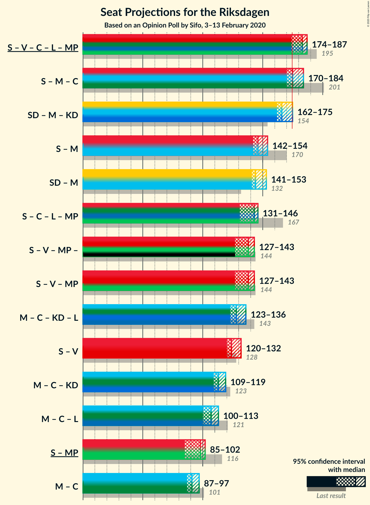
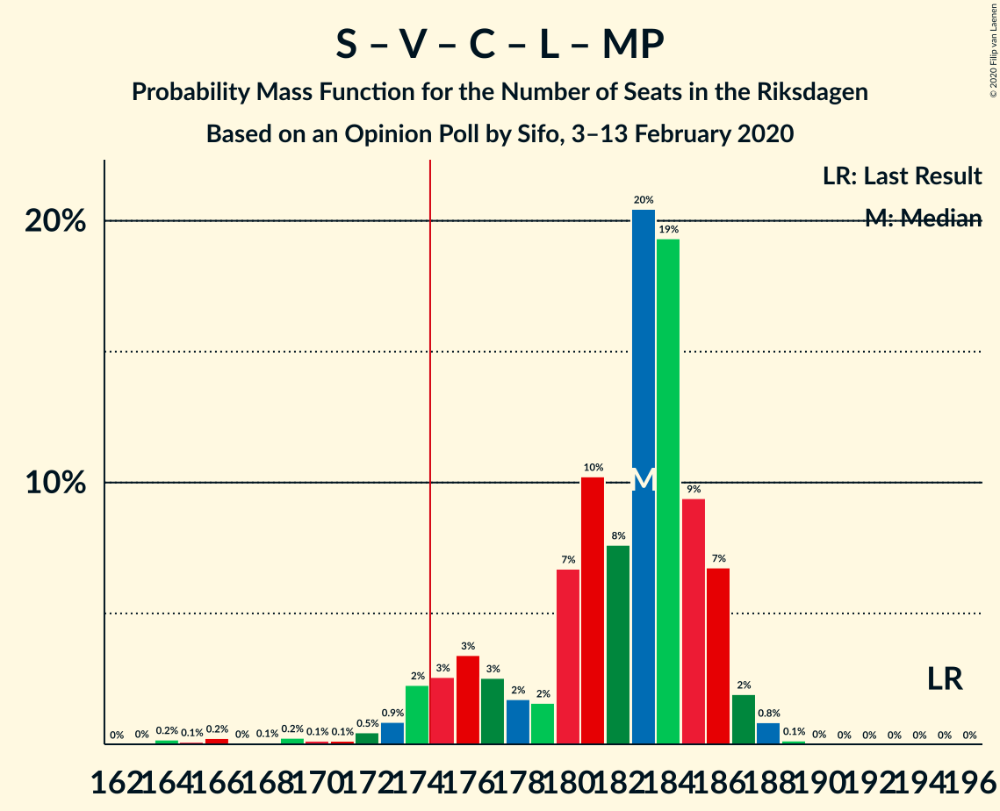
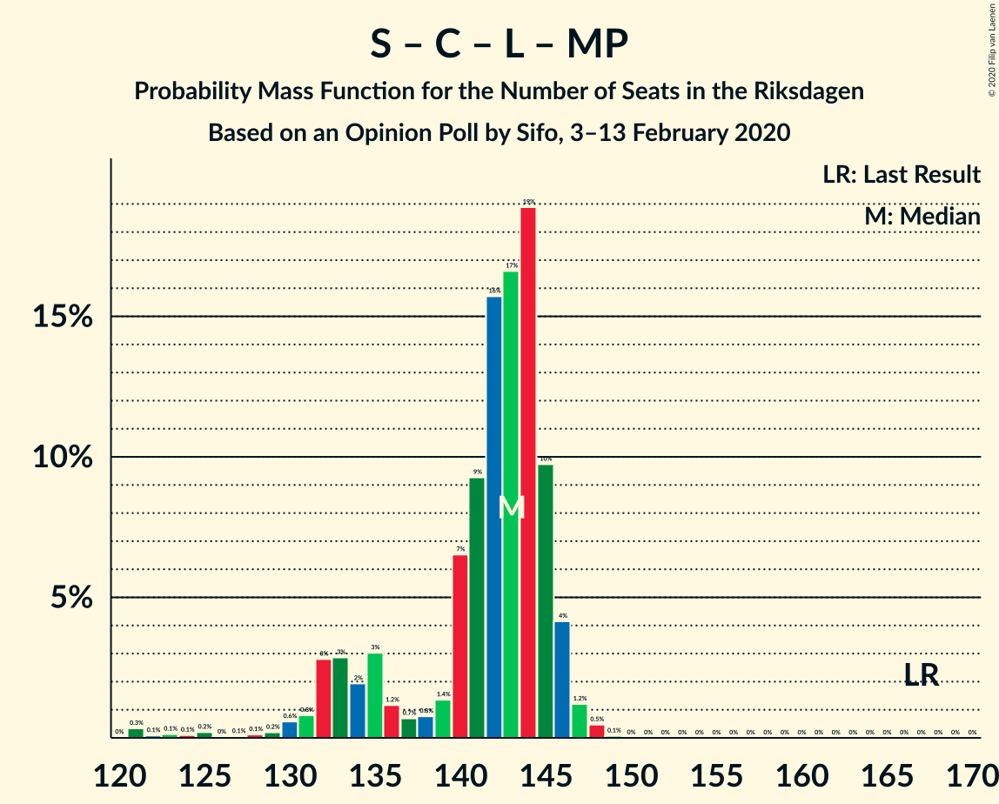
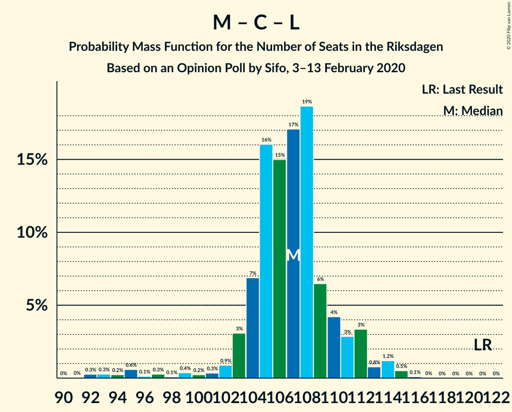

# Opinion Poll by Sifo, 3–13 February 2020

<a href="#voting-intentions">Voting Intentions</a> | <a href="#seats">Seats</a> | <a href="#coalitions">Coalitions</a> | <a href="#technical-information">Technical Information</a>

## Voting Intentions

### Confidence Intervals

| Party | Last Result | Poll Result | 80% Confidence Interval | 90% Confidence Interval | 95% Confidence Interval | 99% Confidence Interval |
|:-----:|:-----------:|:-----------:|:-----------------------:|:-----------------------:|:-----------------------:|:-----------------------:|
| Sveriges socialdemokratiska arbetareparti | 28.3% | 23.6% | 23.0–24.2% |22.8–24.4% |22.7–24.5% |22.4–24.8% |
| Sverigedemokraterna | 17.5% | 23.3% | 22.7–23.9% |22.5–24.1% |22.4–24.2% |22.1–24.5% |
| Moderata samlingspartiet | 19.8% | 17.5% | 16.9–18.0% |16.8–18.2% |16.7–18.3% |16.4–18.6% |
| Vänsterpartiet | 8.0% | 11.4% | 10.9–11.8% |10.8–12.0% |10.7–12.1% |10.5–12.3% |
| Centerpartiet | 8.6% | 8.1% | 7.7–8.5% |7.6–8.6% |7.5–8.7% |7.3–8.9% |
| Kristdemokraterna | 6.3% | 6.1% | 5.8–6.5% |5.7–6.6% |5.6–6.6% |5.4–6.8% |
| Liberalerna | 5.5% | 4.4% | 4.1–4.7% |4.0–4.8% |4.0–4.9% |3.8–5.0% |
| Miljöpartiet de gröna | 4.4% | 4.2% | 3.9–4.5% |3.8–4.6% |3.8–4.6% |3.6–4.8% |

*Note:* The poll result column reflects the actual value used in the calculations. Published results may vary slightly, and in addition be rounded to fewer digits.

## Seats

### Confidence Intervals

| Party | Last Result | Median | 80% Confidence Interval | 90% Confidence Interval | 95% Confidence Interval | 99% Confidence Interval |
|:-----:|:-----------:|:------:|:-----------------------:|:-----------------------:|:-----------------------:|:-----------------------:|
| <a href="#sveriges-socialdemokratiska-arbetareparti">Sveriges socialdemokratiska arbetareparti</a> | 100 | 84 | 82–87 |81–88 |80–90 |79–93 |
| <a href="#sverigedemokraterna">Sverigedemokraterna</a> | 62 | 82 | 81–86 |80–87 |79–88 |78–91 |
| <a href="#moderata-samlingspartiet">Moderata samlingspartiet</a> | 70 | 62 | 60–65 |60–66 |59–67 |58–68 |
| <a href="#vänsterpartiet">Vänsterpartiet</a> | 28 | 40 | 39–42 |39–43 |38–44 |37–45 |
| <a href="#centerpartiet">Centerpartiet</a> | 31 | 29 | 27–30 |27–31 |27–31 |26–32 |
| <a href="#kristdemokraterna">Kristdemokraterna</a> | 22 | 21 | 20–23 |20–24 |20–24 |19–25 |
| <a href="#liberalerna">Liberalerna</a> | 20 | 16 | 15–17 |15–17 |0–17 |0–18 |
| <a href="#miljöpartiet-de-gröna">Miljöpartiet de gröna</a> | 16 | 15 | 0–16 |0–16 |0–16 |0–17 |

### Sveriges socialdemokratiska arbetareparti

*For a full overview of the results for this party, see the [Sveriges socialdemokratiska arbetareparti](party-sverigessocialdemokratiskaarbetareparti.html) page.*

| Number of Seats | Probability | Accumulated | Special Marks |
|:---------------:|:-----------:|:-----------:|:-------------:|
| 78 | 0.1% | 100% |  |
| 79 | 0.5% | 99.9% |  |
| 80 | 2% | 99.5% |  |
| 81 | 7% | 97% |  |
| 82 | 11% | 90% |  |
| 83 | 28% | 79% |  |
| 84 | 20% | 51% | Median |
| 85 | 12% | 31% |  |
| 86 | 5% | 19% |  |
| 87 | 5% | 13% |  |
| 88 | 3% | 8% |  |
| 89 | 2% | 5% |  |
| 90 | 1.4% | 3% |  |
| 91 | 0.4% | 1.1% |  |
| 92 | 0.2% | 0.7% |  |
| 93 | 0.5% | 0.5% |  |
| 94 | 0.1% | 0.1% |  |
| 95 | 0% | 0% |  |
| 96 | 0% | 0% |  |
| 97 | 0% | 0% |  |
| 98 | 0% | 0% |  |
| 99 | 0% | 0% |  |
| 100 | 0% | 0% | Last Result |

### Sverigedemokraterna

*For a full overview of the results for this party, see the [Sverigedemokraterna](party-sverigedemokraterna.html) page.*

| Number of Seats | Probability | Accumulated | Special Marks |
|:---------------:|:-----------:|:-----------:|:-------------:|
| 62 | 0% | 100% | Last Result |
| 63 | 0% | 100% |  |
| 64 | 0% | 100% |  |
| 65 | 0% | 100% |  |
| 66 | 0% | 100% |  |
| 67 | 0% | 100% |  |
| 68 | 0% | 100% |  |
| 69 | 0% | 100% |  |
| 70 | 0% | 100% |  |
| 71 | 0% | 100% |  |
| 72 | 0% | 100% |  |
| 73 | 0% | 100% |  |
| 74 | 0% | 100% |  |
| 75 | 0% | 100% |  |
| 76 | 0% | 100% |  |
| 77 | 0.1% | 100% |  |
| 78 | 0.5% | 99.9% |  |
| 79 | 3% | 99.4% |  |
| 80 | 6% | 96% |  |
| 81 | 11% | 90% |  |
| 82 | 31% | 79% | Median |
| 83 | 18% | 48% |  |
| 84 | 9% | 31% |  |
| 85 | 11% | 22% |  |
| 86 | 4% | 11% |  |
| 87 | 3% | 8% |  |
| 88 | 3% | 5% |  |
| 89 | 0.9% | 2% |  |
| 90 | 0.3% | 0.9% |  |
| 91 | 0.2% | 0.6% |  |
| 92 | 0.1% | 0.4% |  |
| 93 | 0.2% | 0.3% |  |
| 94 | 0.1% | 0.1% |  |
| 95 | 0% | 0% |  |

### Moderata samlingspartiet

*For a full overview of the results for this party, see the [Moderata samlingspartiet](party-moderatasamlingspartiet.html) page.*

| Number of Seats | Probability | Accumulated | Special Marks |
|:---------------:|:-----------:|:-----------:|:-------------:|
| 57 | 0.1% | 100% |  |
| 58 | 1.1% | 99.9% |  |
| 59 | 4% | 98.8% |  |
| 60 | 10% | 95% |  |
| 61 | 14% | 85% |  |
| 62 | 33% | 71% | Median |
| 63 | 14% | 38% |  |
| 64 | 13% | 24% |  |
| 65 | 6% | 11% |  |
| 66 | 2% | 5% |  |
| 67 | 2% | 3% |  |
| 68 | 0.5% | 1.0% |  |
| 69 | 0.2% | 0.5% |  |
| 70 | 0.2% | 0.3% | Last Result |
| 71 | 0% | 0.1% |  |
| 72 | 0% | 0% |  |

### Vänsterpartiet

*For a full overview of the results for this party, see the [Vänsterpartiet](party-vänsterpartiet.html) page.*

| Number of Seats | Probability | Accumulated | Special Marks |
|:---------------:|:-----------:|:-----------:|:-------------:|
| 28 | 0% | 100% | Last Result |
| 29 | 0% | 100% |  |
| 30 | 0% | 100% |  |
| 31 | 0% | 100% |  |
| 32 | 0% | 100% |  |
| 33 | 0% | 100% |  |
| 34 | 0% | 100% |  |
| 35 | 0% | 100% |  |
| 36 | 0% | 100% |  |
| 37 | 2% | 100% |  |
| 38 | 2% | 98% |  |
| 39 | 14% | 96% |  |
| 40 | 43% | 82% | Median |
| 41 | 13% | 39% |  |
| 42 | 18% | 26% |  |
| 43 | 5% | 8% |  |
| 44 | 3% | 4% |  |
| 45 | 0.6% | 0.8% |  |
| 46 | 0.1% | 0.2% |  |
| 47 | 0.1% | 0.1% |  |
| 48 | 0% | 0% |  |

### Centerpartiet

*For a full overview of the results for this party, see the [Centerpartiet](party-centerpartiet.html) page.*

| Number of Seats | Probability | Accumulated | Special Marks |
|:---------------:|:-----------:|:-----------:|:-------------:|
| 25 | 0.1% | 100% |  |
| 26 | 1.2% | 99.9% |  |
| 27 | 11% | 98.7% |  |
| 28 | 20% | 88% |  |
| 29 | 26% | 68% | Median |
| 30 | 36% | 42% |  |
| 31 | 4% | 6% | Last Result |
| 32 | 2% | 2% |  |
| 33 | 0.4% | 0.5% |  |
| 34 | 0% | 0% |  |

### Kristdemokraterna

*For a full overview of the results for this party, see the [Kristdemokraterna](party-kristdemokraterna.html) page.*

| Number of Seats | Probability | Accumulated | Special Marks |
|:---------------:|:-----------:|:-----------:|:-------------:|
| 19 | 0.9% | 100% |  |
| 20 | 10% | 99.1% |  |
| 21 | 44% | 90% | Median |
| 22 | 22% | 46% | Last Result |
| 23 | 18% | 24% |  |
| 24 | 5% | 6% |  |
| 25 | 0.8% | 0.8% |  |
| 26 | 0% | 0% |  |

### Liberalerna

*For a full overview of the results for this party, see the [Liberalerna](party-liberalerna.html) page.*

| Number of Seats | Probability | Accumulated | Special Marks |
|:---------------:|:-----------:|:-----------:|:-------------:|
| 0 | 3% | 100% |  |
| 1 | 0% | 97% |  |
| 2 | 0% | 97% |  |
| 3 | 0% | 97% |  |
| 4 | 0% | 97% |  |
| 5 | 0% | 97% |  |
| 6 | 0% | 97% |  |
| 7 | 0% | 97% |  |
| 8 | 0% | 97% |  |
| 9 | 0% | 97% |  |
| 10 | 0% | 97% |  |
| 11 | 0% | 97% |  |
| 12 | 0% | 97% |  |
| 13 | 0% | 97% |  |
| 14 | 0.5% | 97% |  |
| 15 | 26% | 97% |  |
| 16 | 57% | 71% | Median |
| 17 | 12% | 14% |  |
| 18 | 2% | 2% |  |
| 19 | 0% | 0% |  |
| 20 | 0% | 0% | Last Result |

### Miljöpartiet de gröna

*For a full overview of the results for this party, see the [Miljöpartiet de gröna](party-miljöpartietdegröna.html) page.*

| Number of Seats | Probability | Accumulated | Special Marks |
|:---------------:|:-----------:|:-----------:|:-------------:|
| 0 | 14% | 100% |  |
| 1 | 0% | 86% |  |
| 2 | 0% | 86% |  |
| 3 | 0% | 86% |  |
| 4 | 0% | 86% |  |
| 5 | 0% | 86% |  |
| 6 | 0% | 86% |  |
| 7 | 0% | 86% |  |
| 8 | 0% | 86% |  |
| 9 | 0% | 86% |  |
| 10 | 0% | 86% |  |
| 11 | 0% | 86% |  |
| 12 | 0% | 86% |  |
| 13 | 0% | 86% |  |
| 14 | 13% | 86% |  |
| 15 | 55% | 74% | Median |
| 16 | 17% | 19% | Last Result |
| 17 | 2% | 2% |  |
| 18 | 0.1% | 0.1% |  |
| 19 | 0% | 0% |  |

## Coalitions

### Confidence Intervals

| Coalition | Last Result | Median | Majority? | 80% Confidence Interval | 90% Confidence Interval | 95% Confidence Interval | 99% Confidence Interval |
|:---------:|:-----------:|:------:|:---------:|:-----------------------:|:-----------------------:|:-----------------------:|:-----------------------:|
| Sveriges socialdemokratiska arbetareparti – Vänsterpartiet – Centerpartiet – Liberalerna – Miljöpartiet de gröna | 195 | 183 | 95% | 177–186 | 174–186 | 173–187 | 166–188 |
| Sveriges socialdemokratiska arbetareparti – Moderata samlingspartiet – Centerpartiet | 201 | 175 | 60% | 172–181 | 171–183 | 170–184 | 169–192 |
| Sverigedemokraterna – Moderata samlingspartiet – Kristdemokraterna | 154 | 166 | 5% | 163–172 | 163–175 | 162–176 | 161–183 |
| Sveriges socialdemokratiska arbetareparti – Moderata samlingspartiet | 170 | 145 | 0% | 143–151 | 142–153 | 142–154 | 141–160 |
| Sverigedemokraterna – Moderata samlingspartiet | 132 | 144 | 0% | 142–150 | 141–151 | 141–153 | 139–159 |
| Sveriges socialdemokratiska arbetareparti – Centerpartiet – Liberalerna – Miljöpartiet de gröna | 167 | 143 | 0% | 135–145 | 132–146 | 131–146 | 122–147 |
| Sveriges socialdemokratiska arbetareparti – Vänsterpartiet – Miljöpartiet de gröna | 144 | 138 | 0% | 130–141 | 129–142 | 127–143 | 126–146 |
| Moderata samlingspartiet – Centerpartiet – Kristdemokraterna – Liberalerna | 143 | 128 | 0% | 125–132 | 125–134 | 123–135 | 116–137 |
| Sveriges socialdemokratiska arbetareparti – Vänsterpartiet | 128 | 124 | 0% | 122–129 | 121–130 | 120–132 | 119–137 |
| Moderata samlingspartiet – Centerpartiet – Kristdemokraterna | 123 | 113 | 0% | 110–117 | 109–118 | 109–120 | 107–124 |
| Moderata samlingspartiet – Centerpartiet – Liberalerna | 121 | 107 | 0% | 104–110 | 103–112 | 101–112 | 93–115 |
| Sveriges socialdemokratiska arbetareparti – Miljöpartiet de gröna | 116 | 98 | 0% | 89–101 | 86–102 | 85–103 | 85–104 |
| Moderata samlingspartiet – Centerpartiet | 101 | 91 | 0% | 89–94 | 88–95 | 87–97 | 86–100 |

### Sveriges socialdemokratiska arbetareparti – Vänsterpartiet – Centerpartiet – Liberalerna – Miljöpartiet de gröna

| Number of Seats | Probability | Accumulated | Special Marks |
|:---------------:|:-----------:|:-----------:|:-------------:|
| 163 | 0% | 100% |  |
| 164 | 0.1% | 99.9% |  |
| 165 | 0.1% | 99.8% |  |
| 166 | 0.3% | 99.7% |  |
| 167 | 0% | 99.4% |  |
| 168 | 0.1% | 99.4% |  |
| 169 | 0.5% | 99.3% |  |
| 170 | 0.2% | 98.8% |  |
| 171 | 0.1% | 98.7% |  |
| 172 | 0.3% | 98.5% |  |
| 173 | 0.9% | 98% |  |
| 174 | 3% | 97% |  |
| 175 | 3% | 95% | Majority |
| 176 | 2% | 92% |  |
| 177 | 3% | 90% |  |
| 178 | 1.2% | 87% |  |
| 179 | 2% | 86% |  |
| 180 | 9% | 84% |  |
| 181 | 7% | 75% |  |
| 182 | 7% | 68% |  |
| 183 | 16% | 62% |  |
| 184 | 26% | 45% | Median |
| 185 | 8% | 19% |  |
| 186 | 8% | 11% |  |
| 187 | 3% | 4% |  |
| 188 | 0.7% | 0.9% |  |
| 189 | 0.2% | 0.2% |  |
| 190 | 0% | 0% |  |
| 191 | 0% | 0% |  |
| 192 | 0% | 0% |  |
| 193 | 0% | 0% |  |
| 194 | 0% | 0% |  |
| 195 | 0% | 0% | Last Result |

### Sveriges socialdemokratiska arbetareparti – Moderata samlingspartiet – Centerpartiet

| Number of Seats | Probability | Accumulated | Special Marks |
|:---------------:|:-----------:|:-----------:|:-------------:|
| 168 | 0.1% | 100% |  |
| 169 | 1.2% | 99.9% |  |
| 170 | 2% | 98.7% |  |
| 171 | 6% | 97% |  |
| 172 | 9% | 91% |  |
| 173 | 8% | 82% |  |
| 174 | 13% | 74% |  |
| 175 | 30% | 60% | Median, Majority |
| 176 | 11% | 30% |  |
| 177 | 2% | 19% |  |
| 178 | 2% | 18% |  |
| 179 | 4% | 15% |  |
| 180 | 1.3% | 11% |  |
| 181 | 2% | 10% |  |
| 182 | 1.5% | 8% |  |
| 183 | 3% | 7% |  |
| 184 | 1.0% | 3% |  |
| 185 | 0.4% | 2% |  |
| 186 | 0.6% | 2% |  |
| 187 | 0.1% | 1.3% |  |
| 188 | 0.2% | 1.3% |  |
| 189 | 0.2% | 1.1% |  |
| 190 | 0.1% | 0.9% |  |
| 191 | 0.2% | 0.8% |  |
| 192 | 0.5% | 0.6% |  |
| 193 | 0.1% | 0.1% |  |
| 194 | 0% | 0.1% |  |
| 195 | 0% | 0% |  |
| 196 | 0% | 0% |  |
| 197 | 0% | 0% |  |
| 198 | 0% | 0% |  |
| 199 | 0% | 0% |  |
| 200 | 0% | 0% |  |
| 201 | 0% | 0% | Last Result |

### Sverigedemokraterna – Moderata samlingspartiet – Kristdemokraterna

| Number of Seats | Probability | Accumulated | Special Marks |
|:---------------:|:-----------:|:-----------:|:-------------:|
| 154 | 0% | 100% | Last Result |
| 155 | 0% | 100% |  |
| 156 | 0% | 100% |  |
| 157 | 0% | 100% |  |
| 158 | 0% | 100% |  |
| 159 | 0% | 100% |  |
| 160 | 0.2% | 100% |  |
| 161 | 0.7% | 99.8% |  |
| 162 | 3% | 99.1% |  |
| 163 | 8% | 96% |  |
| 164 | 8% | 89% |  |
| 165 | 26% | 81% | Median |
| 166 | 16% | 55% |  |
| 167 | 7% | 38% |  |
| 168 | 7% | 32% |  |
| 169 | 9% | 25% |  |
| 170 | 2% | 16% |  |
| 171 | 1.2% | 14% |  |
| 172 | 3% | 13% |  |
| 173 | 2% | 10% |  |
| 174 | 3% | 8% |  |
| 175 | 3% | 5% | Majority |
| 176 | 0.9% | 3% |  |
| 177 | 0.3% | 2% |  |
| 178 | 0.1% | 1.5% |  |
| 179 | 0.2% | 1.3% |  |
| 180 | 0.5% | 1.2% |  |
| 181 | 0.1% | 0.7% |  |
| 182 | 0% | 0.6% |  |
| 183 | 0.3% | 0.6% |  |
| 184 | 0.1% | 0.3% |  |
| 185 | 0.1% | 0.2% |  |
| 186 | 0% | 0.1% |  |
| 187 | 0% | 0% |  |

### Sveriges socialdemokratiska arbetareparti – Moderata samlingspartiet

| Number of Seats | Probability | Accumulated | Special Marks |
|:---------------:|:-----------:|:-----------:|:-------------:|
| 139 | 0.1% | 100% |  |
| 140 | 0.4% | 99.9% |  |
| 141 | 1.0% | 99.6% |  |
| 142 | 6% | 98.6% |  |
| 143 | 6% | 93% |  |
| 144 | 9% | 87% |  |
| 145 | 31% | 78% |  |
| 146 | 15% | 47% | Median |
| 147 | 6% | 33% |  |
| 148 | 9% | 27% |  |
| 149 | 5% | 18% |  |
| 150 | 2% | 12% |  |
| 151 | 2% | 11% |  |
| 152 | 3% | 9% |  |
| 153 | 3% | 6% |  |
| 154 | 1.0% | 3% |  |
| 155 | 0.8% | 2% |  |
| 156 | 0.3% | 1.5% |  |
| 157 | 0.2% | 1.2% |  |
| 158 | 0% | 1.0% |  |
| 159 | 0.1% | 1.0% |  |
| 160 | 0.7% | 0.9% |  |
| 161 | 0.2% | 0.2% |  |
| 162 | 0% | 0.1% |  |
| 163 | 0% | 0.1% |  |
| 164 | 0% | 0% |  |
| 165 | 0% | 0% |  |
| 166 | 0% | 0% |  |
| 167 | 0% | 0% |  |
| 168 | 0% | 0% |  |
| 169 | 0% | 0% |  |
| 170 | 0% | 0% | Last Result |

### Sverigedemokraterna – Moderata samlingspartiet

| Number of Seats | Probability | Accumulated | Special Marks |
|:---------------:|:-----------:|:-----------:|:-------------:|
| 132 | 0% | 100% | Last Result |
| 133 | 0% | 100% |  |
| 134 | 0% | 100% |  |
| 135 | 0% | 100% |  |
| 136 | 0% | 100% |  |
| 137 | 0% | 100% |  |
| 138 | 0.1% | 100% |  |
| 139 | 0.4% | 99.9% |  |
| 140 | 0.8% | 99.4% |  |
| 141 | 5% | 98.7% |  |
| 142 | 14% | 94% |  |
| 143 | 6% | 80% |  |
| 144 | 25% | 74% | Median |
| 145 | 16% | 49% |  |
| 146 | 6% | 33% |  |
| 147 | 6% | 27% |  |
| 148 | 8% | 21% |  |
| 149 | 2% | 14% |  |
| 150 | 4% | 12% |  |
| 151 | 4% | 8% |  |
| 152 | 1.1% | 5% |  |
| 153 | 1.3% | 3% |  |
| 154 | 0.6% | 2% |  |
| 155 | 0.2% | 1.5% |  |
| 156 | 0.4% | 1.3% |  |
| 157 | 0% | 0.8% |  |
| 158 | 0.2% | 0.8% |  |
| 159 | 0.2% | 0.6% |  |
| 160 | 0.2% | 0.5% |  |
| 161 | 0.3% | 0.3% |  |
| 162 | 0% | 0% |  |

### Sveriges socialdemokratiska arbetareparti – Centerpartiet – Liberalerna – Miljöpartiet de gröna

| Number of Seats | Probability | Accumulated | Special Marks |
|:---------------:|:-----------:|:-----------:|:-------------:|
| 120 | 0% | 100% |  |
| 121 | 0.4% | 99.9% |  |
| 122 | 0.1% | 99.5% |  |
| 123 | 0.1% | 99.4% |  |
| 124 | 0.2% | 99.3% |  |
| 125 | 0.4% | 99.2% |  |
| 126 | 0% | 98.8% |  |
| 127 | 0.1% | 98.8% |  |
| 128 | 0.1% | 98.7% |  |
| 129 | 0.2% | 98.7% |  |
| 130 | 0.8% | 98.5% |  |
| 131 | 0.9% | 98% |  |
| 132 | 3% | 97% |  |
| 133 | 2% | 94% |  |
| 134 | 1.0% | 92% |  |
| 135 | 4% | 91% |  |
| 136 | 0.9% | 87% |  |
| 137 | 0.8% | 86% |  |
| 138 | 0.8% | 86% |  |
| 139 | 1.2% | 85% |  |
| 140 | 8% | 84% |  |
| 141 | 6% | 75% |  |
| 142 | 11% | 69% |  |
| 143 | 18% | 58% |  |
| 144 | 27% | 40% | Median |
| 145 | 6% | 13% |  |
| 146 | 6% | 7% |  |
| 147 | 1.0% | 2% |  |
| 148 | 0.4% | 0.5% |  |
| 149 | 0.1% | 0.1% |  |
| 150 | 0% | 0% |  |
| 151 | 0% | 0% |  |
| 152 | 0% | 0% |  |
| 153 | 0% | 0% |  |
| 154 | 0% | 0% |  |
| 155 | 0% | 0% |  |
| 156 | 0% | 0% |  |
| 157 | 0% | 0% |  |
| 158 | 0% | 0% |  |
| 159 | 0% | 0% |  |
| 160 | 0% | 0% |  |
| 161 | 0% | 0% |  |
| 162 | 0% | 0% |  |
| 163 | 0% | 0% |  |
| 164 | 0% | 0% |  |
| 165 | 0% | 0% |  |
| 166 | 0% | 0% |  |
| 167 | 0% | 0% | Last Result |

### Sveriges socialdemokratiska arbetareparti – Vänsterpartiet – Miljöpartiet de gröna

| Number of Seats | Probability | Accumulated | Special Marks |
|:---------------:|:-----------:|:-----------:|:-------------:|
| 124 | 0% | 100% |  |
| 125 | 0.4% | 99.9% |  |
| 126 | 0.5% | 99.5% |  |
| 127 | 2% | 99.0% |  |
| 128 | 2% | 97% |  |
| 129 | 2% | 95% |  |
| 130 | 3% | 93% |  |
| 131 | 1.2% | 90% |  |
| 132 | 0.5% | 88% |  |
| 133 | 0.4% | 88% |  |
| 134 | 1.5% | 88% |  |
| 135 | 2% | 86% |  |
| 136 | 5% | 84% |  |
| 137 | 12% | 79% |  |
| 138 | 29% | 67% |  |
| 139 | 10% | 38% | Median |
| 140 | 10% | 29% |  |
| 141 | 10% | 18% |  |
| 142 | 5% | 8% |  |
| 143 | 2% | 3% |  |
| 144 | 0.3% | 1.4% | Last Result |
| 145 | 0.4% | 1.1% |  |
| 146 | 0.2% | 0.7% |  |
| 147 | 0.1% | 0.5% |  |
| 148 | 0.3% | 0.4% |  |
| 149 | 0.1% | 0.1% |  |
| 150 | 0% | 0% |  |

### Moderata samlingspartiet – Centerpartiet – Kristdemokraterna – Liberalerna

| Number of Seats | Probability | Accumulated | Special Marks |
|:---------------:|:-----------:|:-----------:|:-------------:|
| 114 | 0% | 100% |  |
| 115 | 0.3% | 99.9% |  |
| 116 | 0.2% | 99.6% |  |
| 117 | 0.2% | 99.4% |  |
| 118 | 0.2% | 99.2% |  |
| 119 | 0.2% | 99.0% |  |
| 120 | 0.2% | 98.8% |  |
| 121 | 0.2% | 98.6% |  |
| 122 | 0.2% | 98% |  |
| 123 | 1.4% | 98% |  |
| 124 | 2% | 97% |  |
| 125 | 6% | 95% |  |
| 126 | 7% | 89% |  |
| 127 | 18% | 83% |  |
| 128 | 18% | 65% | Median |
| 129 | 23% | 47% |  |
| 130 | 5% | 23% |  |
| 131 | 3% | 18% |  |
| 132 | 5% | 15% |  |
| 133 | 2% | 10% |  |
| 134 | 3% | 8% |  |
| 135 | 3% | 5% |  |
| 136 | 0.7% | 2% |  |
| 137 | 1.2% | 2% |  |
| 138 | 0.4% | 0.5% |  |
| 139 | 0% | 0.1% |  |
| 140 | 0.1% | 0.1% |  |
| 141 | 0% | 0% |  |
| 142 | 0% | 0% |  |
| 143 | 0% | 0% | Last Result |

### Sveriges socialdemokratiska arbetareparti – Vänsterpartiet

| Number of Seats | Probability | Accumulated | Special Marks |
|:---------------:|:-----------:|:-----------:|:-------------:|
| 118 | 0.2% | 100% |  |
| 119 | 0.4% | 99.8% |  |
| 120 | 2% | 99.4% |  |
| 121 | 7% | 97% |  |
| 122 | 9% | 91% |  |
| 123 | 27% | 82% |  |
| 124 | 18% | 55% | Median |
| 125 | 8% | 37% |  |
| 126 | 10% | 29% |  |
| 127 | 6% | 19% |  |
| 128 | 3% | 13% | Last Result |
| 129 | 2% | 10% |  |
| 130 | 4% | 8% |  |
| 131 | 1.5% | 4% |  |
| 132 | 0.5% | 3% |  |
| 133 | 0.5% | 2% |  |
| 134 | 0.4% | 1.4% |  |
| 135 | 0.4% | 1.1% |  |
| 136 | 0.1% | 0.7% |  |
| 137 | 0.4% | 0.6% |  |
| 138 | 0.1% | 0.1% |  |
| 139 | 0% | 0% |  |

### Moderata samlingspartiet – Centerpartiet – Kristdemokraterna

| Number of Seats | Probability | Accumulated | Special Marks |
|:---------------:|:-----------:|:-----------:|:-------------:|
| 106 | 0.1% | 100% |  |
| 107 | 0.7% | 99.9% |  |
| 108 | 1.3% | 99.3% |  |
| 109 | 4% | 98% |  |
| 110 | 7% | 94% |  |
| 111 | 15% | 87% |  |
| 112 | 20% | 72% | Median |
| 113 | 22% | 53% |  |
| 114 | 8% | 30% |  |
| 115 | 6% | 22% |  |
| 116 | 5% | 16% |  |
| 117 | 4% | 11% |  |
| 118 | 3% | 7% |  |
| 119 | 1.0% | 4% |  |
| 120 | 1.4% | 3% |  |
| 121 | 0.7% | 2% |  |
| 122 | 0.1% | 1.0% |  |
| 123 | 0.4% | 0.9% | Last Result |
| 124 | 0.3% | 0.5% |  |
| 125 | 0.1% | 0.2% |  |
| 126 | 0.1% | 0.1% |  |
| 127 | 0% | 0% |  |

### Moderata samlingspartiet – Centerpartiet – Liberalerna

| Number of Seats | Probability | Accumulated | Special Marks |
|:---------------:|:-----------:|:-----------:|:-------------:|
| 91 | 0% | 100% |  |
| 92 | 0.3% | 99.9% |  |
| 93 | 0.2% | 99.7% |  |
| 94 | 0.2% | 99.5% |  |
| 95 | 0.3% | 99.3% |  |
| 96 | 0.1% | 99.0% |  |
| 97 | 0.4% | 98.9% |  |
| 98 | 0.1% | 98.5% |  |
| 99 | 0.5% | 98% |  |
| 100 | 0.1% | 98% |  |
| 101 | 0.4% | 98% |  |
| 102 | 1.0% | 97% |  |
| 103 | 3% | 96% |  |
| 104 | 7% | 93% |  |
| 105 | 12% | 86% |  |
| 106 | 17% | 74% |  |
| 107 | 15% | 57% | Median |
| 108 | 22% | 42% |  |
| 109 | 8% | 20% |  |
| 110 | 3% | 12% |  |
| 111 | 4% | 9% |  |
| 112 | 3% | 5% |  |
| 113 | 0.6% | 2% |  |
| 114 | 1.3% | 2% |  |
| 115 | 0.4% | 0.5% |  |
| 116 | 0.1% | 0.1% |  |
| 117 | 0% | 0% |  |
| 118 | 0% | 0% |  |
| 119 | 0% | 0% |  |
| 120 | 0% | 0% |  |
| 121 | 0% | 0% | Last Result |

### Sveriges socialdemokratiska arbetareparti – Miljöpartiet de gröna

| Number of Seats | Probability | Accumulated | Special Marks |
|:---------------:|:-----------:|:-----------:|:-------------:|
| 83 | 0.2% | 100% |  |
| 84 | 0.3% | 99.8% |  |
| 85 | 3% | 99.5% |  |
| 86 | 2% | 96% |  |
| 87 | 2% | 95% |  |
| 88 | 3% | 93% |  |
| 89 | 2% | 90% |  |
| 90 | 1.1% | 89% |  |
| 91 | 0.4% | 87% |  |
| 92 | 0.2% | 87% |  |
| 93 | 0.5% | 87% |  |
| 94 | 0.3% | 86% |  |
| 95 | 3% | 86% |  |
| 96 | 4% | 83% |  |
| 97 | 13% | 79% |  |
| 98 | 31% | 65% |  |
| 99 | 11% | 34% | Median |
| 100 | 13% | 23% |  |
| 101 | 4% | 10% |  |
| 102 | 3% | 6% |  |
| 103 | 2% | 3% |  |
| 104 | 0.2% | 0.6% |  |
| 105 | 0.3% | 0.4% |  |
| 106 | 0.1% | 0.1% |  |
| 107 | 0% | 0% |  |
| 108 | 0% | 0% |  |
| 109 | 0% | 0% |  |
| 110 | 0% | 0% |  |
| 111 | 0% | 0% |  |
| 112 | 0% | 0% |  |
| 113 | 0% | 0% |  |
| 114 | 0% | 0% |  |
| 115 | 0% | 0% |  |
| 116 | 0% | 0% | Last Result |

### Moderata samlingspartiet – Centerpartiet

| Number of Seats | Probability | Accumulated | Special Marks |
|:---------------:|:-----------:|:-----------:|:-------------:|
| 85 | 0.1% | 100% |  |
| 86 | 0.8% | 99.9% |  |
| 87 | 3% | 99.1% |  |
| 88 | 4% | 96% |  |
| 89 | 13% | 92% |  |
| 90 | 13% | 79% |  |
| 91 | 17% | 65% | Median |
| 92 | 26% | 49% |  |
| 93 | 8% | 23% |  |
| 94 | 7% | 15% |  |
| 95 | 4% | 8% |  |
| 96 | 1.1% | 4% |  |
| 97 | 1.5% | 3% |  |
| 98 | 0.7% | 2% |  |
| 99 | 0.6% | 1.1% |  |
| 100 | 0.1% | 0.5% |  |
| 101 | 0.3% | 0.4% | Last Result |
| 102 | 0.1% | 0.1% |  |
| 103 | 0% | 0% |  |

## Technical Information

### Opinion Poll

+ **Polling firm:** Sifo
+ **Commissioner(s):** —
+ **Fieldwork period:** 3–13 February 2020

### Calculations

+ **Sample size:** 8328
+ **Simulations done:** 524,288
+ **Error estimate:** 0.26%

