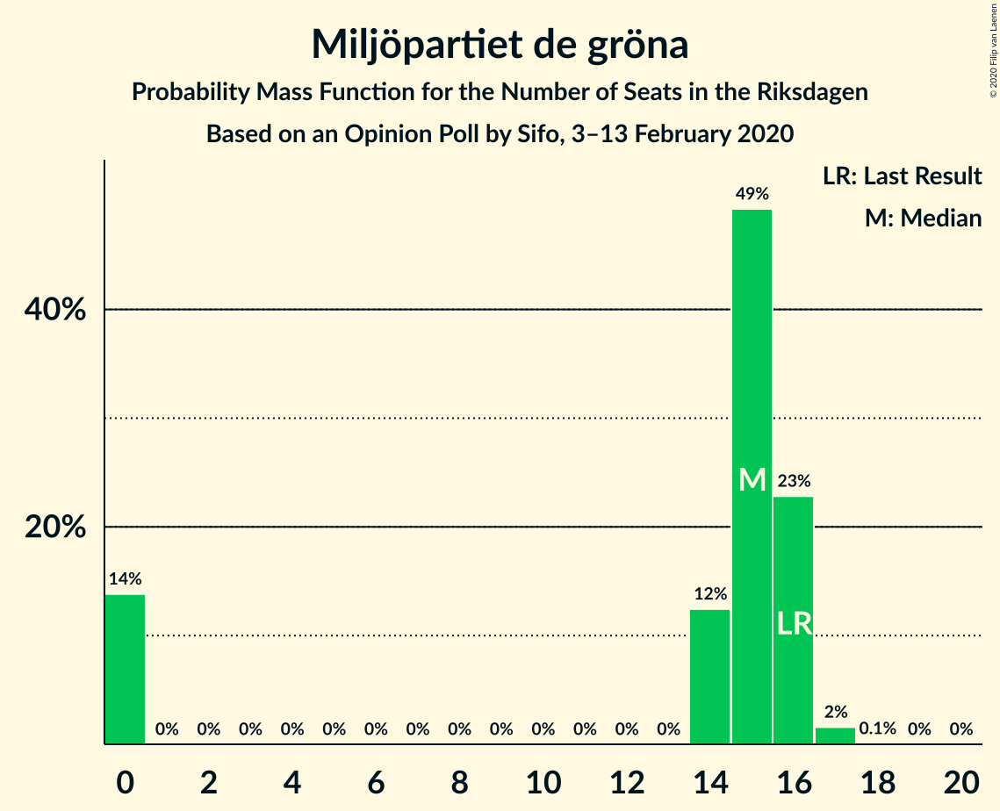

# Opinion Poll by Sifo, 3–13 February 2020

<a href="#voting-intentions">Voting Intentions</a> | <a href="#seats">Seats</a> | <a href="#coalitions">Coalitions</a> | <a href="#technical-information">Technical Information</a>

## Voting Intentions

### Confidence Intervals

| Party | Last Result | Poll Result | 80% Confidence Interval | 90% Confidence Interval | 95% Confidence Interval | 99% Confidence Interval |
|:-----:|:-----------:|:-----------:|:-----------------------:|:-----------------------:|:-----------------------:|:-----------------------:|
| Sveriges socialdemokratiska arbetareparti | 28.3% | 23.6% | 23.0–24.2% |22.8–24.4% |22.7–24.5% |22.4–24.8% |
| Sverigedemokraterna | 17.5% | 23.3% | 22.7–23.9% |22.5–24.1% |22.4–24.2% |22.1–24.5% |
| Moderata samlingspartiet | 19.8% | 17.5% | 16.9–18.0% |16.8–18.2% |16.7–18.3% |16.4–18.6% |
| Vänsterpartiet | 8.0% | 11.4% | 10.9–11.8% |10.8–12.0% |10.7–12.1% |10.5–12.3% |
| Centerpartiet | 8.6% | 8.1% | 7.7–8.5% |7.6–8.6% |7.5–8.7% |7.3–8.9% |
| Kristdemokraterna | 6.3% | 6.1% | 5.8–6.5% |5.7–6.6% |5.6–6.6% |5.4–6.8% |
| Liberalerna | 5.5% | 4.4% | 4.1–4.7% |4.0–4.8% |4.0–4.9% |3.8–5.0% |
| Miljöpartiet de gröna | 4.4% | 4.2% | 3.9–4.5% |3.8–4.6% |3.8–4.6% |3.6–4.8% |

*Note:* The poll result column reflects the actual value used in the calculations. Published results may vary slightly, and in addition be rounded to fewer digits.

## Seats

### Confidence Intervals

| Party | Last Result | Median | 80% Confidence Interval | 90% Confidence Interval | 95% Confidence Interval | 99% Confidence Interval |
|:-----:|:-----------:|:------:|:-----------------------:|:-----------------------:|:-----------------------:|:-----------------------:|
| <a href="#sveriges-socialdemokratiska-arbetareparti">Sveriges socialdemokratiska arbetareparti</a> | 100 | 84 | 82–88 |81–89 |80–90 |79–92 |
| <a href="#sverigedemokraterna">Sverigedemokraterna</a> | 62 | 83 | 80–87 |80–87 |79–88 |78–92 |
| <a href="#moderata-samlingspartiet">Moderata samlingspartiet</a> | 70 | 63 | 60–65 |59–67 |59–67 |58–70 |
| <a href="#vänsterpartiet">Vänsterpartiet</a> | 28 | 41 | 39–43 |37–43 |37–44 |37–45 |
| <a href="#centerpartiet">Centerpartiet</a> | 31 | 29 | 27–30 |27–31 |27–32 |26–33 |
| <a href="#kristdemokraterna">Kristdemokraterna</a> | 22 | 22 | 21–24 |20–24 |20–24 |19–25 |
| <a href="#liberalerna">Liberalerna</a> | 20 | 16 | 15–17 |15–17 |0–17 |0–18 |
| <a href="#miljöpartiet-de-gröna">Miljöpartiet de gröna</a> | 16 | 15 | 0–16 |0–16 |0–16 |0–17 |

### Sveriges socialdemokratiska arbetareparti

*For a full overview of the results for this party, see the [Sveriges socialdemokratiska arbetareparti](party-sverigessocialdemokratiskaarbetareparti.html) page.*

| Number of Seats | Probability | Accumulated | Special Marks |
|:---------------:|:-----------:|:-----------:|:-------------:|
| 78 | 0% | 100% |  |
| 79 | 0.8% | 99.9% |  |
| 80 | 2% | 99.2% |  |
| 81 | 3% | 97% |  |
| 82 | 8% | 94% |  |
| 83 | 23% | 86% |  |
| 84 | 15% | 64% | Median |
| 85 | 24% | 49% |  |
| 86 | 6% | 25% |  |
| 87 | 2% | 19% |  |
| 88 | 11% | 17% |  |
| 89 | 3% | 6% |  |
| 90 | 2% | 3% |  |
| 91 | 0.2% | 0.7% |  |
| 92 | 0% | 0.5% |  |
| 93 | 0.4% | 0.5% |  |
| 94 | 0.1% | 0.1% |  |
| 95 | 0% | 0% |  |
| 96 | 0% | 0% |  |
| 97 | 0% | 0% |  |
| 98 | 0% | 0% |  |
| 99 | 0% | 0% |  |
| 100 | 0% | 0% | Last Result |

### Sverigedemokraterna

*For a full overview of the results for this party, see the [Sverigedemokraterna](party-sverigedemokraterna.html) page.*

| Number of Seats | Probability | Accumulated | Special Marks |
|:---------------:|:-----------:|:-----------:|:-------------:|
| 62 | 0% | 100% | Last Result |
| 63 | 0% | 100% |  |
| 64 | 0% | 100% |  |
| 65 | 0% | 100% |  |
| 66 | 0% | 100% |  |
| 67 | 0% | 100% |  |
| 68 | 0% | 100% |  |
| 69 | 0% | 100% |  |
| 70 | 0% | 100% |  |
| 71 | 0% | 100% |  |
| 72 | 0% | 100% |  |
| 73 | 0% | 100% |  |
| 74 | 0% | 100% |  |
| 75 | 0% | 100% |  |
| 76 | 0% | 100% |  |
| 77 | 0.1% | 100% |  |
| 78 | 0.8% | 99.9% |  |
| 79 | 3% | 99.0% |  |
| 80 | 10% | 96% |  |
| 81 | 7% | 85% |  |
| 82 | 14% | 78% |  |
| 83 | 20% | 64% | Median |
| 84 | 9% | 44% |  |
| 85 | 19% | 36% |  |
| 86 | 3% | 16% |  |
| 87 | 10% | 14% |  |
| 88 | 2% | 4% |  |
| 89 | 0.3% | 2% |  |
| 90 | 0.9% | 2% |  |
| 91 | 0.4% | 1.0% |  |
| 92 | 0.1% | 0.6% |  |
| 93 | 0% | 0.5% |  |
| 94 | 0.5% | 0.5% |  |
| 95 | 0% | 0% |  |

### Moderata samlingspartiet

*For a full overview of the results for this party, see the [Moderata samlingspartiet](party-moderatasamlingspartiet.html) page.*

| Number of Seats | Probability | Accumulated | Special Marks |
|:---------------:|:-----------:|:-----------:|:-------------:|
| 57 | 0.1% | 100% |  |
| 58 | 0.6% | 99.9% |  |
| 59 | 9% | 99.3% |  |
| 60 | 11% | 91% |  |
| 61 | 8% | 80% |  |
| 62 | 21% | 72% |  |
| 63 | 13% | 51% | Median |
| 64 | 13% | 38% |  |
| 65 | 18% | 26% |  |
| 66 | 1.3% | 7% |  |
| 67 | 4% | 6% |  |
| 68 | 0.9% | 2% |  |
| 69 | 0% | 0.9% |  |
| 70 | 0.8% | 0.8% | Last Result |
| 71 | 0% | 0.1% |  |
| 72 | 0% | 0% |  |

### Vänsterpartiet

*For a full overview of the results for this party, see the [Vänsterpartiet](party-vänsterpartiet.html) page.*

| Number of Seats | Probability | Accumulated | Special Marks |
|:---------------:|:-----------:|:-----------:|:-------------:|
| 28 | 0% | 100% | Last Result |
| 29 | 0% | 100% |  |
| 30 | 0% | 100% |  |
| 31 | 0% | 100% |  |
| 32 | 0% | 100% |  |
| 33 | 0% | 100% |  |
| 34 | 0% | 100% |  |
| 35 | 0% | 100% |  |
| 36 | 0% | 100% |  |
| 37 | 5% | 100% |  |
| 38 | 4% | 95% |  |
| 39 | 15% | 91% |  |
| 40 | 16% | 76% |  |
| 41 | 15% | 59% | Median |
| 42 | 31% | 45% |  |
| 43 | 10% | 14% |  |
| 44 | 3% | 4% |  |
| 45 | 1.3% | 1.4% |  |
| 46 | 0% | 0.1% |  |
| 47 | 0% | 0% |  |

### Centerpartiet

*For a full overview of the results for this party, see the [Centerpartiet](party-centerpartiet.html) page.*

| Number of Seats | Probability | Accumulated | Special Marks |
|:---------------:|:-----------:|:-----------:|:-------------:|
| 25 | 0.1% | 100% |  |
| 26 | 2% | 99.9% |  |
| 27 | 9% | 98% |  |
| 28 | 26% | 89% |  |
| 29 | 21% | 63% | Median |
| 30 | 33% | 42% |  |
| 31 | 6% | 9% | Last Result |
| 32 | 2% | 3% |  |
| 33 | 0.7% | 0.7% |  |
| 34 | 0% | 0% |  |

### Kristdemokraterna

*For a full overview of the results for this party, see the [Kristdemokraterna](party-kristdemokraterna.html) page.*

| Number of Seats | Probability | Accumulated | Special Marks |
|:---------------:|:-----------:|:-----------:|:-------------:|
| 19 | 2% | 100% |  |
| 20 | 7% | 98% |  |
| 21 | 26% | 91% |  |
| 22 | 36% | 66% | Last Result, Median |
| 23 | 18% | 29% |  |
| 24 | 9% | 12% |  |
| 25 | 2% | 2% |  |
| 26 | 0% | 0.1% |  |
| 27 | 0% | 0% |  |

### Liberalerna

*For a full overview of the results for this party, see the [Liberalerna](party-liberalerna.html) page.*

| Number of Seats | Probability | Accumulated | Special Marks |
|:---------------:|:-----------:|:-----------:|:-------------:|
| 0 | 3% | 100% |  |
| 1 | 0% | 97% |  |
| 2 | 0% | 97% |  |
| 3 | 0% | 97% |  |
| 4 | 0% | 97% |  |
| 5 | 0% | 97% |  |
| 6 | 0% | 97% |  |
| 7 | 0% | 97% |  |
| 8 | 0% | 97% |  |
| 9 | 0% | 97% |  |
| 10 | 0% | 97% |  |
| 11 | 0% | 97% |  |
| 12 | 0% | 97% |  |
| 13 | 0% | 97% |  |
| 14 | 0.6% | 97% |  |
| 15 | 34% | 97% |  |
| 16 | 32% | 63% | Median |
| 17 | 30% | 31% |  |
| 18 | 2% | 2% |  |
| 19 | 0% | 0% |  |
| 20 | 0% | 0% | Last Result |

### Miljöpartiet de gröna

*For a full overview of the results for this party, see the [Miljöpartiet de gröna](party-miljöpartietdegröna.html) page.*

| Number of Seats | Probability | Accumulated | Special Marks |
|:---------------:|:-----------:|:-----------:|:-------------:|
| 0 | 29% | 100% |  |
| 1 | 0% | 71% |  |
| 2 | 0% | 71% |  |
| 3 | 0% | 71% |  |
| 4 | 0% | 71% |  |
| 5 | 0% | 71% |  |
| 6 | 0% | 71% |  |
| 7 | 0% | 71% |  |
| 8 | 0% | 71% |  |
| 9 | 0% | 71% |  |
| 10 | 0% | 71% |  |
| 11 | 0% | 71% |  |
| 12 | 0% | 71% |  |
| 13 | 0% | 71% |  |
| 14 | 8% | 71% |  |
| 15 | 33% | 62% | Median |
| 16 | 29% | 30% | Last Result |
| 17 | 1.0% | 1.0% |  |
| 18 | 0.1% | 0.1% |  |
| 19 | 0% | 0% |  |

## Coalitions

### Confidence Intervals

| Coalition | Last Result | Median | Majority? | 80% Confidence Interval | 90% Confidence Interval | 95% Confidence Interval | 99% Confidence Interval |
|:---------:|:-----------:|:------:|:---------:|:-----------------------:|:-----------------------:|:-----------------------:|:-----------------------:|
| Sveriges socialdemokratiska arbetareparti – Vänsterpartiet – Centerpartiet – Liberalerna – Miljöpartiet de gröna | 195 | 182 | 89% | 174–186 | 174–187 | 173–187 | 165–188 |
| Sveriges socialdemokratiska arbetareparti – Moderata samlingspartiet – Centerpartiet | 201 | 175 | 61% | 172–183 | 171–183 | 171–184 | 169–191 |
| Sverigedemokraterna – Moderata samlingspartiet – Kristdemokraterna | 154 | 167 | 11% | 163–175 | 162–175 | 162–176 | 161–184 |
| Sveriges socialdemokratiska arbetareparti – Moderata samlingspartiet | 170 | 147 | 0% | 142–153 | 142–153 | 142–154 | 141–160 |
| Sverigedemokraterna – Moderata samlingspartiet | 132 | 145 | 0% | 142–151 | 141–151 | 141–153 | 140–160 |
| Sveriges socialdemokratiska arbetareparti – Centerpartiet – Liberalerna – Miljöpartiet de gröna | 167 | 142 | 0% | 132–145 | 132–146 | 130–147 | 121–148 |
| Sveriges socialdemokratiska arbetareparti – Vänsterpartiet – Miljöpartiet de gröna | 144 | 138 | 0% | 128–142 | 127–143 | 127–143 | 126–145 |
| Moderata samlingspartiet – Centerpartiet – Kristdemokraterna – Liberalerna | 143 | 128 | 0% | 125–135 | 124–136 | 123–137 | 117–138 |
| Sveriges socialdemokratiska arbetareparti – Vänsterpartiet | 128 | 125 | 0% | 122–130 | 121–131 | 120–132 | 119–135 |
| Moderata samlingspartiet – Centerpartiet – Kristdemokraterna | 123 | 113 | 0% | 110–118 | 109–120 | 108–120 | 108–124 |
| Moderata samlingspartiet – Centerpartiet – Liberalerna | 121 | 107 | 0% | 104–112 | 103–112 | 101–114 | 95–115 |
| Sveriges socialdemokratiska arbetareparti – Miljöpartiet de gröna | 116 | 98 | 0% | 85–101 | 85–102 | 85–102 | 85–103 |
| Moderata samlingspartiet – Centerpartiet | 101 | 91 | 0% | 88–95 | 88–97 | 87–98 | 86–101 |

### Sveriges socialdemokratiska arbetareparti – Vänsterpartiet – Centerpartiet – Liberalerna – Miljöpartiet de gröna

| Number of Seats | Probability | Accumulated | Special Marks |
|:---------------:|:-----------:|:-----------:|:-------------:|
| 165 | 0.6% | 100% |  |
| 166 | 0.8% | 99.4% |  |
| 167 | 0% | 98.6% |  |
| 168 | 0% | 98.6% |  |
| 169 | 0.4% | 98.6% |  |
| 170 | 0.1% | 98% |  |
| 171 | 0.2% | 98% |  |
| 172 | 0.3% | 98% |  |
| 173 | 0.6% | 98% |  |
| 174 | 8% | 97% |  |
| 175 | 5% | 89% | Majority |
| 176 | 0.9% | 83% |  |
| 177 | 10% | 83% |  |
| 178 | 0.8% | 72% |  |
| 179 | 4% | 71% |  |
| 180 | 8% | 68% |  |
| 181 | 7% | 60% |  |
| 182 | 6% | 53% |  |
| 183 | 15% | 47% |  |
| 184 | 10% | 32% |  |
| 185 | 9% | 22% | Median |
| 186 | 7% | 13% |  |
| 187 | 4% | 6% |  |
| 188 | 2% | 2% |  |
| 189 | 0.1% | 0.2% |  |
| 190 | 0.1% | 0.1% |  |
| 191 | 0% | 0% |  |
| 192 | 0% | 0% |  |
| 193 | 0% | 0% |  |
| 194 | 0% | 0% |  |
| 195 | 0% | 0% | Last Result |

### Sveriges socialdemokratiska arbetareparti – Moderata samlingspartiet – Centerpartiet

| Number of Seats | Probability | Accumulated | Special Marks |
|:---------------:|:-----------:|:-----------:|:-------------:|
| 167 | 0.1% | 100% |  |
| 168 | 0% | 99.9% |  |
| 169 | 0.8% | 99.9% |  |
| 170 | 1.1% | 99.1% |  |
| 171 | 6% | 98% |  |
| 172 | 11% | 92% |  |
| 173 | 13% | 81% |  |
| 174 | 7% | 68% |  |
| 175 | 14% | 61% | Majority |
| 176 | 13% | 48% | Median |
| 177 | 1.3% | 35% |  |
| 178 | 3% | 34% |  |
| 179 | 10% | 30% |  |
| 180 | 1.2% | 21% |  |
| 181 | 0.7% | 20% |  |
| 182 | 3% | 19% |  |
| 183 | 13% | 16% |  |
| 184 | 0.7% | 3% |  |
| 185 | 0.1% | 2% |  |
| 186 | 0% | 2% |  |
| 187 | 0.1% | 2% |  |
| 188 | 0.5% | 2% |  |
| 189 | 0% | 1.4% |  |
| 190 | 0% | 1.4% |  |
| 191 | 0.9% | 1.4% |  |
| 192 | 0.4% | 0.4% |  |
| 193 | 0% | 0.1% |  |
| 194 | 0% | 0% |  |
| 195 | 0% | 0% |  |
| 196 | 0% | 0% |  |
| 197 | 0% | 0% |  |
| 198 | 0% | 0% |  |
| 199 | 0% | 0% |  |
| 200 | 0% | 0% |  |
| 201 | 0% | 0% | Last Result |

### Sverigedemokraterna – Moderata samlingspartiet – Kristdemokraterna

| Number of Seats | Probability | Accumulated | Special Marks |
|:---------------:|:-----------:|:-----------:|:-------------:|
| 154 | 0% | 100% | Last Result |
| 155 | 0% | 100% |  |
| 156 | 0% | 100% |  |
| 157 | 0% | 100% |  |
| 158 | 0% | 100% |  |
| 159 | 0.1% | 100% |  |
| 160 | 0.1% | 99.9% |  |
| 161 | 2% | 99.8% |  |
| 162 | 4% | 98% |  |
| 163 | 7% | 94% |  |
| 164 | 9% | 87% |  |
| 165 | 10% | 78% |  |
| 166 | 15% | 68% |  |
| 167 | 6% | 53% |  |
| 168 | 7% | 47% | Median |
| 169 | 8% | 40% |  |
| 170 | 4% | 32% |  |
| 171 | 0.8% | 29% |  |
| 172 | 10% | 28% |  |
| 173 | 0.9% | 17% |  |
| 174 | 5% | 17% |  |
| 175 | 8% | 11% | Majority |
| 176 | 0.6% | 3% |  |
| 177 | 0.3% | 2% |  |
| 178 | 0.2% | 2% |  |
| 179 | 0.1% | 2% |  |
| 180 | 0.4% | 2% |  |
| 181 | 0% | 1.4% |  |
| 182 | 0% | 1.4% |  |
| 183 | 0.8% | 1.4% |  |
| 184 | 0.6% | 0.6% |  |
| 185 | 0% | 0% |  |

### Sveriges socialdemokratiska arbetareparti – Moderata samlingspartiet

| Number of Seats | Probability | Accumulated | Special Marks |
|:---------------:|:-----------:|:-----------:|:-------------:|
| 139 | 0% | 100% |  |
| 140 | 0.3% | 99.9% |  |
| 141 | 0.9% | 99.6% |  |
| 142 | 9% | 98.7% |  |
| 143 | 5% | 89% |  |
| 144 | 6% | 84% |  |
| 145 | 12% | 78% |  |
| 146 | 15% | 66% |  |
| 147 | 9% | 51% | Median |
| 148 | 8% | 42% |  |
| 149 | 10% | 34% |  |
| 150 | 3% | 24% |  |
| 151 | 3% | 21% |  |
| 152 | 7% | 19% |  |
| 153 | 9% | 12% |  |
| 154 | 1.1% | 3% |  |
| 155 | 0.3% | 2% |  |
| 156 | 0.6% | 2% |  |
| 157 | 0.1% | 1.5% |  |
| 158 | 0% | 1.4% |  |
| 159 | 0.1% | 1.3% |  |
| 160 | 0.8% | 1.2% |  |
| 161 | 0.4% | 0.4% |  |
| 162 | 0% | 0% |  |
| 163 | 0% | 0% |  |
| 164 | 0% | 0% |  |
| 165 | 0% | 0% |  |
| 166 | 0% | 0% |  |
| 167 | 0% | 0% |  |
| 168 | 0% | 0% |  |
| 169 | 0% | 0% |  |
| 170 | 0% | 0% | Last Result |

### Sverigedemokraterna – Moderata samlingspartiet

| Number of Seats | Probability | Accumulated | Special Marks |
|:---------------:|:-----------:|:-----------:|:-------------:|
| 132 | 0% | 100% | Last Result |
| 133 | 0% | 100% |  |
| 134 | 0% | 100% |  |
| 135 | 0% | 100% |  |
| 136 | 0% | 100% |  |
| 137 | 0% | 100% |  |
| 138 | 0% | 100% |  |
| 139 | 0.3% | 99.9% |  |
| 140 | 2% | 99.7% |  |
| 141 | 5% | 98% |  |
| 142 | 15% | 92% |  |
| 143 | 10% | 78% |  |
| 144 | 8% | 67% |  |
| 145 | 10% | 59% |  |
| 146 | 7% | 49% | Median |
| 147 | 6% | 43% |  |
| 148 | 9% | 37% |  |
| 149 | 2% | 28% |  |
| 150 | 9% | 26% |  |
| 151 | 12% | 17% |  |
| 152 | 0.5% | 5% |  |
| 153 | 2% | 4% |  |
| 154 | 0.3% | 2% |  |
| 155 | 0.1% | 2% |  |
| 156 | 0.2% | 2% |  |
| 157 | 0% | 2% |  |
| 158 | 0% | 2% |  |
| 159 | 0.4% | 2% |  |
| 160 | 0.9% | 1.4% |  |
| 161 | 0.5% | 0.5% |  |
| 162 | 0% | 0% |  |

### Sveriges socialdemokratiska arbetareparti – Centerpartiet – Liberalerna – Miljöpartiet de gröna

| Number of Seats | Probability | Accumulated | Special Marks |
|:---------------:|:-----------:|:-----------:|:-------------:|
| 120 | 0% | 100% |  |
| 121 | 1.2% | 99.9% |  |
| 122 | 0% | 98.7% |  |
| 123 | 0.1% | 98.7% |  |
| 124 | 0.4% | 98.6% |  |
| 125 | 0% | 98% |  |
| 126 | 0.1% | 98% |  |
| 127 | 0.1% | 98% |  |
| 128 | 0.1% | 98% |  |
| 129 | 0% | 98% |  |
| 130 | 0.5% | 98% |  |
| 131 | 2% | 97% |  |
| 132 | 11% | 96% |  |
| 133 | 1.2% | 84% |  |
| 134 | 0.7% | 83% |  |
| 135 | 8% | 82% |  |
| 136 | 2% | 74% |  |
| 137 | 1.4% | 72% |  |
| 138 | 2% | 71% |  |
| 139 | 0.7% | 69% |  |
| 140 | 4% | 68% |  |
| 141 | 9% | 65% |  |
| 142 | 11% | 56% |  |
| 143 | 16% | 45% |  |
| 144 | 15% | 29% | Median |
| 145 | 9% | 14% |  |
| 146 | 2% | 5% |  |
| 147 | 2% | 3% |  |
| 148 | 0.5% | 0.6% |  |
| 149 | 0% | 0% |  |
| 150 | 0% | 0% |  |
| 151 | 0% | 0% |  |
| 152 | 0% | 0% |  |
| 153 | 0% | 0% |  |
| 154 | 0% | 0% |  |
| 155 | 0% | 0% |  |
| 156 | 0% | 0% |  |
| 157 | 0% | 0% |  |
| 158 | 0% | 0% |  |
| 159 | 0% | 0% |  |
| 160 | 0% | 0% |  |
| 161 | 0% | 0% |  |
| 162 | 0% | 0% |  |
| 163 | 0% | 0% |  |
| 164 | 0% | 0% |  |
| 165 | 0% | 0% |  |
| 166 | 0% | 0% |  |
| 167 | 0% | 0% | Last Result |

### Sveriges socialdemokratiska arbetareparti – Vänsterpartiet – Miljöpartiet de gröna

| Number of Seats | Probability | Accumulated | Special Marks |
|:---------------:|:-----------:|:-----------:|:-------------:|
| 125 | 0.3% | 100% |  |
| 126 | 0.6% | 99.7% |  |
| 127 | 8% | 99.1% |  |
| 128 | 4% | 91% |  |
| 129 | 2% | 87% |  |
| 130 | 10% | 86% |  |
| 131 | 2% | 76% |  |
| 132 | 0.8% | 74% |  |
| 133 | 1.0% | 73% |  |
| 134 | 0.8% | 72% |  |
| 135 | 2% | 71% |  |
| 136 | 2% | 69% |  |
| 137 | 16% | 67% |  |
| 138 | 7% | 51% |  |
| 139 | 18% | 44% |  |
| 140 | 7% | 26% | Median |
| 141 | 6% | 19% |  |
| 142 | 7% | 14% |  |
| 143 | 5% | 7% |  |
| 144 | 0.5% | 1.3% | Last Result |
| 145 | 0.4% | 0.8% |  |
| 146 | 0.2% | 0.4% |  |
| 147 | 0.1% | 0.2% |  |
| 148 | 0.1% | 0.1% |  |
| 149 | 0% | 0% |  |

### Moderata samlingspartiet – Centerpartiet – Kristdemokraterna – Liberalerna

| Number of Seats | Probability | Accumulated | Special Marks |
|:---------------:|:-----------:|:-----------:|:-------------:|
| 114 | 0% | 100% |  |
| 115 | 0.1% | 99.9% |  |
| 116 | 0.3% | 99.8% |  |
| 117 | 0.1% | 99.5% |  |
| 118 | 0.1% | 99.4% |  |
| 119 | 0.1% | 99.3% |  |
| 120 | 0.5% | 99.2% |  |
| 121 | 0.1% | 98.7% |  |
| 122 | 0.6% | 98.6% |  |
| 123 | 2% | 98% |  |
| 124 | 3% | 96% |  |
| 125 | 6% | 93% |  |
| 126 | 4% | 87% |  |
| 127 | 22% | 84% |  |
| 128 | 13% | 62% |  |
| 129 | 13% | 49% |  |
| 130 | 5% | 35% | Median |
| 131 | 3% | 31% |  |
| 132 | 3% | 28% |  |
| 133 | 4% | 25% |  |
| 134 | 8% | 21% |  |
| 135 | 8% | 13% |  |
| 136 | 0.2% | 5% |  |
| 137 | 4% | 5% |  |
| 138 | 0.9% | 1.1% |  |
| 139 | 0% | 0.1% |  |
| 140 | 0.1% | 0.1% |  |
| 141 | 0% | 0% |  |
| 142 | 0% | 0% |  |
| 143 | 0% | 0% | Last Result |

### Sveriges socialdemokratiska arbetareparti – Vänsterpartiet

| Number of Seats | Probability | Accumulated | Special Marks |
|:---------------:|:-----------:|:-----------:|:-------------:|
| 118 | 0.3% | 100% |  |
| 119 | 0.7% | 99.7% |  |
| 120 | 2% | 98.9% |  |
| 121 | 3% | 97% |  |
| 122 | 12% | 94% |  |
| 123 | 15% | 82% |  |
| 124 | 16% | 68% |  |
| 125 | 7% | 52% | Median |
| 126 | 7% | 45% |  |
| 127 | 13% | 37% |  |
| 128 | 6% | 24% | Last Result |
| 129 | 2% | 18% |  |
| 130 | 10% | 16% |  |
| 131 | 3% | 6% |  |
| 132 | 0.9% | 3% |  |
| 133 | 0.8% | 2% |  |
| 134 | 0.1% | 1.4% |  |
| 135 | 0.8% | 1.3% |  |
| 136 | 0% | 0.5% |  |
| 137 | 0% | 0.5% |  |
| 138 | 0.4% | 0.4% |  |
| 139 | 0% | 0% |  |

### Moderata samlingspartiet – Centerpartiet – Kristdemokraterna

| Number of Seats | Probability | Accumulated | Special Marks |
|:---------------:|:-----------:|:-----------:|:-------------:|
| 107 | 0.4% | 100% |  |
| 108 | 4% | 99.6% |  |
| 109 | 2% | 96% |  |
| 110 | 7% | 94% |  |
| 111 | 20% | 87% |  |
| 112 | 12% | 67% |  |
| 113 | 7% | 55% |  |
| 114 | 13% | 48% | Median |
| 115 | 6% | 35% |  |
| 116 | 4% | 30% |  |
| 117 | 9% | 26% |  |
| 118 | 9% | 16% |  |
| 119 | 0.2% | 7% |  |
| 120 | 5% | 7% |  |
| 121 | 0.7% | 2% |  |
| 122 | 0.5% | 2% |  |
| 123 | 0% | 1.0% | Last Result |
| 124 | 0.9% | 1.0% |  |
| 125 | 0% | 0.1% |  |
| 126 | 0% | 0.1% |  |
| 127 | 0% | 0% |  |

### Moderata samlingspartiet – Centerpartiet – Liberalerna

| Number of Seats | Probability | Accumulated | Special Marks |
|:---------------:|:-----------:|:-----------:|:-------------:|
| 91 | 0.1% | 100% |  |
| 92 | 0.1% | 99.8% |  |
| 93 | 0.1% | 99.7% |  |
| 94 | 0.1% | 99.6% |  |
| 95 | 0.2% | 99.5% |  |
| 96 | 0.1% | 99.3% |  |
| 97 | 0.1% | 99.1% |  |
| 98 | 0.1% | 99.1% |  |
| 99 | 0.8% | 98.9% |  |
| 100 | 0.1% | 98% |  |
| 101 | 1.3% | 98% |  |
| 102 | 0.9% | 97% |  |
| 103 | 4% | 96% |  |
| 104 | 10% | 92% |  |
| 105 | 14% | 83% |  |
| 106 | 15% | 69% |  |
| 107 | 12% | 54% |  |
| 108 | 12% | 42% | Median |
| 109 | 4% | 31% |  |
| 110 | 2% | 27% |  |
| 111 | 10% | 25% |  |
| 112 | 11% | 15% |  |
| 113 | 0.2% | 4% |  |
| 114 | 3% | 4% |  |
| 115 | 0.9% | 1.0% |  |
| 116 | 0.1% | 0.1% |  |
| 117 | 0% | 0% |  |
| 118 | 0% | 0% |  |
| 119 | 0% | 0% |  |
| 120 | 0% | 0% |  |
| 121 | 0% | 0% | Last Result |

### Sveriges socialdemokratiska arbetareparti – Miljöpartiet de gröna

| Number of Seats | Probability | Accumulated | Special Marks |
|:---------------:|:-----------:|:-----------:|:-------------:|
| 83 | 0.2% | 100% |  |
| 84 | 0.1% | 99.8% |  |
| 85 | 11% | 99.7% |  |
| 86 | 2% | 88% |  |
| 87 | 0.9% | 87% |  |
| 88 | 10% | 86% |  |
| 89 | 2% | 76% |  |
| 90 | 2% | 73% |  |
| 91 | 0.2% | 71% |  |
| 92 | 0% | 71% |  |
| 93 | 0.6% | 71% |  |
| 94 | 0.4% | 70% |  |
| 95 | 1.5% | 70% |  |
| 96 | 3% | 69% |  |
| 97 | 11% | 66% |  |
| 98 | 12% | 55% |  |
| 99 | 13% | 43% | Median |
| 100 | 19% | 29% |  |
| 101 | 5% | 10% |  |
| 102 | 3% | 5% |  |
| 103 | 2% | 2% |  |
| 104 | 0.2% | 0.4% |  |
| 105 | 0.1% | 0.2% |  |
| 106 | 0% | 0.1% |  |
| 107 | 0% | 0% |  |
| 108 | 0% | 0% |  |
| 109 | 0% | 0% |  |
| 110 | 0% | 0% |  |
| 111 | 0% | 0% |  |
| 112 | 0% | 0% |  |
| 113 | 0% | 0% |  |
| 114 | 0% | 0% |  |
| 115 | 0% | 0% |  |
| 116 | 0% | 0% | Last Result |

### Moderata samlingspartiet – Centerpartiet

| Number of Seats | Probability | Accumulated | Special Marks |
|:---------------:|:-----------:|:-----------:|:-------------:|
| 85 | 0.1% | 100% |  |
| 86 | 0.5% | 99.9% |  |
| 87 | 4% | 99.4% |  |
| 88 | 6% | 96% |  |
| 89 | 18% | 90% |  |
| 90 | 8% | 72% |  |
| 91 | 14% | 64% |  |
| 92 | 9% | 50% | Median |
| 93 | 12% | 40% |  |
| 94 | 10% | 28% |  |
| 95 | 11% | 18% |  |
| 96 | 2% | 7% |  |
| 97 | 3% | 6% |  |
| 98 | 0.7% | 3% |  |
| 99 | 0.9% | 2% |  |
| 100 | 0.2% | 1.0% |  |
| 101 | 0.8% | 0.8% | Last Result |
| 102 | 0% | 0.1% |  |
| 103 | 0% | 0% |  |

## Technical Information

### Opinion Poll

+ **Polling firm:** Sifo
+ **Commissioner(s):** —
+ **Fieldwork period:** 3–13 February 2020

### Calculations

+ **Sample size:** 8328
+ **Simulations done:** 131,072
+ **Error estimate:** 0.91%

