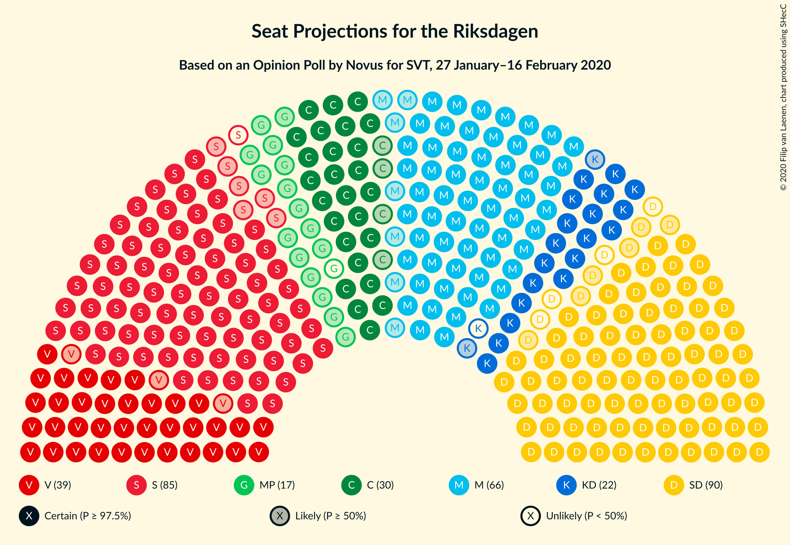
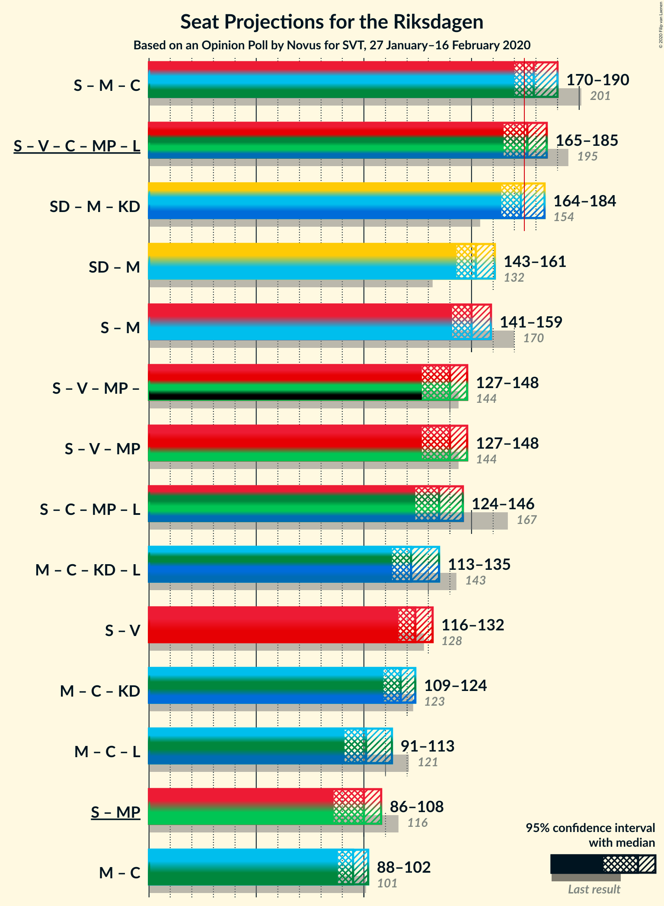

# Opinion Poll by Novus for SVT, 27 January–16 February 2020

<a href="#voting-intentions">Voting Intentions</a> | <a href="#seats">Seats</a> | <a href="#coalitions">Coalitions</a> | <a href="#technical-information">Technical Information</a>

## Voting Intentions

### Confidence Intervals

| Party | Last Result | Poll Result | 80% Confidence Interval | 90% Confidence Interval | 95% Confidence Interval | 99% Confidence Interval |
|:-----:|:-----------:|:-----------:|:-----------------------:|:-----------------------:|:-----------------------:|:-----------------------:|
| Sverigedemokraterna | 17.5% | 23.9% | 22.9–24.9% |22.6–25.2% |22.4–25.4% |22.0–25.9% |
| Sveriges socialdemokratiska arbetareparti | 28.3% | 23.2% | 22.3–24.2% |22.0–24.5% |21.7–24.7% |21.3–25.2% |
| Moderata samlingspartiet | 19.8% | 18.0% | 17.1–18.9% |16.9–19.2% |16.7–19.4% |16.3–19.9% |
| Vänsterpartiet | 8.0% | 10.9% | 10.2–11.7% |10.0–11.9% |9.9–12.1% |9.5–12.4% |
| Centerpartiet | 8.6% | 8.1% | 7.5–8.8% |7.3–9.0% |7.2–9.1% |6.9–9.4% |
| Kristdemokraterna | 6.3% | 5.9% | 5.4–6.5% |5.2–6.7% |5.1–6.8% |4.9–7.1% |
| Miljöpartiet de gröna | 4.4% | 4.5% | 4.0–5.0% |3.9–5.2% |3.8–5.3% |3.6–5.5% |
| Liberalerna | 5.5% | 3.9% | 3.5–4.4% |3.4–4.5% |3.3–4.6% |3.1–4.9% |

*Note:* The poll result column reflects the actual value used in the calculations. Published results may vary slightly, and in addition be rounded to fewer digits.

## Seats

### Confidence Intervals

| Party | Last Result | Median | 80% Confidence Interval | 90% Confidence Interval | 95% Confidence Interval | 99% Confidence Interval |
|:-----:|:-----------:|:------:|:-----------------------:|:-----------------------:|:-----------------------:|:-----------------------:|
| <a href="#sverigedemokraterna">Sverigedemokraterna</a> | 62 | 86 | 82–91 |81–93 |80–94 |78–96 |
| <a href="#sveriges-socialdemokratiska-arbetareparti">Sveriges socialdemokratiska arbetareparti</a> | 100 | 84 | 80–88 |79–90 |78–91 |76–95 |
| <a href="#moderata-samlingspartiet">Moderata samlingspartiet</a> | 70 | 66 | 61–69 |61–71 |59–71 |58–74 |
| <a href="#vänsterpartiet">Vänsterpartiet</a> | 28 | 39 | 37–42 |36–43 |36–44 |35–46 |
| <a href="#centerpartiet">Centerpartiet</a> | 31 | 30 | 27–32 |26–33 |26–33 |25–35 |
| <a href="#kristdemokraterna">Kristdemokraterna</a> | 22 | 21 | 20–24 |19–24 |19–25 |18–26 |
| <a href="#miljöpartiet-de-gröna">Miljöpartiet de gröna</a> | 16 | 16 | 15–18 |0–19 |0–19 |0–20 |
| <a href="#liberalerna">Liberalerna</a> | 20 | 0 | 0–16 |0–16 |0–16 |0–17 |

### Sverigedemokraterna

*For a full overview of the results for this party, see the [Sverigedemokraterna](party-sverigedemokraterna.html) page.*

| Number of Seats | Probability | Accumulated | Special Marks |
|:---------------:|:-----------:|:-----------:|:-------------:|
| 62 | 0% | 100% | Last Result |
| 63 | 0% | 100% |  |
| 64 | 0% | 100% |  |
| 65 | 0% | 100% |  |
| 66 | 0% | 100% |  |
| 67 | 0% | 100% |  |
| 68 | 0% | 100% |  |
| 69 | 0% | 100% |  |
| 70 | 0% | 100% |  |
| 71 | 0% | 100% |  |
| 72 | 0% | 100% |  |
| 73 | 0% | 100% |  |
| 74 | 0% | 100% |  |
| 75 | 0% | 100% |  |
| 76 | 0% | 100% |  |
| 77 | 0.3% | 99.9% |  |
| 78 | 0.2% | 99.6% |  |
| 79 | 1.1% | 99.4% |  |
| 80 | 1.3% | 98% |  |
| 81 | 3% | 97% |  |
| 82 | 5% | 94% |  |
| 83 | 7% | 88% |  |
| 84 | 9% | 81% |  |
| 85 | 10% | 71% |  |
| 86 | 13% | 61% | Median |
| 87 | 9% | 48% |  |
| 88 | 7% | 39% |  |
| 89 | 7% | 31% |  |
| 90 | 12% | 25% |  |
| 91 | 5% | 12% |  |
| 92 | 3% | 8% |  |
| 93 | 2% | 5% |  |
| 94 | 2% | 3% |  |
| 95 | 0.6% | 1.3% |  |
| 96 | 0.4% | 0.7% |  |
| 97 | 0.1% | 0.3% |  |
| 98 | 0.2% | 0.2% |  |
| 99 | 0% | 0.1% |  |
| 100 | 0% | 0% |  |

### Sveriges socialdemokratiska arbetareparti

*For a full overview of the results for this party, see the [Sveriges socialdemokratiska arbetareparti](party-sverigessocialdemokratiskaarbetareparti.html) page.*

| Number of Seats | Probability | Accumulated | Special Marks |
|:---------------:|:-----------:|:-----------:|:-------------:|
| 74 | 0.1% | 100% |  |
| 75 | 0.2% | 99.9% |  |
| 76 | 0.5% | 99.7% |  |
| 77 | 0.7% | 99.3% |  |
| 78 | 2% | 98.5% |  |
| 79 | 2% | 97% |  |
| 80 | 5% | 94% |  |
| 81 | 11% | 89% |  |
| 82 | 6% | 79% |  |
| 83 | 12% | 73% |  |
| 84 | 13% | 60% | Median |
| 85 | 16% | 47% |  |
| 86 | 11% | 32% |  |
| 87 | 6% | 20% |  |
| 88 | 6% | 14% |  |
| 89 | 2% | 8% |  |
| 90 | 2% | 6% |  |
| 91 | 1.1% | 4% |  |
| 92 | 0.9% | 2% |  |
| 93 | 0.5% | 2% |  |
| 94 | 0.5% | 1.1% |  |
| 95 | 0.3% | 0.6% |  |
| 96 | 0.1% | 0.3% |  |
| 97 | 0.2% | 0.2% |  |
| 98 | 0% | 0% |  |
| 99 | 0% | 0% |  |
| 100 | 0% | 0% | Last Result |

### Moderata samlingspartiet

*For a full overview of the results for this party, see the [Moderata samlingspartiet](party-moderatasamlingspartiet.html) page.*

| Number of Seats | Probability | Accumulated | Special Marks |
|:---------------:|:-----------:|:-----------:|:-------------:|
| 57 | 0.1% | 100% |  |
| 58 | 1.2% | 99.9% |  |
| 59 | 1.2% | 98.6% |  |
| 60 | 2% | 97% |  |
| 61 | 7% | 96% |  |
| 62 | 9% | 89% |  |
| 63 | 7% | 80% |  |
| 64 | 7% | 73% |  |
| 65 | 13% | 66% |  |
| 66 | 20% | 53% | Median |
| 67 | 10% | 32% |  |
| 68 | 7% | 23% |  |
| 69 | 8% | 15% |  |
| 70 | 2% | 8% | Last Result |
| 71 | 3% | 5% |  |
| 72 | 1.2% | 2% |  |
| 73 | 0.5% | 1.1% |  |
| 74 | 0.4% | 0.6% |  |
| 75 | 0.1% | 0.2% |  |
| 76 | 0.1% | 0.1% |  |
| 77 | 0% | 0% |  |

### Vänsterpartiet

*For a full overview of the results for this party, see the [Vänsterpartiet](party-vänsterpartiet.html) page.*

| Number of Seats | Probability | Accumulated | Special Marks |
|:---------------:|:-----------:|:-----------:|:-------------:|
| 28 | 0% | 100% | Last Result |
| 29 | 0% | 100% |  |
| 30 | 0% | 100% |  |
| 31 | 0% | 100% |  |
| 32 | 0% | 100% |  |
| 33 | 0.2% | 99.9% |  |
| 34 | 0.3% | 99.8% |  |
| 35 | 2% | 99.5% |  |
| 36 | 4% | 98% |  |
| 37 | 8% | 94% |  |
| 38 | 14% | 86% |  |
| 39 | 26% | 72% | Median |
| 40 | 17% | 46% |  |
| 41 | 12% | 29% |  |
| 42 | 8% | 17% |  |
| 43 | 5% | 9% |  |
| 44 | 3% | 4% |  |
| 45 | 0.9% | 2% |  |
| 46 | 0.6% | 0.9% |  |
| 47 | 0.2% | 0.3% |  |
| 48 | 0% | 0% |  |

### Centerpartiet

*For a full overview of the results for this party, see the [Centerpartiet](party-centerpartiet.html) page.*

| Number of Seats | Probability | Accumulated | Special Marks |
|:---------------:|:-----------:|:-----------:|:-------------:|
| 24 | 0.2% | 100% |  |
| 25 | 0.9% | 99.8% |  |
| 26 | 5% | 98.9% |  |
| 27 | 7% | 94% |  |
| 28 | 17% | 87% |  |
| 29 | 20% | 70% |  |
| 30 | 21% | 50% | Median |
| 31 | 15% | 30% | Last Result |
| 32 | 7% | 15% |  |
| 33 | 6% | 8% |  |
| 34 | 1.1% | 2% |  |
| 35 | 0.5% | 0.7% |  |
| 36 | 0.1% | 0.2% |  |
| 37 | 0.1% | 0.1% |  |
| 38 | 0% | 0% |  |

### Kristdemokraterna

*For a full overview of the results for this party, see the [Kristdemokraterna](party-kristdemokraterna.html) page.*

| Number of Seats | Probability | Accumulated | Special Marks |
|:---------------:|:-----------:|:-----------:|:-------------:|
| 17 | 0.4% | 100% |  |
| 18 | 2% | 99.6% |  |
| 19 | 7% | 98% |  |
| 20 | 24% | 91% |  |
| 21 | 18% | 67% | Median |
| 22 | 24% | 49% | Last Result |
| 23 | 14% | 25% |  |
| 24 | 6% | 11% |  |
| 25 | 3% | 4% |  |
| 26 | 1.1% | 1.4% |  |
| 27 | 0.3% | 0.3% |  |
| 28 | 0% | 0% |  |

### Miljöpartiet de gröna

*For a full overview of the results for this party, see the [Miljöpartiet de gröna](party-miljöpartietdegröna.html) page.*

| Number of Seats | Probability | Accumulated | Special Marks |
|:---------------:|:-----------:|:-----------:|:-------------:|
| 0 | 7% | 100% |  |
| 1 | 0% | 93% |  |
| 2 | 0% | 93% |  |
| 3 | 0% | 93% |  |
| 4 | 0% | 93% |  |
| 5 | 0% | 93% |  |
| 6 | 0% | 93% |  |
| 7 | 0% | 93% |  |
| 8 | 0% | 93% |  |
| 9 | 0% | 93% |  |
| 10 | 0% | 93% |  |
| 11 | 0% | 93% |  |
| 12 | 0% | 93% |  |
| 13 | 0% | 93% |  |
| 14 | 1.5% | 93% |  |
| 15 | 18% | 92% |  |
| 16 | 30% | 74% | Last Result, Median |
| 17 | 24% | 44% |  |
| 18 | 14% | 20% |  |
| 19 | 6% | 7% |  |
| 20 | 0.9% | 1.1% |  |
| 21 | 0.2% | 0.2% |  |
| 22 | 0% | 0% |  |

### Liberalerna

*For a full overview of the results for this party, see the [Liberalerna](party-liberalerna.html) page.*

| Number of Seats | Probability | Accumulated | Special Marks |
|:---------------:|:-----------:|:-----------:|:-------------:|
| 0 | 55% | 100% | Median |
| 1 | 0% | 45% |  |
| 2 | 0% | 45% |  |
| 3 | 0% | 45% |  |
| 4 | 0% | 45% |  |
| 5 | 0% | 45% |  |
| 6 | 0% | 45% |  |
| 7 | 0% | 45% |  |
| 8 | 0% | 45% |  |
| 9 | 0% | 45% |  |
| 10 | 0% | 45% |  |
| 11 | 0% | 45% |  |
| 12 | 0% | 45% |  |
| 13 | 0% | 45% |  |
| 14 | 12% | 45% |  |
| 15 | 21% | 33% |  |
| 16 | 10% | 12% |  |
| 17 | 2% | 2% |  |
| 18 | 0.4% | 0.4% |  |
| 19 | 0.1% | 0.1% |  |
| 20 | 0% | 0% | Last Result |

## Coalitions

### Confidence Intervals

| Coalition | Last Result | Median | Majority? | 80% Confidence Interval | 90% Confidence Interval | 95% Confidence Interval | 99% Confidence Interval |
|:---------:|:-----------:|:------:|:---------:|:-----------------------:|:-----------------------:|:-----------------------:|:-----------------------:|
| Sveriges socialdemokratiska arbetareparti – Moderata samlingspartiet – Centerpartiet | 201 | 179 | 80% | 173–186 | 171–188 | 170–190 | 167–196 |
| Sveriges socialdemokratiska arbetareparti – Vänsterpartiet – Centerpartiet – Miljöpartiet de gröna – Liberalerna | 195 | 176 | 55% | 169–183 | 167–184 | 165–185 | 160–187 |
| Sverigedemokraterna – Moderata samlingspartiet – Kristdemokraterna | 154 | 173 | 45% | 166–180 | 165–182 | 164–184 | 162–189 |
| Sverigedemokraterna – Moderata samlingspartiet | 132 | 152 | 0% | 146–159 | 144–160 | 143–161 | 141–166 |
| Sveriges socialdemokratiska arbetareparti – Moderata samlingspartiet | 170 | 150 | 0% | 144–155 | 143–157 | 141–159 | 138–165 |
| Sveriges socialdemokratiska arbetareparti – Vänsterpartiet – Miljöpartiet de gröna | 144 | 140 | 0% | 133–145 | 130–147 | 127–148 | 124–150 |
| Sveriges socialdemokratiska arbetareparti – Centerpartiet – Miljöpartiet de gröna – Liberalerna | 167 | 135 | 0% | 129–144 | 127–145 | 124–146 | 118–148 |
| Moderata samlingspartiet – Centerpartiet – Kristdemokraterna – Liberalerna | 143 | 122 | 0% | 116–131 | 114–133 | 113–135 | 111–137 |
| Sveriges socialdemokratiska arbetareparti – Vänsterpartiet | 128 | 124 | 0% | 119–129 | 117–131 | 116–132 | 114–136 |
| Moderata samlingspartiet – Centerpartiet – Kristdemokraterna | 123 | 117 | 0% | 110–121 | 109–123 | 109–124 | 106–128 |
| Moderata samlingspartiet – Centerpartiet – Liberalerna | 121 | 101 | 0% | 94–110 | 92–112 | 91–113 | 90–115 |
| Sveriges socialdemokratiska arbetareparti – Miljöpartiet de gröna | 116 | 100 | 0% | 95–105 | 90–106 | 86–108 | 83–109 |
| Moderata samlingspartiet – Centerpartiet | 101 | 95 | 0% | 89–100 | 89–101 | 88–102 | 86–105 |

### Sveriges socialdemokratiska arbetareparti – Moderata samlingspartiet – Centerpartiet

| Number of Seats | Probability | Accumulated | Special Marks |
|:---------------:|:-----------:|:-----------:|:-------------:|
| 164 | 0.1% | 100% |  |
| 165 | 0.1% | 99.9% |  |
| 166 | 0.1% | 99.8% |  |
| 167 | 0.3% | 99.6% |  |
| 168 | 0.6% | 99.4% |  |
| 169 | 1.2% | 98.8% |  |
| 170 | 1.5% | 98% |  |
| 171 | 2% | 96% |  |
| 172 | 2% | 94% |  |
| 173 | 8% | 92% |  |
| 174 | 5% | 85% |  |
| 175 | 6% | 80% | Majority |
| 176 | 9% | 74% |  |
| 177 | 6% | 66% |  |
| 178 | 6% | 59% |  |
| 179 | 4% | 53% |  |
| 180 | 5% | 49% | Median |
| 181 | 12% | 44% |  |
| 182 | 5% | 32% |  |
| 183 | 7% | 27% |  |
| 184 | 6% | 21% |  |
| 185 | 4% | 15% |  |
| 186 | 4% | 11% |  |
| 187 | 2% | 7% |  |
| 188 | 1.4% | 5% |  |
| 189 | 0.8% | 4% |  |
| 190 | 0.9% | 3% |  |
| 191 | 0.3% | 2% |  |
| 192 | 0.3% | 2% |  |
| 193 | 0.5% | 1.4% |  |
| 194 | 0.2% | 0.9% |  |
| 195 | 0.2% | 0.8% |  |
| 196 | 0.3% | 0.6% |  |
| 197 | 0.2% | 0.3% |  |
| 198 | 0% | 0.1% |  |
| 199 | 0% | 0.1% |  |
| 200 | 0% | 0.1% |  |
| 201 | 0% | 0% | Last Result |

### Sveriges socialdemokratiska arbetareparti – Vänsterpartiet – Centerpartiet – Miljöpartiet de gröna – Liberalerna

| Number of Seats | Probability | Accumulated | Special Marks |
|:---------------:|:-----------:|:-----------:|:-------------:|
| 156 | 0% | 100% |  |
| 157 | 0% | 99.9% |  |
| 158 | 0.1% | 99.9% |  |
| 159 | 0.3% | 99.8% |  |
| 160 | 0.1% | 99.6% |  |
| 161 | 0.2% | 99.5% |  |
| 162 | 0.2% | 99.3% |  |
| 163 | 0.4% | 99.0% |  |
| 164 | 0.7% | 98.7% |  |
| 165 | 1.0% | 98% |  |
| 166 | 0.9% | 97% |  |
| 167 | 1.5% | 96% |  |
| 168 | 4% | 95% |  |
| 169 | 5% | 91% | Median |
| 170 | 6% | 86% |  |
| 171 | 8% | 80% |  |
| 172 | 6% | 72% |  |
| 173 | 4% | 66% |  |
| 174 | 8% | 62% |  |
| 175 | 4% | 55% | Majority |
| 176 | 6% | 51% |  |
| 177 | 4% | 45% |  |
| 178 | 7% | 40% |  |
| 179 | 4% | 33% |  |
| 180 | 11% | 29% |  |
| 181 | 2% | 18% |  |
| 182 | 4% | 16% |  |
| 183 | 6% | 12% |  |
| 184 | 3% | 6% |  |
| 185 | 2% | 3% |  |
| 186 | 0.4% | 2% |  |
| 187 | 1.0% | 1.4% |  |
| 188 | 0.3% | 0.4% |  |
| 189 | 0.1% | 0.1% |  |
| 190 | 0% | 0% |  |
| 191 | 0% | 0% |  |
| 192 | 0% | 0% |  |
| 193 | 0% | 0% |  |
| 194 | 0% | 0% |  |
| 195 | 0% | 0% | Last Result |

### Sverigedemokraterna – Moderata samlingspartiet – Kristdemokraterna

| Number of Seats | Probability | Accumulated | Special Marks |
|:---------------:|:-----------:|:-----------:|:-------------:|
| 154 | 0% | 100% | Last Result |
| 155 | 0% | 100% |  |
| 156 | 0% | 100% |  |
| 157 | 0% | 100% |  |
| 158 | 0% | 100% |  |
| 159 | 0% | 100% |  |
| 160 | 0.1% | 100% |  |
| 161 | 0.3% | 99.9% |  |
| 162 | 1.0% | 99.6% |  |
| 163 | 0.4% | 98.6% |  |
| 164 | 2% | 98% |  |
| 165 | 3% | 97% |  |
| 166 | 6% | 94% |  |
| 167 | 4% | 88% |  |
| 168 | 2% | 84% |  |
| 169 | 11% | 82% |  |
| 170 | 4% | 71% |  |
| 171 | 7% | 67% |  |
| 172 | 4% | 60% |  |
| 173 | 6% | 55% | Median |
| 174 | 4% | 49% |  |
| 175 | 8% | 45% | Majority |
| 176 | 4% | 38% |  |
| 177 | 6% | 34% |  |
| 178 | 8% | 28% |  |
| 179 | 6% | 20% |  |
| 180 | 5% | 14% |  |
| 181 | 4% | 9% |  |
| 182 | 1.5% | 5% |  |
| 183 | 0.9% | 4% |  |
| 184 | 1.0% | 3% |  |
| 185 | 0.7% | 2% |  |
| 186 | 0.4% | 1.3% |  |
| 187 | 0.2% | 1.0% |  |
| 188 | 0.2% | 0.7% |  |
| 189 | 0.1% | 0.5% |  |
| 190 | 0.3% | 0.4% |  |
| 191 | 0.1% | 0.2% |  |
| 192 | 0% | 0.1% |  |
| 193 | 0% | 0.1% |  |
| 194 | 0% | 0% |  |

### Sverigedemokraterna – Moderata samlingspartiet

| Number of Seats | Probability | Accumulated | Special Marks |
|:---------------:|:-----------:|:-----------:|:-------------:|
| 132 | 0% | 100% | Last Result |
| 133 | 0% | 100% |  |
| 134 | 0% | 100% |  |
| 135 | 0% | 100% |  |
| 136 | 0% | 100% |  |
| 137 | 0% | 100% |  |
| 138 | 0% | 100% |  |
| 139 | 0.1% | 99.9% |  |
| 140 | 0.2% | 99.9% |  |
| 141 | 0.8% | 99.7% |  |
| 142 | 0.8% | 98.9% |  |
| 143 | 2% | 98% |  |
| 144 | 2% | 96% |  |
| 145 | 1.3% | 95% |  |
| 146 | 7% | 94% |  |
| 147 | 5% | 86% |  |
| 148 | 6% | 81% |  |
| 149 | 10% | 75% |  |
| 150 | 6% | 64% |  |
| 151 | 5% | 58% |  |
| 152 | 7% | 53% | Median |
| 153 | 8% | 46% |  |
| 154 | 6% | 38% |  |
| 155 | 4% | 32% |  |
| 156 | 9% | 27% |  |
| 157 | 4% | 19% |  |
| 158 | 4% | 15% |  |
| 159 | 4% | 11% |  |
| 160 | 3% | 6% |  |
| 161 | 1.4% | 4% |  |
| 162 | 0.7% | 2% |  |
| 163 | 0.5% | 1.4% |  |
| 164 | 0.2% | 1.0% |  |
| 165 | 0.1% | 0.7% |  |
| 166 | 0.2% | 0.7% |  |
| 167 | 0.3% | 0.4% |  |
| 168 | 0.1% | 0.1% |  |
| 169 | 0% | 0.1% |  |
| 170 | 0% | 0.1% |  |
| 171 | 0% | 0% |  |

### Sveriges socialdemokratiska arbetareparti – Moderata samlingspartiet

| Number of Seats | Probability | Accumulated | Special Marks |
|:---------------:|:-----------:|:-----------:|:-------------:|
| 136 | 0% | 100% |  |
| 137 | 0.1% | 99.9% |  |
| 138 | 0.5% | 99.8% |  |
| 139 | 0.3% | 99.4% |  |
| 140 | 1.0% | 99.1% |  |
| 141 | 1.5% | 98% |  |
| 142 | 2% | 97% |  |
| 143 | 3% | 95% |  |
| 144 | 6% | 92% |  |
| 145 | 6% | 86% |  |
| 146 | 5% | 80% |  |
| 147 | 9% | 75% |  |
| 148 | 10% | 66% |  |
| 149 | 4% | 56% |  |
| 150 | 6% | 51% | Median |
| 151 | 12% | 46% |  |
| 152 | 5% | 33% |  |
| 153 | 10% | 29% |  |
| 154 | 4% | 19% |  |
| 155 | 5% | 15% |  |
| 156 | 3% | 9% |  |
| 157 | 2% | 6% |  |
| 158 | 1.2% | 4% |  |
| 159 | 0.7% | 3% |  |
| 160 | 0.9% | 2% |  |
| 161 | 0.4% | 2% |  |
| 162 | 0.3% | 1.2% |  |
| 163 | 0.2% | 0.9% |  |
| 164 | 0.1% | 0.6% |  |
| 165 | 0.4% | 0.5% |  |
| 166 | 0.1% | 0.2% |  |
| 167 | 0.1% | 0.1% |  |
| 168 | 0% | 0.1% |  |
| 169 | 0% | 0% |  |
| 170 | 0% | 0% | Last Result |

### Sveriges socialdemokratiska arbetareparti – Vänsterpartiet – Miljöpartiet de gröna

| Number of Seats | Probability | Accumulated | Special Marks |
|:---------------:|:-----------:|:-----------:|:-------------:|
| 120 | 0% | 100% |  |
| 121 | 0.1% | 99.9% |  |
| 122 | 0.1% | 99.8% |  |
| 123 | 0.1% | 99.7% |  |
| 124 | 0.4% | 99.6% |  |
| 125 | 0.5% | 99.2% |  |
| 126 | 0.6% | 98.7% |  |
| 127 | 1.3% | 98% |  |
| 128 | 0.4% | 97% |  |
| 129 | 0.6% | 96% |  |
| 130 | 1.3% | 96% |  |
| 131 | 1.1% | 94% |  |
| 132 | 2% | 93% |  |
| 133 | 3% | 92% |  |
| 134 | 2% | 89% |  |
| 135 | 10% | 87% |  |
| 136 | 3% | 76% |  |
| 137 | 6% | 74% |  |
| 138 | 9% | 68% |  |
| 139 | 7% | 59% | Median |
| 140 | 11% | 52% |  |
| 141 | 9% | 40% |  |
| 142 | 5% | 31% |  |
| 143 | 5% | 26% |  |
| 144 | 5% | 20% | Last Result |
| 145 | 6% | 15% |  |
| 146 | 3% | 9% |  |
| 147 | 3% | 6% |  |
| 148 | 0.8% | 3% |  |
| 149 | 1.0% | 2% |  |
| 150 | 0.8% | 1.1% |  |
| 151 | 0.2% | 0.3% |  |
| 152 | 0.1% | 0.1% |  |
| 153 | 0% | 0% |  |

### Sveriges socialdemokratiska arbetareparti – Centerpartiet – Miljöpartiet de gröna – Liberalerna

| Number of Seats | Probability | Accumulated | Special Marks |
|:---------------:|:-----------:|:-----------:|:-------------:|
| 115 | 0.1% | 100% |  |
| 116 | 0.1% | 99.8% |  |
| 117 | 0.2% | 99.8% |  |
| 118 | 0.3% | 99.6% |  |
| 119 | 0.2% | 99.3% |  |
| 120 | 0.1% | 99.1% |  |
| 121 | 0.3% | 99.0% |  |
| 122 | 0.4% | 98.6% |  |
| 123 | 0.6% | 98% |  |
| 124 | 0.4% | 98% |  |
| 125 | 0.6% | 97% |  |
| 126 | 0.9% | 97% |  |
| 127 | 2% | 96% |  |
| 128 | 2% | 94% |  |
| 129 | 6% | 92% |  |
| 130 | 7% | 86% | Median |
| 131 | 9% | 80% |  |
| 132 | 6% | 71% |  |
| 133 | 5% | 65% |  |
| 134 | 6% | 60% |  |
| 135 | 5% | 54% |  |
| 136 | 3% | 49% |  |
| 137 | 4% | 45% |  |
| 138 | 2% | 42% |  |
| 139 | 5% | 39% |  |
| 140 | 4% | 34% |  |
| 141 | 5% | 30% |  |
| 142 | 8% | 26% |  |
| 143 | 4% | 18% |  |
| 144 | 7% | 14% |  |
| 145 | 3% | 7% |  |
| 146 | 2% | 4% |  |
| 147 | 1.3% | 2% |  |
| 148 | 0.5% | 1.0% |  |
| 149 | 0.3% | 0.5% |  |
| 150 | 0.1% | 0.2% |  |
| 151 | 0% | 0.1% |  |
| 152 | 0% | 0% |  |
| 153 | 0% | 0% |  |
| 154 | 0% | 0% |  |
| 155 | 0% | 0% |  |
| 156 | 0% | 0% |  |
| 157 | 0% | 0% |  |
| 158 | 0% | 0% |  |
| 159 | 0% | 0% |  |
| 160 | 0% | 0% |  |
| 161 | 0% | 0% |  |
| 162 | 0% | 0% |  |
| 163 | 0% | 0% |  |
| 164 | 0% | 0% |  |
| 165 | 0% | 0% |  |
| 166 | 0% | 0% |  |
| 167 | 0% | 0% | Last Result |

### Moderata samlingspartiet – Centerpartiet – Kristdemokraterna – Liberalerna

| Number of Seats | Probability | Accumulated | Special Marks |
|:---------------:|:-----------:|:-----------:|:-------------:|
| 109 | 0% | 100% |  |
| 110 | 0.1% | 99.9% |  |
| 111 | 0.7% | 99.8% |  |
| 112 | 0.9% | 99.1% |  |
| 113 | 0.9% | 98% |  |
| 114 | 4% | 97% |  |
| 115 | 2% | 93% |  |
| 116 | 3% | 91% |  |
| 117 | 4% | 88% | Median |
| 118 | 13% | 84% |  |
| 119 | 5% | 71% |  |
| 120 | 4% | 66% |  |
| 121 | 9% | 63% |  |
| 122 | 4% | 54% |  |
| 123 | 3% | 50% |  |
| 124 | 8% | 47% |  |
| 125 | 2% | 38% |  |
| 126 | 4% | 37% |  |
| 127 | 3% | 33% |  |
| 128 | 7% | 30% |  |
| 129 | 5% | 22% |  |
| 130 | 5% | 17% |  |
| 131 | 5% | 13% |  |
| 132 | 2% | 8% |  |
| 133 | 1.4% | 6% |  |
| 134 | 2% | 4% |  |
| 135 | 1.4% | 3% |  |
| 136 | 0.6% | 1.4% |  |
| 137 | 0.3% | 0.8% |  |
| 138 | 0.2% | 0.5% |  |
| 139 | 0.2% | 0.3% |  |
| 140 | 0.1% | 0.1% |  |
| 141 | 0% | 0.1% |  |
| 142 | 0% | 0% |  |
| 143 | 0% | 0% | Last Result |

### Sveriges socialdemokratiska arbetareparti – Vänsterpartiet

| Number of Seats | Probability | Accumulated | Special Marks |
|:---------------:|:-----------:|:-----------:|:-------------:|
| 111 | 0% | 100% |  |
| 112 | 0.1% | 99.9% |  |
| 113 | 0.3% | 99.8% |  |
| 114 | 0.4% | 99.5% |  |
| 115 | 1.0% | 99.1% |  |
| 116 | 1.2% | 98% |  |
| 117 | 2% | 97% |  |
| 118 | 4% | 95% |  |
| 119 | 7% | 91% |  |
| 120 | 8% | 84% |  |
| 121 | 4% | 76% |  |
| 122 | 11% | 72% |  |
| 123 | 9% | 61% | Median |
| 124 | 8% | 51% |  |
| 125 | 12% | 44% |  |
| 126 | 6% | 32% |  |
| 127 | 6% | 26% |  |
| 128 | 7% | 20% | Last Result |
| 129 | 4% | 12% |  |
| 130 | 2% | 8% |  |
| 131 | 2% | 6% |  |
| 132 | 2% | 4% |  |
| 133 | 0.7% | 2% |  |
| 134 | 0.3% | 2% |  |
| 135 | 0.5% | 1.3% |  |
| 136 | 0.4% | 0.8% |  |
| 137 | 0.1% | 0.5% |  |
| 138 | 0.1% | 0.4% |  |
| 139 | 0.2% | 0.3% |  |
| 140 | 0% | 0% |  |

### Moderata samlingspartiet – Centerpartiet – Kristdemokraterna

| Number of Seats | Probability | Accumulated | Special Marks |
|:---------------:|:-----------:|:-----------:|:-------------:|
| 105 | 0.1% | 100% |  |
| 106 | 0.5% | 99.9% |  |
| 107 | 0.7% | 99.4% |  |
| 108 | 0.7% | 98.7% |  |
| 109 | 5% | 98% |  |
| 110 | 4% | 93% |  |
| 111 | 3% | 89% |  |
| 112 | 4% | 86% |  |
| 113 | 8% | 82% |  |
| 114 | 10% | 74% |  |
| 115 | 5% | 65% |  |
| 116 | 10% | 60% |  |
| 117 | 6% | 50% | Median |
| 118 | 13% | 44% |  |
| 119 | 6% | 31% |  |
| 120 | 5% | 24% |  |
| 121 | 9% | 19% |  |
| 122 | 4% | 10% |  |
| 123 | 2% | 6% | Last Result |
| 124 | 1.5% | 4% |  |
| 125 | 0.9% | 2% |  |
| 126 | 0.6% | 2% |  |
| 127 | 0.3% | 1.0% |  |
| 128 | 0.2% | 0.6% |  |
| 129 | 0.2% | 0.5% |  |
| 130 | 0.2% | 0.3% |  |
| 131 | 0.1% | 0.1% |  |
| 132 | 0% | 0% |  |

### Moderata samlingspartiet – Centerpartiet – Liberalerna

| Number of Seats | Probability | Accumulated | Special Marks |
|:---------------:|:-----------:|:-----------:|:-------------:|
| 88 | 0.1% | 100% |  |
| 89 | 0.3% | 99.9% |  |
| 90 | 0.7% | 99.6% |  |
| 91 | 1.5% | 98.8% |  |
| 92 | 3% | 97% |  |
| 93 | 3% | 95% |  |
| 94 | 3% | 92% |  |
| 95 | 6% | 88% |  |
| 96 | 10% | 83% | Median |
| 97 | 6% | 73% |  |
| 98 | 5% | 66% |  |
| 99 | 7% | 61% |  |
| 100 | 4% | 54% |  |
| 101 | 2% | 50% |  |
| 102 | 3% | 48% |  |
| 103 | 4% | 45% |  |
| 104 | 6% | 41% |  |
| 105 | 2% | 35% |  |
| 106 | 5% | 34% |  |
| 107 | 3% | 29% |  |
| 108 | 6% | 26% |  |
| 109 | 8% | 20% |  |
| 110 | 3% | 12% |  |
| 111 | 3% | 9% |  |
| 112 | 2% | 5% |  |
| 113 | 2% | 4% |  |
| 114 | 1.2% | 2% |  |
| 115 | 0.3% | 0.7% |  |
| 116 | 0.3% | 0.5% |  |
| 117 | 0.1% | 0.2% |  |
| 118 | 0.1% | 0.1% |  |
| 119 | 0% | 0.1% |  |
| 120 | 0% | 0% |  |
| 121 | 0% | 0% | Last Result |

### Sveriges socialdemokratiska arbetareparti – Miljöpartiet de gröna

| Number of Seats | Probability | Accumulated | Special Marks |
|:---------------:|:-----------:|:-----------:|:-------------:|
| 80 | 0% | 100% |  |
| 81 | 0.1% | 99.9% |  |
| 82 | 0.3% | 99.9% |  |
| 83 | 0.1% | 99.6% |  |
| 84 | 0.3% | 99.4% |  |
| 85 | 0.5% | 99.1% |  |
| 86 | 2% | 98.6% |  |
| 87 | 0.8% | 97% |  |
| 88 | 0.4% | 96% |  |
| 89 | 0.4% | 96% |  |
| 90 | 1.1% | 95% |  |
| 91 | 0.3% | 94% |  |
| 92 | 0.7% | 94% |  |
| 93 | 1.3% | 93% |  |
| 94 | 2% | 92% |  |
| 95 | 2% | 90% |  |
| 96 | 5% | 88% |  |
| 97 | 10% | 84% |  |
| 98 | 6% | 74% |  |
| 99 | 8% | 67% |  |
| 100 | 12% | 60% | Median |
| 101 | 18% | 48% |  |
| 102 | 5% | 30% |  |
| 103 | 5% | 25% |  |
| 104 | 9% | 20% |  |
| 105 | 5% | 11% |  |
| 106 | 2% | 6% |  |
| 107 | 1.3% | 4% |  |
| 108 | 1.4% | 3% |  |
| 109 | 0.9% | 1.3% |  |
| 110 | 0.2% | 0.4% |  |
| 111 | 0.1% | 0.2% |  |
| 112 | 0.1% | 0.1% |  |
| 113 | 0% | 0% |  |
| 114 | 0% | 0% |  |
| 115 | 0% | 0% |  |
| 116 | 0% | 0% | Last Result |

### Moderata samlingspartiet – Centerpartiet

| Number of Seats | Probability | Accumulated | Special Marks |
|:---------------:|:-----------:|:-----------:|:-------------:|
| 84 | 0.1% | 100% |  |
| 85 | 0.1% | 99.9% |  |
| 86 | 0.6% | 99.8% |  |
| 87 | 1.2% | 99.2% |  |
| 88 | 1.4% | 98% |  |
| 89 | 7% | 97% |  |
| 90 | 3% | 90% |  |
| 91 | 6% | 87% |  |
| 92 | 6% | 81% |  |
| 93 | 9% | 75% |  |
| 94 | 10% | 66% |  |
| 95 | 10% | 56% |  |
| 96 | 13% | 46% | Median |
| 97 | 8% | 33% |  |
| 98 | 7% | 25% |  |
| 99 | 8% | 18% |  |
| 100 | 4% | 10% |  |
| 101 | 2% | 6% | Last Result |
| 102 | 2% | 4% |  |
| 103 | 0.8% | 2% |  |
| 104 | 0.3% | 1.0% |  |
| 105 | 0.3% | 0.7% |  |
| 106 | 0.3% | 0.4% |  |
| 107 | 0% | 0.2% |  |
| 108 | 0.1% | 0.2% |  |
| 109 | 0% | 0% |  |

## Technical Information

### Opinion Poll

+ **Polling firm:** Novus
+ **Commissioner(s):** SVT
+ **Fieldwork period:** 27 January–16 February 2020

### Calculations

+ **Sample size:** 3098
+ **Simulations done:** 1,048,576
+ **Error estimate:** 0.59%

