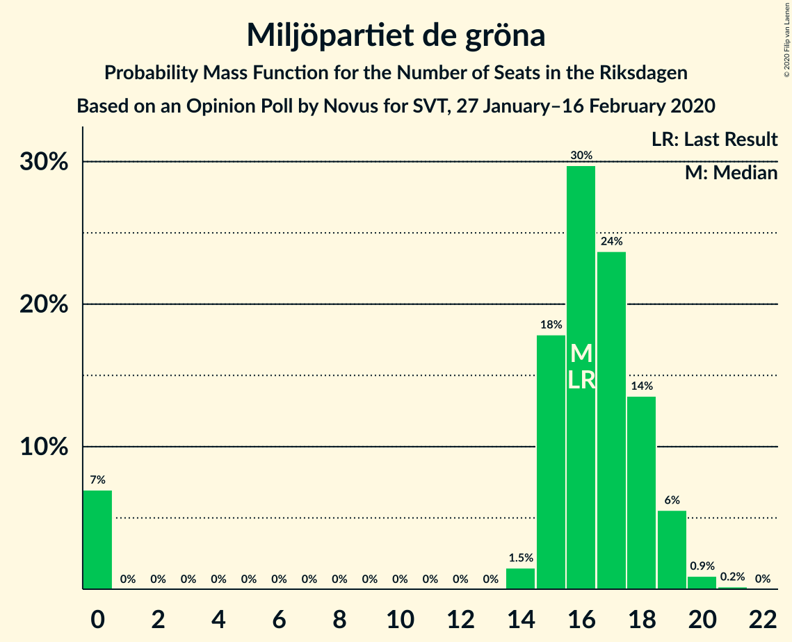
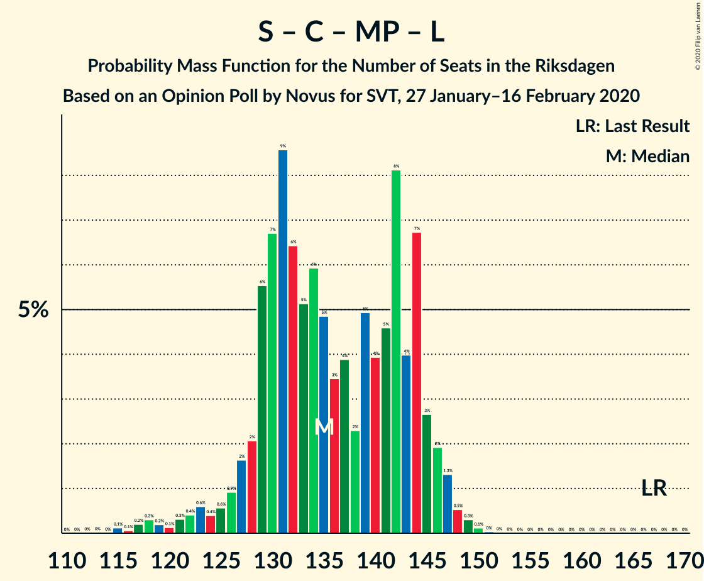

# Opinion Poll by Novus for SVT, 27 January–16 February 2020

<a href="#voting-intentions">Voting Intentions</a> | <a href="#seats">Seats</a> | <a href="#coalitions">Coalitions</a> | <a href="#technical-information">Technical Information</a>

## Voting Intentions

### Confidence Intervals

| Party | Last Result | Poll Result | 80% Confidence Interval | 90% Confidence Interval | 95% Confidence Interval | 99% Confidence Interval |
|:-----:|:-----------:|:-----------:|:-----------------------:|:-----------------------:|:-----------------------:|:-----------------------:|
| Sverigedemokraterna | 17.5% | 23.9% | 22.9–24.9% |22.6–25.2% |22.4–25.4% |22.0–25.9% |
| Sveriges socialdemokratiska arbetareparti | 28.3% | 23.2% | 22.3–24.2% |22.0–24.5% |21.7–24.7% |21.3–25.2% |
| Moderata samlingspartiet | 19.8% | 18.0% | 17.1–18.9% |16.9–19.2% |16.7–19.4% |16.3–19.9% |
| Vänsterpartiet | 8.0% | 10.9% | 10.2–11.7% |10.0–11.9% |9.9–12.1% |9.5–12.4% |
| Centerpartiet | 8.6% | 8.1% | 7.5–8.8% |7.3–9.0% |7.2–9.1% |6.9–9.4% |
| Kristdemokraterna | 6.3% | 5.9% | 5.4–6.5% |5.2–6.7% |5.1–6.8% |4.9–7.1% |
| Miljöpartiet de gröna | 4.4% | 4.5% | 4.0–5.0% |3.9–5.2% |3.8–5.3% |3.6–5.5% |
| Liberalerna | 5.5% | 3.9% | 3.5–4.4% |3.4–4.5% |3.3–4.6% |3.1–4.9% |

*Note:* The poll result column reflects the actual value used in the calculations. Published results may vary slightly, and in addition be rounded to fewer digits.

## Seats

### Confidence Intervals

| Party | Last Result | Median | 80% Confidence Interval | 90% Confidence Interval | 95% Confidence Interval | 99% Confidence Interval |
|:-----:|:-----------:|:------:|:-----------------------:|:-----------------------:|:-----------------------:|:-----------------------:|
| <a href="#sverigedemokraterna">Sverigedemokraterna</a> | 62 | 92 | 83–93 |82–93 |82–93 |80–94 |
| <a href="#sveriges-socialdemokratiska-arbetareparti">Sveriges socialdemokratiska arbetareparti</a> | 100 | 83 | 79–90 |78–92 |78–93 |77–93 |
| <a href="#moderata-samlingspartiet">Moderata samlingspartiet</a> | 70 | 67 | 62–68 |60–69 |60–72 |57–73 |
| <a href="#vänsterpartiet">Vänsterpartiet</a> | 28 | 41 | 35–43 |35–43 |35–43 |34–47 |
| <a href="#centerpartiet">Centerpartiet</a> | 31 | 30 | 27–31 |27–33 |26–35 |24–35 |
| <a href="#kristdemokraterna">Kristdemokraterna</a> | 22 | 20 | 19–23 |18–24 |18–25 |18–26 |
| <a href="#miljöpartiet-de-gröna">Miljöpartiet de gröna</a> | 16 | 17 | 15–18 |0–18 |0–20 |0–21 |
| <a href="#liberalerna">Liberalerna</a> | 20 | 0 | 0–15 |0–16 |0–16 |0–17 |

### Sverigedemokraterna

*For a full overview of the results for this party, see the [Sverigedemokraterna](party-sverigedemokraterna.html) page.*

| Number of Seats | Probability | Accumulated | Special Marks |
|:---------------:|:-----------:|:-----------:|:-------------:|
| 62 | 0% | 100% | Last Result |
| 63 | 0% | 100% |  |
| 64 | 0% | 100% |  |
| 65 | 0% | 100% |  |
| 66 | 0% | 100% |  |
| 67 | 0% | 100% |  |
| 68 | 0% | 100% |  |
| 69 | 0% | 100% |  |
| 70 | 0% | 100% |  |
| 71 | 0% | 100% |  |
| 72 | 0% | 100% |  |
| 73 | 0% | 100% |  |
| 74 | 0% | 100% |  |
| 75 | 0.2% | 100% |  |
| 76 | 0.1% | 99.8% |  |
| 77 | 0% | 99.8% |  |
| 78 | 0.1% | 99.8% |  |
| 79 | 0.2% | 99.7% |  |
| 80 | 1.2% | 99.5% |  |
| 81 | 0.5% | 98% |  |
| 82 | 7% | 98% |  |
| 83 | 1.1% | 91% |  |
| 84 | 2% | 90% |  |
| 85 | 7% | 88% |  |
| 86 | 3% | 81% |  |
| 87 | 1.5% | 77% |  |
| 88 | 1.4% | 76% |  |
| 89 | 5% | 75% |  |
| 90 | 4% | 70% |  |
| 91 | 0.8% | 66% |  |
| 92 | 50% | 65% | Median |
| 93 | 14% | 15% |  |
| 94 | 0.6% | 0.8% |  |
| 95 | 0% | 0.3% |  |
| 96 | 0.2% | 0.2% |  |
| 97 | 0% | 0% |  |

### Sveriges socialdemokratiska arbetareparti

*For a full overview of the results for this party, see the [Sveriges socialdemokratiska arbetareparti](party-sverigessocialdemokratiskaarbetareparti.html) page.*

| Number of Seats | Probability | Accumulated | Special Marks |
|:---------------:|:-----------:|:-----------:|:-------------:|
| 75 | 0% | 100% |  |
| 76 | 0% | 99.9% |  |
| 77 | 1.2% | 99.9% |  |
| 78 | 8% | 98.6% |  |
| 79 | 6% | 91% |  |
| 80 | 1.2% | 85% |  |
| 81 | 1.0% | 84% |  |
| 82 | 15% | 83% |  |
| 83 | 30% | 68% | Median |
| 84 | 2% | 38% |  |
| 85 | 0.3% | 36% |  |
| 86 | 14% | 36% |  |
| 87 | 3% | 22% |  |
| 88 | 2% | 19% |  |
| 89 | 5% | 16% |  |
| 90 | 5% | 11% |  |
| 91 | 0.8% | 6% |  |
| 92 | 1.0% | 5% |  |
| 93 | 4% | 4% |  |
| 94 | 0% | 0.1% |  |
| 95 | 0% | 0.1% |  |
| 96 | 0% | 0.1% |  |
| 97 | 0.1% | 0.1% |  |
| 98 | 0% | 0% |  |
| 99 | 0% | 0% |  |
| 100 | 0% | 0% | Last Result |

### Moderata samlingspartiet

*For a full overview of the results for this party, see the [Moderata samlingspartiet](party-moderatasamlingspartiet.html) page.*

| Number of Seats | Probability | Accumulated | Special Marks |
|:---------------:|:-----------:|:-----------:|:-------------:|
| 57 | 0.9% | 100% |  |
| 58 | 0% | 99.1% |  |
| 59 | 0.1% | 99.1% |  |
| 60 | 7% | 99.0% |  |
| 61 | 2% | 92% |  |
| 62 | 6% | 90% |  |
| 63 | 6% | 84% |  |
| 64 | 2% | 78% |  |
| 65 | 2% | 77% |  |
| 66 | 16% | 75% |  |
| 67 | 15% | 59% | Median |
| 68 | 37% | 44% |  |
| 69 | 2% | 7% |  |
| 70 | 1.4% | 5% | Last Result |
| 71 | 0.4% | 3% |  |
| 72 | 2% | 3% |  |
| 73 | 1.2% | 1.3% |  |
| 74 | 0% | 0.1% |  |
| 75 | 0% | 0.1% |  |
| 76 | 0% | 0% |  |

### Vänsterpartiet

*For a full overview of the results for this party, see the [Vänsterpartiet](party-vänsterpartiet.html) page.*

| Number of Seats | Probability | Accumulated | Special Marks |
|:---------------:|:-----------:|:-----------:|:-------------:|
| 28 | 0% | 100% | Last Result |
| 29 | 0% | 100% |  |
| 30 | 0% | 100% |  |
| 31 | 0% | 100% |  |
| 32 | 0% | 100% |  |
| 33 | 0.5% | 100% |  |
| 34 | 0.3% | 99.5% |  |
| 35 | 14% | 99.3% |  |
| 36 | 1.4% | 85% |  |
| 37 | 0.4% | 84% |  |
| 38 | 3% | 84% |  |
| 39 | 9% | 81% |  |
| 40 | 6% | 72% |  |
| 41 | 55% | 66% | Median |
| 42 | 1.0% | 11% |  |
| 43 | 8% | 10% |  |
| 44 | 2% | 2% |  |
| 45 | 0.1% | 0.7% |  |
| 46 | 0% | 0.6% |  |
| 47 | 0.6% | 0.6% |  |
| 48 | 0% | 0% |  |

### Centerpartiet

*For a full overview of the results for this party, see the [Centerpartiet](party-centerpartiet.html) page.*

| Number of Seats | Probability | Accumulated | Special Marks |
|:---------------:|:-----------:|:-----------:|:-------------:|
| 24 | 0.5% | 100% |  |
| 25 | 0.5% | 99.4% |  |
| 26 | 2% | 98.9% |  |
| 27 | 9% | 97% |  |
| 28 | 29% | 88% |  |
| 29 | 1.3% | 60% |  |
| 30 | 19% | 59% | Median |
| 31 | 30% | 39% | Last Result |
| 32 | 1.3% | 9% |  |
| 33 | 4% | 8% |  |
| 34 | 0% | 4% |  |
| 35 | 4% | 4% |  |
| 36 | 0% | 0.1% |  |
| 37 | 0% | 0% |  |

### Kristdemokraterna

*For a full overview of the results for this party, see the [Kristdemokraterna](party-kristdemokraterna.html) page.*

| Number of Seats | Probability | Accumulated | Special Marks |
|:---------------:|:-----------:|:-----------:|:-------------:|
| 17 | 0.2% | 100% |  |
| 18 | 6% | 99.8% |  |
| 19 | 30% | 94% |  |
| 20 | 21% | 64% | Median |
| 21 | 15% | 43% |  |
| 22 | 12% | 28% | Last Result |
| 23 | 9% | 16% |  |
| 24 | 3% | 7% |  |
| 25 | 2% | 3% |  |
| 26 | 2% | 2% |  |
| 27 | 0.1% | 0.2% |  |
| 28 | 0.1% | 0.1% |  |
| 29 | 0% | 0% |  |

### Miljöpartiet de gröna

*For a full overview of the results for this party, see the [Miljöpartiet de gröna](party-miljöpartietdegröna.html) page.*

| Number of Seats | Probability | Accumulated | Special Marks |
|:---------------:|:-----------:|:-----------:|:-------------:|
| 0 | 8% | 100% |  |
| 1 | 0% | 92% |  |
| 2 | 0% | 92% |  |
| 3 | 0% | 92% |  |
| 4 | 0% | 92% |  |
| 5 | 0% | 92% |  |
| 6 | 0% | 92% |  |
| 7 | 0% | 92% |  |
| 8 | 0% | 92% |  |
| 9 | 0% | 92% |  |
| 10 | 0% | 92% |  |
| 11 | 0% | 92% |  |
| 12 | 0% | 92% |  |
| 13 | 0% | 92% |  |
| 14 | 0.6% | 92% |  |
| 15 | 2% | 91% |  |
| 16 | 28% | 90% | Last Result |
| 17 | 25% | 61% | Median |
| 18 | 31% | 36% |  |
| 19 | 2% | 5% |  |
| 20 | 0.3% | 3% |  |
| 21 | 2% | 2% |  |
| 22 | 0.2% | 0.2% |  |
| 23 | 0% | 0% |  |

### Liberalerna

*For a full overview of the results for this party, see the [Liberalerna](party-liberalerna.html) page.*

| Number of Seats | Probability | Accumulated | Special Marks |
|:---------------:|:-----------:|:-----------:|:-------------:|
| 0 | 81% | 100% | Median |
| 1 | 0% | 19% |  |
| 2 | 0% | 19% |  |
| 3 | 0% | 19% |  |
| 4 | 0% | 19% |  |
| 5 | 0% | 19% |  |
| 6 | 0% | 19% |  |
| 7 | 0% | 19% |  |
| 8 | 0% | 19% |  |
| 9 | 0% | 19% |  |
| 10 | 0% | 19% |  |
| 11 | 0% | 19% |  |
| 12 | 0% | 19% |  |
| 13 | 0% | 19% |  |
| 14 | 7% | 19% |  |
| 15 | 3% | 12% |  |
| 16 | 8% | 9% |  |
| 17 | 0.8% | 1.2% |  |
| 18 | 0.4% | 0.4% |  |
| 19 | 0% | 0% |  |
| 20 | 0% | 0% | Last Result |

## Coalitions

### Confidence Intervals

| Coalition | Last Result | Median | Majority? | 80% Confidence Interval | 90% Confidence Interval | 95% Confidence Interval | 99% Confidence Interval |
|:---------:|:-----------:|:------:|:---------:|:-----------------------:|:-----------------------:|:-----------------------:|:-----------------------:|
| Sveriges socialdemokratiska arbetareparti – Moderata samlingspartiet – Centerpartiet | 201 | 179 | 85% | 171–188 | 165–192 | 165–196 | 165–196 |
| Sverigedemokraterna – Moderata samlingspartiet – Kristdemokraterna | 154 | 179 | 74% | 168–180 | 166–181 | 166–187 | 164–188 |
| Sveriges socialdemokratiska arbetareparti – Vänsterpartiet – Centerpartiet – Miljöpartiet de gröna – Liberalerna | 195 | 170 | 26% | 169–181 | 168–183 | 162–183 | 161–185 |
| Sverigedemokraterna – Moderata samlingspartiet | 132 | 159 | 0% | 147–160 | 144–160 | 144–161 | 142–164 |
| Sveriges socialdemokratiska arbetareparti – Moderata samlingspartiet | 170 | 151 | 0% | 141–158 | 138–159 | 138–161 | 138–161 |
| Sveriges socialdemokratiska arbetareparti – Vänsterpartiet – Miljöpartiet de gröna | 144 | 139 | 0% | 133–146 | 133–148 | 131–148 | 125–150 |
| Sveriges socialdemokratiska arbetareparti – Centerpartiet – Miljöpartiet de gröna – Liberalerna | 167 | 129 | 0% | 129–142 | 128–142 | 120–143 | 115–149 |
| Sveriges socialdemokratiska arbetareparti – Vänsterpartiet | 128 | 124 | 0% | 119–131 | 117–132 | 117–136 | 116–136 |
| Moderata samlingspartiet – Centerpartiet – Kristdemokraterna – Liberalerna | 143 | 117 | 0% | 115–129 | 115–130 | 115–132 | 113–136 |
| Moderata samlingspartiet – Centerpartiet – Kristdemokraterna | 123 | 115 | 0% | 111–122 | 110–125 | 109–125 | 105–129 |
| Moderata samlingspartiet – Centerpartiet – Liberalerna | 121 | 97 | 0% | 96–106 | 93–108 | 93–111 | 91–114 |
| Sveriges socialdemokratiska arbetareparti – Miljöpartiet de gröna | 116 | 101 | 0% | 94–106 | 93–107 | 87–107 | 84–109 |
| Moderata samlingspartiet – Centerpartiet | 101 | 96 | 0% | 90–99 | 87–103 | 87–103 | 83–105 |

### Sveriges socialdemokratiska arbetareparti – Moderata samlingspartiet – Centerpartiet

| Number of Seats | Probability | Accumulated | Special Marks |
|:---------------:|:-----------:|:-----------:|:-------------:|
| 165 | 7% | 100% |  |
| 166 | 0% | 93% |  |
| 167 | 0% | 93% |  |
| 168 | 0% | 93% |  |
| 169 | 0.5% | 93% |  |
| 170 | 0.9% | 93% |  |
| 171 | 6% | 92% |  |
| 172 | 0.3% | 86% |  |
| 173 | 0% | 85% |  |
| 174 | 0.3% | 85% |  |
| 175 | 3% | 85% | Majority |
| 176 | 1.1% | 82% |  |
| 177 | 0.2% | 81% |  |
| 178 | 2% | 81% |  |
| 179 | 42% | 79% |  |
| 180 | 0.5% | 37% | Median |
| 181 | 0.1% | 36% |  |
| 182 | 4% | 36% |  |
| 183 | 2% | 32% |  |
| 184 | 13% | 29% |  |
| 185 | 1.2% | 16% |  |
| 186 | 1.4% | 15% |  |
| 187 | 0.4% | 13% |  |
| 188 | 8% | 13% |  |
| 189 | 0% | 6% |  |
| 190 | 0% | 6% |  |
| 191 | 0% | 6% |  |
| 192 | 2% | 5% |  |
| 193 | 0% | 4% |  |
| 194 | 0% | 4% |  |
| 195 | 0% | 4% |  |
| 196 | 4% | 4% |  |
| 197 | 0% | 0.1% |  |
| 198 | 0% | 0% |  |
| 199 | 0% | 0% |  |
| 200 | 0% | 0% |  |
| 201 | 0% | 0% | Last Result |

### Sverigedemokraterna – Moderata samlingspartiet – Kristdemokraterna

| Number of Seats | Probability | Accumulated | Special Marks |
|:---------------:|:-----------:|:-----------:|:-------------:|
| 154 | 0% | 100% | Last Result |
| 155 | 0% | 100% |  |
| 156 | 0% | 100% |  |
| 157 | 0% | 100% |  |
| 158 | 0% | 100% |  |
| 159 | 0.1% | 100% |  |
| 160 | 0.1% | 99.9% |  |
| 161 | 0% | 99.8% |  |
| 162 | 0.1% | 99.8% |  |
| 163 | 0% | 99.8% |  |
| 164 | 1.3% | 99.7% |  |
| 165 | 0.7% | 98% |  |
| 166 | 6% | 98% |  |
| 167 | 0.1% | 92% |  |
| 168 | 2% | 92% |  |
| 169 | 2% | 90% |  |
| 170 | 0.5% | 87% |  |
| 171 | 7% | 87% |  |
| 172 | 0.9% | 80% |  |
| 173 | 0.7% | 79% |  |
| 174 | 4% | 78% |  |
| 175 | 8% | 74% | Majority |
| 176 | 0.1% | 67% |  |
| 177 | 0.8% | 66% |  |
| 178 | 4% | 66% |  |
| 179 | 43% | 62% | Median |
| 180 | 13% | 19% |  |
| 181 | 2% | 6% |  |
| 182 | 0.2% | 4% |  |
| 183 | 0% | 4% |  |
| 184 | 0.3% | 4% |  |
| 185 | 0% | 3% |  |
| 186 | 0% | 3% |  |
| 187 | 2% | 3% |  |
| 188 | 1.5% | 2% |  |
| 189 | 0% | 0.1% |  |
| 190 | 0% | 0.1% |  |
| 191 | 0% | 0% |  |

### Sveriges socialdemokratiska arbetareparti – Vänsterpartiet – Centerpartiet – Miljöpartiet de gröna – Liberalerna

| Number of Seats | Probability | Accumulated | Special Marks |
|:---------------:|:-----------:|:-----------:|:-------------:|
| 159 | 0% | 100% |  |
| 160 | 0% | 99.9% |  |
| 161 | 1.5% | 99.9% |  |
| 162 | 2% | 98% |  |
| 163 | 0% | 97% |  |
| 164 | 0% | 97% |  |
| 165 | 0.3% | 97% |  |
| 166 | 0% | 96% |  |
| 167 | 0.2% | 96% |  |
| 168 | 2% | 96% |  |
| 169 | 13% | 94% |  |
| 170 | 43% | 81% |  |
| 171 | 4% | 38% | Median |
| 172 | 0.8% | 34% |  |
| 173 | 0.1% | 34% |  |
| 174 | 8% | 33% |  |
| 175 | 4% | 26% | Majority |
| 176 | 0.7% | 22% |  |
| 177 | 0.9% | 21% |  |
| 178 | 7% | 20% |  |
| 179 | 0.5% | 13% |  |
| 180 | 2% | 13% |  |
| 181 | 2% | 10% |  |
| 182 | 0.1% | 8% |  |
| 183 | 6% | 8% |  |
| 184 | 0.7% | 2% |  |
| 185 | 1.3% | 2% |  |
| 186 | 0% | 0.3% |  |
| 187 | 0.1% | 0.2% |  |
| 188 | 0% | 0.2% |  |
| 189 | 0.1% | 0.2% |  |
| 190 | 0.1% | 0.1% |  |
| 191 | 0% | 0% |  |
| 192 | 0% | 0% |  |
| 193 | 0% | 0% |  |
| 194 | 0% | 0% |  |
| 195 | 0% | 0% | Last Result |

### Sverigedemokraterna – Moderata samlingspartiet

| Number of Seats | Probability | Accumulated | Special Marks |
|:---------------:|:-----------:|:-----------:|:-------------:|
| 132 | 0% | 100% | Last Result |
| 133 | 0% | 100% |  |
| 134 | 0% | 100% |  |
| 135 | 0% | 100% |  |
| 136 | 0% | 100% |  |
| 137 | 0% | 100% |  |
| 138 | 0.1% | 100% |  |
| 139 | 0.1% | 99.9% |  |
| 140 | 0% | 99.8% |  |
| 141 | 0% | 99.8% |  |
| 142 | 0.9% | 99.8% |  |
| 143 | 0.1% | 98.9% |  |
| 144 | 6% | 98.8% |  |
| 145 | 0.9% | 93% |  |
| 146 | 1.2% | 92% |  |
| 147 | 2% | 91% |  |
| 148 | 0.2% | 89% |  |
| 149 | 1.3% | 89% |  |
| 150 | 1.1% | 87% |  |
| 151 | 2% | 86% |  |
| 152 | 11% | 84% |  |
| 153 | 6% | 73% |  |
| 154 | 0.8% | 67% |  |
| 155 | 1.3% | 66% |  |
| 156 | 2% | 65% |  |
| 157 | 0.4% | 63% |  |
| 158 | 4% | 63% |  |
| 159 | 27% | 59% | Median |
| 160 | 28% | 32% |  |
| 161 | 2% | 4% |  |
| 162 | 0.1% | 2% |  |
| 163 | 0.2% | 2% |  |
| 164 | 2% | 2% |  |
| 165 | 0% | 0% |  |

### Sveriges socialdemokratiska arbetareparti – Moderata samlingspartiet

| Number of Seats | Probability | Accumulated | Special Marks |
|:---------------:|:-----------:|:-----------:|:-------------:|
| 137 | 0% | 100% |  |
| 138 | 7% | 99.9% |  |
| 139 | 0.1% | 93% |  |
| 140 | 0% | 93% |  |
| 141 | 6% | 93% |  |
| 142 | 2% | 87% |  |
| 143 | 0% | 86% |  |
| 144 | 2% | 86% |  |
| 145 | 0.4% | 84% |  |
| 146 | 0.2% | 83% |  |
| 147 | 2% | 83% |  |
| 148 | 16% | 82% |  |
| 149 | 0.2% | 66% |  |
| 150 | 1.0% | 66% | Median |
| 151 | 29% | 65% |  |
| 152 | 5% | 36% |  |
| 153 | 14% | 31% |  |
| 154 | 1.1% | 17% |  |
| 155 | 3% | 16% |  |
| 156 | 0.2% | 13% |  |
| 157 | 0.8% | 13% |  |
| 158 | 6% | 12% |  |
| 159 | 2% | 6% |  |
| 160 | 0% | 4% |  |
| 161 | 4% | 4% |  |
| 162 | 0.1% | 0.2% |  |
| 163 | 0% | 0.1% |  |
| 164 | 0% | 0.1% |  |
| 165 | 0% | 0.1% |  |
| 166 | 0% | 0% |  |
| 167 | 0% | 0% |  |
| 168 | 0% | 0% |  |
| 169 | 0% | 0% |  |
| 170 | 0% | 0% | Last Result |

### Sveriges socialdemokratiska arbetareparti – Vänsterpartiet – Miljöpartiet de gröna

| Number of Seats | Probability | Accumulated | Special Marks |
|:---------------:|:-----------:|:-----------:|:-------------:|
| 125 | 0.7% | 100% |  |
| 126 | 0.1% | 99.3% |  |
| 127 | 0% | 99.2% |  |
| 128 | 2% | 99.2% |  |
| 129 | 0% | 98% |  |
| 130 | 0% | 98% |  |
| 131 | 0.6% | 98% |  |
| 132 | 2% | 97% |  |
| 133 | 8% | 95% |  |
| 134 | 0.5% | 88% |  |
| 135 | 1.2% | 87% |  |
| 136 | 4% | 86% |  |
| 137 | 6% | 82% |  |
| 138 | 14% | 76% |  |
| 139 | 16% | 62% |  |
| 140 | 0.3% | 46% |  |
| 141 | 0.8% | 46% | Median |
| 142 | 28% | 45% |  |
| 143 | 1.4% | 17% |  |
| 144 | 0.8% | 15% | Last Result |
| 145 | 5% | 15% |  |
| 146 | 0.3% | 10% |  |
| 147 | 2% | 10% |  |
| 148 | 7% | 8% |  |
| 149 | 0% | 2% |  |
| 150 | 2% | 2% |  |
| 151 | 0% | 0% |  |

### Sveriges socialdemokratiska arbetareparti – Centerpartiet – Miljöpartiet de gröna – Liberalerna

| Number of Seats | Probability | Accumulated | Special Marks |
|:---------------:|:-----------:|:-----------:|:-------------:|
| 115 | 0.6% | 100% |  |
| 116 | 0% | 99.4% |  |
| 117 | 0% | 99.4% |  |
| 118 | 0% | 99.4% |  |
| 119 | 1.2% | 99.4% |  |
| 120 | 1.5% | 98% |  |
| 121 | 0% | 97% |  |
| 122 | 0.1% | 97% |  |
| 123 | 0.1% | 97% |  |
| 124 | 0% | 97% |  |
| 125 | 0% | 96% |  |
| 126 | 0.3% | 96% |  |
| 127 | 0.8% | 96% |  |
| 128 | 4% | 95% |  |
| 129 | 42% | 91% |  |
| 130 | 0.8% | 49% | Median |
| 131 | 0.5% | 48% |  |
| 132 | 2% | 48% |  |
| 133 | 0.6% | 46% |  |
| 134 | 13% | 46% |  |
| 135 | 11% | 32% |  |
| 136 | 2% | 22% |  |
| 137 | 6% | 20% |  |
| 138 | 0.1% | 13% |  |
| 139 | 0.1% | 13% |  |
| 140 | 3% | 13% |  |
| 141 | 0.5% | 11% |  |
| 142 | 7% | 10% |  |
| 143 | 0.8% | 3% |  |
| 144 | 0.2% | 2% |  |
| 145 | 0.9% | 2% |  |
| 146 | 0.3% | 1.2% |  |
| 147 | 0.3% | 1.0% |  |
| 148 | 0% | 0.7% |  |
| 149 | 0.2% | 0.7% |  |
| 150 | 0.5% | 0.5% |  |
| 151 | 0% | 0% |  |
| 152 | 0% | 0% |  |
| 153 | 0% | 0% |  |
| 154 | 0% | 0% |  |
| 155 | 0% | 0% |  |
| 156 | 0% | 0% |  |
| 157 | 0% | 0% |  |
| 158 | 0% | 0% |  |
| 159 | 0% | 0% |  |
| 160 | 0% | 0% |  |
| 161 | 0% | 0% |  |
| 162 | 0% | 0% |  |
| 163 | 0% | 0% |  |
| 164 | 0% | 0% |  |
| 165 | 0% | 0% |  |
| 166 | 0% | 0% |  |
| 167 | 0% | 0% | Last Result |

### Sveriges socialdemokratiska arbetareparti – Vänsterpartiet

| Number of Seats | Probability | Accumulated | Special Marks |
|:---------------:|:-----------:|:-----------:|:-------------:|
| 113 | 0.1% | 100% |  |
| 114 | 0% | 99.9% |  |
| 115 | 0% | 99.9% |  |
| 116 | 2% | 99.9% |  |
| 117 | 7% | 98% |  |
| 118 | 0.4% | 91% |  |
| 119 | 2% | 90% |  |
| 120 | 6% | 89% |  |
| 121 | 14% | 83% |  |
| 122 | 0.3% | 68% |  |
| 123 | 15% | 68% |  |
| 124 | 28% | 53% | Median |
| 125 | 1.2% | 26% |  |
| 126 | 2% | 25% |  |
| 127 | 2% | 22% |  |
| 128 | 2% | 20% | Last Result |
| 129 | 5% | 18% |  |
| 130 | 0.4% | 13% |  |
| 131 | 6% | 12% |  |
| 132 | 2% | 7% |  |
| 133 | 0% | 5% |  |
| 134 | 0% | 5% |  |
| 135 | 1.0% | 5% |  |
| 136 | 4% | 4% |  |
| 137 | 0% | 0.1% |  |
| 138 | 0% | 0.1% |  |
| 139 | 0% | 0.1% |  |
| 140 | 0.1% | 0.1% |  |
| 141 | 0% | 0% |  |

### Moderata samlingspartiet – Centerpartiet – Kristdemokraterna – Liberalerna

| Number of Seats | Probability | Accumulated | Special Marks |
|:---------------:|:-----------:|:-----------:|:-------------:|
| 111 | 0.3% | 100% |  |
| 112 | 0% | 99.7% |  |
| 113 | 1.1% | 99.7% |  |
| 114 | 0.6% | 98.6% |  |
| 115 | 32% | 98% |  |
| 116 | 6% | 66% |  |
| 117 | 15% | 60% | Median |
| 118 | 2% | 45% |  |
| 119 | 14% | 44% |  |
| 120 | 0.5% | 30% |  |
| 121 | 2% | 30% |  |
| 122 | 0.5% | 28% |  |
| 123 | 4% | 28% |  |
| 124 | 8% | 23% |  |
| 125 | 3% | 15% |  |
| 126 | 0.6% | 12% |  |
| 127 | 0.8% | 12% |  |
| 128 | 0.2% | 11% |  |
| 129 | 2% | 11% |  |
| 130 | 6% | 9% |  |
| 131 | 0.1% | 3% |  |
| 132 | 0.1% | 3% |  |
| 133 | 0.4% | 2% |  |
| 134 | 1.4% | 2% |  |
| 135 | 0.1% | 0.7% |  |
| 136 | 0.2% | 0.6% |  |
| 137 | 0.3% | 0.4% |  |
| 138 | 0% | 0% |  |
| 139 | 0% | 0% |  |
| 140 | 0% | 0% |  |
| 141 | 0% | 0% |  |
| 142 | 0% | 0% |  |
| 143 | 0% | 0% | Last Result |

### Moderata samlingspartiet – Centerpartiet – Kristdemokraterna

| Number of Seats | Probability | Accumulated | Special Marks |
|:---------------:|:-----------:|:-----------:|:-------------:|
| 105 | 0.9% | 100% |  |
| 106 | 0.1% | 99.1% |  |
| 107 | 0.5% | 99.1% |  |
| 108 | 0.4% | 98.5% |  |
| 109 | 0.8% | 98% |  |
| 110 | 7% | 97% |  |
| 111 | 0.9% | 91% |  |
| 112 | 0.5% | 90% |  |
| 113 | 1.3% | 89% |  |
| 114 | 6% | 88% |  |
| 115 | 32% | 82% |  |
| 116 | 6% | 49% |  |
| 117 | 15% | 43% | Median |
| 118 | 2% | 28% |  |
| 119 | 15% | 26% |  |
| 120 | 0.5% | 11% |  |
| 121 | 0.5% | 11% |  |
| 122 | 0.5% | 10% |  |
| 123 | 4% | 10% | Last Result |
| 124 | 0.8% | 6% |  |
| 125 | 3% | 5% |  |
| 126 | 0% | 2% |  |
| 127 | 0.7% | 2% |  |
| 128 | 0% | 2% |  |
| 129 | 1.5% | 2% |  |
| 130 | 0% | 0% |  |

### Moderata samlingspartiet – Centerpartiet – Liberalerna

| Number of Seats | Probability | Accumulated | Special Marks |
|:---------------:|:-----------:|:-----------:|:-------------:|
| 90 | 0.4% | 100% |  |
| 91 | 0.7% | 99.6% |  |
| 92 | 0.6% | 98.9% |  |
| 93 | 5% | 98% |  |
| 94 | 0.7% | 93% |  |
| 95 | 0.2% | 93% |  |
| 96 | 28% | 93% |  |
| 97 | 15% | 64% | Median |
| 98 | 19% | 49% |  |
| 99 | 3% | 30% |  |
| 100 | 2% | 27% |  |
| 101 | 7% | 25% |  |
| 102 | 1.1% | 18% |  |
| 103 | 4% | 17% |  |
| 104 | 1.1% | 13% |  |
| 105 | 2% | 12% |  |
| 106 | 0.7% | 10% |  |
| 107 | 0.6% | 10% |  |
| 108 | 5% | 9% |  |
| 109 | 0.1% | 4% |  |
| 110 | 0.8% | 4% |  |
| 111 | 1.0% | 3% |  |
| 112 | 0.1% | 2% |  |
| 113 | 1.2% | 2% |  |
| 114 | 0.3% | 0.5% |  |
| 115 | 0.1% | 0.2% |  |
| 116 | 0% | 0.1% |  |
| 117 | 0.1% | 0.1% |  |
| 118 | 0% | 0% |  |
| 119 | 0% | 0% |  |
| 120 | 0% | 0% |  |
| 121 | 0% | 0% | Last Result |

### Sveriges socialdemokratiska arbetareparti – Miljöpartiet de gröna

| Number of Seats | Probability | Accumulated | Special Marks |
|:---------------:|:-----------:|:-----------:|:-------------:|
| 82 | 0% | 100% |  |
| 83 | 0% | 99.9% |  |
| 84 | 0.6% | 99.9% |  |
| 85 | 0% | 99.3% |  |
| 86 | 0.2% | 99.3% |  |
| 87 | 2% | 99.1% |  |
| 88 | 0% | 97% |  |
| 89 | 1.2% | 97% |  |
| 90 | 0.2% | 96% |  |
| 91 | 0.1% | 96% |  |
| 92 | 0.1% | 96% |  |
| 93 | 4% | 96% |  |
| 94 | 9% | 92% |  |
| 95 | 0.2% | 83% |  |
| 96 | 6% | 83% |  |
| 97 | 0.9% | 77% |  |
| 98 | 15% | 76% |  |
| 99 | 0.9% | 61% |  |
| 100 | 0.7% | 60% | Median |
| 101 | 28% | 60% |  |
| 102 | 2% | 32% |  |
| 103 | 15% | 29% |  |
| 104 | 0.3% | 15% |  |
| 105 | 4% | 14% |  |
| 106 | 1.1% | 10% |  |
| 107 | 7% | 9% |  |
| 108 | 0.7% | 2% |  |
| 109 | 2% | 2% |  |
| 110 | 0% | 0% |  |
| 111 | 0% | 0% |  |
| 112 | 0% | 0% |  |
| 113 | 0% | 0% |  |
| 114 | 0% | 0% |  |
| 115 | 0% | 0% |  |
| 116 | 0% | 0% | Last Result |

### Moderata samlingspartiet – Centerpartiet

| Number of Seats | Probability | Accumulated | Special Marks |
|:---------------:|:-----------:|:-----------:|:-------------:|
| 83 | 0.9% | 100% |  |
| 84 | 0% | 99.1% |  |
| 85 | 0% | 99.1% |  |
| 86 | 0.2% | 99.1% |  |
| 87 | 7% | 98.9% |  |
| 88 | 0.8% | 92% |  |
| 89 | 1.0% | 91% |  |
| 90 | 0.4% | 90% |  |
| 91 | 0.8% | 90% |  |
| 92 | 6% | 89% |  |
| 93 | 5% | 83% |  |
| 94 | 1.2% | 78% |  |
| 95 | 1.1% | 76% |  |
| 96 | 29% | 75% |  |
| 97 | 15% | 46% | Median |
| 98 | 21% | 31% |  |
| 99 | 2% | 11% |  |
| 100 | 2% | 9% |  |
| 101 | 0.4% | 7% | Last Result |
| 102 | 0.2% | 6% |  |
| 103 | 4% | 6% |  |
| 104 | 0.6% | 2% |  |
| 105 | 2% | 2% |  |
| 106 | 0.3% | 0.4% |  |
| 107 | 0% | 0% |  |

## Technical Information

### Opinion Poll

+ **Polling firm:** Novus
+ **Commissioner(s):** SVT
+ **Fieldwork period:** 27 January–16 February 2020

### Calculations

+ **Sample size:** 3098
+ **Simulations done:** 16,384
+ **Error estimate:** 0.72%

