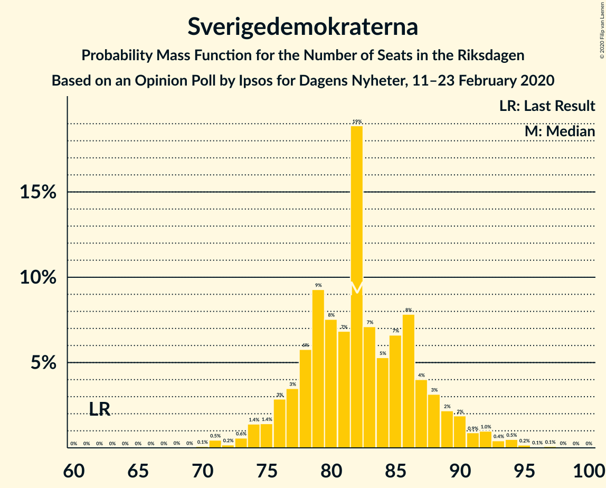
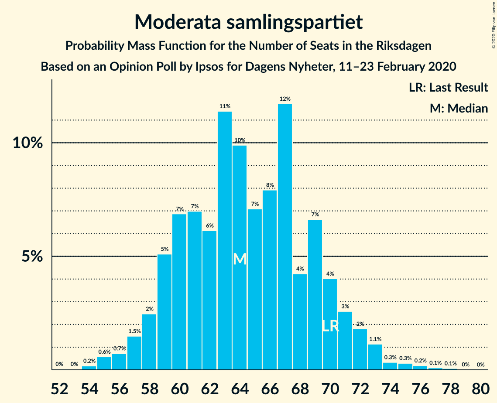
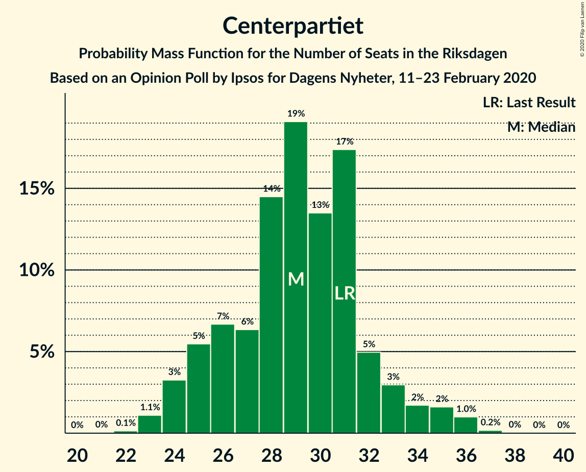
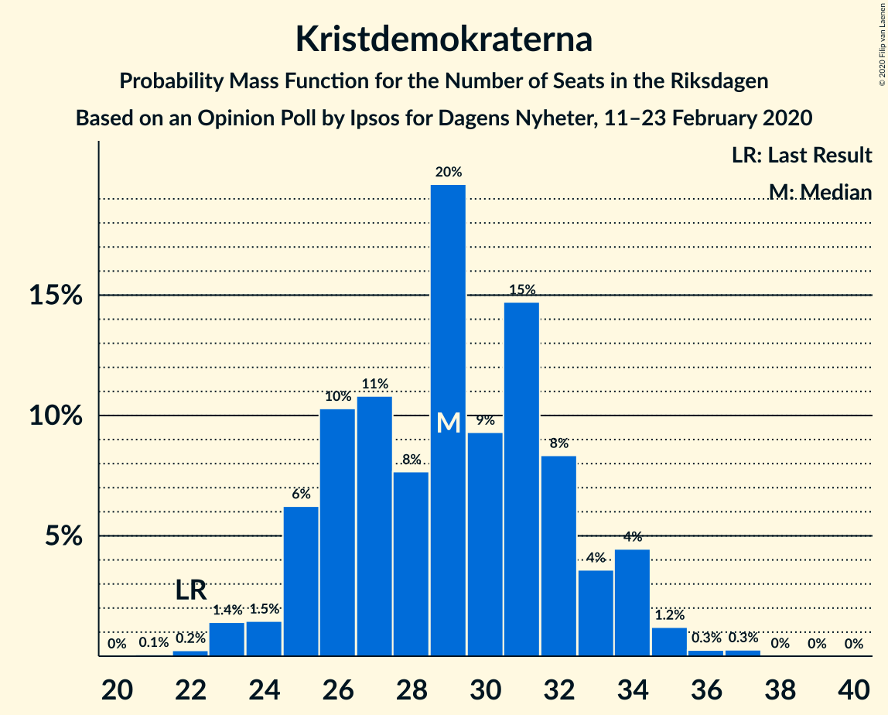
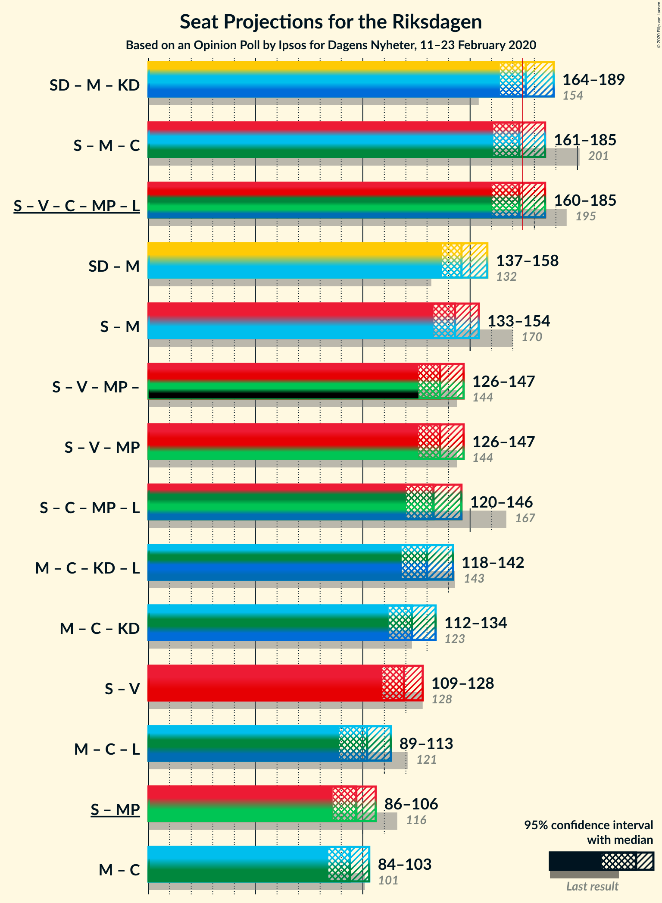
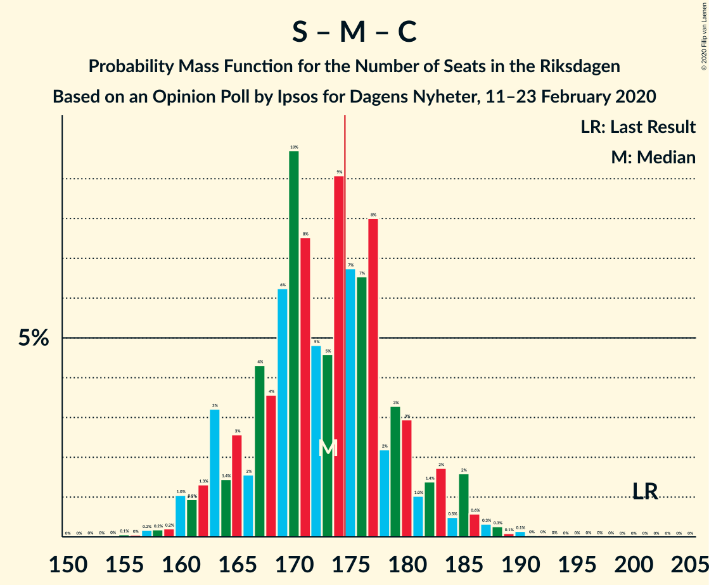
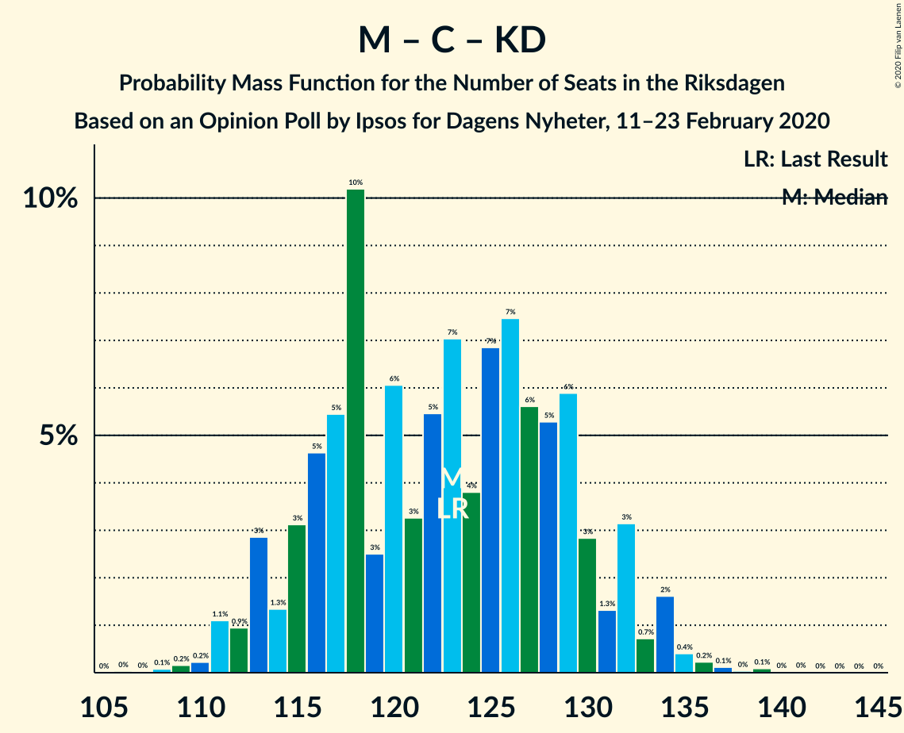
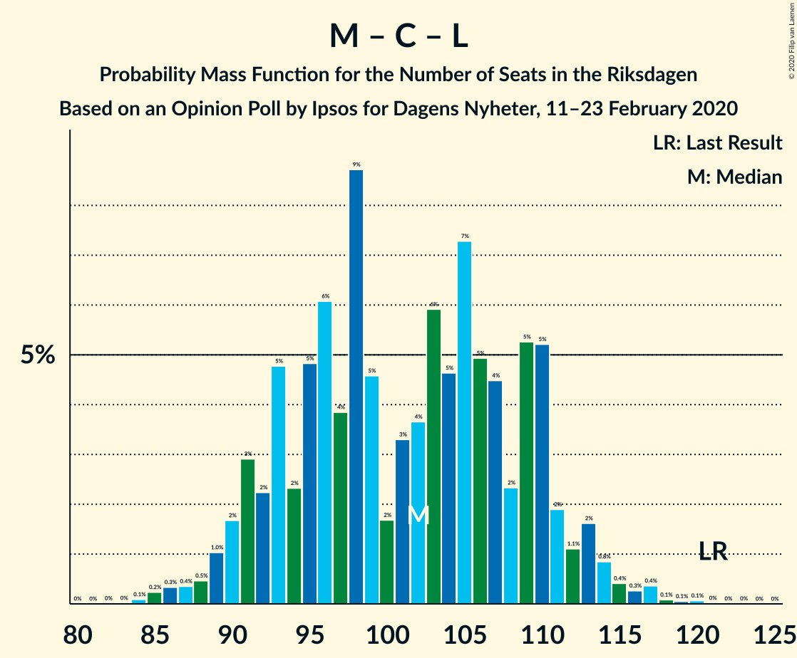

# Opinion Poll by Ipsos for Dagens Nyheter, 11–23 February 2020

<a href="#voting-intentions">Voting Intentions</a> | <a href="#seats">Seats</a> | <a href="#coalitions">Coalitions</a> | <a href="#technical-information">Technical Information</a>

## Voting Intentions

### Confidence Intervals

| Party | Last Result | Poll Result | 80% Confidence Interval | 90% Confidence Interval | 95% Confidence Interval | 99% Confidence Interval |
|:-----:|:-----------:|:-----------:|:-----------------------:|:-----------------------:|:-----------------------:|:-----------------------:|
| Sverigedemokraterna | 17.5% | 23.0% | 21.7–24.4% |21.3–24.8% |21.0–25.2% |20.3–25.9% |
| Sveriges socialdemokratiska arbetareparti | 28.3% | 22.0% | 20.7–23.4% |20.3–23.8% |20.0–24.2% |19.4–24.9% |
| Moderata samlingspartiet | 19.8% | 18.0% | 16.8–19.3% |16.4–19.7% |16.1–20.0% |15.6–20.6% |
| Vänsterpartiet | 8.0% | 11.0% | 10.0–12.1% |9.8–12.4% |9.5–12.7% |9.1–13.2% |
| Centerpartiet | 8.6% | 8.0% | 7.2–9.0% |7.0–9.3% |6.8–9.5% |6.4–10.0% |
| Kristdemokraterna | 6.3% | 8.0% | 7.2–9.0% |7.0–9.3% |6.8–9.5% |6.4–10.0% |
| Miljöpartiet de gröna | 4.4% | 5.0% | 4.4–5.8% |4.2–6.0% |4.0–6.2% |3.7–6.6% |
| Liberalerna | 5.5% | 4.0% | 3.4–4.7% |3.2–4.9% |3.1–5.1% |2.9–5.4% |

*Note:* The poll result column reflects the actual value used in the calculations. Published results may vary slightly, and in addition be rounded to fewer digits.

## Seats

### Confidence Intervals

| Party | Last Result | Median | 80% Confidence Interval | 90% Confidence Interval | 95% Confidence Interval | 99% Confidence Interval |
|:-----:|:-----------:|:------:|:-----------------------:|:-----------------------:|:-----------------------:|:-----------------------:|
| <a href="#sverigedemokraterna">Sverigedemokraterna</a> | 62 | 80 | 76–88 |76–89 |75–92 |73–93 |
| <a href="#sveriges-socialdemokratiska-arbetareparti">Sveriges socialdemokratiska arbetareparti</a> | 100 | 78 | 74–84 |73–86 |71–88 |70–89 |
| <a href="#moderata-samlingspartiet">Moderata samlingspartiet</a> | 70 | 64 | 60–69 |58–70 |56–71 |55–74 |
| <a href="#vänsterpartiet">Vänsterpartiet</a> | 28 | 39 | 36–44 |35–45 |34–46 |33–47 |
| <a href="#centerpartiet">Centerpartiet</a> | 31 | 30 | 26–33 |26–34 |24–36 |23–36 |
| <a href="#kristdemokraterna">Kristdemokraterna</a> | 22 | 30 | 27–32 |26–32 |25–34 |23–35 |
| <a href="#miljöpartiet-de-gröna">Miljöpartiet de gröna</a> | 16 | 17 | 15–20 |15–22 |0–22 |0–23 |
| <a href="#liberalerna">Liberalerna</a> | 20 | 14 | 0–18 |0–18 |0–18 |0–19 |

### Sverigedemokraterna

*For a full overview of the results for this party, see the [Sverigedemokraterna](party-sverigedemokraterna.html) page.*

| Number of Seats | Probability | Accumulated | Special Marks |
|:---------------:|:-----------:|:-----------:|:-------------:|
| 62 | 0% | 100% | Last Result |
| 63 | 0% | 100% |  |
| 64 | 0% | 100% |  |
| 65 | 0% | 100% |  |
| 66 | 0% | 100% |  |
| 67 | 0% | 100% |  |
| 68 | 0% | 100% |  |
| 69 | 0% | 99.9% |  |
| 70 | 0.1% | 99.9% |  |
| 71 | 0.2% | 99.9% |  |
| 72 | 0% | 99.7% |  |
| 73 | 1.4% | 99.7% |  |
| 74 | 0.4% | 98% |  |
| 75 | 0.6% | 98% |  |
| 76 | 10% | 97% |  |
| 77 | 2% | 87% |  |
| 78 | 4% | 85% |  |
| 79 | 13% | 80% |  |
| 80 | 25% | 68% | Median |
| 81 | 5% | 43% |  |
| 82 | 3% | 38% |  |
| 83 | 3% | 34% |  |
| 84 | 4% | 32% |  |
| 85 | 3% | 28% |  |
| 86 | 5% | 25% |  |
| 87 | 2% | 20% |  |
| 88 | 9% | 19% |  |
| 89 | 5% | 9% |  |
| 90 | 0.7% | 5% |  |
| 91 | 1.4% | 4% |  |
| 92 | 2% | 3% |  |
| 93 | 0.4% | 0.8% |  |
| 94 | 0% | 0.4% |  |
| 95 | 0.3% | 0.4% |  |
| 96 | 0.1% | 0.1% |  |
| 97 | 0% | 0% |  |

### Sveriges socialdemokratiska arbetareparti

*For a full overview of the results for this party, see the [Sveriges socialdemokratiska arbetareparti](party-sverigessocialdemokratiskaarbetareparti.html) page.*

| Number of Seats | Probability | Accumulated | Special Marks |
|:---------------:|:-----------:|:-----------:|:-------------:|
| 66 | 0% | 100% |  |
| 67 | 0.1% | 99.9% |  |
| 68 | 0.1% | 99.9% |  |
| 69 | 0.2% | 99.7% |  |
| 70 | 2% | 99.5% |  |
| 71 | 1.1% | 98% |  |
| 72 | 2% | 97% |  |
| 73 | 2% | 95% |  |
| 74 | 20% | 93% |  |
| 75 | 2% | 73% |  |
| 76 | 14% | 70% |  |
| 77 | 5% | 56% |  |
| 78 | 5% | 51% | Median |
| 79 | 10% | 46% |  |
| 80 | 4% | 36% |  |
| 81 | 6% | 32% |  |
| 82 | 6% | 26% |  |
| 83 | 7% | 19% |  |
| 84 | 3% | 12% |  |
| 85 | 3% | 9% |  |
| 86 | 1.0% | 6% |  |
| 87 | 0.9% | 5% |  |
| 88 | 2% | 4% |  |
| 89 | 1.3% | 2% |  |
| 90 | 0.1% | 0.5% |  |
| 91 | 0.2% | 0.4% |  |
| 92 | 0.1% | 0.2% |  |
| 93 | 0.1% | 0.1% |  |
| 94 | 0% | 0% |  |
| 95 | 0% | 0% |  |
| 96 | 0% | 0% |  |
| 97 | 0% | 0% |  |
| 98 | 0% | 0% |  |
| 99 | 0% | 0% |  |
| 100 | 0% | 0% | Last Result |

### Moderata samlingspartiet

*For a full overview of the results for this party, see the [Moderata samlingspartiet](party-moderatasamlingspartiet.html) page.*

| Number of Seats | Probability | Accumulated | Special Marks |
|:---------------:|:-----------:|:-----------:|:-------------:|
| 52 | 0.1% | 100% |  |
| 53 | 0% | 99.9% |  |
| 54 | 0.1% | 99.9% |  |
| 55 | 1.3% | 99.8% |  |
| 56 | 1.2% | 98.5% |  |
| 57 | 1.1% | 97% |  |
| 58 | 3% | 96% |  |
| 59 | 2% | 93% |  |
| 60 | 4% | 92% |  |
| 61 | 4% | 88% |  |
| 62 | 15% | 84% |  |
| 63 | 15% | 69% |  |
| 64 | 6% | 54% | Median |
| 65 | 4% | 48% |  |
| 66 | 25% | 44% |  |
| 67 | 5% | 19% |  |
| 68 | 1.5% | 14% |  |
| 69 | 4% | 12% |  |
| 70 | 5% | 9% | Last Result |
| 71 | 2% | 4% |  |
| 72 | 0.6% | 2% |  |
| 73 | 0.3% | 0.9% |  |
| 74 | 0.2% | 0.6% |  |
| 75 | 0.3% | 0.4% |  |
| 76 | 0.1% | 0.2% |  |
| 77 | 0.1% | 0.1% |  |
| 78 | 0% | 0% |  |

### Vänsterpartiet

*For a full overview of the results for this party, see the [Vänsterpartiet](party-vänsterpartiet.html) page.*

| Number of Seats | Probability | Accumulated | Special Marks |
|:---------------:|:-----------:|:-----------:|:-------------:|
| 28 | 0% | 100% | Last Result |
| 29 | 0% | 100% |  |
| 30 | 0% | 100% |  |
| 31 | 0.1% | 100% |  |
| 32 | 0.3% | 99.8% |  |
| 33 | 0.5% | 99.6% |  |
| 34 | 4% | 99.0% |  |
| 35 | 5% | 95% |  |
| 36 | 2% | 91% |  |
| 37 | 16% | 88% |  |
| 38 | 8% | 72% |  |
| 39 | 24% | 64% | Median |
| 40 | 7% | 40% |  |
| 41 | 12% | 33% |  |
| 42 | 4% | 21% |  |
| 43 | 4% | 17% |  |
| 44 | 8% | 13% |  |
| 45 | 1.3% | 5% |  |
| 46 | 3% | 4% |  |
| 47 | 0.3% | 0.7% |  |
| 48 | 0.2% | 0.4% |  |
| 49 | 0.1% | 0.2% |  |
| 50 | 0.1% | 0.1% |  |
| 51 | 0% | 0% |  |

### Centerpartiet

*For a full overview of the results for this party, see the [Centerpartiet](party-centerpartiet.html) page.*

| Number of Seats | Probability | Accumulated | Special Marks |
|:---------------:|:-----------:|:-----------:|:-------------:|
| 22 | 0.1% | 100% |  |
| 23 | 0.6% | 99.9% |  |
| 24 | 3% | 99.2% |  |
| 25 | 1.1% | 96% |  |
| 26 | 8% | 95% |  |
| 27 | 6% | 87% |  |
| 28 | 15% | 82% |  |
| 29 | 15% | 67% |  |
| 30 | 23% | 51% | Median |
| 31 | 12% | 29% | Last Result |
| 32 | 7% | 17% |  |
| 33 | 3% | 10% |  |
| 34 | 4% | 7% |  |
| 35 | 0.6% | 3% |  |
| 36 | 3% | 3% |  |
| 37 | 0.2% | 0.2% |  |
| 38 | 0% | 0% |  |

### Kristdemokraterna

*For a full overview of the results for this party, see the [Kristdemokraterna](party-kristdemokraterna.html) page.*

| Number of Seats | Probability | Accumulated | Special Marks |
|:---------------:|:-----------:|:-----------:|:-------------:|
| 21 | 0.1% | 100% |  |
| 22 | 0.1% | 99.8% | Last Result |
| 23 | 1.3% | 99.7% |  |
| 24 | 0.4% | 98% |  |
| 25 | 1.1% | 98% |  |
| 26 | 6% | 97% |  |
| 27 | 1.4% | 91% |  |
| 28 | 12% | 90% |  |
| 29 | 15% | 78% |  |
| 30 | 27% | 63% | Median |
| 31 | 15% | 36% |  |
| 32 | 17% | 21% |  |
| 33 | 2% | 5% |  |
| 34 | 2% | 3% |  |
| 35 | 0.3% | 0.5% |  |
| 36 | 0.1% | 0.2% |  |
| 37 | 0.1% | 0.1% |  |
| 38 | 0% | 0.1% |  |
| 39 | 0% | 0% |  |

### Miljöpartiet de gröna

*For a full overview of the results for this party, see the [Miljöpartiet de gröna](party-miljöpartietdegröna.html) page.*

| Number of Seats | Probability | Accumulated | Special Marks |
|:---------------:|:-----------:|:-----------:|:-------------:|
| 0 | 5% | 100% |  |
| 1 | 0% | 95% |  |
| 2 | 0% | 95% |  |
| 3 | 0% | 95% |  |
| 4 | 0% | 95% |  |
| 5 | 0% | 95% |  |
| 6 | 0% | 95% |  |
| 7 | 0% | 95% |  |
| 8 | 0% | 95% |  |
| 9 | 0% | 95% |  |
| 10 | 0% | 95% |  |
| 11 | 0% | 95% |  |
| 12 | 0% | 95% |  |
| 13 | 0% | 95% |  |
| 14 | 0.1% | 95% |  |
| 15 | 8% | 95% |  |
| 16 | 34% | 87% | Last Result |
| 17 | 15% | 54% | Median |
| 18 | 14% | 39% |  |
| 19 | 8% | 25% |  |
| 20 | 9% | 17% |  |
| 21 | 3% | 8% |  |
| 22 | 4% | 5% |  |
| 23 | 1.1% | 1.5% |  |
| 24 | 0.2% | 0.4% |  |
| 25 | 0.1% | 0.2% |  |
| 26 | 0% | 0% |  |

### Liberalerna

*For a full overview of the results for this party, see the [Liberalerna](party-liberalerna.html) page.*

| Number of Seats | Probability | Accumulated | Special Marks |
|:---------------:|:-----------:|:-----------:|:-------------:|
| 0 | 40% | 100% |  |
| 1 | 0% | 60% |  |
| 2 | 0% | 60% |  |
| 3 | 0% | 60% |  |
| 4 | 0% | 60% |  |
| 5 | 0% | 60% |  |
| 6 | 0% | 60% |  |
| 7 | 0% | 60% |  |
| 8 | 0% | 60% |  |
| 9 | 0% | 60% |  |
| 10 | 0% | 60% |  |
| 11 | 0% | 60% |  |
| 12 | 0% | 60% |  |
| 13 | 0% | 60% |  |
| 14 | 22% | 60% | Median |
| 15 | 15% | 38% |  |
| 16 | 7% | 23% |  |
| 17 | 4% | 16% |  |
| 18 | 11% | 12% |  |
| 19 | 0.5% | 0.7% |  |
| 20 | 0.1% | 0.2% | Last Result |
| 21 | 0% | 0% |  |

## Coalitions

### Confidence Intervals

| Coalition | Last Result | Median | Majority? | 80% Confidence Interval | 90% Confidence Interval | 95% Confidence Interval | 99% Confidence Interval |
|:---------:|:-----------:|:------:|:---------:|:-----------------------:|:-----------------------:|:-----------------------:|:-----------------------:|
| Sverigedemokraterna – Moderata samlingspartiet – Kristdemokraterna | 154 | 176 | 59% | 170–185 | 166–189 | 164–190 | 162–192 |
| Sveriges socialdemokratiska arbetareparti – Moderata samlingspartiet – Centerpartiet | 201 | 170 | 32% | 166–181 | 163–185 | 160–185 | 157–187 |
| Sveriges socialdemokratiska arbetareparti – Vänsterpartiet – Centerpartiet – Miljöpartiet de gröna – Liberalerna | 195 | 173 | 41% | 164–179 | 160–183 | 159–185 | 157–187 |
| Sverigedemokraterna – Moderata samlingspartiet | 132 | 146 | 0% | 139–155 | 138–158 | 136–158 | 133–162 |
| Sveriges socialdemokratiska arbetareparti – Moderata samlingspartiet | 170 | 141 | 0% | 137–150 | 134–153 | 133–156 | 131–157 |
| Sveriges socialdemokratiska arbetareparti – Vänsterpartiet – Miljöpartiet de gröna | 144 | 135 | 0% | 128–143 | 126–145 | 125–146 | 121–149 |
| Sveriges socialdemokratiska arbetareparti – Centerpartiet – Miljöpartiet de gröna – Liberalerna | 167 | 134 | 0% | 125–142 | 120–144 | 115–145 | 115–150 |
| Moderata samlingspartiet – Centerpartiet – Kristdemokraterna – Liberalerna | 143 | 135 | 0% | 123–140 | 121–140 | 119–142 | 117–146 |
| Moderata samlingspartiet – Centerpartiet – Kristdemokraterna | 123 | 123 | 0% | 117–129 | 115–133 | 113–134 | 109–135 |
| Sveriges socialdemokratiska arbetareparti – Vänsterpartiet | 128 | 117 | 0% | 113–127 | 109–128 | 108–128 | 106–130 |
| Moderata samlingspartiet – Centerpartiet – Liberalerna | 121 | 105 | 0% | 92–110 | 91–112 | 88–113 | 86–117 |
| Sveriges socialdemokratiska arbetareparti – Miljöpartiet de gröna | 116 | 95 | 0% | 90–103 | 87–104 | 83–107 | 81–109 |
| Moderata samlingspartiet – Centerpartiet | 101 | 93 | 0% | 88–99 | 86–102 | 85–104 | 83–105 |

### Sverigedemokraterna – Moderata samlingspartiet – Kristdemokraterna

| Number of Seats | Probability | Accumulated | Special Marks |
|:---------------:|:-----------:|:-----------:|:-------------:|
| 154 | 0% | 100% | Last Result |
| 155 | 0% | 100% |  |
| 156 | 0% | 100% |  |
| 157 | 0% | 100% |  |
| 158 | 0% | 100% |  |
| 159 | 0% | 99.9% |  |
| 160 | 0% | 99.9% |  |
| 161 | 0.1% | 99.9% |  |
| 162 | 0.8% | 99.7% |  |
| 163 | 0.2% | 98.9% |  |
| 164 | 2% | 98.7% |  |
| 165 | 1.4% | 97% |  |
| 166 | 1.1% | 96% |  |
| 167 | 2% | 94% |  |
| 168 | 0.5% | 93% |  |
| 169 | 0.5% | 92% |  |
| 170 | 10% | 92% |  |
| 171 | 12% | 82% |  |
| 172 | 2% | 70% |  |
| 173 | 8% | 67% |  |
| 174 | 0.7% | 59% | Median |
| 175 | 1.4% | 59% | Majority |
| 176 | 25% | 57% |  |
| 177 | 4% | 33% |  |
| 178 | 0.9% | 28% |  |
| 179 | 2% | 27% |  |
| 180 | 6% | 26% |  |
| 181 | 1.3% | 20% |  |
| 182 | 3% | 18% |  |
| 183 | 3% | 15% |  |
| 184 | 1.0% | 12% |  |
| 185 | 2% | 11% |  |
| 186 | 3% | 10% |  |
| 187 | 1.1% | 7% |  |
| 188 | 0.2% | 5% |  |
| 189 | 0.4% | 5% |  |
| 190 | 4% | 5% |  |
| 191 | 0% | 0.8% |  |
| 192 | 0.4% | 0.8% |  |
| 193 | 0.3% | 0.3% |  |
| 194 | 0% | 0.1% |  |
| 195 | 0% | 0.1% |  |
| 196 | 0% | 0% |  |

### Sveriges socialdemokratiska arbetareparti – Moderata samlingspartiet – Centerpartiet

| Number of Seats | Probability | Accumulated | Special Marks |
|:---------------:|:-----------:|:-----------:|:-------------:|
| 155 | 0% | 100% |  |
| 156 | 0.1% | 99.9% |  |
| 157 | 0.5% | 99.9% |  |
| 158 | 0.2% | 99.4% |  |
| 159 | 0.1% | 99.3% |  |
| 160 | 2% | 99.2% |  |
| 161 | 2% | 97% |  |
| 162 | 0.2% | 95% |  |
| 163 | 1.3% | 95% |  |
| 164 | 2% | 94% |  |
| 165 | 2% | 92% |  |
| 166 | 1.0% | 91% |  |
| 167 | 13% | 90% |  |
| 168 | 0.7% | 76% |  |
| 169 | 3% | 76% |  |
| 170 | 30% | 73% |  |
| 171 | 2% | 43% |  |
| 172 | 4% | 42% | Median |
| 173 | 4% | 38% |  |
| 174 | 3% | 34% |  |
| 175 | 10% | 32% | Majority |
| 176 | 1.0% | 22% |  |
| 177 | 5% | 21% |  |
| 178 | 1.0% | 16% |  |
| 179 | 0.5% | 15% |  |
| 180 | 3% | 15% |  |
| 181 | 2% | 12% |  |
| 182 | 1.0% | 10% |  |
| 183 | 3% | 9% |  |
| 184 | 0.2% | 6% |  |
| 185 | 5% | 6% |  |
| 186 | 0.2% | 0.8% |  |
| 187 | 0.2% | 0.6% |  |
| 188 | 0% | 0.3% |  |
| 189 | 0.2% | 0.3% |  |
| 190 | 0% | 0.1% |  |
| 191 | 0% | 0.1% |  |
| 192 | 0% | 0% |  |
| 193 | 0% | 0% |  |
| 194 | 0% | 0% |  |
| 195 | 0% | 0% |  |
| 196 | 0% | 0% |  |
| 197 | 0% | 0% |  |
| 198 | 0% | 0% |  |
| 199 | 0% | 0% |  |
| 200 | 0% | 0% |  |
| 201 | 0% | 0% | Last Result |

### Sveriges socialdemokratiska arbetareparti – Vänsterpartiet – Centerpartiet – Miljöpartiet de gröna – Liberalerna

| Number of Seats | Probability | Accumulated | Special Marks |
|:---------------:|:-----------:|:-----------:|:-------------:|
| 154 | 0% | 100% |  |
| 155 | 0% | 99.9% |  |
| 156 | 0.3% | 99.9% |  |
| 157 | 0.4% | 99.7% |  |
| 158 | 0% | 99.2% |  |
| 159 | 4% | 99.2% |  |
| 160 | 0.4% | 95% |  |
| 161 | 0.2% | 95% |  |
| 162 | 1.1% | 95% |  |
| 163 | 3% | 93% |  |
| 164 | 2% | 90% |  |
| 165 | 1.0% | 89% |  |
| 166 | 3% | 88% |  |
| 167 | 3% | 85% |  |
| 168 | 1.3% | 82% |  |
| 169 | 6% | 80% |  |
| 170 | 2% | 74% |  |
| 171 | 0.9% | 73% |  |
| 172 | 4% | 72% |  |
| 173 | 25% | 67% |  |
| 174 | 1.4% | 43% |  |
| 175 | 0.7% | 41% | Majority |
| 176 | 8% | 41% |  |
| 177 | 2% | 33% |  |
| 178 | 12% | 30% | Median |
| 179 | 10% | 18% |  |
| 180 | 0.5% | 8% |  |
| 181 | 0.5% | 8% |  |
| 182 | 2% | 7% |  |
| 183 | 1.1% | 6% |  |
| 184 | 1.4% | 4% |  |
| 185 | 2% | 3% |  |
| 186 | 0.2% | 1.3% |  |
| 187 | 0.8% | 1.1% |  |
| 188 | 0.1% | 0.3% |  |
| 189 | 0% | 0.1% |  |
| 190 | 0% | 0.1% |  |
| 191 | 0% | 0.1% |  |
| 192 | 0% | 0% |  |
| 193 | 0% | 0% |  |
| 194 | 0% | 0% |  |
| 195 | 0% | 0% | Last Result |

### Sverigedemokraterna – Moderata samlingspartiet

| Number of Seats | Probability | Accumulated | Special Marks |
|:---------------:|:-----------:|:-----------:|:-------------:|
| 131 | 0.1% | 100% |  |
| 132 | 0% | 99.9% | Last Result |
| 133 | 0.9% | 99.8% |  |
| 134 | 0.2% | 99.0% |  |
| 135 | 0.1% | 98.7% |  |
| 136 | 1.2% | 98.6% |  |
| 137 | 1.1% | 97% |  |
| 138 | 2% | 96% |  |
| 139 | 10% | 95% |  |
| 140 | 2% | 84% |  |
| 141 | 11% | 82% |  |
| 142 | 5% | 72% |  |
| 143 | 4% | 66% |  |
| 144 | 1.5% | 62% | Median |
| 145 | 3% | 61% |  |
| 146 | 22% | 58% |  |
| 147 | 3% | 36% |  |
| 148 | 5% | 33% |  |
| 149 | 3% | 28% |  |
| 150 | 3% | 25% |  |
| 151 | 3% | 23% |  |
| 152 | 3% | 19% |  |
| 153 | 4% | 16% |  |
| 154 | 0.5% | 12% |  |
| 155 | 4% | 12% |  |
| 156 | 0.8% | 8% |  |
| 157 | 1.5% | 7% |  |
| 158 | 4% | 5% |  |
| 159 | 0.1% | 2% |  |
| 160 | 0.4% | 1.5% |  |
| 161 | 0.2% | 1.0% |  |
| 162 | 0.3% | 0.8% |  |
| 163 | 0.4% | 0.5% |  |
| 164 | 0% | 0.1% |  |
| 165 | 0% | 0% |  |

### Sveriges socialdemokratiska arbetareparti – Moderata samlingspartiet

| Number of Seats | Probability | Accumulated | Special Marks |
|:---------------:|:-----------:|:-----------:|:-------------:|
| 126 | 0.1% | 100% |  |
| 127 | 0% | 99.9% |  |
| 128 | 0% | 99.9% |  |
| 129 | 0.2% | 99.8% |  |
| 130 | 0.1% | 99.6% |  |
| 131 | 0.6% | 99.6% |  |
| 132 | 1.3% | 99.0% |  |
| 133 | 3% | 98% |  |
| 134 | 2% | 95% |  |
| 135 | 1.1% | 94% |  |
| 136 | 0.9% | 92% |  |
| 137 | 2% | 92% |  |
| 138 | 2% | 89% |  |
| 139 | 13% | 88% |  |
| 140 | 23% | 75% |  |
| 141 | 12% | 52% |  |
| 142 | 1.1% | 41% | Median |
| 143 | 4% | 39% |  |
| 144 | 5% | 36% |  |
| 145 | 3% | 31% |  |
| 146 | 2% | 28% |  |
| 147 | 6% | 26% |  |
| 148 | 5% | 20% |  |
| 149 | 4% | 15% |  |
| 150 | 3% | 11% |  |
| 151 | 0.5% | 8% |  |
| 152 | 0.4% | 8% |  |
| 153 | 4% | 7% |  |
| 154 | 0.3% | 4% |  |
| 155 | 0.1% | 3% |  |
| 156 | 0.9% | 3% |  |
| 157 | 2% | 2% |  |
| 158 | 0.2% | 0.4% |  |
| 159 | 0% | 0.1% |  |
| 160 | 0% | 0.1% |  |
| 161 | 0% | 0.1% |  |
| 162 | 0% | 0% |  |
| 163 | 0% | 0% |  |
| 164 | 0% | 0% |  |
| 165 | 0% | 0% |  |
| 166 | 0% | 0% |  |
| 167 | 0% | 0% |  |
| 168 | 0% | 0% |  |
| 169 | 0% | 0% |  |
| 170 | 0% | 0% | Last Result |

### Sveriges socialdemokratiska arbetareparti – Vänsterpartiet – Miljöpartiet de gröna

| Number of Seats | Probability | Accumulated | Special Marks |
|:---------------:|:-----------:|:-----------:|:-------------:|
| 111 | 0.1% | 100% |  |
| 112 | 0% | 99.9% |  |
| 113 | 0% | 99.9% |  |
| 114 | 0% | 99.8% |  |
| 115 | 0% | 99.8% |  |
| 116 | 0% | 99.8% |  |
| 117 | 0% | 99.8% |  |
| 118 | 0% | 99.8% |  |
| 119 | 0.2% | 99.8% |  |
| 120 | 0% | 99.5% |  |
| 121 | 0.1% | 99.5% |  |
| 122 | 0.1% | 99.4% |  |
| 123 | 0.3% | 99.3% |  |
| 124 | 1.5% | 99.0% |  |
| 125 | 0.3% | 98% |  |
| 126 | 2% | 97% |  |
| 127 | 4% | 95% |  |
| 128 | 2% | 91% |  |
| 129 | 19% | 89% |  |
| 130 | 1.3% | 69% |  |
| 131 | 2% | 68% |  |
| 132 | 11% | 66% |  |
| 133 | 3% | 55% |  |
| 134 | 2% | 52% | Median |
| 135 | 12% | 51% |  |
| 136 | 4% | 39% |  |
| 137 | 8% | 34% |  |
| 138 | 4% | 26% |  |
| 139 | 1.0% | 22% |  |
| 140 | 0.7% | 21% |  |
| 141 | 6% | 21% |  |
| 142 | 4% | 15% |  |
| 143 | 3% | 11% |  |
| 144 | 0.3% | 8% | Last Result |
| 145 | 4% | 8% |  |
| 146 | 1.2% | 3% |  |
| 147 | 1.1% | 2% |  |
| 148 | 0.2% | 1.0% |  |
| 149 | 0.4% | 0.8% |  |
| 150 | 0.1% | 0.4% |  |
| 151 | 0.2% | 0.2% |  |
| 152 | 0.1% | 0.1% |  |
| 153 | 0% | 0% |  |

### Sveriges socialdemokratiska arbetareparti – Centerpartiet – Miljöpartiet de gröna – Liberalerna

| Number of Seats | Probability | Accumulated | Special Marks |
|:---------------:|:-----------:|:-----------:|:-------------:|
| 112 | 0% | 100% |  |
| 113 | 0% | 99.9% |  |
| 114 | 0% | 99.9% |  |
| 115 | 4% | 99.9% |  |
| 116 | 0.1% | 96% |  |
| 117 | 0% | 96% |  |
| 118 | 0.6% | 96% |  |
| 119 | 0.3% | 95% |  |
| 120 | 0.6% | 95% |  |
| 121 | 1.1% | 95% |  |
| 122 | 0.5% | 93% |  |
| 123 | 2% | 93% |  |
| 124 | 0.2% | 91% |  |
| 125 | 3% | 91% |  |
| 126 | 4% | 88% |  |
| 127 | 0.2% | 85% |  |
| 128 | 2% | 84% |  |
| 129 | 5% | 82% |  |
| 130 | 4% | 77% |  |
| 131 | 4% | 73% |  |
| 132 | 3% | 69% |  |
| 133 | 3% | 66% |  |
| 134 | 22% | 63% |  |
| 135 | 3% | 41% |  |
| 136 | 2% | 38% |  |
| 137 | 10% | 36% |  |
| 138 | 2% | 26% |  |
| 139 | 1.4% | 23% | Median |
| 140 | 2% | 22% |  |
| 141 | 3% | 20% |  |
| 142 | 9% | 17% |  |
| 143 | 2% | 8% |  |
| 144 | 2% | 6% |  |
| 145 | 3% | 4% |  |
| 146 | 0.2% | 2% |  |
| 147 | 0.6% | 1.4% |  |
| 148 | 0.2% | 0.9% |  |
| 149 | 0.1% | 0.6% |  |
| 150 | 0.3% | 0.5% |  |
| 151 | 0.1% | 0.2% |  |
| 152 | 0% | 0.1% |  |
| 153 | 0% | 0% |  |
| 154 | 0% | 0% |  |
| 155 | 0% | 0% |  |
| 156 | 0% | 0% |  |
| 157 | 0% | 0% |  |
| 158 | 0% | 0% |  |
| 159 | 0% | 0% |  |
| 160 | 0% | 0% |  |
| 161 | 0% | 0% |  |
| 162 | 0% | 0% |  |
| 163 | 0% | 0% |  |
| 164 | 0% | 0% |  |
| 165 | 0% | 0% |  |
| 166 | 0% | 0% |  |
| 167 | 0% | 0% | Last Result |

### Moderata samlingspartiet – Centerpartiet – Kristdemokraterna – Liberalerna

| Number of Seats | Probability | Accumulated | Special Marks |
|:---------------:|:-----------:|:-----------:|:-------------:|
| 112 | 0% | 100% |  |
| 113 | 0% | 99.9% |  |
| 114 | 0% | 99.9% |  |
| 115 | 0.3% | 99.9% |  |
| 116 | 0.1% | 99.6% |  |
| 117 | 1.5% | 99.5% |  |
| 118 | 0.2% | 98% |  |
| 119 | 1.4% | 98% |  |
| 120 | 1.0% | 96% |  |
| 121 | 2% | 95% |  |
| 122 | 1.3% | 93% |  |
| 123 | 5% | 92% |  |
| 124 | 7% | 87% |  |
| 125 | 5% | 80% |  |
| 126 | 2% | 75% |  |
| 127 | 4% | 73% |  |
| 128 | 1.1% | 69% |  |
| 129 | 3% | 68% |  |
| 130 | 1.1% | 65% |  |
| 131 | 3% | 64% |  |
| 132 | 2% | 61% |  |
| 133 | 2% | 58% |  |
| 134 | 5% | 56% |  |
| 135 | 3% | 52% |  |
| 136 | 4% | 49% |  |
| 137 | 0.8% | 45% |  |
| 138 | 18% | 44% | Median |
| 139 | 3% | 27% |  |
| 140 | 19% | 24% |  |
| 141 | 1.5% | 4% |  |
| 142 | 0.8% | 3% |  |
| 143 | 0.1% | 2% | Last Result |
| 144 | 0.4% | 2% |  |
| 145 | 0.6% | 2% |  |
| 146 | 0.7% | 1.1% |  |
| 147 | 0.1% | 0.4% |  |
| 148 | 0.1% | 0.3% |  |
| 149 | 0% | 0.2% |  |
| 150 | 0% | 0.2% |  |
| 151 | 0.1% | 0.2% |  |
| 152 | 0% | 0% |  |

### Moderata samlingspartiet – Centerpartiet – Kristdemokraterna

| Number of Seats | Probability | Accumulated | Special Marks |
|:---------------:|:-----------:|:-----------:|:-------------:|
| 108 | 0.1% | 100% |  |
| 109 | 0.5% | 99.8% |  |
| 110 | 0.3% | 99.3% |  |
| 111 | 1.1% | 99.1% |  |
| 112 | 0.4% | 98% |  |
| 113 | 1.2% | 98% |  |
| 114 | 0.9% | 96% |  |
| 115 | 3% | 95% |  |
| 116 | 0.5% | 93% |  |
| 117 | 3% | 92% |  |
| 118 | 3% | 89% |  |
| 119 | 2% | 87% |  |
| 120 | 10% | 85% |  |
| 121 | 4% | 74% |  |
| 122 | 6% | 70% |  |
| 123 | 14% | 64% | Last Result |
| 124 | 7% | 49% | Median |
| 125 | 5% | 43% |  |
| 126 | 20% | 38% |  |
| 127 | 4% | 17% |  |
| 128 | 0.7% | 13% |  |
| 129 | 2% | 12% |  |
| 130 | 0.8% | 10% |  |
| 131 | 2% | 9% |  |
| 132 | 2% | 7% |  |
| 133 | 0.8% | 6% |  |
| 134 | 4% | 5% |  |
| 135 | 0.4% | 0.8% |  |
| 136 | 0.2% | 0.4% |  |
| 137 | 0.1% | 0.2% |  |
| 138 | 0% | 0.1% |  |
| 139 | 0.1% | 0.1% |  |
| 140 | 0% | 0% |  |

### Sveriges socialdemokratiska arbetareparti – Vänsterpartiet

| Number of Seats | Probability | Accumulated | Special Marks |
|:---------------:|:-----------:|:-----------:|:-------------:|
| 102 | 0.1% | 100% |  |
| 103 | 0% | 99.9% |  |
| 104 | 0.1% | 99.9% |  |
| 105 | 0.1% | 99.9% |  |
| 106 | 0.5% | 99.8% |  |
| 107 | 0.6% | 99.3% |  |
| 108 | 2% | 98.7% |  |
| 109 | 2% | 96% |  |
| 110 | 1.4% | 95% |  |
| 111 | 0.6% | 93% |  |
| 112 | 1.4% | 93% |  |
| 113 | 21% | 91% |  |
| 114 | 4% | 70% |  |
| 115 | 3% | 67% |  |
| 116 | 11% | 64% |  |
| 117 | 10% | 53% | Median |
| 118 | 4% | 42% |  |
| 119 | 3% | 38% |  |
| 120 | 8% | 35% |  |
| 121 | 3% | 27% |  |
| 122 | 2% | 24% |  |
| 123 | 5% | 22% |  |
| 124 | 0.5% | 17% |  |
| 125 | 4% | 16% |  |
| 126 | 3% | 13% |  |
| 127 | 5% | 10% |  |
| 128 | 3% | 5% | Last Result |
| 129 | 1.3% | 2% |  |
| 130 | 0.3% | 0.8% |  |
| 131 | 0.1% | 0.5% |  |
| 132 | 0.1% | 0.4% |  |
| 133 | 0% | 0.2% |  |
| 134 | 0% | 0.2% |  |
| 135 | 0% | 0.1% |  |
| 136 | 0.1% | 0.1% |  |
| 137 | 0.1% | 0.1% |  |
| 138 | 0% | 0% |  |

### Moderata samlingspartiet – Centerpartiet – Liberalerna

| Number of Seats | Probability | Accumulated | Special Marks |
|:---------------:|:-----------:|:-----------:|:-------------:|
| 84 | 0.3% | 100% |  |
| 85 | 0% | 99.7% |  |
| 86 | 0.7% | 99.6% |  |
| 87 | 1.3% | 98.9% |  |
| 88 | 0.7% | 98% |  |
| 89 | 0.7% | 97% |  |
| 90 | 1.2% | 96% |  |
| 91 | 2% | 95% |  |
| 92 | 6% | 93% |  |
| 93 | 5% | 88% |  |
| 94 | 2% | 83% |  |
| 95 | 1.4% | 81% |  |
| 96 | 3% | 80% |  |
| 97 | 4% | 77% |  |
| 98 | 3% | 73% |  |
| 99 | 2% | 70% |  |
| 100 | 0.6% | 67% |  |
| 101 | 2% | 67% |  |
| 102 | 4% | 64% |  |
| 103 | 3% | 60% |  |
| 104 | 4% | 57% |  |
| 105 | 4% | 53% |  |
| 106 | 11% | 49% |  |
| 107 | 2% | 38% |  |
| 108 | 0.4% | 36% | Median |
| 109 | 9% | 36% |  |
| 110 | 19% | 26% |  |
| 111 | 1.1% | 7% |  |
| 112 | 2% | 6% |  |
| 113 | 3% | 5% |  |
| 114 | 0.6% | 2% |  |
| 115 | 0.1% | 1.0% |  |
| 116 | 0.1% | 0.9% |  |
| 117 | 0.4% | 0.8% |  |
| 118 | 0.1% | 0.4% |  |
| 119 | 0% | 0.3% |  |
| 120 | 0.2% | 0.2% |  |
| 121 | 0% | 0% | Last Result |

### Sveriges socialdemokratiska arbetareparti – Miljöpartiet de gröna

| Number of Seats | Probability | Accumulated | Special Marks |
|:---------------:|:-----------:|:-----------:|:-------------:|
| 74 | 0.1% | 100% |  |
| 75 | 0% | 99.8% |  |
| 76 | 0.2% | 99.8% |  |
| 77 | 0% | 99.6% |  |
| 78 | 0% | 99.6% |  |
| 79 | 0% | 99.6% |  |
| 80 | 0.1% | 99.6% |  |
| 81 | 0.2% | 99.5% |  |
| 82 | 0.1% | 99.3% |  |
| 83 | 4% | 99.2% |  |
| 84 | 0.2% | 96% |  |
| 85 | 0.2% | 95% |  |
| 86 | 0.2% | 95% |  |
| 87 | 0.7% | 95% |  |
| 88 | 2% | 94% |  |
| 89 | 1.0% | 92% |  |
| 90 | 20% | 91% |  |
| 91 | 2% | 72% |  |
| 92 | 3% | 70% |  |
| 93 | 4% | 67% |  |
| 94 | 10% | 63% |  |
| 95 | 13% | 53% | Median |
| 96 | 2% | 39% |  |
| 97 | 8% | 37% |  |
| 98 | 4% | 29% |  |
| 99 | 4% | 25% |  |
| 100 | 6% | 21% |  |
| 101 | 3% | 15% |  |
| 102 | 2% | 13% |  |
| 103 | 2% | 11% |  |
| 104 | 4% | 8% |  |
| 105 | 0.6% | 5% |  |
| 106 | 0.9% | 4% |  |
| 107 | 2% | 3% |  |
| 108 | 0.2% | 0.9% |  |
| 109 | 0.4% | 0.7% |  |
| 110 | 0% | 0.3% |  |
| 111 | 0.2% | 0.3% |  |
| 112 | 0% | 0.1% |  |
| 113 | 0% | 0% |  |
| 114 | 0% | 0% |  |
| 115 | 0% | 0% |  |
| 116 | 0% | 0% | Last Result |

### Moderata samlingspartiet – Centerpartiet

| Number of Seats | Probability | Accumulated | Special Marks |
|:---------------:|:-----------:|:-----------:|:-------------:|
| 80 | 0% | 100% |  |
| 81 | 0.2% | 99.9% |  |
| 82 | 0.1% | 99.7% |  |
| 83 | 1.3% | 99.6% |  |
| 84 | 0.4% | 98% |  |
| 85 | 1.5% | 98% |  |
| 86 | 2% | 96% |  |
| 87 | 3% | 94% |  |
| 88 | 2% | 92% |  |
| 89 | 3% | 90% |  |
| 90 | 4% | 87% |  |
| 91 | 22% | 82% |  |
| 92 | 6% | 60% |  |
| 93 | 6% | 54% |  |
| 94 | 2% | 48% | Median |
| 95 | 2% | 46% |  |
| 96 | 24% | 44% |  |
| 97 | 6% | 20% |  |
| 98 | 2% | 14% |  |
| 99 | 2% | 12% |  |
| 100 | 0.7% | 10% |  |
| 101 | 0.5% | 9% | Last Result |
| 102 | 4% | 8% |  |
| 103 | 2% | 5% |  |
| 104 | 1.2% | 3% |  |
| 105 | 0.8% | 1.3% |  |
| 106 | 0.3% | 0.4% |  |
| 107 | 0.1% | 0.2% |  |
| 108 | 0% | 0.1% |  |
| 109 | 0% | 0% |  |

## Technical Information

### Opinion Poll

+ **Polling firm:** Ipsos
+ **Commissioner(s):** Dagens Nyheter
+ **Fieldwork period:** 11–23 February 2020

### Calculations

+ **Sample size:** 1535
+ **Simulations done:** 131,072
+ **Error estimate:** 0.85%

