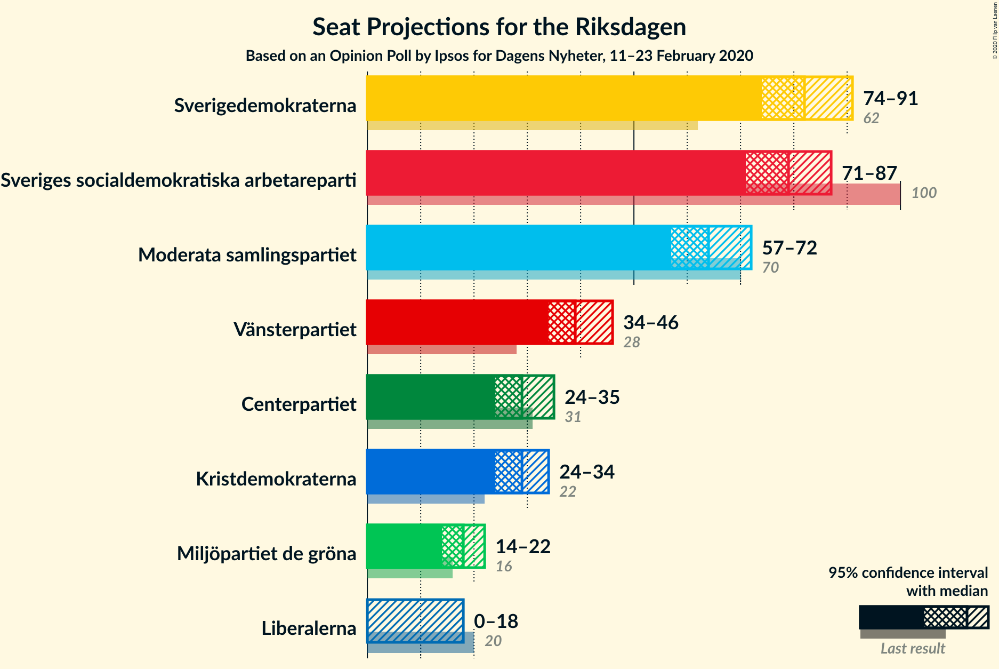
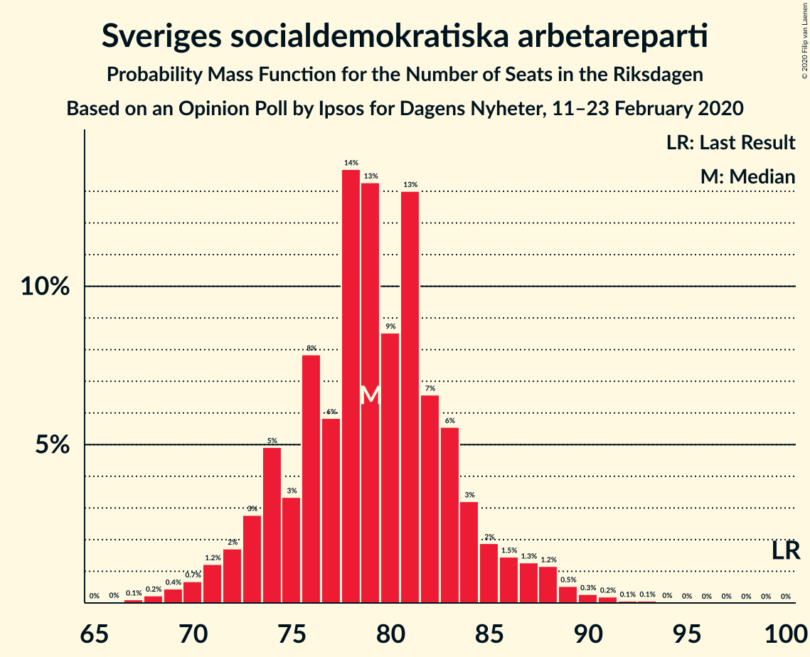
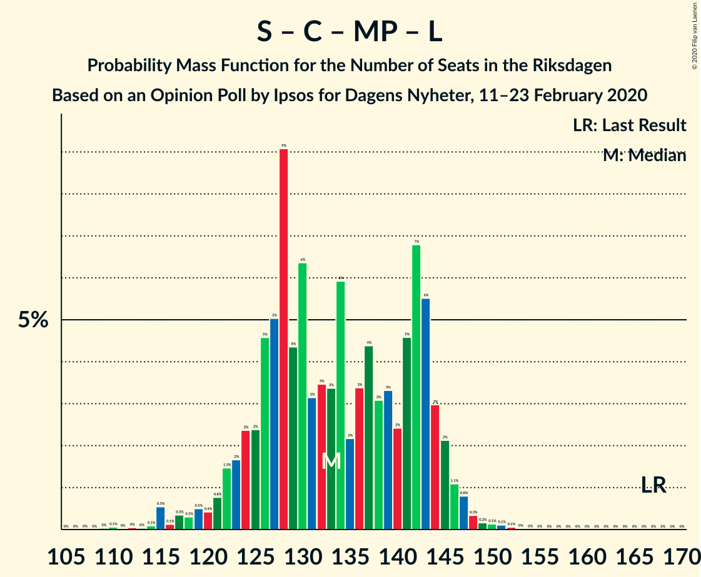

# Opinion Poll by Ipsos for Dagens Nyheter, 11–23 February 2020

<a href="#voting-intentions">Voting Intentions</a> | <a href="#seats">Seats</a> | <a href="#coalitions">Coalitions</a> | <a href="#technical-information">Technical Information</a>

## Voting Intentions

### Confidence Intervals

| Party | Last Result | Poll Result | 80% Confidence Interval | 90% Confidence Interval | 95% Confidence Interval | 99% Confidence Interval |
|:-----:|:-----------:|:-----------:|:-----------------------:|:-----------------------:|:-----------------------:|:-----------------------:|
| Sverigedemokraterna | 17.5% | 23.0% | 21.7–24.4% |21.3–24.8% |21.0–25.2% |20.3–25.9% |
| Sveriges socialdemokratiska arbetareparti | 28.3% | 22.0% | 20.7–23.4% |20.3–23.8% |20.0–24.2% |19.4–24.9% |
| Moderata samlingspartiet | 19.8% | 18.0% | 16.8–19.3% |16.4–19.7% |16.1–20.0% |15.6–20.6% |
| Vänsterpartiet | 8.0% | 11.0% | 10.0–12.1% |9.8–12.4% |9.5–12.7% |9.1–13.2% |
| Centerpartiet | 8.6% | 8.0% | 7.2–9.0% |7.0–9.3% |6.8–9.5% |6.4–10.0% |
| Kristdemokraterna | 6.3% | 8.0% | 7.2–9.0% |7.0–9.3% |6.8–9.5% |6.4–10.0% |
| Miljöpartiet de gröna | 4.4% | 5.0% | 4.4–5.8% |4.2–6.0% |4.0–6.2% |3.7–6.6% |
| Liberalerna | 5.5% | 4.0% | 3.4–4.7% |3.2–4.9% |3.1–5.1% |2.9–5.4% |

*Note:* The poll result column reflects the actual value used in the calculations. Published results may vary slightly, and in addition be rounded to fewer digits.

## Seats

### Confidence Intervals

| Party | Last Result | Median | 80% Confidence Interval | 90% Confidence Interval | 95% Confidence Interval | 99% Confidence Interval |
|:-----:|:-----------:|:------:|:-----------------------:|:-----------------------:|:-----------------------:|:-----------------------:|
| <a href="#sverigedemokraterna">Sverigedemokraterna</a> | 62 | 82 | 77–88 |76–90 |74–91 |71–94 |
| <a href="#sveriges-socialdemokratiska-arbetareparti">Sveriges socialdemokratiska arbetareparti</a> | 100 | 79 | 74–84 |73–86 |71–87 |69–90 |
| <a href="#moderata-samlingspartiet">Moderata samlingspartiet</a> | 70 | 64 | 59–70 |58–71 |57–72 |55–75 |
| <a href="#vänsterpartiet">Vänsterpartiet</a> | 28 | 39 | 36–44 |35–44 |34–46 |32–47 |
| <a href="#centerpartiet">Centerpartiet</a> | 31 | 29 | 25–32 |25–33 |24–35 |23–36 |
| <a href="#kristdemokraterna">Kristdemokraterna</a> | 22 | 29 | 26–32 |25–34 |24–34 |23–36 |
| <a href="#miljöpartiet-de-gröna">Miljöpartiet de gröna</a> | 16 | 18 | 16–21 |15–22 |14–22 |0–24 |
| <a href="#liberalerna">Liberalerna</a> | 20 | 0 | 0–16 |0–17 |0–18 |0–19 |

### Sverigedemokraterna

*For a full overview of the results for this party, see the [Sverigedemokraterna](party-sverigedemokraterna.html) page.*

| Number of Seats | Probability | Accumulated | Special Marks |
|:---------------:|:-----------:|:-----------:|:-------------:|
| 62 | 0% | 100% | Last Result |
| 63 | 0% | 100% |  |
| 64 | 0% | 100% |  |
| 65 | 0% | 100% |  |
| 66 | 0% | 100% |  |
| 67 | 0% | 100% |  |
| 68 | 0% | 100% |  |
| 69 | 0% | 100% |  |
| 70 | 0.1% | 99.9% |  |
| 71 | 0.5% | 99.9% |  |
| 72 | 0.2% | 99.4% |  |
| 73 | 0.6% | 99.2% |  |
| 74 | 1.4% | 98.7% |  |
| 75 | 1.4% | 97% |  |
| 76 | 3% | 96% |  |
| 77 | 3% | 93% |  |
| 78 | 6% | 89% |  |
| 79 | 9% | 84% |  |
| 80 | 8% | 74% |  |
| 81 | 7% | 67% |  |
| 82 | 19% | 60% | Median |
| 83 | 7% | 41% |  |
| 84 | 5% | 34% |  |
| 85 | 7% | 29% |  |
| 86 | 8% | 22% |  |
| 87 | 4% | 14% |  |
| 88 | 3% | 10% |  |
| 89 | 2% | 7% |  |
| 90 | 2% | 5% |  |
| 91 | 0.9% | 3% |  |
| 92 | 1.0% | 2% |  |
| 93 | 0.4% | 1.3% |  |
| 94 | 0.5% | 0.8% |  |
| 95 | 0.2% | 0.3% |  |
| 96 | 0.1% | 0.2% |  |
| 97 | 0.1% | 0.1% |  |
| 98 | 0% | 0% |  |

### Sveriges socialdemokratiska arbetareparti

*For a full overview of the results for this party, see the [Sveriges socialdemokratiska arbetareparti](party-sverigessocialdemokratiskaarbetareparti.html) page.*

| Number of Seats | Probability | Accumulated | Special Marks |
|:---------------:|:-----------:|:-----------:|:-------------:|
| 66 | 0% | 100% |  |
| 67 | 0.1% | 99.9% |  |
| 68 | 0.2% | 99.8% |  |
| 69 | 0.4% | 99.6% |  |
| 70 | 0.7% | 99.1% |  |
| 71 | 1.2% | 98% |  |
| 72 | 2% | 97% |  |
| 73 | 3% | 96% |  |
| 74 | 5% | 93% |  |
| 75 | 3% | 88% |  |
| 76 | 8% | 84% |  |
| 77 | 6% | 77% |  |
| 78 | 14% | 71% |  |
| 79 | 13% | 57% | Median |
| 80 | 9% | 44% |  |
| 81 | 13% | 35% |  |
| 82 | 7% | 22% |  |
| 83 | 6% | 16% |  |
| 84 | 3% | 10% |  |
| 85 | 2% | 7% |  |
| 86 | 1.5% | 5% |  |
| 87 | 1.3% | 4% |  |
| 88 | 1.2% | 2% |  |
| 89 | 0.5% | 1.2% |  |
| 90 | 0.3% | 0.7% |  |
| 91 | 0.2% | 0.4% |  |
| 92 | 0.1% | 0.2% |  |
| 93 | 0.1% | 0.1% |  |
| 94 | 0% | 0.1% |  |
| 95 | 0% | 0% |  |
| 96 | 0% | 0% |  |
| 97 | 0% | 0% |  |
| 98 | 0% | 0% |  |
| 99 | 0% | 0% |  |
| 100 | 0% | 0% | Last Result |

### Moderata samlingspartiet

*For a full overview of the results for this party, see the [Moderata samlingspartiet](party-moderatasamlingspartiet.html) page.*

| Number of Seats | Probability | Accumulated | Special Marks |
|:---------------:|:-----------:|:-----------:|:-------------:|
| 53 | 0% | 100% |  |
| 54 | 0.2% | 99.9% |  |
| 55 | 0.6% | 99.7% |  |
| 56 | 0.7% | 99.2% |  |
| 57 | 1.5% | 98% |  |
| 58 | 2% | 97% |  |
| 59 | 5% | 94% |  |
| 60 | 7% | 89% |  |
| 61 | 7% | 83% |  |
| 62 | 6% | 76% |  |
| 63 | 11% | 69% |  |
| 64 | 10% | 58% | Median |
| 65 | 7% | 48% |  |
| 66 | 8% | 41% |  |
| 67 | 12% | 33% |  |
| 68 | 4% | 21% |  |
| 69 | 7% | 17% |  |
| 70 | 4% | 11% | Last Result |
| 71 | 3% | 7% |  |
| 72 | 2% | 4% |  |
| 73 | 1.1% | 2% |  |
| 74 | 0.3% | 1.0% |  |
| 75 | 0.3% | 0.7% |  |
| 76 | 0.2% | 0.4% |  |
| 77 | 0.1% | 0.2% |  |
| 78 | 0.1% | 0.1% |  |
| 79 | 0% | 0% |  |

### Vänsterpartiet

*For a full overview of the results for this party, see the [Vänsterpartiet](party-vänsterpartiet.html) page.*

| Number of Seats | Probability | Accumulated | Special Marks |
|:---------------:|:-----------:|:-----------:|:-------------:|
| 28 | 0% | 100% | Last Result |
| 29 | 0% | 100% |  |
| 30 | 0% | 100% |  |
| 31 | 0.1% | 100% |  |
| 32 | 0.4% | 99.8% |  |
| 33 | 2% | 99.5% |  |
| 34 | 2% | 98% |  |
| 35 | 5% | 96% |  |
| 36 | 7% | 91% |  |
| 37 | 11% | 84% |  |
| 38 | 10% | 73% |  |
| 39 | 13% | 63% | Median |
| 40 | 11% | 49% |  |
| 41 | 13% | 38% |  |
| 42 | 8% | 25% |  |
| 43 | 6% | 17% |  |
| 44 | 6% | 10% |  |
| 45 | 2% | 4% |  |
| 46 | 2% | 3% |  |
| 47 | 0.5% | 0.9% |  |
| 48 | 0.2% | 0.4% |  |
| 49 | 0.1% | 0.2% |  |
| 50 | 0% | 0.1% |  |
| 51 | 0% | 0% |  |

### Centerpartiet

*For a full overview of the results for this party, see the [Centerpartiet](party-centerpartiet.html) page.*

| Number of Seats | Probability | Accumulated | Special Marks |
|:---------------:|:-----------:|:-----------:|:-------------:|
| 21 | 0% | 100% |  |
| 22 | 0.1% | 99.9% |  |
| 23 | 1.1% | 99.8% |  |
| 24 | 3% | 98.7% |  |
| 25 | 5% | 95% |  |
| 26 | 7% | 90% |  |
| 27 | 6% | 83% |  |
| 28 | 14% | 77% |  |
| 29 | 19% | 62% | Median |
| 30 | 13% | 43% |  |
| 31 | 17% | 30% | Last Result |
| 32 | 5% | 12% |  |
| 33 | 3% | 8% |  |
| 34 | 2% | 5% |  |
| 35 | 2% | 3% |  |
| 36 | 1.0% | 1.2% |  |
| 37 | 0.2% | 0.2% |  |
| 38 | 0% | 0.1% |  |
| 39 | 0% | 0% |  |

### Kristdemokraterna

*For a full overview of the results for this party, see the [Kristdemokraterna](party-kristdemokraterna.html) page.*

| Number of Seats | Probability | Accumulated | Special Marks |
|:---------------:|:-----------:|:-----------:|:-------------:|
| 21 | 0.1% | 100% |  |
| 22 | 0.2% | 99.9% | Last Result |
| 23 | 1.4% | 99.7% |  |
| 24 | 1.5% | 98% |  |
| 25 | 6% | 97% |  |
| 26 | 10% | 91% |  |
| 27 | 11% | 80% |  |
| 28 | 8% | 69% |  |
| 29 | 20% | 62% | Median |
| 30 | 9% | 42% |  |
| 31 | 15% | 33% |  |
| 32 | 8% | 18% |  |
| 33 | 4% | 10% |  |
| 34 | 4% | 6% |  |
| 35 | 1.2% | 2% |  |
| 36 | 0.3% | 0.6% |  |
| 37 | 0.3% | 0.3% |  |
| 38 | 0% | 0.1% |  |
| 39 | 0% | 0% |  |

### Miljöpartiet de gröna

*For a full overview of the results for this party, see the [Miljöpartiet de gröna](party-miljöpartietdegröna.html) page.*

| Number of Seats | Probability | Accumulated | Special Marks |
|:---------------:|:-----------:|:-----------:|:-------------:|
| 0 | 2% | 100% |  |
| 1 | 0% | 98% |  |
| 2 | 0% | 98% |  |
| 3 | 0% | 98% |  |
| 4 | 0% | 98% |  |
| 5 | 0% | 98% |  |
| 6 | 0% | 98% |  |
| 7 | 0% | 98% |  |
| 8 | 0% | 98% |  |
| 9 | 0% | 98% |  |
| 10 | 0% | 98% |  |
| 11 | 0% | 98% |  |
| 12 | 0% | 98% |  |
| 13 | 0% | 98% |  |
| 14 | 0.4% | 98% |  |
| 15 | 6% | 97% |  |
| 16 | 15% | 91% | Last Result |
| 17 | 15% | 76% |  |
| 18 | 22% | 61% | Median |
| 19 | 11% | 38% |  |
| 20 | 14% | 27% |  |
| 21 | 6% | 12% |  |
| 22 | 5% | 7% |  |
| 23 | 1.4% | 2% |  |
| 24 | 0.4% | 0.7% |  |
| 25 | 0.2% | 0.3% |  |
| 26 | 0% | 0.1% |  |
| 27 | 0% | 0% |  |

### Liberalerna

*For a full overview of the results for this party, see the [Liberalerna](party-liberalerna.html) page.*

| Number of Seats | Probability | Accumulated | Special Marks |
|:---------------:|:-----------:|:-----------:|:-------------:|
| 0 | 50% | 100% | Median |
| 1 | 0% | 50% |  |
| 2 | 0% | 50% |  |
| 3 | 0% | 50% |  |
| 4 | 0% | 50% |  |
| 5 | 0% | 50% |  |
| 6 | 0% | 50% |  |
| 7 | 0% | 50% |  |
| 8 | 0% | 50% |  |
| 9 | 0% | 50% |  |
| 10 | 0% | 50% |  |
| 11 | 0% | 50% |  |
| 12 | 0% | 50% |  |
| 13 | 0% | 50% |  |
| 14 | 10% | 50% |  |
| 15 | 16% | 39% |  |
| 16 | 14% | 23% |  |
| 17 | 5% | 9% |  |
| 18 | 3% | 4% |  |
| 19 | 0.6% | 0.8% |  |
| 20 | 0.2% | 0.3% | Last Result |
| 21 | 0.1% | 0.1% |  |
| 22 | 0% | 0% |  |

## Coalitions

### Confidence Intervals

| Coalition | Last Result | Median | Majority? | 80% Confidence Interval | 90% Confidence Interval | 95% Confidence Interval | 99% Confidence Interval |
|:---------:|:-----------:|:------:|:---------:|:-----------------------:|:-----------------------:|:-----------------------:|:-----------------------:|
| Sverigedemokraterna – Moderata samlingspartiet – Kristdemokraterna | 154 | 176 | 59% | 168–184 | 166–186 | 164–189 | 162–192 |
| Sveriges socialdemokratiska arbetareparti – Moderata samlingspartiet – Centerpartiet | 201 | 173 | 37% | 165–180 | 163–183 | 161–185 | 159–188 |
| Sveriges socialdemokratiska arbetareparti – Vänsterpartiet – Centerpartiet – Miljöpartiet de gröna – Liberalerna | 195 | 173 | 41% | 165–181 | 163–183 | 160–185 | 157–187 |
| Sverigedemokraterna – Moderata samlingspartiet | 132 | 146 | 0% | 139–155 | 137–156 | 137–158 | 133–162 |
| Sveriges socialdemokratiska arbetareparti – Moderata samlingspartiet | 170 | 143 | 0% | 137–150 | 135–153 | 133–154 | 130–157 |
| Sveriges socialdemokratiska arbetareparti – Vänsterpartiet – Miljöpartiet de gröna | 144 | 136 | 0% | 129–143 | 127–146 | 126–147 | 122–150 |
| Sveriges socialdemokratiska arbetareparti – Centerpartiet – Miljöpartiet de gröna – Liberalerna | 167 | 133 | 0% | 125–143 | 123–144 | 120–146 | 115–148 |
| Moderata samlingspartiet – Centerpartiet – Kristdemokraterna – Liberalerna | 143 | 130 | 0% | 123–139 | 120–140 | 118–142 | 115–146 |
| Moderata samlingspartiet – Centerpartiet – Kristdemokraterna | 123 | 123 | 0% | 116–130 | 113–132 | 112–134 | 110–136 |
| Sveriges socialdemokratiska arbetareparti – Vänsterpartiet | 128 | 119 | 0% | 113–125 | 111–127 | 109–128 | 106–132 |
| Moderata samlingspartiet – Centerpartiet – Liberalerna | 121 | 102 | 0% | 93–110 | 91–111 | 89–113 | 86–117 |
| Sveriges socialdemokratiska arbetareparti – Miljöpartiet de gröna | 116 | 97 | 0% | 90–102 | 89–104 | 86–106 | 81–109 |
| Moderata samlingspartiet – Centerpartiet | 101 | 94 | 0% | 88–99 | 86–102 | 84–103 | 83–106 |

### Sverigedemokraterna – Moderata samlingspartiet – Kristdemokraterna

| Number of Seats | Probability | Accumulated | Special Marks |
|:---------------:|:-----------:|:-----------:|:-------------:|
| 154 | 0% | 100% | Last Result |
| 155 | 0% | 100% |  |
| 156 | 0% | 100% |  |
| 157 | 0% | 100% |  |
| 158 | 0% | 100% |  |
| 159 | 0% | 99.9% |  |
| 160 | 0.1% | 99.9% |  |
| 161 | 0.1% | 99.7% |  |
| 162 | 0.5% | 99.6% |  |
| 163 | 0.6% | 99.1% |  |
| 164 | 1.4% | 98% |  |
| 165 | 0.8% | 97% |  |
| 166 | 3% | 96% |  |
| 167 | 3% | 93% |  |
| 168 | 4% | 90% |  |
| 169 | 4% | 86% |  |
| 170 | 5% | 82% |  |
| 171 | 6% | 77% |  |
| 172 | 6% | 71% |  |
| 173 | 4% | 66% |  |
| 174 | 3% | 62% |  |
| 175 | 6% | 59% | Median, Majority |
| 176 | 6% | 53% |  |
| 177 | 7% | 47% |  |
| 178 | 4% | 40% |  |
| 179 | 4% | 36% |  |
| 180 | 9% | 33% |  |
| 181 | 5% | 24% |  |
| 182 | 4% | 19% |  |
| 183 | 3% | 16% |  |
| 184 | 5% | 13% |  |
| 185 | 1.0% | 8% |  |
| 186 | 2% | 7% |  |
| 187 | 1.4% | 5% |  |
| 188 | 0.7% | 3% |  |
| 189 | 0.8% | 3% |  |
| 190 | 0.8% | 2% |  |
| 191 | 0.2% | 0.9% |  |
| 192 | 0.3% | 0.7% |  |
| 193 | 0.1% | 0.4% |  |
| 194 | 0.1% | 0.2% |  |
| 195 | 0.1% | 0.2% |  |
| 196 | 0% | 0.1% |  |
| 197 | 0% | 0.1% |  |
| 198 | 0% | 0% |  |

### Sveriges socialdemokratiska arbetareparti – Moderata samlingspartiet – Centerpartiet

| Number of Seats | Probability | Accumulated | Special Marks |
|:---------------:|:-----------:|:-----------:|:-------------:|
| 155 | 0.1% | 100% |  |
| 156 | 0% | 99.9% |  |
| 157 | 0.2% | 99.9% |  |
| 158 | 0.2% | 99.7% |  |
| 159 | 0.2% | 99.5% |  |
| 160 | 1.0% | 99.3% |  |
| 161 | 0.9% | 98% |  |
| 162 | 1.3% | 97% |  |
| 163 | 3% | 96% |  |
| 164 | 1.4% | 93% |  |
| 165 | 3% | 91% |  |
| 166 | 2% | 89% |  |
| 167 | 4% | 87% |  |
| 168 | 4% | 83% |  |
| 169 | 6% | 79% |  |
| 170 | 10% | 73% |  |
| 171 | 8% | 63% |  |
| 172 | 5% | 56% | Median |
| 173 | 5% | 51% |  |
| 174 | 9% | 47% |  |
| 175 | 7% | 37% | Majority |
| 176 | 7% | 31% |  |
| 177 | 8% | 24% |  |
| 178 | 2% | 16% |  |
| 179 | 3% | 14% |  |
| 180 | 3% | 11% |  |
| 181 | 1.0% | 8% |  |
| 182 | 1.4% | 7% |  |
| 183 | 2% | 5% |  |
| 184 | 0.5% | 4% |  |
| 185 | 2% | 3% |  |
| 186 | 0.6% | 2% |  |
| 187 | 0.3% | 0.9% |  |
| 188 | 0.3% | 0.6% |  |
| 189 | 0.1% | 0.4% |  |
| 190 | 0.1% | 0.3% |  |
| 191 | 0% | 0.1% |  |
| 192 | 0% | 0.1% |  |
| 193 | 0% | 0.1% |  |
| 194 | 0% | 0% |  |
| 195 | 0% | 0% |  |
| 196 | 0% | 0% |  |
| 197 | 0% | 0% |  |
| 198 | 0% | 0% |  |
| 199 | 0% | 0% |  |
| 200 | 0% | 0% |  |
| 201 | 0% | 0% | Last Result |

### Sveriges socialdemokratiska arbetareparti – Vänsterpartiet – Centerpartiet – Miljöpartiet de gröna – Liberalerna

| Number of Seats | Probability | Accumulated | Special Marks |
|:---------------:|:-----------:|:-----------:|:-------------:|
| 152 | 0% | 100% |  |
| 153 | 0% | 99.9% |  |
| 154 | 0.1% | 99.9% |  |
| 155 | 0.1% | 99.8% |  |
| 156 | 0.1% | 99.8% |  |
| 157 | 0.3% | 99.6% |  |
| 158 | 0.2% | 99.3% |  |
| 159 | 0.8% | 99.1% |  |
| 160 | 0.8% | 98% |  |
| 161 | 0.7% | 97% |  |
| 162 | 1.4% | 97% |  |
| 163 | 2% | 95% |  |
| 164 | 1.0% | 93% |  |
| 165 | 5% | 92% | Median |
| 166 | 3% | 87% |  |
| 167 | 4% | 84% |  |
| 168 | 5% | 81% |  |
| 169 | 9% | 76% |  |
| 170 | 4% | 67% |  |
| 171 | 4% | 64% |  |
| 172 | 7% | 60% |  |
| 173 | 6% | 53% |  |
| 174 | 6% | 47% |  |
| 175 | 3% | 41% | Majority |
| 176 | 4% | 38% |  |
| 177 | 6% | 34% |  |
| 178 | 6% | 29% |  |
| 179 | 5% | 23% |  |
| 180 | 4% | 18% |  |
| 181 | 4% | 14% |  |
| 182 | 3% | 10% |  |
| 183 | 3% | 7% |  |
| 184 | 0.8% | 4% |  |
| 185 | 1.4% | 3% |  |
| 186 | 0.6% | 2% |  |
| 187 | 0.5% | 0.9% |  |
| 188 | 0.1% | 0.4% |  |
| 189 | 0.1% | 0.3% |  |
| 190 | 0% | 0.1% |  |
| 191 | 0% | 0.1% |  |
| 192 | 0% | 0% |  |
| 193 | 0% | 0% |  |
| 194 | 0% | 0% |  |
| 195 | 0% | 0% | Last Result |

### Sverigedemokraterna – Moderata samlingspartiet

| Number of Seats | Probability | Accumulated | Special Marks |
|:---------------:|:-----------:|:-----------:|:-------------:|
| 131 | 0.1% | 100% |  |
| 132 | 0.2% | 99.9% | Last Result |
| 133 | 0.3% | 99.7% |  |
| 134 | 0.4% | 99.4% |  |
| 135 | 0.3% | 99.0% |  |
| 136 | 0.6% | 98.7% |  |
| 137 | 3% | 98% |  |
| 138 | 1.5% | 95% |  |
| 139 | 6% | 93% |  |
| 140 | 2% | 88% |  |
| 141 | 5% | 86% |  |
| 142 | 4% | 81% |  |
| 143 | 7% | 77% |  |
| 144 | 3% | 69% |  |
| 145 | 7% | 66% |  |
| 146 | 11% | 59% | Median |
| 147 | 5% | 48% |  |
| 148 | 5% | 43% |  |
| 149 | 7% | 38% |  |
| 150 | 4% | 31% |  |
| 151 | 5% | 26% |  |
| 152 | 5% | 22% |  |
| 153 | 2% | 16% |  |
| 154 | 2% | 14% |  |
| 155 | 5% | 12% |  |
| 156 | 2% | 7% |  |
| 157 | 2% | 5% |  |
| 158 | 1.3% | 3% |  |
| 159 | 0.3% | 2% |  |
| 160 | 0.4% | 1.5% |  |
| 161 | 0.4% | 1.0% |  |
| 162 | 0.3% | 0.7% |  |
| 163 | 0.2% | 0.4% |  |
| 164 | 0.1% | 0.2% |  |
| 165 | 0% | 0.1% |  |
| 166 | 0% | 0.1% |  |
| 167 | 0% | 0% |  |

### Sveriges socialdemokratiska arbetareparti – Moderata samlingspartiet

| Number of Seats | Probability | Accumulated | Special Marks |
|:---------------:|:-----------:|:-----------:|:-------------:|
| 127 | 0% | 100% |  |
| 128 | 0.1% | 99.9% |  |
| 129 | 0.2% | 99.8% |  |
| 130 | 0.4% | 99.6% |  |
| 131 | 0.4% | 99.3% |  |
| 132 | 0.6% | 98.9% |  |
| 133 | 1.5% | 98% |  |
| 134 | 1.1% | 97% |  |
| 135 | 3% | 96% |  |
| 136 | 1.2% | 93% |  |
| 137 | 2% | 92% |  |
| 138 | 2% | 89% |  |
| 139 | 4% | 87% |  |
| 140 | 10% | 83% |  |
| 141 | 9% | 73% |  |
| 142 | 6% | 64% |  |
| 143 | 8% | 58% | Median |
| 144 | 5% | 50% |  |
| 145 | 12% | 45% |  |
| 146 | 8% | 33% |  |
| 147 | 6% | 25% |  |
| 148 | 4% | 19% |  |
| 149 | 3% | 15% |  |
| 150 | 2% | 12% |  |
| 151 | 2% | 10% |  |
| 152 | 2% | 8% |  |
| 153 | 1.4% | 5% |  |
| 154 | 1.5% | 4% |  |
| 155 | 0.7% | 2% |  |
| 156 | 0.6% | 2% |  |
| 157 | 0.6% | 1.1% |  |
| 158 | 0.2% | 0.5% |  |
| 159 | 0.1% | 0.3% |  |
| 160 | 0.1% | 0.2% |  |
| 161 | 0% | 0.1% |  |
| 162 | 0% | 0.1% |  |
| 163 | 0% | 0.1% |  |
| 164 | 0% | 0% |  |
| 165 | 0% | 0% |  |
| 166 | 0% | 0% |  |
| 167 | 0% | 0% |  |
| 168 | 0% | 0% |  |
| 169 | 0% | 0% |  |
| 170 | 0% | 0% | Last Result |

### Sveriges socialdemokratiska arbetareparti – Vänsterpartiet – Miljöpartiet de gröna

| Number of Seats | Probability | Accumulated | Special Marks |
|:---------------:|:-----------:|:-----------:|:-------------:|
| 113 | 0% | 100% |  |
| 114 | 0% | 99.9% |  |
| 115 | 0% | 99.9% |  |
| 116 | 0% | 99.9% |  |
| 117 | 0% | 99.9% |  |
| 118 | 0% | 99.8% |  |
| 119 | 0.1% | 99.8% |  |
| 120 | 0% | 99.7% |  |
| 121 | 0.1% | 99.7% |  |
| 122 | 0.2% | 99.6% |  |
| 123 | 0.4% | 99.4% |  |
| 124 | 0.5% | 99.0% |  |
| 125 | 0.8% | 98% |  |
| 126 | 1.2% | 98% |  |
| 127 | 2% | 96% |  |
| 128 | 3% | 95% |  |
| 129 | 5% | 92% |  |
| 130 | 3% | 87% |  |
| 131 | 3% | 84% |  |
| 132 | 6% | 81% |  |
| 133 | 5% | 75% |  |
| 134 | 3% | 70% |  |
| 135 | 9% | 68% |  |
| 136 | 9% | 59% | Median |
| 137 | 5% | 49% |  |
| 138 | 8% | 44% |  |
| 139 | 9% | 36% |  |
| 140 | 5% | 27% |  |
| 141 | 6% | 21% |  |
| 142 | 3% | 16% |  |
| 143 | 3% | 12% |  |
| 144 | 3% | 10% | Last Result |
| 145 | 1.3% | 6% |  |
| 146 | 2% | 5% |  |
| 147 | 1.2% | 3% |  |
| 148 | 0.5% | 2% |  |
| 149 | 0.8% | 1.3% |  |
| 150 | 0.2% | 0.5% |  |
| 151 | 0.1% | 0.3% |  |
| 152 | 0.1% | 0.1% |  |
| 153 | 0% | 0.1% |  |
| 154 | 0% | 0% |  |

### Sveriges socialdemokratiska arbetareparti – Centerpartiet – Miljöpartiet de gröna – Liberalerna

| Number of Seats | Probability | Accumulated | Special Marks |
|:---------------:|:-----------:|:-----------:|:-------------:|
| 109 | 0% | 100% |  |
| 110 | 0.1% | 99.9% |  |
| 111 | 0% | 99.9% |  |
| 112 | 0% | 99.9% |  |
| 113 | 0% | 99.8% |  |
| 114 | 0.1% | 99.8% |  |
| 115 | 0.5% | 99.7% |  |
| 116 | 0.1% | 99.1% |  |
| 117 | 0.3% | 99.0% |  |
| 118 | 0.3% | 98.7% |  |
| 119 | 0.5% | 98% |  |
| 120 | 0.4% | 98% |  |
| 121 | 0.8% | 97% |  |
| 122 | 1.5% | 97% |  |
| 123 | 2% | 95% |  |
| 124 | 2% | 94% |  |
| 125 | 2% | 91% |  |
| 126 | 5% | 89% | Median |
| 127 | 5% | 84% |  |
| 128 | 9% | 79% |  |
| 129 | 4% | 70% |  |
| 130 | 6% | 66% |  |
| 131 | 3% | 59% |  |
| 132 | 3% | 56% |  |
| 133 | 3% | 53% |  |
| 134 | 6% | 49% |  |
| 135 | 2% | 43% |  |
| 136 | 3% | 41% |  |
| 137 | 4% | 38% |  |
| 138 | 3% | 34% |  |
| 139 | 3% | 30% |  |
| 140 | 2% | 27% |  |
| 141 | 5% | 25% |  |
| 142 | 7% | 20% |  |
| 143 | 6% | 13% |  |
| 144 | 3% | 8% |  |
| 145 | 2% | 5% |  |
| 146 | 1.1% | 3% |  |
| 147 | 0.8% | 2% |  |
| 148 | 0.3% | 0.8% |  |
| 149 | 0.2% | 0.5% |  |
| 150 | 0.1% | 0.3% |  |
| 151 | 0.1% | 0.2% |  |
| 152 | 0.1% | 0.1% |  |
| 153 | 0% | 0% |  |
| 154 | 0% | 0% |  |
| 155 | 0% | 0% |  |
| 156 | 0% | 0% |  |
| 157 | 0% | 0% |  |
| 158 | 0% | 0% |  |
| 159 | 0% | 0% |  |
| 160 | 0% | 0% |  |
| 161 | 0% | 0% |  |
| 162 | 0% | 0% |  |
| 163 | 0% | 0% |  |
| 164 | 0% | 0% |  |
| 165 | 0% | 0% |  |
| 166 | 0% | 0% |  |
| 167 | 0% | 0% | Last Result |

### Moderata samlingspartiet – Centerpartiet – Kristdemokraterna – Liberalerna

| Number of Seats | Probability | Accumulated | Special Marks |
|:---------------:|:-----------:|:-----------:|:-------------:|
| 112 | 0.1% | 100% |  |
| 113 | 0.1% | 99.9% |  |
| 114 | 0.2% | 99.8% |  |
| 115 | 0.3% | 99.5% |  |
| 116 | 0.5% | 99.3% |  |
| 117 | 1.0% | 98.8% |  |
| 118 | 0.9% | 98% |  |
| 119 | 1.0% | 97% |  |
| 120 | 1.2% | 96% |  |
| 121 | 1.3% | 95% |  |
| 122 | 3% | 93% | Median |
| 123 | 3% | 90% |  |
| 124 | 3% | 87% |  |
| 125 | 6% | 84% |  |
| 126 | 5% | 78% |  |
| 127 | 6% | 73% |  |
| 128 | 5% | 66% |  |
| 129 | 7% | 61% |  |
| 130 | 5% | 54% |  |
| 131 | 5% | 49% |  |
| 132 | 9% | 43% |  |
| 133 | 3% | 35% |  |
| 134 | 8% | 32% |  |
| 135 | 4% | 24% |  |
| 136 | 2% | 20% |  |
| 137 | 2% | 18% |  |
| 138 | 4% | 16% |  |
| 139 | 3% | 11% |  |
| 140 | 4% | 8% |  |
| 141 | 1.3% | 5% |  |
| 142 | 0.9% | 3% |  |
| 143 | 0.8% | 2% | Last Result |
| 144 | 0.4% | 2% |  |
| 145 | 0.5% | 1.2% |  |
| 146 | 0.3% | 0.7% |  |
| 147 | 0.2% | 0.4% |  |
| 148 | 0.1% | 0.2% |  |
| 149 | 0% | 0.1% |  |
| 150 | 0% | 0.1% |  |
| 151 | 0% | 0% |  |

### Moderata samlingspartiet – Centerpartiet – Kristdemokraterna

| Number of Seats | Probability | Accumulated | Special Marks |
|:---------------:|:-----------:|:-----------:|:-------------:|
| 107 | 0% | 100% |  |
| 108 | 0.1% | 99.9% |  |
| 109 | 0.2% | 99.9% |  |
| 110 | 0.2% | 99.7% |  |
| 111 | 1.1% | 99.5% |  |
| 112 | 0.9% | 98% |  |
| 113 | 3% | 97% |  |
| 114 | 1.3% | 95% |  |
| 115 | 3% | 93% |  |
| 116 | 5% | 90% |  |
| 117 | 5% | 85% |  |
| 118 | 10% | 80% |  |
| 119 | 3% | 70% |  |
| 120 | 6% | 67% |  |
| 121 | 3% | 61% |  |
| 122 | 5% | 58% | Median |
| 123 | 7% | 53% | Last Result |
| 124 | 4% | 45% |  |
| 125 | 7% | 42% |  |
| 126 | 7% | 35% |  |
| 127 | 6% | 27% |  |
| 128 | 5% | 22% |  |
| 129 | 6% | 16% |  |
| 130 | 3% | 11% |  |
| 131 | 1.3% | 8% |  |
| 132 | 3% | 6% |  |
| 133 | 0.7% | 3% |  |
| 134 | 2% | 3% |  |
| 135 | 0.4% | 0.9% |  |
| 136 | 0.2% | 0.5% |  |
| 137 | 0.1% | 0.3% |  |
| 138 | 0% | 0.2% |  |
| 139 | 0.1% | 0.1% |  |
| 140 | 0% | 0.1% |  |
| 141 | 0% | 0% |  |

### Sveriges socialdemokratiska arbetareparti – Vänsterpartiet

| Number of Seats | Probability | Accumulated | Special Marks |
|:---------------:|:-----------:|:-----------:|:-------------:|
| 103 | 0% | 100% |  |
| 104 | 0.1% | 99.9% |  |
| 105 | 0.1% | 99.9% |  |
| 106 | 0.3% | 99.8% |  |
| 107 | 0.4% | 99.4% |  |
| 108 | 0.8% | 99.0% |  |
| 109 | 1.2% | 98% |  |
| 110 | 2% | 97% |  |
| 111 | 2% | 95% |  |
| 112 | 3% | 93% |  |
| 113 | 6% | 90% |  |
| 114 | 6% | 84% |  |
| 115 | 6% | 79% |  |
| 116 | 8% | 72% |  |
| 117 | 6% | 64% |  |
| 118 | 7% | 58% | Median |
| 119 | 9% | 51% |  |
| 120 | 8% | 42% |  |
| 121 | 5% | 34% |  |
| 122 | 6% | 28% |  |
| 123 | 6% | 22% |  |
| 124 | 6% | 16% |  |
| 125 | 2% | 11% |  |
| 126 | 3% | 9% |  |
| 127 | 2% | 6% |  |
| 128 | 1.5% | 4% | Last Result |
| 129 | 1.0% | 2% |  |
| 130 | 0.7% | 1.5% |  |
| 131 | 0.3% | 0.8% |  |
| 132 | 0.2% | 0.5% |  |
| 133 | 0.1% | 0.3% |  |
| 134 | 0.1% | 0.2% |  |
| 135 | 0.1% | 0.1% |  |
| 136 | 0% | 0.1% |  |
| 137 | 0% | 0% |  |

### Moderata samlingspartiet – Centerpartiet – Liberalerna

| Number of Seats | Probability | Accumulated | Special Marks |
|:---------------:|:-----------:|:-----------:|:-------------:|
| 84 | 0.1% | 100% |  |
| 85 | 0.2% | 99.9% |  |
| 86 | 0.3% | 99.6% |  |
| 87 | 0.4% | 99.3% |  |
| 88 | 0.5% | 98.9% |  |
| 89 | 1.0% | 98% |  |
| 90 | 2% | 97% |  |
| 91 | 3% | 96% |  |
| 92 | 2% | 93% |  |
| 93 | 5% | 91% | Median |
| 94 | 2% | 86% |  |
| 95 | 5% | 84% |  |
| 96 | 6% | 79% |  |
| 97 | 4% | 73% |  |
| 98 | 9% | 69% |  |
| 99 | 5% | 60% |  |
| 100 | 2% | 55% |  |
| 101 | 3% | 54% |  |
| 102 | 4% | 50% |  |
| 103 | 6% | 47% |  |
| 104 | 5% | 41% |  |
| 105 | 7% | 36% |  |
| 106 | 5% | 29% |  |
| 107 | 4% | 24% |  |
| 108 | 2% | 20% |  |
| 109 | 5% | 17% |  |
| 110 | 5% | 12% |  |
| 111 | 2% | 7% |  |
| 112 | 1.1% | 5% |  |
| 113 | 2% | 4% |  |
| 114 | 0.8% | 2% |  |
| 115 | 0.4% | 1.3% |  |
| 116 | 0.3% | 0.9% |  |
| 117 | 0.4% | 0.6% |  |
| 118 | 0.1% | 0.2% |  |
| 119 | 0.1% | 0.2% |  |
| 120 | 0.1% | 0.1% |  |
| 121 | 0% | 0% | Last Result |

### Sveriges socialdemokratiska arbetareparti – Miljöpartiet de gröna

| Number of Seats | Probability | Accumulated | Special Marks |
|:---------------:|:-----------:|:-----------:|:-------------:|
| 74 | 0% | 100% |  |
| 75 | 0% | 99.9% |  |
| 76 | 0% | 99.9% |  |
| 77 | 0% | 99.9% |  |
| 78 | 0.1% | 99.8% |  |
| 79 | 0.1% | 99.8% |  |
| 80 | 0.1% | 99.7% |  |
| 81 | 0.1% | 99.6% |  |
| 82 | 0.2% | 99.5% |  |
| 83 | 0.7% | 99.3% |  |
| 84 | 0.4% | 98.6% |  |
| 85 | 0.5% | 98% |  |
| 86 | 0.7% | 98% |  |
| 87 | 0.3% | 97% |  |
| 88 | 1.0% | 97% |  |
| 89 | 2% | 96% |  |
| 90 | 4% | 94% |  |
| 91 | 3% | 90% |  |
| 92 | 3% | 87% |  |
| 93 | 3% | 84% |  |
| 94 | 5% | 81% |  |
| 95 | 7% | 76% |  |
| 96 | 9% | 69% |  |
| 97 | 12% | 60% | Median |
| 98 | 10% | 48% |  |
| 99 | 14% | 38% |  |
| 100 | 9% | 24% |  |
| 101 | 4% | 15% |  |
| 102 | 3% | 11% |  |
| 103 | 2% | 8% |  |
| 104 | 2% | 6% |  |
| 105 | 1.1% | 4% |  |
| 106 | 1.1% | 3% |  |
| 107 | 1.0% | 2% |  |
| 108 | 0.4% | 1.0% |  |
| 109 | 0.4% | 0.7% |  |
| 110 | 0.1% | 0.3% |  |
| 111 | 0.1% | 0.2% |  |
| 112 | 0% | 0.1% |  |
| 113 | 0% | 0% |  |
| 114 | 0% | 0% |  |
| 115 | 0% | 0% |  |
| 116 | 0% | 0% | Last Result |

### Moderata samlingspartiet – Centerpartiet

| Number of Seats | Probability | Accumulated | Special Marks |
|:---------------:|:-----------:|:-----------:|:-------------:|
| 79 | 0.1% | 100% |  |
| 80 | 0% | 99.9% |  |
| 81 | 0.1% | 99.9% |  |
| 82 | 0.3% | 99.8% |  |
| 83 | 0.9% | 99.5% |  |
| 84 | 1.1% | 98.6% |  |
| 85 | 2% | 97% |  |
| 86 | 2% | 96% |  |
| 87 | 2% | 94% |  |
| 88 | 5% | 92% |  |
| 89 | 8% | 87% |  |
| 90 | 6% | 79% |  |
| 91 | 10% | 73% |  |
| 92 | 6% | 63% |  |
| 93 | 7% | 57% | Median |
| 94 | 6% | 50% |  |
| 95 | 7% | 44% |  |
| 96 | 10% | 37% |  |
| 97 | 5% | 27% |  |
| 98 | 9% | 22% |  |
| 99 | 4% | 13% |  |
| 100 | 1.0% | 9% |  |
| 101 | 2% | 8% | Last Result |
| 102 | 1.5% | 5% |  |
| 103 | 2% | 4% |  |
| 104 | 0.7% | 2% |  |
| 105 | 0.7% | 1.2% |  |
| 106 | 0.2% | 0.5% |  |
| 107 | 0.1% | 0.3% |  |
| 108 | 0.1% | 0.2% |  |
| 109 | 0% | 0.1% |  |
| 110 | 0% | 0.1% |  |
| 111 | 0% | 0% |  |

## Technical Information

### Opinion Poll

+ **Polling firm:** Ipsos
+ **Commissioner(s):** Dagens Nyheter
+ **Fieldwork period:** 11–23 February 2020

### Calculations

+ **Sample size:** 1535
+ **Simulations done:** 1,048,576
+ **Error estimate:** 0.55%

