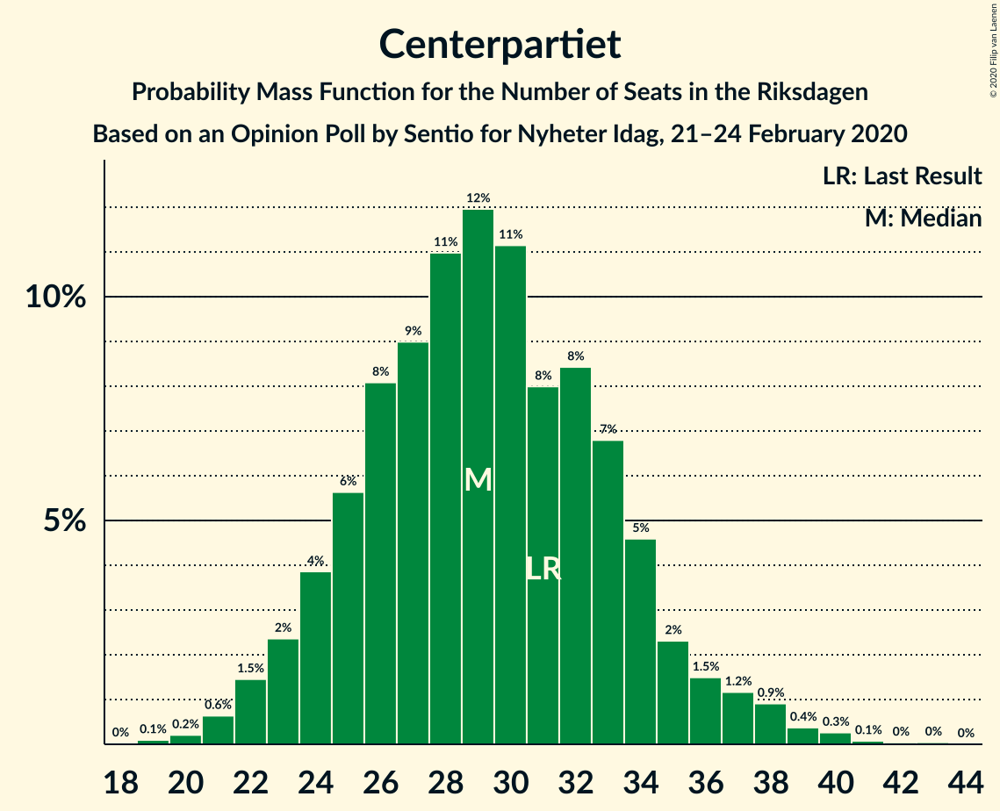
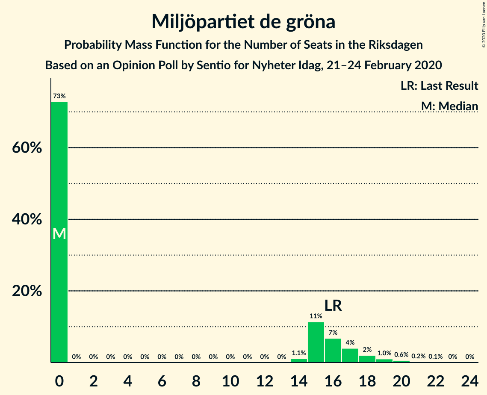
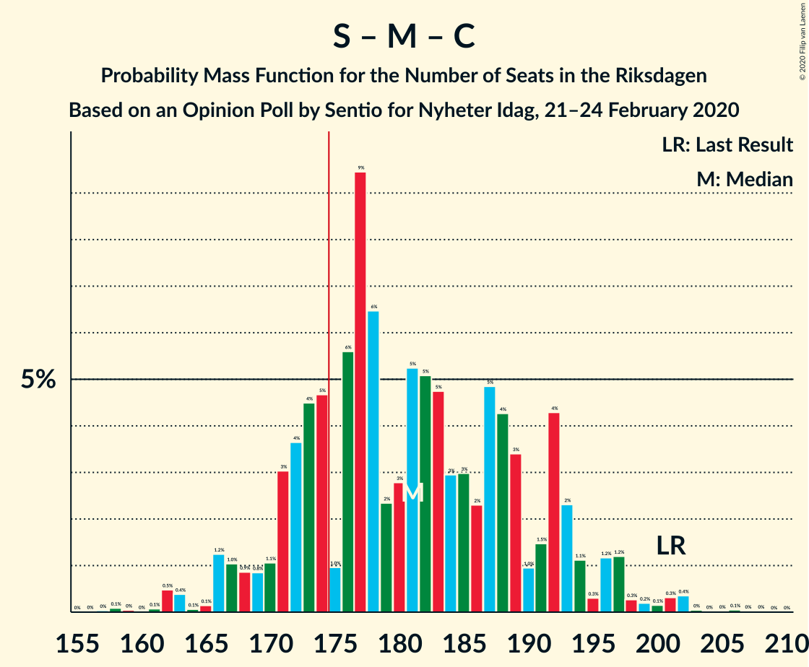

# Opinion Poll by Sentio for Nyheter Idag, 21–24 February 2020

<a href="#voting-intentions">Voting Intentions</a> | <a href="#seats">Seats</a> | <a href="#coalitions">Coalitions</a> | <a href="#technical-information">Technical Information</a>

## Voting Intentions

### Confidence Intervals

| Party | Last Result | Poll Result | 80% Confidence Interval | 90% Confidence Interval | 95% Confidence Interval | 99% Confidence Interval |
|:-----:|:-----------:|:-----------:|:-----------------------:|:-----------------------:|:-----------------------:|:-----------------------:|
| Sverigedemokraterna | 17.5% | 27.9% | 25.9–30.0% |25.3–30.6% |24.9–31.1% |23.9–32.2% |
| Sveriges socialdemokratiska arbetareparti | 28.3% | 21.5% | 19.8–23.5% |19.3–24.1% |18.8–24.6% |18.0–25.5% |
| Moderata samlingspartiet | 19.8% | 19.6% | 17.9–21.6% |17.4–22.1% |17.0–22.6% |16.2–23.5% |
| Vänsterpartiet | 8.0% | 11.2% | 9.8–12.7% |9.4–13.2% |9.1–13.5% |8.5–14.3% |
| Centerpartiet | 8.6% | 7.9% | 6.8–9.2% |6.4–9.6% |6.2–10.0% |5.7–10.6% |
| Kristdemokraterna | 6.3% | 5.3% | 4.4–6.5% |4.2–6.8% |4.0–7.1% |3.6–7.7% |
| Miljöpartiet de gröna | 4.4% | 3.5% | 2.8–4.6% |2.6–4.8% |2.5–5.1% |2.2–5.6% |
| Liberalerna | 5.5% | 1.8% | 1.3–2.5% |1.2–2.8% |1.1–3.0% |0.9–3.4% |

*Note:* The poll result column reflects the actual value used in the calculations. Published results may vary slightly, and in addition be rounded to fewer digits.

## Seats

### Confidence Intervals

| Party | Last Result | Median | 80% Confidence Interval | 90% Confidence Interval | 95% Confidence Interval | 99% Confidence Interval |
|:-----:|:-----------:|:------:|:-----------------------:|:-----------------------:|:-----------------------:|:-----------------------:|
| <a href="#sverigedemokraterna">Sverigedemokraterna</a> | 62 | 102 | 94–111 |93–112 |91–114 |86–118 |
| <a href="#sveriges-socialdemokratiska-arbetareparti">Sveriges socialdemokratiska arbetareparti</a> | 100 | 79 | 71–87 |71–90 |69–91 |66–95 |
| <a href="#moderata-samlingspartiet">Moderata samlingspartiet</a> | 70 | 72 | 65–79 |63–81 |62–82 |60–86 |
| <a href="#vänsterpartiet">Vänsterpartiet</a> | 28 | 41 | 36–46 |35–48 |33–50 |31–53 |
| <a href="#centerpartiet">Centerpartiet</a> | 31 | 29 | 25–34 |24–35 |23–36 |21–39 |
| <a href="#kristdemokraterna">Kristdemokraterna</a> | 22 | 21 | 16–24 |16–26 |15–26 |0–28 |
| <a href="#miljöpartiet-de-gröna">Miljöpartiet de gröna</a> | 16 | 0 | 0–16 |0–17 |0–18 |0–20 |
| <a href="#liberalerna">Liberalerna</a> | 20 | 0 | 0 |0 |0 |0 |

### Sverigedemokraterna

*For a full overview of the results for this party, see the [Sverigedemokraterna](party-sverigedemokraterna.html) page.*

| Number of Seats | Probability | Accumulated | Special Marks |
|:---------------:|:-----------:|:-----------:|:-------------:|
| 62 | 0% | 100% | Last Result |
| 63 | 0% | 100% |  |
| 64 | 0% | 100% |  |
| 65 | 0% | 100% |  |
| 66 | 0% | 100% |  |
| 67 | 0% | 100% |  |
| 68 | 0% | 100% |  |
| 69 | 0% | 100% |  |
| 70 | 0% | 100% |  |
| 71 | 0% | 100% |  |
| 72 | 0% | 100% |  |
| 73 | 0% | 100% |  |
| 74 | 0% | 100% |  |
| 75 | 0% | 100% |  |
| 76 | 0% | 100% |  |
| 77 | 0% | 100% |  |
| 78 | 0% | 100% |  |
| 79 | 0% | 100% |  |
| 80 | 0% | 100% |  |
| 81 | 0% | 100% |  |
| 82 | 0% | 100% |  |
| 83 | 0.1% | 100% |  |
| 84 | 0% | 99.9% |  |
| 85 | 0.2% | 99.8% |  |
| 86 | 0.2% | 99.7% |  |
| 87 | 0% | 99.4% |  |
| 88 | 0.2% | 99.4% |  |
| 89 | 0.7% | 99.2% |  |
| 90 | 0.2% | 98% |  |
| 91 | 1.2% | 98% |  |
| 92 | 1.2% | 97% |  |
| 93 | 2% | 96% |  |
| 94 | 4% | 94% |  |
| 95 | 2% | 90% |  |
| 96 | 2% | 88% |  |
| 97 | 2% | 86% |  |
| 98 | 0.6% | 84% |  |
| 99 | 4% | 83% |  |
| 100 | 2% | 79% |  |
| 101 | 15% | 77% |  |
| 102 | 14% | 61% | Median |
| 103 | 9% | 47% |  |
| 104 | 5% | 38% |  |
| 105 | 4% | 33% |  |
| 106 | 1.0% | 29% |  |
| 107 | 4% | 28% |  |
| 108 | 2% | 24% |  |
| 109 | 4% | 23% |  |
| 110 | 5% | 18% |  |
| 111 | 8% | 14% |  |
| 112 | 2% | 6% |  |
| 113 | 1.3% | 4% |  |
| 114 | 1.4% | 3% |  |
| 115 | 0.3% | 1.5% |  |
| 116 | 0.4% | 1.2% |  |
| 117 | 0.1% | 0.8% |  |
| 118 | 0.2% | 0.7% |  |
| 119 | 0.1% | 0.4% |  |
| 120 | 0.1% | 0.4% |  |
| 121 | 0% | 0.2% |  |
| 122 | 0.1% | 0.2% |  |
| 123 | 0% | 0.1% |  |
| 124 | 0% | 0.1% |  |
| 125 | 0% | 0.1% |  |
| 126 | 0% | 0% |  |

### Sveriges socialdemokratiska arbetareparti

*For a full overview of the results for this party, see the [Sveriges socialdemokratiska arbetareparti](party-sverigessocialdemokratiskaarbetareparti.html) page.*

| Number of Seats | Probability | Accumulated | Special Marks |
|:---------------:|:-----------:|:-----------:|:-------------:|
| 62 | 0% | 100% |  |
| 63 | 0.1% | 99.9% |  |
| 64 | 0.1% | 99.9% |  |
| 65 | 0% | 99.7% |  |
| 66 | 0.3% | 99.7% |  |
| 67 | 0.5% | 99.3% |  |
| 68 | 0.9% | 98.9% |  |
| 69 | 0.9% | 98% |  |
| 70 | 0.9% | 97% |  |
| 71 | 8% | 96% |  |
| 72 | 1.2% | 88% |  |
| 73 | 3% | 87% |  |
| 74 | 5% | 84% |  |
| 75 | 2% | 79% |  |
| 76 | 11% | 77% |  |
| 77 | 3% | 66% |  |
| 78 | 5% | 63% |  |
| 79 | 15% | 59% | Median |
| 80 | 4% | 44% |  |
| 81 | 7% | 40% |  |
| 82 | 8% | 33% |  |
| 83 | 4% | 25% |  |
| 84 | 6% | 21% |  |
| 85 | 1.0% | 15% |  |
| 86 | 2% | 14% |  |
| 87 | 4% | 12% |  |
| 88 | 1.0% | 8% |  |
| 89 | 0.8% | 7% |  |
| 90 | 3% | 6% |  |
| 91 | 0.6% | 3% |  |
| 92 | 0.6% | 2% |  |
| 93 | 0.9% | 2% |  |
| 94 | 0.3% | 0.9% |  |
| 95 | 0.3% | 0.6% |  |
| 96 | 0.2% | 0.3% |  |
| 97 | 0% | 0.1% |  |
| 98 | 0% | 0.1% |  |
| 99 | 0% | 0% |  |
| 100 | 0% | 0% | Last Result |

### Moderata samlingspartiet

*For a full overview of the results for this party, see the [Moderata samlingspartiet](party-moderatasamlingspartiet.html) page.*

| Number of Seats | Probability | Accumulated | Special Marks |
|:---------------:|:-----------:|:-----------:|:-------------:|
| 55 | 0% | 100% |  |
| 56 | 0% | 99.9% |  |
| 57 | 0.1% | 99.9% |  |
| 58 | 0.1% | 99.8% |  |
| 59 | 0.2% | 99.8% |  |
| 60 | 0.5% | 99.6% |  |
| 61 | 1.2% | 99.1% |  |
| 62 | 2% | 98% |  |
| 63 | 1.2% | 96% |  |
| 64 | 2% | 95% |  |
| 65 | 4% | 92% |  |
| 66 | 2% | 88% |  |
| 67 | 2% | 86% |  |
| 68 | 4% | 84% |  |
| 69 | 4% | 80% |  |
| 70 | 11% | 76% | Last Result |
| 71 | 6% | 66% |  |
| 72 | 12% | 60% | Median |
| 73 | 11% | 48% |  |
| 74 | 5% | 37% |  |
| 75 | 4% | 32% |  |
| 76 | 10% | 28% |  |
| 77 | 4% | 18% |  |
| 78 | 2% | 14% |  |
| 79 | 4% | 12% |  |
| 80 | 3% | 8% |  |
| 81 | 2% | 6% |  |
| 82 | 2% | 4% |  |
| 83 | 0.4% | 2% |  |
| 84 | 0.7% | 2% |  |
| 85 | 0.4% | 1.0% |  |
| 86 | 0.1% | 0.6% |  |
| 87 | 0.1% | 0.5% |  |
| 88 | 0.2% | 0.4% |  |
| 89 | 0% | 0.2% |  |
| 90 | 0% | 0.1% |  |
| 91 | 0.1% | 0.1% |  |
| 92 | 0% | 0% |  |

### Vänsterpartiet

*For a full overview of the results for this party, see the [Vänsterpartiet](party-vänsterpartiet.html) page.*

| Number of Seats | Probability | Accumulated | Special Marks |
|:---------------:|:-----------:|:-----------:|:-------------:|
| 28 | 0% | 100% | Last Result |
| 29 | 0% | 100% |  |
| 30 | 0.1% | 99.9% |  |
| 31 | 0.5% | 99.8% |  |
| 32 | 1.0% | 99.4% |  |
| 33 | 2% | 98% |  |
| 34 | 0.9% | 97% |  |
| 35 | 4% | 96% |  |
| 36 | 5% | 91% |  |
| 37 | 7% | 86% |  |
| 38 | 11% | 79% |  |
| 39 | 6% | 69% |  |
| 40 | 12% | 63% |  |
| 41 | 12% | 51% | Median |
| 42 | 3% | 40% |  |
| 43 | 12% | 37% |  |
| 44 | 9% | 25% |  |
| 45 | 4% | 16% |  |
| 46 | 4% | 12% |  |
| 47 | 1.3% | 8% |  |
| 48 | 2% | 7% |  |
| 49 | 2% | 5% |  |
| 50 | 0.9% | 3% |  |
| 51 | 0.6% | 2% |  |
| 52 | 0.5% | 1.3% |  |
| 53 | 0.4% | 0.8% |  |
| 54 | 0.1% | 0.4% |  |
| 55 | 0.1% | 0.2% |  |
| 56 | 0.1% | 0.1% |  |
| 57 | 0% | 0% |  |

### Centerpartiet

*For a full overview of the results for this party, see the [Centerpartiet](party-centerpartiet.html) page.*

| Number of Seats | Probability | Accumulated | Special Marks |
|:---------------:|:-----------:|:-----------:|:-------------:|
| 19 | 0.1% | 100% |  |
| 20 | 0.2% | 99.8% |  |
| 21 | 0.8% | 99.7% |  |
| 22 | 1.3% | 98.9% |  |
| 23 | 0.9% | 98% |  |
| 24 | 4% | 97% |  |
| 25 | 6% | 92% |  |
| 26 | 10% | 86% |  |
| 27 | 12% | 76% |  |
| 28 | 12% | 64% |  |
| 29 | 6% | 52% | Median |
| 30 | 17% | 46% |  |
| 31 | 5% | 29% | Last Result |
| 32 | 10% | 24% |  |
| 33 | 3% | 13% |  |
| 34 | 3% | 10% |  |
| 35 | 3% | 7% |  |
| 36 | 2% | 4% |  |
| 37 | 0.6% | 2% |  |
| 38 | 1.1% | 2% |  |
| 39 | 0.4% | 0.9% |  |
| 40 | 0.3% | 0.5% |  |
| 41 | 0.1% | 0.1% |  |
| 42 | 0% | 0.1% |  |
| 43 | 0% | 0% |  |

### Kristdemokraterna

*For a full overview of the results for this party, see the [Kristdemokraterna](party-kristdemokraterna.html) page.*

| Number of Seats | Probability | Accumulated | Special Marks |
|:---------------:|:-----------:|:-----------:|:-------------:|
| 0 | 1.5% | 100% |  |
| 1 | 0% | 98.5% |  |
| 2 | 0% | 98.5% |  |
| 3 | 0% | 98.5% |  |
| 4 | 0% | 98.5% |  |
| 5 | 0% | 98.5% |  |
| 6 | 0% | 98.5% |  |
| 7 | 0% | 98.5% |  |
| 8 | 0% | 98.5% |  |
| 9 | 0% | 98.5% |  |
| 10 | 0% | 98.5% |  |
| 11 | 0% | 98.5% |  |
| 12 | 0% | 98.5% |  |
| 13 | 0% | 98.5% |  |
| 14 | 0% | 98.5% |  |
| 15 | 3% | 98.5% |  |
| 16 | 7% | 96% |  |
| 17 | 8% | 89% |  |
| 18 | 9% | 80% |  |
| 19 | 7% | 71% |  |
| 20 | 14% | 64% |  |
| 21 | 16% | 51% | Median |
| 22 | 13% | 35% | Last Result |
| 23 | 10% | 22% |  |
| 24 | 2% | 12% |  |
| 25 | 2% | 10% |  |
| 26 | 6% | 8% |  |
| 27 | 0.7% | 2% |  |
| 28 | 1.0% | 1.2% |  |
| 29 | 0.1% | 0.3% |  |
| 30 | 0.1% | 0.1% |  |
| 31 | 0% | 0.1% |  |
| 32 | 0% | 0% |  |

### Miljöpartiet de gröna

*For a full overview of the results for this party, see the [Miljöpartiet de gröna](party-miljöpartietdegröna.html) page.*

| Number of Seats | Probability | Accumulated | Special Marks |
|:---------------:|:-----------:|:-----------:|:-------------:|
| 0 | 73% | 100% | Median |
| 1 | 0% | 27% |  |
| 2 | 0% | 27% |  |
| 3 | 0% | 27% |  |
| 4 | 0% | 27% |  |
| 5 | 0% | 27% |  |
| 6 | 0% | 27% |  |
| 7 | 0% | 27% |  |
| 8 | 0% | 27% |  |
| 9 | 0% | 27% |  |
| 10 | 0% | 27% |  |
| 11 | 0% | 27% |  |
| 12 | 0% | 27% |  |
| 13 | 0% | 27% |  |
| 14 | 0.6% | 27% |  |
| 15 | 14% | 27% |  |
| 16 | 6% | 13% | Last Result |
| 17 | 3% | 7% |  |
| 18 | 2% | 4% |  |
| 19 | 1.2% | 2% |  |
| 20 | 0.5% | 0.8% |  |
| 21 | 0.2% | 0.3% |  |
| 22 | 0.1% | 0.1% |  |
| 23 | 0% | 0% |  |

### Liberalerna

*For a full overview of the results for this party, see the [Liberalerna](party-liberalerna.html) page.*

| Number of Seats | Probability | Accumulated | Special Marks |
|:---------------:|:-----------:|:-----------:|:-------------:|
| 0 | 100% | 100% | Median |
| 1 | 0% | 0% |  |
| 2 | 0% | 0% |  |
| 3 | 0% | 0% |  |
| 4 | 0% | 0% |  |
| 5 | 0% | 0% |  |
| 6 | 0% | 0% |  |
| 7 | 0% | 0% |  |
| 8 | 0% | 0% |  |
| 9 | 0% | 0% |  |
| 10 | 0% | 0% |  |
| 11 | 0% | 0% |  |
| 12 | 0% | 0% |  |
| 13 | 0% | 0% |  |
| 14 | 0% | 0% |  |
| 15 | 0% | 0% |  |
| 16 | 0% | 0% |  |
| 17 | 0% | 0% |  |
| 18 | 0% | 0% |  |
| 19 | 0% | 0% |  |
| 20 | 0% | 0% | Last Result |

## Coalitions

### Confidence Intervals

| Coalition | Last Result | Median | Majority? | 80% Confidence Interval | 90% Confidence Interval | 95% Confidence Interval | 99% Confidence Interval |
|:---------:|:-----------:|:------:|:---------:|:-----------------------:|:-----------------------:|:-----------------------:|:-----------------------:|
| Sverigedemokraterna – Moderata samlingspartiet – Kristdemokraterna | 154 | 195 | 99.4% | 187–205 | 182–205 | 179–207 | 174–211 |
| Sveriges socialdemokratiska arbetareparti – Moderata samlingspartiet – Centerpartiet | 201 | 180 | 84% | 172–191 | 170–193 | 166–197 | 162–200 |
| Sverigedemokraterna – Moderata samlingspartiet | 132 | 175 | 54% | 167–184 | 163–185 | 160–189 | 156–194 |
| Sveriges socialdemokratiska arbetareparti – Vänsterpartiet – Centerpartiet – Miljöpartiet de gröna – Liberalerna | 195 | 154 | 0.6% | 144–162 | 144–167 | 142–170 | 138–175 |
| Sveriges socialdemokratiska arbetareparti – Moderata samlingspartiet | 170 | 151 | 0.1% | 144–161 | 141–164 | 139–166 | 133–170 |
| Sveriges socialdemokratiska arbetareparti – Vänsterpartiet – Miljöpartiet de gröna | 144 | 124 | 0% | 116–133 | 114–138 | 110–140 | 108–146 |
| Moderata samlingspartiet – Centerpartiet – Kristdemokraterna – Liberalerna | 143 | 122 | 0% | 113–129 | 110–132 | 108–134 | 100–137 |
| Moderata samlingspartiet – Centerpartiet – Kristdemokraterna | 123 | 122 | 0% | 113–129 | 110–132 | 108–134 | 100–137 |
| Sveriges socialdemokratiska arbetareparti – Vänsterpartiet | 128 | 120 | 0% | 110–128 | 109–131 | 108–133 | 104–137 |
| Sveriges socialdemokratiska arbetareparti – Centerpartiet – Miljöpartiet de gröna – Liberalerna | 167 | 112 | 0% | 104–123 | 102–125 | 99–129 | 98–134 |
| Moderata samlingspartiet – Centerpartiet – Liberalerna | 121 | 101 | 0% | 94–109 | 91–112 | 89–114 | 86–119 |
| Moderata samlingspartiet – Centerpartiet | 101 | 101 | 0% | 94–109 | 91–112 | 89–114 | 86–119 |
| Sveriges socialdemokratiska arbetareparti – Miljöpartiet de gröna | 116 | 82 | 0% | 76–94 | 73–96 | 71–99 | 68–105 |

### Sverigedemokraterna – Moderata samlingspartiet – Kristdemokraterna

| Number of Seats | Probability | Accumulated | Special Marks |
|:---------------:|:-----------:|:-----------:|:-------------:|
| 154 | 0% | 100% | Last Result |
| 155 | 0% | 100% |  |
| 156 | 0% | 100% |  |
| 157 | 0% | 100% |  |
| 158 | 0% | 100% |  |
| 159 | 0% | 100% |  |
| 160 | 0% | 100% |  |
| 161 | 0% | 100% |  |
| 162 | 0% | 100% |  |
| 163 | 0% | 100% |  |
| 164 | 0% | 100% |  |
| 165 | 0% | 100% |  |
| 166 | 0% | 100% |  |
| 167 | 0% | 100% |  |
| 168 | 0.1% | 100% |  |
| 169 | 0% | 99.9% |  |
| 170 | 0% | 99.9% |  |
| 171 | 0% | 99.9% |  |
| 172 | 0.1% | 99.8% |  |
| 173 | 0.2% | 99.8% |  |
| 174 | 0.2% | 99.6% |  |
| 175 | 0.4% | 99.4% | Majority |
| 176 | 0.2% | 99.0% |  |
| 177 | 0.6% | 98.8% |  |
| 178 | 0.6% | 98% |  |
| 179 | 1.1% | 98% |  |
| 180 | 0.4% | 97% |  |
| 181 | 1.1% | 96% |  |
| 182 | 1.4% | 95% |  |
| 183 | 0.6% | 94% |  |
| 184 | 1.4% | 93% |  |
| 185 | 0.8% | 92% |  |
| 186 | 0.8% | 91% |  |
| 187 | 2% | 90% |  |
| 188 | 0.8% | 88% |  |
| 189 | 2% | 87% |  |
| 190 | 6% | 85% |  |
| 191 | 4% | 80% |  |
| 192 | 2% | 76% |  |
| 193 | 12% | 74% |  |
| 194 | 4% | 62% |  |
| 195 | 9% | 58% | Median |
| 196 | 2% | 49% |  |
| 197 | 10% | 47% |  |
| 198 | 2% | 37% |  |
| 199 | 2% | 35% |  |
| 200 | 4% | 32% |  |
| 201 | 10% | 29% |  |
| 202 | 0.7% | 19% |  |
| 203 | 6% | 18% |  |
| 204 | 2% | 12% |  |
| 205 | 6% | 10% |  |
| 206 | 1.3% | 4% |  |
| 207 | 1.0% | 3% |  |
| 208 | 0.4% | 2% |  |
| 209 | 0.2% | 2% |  |
| 210 | 0.3% | 2% |  |
| 211 | 0.7% | 1.2% |  |
| 212 | 0.2% | 0.5% |  |
| 213 | 0.1% | 0.3% |  |
| 214 | 0% | 0.2% |  |
| 215 | 0.1% | 0.2% |  |
| 216 | 0% | 0.1% |  |
| 217 | 0% | 0.1% |  |
| 218 | 0% | 0.1% |  |
| 219 | 0% | 0% |  |

### Sveriges socialdemokratiska arbetareparti – Moderata samlingspartiet – Centerpartiet

| Number of Seats | Probability | Accumulated | Special Marks |
|:---------------:|:-----------:|:-----------:|:-------------:|
| 157 | 0% | 100% |  |
| 158 | 0.1% | 99.9% |  |
| 159 | 0.1% | 99.8% |  |
| 160 | 0% | 99.7% |  |
| 161 | 0.1% | 99.7% |  |
| 162 | 0.5% | 99.6% |  |
| 163 | 0.4% | 99.1% |  |
| 164 | 0.1% | 98.8% |  |
| 165 | 0.1% | 98.7% |  |
| 166 | 2% | 98.6% |  |
| 167 | 0.5% | 97% |  |
| 168 | 0.6% | 96% |  |
| 169 | 0.5% | 96% |  |
| 170 | 1.2% | 95% |  |
| 171 | 2% | 94% |  |
| 172 | 2% | 92% |  |
| 173 | 5% | 90% |  |
| 174 | 1.4% | 85% |  |
| 175 | 0.6% | 84% | Majority |
| 176 | 9% | 83% |  |
| 177 | 17% | 74% |  |
| 178 | 3% | 57% |  |
| 179 | 3% | 54% |  |
| 180 | 2% | 51% | Median |
| 181 | 5% | 49% |  |
| 182 | 9% | 44% |  |
| 183 | 7% | 35% |  |
| 184 | 2% | 27% |  |
| 185 | 0.9% | 25% |  |
| 186 | 2% | 24% |  |
| 187 | 2% | 22% |  |
| 188 | 5% | 20% |  |
| 189 | 4% | 15% |  |
| 190 | 0.4% | 11% |  |
| 191 | 2% | 11% |  |
| 192 | 3% | 8% |  |
| 193 | 1.1% | 6% |  |
| 194 | 0.8% | 5% |  |
| 195 | 0.3% | 4% |  |
| 196 | 1.1% | 4% |  |
| 197 | 2% | 3% |  |
| 198 | 0% | 0.8% |  |
| 199 | 0.2% | 0.8% |  |
| 200 | 0.1% | 0.5% |  |
| 201 | 0.2% | 0.4% | Last Result |
| 202 | 0.1% | 0.2% |  |
| 203 | 0.1% | 0.2% |  |
| 204 | 0% | 0.1% |  |
| 205 | 0% | 0.1% |  |
| 206 | 0% | 0.1% |  |
| 207 | 0% | 0.1% |  |
| 208 | 0.1% | 0.1% |  |
| 209 | 0% | 0% |  |

### Sverigedemokraterna – Moderata samlingspartiet

| Number of Seats | Probability | Accumulated | Special Marks |
|:---------------:|:-----------:|:-----------:|:-------------:|
| 132 | 0% | 100% | Last Result |
| 133 | 0% | 100% |  |
| 134 | 0% | 100% |  |
| 135 | 0% | 100% |  |
| 136 | 0% | 100% |  |
| 137 | 0% | 100% |  |
| 138 | 0% | 100% |  |
| 139 | 0% | 100% |  |
| 140 | 0% | 100% |  |
| 141 | 0% | 100% |  |
| 142 | 0% | 100% |  |
| 143 | 0% | 100% |  |
| 144 | 0% | 100% |  |
| 145 | 0% | 100% |  |
| 146 | 0% | 100% |  |
| 147 | 0% | 100% |  |
| 148 | 0% | 100% |  |
| 149 | 0% | 100% |  |
| 150 | 0% | 100% |  |
| 151 | 0% | 100% |  |
| 152 | 0% | 99.9% |  |
| 153 | 0.1% | 99.9% |  |
| 154 | 0.1% | 99.8% |  |
| 155 | 0.1% | 99.7% |  |
| 156 | 0.5% | 99.5% |  |
| 157 | 0.3% | 99.1% |  |
| 158 | 0.3% | 98.8% |  |
| 159 | 0.6% | 98.5% |  |
| 160 | 0.8% | 98% |  |
| 161 | 0.6% | 97% |  |
| 162 | 0.8% | 97% |  |
| 163 | 1.1% | 96% |  |
| 164 | 0.7% | 95% |  |
| 165 | 2% | 94% |  |
| 166 | 2% | 92% |  |
| 167 | 2% | 91% |  |
| 168 | 4% | 88% |  |
| 169 | 2% | 85% |  |
| 170 | 4% | 83% |  |
| 171 | 8% | 79% |  |
| 172 | 4% | 71% |  |
| 173 | 3% | 66% |  |
| 174 | 9% | 63% | Median |
| 175 | 6% | 54% | Majority |
| 176 | 4% | 48% |  |
| 177 | 9% | 45% |  |
| 178 | 2% | 36% |  |
| 179 | 3% | 34% |  |
| 180 | 6% | 31% |  |
| 181 | 7% | 25% |  |
| 182 | 3% | 18% |  |
| 183 | 3% | 15% |  |
| 184 | 6% | 12% |  |
| 185 | 0.9% | 6% |  |
| 186 | 0.9% | 5% |  |
| 187 | 0.5% | 4% |  |
| 188 | 0.6% | 3% |  |
| 189 | 0.8% | 3% |  |
| 190 | 0.4% | 2% |  |
| 191 | 0.4% | 2% |  |
| 192 | 0.2% | 1.3% |  |
| 193 | 0.1% | 1.1% |  |
| 194 | 0.7% | 1.0% |  |
| 195 | 0.1% | 0.3% |  |
| 196 | 0.1% | 0.2% |  |
| 197 | 0% | 0.1% |  |
| 198 | 0% | 0.1% |  |
| 199 | 0% | 0.1% |  |
| 200 | 0% | 0.1% |  |
| 201 | 0% | 0% |  |

### Sveriges socialdemokratiska arbetareparti – Vänsterpartiet – Centerpartiet – Miljöpartiet de gröna – Liberalerna

| Number of Seats | Probability | Accumulated | Special Marks |
|:---------------:|:-----------:|:-----------:|:-------------:|
| 131 | 0% | 100% |  |
| 132 | 0% | 99.9% |  |
| 133 | 0% | 99.9% |  |
| 134 | 0.1% | 99.9% |  |
| 135 | 0% | 99.8% |  |
| 136 | 0.1% | 99.8% |  |
| 137 | 0.2% | 99.7% |  |
| 138 | 0.7% | 99.5% |  |
| 139 | 0.3% | 98.8% |  |
| 140 | 0.2% | 98% |  |
| 141 | 0.4% | 98% |  |
| 142 | 1.0% | 98% |  |
| 143 | 1.3% | 97% |  |
| 144 | 6% | 96% |  |
| 145 | 2% | 90% |  |
| 146 | 6% | 88% |  |
| 147 | 0.7% | 82% |  |
| 148 | 10% | 81% |  |
| 149 | 4% | 71% | Median |
| 150 | 2% | 68% |  |
| 151 | 2% | 65% |  |
| 152 | 10% | 63% |  |
| 153 | 2% | 53% |  |
| 154 | 9% | 51% |  |
| 155 | 4% | 42% |  |
| 156 | 12% | 38% |  |
| 157 | 2% | 26% |  |
| 158 | 4% | 24% |  |
| 159 | 6% | 20% |  |
| 160 | 2% | 15% |  |
| 161 | 0.8% | 13% |  |
| 162 | 2% | 12% |  |
| 163 | 0.8% | 10% |  |
| 164 | 0.8% | 9% |  |
| 165 | 1.4% | 8% |  |
| 166 | 0.6% | 7% |  |
| 167 | 1.4% | 6% |  |
| 168 | 1.1% | 5% |  |
| 169 | 0.4% | 4% |  |
| 170 | 1.1% | 3% |  |
| 171 | 0.6% | 2% |  |
| 172 | 0.6% | 2% |  |
| 173 | 0.2% | 1.2% |  |
| 174 | 0.4% | 1.0% |  |
| 175 | 0.2% | 0.6% | Majority |
| 176 | 0.2% | 0.4% |  |
| 177 | 0.1% | 0.2% |  |
| 178 | 0% | 0.2% |  |
| 179 | 0% | 0.1% |  |
| 180 | 0% | 0.1% |  |
| 181 | 0.1% | 0.1% |  |
| 182 | 0% | 0% |  |
| 183 | 0% | 0% |  |
| 184 | 0% | 0% |  |
| 185 | 0% | 0% |  |
| 186 | 0% | 0% |  |
| 187 | 0% | 0% |  |
| 188 | 0% | 0% |  |
| 189 | 0% | 0% |  |
| 190 | 0% | 0% |  |
| 191 | 0% | 0% |  |
| 192 | 0% | 0% |  |
| 193 | 0% | 0% |  |
| 194 | 0% | 0% |  |
| 195 | 0% | 0% | Last Result |

### Sveriges socialdemokratiska arbetareparti – Moderata samlingspartiet

| Number of Seats | Probability | Accumulated | Special Marks |
|:---------------:|:-----------:|:-----------:|:-------------:|
| 126 | 0% | 100% |  |
| 127 | 0% | 99.9% |  |
| 128 | 0% | 99.9% |  |
| 129 | 0% | 99.9% |  |
| 130 | 0% | 99.9% |  |
| 131 | 0% | 99.8% |  |
| 132 | 0.1% | 99.8% |  |
| 133 | 0.3% | 99.7% |  |
| 134 | 0.4% | 99.3% |  |
| 135 | 0.1% | 99.0% |  |
| 136 | 0.2% | 98.9% |  |
| 137 | 0.6% | 98.7% |  |
| 138 | 0.4% | 98% |  |
| 139 | 0.3% | 98% |  |
| 140 | 1.1% | 97% |  |
| 141 | 2% | 96% |  |
| 142 | 2% | 95% |  |
| 143 | 2% | 93% |  |
| 144 | 3% | 91% |  |
| 145 | 2% | 88% |  |
| 146 | 5% | 86% |  |
| 147 | 7% | 81% |  |
| 148 | 4% | 74% |  |
| 149 | 11% | 70% |  |
| 150 | 4% | 59% |  |
| 151 | 13% | 55% | Median |
| 152 | 9% | 42% |  |
| 153 | 2% | 33% |  |
| 154 | 2% | 31% |  |
| 155 | 3% | 29% |  |
| 156 | 4% | 26% |  |
| 157 | 4% | 21% |  |
| 158 | 3% | 18% |  |
| 159 | 1.0% | 15% |  |
| 160 | 2% | 14% |  |
| 161 | 3% | 12% |  |
| 162 | 2% | 10% |  |
| 163 | 2% | 8% |  |
| 164 | 3% | 6% |  |
| 165 | 1.0% | 4% |  |
| 166 | 0.3% | 3% |  |
| 167 | 0.2% | 2% |  |
| 168 | 0.2% | 2% |  |
| 169 | 1.3% | 2% |  |
| 170 | 0.3% | 0.7% | Last Result |
| 171 | 0.1% | 0.4% |  |
| 172 | 0.1% | 0.3% |  |
| 173 | 0.1% | 0.2% |  |
| 174 | 0% | 0.1% |  |
| 175 | 0.1% | 0.1% | Majority |
| 176 | 0% | 0% |  |

### Sveriges socialdemokratiska arbetareparti – Vänsterpartiet – Miljöpartiet de gröna

| Number of Seats | Probability | Accumulated | Special Marks |
|:---------------:|:-----------:|:-----------:|:-------------:|
| 104 | 0.1% | 100% |  |
| 105 | 0.1% | 99.9% |  |
| 106 | 0% | 99.8% |  |
| 107 | 0.1% | 99.7% |  |
| 108 | 0.3% | 99.6% |  |
| 109 | 0.3% | 99.3% |  |
| 110 | 2% | 99.0% |  |
| 111 | 0.2% | 97% |  |
| 112 | 0.4% | 96% |  |
| 113 | 0.8% | 96% |  |
| 114 | 2% | 95% |  |
| 115 | 0.2% | 93% |  |
| 116 | 10% | 93% |  |
| 117 | 1.0% | 83% |  |
| 118 | 1.5% | 82% |  |
| 119 | 4% | 81% |  |
| 120 | 7% | 77% | Median |
| 121 | 3% | 69% |  |
| 122 | 10% | 67% |  |
| 123 | 1.2% | 57% |  |
| 124 | 7% | 55% |  |
| 125 | 5% | 49% |  |
| 126 | 12% | 44% |  |
| 127 | 4% | 32% |  |
| 128 | 3% | 28% |  |
| 129 | 2% | 25% |  |
| 130 | 3% | 23% |  |
| 131 | 5% | 21% |  |
| 132 | 4% | 16% |  |
| 133 | 2% | 12% |  |
| 134 | 1.3% | 10% |  |
| 135 | 0.4% | 8% |  |
| 136 | 0.8% | 8% |  |
| 137 | 2% | 7% |  |
| 138 | 2% | 5% |  |
| 139 | 0.4% | 3% |  |
| 140 | 1.1% | 3% |  |
| 141 | 0.1% | 2% |  |
| 142 | 0.3% | 2% |  |
| 143 | 0.3% | 1.5% |  |
| 144 | 0.2% | 1.2% | Last Result |
| 145 | 0.1% | 0.9% |  |
| 146 | 0.4% | 0.8% |  |
| 147 | 0.1% | 0.4% |  |
| 148 | 0.1% | 0.3% |  |
| 149 | 0.1% | 0.3% |  |
| 150 | 0.1% | 0.2% |  |
| 151 | 0% | 0.1% |  |
| 152 | 0% | 0.1% |  |
| 153 | 0% | 0.1% |  |
| 154 | 0% | 0% |  |

### Moderata samlingspartiet – Centerpartiet – Kristdemokraterna – Liberalerna

| Number of Seats | Probability | Accumulated | Special Marks |
|:---------------:|:-----------:|:-----------:|:-------------:|
| 94 | 0% | 100% |  |
| 95 | 0.1% | 99.9% |  |
| 96 | 0.2% | 99.9% |  |
| 97 | 0% | 99.7% |  |
| 98 | 0% | 99.6% |  |
| 99 | 0.1% | 99.6% |  |
| 100 | 0% | 99.5% |  |
| 101 | 0.1% | 99.5% |  |
| 102 | 0.1% | 99.4% |  |
| 103 | 0.1% | 99.3% |  |
| 104 | 0.1% | 99.2% |  |
| 105 | 0.3% | 99.0% |  |
| 106 | 0.4% | 98.8% |  |
| 107 | 0.3% | 98% |  |
| 108 | 1.4% | 98% |  |
| 109 | 1.2% | 97% |  |
| 110 | 1.3% | 95% |  |
| 111 | 1.1% | 94% |  |
| 112 | 2% | 93% |  |
| 113 | 3% | 91% |  |
| 114 | 2% | 88% |  |
| 115 | 4% | 86% |  |
| 116 | 3% | 82% |  |
| 117 | 5% | 79% |  |
| 118 | 2% | 74% |  |
| 119 | 6% | 72% |  |
| 120 | 4% | 66% |  |
| 121 | 5% | 62% |  |
| 122 | 14% | 57% | Median |
| 123 | 2% | 43% |  |
| 124 | 12% | 41% |  |
| 125 | 3% | 29% |  |
| 126 | 2% | 26% |  |
| 127 | 8% | 25% |  |
| 128 | 5% | 17% |  |
| 129 | 4% | 12% |  |
| 130 | 0.8% | 8% |  |
| 131 | 1.1% | 8% |  |
| 132 | 3% | 7% |  |
| 133 | 0.9% | 4% |  |
| 134 | 0.8% | 3% |  |
| 135 | 0.2% | 2% |  |
| 136 | 0.8% | 2% |  |
| 137 | 0.5% | 0.9% |  |
| 138 | 0.1% | 0.4% |  |
| 139 | 0.1% | 0.3% |  |
| 140 | 0% | 0.2% |  |
| 141 | 0.1% | 0.2% |  |
| 142 | 0% | 0.1% |  |
| 143 | 0% | 0% | Last Result |

### Moderata samlingspartiet – Centerpartiet – Kristdemokraterna

| Number of Seats | Probability | Accumulated | Special Marks |
|:---------------:|:-----------:|:-----------:|:-------------:|
| 94 | 0% | 100% |  |
| 95 | 0.1% | 99.9% |  |
| 96 | 0.2% | 99.9% |  |
| 97 | 0% | 99.7% |  |
| 98 | 0% | 99.6% |  |
| 99 | 0.1% | 99.6% |  |
| 100 | 0% | 99.5% |  |
| 101 | 0.1% | 99.5% |  |
| 102 | 0.1% | 99.4% |  |
| 103 | 0.1% | 99.3% |  |
| 104 | 0.1% | 99.2% |  |
| 105 | 0.3% | 99.0% |  |
| 106 | 0.4% | 98.8% |  |
| 107 | 0.3% | 98% |  |
| 108 | 1.4% | 98% |  |
| 109 | 1.2% | 97% |  |
| 110 | 1.3% | 95% |  |
| 111 | 1.1% | 94% |  |
| 112 | 2% | 93% |  |
| 113 | 3% | 91% |  |
| 114 | 2% | 88% |  |
| 115 | 4% | 86% |  |
| 116 | 3% | 82% |  |
| 117 | 5% | 79% |  |
| 118 | 2% | 74% |  |
| 119 | 6% | 72% |  |
| 120 | 4% | 66% |  |
| 121 | 5% | 62% |  |
| 122 | 14% | 57% | Median |
| 123 | 2% | 43% | Last Result |
| 124 | 12% | 41% |  |
| 125 | 3% | 29% |  |
| 126 | 2% | 26% |  |
| 127 | 8% | 24% |  |
| 128 | 5% | 17% |  |
| 129 | 4% | 12% |  |
| 130 | 0.8% | 8% |  |
| 131 | 1.1% | 8% |  |
| 132 | 3% | 6% |  |
| 133 | 0.9% | 4% |  |
| 134 | 0.8% | 3% |  |
| 135 | 0.2% | 2% |  |
| 136 | 0.8% | 2% |  |
| 137 | 0.5% | 0.9% |  |
| 138 | 0.1% | 0.4% |  |
| 139 | 0.1% | 0.3% |  |
| 140 | 0% | 0.2% |  |
| 141 | 0.1% | 0.2% |  |
| 142 | 0% | 0.1% |  |
| 143 | 0% | 0% |  |

### Sveriges socialdemokratiska arbetareparti – Vänsterpartiet

| Number of Seats | Probability | Accumulated | Special Marks |
|:---------------:|:-----------:|:-----------:|:-------------:|
| 101 | 0.1% | 100% |  |
| 102 | 0% | 99.9% |  |
| 103 | 0.1% | 99.8% |  |
| 104 | 0.4% | 99.7% |  |
| 105 | 0.6% | 99.3% |  |
| 106 | 0.3% | 98.7% |  |
| 107 | 0.3% | 98% |  |
| 108 | 0.8% | 98% |  |
| 109 | 5% | 97% |  |
| 110 | 3% | 93% |  |
| 111 | 4% | 89% |  |
| 112 | 0.6% | 86% |  |
| 113 | 1.4% | 85% |  |
| 114 | 5% | 84% |  |
| 115 | 2% | 79% |  |
| 116 | 10% | 77% |  |
| 117 | 5% | 67% |  |
| 118 | 2% | 62% |  |
| 119 | 5% | 61% |  |
| 120 | 9% | 56% | Median |
| 121 | 3% | 48% |  |
| 122 | 11% | 45% |  |
| 123 | 2% | 34% |  |
| 124 | 2% | 32% |  |
| 125 | 5% | 30% |  |
| 126 | 9% | 24% |  |
| 127 | 4% | 16% |  |
| 128 | 2% | 12% | Last Result |
| 129 | 2% | 10% |  |
| 130 | 0.7% | 8% |  |
| 131 | 3% | 7% |  |
| 132 | 0.9% | 4% |  |
| 133 | 1.2% | 3% |  |
| 134 | 0.5% | 2% |  |
| 135 | 0.2% | 1.4% |  |
| 136 | 0.1% | 1.2% |  |
| 137 | 0.7% | 1.1% |  |
| 138 | 0% | 0.4% |  |
| 139 | 0.2% | 0.4% |  |
| 140 | 0% | 0.2% |  |
| 141 | 0% | 0.2% |  |
| 142 | 0% | 0.1% |  |
| 143 | 0% | 0.1% |  |
| 144 | 0% | 0.1% |  |
| 145 | 0.1% | 0.1% |  |
| 146 | 0% | 0% |  |

### Sveriges socialdemokratiska arbetareparti – Centerpartiet – Miljöpartiet de gröna – Liberalerna

| Number of Seats | Probability | Accumulated | Special Marks |
|:---------------:|:-----------:|:-----------:|:-------------:|
| 92 | 0% | 100% |  |
| 93 | 0.1% | 99.9% |  |
| 94 | 0.1% | 99.8% |  |
| 95 | 0% | 99.7% |  |
| 96 | 0.1% | 99.7% |  |
| 97 | 0.1% | 99.6% |  |
| 98 | 1.3% | 99.5% |  |
| 99 | 0.9% | 98% |  |
| 100 | 0.8% | 97% |  |
| 101 | 0.6% | 97% |  |
| 102 | 1.1% | 96% |  |
| 103 | 2% | 95% |  |
| 104 | 7% | 93% |  |
| 105 | 8% | 85% |  |
| 106 | 2% | 77% |  |
| 107 | 2% | 76% |  |
| 108 | 6% | 74% | Median |
| 109 | 1.0% | 68% |  |
| 110 | 3% | 67% |  |
| 111 | 10% | 64% |  |
| 112 | 9% | 53% |  |
| 113 | 4% | 45% |  |
| 114 | 3% | 41% |  |
| 115 | 1.3% | 37% |  |
| 116 | 9% | 36% |  |
| 117 | 3% | 27% |  |
| 118 | 4% | 24% |  |
| 119 | 4% | 20% |  |
| 120 | 2% | 16% |  |
| 121 | 1.2% | 15% |  |
| 122 | 2% | 13% |  |
| 123 | 3% | 11% |  |
| 124 | 2% | 8% |  |
| 125 | 2% | 6% |  |
| 126 | 0.3% | 4% |  |
| 127 | 0.6% | 4% |  |
| 128 | 0.3% | 3% |  |
| 129 | 0.7% | 3% |  |
| 130 | 0.4% | 2% |  |
| 131 | 0.1% | 2% |  |
| 132 | 0.7% | 2% |  |
| 133 | 0.6% | 1.1% |  |
| 134 | 0.1% | 0.5% |  |
| 135 | 0.3% | 0.4% |  |
| 136 | 0.1% | 0.2% |  |
| 137 | 0% | 0.1% |  |
| 138 | 0% | 0.1% |  |
| 139 | 0% | 0.1% |  |
| 140 | 0% | 0% |  |
| 141 | 0% | 0% |  |
| 142 | 0% | 0% |  |
| 143 | 0% | 0% |  |
| 144 | 0% | 0% |  |
| 145 | 0% | 0% |  |
| 146 | 0% | 0% |  |
| 147 | 0% | 0% |  |
| 148 | 0% | 0% |  |
| 149 | 0% | 0% |  |
| 150 | 0% | 0% |  |
| 151 | 0% | 0% |  |
| 152 | 0% | 0% |  |
| 153 | 0% | 0% |  |
| 154 | 0% | 0% |  |
| 155 | 0% | 0% |  |
| 156 | 0% | 0% |  |
| 157 | 0% | 0% |  |
| 158 | 0% | 0% |  |
| 159 | 0% | 0% |  |
| 160 | 0% | 0% |  |
| 161 | 0% | 0% |  |
| 162 | 0% | 0% |  |
| 163 | 0% | 0% |  |
| 164 | 0% | 0% |  |
| 165 | 0% | 0% |  |
| 166 | 0% | 0% |  |
| 167 | 0% | 0% | Last Result |

### Moderata samlingspartiet – Centerpartiet – Liberalerna

| Number of Seats | Probability | Accumulated | Special Marks |
|:---------------:|:-----------:|:-----------:|:-------------:|
| 82 | 0% | 100% |  |
| 83 | 0% | 99.9% |  |
| 84 | 0% | 99.9% |  |
| 85 | 0.1% | 99.9% |  |
| 86 | 0.5% | 99.7% |  |
| 87 | 0.2% | 99.2% |  |
| 88 | 0.2% | 99.1% |  |
| 89 | 3% | 98.8% |  |
| 90 | 1.0% | 96% |  |
| 91 | 0.4% | 95% |  |
| 92 | 2% | 95% |  |
| 93 | 2% | 93% |  |
| 94 | 3% | 91% |  |
| 95 | 3% | 88% |  |
| 96 | 3% | 84% |  |
| 97 | 7% | 82% |  |
| 98 | 8% | 75% |  |
| 99 | 3% | 67% |  |
| 100 | 10% | 64% |  |
| 101 | 10% | 54% | Median |
| 102 | 3% | 44% |  |
| 103 | 3% | 41% |  |
| 104 | 10% | 38% |  |
| 105 | 2% | 28% |  |
| 106 | 7% | 25% |  |
| 107 | 2% | 18% |  |
| 108 | 4% | 16% |  |
| 109 | 2% | 11% |  |
| 110 | 2% | 9% |  |
| 111 | 2% | 8% |  |
| 112 | 2% | 6% |  |
| 113 | 0.9% | 4% |  |
| 114 | 1.0% | 3% |  |
| 115 | 0.4% | 2% |  |
| 116 | 0.4% | 1.3% |  |
| 117 | 0.2% | 0.9% |  |
| 118 | 0.1% | 0.7% |  |
| 119 | 0.3% | 0.6% |  |
| 120 | 0.1% | 0.3% |  |
| 121 | 0.1% | 0.2% | Last Result |
| 122 | 0% | 0.1% |  |
| 123 | 0% | 0.1% |  |
| 124 | 0% | 0.1% |  |
| 125 | 0% | 0.1% |  |
| 126 | 0% | 0.1% |  |
| 127 | 0% | 0% |  |

### Moderata samlingspartiet – Centerpartiet

| Number of Seats | Probability | Accumulated | Special Marks |
|:---------------:|:-----------:|:-----------:|:-------------:|
| 82 | 0% | 100% |  |
| 83 | 0% | 99.9% |  |
| 84 | 0% | 99.9% |  |
| 85 | 0.1% | 99.9% |  |
| 86 | 0.5% | 99.7% |  |
| 87 | 0.2% | 99.2% |  |
| 88 | 0.2% | 99.1% |  |
| 89 | 3% | 98.8% |  |
| 90 | 1.0% | 96% |  |
| 91 | 0.4% | 95% |  |
| 92 | 2% | 95% |  |
| 93 | 2% | 93% |  |
| 94 | 3% | 91% |  |
| 95 | 3% | 88% |  |
| 96 | 3% | 84% |  |
| 97 | 7% | 82% |  |
| 98 | 8% | 75% |  |
| 99 | 3% | 67% |  |
| 100 | 10% | 64% |  |
| 101 | 10% | 54% | Last Result, Median |
| 102 | 3% | 44% |  |
| 103 | 3% | 41% |  |
| 104 | 10% | 38% |  |
| 105 | 2% | 28% |  |
| 106 | 7% | 25% |  |
| 107 | 2% | 18% |  |
| 108 | 4% | 16% |  |
| 109 | 2% | 11% |  |
| 110 | 2% | 9% |  |
| 111 | 2% | 8% |  |
| 112 | 2% | 6% |  |
| 113 | 0.9% | 4% |  |
| 114 | 1.0% | 3% |  |
| 115 | 0.4% | 2% |  |
| 116 | 0.4% | 1.3% |  |
| 117 | 0.2% | 0.9% |  |
| 118 | 0.1% | 0.7% |  |
| 119 | 0.3% | 0.6% |  |
| 120 | 0.1% | 0.3% |  |
| 121 | 0.1% | 0.2% |  |
| 122 | 0% | 0.1% |  |
| 123 | 0% | 0.1% |  |
| 124 | 0% | 0.1% |  |
| 125 | 0% | 0.1% |  |
| 126 | 0% | 0.1% |  |
| 127 | 0% | 0% |  |

### Sveriges socialdemokratiska arbetareparti – Miljöpartiet de gröna

| Number of Seats | Probability | Accumulated | Special Marks |
|:---------------:|:-----------:|:-----------:|:-------------:|
| 64 | 0% | 100% |  |
| 65 | 0% | 99.9% |  |
| 66 | 0.2% | 99.9% |  |
| 67 | 0.1% | 99.8% |  |
| 68 | 0.3% | 99.7% |  |
| 69 | 0.7% | 99.3% |  |
| 70 | 0.5% | 98.7% |  |
| 71 | 2% | 98% |  |
| 72 | 0.8% | 96% |  |
| 73 | 2% | 95% |  |
| 74 | 2% | 93% |  |
| 75 | 0.9% | 92% |  |
| 76 | 10% | 91% |  |
| 77 | 1.0% | 81% |  |
| 78 | 2% | 80% |  |
| 79 | 14% | 78% | Median |
| 80 | 3% | 64% |  |
| 81 | 4% | 61% |  |
| 82 | 8% | 57% |  |
| 83 | 4% | 49% |  |
| 84 | 6% | 45% |  |
| 85 | 1.0% | 39% |  |
| 86 | 7% | 38% |  |
| 87 | 4% | 31% |  |
| 88 | 2% | 27% |  |
| 89 | 2% | 25% |  |
| 90 | 5% | 23% |  |
| 91 | 1.2% | 17% |  |
| 92 | 2% | 16% |  |
| 93 | 2% | 14% |  |
| 94 | 3% | 12% |  |
| 95 | 2% | 9% |  |
| 96 | 3% | 7% |  |
| 97 | 0.7% | 4% |  |
| 98 | 0.4% | 3% |  |
| 99 | 0.7% | 3% |  |
| 100 | 0.4% | 2% |  |
| 101 | 0.8% | 2% |  |
| 102 | 0.3% | 1.1% |  |
| 103 | 0.1% | 0.9% |  |
| 104 | 0.2% | 0.8% |  |
| 105 | 0.1% | 0.6% |  |
| 106 | 0.1% | 0.5% |  |
| 107 | 0.1% | 0.3% |  |
| 108 | 0.2% | 0.2% |  |
| 109 | 0% | 0.1% |  |
| 110 | 0% | 0% |  |
| 111 | 0% | 0% |  |
| 112 | 0% | 0% |  |
| 113 | 0% | 0% |  |
| 114 | 0% | 0% |  |
| 115 | 0% | 0% |  |
| 116 | 0% | 0% | Last Result |

## Technical Information

### Opinion Poll

+ **Polling firm:** Sentio
+ **Commissioner(s):** Nyheter Idag
+ **Fieldwork period:** 21–24 February 2020

### Calculations

+ **Sample size:** 789
+ **Simulations done:** 262,144
+ **Error estimate:** 2.42%

