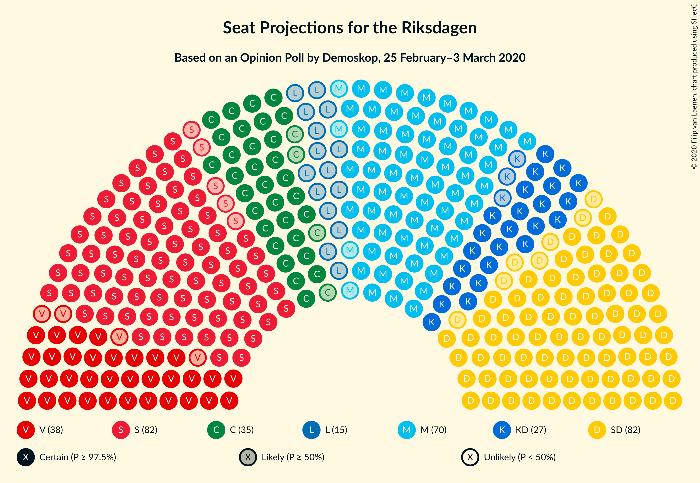
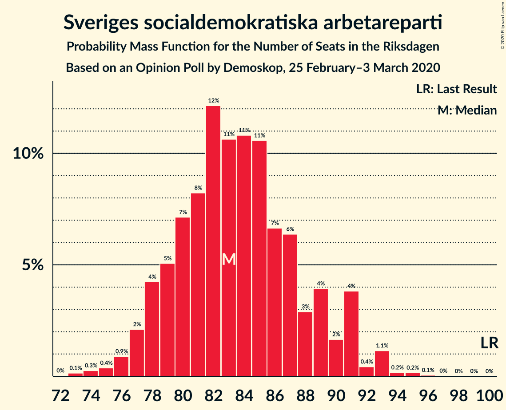
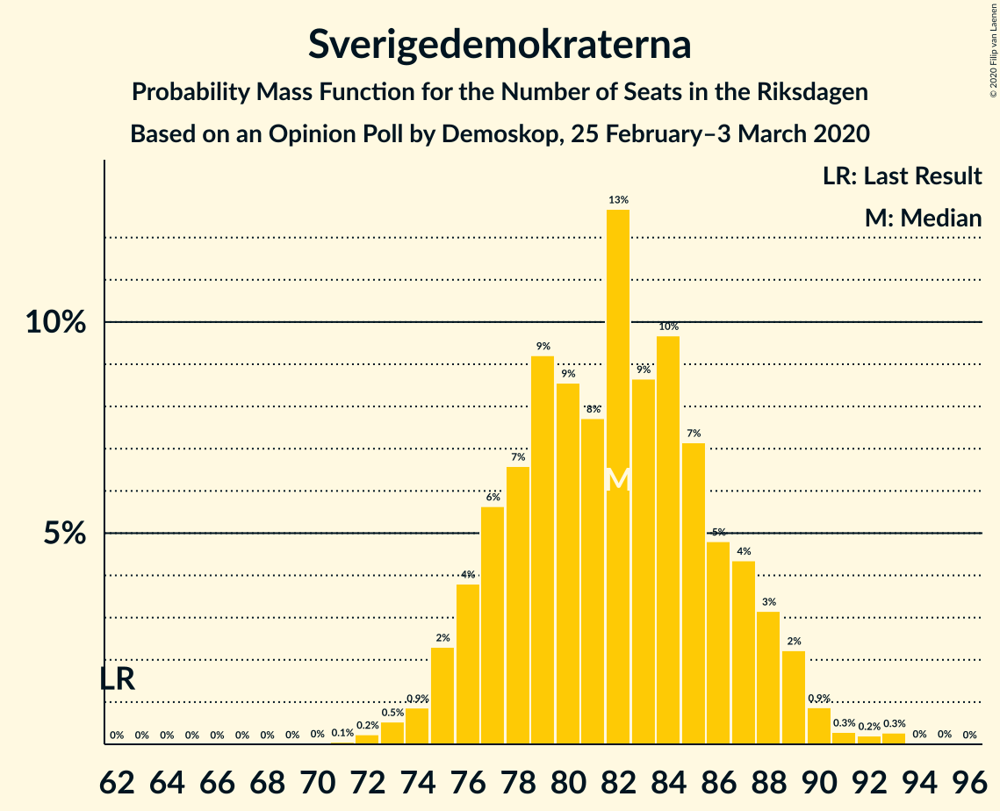
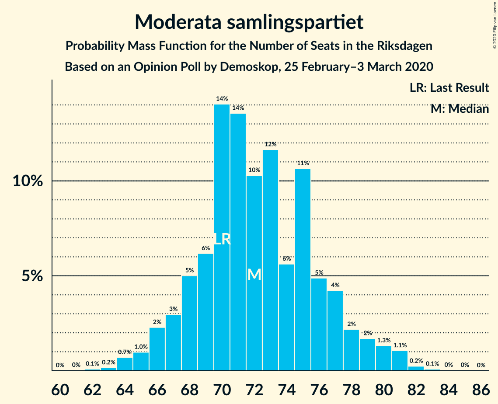
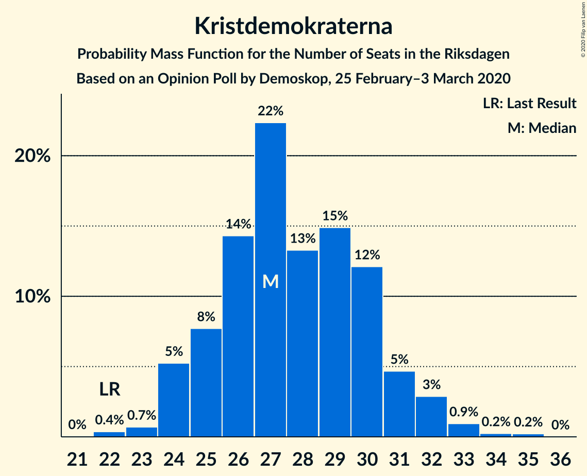
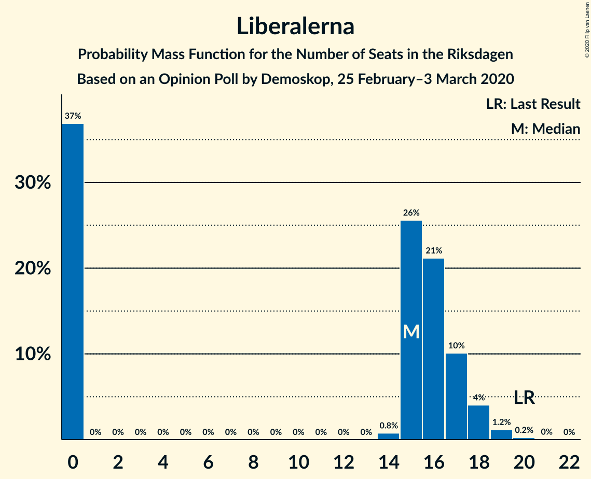
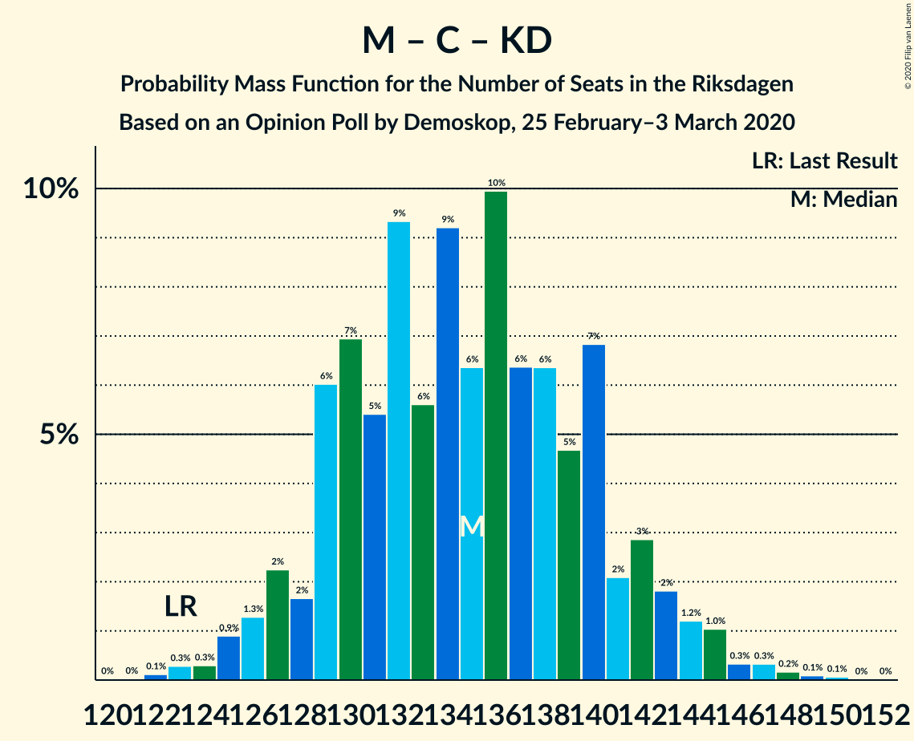
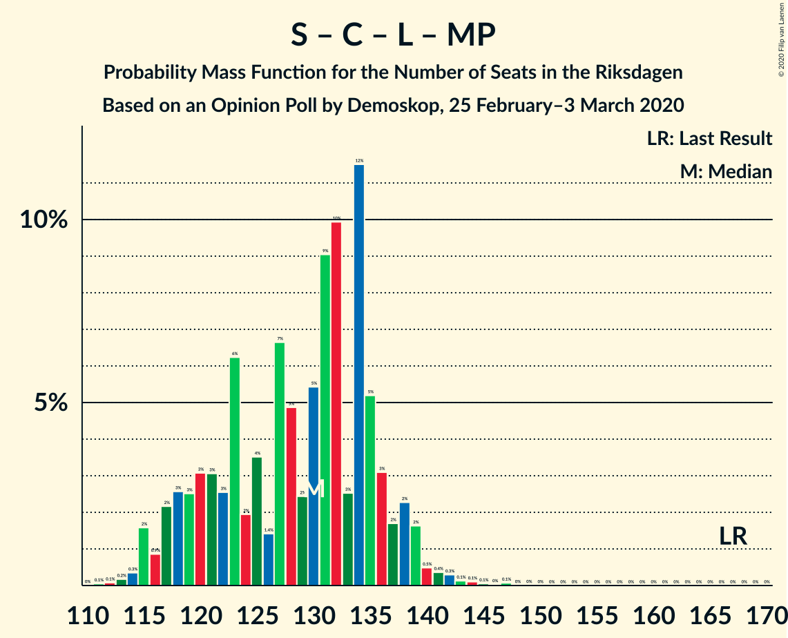
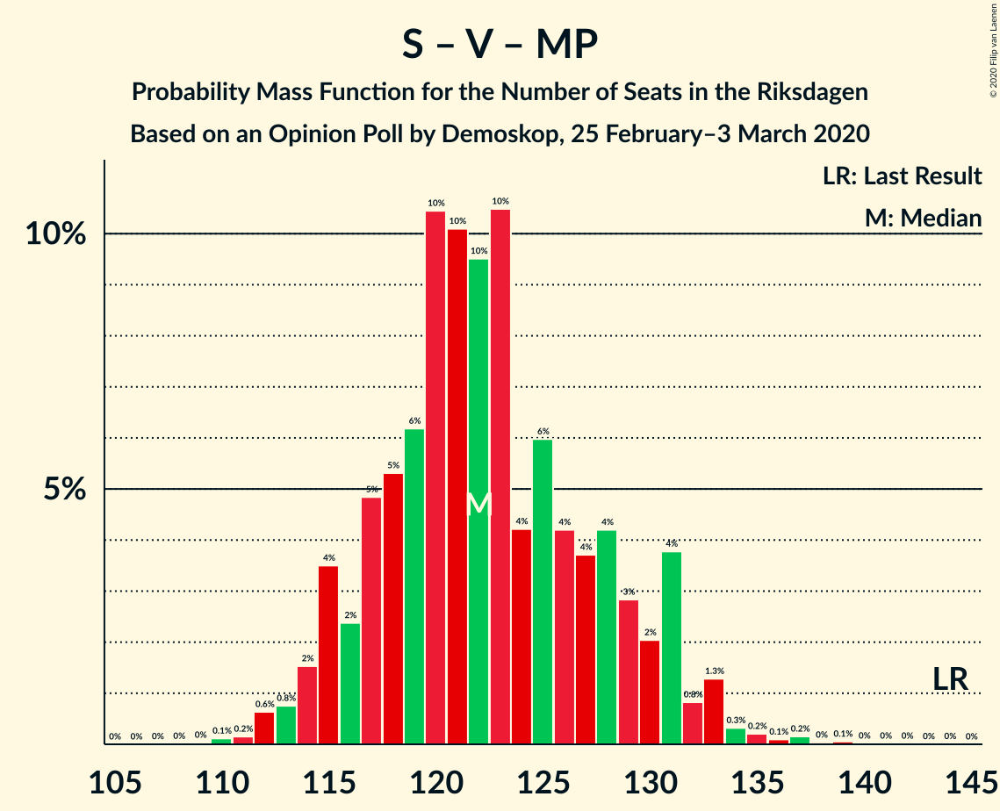

# Opinion Poll by Demoskop, 25 February–3 March 2020

<a href="#voting-intentions">Voting Intentions</a> | <a href="#seats">Seats</a> | <a href="#coalitions">Coalitions</a> | <a href="#technical-information">Technical Information</a>

## Voting Intentions

### Confidence Intervals

| Party | Last Result | Poll Result | 80% Confidence Interval | 90% Confidence Interval | 95% Confidence Interval | 99% Confidence Interval |
|:-----:|:-----------:|:-----------:|:-----------------------:|:-----------------------:|:-----------------------:|:-----------------------:|
| Sveriges socialdemokratiska arbetareparti | 28.3% | 22.6% | 21.5–23.8% |21.2–24.1% |21.0–24.4% |20.4–24.9% |
| Sverigedemokraterna | 17.5% | 22.1% | 21.0–23.2% |20.7–23.6% |20.5–23.8% |20.0–24.4% |
| Moderata samlingspartiet | 19.8% | 19.5% | 18.5–20.6% |18.2–20.9% |18.0–21.2% |17.5–21.7% |
| Vänsterpartiet | 8.0% | 10.4% | 9.6–11.3% |9.4–11.5% |9.2–11.7% |8.9–12.1% |
| Centerpartiet | 8.6% | 9.4% | 8.7–10.2% |8.5–10.5% |8.3–10.7% |7.9–11.1% |
| Kristdemokraterna | 6.3% | 7.5% | 6.8–8.2% |6.6–8.4% |6.5–8.6% |6.2–9.0% |
| Liberalerna | 5.5% | 4.1% | 3.6–4.7% |3.5–4.8% |3.4–5.0% |3.1–5.3% |
| Miljöpartiet de gröna | 4.4% | 3.1% | 2.7–3.6% |2.6–3.8% |2.5–3.9% |2.3–4.1% |

*Note:* The poll result column reflects the actual value used in the calculations. Published results may vary slightly, and in addition be rounded to fewer digits.

## Seats

### Confidence Intervals

| Party | Last Result | Median | 80% Confidence Interval | 90% Confidence Interval | 95% Confidence Interval | 99% Confidence Interval |
|:-----:|:-----------:|:------:|:-----------------------:|:-----------------------:|:-----------------------:|:-----------------------:|
| <a href="#sveriges-socialdemokratiska-arbetareparti">Sveriges socialdemokratiska arbetareparti</a> | 100 | 83 | 79–89 |78–91 |77–91 |75–93 |
| <a href="#sverigedemokraterna">Sverigedemokraterna</a> | 62 | 82 | 77–87 |76–88 |75–89 |73–92 |
| <a href="#moderata-samlingspartiet">Moderata samlingspartiet</a> | 70 | 72 | 68–77 |67–78 |66–80 |64–81 |
| <a href="#vänsterpartiet">Vänsterpartiet</a> | 28 | 38 | 35–42 |35–43 |34–44 |33–45 |
| <a href="#centerpartiet">Centerpartiet</a> | 31 | 35 | 32–38 |31–39 |31–40 |29–42 |
| <a href="#kristdemokraterna">Kristdemokraterna</a> | 22 | 27 | 25–30 |24–31 |24–32 |23–33 |
| <a href="#liberalerna">Liberalerna</a> | 20 | 15 | 0–17 |0–18 |0–18 |0–19 |
| <a href="#miljöpartiet-de-gröna">Miljöpartiet de gröna</a> | 16 | 0 | 0 |0 |0 |0–15 |

### Sveriges socialdemokratiska arbetareparti

*For a full overview of the results for this party, see the [Sveriges socialdemokratiska arbetareparti](party-sverigessocialdemokratiskaarbetareparti.html) page.*

| Number of Seats | Probability | Accumulated | Special Marks |
|:---------------:|:-----------:|:-----------:|:-------------:|
| 73 | 0.1% | 100% |  |
| 74 | 0.3% | 99.8% |  |
| 75 | 0.4% | 99.6% |  |
| 76 | 0.9% | 99.2% |  |
| 77 | 2% | 98% |  |
| 78 | 4% | 96% |  |
| 79 | 5% | 92% |  |
| 80 | 7% | 87% |  |
| 81 | 8% | 80% |  |
| 82 | 12% | 72% |  |
| 83 | 11% | 59% | Median |
| 84 | 11% | 49% |  |
| 85 | 11% | 38% |  |
| 86 | 7% | 27% |  |
| 87 | 6% | 21% |  |
| 88 | 3% | 14% |  |
| 89 | 4% | 11% |  |
| 90 | 2% | 7% |  |
| 91 | 4% | 6% |  |
| 92 | 0.4% | 2% |  |
| 93 | 1.1% | 2% |  |
| 94 | 0.2% | 0.4% |  |
| 95 | 0.2% | 0.2% |  |
| 96 | 0.1% | 0.1% |  |
| 97 | 0% | 0% |  |
| 98 | 0% | 0% |  |
| 99 | 0% | 0% |  |
| 100 | 0% | 0% | Last Result |

### Sverigedemokraterna

*For a full overview of the results for this party, see the [Sverigedemokraterna](party-sverigedemokraterna.html) page.*

| Number of Seats | Probability | Accumulated | Special Marks |
|:---------------:|:-----------:|:-----------:|:-------------:|
| 62 | 0% | 100% | Last Result |
| 63 | 0% | 100% |  |
| 64 | 0% | 100% |  |
| 65 | 0% | 100% |  |
| 66 | 0% | 100% |  |
| 67 | 0% | 100% |  |
| 68 | 0% | 100% |  |
| 69 | 0% | 100% |  |
| 70 | 0% | 100% |  |
| 71 | 0.1% | 100% |  |
| 72 | 0.2% | 99.9% |  |
| 73 | 0.5% | 99.7% |  |
| 74 | 0.9% | 99.1% |  |
| 75 | 2% | 98% |  |
| 76 | 4% | 96% |  |
| 77 | 6% | 92% |  |
| 78 | 7% | 87% |  |
| 79 | 9% | 80% |  |
| 80 | 9% | 71% |  |
| 81 | 8% | 62% |  |
| 82 | 13% | 54% | Median |
| 83 | 9% | 42% |  |
| 84 | 10% | 33% |  |
| 85 | 7% | 23% |  |
| 86 | 5% | 16% |  |
| 87 | 4% | 11% |  |
| 88 | 3% | 7% |  |
| 89 | 2% | 4% |  |
| 90 | 0.9% | 2% |  |
| 91 | 0.3% | 0.8% |  |
| 92 | 0.2% | 0.5% |  |
| 93 | 0.3% | 0.3% |  |
| 94 | 0% | 0.1% |  |
| 95 | 0% | 0% |  |

### Moderata samlingspartiet

*For a full overview of the results for this party, see the [Moderata samlingspartiet](party-moderatasamlingspartiet.html) page.*

| Number of Seats | Probability | Accumulated | Special Marks |
|:---------------:|:-----------:|:-----------:|:-------------:|
| 62 | 0.1% | 100% |  |
| 63 | 0.2% | 99.9% |  |
| 64 | 0.7% | 99.7% |  |
| 65 | 1.0% | 99.0% |  |
| 66 | 2% | 98% |  |
| 67 | 3% | 96% |  |
| 68 | 5% | 93% |  |
| 69 | 6% | 88% |  |
| 70 | 14% | 82% | Last Result |
| 71 | 14% | 68% |  |
| 72 | 10% | 54% | Median |
| 73 | 12% | 44% |  |
| 74 | 6% | 32% |  |
| 75 | 11% | 26% |  |
| 76 | 5% | 16% |  |
| 77 | 4% | 11% |  |
| 78 | 2% | 7% |  |
| 79 | 2% | 4% |  |
| 80 | 1.3% | 3% |  |
| 81 | 1.1% | 1.5% |  |
| 82 | 0.2% | 0.4% |  |
| 83 | 0.1% | 0.1% |  |
| 84 | 0% | 0.1% |  |
| 85 | 0% | 0% |  |

### Vänsterpartiet

*For a full overview of the results for this party, see the [Vänsterpartiet](party-vänsterpartiet.html) page.*

| Number of Seats | Probability | Accumulated | Special Marks |
|:---------------:|:-----------:|:-----------:|:-------------:|
| 28 | 0% | 100% | Last Result |
| 29 | 0% | 100% |  |
| 30 | 0% | 100% |  |
| 31 | 0.1% | 100% |  |
| 32 | 0.3% | 99.8% |  |
| 33 | 1.4% | 99.5% |  |
| 34 | 2% | 98% |  |
| 35 | 7% | 96% |  |
| 36 | 9% | 89% |  |
| 37 | 14% | 81% |  |
| 38 | 17% | 66% | Median |
| 39 | 14% | 49% |  |
| 40 | 12% | 36% |  |
| 41 | 10% | 23% |  |
| 42 | 7% | 13% |  |
| 43 | 3% | 5% |  |
| 44 | 1.4% | 3% |  |
| 45 | 1.0% | 1.4% |  |
| 46 | 0.3% | 0.4% |  |
| 47 | 0.1% | 0.1% |  |
| 48 | 0% | 0% |  |

### Centerpartiet

*For a full overview of the results for this party, see the [Centerpartiet](party-centerpartiet.html) page.*

| Number of Seats | Probability | Accumulated | Special Marks |
|:---------------:|:-----------:|:-----------:|:-------------:|
| 28 | 0.2% | 100% |  |
| 29 | 0.8% | 99.8% |  |
| 30 | 1.2% | 99.0% |  |
| 31 | 3% | 98% | Last Result |
| 32 | 8% | 95% |  |
| 33 | 16% | 86% |  |
| 34 | 17% | 70% |  |
| 35 | 17% | 53% | Median |
| 36 | 15% | 36% |  |
| 37 | 8% | 22% |  |
| 38 | 8% | 14% |  |
| 39 | 3% | 6% |  |
| 40 | 2% | 3% |  |
| 41 | 0.9% | 1.4% |  |
| 42 | 0.4% | 0.5% |  |
| 43 | 0.1% | 0.1% |  |
| 44 | 0% | 0% |  |

### Kristdemokraterna

*For a full overview of the results for this party, see the [Kristdemokraterna](party-kristdemokraterna.html) page.*

| Number of Seats | Probability | Accumulated | Special Marks |
|:---------------:|:-----------:|:-----------:|:-------------:|
| 22 | 0.4% | 100% | Last Result |
| 23 | 0.7% | 99.6% |  |
| 24 | 5% | 98.9% |  |
| 25 | 8% | 94% |  |
| 26 | 14% | 86% |  |
| 27 | 22% | 72% | Median |
| 28 | 13% | 49% |  |
| 29 | 15% | 36% |  |
| 30 | 12% | 21% |  |
| 31 | 5% | 9% |  |
| 32 | 3% | 4% |  |
| 33 | 0.9% | 1.4% |  |
| 34 | 0.2% | 0.5% |  |
| 35 | 0.2% | 0.2% |  |
| 36 | 0% | 0% |  |

### Liberalerna

*For a full overview of the results for this party, see the [Liberalerna](party-liberalerna.html) page.*

| Number of Seats | Probability | Accumulated | Special Marks |
|:---------------:|:-----------:|:-----------:|:-------------:|
| 0 | 37% | 100% |  |
| 1 | 0% | 63% |  |
| 2 | 0% | 63% |  |
| 3 | 0% | 63% |  |
| 4 | 0% | 63% |  |
| 5 | 0% | 63% |  |
| 6 | 0% | 63% |  |
| 7 | 0% | 63% |  |
| 8 | 0% | 63% |  |
| 9 | 0% | 63% |  |
| 10 | 0% | 63% |  |
| 11 | 0% | 63% |  |
| 12 | 0% | 63% |  |
| 13 | 0% | 63% |  |
| 14 | 0.8% | 63% |  |
| 15 | 26% | 62% | Median |
| 16 | 21% | 37% |  |
| 17 | 10% | 16% |  |
| 18 | 4% | 5% |  |
| 19 | 1.2% | 1.4% |  |
| 20 | 0.2% | 0.3% | Last Result |
| 21 | 0% | 0% |  |

### Miljöpartiet de gröna

*For a full overview of the results for this party, see the [Miljöpartiet de gröna](party-miljöpartietdegröna.html) page.*

| Number of Seats | Probability | Accumulated | Special Marks |
|:---------------:|:-----------:|:-----------:|:-------------:|
| 0 | 98.8% | 100% | Median |
| 1 | 0% | 1.2% |  |
| 2 | 0% | 1.2% |  |
| 3 | 0% | 1.2% |  |
| 4 | 0% | 1.2% |  |
| 5 | 0% | 1.2% |  |
| 6 | 0% | 1.2% |  |
| 7 | 0% | 1.2% |  |
| 8 | 0% | 1.2% |  |
| 9 | 0% | 1.2% |  |
| 10 | 0% | 1.2% |  |
| 11 | 0% | 1.2% |  |
| 12 | 0% | 1.2% |  |
| 13 | 0% | 1.2% |  |
| 14 | 0.4% | 1.2% |  |
| 15 | 0.7% | 0.8% |  |
| 16 | 0.1% | 0.1% | Last Result |
| 17 | 0% | 0% |  |

## Coalitions

### Confidence Intervals

| Coalition | Last Result | Median | Majority? | 80% Confidence Interval | 90% Confidence Interval | 95% Confidence Interval | 99% Confidence Interval |
|:---------:|:-----------:|:------:|:---------:|:-----------------------:|:-----------------------:|:-----------------------:|:-----------------------:|
| Sveriges socialdemokratiska arbetareparti – Moderata samlingspartiet – Centerpartiet | 201 | 190 | 100% | 184–199 | 182–200 | 181–202 | 178–205 |
| Sverigedemokraterna – Moderata samlingspartiet – Kristdemokraterna | 154 | 180 | 92% | 175–190 | 173–192 | 172–194 | 169–195 |
| Sveriges socialdemokratiska arbetareparti – Vänsterpartiet – Centerpartiet – Liberalerna – Miljöpartiet de gröna | 195 | 169 | 8% | 159–174 | 157–176 | 155–177 | 154–180 |
| Sveriges socialdemokratiska arbetareparti – Moderata samlingspartiet | 170 | 155 | 0% | 150–163 | 148–165 | 147–166 | 144–169 |
| Sverigedemokraterna – Moderata samlingspartiet | 132 | 154 | 0% | 147–161 | 146–163 | 144–164 | 142–167 |
| Moderata samlingspartiet – Centerpartiet – Kristdemokraterna – Liberalerna | 143 | 145 | 0% | 137–152 | 135–154 | 133–155 | 131–157 |
| Moderata samlingspartiet – Centerpartiet – Kristdemokraterna | 123 | 135 | 0% | 129–141 | 127–143 | 126–144 | 124–147 |
| Sveriges socialdemokratiska arbetareparti – Centerpartiet – Liberalerna – Miljöpartiet de gröna | 167 | 130 | 0% | 119–136 | 117–138 | 116–139 | 114–142 |
| Sveriges socialdemokratiska arbetareparti – Vänsterpartiet – Miljöpartiet de gröna | 144 | 122 | 0% | 117–129 | 115–131 | 114–132 | 112–135 |
| Sveriges socialdemokratiska arbetareparti – Vänsterpartiet | 128 | 122 | 0% | 117–129 | 115–131 | 114–131 | 112–133 |
| Moderata samlingspartiet – Centerpartiet – Liberalerna | 121 | 119 | 0% | 108–124 | 106–126 | 104–127 | 102–129 |
| Moderata samlingspartiet – Centerpartiet | 101 | 107 | 0% | 102–112 | 101–114 | 100–115 | 97–118 |
| Sveriges socialdemokratiska arbetareparti – Miljöpartiet de gröna | 116 | 83 | 0% | 79–89 | 78–91 | 77–92 | 75–96 |

### Sveriges socialdemokratiska arbetareparti – Moderata samlingspartiet – Centerpartiet

| Number of Seats | Probability | Accumulated | Special Marks |
|:---------------:|:-----------:|:-----------:|:-------------:|
| 175 | 0.1% | 100% | Majority |
| 176 | 0.1% | 99.9% |  |
| 177 | 0.1% | 99.8% |  |
| 178 | 0.4% | 99.7% |  |
| 179 | 0.4% | 99.2% |  |
| 180 | 0.9% | 98.8% |  |
| 181 | 1.0% | 98% |  |
| 182 | 3% | 97% |  |
| 183 | 3% | 94% |  |
| 184 | 3% | 92% |  |
| 185 | 7% | 89% |  |
| 186 | 7% | 82% |  |
| 187 | 7% | 75% |  |
| 188 | 9% | 68% |  |
| 189 | 8% | 58% |  |
| 190 | 4% | 51% | Median |
| 191 | 5% | 46% |  |
| 192 | 6% | 42% |  |
| 193 | 6% | 36% |  |
| 194 | 4% | 29% |  |
| 195 | 3% | 26% |  |
| 196 | 5% | 23% |  |
| 197 | 3% | 18% |  |
| 198 | 4% | 15% |  |
| 199 | 4% | 11% |  |
| 200 | 2% | 6% |  |
| 201 | 2% | 5% | Last Result |
| 202 | 0.9% | 3% |  |
| 203 | 0.5% | 2% |  |
| 204 | 0.9% | 1.4% |  |
| 205 | 0.3% | 0.5% |  |
| 206 | 0.2% | 0.3% |  |
| 207 | 0% | 0.1% |  |
| 208 | 0% | 0.1% |  |
| 209 | 0% | 0% |  |

### Sverigedemokraterna – Moderata samlingspartiet – Kristdemokraterna

| Number of Seats | Probability | Accumulated | Special Marks |
|:---------------:|:-----------:|:-----------:|:-------------:|
| 154 | 0% | 100% | Last Result |
| 155 | 0% | 100% |  |
| 156 | 0% | 100% |  |
| 157 | 0% | 100% |  |
| 158 | 0% | 100% |  |
| 159 | 0% | 100% |  |
| 160 | 0% | 100% |  |
| 161 | 0% | 100% |  |
| 162 | 0% | 100% |  |
| 163 | 0% | 100% |  |
| 164 | 0% | 100% |  |
| 165 | 0.1% | 100% |  |
| 166 | 0% | 99.9% |  |
| 167 | 0.1% | 99.9% |  |
| 168 | 0.1% | 99.8% |  |
| 169 | 0.3% | 99.7% |  |
| 170 | 0.5% | 99.4% |  |
| 171 | 0.8% | 98.9% |  |
| 172 | 0.7% | 98% |  |
| 173 | 3% | 97% |  |
| 174 | 2% | 95% |  |
| 175 | 3% | 92% | Majority |
| 176 | 7% | 90% |  |
| 177 | 9% | 83% |  |
| 178 | 6% | 74% |  |
| 179 | 8% | 69% |  |
| 180 | 11% | 61% |  |
| 181 | 3% | 50% | Median |
| 182 | 7% | 47% |  |
| 183 | 5% | 40% |  |
| 184 | 6% | 35% |  |
| 185 | 5% | 30% |  |
| 186 | 3% | 25% |  |
| 187 | 3% | 22% |  |
| 188 | 4% | 19% |  |
| 189 | 4% | 15% |  |
| 190 | 4% | 11% |  |
| 191 | 2% | 7% |  |
| 192 | 2% | 6% |  |
| 193 | 1.1% | 4% |  |
| 194 | 2% | 3% |  |
| 195 | 0.6% | 1.0% |  |
| 196 | 0.1% | 0.4% |  |
| 197 | 0.1% | 0.3% |  |
| 198 | 0.1% | 0.1% |  |
| 199 | 0.1% | 0.1% |  |
| 200 | 0% | 0% |  |

### Sveriges socialdemokratiska arbetareparti – Vänsterpartiet – Centerpartiet – Liberalerna – Miljöpartiet de gröna

| Number of Seats | Probability | Accumulated | Special Marks |
|:---------------:|:-----------:|:-----------:|:-------------:|
| 150 | 0.1% | 100% |  |
| 151 | 0.1% | 99.9% |  |
| 152 | 0.1% | 99.9% |  |
| 153 | 0.1% | 99.7% |  |
| 154 | 0.6% | 99.6% |  |
| 155 | 2% | 99.0% |  |
| 156 | 1.1% | 97% |  |
| 157 | 2% | 96% |  |
| 158 | 2% | 94% |  |
| 159 | 4% | 93% |  |
| 160 | 4% | 89% |  |
| 161 | 4% | 85% |  |
| 162 | 3% | 81% |  |
| 163 | 3% | 78% |  |
| 164 | 5% | 75% |  |
| 165 | 6% | 70% |  |
| 166 | 5% | 65% |  |
| 167 | 7% | 60% |  |
| 168 | 3% | 53% |  |
| 169 | 11% | 50% |  |
| 170 | 8% | 39% |  |
| 171 | 6% | 31% | Median |
| 172 | 9% | 26% |  |
| 173 | 7% | 17% |  |
| 174 | 3% | 10% |  |
| 175 | 2% | 8% | Majority |
| 176 | 3% | 5% |  |
| 177 | 0.7% | 3% |  |
| 178 | 0.8% | 2% |  |
| 179 | 0.5% | 1.1% |  |
| 180 | 0.3% | 0.6% |  |
| 181 | 0.1% | 0.3% |  |
| 182 | 0.1% | 0.2% |  |
| 183 | 0% | 0.1% |  |
| 184 | 0.1% | 0.1% |  |
| 185 | 0% | 0% |  |
| 186 | 0% | 0% |  |
| 187 | 0% | 0% |  |
| 188 | 0% | 0% |  |
| 189 | 0% | 0% |  |
| 190 | 0% | 0% |  |
| 191 | 0% | 0% |  |
| 192 | 0% | 0% |  |
| 193 | 0% | 0% |  |
| 194 | 0% | 0% |  |
| 195 | 0% | 0% | Last Result |

### Sveriges socialdemokratiska arbetareparti – Moderata samlingspartiet

| Number of Seats | Probability | Accumulated | Special Marks |
|:---------------:|:-----------:|:-----------:|:-------------:|
| 141 | 0.1% | 100% |  |
| 142 | 0.1% | 99.9% |  |
| 143 | 0.2% | 99.8% |  |
| 144 | 0.4% | 99.6% |  |
| 145 | 0.4% | 99.2% |  |
| 146 | 1.0% | 98.8% |  |
| 147 | 1.2% | 98% |  |
| 148 | 3% | 97% |  |
| 149 | 2% | 93% |  |
| 150 | 5% | 91% |  |
| 151 | 5% | 86% |  |
| 152 | 9% | 81% |  |
| 153 | 11% | 73% |  |
| 154 | 5% | 62% |  |
| 155 | 9% | 57% | Median |
| 156 | 6% | 48% |  |
| 157 | 6% | 42% |  |
| 158 | 7% | 35% |  |
| 159 | 5% | 28% |  |
| 160 | 4% | 23% |  |
| 161 | 3% | 20% |  |
| 162 | 4% | 16% |  |
| 163 | 4% | 12% |  |
| 164 | 3% | 9% |  |
| 165 | 2% | 6% |  |
| 166 | 2% | 4% |  |
| 167 | 0.5% | 2% |  |
| 168 | 0.4% | 1.4% |  |
| 169 | 0.7% | 0.9% |  |
| 170 | 0.1% | 0.2% | Last Result |
| 171 | 0.1% | 0.1% |  |
| 172 | 0% | 0% |  |

### Sverigedemokraterna – Moderata samlingspartiet

| Number of Seats | Probability | Accumulated | Special Marks |
|:---------------:|:-----------:|:-----------:|:-------------:|
| 132 | 0% | 100% | Last Result |
| 133 | 0% | 100% |  |
| 134 | 0% | 100% |  |
| 135 | 0% | 100% |  |
| 136 | 0% | 100% |  |
| 137 | 0% | 100% |  |
| 138 | 0% | 100% |  |
| 139 | 0.1% | 100% |  |
| 140 | 0.1% | 99.9% |  |
| 141 | 0.1% | 99.8% |  |
| 142 | 0.3% | 99.7% |  |
| 143 | 0.5% | 99.4% |  |
| 144 | 2% | 98.8% |  |
| 145 | 1.1% | 97% |  |
| 146 | 2% | 96% |  |
| 147 | 5% | 94% |  |
| 148 | 3% | 89% |  |
| 149 | 5% | 85% |  |
| 150 | 7% | 81% |  |
| 151 | 9% | 74% |  |
| 152 | 7% | 65% |  |
| 153 | 6% | 59% |  |
| 154 | 11% | 53% | Median |
| 155 | 5% | 42% |  |
| 156 | 6% | 37% |  |
| 157 | 4% | 31% |  |
| 158 | 5% | 27% |  |
| 159 | 7% | 22% |  |
| 160 | 5% | 15% |  |
| 161 | 2% | 11% |  |
| 162 | 2% | 9% |  |
| 163 | 2% | 7% |  |
| 164 | 3% | 5% |  |
| 165 | 1.4% | 2% |  |
| 166 | 0.3% | 0.8% |  |
| 167 | 0.2% | 0.5% |  |
| 168 | 0.2% | 0.3% |  |
| 169 | 0.1% | 0.1% |  |
| 170 | 0% | 0.1% |  |
| 171 | 0% | 0% |  |

### Moderata samlingspartiet – Centerpartiet – Kristdemokraterna – Liberalerna

| Number of Seats | Probability | Accumulated | Special Marks |
|:---------------:|:-----------:|:-----------:|:-------------:|
| 128 | 0.1% | 100% |  |
| 129 | 0.2% | 99.9% |  |
| 130 | 0.1% | 99.6% |  |
| 131 | 0.3% | 99.5% |  |
| 132 | 1.3% | 99.2% |  |
| 133 | 1.1% | 98% |  |
| 134 | 2% | 97% |  |
| 135 | 1.0% | 95% |  |
| 136 | 4% | 94% |  |
| 137 | 4% | 90% |  |
| 138 | 5% | 86% |  |
| 139 | 4% | 81% |  |
| 140 | 6% | 78% |  |
| 141 | 3% | 71% |  |
| 142 | 4% | 69% |  |
| 143 | 3% | 65% | Last Result |
| 144 | 4% | 62% |  |
| 145 | 8% | 58% |  |
| 146 | 5% | 50% |  |
| 147 | 5% | 45% |  |
| 148 | 10% | 40% |  |
| 149 | 6% | 30% | Median |
| 150 | 7% | 24% |  |
| 151 | 4% | 17% |  |
| 152 | 5% | 13% |  |
| 153 | 3% | 8% |  |
| 154 | 1.5% | 5% |  |
| 155 | 2% | 4% |  |
| 156 | 1.2% | 2% |  |
| 157 | 0.3% | 0.8% |  |
| 158 | 0.2% | 0.5% |  |
| 159 | 0.1% | 0.3% |  |
| 160 | 0.1% | 0.1% |  |
| 161 | 0% | 0% |  |

### Moderata samlingspartiet – Centerpartiet – Kristdemokraterna

| Number of Seats | Probability | Accumulated | Special Marks |
|:---------------:|:-----------:|:-----------:|:-------------:|
| 121 | 0% | 100% |  |
| 122 | 0.1% | 99.9% |  |
| 123 | 0.3% | 99.8% | Last Result |
| 124 | 0.3% | 99.5% |  |
| 125 | 0.9% | 99.2% |  |
| 126 | 1.3% | 98% |  |
| 127 | 2% | 97% |  |
| 128 | 2% | 95% |  |
| 129 | 6% | 93% |  |
| 130 | 7% | 87% |  |
| 131 | 5% | 80% |  |
| 132 | 9% | 75% |  |
| 133 | 6% | 65% |  |
| 134 | 9% | 60% | Median |
| 135 | 6% | 51% |  |
| 136 | 10% | 44% |  |
| 137 | 6% | 34% |  |
| 138 | 6% | 28% |  |
| 139 | 5% | 22% |  |
| 140 | 7% | 17% |  |
| 141 | 2% | 10% |  |
| 142 | 3% | 8% |  |
| 143 | 2% | 5% |  |
| 144 | 1.2% | 3% |  |
| 145 | 1.0% | 2% |  |
| 146 | 0.3% | 1.0% |  |
| 147 | 0.3% | 0.7% |  |
| 148 | 0.2% | 0.4% |  |
| 149 | 0.1% | 0.2% |  |
| 150 | 0.1% | 0.1% |  |
| 151 | 0% | 0% |  |

### Sveriges socialdemokratiska arbetareparti – Centerpartiet – Liberalerna – Miljöpartiet de gröna

| Number of Seats | Probability | Accumulated | Special Marks |
|:---------------:|:-----------:|:-----------:|:-------------:|
| 111 | 0.1% | 100% |  |
| 112 | 0.1% | 99.9% |  |
| 113 | 0.2% | 99.9% |  |
| 114 | 0.3% | 99.7% |  |
| 115 | 2% | 99.3% |  |
| 116 | 0.9% | 98% |  |
| 117 | 2% | 97% |  |
| 118 | 3% | 95% |  |
| 119 | 3% | 92% |  |
| 120 | 3% | 90% |  |
| 121 | 3% | 87% |  |
| 122 | 3% | 84% |  |
| 123 | 6% | 81% |  |
| 124 | 2% | 75% |  |
| 125 | 4% | 73% |  |
| 126 | 1.4% | 69% |  |
| 127 | 7% | 68% |  |
| 128 | 5% | 61% |  |
| 129 | 2% | 56% |  |
| 130 | 5% | 54% |  |
| 131 | 9% | 48% |  |
| 132 | 10% | 39% |  |
| 133 | 3% | 29% | Median |
| 134 | 12% | 27% |  |
| 135 | 5% | 15% |  |
| 136 | 3% | 10% |  |
| 137 | 2% | 7% |  |
| 138 | 2% | 5% |  |
| 139 | 2% | 3% |  |
| 140 | 0.5% | 2% |  |
| 141 | 0.4% | 1.1% |  |
| 142 | 0.3% | 0.7% |  |
| 143 | 0.1% | 0.4% |  |
| 144 | 0.1% | 0.3% |  |
| 145 | 0.1% | 0.2% |  |
| 146 | 0% | 0.1% |  |
| 147 | 0.1% | 0.1% |  |
| 148 | 0% | 0% |  |
| 149 | 0% | 0% |  |
| 150 | 0% | 0% |  |
| 151 | 0% | 0% |  |
| 152 | 0% | 0% |  |
| 153 | 0% | 0% |  |
| 154 | 0% | 0% |  |
| 155 | 0% | 0% |  |
| 156 | 0% | 0% |  |
| 157 | 0% | 0% |  |
| 158 | 0% | 0% |  |
| 159 | 0% | 0% |  |
| 160 | 0% | 0% |  |
| 161 | 0% | 0% |  |
| 162 | 0% | 0% |  |
| 163 | 0% | 0% |  |
| 164 | 0% | 0% |  |
| 165 | 0% | 0% |  |
| 166 | 0% | 0% |  |
| 167 | 0% | 0% | Last Result |

### Sveriges socialdemokratiska arbetareparti – Vänsterpartiet – Miljöpartiet de gröna

| Number of Seats | Probability | Accumulated | Special Marks |
|:---------------:|:-----------:|:-----------:|:-------------:|
| 109 | 0% | 100% |  |
| 110 | 0.1% | 99.9% |  |
| 111 | 0.2% | 99.8% |  |
| 112 | 0.6% | 99.7% |  |
| 113 | 0.8% | 99.0% |  |
| 114 | 2% | 98% |  |
| 115 | 4% | 97% |  |
| 116 | 2% | 93% |  |
| 117 | 5% | 91% |  |
| 118 | 5% | 86% |  |
| 119 | 6% | 81% |  |
| 120 | 10% | 75% |  |
| 121 | 10% | 64% | Median |
| 122 | 10% | 54% |  |
| 123 | 10% | 44% |  |
| 124 | 4% | 34% |  |
| 125 | 6% | 30% |  |
| 126 | 4% | 24% |  |
| 127 | 4% | 20% |  |
| 128 | 4% | 16% |  |
| 129 | 3% | 12% |  |
| 130 | 2% | 9% |  |
| 131 | 4% | 7% |  |
| 132 | 0.8% | 3% |  |
| 133 | 1.3% | 2% |  |
| 134 | 0.3% | 0.9% |  |
| 135 | 0.2% | 0.6% |  |
| 136 | 0.1% | 0.4% |  |
| 137 | 0.2% | 0.3% |  |
| 138 | 0% | 0.2% |  |
| 139 | 0.1% | 0.1% |  |
| 140 | 0% | 0.1% |  |
| 141 | 0% | 0% |  |
| 142 | 0% | 0% |  |
| 143 | 0% | 0% |  |
| 144 | 0% | 0% | Last Result |

### Sveriges socialdemokratiska arbetareparti – Vänsterpartiet

| Number of Seats | Probability | Accumulated | Special Marks |
|:---------------:|:-----------:|:-----------:|:-------------:|
| 109 | 0% | 100% |  |
| 110 | 0.1% | 99.9% |  |
| 111 | 0.2% | 99.8% |  |
| 112 | 0.7% | 99.6% |  |
| 113 | 0.9% | 98.9% |  |
| 114 | 2% | 98% |  |
| 115 | 4% | 96% |  |
| 116 | 3% | 93% |  |
| 117 | 5% | 90% |  |
| 118 | 5% | 85% |  |
| 119 | 6% | 80% |  |
| 120 | 11% | 74% |  |
| 121 | 10% | 63% | Median |
| 122 | 10% | 53% |  |
| 123 | 10% | 43% |  |
| 124 | 4% | 33% |  |
| 125 | 6% | 29% |  |
| 126 | 4% | 23% |  |
| 127 | 4% | 19% |  |
| 128 | 4% | 15% | Last Result |
| 129 | 3% | 11% |  |
| 130 | 2% | 8% |  |
| 131 | 4% | 6% |  |
| 132 | 0.7% | 2% |  |
| 133 | 1.2% | 2% |  |
| 134 | 0.2% | 0.5% |  |
| 135 | 0.2% | 0.3% |  |
| 136 | 0% | 0.1% |  |
| 137 | 0% | 0.1% |  |
| 138 | 0% | 0% |  |

### Moderata samlingspartiet – Centerpartiet – Liberalerna

| Number of Seats | Probability | Accumulated | Special Marks |
|:---------------:|:-----------:|:-----------:|:-------------:|
| 100 | 0% | 100% |  |
| 101 | 0.1% | 99.9% |  |
| 102 | 0.4% | 99.8% |  |
| 103 | 0.4% | 99.4% |  |
| 104 | 2% | 99.1% |  |
| 105 | 1.1% | 97% |  |
| 106 | 1.2% | 96% |  |
| 107 | 2% | 95% |  |
| 108 | 7% | 93% |  |
| 109 | 4% | 86% |  |
| 110 | 2% | 82% |  |
| 111 | 6% | 80% |  |
| 112 | 5% | 75% |  |
| 113 | 2% | 70% |  |
| 114 | 2% | 68% |  |
| 115 | 4% | 66% |  |
| 116 | 2% | 62% |  |
| 117 | 4% | 60% |  |
| 118 | 7% | 57% |  |
| 119 | 7% | 50% |  |
| 120 | 3% | 43% |  |
| 121 | 9% | 39% | Last Result |
| 122 | 9% | 30% | Median |
| 123 | 7% | 21% |  |
| 124 | 4% | 14% |  |
| 125 | 3% | 10% |  |
| 126 | 3% | 7% |  |
| 127 | 2% | 3% |  |
| 128 | 0.7% | 2% |  |
| 129 | 0.7% | 1.2% |  |
| 130 | 0.2% | 0.5% |  |
| 131 | 0.2% | 0.3% |  |
| 132 | 0% | 0.1% |  |
| 133 | 0% | 0.1% |  |
| 134 | 0% | 0% |  |

### Moderata samlingspartiet – Centerpartiet

| Number of Seats | Probability | Accumulated | Special Marks |
|:---------------:|:-----------:|:-----------:|:-------------:|
| 95 | 0.1% | 100% |  |
| 96 | 0.2% | 99.9% |  |
| 97 | 0.6% | 99.7% |  |
| 98 | 0.4% | 99.2% |  |
| 99 | 1.1% | 98.7% |  |
| 100 | 2% | 98% |  |
| 101 | 3% | 96% | Last Result |
| 102 | 5% | 93% |  |
| 103 | 9% | 88% |  |
| 104 | 6% | 79% |  |
| 105 | 8% | 73% |  |
| 106 | 9% | 64% |  |
| 107 | 13% | 55% | Median |
| 108 | 9% | 43% |  |
| 109 | 7% | 34% |  |
| 110 | 6% | 26% |  |
| 111 | 8% | 21% |  |
| 112 | 5% | 13% |  |
| 113 | 2% | 8% |  |
| 114 | 2% | 6% |  |
| 115 | 2% | 5% |  |
| 116 | 0.6% | 2% |  |
| 117 | 0.6% | 2% |  |
| 118 | 0.7% | 1.0% |  |
| 119 | 0.2% | 0.3% |  |
| 120 | 0% | 0.1% |  |
| 121 | 0.1% | 0.1% |  |
| 122 | 0% | 0% |  |

### Sveriges socialdemokratiska arbetareparti – Miljöpartiet de gröna

| Number of Seats | Probability | Accumulated | Special Marks |
|:---------------:|:-----------:|:-----------:|:-------------:|
| 73 | 0.1% | 100% |  |
| 74 | 0.2% | 99.9% |  |
| 75 | 0.3% | 99.6% |  |
| 76 | 0.9% | 99.3% |  |
| 77 | 2% | 98% |  |
| 78 | 4% | 96% |  |
| 79 | 5% | 92% |  |
| 80 | 7% | 87% |  |
| 81 | 8% | 80% |  |
| 82 | 12% | 72% |  |
| 83 | 11% | 60% | Median |
| 84 | 11% | 50% |  |
| 85 | 11% | 39% |  |
| 86 | 7% | 28% |  |
| 87 | 6% | 22% |  |
| 88 | 3% | 15% |  |
| 89 | 4% | 13% |  |
| 90 | 2% | 9% |  |
| 91 | 4% | 7% |  |
| 92 | 0.6% | 3% |  |
| 93 | 1.3% | 2% |  |
| 94 | 0.2% | 1.2% |  |
| 95 | 0.3% | 0.9% |  |
| 96 | 0.1% | 0.6% |  |
| 97 | 0.1% | 0.5% |  |
| 98 | 0.1% | 0.4% |  |
| 99 | 0.1% | 0.3% |  |
| 100 | 0% | 0.1% |  |
| 101 | 0% | 0.1% |  |
| 102 | 0% | 0.1% |  |
| 103 | 0% | 0% |  |
| 104 | 0% | 0% |  |
| 105 | 0% | 0% |  |
| 106 | 0% | 0% |  |
| 107 | 0% | 0% |  |
| 108 | 0% | 0% |  |
| 109 | 0% | 0% |  |
| 110 | 0% | 0% |  |
| 111 | 0% | 0% |  |
| 112 | 0% | 0% |  |
| 113 | 0% | 0% |  |
| 114 | 0% | 0% |  |
| 115 | 0% | 0% |  |
| 116 | 0% | 0% | Last Result |

## Technical Information

### Opinion Poll

+ **Polling firm:** Demoskop
+ **Commissioner(s):** —
+ **Fieldwork period:** 25 February–3 March 2020

### Calculations

+ **Sample size:** 2326
+ **Simulations done:** 1,048,576
+ **Error estimate:** 1.80%

