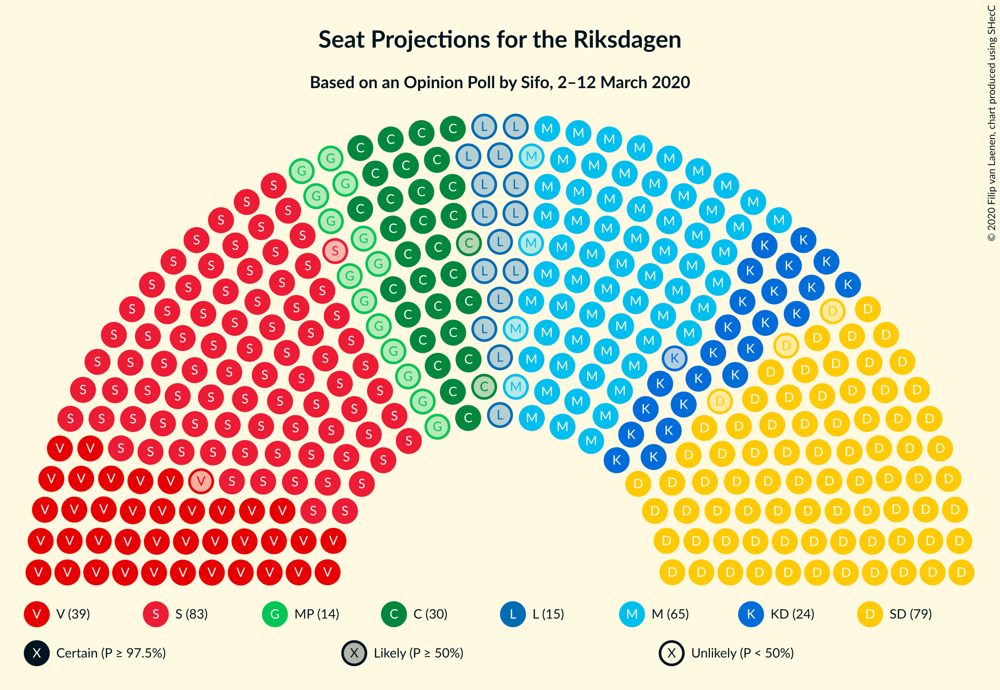
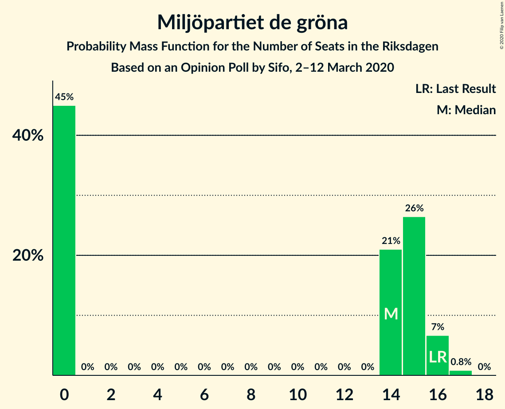
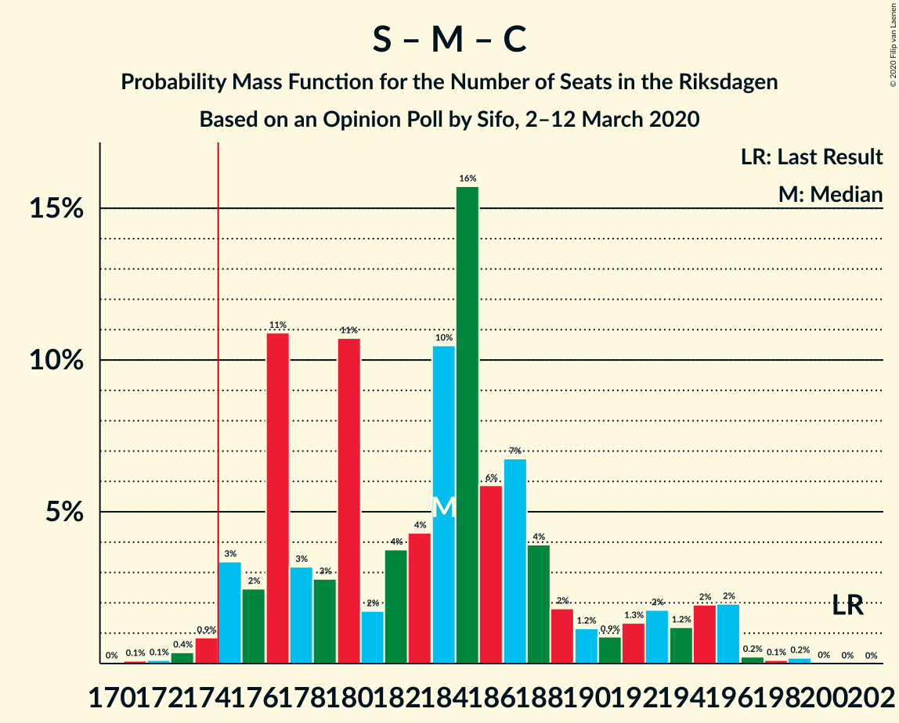
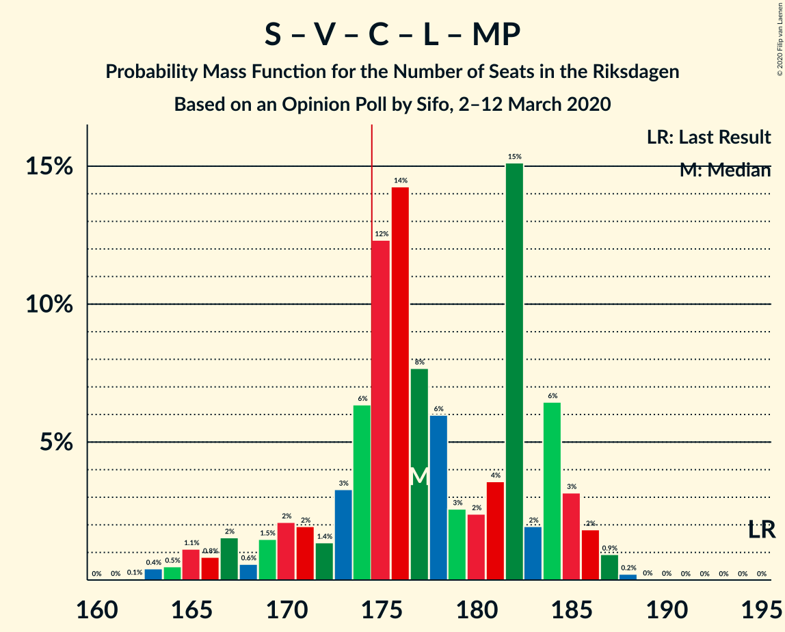
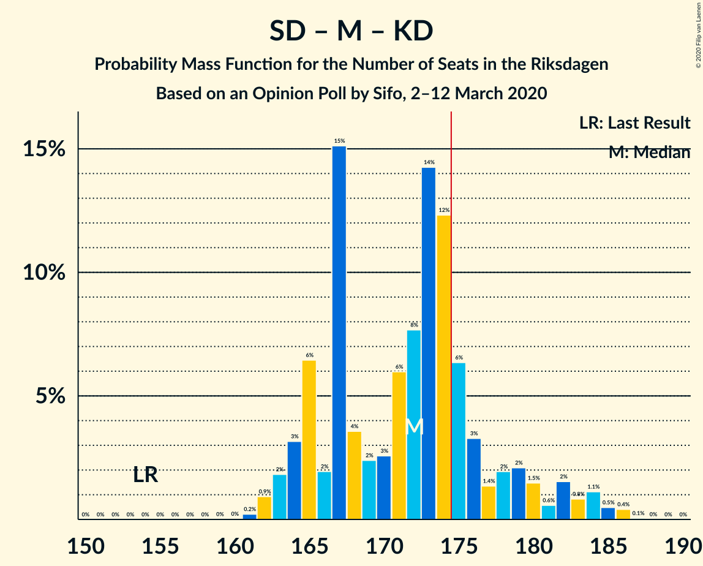
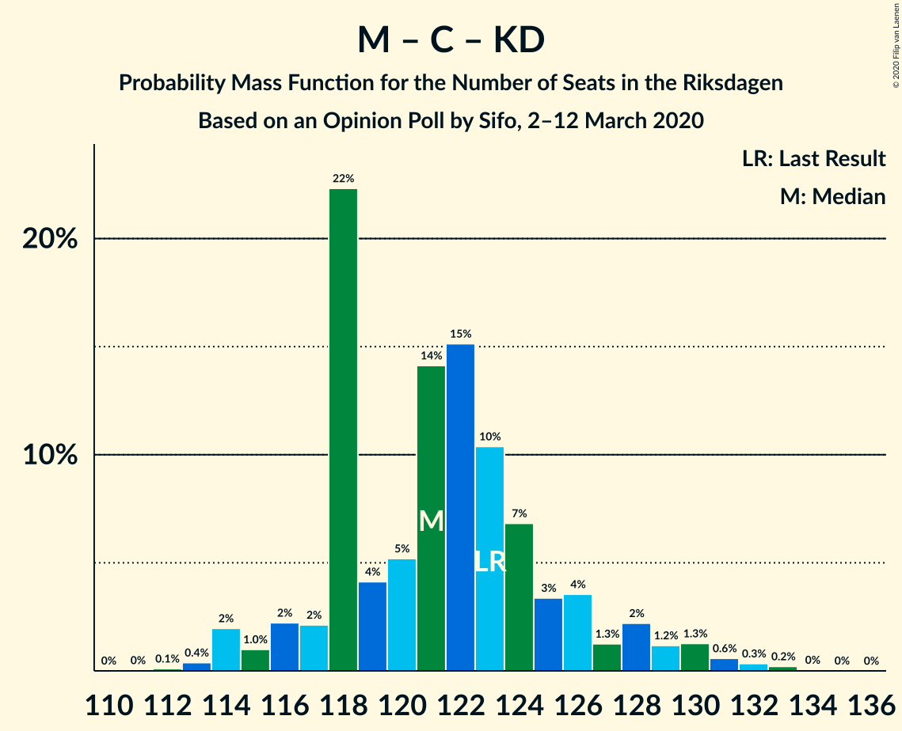

# Opinion Poll by Sifo, 2–12 March 2020

<a href="#voting-intentions">Voting Intentions</a> | <a href="#seats">Seats</a> | <a href="#coalitions">Coalitions</a> | <a href="#technical-information">Technical Information</a>

## Voting Intentions

### Confidence Intervals

| Party | Last Result | Poll Result | 80% Confidence Interval | 90% Confidence Interval | 95% Confidence Interval | 99% Confidence Interval |
|:-----:|:-----------:|:-----------:|:-----------------------:|:-----------------------:|:-----------------------:|:-----------------------:|
| Sveriges socialdemokratiska arbetareparti | 28.3% | 23.8% | 23.2–24.4% |23.0–24.6% |22.8–24.7% |22.6–25.0% |
| Sverigedemokraterna | 17.5% | 22.2% | 21.6–22.8% |21.4–23.0% |21.3–23.1% |21.0–23.4% |
| Moderata samlingspartiet | 19.8% | 18.0% | 17.4–18.6% |17.3–18.7% |17.1–18.9% |16.9–19.1% |
| Vänsterpartiet | 8.0% | 11.2% | 10.7–11.7% |10.6–11.8% |10.5–11.9% |10.3–12.1% |
| Centerpartiet | 8.6% | 8.4% | 8.0–8.8% |7.9–8.9% |7.8–9.0% |7.6–9.2% |
| Kristdemokraterna | 6.3% | 6.8% | 6.4–7.2% |6.3–7.3% |6.2–7.4% |6.1–7.6% |
| Liberalerna | 5.5% | 4.1% | 3.8–4.4% |3.7–4.5% |3.7–4.6% |3.6–4.7% |
| Miljöpartiet de gröna | 4.4% | 4.0% | 3.7–4.3% |3.6–4.4% |3.6–4.5% |3.4–4.6% |

*Note:* The poll result column reflects the actual value used in the calculations. Published results may vary slightly, and in addition be rounded to fewer digits.

## Seats

### Confidence Intervals

| Party | Last Result | Median | 80% Confidence Interval | 90% Confidence Interval | 95% Confidence Interval | 99% Confidence Interval |
|:-----:|:-----------:|:------:|:-----------------------:|:-----------------------:|:-----------------------:|:-----------------------:|
| <a href="#sveriges-socialdemokratiska-arbetareparti">Sveriges socialdemokratiska arbetareparti</a> | 100 | 87 | 84–91 |83–92 |82–93 |81–95 |
| <a href="#sverigedemokraterna">Sverigedemokraterna</a> | 62 | 81 | 78–84 |78–86 |76–87 |75–88 |
| <a href="#moderata-samlingspartiet">Moderata samlingspartiet</a> | 70 | 65 | 64–68 |62–69 |61–71 |60–72 |
| <a href="#vänsterpartiet">Vänsterpartiet</a> | 28 | 41 | 39–43 |38–44 |38–45 |37–45 |
| <a href="#centerpartiet">Centerpartiet</a> | 31 | 30 | 29–32 |29–33 |28–34 |28–35 |
| <a href="#kristdemokraterna">Kristdemokraterna</a> | 22 | 24 | 23–26 |23–26 |23–28 |22–28 |
| <a href="#liberalerna">Liberalerna</a> | 20 | 15 | 0–16 |0–16 |0–17 |0–17 |
| <a href="#miljöpartiet-de-gröna">Miljöpartiet de gröna</a> | 16 | 14 | 0–15 |0–16 |0–16 |0–17 |

### Sveriges socialdemokratiska arbetareparti

*For a full overview of the results for this party, see the [Sveriges socialdemokratiska arbetareparti](party-sverigessocialdemokratiskaarbetareparti.html) page.*

| Number of Seats | Probability | Accumulated | Special Marks |
|:---------------:|:-----------:|:-----------:|:-------------:|
| 79 | 0.1% | 100% |  |
| 80 | 0.1% | 99.9% |  |
| 81 | 1.4% | 99.8% |  |
| 82 | 3% | 98% |  |
| 83 | 4% | 95% |  |
| 84 | 6% | 91% |  |
| 85 | 23% | 85% |  |
| 86 | 8% | 61% |  |
| 87 | 15% | 53% | Median |
| 88 | 7% | 38% |  |
| 89 | 16% | 31% |  |
| 90 | 3% | 15% |  |
| 91 | 7% | 12% |  |
| 92 | 2% | 5% |  |
| 93 | 0.6% | 3% |  |
| 94 | 2% | 2% |  |
| 95 | 0.4% | 0.5% |  |
| 96 | 0.1% | 0.2% |  |
| 97 | 0.1% | 0.1% |  |
| 98 | 0% | 0% |  |
| 99 | 0% | 0% |  |
| 100 | 0% | 0% | Last Result |

### Sverigedemokraterna

*For a full overview of the results for this party, see the [Sverigedemokraterna](party-sverigedemokraterna.html) page.*

| Number of Seats | Probability | Accumulated | Special Marks |
|:---------------:|:-----------:|:-----------:|:-------------:|
| 62 | 0% | 100% | Last Result |
| 63 | 0% | 100% |  |
| 64 | 0% | 100% |  |
| 65 | 0% | 100% |  |
| 66 | 0% | 100% |  |
| 67 | 0% | 100% |  |
| 68 | 0% | 100% |  |
| 69 | 0% | 100% |  |
| 70 | 0% | 100% |  |
| 71 | 0% | 100% |  |
| 72 | 0% | 100% |  |
| 73 | 0% | 100% |  |
| 74 | 0.4% | 100% |  |
| 75 | 0.8% | 99.6% |  |
| 76 | 2% | 98.8% |  |
| 77 | 2% | 97% |  |
| 78 | 6% | 95% |  |
| 79 | 26% | 89% |  |
| 80 | 6% | 63% |  |
| 81 | 17% | 57% | Median |
| 82 | 15% | 40% |  |
| 83 | 12% | 26% |  |
| 84 | 4% | 13% |  |
| 85 | 4% | 9% |  |
| 86 | 1.1% | 5% |  |
| 87 | 2% | 4% |  |
| 88 | 1.0% | 1.4% |  |
| 89 | 0.1% | 0.4% |  |
| 90 | 0.2% | 0.3% |  |
| 91 | 0.1% | 0.1% |  |
| 92 | 0% | 0% |  |

### Moderata samlingspartiet

*For a full overview of the results for this party, see the [Moderata samlingspartiet](party-moderatasamlingspartiet.html) page.*

| Number of Seats | Probability | Accumulated | Special Marks |
|:---------------:|:-----------:|:-----------:|:-------------:|
| 60 | 0.5% | 100% |  |
| 61 | 3% | 99.4% |  |
| 62 | 3% | 97% |  |
| 63 | 3% | 94% |  |
| 64 | 15% | 90% |  |
| 65 | 39% | 75% | Median |
| 66 | 7% | 36% |  |
| 67 | 6% | 29% |  |
| 68 | 14% | 24% |  |
| 69 | 5% | 10% |  |
| 70 | 2% | 5% | Last Result |
| 71 | 2% | 3% |  |
| 72 | 1.1% | 1.3% |  |
| 73 | 0.2% | 0.2% |  |
| 74 | 0% | 0.1% |  |
| 75 | 0.1% | 0.1% |  |
| 76 | 0% | 0% |  |

### Vänsterpartiet

*For a full overview of the results for this party, see the [Vänsterpartiet](party-vänsterpartiet.html) page.*

| Number of Seats | Probability | Accumulated | Special Marks |
|:---------------:|:-----------:|:-----------:|:-------------:|
| 28 | 0% | 100% | Last Result |
| 29 | 0% | 100% |  |
| 30 | 0% | 100% |  |
| 31 | 0% | 100% |  |
| 32 | 0% | 100% |  |
| 33 | 0% | 100% |  |
| 34 | 0% | 100% |  |
| 35 | 0% | 100% |  |
| 36 | 0.1% | 100% |  |
| 37 | 2% | 99.9% |  |
| 38 | 7% | 98% |  |
| 39 | 26% | 92% |  |
| 40 | 8% | 65% |  |
| 41 | 29% | 58% | Median |
| 42 | 13% | 29% |  |
| 43 | 10% | 16% |  |
| 44 | 2% | 5% |  |
| 45 | 3% | 3% |  |
| 46 | 0.2% | 0.2% |  |
| 47 | 0% | 0.1% |  |
| 48 | 0% | 0% |  |

### Centerpartiet

*For a full overview of the results for this party, see the [Centerpartiet](party-centerpartiet.html) page.*

| Number of Seats | Probability | Accumulated | Special Marks |
|:---------------:|:-----------:|:-----------:|:-------------:|
| 27 | 0.4% | 100% |  |
| 28 | 3% | 99.6% |  |
| 29 | 10% | 96% |  |
| 30 | 45% | 87% | Median |
| 31 | 14% | 41% | Last Result |
| 32 | 18% | 27% |  |
| 33 | 6% | 9% |  |
| 34 | 3% | 3% |  |
| 35 | 0.5% | 0.6% |  |
| 36 | 0.1% | 0.1% |  |
| 37 | 0% | 0% |  |

### Kristdemokraterna

*For a full overview of the results for this party, see the [Kristdemokraterna](party-kristdemokraterna.html) page.*

| Number of Seats | Probability | Accumulated | Special Marks |
|:---------------:|:-----------:|:-----------:|:-------------:|
| 21 | 0.2% | 100% |  |
| 22 | 0.4% | 99.8% | Last Result |
| 23 | 25% | 99.3% |  |
| 24 | 28% | 74% | Median |
| 25 | 19% | 47% |  |
| 26 | 23% | 28% |  |
| 27 | 2% | 4% |  |
| 28 | 2% | 3% |  |
| 29 | 0.1% | 0.3% |  |
| 30 | 0.2% | 0.2% |  |
| 31 | 0% | 0% |  |

### Liberalerna

*For a full overview of the results for this party, see the [Liberalerna](party-liberalerna.html) page.*

| Number of Seats | Probability | Accumulated | Special Marks |
|:---------------:|:-----------:|:-----------:|:-------------:|
| 0 | 21% | 100% |  |
| 1 | 0% | 79% |  |
| 2 | 0% | 79% |  |
| 3 | 0% | 79% |  |
| 4 | 0% | 79% |  |
| 5 | 0% | 79% |  |
| 6 | 0% | 79% |  |
| 7 | 0% | 79% |  |
| 8 | 0% | 79% |  |
| 9 | 0% | 79% |  |
| 10 | 0% | 79% |  |
| 11 | 0% | 79% |  |
| 12 | 0% | 79% |  |
| 13 | 0% | 79% |  |
| 14 | 24% | 79% |  |
| 15 | 24% | 55% | Median |
| 16 | 27% | 32% |  |
| 17 | 5% | 5% |  |
| 18 | 0.2% | 0.2% |  |
| 19 | 0% | 0% |  |
| 20 | 0% | 0% | Last Result |

### Miljöpartiet de gröna

*For a full overview of the results for this party, see the [Miljöpartiet de gröna](party-miljöpartietdegröna.html) page.*

| Number of Seats | Probability | Accumulated | Special Marks |
|:---------------:|:-----------:|:-----------:|:-------------:|
| 0 | 48% | 100% |  |
| 1 | 0% | 52% |  |
| 2 | 0% | 52% |  |
| 3 | 0% | 52% |  |
| 4 | 0% | 52% |  |
| 5 | 0% | 52% |  |
| 6 | 0% | 52% |  |
| 7 | 0% | 52% |  |
| 8 | 0% | 52% |  |
| 9 | 0% | 52% |  |
| 10 | 0% | 52% |  |
| 11 | 0% | 52% |  |
| 12 | 0% | 52% |  |
| 13 | 0% | 52% |  |
| 14 | 24% | 52% | Median |
| 15 | 22% | 28% |  |
| 16 | 6% | 6% | Last Result |
| 17 | 0.9% | 0.9% |  |
| 18 | 0% | 0% |  |

## Coalitions

### Confidence Intervals

| Coalition | Last Result | Median | Majority? | 80% Confidence Interval | 90% Confidence Interval | 95% Confidence Interval | 99% Confidence Interval |
|:---------:|:-----------:|:------:|:---------:|:-----------------------:|:-----------------------:|:-----------------------:|:-----------------------:|
| Sveriges socialdemokratiska arbetareparti – Moderata samlingspartiet – Centerpartiet | 201 | 183 | 98% | 177–189 | 175–194 | 175–195 | 174–196 |
| Sveriges socialdemokratiska arbetareparti – Vänsterpartiet – Centerpartiet – Liberalerna – Miljöpartiet de gröna | 195 | 178 | 74% | 172–182 | 169–185 | 166–185 | 164–187 |
| Sverigedemokraterna – Moderata samlingspartiet – Kristdemokraterna | 154 | 171 | 26% | 167–177 | 164–180 | 164–183 | 162–185 |
| Sveriges socialdemokratiska arbetareparti – Moderata samlingspartiet | 170 | 152 | 0% | 148–158 | 146–161 | 145–162 | 143–164 |
| Sverigedemokraterna – Moderata samlingspartiet | 132 | 145 | 0% | 143–152 | 141–154 | 140–156 | 138–159 |
| Sveriges socialdemokratiska arbetareparti – Vänsterpartiet – Miljöpartiet de gröna | 144 | 137 | 0% | 128–143 | 128–145 | 126–147 | 125–149 |
| Sveriges socialdemokratiska arbetareparti – Centerpartiet – Liberalerna – Miljöpartiet de gröna | 167 | 137 | 0% | 131–144 | 125–144 | 124–146 | 121–147 |
| Moderata samlingspartiet – Centerpartiet – Kristdemokraterna – Liberalerna | 143 | 133 | 0% | 124–138 | 121–139 | 121–140 | 119–142 |
| Sveriges socialdemokratiska arbetareparti – Vänsterpartiet | 128 | 128 | 0% | 122–132 | 122–135 | 121–137 | 120–138 |
| Moderata samlingspartiet – Centerpartiet – Kristdemokraterna | 123 | 121 | 0% | 118–125 | 116–129 | 114–130 | 113–132 |
| Moderata samlingspartiet – Centerpartiet – Liberalerna | 121 | 109 | 0% | 99–114 | 96–114 | 95–115 | 94–117 |
| Sveriges socialdemokratiska arbetareparti – Miljöpartiet de gröna | 116 | 96 | 0% | 87–101 | 87–105 | 86–106 | 84–107 |
| Moderata samlingspartiet – Centerpartiet | 101 | 95 | 0% | 93–100 | 92–102 | 90–103 | 90–105 |

### Sveriges socialdemokratiska arbetareparti – Moderata samlingspartiet – Centerpartiet

| Number of Seats | Probability | Accumulated | Special Marks |
|:---------------:|:-----------:|:-----------:|:-------------:|
| 172 | 0.2% | 100% |  |
| 173 | 0.3% | 99.8% |  |
| 174 | 1.2% | 99.5% |  |
| 175 | 4% | 98% | Majority |
| 176 | 3% | 95% |  |
| 177 | 2% | 91% |  |
| 178 | 3% | 89% |  |
| 179 | 4% | 86% |  |
| 180 | 21% | 82% |  |
| 181 | 1.0% | 61% |  |
| 182 | 6% | 60% | Median |
| 183 | 4% | 54% |  |
| 184 | 6% | 50% |  |
| 185 | 23% | 44% |  |
| 186 | 4% | 21% |  |
| 187 | 3% | 17% |  |
| 188 | 2% | 14% |  |
| 189 | 2% | 12% |  |
| 190 | 1.3% | 10% |  |
| 191 | 0.9% | 8% |  |
| 192 | 0.2% | 7% |  |
| 193 | 1.2% | 7% |  |
| 194 | 3% | 6% |  |
| 195 | 0.6% | 3% |  |
| 196 | 2% | 2% |  |
| 197 | 0.4% | 0.5% |  |
| 198 | 0% | 0.1% |  |
| 199 | 0.1% | 0.1% |  |
| 200 | 0.1% | 0.1% |  |
| 201 | 0% | 0% | Last Result |

### Sveriges socialdemokratiska arbetareparti – Vänsterpartiet – Centerpartiet – Liberalerna – Miljöpartiet de gröna

| Number of Seats | Probability | Accumulated | Special Marks |
|:---------------:|:-----------:|:-----------:|:-------------:|
| 162 | 0.1% | 100% |  |
| 163 | 0% | 99.9% |  |
| 164 | 0.9% | 99.9% |  |
| 165 | 0.2% | 98.9% |  |
| 166 | 1.5% | 98.8% |  |
| 167 | 0.9% | 97% |  |
| 168 | 0.1% | 96% |  |
| 169 | 3% | 96% |  |
| 170 | 2% | 94% |  |
| 171 | 0.6% | 92% |  |
| 172 | 2% | 91% |  |
| 173 | 3% | 89% |  |
| 174 | 13% | 86% |  |
| 175 | 4% | 74% | Majority |
| 176 | 9% | 70% |  |
| 177 | 6% | 62% |  |
| 178 | 12% | 56% |  |
| 179 | 3% | 44% |  |
| 180 | 4% | 41% |  |
| 181 | 2% | 37% |  |
| 182 | 24% | 34% |  |
| 183 | 3% | 10% |  |
| 184 | 2% | 7% |  |
| 185 | 3% | 6% |  |
| 186 | 1.0% | 2% |  |
| 187 | 0.9% | 1.1% | Median |
| 188 | 0% | 0.1% |  |
| 189 | 0% | 0.1% |  |
| 190 | 0% | 0% |  |
| 191 | 0% | 0% |  |
| 192 | 0% | 0% |  |
| 193 | 0% | 0% |  |
| 194 | 0% | 0% |  |
| 195 | 0% | 0% | Last Result |

### Sverigedemokraterna – Moderata samlingspartiet – Kristdemokraterna

| Number of Seats | Probability | Accumulated | Special Marks |
|:---------------:|:-----------:|:-----------:|:-------------:|
| 154 | 0% | 100% | Last Result |
| 155 | 0% | 100% |  |
| 156 | 0% | 100% |  |
| 157 | 0% | 100% |  |
| 158 | 0% | 100% |  |
| 159 | 0% | 100% |  |
| 160 | 0% | 100% |  |
| 161 | 0% | 99.9% |  |
| 162 | 0.9% | 99.9% |  |
| 163 | 1.0% | 98.9% |  |
| 164 | 3% | 98% |  |
| 165 | 2% | 94% |  |
| 166 | 3% | 93% |  |
| 167 | 24% | 90% |  |
| 168 | 2% | 66% |  |
| 169 | 4% | 63% |  |
| 170 | 3% | 59% | Median |
| 171 | 12% | 56% |  |
| 172 | 6% | 44% |  |
| 173 | 9% | 38% |  |
| 174 | 4% | 30% |  |
| 175 | 13% | 26% | Majority |
| 176 | 3% | 14% |  |
| 177 | 2% | 11% |  |
| 178 | 0.6% | 9% |  |
| 179 | 2% | 8% |  |
| 180 | 3% | 6% |  |
| 181 | 0.1% | 4% |  |
| 182 | 0.9% | 4% |  |
| 183 | 1.5% | 3% |  |
| 184 | 0.2% | 1.2% |  |
| 185 | 0.9% | 1.1% |  |
| 186 | 0% | 0.1% |  |
| 187 | 0.1% | 0.1% |  |
| 188 | 0% | 0% |  |

### Sveriges socialdemokratiska arbetareparti – Moderata samlingspartiet

| Number of Seats | Probability | Accumulated | Special Marks |
|:---------------:|:-----------:|:-----------:|:-------------:|
| 143 | 0.9% | 100% |  |
| 144 | 1.0% | 99.1% |  |
| 145 | 2% | 98% |  |
| 146 | 4% | 97% |  |
| 147 | 2% | 93% |  |
| 148 | 4% | 90% |  |
| 149 | 4% | 86% |  |
| 150 | 21% | 82% |  |
| 151 | 3% | 61% |  |
| 152 | 10% | 58% | Median |
| 153 | 12% | 48% |  |
| 154 | 5% | 37% |  |
| 155 | 14% | 32% |  |
| 156 | 2% | 18% |  |
| 157 | 4% | 15% |  |
| 158 | 1.4% | 11% |  |
| 159 | 3% | 9% |  |
| 160 | 0.8% | 7% |  |
| 161 | 2% | 6% |  |
| 162 | 2% | 4% |  |
| 163 | 0.4% | 2% |  |
| 164 | 0.8% | 1.3% |  |
| 165 | 0.3% | 0.5% |  |
| 166 | 0.1% | 0.1% |  |
| 167 | 0.1% | 0.1% |  |
| 168 | 0% | 0% |  |
| 169 | 0% | 0% |  |
| 170 | 0% | 0% | Last Result |

### Sverigedemokraterna – Moderata samlingspartiet

| Number of Seats | Probability | Accumulated | Special Marks |
|:---------------:|:-----------:|:-----------:|:-------------:|
| 132 | 0% | 100% | Last Result |
| 133 | 0% | 100% |  |
| 134 | 0% | 100% |  |
| 135 | 0% | 100% |  |
| 136 | 0.1% | 100% |  |
| 137 | 0.1% | 99.9% |  |
| 138 | 0.8% | 99.9% |  |
| 139 | 1.2% | 99.1% |  |
| 140 | 3% | 98% |  |
| 141 | 3% | 95% |  |
| 142 | 2% | 92% |  |
| 143 | 5% | 90% |  |
| 144 | 23% | 85% |  |
| 145 | 12% | 62% |  |
| 146 | 5% | 49% | Median |
| 147 | 9% | 44% |  |
| 148 | 4% | 35% |  |
| 149 | 7% | 31% |  |
| 150 | 3% | 24% |  |
| 151 | 11% | 21% |  |
| 152 | 3% | 10% |  |
| 153 | 0.6% | 7% |  |
| 154 | 3% | 7% |  |
| 155 | 0.2% | 4% |  |
| 156 | 1.5% | 4% |  |
| 157 | 0.9% | 2% |  |
| 158 | 0.7% | 1.5% |  |
| 159 | 0.6% | 0.8% |  |
| 160 | 0.1% | 0.2% |  |
| 161 | 0.1% | 0.1% |  |
| 162 | 0% | 0% |  |

### Sveriges socialdemokratiska arbetareparti – Vänsterpartiet – Miljöpartiet de gröna

| Number of Seats | Probability | Accumulated | Special Marks |
|:---------------:|:-----------:|:-----------:|:-------------:|
| 124 | 0.1% | 100% |  |
| 125 | 1.5% | 99.9% |  |
| 126 | 1.3% | 98% |  |
| 127 | 1.0% | 97% |  |
| 128 | 7% | 96% |  |
| 129 | 5% | 89% |  |
| 130 | 16% | 84% |  |
| 131 | 4% | 67% |  |
| 132 | 4% | 63% |  |
| 133 | 1.0% | 59% |  |
| 134 | 3% | 58% |  |
| 135 | 3% | 56% |  |
| 136 | 0.7% | 53% |  |
| 137 | 11% | 52% |  |
| 138 | 21% | 41% |  |
| 139 | 1.3% | 19% |  |
| 140 | 2% | 18% |  |
| 141 | 3% | 17% |  |
| 142 | 0.9% | 13% | Median |
| 143 | 4% | 12% |  |
| 144 | 3% | 8% | Last Result |
| 145 | 1.2% | 5% |  |
| 146 | 2% | 4% |  |
| 147 | 0.1% | 3% |  |
| 148 | 1.1% | 2% |  |
| 149 | 1.3% | 1.3% |  |
| 150 | 0% | 0% |  |

### Sveriges socialdemokratiska arbetareparti – Centerpartiet – Liberalerna – Miljöpartiet de gröna

| Number of Seats | Probability | Accumulated | Special Marks |
|:---------------:|:-----------:|:-----------:|:-------------:|
| 119 | 0% | 100% |  |
| 120 | 0.2% | 99.9% |  |
| 121 | 0.4% | 99.8% |  |
| 122 | 0.3% | 99.4% |  |
| 123 | 0.9% | 99.1% |  |
| 124 | 3% | 98% |  |
| 125 | 2% | 96% |  |
| 126 | 0.3% | 94% |  |
| 127 | 2% | 93% |  |
| 128 | 0.2% | 92% |  |
| 129 | 0.2% | 92% |  |
| 130 | 1.1% | 91% |  |
| 131 | 3% | 90% |  |
| 132 | 3% | 87% |  |
| 133 | 10% | 84% |  |
| 134 | 10% | 74% |  |
| 135 | 6% | 64% |  |
| 136 | 4% | 58% |  |
| 137 | 11% | 54% |  |
| 138 | 3% | 43% |  |
| 139 | 0.4% | 40% |  |
| 140 | 1.3% | 39% |  |
| 141 | 2% | 38% |  |
| 142 | 3% | 36% |  |
| 143 | 22% | 33% |  |
| 144 | 8% | 11% |  |
| 145 | 1.1% | 4% |  |
| 146 | 0.9% | 3% | Median |
| 147 | 1.4% | 2% |  |
| 148 | 0.2% | 0.3% |  |
| 149 | 0.1% | 0.1% |  |
| 150 | 0% | 0% |  |
| 151 | 0% | 0% |  |
| 152 | 0% | 0% |  |
| 153 | 0% | 0% |  |
| 154 | 0% | 0% |  |
| 155 | 0% | 0% |  |
| 156 | 0% | 0% |  |
| 157 | 0% | 0% |  |
| 158 | 0% | 0% |  |
| 159 | 0% | 0% |  |
| 160 | 0% | 0% |  |
| 161 | 0% | 0% |  |
| 162 | 0% | 0% |  |
| 163 | 0% | 0% |  |
| 164 | 0% | 0% |  |
| 165 | 0% | 0% |  |
| 166 | 0% | 0% |  |
| 167 | 0% | 0% | Last Result |

### Moderata samlingspartiet – Centerpartiet – Kristdemokraterna – Liberalerna

| Number of Seats | Probability | Accumulated | Special Marks |
|:---------------:|:-----------:|:-----------:|:-------------:|
| 118 | 0% | 100% |  |
| 119 | 2% | 99.9% |  |
| 120 | 0.5% | 98% |  |
| 121 | 3% | 98% |  |
| 122 | 2% | 94% |  |
| 123 | 0.5% | 93% |  |
| 124 | 4% | 92% |  |
| 125 | 2% | 88% |  |
| 126 | 0.3% | 86% |  |
| 127 | 0.5% | 86% |  |
| 128 | 0.9% | 85% |  |
| 129 | 4% | 84% |  |
| 130 | 4% | 80% |  |
| 131 | 2% | 76% |  |
| 132 | 23% | 73% |  |
| 133 | 3% | 51% |  |
| 134 | 6% | 48% | Median |
| 135 | 2% | 42% |  |
| 136 | 5% | 39% |  |
| 137 | 10% | 35% |  |
| 138 | 20% | 25% |  |
| 139 | 1.3% | 5% |  |
| 140 | 2% | 4% |  |
| 141 | 0.5% | 2% |  |
| 142 | 1.4% | 2% |  |
| 143 | 0.1% | 0.2% | Last Result |
| 144 | 0.1% | 0.1% |  |
| 145 | 0% | 0% |  |

### Sveriges socialdemokratiska arbetareparti – Vänsterpartiet

| Number of Seats | Probability | Accumulated | Special Marks |
|:---------------:|:-----------:|:-----------:|:-------------:|
| 118 | 0.1% | 100% |  |
| 119 | 0.2% | 99.9% |  |
| 120 | 2% | 99.7% |  |
| 121 | 0.6% | 98% |  |
| 122 | 7% | 97% |  |
| 123 | 3% | 90% |  |
| 124 | 21% | 87% |  |
| 125 | 3% | 66% |  |
| 126 | 4% | 63% |  |
| 127 | 2% | 58% |  |
| 128 | 14% | 57% | Last Result, Median |
| 129 | 7% | 43% |  |
| 130 | 17% | 37% |  |
| 131 | 6% | 19% |  |
| 132 | 4% | 14% |  |
| 133 | 3% | 10% |  |
| 134 | 2% | 7% |  |
| 135 | 1.4% | 5% |  |
| 136 | 0.1% | 4% |  |
| 137 | 3% | 4% |  |
| 138 | 0.2% | 0.7% |  |
| 139 | 0.1% | 0.5% |  |
| 140 | 0.3% | 0.4% |  |
| 141 | 0.1% | 0.1% |  |
| 142 | 0% | 0% |  |

### Moderata samlingspartiet – Centerpartiet – Kristdemokraterna

| Number of Seats | Probability | Accumulated | Special Marks |
|:---------------:|:-----------:|:-----------:|:-------------:|
| 112 | 0.1% | 100% |  |
| 113 | 0.5% | 99.9% |  |
| 114 | 2% | 99.4% |  |
| 115 | 0.9% | 97% |  |
| 116 | 3% | 96% |  |
| 117 | 2% | 93% |  |
| 118 | 23% | 91% |  |
| 119 | 8% | 68% | Median |
| 120 | 4% | 60% |  |
| 121 | 15% | 56% |  |
| 122 | 22% | 42% |  |
| 123 | 3% | 20% | Last Result |
| 124 | 5% | 17% |  |
| 125 | 3% | 11% |  |
| 126 | 1.3% | 8% |  |
| 127 | 0.9% | 7% |  |
| 128 | 0.6% | 6% |  |
| 129 | 2% | 5% |  |
| 130 | 2% | 3% |  |
| 131 | 0.4% | 1.1% |  |
| 132 | 0.4% | 0.7% |  |
| 133 | 0.2% | 0.3% |  |
| 134 | 0.1% | 0.1% |  |
| 135 | 0% | 0% |  |

### Moderata samlingspartiet – Centerpartiet – Liberalerna

| Number of Seats | Probability | Accumulated | Special Marks |
|:---------------:|:-----------:|:-----------:|:-------------:|
| 93 | 0% | 100% |  |
| 94 | 1.1% | 99.9% |  |
| 95 | 3% | 98.9% |  |
| 96 | 2% | 96% |  |
| 97 | 0.6% | 94% |  |
| 98 | 2% | 93% |  |
| 99 | 2% | 91% |  |
| 100 | 3% | 89% |  |
| 101 | 0.8% | 86% |  |
| 102 | 2% | 85% |  |
| 103 | 1.3% | 83% |  |
| 104 | 1.0% | 82% |  |
| 105 | 4% | 81% |  |
| 106 | 1.2% | 77% |  |
| 107 | 3% | 76% |  |
| 108 | 5% | 73% |  |
| 109 | 22% | 69% |  |
| 110 | 9% | 47% | Median |
| 111 | 3% | 38% |  |
| 112 | 17% | 35% |  |
| 113 | 7% | 18% |  |
| 114 | 8% | 12% |  |
| 115 | 0.6% | 3% |  |
| 116 | 1.0% | 2% |  |
| 117 | 1.4% | 1.5% |  |
| 118 | 0.1% | 0.1% |  |
| 119 | 0% | 0% |  |
| 120 | 0% | 0% |  |
| 121 | 0% | 0% | Last Result |

### Sveriges socialdemokratiska arbetareparti – Miljöpartiet de gröna

| Number of Seats | Probability | Accumulated | Special Marks |
|:---------------:|:-----------:|:-----------:|:-------------:|
| 83 | 0% | 100% |  |
| 84 | 1.0% | 99.9% |  |
| 85 | 0.7% | 98.9% |  |
| 86 | 3% | 98% |  |
| 87 | 14% | 95% |  |
| 88 | 4% | 82% |  |
| 89 | 15% | 78% |  |
| 90 | 2% | 63% |  |
| 91 | 5% | 61% |  |
| 92 | 2% | 57% |  |
| 93 | 0.6% | 54% |  |
| 94 | 2% | 54% |  |
| 95 | 0.7% | 52% |  |
| 96 | 2% | 51% |  |
| 97 | 3% | 49% |  |
| 98 | 3% | 46% |  |
| 99 | 25% | 43% |  |
| 100 | 4% | 18% |  |
| 101 | 5% | 14% | Median |
| 102 | 1.4% | 10% |  |
| 103 | 2% | 8% |  |
| 104 | 1.2% | 7% |  |
| 105 | 2% | 5% |  |
| 106 | 2% | 3% |  |
| 107 | 1.2% | 1.3% |  |
| 108 | 0% | 0.1% |  |
| 109 | 0.1% | 0.1% |  |
| 110 | 0% | 0% |  |
| 111 | 0% | 0% |  |
| 112 | 0% | 0% |  |
| 113 | 0% | 0% |  |
| 114 | 0% | 0% |  |
| 115 | 0% | 0% |  |
| 116 | 0% | 0% | Last Result |

### Moderata samlingspartiet – Centerpartiet

| Number of Seats | Probability | Accumulated | Special Marks |
|:---------------:|:-----------:|:-----------:|:-------------:|
| 88 | 0.1% | 100% |  |
| 89 | 0.1% | 99.9% |  |
| 90 | 3% | 99.8% |  |
| 91 | 0.9% | 97% |  |
| 92 | 2% | 96% |  |
| 93 | 5% | 95% |  |
| 94 | 3% | 90% |  |
| 95 | 37% | 86% | Median |
| 96 | 15% | 49% |  |
| 97 | 6% | 35% |  |
| 98 | 13% | 29% |  |
| 99 | 5% | 16% |  |
| 100 | 4% | 12% |  |
| 101 | 2% | 8% | Last Result |
| 102 | 2% | 6% |  |
| 103 | 1.3% | 4% |  |
| 104 | 0.7% | 2% |  |
| 105 | 1.4% | 2% |  |
| 106 | 0.2% | 0.3% |  |
| 107 | 0.1% | 0.1% |  |
| 108 | 0.1% | 0.1% |  |
| 109 | 0% | 0% |  |

## Technical Information

### Opinion Poll

+ **Polling firm:** Sifo
+ **Commissioner(s):** —
+ **Fieldwork period:** 2–12 March 2020

### Calculations

+ **Sample size:** 7839
+ **Simulations done:** 262,144
+ **Error estimate:** 0.78%

