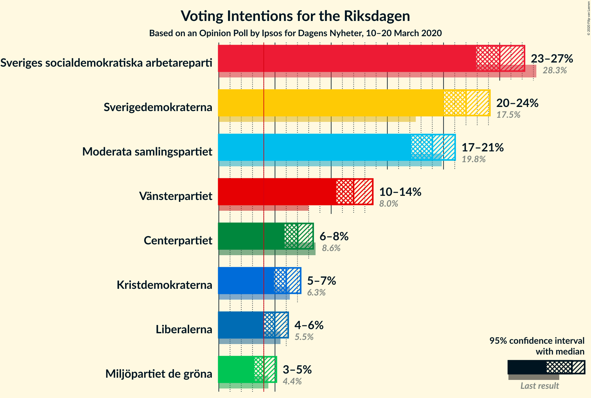
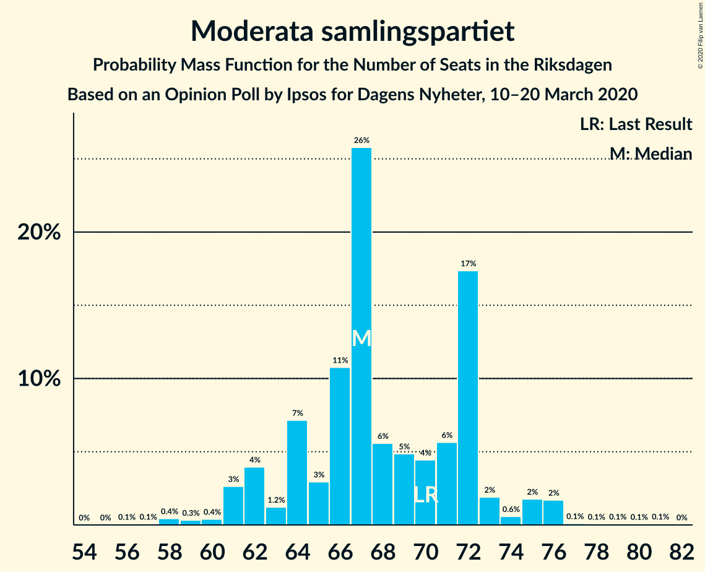
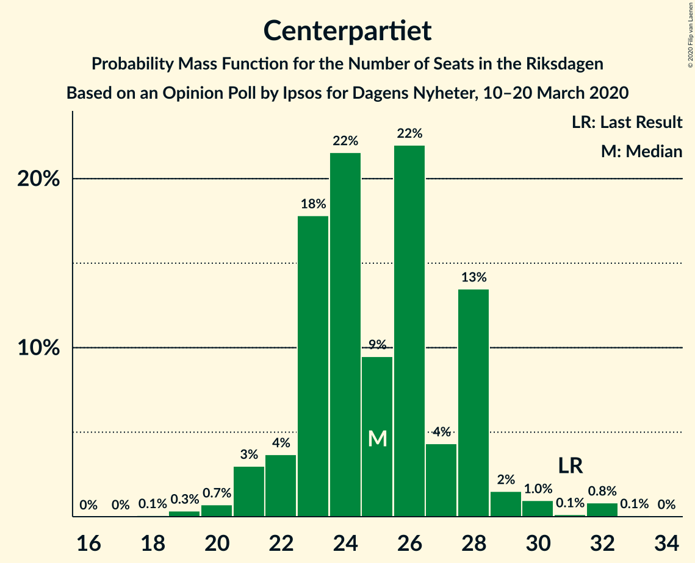
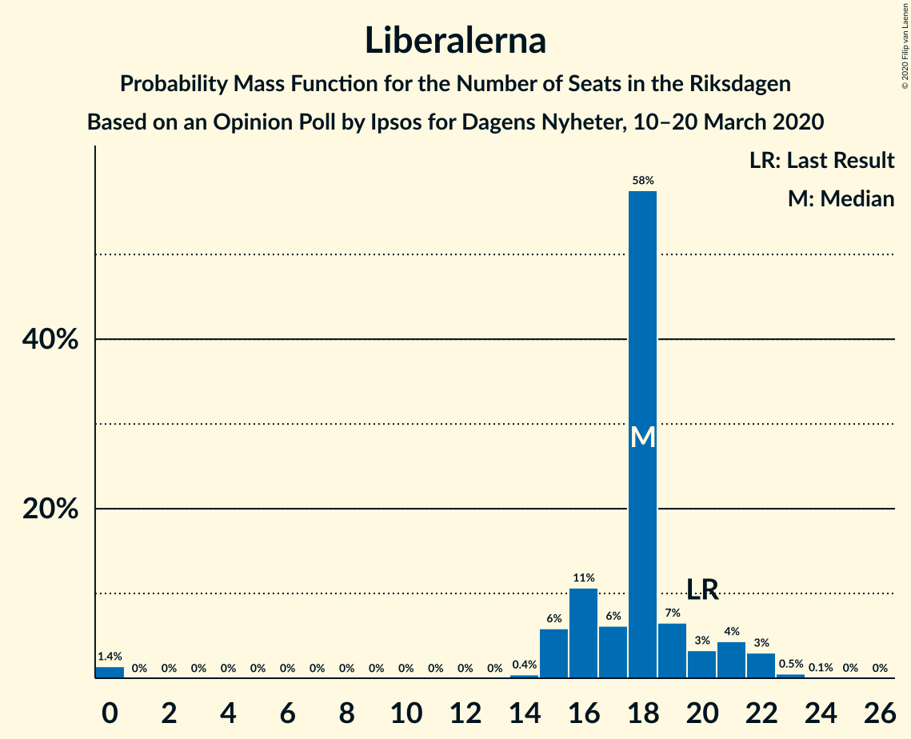
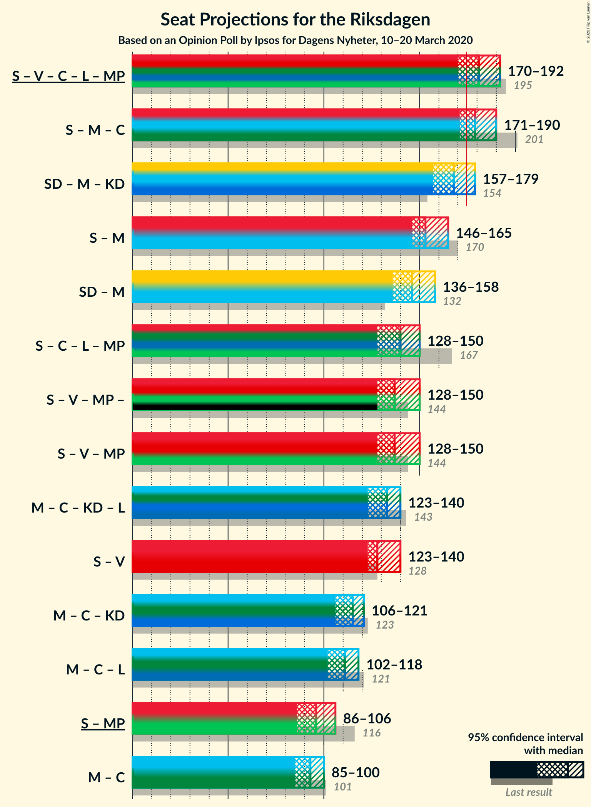
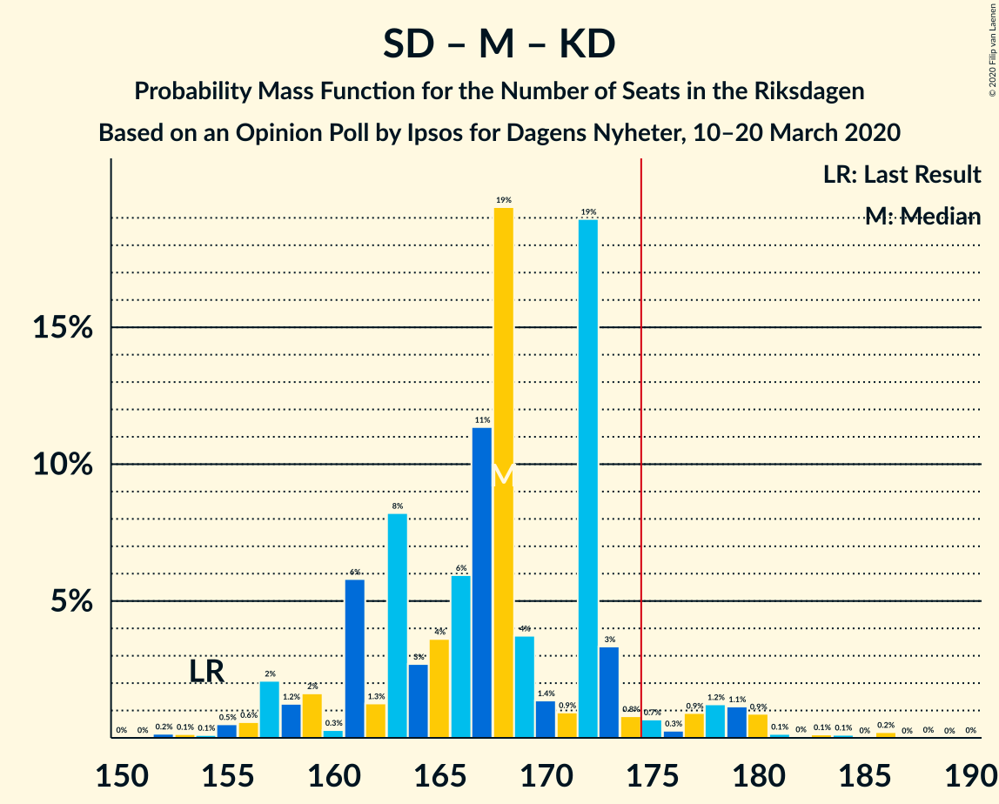
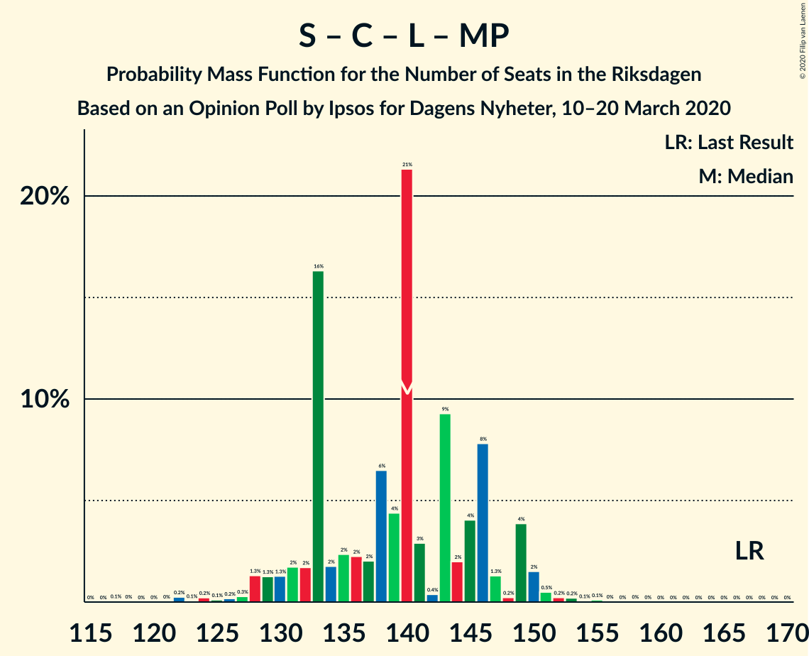
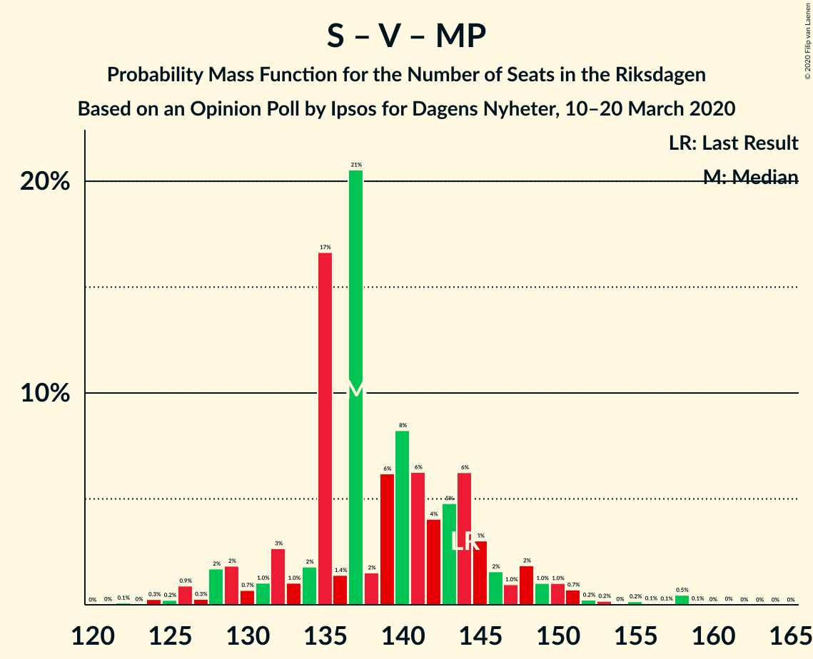
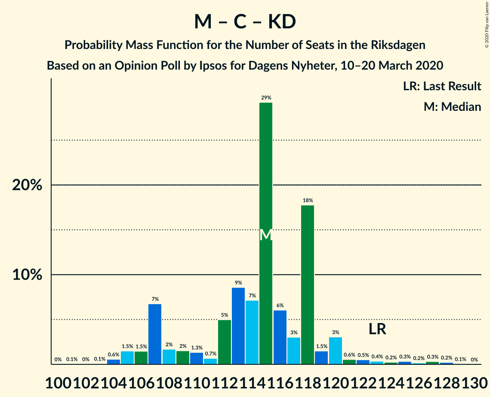

# Opinion Poll by Ipsos for Dagens Nyheter, 10–20 March 2020

<a href="#voting-intentions">Voting Intentions</a> | <a href="#seats">Seats</a> | <a href="#coalitions">Coalitions</a> | <a href="#technical-information">Technical Information</a>

## Voting Intentions

### Confidence Intervals

| Party | Last Result | Poll Result | 80% Confidence Interval | 90% Confidence Interval | 95% Confidence Interval | 99% Confidence Interval |
|:-----:|:-----------:|:-----------:|:-----------------------:|:-----------------------:|:-----------------------:|:-----------------------:|
| Sveriges socialdemokratiska arbetareparti | 28.3% | 25.0% | 23.6–26.4% |23.2–26.9% |22.9–27.2% |22.3–27.9% |
| Sverigedemokraterna | 17.5% | 22.0% | 20.7–23.4% |20.3–23.8% |20.0–24.1% |19.4–24.8% |
| Moderata samlingspartiet | 19.8% | 19.0% | 17.8–20.3% |17.4–20.7% |17.1–21.0% |16.6–21.7% |
| Vänsterpartiet | 8.0% | 12.0% | 11.0–13.1% |10.7–13.4% |10.5–13.7% |10.0–14.3% |
| Centerpartiet | 8.6% | 7.0% | 6.2–7.9% |6.0–8.2% |5.9–8.4% |5.5–8.8% |
| Kristdemokraterna | 6.3% | 6.0% | 5.3–6.8% |5.1–7.1% |4.9–7.3% |4.6–7.7% |
| Liberalerna | 5.5% | 5.0% | 4.3–5.8% |4.1–6.0% |4.0–6.2% |3.7–6.6% |
| Miljöpartiet de gröna | 4.4% | 4.0% | 3.4–4.7% |3.3–4.9% |3.2–5.1% |2.9–5.5% |

*Note:* The poll result column reflects the actual value used in the calculations. Published results may vary slightly, and in addition be rounded to fewer digits.

## Seats

### Confidence Intervals

| Party | Last Result | Median | 80% Confidence Interval | 90% Confidence Interval | 95% Confidence Interval | 99% Confidence Interval |
|:-----:|:-----------:|:------:|:-----------------------:|:-----------------------:|:-----------------------:|:-----------------------:|
| <a href="#sveriges-socialdemokratiska-arbetareparti">Sveriges socialdemokratiska arbetareparti</a> | 100 | 86 | 82–91 |82–92 |82–95 |79–99 |
| <a href="#sverigedemokraterna">Sverigedemokraterna</a> | 62 | 78 | 74–83 |72–85 |70–86 |68–88 |
| <a href="#moderata-samlingspartiet">Moderata samlingspartiet</a> | 70 | 67 | 64–72 |62–73 |61–75 |58–76 |
| <a href="#vänsterpartiet">Vänsterpartiet</a> | 28 | 41 | 39–46 |39–47 |38–48 |36–51 |
| <a href="#centerpartiet">Centerpartiet</a> | 31 | 25 | 23–28 |22–28 |21–29 |20–32 |
| <a href="#kristdemokraterna">Kristdemokraterna</a> | 22 | 22 | 19–23 |19–24 |18–25 |17–28 |
| <a href="#liberalerna">Liberalerna</a> | 20 | 18 | 16–20 |15–21 |15–22 |0–23 |
| <a href="#miljöpartiet-de-gröna">Miljöpartiet de gröna</a> | 16 | 14 | 0–17 |0–17 |0–17 |0–19 |

### Sveriges socialdemokratiska arbetareparti

*For a full overview of the results for this party, see the [Sveriges socialdemokratiska arbetareparti](party-sverigessocialdemokratiskaarbetareparti.html) page.*

| Number of Seats | Probability | Accumulated | Special Marks |
|:---------------:|:-----------:|:-----------:|:-------------:|
| 76 | 0% | 100% |  |
| 77 | 0% | 99.9% |  |
| 78 | 0.1% | 99.9% |  |
| 79 | 0.7% | 99.8% |  |
| 80 | 0.2% | 99.1% |  |
| 81 | 0.7% | 98.9% |  |
| 82 | 18% | 98% |  |
| 83 | 4% | 80% |  |
| 84 | 8% | 76% |  |
| 85 | 11% | 68% |  |
| 86 | 10% | 57% | Median |
| 87 | 6% | 47% |  |
| 88 | 9% | 41% |  |
| 89 | 4% | 32% |  |
| 90 | 2% | 28% |  |
| 91 | 18% | 26% |  |
| 92 | 3% | 8% |  |
| 93 | 1.2% | 5% |  |
| 94 | 1.2% | 4% |  |
| 95 | 1.1% | 3% |  |
| 96 | 0.4% | 1.4% |  |
| 97 | 0.2% | 1.1% |  |
| 98 | 0.3% | 0.8% |  |
| 99 | 0.2% | 0.6% |  |
| 100 | 0.1% | 0.4% | Last Result |
| 101 | 0.1% | 0.3% |  |
| 102 | 0.1% | 0.2% |  |
| 103 | 0% | 0.1% |  |
| 104 | 0% | 0.1% |  |
| 105 | 0% | 0% |  |

### Sverigedemokraterna

*For a full overview of the results for this party, see the [Sverigedemokraterna](party-sverigedemokraterna.html) page.*

| Number of Seats | Probability | Accumulated | Special Marks |
|:---------------:|:-----------:|:-----------:|:-------------:|
| 62 | 0% | 100% | Last Result |
| 63 | 0% | 100% |  |
| 64 | 0% | 100% |  |
| 65 | 0% | 100% |  |
| 66 | 0% | 100% |  |
| 67 | 0.1% | 99.9% |  |
| 68 | 0.8% | 99.8% |  |
| 69 | 0.4% | 99.0% |  |
| 70 | 2% | 98.6% |  |
| 71 | 1.1% | 97% |  |
| 72 | 2% | 96% |  |
| 73 | 0.8% | 94% |  |
| 74 | 5% | 93% |  |
| 75 | 4% | 88% |  |
| 76 | 12% | 84% |  |
| 77 | 15% | 72% |  |
| 78 | 16% | 57% | Median |
| 79 | 19% | 42% |  |
| 80 | 2% | 23% |  |
| 81 | 2% | 21% |  |
| 82 | 7% | 19% |  |
| 83 | 5% | 12% |  |
| 84 | 2% | 7% |  |
| 85 | 3% | 5% |  |
| 86 | 1.2% | 3% |  |
| 87 | 0.9% | 2% |  |
| 88 | 0.4% | 0.7% |  |
| 89 | 0.1% | 0.3% |  |
| 90 | 0.1% | 0.2% |  |
| 91 | 0.1% | 0.2% |  |
| 92 | 0% | 0.1% |  |
| 93 | 0% | 0.1% |  |
| 94 | 0.1% | 0.1% |  |
| 95 | 0% | 0% |  |

### Moderata samlingspartiet

*For a full overview of the results for this party, see the [Moderata samlingspartiet](party-moderatasamlingspartiet.html) page.*

| Number of Seats | Probability | Accumulated | Special Marks |
|:---------------:|:-----------:|:-----------:|:-------------:|
| 56 | 0.1% | 100% |  |
| 57 | 0.1% | 99.9% |  |
| 58 | 0.4% | 99.9% |  |
| 59 | 0.3% | 99.4% |  |
| 60 | 0.4% | 99.1% |  |
| 61 | 3% | 98.7% |  |
| 62 | 4% | 96% |  |
| 63 | 1.2% | 92% |  |
| 64 | 7% | 91% |  |
| 65 | 3% | 84% |  |
| 66 | 11% | 81% |  |
| 67 | 26% | 70% | Median |
| 68 | 6% | 44% |  |
| 69 | 5% | 39% |  |
| 70 | 4% | 34% | Last Result |
| 71 | 6% | 29% |  |
| 72 | 17% | 24% |  |
| 73 | 2% | 6% |  |
| 74 | 0.6% | 4% |  |
| 75 | 2% | 4% |  |
| 76 | 2% | 2% |  |
| 77 | 0.1% | 0.4% |  |
| 78 | 0.1% | 0.3% |  |
| 79 | 0.1% | 0.2% |  |
| 80 | 0.1% | 0.1% |  |
| 81 | 0.1% | 0.1% |  |
| 82 | 0% | 0% |  |

### Vänsterpartiet

*For a full overview of the results for this party, see the [Vänsterpartiet](party-vänsterpartiet.html) page.*

| Number of Seats | Probability | Accumulated | Special Marks |
|:---------------:|:-----------:|:-----------:|:-------------:|
| 28 | 0% | 100% | Last Result |
| 29 | 0% | 100% |  |
| 30 | 0% | 100% |  |
| 31 | 0% | 100% |  |
| 32 | 0% | 100% |  |
| 33 | 0% | 100% |  |
| 34 | 0.1% | 99.9% |  |
| 35 | 0.1% | 99.9% |  |
| 36 | 0.5% | 99.7% |  |
| 37 | 0.5% | 99.2% |  |
| 38 | 3% | 98.7% |  |
| 39 | 9% | 95% |  |
| 40 | 16% | 86% |  |
| 41 | 26% | 70% | Median |
| 42 | 3% | 44% |  |
| 43 | 4% | 41% |  |
| 44 | 18% | 37% |  |
| 45 | 9% | 19% |  |
| 46 | 2% | 11% |  |
| 47 | 4% | 9% |  |
| 48 | 2% | 4% |  |
| 49 | 1.2% | 2% |  |
| 50 | 0.2% | 0.9% |  |
| 51 | 0.5% | 0.7% |  |
| 52 | 0.2% | 0.2% |  |
| 53 | 0% | 0% |  |

### Centerpartiet

*For a full overview of the results for this party, see the [Centerpartiet](party-centerpartiet.html) page.*

| Number of Seats | Probability | Accumulated | Special Marks |
|:---------------:|:-----------:|:-----------:|:-------------:|
| 18 | 0.1% | 100% |  |
| 19 | 0.3% | 99.9% |  |
| 20 | 0.7% | 99.6% |  |
| 21 | 3% | 98.9% |  |
| 22 | 4% | 96% |  |
| 23 | 18% | 92% |  |
| 24 | 22% | 74% |  |
| 25 | 9% | 53% | Median |
| 26 | 22% | 43% |  |
| 27 | 4% | 21% |  |
| 28 | 13% | 17% |  |
| 29 | 2% | 4% |  |
| 30 | 1.0% | 2% |  |
| 31 | 0.1% | 1.1% | Last Result |
| 32 | 0.8% | 0.9% |  |
| 33 | 0.1% | 0.1% |  |
| 34 | 0% | 0% |  |

### Kristdemokraterna

*For a full overview of the results for this party, see the [Kristdemokraterna](party-kristdemokraterna.html) page.*

| Number of Seats | Probability | Accumulated | Special Marks |
|:---------------:|:-----------:|:-----------:|:-------------:|
| 15 | 0% | 100% |  |
| 16 | 0.3% | 99.9% |  |
| 17 | 2% | 99.7% |  |
| 18 | 3% | 98% |  |
| 19 | 6% | 95% |  |
| 20 | 13% | 89% |  |
| 21 | 17% | 76% |  |
| 22 | 42% | 59% | Last Result, Median |
| 23 | 9% | 17% |  |
| 24 | 3% | 8% |  |
| 25 | 3% | 5% |  |
| 26 | 0.9% | 2% |  |
| 27 | 0.3% | 0.9% |  |
| 28 | 0.5% | 0.6% |  |
| 29 | 0.1% | 0.1% |  |
| 30 | 0% | 0% |  |

### Liberalerna

*For a full overview of the results for this party, see the [Liberalerna](party-liberalerna.html) page.*

| Number of Seats | Probability | Accumulated | Special Marks |
|:---------------:|:-----------:|:-----------:|:-------------:|
| 0 | 1.4% | 100% |  |
| 1 | 0% | 98.6% |  |
| 2 | 0% | 98.6% |  |
| 3 | 0% | 98.6% |  |
| 4 | 0% | 98.6% |  |
| 5 | 0% | 98.6% |  |
| 6 | 0% | 98.6% |  |
| 7 | 0% | 98.6% |  |
| 8 | 0% | 98.6% |  |
| 9 | 0% | 98.6% |  |
| 10 | 0% | 98.6% |  |
| 11 | 0% | 98.6% |  |
| 12 | 0% | 98.6% |  |
| 13 | 0% | 98.6% |  |
| 14 | 0.4% | 98.6% |  |
| 15 | 6% | 98% |  |
| 16 | 11% | 92% |  |
| 17 | 6% | 82% |  |
| 18 | 58% | 75% | Median |
| 19 | 7% | 18% |  |
| 20 | 3% | 11% | Last Result |
| 21 | 4% | 8% |  |
| 22 | 3% | 4% |  |
| 23 | 0.5% | 0.7% |  |
| 24 | 0.1% | 0.2% |  |
| 25 | 0% | 0.1% |  |
| 26 | 0% | 0% |  |

### Miljöpartiet de gröna

*For a full overview of the results for this party, see the [Miljöpartiet de gröna](party-miljöpartietdegröna.html) page.*

| Number of Seats | Probability | Accumulated | Special Marks |
|:---------------:|:-----------:|:-----------:|:-------------:|
| 0 | 35% | 100% |  |
| 1 | 0% | 65% |  |
| 2 | 0% | 65% |  |
| 3 | 0% | 65% |  |
| 4 | 0% | 65% |  |
| 5 | 0% | 65% |  |
| 6 | 0% | 65% |  |
| 7 | 0% | 65% |  |
| 8 | 0% | 65% |  |
| 9 | 0% | 65% |  |
| 10 | 0% | 65% |  |
| 11 | 0% | 65% |  |
| 12 | 0% | 65% |  |
| 13 | 0% | 65% |  |
| 14 | 33% | 65% | Median |
| 15 | 14% | 32% |  |
| 16 | 6% | 18% | Last Result |
| 17 | 10% | 12% |  |
| 18 | 1.1% | 2% |  |
| 19 | 0.6% | 0.8% |  |
| 20 | 0.1% | 0.1% |  |
| 21 | 0% | 0.1% |  |
| 22 | 0% | 0% |  |

## Coalitions

### Confidence Intervals

| Coalition | Last Result | Median | Majority? | 80% Confidence Interval | 90% Confidence Interval | 95% Confidence Interval | 99% Confidence Interval |
|:---------:|:-----------:|:------:|:---------:|:-----------------------:|:-----------------------:|:-----------------------:|:-----------------------:|
| Sveriges socialdemokratiska arbetareparti – Vänsterpartiet – Centerpartiet – Liberalerna – Miljöpartiet de gröna | 195 | 181 | 94% | 177–188 | 173–190 | 170–192 | 166–194 |
| Sveriges socialdemokratiska arbetareparti – Moderata samlingspartiet – Centerpartiet | 201 | 179 | 88% | 172–187 | 171–188 | 171–190 | 167–195 |
| Sverigedemokraterna – Moderata samlingspartiet – Kristdemokraterna | 154 | 168 | 6% | 161–172 | 159–176 | 157–179 | 155–183 |
| Sveriges socialdemokratiska arbetareparti – Moderata samlingspartiet | 170 | 153 | 0.1% | 149–163 | 148–163 | 146–165 | 143–169 |
| Sverigedemokraterna – Moderata samlingspartiet | 132 | 146 | 0% | 139–151 | 139–154 | 136–158 | 134–160 |
| Sveriges socialdemokratiska arbetareparti – Centerpartiet – Liberalerna – Miljöpartiet de gröna | 167 | 140 | 0% | 133–146 | 130–149 | 128–150 | 124–152 |
| Sveriges socialdemokratiska arbetareparti – Vänsterpartiet – Miljöpartiet de gröna | 144 | 137 | 0% | 133–145 | 129–148 | 128–150 | 125–158 |
| Moderata samlingspartiet – Centerpartiet – Kristdemokraterna – Liberalerna | 143 | 133 | 0% | 124–136 | 123–138 | 123–140 | 114–146 |
| Sveriges socialdemokratiska arbetareparti – Vänsterpartiet | 128 | 128 | 0% | 123–135 | 123–137 | 123–140 | 120–145 |
| Moderata samlingspartiet – Centerpartiet – Kristdemokraterna | 123 | 115 | 0% | 107–118 | 107–120 | 106–121 | 104–127 |
| Moderata samlingspartiet – Centerpartiet – Liberalerna | 121 | 111 | 0% | 104–115 | 103–118 | 102–118 | 90–122 |
| Sveriges socialdemokratiska arbetareparti – Miljöpartiet de gröna | 116 | 96 | 0% | 89–103 | 88–105 | 86–106 | 83–111 |
| Moderata samlingspartiet – Centerpartiet | 101 | 93 | 0% | 87–97 | 87–99 | 85–100 | 83–104 |

### Sveriges socialdemokratiska arbetareparti – Vänsterpartiet – Centerpartiet – Liberalerna – Miljöpartiet de gröna

| Number of Seats | Probability | Accumulated | Special Marks |
|:---------------:|:-----------:|:-----------:|:-------------:|
| 161 | 0% | 100% |  |
| 162 | 0% | 99.9% |  |
| 163 | 0.2% | 99.9% |  |
| 164 | 0% | 99.7% |  |
| 165 | 0.1% | 99.7% |  |
| 166 | 0.1% | 99.6% |  |
| 167 | 0% | 99.5% |  |
| 168 | 0.1% | 99.4% |  |
| 169 | 0.9% | 99.3% |  |
| 170 | 1.1% | 98% |  |
| 171 | 1.2% | 97% |  |
| 172 | 0.9% | 96% |  |
| 173 | 0.3% | 95% |  |
| 174 | 0.7% | 95% |  |
| 175 | 0.8% | 94% | Majority |
| 176 | 3% | 93% |  |
| 177 | 19% | 90% |  |
| 178 | 0.9% | 71% |  |
| 179 | 1.4% | 70% |  |
| 180 | 4% | 69% |  |
| 181 | 19% | 65% |  |
| 182 | 11% | 46% |  |
| 183 | 6% | 34% |  |
| 184 | 4% | 28% | Median |
| 185 | 3% | 25% |  |
| 186 | 8% | 22% |  |
| 187 | 1.3% | 14% |  |
| 188 | 6% | 13% |  |
| 189 | 0.3% | 7% |  |
| 190 | 2% | 6% |  |
| 191 | 1.2% | 5% |  |
| 192 | 2% | 4% |  |
| 193 | 0.6% | 2% |  |
| 194 | 0.5% | 1.0% |  |
| 195 | 0.1% | 0.5% | Last Result |
| 196 | 0.1% | 0.4% |  |
| 197 | 0.2% | 0.2% |  |
| 198 | 0% | 0.1% |  |
| 199 | 0% | 0.1% |  |
| 200 | 0% | 0% |  |

### Sveriges socialdemokratiska arbetareparti – Moderata samlingspartiet – Centerpartiet

| Number of Seats | Probability | Accumulated | Special Marks |
|:---------------:|:-----------:|:-----------:|:-------------:|
| 165 | 0.2% | 100% |  |
| 166 | 0.1% | 99.8% |  |
| 167 | 0.5% | 99.7% |  |
| 168 | 0.1% | 99.3% |  |
| 169 | 0.6% | 99.1% |  |
| 170 | 0.4% | 98.6% |  |
| 171 | 7% | 98% |  |
| 172 | 1.2% | 91% |  |
| 173 | 0.9% | 90% |  |
| 174 | 0.6% | 89% |  |
| 175 | 23% | 88% | Majority |
| 176 | 2% | 65% |  |
| 177 | 4% | 63% |  |
| 178 | 8% | 59% | Median |
| 179 | 2% | 51% |  |
| 180 | 8% | 49% |  |
| 181 | 6% | 41% |  |
| 182 | 2% | 35% |  |
| 183 | 2% | 32% |  |
| 184 | 3% | 30% |  |
| 185 | 1.4% | 26% |  |
| 186 | 2% | 25% |  |
| 187 | 17% | 23% |  |
| 188 | 2% | 7% |  |
| 189 | 2% | 5% |  |
| 190 | 0.5% | 3% |  |
| 191 | 0.3% | 2% |  |
| 192 | 0.4% | 2% |  |
| 193 | 0.3% | 2% |  |
| 194 | 0.6% | 1.2% |  |
| 195 | 0.3% | 0.7% |  |
| 196 | 0.2% | 0.4% |  |
| 197 | 0% | 0.2% |  |
| 198 | 0% | 0.2% |  |
| 199 | 0% | 0.1% |  |
| 200 | 0% | 0.1% |  |
| 201 | 0% | 0.1% | Last Result |
| 202 | 0% | 0.1% |  |
| 203 | 0% | 0% |  |

### Sverigedemokraterna – Moderata samlingspartiet – Kristdemokraterna

| Number of Seats | Probability | Accumulated | Special Marks |
|:---------------:|:-----------:|:-----------:|:-------------:|
| 150 | 0% | 100% |  |
| 151 | 0% | 99.9% |  |
| 152 | 0.2% | 99.9% |  |
| 153 | 0.1% | 99.8% |  |
| 154 | 0.1% | 99.6% | Last Result |
| 155 | 0.5% | 99.5% |  |
| 156 | 0.6% | 99.0% |  |
| 157 | 2% | 98% |  |
| 158 | 1.2% | 96% |  |
| 159 | 2% | 95% |  |
| 160 | 0.3% | 94% |  |
| 161 | 6% | 93% |  |
| 162 | 1.3% | 87% |  |
| 163 | 8% | 86% |  |
| 164 | 3% | 78% |  |
| 165 | 4% | 75% |  |
| 166 | 6% | 72% |  |
| 167 | 11% | 66% | Median |
| 168 | 19% | 54% |  |
| 169 | 4% | 35% |  |
| 170 | 1.4% | 31% |  |
| 171 | 0.9% | 30% |  |
| 172 | 19% | 29% |  |
| 173 | 3% | 10% |  |
| 174 | 0.8% | 7% |  |
| 175 | 0.7% | 6% | Majority |
| 176 | 0.3% | 5% |  |
| 177 | 0.9% | 5% |  |
| 178 | 1.2% | 4% |  |
| 179 | 1.1% | 3% |  |
| 180 | 0.9% | 2% |  |
| 181 | 0.1% | 0.7% |  |
| 182 | 0% | 0.6% |  |
| 183 | 0.1% | 0.5% |  |
| 184 | 0.1% | 0.4% |  |
| 185 | 0% | 0.3% |  |
| 186 | 0.2% | 0.3% |  |
| 187 | 0% | 0.1% |  |
| 188 | 0% | 0.1% |  |
| 189 | 0% | 0% |  |

### Sveriges socialdemokratiska arbetareparti – Moderata samlingspartiet

| Number of Seats | Probability | Accumulated | Special Marks |
|:---------------:|:-----------:|:-----------:|:-------------:|
| 140 | 0.1% | 100% |  |
| 141 | 0.1% | 99.9% |  |
| 142 | 0.2% | 99.8% |  |
| 143 | 0.2% | 99.6% |  |
| 144 | 0.2% | 99.5% |  |
| 145 | 0.7% | 99.2% |  |
| 146 | 2% | 98.6% |  |
| 147 | 0.3% | 97% |  |
| 148 | 5% | 96% |  |
| 149 | 18% | 91% |  |
| 150 | 4% | 73% |  |
| 151 | 2% | 69% |  |
| 152 | 15% | 67% |  |
| 153 | 4% | 53% | Median |
| 154 | 6% | 48% |  |
| 155 | 3% | 43% |  |
| 156 | 7% | 40% |  |
| 157 | 1.0% | 33% |  |
| 158 | 3% | 32% |  |
| 159 | 3% | 29% |  |
| 160 | 3% | 26% |  |
| 161 | 0.5% | 23% |  |
| 162 | 3% | 23% |  |
| 163 | 15% | 19% |  |
| 164 | 0.9% | 4% |  |
| 165 | 2% | 3% |  |
| 166 | 0.4% | 2% |  |
| 167 | 0.3% | 1.4% |  |
| 168 | 0.6% | 1.1% |  |
| 169 | 0.2% | 0.5% |  |
| 170 | 0.1% | 0.3% | Last Result |
| 171 | 0% | 0.2% |  |
| 172 | 0.1% | 0.2% |  |
| 173 | 0.1% | 0.2% |  |
| 174 | 0% | 0.1% |  |
| 175 | 0% | 0.1% | Majority |
| 176 | 0% | 0.1% |  |
| 177 | 0% | 0.1% |  |
| 178 | 0% | 0% |  |

### Sverigedemokraterna – Moderata samlingspartiet

| Number of Seats | Probability | Accumulated | Special Marks |
|:---------------:|:-----------:|:-----------:|:-------------:|
| 130 | 0.1% | 100% |  |
| 131 | 0% | 99.9% |  |
| 132 | 0.1% | 99.9% | Last Result |
| 133 | 0.2% | 99.7% |  |
| 134 | 0.6% | 99.5% |  |
| 135 | 1.0% | 98.9% |  |
| 136 | 0.9% | 98% |  |
| 137 | 1.0% | 97% |  |
| 138 | 1.0% | 96% |  |
| 139 | 6% | 95% |  |
| 140 | 1.4% | 89% |  |
| 141 | 2% | 88% |  |
| 142 | 10% | 86% |  |
| 143 | 2% | 76% |  |
| 144 | 8% | 75% |  |
| 145 | 2% | 66% | Median |
| 146 | 27% | 64% |  |
| 147 | 2% | 37% |  |
| 148 | 4% | 35% |  |
| 149 | 2% | 31% |  |
| 150 | 16% | 29% |  |
| 151 | 6% | 14% |  |
| 152 | 1.1% | 8% |  |
| 153 | 2% | 7% |  |
| 154 | 0.7% | 5% |  |
| 155 | 1.4% | 5% |  |
| 156 | 0.4% | 3% |  |
| 157 | 0.1% | 3% |  |
| 158 | 1.1% | 3% |  |
| 159 | 0.2% | 1.4% |  |
| 160 | 0.7% | 1.2% |  |
| 161 | 0.1% | 0.5% |  |
| 162 | 0% | 0.4% |  |
| 163 | 0% | 0.3% |  |
| 164 | 0.3% | 0.3% |  |
| 165 | 0% | 0% |  |

### Sveriges socialdemokratiska arbetareparti – Centerpartiet – Liberalerna – Miljöpartiet de gröna

| Number of Seats | Probability | Accumulated | Special Marks |
|:---------------:|:-----------:|:-----------:|:-------------:|
| 117 | 0.1% | 100% |  |
| 118 | 0% | 99.9% |  |
| 119 | 0% | 99.9% |  |
| 120 | 0% | 99.9% |  |
| 121 | 0% | 99.9% |  |
| 122 | 0.2% | 99.8% |  |
| 123 | 0.1% | 99.6% |  |
| 124 | 0.2% | 99.5% |  |
| 125 | 0.1% | 99.3% |  |
| 126 | 0.2% | 99.2% |  |
| 127 | 0.3% | 99.0% |  |
| 128 | 1.3% | 98.7% |  |
| 129 | 1.3% | 97% |  |
| 130 | 1.3% | 96% |  |
| 131 | 2% | 95% |  |
| 132 | 2% | 93% |  |
| 133 | 16% | 91% |  |
| 134 | 2% | 75% |  |
| 135 | 2% | 73% |  |
| 136 | 2% | 71% |  |
| 137 | 2% | 69% |  |
| 138 | 6% | 67% |  |
| 139 | 4% | 60% |  |
| 140 | 21% | 56% |  |
| 141 | 3% | 35% |  |
| 142 | 0.4% | 32% |  |
| 143 | 9% | 31% | Median |
| 144 | 2% | 22% |  |
| 145 | 4% | 20% |  |
| 146 | 8% | 16% |  |
| 147 | 1.3% | 8% |  |
| 148 | 0.2% | 7% |  |
| 149 | 4% | 7% |  |
| 150 | 2% | 3% |  |
| 151 | 0.5% | 1.2% |  |
| 152 | 0.2% | 0.7% |  |
| 153 | 0.2% | 0.5% |  |
| 154 | 0.1% | 0.3% |  |
| 155 | 0.1% | 0.2% |  |
| 156 | 0% | 0.1% |  |
| 157 | 0% | 0.1% |  |
| 158 | 0% | 0% |  |
| 159 | 0% | 0% |  |
| 160 | 0% | 0% |  |
| 161 | 0% | 0% |  |
| 162 | 0% | 0% |  |
| 163 | 0% | 0% |  |
| 164 | 0% | 0% |  |
| 165 | 0% | 0% |  |
| 166 | 0% | 0% |  |
| 167 | 0% | 0% | Last Result |

### Sveriges socialdemokratiska arbetareparti – Vänsterpartiet – Miljöpartiet de gröna

| Number of Seats | Probability | Accumulated | Special Marks |
|:---------------:|:-----------:|:-----------:|:-------------:|
| 122 | 0.1% | 100% |  |
| 123 | 0% | 99.9% |  |
| 124 | 0.3% | 99.8% |  |
| 125 | 0.2% | 99.6% |  |
| 126 | 0.9% | 99.4% |  |
| 127 | 0.3% | 98% |  |
| 128 | 2% | 98% |  |
| 129 | 2% | 96% |  |
| 130 | 0.7% | 95% |  |
| 131 | 1.0% | 94% |  |
| 132 | 3% | 93% |  |
| 133 | 1.0% | 90% |  |
| 134 | 2% | 89% |  |
| 135 | 17% | 87% |  |
| 136 | 1.4% | 71% |  |
| 137 | 21% | 69% |  |
| 138 | 2% | 49% |  |
| 139 | 6% | 47% |  |
| 140 | 8% | 41% |  |
| 141 | 6% | 33% | Median |
| 142 | 4% | 27% |  |
| 143 | 5% | 23% |  |
| 144 | 6% | 18% | Last Result |
| 145 | 3% | 12% |  |
| 146 | 2% | 8% |  |
| 147 | 1.0% | 7% |  |
| 148 | 2% | 6% |  |
| 149 | 1.0% | 4% |  |
| 150 | 1.0% | 3% |  |
| 151 | 0.7% | 2% |  |
| 152 | 0.2% | 1.3% |  |
| 153 | 0.2% | 1.1% |  |
| 154 | 0% | 0.9% |  |
| 155 | 0.2% | 0.9% |  |
| 156 | 0.1% | 0.7% |  |
| 157 | 0.1% | 0.7% |  |
| 158 | 0.5% | 0.6% |  |
| 159 | 0.1% | 0.1% |  |
| 160 | 0% | 0.1% |  |
| 161 | 0% | 0.1% |  |
| 162 | 0% | 0% |  |

### Moderata samlingspartiet – Centerpartiet – Kristdemokraterna – Liberalerna

| Number of Seats | Probability | Accumulated | Special Marks |
|:---------------:|:-----------:|:-----------:|:-------------:|
| 112 | 0.1% | 100% |  |
| 113 | 0.1% | 99.9% |  |
| 114 | 0.6% | 99.8% |  |
| 115 | 0.1% | 99.2% |  |
| 116 | 0.1% | 99.1% |  |
| 117 | 0.1% | 99.0% |  |
| 118 | 0% | 99.0% |  |
| 119 | 0.1% | 99.0% |  |
| 120 | 0.2% | 98.9% |  |
| 121 | 0.1% | 98.7% |  |
| 122 | 0.6% | 98.6% |  |
| 123 | 7% | 98% |  |
| 124 | 3% | 91% |  |
| 125 | 1.3% | 88% |  |
| 126 | 1.2% | 87% |  |
| 127 | 0.5% | 86% |  |
| 128 | 1.0% | 85% |  |
| 129 | 4% | 84% |  |
| 130 | 4% | 81% |  |
| 131 | 10% | 76% |  |
| 132 | 2% | 66% | Median |
| 133 | 29% | 64% |  |
| 134 | 6% | 36% |  |
| 135 | 4% | 30% |  |
| 136 | 17% | 26% |  |
| 137 | 3% | 9% |  |
| 138 | 3% | 7% |  |
| 139 | 0.8% | 4% |  |
| 140 | 1.5% | 3% |  |
| 141 | 0.1% | 1.4% |  |
| 142 | 0.1% | 1.2% |  |
| 143 | 0.1% | 1.2% | Last Result |
| 144 | 0.2% | 1.0% |  |
| 145 | 0.2% | 0.9% |  |
| 146 | 0.4% | 0.7% |  |
| 147 | 0.2% | 0.2% |  |
| 148 | 0% | 0% |  |

### Sveriges socialdemokratiska arbetareparti – Vänsterpartiet

| Number of Seats | Probability | Accumulated | Special Marks |
|:---------------:|:-----------:|:-----------:|:-------------:|
| 116 | 0% | 100% |  |
| 117 | 0.1% | 99.9% |  |
| 118 | 0.2% | 99.9% |  |
| 119 | 0.1% | 99.7% |  |
| 120 | 0.6% | 99.6% |  |
| 121 | 0.3% | 98.9% |  |
| 122 | 0.5% | 98.6% |  |
| 123 | 22% | 98% |  |
| 124 | 6% | 76% |  |
| 125 | 3% | 70% |  |
| 126 | 8% | 67% |  |
| 127 | 6% | 59% | Median |
| 128 | 3% | 52% | Last Result |
| 129 | 9% | 50% |  |
| 130 | 4% | 40% |  |
| 131 | 2% | 37% |  |
| 132 | 5% | 35% |  |
| 133 | 2% | 30% |  |
| 134 | 3% | 28% |  |
| 135 | 17% | 24% |  |
| 136 | 1.4% | 8% |  |
| 137 | 1.2% | 6% |  |
| 138 | 1.1% | 5% |  |
| 139 | 1.0% | 4% |  |
| 140 | 1.0% | 3% |  |
| 141 | 0.7% | 2% |  |
| 142 | 0.2% | 1.1% |  |
| 143 | 0.2% | 1.0% |  |
| 144 | 0.2% | 0.7% |  |
| 145 | 0.4% | 0.6% |  |
| 146 | 0.1% | 0.2% |  |
| 147 | 0% | 0.1% |  |
| 148 | 0% | 0.1% |  |
| 149 | 0% | 0.1% |  |
| 150 | 0% | 0% |  |

### Moderata samlingspartiet – Centerpartiet – Kristdemokraterna

| Number of Seats | Probability | Accumulated | Special Marks |
|:---------------:|:-----------:|:-----------:|:-------------:|
| 100 | 0% | 100% |  |
| 101 | 0.1% | 99.9% |  |
| 102 | 0% | 99.9% |  |
| 103 | 0.1% | 99.8% |  |
| 104 | 0.6% | 99.7% |  |
| 105 | 1.5% | 99.2% |  |
| 106 | 1.5% | 98% |  |
| 107 | 7% | 96% |  |
| 108 | 2% | 89% |  |
| 109 | 2% | 88% |  |
| 110 | 1.3% | 86% |  |
| 111 | 0.7% | 85% |  |
| 112 | 5% | 84% |  |
| 113 | 9% | 79% |  |
| 114 | 7% | 71% | Median |
| 115 | 29% | 63% |  |
| 116 | 6% | 34% |  |
| 117 | 3% | 28% |  |
| 118 | 18% | 25% |  |
| 119 | 1.5% | 7% |  |
| 120 | 3% | 6% |  |
| 121 | 0.6% | 3% |  |
| 122 | 0.5% | 2% |  |
| 123 | 0.4% | 2% | Last Result |
| 124 | 0.2% | 1.4% |  |
| 125 | 0.3% | 1.2% |  |
| 126 | 0.2% | 0.8% |  |
| 127 | 0.3% | 0.6% |  |
| 128 | 0.2% | 0.3% |  |
| 129 | 0.1% | 0.1% |  |
| 130 | 0% | 0% |  |

### Moderata samlingspartiet – Centerpartiet – Liberalerna

| Number of Seats | Probability | Accumulated | Special Marks |
|:---------------:|:-----------:|:-----------:|:-------------:|
| 88 | 0.1% | 100% |  |
| 89 | 0% | 99.9% |  |
| 90 | 0.5% | 99.9% |  |
| 91 | 0% | 99.4% |  |
| 92 | 0.1% | 99.4% |  |
| 93 | 0% | 99.3% |  |
| 94 | 0.1% | 99.3% |  |
| 95 | 0.1% | 99.2% |  |
| 96 | 0.1% | 99.1% |  |
| 97 | 0% | 99.0% |  |
| 98 | 0.3% | 98.9% |  |
| 99 | 0.2% | 98.6% |  |
| 100 | 0.2% | 98% |  |
| 101 | 0.4% | 98% |  |
| 102 | 1.3% | 98% |  |
| 103 | 6% | 97% |  |
| 104 | 0.5% | 90% |  |
| 105 | 2% | 90% |  |
| 106 | 3% | 87% |  |
| 107 | 2% | 85% |  |
| 108 | 12% | 83% |  |
| 109 | 2% | 71% |  |
| 110 | 0.9% | 68% | Median |
| 111 | 21% | 67% |  |
| 112 | 15% | 46% |  |
| 113 | 0.9% | 31% |  |
| 114 | 16% | 31% |  |
| 115 | 7% | 14% |  |
| 116 | 2% | 8% |  |
| 117 | 0.8% | 6% |  |
| 118 | 3% | 5% |  |
| 119 | 0.8% | 2% |  |
| 120 | 0.1% | 1.2% |  |
| 121 | 0.5% | 1.1% | Last Result |
| 122 | 0.3% | 0.6% |  |
| 123 | 0.1% | 0.4% |  |
| 124 | 0.2% | 0.3% |  |
| 125 | 0.1% | 0.1% |  |
| 126 | 0% | 0% |  |

### Sveriges socialdemokratiska arbetareparti – Miljöpartiet de gröna

| Number of Seats | Probability | Accumulated | Special Marks |
|:---------------:|:-----------:|:-----------:|:-------------:|
| 79 | 0% | 100% |  |
| 80 | 0% | 99.9% |  |
| 81 | 0.1% | 99.9% |  |
| 82 | 0.1% | 99.8% |  |
| 83 | 0.5% | 99.7% |  |
| 84 | 0.2% | 99.3% |  |
| 85 | 1.2% | 99.0% |  |
| 86 | 0.7% | 98% |  |
| 87 | 2% | 97% |  |
| 88 | 4% | 95% |  |
| 89 | 3% | 92% |  |
| 90 | 0.9% | 89% |  |
| 91 | 17% | 88% |  |
| 92 | 2% | 71% |  |
| 93 | 1.2% | 69% |  |
| 94 | 1.2% | 68% |  |
| 95 | 1.0% | 66% |  |
| 96 | 18% | 65% |  |
| 97 | 0.6% | 47% |  |
| 98 | 3% | 47% |  |
| 99 | 11% | 44% |  |
| 100 | 9% | 33% | Median |
| 101 | 1.4% | 24% |  |
| 102 | 9% | 22% |  |
| 103 | 7% | 13% |  |
| 104 | 0.9% | 6% |  |
| 105 | 2% | 5% |  |
| 106 | 1.2% | 4% |  |
| 107 | 0.8% | 2% |  |
| 108 | 0.2% | 2% |  |
| 109 | 0.7% | 1.4% |  |
| 110 | 0.2% | 0.7% |  |
| 111 | 0.1% | 0.5% |  |
| 112 | 0.1% | 0.4% |  |
| 113 | 0.1% | 0.3% |  |
| 114 | 0% | 0.2% |  |
| 115 | 0.1% | 0.2% |  |
| 116 | 0% | 0% | Last Result |

### Moderata samlingspartiet – Centerpartiet

| Number of Seats | Probability | Accumulated | Special Marks |
|:---------------:|:-----------:|:-----------:|:-------------:|
| 80 | 0% | 100% |  |
| 81 | 0.1% | 99.9% |  |
| 82 | 0.1% | 99.8% |  |
| 83 | 0.6% | 99.7% |  |
| 84 | 1.3% | 99.1% |  |
| 85 | 0.3% | 98% |  |
| 86 | 2% | 97% |  |
| 87 | 6% | 96% |  |
| 88 | 2% | 89% |  |
| 89 | 2% | 88% |  |
| 90 | 13% | 85% |  |
| 91 | 3% | 73% |  |
| 92 | 2% | 70% | Median |
| 93 | 22% | 67% |  |
| 94 | 15% | 45% |  |
| 95 | 1.2% | 30% |  |
| 96 | 18% | 29% |  |
| 97 | 4% | 12% |  |
| 98 | 2% | 8% |  |
| 99 | 1.5% | 6% |  |
| 100 | 3% | 5% |  |
| 101 | 0.7% | 2% | Last Result |
| 102 | 0.3% | 1.2% |  |
| 103 | 0.2% | 0.9% |  |
| 104 | 0.5% | 0.7% |  |
| 105 | 0.1% | 0.2% |  |
| 106 | 0% | 0.1% |  |
| 107 | 0% | 0.1% |  |
| 108 | 0% | 0% |  |

## Technical Information

### Opinion Poll

+ **Polling firm:** Ipsos
+ **Commissioner(s):** Dagens Nyheter
+ **Fieldwork period:** 10–20 March 2020

### Calculations

+ **Sample size:** 1568
+ **Simulations done:** 1,048,576
+ **Error estimate:** 1.49%

