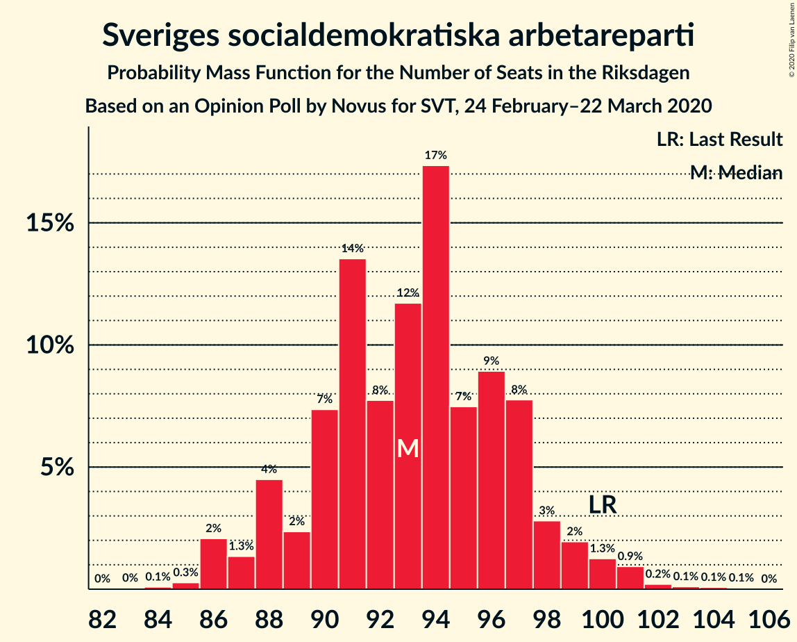
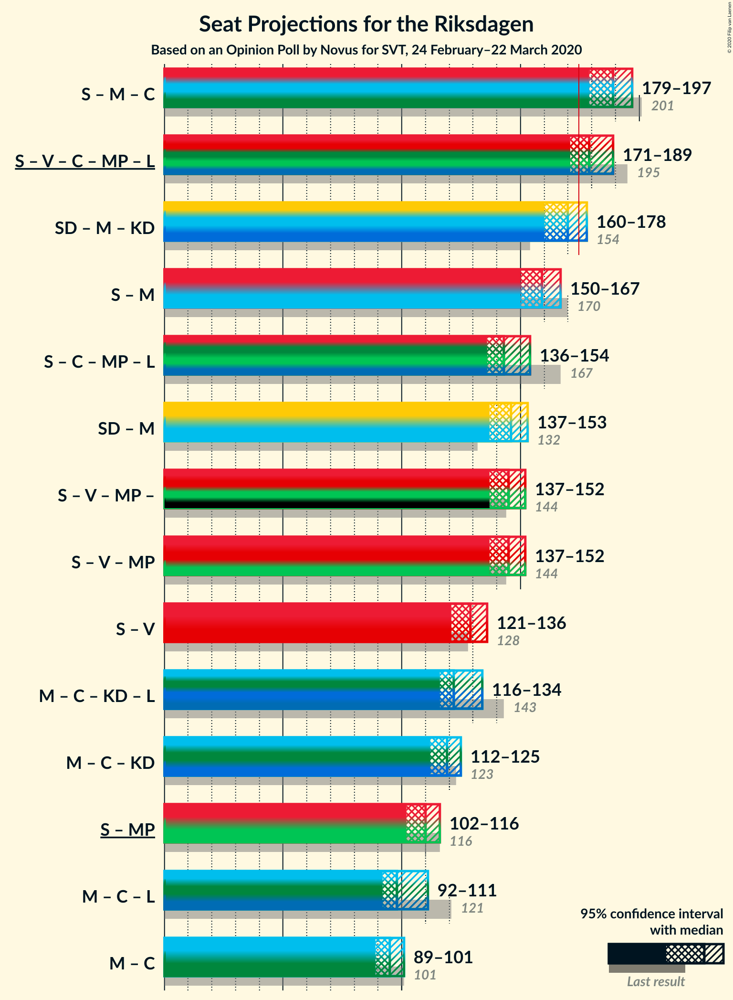
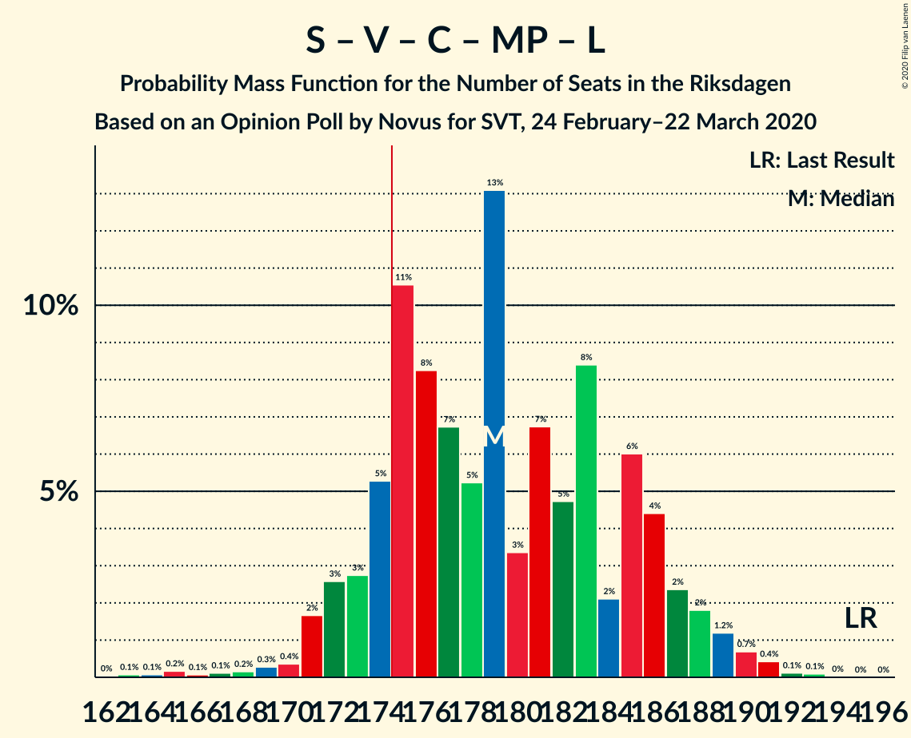
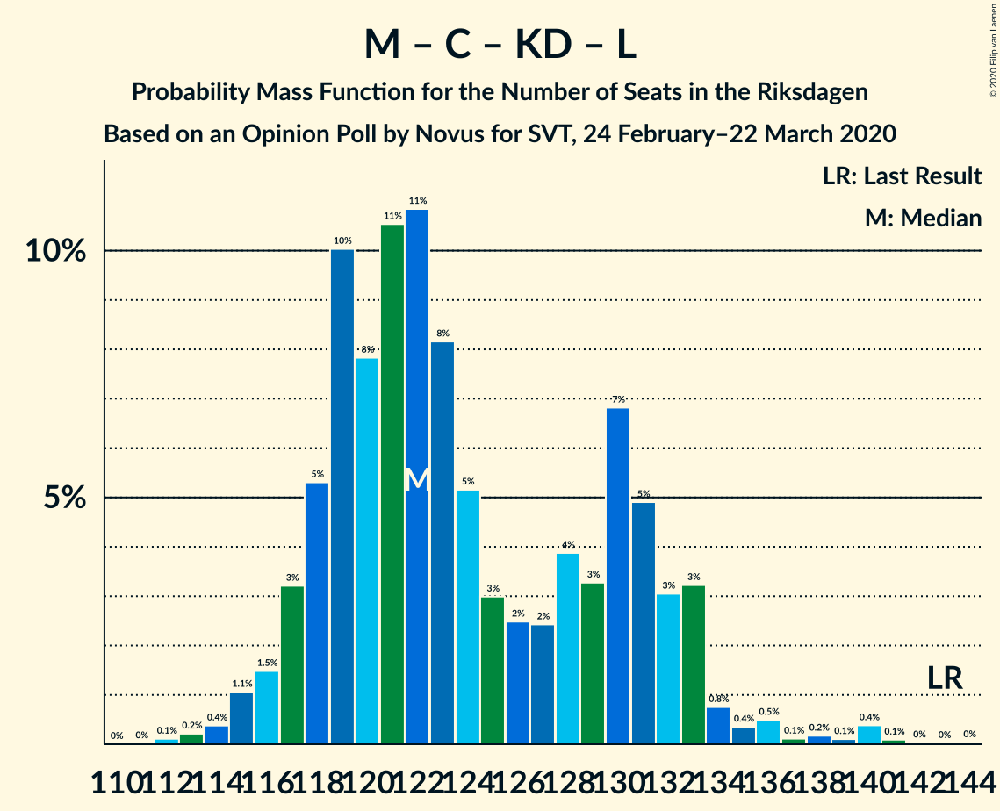
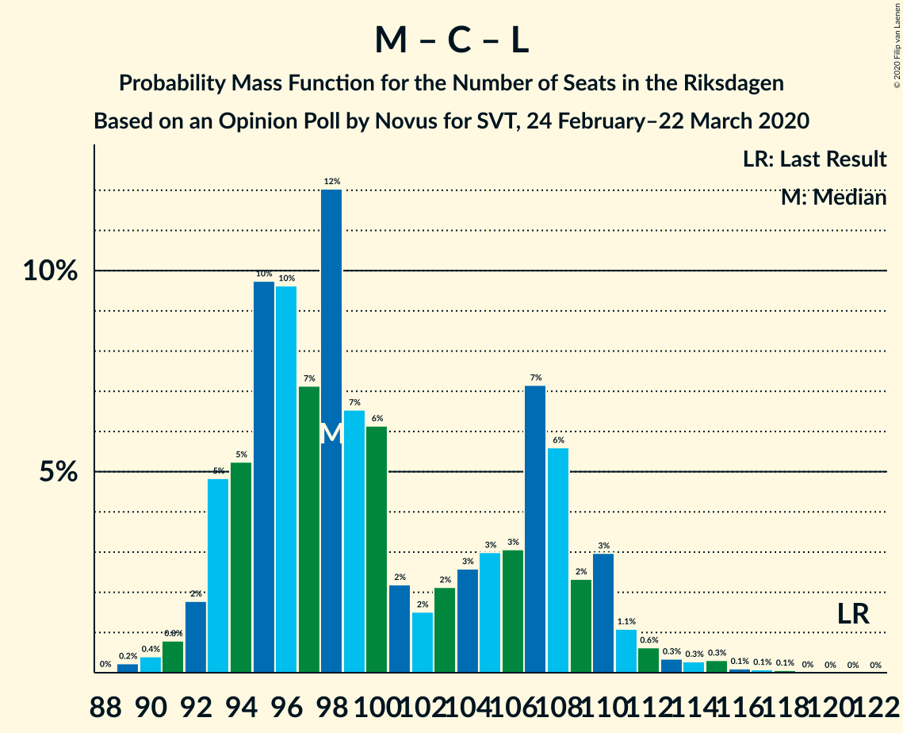

# Opinion Poll by Novus for SVT, 24 February–22 March 2020

<a href="#voting-intentions">Voting Intentions</a> | <a href="#seats">Seats</a> | <a href="#coalitions">Coalitions</a> | <a href="#technical-information">Technical Information</a>

## Voting Intentions

### Confidence Intervals

| Party | Last Result | Poll Result | 80% Confidence Interval | 90% Confidence Interval | 95% Confidence Interval | 99% Confidence Interval |
|:-----:|:-----------:|:-----------:|:-----------------------:|:-----------------------:|:-----------------------:|:-----------------------:|
| Sveriges socialdemokratiska arbetareparti | 28.3% | 25.6% | 24.7–26.6% |24.4–26.8% |24.2–27.0% |23.8–27.5% |
| Sverigedemokraterna | 17.5% | 22.0% | 21.1–22.9% |20.9–23.1% |20.7–23.4% |20.3–23.8% |
| Moderata samlingspartiet | 19.8% | 18.0% | 17.2–18.8% |17.0–19.1% |16.8–19.3% |16.4–19.7% |
| Vänsterpartiet | 8.0% | 9.8% | 9.2–10.5% |9.0–10.6% |8.9–10.8% |8.6–11.1% |
| Centerpartiet | 8.6% | 8.1% | 7.6–8.7% |7.4–8.9% |7.3–9.0% |7.0–9.3% |
| Kristdemokraterna | 6.3% | 6.5% | 6.0–7.1% |5.9–7.2% |5.7–7.3% |5.5–7.6% |
| Miljöpartiet de gröna | 4.4% | 4.5% | 4.1–5.0% |4.0–5.1% |3.9–5.2% |3.7–5.4% |
| Liberalerna | 5.5% | 3.8% | 3.4–4.2% |3.3–4.4% |3.2–4.5% |3.1–4.7% |

*Note:* The poll result column reflects the actual value used in the calculations. Published results may vary slightly, and in addition be rounded to fewer digits.

## Seats

### Confidence Intervals

| Party | Last Result | Median | 80% Confidence Interval | 90% Confidence Interval | 95% Confidence Interval | 99% Confidence Interval |
|:-----:|:-----------:|:------:|:-----------------------:|:-----------------------:|:-----------------------:|:-----------------------:|
| <a href="#sveriges-socialdemokratiska-arbetareparti">Sveriges socialdemokratiska arbetareparti</a> | 100 | 94 | 87–99 |86–101 |86–101 |85–101 |
| <a href="#sverigedemokraterna">Sverigedemokraterna</a> | 62 | 81 | 77–84 |75–86 |75–87 |72–87 |
| <a href="#moderata-samlingspartiet">Moderata samlingspartiet</a> | 70 | 66 | 62–70 |61–71 |61–71 |59–75 |
| <a href="#vänsterpartiet">Vänsterpartiet</a> | 28 | 35 | 33–38 |32–38 |32–39 |31–41 |
| <a href="#centerpartiet">Centerpartiet</a> | 31 | 30 | 27–32 |27–32 |26–33 |26–34 |
| <a href="#kristdemokraterna">Kristdemokraterna</a> | 22 | 23 | 22–25 |21–26 |21–27 |20–28 |
| <a href="#miljöpartiet-de-gröna">Miljöpartiet de gröna</a> | 16 | 16 | 15–18 |0–18 |0–19 |0–20 |
| <a href="#liberalerna">Liberalerna</a> | 20 | 0 | 0–15 |0–16 |0–16 |0–17 |

### Sveriges socialdemokratiska arbetareparti

*For a full overview of the results for this party, see the [Sveriges socialdemokratiska arbetareparti](party-sverigessocialdemokratiskaarbetareparti.html) page.*

| Number of Seats | Probability | Accumulated | Special Marks |
|:---------------:|:-----------:|:-----------:|:-------------:|
| 84 | 0.1% | 100% |  |
| 85 | 1.0% | 99.9% |  |
| 86 | 8% | 98.9% |  |
| 87 | 2% | 91% |  |
| 88 | 2% | 89% |  |
| 89 | 1.3% | 87% |  |
| 90 | 1.4% | 86% |  |
| 91 | 8% | 85% |  |
| 92 | 13% | 77% |  |
| 93 | 12% | 64% |  |
| 94 | 23% | 52% | Median |
| 95 | 12% | 28% |  |
| 96 | 3% | 16% |  |
| 97 | 1.4% | 14% |  |
| 98 | 1.3% | 12% |  |
| 99 | 2% | 11% |  |
| 100 | 3% | 9% | Last Result |
| 101 | 5% | 6% |  |
| 102 | 0.1% | 0.4% |  |
| 103 | 0.2% | 0.3% |  |
| 104 | 0.1% | 0.1% |  |
| 105 | 0% | 0% |  |

### Sverigedemokraterna

*For a full overview of the results for this party, see the [Sverigedemokraterna](party-sverigedemokraterna.html) page.*

| Number of Seats | Probability | Accumulated | Special Marks |
|:---------------:|:-----------:|:-----------:|:-------------:|
| 62 | 0% | 100% | Last Result |
| 63 | 0% | 100% |  |
| 64 | 0% | 100% |  |
| 65 | 0% | 100% |  |
| 66 | 0% | 100% |  |
| 67 | 0% | 100% |  |
| 68 | 0% | 100% |  |
| 69 | 0% | 100% |  |
| 70 | 0% | 100% |  |
| 71 | 0.2% | 100% |  |
| 72 | 0.4% | 99.8% |  |
| 73 | 0.7% | 99.3% |  |
| 74 | 1.0% | 98.7% |  |
| 75 | 3% | 98% |  |
| 76 | 4% | 95% |  |
| 77 | 6% | 91% |  |
| 78 | 11% | 86% |  |
| 79 | 10% | 75% |  |
| 80 | 10% | 64% |  |
| 81 | 5% | 54% | Median |
| 82 | 18% | 49% |  |
| 83 | 16% | 31% |  |
| 84 | 7% | 16% |  |
| 85 | 3% | 8% |  |
| 86 | 1.2% | 5% |  |
| 87 | 4% | 4% |  |
| 88 | 0.1% | 0.2% |  |
| 89 | 0% | 0.1% |  |
| 90 | 0.1% | 0.1% |  |
| 91 | 0% | 0% |  |

### Moderata samlingspartiet

*For a full overview of the results for this party, see the [Moderata samlingspartiet](party-moderatasamlingspartiet.html) page.*

| Number of Seats | Probability | Accumulated | Special Marks |
|:---------------:|:-----------:|:-----------:|:-------------:|
| 58 | 0.1% | 100% |  |
| 59 | 0.6% | 99.8% |  |
| 60 | 2% | 99.2% |  |
| 61 | 3% | 98% |  |
| 62 | 8% | 94% |  |
| 63 | 4% | 87% |  |
| 64 | 14% | 82% |  |
| 65 | 8% | 69% |  |
| 66 | 27% | 61% | Median |
| 67 | 8% | 34% |  |
| 68 | 10% | 26% |  |
| 69 | 2% | 16% |  |
| 70 | 8% | 14% | Last Result |
| 71 | 4% | 6% |  |
| 72 | 0.7% | 2% |  |
| 73 | 0.5% | 1.4% |  |
| 74 | 0.1% | 0.9% |  |
| 75 | 0.5% | 0.8% |  |
| 76 | 0.3% | 0.3% |  |
| 77 | 0% | 0% |  |

### Vänsterpartiet

*For a full overview of the results for this party, see the [Vänsterpartiet](party-vänsterpartiet.html) page.*

| Number of Seats | Probability | Accumulated | Special Marks |
|:---------------:|:-----------:|:-----------:|:-------------:|
| 28 | 0% | 100% | Last Result |
| 29 | 0% | 100% |  |
| 30 | 0.1% | 100% |  |
| 31 | 1.3% | 99.9% |  |
| 32 | 5% | 98.6% |  |
| 33 | 19% | 93% |  |
| 34 | 16% | 74% |  |
| 35 | 23% | 58% | Median |
| 36 | 13% | 35% |  |
| 37 | 11% | 23% |  |
| 38 | 8% | 12% |  |
| 39 | 2% | 4% |  |
| 40 | 1.2% | 2% |  |
| 41 | 0.4% | 0.7% |  |
| 42 | 0.1% | 0.3% |  |
| 43 | 0.1% | 0.2% |  |
| 44 | 0% | 0% |  |

### Centerpartiet

*For a full overview of the results for this party, see the [Centerpartiet](party-centerpartiet.html) page.*

| Number of Seats | Probability | Accumulated | Special Marks |
|:---------------:|:-----------:|:-----------:|:-------------:|
| 24 | 0.1% | 100% |  |
| 25 | 0.3% | 99.9% |  |
| 26 | 3% | 99.6% |  |
| 27 | 9% | 97% |  |
| 28 | 14% | 88% |  |
| 29 | 14% | 74% |  |
| 30 | 20% | 60% | Median |
| 31 | 11% | 40% | Last Result |
| 32 | 25% | 28% |  |
| 33 | 3% | 4% |  |
| 34 | 0.5% | 0.8% |  |
| 35 | 0.1% | 0.2% |  |
| 36 | 0.1% | 0.1% |  |
| 37 | 0% | 0% |  |

### Kristdemokraterna

*For a full overview of the results for this party, see the [Kristdemokraterna](party-kristdemokraterna.html) page.*

| Number of Seats | Probability | Accumulated | Special Marks |
|:---------------:|:-----------:|:-----------:|:-------------:|
| 19 | 0.1% | 100% |  |
| 20 | 1.4% | 99.9% |  |
| 21 | 6% | 98.5% |  |
| 22 | 18% | 92% | Last Result |
| 23 | 30% | 74% | Median |
| 24 | 23% | 45% |  |
| 25 | 13% | 21% |  |
| 26 | 5% | 8% |  |
| 27 | 2% | 3% |  |
| 28 | 0.6% | 0.9% |  |
| 29 | 0.3% | 0.3% |  |
| 30 | 0% | 0% |  |

### Miljöpartiet de gröna

*For a full overview of the results for this party, see the [Miljöpartiet de gröna](party-miljöpartietdegröna.html) page.*

| Number of Seats | Probability | Accumulated | Special Marks |
|:---------------:|:-----------:|:-----------:|:-------------:|
| 0 | 6% | 100% |  |
| 1 | 0% | 94% |  |
| 2 | 0% | 94% |  |
| 3 | 0% | 94% |  |
| 4 | 0% | 94% |  |
| 5 | 0% | 94% |  |
| 6 | 0% | 94% |  |
| 7 | 0% | 94% |  |
| 8 | 0% | 94% |  |
| 9 | 0% | 94% |  |
| 10 | 0% | 94% |  |
| 11 | 0% | 94% |  |
| 12 | 0% | 94% |  |
| 13 | 0% | 94% |  |
| 14 | 0.1% | 94% |  |
| 15 | 7% | 94% |  |
| 16 | 39% | 87% | Last Result, Median |
| 17 | 38% | 48% |  |
| 18 | 7% | 11% |  |
| 19 | 2% | 3% |  |
| 20 | 1.4% | 2% |  |
| 21 | 0.1% | 0.2% |  |
| 22 | 0% | 0% |  |

### Liberalerna

*For a full overview of the results for this party, see the [Liberalerna](party-liberalerna.html) page.*

| Number of Seats | Probability | Accumulated | Special Marks |
|:---------------:|:-----------:|:-----------:|:-------------:|
| 0 | 66% | 100% | Median |
| 1 | 0% | 34% |  |
| 2 | 0% | 34% |  |
| 3 | 0% | 34% |  |
| 4 | 0% | 34% |  |
| 5 | 0% | 34% |  |
| 6 | 0% | 34% |  |
| 7 | 0% | 34% |  |
| 8 | 0% | 34% |  |
| 9 | 0% | 34% |  |
| 10 | 0% | 34% |  |
| 11 | 0% | 34% |  |
| 12 | 0% | 34% |  |
| 13 | 0% | 34% |  |
| 14 | 7% | 34% |  |
| 15 | 20% | 26% |  |
| 16 | 5% | 6% |  |
| 17 | 0.6% | 0.7% |  |
| 18 | 0.1% | 0.1% |  |
| 19 | 0% | 0% |  |
| 20 | 0% | 0% | Last Result |

## Coalitions

### Confidence Intervals

| Coalition | Last Result | Median | Majority? | 80% Confidence Interval | 90% Confidence Interval | 95% Confidence Interval | 99% Confidence Interval |
|:---------:|:-----------:|:------:|:---------:|:-----------------------:|:-----------------------:|:-----------------------:|:-----------------------:|
| Sveriges socialdemokratiska arbetareparti – Moderata samlingspartiet – Centerpartiet | 201 | 191 | 100% | 181–196 | 180–196 | 179–198 | 175–203 |
| Sveriges socialdemokratiska arbetareparti – Vänsterpartiet – Centerpartiet – Miljöpartiet de gröna – Liberalerna | 195 | 178 | 79% | 174–186 | 173–188 | 171–189 | 165–191 |
| Sverigedemokraterna – Moderata samlingspartiet – Kristdemokraterna | 154 | 171 | 21% | 163–175 | 161–176 | 160–178 | 158–184 |
| Sveriges socialdemokratiska arbetareparti – Moderata samlingspartiet | 170 | 160 | 0% | 152–167 | 150–168 | 149–168 | 146–171 |
| Sveriges socialdemokratiska arbetareparti – Centerpartiet – Miljöpartiet de gröna – Liberalerna | 167 | 143 | 0% | 138–151 | 136–153 | 135–155 | 127–156 |
| Sverigedemokraterna – Moderata samlingspartiet | 132 | 148 | 0% | 141–152 | 139–153 | 138–154 | 134–159 |
| Sveriges socialdemokratiska arbetareparti – Vänsterpartiet – Miljöpartiet de gröna | 144 | 144 | 0% | 138–151 | 135–152 | 129–153 | 127–155 |
| Moderata samlingspartiet – Centerpartiet – Kristdemokraterna – Liberalerna | 143 | 123 | 0% | 117–132 | 117–136 | 116–139 | 113–140 |
| Sveriges socialdemokratiska arbetareparti – Vänsterpartiet | 128 | 128 | 0% | 123–134 | 121–136 | 121–136 | 119–138 |
| Moderata samlingspartiet – Centerpartiet – Kristdemokraterna | 123 | 119 | 0% | 113–123 | 112–125 | 112–125 | 110–132 |
| Sveriges socialdemokratiska arbetareparti – Miljöpartiet de gröna | 116 | 110 | 0% | 102–116 | 99–117 | 94–117 | 93–118 |
| Moderata samlingspartiet – Centerpartiet – Liberalerna | 121 | 99 | 0% | 94–110 | 94–111 | 92–114 | 89–115 |
| Moderata samlingspartiet – Centerpartiet | 101 | 96 | 0% | 90–100 | 89–101 | 89–101 | 88–107 |

### Sveriges socialdemokratiska arbetareparti – Moderata samlingspartiet – Centerpartiet

| Number of Seats | Probability | Accumulated | Special Marks |
|:---------------:|:-----------:|:-----------:|:-------------:|
| 175 | 1.1% | 100% | Majority |
| 176 | 0.1% | 98.8% |  |
| 177 | 0.1% | 98.7% |  |
| 178 | 1.1% | 98.6% |  |
| 179 | 2% | 98% |  |
| 180 | 4% | 96% |  |
| 181 | 3% | 92% |  |
| 182 | 5% | 89% |  |
| 183 | 0.4% | 84% |  |
| 184 | 9% | 84% |  |
| 185 | 6% | 75% |  |
| 186 | 3% | 69% |  |
| 187 | 2% | 66% |  |
| 188 | 4% | 64% |  |
| 189 | 4% | 60% |  |
| 190 | 0.9% | 56% | Median |
| 191 | 6% | 55% |  |
| 192 | 27% | 49% |  |
| 193 | 8% | 22% |  |
| 194 | 1.0% | 14% |  |
| 195 | 1.0% | 13% |  |
| 196 | 8% | 12% |  |
| 197 | 0.5% | 4% |  |
| 198 | 1.2% | 3% |  |
| 199 | 0.5% | 2% |  |
| 200 | 0.1% | 1.5% |  |
| 201 | 0% | 1.4% | Last Result |
| 202 | 0.6% | 1.4% |  |
| 203 | 0.5% | 0.8% |  |
| 204 | 0.1% | 0.3% |  |
| 205 | 0% | 0.2% |  |
| 206 | 0.2% | 0.2% |  |
| 207 | 0% | 0% |  |

### Sveriges socialdemokratiska arbetareparti – Vänsterpartiet – Centerpartiet – Miljöpartiet de gröna – Liberalerna

| Number of Seats | Probability | Accumulated | Special Marks |
|:---------------:|:-----------:|:-----------:|:-------------:|
| 163 | 0% | 100% |  |
| 164 | 0.3% | 99.9% |  |
| 165 | 0.5% | 99.6% |  |
| 166 | 0% | 99.1% |  |
| 167 | 0.1% | 99.0% |  |
| 168 | 0.1% | 98.9% |  |
| 169 | 0.3% | 98.8% |  |
| 170 | 0.7% | 98% |  |
| 171 | 1.0% | 98% |  |
| 172 | 0.7% | 97% |  |
| 173 | 5% | 96% |  |
| 174 | 12% | 91% |  |
| 175 | 7% | 79% | Median, Majority |
| 176 | 15% | 72% |  |
| 177 | 4% | 57% |  |
| 178 | 8% | 54% |  |
| 179 | 5% | 46% |  |
| 180 | 3% | 41% |  |
| 181 | 8% | 37% |  |
| 182 | 2% | 30% |  |
| 183 | 5% | 28% |  |
| 184 | 6% | 22% |  |
| 185 | 4% | 16% |  |
| 186 | 5% | 12% |  |
| 187 | 2% | 7% |  |
| 188 | 1.3% | 5% |  |
| 189 | 2% | 4% |  |
| 190 | 1.5% | 2% |  |
| 191 | 0% | 0.5% |  |
| 192 | 0.4% | 0.5% |  |
| 193 | 0% | 0.1% |  |
| 194 | 0.1% | 0.1% |  |
| 195 | 0% | 0% | Last Result |

### Sverigedemokraterna – Moderata samlingspartiet – Kristdemokraterna

| Number of Seats | Probability | Accumulated | Special Marks |
|:---------------:|:-----------:|:-----------:|:-------------:|
| 154 | 0% | 100% | Last Result |
| 155 | 0.1% | 100% |  |
| 156 | 0% | 99.9% |  |
| 157 | 0.4% | 99.9% |  |
| 158 | 0% | 99.5% |  |
| 159 | 1.5% | 99.5% |  |
| 160 | 2% | 98% |  |
| 161 | 1.3% | 96% |  |
| 162 | 2% | 95% |  |
| 163 | 5% | 93% |  |
| 164 | 4% | 88% |  |
| 165 | 6% | 84% |  |
| 166 | 5% | 78% |  |
| 167 | 2% | 72% |  |
| 168 | 8% | 70% |  |
| 169 | 3% | 63% |  |
| 170 | 5% | 59% | Median |
| 171 | 8% | 54% |  |
| 172 | 4% | 46% |  |
| 173 | 15% | 43% |  |
| 174 | 7% | 28% |  |
| 175 | 12% | 21% | Majority |
| 176 | 5% | 9% |  |
| 177 | 0.7% | 4% |  |
| 178 | 1.0% | 3% |  |
| 179 | 0.7% | 2% |  |
| 180 | 0.3% | 2% |  |
| 181 | 0.1% | 1.2% |  |
| 182 | 0.1% | 1.1% |  |
| 183 | 0% | 1.0% |  |
| 184 | 0.5% | 0.9% |  |
| 185 | 0.3% | 0.4% |  |
| 186 | 0% | 0.1% |  |
| 187 | 0% | 0% |  |

### Sveriges socialdemokratiska arbetareparti – Moderata samlingspartiet

| Number of Seats | Probability | Accumulated | Special Marks |
|:---------------:|:-----------:|:-----------:|:-------------:|
| 146 | 0.7% | 100% |  |
| 147 | 0.5% | 99.2% |  |
| 148 | 0.7% | 98.7% |  |
| 149 | 0.9% | 98% |  |
| 150 | 4% | 97% |  |
| 151 | 0.3% | 93% |  |
| 152 | 5% | 93% |  |
| 153 | 2% | 88% |  |
| 154 | 2% | 86% |  |
| 155 | 4% | 83% |  |
| 156 | 7% | 80% |  |
| 157 | 6% | 73% |  |
| 158 | 5% | 67% |  |
| 159 | 7% | 62% |  |
| 160 | 16% | 54% | Median |
| 161 | 11% | 38% |  |
| 162 | 7% | 27% |  |
| 163 | 5% | 20% |  |
| 164 | 2% | 15% |  |
| 165 | 1.2% | 13% |  |
| 166 | 2% | 12% |  |
| 167 | 4% | 10% |  |
| 168 | 4% | 6% |  |
| 169 | 0.3% | 2% |  |
| 170 | 0.8% | 2% | Last Result |
| 171 | 0.5% | 0.8% |  |
| 172 | 0.1% | 0.3% |  |
| 173 | 0.2% | 0.2% |  |
| 174 | 0% | 0.1% |  |
| 175 | 0% | 0% | Majority |

### Sveriges socialdemokratiska arbetareparti – Centerpartiet – Miljöpartiet de gröna – Liberalerna

| Number of Seats | Probability | Accumulated | Special Marks |
|:---------------:|:-----------:|:-----------:|:-------------:|
| 126 | 0% | 100% |  |
| 127 | 0.7% | 99.9% |  |
| 128 | 0% | 99.2% |  |
| 129 | 0.2% | 99.2% |  |
| 130 | 0.2% | 99.0% |  |
| 131 | 0.2% | 98.9% |  |
| 132 | 0.2% | 98.7% |  |
| 133 | 0.1% | 98.5% |  |
| 134 | 0.5% | 98% |  |
| 135 | 0.8% | 98% |  |
| 136 | 2% | 97% |  |
| 137 | 1.0% | 95% |  |
| 138 | 8% | 94% |  |
| 139 | 9% | 86% |  |
| 140 | 5% | 77% | Median |
| 141 | 3% | 72% |  |
| 142 | 2% | 69% |  |
| 143 | 24% | 66% |  |
| 144 | 2% | 43% |  |
| 145 | 6% | 41% |  |
| 146 | 6% | 34% |  |
| 147 | 2% | 29% |  |
| 148 | 8% | 26% |  |
| 149 | 3% | 19% |  |
| 150 | 3% | 16% |  |
| 151 | 3% | 13% |  |
| 152 | 4% | 9% |  |
| 153 | 0.9% | 6% |  |
| 154 | 1.3% | 5% |  |
| 155 | 3% | 3% |  |
| 156 | 0.3% | 0.8% |  |
| 157 | 0.3% | 0.4% |  |
| 158 | 0.1% | 0.1% |  |
| 159 | 0% | 0% |  |
| 160 | 0% | 0% |  |
| 161 | 0% | 0% |  |
| 162 | 0% | 0% |  |
| 163 | 0% | 0% |  |
| 164 | 0% | 0% |  |
| 165 | 0% | 0% |  |
| 166 | 0% | 0% |  |
| 167 | 0% | 0% | Last Result |

### Sverigedemokraterna – Moderata samlingspartiet

| Number of Seats | Probability | Accumulated | Special Marks |
|:---------------:|:-----------:|:-----------:|:-------------:|
| 132 | 0% | 100% | Last Result |
| 133 | 0.1% | 100% |  |
| 134 | 0.6% | 99.9% |  |
| 135 | 0.3% | 99.3% |  |
| 136 | 0.2% | 99.0% |  |
| 137 | 0.8% | 98.8% |  |
| 138 | 3% | 98% |  |
| 139 | 2% | 95% |  |
| 140 | 2% | 93% |  |
| 141 | 6% | 92% |  |
| 142 | 10% | 85% |  |
| 143 | 4% | 75% |  |
| 144 | 3% | 71% |  |
| 145 | 2% | 68% |  |
| 146 | 6% | 66% |  |
| 147 | 9% | 60% | Median |
| 148 | 8% | 51% |  |
| 149 | 19% | 43% |  |
| 150 | 6% | 24% |  |
| 151 | 5% | 18% |  |
| 152 | 8% | 13% |  |
| 153 | 3% | 5% |  |
| 154 | 0.8% | 3% |  |
| 155 | 0.6% | 2% |  |
| 156 | 0.2% | 1.3% |  |
| 157 | 0.2% | 1.2% |  |
| 158 | 0.1% | 0.9% |  |
| 159 | 0.8% | 0.8% |  |
| 160 | 0% | 0.1% |  |
| 161 | 0% | 0% |  |

### Sveriges socialdemokratiska arbetareparti – Vänsterpartiet – Miljöpartiet de gröna

| Number of Seats | Probability | Accumulated | Special Marks |
|:---------------:|:-----------:|:-----------:|:-------------:|
| 125 | 0% | 100% |  |
| 126 | 0% | 99.9% |  |
| 127 | 2% | 99.9% |  |
| 128 | 0% | 98% |  |
| 129 | 1.0% | 98% |  |
| 130 | 0.1% | 97% |  |
| 131 | 0.1% | 97% |  |
| 132 | 0.5% | 96% |  |
| 133 | 0.6% | 96% |  |
| 134 | 0.2% | 95% |  |
| 135 | 0.8% | 95% |  |
| 136 | 0.4% | 94% |  |
| 137 | 2% | 94% |  |
| 138 | 5% | 92% |  |
| 139 | 5% | 87% |  |
| 140 | 1.0% | 82% |  |
| 141 | 1.2% | 81% |  |
| 142 | 1.0% | 80% |  |
| 143 | 8% | 79% |  |
| 144 | 34% | 70% | Last Result |
| 145 | 5% | 36% | Median |
| 146 | 8% | 31% |  |
| 147 | 5% | 23% |  |
| 148 | 3% | 18% |  |
| 149 | 1.3% | 15% |  |
| 150 | 1.2% | 14% |  |
| 151 | 5% | 13% |  |
| 152 | 5% | 8% |  |
| 153 | 0.8% | 3% |  |
| 154 | 2% | 2% |  |
| 155 | 0.4% | 0.5% |  |
| 156 | 0.1% | 0.1% |  |
| 157 | 0% | 0% |  |

### Moderata samlingspartiet – Centerpartiet – Kristdemokraterna – Liberalerna

| Number of Seats | Probability | Accumulated | Special Marks |
|:---------------:|:-----------:|:-----------:|:-------------:|
| 112 | 0.3% | 100% |  |
| 113 | 0.6% | 99.7% |  |
| 114 | 0.1% | 99.1% |  |
| 115 | 0.7% | 99.0% |  |
| 116 | 2% | 98% |  |
| 117 | 8% | 96% |  |
| 118 | 1.2% | 89% |  |
| 119 | 10% | 87% | Median |
| 120 | 6% | 77% |  |
| 121 | 2% | 71% |  |
| 122 | 17% | 69% |  |
| 123 | 11% | 53% |  |
| 124 | 1.2% | 41% |  |
| 125 | 4% | 40% |  |
| 126 | 4% | 36% |  |
| 127 | 2% | 31% |  |
| 128 | 7% | 30% |  |
| 129 | 4% | 23% |  |
| 130 | 1.1% | 19% |  |
| 131 | 4% | 18% |  |
| 132 | 4% | 14% |  |
| 133 | 0.8% | 10% |  |
| 134 | 4% | 9% |  |
| 135 | 0.1% | 5% |  |
| 136 | 1.5% | 5% |  |
| 137 | 0.1% | 4% |  |
| 138 | 1.0% | 4% |  |
| 139 | 0.2% | 3% |  |
| 140 | 2% | 2% |  |
| 141 | 0.1% | 0.2% |  |
| 142 | 0% | 0.1% |  |
| 143 | 0% | 0% | Last Result |

### Sveriges socialdemokratiska arbetareparti – Vänsterpartiet

| Number of Seats | Probability | Accumulated | Special Marks |
|:---------------:|:-----------:|:-----------:|:-------------:|
| 118 | 0.1% | 100% |  |
| 119 | 0.6% | 99.9% |  |
| 120 | 1.1% | 99.3% |  |
| 121 | 5% | 98% |  |
| 122 | 1.1% | 93% |  |
| 123 | 5% | 92% |  |
| 124 | 0.9% | 87% |  |
| 125 | 2% | 86% |  |
| 126 | 9% | 84% |  |
| 127 | 22% | 75% |  |
| 128 | 13% | 52% | Last Result |
| 129 | 7% | 39% | Median |
| 130 | 9% | 33% |  |
| 131 | 4% | 23% |  |
| 132 | 3% | 19% |  |
| 133 | 3% | 16% |  |
| 134 | 6% | 14% |  |
| 135 | 0.7% | 8% |  |
| 136 | 5% | 7% |  |
| 137 | 1.0% | 2% |  |
| 138 | 0.3% | 0.6% |  |
| 139 | 0.1% | 0.3% |  |
| 140 | 0.1% | 0.2% |  |
| 141 | 0% | 0.2% |  |
| 142 | 0% | 0.1% |  |
| 143 | 0.1% | 0.1% |  |
| 144 | 0% | 0% |  |

### Moderata samlingspartiet – Centerpartiet – Kristdemokraterna

| Number of Seats | Probability | Accumulated | Special Marks |
|:---------------:|:-----------:|:-----------:|:-------------:|
| 108 | 0.1% | 100% |  |
| 109 | 0.2% | 99.8% |  |
| 110 | 0.2% | 99.7% |  |
| 111 | 2% | 99.5% |  |
| 112 | 4% | 98% |  |
| 113 | 5% | 93% |  |
| 114 | 5% | 88% |  |
| 115 | 2% | 83% |  |
| 116 | 6% | 81% |  |
| 117 | 12% | 75% |  |
| 118 | 2% | 64% |  |
| 119 | 14% | 62% | Median |
| 120 | 6% | 48% |  |
| 121 | 3% | 42% |  |
| 122 | 17% | 39% |  |
| 123 | 12% | 22% | Last Result |
| 124 | 1.2% | 10% |  |
| 125 | 6% | 9% |  |
| 126 | 0.5% | 2% |  |
| 127 | 0.5% | 2% |  |
| 128 | 0.2% | 2% |  |
| 129 | 0.2% | 1.3% |  |
| 130 | 0.2% | 1.2% |  |
| 131 | 0.1% | 0.9% |  |
| 132 | 0.5% | 0.8% |  |
| 133 | 0% | 0.3% |  |
| 134 | 0.3% | 0.3% |  |
| 135 | 0% | 0% |  |

### Sveriges socialdemokratiska arbetareparti – Miljöpartiet de gröna

| Number of Seats | Probability | Accumulated | Special Marks |
|:---------------:|:-----------:|:-----------:|:-------------:|
| 91 | 0% | 100% |  |
| 92 | 0.1% | 99.9% |  |
| 93 | 2% | 99.9% |  |
| 94 | 1.0% | 98% |  |
| 95 | 0.9% | 97% |  |
| 96 | 0.3% | 96% |  |
| 97 | 0.1% | 96% |  |
| 98 | 0.2% | 95% |  |
| 99 | 0.3% | 95% |  |
| 100 | 0.1% | 95% |  |
| 101 | 0.6% | 95% |  |
| 102 | 5% | 94% |  |
| 103 | 5% | 89% |  |
| 104 | 2% | 84% |  |
| 105 | 2% | 82% |  |
| 106 | 3% | 81% |  |
| 107 | 5% | 78% |  |
| 108 | 9% | 73% |  |
| 109 | 9% | 64% |  |
| 110 | 10% | 55% | Median |
| 111 | 25% | 45% |  |
| 112 | 5% | 20% |  |
| 113 | 1.1% | 15% |  |
| 114 | 2% | 14% |  |
| 115 | 2% | 12% |  |
| 116 | 1.4% | 10% | Last Result |
| 117 | 8% | 9% |  |
| 118 | 0.1% | 0.6% |  |
| 119 | 0.3% | 0.5% |  |
| 120 | 0.1% | 0.1% |  |
| 121 | 0% | 0% |  |

### Moderata samlingspartiet – Centerpartiet – Liberalerna

| Number of Seats | Probability | Accumulated | Special Marks |
|:---------------:|:-----------:|:-----------:|:-------------:|
| 88 | 0% | 100% |  |
| 89 | 0.8% | 99.9% |  |
| 90 | 0% | 99.2% |  |
| 91 | 0.4% | 99.1% |  |
| 92 | 1.3% | 98.7% |  |
| 93 | 2% | 97% |  |
| 94 | 6% | 96% |  |
| 95 | 8% | 90% |  |
| 96 | 11% | 82% | Median |
| 97 | 1.2% | 71% |  |
| 98 | 19% | 70% |  |
| 99 | 3% | 51% |  |
| 100 | 7% | 48% |  |
| 101 | 4% | 40% |  |
| 102 | 0.8% | 36% |  |
| 103 | 1.4% | 35% |  |
| 104 | 6% | 34% |  |
| 105 | 4% | 28% |  |
| 106 | 3% | 24% |  |
| 107 | 4% | 21% |  |
| 108 | 2% | 18% |  |
| 109 | 2% | 15% |  |
| 110 | 5% | 14% |  |
| 111 | 4% | 9% |  |
| 112 | 0.8% | 5% |  |
| 113 | 0.4% | 4% |  |
| 114 | 1.1% | 3% |  |
| 115 | 2% | 2% |  |
| 116 | 0.1% | 0.2% |  |
| 117 | 0% | 0.1% |  |
| 118 | 0% | 0% |  |
| 119 | 0% | 0% |  |
| 120 | 0% | 0% |  |
| 121 | 0% | 0% | Last Result |

### Moderata samlingspartiet – Centerpartiet

| Number of Seats | Probability | Accumulated | Special Marks |
|:---------------:|:-----------:|:-----------:|:-------------:|
| 85 | 0.1% | 100% |  |
| 86 | 0.1% | 99.9% |  |
| 87 | 0.1% | 99.8% |  |
| 88 | 1.1% | 99.7% |  |
| 89 | 4% | 98.6% |  |
| 90 | 5% | 95% |  |
| 91 | 5% | 89% |  |
| 92 | 4% | 84% |  |
| 93 | 3% | 80% |  |
| 94 | 8% | 77% |  |
| 95 | 13% | 69% |  |
| 96 | 15% | 56% | Median |
| 97 | 2% | 42% |  |
| 98 | 19% | 39% |  |
| 99 | 4% | 20% |  |
| 100 | 9% | 16% |  |
| 101 | 4% | 7% | Last Result |
| 102 | 0.8% | 2% |  |
| 103 | 0.2% | 1.5% |  |
| 104 | 0.1% | 1.2% |  |
| 105 | 0.2% | 1.1% |  |
| 106 | 0.1% | 0.9% |  |
| 107 | 0.5% | 0.8% |  |
| 108 | 0.3% | 0.3% |  |
| 109 | 0% | 0% |  |

## Technical Information

### Opinion Poll

+ **Polling firm:** Novus
+ **Commissioner(s):** SVT
+ **Fieldwork period:** 24 February–22 March 2020

### Calculations

+ **Sample size:** 3737
+ **Simulations done:** 131,072
+ **Error estimate:** 1.59%

