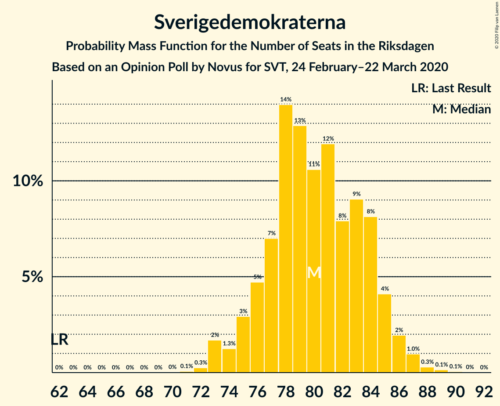
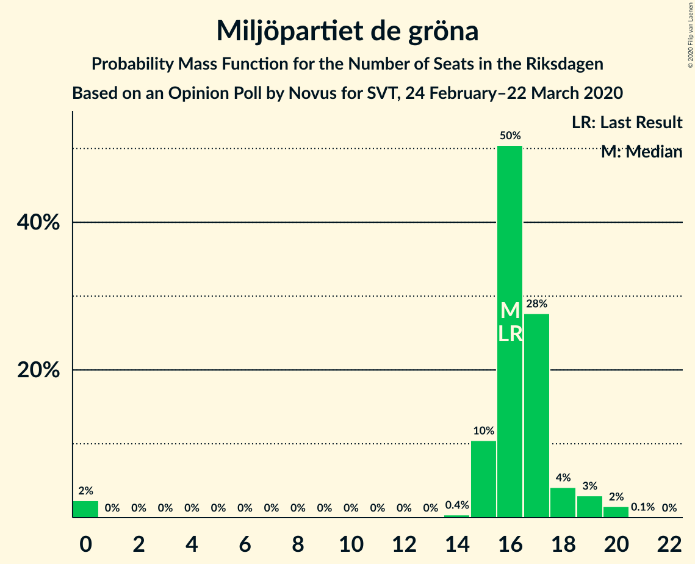
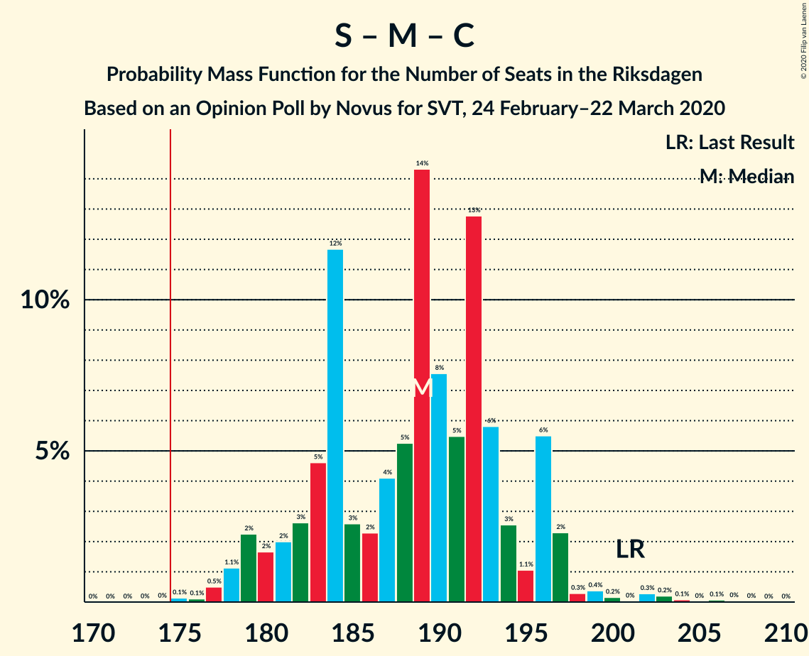
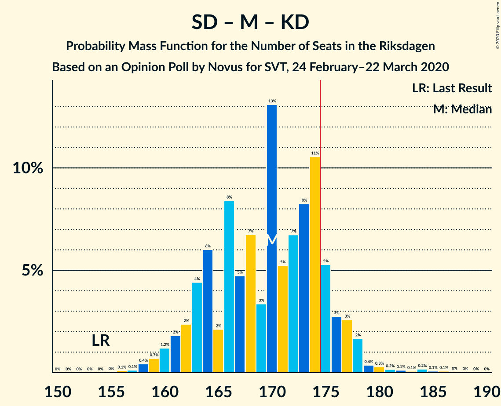
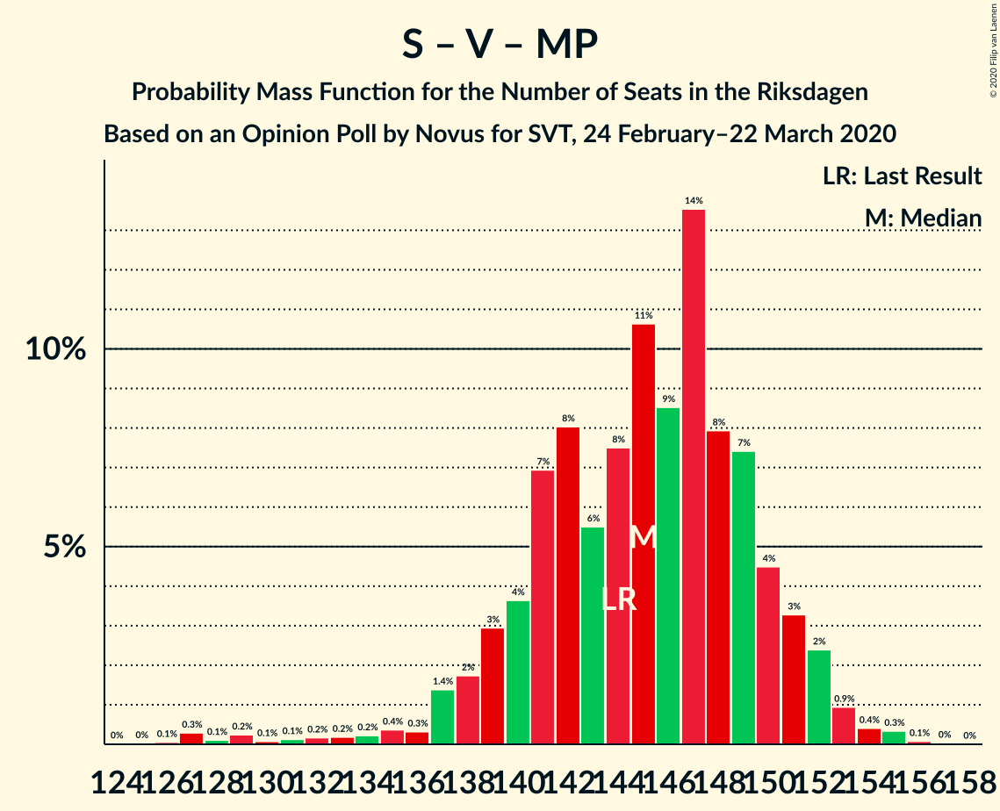

# Opinion Poll by Novus for SVT, 24 February–22 March 2020

<a href="#voting-intentions">Voting Intentions</a> | <a href="#seats">Seats</a> | <a href="#coalitions">Coalitions</a> | <a href="#technical-information">Technical Information</a>

## Voting Intentions

### Confidence Intervals

| Party | Last Result | Poll Result | 80% Confidence Interval | 90% Confidence Interval | 95% Confidence Interval | 99% Confidence Interval |
|:-----:|:-----------:|:-----------:|:-----------------------:|:-----------------------:|:-----------------------:|:-----------------------:|
| Sveriges socialdemokratiska arbetareparti | 28.3% | 25.6% | 24.7–26.6% |24.4–26.8% |24.2–27.0% |23.8–27.5% |
| Sverigedemokraterna | 17.5% | 22.0% | 21.1–22.9% |20.9–23.1% |20.7–23.4% |20.3–23.8% |
| Moderata samlingspartiet | 19.8% | 18.0% | 17.2–18.8% |17.0–19.1% |16.8–19.3% |16.4–19.7% |
| Vänsterpartiet | 8.0% | 9.8% | 9.2–10.5% |9.0–10.6% |8.9–10.8% |8.6–11.1% |
| Centerpartiet | 8.6% | 8.1% | 7.6–8.7% |7.4–8.9% |7.3–9.0% |7.0–9.3% |
| Kristdemokraterna | 6.3% | 6.5% | 6.0–7.1% |5.9–7.2% |5.7–7.3% |5.5–7.6% |
| Miljöpartiet de gröna | 4.4% | 4.5% | 4.1–5.0% |4.0–5.1% |3.9–5.2% |3.7–5.4% |
| Liberalerna | 5.5% | 3.8% | 3.4–4.2% |3.3–4.4% |3.2–4.5% |3.1–4.7% |

*Note:* The poll result column reflects the actual value used in the calculations. Published results may vary slightly, and in addition be rounded to fewer digits.

## Seats

### Confidence Intervals

| Party | Last Result | Median | 80% Confidence Interval | 90% Confidence Interval | 95% Confidence Interval | 99% Confidence Interval |
|:-----:|:-----------:|:------:|:-----------------------:|:-----------------------:|:-----------------------:|:-----------------------:|
| <a href="#sveriges-socialdemokratiska-arbetareparti">Sveriges socialdemokratiska arbetareparti</a> | 100 | 93 | 89–97 |88–98 |86–100 |86–101 |
| <a href="#sverigedemokraterna">Sverigedemokraterna</a> | 62 | 80 | 76–84 |75–85 |74–86 |73–88 |
| <a href="#moderata-samlingspartiet">Moderata samlingspartiet</a> | 70 | 66 | 62–69 |61–70 |60–71 |59–73 |
| <a href="#vänsterpartiet">Vänsterpartiet</a> | 28 | 36 | 33–38 |32–38 |32–40 |31–41 |
| <a href="#centerpartiet">Centerpartiet</a> | 31 | 30 | 27–32 |27–32 |26–33 |25–34 |
| <a href="#kristdemokraterna">Kristdemokraterna</a> | 22 | 24 | 22–26 |21–27 |21–27 |20–28 |
| <a href="#miljöpartiet-de-gröna">Miljöpartiet de gröna</a> | 16 | 16 | 15–17 |15–18 |14–19 |0–20 |
| <a href="#liberalerna">Liberalerna</a> | 20 | 0 | 0–15 |0–15 |0–16 |0–17 |

### Sveriges socialdemokratiska arbetareparti

*For a full overview of the results for this party, see the [Sveriges socialdemokratiska arbetareparti](party-sverigessocialdemokratiskaarbetareparti.html) page.*

| Number of Seats | Probability | Accumulated | Special Marks |
|:---------------:|:-----------:|:-----------:|:-------------:|
| 83 | 0% | 100% |  |
| 84 | 0.1% | 99.9% |  |
| 85 | 0.3% | 99.8% |  |
| 86 | 2% | 99.6% |  |
| 87 | 1.3% | 97% |  |
| 88 | 4% | 96% |  |
| 89 | 2% | 92% |  |
| 90 | 7% | 89% |  |
| 91 | 14% | 82% |  |
| 92 | 8% | 68% |  |
| 93 | 12% | 61% | Median |
| 94 | 17% | 49% |  |
| 95 | 7% | 32% |  |
| 96 | 9% | 24% |  |
| 97 | 8% | 15% |  |
| 98 | 3% | 7% |  |
| 99 | 2% | 5% |  |
| 100 | 1.3% | 3% | Last Result |
| 101 | 0.9% | 1.4% |  |
| 102 | 0.2% | 0.5% |  |
| 103 | 0.1% | 0.3% |  |
| 104 | 0.1% | 0.1% |  |
| 105 | 0.1% | 0.1% |  |
| 106 | 0% | 0% |  |

### Sverigedemokraterna

*For a full overview of the results for this party, see the [Sverigedemokraterna](party-sverigedemokraterna.html) page.*

| Number of Seats | Probability | Accumulated | Special Marks |
|:---------------:|:-----------:|:-----------:|:-------------:|
| 62 | 0% | 100% | Last Result |
| 63 | 0% | 100% |  |
| 64 | 0% | 100% |  |
| 65 | 0% | 100% |  |
| 66 | 0% | 100% |  |
| 67 | 0% | 100% |  |
| 68 | 0% | 100% |  |
| 69 | 0% | 100% |  |
| 70 | 0% | 100% |  |
| 71 | 0.1% | 100% |  |
| 72 | 0.3% | 99.9% |  |
| 73 | 2% | 99.6% |  |
| 74 | 1.3% | 98% |  |
| 75 | 3% | 97% |  |
| 76 | 5% | 94% |  |
| 77 | 7% | 89% |  |
| 78 | 14% | 82% |  |
| 79 | 13% | 68% |  |
| 80 | 11% | 55% | Median |
| 81 | 12% | 45% |  |
| 82 | 8% | 33% |  |
| 83 | 9% | 25% |  |
| 84 | 8% | 16% |  |
| 85 | 4% | 8% |  |
| 86 | 2% | 3% |  |
| 87 | 1.0% | 2% |  |
| 88 | 0.3% | 0.5% |  |
| 89 | 0.1% | 0.2% |  |
| 90 | 0.1% | 0.1% |  |
| 91 | 0% | 0% |  |

### Moderata samlingspartiet

*For a full overview of the results for this party, see the [Moderata samlingspartiet](party-moderatasamlingspartiet.html) page.*

| Number of Seats | Probability | Accumulated | Special Marks |
|:---------------:|:-----------:|:-----------:|:-------------:|
| 57 | 0% | 100% |  |
| 58 | 0.1% | 99.9% |  |
| 59 | 0.5% | 99.8% |  |
| 60 | 2% | 99.3% |  |
| 61 | 3% | 97% |  |
| 62 | 6% | 95% |  |
| 63 | 11% | 89% |  |
| 64 | 8% | 77% |  |
| 65 | 10% | 69% |  |
| 66 | 17% | 59% | Median |
| 67 | 16% | 42% |  |
| 68 | 12% | 26% |  |
| 69 | 8% | 15% |  |
| 70 | 4% | 7% | Last Result |
| 71 | 2% | 3% |  |
| 72 | 0.6% | 1.3% |  |
| 73 | 0.4% | 0.7% |  |
| 74 | 0.1% | 0.3% |  |
| 75 | 0.1% | 0.2% |  |
| 76 | 0.1% | 0.1% |  |
| 77 | 0% | 0% |  |

### Vänsterpartiet

*For a full overview of the results for this party, see the [Vänsterpartiet](party-vänsterpartiet.html) page.*

| Number of Seats | Probability | Accumulated | Special Marks |
|:---------------:|:-----------:|:-----------:|:-------------:|
| 28 | 0% | 100% | Last Result |
| 29 | 0% | 100% |  |
| 30 | 0.1% | 100% |  |
| 31 | 1.2% | 99.9% |  |
| 32 | 4% | 98.7% |  |
| 33 | 5% | 95% |  |
| 34 | 11% | 90% |  |
| 35 | 24% | 79% |  |
| 36 | 16% | 55% | Median |
| 37 | 23% | 39% |  |
| 38 | 11% | 16% |  |
| 39 | 2% | 5% |  |
| 40 | 2% | 3% |  |
| 41 | 0.6% | 0.9% |  |
| 42 | 0.2% | 0.3% |  |
| 43 | 0.1% | 0.1% |  |
| 44 | 0% | 0% |  |

### Centerpartiet

*For a full overview of the results for this party, see the [Centerpartiet](party-centerpartiet.html) page.*

| Number of Seats | Probability | Accumulated | Special Marks |
|:---------------:|:-----------:|:-----------:|:-------------:|
| 24 | 0.1% | 100% |  |
| 25 | 0.8% | 99.9% |  |
| 26 | 3% | 99.1% |  |
| 27 | 8% | 97% |  |
| 28 | 18% | 89% |  |
| 29 | 16% | 70% |  |
| 30 | 22% | 54% | Median |
| 31 | 17% | 32% | Last Result |
| 32 | 11% | 15% |  |
| 33 | 3% | 4% |  |
| 34 | 1.0% | 1.4% |  |
| 35 | 0.3% | 0.3% |  |
| 36 | 0.1% | 0.1% |  |
| 37 | 0% | 0% |  |

### Kristdemokraterna

*For a full overview of the results for this party, see the [Kristdemokraterna](party-kristdemokraterna.html) page.*

| Number of Seats | Probability | Accumulated | Special Marks |
|:---------------:|:-----------:|:-----------:|:-------------:|
| 19 | 0.1% | 100% |  |
| 20 | 1.2% | 99.9% |  |
| 21 | 5% | 98.7% |  |
| 22 | 17% | 94% | Last Result |
| 23 | 23% | 77% |  |
| 24 | 23% | 54% | Median |
| 25 | 17% | 31% |  |
| 26 | 9% | 14% |  |
| 27 | 4% | 6% |  |
| 28 | 1.1% | 1.3% |  |
| 29 | 0.2% | 0.2% |  |
| 30 | 0% | 0% |  |

### Miljöpartiet de gröna

*For a full overview of the results for this party, see the [Miljöpartiet de gröna](party-miljöpartietdegröna.html) page.*

| Number of Seats | Probability | Accumulated | Special Marks |
|:---------------:|:-----------:|:-----------:|:-------------:|
| 0 | 2% | 100% |  |
| 1 | 0% | 98% |  |
| 2 | 0% | 98% |  |
| 3 | 0% | 98% |  |
| 4 | 0% | 98% |  |
| 5 | 0% | 98% |  |
| 6 | 0% | 98% |  |
| 7 | 0% | 98% |  |
| 8 | 0% | 98% |  |
| 9 | 0% | 98% |  |
| 10 | 0% | 98% |  |
| 11 | 0% | 98% |  |
| 12 | 0% | 98% |  |
| 13 | 0% | 98% |  |
| 14 | 0.4% | 98% |  |
| 15 | 10% | 97% |  |
| 16 | 50% | 87% | Last Result, Median |
| 17 | 28% | 36% |  |
| 18 | 4% | 9% |  |
| 19 | 3% | 5% |  |
| 20 | 2% | 2% |  |
| 21 | 0.1% | 0.1% |  |
| 22 | 0% | 0% |  |

### Liberalerna

*For a full overview of the results for this party, see the [Liberalerna](party-liberalerna.html) page.*

| Number of Seats | Probability | Accumulated | Special Marks |
|:---------------:|:-----------:|:-----------:|:-------------:|
| 0 | 68% | 100% | Median |
| 1 | 0% | 32% |  |
| 2 | 0% | 32% |  |
| 3 | 0% | 32% |  |
| 4 | 0% | 32% |  |
| 5 | 0% | 32% |  |
| 6 | 0% | 32% |  |
| 7 | 0% | 32% |  |
| 8 | 0% | 32% |  |
| 9 | 0% | 32% |  |
| 10 | 0% | 32% |  |
| 11 | 0% | 32% |  |
| 12 | 0% | 32% |  |
| 13 | 0% | 32% |  |
| 14 | 15% | 32% |  |
| 15 | 14% | 17% |  |
| 16 | 3% | 3% |  |
| 17 | 0.8% | 0.8% |  |
| 18 | 0.1% | 0.1% |  |
| 19 | 0% | 0% |  |
| 20 | 0% | 0% | Last Result |

## Coalitions

### Confidence Intervals

| Coalition | Last Result | Median | Majority? | 80% Confidence Interval | 90% Confidence Interval | 95% Confidence Interval | 99% Confidence Interval |
|:---------:|:-----------:|:------:|:---------:|:-----------------------:|:-----------------------:|:-----------------------:|:-----------------------:|
| Sveriges socialdemokratiska arbetareparti – Moderata samlingspartiet – Centerpartiet | 201 | 189 | 100% | 182–195 | 180–196 | 179–197 | 177–202 |
| Sveriges socialdemokratiska arbetareparti – Vänsterpartiet – Centerpartiet – Miljöpartiet de gröna – Liberalerna | 195 | 179 | 86% | 174–186 | 172–187 | 171–189 | 167–191 |
| Sverigedemokraterna – Moderata samlingspartiet – Kristdemokraterna | 154 | 170 | 14% | 163–175 | 162–177 | 160–178 | 158–182 |
| Sveriges socialdemokratiska arbetareparti – Moderata samlingspartiet | 170 | 159 | 0% | 154–165 | 152–166 | 150–167 | 148–171 |
| Sveriges socialdemokratiska arbetareparti – Centerpartiet – Miljöpartiet de gröna – Liberalerna | 167 | 143 | 0% | 138–151 | 137–152 | 136–154 | 130–157 |
| Sverigedemokraterna – Moderata samlingspartiet | 132 | 146 | 0% | 140–152 | 139–152 | 137–153 | 135–157 |
| Sveriges socialdemokratiska arbetareparti – Vänsterpartiet – Miljöpartiet de gröna | 144 | 145 | 0% | 140–150 | 138–151 | 137–152 | 128–154 |
| Sveriges socialdemokratiska arbetareparti – Vänsterpartiet | 128 | 129 | 0% | 124–134 | 122–135 | 121–136 | 120–139 |
| Moderata samlingspartiet – Centerpartiet – Kristdemokraterna – Liberalerna | 143 | 122 | 0% | 118–131 | 117–133 | 116–134 | 114–140 |
| Moderata samlingspartiet – Centerpartiet – Kristdemokraterna | 123 | 119 | 0% | 114–123 | 113–124 | 112–125 | 110–130 |
| Sveriges socialdemokratiska arbetareparti – Miljöpartiet de gröna | 116 | 110 | 0% | 105–113 | 103–115 | 102–116 | 93–118 |
| Moderata samlingspartiet – Centerpartiet – Liberalerna | 121 | 98 | 0% | 94–108 | 93–110 | 92–111 | 90–115 |
| Moderata samlingspartiet – Centerpartiet | 101 | 95 | 0% | 91–100 | 90–100 | 89–101 | 88–104 |

### Sveriges socialdemokratiska arbetareparti – Moderata samlingspartiet – Centerpartiet

| Number of Seats | Probability | Accumulated | Special Marks |
|:---------------:|:-----------:|:-----------:|:-------------:|
| 175 | 0.1% | 100% | Majority |
| 176 | 0.1% | 99.8% |  |
| 177 | 0.5% | 99.7% |  |
| 178 | 1.1% | 99.2% |  |
| 179 | 2% | 98% |  |
| 180 | 2% | 96% |  |
| 181 | 2% | 94% |  |
| 182 | 3% | 92% |  |
| 183 | 5% | 90% |  |
| 184 | 12% | 85% |  |
| 185 | 3% | 73% |  |
| 186 | 2% | 71% |  |
| 187 | 4% | 68% |  |
| 188 | 5% | 64% |  |
| 189 | 14% | 59% | Median |
| 190 | 8% | 45% |  |
| 191 | 5% | 37% |  |
| 192 | 13% | 32% |  |
| 193 | 6% | 19% |  |
| 194 | 3% | 13% |  |
| 195 | 1.1% | 10% |  |
| 196 | 6% | 9% |  |
| 197 | 2% | 4% |  |
| 198 | 0.3% | 2% |  |
| 199 | 0.4% | 1.3% |  |
| 200 | 0.2% | 0.9% |  |
| 201 | 0% | 0.8% | Last Result |
| 202 | 0.3% | 0.7% |  |
| 203 | 0.2% | 0.5% |  |
| 204 | 0.1% | 0.2% |  |
| 205 | 0% | 0.2% |  |
| 206 | 0.1% | 0.1% |  |
| 207 | 0% | 0.1% |  |
| 208 | 0% | 0% |  |

### Sveriges socialdemokratiska arbetareparti – Vänsterpartiet – Centerpartiet – Miljöpartiet de gröna – Liberalerna

| Number of Seats | Probability | Accumulated | Special Marks |
|:---------------:|:-----------:|:-----------:|:-------------:|
| 162 | 0% | 100% |  |
| 163 | 0.1% | 99.9% |  |
| 164 | 0.1% | 99.9% |  |
| 165 | 0.2% | 99.8% |  |
| 166 | 0.1% | 99.6% |  |
| 167 | 0.1% | 99.5% |  |
| 168 | 0.2% | 99.4% |  |
| 169 | 0.3% | 99.3% |  |
| 170 | 0.4% | 99.0% |  |
| 171 | 2% | 98.6% |  |
| 172 | 3% | 97% |  |
| 173 | 3% | 94% |  |
| 174 | 5% | 92% |  |
| 175 | 11% | 86% | Median, Majority |
| 176 | 8% | 76% |  |
| 177 | 7% | 68% |  |
| 178 | 5% | 61% |  |
| 179 | 13% | 56% |  |
| 180 | 3% | 42% |  |
| 181 | 7% | 39% |  |
| 182 | 5% | 32% |  |
| 183 | 8% | 28% |  |
| 184 | 2% | 19% |  |
| 185 | 6% | 17% |  |
| 186 | 4% | 11% |  |
| 187 | 2% | 7% |  |
| 188 | 2% | 4% |  |
| 189 | 1.2% | 3% |  |
| 190 | 0.7% | 1.4% |  |
| 191 | 0.4% | 0.7% |  |
| 192 | 0.1% | 0.2% |  |
| 193 | 0.1% | 0.1% |  |
| 194 | 0% | 0% |  |
| 195 | 0% | 0% | Last Result |

### Sverigedemokraterna – Moderata samlingspartiet – Kristdemokraterna

| Number of Seats | Probability | Accumulated | Special Marks |
|:---------------:|:-----------:|:-----------:|:-------------:|
| 154 | 0% | 100% | Last Result |
| 155 | 0% | 100% |  |
| 156 | 0.1% | 100% |  |
| 157 | 0.1% | 99.9% |  |
| 158 | 0.4% | 99.8% |  |
| 159 | 0.7% | 99.3% |  |
| 160 | 1.2% | 98.6% |  |
| 161 | 2% | 97% |  |
| 162 | 2% | 96% |  |
| 163 | 4% | 93% |  |
| 164 | 6% | 89% |  |
| 165 | 2% | 83% |  |
| 166 | 8% | 81% |  |
| 167 | 5% | 72% |  |
| 168 | 7% | 68% |  |
| 169 | 3% | 61% |  |
| 170 | 13% | 58% | Median |
| 171 | 5% | 44% |  |
| 172 | 7% | 39% |  |
| 173 | 8% | 32% |  |
| 174 | 11% | 24% |  |
| 175 | 5% | 14% | Majority |
| 176 | 3% | 8% |  |
| 177 | 3% | 6% |  |
| 178 | 2% | 3% |  |
| 179 | 0.4% | 1.4% |  |
| 180 | 0.3% | 1.0% |  |
| 181 | 0.2% | 0.7% |  |
| 182 | 0.1% | 0.6% |  |
| 183 | 0.1% | 0.5% |  |
| 184 | 0.2% | 0.4% |  |
| 185 | 0.1% | 0.2% |  |
| 186 | 0.1% | 0.1% |  |
| 187 | 0% | 0.1% |  |
| 188 | 0% | 0% |  |

### Sveriges socialdemokratiska arbetareparti – Moderata samlingspartiet

| Number of Seats | Probability | Accumulated | Special Marks |
|:---------------:|:-----------:|:-----------:|:-------------:|
| 146 | 0.1% | 100% |  |
| 147 | 0.1% | 99.9% |  |
| 148 | 0.5% | 99.7% |  |
| 149 | 0.8% | 99.2% |  |
| 150 | 2% | 98% |  |
| 151 | 2% | 97% |  |
| 152 | 3% | 95% |  |
| 153 | 2% | 92% |  |
| 154 | 5% | 90% |  |
| 155 | 8% | 85% |  |
| 156 | 8% | 78% |  |
| 157 | 4% | 70% |  |
| 158 | 9% | 66% |  |
| 159 | 9% | 57% | Median |
| 160 | 10% | 48% |  |
| 161 | 13% | 38% |  |
| 162 | 5% | 26% |  |
| 163 | 5% | 21% |  |
| 164 | 4% | 16% |  |
| 165 | 7% | 12% |  |
| 166 | 2% | 5% |  |
| 167 | 1.4% | 4% |  |
| 168 | 1.3% | 2% |  |
| 169 | 0.2% | 0.9% |  |
| 170 | 0.2% | 0.8% | Last Result |
| 171 | 0.2% | 0.5% |  |
| 172 | 0.1% | 0.3% |  |
| 173 | 0.1% | 0.2% |  |
| 174 | 0.1% | 0.1% |  |
| 175 | 0% | 0% | Majority |

### Sveriges socialdemokratiska arbetareparti – Centerpartiet – Miljöpartiet de gröna – Liberalerna

| Number of Seats | Probability | Accumulated | Special Marks |
|:---------------:|:-----------:|:-----------:|:-------------:|
| 125 | 0% | 100% |  |
| 126 | 0.1% | 99.9% |  |
| 127 | 0.2% | 99.9% |  |
| 128 | 0.1% | 99.7% |  |
| 129 | 0.1% | 99.7% |  |
| 130 | 0.2% | 99.5% |  |
| 131 | 0.2% | 99.3% |  |
| 132 | 0.2% | 99.1% |  |
| 133 | 0.4% | 98.9% |  |
| 134 | 0.4% | 98.6% |  |
| 135 | 0.6% | 98% |  |
| 136 | 1.3% | 98% |  |
| 137 | 5% | 96% |  |
| 138 | 10% | 92% |  |
| 139 | 9% | 82% | Median |
| 140 | 6% | 73% |  |
| 141 | 7% | 67% |  |
| 142 | 10% | 60% |  |
| 143 | 7% | 51% |  |
| 144 | 6% | 43% |  |
| 145 | 5% | 38% |  |
| 146 | 3% | 33% |  |
| 147 | 2% | 30% |  |
| 148 | 10% | 28% |  |
| 149 | 2% | 18% |  |
| 150 | 2% | 16% |  |
| 151 | 6% | 14% |  |
| 152 | 3% | 8% |  |
| 153 | 2% | 5% |  |
| 154 | 0.9% | 3% |  |
| 155 | 0.6% | 2% |  |
| 156 | 0.5% | 1.0% |  |
| 157 | 0.4% | 0.6% |  |
| 158 | 0.1% | 0.1% |  |
| 159 | 0% | 0% |  |
| 160 | 0% | 0% |  |
| 161 | 0% | 0% |  |
| 162 | 0% | 0% |  |
| 163 | 0% | 0% |  |
| 164 | 0% | 0% |  |
| 165 | 0% | 0% |  |
| 166 | 0% | 0% |  |
| 167 | 0% | 0% | Last Result |

### Sverigedemokraterna – Moderata samlingspartiet

| Number of Seats | Probability | Accumulated | Special Marks |
|:---------------:|:-----------:|:-----------:|:-------------:|
| 132 | 0% | 100% | Last Result |
| 133 | 0% | 100% |  |
| 134 | 0.1% | 99.9% |  |
| 135 | 0.5% | 99.8% |  |
| 136 | 0.9% | 99.3% |  |
| 137 | 2% | 98% |  |
| 138 | 2% | 97% |  |
| 139 | 5% | 95% |  |
| 140 | 2% | 91% |  |
| 141 | 3% | 89% |  |
| 142 | 5% | 85% |  |
| 143 | 8% | 80% |  |
| 144 | 12% | 73% |  |
| 145 | 6% | 61% |  |
| 146 | 10% | 55% | Median |
| 147 | 8% | 44% |  |
| 148 | 5% | 36% |  |
| 149 | 7% | 31% |  |
| 150 | 8% | 24% |  |
| 151 | 6% | 16% |  |
| 152 | 7% | 11% |  |
| 153 | 2% | 3% |  |
| 154 | 0.5% | 2% |  |
| 155 | 0.4% | 1.2% |  |
| 156 | 0.3% | 0.9% |  |
| 157 | 0.2% | 0.6% |  |
| 158 | 0.1% | 0.4% |  |
| 159 | 0.2% | 0.3% |  |
| 160 | 0% | 0.1% |  |
| 161 | 0% | 0.1% |  |
| 162 | 0% | 0% |  |

### Sveriges socialdemokratiska arbetareparti – Vänsterpartiet – Miljöpartiet de gröna

| Number of Seats | Probability | Accumulated | Special Marks |
|:---------------:|:-----------:|:-----------:|:-------------:|
| 125 | 0% | 100% |  |
| 126 | 0.1% | 99.9% |  |
| 127 | 0.3% | 99.9% |  |
| 128 | 0.1% | 99.6% |  |
| 129 | 0.2% | 99.5% |  |
| 130 | 0.1% | 99.2% |  |
| 131 | 0.1% | 99.2% |  |
| 132 | 0.2% | 99.0% |  |
| 133 | 0.2% | 98.9% |  |
| 134 | 0.2% | 98.7% |  |
| 135 | 0.4% | 98% |  |
| 136 | 0.3% | 98% |  |
| 137 | 1.4% | 98% |  |
| 138 | 2% | 96% |  |
| 139 | 3% | 95% |  |
| 140 | 4% | 92% |  |
| 141 | 7% | 88% |  |
| 142 | 8% | 81% |  |
| 143 | 6% | 73% |  |
| 144 | 8% | 68% | Last Result |
| 145 | 11% | 60% | Median |
| 146 | 9% | 49% |  |
| 147 | 14% | 41% |  |
| 148 | 8% | 27% |  |
| 149 | 7% | 19% |  |
| 150 | 4% | 12% |  |
| 151 | 3% | 8% |  |
| 152 | 2% | 4% |  |
| 153 | 0.9% | 2% |  |
| 154 | 0.4% | 0.9% |  |
| 155 | 0.3% | 0.5% |  |
| 156 | 0.1% | 0.1% |  |
| 157 | 0% | 0.1% |  |
| 158 | 0% | 0% |  |

### Sveriges socialdemokratiska arbetareparti – Vänsterpartiet

| Number of Seats | Probability | Accumulated | Special Marks |
|:---------------:|:-----------:|:-----------:|:-------------:|
| 117 | 0% | 100% |  |
| 118 | 0.2% | 99.9% |  |
| 119 | 0.2% | 99.8% |  |
| 120 | 1.2% | 99.5% |  |
| 121 | 1.3% | 98% |  |
| 122 | 3% | 97% |  |
| 123 | 3% | 94% |  |
| 124 | 3% | 92% |  |
| 125 | 8% | 89% |  |
| 126 | 8% | 81% |  |
| 127 | 8% | 73% |  |
| 128 | 7% | 65% | Last Result |
| 129 | 11% | 58% | Median |
| 130 | 7% | 47% |  |
| 131 | 16% | 39% |  |
| 132 | 5% | 24% |  |
| 133 | 7% | 19% |  |
| 134 | 6% | 12% |  |
| 135 | 2% | 6% |  |
| 136 | 2% | 4% |  |
| 137 | 0.7% | 2% |  |
| 138 | 0.5% | 1.1% |  |
| 139 | 0.1% | 0.5% |  |
| 140 | 0.1% | 0.4% |  |
| 141 | 0.1% | 0.3% |  |
| 142 | 0.1% | 0.2% |  |
| 143 | 0% | 0.1% |  |
| 144 | 0% | 0.1% |  |
| 145 | 0% | 0% |  |

### Moderata samlingspartiet – Centerpartiet – Kristdemokraterna – Liberalerna

| Number of Seats | Probability | Accumulated | Special Marks |
|:---------------:|:-----------:|:-----------:|:-------------:|
| 112 | 0.1% | 100% |  |
| 113 | 0.2% | 99.9% |  |
| 114 | 0.4% | 99.6% |  |
| 115 | 1.1% | 99.3% |  |
| 116 | 1.5% | 98% |  |
| 117 | 3% | 97% |  |
| 118 | 5% | 94% |  |
| 119 | 10% | 88% |  |
| 120 | 8% | 78% | Median |
| 121 | 11% | 70% |  |
| 122 | 11% | 60% |  |
| 123 | 8% | 49% |  |
| 124 | 5% | 41% |  |
| 125 | 3% | 36% |  |
| 126 | 2% | 33% |  |
| 127 | 2% | 30% |  |
| 128 | 4% | 28% |  |
| 129 | 3% | 24% |  |
| 130 | 7% | 21% |  |
| 131 | 5% | 14% |  |
| 132 | 3% | 9% |  |
| 133 | 3% | 6% |  |
| 134 | 0.8% | 3% |  |
| 135 | 0.4% | 2% |  |
| 136 | 0.5% | 1.5% |  |
| 137 | 0.1% | 1.0% |  |
| 138 | 0.2% | 0.9% |  |
| 139 | 0.1% | 0.7% |  |
| 140 | 0.4% | 0.6% |  |
| 141 | 0.1% | 0.2% |  |
| 142 | 0% | 0.1% |  |
| 143 | 0% | 0.1% | Last Result |
| 144 | 0% | 0% |  |

### Moderata samlingspartiet – Centerpartiet – Kristdemokraterna

| Number of Seats | Probability | Accumulated | Special Marks |
|:---------------:|:-----------:|:-----------:|:-------------:|
| 108 | 0.1% | 100% |  |
| 109 | 0.2% | 99.9% |  |
| 110 | 0.6% | 99.7% |  |
| 111 | 1.4% | 99.1% |  |
| 112 | 2% | 98% |  |
| 113 | 2% | 95% |  |
| 114 | 5% | 93% |  |
| 115 | 4% | 88% |  |
| 116 | 7% | 83% |  |
| 117 | 8% | 77% |  |
| 118 | 9% | 69% |  |
| 119 | 11% | 60% |  |
| 120 | 8% | 48% | Median |
| 121 | 11% | 40% |  |
| 122 | 11% | 29% |  |
| 123 | 8% | 18% | Last Result |
| 124 | 5% | 10% |  |
| 125 | 3% | 5% |  |
| 126 | 0.8% | 2% |  |
| 127 | 0.5% | 1.5% |  |
| 128 | 0.3% | 1.0% |  |
| 129 | 0.2% | 0.8% |  |
| 130 | 0.1% | 0.6% |  |
| 131 | 0.1% | 0.5% |  |
| 132 | 0.2% | 0.3% |  |
| 133 | 0% | 0.2% |  |
| 134 | 0.1% | 0.1% |  |
| 135 | 0% | 0% |  |

### Sveriges socialdemokratiska arbetareparti – Miljöpartiet de gröna

| Number of Seats | Probability | Accumulated | Special Marks |
|:---------------:|:-----------:|:-----------:|:-------------:|
| 90 | 0% | 100% |  |
| 91 | 0% | 99.9% |  |
| 92 | 0.1% | 99.9% |  |
| 93 | 0.3% | 99.8% |  |
| 94 | 0.2% | 99.4% |  |
| 95 | 0.2% | 99.2% |  |
| 96 | 0.2% | 99.0% |  |
| 97 | 0.2% | 98.8% |  |
| 98 | 0.2% | 98.6% |  |
| 99 | 0.2% | 98% |  |
| 100 | 0.2% | 98% |  |
| 101 | 0.3% | 98% |  |
| 102 | 0.9% | 98% |  |
| 103 | 2% | 97% |  |
| 104 | 3% | 94% |  |
| 105 | 3% | 91% |  |
| 106 | 8% | 88% |  |
| 107 | 8% | 81% |  |
| 108 | 11% | 73% |  |
| 109 | 9% | 62% | Median |
| 110 | 18% | 52% |  |
| 111 | 8% | 34% |  |
| 112 | 8% | 26% |  |
| 113 | 10% | 19% |  |
| 114 | 2% | 9% |  |
| 115 | 3% | 6% |  |
| 116 | 1.1% | 3% | Last Result |
| 117 | 2% | 2% |  |
| 118 | 0.3% | 0.5% |  |
| 119 | 0.1% | 0.2% |  |
| 120 | 0.1% | 0.1% |  |
| 121 | 0% | 0% |  |

### Moderata samlingspartiet – Centerpartiet – Liberalerna

| Number of Seats | Probability | Accumulated | Special Marks |
|:---------------:|:-----------:|:-----------:|:-------------:|
| 89 | 0.2% | 100% |  |
| 90 | 0.4% | 99.7% |  |
| 91 | 0.8% | 99.3% |  |
| 92 | 2% | 98.5% |  |
| 93 | 5% | 97% |  |
| 94 | 5% | 92% |  |
| 95 | 10% | 87% |  |
| 96 | 10% | 77% | Median |
| 97 | 7% | 67% |  |
| 98 | 12% | 60% |  |
| 99 | 7% | 48% |  |
| 100 | 6% | 42% |  |
| 101 | 2% | 35% |  |
| 102 | 2% | 33% |  |
| 103 | 2% | 32% |  |
| 104 | 3% | 30% |  |
| 105 | 3% | 27% |  |
| 106 | 3% | 24% |  |
| 107 | 7% | 21% |  |
| 108 | 6% | 14% |  |
| 109 | 2% | 8% |  |
| 110 | 3% | 6% |  |
| 111 | 1.1% | 3% |  |
| 112 | 0.6% | 2% |  |
| 113 | 0.3% | 1.2% |  |
| 114 | 0.3% | 0.9% |  |
| 115 | 0.3% | 0.6% |  |
| 116 | 0.1% | 0.3% |  |
| 117 | 0.1% | 0.2% |  |
| 118 | 0.1% | 0.1% |  |
| 119 | 0% | 0% |  |
| 120 | 0% | 0% |  |
| 121 | 0% | 0% | Last Result |

### Moderata samlingspartiet – Centerpartiet

| Number of Seats | Probability | Accumulated | Special Marks |
|:---------------:|:-----------:|:-----------:|:-------------:|
| 85 | 0.1% | 100% |  |
| 86 | 0.1% | 99.9% |  |
| 87 | 0.2% | 99.8% |  |
| 88 | 2% | 99.6% |  |
| 89 | 3% | 98% |  |
| 90 | 3% | 95% |  |
| 91 | 5% | 92% |  |
| 92 | 4% | 87% |  |
| 93 | 10% | 83% |  |
| 94 | 11% | 73% |  |
| 95 | 13% | 62% |  |
| 96 | 11% | 48% | Median |
| 97 | 8% | 38% |  |
| 98 | 13% | 30% |  |
| 99 | 7% | 17% |  |
| 100 | 6% | 11% |  |
| 101 | 2% | 4% | Last Result |
| 102 | 1.1% | 2% |  |
| 103 | 0.3% | 1.0% |  |
| 104 | 0.2% | 0.7% |  |
| 105 | 0.2% | 0.5% |  |
| 106 | 0.1% | 0.3% |  |
| 107 | 0.1% | 0.2% |  |
| 108 | 0.1% | 0.1% |  |
| 109 | 0% | 0% |  |

## Technical Information

### Opinion Poll

+ **Polling firm:** Novus
+ **Commissioner(s):** SVT
+ **Fieldwork period:** 24 February–22 March 2020

### Calculations

+ **Sample size:** 3737
+ **Simulations done:** 1,048,576
+ **Error estimate:** 0.78%

