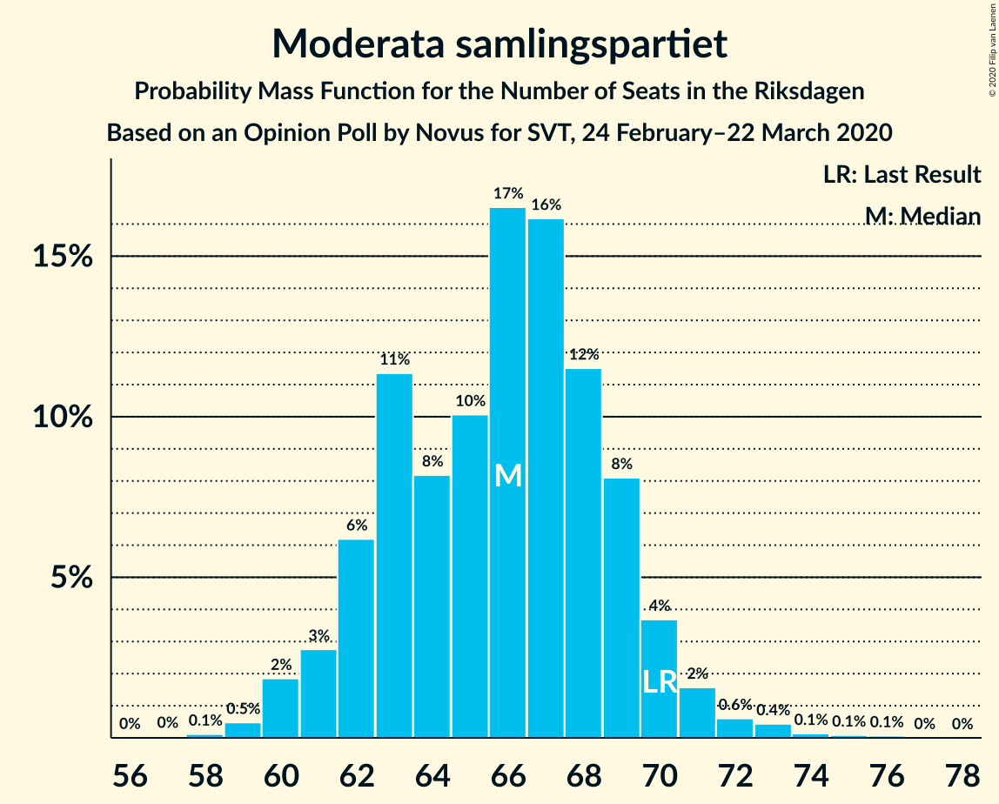
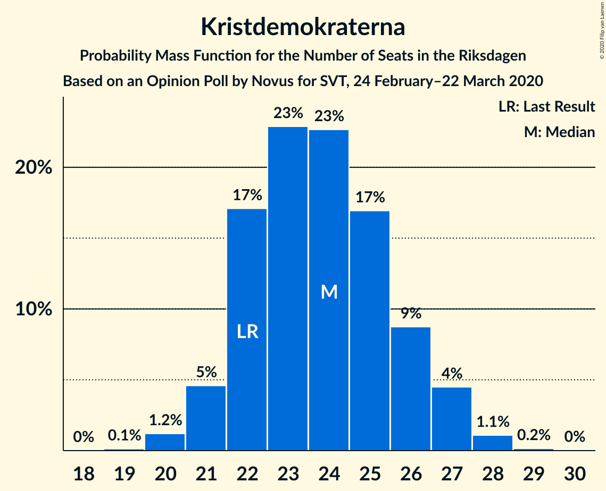
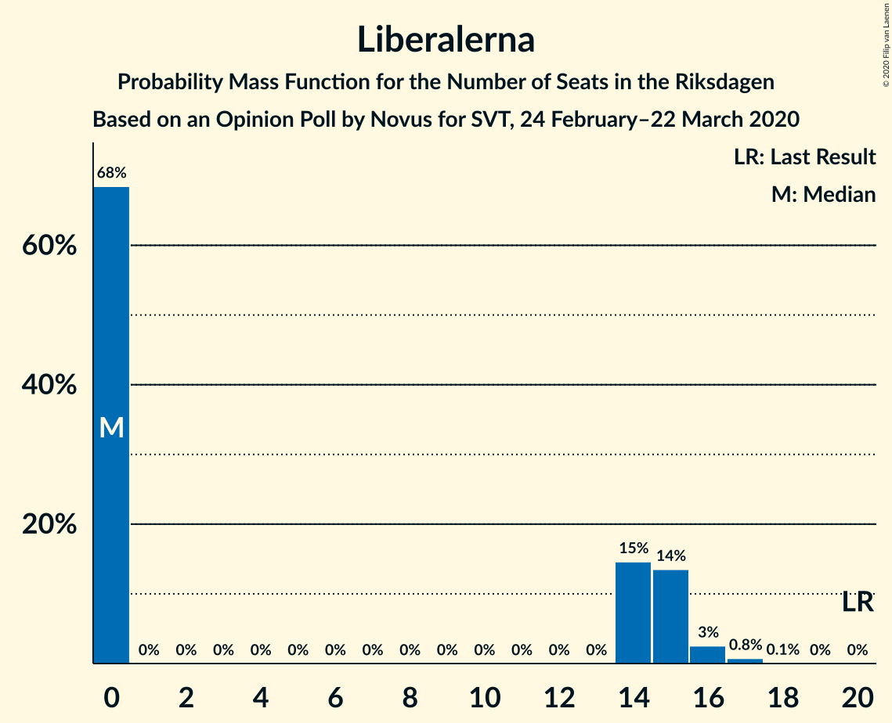

# Opinion Poll by Novus for SVT, 24 February–22 March 2020

<a href="#voting-intentions">Voting Intentions</a> | <a href="#seats">Seats</a> | <a href="#coalitions">Coalitions</a> | <a href="#technical-information">Technical Information</a>

## Voting Intentions

### Confidence Intervals

| Party | Last Result | Poll Result | 80% Confidence Interval | 90% Confidence Interval | 95% Confidence Interval | 99% Confidence Interval |
|:-----:|:-----------:|:-----------:|:-----------------------:|:-----------------------:|:-----------------------:|:-----------------------:|
| Sveriges socialdemokratiska arbetareparti | 28.3% | 25.6% | 24.7–26.6% |24.4–26.8% |24.2–27.0% |23.8–27.5% |
| Sverigedemokraterna | 17.5% | 22.0% | 21.1–22.9% |20.9–23.1% |20.7–23.4% |20.3–23.8% |
| Moderata samlingspartiet | 19.8% | 18.0% | 17.2–18.8% |17.0–19.1% |16.8–19.3% |16.4–19.7% |
| Vänsterpartiet | 8.0% | 9.8% | 9.2–10.5% |9.0–10.6% |8.9–10.8% |8.6–11.1% |
| Centerpartiet | 8.6% | 8.1% | 7.6–8.7% |7.4–8.9% |7.3–9.0% |7.0–9.3% |
| Kristdemokraterna | 6.3% | 6.5% | 6.0–7.1% |5.9–7.2% |5.7–7.3% |5.5–7.6% |
| Miljöpartiet de gröna | 4.4% | 4.5% | 4.1–5.0% |4.0–5.1% |3.9–5.2% |3.7–5.4% |
| Liberalerna | 5.5% | 3.8% | 3.4–4.2% |3.3–4.4% |3.2–4.5% |3.1–4.7% |

*Note:* The poll result column reflects the actual value used in the calculations. Published results may vary slightly, and in addition be rounded to fewer digits.

## Seats

### Confidence Intervals

| Party | Last Result | Median | 80% Confidence Interval | 90% Confidence Interval | 95% Confidence Interval | 99% Confidence Interval |
|:-----:|:-----------:|:------:|:-----------------------:|:-----------------------:|:-----------------------:|:-----------------------:|
| <a href="#sveriges-socialdemokratiska-arbetareparti">Sveriges socialdemokratiska arbetareparti</a> | 100 | 93 | 88–97 |88–98 |86–100 |86–101 |
| <a href="#sverigedemokraterna">Sverigedemokraterna</a> | 62 | 80 | 77–84 |75–84 |73–86 |73–88 |
| <a href="#moderata-samlingspartiet">Moderata samlingspartiet</a> | 70 | 66 | 62–68 |61–70 |60–71 |59–73 |
| <a href="#vänsterpartiet">Vänsterpartiet</a> | 28 | 36 | 33–38 |32–38 |32–39 |31–41 |
| <a href="#centerpartiet">Centerpartiet</a> | 31 | 30 | 28–32 |27–32 |26–33 |25–34 |
| <a href="#kristdemokraterna">Kristdemokraterna</a> | 22 | 23 | 22–26 |21–26 |21–27 |20–28 |
| <a href="#miljöpartiet-de-gröna">Miljöpartiet de gröna</a> | 16 | 16 | 15–17 |15–18 |0–19 |0–20 |
| <a href="#liberalerna">Liberalerna</a> | 20 | 0 | 0–15 |0–15 |0–16 |0–17 |

### Sveriges socialdemokratiska arbetareparti

*For a full overview of the results for this party, see the [Sveriges socialdemokratiska arbetareparti](party-sverigessocialdemokratiskaarbetareparti.html) page.*

| Number of Seats | Probability | Accumulated | Special Marks |
|:---------------:|:-----------:|:-----------:|:-------------:|
| 83 | 0.1% | 100% |  |
| 84 | 0.1% | 99.9% |  |
| 85 | 0.3% | 99.8% |  |
| 86 | 3% | 99.5% |  |
| 87 | 1.2% | 97% |  |
| 88 | 7% | 96% |  |
| 89 | 2% | 88% |  |
| 90 | 10% | 87% |  |
| 91 | 13% | 76% |  |
| 92 | 8% | 63% |  |
| 93 | 12% | 55% | Median |
| 94 | 16% | 43% |  |
| 95 | 7% | 27% |  |
| 96 | 4% | 20% |  |
| 97 | 8% | 16% |  |
| 98 | 3% | 8% |  |
| 99 | 2% | 5% |  |
| 100 | 1.3% | 3% | Last Result |
| 101 | 1.5% | 2% |  |
| 102 | 0.2% | 0.4% |  |
| 103 | 0.1% | 0.2% |  |
| 104 | 0.1% | 0.1% |  |
| 105 | 0% | 0% |  |

### Sverigedemokraterna

*For a full overview of the results for this party, see the [Sverigedemokraterna](party-sverigedemokraterna.html) page.*

| Number of Seats | Probability | Accumulated | Special Marks |
|:---------------:|:-----------:|:-----------:|:-------------:|
| 62 | 0% | 100% | Last Result |
| 63 | 0% | 100% |  |
| 64 | 0% | 100% |  |
| 65 | 0% | 100% |  |
| 66 | 0% | 100% |  |
| 67 | 0% | 100% |  |
| 68 | 0% | 100% |  |
| 69 | 0% | 100% |  |
| 70 | 0% | 100% |  |
| 71 | 0.1% | 100% |  |
| 72 | 0.3% | 99.9% |  |
| 73 | 3% | 99.6% |  |
| 74 | 1.1% | 97% |  |
| 75 | 2% | 96% |  |
| 76 | 3% | 94% |  |
| 77 | 9% | 91% |  |
| 78 | 16% | 82% |  |
| 79 | 15% | 66% |  |
| 80 | 8% | 51% | Median |
| 81 | 11% | 43% |  |
| 82 | 9% | 32% |  |
| 83 | 12% | 23% |  |
| 84 | 7% | 12% |  |
| 85 | 2% | 5% |  |
| 86 | 1.2% | 3% |  |
| 87 | 1.0% | 2% |  |
| 88 | 0.4% | 0.6% |  |
| 89 | 0.2% | 0.2% |  |
| 90 | 0% | 0.1% |  |
| 91 | 0% | 0% |  |

### Moderata samlingspartiet

*For a full overview of the results for this party, see the [Moderata samlingspartiet](party-moderatasamlingspartiet.html) page.*

| Number of Seats | Probability | Accumulated | Special Marks |
|:---------------:|:-----------:|:-----------:|:-------------:|
| 58 | 0.1% | 100% |  |
| 59 | 0.6% | 99.8% |  |
| 60 | 2% | 99.2% |  |
| 61 | 3% | 97% |  |
| 62 | 7% | 94% |  |
| 63 | 6% | 87% |  |
| 64 | 9% | 81% |  |
| 65 | 10% | 72% |  |
| 66 | 22% | 62% | Median |
| 67 | 19% | 40% |  |
| 68 | 10% | 20% |  |
| 69 | 3% | 10% |  |
| 70 | 4% | 7% | Last Result |
| 71 | 2% | 3% |  |
| 72 | 0.5% | 1.4% |  |
| 73 | 0.5% | 0.9% |  |
| 74 | 0.1% | 0.4% |  |
| 75 | 0.1% | 0.2% |  |
| 76 | 0.1% | 0.1% |  |
| 77 | 0% | 0% |  |

### Vänsterpartiet

*For a full overview of the results for this party, see the [Vänsterpartiet](party-vänsterpartiet.html) page.*

| Number of Seats | Probability | Accumulated | Special Marks |
|:---------------:|:-----------:|:-----------:|:-------------:|
| 28 | 0% | 100% | Last Result |
| 29 | 0% | 100% |  |
| 30 | 0.1% | 100% |  |
| 31 | 1.1% | 99.9% |  |
| 32 | 5% | 98.8% |  |
| 33 | 8% | 94% |  |
| 34 | 13% | 86% |  |
| 35 | 21% | 73% |  |
| 36 | 11% | 52% | Median |
| 37 | 25% | 41% |  |
| 38 | 12% | 16% |  |
| 39 | 2% | 4% |  |
| 40 | 0.8% | 1.4% |  |
| 41 | 0.4% | 0.6% |  |
| 42 | 0.1% | 0.2% |  |
| 43 | 0% | 0.1% |  |
| 44 | 0% | 0% |  |

### Centerpartiet

*For a full overview of the results for this party, see the [Centerpartiet](party-centerpartiet.html) page.*

| Number of Seats | Probability | Accumulated | Special Marks |
|:---------------:|:-----------:|:-----------:|:-------------:|
| 24 | 0.1% | 100% |  |
| 25 | 1.3% | 99.9% |  |
| 26 | 3% | 98.6% |  |
| 27 | 6% | 96% |  |
| 28 | 22% | 90% |  |
| 29 | 18% | 68% |  |
| 30 | 24% | 50% | Median |
| 31 | 12% | 26% | Last Result |
| 32 | 10% | 14% |  |
| 33 | 3% | 4% |  |
| 34 | 1.1% | 1.4% |  |
| 35 | 0.2% | 0.3% |  |
| 36 | 0.1% | 0.1% |  |
| 37 | 0% | 0% |  |

### Kristdemokraterna

*For a full overview of the results for this party, see the [Kristdemokraterna](party-kristdemokraterna.html) page.*

| Number of Seats | Probability | Accumulated | Special Marks |
|:---------------:|:-----------:|:-----------:|:-------------:|
| 19 | 0.1% | 100% |  |
| 20 | 1.2% | 99.9% |  |
| 21 | 6% | 98.7% |  |
| 22 | 22% | 93% | Last Result |
| 23 | 23% | 71% | Median |
| 24 | 23% | 48% |  |
| 25 | 14% | 25% |  |
| 26 | 7% | 11% |  |
| 27 | 3% | 4% |  |
| 28 | 0.9% | 1.1% |  |
| 29 | 0.2% | 0.2% |  |
| 30 | 0% | 0% |  |

### Miljöpartiet de gröna

*For a full overview of the results for this party, see the [Miljöpartiet de gröna](party-miljöpartietdegröna.html) page.*

| Number of Seats | Probability | Accumulated | Special Marks |
|:---------------:|:-----------:|:-----------:|:-------------:|
| 0 | 3% | 100% |  |
| 1 | 0% | 97% |  |
| 2 | 0% | 97% |  |
| 3 | 0% | 97% |  |
| 4 | 0% | 97% |  |
| 5 | 0% | 97% |  |
| 6 | 0% | 97% |  |
| 7 | 0% | 97% |  |
| 8 | 0% | 97% |  |
| 9 | 0% | 97% |  |
| 10 | 0% | 97% |  |
| 11 | 0% | 97% |  |
| 12 | 0% | 97% |  |
| 13 | 0% | 97% |  |
| 14 | 0.3% | 97% |  |
| 15 | 9% | 97% |  |
| 16 | 49% | 88% | Last Result, Median |
| 17 | 31% | 39% |  |
| 18 | 4% | 8% |  |
| 19 | 2% | 4% |  |
| 20 | 2% | 2% |  |
| 21 | 0.2% | 0.2% |  |
| 22 | 0% | 0% |  |

### Liberalerna

*For a full overview of the results for this party, see the [Liberalerna](party-liberalerna.html) page.*

| Number of Seats | Probability | Accumulated | Special Marks |
|:---------------:|:-----------:|:-----------:|:-------------:|
| 0 | 61% | 100% | Median |
| 1 | 0% | 39% |  |
| 2 | 0% | 39% |  |
| 3 | 0% | 39% |  |
| 4 | 0% | 39% |  |
| 5 | 0% | 39% |  |
| 6 | 0% | 39% |  |
| 7 | 0% | 39% |  |
| 8 | 0% | 39% |  |
| 9 | 0% | 39% |  |
| 10 | 0% | 39% |  |
| 11 | 0% | 39% |  |
| 12 | 0% | 39% |  |
| 13 | 0% | 39% |  |
| 14 | 17% | 39% |  |
| 15 | 19% | 22% |  |
| 16 | 2% | 3% |  |
| 17 | 0.5% | 0.6% |  |
| 18 | 0.1% | 0.1% |  |
| 19 | 0% | 0% |  |
| 20 | 0% | 0% | Last Result |

## Coalitions

### Confidence Intervals

| Coalition | Last Result | Median | Majority? | 80% Confidence Interval | 90% Confidence Interval | 95% Confidence Interval | 99% Confidence Interval |
|:---------:|:-----------:|:------:|:---------:|:-----------------------:|:-----------------------:|:-----------------------:|:-----------------------:|
| Sveriges socialdemokratiska arbetareparti – Moderata samlingspartiet – Centerpartiet | 201 | 188 | 99.9% | 182–193 | 179–196 | 179–196 | 177–202 |
| Sveriges socialdemokratiska arbetareparti – Vänsterpartiet – Centerpartiet – Miljöpartiet de gröna – Liberalerna | 195 | 179 | 89% | 174–186 | 173–188 | 172–189 | 165–191 |
| Sverigedemokraterna – Moderata samlingspartiet – Kristdemokraterna | 154 | 170 | 11% | 163–175 | 161–176 | 160–177 | 158–184 |
| Sveriges socialdemokratiska arbetareparti – Moderata samlingspartiet | 170 | 159 | 0% | 153–164 | 151–166 | 150–167 | 148–170 |
| Sveriges socialdemokratiska arbetareparti – Centerpartiet – Miljöpartiet de gröna – Liberalerna | 167 | 143 | 0% | 138–152 | 138–153 | 136–154 | 129–157 |
| Sverigedemokraterna – Moderata samlingspartiet | 132 | 145 | 0% | 140–150 | 138–152 | 137–153 | 135–158 |
| Sveriges socialdemokratiska arbetareparti – Vänsterpartiet – Miljöpartiet de gröna | 144 | 145 | 0% | 139–150 | 138–151 | 135–152 | 127–154 |
| Sveriges socialdemokratiska arbetareparti – Vänsterpartiet | 128 | 129 | 0% | 123–134 | 122–135 | 121–136 | 120–138 |
| Moderata samlingspartiet – Centerpartiet – Kristdemokraterna – Liberalerna | 143 | 123 | 0% | 119–132 | 117–133 | 116–134 | 114–140 |
| Moderata samlingspartiet – Centerpartiet – Kristdemokraterna | 123 | 119 | 0% | 114–123 | 113–125 | 111–125 | 110–131 |
| Sveriges socialdemokratiska arbetareparti – Miljöpartiet de gröna | 116 | 109 | 0% | 104–113 | 103–115 | 100–117 | 93–118 |
| Moderata samlingspartiet – Centerpartiet – Liberalerna | 121 | 99 | 0% | 95–109 | 93–110 | 92–111 | 90–115 |
| Moderata samlingspartiet – Centerpartiet | 101 | 95 | 0% | 91–99 | 90–101 | 89–101 | 88–105 |

### Sveriges socialdemokratiska arbetareparti – Moderata samlingspartiet – Centerpartiet

| Number of Seats | Probability | Accumulated | Special Marks |
|:---------------:|:-----------:|:-----------:|:-------------:|
| 174 | 0% | 100% |  |
| 175 | 0.3% | 99.9% | Majority |
| 176 | 0.1% | 99.7% |  |
| 177 | 0.2% | 99.6% |  |
| 178 | 0.8% | 99.4% |  |
| 179 | 4% | 98.6% |  |
| 180 | 2% | 95% |  |
| 181 | 2% | 93% |  |
| 182 | 4% | 91% |  |
| 183 | 6% | 87% |  |
| 184 | 14% | 81% |  |
| 185 | 4% | 67% |  |
| 186 | 2% | 64% |  |
| 187 | 5% | 62% |  |
| 188 | 8% | 57% |  |
| 189 | 5% | 49% | Median |
| 190 | 4% | 44% |  |
| 191 | 8% | 40% |  |
| 192 | 15% | 32% |  |
| 193 | 7% | 17% |  |
| 194 | 2% | 10% |  |
| 195 | 1.2% | 8% |  |
| 196 | 5% | 7% |  |
| 197 | 0.5% | 2% |  |
| 198 | 0.4% | 2% |  |
| 199 | 0.4% | 1.3% |  |
| 200 | 0.1% | 0.9% |  |
| 201 | 0% | 0.8% | Last Result |
| 202 | 0.3% | 0.8% |  |
| 203 | 0.2% | 0.5% |  |
| 204 | 0.1% | 0.3% |  |
| 205 | 0% | 0.2% |  |
| 206 | 0.1% | 0.2% |  |
| 207 | 0% | 0% |  |

### Sveriges socialdemokratiska arbetareparti – Vänsterpartiet – Centerpartiet – Miljöpartiet de gröna – Liberalerna

| Number of Seats | Probability | Accumulated | Special Marks |
|:---------------:|:-----------:|:-----------:|:-------------:|
| 162 | 0% | 100% |  |
| 163 | 0.1% | 99.9% |  |
| 164 | 0.1% | 99.8% |  |
| 165 | 0.3% | 99.7% |  |
| 166 | 0% | 99.4% |  |
| 167 | 0.1% | 99.4% |  |
| 168 | 0.1% | 99.3% |  |
| 169 | 0.3% | 99.2% |  |
| 170 | 0.4% | 98.9% |  |
| 171 | 0.8% | 98% |  |
| 172 | 0.6% | 98% |  |
| 173 | 3% | 97% |  |
| 174 | 5% | 94% |  |
| 175 | 10% | 89% | Median, Majority |
| 176 | 10% | 80% |  |
| 177 | 6% | 70% |  |
| 178 | 5% | 64% |  |
| 179 | 12% | 59% |  |
| 180 | 3% | 48% |  |
| 181 | 6% | 44% |  |
| 182 | 5% | 38% |  |
| 183 | 12% | 34% |  |
| 184 | 2% | 22% |  |
| 185 | 8% | 19% |  |
| 186 | 3% | 11% |  |
| 187 | 3% | 8% |  |
| 188 | 2% | 5% |  |
| 189 | 2% | 3% |  |
| 190 | 0.8% | 1.5% |  |
| 191 | 0.4% | 0.7% |  |
| 192 | 0.2% | 0.3% |  |
| 193 | 0.1% | 0.1% |  |
| 194 | 0% | 0% |  |
| 195 | 0% | 0% | Last Result |

### Sverigedemokraterna – Moderata samlingspartiet – Kristdemokraterna

| Number of Seats | Probability | Accumulated | Special Marks |
|:---------------:|:-----------:|:-----------:|:-------------:|
| 154 | 0% | 100% | Last Result |
| 155 | 0% | 100% |  |
| 156 | 0.1% | 100% |  |
| 157 | 0.2% | 99.9% |  |
| 158 | 0.4% | 99.7% |  |
| 159 | 0.8% | 99.3% |  |
| 160 | 2% | 98.5% |  |
| 161 | 2% | 97% |  |
| 162 | 3% | 95% |  |
| 163 | 3% | 92% |  |
| 164 | 8% | 89% |  |
| 165 | 2% | 81% |  |
| 166 | 12% | 78% |  |
| 167 | 5% | 66% |  |
| 168 | 6% | 62% |  |
| 169 | 3% | 56% | Median |
| 170 | 12% | 52% |  |
| 171 | 5% | 41% |  |
| 172 | 6% | 36% |  |
| 173 | 10% | 30% |  |
| 174 | 10% | 20% |  |
| 175 | 5% | 11% | Majority |
| 176 | 3% | 6% |  |
| 177 | 0.6% | 3% |  |
| 178 | 0.8% | 2% |  |
| 179 | 0.4% | 2% |  |
| 180 | 0.3% | 1.1% |  |
| 181 | 0.1% | 0.8% |  |
| 182 | 0.1% | 0.7% |  |
| 183 | 0% | 0.6% |  |
| 184 | 0.3% | 0.6% |  |
| 185 | 0.1% | 0.3% |  |
| 186 | 0.1% | 0.2% |  |
| 187 | 0% | 0.1% |  |
| 188 | 0% | 0% |  |

### Sveriges socialdemokratiska arbetareparti – Moderata samlingspartiet

| Number of Seats | Probability | Accumulated | Special Marks |
|:---------------:|:-----------:|:-----------:|:-------------:|
| 146 | 0.2% | 100% |  |
| 147 | 0.2% | 99.8% |  |
| 148 | 0.6% | 99.6% |  |
| 149 | 0.7% | 99.0% |  |
| 150 | 2% | 98% |  |
| 151 | 2% | 96% |  |
| 152 | 4% | 94% |  |
| 153 | 2% | 90% |  |
| 154 | 3% | 88% |  |
| 155 | 9% | 85% |  |
| 156 | 11% | 76% |  |
| 157 | 6% | 65% |  |
| 158 | 10% | 60% |  |
| 159 | 5% | 50% | Median |
| 160 | 8% | 45% |  |
| 161 | 14% | 37% |  |
| 162 | 6% | 23% |  |
| 163 | 4% | 17% |  |
| 164 | 5% | 13% |  |
| 165 | 3% | 8% |  |
| 166 | 2% | 6% |  |
| 167 | 2% | 4% |  |
| 168 | 1.2% | 2% |  |
| 169 | 0.2% | 0.9% |  |
| 170 | 0.3% | 0.7% | Last Result |
| 171 | 0.2% | 0.4% |  |
| 172 | 0% | 0.3% |  |
| 173 | 0.1% | 0.2% |  |
| 174 | 0.1% | 0.1% |  |
| 175 | 0% | 0% | Majority |

### Sveriges socialdemokratiska arbetareparti – Centerpartiet – Miljöpartiet de gröna – Liberalerna

| Number of Seats | Probability | Accumulated | Special Marks |
|:---------------:|:-----------:|:-----------:|:-------------:|
| 125 | 0% | 100% |  |
| 126 | 0.1% | 99.9% |  |
| 127 | 0.2% | 99.9% |  |
| 128 | 0.1% | 99.6% |  |
| 129 | 0.1% | 99.6% |  |
| 130 | 0.2% | 99.4% |  |
| 131 | 0.2% | 99.2% |  |
| 132 | 0.1% | 99.0% |  |
| 133 | 0.2% | 98.9% |  |
| 134 | 0.4% | 98.7% |  |
| 135 | 0.6% | 98% |  |
| 136 | 1.4% | 98% |  |
| 137 | 1.1% | 96% |  |
| 138 | 11% | 95% |  |
| 139 | 9% | 84% | Median |
| 140 | 3% | 75% |  |
| 141 | 6% | 72% |  |
| 142 | 8% | 66% |  |
| 143 | 10% | 58% |  |
| 144 | 4% | 48% |  |
| 145 | 4% | 45% |  |
| 146 | 4% | 41% |  |
| 147 | 3% | 37% |  |
| 148 | 16% | 35% |  |
| 149 | 3% | 19% |  |
| 150 | 2% | 15% |  |
| 151 | 3% | 14% |  |
| 152 | 5% | 11% |  |
| 153 | 3% | 5% |  |
| 154 | 0.9% | 3% |  |
| 155 | 0.8% | 2% |  |
| 156 | 0.2% | 0.9% |  |
| 157 | 0.5% | 0.6% |  |
| 158 | 0.1% | 0.1% |  |
| 159 | 0% | 0% |  |
| 160 | 0% | 0% |  |
| 161 | 0% | 0% |  |
| 162 | 0% | 0% |  |
| 163 | 0% | 0% |  |
| 164 | 0% | 0% |  |
| 165 | 0% | 0% |  |
| 166 | 0% | 0% |  |
| 167 | 0% | 0% | Last Result |

### Sverigedemokraterna – Moderata samlingspartiet

| Number of Seats | Probability | Accumulated | Special Marks |
|:---------------:|:-----------:|:-----------:|:-------------:|
| 132 | 0% | 100% | Last Result |
| 133 | 0% | 100% |  |
| 134 | 0.2% | 100% |  |
| 135 | 0.8% | 99.7% |  |
| 136 | 1.1% | 99.0% |  |
| 137 | 0.9% | 98% |  |
| 138 | 2% | 97% |  |
| 139 | 2% | 95% |  |
| 140 | 3% | 93% |  |
| 141 | 5% | 90% |  |
| 142 | 6% | 85% |  |
| 143 | 8% | 79% |  |
| 144 | 15% | 70% |  |
| 145 | 7% | 56% |  |
| 146 | 6% | 49% | Median |
| 147 | 4% | 43% |  |
| 148 | 7% | 39% |  |
| 149 | 12% | 33% |  |
| 150 | 12% | 21% |  |
| 151 | 3% | 9% |  |
| 152 | 3% | 6% |  |
| 153 | 1.0% | 3% |  |
| 154 | 0.5% | 2% |  |
| 155 | 0.4% | 1.4% |  |
| 156 | 0.2% | 1.0% |  |
| 157 | 0.2% | 0.7% |  |
| 158 | 0.2% | 0.5% |  |
| 159 | 0.2% | 0.3% |  |
| 160 | 0.1% | 0.1% |  |
| 161 | 0% | 0.1% |  |
| 162 | 0% | 0% |  |

### Sveriges socialdemokratiska arbetareparti – Vänsterpartiet – Miljöpartiet de gröna

| Number of Seats | Probability | Accumulated | Special Marks |
|:---------------:|:-----------:|:-----------:|:-------------:|
| 125 | 0% | 100% |  |
| 126 | 0.1% | 99.9% |  |
| 127 | 0.5% | 99.9% |  |
| 128 | 0.1% | 99.4% |  |
| 129 | 0.4% | 99.3% |  |
| 130 | 0.1% | 98.9% |  |
| 131 | 0.1% | 98.9% |  |
| 132 | 0.3% | 98.7% |  |
| 133 | 0.3% | 98% |  |
| 134 | 0.3% | 98% |  |
| 135 | 0.4% | 98% |  |
| 136 | 0.2% | 97% |  |
| 137 | 2% | 97% |  |
| 138 | 2% | 96% |  |
| 139 | 5% | 94% |  |
| 140 | 4% | 89% |  |
| 141 | 10% | 84% |  |
| 142 | 4% | 74% |  |
| 143 | 5% | 70% |  |
| 144 | 11% | 65% | Last Result |
| 145 | 13% | 54% | Median |
| 146 | 9% | 41% |  |
| 147 | 9% | 32% |  |
| 148 | 6% | 23% |  |
| 149 | 4% | 17% |  |
| 150 | 5% | 13% |  |
| 151 | 4% | 8% |  |
| 152 | 2% | 4% |  |
| 153 | 0.9% | 2% |  |
| 154 | 0.6% | 0.9% |  |
| 155 | 0.2% | 0.3% |  |
| 156 | 0% | 0.1% |  |
| 157 | 0% | 0% |  |

### Sveriges socialdemokratiska arbetareparti – Vänsterpartiet

| Number of Seats | Probability | Accumulated | Special Marks |
|:---------------:|:-----------:|:-----------:|:-------------:|
| 117 | 0% | 100% |  |
| 118 | 0.1% | 99.9% |  |
| 119 | 0.3% | 99.8% |  |
| 120 | 1.3% | 99.6% |  |
| 121 | 2% | 98% |  |
| 122 | 4% | 96% |  |
| 123 | 4% | 92% |  |
| 124 | 2% | 88% |  |
| 125 | 11% | 86% |  |
| 126 | 4% | 76% |  |
| 127 | 11% | 72% |  |
| 128 | 10% | 60% | Last Result |
| 129 | 9% | 50% | Median |
| 130 | 11% | 41% |  |
| 131 | 9% | 30% |  |
| 132 | 5% | 21% |  |
| 133 | 2% | 15% |  |
| 134 | 6% | 13% |  |
| 135 | 3% | 7% |  |
| 136 | 2% | 4% |  |
| 137 | 0.5% | 1.2% |  |
| 138 | 0.3% | 0.7% |  |
| 139 | 0.1% | 0.3% |  |
| 140 | 0.1% | 0.2% |  |
| 141 | 0% | 0.1% |  |
| 142 | 0% | 0.1% |  |
| 143 | 0% | 0.1% |  |
| 144 | 0% | 0% |  |

### Moderata samlingspartiet – Centerpartiet – Kristdemokraterna – Liberalerna

| Number of Seats | Probability | Accumulated | Special Marks |
|:---------------:|:-----------:|:-----------:|:-------------:|
| 112 | 0.1% | 100% |  |
| 113 | 0.3% | 99.9% |  |
| 114 | 0.2% | 99.6% |  |
| 115 | 1.2% | 99.3% |  |
| 116 | 1.0% | 98% |  |
| 117 | 4% | 97% |  |
| 118 | 3% | 93% |  |
| 119 | 10% | 91% | Median |
| 120 | 10% | 81% |  |
| 121 | 8% | 71% |  |
| 122 | 11% | 63% |  |
| 123 | 6% | 52% |  |
| 124 | 3% | 46% |  |
| 125 | 3% | 44% |  |
| 126 | 3% | 41% |  |
| 127 | 3% | 38% |  |
| 128 | 5% | 35% |  |
| 129 | 5% | 30% |  |
| 130 | 11% | 25% |  |
| 131 | 3% | 15% |  |
| 132 | 3% | 12% |  |
| 133 | 5% | 8% |  |
| 134 | 1.2% | 4% |  |
| 135 | 0.4% | 2% |  |
| 136 | 0.6% | 2% |  |
| 137 | 0.2% | 1.3% |  |
| 138 | 0.3% | 1.2% |  |
| 139 | 0.1% | 0.9% |  |
| 140 | 0.6% | 0.8% |  |
| 141 | 0.1% | 0.2% |  |
| 142 | 0% | 0.1% |  |
| 143 | 0% | 0% | Last Result |

### Moderata samlingspartiet – Centerpartiet – Kristdemokraterna

| Number of Seats | Probability | Accumulated | Special Marks |
|:---------------:|:-----------:|:-----------:|:-------------:|
| 108 | 0.1% | 100% |  |
| 109 | 0.2% | 99.9% |  |
| 110 | 0.5% | 99.7% |  |
| 111 | 2% | 99.2% |  |
| 112 | 2% | 97% |  |
| 113 | 3% | 95% |  |
| 114 | 6% | 92% |  |
| 115 | 5% | 85% |  |
| 116 | 10% | 80% |  |
| 117 | 7% | 70% |  |
| 118 | 7% | 63% |  |
| 119 | 11% | 56% | Median |
| 120 | 10% | 44% |  |
| 121 | 9% | 34% |  |
| 122 | 11% | 25% |  |
| 123 | 6% | 14% | Last Result |
| 124 | 3% | 8% |  |
| 125 | 3% | 5% |  |
| 126 | 0.6% | 2% |  |
| 127 | 0.3% | 2% |  |
| 128 | 0.3% | 1.3% |  |
| 129 | 0.2% | 0.9% |  |
| 130 | 0.1% | 0.7% |  |
| 131 | 0.1% | 0.5% |  |
| 132 | 0.2% | 0.4% |  |
| 133 | 0% | 0.2% |  |
| 134 | 0.1% | 0.2% |  |
| 135 | 0% | 0% |  |

### Sveriges socialdemokratiska arbetareparti – Miljöpartiet de gröna

| Number of Seats | Probability | Accumulated | Special Marks |
|:---------------:|:-----------:|:-----------:|:-------------:|
| 90 | 0% | 100% |  |
| 91 | 0.1% | 99.9% |  |
| 92 | 0.1% | 99.9% |  |
| 93 | 0.5% | 99.8% |  |
| 94 | 0.3% | 99.3% |  |
| 95 | 0.3% | 99.0% |  |
| 96 | 0.2% | 98.6% |  |
| 97 | 0.3% | 98% |  |
| 98 | 0.3% | 98% |  |
| 99 | 0.2% | 98% |  |
| 100 | 0.2% | 98% |  |
| 101 | 0.3% | 97% |  |
| 102 | 1.2% | 97% |  |
| 103 | 2% | 96% |  |
| 104 | 4% | 94% |  |
| 105 | 5% | 90% |  |
| 106 | 12% | 85% |  |
| 107 | 5% | 73% |  |
| 108 | 12% | 67% |  |
| 109 | 8% | 55% | Median |
| 110 | 16% | 47% |  |
| 111 | 9% | 31% |  |
| 112 | 4% | 22% |  |
| 113 | 9% | 18% |  |
| 114 | 3% | 10% |  |
| 115 | 3% | 7% |  |
| 116 | 1.3% | 4% | Last Result |
| 117 | 2% | 3% |  |
| 118 | 0.3% | 0.5% |  |
| 119 | 0.2% | 0.2% |  |
| 120 | 0% | 0.1% |  |
| 121 | 0% | 0% |  |

### Moderata samlingspartiet – Centerpartiet – Liberalerna

| Number of Seats | Probability | Accumulated | Special Marks |
|:---------------:|:-----------:|:-----------:|:-------------:|
| 89 | 0.4% | 100% |  |
| 90 | 0.2% | 99.6% |  |
| 91 | 0.5% | 99.4% |  |
| 92 | 2% | 98.9% |  |
| 93 | 3% | 97% |  |
| 94 | 3% | 94% |  |
| 95 | 10% | 91% |  |
| 96 | 9% | 81% | Median |
| 97 | 7% | 72% |  |
| 98 | 14% | 65% |  |
| 99 | 4% | 51% |  |
| 100 | 3% | 47% |  |
| 101 | 3% | 44% |  |
| 102 | 1.2% | 41% |  |
| 103 | 2% | 40% |  |
| 104 | 2% | 38% |  |
| 105 | 4% | 36% |  |
| 106 | 4% | 32% |  |
| 107 | 7% | 27% |  |
| 108 | 10% | 21% |  |
| 109 | 3% | 11% |  |
| 110 | 4% | 8% |  |
| 111 | 1.1% | 3% |  |
| 112 | 1.0% | 2% |  |
| 113 | 0.3% | 1.4% |  |
| 114 | 0.3% | 1.1% |  |
| 115 | 0.5% | 0.8% |  |
| 116 | 0.1% | 0.3% |  |
| 117 | 0.1% | 0.2% |  |
| 118 | 0% | 0.1% |  |
| 119 | 0% | 0% |  |
| 120 | 0% | 0% |  |
| 121 | 0% | 0% | Last Result |

### Moderata samlingspartiet – Centerpartiet

| Number of Seats | Probability | Accumulated | Special Marks |
|:---------------:|:-----------:|:-----------:|:-------------:|
| 85 | 0.1% | 100% |  |
| 86 | 0.2% | 99.9% |  |
| 87 | 0.1% | 99.7% |  |
| 88 | 2% | 99.5% |  |
| 89 | 2% | 98% |  |
| 90 | 3% | 96% |  |
| 91 | 7% | 93% |  |
| 92 | 6% | 86% |  |
| 93 | 6% | 80% |  |
| 94 | 13% | 74% |  |
| 95 | 16% | 61% |  |
| 96 | 10% | 45% | Median |
| 97 | 8% | 35% |  |
| 98 | 15% | 27% |  |
| 99 | 4% | 13% |  |
| 100 | 3% | 8% |  |
| 101 | 3% | 5% | Last Result |
| 102 | 1.1% | 2% |  |
| 103 | 0.3% | 1.0% |  |
| 104 | 0.2% | 0.8% |  |
| 105 | 0.2% | 0.6% |  |
| 106 | 0.1% | 0.4% |  |
| 107 | 0.1% | 0.2% |  |
| 108 | 0.1% | 0.1% |  |
| 109 | 0% | 0% |  |

## Technical Information

### Opinion Poll

+ **Polling firm:** Novus
+ **Commissioner(s):** SVT
+ **Fieldwork period:** 24 February–22 March 2020

### Calculations

+ **Sample size:** 3737
+ **Simulations done:** 524,288
+ **Error estimate:** 0.46%

