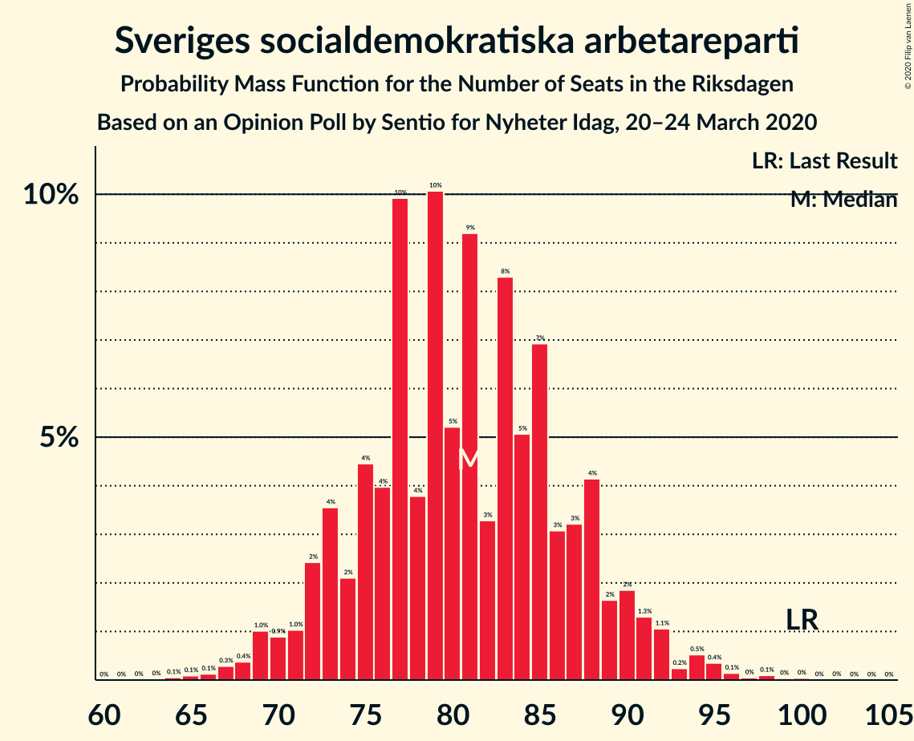
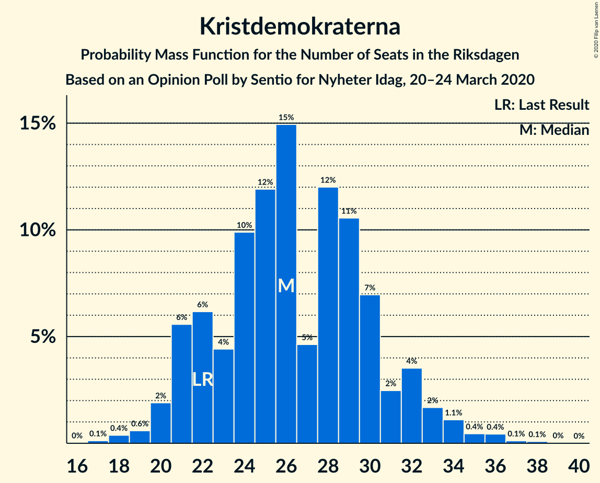
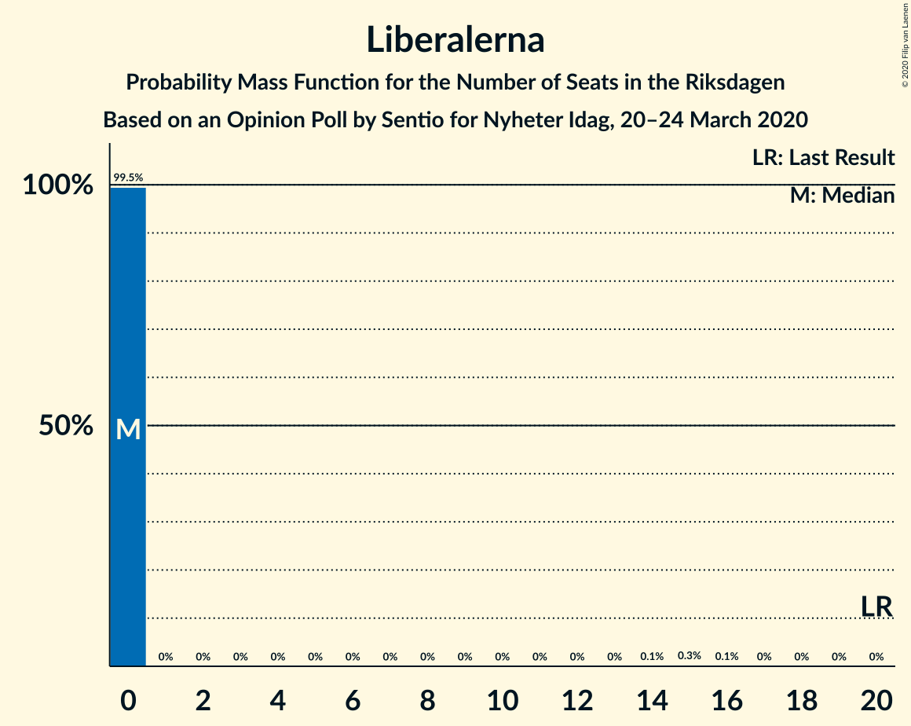
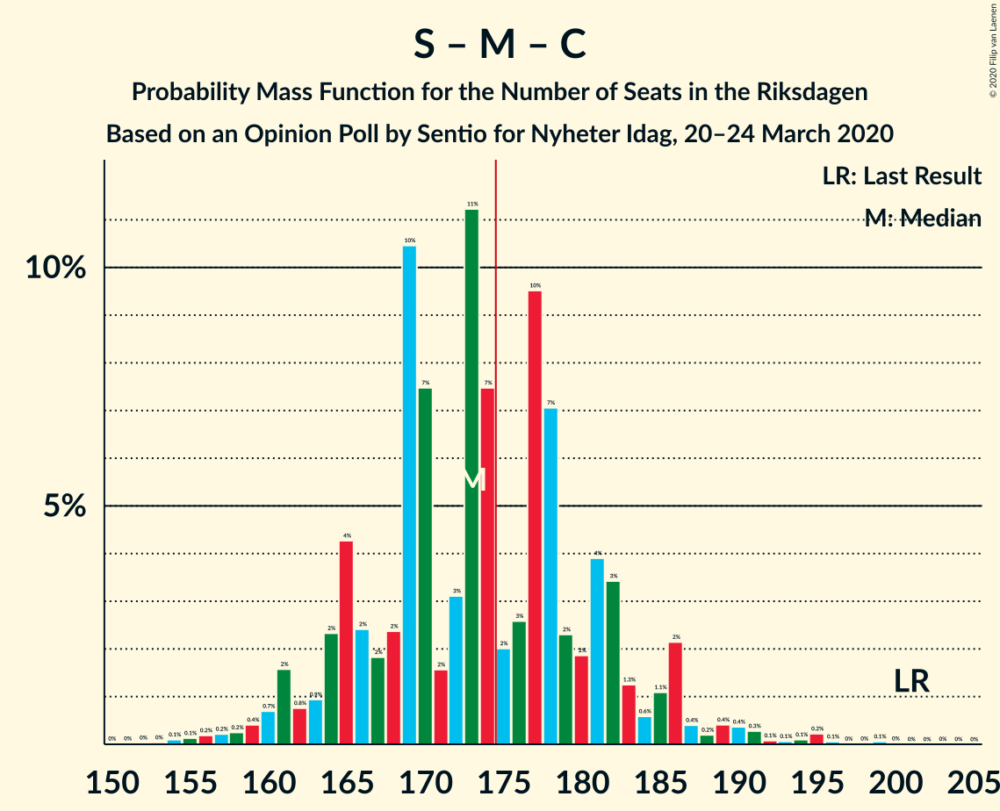
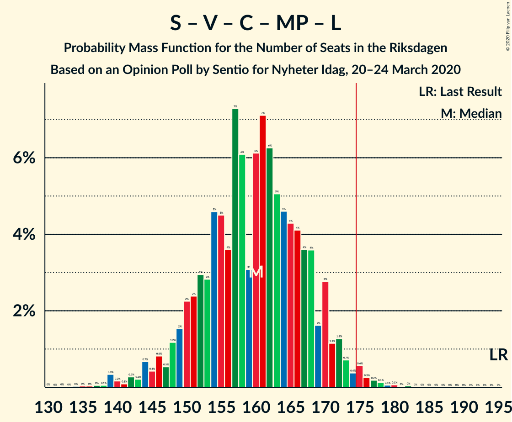
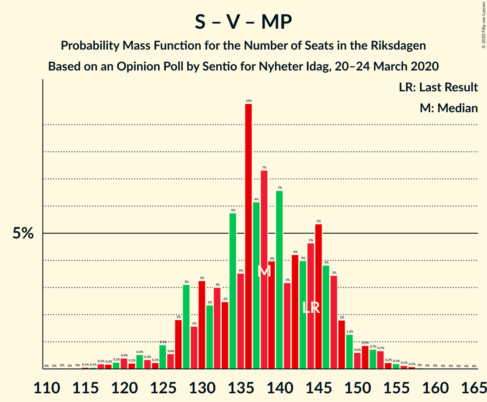
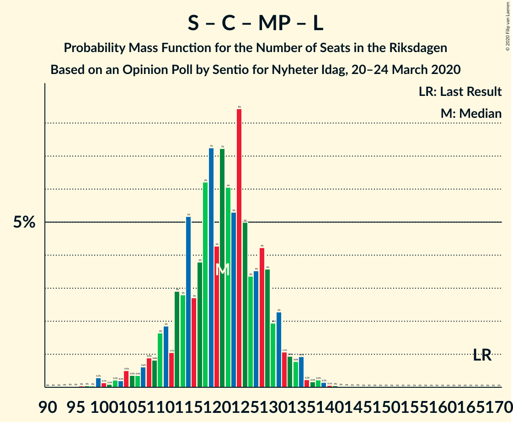

# Opinion Poll by Sentio for Nyheter Idag, 20–24 March 2020

<a href="#voting-intentions">Voting Intentions</a> | <a href="#seats">Seats</a> | <a href="#coalitions">Coalitions</a> | <a href="#technical-information">Technical Information</a>

## Voting Intentions

### Confidence Intervals

| Party | Last Result | Poll Result | 80% Confidence Interval | 90% Confidence Interval | 95% Confidence Interval | 99% Confidence Interval |
|:-----:|:-----------:|:-----------:|:-----------------------:|:-----------------------:|:-----------------------:|:-----------------------:|
| Sverigedemokraterna | 17.5% | 25.0% | 23.1–27.0% |22.5–27.6% |22.1–28.1% |21.2–29.1% |
| Sveriges socialdemokratiska arbetareparti | 28.3% | 22.1% | 20.2–24.0% |19.7–24.6% |19.3–25.1% |18.5–26.1% |
| Moderata samlingspartiet | 19.8% | 19.5% | 17.8–21.4% |17.3–22.0% |16.9–22.4% |16.1–23.4% |
| Vänsterpartiet | 8.0% | 10.5% | 9.2–12.1% |8.9–12.5% |8.6–12.9% |8.0–13.6% |
| Kristdemokraterna | 6.3% | 7.1% | 6.1–8.4% |5.7–8.8% |5.5–9.1% |5.0–9.8% |
| Centerpartiet | 8.6% | 5.8% | 4.9–7.0% |4.6–7.4% |4.4–7.7% |4.0–8.3% |
| Miljöpartiet de gröna | 4.4% | 5.2% | 4.3–6.4% |4.1–6.7% |3.9–7.0% |3.5–7.6% |
| Liberalerna | 5.5% | 2.3% | 1.7–3.1% |1.6–3.4% |1.4–3.6% |1.2–4.0% |

*Note:* The poll result column reflects the actual value used in the calculations. Published results may vary slightly, and in addition be rounded to fewer digits.

## Seats

### Confidence Intervals

| Party | Last Result | Median | 80% Confidence Interval | 90% Confidence Interval | 95% Confidence Interval | 99% Confidence Interval |
|:-----:|:-----------:|:------:|:-----------------------:|:-----------------------:|:-----------------------:|:-----------------------:|
| <a href="#sverigedemokraterna">Sverigedemokraterna</a> | 62 | 91 | 84–99 |82–101 |81–102 |77–107 |
| <a href="#sveriges-socialdemokratiska-arbetareparti">Sveriges socialdemokratiska arbetareparti</a> | 100 | 81 | 74–88 |72–90 |70–92 |67–95 |
| <a href="#moderata-samlingspartiet">Moderata samlingspartiet</a> | 70 | 71 | 65–78 |63–80 |62–82 |59–86 |
| <a href="#vänsterpartiet">Vänsterpartiet</a> | 28 | 39 | 34–44 |32–45 |31–47 |29–50 |
| <a href="#kristdemokraterna">Kristdemokraterna</a> | 22 | 26 | 22–30 |21–32 |20–33 |18–36 |
| <a href="#centerpartiet">Centerpartiet</a> | 31 | 22 | 18–25 |17–27 |16–28 |0–30 |
| <a href="#miljöpartiet-de-gröna">Miljöpartiet de gröna</a> | 16 | 19 | 16–23 |15–24 |0–25 |0–28 |
| <a href="#liberalerna">Liberalerna</a> | 20 | 0 | 0 |0 |0 |0 |

### Sverigedemokraterna

*For a full overview of the results for this party, see the [Sverigedemokraterna](party-sverigedemokraterna.html) page.*

| Number of Seats | Probability | Accumulated | Special Marks |
|:---------------:|:-----------:|:-----------:|:-------------:|
| 62 | 0% | 100% | Last Result |
| 63 | 0% | 100% |  |
| 64 | 0% | 100% |  |
| 65 | 0% | 100% |  |
| 66 | 0% | 100% |  |
| 67 | 0% | 100% |  |
| 68 | 0% | 100% |  |
| 69 | 0% | 100% |  |
| 70 | 0% | 100% |  |
| 71 | 0% | 100% |  |
| 72 | 0% | 100% |  |
| 73 | 0% | 100% |  |
| 74 | 0% | 100% |  |
| 75 | 0.1% | 99.9% |  |
| 76 | 0.1% | 99.8% |  |
| 77 | 0.2% | 99.6% |  |
| 78 | 0.3% | 99.4% |  |
| 79 | 0.6% | 99.1% |  |
| 80 | 0.8% | 98% |  |
| 81 | 1.4% | 98% |  |
| 82 | 2% | 96% |  |
| 83 | 2% | 94% |  |
| 84 | 5% | 92% |  |
| 85 | 3% | 87% |  |
| 86 | 4% | 84% |  |
| 87 | 6% | 81% |  |
| 88 | 5% | 74% |  |
| 89 | 6% | 70% |  |
| 90 | 5% | 64% |  |
| 91 | 10% | 58% | Median |
| 92 | 6% | 48% |  |
| 93 | 7% | 42% |  |
| 94 | 6% | 35% |  |
| 95 | 8% | 29% |  |
| 96 | 3% | 21% |  |
| 97 | 5% | 19% |  |
| 98 | 3% | 14% |  |
| 99 | 3% | 11% |  |
| 100 | 2% | 8% |  |
| 101 | 2% | 5% |  |
| 102 | 1.4% | 4% |  |
| 103 | 0.8% | 2% |  |
| 104 | 0.4% | 2% |  |
| 105 | 0.4% | 1.2% |  |
| 106 | 0.3% | 0.8% |  |
| 107 | 0.2% | 0.5% |  |
| 108 | 0.1% | 0.3% |  |
| 109 | 0.1% | 0.2% |  |
| 110 | 0% | 0.1% |  |
| 111 | 0% | 0.1% |  |
| 112 | 0% | 0% |  |

### Sveriges socialdemokratiska arbetareparti

*For a full overview of the results for this party, see the [Sveriges socialdemokratiska arbetareparti](party-sverigessocialdemokratiskaarbetareparti.html) page.*

| Number of Seats | Probability | Accumulated | Special Marks |
|:---------------:|:-----------:|:-----------:|:-------------:|
| 64 | 0.1% | 100% |  |
| 65 | 0.1% | 99.9% |  |
| 66 | 0.1% | 99.8% |  |
| 67 | 0.3% | 99.7% |  |
| 68 | 0.4% | 99.4% |  |
| 69 | 1.0% | 99.0% |  |
| 70 | 0.9% | 98% |  |
| 71 | 1.0% | 97% |  |
| 72 | 2% | 96% |  |
| 73 | 4% | 94% |  |
| 74 | 2% | 90% |  |
| 75 | 4% | 88% |  |
| 76 | 4% | 84% |  |
| 77 | 10% | 80% |  |
| 78 | 4% | 70% |  |
| 79 | 10% | 66% |  |
| 80 | 5% | 56% |  |
| 81 | 9% | 51% | Median |
| 82 | 3% | 41% |  |
| 83 | 8% | 38% |  |
| 84 | 5% | 30% |  |
| 85 | 7% | 25% |  |
| 86 | 3% | 18% |  |
| 87 | 3% | 15% |  |
| 88 | 4% | 12% |  |
| 89 | 2% | 7% |  |
| 90 | 2% | 6% |  |
| 91 | 1.3% | 4% |  |
| 92 | 1.1% | 3% |  |
| 93 | 0.2% | 2% |  |
| 94 | 0.5% | 1.3% |  |
| 95 | 0.4% | 0.7% |  |
| 96 | 0.1% | 0.4% |  |
| 97 | 0% | 0.3% |  |
| 98 | 0.1% | 0.2% |  |
| 99 | 0% | 0.1% |  |
| 100 | 0% | 0.1% | Last Result |
| 101 | 0% | 0% |  |

### Moderata samlingspartiet

*For a full overview of the results for this party, see the [Moderata samlingspartiet](party-moderatasamlingspartiet.html) page.*

| Number of Seats | Probability | Accumulated | Special Marks |
|:---------------:|:-----------:|:-----------:|:-------------:|
| 55 | 0% | 100% |  |
| 56 | 0% | 99.9% |  |
| 57 | 0.1% | 99.9% |  |
| 58 | 0.2% | 99.8% |  |
| 59 | 0.3% | 99.6% |  |
| 60 | 0.6% | 99.3% |  |
| 61 | 0.7% | 98.7% |  |
| 62 | 1.5% | 98% |  |
| 63 | 2% | 97% |  |
| 64 | 3% | 94% |  |
| 65 | 3% | 91% |  |
| 66 | 5% | 88% |  |
| 67 | 6% | 84% |  |
| 68 | 8% | 78% |  |
| 69 | 8% | 70% |  |
| 70 | 7% | 62% | Last Result |
| 71 | 9% | 55% | Median |
| 72 | 9% | 46% |  |
| 73 | 8% | 37% |  |
| 74 | 5% | 29% |  |
| 75 | 5% | 24% |  |
| 76 | 5% | 20% |  |
| 77 | 4% | 15% |  |
| 78 | 2% | 10% |  |
| 79 | 2% | 8% |  |
| 80 | 2% | 6% |  |
| 81 | 1.2% | 4% |  |
| 82 | 1.0% | 3% |  |
| 83 | 0.6% | 2% |  |
| 84 | 0.4% | 1.4% |  |
| 85 | 0.4% | 1.0% |  |
| 86 | 0.3% | 0.6% |  |
| 87 | 0.1% | 0.4% |  |
| 88 | 0.1% | 0.2% |  |
| 89 | 0.1% | 0.1% |  |
| 90 | 0% | 0.1% |  |
| 91 | 0% | 0% |  |

### Vänsterpartiet

*For a full overview of the results for this party, see the [Vänsterpartiet](party-vänsterpartiet.html) page.*

| Number of Seats | Probability | Accumulated | Special Marks |
|:---------------:|:-----------:|:-----------:|:-------------:|
| 27 | 0.1% | 100% |  |
| 28 | 0.2% | 99.9% | Last Result |
| 29 | 0.4% | 99.7% |  |
| 30 | 0.7% | 99.2% |  |
| 31 | 1.5% | 98.5% |  |
| 32 | 2% | 97% |  |
| 33 | 3% | 95% |  |
| 34 | 6% | 92% |  |
| 35 | 5% | 86% |  |
| 36 | 8% | 81% |  |
| 37 | 10% | 73% |  |
| 38 | 10% | 62% |  |
| 39 | 10% | 52% | Median |
| 40 | 11% | 42% |  |
| 41 | 8% | 31% |  |
| 42 | 5% | 23% |  |
| 43 | 7% | 18% |  |
| 44 | 3% | 10% |  |
| 45 | 3% | 7% |  |
| 46 | 2% | 5% |  |
| 47 | 0.9% | 3% |  |
| 48 | 0.7% | 2% |  |
| 49 | 0.5% | 1.3% |  |
| 50 | 0.4% | 0.8% |  |
| 51 | 0.2% | 0.4% |  |
| 52 | 0.1% | 0.2% |  |
| 53 | 0% | 0.1% |  |
| 54 | 0% | 0% |  |

### Kristdemokraterna

*For a full overview of the results for this party, see the [Kristdemokraterna](party-kristdemokraterna.html) page.*

| Number of Seats | Probability | Accumulated | Special Marks |
|:---------------:|:-----------:|:-----------:|:-------------:|
| 17 | 0.1% | 100% |  |
| 18 | 0.4% | 99.8% |  |
| 19 | 0.6% | 99.5% |  |
| 20 | 2% | 98.9% |  |
| 21 | 6% | 97% |  |
| 22 | 6% | 91% | Last Result |
| 23 | 4% | 85% |  |
| 24 | 10% | 81% |  |
| 25 | 12% | 71% |  |
| 26 | 15% | 59% | Median |
| 27 | 5% | 44% |  |
| 28 | 12% | 39% |  |
| 29 | 11% | 27% |  |
| 30 | 7% | 17% |  |
| 31 | 2% | 10% |  |
| 32 | 4% | 7% |  |
| 33 | 2% | 4% |  |
| 34 | 1.1% | 2% |  |
| 35 | 0.4% | 1.1% |  |
| 36 | 0.4% | 0.7% |  |
| 37 | 0.1% | 0.3% |  |
| 38 | 0.1% | 0.1% |  |
| 39 | 0% | 0.1% |  |
| 40 | 0% | 0% |  |

### Centerpartiet

*For a full overview of the results for this party, see the [Centerpartiet](party-centerpartiet.html) page.*

| Number of Seats | Probability | Accumulated | Special Marks |
|:---------------:|:-----------:|:-----------:|:-------------:|
| 0 | 0.6% | 100% |  |
| 1 | 0% | 99.4% |  |
| 2 | 0% | 99.4% |  |
| 3 | 0% | 99.4% |  |
| 4 | 0% | 99.4% |  |
| 5 | 0% | 99.4% |  |
| 6 | 0% | 99.4% |  |
| 7 | 0% | 99.4% |  |
| 8 | 0% | 99.4% |  |
| 9 | 0% | 99.4% |  |
| 10 | 0% | 99.4% |  |
| 11 | 0% | 99.4% |  |
| 12 | 0% | 99.4% |  |
| 13 | 0% | 99.4% |  |
| 14 | 0% | 99.4% |  |
| 15 | 0.6% | 99.4% |  |
| 16 | 3% | 98.8% |  |
| 17 | 6% | 96% |  |
| 18 | 7% | 90% |  |
| 19 | 7% | 84% |  |
| 20 | 11% | 77% |  |
| 21 | 15% | 65% |  |
| 22 | 11% | 50% | Median |
| 23 | 11% | 39% |  |
| 24 | 12% | 28% |  |
| 25 | 6% | 16% |  |
| 26 | 3% | 10% |  |
| 27 | 2% | 6% |  |
| 28 | 2% | 4% |  |
| 29 | 0.8% | 2% |  |
| 30 | 0.5% | 0.9% |  |
| 31 | 0.3% | 0.5% | Last Result |
| 32 | 0.1% | 0.2% |  |
| 33 | 0% | 0.1% |  |
| 34 | 0% | 0% |  |

### Miljöpartiet de gröna

*For a full overview of the results for this party, see the [Miljöpartiet de gröna](party-miljöpartietdegröna.html) page.*

| Number of Seats | Probability | Accumulated | Special Marks |
|:---------------:|:-----------:|:-----------:|:-------------:|
| 0 | 4% | 100% |  |
| 1 | 0% | 96% |  |
| 2 | 0% | 96% |  |
| 3 | 0% | 96% |  |
| 4 | 0% | 96% |  |
| 5 | 0% | 96% |  |
| 6 | 0% | 96% |  |
| 7 | 0% | 96% |  |
| 8 | 0% | 96% |  |
| 9 | 0% | 96% |  |
| 10 | 0% | 96% |  |
| 11 | 0% | 96% |  |
| 12 | 0% | 96% |  |
| 13 | 0% | 96% |  |
| 14 | 0.1% | 96% |  |
| 15 | 4% | 96% |  |
| 16 | 9% | 91% | Last Result |
| 17 | 10% | 82% |  |
| 18 | 13% | 72% |  |
| 19 | 13% | 59% | Median |
| 20 | 15% | 46% |  |
| 21 | 11% | 31% |  |
| 22 | 7% | 20% |  |
| 23 | 4% | 13% |  |
| 24 | 4% | 8% |  |
| 25 | 2% | 4% |  |
| 26 | 1.1% | 2% |  |
| 27 | 0.5% | 1.0% |  |
| 28 | 0.3% | 0.5% |  |
| 29 | 0.1% | 0.2% |  |
| 30 | 0.1% | 0.1% |  |
| 31 | 0% | 0% |  |

### Liberalerna

*For a full overview of the results for this party, see the [Liberalerna](party-liberalerna.html) page.*

| Number of Seats | Probability | Accumulated | Special Marks |
|:---------------:|:-----------:|:-----------:|:-------------:|
| 0 | 99.5% | 100% | Median |
| 1 | 0% | 0.5% |  |
| 2 | 0% | 0.5% |  |
| 3 | 0% | 0.5% |  |
| 4 | 0% | 0.5% |  |
| 5 | 0% | 0.5% |  |
| 6 | 0% | 0.5% |  |
| 7 | 0% | 0.5% |  |
| 8 | 0% | 0.5% |  |
| 9 | 0% | 0.5% |  |
| 10 | 0% | 0.5% |  |
| 11 | 0% | 0.5% |  |
| 12 | 0% | 0.5% |  |
| 13 | 0% | 0.5% |  |
| 14 | 0.1% | 0.5% |  |
| 15 | 0.3% | 0.4% |  |
| 16 | 0.1% | 0.1% |  |
| 17 | 0% | 0% |  |
| 18 | 0% | 0% |  |
| 19 | 0% | 0% |  |
| 20 | 0% | 0% | Last Result |

## Coalitions

### Confidence Intervals

| Coalition | Last Result | Median | Majority? | 80% Confidence Interval | 90% Confidence Interval | 95% Confidence Interval | 99% Confidence Interval |
|:---------:|:-----------:|:------:|:---------:|:-----------------------:|:-----------------------:|:-----------------------:|:-----------------------:|
| Sverigedemokraterna – Moderata samlingspartiet – Kristdemokraterna | 154 | 189 | 98% | 181–198 | 178–200 | 176–203 | 172–210 |
| Sveriges socialdemokratiska arbetareparti – Moderata samlingspartiet – Centerpartiet | 201 | 173 | 40% | 165–182 | 163–185 | 161–186 | 156–193 |
| Sverigedemokraterna – Moderata samlingspartiet | 132 | 163 | 4% | 154–171 | 152–173 | 150–176 | 146–181 |
| Sveriges socialdemokratiska arbetareparti – Vänsterpartiet – Centerpartiet – Miljöpartiet de gröna – Liberalerna | 195 | 160 | 1.3% | 151–168 | 149–170 | 146–172 | 139–177 |
| Sveriges socialdemokratiska arbetareparti – Moderata samlingspartiet | 170 | 152 | 0.1% | 143–160 | 141–162 | 140–165 | 136–171 |
| Sveriges socialdemokratiska arbetareparti – Vänsterpartiet – Miljöpartiet de gröna | 144 | 138 | 0% | 129–147 | 127–148 | 124–151 | 118–155 |
| Sveriges socialdemokratiska arbetareparti – Centerpartiet – Miljöpartiet de gröna – Liberalerna | 167 | 121 | 0% | 113–129 | 110–131 | 107–134 | 99–138 |
| Sveriges socialdemokratiska arbetareparti – Vänsterpartiet | 128 | 120 | 0% | 111–128 | 109–130 | 107–132 | 104–136 |
| Moderata samlingspartiet – Kristdemokraterna – Centerpartiet – Liberalerna | 143 | 119 | 0% | 111–128 | 109–130 | 108–131 | 103–138 |
| Moderata samlingspartiet – Kristdemokraterna – Centerpartiet | 123 | 119 | 0% | 111–128 | 109–130 | 108–131 | 103–138 |
| Sveriges socialdemokratiska arbetareparti – Miljöpartiet de gröna | 116 | 100 | 0% | 91–107 | 88–109 | 85–111 | 78–115 |
| Moderata samlingspartiet – Centerpartiet – Liberalerna | 121 | 92 | 0% | 86–100 | 84–103 | 82–105 | 78–109 |
| Moderata samlingspartiet – Centerpartiet | 101 | 92 | 0% | 86–100 | 84–103 | 82–105 | 78–109 |

### Sverigedemokraterna – Moderata samlingspartiet – Kristdemokraterna

| Number of Seats | Probability | Accumulated | Special Marks |
|:---------------:|:-----------:|:-----------:|:-------------:|
| 154 | 0% | 100% | Last Result |
| 155 | 0% | 100% |  |
| 156 | 0% | 100% |  |
| 157 | 0% | 100% |  |
| 158 | 0% | 100% |  |
| 159 | 0% | 100% |  |
| 160 | 0% | 100% |  |
| 161 | 0% | 100% |  |
| 162 | 0% | 100% |  |
| 163 | 0% | 100% |  |
| 164 | 0% | 100% |  |
| 165 | 0% | 100% |  |
| 166 | 0% | 100% |  |
| 167 | 0% | 100% |  |
| 168 | 0% | 99.9% |  |
| 169 | 0.1% | 99.9% |  |
| 170 | 0.1% | 99.8% |  |
| 171 | 0.2% | 99.7% |  |
| 172 | 0.3% | 99.6% |  |
| 173 | 0.3% | 99.3% |  |
| 174 | 0.6% | 99.0% |  |
| 175 | 0.4% | 98% | Majority |
| 176 | 0.8% | 98% |  |
| 177 | 1.4% | 97% |  |
| 178 | 1.2% | 96% |  |
| 179 | 3% | 95% |  |
| 180 | 2% | 92% |  |
| 181 | 4% | 90% |  |
| 182 | 4% | 86% |  |
| 183 | 4% | 83% |  |
| 184 | 4% | 79% |  |
| 185 | 5% | 74% |  |
| 186 | 5% | 69% |  |
| 187 | 6% | 64% |  |
| 188 | 7% | 58% | Median |
| 189 | 6% | 51% |  |
| 190 | 3% | 45% |  |
| 191 | 6% | 42% |  |
| 192 | 7% | 36% |  |
| 193 | 4% | 28% |  |
| 194 | 4% | 25% |  |
| 195 | 4% | 20% |  |
| 196 | 3% | 16% |  |
| 197 | 3% | 13% |  |
| 198 | 2% | 10% |  |
| 199 | 2% | 8% |  |
| 200 | 1.5% | 6% |  |
| 201 | 1.1% | 5% |  |
| 202 | 0.5% | 4% |  |
| 203 | 0.8% | 3% |  |
| 204 | 0.4% | 2% |  |
| 205 | 0.6% | 2% |  |
| 206 | 0.2% | 1.2% |  |
| 207 | 0.3% | 1.0% |  |
| 208 | 0.1% | 0.8% |  |
| 209 | 0.2% | 0.7% |  |
| 210 | 0.3% | 0.6% |  |
| 211 | 0% | 0.2% |  |
| 212 | 0% | 0.2% |  |
| 213 | 0% | 0.1% |  |
| 214 | 0% | 0.1% |  |
| 215 | 0% | 0.1% |  |
| 216 | 0% | 0% |  |

### Sveriges socialdemokratiska arbetareparti – Moderata samlingspartiet – Centerpartiet

| Number of Seats | Probability | Accumulated | Special Marks |
|:---------------:|:-----------:|:-----------:|:-------------:|
| 151 | 0% | 100% |  |
| 152 | 0% | 99.9% |  |
| 153 | 0% | 99.9% |  |
| 154 | 0.1% | 99.9% |  |
| 155 | 0.1% | 99.8% |  |
| 156 | 0.2% | 99.6% |  |
| 157 | 0.2% | 99.4% |  |
| 158 | 0.2% | 99.2% |  |
| 159 | 0.4% | 99.0% |  |
| 160 | 0.7% | 98.6% |  |
| 161 | 2% | 98% |  |
| 162 | 0.8% | 96% |  |
| 163 | 0.9% | 96% |  |
| 164 | 2% | 95% |  |
| 165 | 4% | 92% |  |
| 166 | 2% | 88% |  |
| 167 | 2% | 86% |  |
| 168 | 2% | 84% |  |
| 169 | 10% | 81% |  |
| 170 | 7% | 71% |  |
| 171 | 2% | 63% |  |
| 172 | 3% | 62% |  |
| 173 | 11% | 59% |  |
| 174 | 7% | 48% | Median |
| 175 | 2% | 40% | Majority |
| 176 | 3% | 38% |  |
| 177 | 10% | 35% |  |
| 178 | 7% | 26% |  |
| 179 | 2% | 19% |  |
| 180 | 2% | 17% |  |
| 181 | 4% | 15% |  |
| 182 | 3% | 11% |  |
| 183 | 1.3% | 7% |  |
| 184 | 0.6% | 6% |  |
| 185 | 1.1% | 6% |  |
| 186 | 2% | 4% |  |
| 187 | 0.4% | 2% |  |
| 188 | 0.2% | 2% |  |
| 189 | 0.4% | 2% |  |
| 190 | 0.4% | 1.3% |  |
| 191 | 0.3% | 0.9% |  |
| 192 | 0.1% | 0.6% |  |
| 193 | 0.1% | 0.6% |  |
| 194 | 0.1% | 0.5% |  |
| 195 | 0.2% | 0.4% |  |
| 196 | 0.1% | 0.2% |  |
| 197 | 0% | 0.1% |  |
| 198 | 0% | 0.1% |  |
| 199 | 0.1% | 0.1% |  |
| 200 | 0% | 0% |  |
| 201 | 0% | 0% | Last Result |

### Sverigedemokraterna – Moderata samlingspartiet

| Number of Seats | Probability | Accumulated | Special Marks |
|:---------------:|:-----------:|:-----------:|:-------------:|
| 132 | 0% | 100% | Last Result |
| 133 | 0% | 100% |  |
| 134 | 0% | 100% |  |
| 135 | 0% | 100% |  |
| 136 | 0% | 100% |  |
| 137 | 0% | 100% |  |
| 138 | 0% | 100% |  |
| 139 | 0% | 100% |  |
| 140 | 0% | 100% |  |
| 141 | 0% | 100% |  |
| 142 | 0% | 99.9% |  |
| 143 | 0.1% | 99.9% |  |
| 144 | 0.1% | 99.8% |  |
| 145 | 0.1% | 99.7% |  |
| 146 | 0.2% | 99.6% |  |
| 147 | 0.4% | 99.4% |  |
| 148 | 0.5% | 99.0% |  |
| 149 | 0.7% | 98% |  |
| 150 | 0.7% | 98% |  |
| 151 | 1.3% | 97% |  |
| 152 | 2% | 96% |  |
| 153 | 4% | 94% |  |
| 154 | 3% | 90% |  |
| 155 | 2% | 87% |  |
| 156 | 2% | 86% |  |
| 157 | 6% | 83% |  |
| 158 | 6% | 77% |  |
| 159 | 6% | 71% |  |
| 160 | 3% | 65% |  |
| 161 | 4% | 63% |  |
| 162 | 8% | 58% | Median |
| 163 | 6% | 50% |  |
| 164 | 5% | 44% |  |
| 165 | 2% | 39% |  |
| 166 | 9% | 37% |  |
| 167 | 6% | 28% |  |
| 168 | 4% | 22% |  |
| 169 | 3% | 17% |  |
| 170 | 2% | 14% |  |
| 171 | 3% | 12% |  |
| 172 | 3% | 9% |  |
| 173 | 2% | 6% |  |
| 174 | 1.0% | 5% |  |
| 175 | 0.7% | 4% | Majority |
| 176 | 0.7% | 3% |  |
| 177 | 0.5% | 2% |  |
| 178 | 0.6% | 2% |  |
| 179 | 0.2% | 1.2% |  |
| 180 | 0.5% | 1.1% |  |
| 181 | 0.2% | 0.6% |  |
| 182 | 0.1% | 0.5% |  |
| 183 | 0.1% | 0.4% |  |
| 184 | 0.1% | 0.3% |  |
| 185 | 0.1% | 0.2% |  |
| 186 | 0% | 0.1% |  |
| 187 | 0% | 0.1% |  |
| 188 | 0% | 0% |  |

### Sveriges socialdemokratiska arbetareparti – Vänsterpartiet – Centerpartiet – Miljöpartiet de gröna – Liberalerna

| Number of Seats | Probability | Accumulated | Special Marks |
|:---------------:|:-----------:|:-----------:|:-------------:|
| 133 | 0% | 100% |  |
| 134 | 0% | 99.9% |  |
| 135 | 0% | 99.9% |  |
| 136 | 0% | 99.9% |  |
| 137 | 0% | 99.9% |  |
| 138 | 0.1% | 99.8% |  |
| 139 | 0.3% | 99.8% |  |
| 140 | 0.2% | 99.4% |  |
| 141 | 0.1% | 99.2% |  |
| 142 | 0.3% | 99.2% |  |
| 143 | 0.2% | 98.9% |  |
| 144 | 0.7% | 98.7% |  |
| 145 | 0.4% | 98% |  |
| 146 | 0.8% | 98% |  |
| 147 | 0.5% | 97% |  |
| 148 | 1.2% | 96% |  |
| 149 | 2% | 95% |  |
| 150 | 2% | 94% |  |
| 151 | 2% | 91% |  |
| 152 | 3% | 89% |  |
| 153 | 3% | 86% |  |
| 154 | 5% | 83% |  |
| 155 | 5% | 79% |  |
| 156 | 4% | 74% |  |
| 157 | 7% | 70% |  |
| 158 | 6% | 63% |  |
| 159 | 3% | 57% |  |
| 160 | 6% | 54% |  |
| 161 | 7% | 48% | Median |
| 162 | 6% | 41% |  |
| 163 | 5% | 34% |  |
| 164 | 5% | 29% |  |
| 165 | 4% | 25% |  |
| 166 | 4% | 21% |  |
| 167 | 4% | 16% |  |
| 168 | 4% | 13% |  |
| 169 | 2% | 9% |  |
| 170 | 3% | 8% |  |
| 171 | 1.1% | 5% |  |
| 172 | 1.3% | 4% |  |
| 173 | 0.7% | 2% |  |
| 174 | 0.4% | 2% |  |
| 175 | 0.6% | 1.3% | Majority |
| 176 | 0.3% | 0.8% |  |
| 177 | 0.2% | 0.5% |  |
| 178 | 0.1% | 0.3% |  |
| 179 | 0.1% | 0.2% |  |
| 180 | 0.1% | 0.2% |  |
| 181 | 0% | 0.1% |  |
| 182 | 0% | 0.1% |  |
| 183 | 0% | 0% |  |
| 184 | 0% | 0% |  |
| 185 | 0% | 0% |  |
| 186 | 0% | 0% |  |
| 187 | 0% | 0% |  |
| 188 | 0% | 0% |  |
| 189 | 0% | 0% |  |
| 190 | 0% | 0% |  |
| 191 | 0% | 0% |  |
| 192 | 0% | 0% |  |
| 193 | 0% | 0% |  |
| 194 | 0% | 0% |  |
| 195 | 0% | 0% | Last Result |

### Sveriges socialdemokratiska arbetareparti – Moderata samlingspartiet

| Number of Seats | Probability | Accumulated | Special Marks |
|:---------------:|:-----------:|:-----------:|:-------------:|
| 131 | 0% | 100% |  |
| 132 | 0.1% | 99.9% |  |
| 133 | 0.1% | 99.9% |  |
| 134 | 0.1% | 99.8% |  |
| 135 | 0.2% | 99.7% |  |
| 136 | 0.2% | 99.5% |  |
| 137 | 0.4% | 99.3% |  |
| 138 | 0.6% | 98.9% |  |
| 139 | 0.7% | 98% |  |
| 140 | 1.0% | 98% |  |
| 141 | 2% | 97% |  |
| 142 | 2% | 95% |  |
| 143 | 3% | 93% |  |
| 144 | 2% | 90% |  |
| 145 | 3% | 88% |  |
| 146 | 5% | 85% |  |
| 147 | 5% | 80% |  |
| 148 | 6% | 75% |  |
| 149 | 6% | 69% |  |
| 150 | 4% | 63% |  |
| 151 | 7% | 58% |  |
| 152 | 7% | 52% | Median |
| 153 | 5% | 45% |  |
| 154 | 6% | 40% |  |
| 155 | 4% | 34% |  |
| 156 | 6% | 30% |  |
| 157 | 6% | 24% |  |
| 158 | 3% | 18% |  |
| 159 | 3% | 15% |  |
| 160 | 4% | 12% |  |
| 161 | 2% | 9% |  |
| 162 | 2% | 7% |  |
| 163 | 1.0% | 5% |  |
| 164 | 0.6% | 4% |  |
| 165 | 1.0% | 3% |  |
| 166 | 0.5% | 2% |  |
| 167 | 0.3% | 2% |  |
| 168 | 0.3% | 1.4% |  |
| 169 | 0.3% | 1.1% |  |
| 170 | 0.2% | 0.8% | Last Result |
| 171 | 0.2% | 0.6% |  |
| 172 | 0.2% | 0.4% |  |
| 173 | 0.1% | 0.3% |  |
| 174 | 0.1% | 0.2% |  |
| 175 | 0.1% | 0.1% | Majority |
| 176 | 0% | 0.1% |  |
| 177 | 0% | 0% |  |

### Sveriges socialdemokratiska arbetareparti – Vänsterpartiet – Miljöpartiet de gröna

| Number of Seats | Probability | Accumulated | Special Marks |
|:---------------:|:-----------:|:-----------:|:-------------:|
| 112 | 0% | 100% |  |
| 113 | 0% | 99.9% |  |
| 114 | 0% | 99.9% |  |
| 115 | 0.1% | 99.9% |  |
| 116 | 0.1% | 99.8% |  |
| 117 | 0.2% | 99.8% |  |
| 118 | 0.2% | 99.6% |  |
| 119 | 0.2% | 99.4% |  |
| 120 | 0.4% | 99.1% |  |
| 121 | 0.2% | 98.7% |  |
| 122 | 0.5% | 98.5% |  |
| 123 | 0.3% | 98% |  |
| 124 | 0.2% | 98% |  |
| 125 | 0.9% | 97% |  |
| 126 | 0.6% | 97% |  |
| 127 | 2% | 96% |  |
| 128 | 3% | 94% |  |
| 129 | 2% | 91% |  |
| 130 | 3% | 89% |  |
| 131 | 2% | 86% |  |
| 132 | 3% | 84% |  |
| 133 | 2% | 81% |  |
| 134 | 6% | 78% |  |
| 135 | 4% | 73% |  |
| 136 | 10% | 69% |  |
| 137 | 6% | 59% |  |
| 138 | 7% | 53% |  |
| 139 | 4% | 46% | Median |
| 140 | 7% | 42% |  |
| 141 | 3% | 35% |  |
| 142 | 4% | 32% |  |
| 143 | 4% | 28% |  |
| 144 | 5% | 24% | Last Result |
| 145 | 5% | 19% |  |
| 146 | 4% | 14% |  |
| 147 | 3% | 10% |  |
| 148 | 2% | 7% |  |
| 149 | 1.3% | 5% |  |
| 150 | 0.6% | 4% |  |
| 151 | 0.9% | 3% |  |
| 152 | 0.7% | 2% |  |
| 153 | 0.7% | 1.4% |  |
| 154 | 0.2% | 0.8% |  |
| 155 | 0.2% | 0.5% |  |
| 156 | 0.1% | 0.3% |  |
| 157 | 0.1% | 0.2% |  |
| 158 | 0% | 0.1% |  |
| 159 | 0% | 0.1% |  |
| 160 | 0% | 0.1% |  |
| 161 | 0% | 0% |  |

### Sveriges socialdemokratiska arbetareparti – Centerpartiet – Miljöpartiet de gröna – Liberalerna

| Number of Seats | Probability | Accumulated | Special Marks |
|:---------------:|:-----------:|:-----------:|:-------------:|
| 93 | 0% | 100% |  |
| 94 | 0% | 99.9% |  |
| 95 | 0% | 99.9% |  |
| 96 | 0% | 99.9% |  |
| 97 | 0% | 99.9% |  |
| 98 | 0% | 99.8% |  |
| 99 | 0.3% | 99.8% |  |
| 100 | 0.1% | 99.5% |  |
| 101 | 0.1% | 99.3% |  |
| 102 | 0.2% | 99.3% |  |
| 103 | 0.2% | 99.0% |  |
| 104 | 0.5% | 98.8% |  |
| 105 | 0.4% | 98% |  |
| 106 | 0.4% | 98% |  |
| 107 | 0.6% | 98% |  |
| 108 | 0.9% | 97% |  |
| 109 | 0.8% | 96% |  |
| 110 | 2% | 95% |  |
| 111 | 2% | 94% |  |
| 112 | 1.1% | 92% |  |
| 113 | 3% | 91% |  |
| 114 | 3% | 88% |  |
| 115 | 5% | 85% |  |
| 116 | 3% | 80% |  |
| 117 | 4% | 77% |  |
| 118 | 6% | 73% |  |
| 119 | 7% | 67% |  |
| 120 | 4% | 60% |  |
| 121 | 7% | 56% |  |
| 122 | 6% | 48% | Median |
| 123 | 5% | 42% |  |
| 124 | 8% | 37% |  |
| 125 | 5% | 29% |  |
| 126 | 3% | 24% |  |
| 127 | 4% | 20% |  |
| 128 | 4% | 17% |  |
| 129 | 4% | 12% |  |
| 130 | 2% | 9% |  |
| 131 | 2% | 7% |  |
| 132 | 1.1% | 5% |  |
| 133 | 0.9% | 4% |  |
| 134 | 0.8% | 3% |  |
| 135 | 0.9% | 2% |  |
| 136 | 0.2% | 0.9% |  |
| 137 | 0.2% | 0.7% |  |
| 138 | 0.2% | 0.5% |  |
| 139 | 0.1% | 0.3% |  |
| 140 | 0.1% | 0.2% |  |
| 141 | 0% | 0.1% |  |
| 142 | 0% | 0.1% |  |
| 143 | 0% | 0% |  |
| 144 | 0% | 0% |  |
| 145 | 0% | 0% |  |
| 146 | 0% | 0% |  |
| 147 | 0% | 0% |  |
| 148 | 0% | 0% |  |
| 149 | 0% | 0% |  |
| 150 | 0% | 0% |  |
| 151 | 0% | 0% |  |
| 152 | 0% | 0% |  |
| 153 | 0% | 0% |  |
| 154 | 0% | 0% |  |
| 155 | 0% | 0% |  |
| 156 | 0% | 0% |  |
| 157 | 0% | 0% |  |
| 158 | 0% | 0% |  |
| 159 | 0% | 0% |  |
| 160 | 0% | 0% |  |
| 161 | 0% | 0% |  |
| 162 | 0% | 0% |  |
| 163 | 0% | 0% |  |
| 164 | 0% | 0% |  |
| 165 | 0% | 0% |  |
| 166 | 0% | 0% |  |
| 167 | 0% | 0% | Last Result |

### Sveriges socialdemokratiska arbetareparti – Vänsterpartiet

| Number of Seats | Probability | Accumulated | Special Marks |
|:---------------:|:-----------:|:-----------:|:-------------:|
| 100 | 0% | 100% |  |
| 101 | 0.1% | 99.9% |  |
| 102 | 0.1% | 99.9% |  |
| 103 | 0.2% | 99.8% |  |
| 104 | 0.3% | 99.6% |  |
| 105 | 0.3% | 99.3% |  |
| 106 | 0.7% | 99.1% |  |
| 107 | 0.9% | 98% |  |
| 108 | 1.3% | 97% |  |
| 109 | 2% | 96% |  |
| 110 | 2% | 95% |  |
| 111 | 2% | 92% |  |
| 112 | 4% | 90% |  |
| 113 | 4% | 86% |  |
| 114 | 3% | 83% |  |
| 115 | 7% | 80% |  |
| 116 | 4% | 73% |  |
| 117 | 7% | 68% |  |
| 118 | 6% | 61% |  |
| 119 | 5% | 55% |  |
| 120 | 10% | 50% | Median |
| 121 | 3% | 41% |  |
| 122 | 7% | 38% |  |
| 123 | 4% | 31% |  |
| 124 | 4% | 27% |  |
| 125 | 6% | 22% |  |
| 126 | 3% | 16% |  |
| 127 | 3% | 13% |  |
| 128 | 3% | 10% | Last Result |
| 129 | 1.4% | 7% |  |
| 130 | 2% | 6% |  |
| 131 | 1.0% | 4% |  |
| 132 | 0.8% | 3% |  |
| 133 | 0.5% | 2% |  |
| 134 | 0.4% | 1.3% |  |
| 135 | 0.2% | 0.8% |  |
| 136 | 0.1% | 0.6% |  |
| 137 | 0.2% | 0.5% |  |
| 138 | 0.1% | 0.3% |  |
| 139 | 0.1% | 0.2% |  |
| 140 | 0% | 0.1% |  |
| 141 | 0% | 0.1% |  |
| 142 | 0% | 0.1% |  |
| 143 | 0% | 0% |  |

### Moderata samlingspartiet – Kristdemokraterna – Centerpartiet – Liberalerna

| Number of Seats | Probability | Accumulated | Special Marks |
|:---------------:|:-----------:|:-----------:|:-------------:|
| 96 | 0% | 100% |  |
| 97 | 0% | 99.9% |  |
| 98 | 0% | 99.9% |  |
| 99 | 0.1% | 99.9% |  |
| 100 | 0% | 99.8% |  |
| 101 | 0.1% | 99.8% |  |
| 102 | 0.1% | 99.7% |  |
| 103 | 0.1% | 99.6% |  |
| 104 | 0.3% | 99.5% |  |
| 105 | 0.4% | 99.2% |  |
| 106 | 0.5% | 98.7% |  |
| 107 | 0.6% | 98% |  |
| 108 | 1.5% | 98% |  |
| 109 | 2% | 96% |  |
| 110 | 3% | 94% |  |
| 111 | 3% | 91% |  |
| 112 | 2% | 88% |  |
| 113 | 4% | 86% |  |
| 114 | 6% | 82% |  |
| 115 | 4% | 76% |  |
| 116 | 3% | 72% |  |
| 117 | 4% | 68% |  |
| 118 | 8% | 64% |  |
| 119 | 8% | 56% | Median |
| 120 | 9% | 48% |  |
| 121 | 6% | 39% |  |
| 122 | 4% | 33% |  |
| 123 | 7% | 29% |  |
| 124 | 3% | 22% |  |
| 125 | 3% | 19% |  |
| 126 | 2% | 16% |  |
| 127 | 2% | 14% |  |
| 128 | 2% | 11% |  |
| 129 | 3% | 9% |  |
| 130 | 2% | 6% |  |
| 131 | 2% | 4% |  |
| 132 | 0.7% | 2% |  |
| 133 | 0.5% | 2% |  |
| 134 | 0.2% | 1.2% |  |
| 135 | 0.2% | 1.0% |  |
| 136 | 0.1% | 0.8% |  |
| 137 | 0.1% | 0.7% |  |
| 138 | 0.2% | 0.6% |  |
| 139 | 0.1% | 0.3% |  |
| 140 | 0.1% | 0.2% |  |
| 141 | 0.1% | 0.1% |  |
| 142 | 0% | 0% |  |
| 143 | 0% | 0% | Last Result |

### Moderata samlingspartiet – Kristdemokraterna – Centerpartiet

| Number of Seats | Probability | Accumulated | Special Marks |
|:---------------:|:-----------:|:-----------:|:-------------:|
| 96 | 0% | 100% |  |
| 97 | 0% | 99.9% |  |
| 98 | 0% | 99.9% |  |
| 99 | 0.1% | 99.9% |  |
| 100 | 0% | 99.8% |  |
| 101 | 0.1% | 99.8% |  |
| 102 | 0.1% | 99.7% |  |
| 103 | 0.1% | 99.6% |  |
| 104 | 0.3% | 99.5% |  |
| 105 | 0.5% | 99.2% |  |
| 106 | 0.5% | 98.7% |  |
| 107 | 0.6% | 98% |  |
| 108 | 1.5% | 98% |  |
| 109 | 2% | 96% |  |
| 110 | 3% | 94% |  |
| 111 | 3% | 91% |  |
| 112 | 2% | 88% |  |
| 113 | 4% | 85% |  |
| 114 | 6% | 81% |  |
| 115 | 4% | 76% |  |
| 116 | 3% | 71% |  |
| 117 | 4% | 68% |  |
| 118 | 8% | 64% |  |
| 119 | 8% | 56% | Median |
| 120 | 9% | 48% |  |
| 121 | 6% | 39% |  |
| 122 | 4% | 33% |  |
| 123 | 7% | 29% | Last Result |
| 124 | 3% | 21% |  |
| 125 | 3% | 18% |  |
| 126 | 2% | 15% |  |
| 127 | 2% | 13% |  |
| 128 | 2% | 11% |  |
| 129 | 3% | 9% |  |
| 130 | 2% | 6% |  |
| 131 | 2% | 4% |  |
| 132 | 0.7% | 2% |  |
| 133 | 0.4% | 1.5% |  |
| 134 | 0.2% | 1.0% |  |
| 135 | 0.1% | 0.9% |  |
| 136 | 0.1% | 0.7% |  |
| 137 | 0.1% | 0.6% |  |
| 138 | 0.2% | 0.5% |  |
| 139 | 0.1% | 0.3% |  |
| 140 | 0.1% | 0.2% |  |
| 141 | 0% | 0.1% |  |
| 142 | 0% | 0% |  |

### Sveriges socialdemokratiska arbetareparti – Miljöpartiet de gröna

| Number of Seats | Probability | Accumulated | Special Marks |
|:---------------:|:-----------:|:-----------:|:-------------:|
| 72 | 0% | 100% |  |
| 73 | 0% | 99.9% |  |
| 74 | 0.1% | 99.9% |  |
| 75 | 0% | 99.8% |  |
| 76 | 0.1% | 99.8% |  |
| 77 | 0.1% | 99.7% |  |
| 78 | 0.3% | 99.6% |  |
| 79 | 0.2% | 99.3% |  |
| 80 | 0.2% | 99.1% |  |
| 81 | 0.3% | 98.9% |  |
| 82 | 0.2% | 98.7% |  |
| 83 | 0.4% | 98% |  |
| 84 | 0.2% | 98% |  |
| 85 | 0.8% | 98% |  |
| 86 | 0.4% | 97% |  |
| 87 | 0.8% | 97% |  |
| 88 | 2% | 96% |  |
| 89 | 0.9% | 94% |  |
| 90 | 1.2% | 93% |  |
| 91 | 2% | 92% |  |
| 92 | 2% | 90% |  |
| 93 | 4% | 87% |  |
| 94 | 6% | 84% |  |
| 95 | 3% | 78% |  |
| 96 | 5% | 75% |  |
| 97 | 5% | 70% |  |
| 98 | 7% | 65% |  |
| 99 | 7% | 58% |  |
| 100 | 9% | 50% | Median |
| 101 | 4% | 42% |  |
| 102 | 7% | 38% |  |
| 103 | 6% | 31% |  |
| 104 | 4% | 25% |  |
| 105 | 5% | 21% |  |
| 106 | 3% | 16% |  |
| 107 | 4% | 13% |  |
| 108 | 2% | 9% |  |
| 109 | 2% | 7% |  |
| 110 | 1.2% | 5% |  |
| 111 | 1.5% | 4% |  |
| 112 | 0.7% | 2% |  |
| 113 | 0.5% | 1.4% |  |
| 114 | 0.4% | 0.9% |  |
| 115 | 0.1% | 0.6% |  |
| 116 | 0.2% | 0.4% | Last Result |
| 117 | 0.1% | 0.3% |  |
| 118 | 0.1% | 0.1% |  |
| 119 | 0% | 0.1% |  |
| 120 | 0% | 0% |  |

### Moderata samlingspartiet – Centerpartiet – Liberalerna

| Number of Seats | Probability | Accumulated | Special Marks |
|:---------------:|:-----------:|:-----------:|:-------------:|
| 70 | 0% | 100% |  |
| 71 | 0% | 99.9% |  |
| 72 | 0% | 99.9% |  |
| 73 | 0.1% | 99.9% |  |
| 74 | 0% | 99.8% |  |
| 75 | 0.1% | 99.8% |  |
| 76 | 0.1% | 99.7% |  |
| 77 | 0.1% | 99.6% |  |
| 78 | 0.2% | 99.5% |  |
| 79 | 0.3% | 99.3% |  |
| 80 | 0.4% | 99.0% |  |
| 81 | 0.8% | 98.6% |  |
| 82 | 0.6% | 98% |  |
| 83 | 1.0% | 97% |  |
| 84 | 2% | 96% |  |
| 85 | 2% | 94% |  |
| 86 | 5% | 92% |  |
| 87 | 3% | 87% |  |
| 88 | 5% | 84% |  |
| 89 | 6% | 79% |  |
| 90 | 8% | 73% |  |
| 91 | 5% | 65% |  |
| 92 | 10% | 60% |  |
| 93 | 7% | 50% | Median |
| 94 | 6% | 42% |  |
| 95 | 7% | 36% |  |
| 96 | 4% | 29% |  |
| 97 | 6% | 26% |  |
| 98 | 3% | 20% |  |
| 99 | 4% | 16% |  |
| 100 | 2% | 12% |  |
| 101 | 2% | 9% |  |
| 102 | 2% | 7% |  |
| 103 | 1.2% | 6% |  |
| 104 | 1.4% | 4% |  |
| 105 | 1.1% | 3% |  |
| 106 | 0.6% | 2% |  |
| 107 | 0.4% | 1.3% |  |
| 108 | 0.2% | 0.9% |  |
| 109 | 0.2% | 0.6% |  |
| 110 | 0.2% | 0.4% |  |
| 111 | 0.1% | 0.3% |  |
| 112 | 0.1% | 0.2% |  |
| 113 | 0% | 0.1% |  |
| 114 | 0% | 0.1% |  |
| 115 | 0% | 0.1% |  |
| 116 | 0% | 0% |  |
| 117 | 0% | 0% |  |
| 118 | 0% | 0% |  |
| 119 | 0% | 0% |  |
| 120 | 0% | 0% |  |
| 121 | 0% | 0% | Last Result |

### Moderata samlingspartiet – Centerpartiet

| Number of Seats | Probability | Accumulated | Special Marks |
|:---------------:|:-----------:|:-----------:|:-------------:|
| 70 | 0% | 100% |  |
| 71 | 0% | 99.9% |  |
| 72 | 0% | 99.9% |  |
| 73 | 0.1% | 99.9% |  |
| 74 | 0% | 99.8% |  |
| 75 | 0.1% | 99.8% |  |
| 76 | 0.1% | 99.7% |  |
| 77 | 0.1% | 99.6% |  |
| 78 | 0.2% | 99.5% |  |
| 79 | 0.3% | 99.3% |  |
| 80 | 0.4% | 99.0% |  |
| 81 | 0.8% | 98.6% |  |
| 82 | 0.7% | 98% |  |
| 83 | 1.1% | 97% |  |
| 84 | 2% | 96% |  |
| 85 | 2% | 94% |  |
| 86 | 5% | 92% |  |
| 87 | 3% | 87% |  |
| 88 | 5% | 84% |  |
| 89 | 6% | 79% |  |
| 90 | 8% | 73% |  |
| 91 | 5% | 65% |  |
| 92 | 10% | 60% |  |
| 93 | 8% | 49% | Median |
| 94 | 6% | 42% |  |
| 95 | 7% | 36% |  |
| 96 | 4% | 29% |  |
| 97 | 6% | 25% |  |
| 98 | 3% | 19% |  |
| 99 | 4% | 16% |  |
| 100 | 2% | 12% |  |
| 101 | 2% | 9% | Last Result |
| 102 | 2% | 7% |  |
| 103 | 1.1% | 5% |  |
| 104 | 1.4% | 4% |  |
| 105 | 1.1% | 3% |  |
| 106 | 0.6% | 2% |  |
| 107 | 0.4% | 1.1% |  |
| 108 | 0.2% | 0.7% |  |
| 109 | 0.2% | 0.5% |  |
| 110 | 0.1% | 0.3% |  |
| 111 | 0.1% | 0.2% |  |
| 112 | 0.1% | 0.1% |  |
| 113 | 0% | 0.1% |  |
| 114 | 0% | 0.1% |  |
| 115 | 0% | 0% |  |

## Technical Information

### Opinion Poll

+ **Polling firm:** Sentio
+ **Commissioner(s):** Nyheter Idag
+ **Fieldwork period:** 20–24 March 2020

### Calculations

+ **Sample size:** 789
+ **Simulations done:** 1,048,576
+ **Error estimate:** 1.75%

