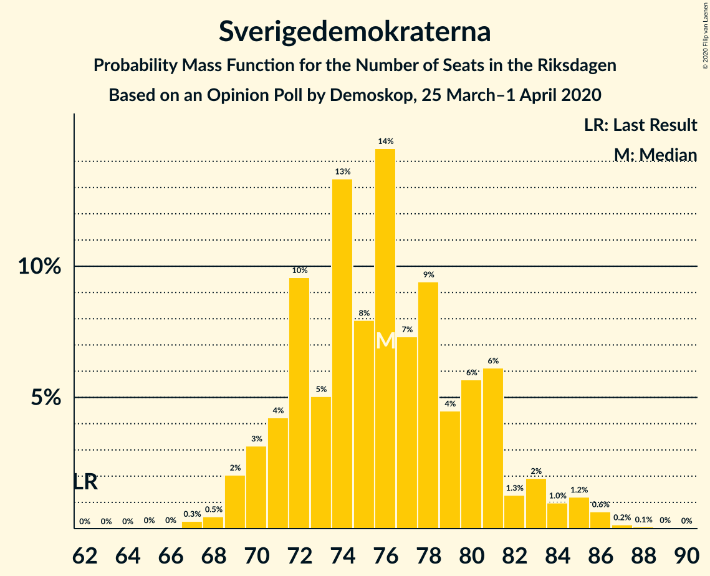
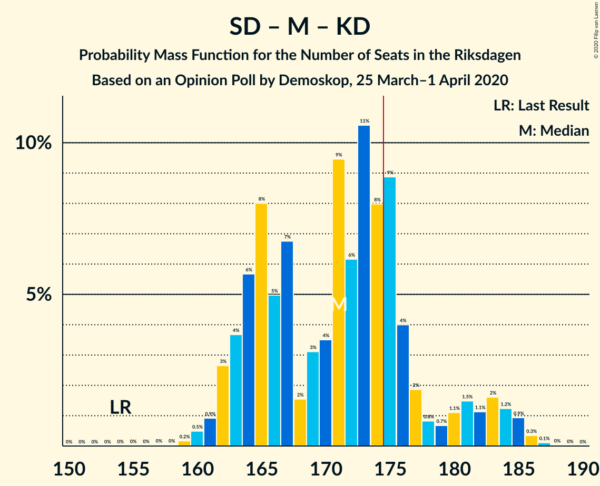
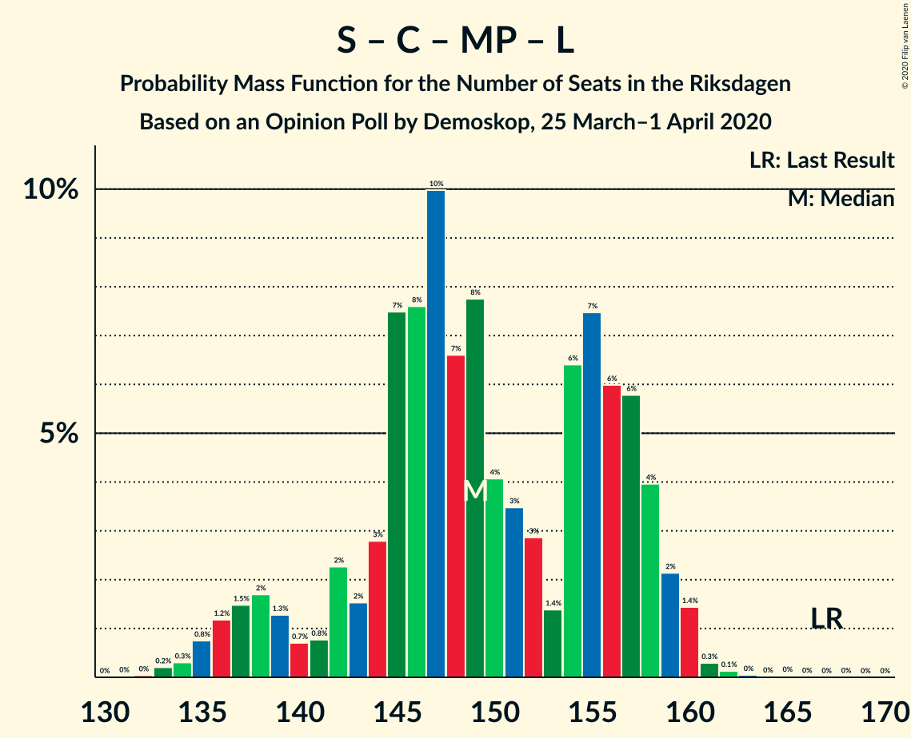
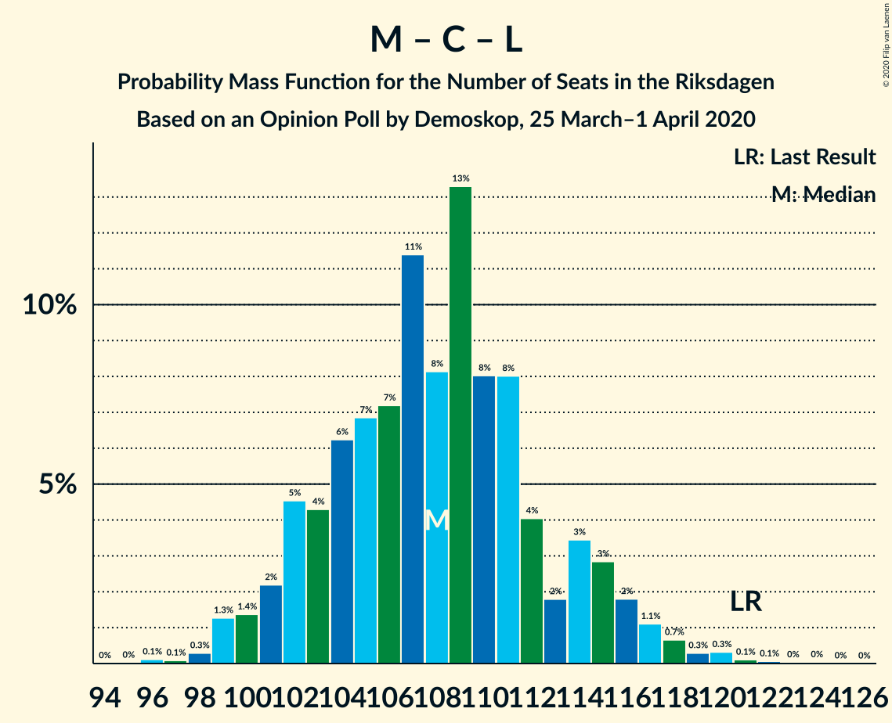

# Opinion Poll by Demoskop, 25 March–1 April 2020

<a href="#voting-intentions">Voting Intentions</a> | <a href="#seats">Seats</a> | <a href="#coalitions">Coalitions</a> | <a href="#technical-information">Technical Information</a>

## Voting Intentions

### Confidence Intervals

| Party | Last Result | Poll Result | 80% Confidence Interval | 90% Confidence Interval | 95% Confidence Interval | 99% Confidence Interval |
|:-----:|:-----------:|:-----------:|:-----------------------:|:-----------------------:|:-----------------------:|:-----------------------:|
| Sveriges socialdemokratiska arbetareparti | 28.3% | 27.9% | 26.7–29.1% |26.4–29.4% |26.1–29.7% |25.6–30.3% |
| Sverigedemokraterna | 17.5% | 20.8% | 19.8–21.9% |19.5–22.2% |19.2–22.5% |18.7–23.0% |
| Moderata samlingspartiet | 19.8% | 19.2% | 18.2–20.3% |17.9–20.6% |17.7–20.8% |17.2–21.3% |
| Centerpartiet | 8.6% | 10.0% | 9.2–10.8% |9.0–11.1% |8.9–11.2% |8.5–11.6% |
| Vänsterpartiet | 8.0% | 7.7% | 7.0–8.4% |6.9–8.7% |6.7–8.8% |6.4–9.2% |
| Kristdemokraterna | 6.3% | 6.7% | 6.1–7.4% |5.9–7.6% |5.8–7.8% |5.5–8.1% |
| Miljöpartiet de gröna | 4.4% | 4.0% | 3.5–4.6% |3.4–4.7% |3.3–4.8% |3.1–5.1% |
| Liberalerna | 5.5% | 3.0% | 2.6–3.5% |2.5–3.7% |2.4–3.8% |2.2–4.0% |

*Note:* The poll result column reflects the actual value used in the calculations. Published results may vary slightly, and in addition be rounded to fewer digits.

## Seats

### Confidence Intervals

| Party | Last Result | Median | 80% Confidence Interval | 90% Confidence Interval | 95% Confidence Interval | 99% Confidence Interval |
|:-----:|:-----------:|:------:|:-----------------------:|:-----------------------:|:-----------------------:|:-----------------------:|
| <a href="#sveriges-socialdemokratiska-arbetareparti">Sveriges socialdemokratiska arbetareparti</a> | 100 | 104 | 97–109 |96–110 |94–111 |92–113 |
| <a href="#sverigedemokraterna">Sverigedemokraterna</a> | 62 | 76 | 72–80 |71–81 |70–82 |68–85 |
| <a href="#moderata-samlingspartiet">Moderata samlingspartiet</a> | 70 | 70 | 66–74 |66–76 |64–77 |63–80 |
| <a href="#centerpartiet">Centerpartiet</a> | 31 | 37 | 34–41 |34–41 |33–42 |32–44 |
| <a href="#vänsterpartiet">Vänsterpartiet</a> | 28 | 29 | 26–31 |25–32 |25–33 |24–34 |
| <a href="#kristdemokraterna">Kristdemokraterna</a> | 22 | 24 | 22–27 |21–28 |21–29 |20–30 |
| <a href="#miljöpartiet-de-gröna">Miljöpartiet de gröna</a> | 16 | 14 | 0–16 |0–17 |0–17 |0–18 |
| <a href="#liberalerna">Liberalerna</a> | 20 | 0 | 0 |0 |0 |0 |

### Sveriges socialdemokratiska arbetareparti

*For a full overview of the results for this party, see the [Sveriges socialdemokratiska arbetareparti](party-sverigessocialdemokratiskaarbetareparti.html) page.*

| Number of Seats | Probability | Accumulated | Special Marks |
|:---------------:|:-----------:|:-----------:|:-------------:|
| 91 | 0.1% | 100% |  |
| 92 | 0.4% | 99.9% |  |
| 93 | 0.5% | 99.5% |  |
| 94 | 2% | 99.0% |  |
| 95 | 1.5% | 97% |  |
| 96 | 3% | 96% |  |
| 97 | 5% | 93% |  |
| 98 | 4% | 88% |  |
| 99 | 5% | 84% |  |
| 100 | 8% | 78% | Last Result |
| 101 | 2% | 70% |  |
| 102 | 6% | 68% |  |
| 103 | 4% | 62% |  |
| 104 | 12% | 57% | Median |
| 105 | 6% | 45% |  |
| 106 | 7% | 39% |  |
| 107 | 6% | 32% |  |
| 108 | 6% | 26% |  |
| 109 | 11% | 20% |  |
| 110 | 5% | 9% |  |
| 111 | 4% | 5% |  |
| 112 | 0.5% | 1.1% |  |
| 113 | 0.4% | 0.6% |  |
| 114 | 0.1% | 0.2% |  |
| 115 | 0.1% | 0.1% |  |
| 116 | 0% | 0.1% |  |
| 117 | 0% | 0% |  |

### Sverigedemokraterna

*For a full overview of the results for this party, see the [Sverigedemokraterna](party-sverigedemokraterna.html) page.*

| Number of Seats | Probability | Accumulated | Special Marks |
|:---------------:|:-----------:|:-----------:|:-------------:|
| 62 | 0% | 100% | Last Result |
| 63 | 0% | 100% |  |
| 64 | 0% | 100% |  |
| 65 | 0% | 100% |  |
| 66 | 0% | 100% |  |
| 67 | 0.1% | 99.9% |  |
| 68 | 0.4% | 99.8% |  |
| 69 | 2% | 99.5% |  |
| 70 | 2% | 98% |  |
| 71 | 3% | 96% |  |
| 72 | 9% | 93% |  |
| 73 | 4% | 85% |  |
| 74 | 18% | 80% |  |
| 75 | 9% | 63% |  |
| 76 | 18% | 54% | Median |
| 77 | 8% | 36% |  |
| 78 | 12% | 28% |  |
| 79 | 4% | 15% |  |
| 80 | 6% | 12% |  |
| 81 | 3% | 6% |  |
| 82 | 0.7% | 3% |  |
| 83 | 1.1% | 2% |  |
| 84 | 0.2% | 0.8% |  |
| 85 | 0.4% | 0.5% |  |
| 86 | 0% | 0.2% |  |
| 87 | 0% | 0.1% |  |
| 88 | 0% | 0.1% |  |
| 89 | 0% | 0% |  |

### Moderata samlingspartiet

*For a full overview of the results for this party, see the [Moderata samlingspartiet](party-moderatasamlingspartiet.html) page.*

| Number of Seats | Probability | Accumulated | Special Marks |
|:---------------:|:-----------:|:-----------:|:-------------:|
| 60 | 0% | 100% |  |
| 61 | 0% | 99.9% |  |
| 62 | 0.1% | 99.9% |  |
| 63 | 0.6% | 99.8% |  |
| 64 | 3% | 99.1% |  |
| 65 | 1.3% | 97% |  |
| 66 | 7% | 95% |  |
| 67 | 8% | 88% |  |
| 68 | 6% | 80% |  |
| 69 | 10% | 74% |  |
| 70 | 17% | 64% | Last Result, Median |
| 71 | 12% | 47% |  |
| 72 | 3% | 36% |  |
| 73 | 17% | 33% |  |
| 74 | 7% | 15% |  |
| 75 | 2% | 9% |  |
| 76 | 2% | 7% |  |
| 77 | 3% | 5% |  |
| 78 | 0.8% | 2% |  |
| 79 | 0.2% | 1.1% |  |
| 80 | 0.7% | 0.9% |  |
| 81 | 0.1% | 0.2% |  |
| 82 | 0% | 0.1% |  |
| 83 | 0% | 0% |  |

### Centerpartiet

*For a full overview of the results for this party, see the [Centerpartiet](party-centerpartiet.html) page.*

| Number of Seats | Probability | Accumulated | Special Marks |
|:---------------:|:-----------:|:-----------:|:-------------:|
| 30 | 0.1% | 100% |  |
| 31 | 0.3% | 99.9% | Last Result |
| 32 | 1.3% | 99.6% |  |
| 33 | 3% | 98% |  |
| 34 | 7% | 96% |  |
| 35 | 9% | 88% |  |
| 36 | 15% | 79% |  |
| 37 | 15% | 64% | Median |
| 38 | 17% | 49% |  |
| 39 | 14% | 33% |  |
| 40 | 7% | 18% |  |
| 41 | 7% | 12% |  |
| 42 | 3% | 5% |  |
| 43 | 1.0% | 2% |  |
| 44 | 0.5% | 0.6% |  |
| 45 | 0.1% | 0.1% |  |
| 46 | 0% | 0% |  |

### Vänsterpartiet

*For a full overview of the results for this party, see the [Vänsterpartiet](party-vänsterpartiet.html) page.*

| Number of Seats | Probability | Accumulated | Special Marks |
|:---------------:|:-----------:|:-----------:|:-------------:|
| 22 | 0.1% | 100% |  |
| 23 | 0.3% | 99.9% |  |
| 24 | 2% | 99.6% |  |
| 25 | 6% | 98% |  |
| 26 | 7% | 92% |  |
| 27 | 16% | 84% |  |
| 28 | 15% | 68% | Last Result |
| 29 | 26% | 53% | Median |
| 30 | 13% | 27% |  |
| 31 | 7% | 14% |  |
| 32 | 4% | 7% |  |
| 33 | 2% | 4% |  |
| 34 | 1.1% | 2% |  |
| 35 | 0.4% | 0.4% |  |
| 36 | 0.1% | 0.1% |  |
| 37 | 0% | 0% |  |

### Kristdemokraterna

*For a full overview of the results for this party, see the [Kristdemokraterna](party-kristdemokraterna.html) page.*

| Number of Seats | Probability | Accumulated | Special Marks |
|:---------------:|:-----------:|:-----------:|:-------------:|
| 19 | 0.2% | 100% |  |
| 20 | 2% | 99.8% |  |
| 21 | 5% | 98% |  |
| 22 | 6% | 93% | Last Result |
| 23 | 24% | 87% |  |
| 24 | 17% | 63% | Median |
| 25 | 14% | 46% |  |
| 26 | 19% | 32% |  |
| 27 | 7% | 14% |  |
| 28 | 4% | 7% |  |
| 29 | 2% | 3% |  |
| 30 | 0.5% | 0.7% |  |
| 31 | 0.2% | 0.2% |  |
| 32 | 0% | 0.1% |  |
| 33 | 0% | 0% |  |

### Miljöpartiet de gröna

*For a full overview of the results for this party, see the [Miljöpartiet de gröna](party-miljöpartietdegröna.html) page.*

| Number of Seats | Probability | Accumulated | Special Marks |
|:---------------:|:-----------:|:-----------:|:-------------:|
| 0 | 44% | 100% |  |
| 1 | 0% | 56% |  |
| 2 | 0% | 56% |  |
| 3 | 0% | 56% |  |
| 4 | 0% | 56% |  |
| 5 | 0% | 56% |  |
| 6 | 0% | 56% |  |
| 7 | 0% | 56% |  |
| 8 | 0% | 56% |  |
| 9 | 0% | 56% |  |
| 10 | 0% | 56% |  |
| 11 | 0% | 56% |  |
| 12 | 0% | 56% |  |
| 13 | 0% | 56% |  |
| 14 | 7% | 56% | Median |
| 15 | 26% | 49% |  |
| 16 | 14% | 24% | Last Result |
| 17 | 7% | 9% |  |
| 18 | 2% | 2% |  |
| 19 | 0.2% | 0.3% |  |
| 20 | 0% | 0% |  |

### Liberalerna

*For a full overview of the results for this party, see the [Liberalerna](party-liberalerna.html) page.*

| Number of Seats | Probability | Accumulated | Special Marks |
|:---------------:|:-----------:|:-----------:|:-------------:|
| 0 | 99.5% | 100% | Median |
| 1 | 0% | 0.5% |  |
| 2 | 0% | 0.5% |  |
| 3 | 0% | 0.5% |  |
| 4 | 0% | 0.5% |  |
| 5 | 0% | 0.5% |  |
| 6 | 0% | 0.5% |  |
| 7 | 0% | 0.5% |  |
| 8 | 0% | 0.5% |  |
| 9 | 0% | 0.5% |  |
| 10 | 0% | 0.5% |  |
| 11 | 0% | 0.5% |  |
| 12 | 0% | 0.5% |  |
| 13 | 0% | 0.5% |  |
| 14 | 0.1% | 0.5% |  |
| 15 | 0.3% | 0.3% |  |
| 16 | 0% | 0% |  |
| 17 | 0% | 0% |  |
| 18 | 0% | 0% |  |
| 19 | 0% | 0% |  |
| 20 | 0% | 0% | Last Result |

## Coalitions

### Confidence Intervals

| Coalition | Last Result | Median | Majority? | 80% Confidence Interval | 90% Confidence Interval | 95% Confidence Interval | 99% Confidence Interval |
|:---------:|:-----------:|:------:|:---------:|:-----------------------:|:-----------------------:|:-----------------------:|:-----------------------:|
| Sveriges socialdemokratiska arbetareparti – Moderata samlingspartiet – Centerpartiet | 201 | 211 | 100% | 202–220 | 200–221 | 200–222 | 198–224 |
| Sveriges socialdemokratiska arbetareparti – Centerpartiet – Vänsterpartiet – Miljöpartiet de gröna – Liberalerna | 195 | 178 | 82% | 174–185 | 172–186 | 169–187 | 165–187 |
| Sveriges socialdemokratiska arbetareparti – Moderata samlingspartiet | 170 | 174 | 46% | 166–182 | 165–183 | 164–184 | 161–187 |
| Sverigedemokraterna – Moderata samlingspartiet – Kristdemokraterna | 154 | 171 | 18% | 164–175 | 163–177 | 162–180 | 162–184 |
| Sveriges socialdemokratiska arbetareparti – Centerpartiet – Miljöpartiet de gröna – Liberalerna | 167 | 149 | 0% | 145–156 | 142–157 | 140–158 | 135–160 |
| Sverigedemokraterna – Moderata samlingspartiet | 132 | 145 | 0% | 142–151 | 138–152 | 138–155 | 137–159 |
| Sveriges socialdemokratiska arbetareparti – Vänsterpartiet – Miljöpartiet de gröna | 144 | 141 | 0% | 134–148 | 132–150 | 130–151 | 126–153 |
| Moderata samlingspartiet – Centerpartiet – Kristdemokraterna – Liberalerna | 143 | 133 | 0% | 126–139 | 125–141 | 124–142 | 121–145 |
| Moderata samlingspartiet – Centerpartiet – Kristdemokraterna | 123 | 133 | 0% | 126–139 | 125–141 | 124–142 | 121–144 |
| Sveriges socialdemokratiska arbetareparti – Vänsterpartiet | 128 | 132 | 0% | 125–139 | 123–140 | 122–141 | 120–143 |
| Sveriges socialdemokratiska arbetareparti – Miljöpartiet de gröna | 116 | 112 | 0% | 105–120 | 103–122 | 101–123 | 97–124 |
| Moderata samlingspartiet – Centerpartiet – Liberalerna | 121 | 108 | 0% | 102–114 | 101–116 | 100–117 | 98–120 |
| Moderata samlingspartiet – Centerpartiet | 101 | 108 | 0% | 102–114 | 101–115 | 100–117 | 98–119 |

### Sveriges socialdemokratiska arbetareparti – Moderata samlingspartiet – Centerpartiet

| Number of Seats | Probability | Accumulated | Special Marks |
|:---------------:|:-----------:|:-----------:|:-------------:|
| 194 | 0.1% | 100% |  |
| 195 | 0% | 99.9% |  |
| 196 | 0.1% | 99.8% |  |
| 197 | 0.1% | 99.7% |  |
| 198 | 0.5% | 99.6% |  |
| 199 | 0.5% | 99.1% |  |
| 200 | 5% | 98.7% |  |
| 201 | 2% | 93% | Last Result |
| 202 | 2% | 92% |  |
| 203 | 3% | 89% |  |
| 204 | 3% | 87% |  |
| 205 | 4% | 84% |  |
| 206 | 6% | 80% |  |
| 207 | 6% | 74% |  |
| 208 | 2% | 68% |  |
| 209 | 4% | 66% |  |
| 210 | 7% | 62% |  |
| 211 | 10% | 55% | Median |
| 212 | 2% | 45% |  |
| 213 | 3% | 43% |  |
| 214 | 2% | 40% |  |
| 215 | 1.2% | 38% |  |
| 216 | 6% | 37% |  |
| 217 | 1.5% | 31% |  |
| 218 | 8% | 30% |  |
| 219 | 6% | 21% |  |
| 220 | 7% | 15% |  |
| 221 | 3% | 8% |  |
| 222 | 2% | 5% |  |
| 223 | 1.1% | 2% |  |
| 224 | 1.1% | 1.3% |  |
| 225 | 0.1% | 0.2% |  |
| 226 | 0.1% | 0.1% |  |
| 227 | 0% | 0% |  |

### Sveriges socialdemokratiska arbetareparti – Centerpartiet – Vänsterpartiet – Miljöpartiet de gröna – Liberalerna

| Number of Seats | Probability | Accumulated | Special Marks |
|:---------------:|:-----------:|:-----------:|:-------------:|
| 162 | 0.1% | 100% |  |
| 163 | 0.2% | 99.9% |  |
| 164 | 0.2% | 99.8% |  |
| 165 | 0.4% | 99.5% |  |
| 166 | 0.6% | 99.1% |  |
| 167 | 0.5% | 98% |  |
| 168 | 0.4% | 98% |  |
| 169 | 0.8% | 98% |  |
| 170 | 0.8% | 97% |  |
| 171 | 0.7% | 96% |  |
| 172 | 1.0% | 95% |  |
| 173 | 3% | 94% |  |
| 174 | 9% | 91% |  |
| 175 | 9% | 82% | Majority |
| 176 | 13% | 73% |  |
| 177 | 7% | 60% |  |
| 178 | 12% | 53% |  |
| 179 | 4% | 40% |  |
| 180 | 3% | 36% |  |
| 181 | 2% | 33% |  |
| 182 | 10% | 31% |  |
| 183 | 6% | 22% |  |
| 184 | 5% | 16% | Median |
| 185 | 6% | 11% |  |
| 186 | 3% | 5% |  |
| 187 | 2% | 3% |  |
| 188 | 0.1% | 0.4% |  |
| 189 | 0.1% | 0.2% |  |
| 190 | 0.1% | 0.1% |  |
| 191 | 0% | 0% |  |
| 192 | 0% | 0% |  |
| 193 | 0% | 0% |  |
| 194 | 0% | 0% |  |
| 195 | 0% | 0% | Last Result |

### Sveriges socialdemokratiska arbetareparti – Moderata samlingspartiet

| Number of Seats | Probability | Accumulated | Special Marks |
|:---------------:|:-----------:|:-----------:|:-------------:|
| 158 | 0% | 100% |  |
| 159 | 0.1% | 99.9% |  |
| 160 | 0.2% | 99.8% |  |
| 161 | 0.2% | 99.5% |  |
| 162 | 0.6% | 99.3% |  |
| 163 | 1.1% | 98.7% |  |
| 164 | 3% | 98% |  |
| 165 | 1.0% | 95% |  |
| 166 | 5% | 94% |  |
| 167 | 3% | 89% |  |
| 168 | 5% | 86% |  |
| 169 | 4% | 80% |  |
| 170 | 6% | 76% | Last Result |
| 171 | 7% | 70% |  |
| 172 | 3% | 63% |  |
| 173 | 5% | 60% |  |
| 174 | 9% | 55% | Median |
| 175 | 6% | 46% | Majority |
| 176 | 5% | 40% |  |
| 177 | 3% | 36% |  |
| 178 | 4% | 32% |  |
| 179 | 4% | 29% |  |
| 180 | 7% | 25% |  |
| 181 | 3% | 18% |  |
| 182 | 8% | 15% |  |
| 183 | 2% | 7% |  |
| 184 | 2% | 4% |  |
| 185 | 1.0% | 2% |  |
| 186 | 0.4% | 1.2% |  |
| 187 | 0.6% | 0.8% |  |
| 188 | 0.1% | 0.2% |  |
| 189 | 0.1% | 0.1% |  |
| 190 | 0% | 0.1% |  |
| 191 | 0% | 0% |  |

### Sverigedemokraterna – Moderata samlingspartiet – Kristdemokraterna

| Number of Seats | Probability | Accumulated | Special Marks |
|:---------------:|:-----------:|:-----------:|:-------------:|
| 154 | 0% | 100% | Last Result |
| 155 | 0% | 100% |  |
| 156 | 0% | 100% |  |
| 157 | 0% | 100% |  |
| 158 | 0% | 100% |  |
| 159 | 0.1% | 100% |  |
| 160 | 0.1% | 99.9% |  |
| 161 | 0.1% | 99.8% |  |
| 162 | 2% | 99.6% |  |
| 163 | 3% | 97% |  |
| 164 | 6% | 95% |  |
| 165 | 5% | 89% |  |
| 166 | 6% | 84% |  |
| 167 | 10% | 78% |  |
| 168 | 2% | 69% |  |
| 169 | 3% | 67% |  |
| 170 | 4% | 64% | Median |
| 171 | 12% | 60% |  |
| 172 | 7% | 47% |  |
| 173 | 13% | 40% |  |
| 174 | 9% | 27% |  |
| 175 | 9% | 18% | Majority |
| 176 | 3% | 9% |  |
| 177 | 1.0% | 6% |  |
| 178 | 0.7% | 5% |  |
| 179 | 0.8% | 4% |  |
| 180 | 0.8% | 3% |  |
| 181 | 0.4% | 2% |  |
| 182 | 0.5% | 2% |  |
| 183 | 0.6% | 2% |  |
| 184 | 0.4% | 0.9% |  |
| 185 | 0.2% | 0.5% |  |
| 186 | 0.2% | 0.2% |  |
| 187 | 0.1% | 0.1% |  |
| 188 | 0% | 0% |  |

### Sveriges socialdemokratiska arbetareparti – Centerpartiet – Miljöpartiet de gröna – Liberalerna

| Number of Seats | Probability | Accumulated | Special Marks |
|:---------------:|:-----------:|:-----------:|:-------------:|
| 133 | 0.1% | 100% |  |
| 134 | 0.2% | 99.9% |  |
| 135 | 0.3% | 99.7% |  |
| 136 | 0.3% | 99.4% |  |
| 137 | 0.5% | 99.2% |  |
| 138 | 0.4% | 98.7% |  |
| 139 | 0.7% | 98% |  |
| 140 | 0.5% | 98% |  |
| 141 | 0.6% | 97% |  |
| 142 | 2% | 97% |  |
| 143 | 0.8% | 95% |  |
| 144 | 2% | 94% |  |
| 145 | 9% | 92% |  |
| 146 | 9% | 83% |  |
| 147 | 11% | 75% |  |
| 148 | 8% | 63% |  |
| 149 | 10% | 55% |  |
| 150 | 5% | 45% |  |
| 151 | 4% | 40% |  |
| 152 | 4% | 36% |  |
| 153 | 0.9% | 33% |  |
| 154 | 7% | 32% |  |
| 155 | 9% | 24% | Median |
| 156 | 7% | 15% |  |
| 157 | 5% | 8% |  |
| 158 | 1.4% | 3% |  |
| 159 | 1.1% | 2% |  |
| 160 | 0.8% | 1.0% |  |
| 161 | 0.1% | 0.2% |  |
| 162 | 0% | 0.1% |  |
| 163 | 0% | 0% |  |
| 164 | 0% | 0% |  |
| 165 | 0% | 0% |  |
| 166 | 0% | 0% |  |
| 167 | 0% | 0% | Last Result |

### Sverigedemokraterna – Moderata samlingspartiet

| Number of Seats | Probability | Accumulated | Special Marks |
|:---------------:|:-----------:|:-----------:|:-------------:|
| 132 | 0% | 100% | Last Result |
| 133 | 0% | 100% |  |
| 134 | 0.1% | 100% |  |
| 135 | 0% | 99.9% |  |
| 136 | 0.1% | 99.9% |  |
| 137 | 1.0% | 99.8% |  |
| 138 | 5% | 98.8% |  |
| 139 | 0.8% | 94% |  |
| 140 | 0.6% | 93% |  |
| 141 | 3% | 93% |  |
| 142 | 4% | 90% |  |
| 143 | 13% | 86% |  |
| 144 | 14% | 74% |  |
| 145 | 12% | 60% |  |
| 146 | 3% | 48% | Median |
| 147 | 2% | 45% |  |
| 148 | 5% | 43% |  |
| 149 | 11% | 38% |  |
| 150 | 17% | 28% |  |
| 151 | 5% | 11% |  |
| 152 | 1.3% | 5% |  |
| 153 | 0.8% | 4% |  |
| 154 | 0.4% | 3% |  |
| 155 | 1.0% | 3% |  |
| 156 | 0.6% | 2% |  |
| 157 | 0.7% | 1.4% |  |
| 158 | 0.2% | 0.7% |  |
| 159 | 0.1% | 0.5% |  |
| 160 | 0.3% | 0.4% |  |
| 161 | 0% | 0.1% |  |
| 162 | 0% | 0% |  |

### Sveriges socialdemokratiska arbetareparti – Vänsterpartiet – Miljöpartiet de gröna

| Number of Seats | Probability | Accumulated | Special Marks |
|:---------------:|:-----------:|:-----------:|:-------------:|
| 123 | 0.1% | 100% |  |
| 124 | 0.1% | 99.9% |  |
| 125 | 0.1% | 99.9% |  |
| 126 | 0.5% | 99.7% |  |
| 127 | 0.3% | 99.2% |  |
| 128 | 0.6% | 98.9% |  |
| 129 | 0.5% | 98% |  |
| 130 | 0.8% | 98% |  |
| 131 | 2% | 97% |  |
| 132 | 0.6% | 95% |  |
| 133 | 3% | 95% |  |
| 134 | 3% | 91% |  |
| 135 | 6% | 89% |  |
| 136 | 3% | 82% |  |
| 137 | 7% | 79% |  |
| 138 | 10% | 72% |  |
| 139 | 4% | 62% |  |
| 140 | 7% | 58% |  |
| 141 | 6% | 51% |  |
| 142 | 7% | 45% |  |
| 143 | 2% | 38% |  |
| 144 | 7% | 36% | Last Result |
| 145 | 9% | 28% |  |
| 146 | 2% | 20% |  |
| 147 | 6% | 18% | Median |
| 148 | 2% | 12% |  |
| 149 | 4% | 9% |  |
| 150 | 2% | 5% |  |
| 151 | 2% | 3% |  |
| 152 | 0.8% | 1.4% |  |
| 153 | 0.3% | 0.6% |  |
| 154 | 0.2% | 0.3% |  |
| 155 | 0.1% | 0.1% |  |
| 156 | 0% | 0% |  |

### Moderata samlingspartiet – Centerpartiet – Kristdemokraterna – Liberalerna

| Number of Seats | Probability | Accumulated | Special Marks |
|:---------------:|:-----------:|:-----------:|:-------------:|
| 119 | 0.1% | 100% |  |
| 120 | 0.2% | 99.9% |  |
| 121 | 0.5% | 99.7% |  |
| 122 | 0.3% | 99.3% |  |
| 123 | 0.3% | 98.9% |  |
| 124 | 2% | 98.6% |  |
| 125 | 2% | 97% |  |
| 126 | 6% | 95% |  |
| 127 | 5% | 88% |  |
| 128 | 5% | 84% |  |
| 129 | 7% | 78% |  |
| 130 | 9% | 72% |  |
| 131 | 4% | 63% | Median |
| 132 | 3% | 59% |  |
| 133 | 14% | 56% |  |
| 134 | 11% | 42% |  |
| 135 | 10% | 31% |  |
| 136 | 6% | 21% |  |
| 137 | 2% | 15% |  |
| 138 | 2% | 14% |  |
| 139 | 2% | 12% |  |
| 140 | 4% | 10% |  |
| 141 | 1.3% | 6% |  |
| 142 | 2% | 4% |  |
| 143 | 1.2% | 2% | Last Result |
| 144 | 0.2% | 0.8% |  |
| 145 | 0.3% | 0.6% |  |
| 146 | 0.1% | 0.2% |  |
| 147 | 0.1% | 0.2% |  |
| 148 | 0.1% | 0.1% |  |
| 149 | 0% | 0.1% |  |
| 150 | 0% | 0% |  |

### Moderata samlingspartiet – Centerpartiet – Kristdemokraterna

| Number of Seats | Probability | Accumulated | Special Marks |
|:---------------:|:-----------:|:-----------:|:-------------:|
| 119 | 0.1% | 100% |  |
| 120 | 0.2% | 99.9% |  |
| 121 | 0.5% | 99.7% |  |
| 122 | 0.3% | 99.2% |  |
| 123 | 0.3% | 98.9% | Last Result |
| 124 | 2% | 98.6% |  |
| 125 | 2% | 97% |  |
| 126 | 6% | 95% |  |
| 127 | 5% | 88% |  |
| 128 | 5% | 83% |  |
| 129 | 7% | 78% |  |
| 130 | 9% | 72% |  |
| 131 | 4% | 62% | Median |
| 132 | 3% | 58% |  |
| 133 | 14% | 55% |  |
| 134 | 11% | 42% |  |
| 135 | 10% | 31% |  |
| 136 | 6% | 21% |  |
| 137 | 2% | 15% |  |
| 138 | 2% | 13% |  |
| 139 | 2% | 11% |  |
| 140 | 4% | 10% |  |
| 141 | 1.3% | 5% |  |
| 142 | 2% | 4% |  |
| 143 | 1.2% | 2% |  |
| 144 | 0.2% | 0.6% |  |
| 145 | 0.3% | 0.4% |  |
| 146 | 0% | 0.1% |  |
| 147 | 0% | 0.1% |  |
| 148 | 0% | 0% |  |

### Sveriges socialdemokratiska arbetareparti – Vänsterpartiet

| Number of Seats | Probability | Accumulated | Special Marks |
|:---------------:|:-----------:|:-----------:|:-------------:|
| 118 | 0% | 100% |  |
| 119 | 0.4% | 99.9% |  |
| 120 | 0.4% | 99.6% |  |
| 121 | 0.9% | 99.2% |  |
| 122 | 2% | 98% |  |
| 123 | 2% | 96% |  |
| 124 | 1.5% | 94% |  |
| 125 | 4% | 92% |  |
| 126 | 5% | 88% |  |
| 127 | 5% | 83% |  |
| 128 | 3% | 78% | Last Result |
| 129 | 8% | 76% |  |
| 130 | 2% | 68% |  |
| 131 | 12% | 66% |  |
| 132 | 5% | 54% |  |
| 133 | 7% | 48% | Median |
| 134 | 5% | 41% |  |
| 135 | 8% | 37% |  |
| 136 | 4% | 29% |  |
| 137 | 6% | 25% |  |
| 138 | 8% | 19% |  |
| 139 | 4% | 11% |  |
| 140 | 3% | 8% |  |
| 141 | 3% | 4% |  |
| 142 | 0.4% | 1.1% |  |
| 143 | 0.5% | 0.7% |  |
| 144 | 0.1% | 0.2% |  |
| 145 | 0% | 0.1% |  |
| 146 | 0% | 0% |  |

### Sveriges socialdemokratiska arbetareparti – Miljöpartiet de gröna

| Number of Seats | Probability | Accumulated | Special Marks |
|:---------------:|:-----------:|:-----------:|:-------------:|
| 94 | 0% | 100% |  |
| 95 | 0.1% | 99.9% |  |
| 96 | 0.3% | 99.9% |  |
| 97 | 0.1% | 99.6% |  |
| 98 | 0.6% | 99.5% |  |
| 99 | 0.3% | 98.9% |  |
| 100 | 0.6% | 98.6% |  |
| 101 | 0.9% | 98% |  |
| 102 | 0.9% | 97% |  |
| 103 | 2% | 96% |  |
| 104 | 2% | 95% |  |
| 105 | 3% | 92% |  |
| 106 | 6% | 89% |  |
| 107 | 3% | 83% |  |
| 108 | 6% | 80% |  |
| 109 | 11% | 74% |  |
| 110 | 5% | 63% |  |
| 111 | 6% | 58% |  |
| 112 | 3% | 51% |  |
| 113 | 6% | 49% |  |
| 114 | 4% | 43% |  |
| 115 | 8% | 39% |  |
| 116 | 3% | 31% | Last Result |
| 117 | 3% | 28% |  |
| 118 | 11% | 25% | Median |
| 119 | 3% | 14% |  |
| 120 | 2% | 11% |  |
| 121 | 2% | 9% |  |
| 122 | 4% | 6% |  |
| 123 | 0.9% | 3% |  |
| 124 | 1.2% | 2% |  |
| 125 | 0.4% | 0.5% |  |
| 126 | 0.1% | 0.1% |  |
| 127 | 0% | 0% |  |

### Moderata samlingspartiet – Centerpartiet – Liberalerna

| Number of Seats | Probability | Accumulated | Special Marks |
|:---------------:|:-----------:|:-----------:|:-------------:|
| 96 | 0.2% | 100% |  |
| 97 | 0.1% | 99.8% |  |
| 98 | 0.3% | 99.7% |  |
| 99 | 0.9% | 99.5% |  |
| 100 | 1.3% | 98.6% |  |
| 101 | 3% | 97% |  |
| 102 | 6% | 95% |  |
| 103 | 5% | 89% |  |
| 104 | 6% | 84% |  |
| 105 | 6% | 78% |  |
| 106 | 5% | 72% |  |
| 107 | 13% | 67% | Median |
| 108 | 7% | 53% |  |
| 109 | 10% | 47% |  |
| 110 | 10% | 36% |  |
| 111 | 9% | 26% |  |
| 112 | 5% | 17% |  |
| 113 | 2% | 13% |  |
| 114 | 2% | 11% |  |
| 115 | 4% | 9% |  |
| 116 | 2% | 5% |  |
| 117 | 1.3% | 3% |  |
| 118 | 0.8% | 2% |  |
| 119 | 0.3% | 0.9% |  |
| 120 | 0.3% | 0.6% |  |
| 121 | 0.1% | 0.2% | Last Result |
| 122 | 0% | 0.1% |  |
| 123 | 0% | 0.1% |  |
| 124 | 0.1% | 0.1% |  |
| 125 | 0% | 0% |  |

### Moderata samlingspartiet – Centerpartiet

| Number of Seats | Probability | Accumulated | Special Marks |
|:---------------:|:-----------:|:-----------:|:-------------:|
| 96 | 0.2% | 100% |  |
| 97 | 0.1% | 99.8% |  |
| 98 | 0.3% | 99.7% |  |
| 99 | 0.9% | 99.4% |  |
| 100 | 1.3% | 98.6% |  |
| 101 | 3% | 97% | Last Result |
| 102 | 6% | 95% |  |
| 103 | 5% | 89% |  |
| 104 | 6% | 84% |  |
| 105 | 6% | 78% |  |
| 106 | 5% | 72% |  |
| 107 | 13% | 66% | Median |
| 108 | 7% | 53% |  |
| 109 | 10% | 46% |  |
| 110 | 10% | 36% |  |
| 111 | 9% | 26% |  |
| 112 | 5% | 17% |  |
| 113 | 2% | 12% |  |
| 114 | 2% | 10% |  |
| 115 | 4% | 9% |  |
| 116 | 2% | 5% |  |
| 117 | 1.2% | 3% |  |
| 118 | 0.8% | 1.5% |  |
| 119 | 0.2% | 0.7% |  |
| 120 | 0.3% | 0.5% |  |
| 121 | 0.1% | 0.1% |  |
| 122 | 0% | 0% |  |

## Technical Information

### Opinion Poll

+ **Polling firm:** Demoskop
+ **Commissioner(s):** —
+ **Fieldwork period:** 25 March–1 April 2020

### Calculations

+ **Sample size:** 2453
+ **Simulations done:** 524,288
+ **Error estimate:** 1.01%

