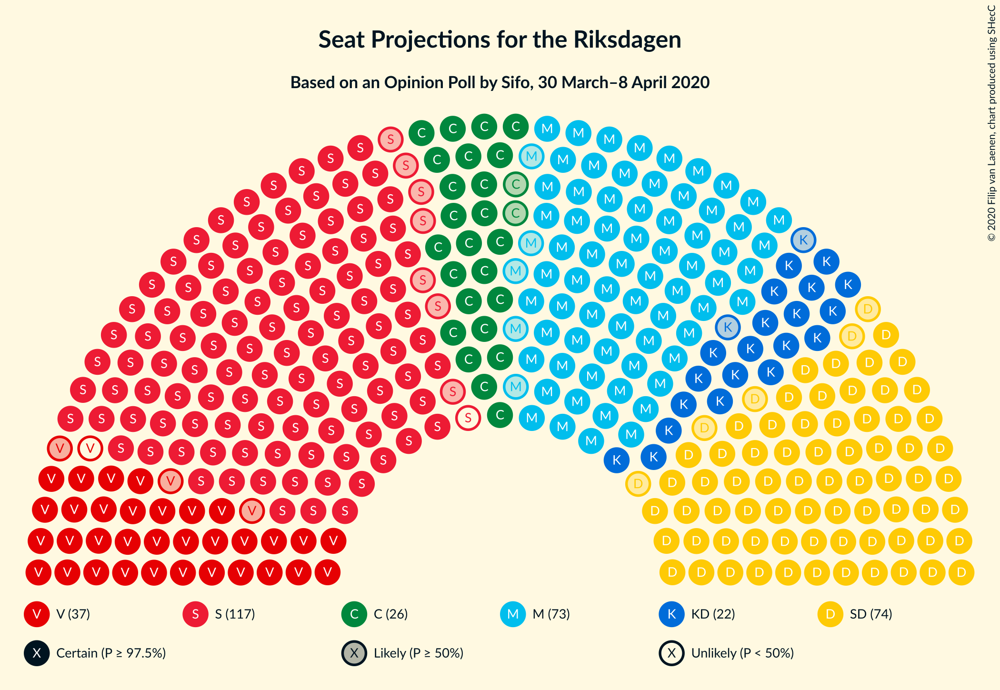
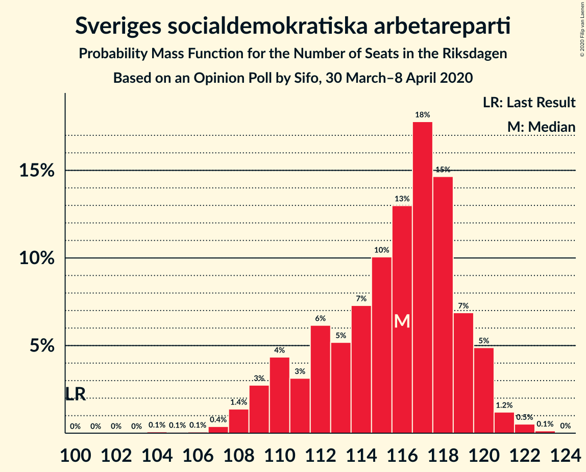
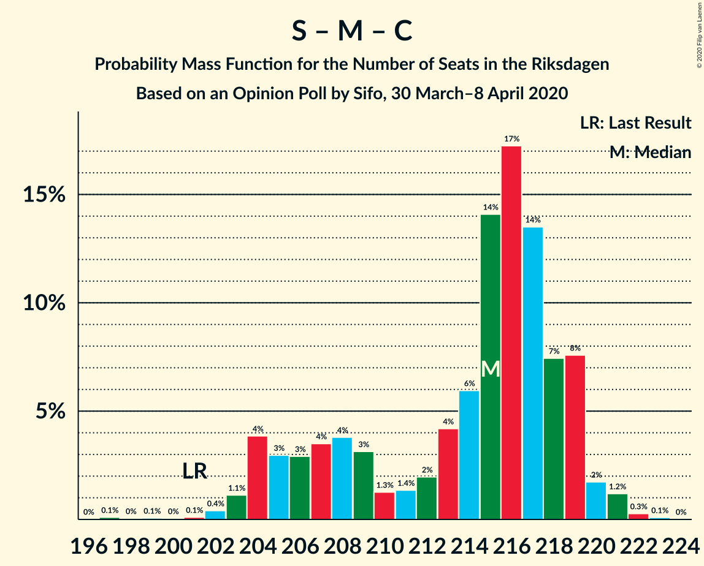
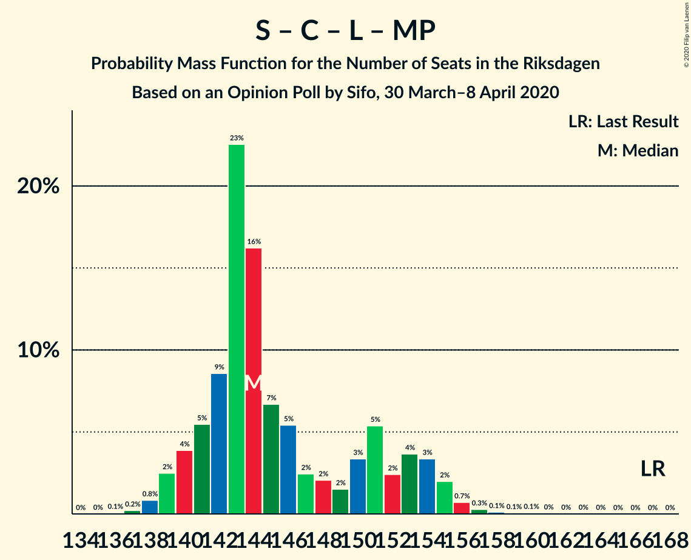
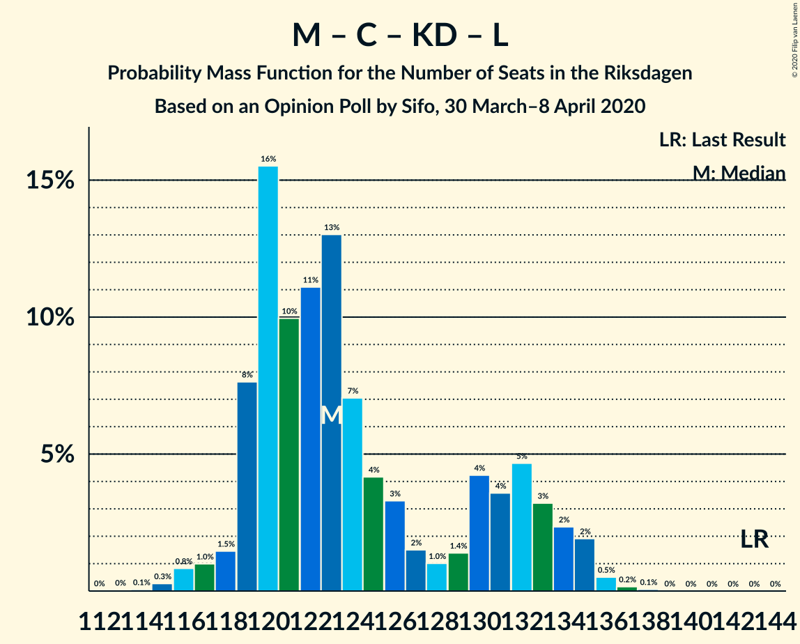
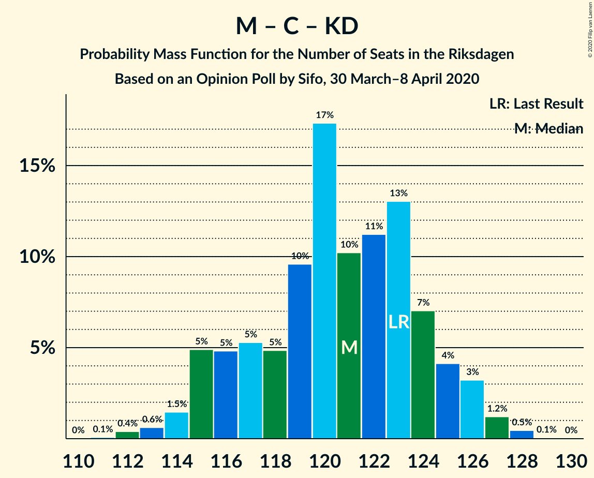
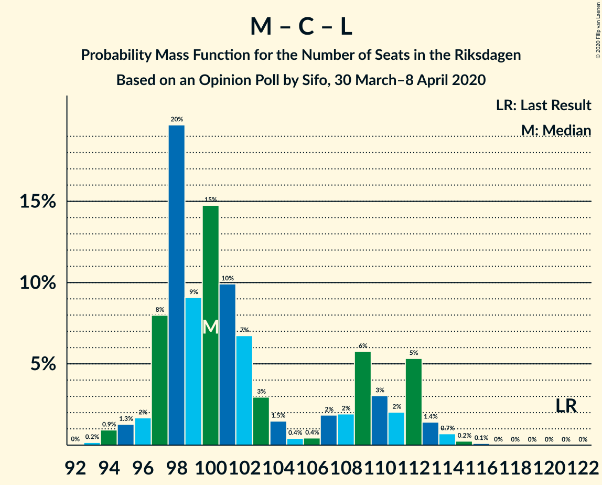

# Opinion Poll by Sifo, 30 March–8 April 2020

<a href="#voting-intentions">Voting Intentions</a> | <a href="#seats">Seats</a> | <a href="#coalitions">Coalitions</a> | <a href="#technical-information">Technical Information</a>

## Voting Intentions

### Confidence Intervals

| Party | Last Result | Poll Result | 80% Confidence Interval | 90% Confidence Interval | 95% Confidence Interval | 99% Confidence Interval |
|:-----:|:-----------:|:-----------:|:-----------------------:|:-----------------------:|:-----------------------:|:-----------------------:|
| Sveriges socialdemokratiska arbetareparti | 28.3% | 30.6% | 29.9–31.4% |29.7–31.6% |29.5–31.7% |29.2–32.1% |
| Sverigedemokraterna | 17.5% | 19.5% | 18.9–20.1% |18.7–20.3% |18.6–20.5% |18.3–20.8% |
| Moderata samlingspartiet | 19.8% | 19.2% | 18.6–19.8% |18.4–20.0% |18.3–20.2% |18.0–20.5% |
| Vänsterpartiet | 8.0% | 9.4% | 9.0–9.9% |8.8–10.0% |8.7–10.1% |8.5–10.4% |
| Centerpartiet | 8.6% | 6.9% | 6.5–7.3% |6.4–7.4% |6.3–7.5% |6.2–7.7% |
| Kristdemokraterna | 6.3% | 5.9% | 5.5–6.3% |5.5–6.4% |5.4–6.5% |5.2–6.7% |
| Liberalerna | 5.5% | 3.8% | 3.5–4.1% |3.4–4.2% |3.4–4.3% |3.2–4.5% |
| Miljöpartiet de gröna | 4.4% | 3.5% | 3.2–3.8% |3.2–3.9% |3.1–4.0% |3.0–4.1% |

*Note:* The poll result column reflects the actual value used in the calculations. Published results may vary slightly, and in addition be rounded to fewer digits.

## Seats

### Confidence Intervals

| Party | Last Result | Median | 80% Confidence Interval | 90% Confidence Interval | 95% Confidence Interval | 99% Confidence Interval |
|:-----:|:-----------:|:------:|:-----------------------:|:-----------------------:|:-----------------------:|:-----------------------:|
| <a href="#sveriges-socialdemokratiska-arbetareparti">Sveriges socialdemokratiska arbetareparti</a> | 100 | 116 | 111–119 |110–120 |109–120 |107–122 |
| <a href="#sverigedemokraterna">Sverigedemokraterna</a> | 62 | 74 | 70–76 |70–77 |69–77 |67–79 |
| <a href="#moderata-samlingspartiet">Moderata samlingspartiet</a> | 70 | 73 | 69–75 |68–76 |68–76 |66–78 |
| <a href="#vänsterpartiet">Vänsterpartiet</a> | 28 | 36 | 34–37 |33–38 |33–39 |32–39 |
| <a href="#centerpartiet">Centerpartiet</a> | 31 | 26 | 24–28 |24–28 |24–28 |23–29 |
| <a href="#kristdemokraterna">Kristdemokraterna</a> | 22 | 22 | 21–24 |20–24 |20–24 |19–25 |
| <a href="#liberalerna">Liberalerna</a> | 20 | 0 | 0–15 |0–15 |0–16 |0–16 |
| <a href="#miljöpartiet-de-gröna">Miljöpartiet de gröna</a> | 16 | 0 | 0 |0 |0 |0–15 |

### Sveriges socialdemokratiska arbetareparti

*For a full overview of the results for this party, see the [Sveriges socialdemokratiska arbetareparti](party-sverigessocialdemokratiskaarbetareparti.html) page.*

| Number of Seats | Probability | Accumulated | Special Marks |
|:---------------:|:-----------:|:-----------:|:-------------:|
| 100 | 0% | 100% | Last Result |
| 101 | 0% | 100% |  |
| 102 | 0% | 100% |  |
| 103 | 0% | 100% |  |
| 104 | 0.1% | 100% |  |
| 105 | 0.1% | 99.9% |  |
| 106 | 0.1% | 99.8% |  |
| 107 | 0.4% | 99.8% |  |
| 108 | 1.4% | 99.4% |  |
| 109 | 3% | 98% |  |
| 110 | 4% | 95% |  |
| 111 | 3% | 91% |  |
| 112 | 6% | 88% |  |
| 113 | 5% | 82% |  |
| 114 | 7% | 76% |  |
| 115 | 10% | 69% |  |
| 116 | 13% | 59% | Median |
| 117 | 18% | 46% |  |
| 118 | 15% | 28% |  |
| 119 | 7% | 14% |  |
| 120 | 5% | 7% |  |
| 121 | 1.2% | 2% |  |
| 122 | 0.5% | 0.7% |  |
| 123 | 0.1% | 0.2% |  |
| 124 | 0% | 0% |  |

### Sverigedemokraterna

*For a full overview of the results for this party, see the [Sverigedemokraterna](party-sverigedemokraterna.html) page.*

| Number of Seats | Probability | Accumulated | Special Marks |
|:---------------:|:-----------:|:-----------:|:-------------:|
| 62 | 0% | 100% | Last Result |
| 63 | 0% | 100% |  |
| 64 | 0% | 100% |  |
| 65 | 0% | 100% |  |
| 66 | 0.1% | 100% |  |
| 67 | 0.5% | 99.9% |  |
| 68 | 1.2% | 99.4% |  |
| 69 | 3% | 98% |  |
| 70 | 6% | 96% |  |
| 71 | 9% | 90% |  |
| 72 | 12% | 81% |  |
| 73 | 16% | 69% |  |
| 74 | 16% | 53% | Median |
| 75 | 19% | 36% |  |
| 76 | 10% | 18% |  |
| 77 | 5% | 8% |  |
| 78 | 1.5% | 2% |  |
| 79 | 0.8% | 1.0% |  |
| 80 | 0.1% | 0.1% |  |
| 81 | 0% | 0% |  |

### Moderata samlingspartiet

*For a full overview of the results for this party, see the [Moderata samlingspartiet](party-moderatasamlingspartiet.html) page.*

| Number of Seats | Probability | Accumulated | Special Marks |
|:---------------:|:-----------:|:-----------:|:-------------:|
| 65 | 0.1% | 100% |  |
| 66 | 0.3% | 99.8% |  |
| 67 | 0.7% | 99.5% |  |
| 68 | 7% | 98.8% |  |
| 69 | 5% | 92% |  |
| 70 | 6% | 87% | Last Result |
| 71 | 21% | 82% |  |
| 72 | 10% | 60% |  |
| 73 | 22% | 50% | Median |
| 74 | 11% | 28% |  |
| 75 | 9% | 17% |  |
| 76 | 6% | 8% |  |
| 77 | 1.2% | 2% |  |
| 78 | 0.4% | 0.6% |  |
| 79 | 0.1% | 0.2% |  |
| 80 | 0% | 0% |  |

### Vänsterpartiet

*For a full overview of the results for this party, see the [Vänsterpartiet](party-vänsterpartiet.html) page.*

| Number of Seats | Probability | Accumulated | Special Marks |
|:---------------:|:-----------:|:-----------:|:-------------:|
| 28 | 0% | 100% | Last Result |
| 29 | 0% | 100% |  |
| 30 | 0% | 100% |  |
| 31 | 0.2% | 100% |  |
| 32 | 1.1% | 99.8% |  |
| 33 | 6% | 98.7% |  |
| 34 | 18% | 93% |  |
| 35 | 21% | 75% |  |
| 36 | 20% | 54% | Median |
| 37 | 25% | 34% |  |
| 38 | 6% | 9% |  |
| 39 | 3% | 3% |  |
| 40 | 0.2% | 0.2% |  |
| 41 | 0% | 0% |  |

### Centerpartiet

*For a full overview of the results for this party, see the [Centerpartiet](party-centerpartiet.html) page.*

| Number of Seats | Probability | Accumulated | Special Marks |
|:---------------:|:-----------:|:-----------:|:-------------:|
| 22 | 0.2% | 100% |  |
| 23 | 2% | 99.8% |  |
| 24 | 9% | 98% |  |
| 25 | 21% | 89% |  |
| 26 | 29% | 68% | Median |
| 27 | 29% | 39% |  |
| 28 | 8% | 10% |  |
| 29 | 1.4% | 2% |  |
| 30 | 0.3% | 0.3% |  |
| 31 | 0% | 0% | Last Result |

### Kristdemokraterna

*For a full overview of the results for this party, see the [Kristdemokraterna](party-kristdemokraterna.html) page.*

| Number of Seats | Probability | Accumulated | Special Marks |
|:---------------:|:-----------:|:-----------:|:-------------:|
| 19 | 0.5% | 100% |  |
| 20 | 5% | 99.5% |  |
| 21 | 21% | 94% |  |
| 22 | 33% | 74% | Last Result, Median |
| 23 | 25% | 40% |  |
| 24 | 13% | 15% |  |
| 25 | 2% | 2% |  |
| 26 | 0.3% | 0.3% |  |
| 27 | 0% | 0% |  |

### Liberalerna

*For a full overview of the results for this party, see the [Liberalerna](party-liberalerna.html) page.*

| Number of Seats | Probability | Accumulated | Special Marks |
|:---------------:|:-----------:|:-----------:|:-------------:|
| 0 | 77% | 100% | Median |
| 1 | 0% | 23% |  |
| 2 | 0% | 23% |  |
| 3 | 0% | 23% |  |
| 4 | 0% | 23% |  |
| 5 | 0% | 23% |  |
| 6 | 0% | 23% |  |
| 7 | 0% | 23% |  |
| 8 | 0% | 23% |  |
| 9 | 0% | 23% |  |
| 10 | 0% | 23% |  |
| 11 | 0% | 23% |  |
| 12 | 0% | 23% |  |
| 13 | 0% | 23% |  |
| 14 | 0.1% | 23% |  |
| 15 | 19% | 23% |  |
| 16 | 4% | 4% |  |
| 17 | 0.2% | 0.2% |  |
| 18 | 0% | 0% |  |
| 19 | 0% | 0% |  |
| 20 | 0% | 0% | Last Result |

### Miljöpartiet de gröna

*For a full overview of the results for this party, see the [Miljöpartiet de gröna](party-miljöpartietdegröna.html) page.*

| Number of Seats | Probability | Accumulated | Special Marks |
|:---------------:|:-----------:|:-----------:|:-------------:|
| 0 | 98% | 100% | Median |
| 1 | 0% | 2% |  |
| 2 | 0% | 2% |  |
| 3 | 0% | 2% |  |
| 4 | 0% | 2% |  |
| 5 | 0% | 2% |  |
| 6 | 0% | 2% |  |
| 7 | 0% | 2% |  |
| 8 | 0% | 2% |  |
| 9 | 0% | 2% |  |
| 10 | 0% | 2% |  |
| 11 | 0% | 2% |  |
| 12 | 0% | 2% |  |
| 13 | 0% | 2% |  |
| 14 | 0.2% | 2% |  |
| 15 | 1.2% | 1.3% |  |
| 16 | 0.1% | 0.1% | Last Result |
| 17 | 0% | 0% |  |

## Coalitions

### Confidence Intervals

| Coalition | Last Result | Median | Majority? | 80% Confidence Interval | 90% Confidence Interval | 95% Confidence Interval | 99% Confidence Interval |
|:---------:|:-----------:|:------:|:---------:|:-----------------------:|:-----------------------:|:-----------------------:|:-----------------------:|
| Sveriges socialdemokratiska arbetareparti – Moderata samlingspartiet – Centerpartiet | 201 | 215 | 100% | 206–219 | 204–219 | 204–220 | 202–221 |
| Sveriges socialdemokratiska arbetareparti – Moderata samlingspartiet | 170 | 189 | 99.8% | 181–192 | 179–193 | 178–194 | 176–196 |
| Sveriges socialdemokratiska arbetareparti – Vänsterpartiet – Centerpartiet – Liberalerna – Miljöpartiet de gröna | 195 | 180 | 98% | 177–187 | 175–188 | 175–189 | 173–191 |
| Sverigedemokraterna – Moderata samlingspartiet – Kristdemokraterna | 154 | 169 | 2% | 162–172 | 161–174 | 160–174 | 158–176 |
| Sveriges socialdemokratiska arbetareparti – Vänsterpartiet – Miljöpartiet de gröna | 144 | 152 | 0% | 146–155 | 144–156 | 143–157 | 143–162 |
| Sveriges socialdemokratiska arbetareparti – Vänsterpartiet | 128 | 152 | 0% | 145–155 | 144–156 | 143–157 | 142–158 |
| Sveriges socialdemokratiska arbetareparti – Centerpartiet – Liberalerna – Miljöpartiet de gröna | 167 | 144 | 0% | 141–153 | 140–154 | 139–155 | 138–157 |
| Sverigedemokraterna – Moderata samlingspartiet | 132 | 147 | 0% | 140–149 | 139–151 | 139–152 | 137–153 |
| Moderata samlingspartiet – Centerpartiet – Kristdemokraterna – Liberalerna | 143 | 123 | 0% | 119–132 | 119–134 | 118–135 | 116–136 |
| Moderata samlingspartiet – Centerpartiet – Kristdemokraterna | 123 | 121 | 0% | 116–124 | 115–125 | 114–126 | 112–128 |
| Sveriges socialdemokratiska arbetareparti – Miljöpartiet de gröna | 116 | 116 | 0% | 111–119 | 110–120 | 109–121 | 108–127 |
| Moderata samlingspartiet – Centerpartiet – Liberalerna | 121 | 100 | 0% | 97–110 | 97–112 | 96–112 | 94–114 |
| Moderata samlingspartiet – Centerpartiet | 101 | 98 | 0% | 94–102 | 94–102 | 92–103 | 91–104 |

### Sveriges socialdemokratiska arbetareparti – Moderata samlingspartiet – Centerpartiet

| Number of Seats | Probability | Accumulated | Special Marks |
|:---------------:|:-----------:|:-----------:|:-------------:|
| 196 | 0% | 100% |  |
| 197 | 0.1% | 99.9% |  |
| 198 | 0% | 99.8% |  |
| 199 | 0.1% | 99.8% |  |
| 200 | 0% | 99.7% |  |
| 201 | 0.1% | 99.7% | Last Result |
| 202 | 0.4% | 99.6% |  |
| 203 | 1.1% | 99.2% |  |
| 204 | 4% | 98% |  |
| 205 | 3% | 94% |  |
| 206 | 3% | 91% |  |
| 207 | 4% | 88% |  |
| 208 | 4% | 85% |  |
| 209 | 3% | 81% |  |
| 210 | 1.3% | 78% |  |
| 211 | 1.4% | 77% |  |
| 212 | 2% | 75% |  |
| 213 | 4% | 73% |  |
| 214 | 6% | 69% |  |
| 215 | 14% | 63% | Median |
| 216 | 17% | 49% |  |
| 217 | 14% | 32% |  |
| 218 | 7% | 18% |  |
| 219 | 8% | 11% |  |
| 220 | 2% | 3% |  |
| 221 | 1.2% | 2% |  |
| 222 | 0.3% | 0.4% |  |
| 223 | 0.1% | 0.1% |  |
| 224 | 0% | 0% |  |

### Sveriges socialdemokratiska arbetareparti – Moderata samlingspartiet

| Number of Seats | Probability | Accumulated | Special Marks |
|:---------------:|:-----------:|:-----------:|:-------------:|
| 170 | 0% | 100% | Last Result |
| 171 | 0% | 100% |  |
| 172 | 0% | 100% |  |
| 173 | 0.1% | 100% |  |
| 174 | 0% | 99.8% |  |
| 175 | 0.1% | 99.8% | Majority |
| 176 | 0.2% | 99.7% |  |
| 177 | 0.5% | 99.5% |  |
| 178 | 2% | 98.9% |  |
| 179 | 3% | 97% |  |
| 180 | 4% | 94% |  |
| 181 | 3% | 90% |  |
| 182 | 3% | 87% |  |
| 183 | 4% | 84% |  |
| 184 | 3% | 80% |  |
| 185 | 2% | 78% |  |
| 186 | 3% | 75% |  |
| 187 | 6% | 72% |  |
| 188 | 12% | 66% |  |
| 189 | 12% | 54% | Median |
| 190 | 9% | 42% |  |
| 191 | 16% | 33% |  |
| 192 | 8% | 17% |  |
| 193 | 6% | 9% |  |
| 194 | 1.3% | 3% |  |
| 195 | 0.9% | 1.4% |  |
| 196 | 0.5% | 0.6% |  |
| 197 | 0.1% | 0.1% |  |
| 198 | 0% | 0% |  |

### Sveriges socialdemokratiska arbetareparti – Vänsterpartiet – Centerpartiet – Liberalerna – Miljöpartiet de gröna

| Number of Seats | Probability | Accumulated | Special Marks |
|:---------------:|:-----------:|:-----------:|:-------------:|
| 172 | 0.1% | 100% |  |
| 173 | 0.5% | 99.9% |  |
| 174 | 1.5% | 99.4% |  |
| 175 | 3% | 98% | Majority |
| 176 | 4% | 95% |  |
| 177 | 7% | 91% |  |
| 178 | 7% | 84% | Median |
| 179 | 14% | 77% |  |
| 180 | 17% | 63% |  |
| 181 | 13% | 45% |  |
| 182 | 6% | 33% |  |
| 183 | 4% | 27% |  |
| 184 | 3% | 23% |  |
| 185 | 5% | 20% |  |
| 186 | 3% | 16% |  |
| 187 | 4% | 12% |  |
| 188 | 4% | 8% |  |
| 189 | 3% | 4% |  |
| 190 | 0.9% | 2% |  |
| 191 | 0.3% | 0.6% |  |
| 192 | 0.1% | 0.3% |  |
| 193 | 0.1% | 0.2% |  |
| 194 | 0% | 0.1% |  |
| 195 | 0% | 0.1% | Last Result |
| 196 | 0% | 0% |  |

### Sverigedemokraterna – Moderata samlingspartiet – Kristdemokraterna

| Number of Seats | Probability | Accumulated | Special Marks |
|:---------------:|:-----------:|:-----------:|:-------------:|
| 154 | 0% | 100% | Last Result |
| 155 | 0% | 99.9% |  |
| 156 | 0.1% | 99.9% |  |
| 157 | 0.1% | 99.8% |  |
| 158 | 0.3% | 99.7% |  |
| 159 | 0.9% | 99.4% |  |
| 160 | 3% | 98% |  |
| 161 | 4% | 96% |  |
| 162 | 4% | 92% |  |
| 163 | 3% | 88% |  |
| 164 | 5% | 84% |  |
| 165 | 3% | 80% |  |
| 166 | 4% | 77% |  |
| 167 | 6% | 73% |  |
| 168 | 13% | 67% |  |
| 169 | 17% | 55% | Median |
| 170 | 14% | 37% |  |
| 171 | 7% | 23% |  |
| 172 | 7% | 16% |  |
| 173 | 4% | 9% |  |
| 174 | 3% | 5% |  |
| 175 | 1.5% | 2% | Majority |
| 176 | 0.5% | 0.6% |  |
| 177 | 0.1% | 0.1% |  |
| 178 | 0% | 0% |  |

### Sveriges socialdemokratiska arbetareparti – Vänsterpartiet – Miljöpartiet de gröna

| Number of Seats | Probability | Accumulated | Special Marks |
|:---------------:|:-----------:|:-----------:|:-------------:|
| 140 | 0.1% | 100% |  |
| 141 | 0.1% | 99.9% |  |
| 142 | 0.3% | 99.8% |  |
| 143 | 2% | 99.5% |  |
| 144 | 4% | 97% | Last Result |
| 145 | 2% | 93% |  |
| 146 | 4% | 90% |  |
| 147 | 5% | 87% |  |
| 148 | 6% | 81% |  |
| 149 | 4% | 76% |  |
| 150 | 6% | 71% |  |
| 151 | 7% | 66% |  |
| 152 | 11% | 59% | Median |
| 153 | 14% | 48% |  |
| 154 | 14% | 35% |  |
| 155 | 12% | 21% |  |
| 156 | 5% | 9% |  |
| 157 | 2% | 4% |  |
| 158 | 0.9% | 2% |  |
| 159 | 0.3% | 1.3% |  |
| 160 | 0.1% | 1.1% |  |
| 161 | 0.4% | 1.0% |  |
| 162 | 0.3% | 0.5% |  |
| 163 | 0.2% | 0.3% |  |
| 164 | 0.1% | 0.1% |  |
| 165 | 0% | 0% |  |

### Sveriges socialdemokratiska arbetareparti – Vänsterpartiet

| Number of Seats | Probability | Accumulated | Special Marks |
|:---------------:|:-----------:|:-----------:|:-------------:|
| 128 | 0% | 100% | Last Result |
| 129 | 0% | 100% |  |
| 130 | 0% | 100% |  |
| 131 | 0% | 100% |  |
| 132 | 0% | 100% |  |
| 133 | 0% | 100% |  |
| 134 | 0% | 100% |  |
| 135 | 0% | 100% |  |
| 136 | 0% | 100% |  |
| 137 | 0.1% | 100% |  |
| 138 | 0% | 99.9% |  |
| 139 | 0.1% | 99.9% |  |
| 140 | 0.1% | 99.8% |  |
| 141 | 0.2% | 99.7% |  |
| 142 | 0.3% | 99.5% |  |
| 143 | 2% | 99.2% |  |
| 144 | 5% | 97% |  |
| 145 | 3% | 92% |  |
| 146 | 4% | 90% |  |
| 147 | 6% | 86% |  |
| 148 | 6% | 80% |  |
| 149 | 5% | 75% |  |
| 150 | 6% | 70% |  |
| 151 | 7% | 64% |  |
| 152 | 11% | 58% | Median |
| 153 | 14% | 47% |  |
| 154 | 14% | 33% |  |
| 155 | 12% | 20% |  |
| 156 | 5% | 8% |  |
| 157 | 2% | 3% |  |
| 158 | 0.8% | 1.0% |  |
| 159 | 0.2% | 0.2% |  |
| 160 | 0% | 0% |  |

### Sveriges socialdemokratiska arbetareparti – Centerpartiet – Liberalerna – Miljöpartiet de gröna

| Number of Seats | Probability | Accumulated | Special Marks |
|:---------------:|:-----------:|:-----------:|:-------------:|
| 136 | 0.1% | 100% |  |
| 137 | 0.2% | 99.9% |  |
| 138 | 0.8% | 99.7% |  |
| 139 | 2% | 98.9% |  |
| 140 | 4% | 96% |  |
| 141 | 5% | 92% |  |
| 142 | 9% | 87% | Median |
| 143 | 23% | 78% |  |
| 144 | 16% | 56% |  |
| 145 | 7% | 40% |  |
| 146 | 5% | 33% |  |
| 147 | 2% | 28% |  |
| 148 | 2% | 25% |  |
| 149 | 2% | 23% |  |
| 150 | 3% | 22% |  |
| 151 | 5% | 18% |  |
| 152 | 2% | 13% |  |
| 153 | 4% | 10% |  |
| 154 | 3% | 7% |  |
| 155 | 2% | 3% |  |
| 156 | 0.7% | 1.3% |  |
| 157 | 0.3% | 0.6% |  |
| 158 | 0.1% | 0.3% |  |
| 159 | 0.1% | 0.2% |  |
| 160 | 0.1% | 0.2% |  |
| 161 | 0% | 0.1% |  |
| 162 | 0% | 0.1% |  |
| 163 | 0% | 0% |  |
| 164 | 0% | 0% |  |
| 165 | 0% | 0% |  |
| 166 | 0% | 0% |  |
| 167 | 0% | 0% | Last Result |

### Sverigedemokraterna – Moderata samlingspartiet

| Number of Seats | Probability | Accumulated | Special Marks |
|:---------------:|:-----------:|:-----------:|:-------------:|
| 132 | 0% | 100% | Last Result |
| 133 | 0% | 100% |  |
| 134 | 0.1% | 100% |  |
| 135 | 0.2% | 99.9% |  |
| 136 | 0.1% | 99.7% |  |
| 137 | 0.5% | 99.6% |  |
| 138 | 1.4% | 99.1% |  |
| 139 | 3% | 98% |  |
| 140 | 6% | 94% |  |
| 141 | 4% | 89% |  |
| 142 | 5% | 84% |  |
| 143 | 5% | 80% |  |
| 144 | 6% | 74% |  |
| 145 | 7% | 69% |  |
| 146 | 9% | 62% |  |
| 147 | 17% | 52% | Median |
| 148 | 13% | 35% |  |
| 149 | 13% | 22% |  |
| 150 | 4% | 9% |  |
| 151 | 3% | 5% |  |
| 152 | 1.5% | 3% |  |
| 153 | 0.7% | 1.1% |  |
| 154 | 0.3% | 0.4% |  |
| 155 | 0% | 0.1% |  |
| 156 | 0% | 0% |  |

### Moderata samlingspartiet – Centerpartiet – Kristdemokraterna – Liberalerna

| Number of Seats | Probability | Accumulated | Special Marks |
|:---------------:|:-----------:|:-----------:|:-------------:|
| 113 | 0% | 100% |  |
| 114 | 0.1% | 99.9% |  |
| 115 | 0.3% | 99.9% |  |
| 116 | 0.8% | 99.6% |  |
| 117 | 1.0% | 98.8% |  |
| 118 | 1.5% | 98% |  |
| 119 | 8% | 96% |  |
| 120 | 16% | 89% |  |
| 121 | 10% | 73% | Median |
| 122 | 11% | 63% |  |
| 123 | 13% | 52% |  |
| 124 | 7% | 39% |  |
| 125 | 4% | 32% |  |
| 126 | 3% | 28% |  |
| 127 | 2% | 25% |  |
| 128 | 1.0% | 23% |  |
| 129 | 1.4% | 22% |  |
| 130 | 4% | 21% |  |
| 131 | 4% | 16% |  |
| 132 | 5% | 13% |  |
| 133 | 3% | 8% |  |
| 134 | 2% | 5% |  |
| 135 | 2% | 3% |  |
| 136 | 0.5% | 0.7% |  |
| 137 | 0.2% | 0.2% |  |
| 138 | 0.1% | 0.1% |  |
| 139 | 0% | 0% |  |
| 140 | 0% | 0% |  |
| 141 | 0% | 0% |  |
| 142 | 0% | 0% |  |
| 143 | 0% | 0% | Last Result |

### Moderata samlingspartiet – Centerpartiet – Kristdemokraterna

| Number of Seats | Probability | Accumulated | Special Marks |
|:---------------:|:-----------:|:-----------:|:-------------:|
| 110 | 0% | 100% |  |
| 111 | 0.1% | 99.9% |  |
| 112 | 0.4% | 99.9% |  |
| 113 | 0.6% | 99.5% |  |
| 114 | 1.5% | 98.9% |  |
| 115 | 5% | 97% |  |
| 116 | 5% | 92% |  |
| 117 | 5% | 88% |  |
| 118 | 5% | 82% |  |
| 119 | 10% | 78% |  |
| 120 | 17% | 68% |  |
| 121 | 10% | 51% | Median |
| 122 | 11% | 40% |  |
| 123 | 13% | 29% | Last Result |
| 124 | 7% | 16% |  |
| 125 | 4% | 9% |  |
| 126 | 3% | 5% |  |
| 127 | 1.2% | 2% |  |
| 128 | 0.5% | 0.5% |  |
| 129 | 0.1% | 0.1% |  |
| 130 | 0% | 0% |  |

### Sveriges socialdemokratiska arbetareparti – Miljöpartiet de gröna

| Number of Seats | Probability | Accumulated | Special Marks |
|:---------------:|:-----------:|:-----------:|:-------------:|
| 106 | 0% | 100% |  |
| 107 | 0.3% | 99.9% |  |
| 108 | 1.3% | 99.6% |  |
| 109 | 3% | 98% |  |
| 110 | 4% | 96% |  |
| 111 | 3% | 91% |  |
| 112 | 6% | 89% |  |
| 113 | 5% | 83% |  |
| 114 | 7% | 78% |  |
| 115 | 10% | 71% |  |
| 116 | 13% | 61% | Last Result, Median |
| 117 | 18% | 48% |  |
| 118 | 15% | 30% |  |
| 119 | 7% | 15% |  |
| 120 | 5% | 8% |  |
| 121 | 1.2% | 3% |  |
| 122 | 0.6% | 2% |  |
| 123 | 0.2% | 1.4% |  |
| 124 | 0.1% | 1.2% |  |
| 125 | 0.1% | 1.1% |  |
| 126 | 0.1% | 0.9% |  |
| 127 | 0.5% | 0.8% |  |
| 128 | 0.1% | 0.3% |  |
| 129 | 0.1% | 0.2% |  |
| 130 | 0% | 0.1% |  |
| 131 | 0% | 0% |  |

### Moderata samlingspartiet – Centerpartiet – Liberalerna

| Number of Seats | Probability | Accumulated | Special Marks |
|:---------------:|:-----------:|:-----------:|:-------------:|
| 92 | 0% | 100% |  |
| 93 | 0.2% | 99.9% |  |
| 94 | 0.9% | 99.8% |  |
| 95 | 1.3% | 98.8% |  |
| 96 | 2% | 98% |  |
| 97 | 8% | 96% |  |
| 98 | 20% | 88% |  |
| 99 | 9% | 68% | Median |
| 100 | 15% | 59% |  |
| 101 | 10% | 44% |  |
| 102 | 7% | 34% |  |
| 103 | 3% | 28% |  |
| 104 | 1.5% | 25% |  |
| 105 | 0.4% | 23% |  |
| 106 | 0.4% | 23% |  |
| 107 | 2% | 22% |  |
| 108 | 2% | 21% |  |
| 109 | 6% | 19% |  |
| 110 | 3% | 13% |  |
| 111 | 2% | 10% |  |
| 112 | 5% | 8% |  |
| 113 | 1.4% | 2% |  |
| 114 | 0.7% | 1.1% |  |
| 115 | 0.2% | 0.4% |  |
| 116 | 0.1% | 0.1% |  |
| 117 | 0% | 0% |  |
| 118 | 0% | 0% |  |
| 119 | 0% | 0% |  |
| 120 | 0% | 0% |  |
| 121 | 0% | 0% | Last Result |

### Moderata samlingspartiet – Centerpartiet

| Number of Seats | Probability | Accumulated | Special Marks |
|:---------------:|:-----------:|:-----------:|:-------------:|
| 89 | 0% | 100% |  |
| 90 | 0.2% | 99.9% |  |
| 91 | 0.4% | 99.7% |  |
| 92 | 2% | 99.3% |  |
| 93 | 2% | 97% |  |
| 94 | 8% | 95% |  |
| 95 | 3% | 87% |  |
| 96 | 4% | 84% |  |
| 97 | 13% | 80% |  |
| 98 | 21% | 67% |  |
| 99 | 9% | 46% | Median |
| 100 | 15% | 36% |  |
| 101 | 10% | 21% | Last Result |
| 102 | 7% | 11% |  |
| 103 | 3% | 5% |  |
| 104 | 1.4% | 2% |  |
| 105 | 0.3% | 0.4% |  |
| 106 | 0.1% | 0.1% |  |
| 107 | 0% | 0% |  |

## Technical Information

### Opinion Poll

+ **Polling firm:** Sifo
+ **Commissioner(s):** —
+ **Fieldwork period:** 30 March–8 April 2020

### Calculations

+ **Sample size:** 6886
+ **Simulations done:** 1,048,576
+ **Error estimate:** 0.34%

