# Opinion Poll by Novus for SVT, 30 March–19 April 2020

<a href="#voting-intentions">Voting Intentions</a> | <a href="#seats">Seats</a> | <a href="#coalitions">Coalitions</a> | <a href="#technical-information">Technical Information</a>

## Voting Intentions

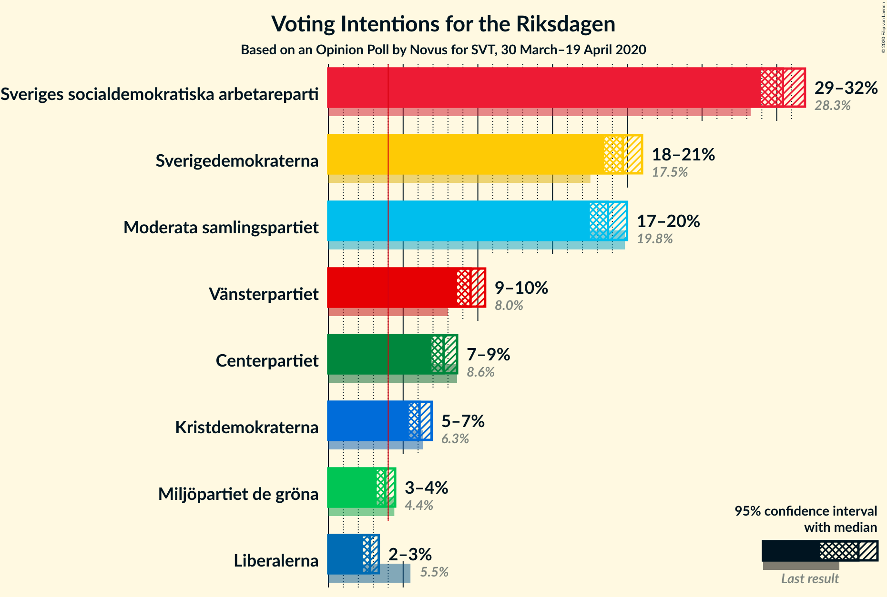

### Confidence Intervals

| Party | Last Result | Poll Result | 80% Confidence Interval | 90% Confidence Interval | 95% Confidence Interval | 99% Confidence Interval |
|:-----:|:-----------:|:-----------:|:-----------------------:|:-----------------------:|:-----------------------:|:-----------------------:|
| Sveriges socialdemokratiska arbetareparti | 28.3% | 30.4% | 29.5–31.4% |29.2–31.7% |29.0–31.9% |28.5–32.4% |
| Sverigedemokraterna | 17.5% | 19.7% | 18.9–20.5% |18.7–20.8% |18.5–21.0% |18.1–21.4% |
| Moderata samlingspartiet | 19.8% | 18.7% | 17.9–19.5% |17.7–19.8% |17.5–20.0% |17.1–20.4% |
| Vänsterpartiet | 8.0% | 9.5% | 8.9–10.2% |8.8–10.3% |8.6–10.5% |8.3–10.8% |
| Centerpartiet | 8.6% | 7.7% | 7.2–8.3% |7.0–8.5% |6.9–8.6% |6.7–8.9% |
| Kristdemokraterna | 6.3% | 6.1% | 5.6–6.6% |5.5–6.8% |5.4–6.9% |5.2–7.2% |
| Miljöpartiet de gröna | 4.4% | 3.8% | 3.4–4.2% |3.3–4.4% |3.2–4.5% |3.1–4.7% |
| Liberalerna | 5.5% | 2.8% | 2.5–3.2% |2.4–3.3% |2.3–3.4% |2.2–3.6% |

*Note:* The poll result column reflects the actual value used in the calculations. Published results may vary slightly, and in addition be rounded to fewer digits.

## Seats

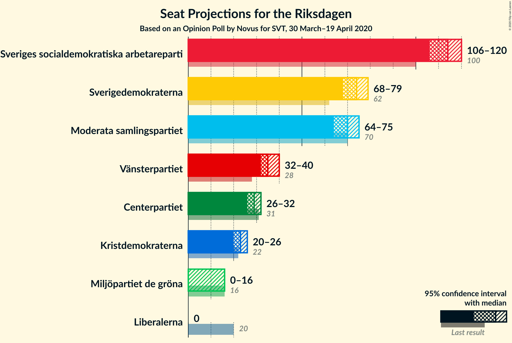

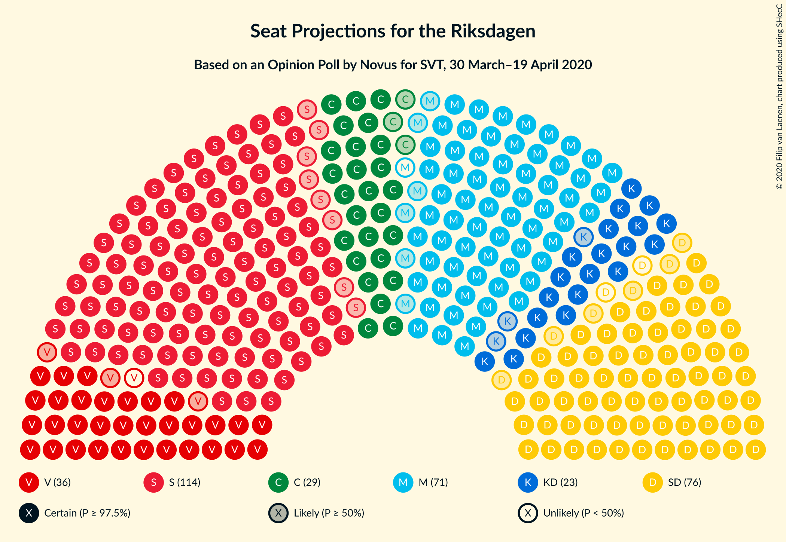

### Confidence Intervals

| Party | Last Result | Median | 80% Confidence Interval | 90% Confidence Interval | 95% Confidence Interval | 99% Confidence Interval |
|:-----:|:-----------:|:------:|:-----------------------:|:-----------------------:|:-----------------------:|:-----------------------:|
| <a href="#sveriges-socialdemokratiska-arbetareparti">Sveriges socialdemokratiska arbetareparti</a> | 100 | 114 | 109–118 |108–119 |106–120 |105–122 |
| <a href="#sverigedemokraterna">Sverigedemokraterna</a> | 62 | 74 | 70–77 |69–78 |68–79 |66–81 |
| <a href="#moderata-samlingspartiet">Moderata samlingspartiet</a> | 70 | 70 | 67–73 |66–74 |64–75 |63–77 |
| <a href="#vänsterpartiet">Vänsterpartiet</a> | 28 | 35 | 33–38 |32–39 |32–40 |31–41 |
| <a href="#centerpartiet">Centerpartiet</a> | 31 | 29 | 27–31 |26–32 |26–32 |25–34 |
| <a href="#kristdemokraterna">Kristdemokraterna</a> | 22 | 23 | 21–25 |20–25 |20–26 |19–27 |
| <a href="#miljöpartiet-de-gröna">Miljöpartiet de gröna</a> | 16 | 0 | 0–15 |0–16 |0–16 |0–17 |
| <a href="#liberalerna">Liberalerna</a> | 20 | 0 | 0 |0 |0 |0 |

### Sveriges socialdemokratiska arbetareparti

*For a full overview of the results for this party, see the [Sveriges socialdemokratiska arbetareparti](party-sverigessocialdemokratiskaarbetareparti.html) page.*

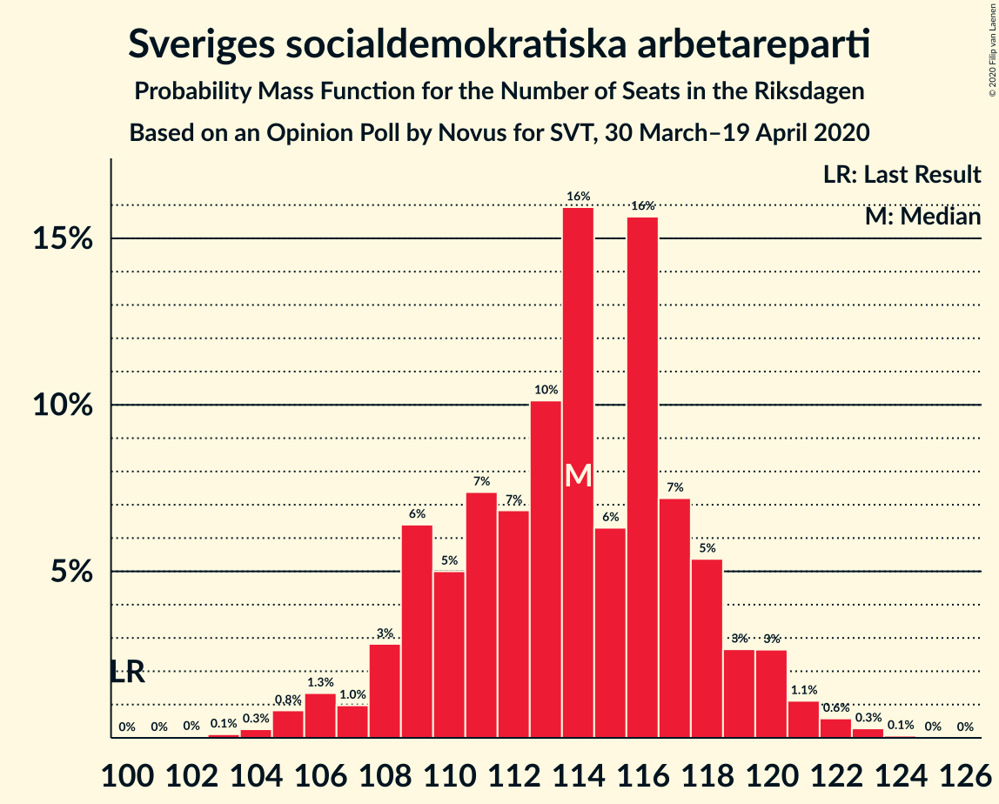

| Number of Seats | Probability | Accumulated | Special Marks |
|:---------------:|:-----------:|:-----------:|:-------------:|
| 100 | 0% | 100% | Last Result |
| 101 | 0% | 100% |  |
| 102 | 0% | 100% |  |
| 103 | 0.1% | 100% |  |
| 104 | 0.3% | 99.8% |  |
| 105 | 0.8% | 99.6% |  |
| 106 | 1.3% | 98.8% |  |
| 107 | 1.0% | 97% |  |
| 108 | 3% | 96% |  |
| 109 | 6% | 94% |  |
| 110 | 5% | 87% |  |
| 111 | 7% | 82% |  |
| 112 | 7% | 75% |  |
| 113 | 10% | 68% |  |
| 114 | 16% | 58% | Median |
| 115 | 6% | 42% |  |
| 116 | 16% | 36% |  |
| 117 | 7% | 20% |  |
| 118 | 5% | 13% |  |
| 119 | 3% | 7% |  |
| 120 | 3% | 5% |  |
| 121 | 1.1% | 2% |  |
| 122 | 0.6% | 1.0% |  |
| 123 | 0.3% | 0.4% |  |
| 124 | 0.1% | 0.1% |  |
| 125 | 0% | 0% |  |

### Sverigedemokraterna

*For a full overview of the results for this party, see the [Sverigedemokraterna](party-sverigedemokraterna.html) page.*

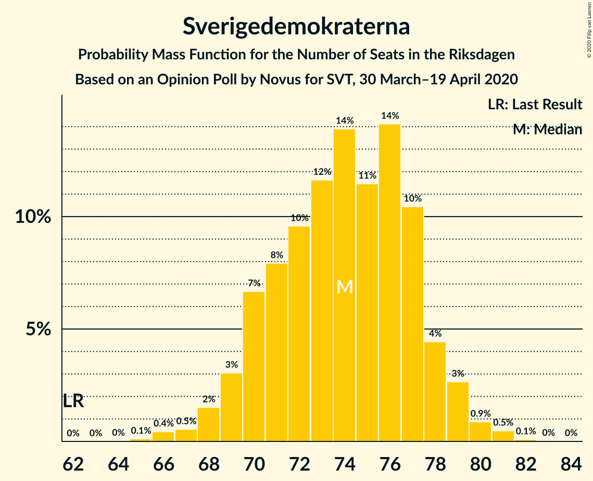

| Number of Seats | Probability | Accumulated | Special Marks |
|:---------------:|:-----------:|:-----------:|:-------------:|
| 62 | 0% | 100% | Last Result |
| 63 | 0% | 100% |  |
| 64 | 0% | 100% |  |
| 65 | 0.1% | 100% |  |
| 66 | 0.4% | 99.9% |  |
| 67 | 0.5% | 99.4% |  |
| 68 | 2% | 98.9% |  |
| 69 | 3% | 97% |  |
| 70 | 7% | 94% |  |
| 71 | 8% | 88% |  |
| 72 | 10% | 80% |  |
| 73 | 12% | 70% |  |
| 74 | 14% | 59% | Median |
| 75 | 11% | 45% |  |
| 76 | 14% | 33% |  |
| 77 | 10% | 19% |  |
| 78 | 4% | 9% |  |
| 79 | 3% | 4% |  |
| 80 | 0.9% | 1.5% |  |
| 81 | 0.5% | 0.6% |  |
| 82 | 0.1% | 0.1% |  |
| 83 | 0% | 0% |  |

### Moderata samlingspartiet

*For a full overview of the results for this party, see the [Moderata samlingspartiet](party-moderatasamlingspartiet.html) page.*

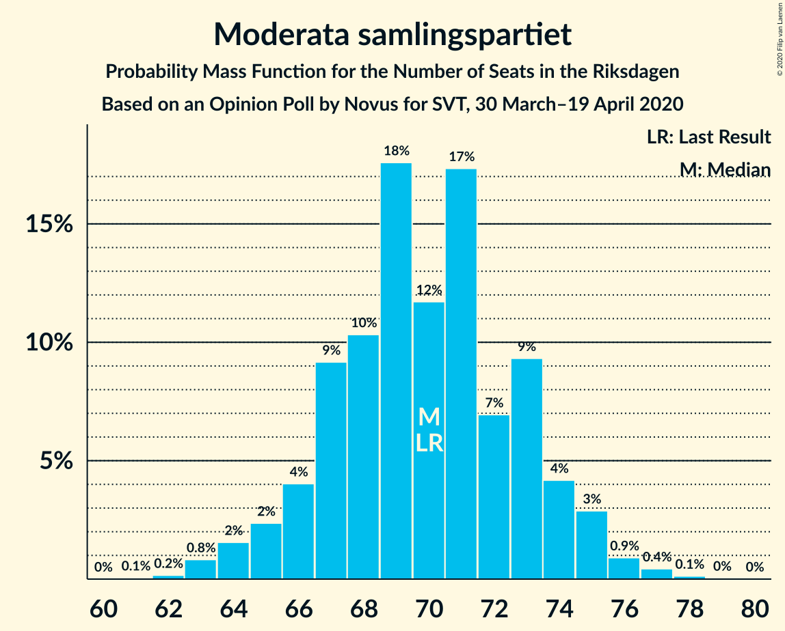

| Number of Seats | Probability | Accumulated | Special Marks |
|:---------------:|:-----------:|:-----------:|:-------------:|
| 61 | 0.1% | 100% |  |
| 62 | 0.2% | 99.9% |  |
| 63 | 0.8% | 99.8% |  |
| 64 | 2% | 98.9% |  |
| 65 | 2% | 97% |  |
| 66 | 4% | 95% |  |
| 67 | 9% | 91% |  |
| 68 | 10% | 82% |  |
| 69 | 18% | 72% |  |
| 70 | 12% | 54% | Last Result, Median |
| 71 | 17% | 42% |  |
| 72 | 7% | 25% |  |
| 73 | 9% | 18% |  |
| 74 | 4% | 9% |  |
| 75 | 3% | 4% |  |
| 76 | 0.9% | 2% |  |
| 77 | 0.4% | 0.6% |  |
| 78 | 0.1% | 0.2% |  |
| 79 | 0% | 0.1% |  |
| 80 | 0% | 0% |  |

### Vänsterpartiet

*For a full overview of the results for this party, see the [Vänsterpartiet](party-vänsterpartiet.html) page.*

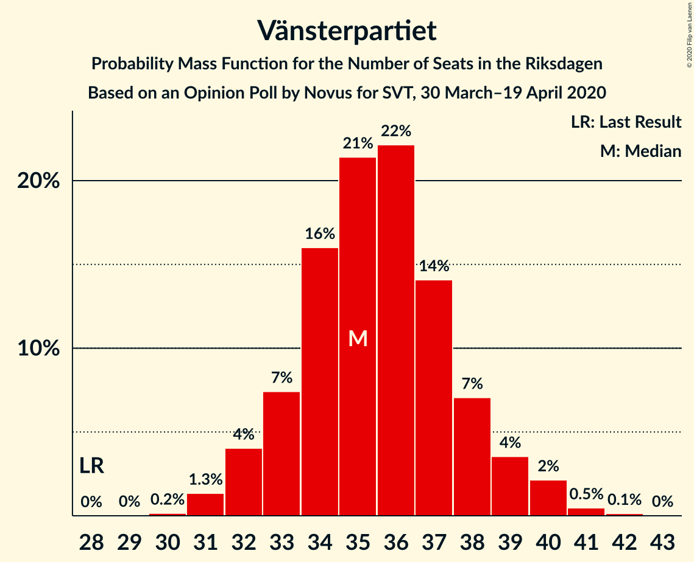

| Number of Seats | Probability | Accumulated | Special Marks |
|:---------------:|:-----------:|:-----------:|:-------------:|
| 28 | 0% | 100% | Last Result |
| 29 | 0% | 100% |  |
| 30 | 0.2% | 100% |  |
| 31 | 1.3% | 99.8% |  |
| 32 | 4% | 98% |  |
| 33 | 7% | 94% |  |
| 34 | 16% | 87% |  |
| 35 | 21% | 71% | Median |
| 36 | 22% | 50% |  |
| 37 | 14% | 27% |  |
| 38 | 7% | 13% |  |
| 39 | 4% | 6% |  |
| 40 | 2% | 3% |  |
| 41 | 0.5% | 0.6% |  |
| 42 | 0.1% | 0.2% |  |
| 43 | 0% | 0% |  |

### Centerpartiet

*For a full overview of the results for this party, see the [Centerpartiet](party-centerpartiet.html) page.*

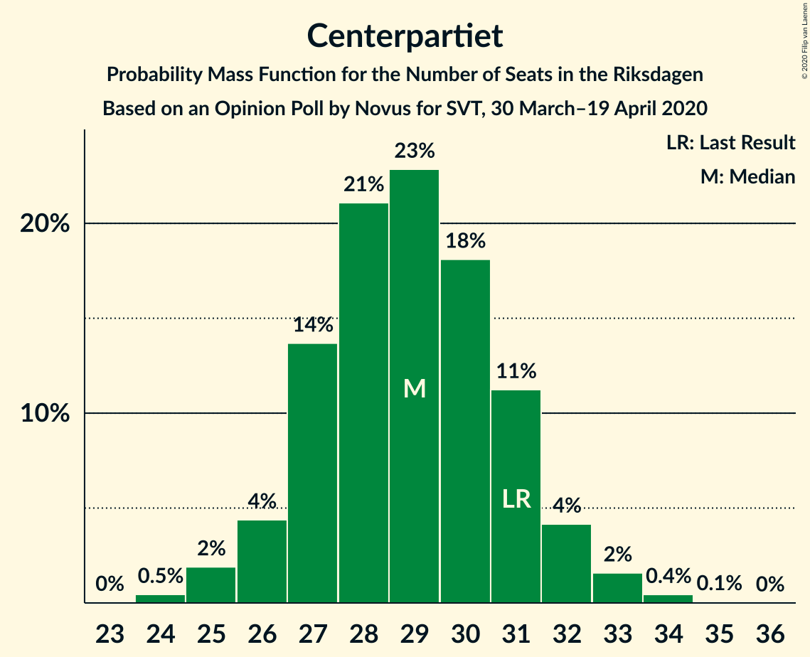

| Number of Seats | Probability | Accumulated | Special Marks |
|:---------------:|:-----------:|:-----------:|:-------------:|
| 24 | 0.5% | 100% |  |
| 25 | 2% | 99.5% |  |
| 26 | 4% | 98% |  |
| 27 | 14% | 93% |  |
| 28 | 21% | 80% |  |
| 29 | 23% | 58% | Median |
| 30 | 18% | 36% |  |
| 31 | 11% | 18% | Last Result |
| 32 | 4% | 6% |  |
| 33 | 2% | 2% |  |
| 34 | 0.4% | 0.5% |  |
| 35 | 0.1% | 0.1% |  |
| 36 | 0% | 0% |  |

### Kristdemokraterna

*For a full overview of the results for this party, see the [Kristdemokraterna](party-kristdemokraterna.html) page.*

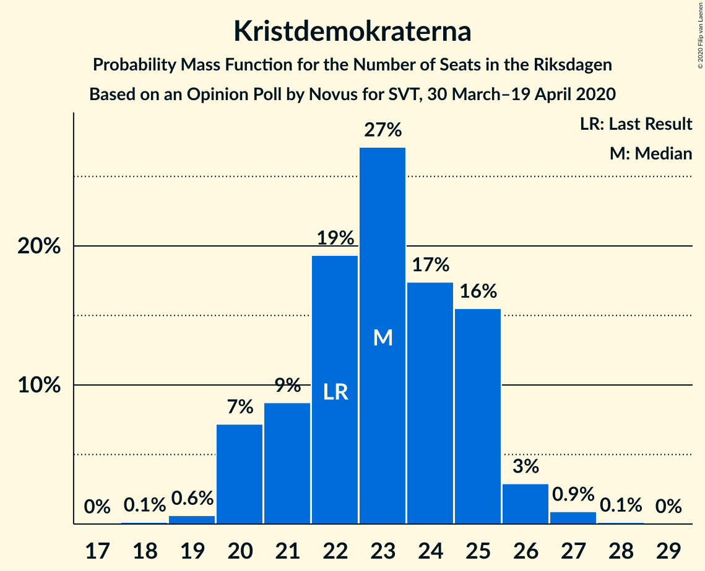

| Number of Seats | Probability | Accumulated | Special Marks |
|:---------------:|:-----------:|:-----------:|:-------------:|
| 18 | 0.1% | 100% |  |
| 19 | 0.6% | 99.9% |  |
| 20 | 7% | 99.2% |  |
| 21 | 9% | 92% |  |
| 22 | 19% | 83% | Last Result |
| 23 | 27% | 64% | Median |
| 24 | 17% | 37% |  |
| 25 | 16% | 19% |  |
| 26 | 3% | 4% |  |
| 27 | 0.9% | 1.0% |  |
| 28 | 0.1% | 0.2% |  |
| 29 | 0% | 0% |  |

### Miljöpartiet de gröna

*For a full overview of the results for this party, see the [Miljöpartiet de gröna](party-miljöpartietdegröna.html) page.*

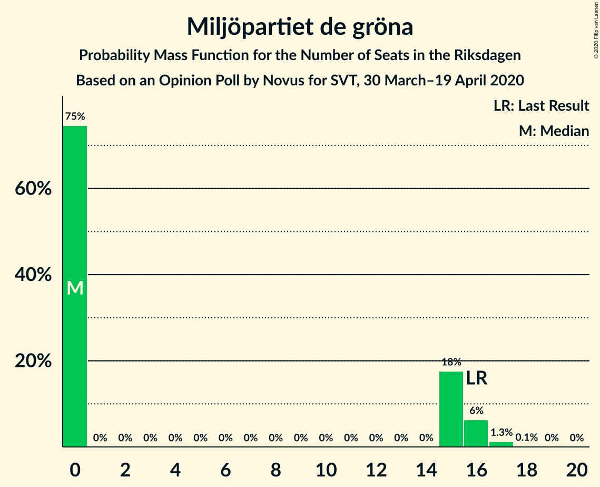

| Number of Seats | Probability | Accumulated | Special Marks |
|:---------------:|:-----------:|:-----------:|:-------------:|
| 0 | 75% | 100% | Median |
| 1 | 0% | 25% |  |
| 2 | 0% | 25% |  |
| 3 | 0% | 25% |  |
| 4 | 0% | 25% |  |
| 5 | 0% | 25% |  |
| 6 | 0% | 25% |  |
| 7 | 0% | 25% |  |
| 8 | 0% | 25% |  |
| 9 | 0% | 25% |  |
| 10 | 0% | 25% |  |
| 11 | 0% | 25% |  |
| 12 | 0% | 25% |  |
| 13 | 0% | 25% |  |
| 14 | 0% | 25% |  |
| 15 | 18% | 25% |  |
| 16 | 6% | 8% | Last Result |
| 17 | 1.3% | 1.4% |  |
| 18 | 0.1% | 0.1% |  |
| 19 | 0% | 0% |  |

### Liberalerna

*For a full overview of the results for this party, see the [Liberalerna](party-liberalerna.html) page.*

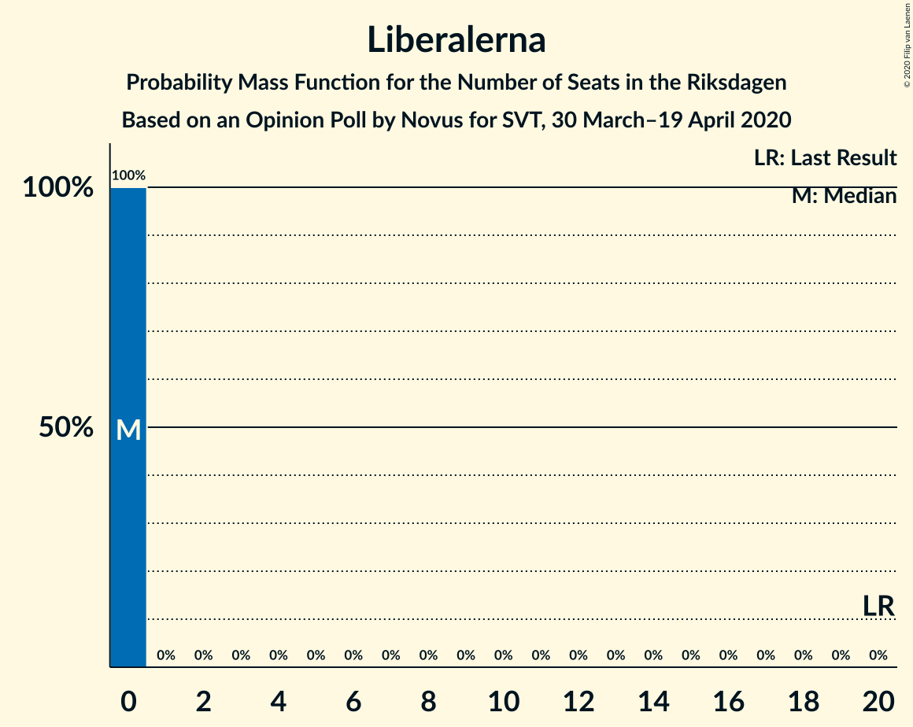

| Number of Seats | Probability | Accumulated | Special Marks |
|:---------------:|:-----------:|:-----------:|:-------------:|
| 0 | 100% | 100% | Median |
| 1 | 0% | 0% |  |
| 2 | 0% | 0% |  |
| 3 | 0% | 0% |  |
| 4 | 0% | 0% |  |
| 5 | 0% | 0% |  |
| 6 | 0% | 0% |  |
| 7 | 0% | 0% |  |
| 8 | 0% | 0% |  |
| 9 | 0% | 0% |  |
| 10 | 0% | 0% |  |
| 11 | 0% | 0% |  |
| 12 | 0% | 0% |  |
| 13 | 0% | 0% |  |
| 14 | 0% | 0% |  |
| 15 | 0% | 0% |  |
| 16 | 0% | 0% |  |
| 17 | 0% | 0% |  |
| 18 | 0% | 0% |  |
| 19 | 0% | 0% |  |
| 20 | 0% | 0% | Last Result |

## Coalitions

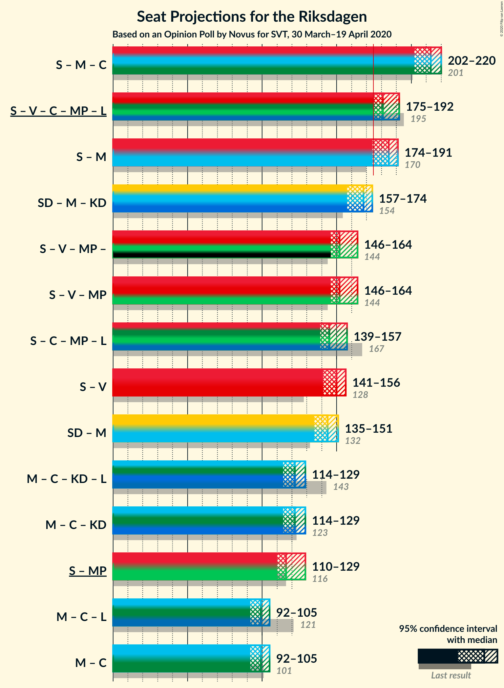

### Confidence Intervals

| Coalition | Last Result | Median | Majority? | 80% Confidence Interval | 90% Confidence Interval | 95% Confidence Interval | 99% Confidence Interval |
|:---------:|:-----------:|:------:|:---------:|:-----------------------:|:-----------------------:|:-----------------------:|:-----------------------:|
| Sveriges socialdemokratiska arbetareparti – Moderata samlingspartiet – Centerpartiet | 201 | 213 | 100% | 206–218 | 204–219 | 202–220 | 200–222 |
| Sveriges socialdemokratiska arbetareparti – Vänsterpartiet – Centerpartiet – Miljöpartiet de gröna – Liberalerna | 195 | 181 | 98% | 177–189 | 176–191 | 175–192 | 173–194 |
| Sveriges socialdemokratiska arbetareparti – Moderata samlingspartiet | 170 | 185 | 97% | 178–189 | 176–191 | 174–191 | 172–193 |
| Sverigedemokraterna – Moderata samlingspartiet – Kristdemokraterna | 154 | 168 | 2% | 160–172 | 158–173 | 157–174 | 155–176 |
| Sveriges socialdemokratiska arbetareparti – Vänsterpartiet – Miljöpartiet de gröna | 144 | 152 | 0% | 148–161 | 147–162 | 146–164 | 144–166 |
| Sveriges socialdemokratiska arbetareparti – Centerpartiet – Miljöpartiet de gröna – Liberalerna | 167 | 145 | 0% | 141–154 | 140–156 | 139–157 | 137–159 |
| Sveriges socialdemokratiska arbetareparti – Vänsterpartiet | 128 | 150 | 0% | 144–154 | 142–155 | 141–156 | 139–158 |
| Sverigedemokraterna – Moderata samlingspartiet | 132 | 144 | 0% | 138–148 | 136–150 | 135–151 | 133–152 |
| Moderata samlingspartiet – Centerpartiet – Kristdemokraterna – Liberalerna | 143 | 122 | 0% | 117–126 | 116–128 | 114–129 | 112–130 |
| Moderata samlingspartiet – Centerpartiet – Kristdemokraterna | 123 | 122 | 0% | 117–126 | 116–128 | 114–129 | 112–130 |
| Sveriges socialdemokratiska arbetareparti – Miljöpartiet de gröna | 116 | 116 | 0% | 112–126 | 111–128 | 110–129 | 108–131 |
| Moderata samlingspartiet – Centerpartiet – Liberalerna | 121 | 99 | 0% | 95–103 | 94–104 | 92–105 | 90–106 |
| Moderata samlingspartiet – Centerpartiet | 101 | 99 | 0% | 95–103 | 94–104 | 92–105 | 90–106 |

### Sveriges socialdemokratiska arbetareparti – Moderata samlingspartiet – Centerpartiet

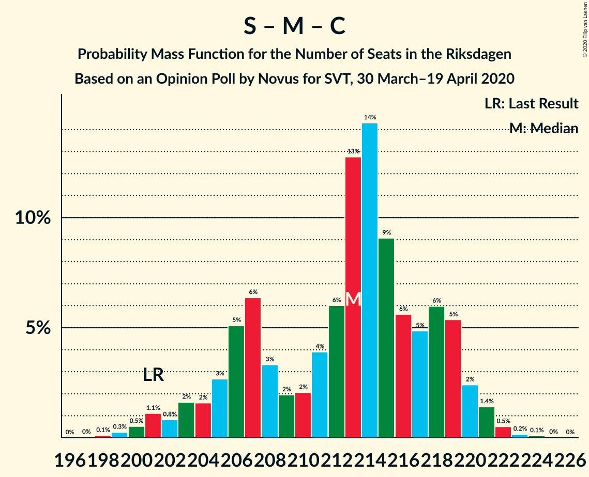

| Number of Seats | Probability | Accumulated | Special Marks |
|:---------------:|:-----------:|:-----------:|:-------------:|
| 198 | 0.1% | 100% |  |
| 199 | 0.3% | 99.9% |  |
| 200 | 0.5% | 99.6% |  |
| 201 | 1.1% | 99.1% | Last Result |
| 202 | 0.8% | 98% |  |
| 203 | 2% | 97% |  |
| 204 | 2% | 96% |  |
| 205 | 3% | 94% |  |
| 206 | 5% | 91% |  |
| 207 | 6% | 86% |  |
| 208 | 3% | 80% |  |
| 209 | 2% | 76% |  |
| 210 | 2% | 75% |  |
| 211 | 4% | 72% |  |
| 212 | 6% | 69% |  |
| 213 | 13% | 63% | Median |
| 214 | 14% | 50% |  |
| 215 | 9% | 35% |  |
| 216 | 6% | 26% |  |
| 217 | 5% | 21% |  |
| 218 | 6% | 16% |  |
| 219 | 5% | 10% |  |
| 220 | 2% | 5% |  |
| 221 | 1.4% | 2% |  |
| 222 | 0.5% | 0.8% |  |
| 223 | 0.2% | 0.3% |  |
| 224 | 0.1% | 0.1% |  |
| 225 | 0% | 0% |  |

### Sveriges socialdemokratiska arbetareparti – Vänsterpartiet – Centerpartiet – Miljöpartiet de gröna – Liberalerna

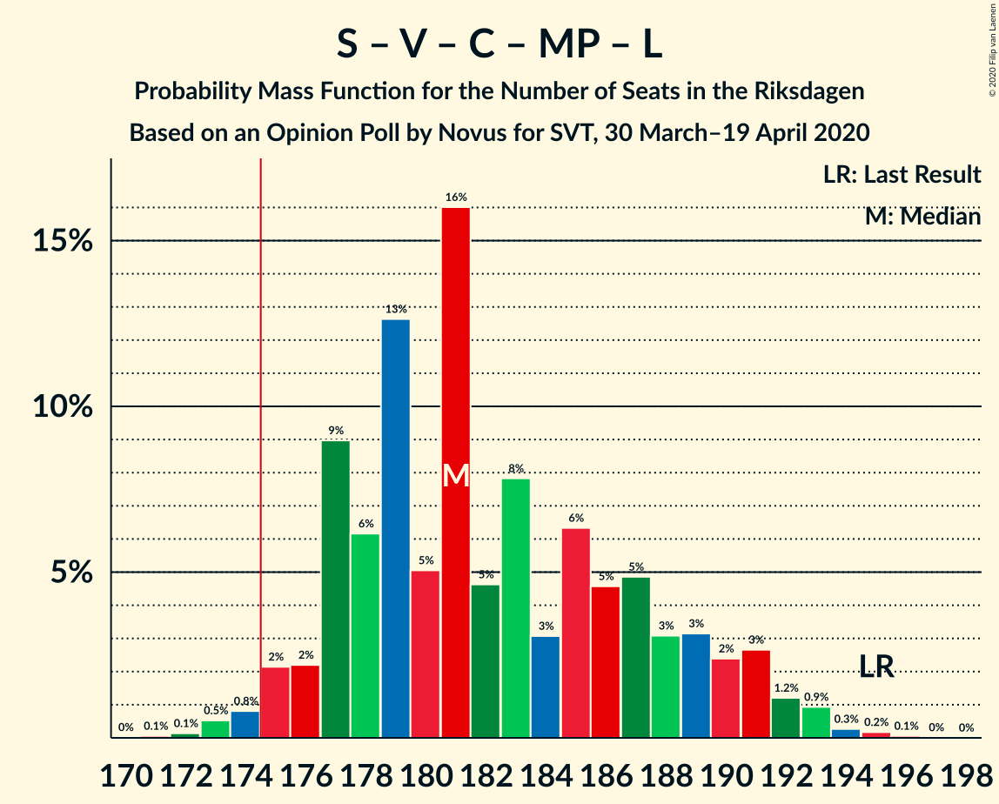

| Number of Seats | Probability | Accumulated | Special Marks |
|:---------------:|:-----------:|:-----------:|:-------------:|
| 171 | 0.1% | 100% |  |
| 172 | 0.1% | 99.9% |  |
| 173 | 0.5% | 99.8% |  |
| 174 | 0.8% | 99.2% |  |
| 175 | 2% | 98% | Majority |
| 176 | 2% | 96% |  |
| 177 | 9% | 94% |  |
| 178 | 6% | 85% | Median |
| 179 | 13% | 79% |  |
| 180 | 5% | 66% |  |
| 181 | 16% | 61% |  |
| 182 | 5% | 45% |  |
| 183 | 8% | 41% |  |
| 184 | 3% | 33% |  |
| 185 | 6% | 30% |  |
| 186 | 5% | 23% |  |
| 187 | 5% | 19% |  |
| 188 | 3% | 14% |  |
| 189 | 3% | 11% |  |
| 190 | 2% | 8% |  |
| 191 | 3% | 5% |  |
| 192 | 1.2% | 3% |  |
| 193 | 0.9% | 1.5% |  |
| 194 | 0.3% | 0.5% |  |
| 195 | 0.2% | 0.3% | Last Result |
| 196 | 0.1% | 0.1% |  |
| 197 | 0% | 0% |  |

### Sveriges socialdemokratiska arbetareparti – Moderata samlingspartiet

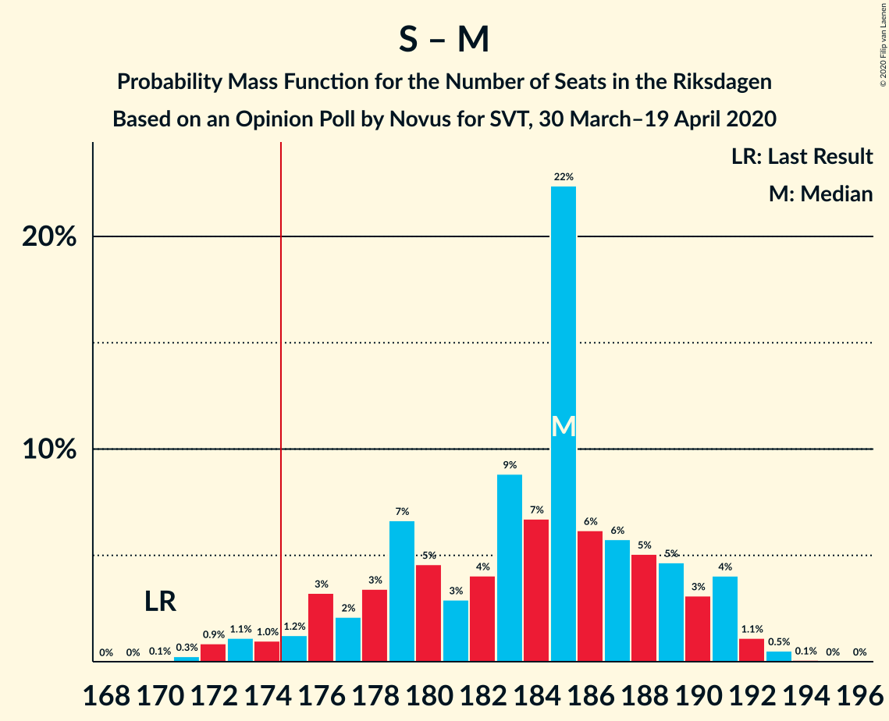

| Number of Seats | Probability | Accumulated | Special Marks |
|:---------------:|:-----------:|:-----------:|:-------------:|
| 170 | 0.1% | 100% | Last Result |
| 171 | 0.3% | 99.9% |  |
| 172 | 0.9% | 99.7% |  |
| 173 | 1.1% | 98.8% |  |
| 174 | 1.0% | 98% |  |
| 175 | 1.2% | 97% | Majority |
| 176 | 3% | 95% |  |
| 177 | 2% | 92% |  |
| 178 | 3% | 90% |  |
| 179 | 7% | 87% |  |
| 180 | 5% | 80% |  |
| 181 | 3% | 75% |  |
| 182 | 4% | 73% |  |
| 183 | 9% | 69% |  |
| 184 | 7% | 60% | Median |
| 185 | 22% | 53% |  |
| 186 | 6% | 31% |  |
| 187 | 6% | 24% |  |
| 188 | 5% | 19% |  |
| 189 | 5% | 14% |  |
| 190 | 3% | 9% |  |
| 191 | 4% | 6% |  |
| 192 | 1.1% | 2% |  |
| 193 | 0.5% | 0.7% |  |
| 194 | 0.1% | 0.2% |  |
| 195 | 0% | 0.1% |  |
| 196 | 0% | 0% |  |

### Sverigedemokraterna – Moderata samlingspartiet – Kristdemokraterna

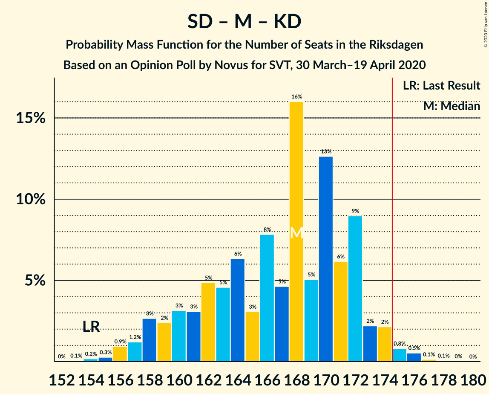

| Number of Seats | Probability | Accumulated | Special Marks |
|:---------------:|:-----------:|:-----------:|:-------------:|
| 153 | 0.1% | 100% |  |
| 154 | 0.2% | 99.9% | Last Result |
| 155 | 0.3% | 99.7% |  |
| 156 | 0.9% | 99.5% |  |
| 157 | 1.2% | 98.5% |  |
| 158 | 3% | 97% |  |
| 159 | 2% | 95% |  |
| 160 | 3% | 92% |  |
| 161 | 3% | 89% |  |
| 162 | 5% | 86% |  |
| 163 | 5% | 81% |  |
| 164 | 6% | 77% |  |
| 165 | 3% | 70% |  |
| 166 | 8% | 67% |  |
| 167 | 5% | 59% | Median |
| 168 | 16% | 55% |  |
| 169 | 5% | 39% |  |
| 170 | 13% | 34% |  |
| 171 | 6% | 21% |  |
| 172 | 9% | 15% |  |
| 173 | 2% | 6% |  |
| 174 | 2% | 4% |  |
| 175 | 0.8% | 2% | Majority |
| 176 | 0.5% | 0.8% |  |
| 177 | 0.1% | 0.2% |  |
| 178 | 0.1% | 0.1% |  |
| 179 | 0% | 0% |  |

### Sveriges socialdemokratiska arbetareparti – Vänsterpartiet – Miljöpartiet de gröna

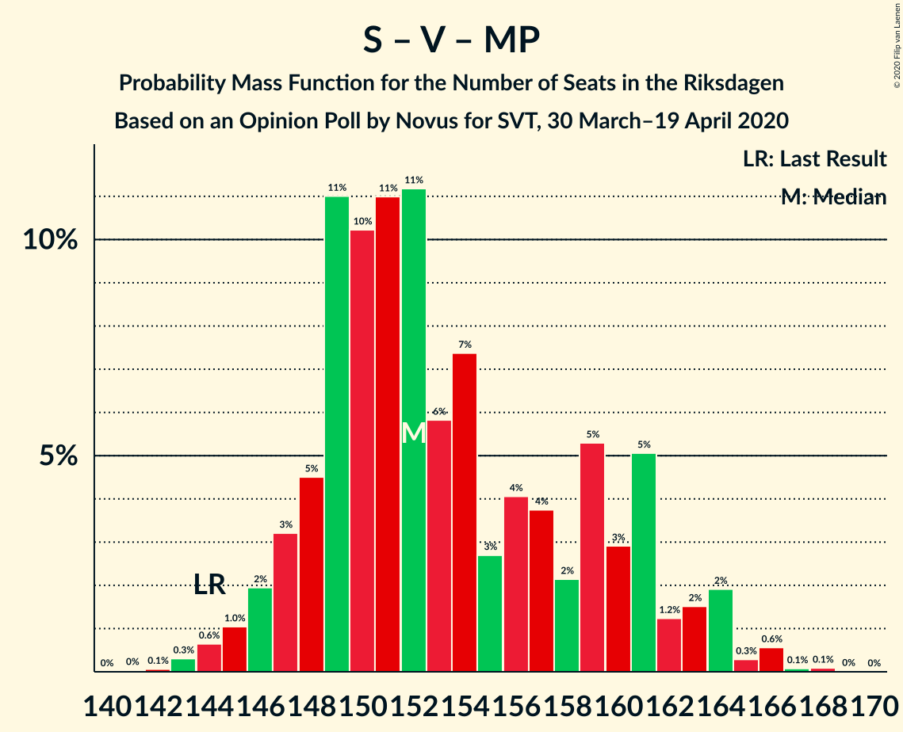

| Number of Seats | Probability | Accumulated | Special Marks |
|:---------------:|:-----------:|:-----------:|:-------------:|
| 142 | 0.1% | 100% |  |
| 143 | 0.3% | 99.9% |  |
| 144 | 0.6% | 99.6% | Last Result |
| 145 | 1.0% | 98.9% |  |
| 146 | 2% | 98% |  |
| 147 | 3% | 96% |  |
| 148 | 5% | 93% |  |
| 149 | 11% | 88% | Median |
| 150 | 10% | 77% |  |
| 151 | 11% | 67% |  |
| 152 | 11% | 56% |  |
| 153 | 6% | 45% |  |
| 154 | 7% | 39% |  |
| 155 | 3% | 32% |  |
| 156 | 4% | 29% |  |
| 157 | 4% | 25% |  |
| 158 | 2% | 21% |  |
| 159 | 5% | 19% |  |
| 160 | 3% | 14% |  |
| 161 | 5% | 11% |  |
| 162 | 1.2% | 6% |  |
| 163 | 2% | 4% |  |
| 164 | 2% | 3% |  |
| 165 | 0.3% | 1.0% |  |
| 166 | 0.6% | 0.7% |  |
| 167 | 0.1% | 0.2% |  |
| 168 | 0.1% | 0.1% |  |
| 169 | 0% | 0% |  |

### Sveriges socialdemokratiska arbetareparti – Centerpartiet – Miljöpartiet de gröna – Liberalerna

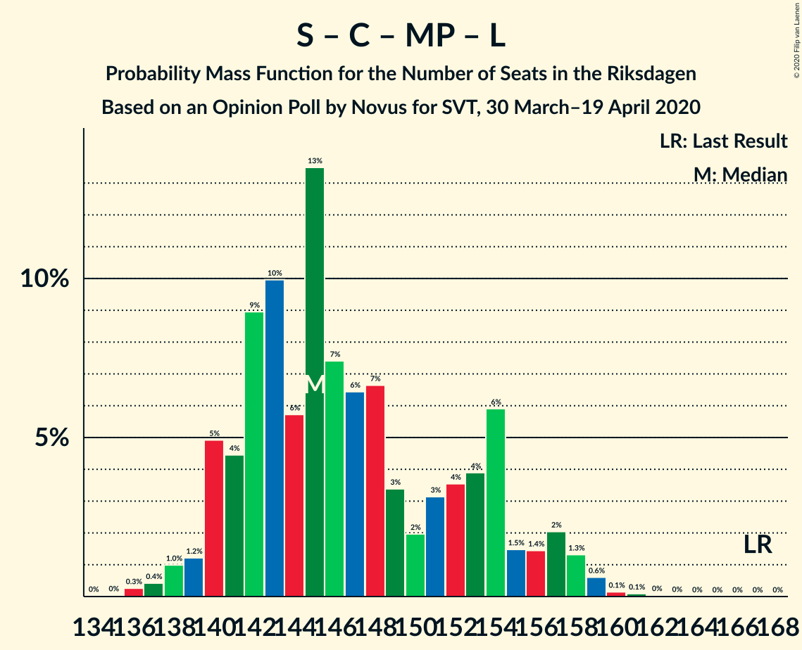

| Number of Seats | Probability | Accumulated | Special Marks |
|:---------------:|:-----------:|:-----------:|:-------------:|
| 135 | 0% | 100% |  |
| 136 | 0.3% | 99.9% |  |
| 137 | 0.4% | 99.7% |  |
| 138 | 1.0% | 99.3% |  |
| 139 | 1.2% | 98% |  |
| 140 | 5% | 97% |  |
| 141 | 4% | 92% |  |
| 142 | 9% | 88% |  |
| 143 | 10% | 79% | Median |
| 144 | 6% | 69% |  |
| 145 | 13% | 63% |  |
| 146 | 7% | 50% |  |
| 147 | 6% | 42% |  |
| 148 | 7% | 36% |  |
| 149 | 3% | 29% |  |
| 150 | 2% | 26% |  |
| 151 | 3% | 24% |  |
| 152 | 4% | 21% |  |
| 153 | 4% | 17% |  |
| 154 | 6% | 13% |  |
| 155 | 1.5% | 7% |  |
| 156 | 1.4% | 6% |  |
| 157 | 2% | 4% |  |
| 158 | 1.3% | 2% |  |
| 159 | 0.6% | 0.9% |  |
| 160 | 0.1% | 0.3% |  |
| 161 | 0.1% | 0.2% |  |
| 162 | 0% | 0.1% |  |
| 163 | 0% | 0% |  |
| 164 | 0% | 0% |  |
| 165 | 0% | 0% |  |
| 166 | 0% | 0% |  |
| 167 | 0% | 0% | Last Result |

### Sveriges socialdemokratiska arbetareparti – Vänsterpartiet

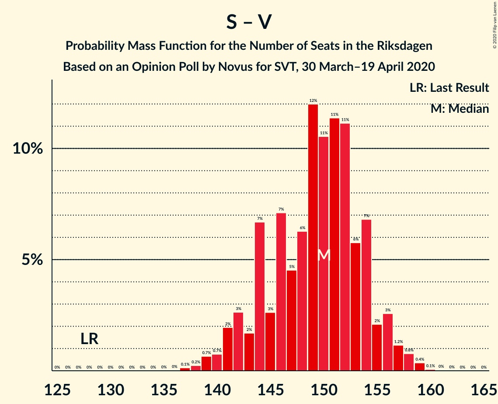

| Number of Seats | Probability | Accumulated | Special Marks |
|:---------------:|:-----------:|:-----------:|:-------------:|
| 128 | 0% | 100% | Last Result |
| 129 | 0% | 100% |  |
| 130 | 0% | 100% |  |
| 131 | 0% | 100% |  |
| 132 | 0% | 100% |  |
| 133 | 0% | 100% |  |
| 134 | 0% | 100% |  |
| 135 | 0% | 100% |  |
| 136 | 0% | 100% |  |
| 137 | 0.1% | 100% |  |
| 138 | 0.2% | 99.8% |  |
| 139 | 0.7% | 99.6% |  |
| 140 | 0.7% | 98.9% |  |
| 141 | 2% | 98% |  |
| 142 | 3% | 96% |  |
| 143 | 2% | 94% |  |
| 144 | 7% | 92% |  |
| 145 | 3% | 85% |  |
| 146 | 7% | 83% |  |
| 147 | 5% | 75% |  |
| 148 | 6% | 71% |  |
| 149 | 12% | 65% | Median |
| 150 | 11% | 53% |  |
| 151 | 11% | 42% |  |
| 152 | 11% | 31% |  |
| 153 | 6% | 20% |  |
| 154 | 7% | 14% |  |
| 155 | 2% | 7% |  |
| 156 | 3% | 5% |  |
| 157 | 1.2% | 2% |  |
| 158 | 0.8% | 1.2% |  |
| 159 | 0.4% | 0.5% |  |
| 160 | 0.1% | 0.1% |  |
| 161 | 0% | 0.1% |  |
| 162 | 0% | 0% |  |

### Sverigedemokraterna – Moderata samlingspartiet

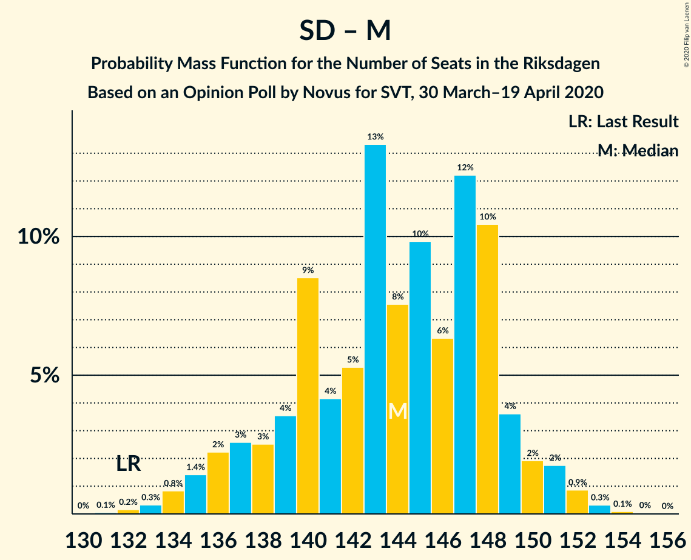

| Number of Seats | Probability | Accumulated | Special Marks |
|:---------------:|:-----------:|:-----------:|:-------------:|
| 131 | 0.1% | 100% |  |
| 132 | 0.2% | 99.9% | Last Result |
| 133 | 0.3% | 99.8% |  |
| 134 | 0.8% | 99.4% |  |
| 135 | 1.4% | 98.6% |  |
| 136 | 2% | 97% |  |
| 137 | 3% | 95% |  |
| 138 | 3% | 92% |  |
| 139 | 4% | 90% |  |
| 140 | 9% | 86% |  |
| 141 | 4% | 78% |  |
| 142 | 5% | 74% |  |
| 143 | 13% | 68% |  |
| 144 | 8% | 55% | Median |
| 145 | 10% | 47% |  |
| 146 | 6% | 38% |  |
| 147 | 12% | 31% |  |
| 148 | 10% | 19% |  |
| 149 | 4% | 9% |  |
| 150 | 2% | 5% |  |
| 151 | 2% | 3% |  |
| 152 | 0.9% | 1.3% |  |
| 153 | 0.3% | 0.5% |  |
| 154 | 0.1% | 0.2% |  |
| 155 | 0% | 0.1% |  |
| 156 | 0% | 0% |  |

### Moderata samlingspartiet – Centerpartiet – Kristdemokraterna – Liberalerna

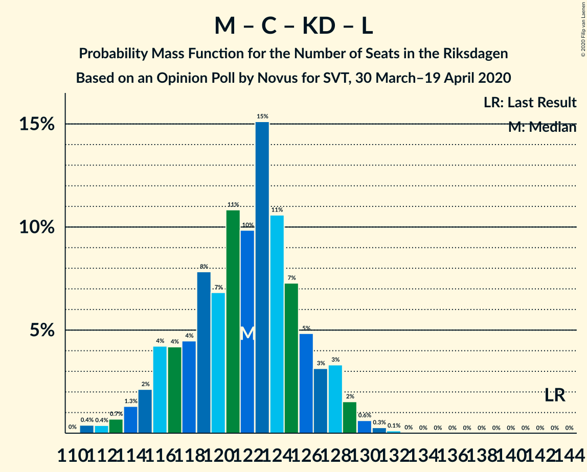

| Number of Seats | Probability | Accumulated | Special Marks |
|:---------------:|:-----------:|:-----------:|:-------------:|
| 110 | 0% | 100% |  |
| 111 | 0.4% | 99.9% |  |
| 112 | 0.4% | 99.5% |  |
| 113 | 0.7% | 99.2% |  |
| 114 | 1.3% | 98% |  |
| 115 | 2% | 97% |  |
| 116 | 4% | 95% |  |
| 117 | 4% | 91% |  |
| 118 | 4% | 87% |  |
| 119 | 8% | 82% |  |
| 120 | 7% | 74% |  |
| 121 | 11% | 68% |  |
| 122 | 10% | 57% | Median |
| 123 | 15% | 47% |  |
| 124 | 11% | 32% |  |
| 125 | 7% | 21% |  |
| 126 | 5% | 14% |  |
| 127 | 3% | 9% |  |
| 128 | 3% | 6% |  |
| 129 | 2% | 3% |  |
| 130 | 0.6% | 1.0% |  |
| 131 | 0.3% | 0.4% |  |
| 132 | 0.1% | 0.2% |  |
| 133 | 0% | 0% |  |
| 134 | 0% | 0% |  |
| 135 | 0% | 0% |  |
| 136 | 0% | 0% |  |
| 137 | 0% | 0% |  |
| 138 | 0% | 0% |  |
| 139 | 0% | 0% |  |
| 140 | 0% | 0% |  |
| 141 | 0% | 0% |  |
| 142 | 0% | 0% |  |
| 143 | 0% | 0% | Last Result |

### Moderata samlingspartiet – Centerpartiet – Kristdemokraterna

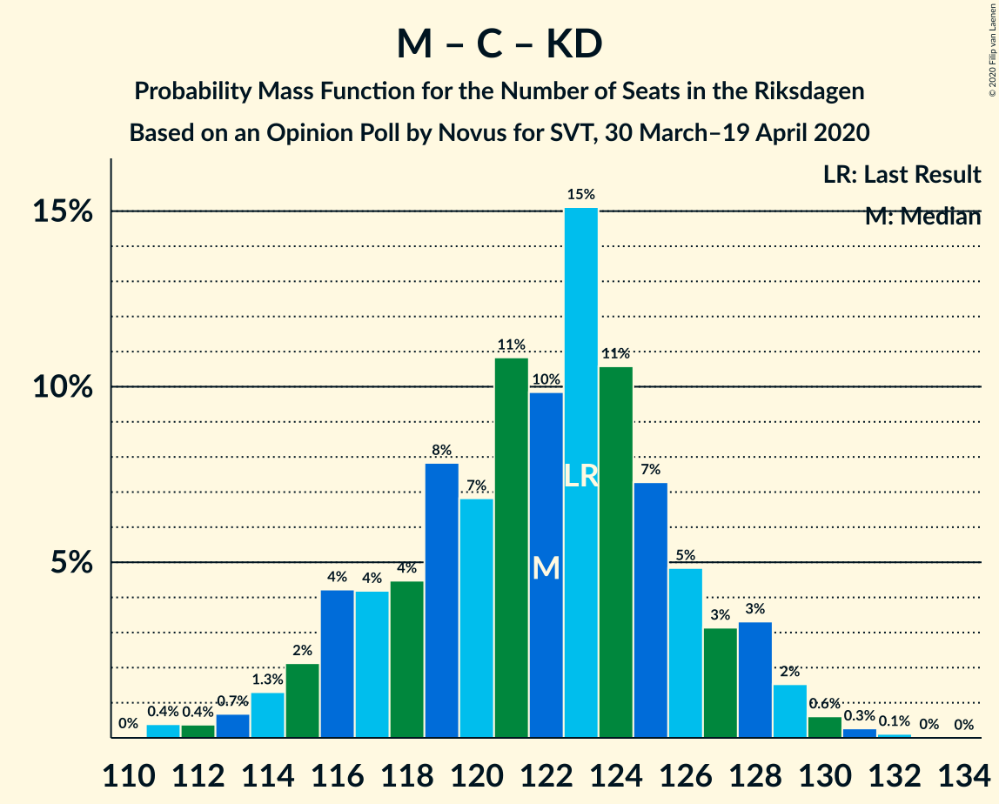

| Number of Seats | Probability | Accumulated | Special Marks |
|:---------------:|:-----------:|:-----------:|:-------------:|
| 110 | 0% | 100% |  |
| 111 | 0.4% | 99.9% |  |
| 112 | 0.4% | 99.5% |  |
| 113 | 0.7% | 99.2% |  |
| 114 | 1.3% | 98% |  |
| 115 | 2% | 97% |  |
| 116 | 4% | 95% |  |
| 117 | 4% | 91% |  |
| 118 | 4% | 87% |  |
| 119 | 8% | 82% |  |
| 120 | 7% | 74% |  |
| 121 | 11% | 68% |  |
| 122 | 10% | 57% | Median |
| 123 | 15% | 47% | Last Result |
| 124 | 11% | 32% |  |
| 125 | 7% | 21% |  |
| 126 | 5% | 14% |  |
| 127 | 3% | 9% |  |
| 128 | 3% | 6% |  |
| 129 | 2% | 3% |  |
| 130 | 0.6% | 1.0% |  |
| 131 | 0.3% | 0.4% |  |
| 132 | 0.1% | 0.2% |  |
| 133 | 0% | 0% |  |

### Sveriges socialdemokratiska arbetareparti – Miljöpartiet de gröna

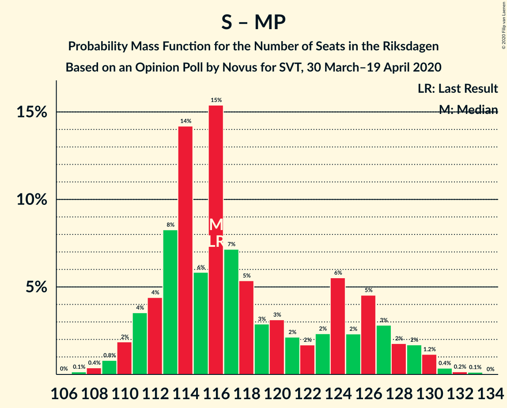

| Number of Seats | Probability | Accumulated | Special Marks |
|:---------------:|:-----------:|:-----------:|:-------------:|
| 106 | 0% | 100% |  |
| 107 | 0.1% | 99.9% |  |
| 108 | 0.4% | 99.8% |  |
| 109 | 0.8% | 99.4% |  |
| 110 | 2% | 98.6% |  |
| 111 | 4% | 97% |  |
| 112 | 4% | 93% |  |
| 113 | 8% | 89% |  |
| 114 | 14% | 81% | Median |
| 115 | 6% | 66% |  |
| 116 | 15% | 61% | Last Result |
| 117 | 7% | 45% |  |
| 118 | 5% | 38% |  |
| 119 | 3% | 33% |  |
| 120 | 3% | 30% |  |
| 121 | 2% | 27% |  |
| 122 | 2% | 24% |  |
| 123 | 2% | 23% |  |
| 124 | 6% | 20% |  |
| 125 | 2% | 15% |  |
| 126 | 5% | 13% |  |
| 127 | 3% | 8% |  |
| 128 | 2% | 5% |  |
| 129 | 2% | 4% |  |
| 130 | 1.2% | 2% |  |
| 131 | 0.4% | 0.7% |  |
| 132 | 0.2% | 0.3% |  |
| 133 | 0.1% | 0.2% |  |
| 134 | 0% | 0% |  |

### Moderata samlingspartiet – Centerpartiet – Liberalerna

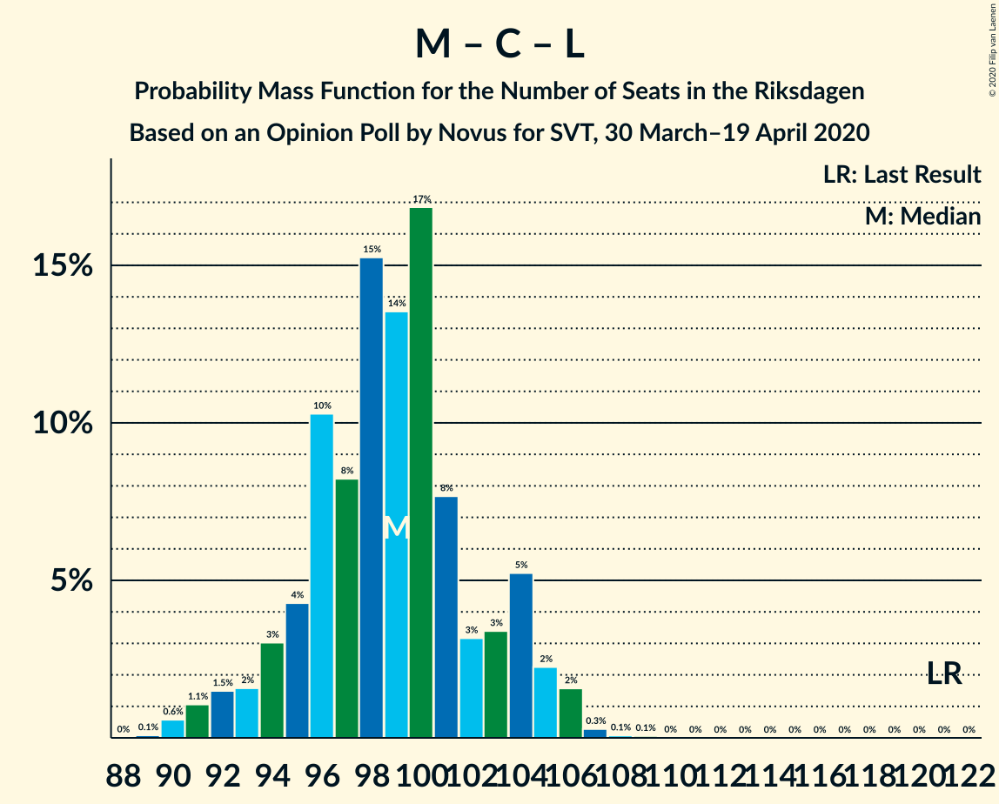

| Number of Seats | Probability | Accumulated | Special Marks |
|:---------------:|:-----------:|:-----------:|:-------------:|
| 89 | 0.1% | 100% |  |
| 90 | 0.6% | 99.9% |  |
| 91 | 1.1% | 99.3% |  |
| 92 | 1.5% | 98% |  |
| 93 | 2% | 97% |  |
| 94 | 3% | 95% |  |
| 95 | 4% | 92% |  |
| 96 | 10% | 88% |  |
| 97 | 8% | 78% |  |
| 98 | 15% | 69% |  |
| 99 | 14% | 54% | Median |
| 100 | 17% | 41% |  |
| 101 | 8% | 24% |  |
| 102 | 3% | 16% |  |
| 103 | 3% | 13% |  |
| 104 | 5% | 9% |  |
| 105 | 2% | 4% |  |
| 106 | 2% | 2% |  |
| 107 | 0.3% | 0.4% |  |
| 108 | 0.1% | 0.2% |  |
| 109 | 0.1% | 0.1% |  |
| 110 | 0% | 0% |  |
| 111 | 0% | 0% |  |
| 112 | 0% | 0% |  |
| 113 | 0% | 0% |  |
| 114 | 0% | 0% |  |
| 115 | 0% | 0% |  |
| 116 | 0% | 0% |  |
| 117 | 0% | 0% |  |
| 118 | 0% | 0% |  |
| 119 | 0% | 0% |  |
| 120 | 0% | 0% |  |
| 121 | 0% | 0% | Last Result |

### Moderata samlingspartiet – Centerpartiet

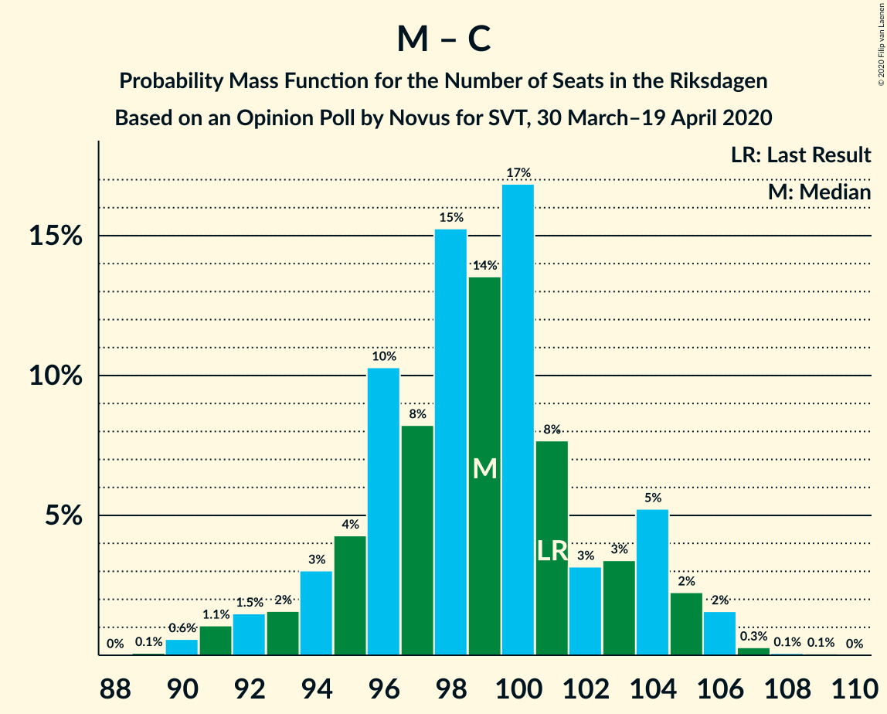

| Number of Seats | Probability | Accumulated | Special Marks |
|:---------------:|:-----------:|:-----------:|:-------------:|
| 89 | 0.1% | 100% |  |
| 90 | 0.6% | 99.9% |  |
| 91 | 1.1% | 99.3% |  |
| 92 | 1.5% | 98% |  |
| 93 | 2% | 97% |  |
| 94 | 3% | 95% |  |
| 95 | 4% | 92% |  |
| 96 | 10% | 88% |  |
| 97 | 8% | 78% |  |
| 98 | 15% | 69% |  |
| 99 | 14% | 54% | Median |
| 100 | 17% | 41% |  |
| 101 | 8% | 24% | Last Result |
| 102 | 3% | 16% |  |
| 103 | 3% | 13% |  |
| 104 | 5% | 9% |  |
| 105 | 2% | 4% |  |
| 106 | 2% | 2% |  |
| 107 | 0.3% | 0.4% |  |
| 108 | 0.1% | 0.2% |  |
| 109 | 0.1% | 0.1% |  |
| 110 | 0% | 0% |  |

## Technical Information

### Opinion Poll

+ **Polling firm:** Novus
+ **Commissioner(s):** SVT
+ **Fieldwork period:** 30 March–19 April 2020

### Calculations

+ **Sample size:** 3838
+ **Simulations done:** 1,048,576
+ **Error estimate:** 0.81%

