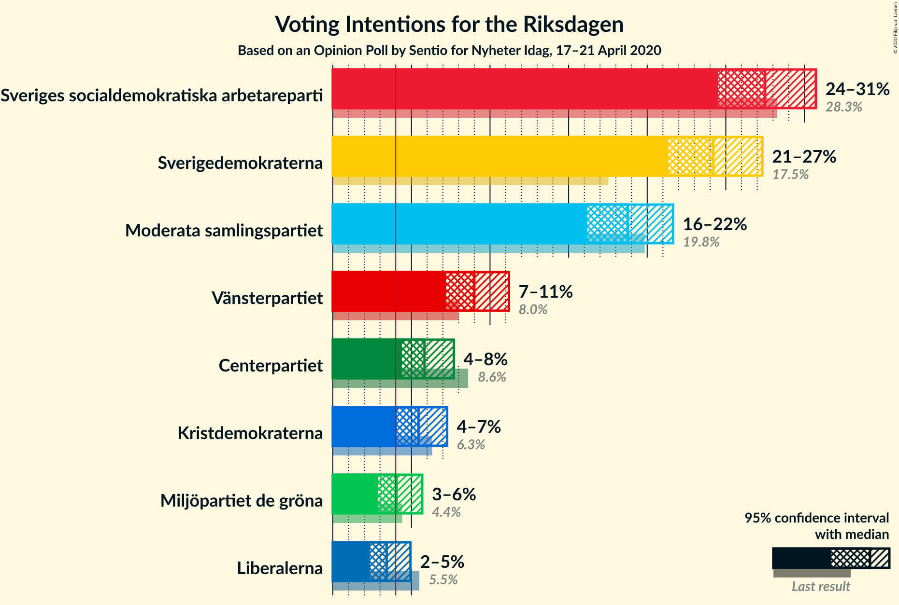
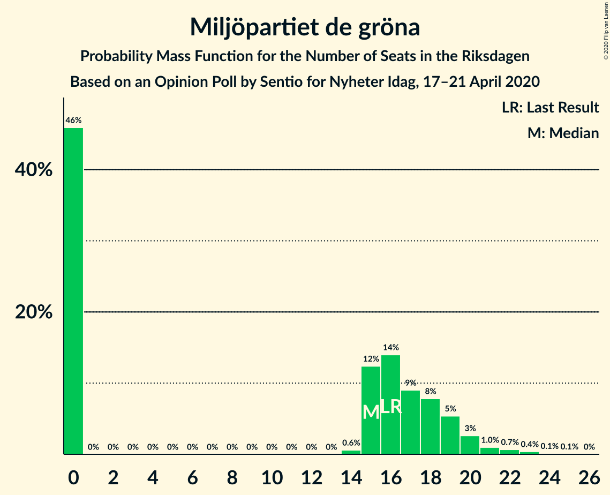

# Opinion Poll by Sentio for Nyheter Idag, 17–21 April 2020

<a href="#voting-intentions">Voting Intentions</a> | <a href="#seats">Seats</a> | <a href="#coalitions">Coalitions</a> | <a href="#technical-information">Technical Information</a>

## Voting Intentions

### Confidence Intervals

| Party | Last Result | Poll Result | 80% Confidence Interval | 90% Confidence Interval | 95% Confidence Interval | 99% Confidence Interval |
|:-----:|:-----------:|:-----------:|:-----------------------:|:-----------------------:|:-----------------------:|:-----------------------:|
| Sveriges socialdemokratiska arbetareparti | 28.3% | 27.5% | 25.5–29.6% |25.0–30.2% |24.5–30.7% |23.6–31.8% |
| Sverigedemokraterna | 17.5% | 24.2% | 22.3–26.2% |21.8–26.8% |21.3–27.3% |20.5–28.3% |
| Moderata samlingspartiet | 19.8% | 18.8% | 17.1–20.6% |16.6–21.2% |16.2–21.6% |15.4–22.6% |
| Vänsterpartiet | 8.0% | 9.0% | 7.8–10.4% |7.5–10.9% |7.2–11.2% |6.7–11.9% |
| Centerpartiet | 8.6% | 5.8% | 4.9–7.0% |4.6–7.4% |4.4–7.7% |4.0–8.3% |
| Kristdemokraterna | 6.3% | 5.4% | 4.5–6.6% |4.3–7.0% |4.1–7.3% |3.7–7.9% |
| Miljöpartiet de gröna | 4.4% | 4.1% | 3.3–5.1% |3.1–5.4% |2.9–5.7% |2.6–6.2% |
| Liberalerna | 5.5% | 3.4% | 2.7–4.4% |2.5–4.7% |2.4–4.9% |2.1–5.5% |

*Note:* The poll result column reflects the actual value used in the calculations. Published results may vary slightly, and in addition be rounded to fewer digits.

## Seats

### Confidence Intervals

| Party | Last Result | Median | 80% Confidence Interval | 90% Confidence Interval | 95% Confidence Interval | 99% Confidence Interval |
|:-----:|:-----------:|:------:|:-----------------------:|:-----------------------:|:-----------------------:|:-----------------------:|
| <a href="#sveriges-socialdemokratiska-arbetareparti">Sveriges socialdemokratiska arbetareparti</a> | 100 | 103 | 94–109 |92–112 |88–116 |85–119 |
| <a href="#sverigedemokraterna">Sverigedemokraterna</a> | 62 | 89 | 82–97 |80–100 |77–102 |75–105 |
| <a href="#moderata-samlingspartiet">Moderata samlingspartiet</a> | 70 | 70 | 62–77 |61–79 |60–80 |56–85 |
| <a href="#vänsterpartiet">Vänsterpartiet</a> | 28 | 33 | 29–38 |27–40 |26–41 |24–44 |
| <a href="#centerpartiet">Centerpartiet</a> | 31 | 22 | 18–26 |17–27 |16–28 |0–31 |
| <a href="#kristdemokraterna">Kristdemokraterna</a> | 22 | 20 | 16–25 |16–26 |15–27 |0–29 |
| <a href="#miljöpartiet-de-gröna">Miljöpartiet de gröna</a> | 16 | 15 | 0–19 |0–19 |0–20 |0–23 |
| <a href="#liberalerna">Liberalerna</a> | 20 | 0 | 0–15 |0–17 |0–18 |0–20 |

### Sveriges socialdemokratiska arbetareparti

*For a full overview of the results for this party, see the [Sveriges socialdemokratiska arbetareparti](party-sverigessocialdemokratiskaarbetareparti.html) page.*

| Number of Seats | Probability | Accumulated | Special Marks |
|:---------------:|:-----------:|:-----------:|:-------------:|
| 82 | 0.1% | 100% |  |
| 83 | 0.1% | 99.9% |  |
| 84 | 0.2% | 99.8% |  |
| 85 | 0.3% | 99.6% |  |
| 86 | 0.2% | 99.3% |  |
| 87 | 0.2% | 99.2% |  |
| 88 | 2% | 99.0% |  |
| 89 | 0.8% | 97% |  |
| 90 | 0.7% | 97% |  |
| 91 | 0.5% | 96% |  |
| 92 | 4% | 95% |  |
| 93 | 1.4% | 91% |  |
| 94 | 2% | 90% |  |
| 95 | 4% | 88% |  |
| 96 | 9% | 84% |  |
| 97 | 7% | 75% |  |
| 98 | 2% | 69% |  |
| 99 | 3% | 66% |  |
| 100 | 3% | 64% | Last Result |
| 101 | 4% | 60% |  |
| 102 | 3% | 56% |  |
| 103 | 5% | 53% | Median |
| 104 | 11% | 48% |  |
| 105 | 3% | 36% |  |
| 106 | 2% | 33% |  |
| 107 | 3% | 31% |  |
| 108 | 7% | 28% |  |
| 109 | 11% | 21% |  |
| 110 | 2% | 10% |  |
| 111 | 2% | 8% |  |
| 112 | 1.3% | 6% |  |
| 113 | 0.5% | 5% |  |
| 114 | 1.0% | 4% |  |
| 115 | 0.4% | 3% |  |
| 116 | 0.5% | 3% |  |
| 117 | 1.2% | 2% |  |
| 118 | 0.4% | 0.9% |  |
| 119 | 0.2% | 0.6% |  |
| 120 | 0.1% | 0.4% |  |
| 121 | 0.1% | 0.3% |  |
| 122 | 0.1% | 0.2% |  |
| 123 | 0.1% | 0.2% |  |
| 124 | 0% | 0.1% |  |
| 125 | 0.1% | 0.1% |  |
| 126 | 0% | 0% |  |

### Sverigedemokraterna

*For a full overview of the results for this party, see the [Sverigedemokraterna](party-sverigedemokraterna.html) page.*

| Number of Seats | Probability | Accumulated | Special Marks |
|:---------------:|:-----------:|:-----------:|:-------------:|
| 62 | 0% | 100% | Last Result |
| 63 | 0% | 100% |  |
| 64 | 0% | 100% |  |
| 65 | 0% | 100% |  |
| 66 | 0% | 100% |  |
| 67 | 0% | 100% |  |
| 68 | 0% | 100% |  |
| 69 | 0% | 100% |  |
| 70 | 0% | 100% |  |
| 71 | 0% | 99.9% |  |
| 72 | 0.1% | 99.9% |  |
| 73 | 0.1% | 99.8% |  |
| 74 | 0.1% | 99.7% |  |
| 75 | 0.4% | 99.6% |  |
| 76 | 0.6% | 99.2% |  |
| 77 | 1.2% | 98.6% |  |
| 78 | 1.0% | 97% |  |
| 79 | 0.9% | 96% |  |
| 80 | 1.3% | 95% |  |
| 81 | 2% | 94% |  |
| 82 | 4% | 92% |  |
| 83 | 8% | 88% |  |
| 84 | 5% | 80% |  |
| 85 | 5% | 75% |  |
| 86 | 5% | 70% |  |
| 87 | 7% | 65% |  |
| 88 | 3% | 58% |  |
| 89 | 5% | 55% | Median |
| 90 | 8% | 49% |  |
| 91 | 6% | 41% |  |
| 92 | 4% | 35% |  |
| 93 | 2% | 31% |  |
| 94 | 11% | 29% |  |
| 95 | 3% | 18% |  |
| 96 | 2% | 15% |  |
| 97 | 4% | 13% |  |
| 98 | 2% | 8% |  |
| 99 | 0.9% | 6% |  |
| 100 | 1.2% | 5% |  |
| 101 | 0.9% | 4% |  |
| 102 | 1.2% | 3% |  |
| 103 | 0.3% | 2% |  |
| 104 | 0.8% | 2% |  |
| 105 | 0.5% | 0.9% |  |
| 106 | 0% | 0.4% |  |
| 107 | 0% | 0.4% |  |
| 108 | 0.1% | 0.3% |  |
| 109 | 0% | 0.2% |  |
| 110 | 0% | 0.2% |  |
| 111 | 0.1% | 0.2% |  |
| 112 | 0% | 0% |  |

### Moderata samlingspartiet

*For a full overview of the results for this party, see the [Moderata samlingspartiet](party-moderatasamlingspartiet.html) page.*

| Number of Seats | Probability | Accumulated | Special Marks |
|:---------------:|:-----------:|:-----------:|:-------------:|
| 53 | 0.1% | 100% |  |
| 54 | 0.1% | 99.9% |  |
| 55 | 0.2% | 99.8% |  |
| 56 | 0.2% | 99.5% |  |
| 57 | 0.4% | 99.3% |  |
| 58 | 0.7% | 98.9% |  |
| 59 | 0.6% | 98% |  |
| 60 | 2% | 98% |  |
| 61 | 1.4% | 96% |  |
| 62 | 5% | 94% |  |
| 63 | 2% | 89% |  |
| 64 | 4% | 87% |  |
| 65 | 5% | 83% |  |
| 66 | 8% | 78% |  |
| 67 | 4% | 70% |  |
| 68 | 10% | 66% |  |
| 69 | 6% | 56% |  |
| 70 | 4% | 51% | Last Result, Median |
| 71 | 6% | 47% |  |
| 72 | 12% | 41% |  |
| 73 | 6% | 29% |  |
| 74 | 5% | 23% |  |
| 75 | 4% | 17% |  |
| 76 | 2% | 13% |  |
| 77 | 4% | 12% |  |
| 78 | 2% | 8% |  |
| 79 | 2% | 5% |  |
| 80 | 0.8% | 3% |  |
| 81 | 0.5% | 2% |  |
| 82 | 0.7% | 2% |  |
| 83 | 0.4% | 1.3% |  |
| 84 | 0.3% | 0.9% |  |
| 85 | 0.3% | 0.6% |  |
| 86 | 0.2% | 0.3% |  |
| 87 | 0% | 0.1% |  |
| 88 | 0% | 0.1% |  |
| 89 | 0% | 0.1% |  |
| 90 | 0% | 0% |  |

### Vänsterpartiet

*For a full overview of the results for this party, see the [Vänsterpartiet](party-vänsterpartiet.html) page.*

| Number of Seats | Probability | Accumulated | Special Marks |
|:---------------:|:-----------:|:-----------:|:-------------:|
| 22 | 0.1% | 100% |  |
| 23 | 0.1% | 99.9% |  |
| 24 | 0.3% | 99.8% |  |
| 25 | 0.9% | 99.4% |  |
| 26 | 1.3% | 98.6% |  |
| 27 | 2% | 97% |  |
| 28 | 5% | 95% | Last Result |
| 29 | 4% | 90% |  |
| 30 | 5% | 87% |  |
| 31 | 16% | 81% |  |
| 32 | 9% | 66% |  |
| 33 | 11% | 57% | Median |
| 34 | 6% | 45% |  |
| 35 | 7% | 39% |  |
| 36 | 8% | 32% |  |
| 37 | 8% | 24% |  |
| 38 | 7% | 16% |  |
| 39 | 2% | 9% |  |
| 40 | 3% | 7% |  |
| 41 | 2% | 4% |  |
| 42 | 0.9% | 2% |  |
| 43 | 0.7% | 1.4% |  |
| 44 | 0.2% | 0.7% |  |
| 45 | 0.2% | 0.5% |  |
| 46 | 0.1% | 0.3% |  |
| 47 | 0.1% | 0.1% |  |
| 48 | 0% | 0.1% |  |
| 49 | 0% | 0% |  |

### Centerpartiet

*For a full overview of the results for this party, see the [Centerpartiet](party-centerpartiet.html) page.*

| Number of Seats | Probability | Accumulated | Special Marks |
|:---------------:|:-----------:|:-----------:|:-------------:|
| 0 | 0.7% | 100% |  |
| 1 | 0% | 99.3% |  |
| 2 | 0% | 99.3% |  |
| 3 | 0% | 99.3% |  |
| 4 | 0% | 99.3% |  |
| 5 | 0% | 99.3% |  |
| 6 | 0% | 99.3% |  |
| 7 | 0% | 99.3% |  |
| 8 | 0% | 99.3% |  |
| 9 | 0% | 99.3% |  |
| 10 | 0% | 99.3% |  |
| 11 | 0% | 99.3% |  |
| 12 | 0% | 99.3% |  |
| 13 | 0% | 99.3% |  |
| 14 | 0% | 99.3% |  |
| 15 | 0.6% | 99.3% |  |
| 16 | 3% | 98.7% |  |
| 17 | 5% | 96% |  |
| 18 | 6% | 91% |  |
| 19 | 10% | 86% |  |
| 20 | 10% | 76% |  |
| 21 | 14% | 66% |  |
| 22 | 8% | 52% | Median |
| 23 | 16% | 44% |  |
| 24 | 9% | 28% |  |
| 25 | 7% | 19% |  |
| 26 | 5% | 13% |  |
| 27 | 3% | 8% |  |
| 28 | 3% | 5% |  |
| 29 | 0.9% | 2% |  |
| 30 | 0.6% | 1.2% |  |
| 31 | 0.3% | 0.6% | Last Result |
| 32 | 0.1% | 0.2% |  |
| 33 | 0.1% | 0.2% |  |
| 34 | 0% | 0.1% |  |
| 35 | 0% | 0% |  |

### Kristdemokraterna

*For a full overview of the results for this party, see the [Kristdemokraterna](party-kristdemokraterna.html) page.*

| Number of Seats | Probability | Accumulated | Special Marks |
|:---------------:|:-----------:|:-----------:|:-------------:|
| 0 | 2% | 100% |  |
| 1 | 0% | 98% |  |
| 2 | 0% | 98% |  |
| 3 | 0% | 98% |  |
| 4 | 0% | 98% |  |
| 5 | 0% | 98% |  |
| 6 | 0% | 98% |  |
| 7 | 0% | 98% |  |
| 8 | 0% | 98% |  |
| 9 | 0% | 98% |  |
| 10 | 0% | 98% |  |
| 11 | 0% | 98% |  |
| 12 | 0% | 98% |  |
| 13 | 0% | 98% |  |
| 14 | 0.2% | 98% |  |
| 15 | 2% | 98% |  |
| 16 | 6% | 96% |  |
| 17 | 6% | 90% |  |
| 18 | 9% | 84% |  |
| 19 | 10% | 75% |  |
| 20 | 17% | 66% | Median |
| 21 | 12% | 49% |  |
| 22 | 9% | 37% | Last Result |
| 23 | 10% | 28% |  |
| 24 | 7% | 18% |  |
| 25 | 5% | 10% |  |
| 26 | 3% | 6% |  |
| 27 | 1.2% | 3% |  |
| 28 | 0.7% | 1.5% |  |
| 29 | 0.4% | 0.8% |  |
| 30 | 0.2% | 0.4% |  |
| 31 | 0.1% | 0.1% |  |
| 32 | 0% | 0% |  |

### Miljöpartiet de gröna

*For a full overview of the results for this party, see the [Miljöpartiet de gröna](party-miljöpartietdegröna.html) page.*

| Number of Seats | Probability | Accumulated | Special Marks |
|:---------------:|:-----------:|:-----------:|:-------------:|
| 0 | 47% | 100% |  |
| 1 | 0% | 53% |  |
| 2 | 0% | 53% |  |
| 3 | 0% | 53% |  |
| 4 | 0% | 53% |  |
| 5 | 0% | 53% |  |
| 6 | 0% | 53% |  |
| 7 | 0% | 53% |  |
| 8 | 0% | 53% |  |
| 9 | 0% | 53% |  |
| 10 | 0% | 53% |  |
| 11 | 0% | 53% |  |
| 12 | 0% | 53% |  |
| 13 | 0% | 53% |  |
| 14 | 0.4% | 53% |  |
| 15 | 14% | 52% | Median |
| 16 | 10% | 38% | Last Result |
| 17 | 10% | 28% |  |
| 18 | 7% | 18% |  |
| 19 | 6% | 11% |  |
| 20 | 2% | 4% |  |
| 21 | 0.9% | 2% |  |
| 22 | 0.6% | 1.2% |  |
| 23 | 0.3% | 0.5% |  |
| 24 | 0.1% | 0.2% |  |
| 25 | 0.1% | 0.1% |  |
| 26 | 0% | 0% |  |

### Liberalerna

*For a full overview of the results for this party, see the [Liberalerna](party-liberalerna.html) page.*

| Number of Seats | Probability | Accumulated | Special Marks |
|:---------------:|:-----------:|:-----------:|:-------------:|
| 0 | 79% | 100% | Median |
| 1 | 0% | 21% |  |
| 2 | 0% | 21% |  |
| 3 | 0% | 21% |  |
| 4 | 0% | 21% |  |
| 5 | 0% | 21% |  |
| 6 | 0% | 21% |  |
| 7 | 0% | 21% |  |
| 8 | 0% | 21% |  |
| 9 | 0% | 21% |  |
| 10 | 0% | 21% |  |
| 11 | 0% | 21% |  |
| 12 | 0% | 21% |  |
| 13 | 0% | 21% |  |
| 14 | 0.7% | 21% |  |
| 15 | 11% | 20% |  |
| 16 | 4% | 10% |  |
| 17 | 4% | 6% |  |
| 18 | 1.4% | 3% |  |
| 19 | 0.6% | 1.1% |  |
| 20 | 0.3% | 0.5% | Last Result |
| 21 | 0.1% | 0.2% |  |
| 22 | 0.1% | 0.1% |  |
| 23 | 0% | 0% |  |

## Coalitions

### Confidence Intervals

| Coalition | Last Result | Median | Majority? | 80% Confidence Interval | 90% Confidence Interval | 95% Confidence Interval | 99% Confidence Interval |
|:---------:|:-----------:|:------:|:---------:|:-----------------------:|:-----------------------:|:-----------------------:|:-----------------------:|
| Sveriges socialdemokratiska arbetareparti – Moderata samlingspartiet – Centerpartiet | 201 | 194 | 98.6% | 181–204 | 179–208 | 177–211 | 171–215 |
| Sverigedemokraterna – Moderata samlingspartiet – Kristdemokraterna | 154 | 180 | 69% | 169–190 | 166–194 | 163–195 | 156–201 |
| Sveriges socialdemokratiska arbetareparti – Moderata samlingspartiet | 170 | 172 | 39% | 160–182 | 158–185 | 156–188 | 151–194 |
| Sveriges socialdemokratiska arbetareparti – Vänsterpartiet – Centerpartiet – Miljöpartiet de gröna – Liberalerna | 195 | 169 | 31% | 159–180 | 155–183 | 154–186 | 148–193 |
| Sverigedemokraterna – Moderata samlingspartiet | 132 | 159 | 2% | 149–170 | 147–174 | 144–174 | 139–180 |
| Sveriges socialdemokratiska arbetareparti – Vänsterpartiet – Miljöpartiet de gröna | 144 | 144 | 0% | 134–155 | 131–159 | 128–161 | 123–165 |
| Sveriges socialdemokratiska arbetareparti – Centerpartiet – Miljöpartiet de gröna – Liberalerna | 167 | 136 | 0% | 125–148 | 121–151 | 116–154 | 114–160 |
| Sveriges socialdemokratiska arbetareparti – Vänsterpartiet | 128 | 136 | 0% | 125–146 | 124–147 | 121–149 | 117–155 |
| Moderata samlingspartiet – Centerpartiet – Kristdemokraterna – Liberalerna | 143 | 115 | 0% | 105–125 | 102–129 | 100–131 | 93–136 |
| Sveriges socialdemokratiska arbetareparti – Miljöpartiet de gröna | 116 | 110 | 0% | 100–122 | 96–124 | 95–128 | 89–132 |
| Moderata samlingspartiet – Centerpartiet – Kristdemokraterna | 123 | 112 | 0% | 103–120 | 100–123 | 97–125 | 91–131 |
| Moderata samlingspartiet – Centerpartiet – Liberalerna | 121 | 95 | 0% | 85–105 | 83–109 | 81–111 | 77–116 |
| Moderata samlingspartiet – Centerpartiet | 101 | 91 | 0% | 84–99 | 81–101 | 79–103 | 73–109 |

### Sveriges socialdemokratiska arbetareparti – Moderata samlingspartiet – Centerpartiet

| Number of Seats | Probability | Accumulated | Special Marks |
|:---------------:|:-----------:|:-----------:|:-------------:|
| 165 | 0% | 100% |  |
| 166 | 0% | 99.9% |  |
| 167 | 0% | 99.9% |  |
| 168 | 0.1% | 99.9% |  |
| 169 | 0.1% | 99.8% |  |
| 170 | 0.1% | 99.7% |  |
| 171 | 0.2% | 99.6% |  |
| 172 | 0.3% | 99.4% |  |
| 173 | 0.2% | 99.1% |  |
| 174 | 0.4% | 98.9% |  |
| 175 | 0.4% | 98.6% | Majority |
| 176 | 0.7% | 98% |  |
| 177 | 1.0% | 98% |  |
| 178 | 0.5% | 96% |  |
| 179 | 2% | 96% |  |
| 180 | 1.1% | 94% |  |
| 181 | 4% | 93% |  |
| 182 | 1.1% | 89% |  |
| 183 | 3% | 88% |  |
| 184 | 3% | 85% |  |
| 185 | 3% | 83% |  |
| 186 | 2% | 79% |  |
| 187 | 4% | 78% |  |
| 188 | 3% | 74% |  |
| 189 | 7% | 71% |  |
| 190 | 3% | 64% |  |
| 191 | 2% | 61% |  |
| 192 | 3% | 59% |  |
| 193 | 4% | 56% |  |
| 194 | 6% | 52% |  |
| 195 | 3% | 46% | Median |
| 196 | 6% | 42% |  |
| 197 | 3% | 37% |  |
| 198 | 3% | 34% |  |
| 199 | 2% | 32% |  |
| 200 | 6% | 30% |  |
| 201 | 2% | 24% | Last Result |
| 202 | 3% | 22% |  |
| 203 | 0.6% | 19% |  |
| 204 | 9% | 18% |  |
| 205 | 0.9% | 9% |  |
| 206 | 0.4% | 8% |  |
| 207 | 0.9% | 8% |  |
| 208 | 3% | 7% |  |
| 209 | 0.2% | 4% |  |
| 210 | 1.3% | 4% |  |
| 211 | 0.2% | 3% |  |
| 212 | 1.3% | 2% |  |
| 213 | 0.3% | 1.2% |  |
| 214 | 0.3% | 0.9% |  |
| 215 | 0.2% | 0.7% |  |
| 216 | 0% | 0.5% |  |
| 217 | 0.1% | 0.4% |  |
| 218 | 0.1% | 0.3% |  |
| 219 | 0.1% | 0.3% |  |
| 220 | 0.1% | 0.2% |  |
| 221 | 0% | 0.1% |  |
| 222 | 0% | 0.1% |  |
| 223 | 0% | 0.1% |  |
| 224 | 0% | 0% |  |

### Sverigedemokraterna – Moderata samlingspartiet – Kristdemokraterna

| Number of Seats | Probability | Accumulated | Special Marks |
|:---------------:|:-----------:|:-----------:|:-------------:|
| 151 | 0% | 100% |  |
| 152 | 0.1% | 99.9% |  |
| 153 | 0% | 99.9% |  |
| 154 | 0% | 99.9% | Last Result |
| 155 | 0.3% | 99.8% |  |
| 156 | 0.1% | 99.6% |  |
| 157 | 0.1% | 99.5% |  |
| 158 | 0.2% | 99.4% |  |
| 159 | 0.2% | 99.2% |  |
| 160 | 0.3% | 99.1% |  |
| 161 | 0.3% | 98.7% |  |
| 162 | 0.3% | 98% |  |
| 163 | 0.8% | 98% |  |
| 164 | 1.5% | 97% |  |
| 165 | 0.6% | 96% |  |
| 166 | 1.1% | 95% |  |
| 167 | 2% | 94% |  |
| 168 | 2% | 92% |  |
| 169 | 1.4% | 90% |  |
| 170 | 4% | 89% |  |
| 171 | 5% | 85% |  |
| 172 | 3% | 80% |  |
| 173 | 4% | 77% |  |
| 174 | 3% | 73% |  |
| 175 | 2% | 69% | Majority |
| 176 | 3% | 67% |  |
| 177 | 4% | 64% |  |
| 178 | 5% | 59% |  |
| 179 | 3% | 55% | Median |
| 180 | 5% | 52% |  |
| 181 | 8% | 47% |  |
| 182 | 4% | 40% |  |
| 183 | 3% | 36% |  |
| 184 | 3% | 33% |  |
| 185 | 4% | 30% |  |
| 186 | 10% | 26% |  |
| 187 | 2% | 16% |  |
| 188 | 2% | 14% |  |
| 189 | 1.3% | 12% |  |
| 190 | 2% | 11% |  |
| 191 | 1.4% | 9% |  |
| 192 | 0.5% | 7% |  |
| 193 | 1.3% | 7% |  |
| 194 | 0.9% | 5% |  |
| 195 | 2% | 5% |  |
| 196 | 0.2% | 2% |  |
| 197 | 0.1% | 2% |  |
| 198 | 0.7% | 2% |  |
| 199 | 0.5% | 1.2% |  |
| 200 | 0.1% | 0.7% |  |
| 201 | 0.1% | 0.5% |  |
| 202 | 0.2% | 0.5% |  |
| 203 | 0.1% | 0.3% |  |
| 204 | 0.1% | 0.2% |  |
| 205 | 0% | 0.1% |  |
| 206 | 0% | 0.1% |  |
| 207 | 0% | 0.1% |  |
| 208 | 0% | 0% |  |

### Sveriges socialdemokratiska arbetareparti – Moderata samlingspartiet

| Number of Seats | Probability | Accumulated | Special Marks |
|:---------------:|:-----------:|:-----------:|:-------------:|
| 145 | 0% | 100% |  |
| 146 | 0.1% | 99.9% |  |
| 147 | 0.1% | 99.9% |  |
| 148 | 0% | 99.8% |  |
| 149 | 0.2% | 99.8% |  |
| 150 | 0.1% | 99.6% |  |
| 151 | 0.2% | 99.5% |  |
| 152 | 0.2% | 99.3% |  |
| 153 | 0.3% | 99.2% |  |
| 154 | 0.7% | 98.8% |  |
| 155 | 0.5% | 98% |  |
| 156 | 1.3% | 98% |  |
| 157 | 0.6% | 96% |  |
| 158 | 3% | 96% |  |
| 159 | 1.1% | 92% |  |
| 160 | 2% | 91% |  |
| 161 | 2% | 89% |  |
| 162 | 2% | 87% |  |
| 163 | 2% | 85% |  |
| 164 | 3% | 83% |  |
| 165 | 5% | 80% |  |
| 166 | 2% | 75% |  |
| 167 | 4% | 74% |  |
| 168 | 5% | 70% |  |
| 169 | 4% | 65% |  |
| 170 | 6% | 60% | Last Result |
| 171 | 4% | 55% |  |
| 172 | 4% | 51% |  |
| 173 | 4% | 47% | Median |
| 174 | 4% | 43% |  |
| 175 | 2% | 39% | Majority |
| 176 | 5% | 36% |  |
| 177 | 4% | 31% |  |
| 178 | 2% | 27% |  |
| 179 | 3% | 25% |  |
| 180 | 0.8% | 22% |  |
| 181 | 10% | 21% |  |
| 182 | 3% | 12% |  |
| 183 | 2% | 8% |  |
| 184 | 0.5% | 6% |  |
| 185 | 0.5% | 5% |  |
| 186 | 2% | 5% |  |
| 187 | 0.3% | 3% |  |
| 188 | 0.4% | 3% |  |
| 189 | 0.3% | 2% |  |
| 190 | 0.1% | 2% |  |
| 191 | 1.1% | 2% |  |
| 192 | 0.1% | 0.9% |  |
| 193 | 0.2% | 0.8% |  |
| 194 | 0.2% | 0.6% |  |
| 195 | 0% | 0.4% |  |
| 196 | 0.1% | 0.4% |  |
| 197 | 0.1% | 0.3% |  |
| 198 | 0% | 0.2% |  |
| 199 | 0.1% | 0.1% |  |
| 200 | 0% | 0.1% |  |
| 201 | 0% | 0% |  |

### Sveriges socialdemokratiska arbetareparti – Vänsterpartiet – Centerpartiet – Miljöpartiet de gröna – Liberalerna

| Number of Seats | Probability | Accumulated | Special Marks |
|:---------------:|:-----------:|:-----------:|:-------------:|
| 142 | 0% | 100% |  |
| 143 | 0% | 99.9% |  |
| 144 | 0% | 99.9% |  |
| 145 | 0.1% | 99.9% |  |
| 146 | 0.1% | 99.8% |  |
| 147 | 0.2% | 99.7% |  |
| 148 | 0.1% | 99.5% |  |
| 149 | 0.1% | 99.5% |  |
| 150 | 0.5% | 99.3% |  |
| 151 | 0.7% | 98.8% |  |
| 152 | 0.1% | 98% |  |
| 153 | 0.2% | 98% |  |
| 154 | 2% | 98% |  |
| 155 | 0.9% | 95% |  |
| 156 | 1.3% | 95% |  |
| 157 | 0.5% | 93% |  |
| 158 | 1.4% | 93% |  |
| 159 | 2% | 91% |  |
| 160 | 1.3% | 89% |  |
| 161 | 2% | 88% |  |
| 162 | 2% | 86% |  |
| 163 | 10% | 84% |  |
| 164 | 4% | 74% |  |
| 165 | 3% | 70% |  |
| 166 | 3% | 67% |  |
| 167 | 4% | 64% |  |
| 168 | 8% | 60% |  |
| 169 | 5% | 53% |  |
| 170 | 3% | 48% |  |
| 171 | 5% | 45% |  |
| 172 | 4% | 41% |  |
| 173 | 3% | 36% | Median |
| 174 | 2% | 33% |  |
| 175 | 3% | 31% | Majority |
| 176 | 4% | 27% |  |
| 177 | 3% | 23% |  |
| 178 | 5% | 20% |  |
| 179 | 4% | 15% |  |
| 180 | 1.4% | 11% |  |
| 181 | 2% | 10% |  |
| 182 | 2% | 8% |  |
| 183 | 1.1% | 6% |  |
| 184 | 0.6% | 5% |  |
| 185 | 1.5% | 4% |  |
| 186 | 0.8% | 3% |  |
| 187 | 0.3% | 2% |  |
| 188 | 0.3% | 2% |  |
| 189 | 0.3% | 1.2% |  |
| 190 | 0.2% | 0.9% |  |
| 191 | 0.2% | 0.8% |  |
| 192 | 0.1% | 0.6% |  |
| 193 | 0.1% | 0.5% |  |
| 194 | 0.3% | 0.4% |  |
| 195 | 0% | 0.2% | Last Result |
| 196 | 0% | 0.1% |  |
| 197 | 0.1% | 0.1% |  |
| 198 | 0% | 0.1% |  |
| 199 | 0% | 0% |  |

### Sverigedemokraterna – Moderata samlingspartiet

| Number of Seats | Probability | Accumulated | Special Marks |
|:---------------:|:-----------:|:-----------:|:-------------:|
| 132 | 0% | 100% | Last Result |
| 133 | 0% | 100% |  |
| 134 | 0.1% | 100% |  |
| 135 | 0% | 99.9% |  |
| 136 | 0% | 99.9% |  |
| 137 | 0.1% | 99.8% |  |
| 138 | 0.1% | 99.8% |  |
| 139 | 0.3% | 99.6% |  |
| 140 | 0.2% | 99.3% |  |
| 141 | 0.2% | 99.2% |  |
| 142 | 0.6% | 98.9% |  |
| 143 | 0.6% | 98% |  |
| 144 | 0.6% | 98% |  |
| 145 | 0.6% | 97% |  |
| 146 | 0.9% | 97% |  |
| 147 | 2% | 96% |  |
| 148 | 3% | 94% |  |
| 149 | 5% | 91% |  |
| 150 | 2% | 86% |  |
| 151 | 3% | 84% |  |
| 152 | 6% | 81% |  |
| 153 | 4% | 75% |  |
| 154 | 4% | 71% |  |
| 155 | 1.1% | 67% |  |
| 156 | 4% | 66% |  |
| 157 | 3% | 62% |  |
| 158 | 4% | 59% |  |
| 159 | 6% | 55% | Median |
| 160 | 8% | 49% |  |
| 161 | 4% | 40% |  |
| 162 | 4% | 36% |  |
| 163 | 4% | 32% |  |
| 164 | 2% | 28% |  |
| 165 | 3% | 26% |  |
| 166 | 10% | 23% |  |
| 167 | 1.4% | 14% |  |
| 168 | 0.9% | 12% |  |
| 169 | 1.2% | 11% |  |
| 170 | 3% | 10% |  |
| 171 | 0.3% | 7% |  |
| 172 | 0.4% | 7% |  |
| 173 | 0.6% | 6% |  |
| 174 | 3% | 6% |  |
| 175 | 0.2% | 2% | Majority |
| 176 | 0.7% | 2% |  |
| 177 | 0.3% | 2% |  |
| 178 | 0.1% | 1.3% |  |
| 179 | 0.2% | 1.1% |  |
| 180 | 0.5% | 0.9% |  |
| 181 | 0.1% | 0.5% |  |
| 182 | 0% | 0.3% |  |
| 183 | 0.1% | 0.3% |  |
| 184 | 0.2% | 0.3% |  |
| 185 | 0.1% | 0.1% |  |
| 186 | 0% | 0% |  |

### Sveriges socialdemokratiska arbetareparti – Vänsterpartiet – Miljöpartiet de gröna

| Number of Seats | Probability | Accumulated | Special Marks |
|:---------------:|:-----------:|:-----------:|:-------------:|
| 118 | 0% | 100% |  |
| 119 | 0% | 99.9% |  |
| 120 | 0% | 99.9% |  |
| 121 | 0.1% | 99.9% |  |
| 122 | 0.1% | 99.7% |  |
| 123 | 0.3% | 99.6% |  |
| 124 | 0.3% | 99.3% |  |
| 125 | 0.2% | 99.0% |  |
| 126 | 0.4% | 98.8% |  |
| 127 | 0.6% | 98% |  |
| 128 | 0.4% | 98% |  |
| 129 | 1.3% | 97% |  |
| 130 | 0.7% | 96% |  |
| 131 | 0.5% | 95% |  |
| 132 | 2% | 95% |  |
| 133 | 0.8% | 93% |  |
| 134 | 3% | 92% |  |
| 135 | 2% | 89% |  |
| 136 | 0.9% | 87% |  |
| 137 | 3% | 86% |  |
| 138 | 3% | 83% |  |
| 139 | 5% | 80% |  |
| 140 | 8% | 74% |  |
| 141 | 4% | 66% |  |
| 142 | 3% | 62% |  |
| 143 | 7% | 59% |  |
| 144 | 4% | 53% | Last Result |
| 145 | 4% | 49% |  |
| 146 | 6% | 45% |  |
| 147 | 5% | 39% |  |
| 148 | 3% | 34% |  |
| 149 | 2% | 31% |  |
| 150 | 3% | 29% |  |
| 151 | 6% | 26% | Median |
| 152 | 2% | 20% |  |
| 153 | 2% | 18% |  |
| 154 | 3% | 16% |  |
| 155 | 3% | 13% |  |
| 156 | 2% | 10% |  |
| 157 | 0.6% | 8% |  |
| 158 | 1.4% | 7% |  |
| 159 | 0.8% | 6% |  |
| 160 | 2% | 5% |  |
| 161 | 1.0% | 3% |  |
| 162 | 0.7% | 2% |  |
| 163 | 0.3% | 1.3% |  |
| 164 | 0.3% | 1.0% |  |
| 165 | 0.4% | 0.7% |  |
| 166 | 0.1% | 0.4% |  |
| 167 | 0.1% | 0.3% |  |
| 168 | 0% | 0.2% |  |
| 169 | 0% | 0.2% |  |
| 170 | 0% | 0.1% |  |
| 171 | 0% | 0.1% |  |
| 172 | 0% | 0.1% |  |
| 173 | 0% | 0% |  |

### Sveriges socialdemokratiska arbetareparti – Centerpartiet – Miljöpartiet de gröna – Liberalerna

| Number of Seats | Probability | Accumulated | Special Marks |
|:---------------:|:-----------:|:-----------:|:-------------:|
| 107 | 0% | 100% |  |
| 108 | 0% | 99.9% |  |
| 109 | 0.1% | 99.9% |  |
| 110 | 0% | 99.9% |  |
| 111 | 0.1% | 99.8% |  |
| 112 | 0.1% | 99.7% |  |
| 113 | 0.1% | 99.6% |  |
| 114 | 0.2% | 99.5% |  |
| 115 | 0.1% | 99.3% |  |
| 116 | 2% | 99.3% |  |
| 117 | 0.2% | 97% |  |
| 118 | 0.5% | 97% |  |
| 119 | 0.6% | 96% |  |
| 120 | 0.2% | 96% |  |
| 121 | 0.7% | 96% |  |
| 122 | 2% | 95% |  |
| 123 | 1.2% | 93% |  |
| 124 | 1.3% | 92% |  |
| 125 | 2% | 91% |  |
| 126 | 1.3% | 89% |  |
| 127 | 2% | 87% |  |
| 128 | 0.7% | 85% |  |
| 129 | 6% | 85% |  |
| 130 | 4% | 79% |  |
| 131 | 3% | 75% |  |
| 132 | 11% | 72% |  |
| 133 | 1.1% | 62% |  |
| 134 | 4% | 61% |  |
| 135 | 6% | 56% |  |
| 136 | 5% | 50% |  |
| 137 | 3% | 46% |  |
| 138 | 4% | 42% |  |
| 139 | 2% | 38% |  |
| 140 | 6% | 36% | Median |
| 141 | 2% | 30% |  |
| 142 | 2% | 27% |  |
| 143 | 1.2% | 25% |  |
| 144 | 4% | 24% |  |
| 145 | 5% | 20% |  |
| 146 | 2% | 15% |  |
| 147 | 2% | 13% |  |
| 148 | 1.4% | 11% |  |
| 149 | 3% | 10% |  |
| 150 | 1.2% | 6% |  |
| 151 | 1.2% | 5% |  |
| 152 | 0.7% | 4% |  |
| 153 | 0.3% | 3% |  |
| 154 | 0.4% | 3% |  |
| 155 | 1.0% | 2% |  |
| 156 | 0.4% | 1.4% |  |
| 157 | 0.1% | 1.0% |  |
| 158 | 0.1% | 0.9% |  |
| 159 | 0.2% | 0.8% |  |
| 160 | 0.1% | 0.6% |  |
| 161 | 0.3% | 0.5% |  |
| 162 | 0% | 0.2% |  |
| 163 | 0% | 0.1% |  |
| 164 | 0% | 0.1% |  |
| 165 | 0% | 0.1% |  |
| 166 | 0% | 0.1% |  |
| 167 | 0% | 0% | Last Result |

### Sveriges socialdemokratiska arbetareparti – Vänsterpartiet

| Number of Seats | Probability | Accumulated | Special Marks |
|:---------------:|:-----------:|:-----------:|:-------------:|
| 112 | 0% | 100% |  |
| 113 | 0.1% | 99.9% |  |
| 114 | 0.1% | 99.9% |  |
| 115 | 0.1% | 99.8% |  |
| 116 | 0.1% | 99.7% |  |
| 117 | 0.3% | 99.6% |  |
| 118 | 0.3% | 99.3% |  |
| 119 | 0.4% | 99.0% |  |
| 120 | 0.5% | 98.6% |  |
| 121 | 1.0% | 98% |  |
| 122 | 0.5% | 97% |  |
| 123 | 2% | 97% |  |
| 124 | 3% | 95% |  |
| 125 | 2% | 92% |  |
| 126 | 2% | 90% |  |
| 127 | 2% | 87% |  |
| 128 | 5% | 86% | Last Result |
| 129 | 3% | 81% |  |
| 130 | 4% | 78% |  |
| 131 | 4% | 74% |  |
| 132 | 5% | 71% |  |
| 133 | 3% | 66% |  |
| 134 | 7% | 63% |  |
| 135 | 4% | 56% |  |
| 136 | 5% | 53% | Median |
| 137 | 6% | 48% |  |
| 138 | 4% | 42% |  |
| 139 | 4% | 38% |  |
| 140 | 8% | 34% |  |
| 141 | 3% | 26% |  |
| 142 | 3% | 23% |  |
| 143 | 5% | 20% |  |
| 144 | 2% | 14% |  |
| 145 | 2% | 13% |  |
| 146 | 5% | 11% |  |
| 147 | 2% | 6% |  |
| 148 | 1.5% | 4% |  |
| 149 | 0.6% | 3% |  |
| 150 | 0.3% | 2% |  |
| 151 | 0.4% | 2% |  |
| 152 | 0.1% | 1.5% |  |
| 153 | 0.4% | 1.3% |  |
| 154 | 0.2% | 1.0% |  |
| 155 | 0.3% | 0.8% |  |
| 156 | 0.1% | 0.5% |  |
| 157 | 0% | 0.3% |  |
| 158 | 0.2% | 0.3% |  |
| 159 | 0.1% | 0.1% |  |
| 160 | 0% | 0.1% |  |
| 161 | 0% | 0.1% |  |
| 162 | 0% | 0% |  |

### Moderata samlingspartiet – Centerpartiet – Kristdemokraterna – Liberalerna

| Number of Seats | Probability | Accumulated | Special Marks |
|:---------------:|:-----------:|:-----------:|:-------------:|
| 85 | 0% | 100% |  |
| 86 | 0% | 99.9% |  |
| 87 | 0% | 99.9% |  |
| 88 | 0% | 99.9% |  |
| 89 | 0% | 99.9% |  |
| 90 | 0% | 99.9% |  |
| 91 | 0.1% | 99.8% |  |
| 92 | 0.1% | 99.7% |  |
| 93 | 0.1% | 99.6% |  |
| 94 | 0.1% | 99.5% |  |
| 95 | 0.4% | 99.4% |  |
| 96 | 0.2% | 99.0% |  |
| 97 | 0.1% | 98.8% |  |
| 98 | 0.2% | 98.7% |  |
| 99 | 0.5% | 98% |  |
| 100 | 0.6% | 98% |  |
| 101 | 0.9% | 97% |  |
| 102 | 2% | 96% |  |
| 103 | 2% | 95% |  |
| 104 | 1.3% | 93% |  |
| 105 | 3% | 92% |  |
| 106 | 1.3% | 88% |  |
| 107 | 2% | 87% |  |
| 108 | 5% | 85% |  |
| 109 | 1.4% | 80% |  |
| 110 | 5% | 79% |  |
| 111 | 4% | 74% |  |
| 112 | 8% | 70% | Median |
| 113 | 3% | 62% |  |
| 114 | 4% | 59% |  |
| 115 | 11% | 55% |  |
| 116 | 5% | 45% |  |
| 117 | 3% | 40% |  |
| 118 | 4% | 37% |  |
| 119 | 5% | 34% |  |
| 120 | 8% | 28% |  |
| 121 | 3% | 21% |  |
| 122 | 2% | 18% |  |
| 123 | 3% | 16% |  |
| 124 | 0.9% | 13% |  |
| 125 | 2% | 12% |  |
| 126 | 1.2% | 10% |  |
| 127 | 1.3% | 8% |  |
| 128 | 1.2% | 7% |  |
| 129 | 2% | 6% |  |
| 130 | 1.0% | 4% |  |
| 131 | 1.2% | 3% |  |
| 132 | 0.4% | 2% |  |
| 133 | 0.5% | 2% |  |
| 134 | 0.6% | 1.2% |  |
| 135 | 0.1% | 0.6% |  |
| 136 | 0.1% | 0.6% |  |
| 137 | 0.1% | 0.5% |  |
| 138 | 0.1% | 0.3% |  |
| 139 | 0.1% | 0.3% |  |
| 140 | 0.1% | 0.2% |  |
| 141 | 0% | 0.1% |  |
| 142 | 0% | 0.1% |  |
| 143 | 0% | 0.1% | Last Result |
| 144 | 0% | 0.1% |  |
| 145 | 0% | 0% |  |

### Sveriges socialdemokratiska arbetareparti – Miljöpartiet de gröna

| Number of Seats | Probability | Accumulated | Special Marks |
|:---------------:|:-----------:|:-----------:|:-------------:|
| 86 | 0.1% | 100% |  |
| 87 | 0% | 99.9% |  |
| 88 | 0.3% | 99.9% |  |
| 89 | 0.2% | 99.6% |  |
| 90 | 0.1% | 99.4% |  |
| 91 | 0.2% | 99.3% |  |
| 92 | 0.5% | 99.1% |  |
| 93 | 0.2% | 98.6% |  |
| 94 | 0.5% | 98% |  |
| 95 | 1.1% | 98% |  |
| 96 | 3% | 97% |  |
| 97 | 1.4% | 94% |  |
| 98 | 0.9% | 93% |  |
| 99 | 1.4% | 92% |  |
| 100 | 1.2% | 90% |  |
| 101 | 2% | 89% |  |
| 102 | 3% | 87% |  |
| 103 | 1.5% | 84% |  |
| 104 | 4% | 83% |  |
| 105 | 2% | 79% |  |
| 106 | 1.5% | 76% |  |
| 107 | 2% | 75% |  |
| 108 | 7% | 73% |  |
| 109 | 12% | 66% |  |
| 110 | 5% | 54% |  |
| 111 | 6% | 49% |  |
| 112 | 5% | 43% |  |
| 113 | 2% | 39% |  |
| 114 | 3% | 37% |  |
| 115 | 2% | 34% |  |
| 116 | 4% | 31% | Last Result |
| 117 | 3% | 27% |  |
| 118 | 2% | 24% | Median |
| 119 | 4% | 22% |  |
| 120 | 3% | 18% |  |
| 121 | 4% | 15% |  |
| 122 | 2% | 11% |  |
| 123 | 3% | 9% |  |
| 124 | 1.3% | 6% |  |
| 125 | 0.9% | 4% |  |
| 126 | 0.3% | 4% |  |
| 127 | 0.4% | 3% |  |
| 128 | 0.5% | 3% |  |
| 129 | 1.0% | 2% |  |
| 130 | 0.4% | 1.4% |  |
| 131 | 0.4% | 1.0% |  |
| 132 | 0.2% | 0.6% |  |
| 133 | 0.2% | 0.4% |  |
| 134 | 0.1% | 0.2% |  |
| 135 | 0% | 0.1% |  |
| 136 | 0% | 0.1% |  |
| 137 | 0% | 0% |  |

### Moderata samlingspartiet – Centerpartiet – Kristdemokraterna

| Number of Seats | Probability | Accumulated | Special Marks |
|:---------------:|:-----------:|:-----------:|:-------------:|
| 83 | 0% | 100% |  |
| 84 | 0% | 99.9% |  |
| 85 | 0% | 99.9% |  |
| 86 | 0% | 99.9% |  |
| 87 | 0.1% | 99.9% |  |
| 88 | 0% | 99.8% |  |
| 89 | 0% | 99.7% |  |
| 90 | 0.1% | 99.7% |  |
| 91 | 0.2% | 99.6% |  |
| 92 | 0.2% | 99.3% |  |
| 93 | 0.2% | 99.2% |  |
| 94 | 0.2% | 99.0% |  |
| 95 | 0.5% | 98.7% |  |
| 96 | 0.6% | 98% |  |
| 97 | 0.9% | 98% |  |
| 98 | 0.5% | 97% |  |
| 99 | 0.7% | 96% |  |
| 100 | 0.9% | 96% |  |
| 101 | 2% | 95% |  |
| 102 | 2% | 93% |  |
| 103 | 2% | 90% |  |
| 104 | 2% | 88% |  |
| 105 | 7% | 86% |  |
| 106 | 2% | 79% |  |
| 107 | 2% | 77% |  |
| 108 | 5% | 74% |  |
| 109 | 2% | 69% |  |
| 110 | 7% | 67% |  |
| 111 | 5% | 61% |  |
| 112 | 9% | 56% | Median |
| 113 | 3% | 47% |  |
| 114 | 6% | 44% |  |
| 115 | 11% | 38% |  |
| 116 | 4% | 27% |  |
| 117 | 3% | 23% |  |
| 118 | 3% | 21% |  |
| 119 | 5% | 17% |  |
| 120 | 4% | 12% |  |
| 121 | 1.3% | 9% |  |
| 122 | 1.5% | 7% |  |
| 123 | 3% | 6% | Last Result |
| 124 | 0.3% | 3% |  |
| 125 | 0.4% | 3% |  |
| 126 | 0.4% | 2% |  |
| 127 | 0.6% | 2% |  |
| 128 | 0.2% | 1.2% |  |
| 129 | 0.4% | 1.0% |  |
| 130 | 0.1% | 0.6% |  |
| 131 | 0.4% | 0.5% |  |
| 132 | 0.1% | 0.2% |  |
| 133 | 0% | 0.1% |  |
| 134 | 0% | 0.1% |  |
| 135 | 0% | 0% |  |

### Moderata samlingspartiet – Centerpartiet – Liberalerna

| Number of Seats | Probability | Accumulated | Special Marks |
|:---------------:|:-----------:|:-----------:|:-------------:|
| 67 | 0.1% | 100% |  |
| 68 | 0% | 99.9% |  |
| 69 | 0% | 99.9% |  |
| 70 | 0% | 99.9% |  |
| 71 | 0% | 99.8% |  |
| 72 | 0% | 99.8% |  |
| 73 | 0% | 99.8% |  |
| 74 | 0.1% | 99.8% |  |
| 75 | 0.1% | 99.7% |  |
| 76 | 0.1% | 99.6% |  |
| 77 | 0.1% | 99.5% |  |
| 78 | 0.2% | 99.5% |  |
| 79 | 0.9% | 99.3% |  |
| 80 | 0.5% | 98% |  |
| 81 | 1.5% | 98% |  |
| 82 | 0.8% | 96% |  |
| 83 | 1.3% | 96% |  |
| 84 | 3% | 94% |  |
| 85 | 5% | 91% |  |
| 86 | 2% | 86% |  |
| 87 | 2% | 84% |  |
| 88 | 2% | 82% |  |
| 89 | 3% | 81% |  |
| 90 | 6% | 77% |  |
| 91 | 8% | 72% |  |
| 92 | 2% | 64% | Median |
| 93 | 5% | 61% |  |
| 94 | 5% | 56% |  |
| 95 | 10% | 51% |  |
| 96 | 3% | 41% |  |
| 97 | 7% | 38% |  |
| 98 | 2% | 31% |  |
| 99 | 5% | 30% |  |
| 100 | 5% | 25% |  |
| 101 | 2% | 20% |  |
| 102 | 3% | 18% |  |
| 103 | 2% | 15% |  |
| 104 | 1.4% | 13% |  |
| 105 | 2% | 12% |  |
| 106 | 1.3% | 10% |  |
| 107 | 1.1% | 8% |  |
| 108 | 0.6% | 7% |  |
| 109 | 2% | 7% |  |
| 110 | 1.4% | 5% |  |
| 111 | 0.6% | 3% |  |
| 112 | 0.6% | 2% |  |
| 113 | 0.6% | 2% |  |
| 114 | 0.6% | 1.3% |  |
| 115 | 0.2% | 0.7% |  |
| 116 | 0.2% | 0.5% |  |
| 117 | 0% | 0.4% |  |
| 118 | 0.1% | 0.3% |  |
| 119 | 0.1% | 0.3% |  |
| 120 | 0.1% | 0.2% |  |
| 121 | 0.1% | 0.1% | Last Result |
| 122 | 0% | 0.1% |  |
| 123 | 0% | 0% |  |

### Moderata samlingspartiet – Centerpartiet

| Number of Seats | Probability | Accumulated | Special Marks |
|:---------------:|:-----------:|:-----------:|:-------------:|
| 66 | 0% | 100% |  |
| 67 | 0.1% | 99.9% |  |
| 68 | 0% | 99.9% |  |
| 69 | 0% | 99.8% |  |
| 70 | 0.1% | 99.8% |  |
| 71 | 0.1% | 99.8% |  |
| 72 | 0% | 99.6% |  |
| 73 | 0.1% | 99.6% |  |
| 74 | 0.1% | 99.5% |  |
| 75 | 0.2% | 99.4% |  |
| 76 | 0.2% | 99.2% |  |
| 77 | 0.3% | 99.0% |  |
| 78 | 0.5% | 98.7% |  |
| 79 | 1.0% | 98% |  |
| 80 | 1.0% | 97% |  |
| 81 | 2% | 96% |  |
| 82 | 1.4% | 94% |  |
| 83 | 2% | 93% |  |
| 84 | 5% | 91% |  |
| 85 | 7% | 86% |  |
| 86 | 4% | 79% |  |
| 87 | 3% | 75% |  |
| 88 | 3% | 73% |  |
| 89 | 4% | 70% |  |
| 90 | 7% | 66% |  |
| 91 | 9% | 58% |  |
| 92 | 4% | 50% | Median |
| 93 | 5% | 46% |  |
| 94 | 7% | 41% |  |
| 95 | 11% | 34% |  |
| 96 | 2% | 23% |  |
| 97 | 7% | 21% |  |
| 98 | 1.1% | 14% |  |
| 99 | 4% | 13% |  |
| 100 | 3% | 9% |  |
| 101 | 1.3% | 6% | Last Result |
| 102 | 2% | 5% |  |
| 103 | 1.1% | 3% |  |
| 104 | 0.4% | 2% |  |
| 105 | 0.5% | 2% |  |
| 106 | 0.4% | 1.4% |  |
| 107 | 0.3% | 1.0% |  |
| 108 | 0.1% | 0.6% |  |
| 109 | 0.2% | 0.6% |  |
| 110 | 0.2% | 0.4% |  |
| 111 | 0% | 0.2% |  |
| 112 | 0% | 0.1% |  |
| 113 | 0% | 0.1% |  |
| 114 | 0% | 0.1% |  |
| 115 | 0% | 0% |  |

## Technical Information

### Opinion Poll

+ **Polling firm:** Sentio
+ **Commissioner(s):** Nyheter Idag
+ **Fieldwork period:** 17–21 April 2020

### Calculations

+ **Sample size:** 789
+ **Simulations done:** 524,288
+ **Error estimate:** 1.97%

