# Opinion Poll by Ipsos for Dagens Nyheter, 14–26 April 2020

<a href="#voting-intentions">Voting Intentions</a> | <a href="#seats">Seats</a> | <a href="#coalitions">Coalitions</a> | <a href="#technical-information">Technical Information</a>

## Voting Intentions

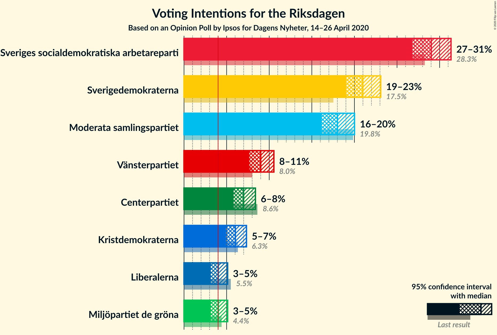

### Confidence Intervals

| Party | Last Result | Poll Result | 80% Confidence Interval | 90% Confidence Interval | 95% Confidence Interval | 99% Confidence Interval |
|:-----:|:-----------:|:-----------:|:-----------------------:|:-----------------------:|:-----------------------:|:-----------------------:|
| Sveriges socialdemokratiska arbetareparti | 28.3% | 29.0% | 27.6–30.5% |27.1–31.0% |26.8–31.3% |26.1–32.1% |
| Sverigedemokraterna | 17.5% | 21.0% | 19.7–22.4% |19.3–22.8% |19.0–23.1% |18.4–23.8% |
| Moderata samlingspartiet | 19.8% | 18.0% | 16.8–19.3% |16.5–19.7% |16.2–20.0% |15.6–20.7% |
| Vänsterpartiet | 8.0% | 9.0% | 8.1–10.0% |7.9–10.3% |7.7–10.5% |7.3–11.0% |
| Centerpartiet | 8.6% | 7.0% | 6.2–7.9% |6.0–8.2% |5.8–8.4% |5.5–8.8% |
| Kristdemokraterna | 6.3% | 6.0% | 5.3–6.9% |5.1–7.1% |4.9–7.3% |4.6–7.8% |
| Liberalerna | 5.5% | 4.0% | 3.4–4.7% |3.3–4.9% |3.1–5.1% |2.9–5.5% |
| Miljöpartiet de gröna | 4.4% | 4.0% | 3.4–4.7% |3.3–4.9% |3.1–5.1% |2.9–5.5% |

*Note:* The poll result column reflects the actual value used in the calculations. Published results may vary slightly, and in addition be rounded to fewer digits.

## Seats

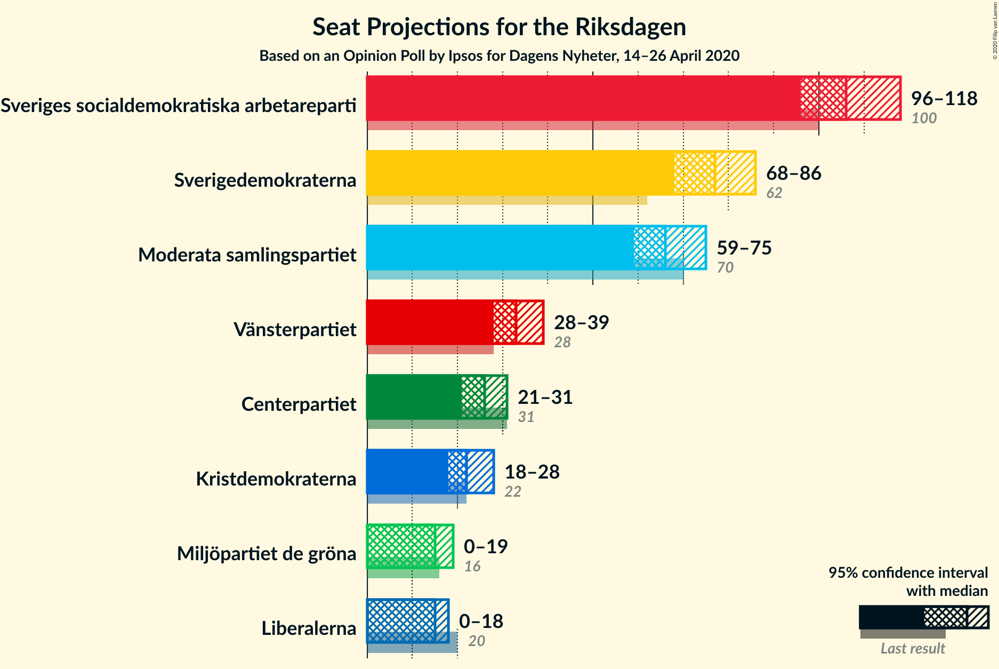

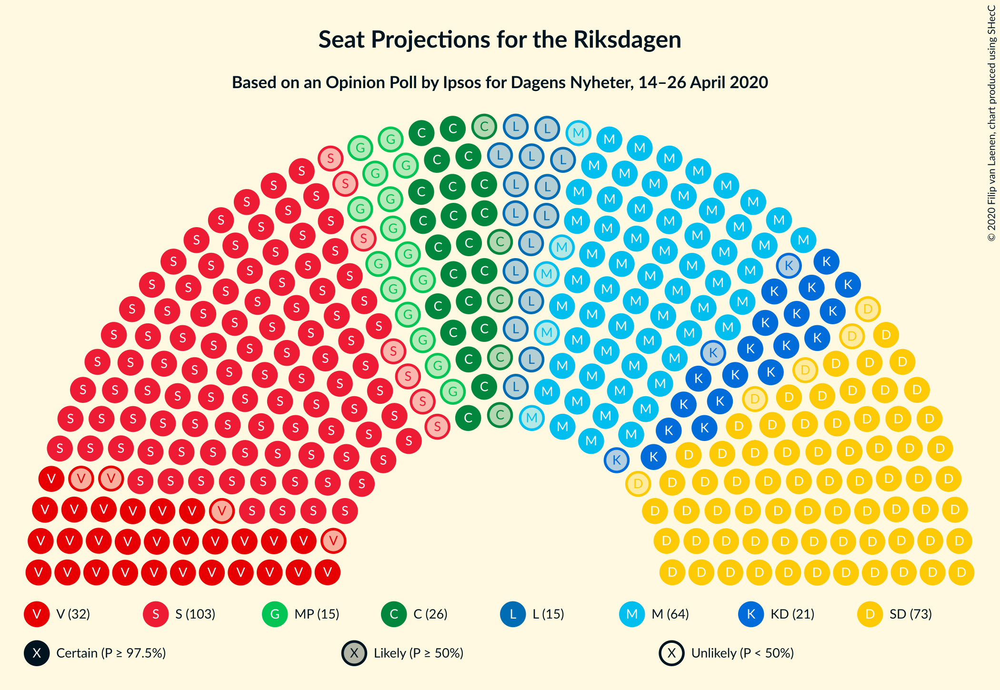

### Confidence Intervals

| Party | Last Result | Median | 80% Confidence Interval | 90% Confidence Interval | 95% Confidence Interval | 99% Confidence Interval |
|:-----:|:-----------:|:------:|:-----------------------:|:-----------------------:|:-----------------------:|:-----------------------:|
| <a href="#sveriges-socialdemokratiska-arbetareparti">Sveriges socialdemokratiska arbetareparti</a> | 100 | 106 | 99–114 |98–115 |96–118 |94–121 |
| <a href="#sverigedemokraterna">Sverigedemokraterna</a> | 62 | 77 | 71–83 |70–84 |68–86 |66–89 |
| <a href="#moderata-samlingspartiet">Moderata samlingspartiet</a> | 70 | 66 | 61–72 |60–74 |59–75 |56–77 |
| <a href="#vänsterpartiet">Vänsterpartiet</a> | 28 | 33 | 30–37 |29–38 |28–39 |26–41 |
| <a href="#centerpartiet">Centerpartiet</a> | 31 | 26 | 23–29 |22–30 |21–31 |20–33 |
| <a href="#kristdemokraterna">Kristdemokraterna</a> | 22 | 22 | 19–25 |19–26 |18–28 |17–28 |
| <a href="#liberalerna">Liberalerna</a> | 20 | 15 | 0–17 |0–18 |0–18 |0–20 |
| <a href="#miljöpartiet-de-gröna">Miljöpartiet de gröna</a> | 16 | 15 | 0–17 |0–18 |0–19 |0–20 |

### Sveriges socialdemokratiska arbetareparti

*For a full overview of the results for this party, see the [Sveriges socialdemokratiska arbetareparti](party-sverigessocialdemokratiskaarbetareparti.html) page.*

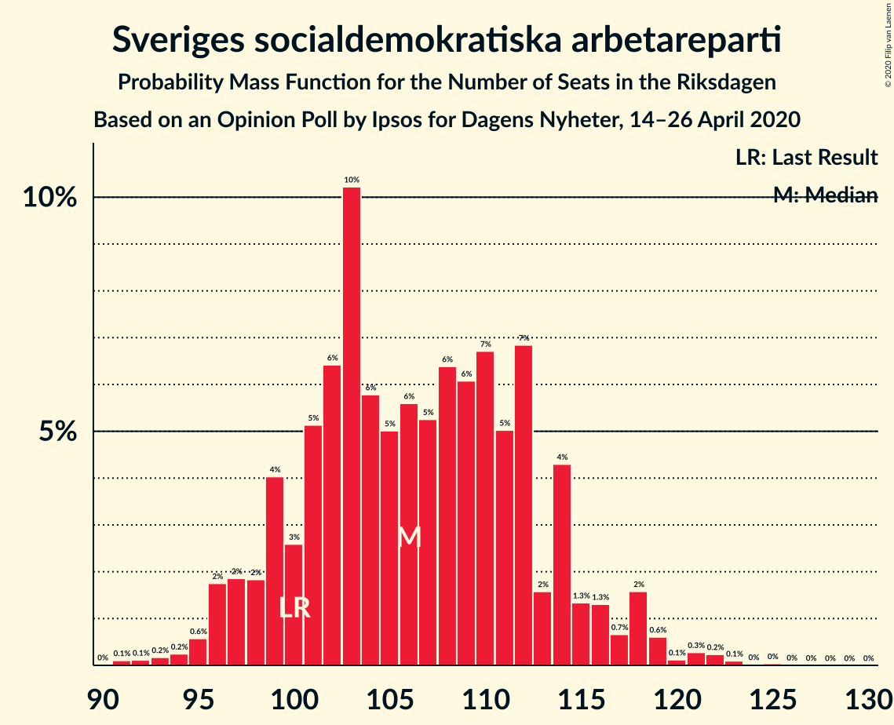

| Number of Seats | Probability | Accumulated | Special Marks |
|:---------------:|:-----------:|:-----------:|:-------------:|
| 91 | 0.1% | 100% |  |
| 92 | 0.1% | 99.9% |  |
| 93 | 0.2% | 99.7% |  |
| 94 | 0.2% | 99.6% |  |
| 95 | 0.6% | 99.3% |  |
| 96 | 2% | 98.7% |  |
| 97 | 2% | 97% |  |
| 98 | 2% | 95% |  |
| 99 | 4% | 93% |  |
| 100 | 3% | 89% | Last Result |
| 101 | 5% | 87% |  |
| 102 | 6% | 82% |  |
| 103 | 10% | 75% |  |
| 104 | 6% | 65% |  |
| 105 | 5% | 59% |  |
| 106 | 6% | 54% | Median |
| 107 | 5% | 49% |  |
| 108 | 6% | 43% |  |
| 109 | 6% | 37% |  |
| 110 | 7% | 31% |  |
| 111 | 5% | 24% |  |
| 112 | 7% | 19% |  |
| 113 | 2% | 12% |  |
| 114 | 4% | 11% |  |
| 115 | 1.3% | 6% |  |
| 116 | 1.3% | 5% |  |
| 117 | 0.7% | 4% |  |
| 118 | 2% | 3% |  |
| 119 | 0.6% | 1.4% |  |
| 120 | 0.1% | 0.8% |  |
| 121 | 0.3% | 0.7% |  |
| 122 | 0.2% | 0.4% |  |
| 123 | 0.1% | 0.2% |  |
| 124 | 0% | 0.1% |  |
| 125 | 0% | 0.1% |  |
| 126 | 0% | 0% |  |

### Sverigedemokraterna

*For a full overview of the results for this party, see the [Sverigedemokraterna](party-sverigedemokraterna.html) page.*

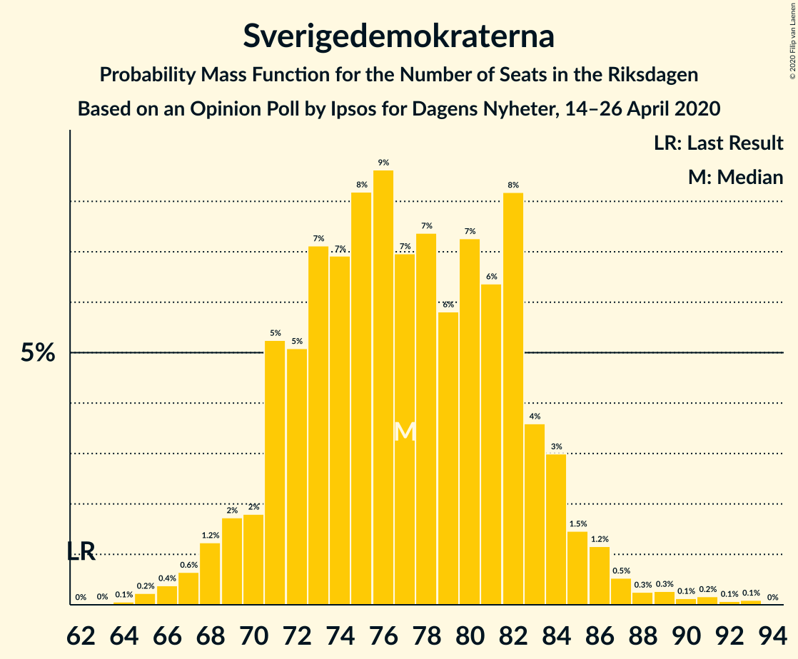

| Number of Seats | Probability | Accumulated | Special Marks |
|:---------------:|:-----------:|:-----------:|:-------------:|
| 62 | 0% | 100% | Last Result |
| 63 | 0% | 100% |  |
| 64 | 0.1% | 100% |  |
| 65 | 0.2% | 99.9% |  |
| 66 | 0.4% | 99.7% |  |
| 67 | 0.6% | 99.3% |  |
| 68 | 1.2% | 98.6% |  |
| 69 | 2% | 97% |  |
| 70 | 2% | 96% |  |
| 71 | 5% | 94% |  |
| 72 | 5% | 89% |  |
| 73 | 7% | 84% |  |
| 74 | 7% | 76% |  |
| 75 | 8% | 70% |  |
| 76 | 9% | 61% |  |
| 77 | 7% | 53% | Median |
| 78 | 7% | 46% |  |
| 79 | 6% | 38% |  |
| 80 | 7% | 33% |  |
| 81 | 6% | 25% |  |
| 82 | 8% | 19% |  |
| 83 | 4% | 11% |  |
| 84 | 3% | 7% |  |
| 85 | 1.5% | 4% |  |
| 86 | 1.2% | 3% |  |
| 87 | 0.5% | 2% |  |
| 88 | 0.3% | 1.0% |  |
| 89 | 0.3% | 0.7% |  |
| 90 | 0.1% | 0.5% |  |
| 91 | 0.2% | 0.3% |  |
| 92 | 0.1% | 0.2% |  |
| 93 | 0.1% | 0.1% |  |
| 94 | 0% | 0% |  |

### Moderata samlingspartiet

*For a full overview of the results for this party, see the [Moderata samlingspartiet](party-moderatasamlingspartiet.html) page.*

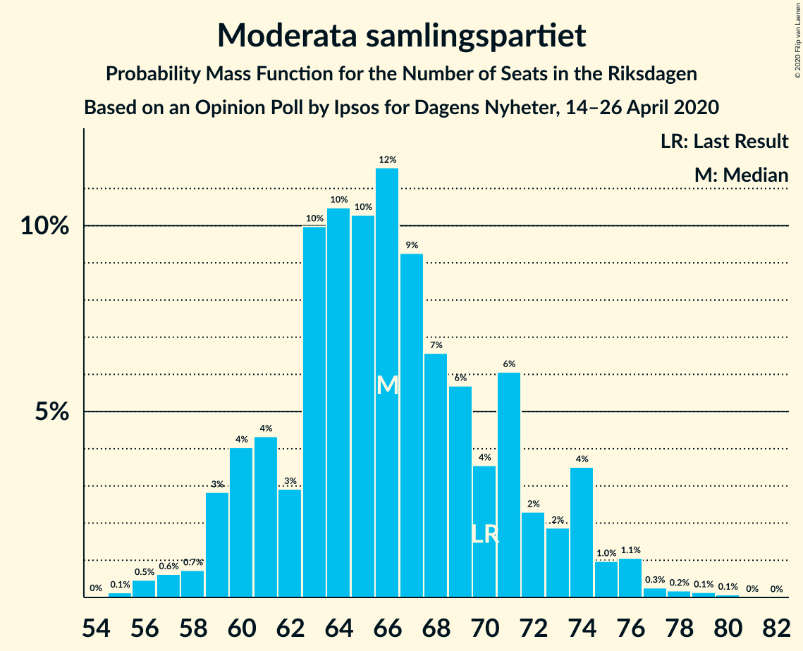

| Number of Seats | Probability | Accumulated | Special Marks |
|:---------------:|:-----------:|:-----------:|:-------------:|
| 54 | 0% | 100% |  |
| 55 | 0.1% | 99.9% |  |
| 56 | 0.5% | 99.8% |  |
| 57 | 0.6% | 99.3% |  |
| 58 | 0.7% | 98.7% |  |
| 59 | 3% | 98% |  |
| 60 | 4% | 95% |  |
| 61 | 4% | 91% |  |
| 62 | 3% | 87% |  |
| 63 | 10% | 84% |  |
| 64 | 10% | 74% |  |
| 65 | 10% | 63% |  |
| 66 | 12% | 53% | Median |
| 67 | 9% | 42% |  |
| 68 | 7% | 32% |  |
| 69 | 6% | 26% |  |
| 70 | 4% | 20% | Last Result |
| 71 | 6% | 16% |  |
| 72 | 2% | 10% |  |
| 73 | 2% | 8% |  |
| 74 | 4% | 6% |  |
| 75 | 1.0% | 3% |  |
| 76 | 1.1% | 2% |  |
| 77 | 0.3% | 0.7% |  |
| 78 | 0.2% | 0.4% |  |
| 79 | 0.1% | 0.2% |  |
| 80 | 0.1% | 0.1% |  |
| 81 | 0% | 0% |  |

### Vänsterpartiet

*For a full overview of the results for this party, see the [Vänsterpartiet](party-vänsterpartiet.html) page.*

| Number of Seats | Probability | Accumulated | Special Marks |
|:---------------:|:-----------:|:-----------:|:-------------:|
| 25 | 0.1% | 100% |  |
| 26 | 0.4% | 99.8% |  |
| 27 | 0.7% | 99.4% |  |
| 28 | 3% | 98.7% | Last Result |
| 29 | 5% | 96% |  |
| 30 | 10% | 91% |  |
| 31 | 9% | 81% |  |
| 32 | 15% | 72% |  |
| 33 | 11% | 57% | Median |
| 34 | 17% | 46% |  |
| 35 | 10% | 29% |  |
| 36 | 8% | 20% |  |
| 37 | 5% | 12% |  |
| 38 | 2% | 7% |  |
| 39 | 3% | 5% |  |
| 40 | 0.6% | 1.4% |  |
| 41 | 0.4% | 0.7% |  |
| 42 | 0.2% | 0.3% |  |
| 43 | 0.1% | 0.1% |  |
| 44 | 0% | 0.1% |  |
| 45 | 0% | 0% |  |

### Centerpartiet

*For a full overview of the results for this party, see the [Centerpartiet](party-centerpartiet.html) page.*

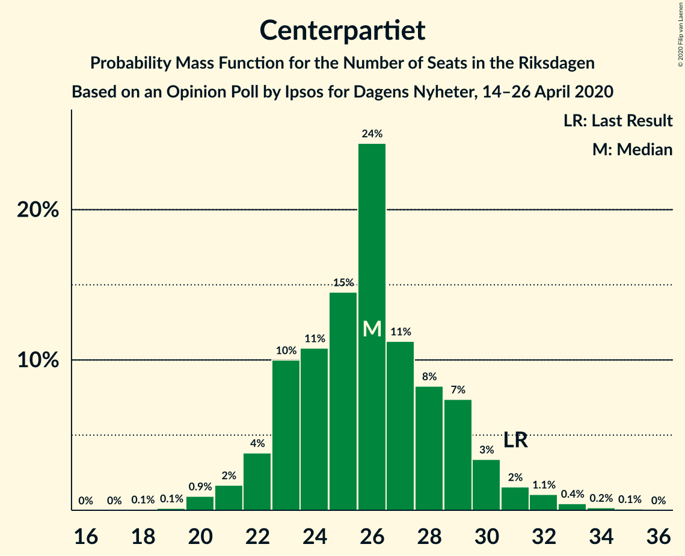

| Number of Seats | Probability | Accumulated | Special Marks |
|:---------------:|:-----------:|:-----------:|:-------------:|
| 18 | 0.1% | 100% |  |
| 19 | 0.1% | 99.9% |  |
| 20 | 0.9% | 99.8% |  |
| 21 | 2% | 98.9% |  |
| 22 | 4% | 97% |  |
| 23 | 10% | 93% |  |
| 24 | 11% | 83% |  |
| 25 | 15% | 73% |  |
| 26 | 24% | 58% | Median |
| 27 | 11% | 34% |  |
| 28 | 8% | 22% |  |
| 29 | 7% | 14% |  |
| 30 | 3% | 7% |  |
| 31 | 2% | 3% | Last Result |
| 32 | 1.1% | 2% |  |
| 33 | 0.4% | 0.7% |  |
| 34 | 0.2% | 0.3% |  |
| 35 | 0.1% | 0.1% |  |
| 36 | 0% | 0% |  |

### Kristdemokraterna

*For a full overview of the results for this party, see the [Kristdemokraterna](party-kristdemokraterna.html) page.*

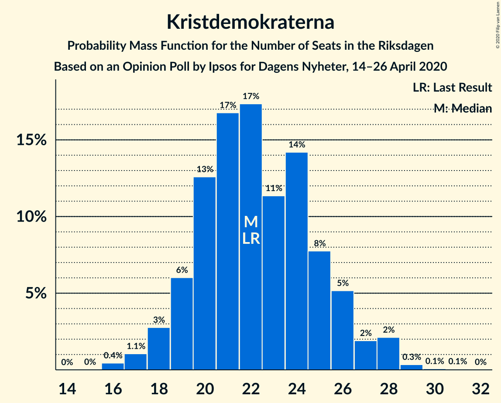

| Number of Seats | Probability | Accumulated | Special Marks |
|:---------------:|:-----------:|:-----------:|:-------------:|
| 16 | 0.4% | 100% |  |
| 17 | 1.1% | 99.5% |  |
| 18 | 3% | 98% |  |
| 19 | 6% | 96% |  |
| 20 | 13% | 90% |  |
| 21 | 17% | 77% |  |
| 22 | 17% | 60% | Last Result, Median |
| 23 | 11% | 43% |  |
| 24 | 14% | 32% |  |
| 25 | 8% | 17% |  |
| 26 | 5% | 10% |  |
| 27 | 2% | 5% |  |
| 28 | 2% | 3% |  |
| 29 | 0.3% | 0.5% |  |
| 30 | 0.1% | 0.2% |  |
| 31 | 0.1% | 0.1% |  |
| 32 | 0% | 0% |  |

### Liberalerna

*For a full overview of the results for this party, see the [Liberalerna](party-liberalerna.html) page.*

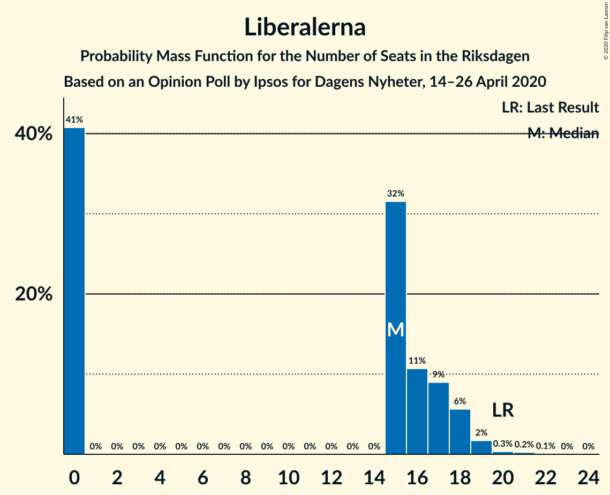

| Number of Seats | Probability | Accumulated | Special Marks |
|:---------------:|:-----------:|:-----------:|:-------------:|
| 0 | 41% | 100% |  |
| 1 | 0% | 59% |  |
| 2 | 0% | 59% |  |
| 3 | 0% | 59% |  |
| 4 | 0% | 59% |  |
| 5 | 0% | 59% |  |
| 6 | 0% | 59% |  |
| 7 | 0% | 59% |  |
| 8 | 0% | 59% |  |
| 9 | 0% | 59% |  |
| 10 | 0% | 59% |  |
| 11 | 0% | 59% |  |
| 12 | 0% | 59% |  |
| 13 | 0% | 59% |  |
| 14 | 0% | 59% |  |
| 15 | 32% | 59% | Median |
| 16 | 11% | 28% |  |
| 17 | 9% | 17% |  |
| 18 | 6% | 8% |  |
| 19 | 2% | 2% |  |
| 20 | 0.3% | 0.6% | Last Result |
| 21 | 0.2% | 0.3% |  |
| 22 | 0.1% | 0.1% |  |
| 23 | 0% | 0% |  |

### Miljöpartiet de gröna

*For a full overview of the results for this party, see the [Miljöpartiet de gröna](party-miljöpartietdegröna.html) page.*

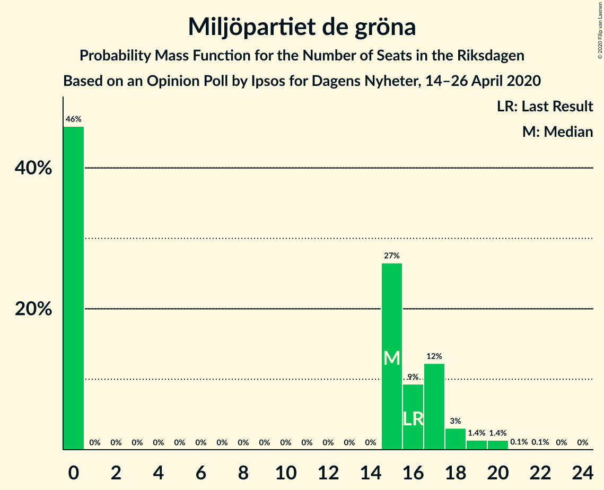

| Number of Seats | Probability | Accumulated | Special Marks |
|:---------------:|:-----------:|:-----------:|:-------------:|
| 0 | 46% | 100% |  |
| 1 | 0% | 54% |  |
| 2 | 0% | 54% |  |
| 3 | 0% | 54% |  |
| 4 | 0% | 54% |  |
| 5 | 0% | 54% |  |
| 6 | 0% | 54% |  |
| 7 | 0% | 54% |  |
| 8 | 0% | 54% |  |
| 9 | 0% | 54% |  |
| 10 | 0% | 54% |  |
| 11 | 0% | 54% |  |
| 12 | 0% | 54% |  |
| 13 | 0% | 54% |  |
| 14 | 0% | 54% |  |
| 15 | 27% | 54% | Median |
| 16 | 9% | 28% | Last Result |
| 17 | 12% | 18% |  |
| 18 | 3% | 6% |  |
| 19 | 1.4% | 3% |  |
| 20 | 1.4% | 2% |  |
| 21 | 0.1% | 0.2% |  |
| 22 | 0.1% | 0.1% |  |
| 23 | 0% | 0% |  |

## Coalitions

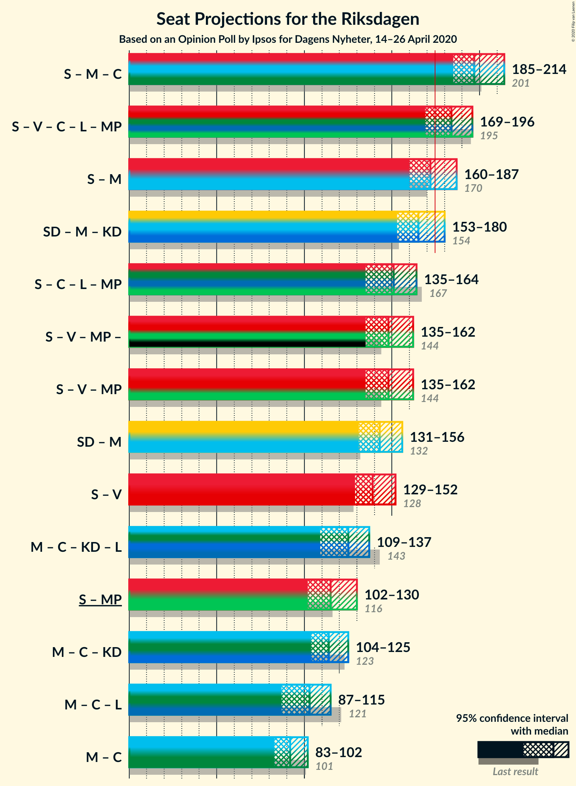

### Confidence Intervals

| Coalition | Last Result | Median | Majority? | 80% Confidence Interval | 90% Confidence Interval | 95% Confidence Interval | 99% Confidence Interval |
|:---------:|:-----------:|:------:|:---------:|:-----------------------:|:-----------------------:|:-----------------------:|:-----------------------:|
| Sveriges socialdemokratiska arbetareparti – Moderata samlingspartiet – Centerpartiet | 201 | 197 | 100% | 189–209 | 186–212 | 185–214 | 181–218 |
| Sveriges socialdemokratiska arbetareparti – Vänsterpartiet – Centerpartiet – Liberalerna – Miljöpartiet de gröna | 195 | 184 | 88% | 174–192 | 171–194 | 169–196 | 165–199 |
| Sveriges socialdemokratiska arbetareparti – Moderata samlingspartiet | 170 | 172 | 38% | 163–183 | 161–185 | 160–187 | 157–191 |
| Sverigedemokraterna – Moderata samlingspartiet – Kristdemokraterna | 154 | 165 | 12% | 157–175 | 155–178 | 153–180 | 150–184 |
| Sveriges socialdemokratiska arbetareparti – Centerpartiet – Liberalerna – Miljöpartiet de gröna | 167 | 151 | 0% | 140–160 | 137–162 | 135–164 | 131–168 |
| Sveriges socialdemokratiska arbetareparti – Vänsterpartiet – Miljöpartiet de gröna | 144 | 148 | 0% | 138–158 | 136–160 | 135–162 | 131–166 |
| Sverigedemokraterna – Moderata samlingspartiet | 132 | 143 | 0% | 136–152 | 133–155 | 131–156 | 129–160 |
| Sveriges socialdemokratiska arbetareparti – Vänsterpartiet | 128 | 139 | 0% | 132–148 | 130–149 | 129–152 | 125–157 |
| Moderata samlingspartiet – Centerpartiet – Kristdemokraterna – Liberalerna | 143 | 125 | 0% | 113–133 | 110–135 | 109–137 | 107–141 |
| Sveriges socialdemokratiska arbetareparti – Miljöpartiet de gröna | 116 | 115 | 0% | 105–126 | 102–127 | 102–130 | 98–133 |
| Moderata samlingspartiet – Centerpartiet – Kristdemokraterna | 123 | 114 | 0% | 108–122 | 106–124 | 104–125 | 102–129 |
| Moderata samlingspartiet – Centerpartiet – Liberalerna | 121 | 103 | 0% | 90–110 | 88–113 | 87–115 | 84–118 |
| Moderata samlingspartiet – Centerpartiet | 101 | 92 | 0% | 86–99 | 85–100 | 83–102 | 80–105 |

### Sveriges socialdemokratiska arbetareparti – Moderata samlingspartiet – Centerpartiet

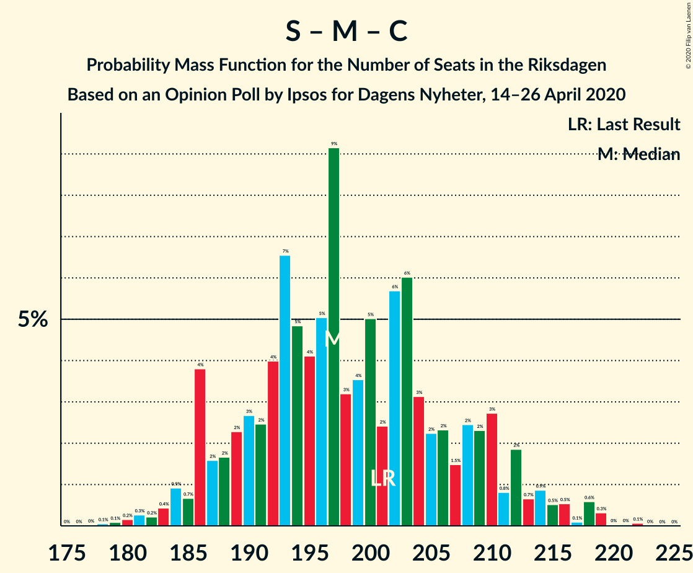

| Number of Seats | Probability | Accumulated | Special Marks |
|:---------------:|:-----------:|:-----------:|:-------------:|
| 178 | 0.1% | 100% |  |
| 179 | 0.1% | 99.9% |  |
| 180 | 0.2% | 99.8% |  |
| 181 | 0.3% | 99.7% |  |
| 182 | 0.2% | 99.4% |  |
| 183 | 0.4% | 99.2% |  |
| 184 | 0.9% | 98.7% |  |
| 185 | 0.7% | 98% |  |
| 186 | 4% | 97% |  |
| 187 | 2% | 93% |  |
| 188 | 2% | 92% |  |
| 189 | 2% | 90% |  |
| 190 | 3% | 88% |  |
| 191 | 2% | 85% |  |
| 192 | 4% | 83% |  |
| 193 | 7% | 79% |  |
| 194 | 5% | 72% |  |
| 195 | 4% | 67% |  |
| 196 | 5% | 63% |  |
| 197 | 9% | 58% |  |
| 198 | 3% | 49% | Median |
| 199 | 4% | 46% |  |
| 200 | 5% | 42% |  |
| 201 | 2% | 37% | Last Result |
| 202 | 6% | 35% |  |
| 203 | 6% | 29% |  |
| 204 | 3% | 23% |  |
| 205 | 2% | 20% |  |
| 206 | 2% | 18% |  |
| 207 | 1.5% | 15% |  |
| 208 | 2% | 14% |  |
| 209 | 2% | 11% |  |
| 210 | 3% | 9% |  |
| 211 | 0.8% | 6% |  |
| 212 | 2% | 6% |  |
| 213 | 0.7% | 4% |  |
| 214 | 0.9% | 3% |  |
| 215 | 0.5% | 2% |  |
| 216 | 0.5% | 2% |  |
| 217 | 0.1% | 1.2% |  |
| 218 | 0.6% | 1.1% |  |
| 219 | 0.3% | 0.5% |  |
| 220 | 0% | 0.1% |  |
| 221 | 0% | 0.1% |  |
| 222 | 0.1% | 0.1% |  |
| 223 | 0% | 0% |  |

### Sveriges socialdemokratiska arbetareparti – Vänsterpartiet – Centerpartiet – Liberalerna – Miljöpartiet de gröna

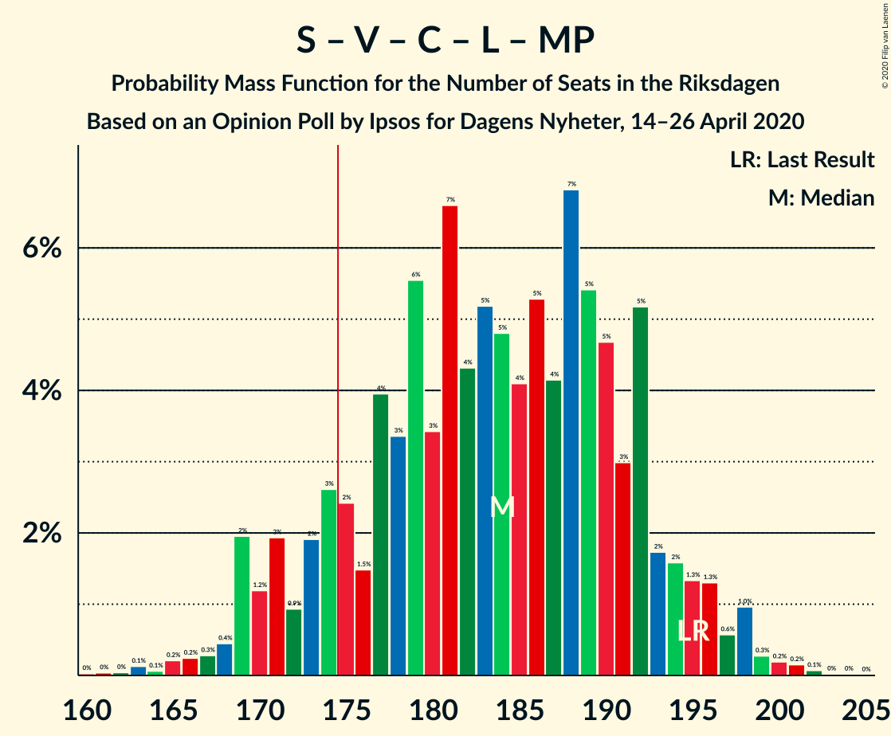

| Number of Seats | Probability | Accumulated | Special Marks |
|:---------------:|:-----------:|:-----------:|:-------------:|
| 161 | 0% | 100% |  |
| 162 | 0% | 99.9% |  |
| 163 | 0.1% | 99.9% |  |
| 164 | 0.1% | 99.7% |  |
| 165 | 0.2% | 99.7% |  |
| 166 | 0.2% | 99.5% |  |
| 167 | 0.3% | 99.2% |  |
| 168 | 0.4% | 98.9% |  |
| 169 | 2% | 98% |  |
| 170 | 1.2% | 97% |  |
| 171 | 2% | 95% |  |
| 172 | 0.9% | 93% |  |
| 173 | 2% | 92% |  |
| 174 | 3% | 91% |  |
| 175 | 2% | 88% | Majority |
| 176 | 1.5% | 86% |  |
| 177 | 4% | 84% |  |
| 178 | 3% | 80% |  |
| 179 | 6% | 77% |  |
| 180 | 3% | 71% |  |
| 181 | 7% | 68% |  |
| 182 | 4% | 61% |  |
| 183 | 5% | 57% |  |
| 184 | 5% | 52% |  |
| 185 | 4% | 47% |  |
| 186 | 5% | 43% |  |
| 187 | 4% | 37% |  |
| 188 | 7% | 33% |  |
| 189 | 5% | 27% |  |
| 190 | 5% | 21% |  |
| 191 | 3% | 16% |  |
| 192 | 5% | 13% |  |
| 193 | 2% | 8% |  |
| 194 | 2% | 7% |  |
| 195 | 1.3% | 5% | Last Result, Median |
| 196 | 1.3% | 4% |  |
| 197 | 0.6% | 2% |  |
| 198 | 1.0% | 2% |  |
| 199 | 0.3% | 0.7% |  |
| 200 | 0.2% | 0.5% |  |
| 201 | 0.2% | 0.3% |  |
| 202 | 0.1% | 0.1% |  |
| 203 | 0% | 0.1% |  |
| 204 | 0% | 0% |  |

### Sveriges socialdemokratiska arbetareparti – Moderata samlingspartiet

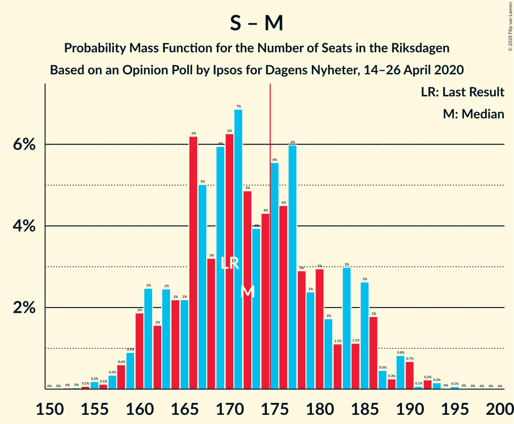

| Number of Seats | Probability | Accumulated | Special Marks |
|:---------------:|:-----------:|:-----------:|:-------------:|
| 153 | 0% | 100% |  |
| 154 | 0.1% | 99.9% |  |
| 155 | 0.2% | 99.9% |  |
| 156 | 0.1% | 99.7% |  |
| 157 | 0.3% | 99.6% |  |
| 158 | 0.6% | 99.2% |  |
| 159 | 0.9% | 98.6% |  |
| 160 | 2% | 98% |  |
| 161 | 2% | 96% |  |
| 162 | 2% | 93% |  |
| 163 | 2% | 92% |  |
| 164 | 2% | 89% |  |
| 165 | 2% | 87% |  |
| 166 | 6% | 85% |  |
| 167 | 5% | 79% |  |
| 168 | 3% | 74% |  |
| 169 | 6% | 71% |  |
| 170 | 6% | 65% | Last Result |
| 171 | 7% | 58% |  |
| 172 | 5% | 51% | Median |
| 173 | 4% | 47% |  |
| 174 | 4% | 43% |  |
| 175 | 6% | 38% | Majority |
| 176 | 4% | 33% |  |
| 177 | 6% | 28% |  |
| 178 | 3% | 22% |  |
| 179 | 2% | 19% |  |
| 180 | 3% | 17% |  |
| 181 | 2% | 14% |  |
| 182 | 1.1% | 12% |  |
| 183 | 3% | 11% |  |
| 184 | 1.1% | 8% |  |
| 185 | 3% | 7% |  |
| 186 | 2% | 5% |  |
| 187 | 0.5% | 3% |  |
| 188 | 0.3% | 2% |  |
| 189 | 0.8% | 2% |  |
| 190 | 0.7% | 1.2% |  |
| 191 | 0.1% | 0.6% |  |
| 192 | 0.2% | 0.5% |  |
| 193 | 0.2% | 0.3% |  |
| 194 | 0% | 0.1% |  |
| 195 | 0.1% | 0.1% |  |
| 196 | 0% | 0% |  |

### Sverigedemokraterna – Moderata samlingspartiet – Kristdemokraterna

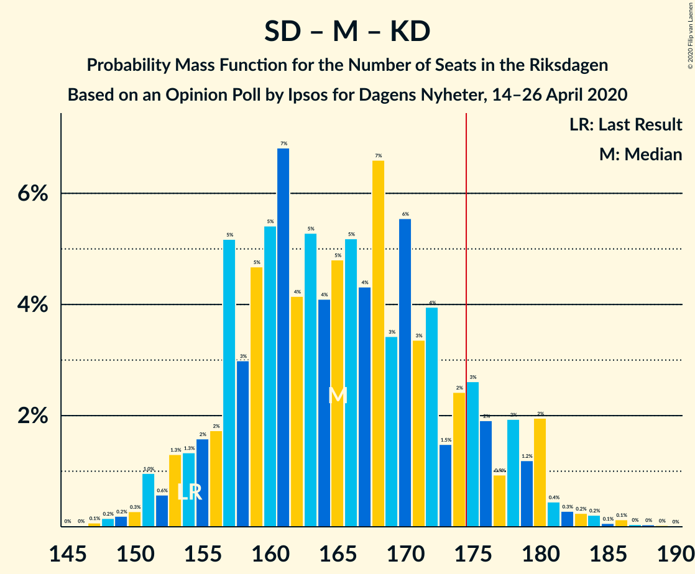

| Number of Seats | Probability | Accumulated | Special Marks |
|:---------------:|:-----------:|:-----------:|:-------------:|
| 146 | 0% | 100% |  |
| 147 | 0.1% | 99.9% |  |
| 148 | 0.2% | 99.9% |  |
| 149 | 0.2% | 99.7% |  |
| 150 | 0.3% | 99.5% |  |
| 151 | 1.0% | 99.3% |  |
| 152 | 0.6% | 98% |  |
| 153 | 1.3% | 98% |  |
| 154 | 1.3% | 96% | Last Result |
| 155 | 2% | 95% |  |
| 156 | 2% | 93% |  |
| 157 | 5% | 92% |  |
| 158 | 3% | 87% |  |
| 159 | 5% | 84% |  |
| 160 | 5% | 79% |  |
| 161 | 7% | 73% |  |
| 162 | 4% | 67% |  |
| 163 | 5% | 63% |  |
| 164 | 4% | 57% |  |
| 165 | 5% | 53% | Median |
| 166 | 5% | 48% |  |
| 167 | 4% | 43% |  |
| 168 | 7% | 39% |  |
| 169 | 3% | 32% |  |
| 170 | 6% | 29% |  |
| 171 | 3% | 23% |  |
| 172 | 4% | 20% |  |
| 173 | 1.5% | 16% |  |
| 174 | 2% | 14% |  |
| 175 | 3% | 12% | Majority |
| 176 | 2% | 9% |  |
| 177 | 0.9% | 8% |  |
| 178 | 2% | 7% |  |
| 179 | 1.2% | 5% |  |
| 180 | 2% | 3% |  |
| 181 | 0.4% | 2% |  |
| 182 | 0.3% | 1.1% |  |
| 183 | 0.2% | 0.8% |  |
| 184 | 0.2% | 0.5% |  |
| 185 | 0.1% | 0.3% |  |
| 186 | 0.1% | 0.3% |  |
| 187 | 0% | 0.1% |  |
| 188 | 0% | 0.1% |  |
| 189 | 0% | 0% |  |

### Sveriges socialdemokratiska arbetareparti – Centerpartiet – Liberalerna – Miljöpartiet de gröna

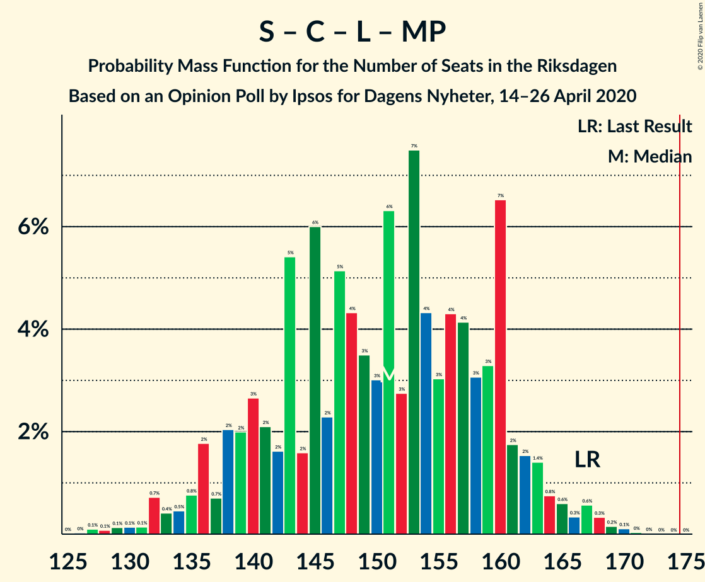

| Number of Seats | Probability | Accumulated | Special Marks |
|:---------------:|:-----------:|:-----------:|:-------------:|
| 127 | 0.1% | 100% |  |
| 128 | 0.1% | 99.9% |  |
| 129 | 0.1% | 99.8% |  |
| 130 | 0.1% | 99.6% |  |
| 131 | 0.1% | 99.5% |  |
| 132 | 0.7% | 99.4% |  |
| 133 | 0.4% | 98.6% |  |
| 134 | 0.5% | 98% |  |
| 135 | 0.8% | 98% |  |
| 136 | 2% | 97% |  |
| 137 | 0.7% | 95% |  |
| 138 | 2% | 95% |  |
| 139 | 2% | 92% |  |
| 140 | 3% | 90% |  |
| 141 | 2% | 88% |  |
| 142 | 2% | 86% |  |
| 143 | 5% | 84% |  |
| 144 | 2% | 79% |  |
| 145 | 6% | 77% |  |
| 146 | 2% | 71% |  |
| 147 | 5% | 69% |  |
| 148 | 4% | 64% |  |
| 149 | 3% | 59% |  |
| 150 | 3% | 56% |  |
| 151 | 6% | 53% |  |
| 152 | 3% | 47% |  |
| 153 | 7% | 44% |  |
| 154 | 4% | 36% |  |
| 155 | 3% | 32% |  |
| 156 | 4% | 29% |  |
| 157 | 4% | 25% |  |
| 158 | 3% | 20% |  |
| 159 | 3% | 17% |  |
| 160 | 7% | 14% |  |
| 161 | 2% | 8% |  |
| 162 | 2% | 6% | Median |
| 163 | 1.4% | 4% |  |
| 164 | 0.8% | 3% |  |
| 165 | 0.6% | 2% |  |
| 166 | 0.3% | 2% |  |
| 167 | 0.6% | 1.2% | Last Result |
| 168 | 0.3% | 0.7% |  |
| 169 | 0.2% | 0.3% |  |
| 170 | 0.1% | 0.2% |  |
| 171 | 0% | 0.1% |  |
| 172 | 0% | 0% |  |

### Sveriges socialdemokratiska arbetareparti – Vänsterpartiet – Miljöpartiet de gröna

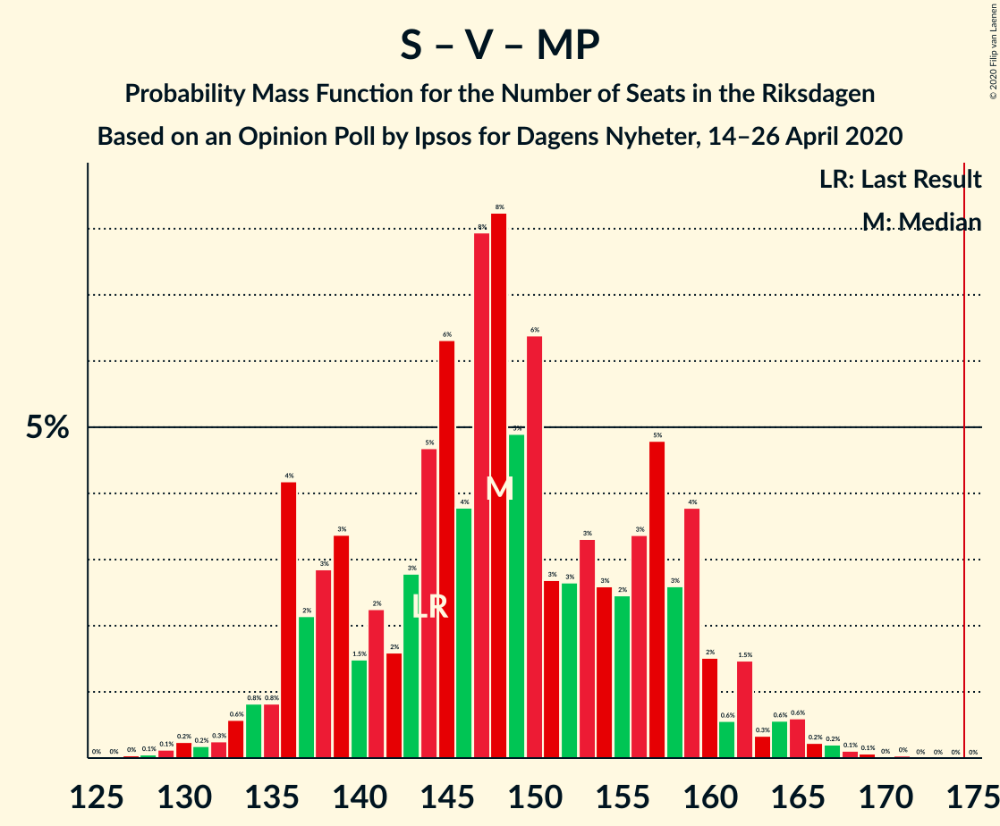

| Number of Seats | Probability | Accumulated | Special Marks |
|:---------------:|:-----------:|:-----------:|:-------------:|
| 127 | 0% | 100% |  |
| 128 | 0.1% | 99.9% |  |
| 129 | 0.1% | 99.9% |  |
| 130 | 0.2% | 99.8% |  |
| 131 | 0.2% | 99.5% |  |
| 132 | 0.3% | 99.3% |  |
| 133 | 0.6% | 99.1% |  |
| 134 | 0.8% | 98.5% |  |
| 135 | 0.8% | 98% |  |
| 136 | 4% | 97% |  |
| 137 | 2% | 93% |  |
| 138 | 3% | 91% |  |
| 139 | 3% | 88% |  |
| 140 | 1.5% | 84% |  |
| 141 | 2% | 83% |  |
| 142 | 2% | 81% |  |
| 143 | 3% | 79% |  |
| 144 | 5% | 76% | Last Result |
| 145 | 6% | 72% |  |
| 146 | 4% | 65% |  |
| 147 | 8% | 61% |  |
| 148 | 8% | 53% |  |
| 149 | 5% | 45% |  |
| 150 | 6% | 40% |  |
| 151 | 3% | 34% |  |
| 152 | 3% | 31% |  |
| 153 | 3% | 29% |  |
| 154 | 3% | 25% | Median |
| 155 | 2% | 23% |  |
| 156 | 3% | 20% |  |
| 157 | 5% | 17% |  |
| 158 | 3% | 12% |  |
| 159 | 4% | 9% |  |
| 160 | 2% | 6% |  |
| 161 | 0.6% | 4% |  |
| 162 | 1.5% | 4% |  |
| 163 | 0.3% | 2% |  |
| 164 | 0.6% | 2% |  |
| 165 | 0.6% | 1.3% |  |
| 166 | 0.2% | 0.7% |  |
| 167 | 0.2% | 0.4% |  |
| 168 | 0.1% | 0.2% |  |
| 169 | 0.1% | 0.1% |  |
| 170 | 0% | 0.1% |  |
| 171 | 0% | 0% |  |

### Sverigedemokraterna – Moderata samlingspartiet

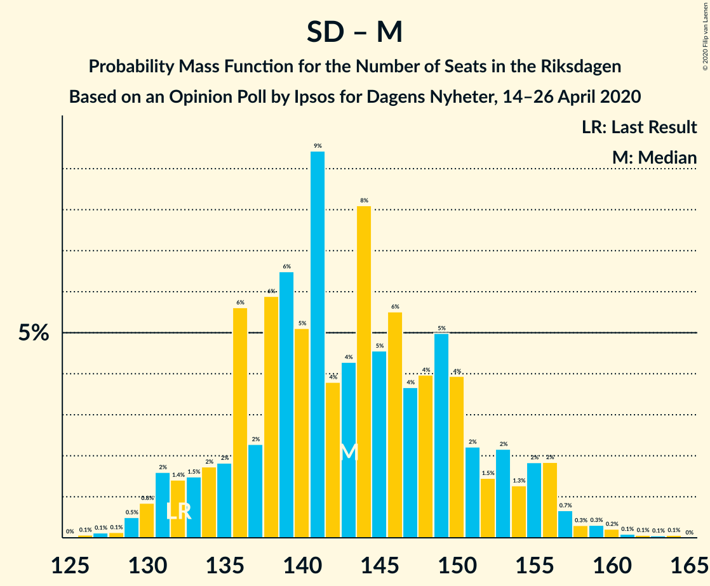

| Number of Seats | Probability | Accumulated | Special Marks |
|:---------------:|:-----------:|:-----------:|:-------------:|
| 125 | 0% | 100% |  |
| 126 | 0.1% | 99.9% |  |
| 127 | 0.1% | 99.9% |  |
| 128 | 0.1% | 99.7% |  |
| 129 | 0.5% | 99.6% |  |
| 130 | 0.8% | 99.1% |  |
| 131 | 2% | 98% |  |
| 132 | 1.4% | 97% | Last Result |
| 133 | 1.5% | 95% |  |
| 134 | 2% | 94% |  |
| 135 | 2% | 92% |  |
| 136 | 6% | 90% |  |
| 137 | 2% | 85% |  |
| 138 | 6% | 82% |  |
| 139 | 6% | 76% |  |
| 140 | 5% | 70% |  |
| 141 | 9% | 65% |  |
| 142 | 4% | 55% |  |
| 143 | 4% | 52% | Median |
| 144 | 8% | 47% |  |
| 145 | 5% | 39% |  |
| 146 | 6% | 35% |  |
| 147 | 4% | 29% |  |
| 148 | 4% | 25% |  |
| 149 | 5% | 22% |  |
| 150 | 4% | 17% |  |
| 151 | 2% | 13% |  |
| 152 | 1.5% | 10% |  |
| 153 | 2% | 9% |  |
| 154 | 1.3% | 7% |  |
| 155 | 2% | 5% |  |
| 156 | 2% | 4% |  |
| 157 | 0.7% | 2% |  |
| 158 | 0.3% | 1.1% |  |
| 159 | 0.3% | 0.8% |  |
| 160 | 0.2% | 0.5% |  |
| 161 | 0.1% | 0.3% |  |
| 162 | 0.1% | 0.2% |  |
| 163 | 0.1% | 0.2% |  |
| 164 | 0.1% | 0.1% |  |
| 165 | 0% | 0% |  |

### Sveriges socialdemokratiska arbetareparti – Vänsterpartiet

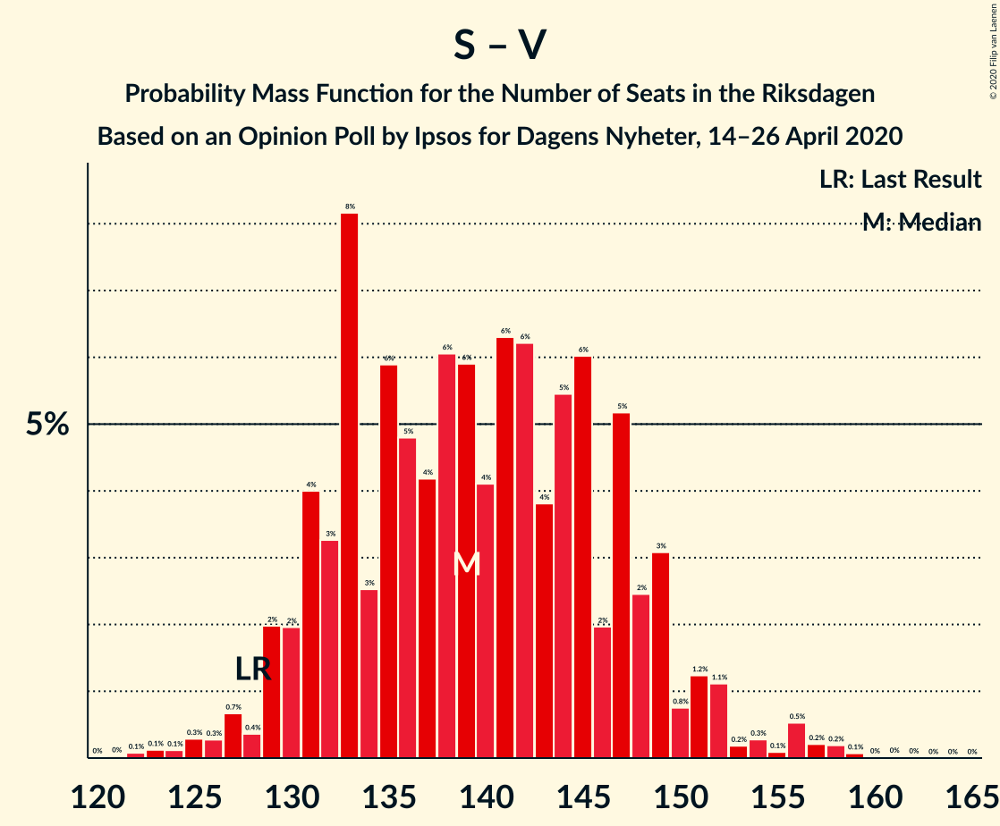

| Number of Seats | Probability | Accumulated | Special Marks |
|:---------------:|:-----------:|:-----------:|:-------------:|
| 122 | 0.1% | 100% |  |
| 123 | 0.1% | 99.9% |  |
| 124 | 0.1% | 99.8% |  |
| 125 | 0.3% | 99.6% |  |
| 126 | 0.3% | 99.3% |  |
| 127 | 0.7% | 99.1% |  |
| 128 | 0.4% | 98% | Last Result |
| 129 | 2% | 98% |  |
| 130 | 2% | 96% |  |
| 131 | 4% | 94% |  |
| 132 | 3% | 90% |  |
| 133 | 8% | 87% |  |
| 134 | 3% | 79% |  |
| 135 | 6% | 76% |  |
| 136 | 5% | 70% |  |
| 137 | 4% | 65% |  |
| 138 | 6% | 61% |  |
| 139 | 6% | 55% | Median |
| 140 | 4% | 49% |  |
| 141 | 6% | 45% |  |
| 142 | 6% | 39% |  |
| 143 | 4% | 33% |  |
| 144 | 5% | 29% |  |
| 145 | 6% | 23% |  |
| 146 | 2% | 17% |  |
| 147 | 5% | 15% |  |
| 148 | 2% | 10% |  |
| 149 | 3% | 8% |  |
| 150 | 0.8% | 5% |  |
| 151 | 1.2% | 4% |  |
| 152 | 1.1% | 3% |  |
| 153 | 0.2% | 2% |  |
| 154 | 0.3% | 1.4% |  |
| 155 | 0.1% | 1.1% |  |
| 156 | 0.5% | 1.1% |  |
| 157 | 0.2% | 0.5% |  |
| 158 | 0.2% | 0.3% |  |
| 159 | 0.1% | 0.1% |  |
| 160 | 0% | 0.1% |  |
| 161 | 0% | 0% |  |

### Moderata samlingspartiet – Centerpartiet – Kristdemokraterna – Liberalerna

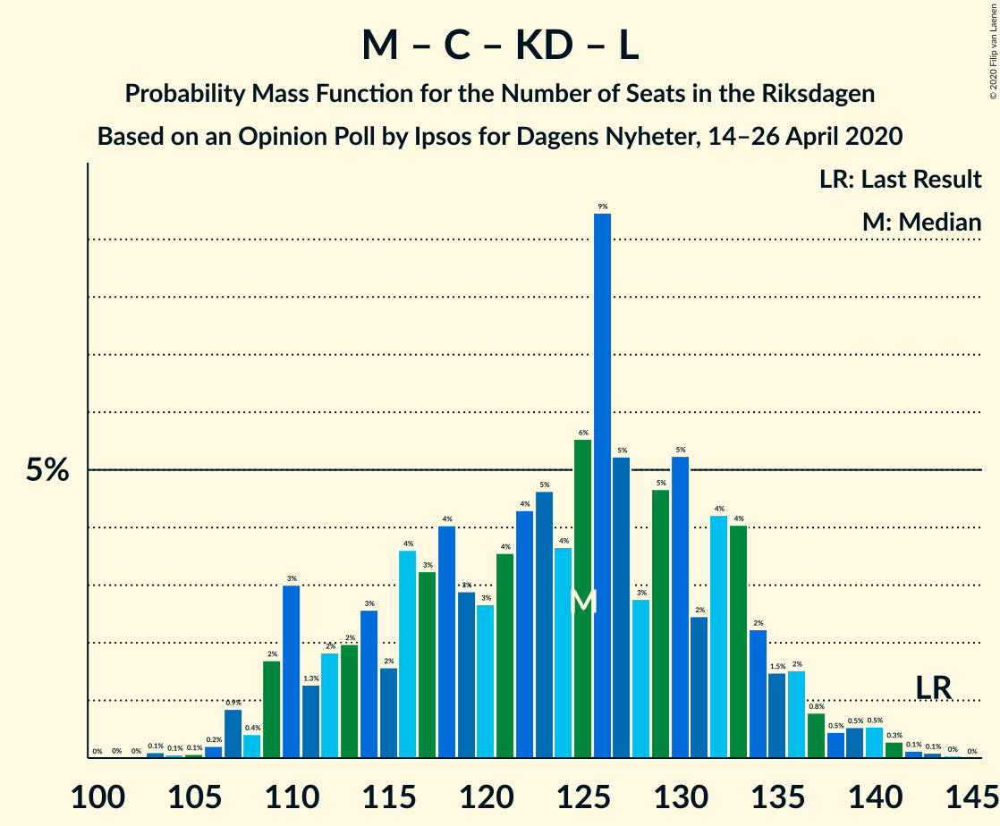

| Number of Seats | Probability | Accumulated | Special Marks |
|:---------------:|:-----------:|:-----------:|:-------------:|
| 103 | 0.1% | 100% |  |
| 104 | 0.1% | 99.9% |  |
| 105 | 0.1% | 99.8% |  |
| 106 | 0.2% | 99.7% |  |
| 107 | 0.9% | 99.5% |  |
| 108 | 0.4% | 98.7% |  |
| 109 | 2% | 98% |  |
| 110 | 3% | 97% |  |
| 111 | 1.3% | 94% |  |
| 112 | 2% | 92% |  |
| 113 | 2% | 90% |  |
| 114 | 3% | 88% |  |
| 115 | 2% | 86% |  |
| 116 | 4% | 84% |  |
| 117 | 3% | 81% |  |
| 118 | 4% | 77% |  |
| 119 | 3% | 73% |  |
| 120 | 3% | 71% |  |
| 121 | 4% | 68% |  |
| 122 | 4% | 64% |  |
| 123 | 5% | 60% |  |
| 124 | 4% | 55% |  |
| 125 | 6% | 52% |  |
| 126 | 9% | 46% |  |
| 127 | 5% | 37% |  |
| 128 | 3% | 32% |  |
| 129 | 5% | 29% | Median |
| 130 | 5% | 24% |  |
| 131 | 2% | 19% |  |
| 132 | 4% | 16% |  |
| 133 | 4% | 12% |  |
| 134 | 2% | 8% |  |
| 135 | 1.5% | 6% |  |
| 136 | 2% | 4% |  |
| 137 | 0.8% | 3% |  |
| 138 | 0.5% | 2% |  |
| 139 | 0.5% | 2% |  |
| 140 | 0.5% | 1.1% |  |
| 141 | 0.3% | 0.6% |  |
| 142 | 0.1% | 0.3% |  |
| 143 | 0.1% | 0.2% | Last Result |
| 144 | 0% | 0.1% |  |
| 145 | 0% | 0% |  |

### Sveriges socialdemokratiska arbetareparti – Miljöpartiet de gröna

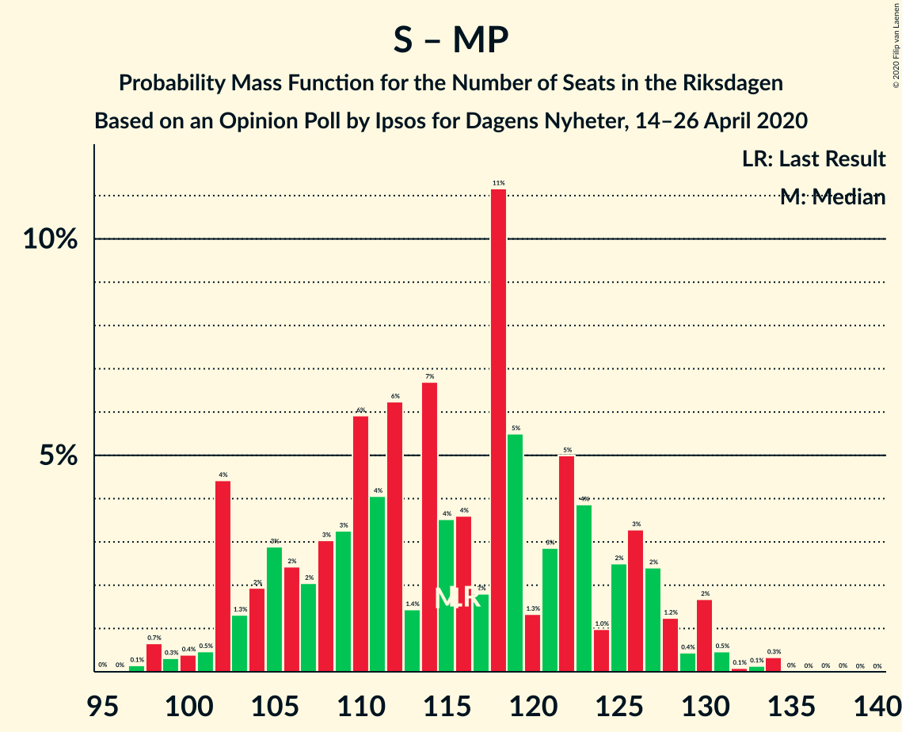

| Number of Seats | Probability | Accumulated | Special Marks |
|:---------------:|:-----------:|:-----------:|:-------------:|
| 95 | 0% | 100% |  |
| 96 | 0% | 99.9% |  |
| 97 | 0.1% | 99.9% |  |
| 98 | 0.7% | 99.8% |  |
| 99 | 0.3% | 99.1% |  |
| 100 | 0.4% | 98.8% |  |
| 101 | 0.5% | 98% |  |
| 102 | 4% | 98% |  |
| 103 | 1.3% | 94% |  |
| 104 | 2% | 92% |  |
| 105 | 3% | 90% |  |
| 106 | 2% | 87% |  |
| 107 | 2% | 85% |  |
| 108 | 3% | 83% |  |
| 109 | 3% | 80% |  |
| 110 | 6% | 77% |  |
| 111 | 4% | 71% |  |
| 112 | 6% | 67% |  |
| 113 | 1.4% | 60% |  |
| 114 | 7% | 59% |  |
| 115 | 4% | 52% |  |
| 116 | 4% | 49% | Last Result |
| 117 | 2% | 45% |  |
| 118 | 11% | 43% |  |
| 119 | 5% | 32% |  |
| 120 | 1.3% | 27% |  |
| 121 | 3% | 25% | Median |
| 122 | 5% | 22% |  |
| 123 | 4% | 17% |  |
| 124 | 1.0% | 14% |  |
| 125 | 2% | 13% |  |
| 126 | 3% | 10% |  |
| 127 | 2% | 7% |  |
| 128 | 1.2% | 4% |  |
| 129 | 0.4% | 3% |  |
| 130 | 2% | 3% |  |
| 131 | 0.5% | 1.1% |  |
| 132 | 0.1% | 0.6% |  |
| 133 | 0.1% | 0.5% |  |
| 134 | 0.3% | 0.4% |  |
| 135 | 0% | 0.1% |  |
| 136 | 0% | 0% |  |

### Moderata samlingspartiet – Centerpartiet – Kristdemokraterna

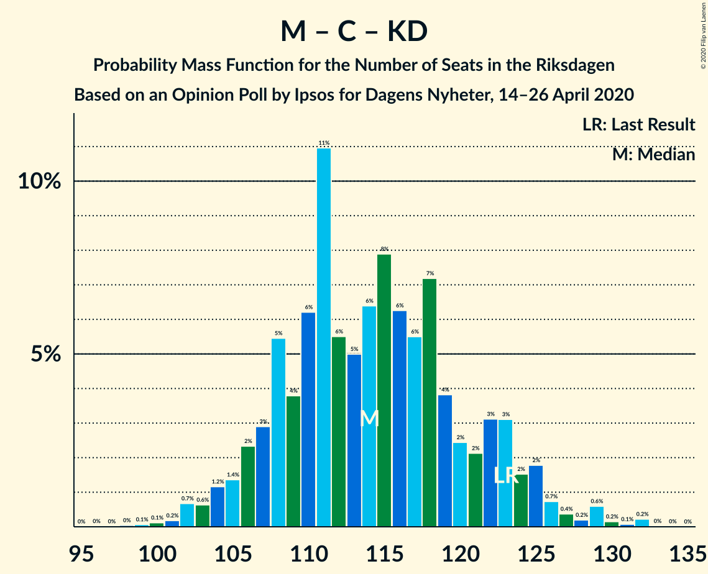

| Number of Seats | Probability | Accumulated | Special Marks |
|:---------------:|:-----------:|:-----------:|:-------------:|
| 98 | 0% | 100% |  |
| 99 | 0.1% | 99.9% |  |
| 100 | 0.1% | 99.9% |  |
| 101 | 0.2% | 99.7% |  |
| 102 | 0.7% | 99.6% |  |
| 103 | 0.6% | 98.9% |  |
| 104 | 1.2% | 98% |  |
| 105 | 1.4% | 97% |  |
| 106 | 2% | 96% |  |
| 107 | 3% | 93% |  |
| 108 | 5% | 90% |  |
| 109 | 4% | 85% |  |
| 110 | 6% | 81% |  |
| 111 | 11% | 75% |  |
| 112 | 6% | 64% |  |
| 113 | 5% | 59% |  |
| 114 | 6% | 54% | Median |
| 115 | 8% | 47% |  |
| 116 | 6% | 39% |  |
| 117 | 6% | 33% |  |
| 118 | 7% | 28% |  |
| 119 | 4% | 20% |  |
| 120 | 2% | 17% |  |
| 121 | 2% | 14% |  |
| 122 | 3% | 12% |  |
| 123 | 3% | 9% | Last Result |
| 124 | 2% | 6% |  |
| 125 | 2% | 4% |  |
| 126 | 0.7% | 2% |  |
| 127 | 0.4% | 2% |  |
| 128 | 0.2% | 1.3% |  |
| 129 | 0.6% | 1.1% |  |
| 130 | 0.2% | 0.5% |  |
| 131 | 0.1% | 0.3% |  |
| 132 | 0.2% | 0.3% |  |
| 133 | 0% | 0% |  |

### Moderata samlingspartiet – Centerpartiet – Liberalerna

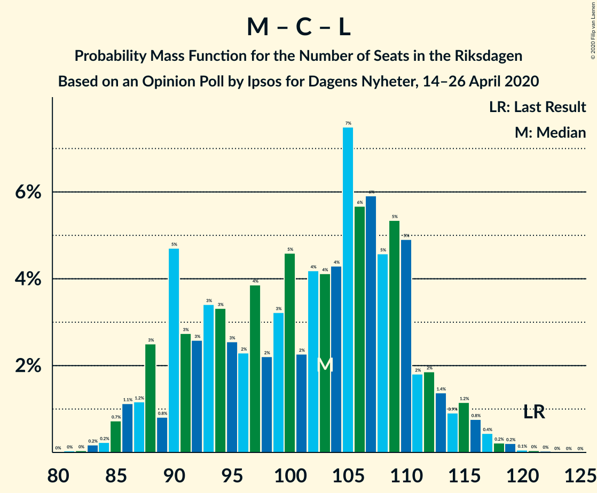

| Number of Seats | Probability | Accumulated | Special Marks |
|:---------------:|:-----------:|:-----------:|:-------------:|
| 81 | 0% | 100% |  |
| 82 | 0% | 99.9% |  |
| 83 | 0.2% | 99.9% |  |
| 84 | 0.2% | 99.7% |  |
| 85 | 0.7% | 99.5% |  |
| 86 | 1.1% | 98.8% |  |
| 87 | 1.2% | 98% |  |
| 88 | 3% | 96% |  |
| 89 | 0.8% | 94% |  |
| 90 | 5% | 93% |  |
| 91 | 3% | 88% |  |
| 92 | 3% | 86% |  |
| 93 | 3% | 83% |  |
| 94 | 3% | 80% |  |
| 95 | 3% | 76% |  |
| 96 | 2% | 74% |  |
| 97 | 4% | 72% |  |
| 98 | 2% | 68% |  |
| 99 | 3% | 65% |  |
| 100 | 5% | 62% |  |
| 101 | 2% | 58% |  |
| 102 | 4% | 55% |  |
| 103 | 4% | 51% |  |
| 104 | 4% | 47% |  |
| 105 | 7% | 43% |  |
| 106 | 6% | 35% |  |
| 107 | 6% | 30% | Median |
| 108 | 5% | 24% |  |
| 109 | 5% | 19% |  |
| 110 | 5% | 14% |  |
| 111 | 2% | 9% |  |
| 112 | 2% | 7% |  |
| 113 | 1.4% | 5% |  |
| 114 | 0.9% | 4% |  |
| 115 | 1.2% | 3% |  |
| 116 | 0.8% | 2% |  |
| 117 | 0.4% | 1.0% |  |
| 118 | 0.2% | 0.6% |  |
| 119 | 0.2% | 0.4% |  |
| 120 | 0.1% | 0.1% |  |
| 121 | 0% | 0.1% | Last Result |
| 122 | 0% | 0% |  |

### Moderata samlingspartiet – Centerpartiet

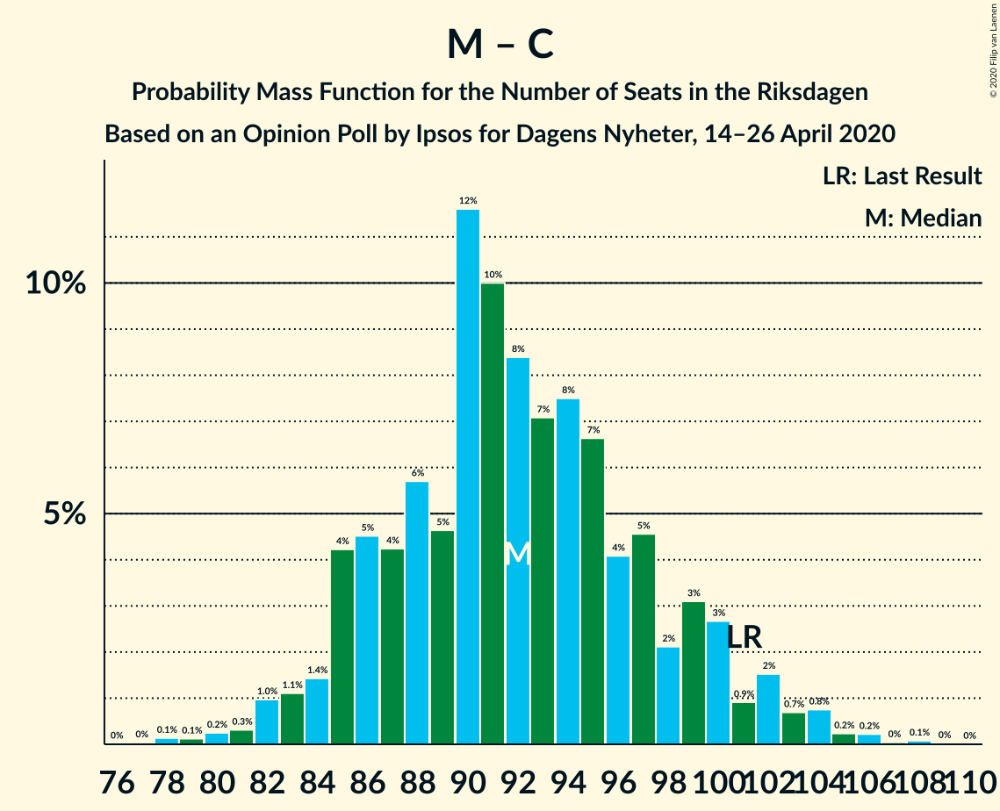

| Number of Seats | Probability | Accumulated | Special Marks |
|:---------------:|:-----------:|:-----------:|:-------------:|
| 77 | 0% | 100% |  |
| 78 | 0.1% | 99.9% |  |
| 79 | 0.1% | 99.8% |  |
| 80 | 0.2% | 99.7% |  |
| 81 | 0.3% | 99.4% |  |
| 82 | 1.0% | 99.1% |  |
| 83 | 1.1% | 98% |  |
| 84 | 1.4% | 97% |  |
| 85 | 4% | 96% |  |
| 86 | 5% | 91% |  |
| 87 | 4% | 87% |  |
| 88 | 6% | 83% |  |
| 89 | 5% | 77% |  |
| 90 | 12% | 72% |  |
| 91 | 10% | 61% |  |
| 92 | 8% | 51% | Median |
| 93 | 7% | 42% |  |
| 94 | 8% | 35% |  |
| 95 | 7% | 28% |  |
| 96 | 4% | 21% |  |
| 97 | 5% | 17% |  |
| 98 | 2% | 12% |  |
| 99 | 3% | 10% |  |
| 100 | 3% | 7% |  |
| 101 | 0.9% | 5% | Last Result |
| 102 | 2% | 4% |  |
| 103 | 0.7% | 2% |  |
| 104 | 0.8% | 1.4% |  |
| 105 | 0.2% | 0.6% |  |
| 106 | 0.2% | 0.4% |  |
| 107 | 0% | 0.2% |  |
| 108 | 0.1% | 0.1% |  |
| 109 | 0% | 0% |  |

## Technical Information

### Opinion Poll

+ **Polling firm:** Ipsos
+ **Commissioner(s):** Dagens Nyheter
+ **Fieldwork period:** 14–26 April 2020

### Calculations

+ **Sample size:** 1544
+ **Simulations done:** 1,048,576
+ **Error estimate:** 1.37%

