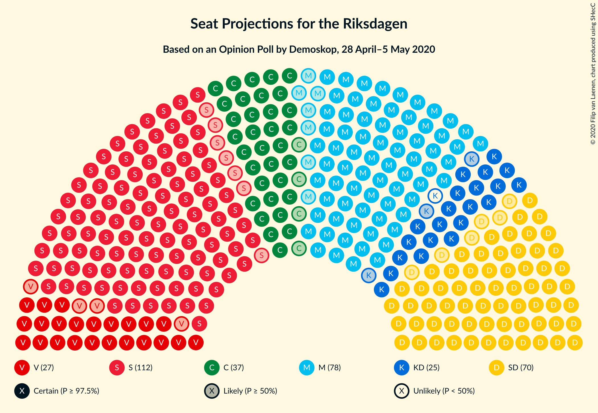
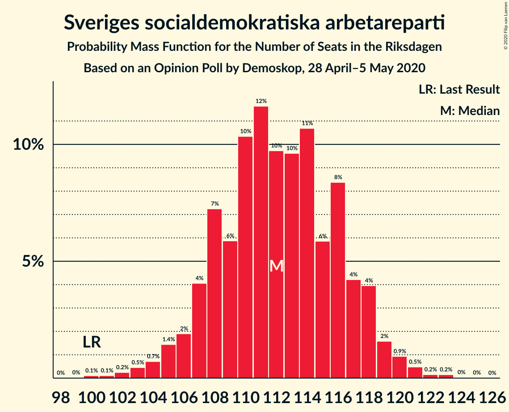
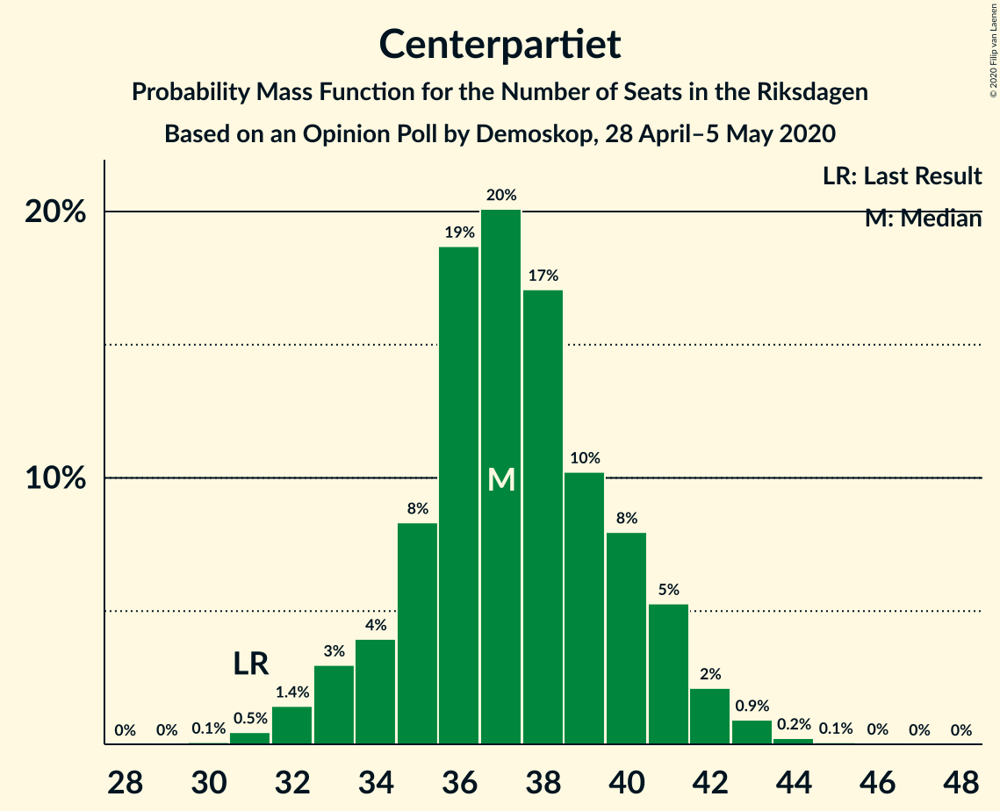
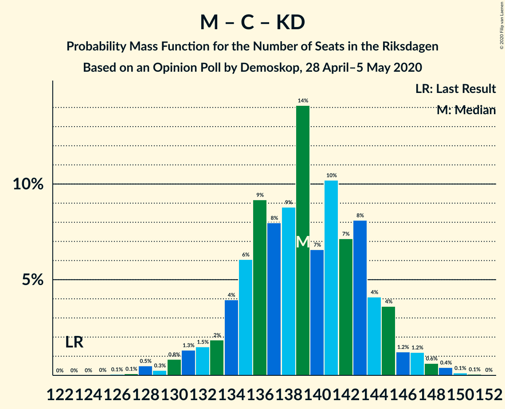

# Opinion Poll by Demoskop, 28 April–5 May 2020

<a href="#voting-intentions">Voting Intentions</a> | <a href="#seats">Seats</a> | <a href="#coalitions">Coalitions</a> | <a href="#technical-information">Technical Information</a>

## Voting Intentions

### Confidence Intervals

| Party | Last Result | Poll Result | 80% Confidence Interval | 90% Confidence Interval | 95% Confidence Interval | 99% Confidence Interval |
|:-----:|:-----------:|:-----------:|:-----------------------:|:-----------------------:|:-----------------------:|:-----------------------:|
| Sveriges socialdemokratiska arbetareparti | 28.3% | 30.1% | 28.9–31.3% |28.5–31.7% |28.2–32.0% |27.7–32.6% |
| Moderata samlingspartiet | 19.8% | 20.7% | 19.6–21.8% |19.3–22.1% |19.1–22.4% |18.6–22.9% |
| Sverigedemokraterna | 17.5% | 18.8% | 17.8–19.9% |17.5–20.2% |17.3–20.5% |16.8–21.0% |
| Centerpartiet | 8.6% | 10.0% | 9.3–10.9% |9.0–11.1% |8.8–11.3% |8.5–11.7% |
| Vänsterpartiet | 8.0% | 7.2% | 6.5–7.9% |6.3–8.1% |6.2–8.3% |5.9–8.7% |
| Kristdemokraterna | 6.3% | 6.5% | 5.9–7.2% |5.7–7.4% |5.5–7.6% |5.3–7.9% |
| Miljöpartiet de gröna | 4.4% | 3.3% | 2.9–3.8% |2.7–4.0% |2.7–4.1% |2.5–4.4% |
| Liberalerna | 5.5% | 2.7% | 2.3–3.2% |2.2–3.3% |2.1–3.5% |1.9–3.7% |

*Note:* The poll result column reflects the actual value used in the calculations. Published results may vary slightly, and in addition be rounded to fewer digits.

## Seats

### Confidence Intervals

| Party | Last Result | Median | 80% Confidence Interval | 90% Confidence Interval | 95% Confidence Interval | 99% Confidence Interval |
|:-----:|:-----------:|:------:|:-----------------------:|:-----------------------:|:-----------------------:|:-----------------------:|
| <a href="#sveriges-socialdemokratiska-arbetareparti">Sveriges socialdemokratiska arbetareparti</a> | 100 | 112 | 108–117 |106–118 |105–119 |102–121 |
| <a href="#moderata-samlingspartiet">Moderata samlingspartiet</a> | 70 | 78 | 73–81 |72–81 |71–83 |69–85 |
| <a href="#sverigedemokraterna">Sverigedemokraterna</a> | 62 | 70 | 66–74 |65–75 |64–76 |62–78 |
| <a href="#centerpartiet">Centerpartiet</a> | 31 | 37 | 35–40 |34–41 |33–42 |31–43 |
| <a href="#vänsterpartiet">Vänsterpartiet</a> | 28 | 27 | 24–30 |24–30 |23–31 |22–32 |
| <a href="#kristdemokraterna">Kristdemokraterna</a> | 22 | 24 | 22–27 |21–27 |21–28 |20–30 |
| <a href="#miljöpartiet-de-gröna">Miljöpartiet de gröna</a> | 16 | 0 | 0 |0 |0–15 |0–16 |
| <a href="#liberalerna">Liberalerna</a> | 20 | 0 | 0 |0 |0 |0 |

### Sveriges socialdemokratiska arbetareparti

*For a full overview of the results for this party, see the [Sveriges socialdemokratiska arbetareparti](party-sverigessocialdemokratiskaarbetareparti.html) page.*

| Number of Seats | Probability | Accumulated | Special Marks |
|:---------------:|:-----------:|:-----------:|:-------------:|
| 100 | 0.1% | 100% | Last Result |
| 101 | 0.1% | 99.8% |  |
| 102 | 0.2% | 99.7% |  |
| 103 | 0.5% | 99.5% |  |
| 104 | 0.7% | 99.0% |  |
| 105 | 1.4% | 98% |  |
| 106 | 2% | 97% |  |
| 107 | 4% | 95% |  |
| 108 | 7% | 91% |  |
| 109 | 6% | 84% |  |
| 110 | 10% | 78% |  |
| 111 | 12% | 67% |  |
| 112 | 10% | 56% | Median |
| 113 | 10% | 46% |  |
| 114 | 11% | 36% |  |
| 115 | 6% | 26% |  |
| 116 | 8% | 20% |  |
| 117 | 4% | 12% |  |
| 118 | 4% | 7% |  |
| 119 | 2% | 3% |  |
| 120 | 0.9% | 2% |  |
| 121 | 0.5% | 0.8% |  |
| 122 | 0.2% | 0.4% |  |
| 123 | 0.2% | 0.2% |  |
| 124 | 0% | 0.1% |  |
| 125 | 0% | 0% |  |

### Moderata samlingspartiet

*For a full overview of the results for this party, see the [Moderata samlingspartiet](party-moderatasamlingspartiet.html) page.*

| Number of Seats | Probability | Accumulated | Special Marks |
|:---------------:|:-----------:|:-----------:|:-------------:|
| 67 | 0% | 100% |  |
| 68 | 0.1% | 99.9% |  |
| 69 | 0.9% | 99.8% |  |
| 70 | 0.3% | 98.9% | Last Result |
| 71 | 3% | 98.6% |  |
| 72 | 2% | 96% |  |
| 73 | 6% | 94% |  |
| 74 | 6% | 88% |  |
| 75 | 2% | 81% |  |
| 76 | 20% | 80% |  |
| 77 | 1.3% | 59% |  |
| 78 | 21% | 58% | Median |
| 79 | 10% | 37% |  |
| 80 | 3% | 27% |  |
| 81 | 19% | 24% |  |
| 82 | 0.2% | 5% |  |
| 83 | 3% | 4% |  |
| 84 | 0.9% | 1.4% |  |
| 85 | 0.2% | 0.5% |  |
| 86 | 0.3% | 0.4% |  |
| 87 | 0% | 0.1% |  |
| 88 | 0.1% | 0.1% |  |
| 89 | 0% | 0% |  |

### Sverigedemokraterna

*For a full overview of the results for this party, see the [Sverigedemokraterna](party-sverigedemokraterna.html) page.*

| Number of Seats | Probability | Accumulated | Special Marks |
|:---------------:|:-----------:|:-----------:|:-------------:|
| 60 | 0.1% | 100% |  |
| 61 | 0.1% | 99.9% |  |
| 62 | 0.3% | 99.8% | Last Result |
| 63 | 0.7% | 99.5% |  |
| 64 | 2% | 98.8% |  |
| 65 | 3% | 97% |  |
| 66 | 5% | 94% |  |
| 67 | 9% | 89% |  |
| 68 | 11% | 79% |  |
| 69 | 12% | 68% |  |
| 70 | 14% | 56% | Median |
| 71 | 11% | 43% |  |
| 72 | 10% | 32% |  |
| 73 | 7% | 21% |  |
| 74 | 6% | 14% |  |
| 75 | 4% | 8% |  |
| 76 | 2% | 4% |  |
| 77 | 0.9% | 2% |  |
| 78 | 0.6% | 0.9% |  |
| 79 | 0.2% | 0.3% |  |
| 80 | 0.1% | 0.1% |  |
| 81 | 0% | 0.1% |  |
| 82 | 0% | 0% |  |

### Centerpartiet

*For a full overview of the results for this party, see the [Centerpartiet](party-centerpartiet.html) page.*

| Number of Seats | Probability | Accumulated | Special Marks |
|:---------------:|:-----------:|:-----------:|:-------------:|
| 30 | 0.1% | 100% |  |
| 31 | 0.5% | 99.9% | Last Result |
| 32 | 1.4% | 99.5% |  |
| 33 | 3% | 98% |  |
| 34 | 4% | 95% |  |
| 35 | 8% | 91% |  |
| 36 | 19% | 83% |  |
| 37 | 20% | 64% | Median |
| 38 | 17% | 44% |  |
| 39 | 10% | 27% |  |
| 40 | 8% | 17% |  |
| 41 | 5% | 9% |  |
| 42 | 2% | 3% |  |
| 43 | 0.9% | 1.3% |  |
| 44 | 0.2% | 0.4% |  |
| 45 | 0.1% | 0.1% |  |
| 46 | 0% | 0.1% |  |
| 47 | 0% | 0% |  |

### Vänsterpartiet

*For a full overview of the results for this party, see the [Vänsterpartiet](party-vänsterpartiet.html) page.*

| Number of Seats | Probability | Accumulated | Special Marks |
|:---------------:|:-----------:|:-----------:|:-------------:|
| 21 | 0.2% | 100% |  |
| 22 | 0.9% | 99.8% |  |
| 23 | 4% | 98.8% |  |
| 24 | 6% | 95% |  |
| 25 | 14% | 90% |  |
| 26 | 14% | 76% |  |
| 27 | 17% | 62% | Median |
| 28 | 23% | 45% | Last Result |
| 29 | 12% | 22% |  |
| 30 | 7% | 11% |  |
| 31 | 2% | 4% |  |
| 32 | 1.0% | 2% |  |
| 33 | 0.4% | 0.5% |  |
| 34 | 0.1% | 0.1% |  |
| 35 | 0% | 0% |  |

### Kristdemokraterna

*For a full overview of the results for this party, see the [Kristdemokraterna](party-kristdemokraterna.html) page.*

| Number of Seats | Probability | Accumulated | Special Marks |
|:---------------:|:-----------:|:-----------:|:-------------:|
| 18 | 0.1% | 100% |  |
| 19 | 0.3% | 99.9% |  |
| 20 | 2% | 99.7% |  |
| 21 | 4% | 98% |  |
| 22 | 15% | 93% | Last Result |
| 23 | 17% | 78% |  |
| 24 | 14% | 62% | Median |
| 25 | 23% | 48% |  |
| 26 | 12% | 25% |  |
| 27 | 8% | 12% |  |
| 28 | 3% | 4% |  |
| 29 | 1.2% | 2% |  |
| 30 | 0.4% | 0.6% |  |
| 31 | 0.1% | 0.2% |  |
| 32 | 0% | 0% |  |

### Miljöpartiet de gröna

*For a full overview of the results for this party, see the [Miljöpartiet de gröna](party-miljöpartietdegröna.html) page.*

| Number of Seats | Probability | Accumulated | Special Marks |
|:---------------:|:-----------:|:-----------:|:-------------:|
| 0 | 96% | 100% | Median |
| 1 | 0% | 4% |  |
| 2 | 0% | 4% |  |
| 3 | 0% | 4% |  |
| 4 | 0% | 4% |  |
| 5 | 0% | 4% |  |
| 6 | 0% | 4% |  |
| 7 | 0% | 4% |  |
| 8 | 0% | 4% |  |
| 9 | 0% | 4% |  |
| 10 | 0% | 4% |  |
| 11 | 0% | 4% |  |
| 12 | 0% | 4% |  |
| 13 | 0% | 4% |  |
| 14 | 0.2% | 4% |  |
| 15 | 3% | 4% |  |
| 16 | 0.9% | 1.1% | Last Result |
| 17 | 0.1% | 0.1% |  |
| 18 | 0% | 0% |  |

### Liberalerna

*For a full overview of the results for this party, see the [Liberalerna](party-liberalerna.html) page.*

| Number of Seats | Probability | Accumulated | Special Marks |
|:---------------:|:-----------:|:-----------:|:-------------:|
| 0 | 100% | 100% | Median |
| 1 | 0% | 0% |  |
| 2 | 0% | 0% |  |
| 3 | 0% | 0% |  |
| 4 | 0% | 0% |  |
| 5 | 0% | 0% |  |
| 6 | 0% | 0% |  |
| 7 | 0% | 0% |  |
| 8 | 0% | 0% |  |
| 9 | 0% | 0% |  |
| 10 | 0% | 0% |  |
| 11 | 0% | 0% |  |
| 12 | 0% | 0% |  |
| 13 | 0% | 0% |  |
| 14 | 0% | 0% |  |
| 15 | 0% | 0% |  |
| 16 | 0% | 0% |  |
| 17 | 0% | 0% |  |
| 18 | 0% | 0% |  |
| 19 | 0% | 0% |  |
| 20 | 0% | 0% | Last Result |

## Coalitions

### Confidence Intervals

| Coalition | Last Result | Median | Majority? | 80% Confidence Interval | 90% Confidence Interval | 95% Confidence Interval | 99% Confidence Interval |
|:---------:|:-----------:|:------:|:---------:|:-----------------------:|:-----------------------:|:-----------------------:|:-----------------------:|
| Sveriges socialdemokratiska arbetareparti – Moderata samlingspartiet – Centerpartiet | 201 | 227 | 100% | 222–232 | 220–233 | 217–234 | 213–237 |
| Sveriges socialdemokratiska arbetareparti – Moderata samlingspartiet | 170 | 190 | 99.9% | 185–194 | 183–196 | 181–197 | 177–199 |
| Sveriges socialdemokratiska arbetareparti – Centerpartiet – Vänsterpartiet – Miljöpartiet de gröna – Liberalerna | 195 | 177 | 74% | 172–182 | 171–184 | 170–186 | 167–189 |
| Moderata samlingspartiet – Sverigedemokraterna – Kristdemokraterna | 154 | 172 | 26% | 167–177 | 165–178 | 163–179 | 160–182 |
| Sveriges socialdemokratiska arbetareparti – Centerpartiet – Miljöpartiet de gröna – Liberalerna | 167 | 150 | 0% | 145–156 | 144–157 | 143–159 | 141–162 |
| Moderata samlingspartiet – Sverigedemokraterna | 132 | 148 | 0% | 143–153 | 141–154 | 140–155 | 136–158 |
| Sveriges socialdemokratiska arbetareparti – Vänsterpartiet – Miljöpartiet de gröna | 144 | 140 | 0% | 135–145 | 134–147 | 132–149 | 130–153 |
| Moderata samlingspartiet – Centerpartiet – Kristdemokraterna – Liberalerna | 143 | 139 | 0% | 134–144 | 133–145 | 131–147 | 128–149 |
| Sveriges socialdemokratiska arbetareparti – Vänsterpartiet | 128 | 139 | 0% | 134–144 | 133–145 | 132–146 | 128–149 |
| Moderata samlingspartiet – Centerpartiet – Kristdemokraterna | 123 | 139 | 0% | 134–144 | 133–145 | 131–146 | 128–149 |
| Sveriges socialdemokratiska arbetareparti – Miljöpartiet de gröna | 116 | 113 | 0% | 108–118 | 107–120 | 106–123 | 104–126 |
| Moderata samlingspartiet – Centerpartiet – Liberalerna | 121 | 115 | 0% | 111–119 | 109–121 | 108–122 | 105–124 |
| Moderata samlingspartiet – Centerpartiet | 101 | 115 | 0% | 111–119 | 109–121 | 108–122 | 105–124 |

### Sveriges socialdemokratiska arbetareparti – Moderata samlingspartiet – Centerpartiet

| Number of Seats | Probability | Accumulated | Special Marks |
|:---------------:|:-----------:|:-----------:|:-------------:|
| 201 | 0% | 100% | Last Result |
| 202 | 0% | 100% |  |
| 203 | 0% | 100% |  |
| 204 | 0% | 100% |  |
| 205 | 0% | 100% |  |
| 206 | 0% | 100% |  |
| 207 | 0% | 100% |  |
| 208 | 0% | 100% |  |
| 209 | 0% | 100% |  |
| 210 | 0% | 100% |  |
| 211 | 0.1% | 99.9% |  |
| 212 | 0.2% | 99.8% |  |
| 213 | 0.3% | 99.6% |  |
| 214 | 0.3% | 99.3% |  |
| 215 | 0.7% | 99.0% |  |
| 216 | 0.4% | 98% |  |
| 217 | 0.7% | 98% |  |
| 218 | 0.8% | 97% |  |
| 219 | 1.1% | 96% |  |
| 220 | 2% | 95% |  |
| 221 | 2% | 94% |  |
| 222 | 4% | 92% |  |
| 223 | 5% | 88% |  |
| 224 | 6% | 83% |  |
| 225 | 7% | 77% |  |
| 226 | 8% | 70% |  |
| 227 | 14% | 63% | Median |
| 228 | 11% | 49% |  |
| 229 | 13% | 38% |  |
| 230 | 11% | 26% |  |
| 231 | 4% | 15% |  |
| 232 | 5% | 11% |  |
| 233 | 2% | 6% |  |
| 234 | 3% | 5% |  |
| 235 | 0.9% | 2% |  |
| 236 | 0.3% | 0.9% |  |
| 237 | 0.3% | 0.5% |  |
| 238 | 0.1% | 0.2% |  |
| 239 | 0% | 0.1% |  |
| 240 | 0% | 0% |  |

### Sveriges socialdemokratiska arbetareparti – Moderata samlingspartiet

| Number of Seats | Probability | Accumulated | Special Marks |
|:---------------:|:-----------:|:-----------:|:-------------:|
| 170 | 0% | 100% | Last Result |
| 171 | 0% | 100% |  |
| 172 | 0% | 100% |  |
| 173 | 0% | 100% |  |
| 174 | 0% | 100% |  |
| 175 | 0.1% | 99.9% | Majority |
| 176 | 0.1% | 99.8% |  |
| 177 | 0.4% | 99.7% |  |
| 178 | 0.4% | 99.3% |  |
| 179 | 0.7% | 99.0% |  |
| 180 | 0.7% | 98% |  |
| 181 | 1.2% | 98% |  |
| 182 | 1.3% | 96% |  |
| 183 | 2% | 95% |  |
| 184 | 2% | 93% |  |
| 185 | 4% | 91% |  |
| 186 | 4% | 87% |  |
| 187 | 10% | 83% |  |
| 188 | 7% | 73% |  |
| 189 | 10% | 66% |  |
| 190 | 12% | 55% | Median |
| 191 | 11% | 43% |  |
| 192 | 9% | 32% |  |
| 193 | 7% | 24% |  |
| 194 | 8% | 17% |  |
| 195 | 4% | 10% |  |
| 196 | 2% | 6% |  |
| 197 | 1.2% | 3% |  |
| 198 | 1.1% | 2% |  |
| 199 | 0.3% | 0.8% |  |
| 200 | 0.2% | 0.4% |  |
| 201 | 0.2% | 0.2% |  |
| 202 | 0% | 0.1% |  |
| 203 | 0% | 0% |  |

### Sveriges socialdemokratiska arbetareparti – Centerpartiet – Vänsterpartiet – Miljöpartiet de gröna – Liberalerna

| Number of Seats | Probability | Accumulated | Special Marks |
|:---------------:|:-----------:|:-----------:|:-------------:|
| 165 | 0.1% | 100% |  |
| 166 | 0.2% | 99.9% |  |
| 167 | 0.3% | 99.7% |  |
| 168 | 0.5% | 99.5% |  |
| 169 | 1.1% | 99.0% |  |
| 170 | 2% | 98% |  |
| 171 | 5% | 96% |  |
| 172 | 4% | 91% |  |
| 173 | 5% | 87% |  |
| 174 | 8% | 82% |  |
| 175 | 11% | 74% | Majority |
| 176 | 7% | 63% | Median |
| 177 | 8% | 56% |  |
| 178 | 8% | 48% |  |
| 179 | 10% | 40% |  |
| 180 | 10% | 30% |  |
| 181 | 7% | 19% |  |
| 182 | 4% | 13% |  |
| 183 | 2% | 9% |  |
| 184 | 3% | 7% |  |
| 185 | 1.3% | 4% |  |
| 186 | 1.1% | 3% |  |
| 187 | 0.4% | 2% |  |
| 188 | 0.5% | 1.1% |  |
| 189 | 0.3% | 0.7% |  |
| 190 | 0.2% | 0.3% |  |
| 191 | 0.1% | 0.2% |  |
| 192 | 0.1% | 0.1% |  |
| 193 | 0% | 0% |  |
| 194 | 0% | 0% |  |
| 195 | 0% | 0% | Last Result |

### Moderata samlingspartiet – Sverigedemokraterna – Kristdemokraterna

| Number of Seats | Probability | Accumulated | Special Marks |
|:---------------:|:-----------:|:-----------:|:-------------:|
| 154 | 0% | 100% | Last Result |
| 155 | 0% | 100% |  |
| 156 | 0% | 100% |  |
| 157 | 0.1% | 100% |  |
| 158 | 0.1% | 99.9% |  |
| 159 | 0.2% | 99.8% |  |
| 160 | 0.3% | 99.7% |  |
| 161 | 0.5% | 99.3% |  |
| 162 | 0.4% | 98.9% |  |
| 163 | 1.1% | 98% |  |
| 164 | 1.3% | 97% |  |
| 165 | 3% | 96% |  |
| 166 | 2% | 93% |  |
| 167 | 4% | 91% |  |
| 168 | 7% | 87% |  |
| 169 | 10% | 81% |  |
| 170 | 10% | 70% |  |
| 171 | 8% | 60% |  |
| 172 | 8% | 52% | Median |
| 173 | 7% | 44% |  |
| 174 | 11% | 37% |  |
| 175 | 8% | 26% | Majority |
| 176 | 5% | 18% |  |
| 177 | 4% | 13% |  |
| 178 | 5% | 9% |  |
| 179 | 2% | 4% |  |
| 180 | 1.1% | 2% |  |
| 181 | 0.5% | 1.0% |  |
| 182 | 0.3% | 0.5% |  |
| 183 | 0.2% | 0.3% |  |
| 184 | 0.1% | 0.1% |  |
| 185 | 0% | 0% |  |

### Sveriges socialdemokratiska arbetareparti – Centerpartiet – Miljöpartiet de gröna – Liberalerna

| Number of Seats | Probability | Accumulated | Special Marks |
|:---------------:|:-----------:|:-----------:|:-------------:|
| 138 | 0.1% | 100% |  |
| 139 | 0.1% | 99.9% |  |
| 140 | 0.2% | 99.7% |  |
| 141 | 0.5% | 99.5% |  |
| 142 | 0.8% | 99.0% |  |
| 143 | 1.4% | 98% |  |
| 144 | 5% | 97% |  |
| 145 | 6% | 92% |  |
| 146 | 7% | 85% |  |
| 147 | 8% | 79% |  |
| 148 | 6% | 70% |  |
| 149 | 8% | 64% | Median |
| 150 | 7% | 56% |  |
| 151 | 14% | 50% |  |
| 152 | 10% | 36% |  |
| 153 | 6% | 26% |  |
| 154 | 6% | 20% |  |
| 155 | 4% | 14% |  |
| 156 | 4% | 10% |  |
| 157 | 2% | 6% |  |
| 158 | 1.3% | 5% |  |
| 159 | 1.0% | 3% |  |
| 160 | 0.5% | 2% |  |
| 161 | 0.9% | 2% |  |
| 162 | 0.4% | 0.9% |  |
| 163 | 0.1% | 0.4% |  |
| 164 | 0.1% | 0.3% |  |
| 165 | 0.1% | 0.2% |  |
| 166 | 0% | 0.1% |  |
| 167 | 0% | 0.1% | Last Result |
| 168 | 0% | 0% |  |

### Moderata samlingspartiet – Sverigedemokraterna

| Number of Seats | Probability | Accumulated | Special Marks |
|:---------------:|:-----------:|:-----------:|:-------------:|
| 132 | 0% | 100% | Last Result |
| 133 | 0% | 100% |  |
| 134 | 0.1% | 100% |  |
| 135 | 0.1% | 99.9% |  |
| 136 | 0.3% | 99.8% |  |
| 137 | 0.4% | 99.5% |  |
| 138 | 0.7% | 99.1% |  |
| 139 | 0.6% | 98% |  |
| 140 | 2% | 98% |  |
| 141 | 2% | 96% |  |
| 142 | 2% | 94% |  |
| 143 | 8% | 92% |  |
| 144 | 5% | 84% |  |
| 145 | 11% | 79% |  |
| 146 | 7% | 68% |  |
| 147 | 9% | 61% |  |
| 148 | 10% | 52% | Median |
| 149 | 10% | 42% |  |
| 150 | 8% | 32% |  |
| 151 | 6% | 24% |  |
| 152 | 7% | 17% |  |
| 153 | 4% | 10% |  |
| 154 | 2% | 6% |  |
| 155 | 2% | 4% |  |
| 156 | 1.1% | 2% |  |
| 157 | 0.3% | 0.8% |  |
| 158 | 0.3% | 0.5% |  |
| 159 | 0.1% | 0.2% |  |
| 160 | 0% | 0.1% |  |
| 161 | 0% | 0% |  |

### Sveriges socialdemokratiska arbetareparti – Vänsterpartiet – Miljöpartiet de gröna

| Number of Seats | Probability | Accumulated | Special Marks |
|:---------------:|:-----------:|:-----------:|:-------------:|
| 127 | 0.1% | 100% |  |
| 128 | 0.1% | 99.9% |  |
| 129 | 0.1% | 99.8% |  |
| 130 | 0.3% | 99.7% |  |
| 131 | 0.8% | 99.4% |  |
| 132 | 2% | 98.7% |  |
| 133 | 2% | 97% |  |
| 134 | 4% | 95% |  |
| 135 | 6% | 91% |  |
| 136 | 5% | 86% |  |
| 137 | 7% | 81% |  |
| 138 | 12% | 74% |  |
| 139 | 9% | 62% | Median |
| 140 | 11% | 53% |  |
| 141 | 8% | 42% |  |
| 142 | 11% | 34% |  |
| 143 | 7% | 23% |  |
| 144 | 5% | 16% | Last Result |
| 145 | 3% | 10% |  |
| 146 | 2% | 7% |  |
| 147 | 2% | 6% |  |
| 148 | 1.3% | 4% |  |
| 149 | 0.4% | 3% |  |
| 150 | 0.9% | 2% |  |
| 151 | 0.3% | 1.3% |  |
| 152 | 0.4% | 1.0% |  |
| 153 | 0.2% | 0.5% |  |
| 154 | 0.2% | 0.3% |  |
| 155 | 0.1% | 0.2% |  |
| 156 | 0% | 0.1% |  |
| 157 | 0% | 0.1% |  |
| 158 | 0% | 0% |  |

### Moderata samlingspartiet – Centerpartiet – Kristdemokraterna – Liberalerna

| Number of Seats | Probability | Accumulated | Special Marks |
|:---------------:|:-----------:|:-----------:|:-------------:|
| 125 | 0% | 100% |  |
| 126 | 0.1% | 99.9% |  |
| 127 | 0.1% | 99.9% |  |
| 128 | 0.5% | 99.8% |  |
| 129 | 0.3% | 99.3% |  |
| 130 | 0.8% | 99.0% |  |
| 131 | 1.3% | 98% |  |
| 132 | 1.5% | 97% |  |
| 133 | 2% | 95% |  |
| 134 | 4% | 94% |  |
| 135 | 6% | 90% |  |
| 136 | 9% | 84% |  |
| 137 | 8% | 74% |  |
| 138 | 9% | 66% |  |
| 139 | 14% | 58% | Median |
| 140 | 7% | 43% |  |
| 141 | 10% | 37% |  |
| 142 | 7% | 27% |  |
| 143 | 8% | 20% | Last Result |
| 144 | 4% | 11% |  |
| 145 | 4% | 7% |  |
| 146 | 1.2% | 4% |  |
| 147 | 1.2% | 3% |  |
| 148 | 0.6% | 1.3% |  |
| 149 | 0.4% | 0.7% |  |
| 150 | 0.1% | 0.3% |  |
| 151 | 0.1% | 0.1% |  |
| 152 | 0% | 0.1% |  |
| 153 | 0% | 0% |  |

### Sveriges socialdemokratiska arbetareparti – Vänsterpartiet

| Number of Seats | Probability | Accumulated | Special Marks |
|:---------------:|:-----------:|:-----------:|:-------------:|
| 125 | 0% | 100% |  |
| 126 | 0.1% | 99.9% |  |
| 127 | 0.1% | 99.9% |  |
| 128 | 0.2% | 99.7% | Last Result |
| 129 | 0.2% | 99.5% |  |
| 130 | 0.8% | 99.3% |  |
| 131 | 0.9% | 98.5% |  |
| 132 | 2% | 98% |  |
| 133 | 2% | 95% |  |
| 134 | 4% | 93% |  |
| 135 | 6% | 89% |  |
| 136 | 5% | 83% |  |
| 137 | 7% | 77% |  |
| 138 | 12% | 70% |  |
| 139 | 10% | 58% | Median |
| 140 | 11% | 49% |  |
| 141 | 8% | 38% |  |
| 142 | 11% | 30% |  |
| 143 | 7% | 19% |  |
| 144 | 5% | 12% |  |
| 145 | 3% | 7% |  |
| 146 | 2% | 4% |  |
| 147 | 1.2% | 2% |  |
| 148 | 0.6% | 1.3% |  |
| 149 | 0.2% | 0.7% |  |
| 150 | 0.4% | 0.5% |  |
| 151 | 0% | 0.1% |  |
| 152 | 0.1% | 0.1% |  |
| 153 | 0% | 0% |  |

### Moderata samlingspartiet – Centerpartiet – Kristdemokraterna

| Number of Seats | Probability | Accumulated | Special Marks |
|:---------------:|:-----------:|:-----------:|:-------------:|
| 123 | 0% | 100% | Last Result |
| 124 | 0% | 100% |  |
| 125 | 0% | 100% |  |
| 126 | 0.1% | 99.9% |  |
| 127 | 0.1% | 99.9% |  |
| 128 | 0.5% | 99.8% |  |
| 129 | 0.3% | 99.3% |  |
| 130 | 0.8% | 99.0% |  |
| 131 | 1.3% | 98% |  |
| 132 | 1.5% | 97% |  |
| 133 | 2% | 95% |  |
| 134 | 4% | 94% |  |
| 135 | 6% | 90% |  |
| 136 | 9% | 84% |  |
| 137 | 8% | 74% |  |
| 138 | 9% | 66% |  |
| 139 | 14% | 58% | Median |
| 140 | 7% | 43% |  |
| 141 | 10% | 37% |  |
| 142 | 7% | 27% |  |
| 143 | 8% | 20% |  |
| 144 | 4% | 11% |  |
| 145 | 4% | 7% |  |
| 146 | 1.2% | 4% |  |
| 147 | 1.2% | 2% |  |
| 148 | 0.6% | 1.3% |  |
| 149 | 0.4% | 0.7% |  |
| 150 | 0.1% | 0.2% |  |
| 151 | 0.1% | 0.1% |  |
| 152 | 0% | 0% |  |

### Sveriges socialdemokratiska arbetareparti – Miljöpartiet de gröna

| Number of Seats | Probability | Accumulated | Special Marks |
|:---------------:|:-----------:|:-----------:|:-------------:|
| 101 | 0.1% | 100% |  |
| 102 | 0.1% | 99.9% |  |
| 103 | 0.3% | 99.8% |  |
| 104 | 0.6% | 99.5% |  |
| 105 | 0.9% | 98.9% |  |
| 106 | 2% | 98% |  |
| 107 | 3% | 96% |  |
| 108 | 7% | 93% |  |
| 109 | 5% | 86% |  |
| 110 | 10% | 81% |  |
| 111 | 11% | 71% |  |
| 112 | 10% | 60% | Median |
| 113 | 10% | 50% |  |
| 114 | 11% | 41% |  |
| 115 | 6% | 30% |  |
| 116 | 8% | 24% | Last Result |
| 117 | 4% | 16% |  |
| 118 | 4% | 11% |  |
| 119 | 2% | 7% |  |
| 120 | 1.4% | 5% |  |
| 121 | 0.7% | 4% |  |
| 122 | 0.6% | 3% |  |
| 123 | 0.6% | 3% |  |
| 124 | 0.7% | 2% |  |
| 125 | 0.4% | 1.3% |  |
| 126 | 0.5% | 0.9% |  |
| 127 | 0.2% | 0.4% |  |
| 128 | 0.1% | 0.3% |  |
| 129 | 0.1% | 0.1% |  |
| 130 | 0% | 0.1% |  |
| 131 | 0% | 0% |  |

### Moderata samlingspartiet – Centerpartiet – Liberalerna

| Number of Seats | Probability | Accumulated | Special Marks |
|:---------------:|:-----------:|:-----------:|:-------------:|
| 102 | 0% | 100% |  |
| 103 | 0.1% | 99.9% |  |
| 104 | 0.2% | 99.9% |  |
| 105 | 0.6% | 99.7% |  |
| 106 | 0.5% | 99.0% |  |
| 107 | 0.8% | 98.6% |  |
| 108 | 2% | 98% |  |
| 109 | 3% | 96% |  |
| 110 | 3% | 94% |  |
| 111 | 7% | 91% |  |
| 112 | 8% | 84% |  |
| 113 | 10% | 76% |  |
| 114 | 11% | 65% |  |
| 115 | 11% | 54% | Median |
| 116 | 12% | 43% |  |
| 117 | 8% | 31% |  |
| 118 | 9% | 23% |  |
| 119 | 6% | 14% |  |
| 120 | 3% | 8% |  |
| 121 | 3% | 5% | Last Result |
| 122 | 1.3% | 3% |  |
| 123 | 0.5% | 1.3% |  |
| 124 | 0.5% | 0.8% |  |
| 125 | 0.1% | 0.3% |  |
| 126 | 0.1% | 0.2% |  |
| 127 | 0% | 0.1% |  |
| 128 | 0% | 0% |  |

### Moderata samlingspartiet – Centerpartiet

| Number of Seats | Probability | Accumulated | Special Marks |
|:---------------:|:-----------:|:-----------:|:-------------:|
| 101 | 0% | 100% | Last Result |
| 102 | 0% | 100% |  |
| 103 | 0.1% | 99.9% |  |
| 104 | 0.2% | 99.9% |  |
| 105 | 0.6% | 99.7% |  |
| 106 | 0.5% | 99.0% |  |
| 107 | 0.8% | 98.6% |  |
| 108 | 2% | 98% |  |
| 109 | 3% | 96% |  |
| 110 | 3% | 94% |  |
| 111 | 7% | 91% |  |
| 112 | 8% | 84% |  |
| 113 | 10% | 76% |  |
| 114 | 11% | 65% |  |
| 115 | 11% | 54% | Median |
| 116 | 12% | 43% |  |
| 117 | 8% | 31% |  |
| 118 | 9% | 23% |  |
| 119 | 6% | 14% |  |
| 120 | 3% | 8% |  |
| 121 | 3% | 5% |  |
| 122 | 1.3% | 3% |  |
| 123 | 0.5% | 1.2% |  |
| 124 | 0.5% | 0.8% |  |
| 125 | 0.1% | 0.3% |  |
| 126 | 0.1% | 0.2% |  |
| 127 | 0% | 0.1% |  |
| 128 | 0% | 0% |  |

## Technical Information

### Opinion Poll

+ **Polling firm:** Demoskop
+ **Commissioner(s):** —
+ **Fieldwork period:** 28 April–5 May 2020

### Calculations

+ **Sample size:** 2297
+ **Simulations done:** 1,048,576
+ **Error estimate:** 1.57%

