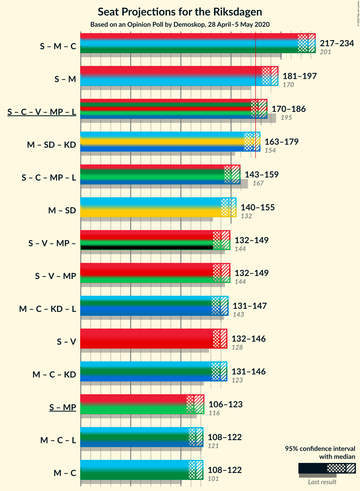
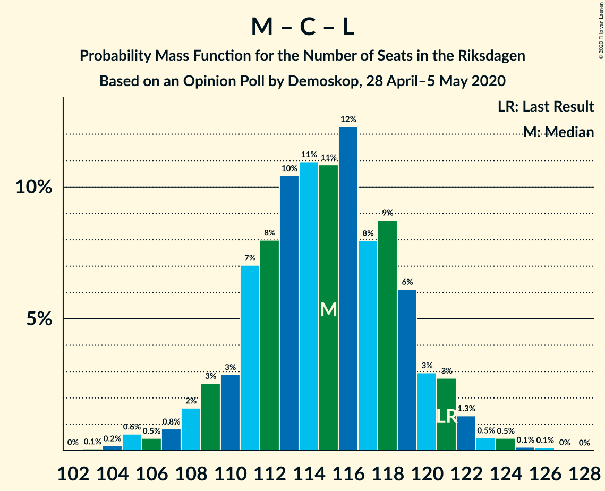

# Opinion Poll by Demoskop, 28 April–5 May 2020

<a href="#voting-intentions">Voting Intentions</a> | <a href="#seats">Seats</a> | <a href="#coalitions">Coalitions</a> | <a href="#technical-information">Technical Information</a>

## Voting Intentions

### Confidence Intervals

| Party | Last Result | Poll Result | 80% Confidence Interval | 90% Confidence Interval | 95% Confidence Interval | 99% Confidence Interval |
|:-----:|:-----------:|:-----------:|:-----------------------:|:-----------------------:|:-----------------------:|:-----------------------:|
| Sveriges socialdemokratiska arbetareparti | 28.3% | 30.1% | 28.9–31.3% |28.5–31.7% |28.2–32.0% |27.7–32.6% |
| Moderata samlingspartiet | 19.8% | 20.7% | 19.6–21.8% |19.3–22.1% |19.1–22.4% |18.6–22.9% |
| Sverigedemokraterna | 17.5% | 18.8% | 17.8–19.9% |17.5–20.2% |17.3–20.5% |16.8–21.0% |
| Centerpartiet | 8.6% | 10.0% | 9.3–10.9% |9.0–11.1% |8.8–11.3% |8.5–11.7% |
| Vänsterpartiet | 8.0% | 7.2% | 6.5–7.9% |6.3–8.1% |6.2–8.3% |5.9–8.7% |
| Kristdemokraterna | 6.3% | 6.5% | 5.9–7.2% |5.7–7.4% |5.5–7.6% |5.3–7.9% |
| Miljöpartiet de gröna | 4.4% | 3.3% | 2.9–3.8% |2.7–4.0% |2.7–4.1% |2.5–4.4% |
| Liberalerna | 5.5% | 2.7% | 2.3–3.2% |2.2–3.3% |2.1–3.5% |1.9–3.7% |

*Note:* The poll result column reflects the actual value used in the calculations. Published results may vary slightly, and in addition be rounded to fewer digits.

## Seats

### Confidence Intervals

| Party | Last Result | Median | 80% Confidence Interval | 90% Confidence Interval | 95% Confidence Interval | 99% Confidence Interval |
|:-----:|:-----------:|:------:|:-----------------------:|:-----------------------:|:-----------------------:|:-----------------------:|
| <a href="#sveriges-socialdemokratiska-arbetareparti">Sveriges socialdemokratiska arbetareparti</a> | 100 | 112 | 112 |103–112 |103–113 |103–120 |
| <a href="#moderata-samlingspartiet">Moderata samlingspartiet</a> | 70 | 78 | 78 |74–78 |74–78 |68–86 |
| <a href="#sverigedemokraterna">Sverigedemokraterna</a> | 62 | 78 | 78 |78 |65–80 |59–80 |
| <a href="#centerpartiet">Centerpartiet</a> | 31 | 42 | 42 |42 |34–42 |28–42 |
| <a href="#vänsterpartiet">Vänsterpartiet</a> | 28 | 21 | 21 |21–22 |21–27 |21–31 |
| <a href="#kristdemokraterna">Kristdemokraterna</a> | 22 | 18 | 18 |18–27 |18–28 |18–28 |
| <a href="#miljöpartiet-de-gröna">Miljöpartiet de gröna</a> | 16 | 0 | 0 |0 |0 |0–17 |
| <a href="#liberalerna">Liberalerna</a> | 20 | 0 | 0 |0 |0 |0 |

### Sveriges socialdemokratiska arbetareparti

*For a full overview of the results for this party, see the [Sveriges socialdemokratiska arbetareparti](party-sverigessocialdemokratiskaarbetareparti.html) page.*

| Number of Seats | Probability | Accumulated | Special Marks |
|:---------------:|:-----------:|:-----------:|:-------------:|
| 100 | 0% | 100% | Last Result |
| 101 | 0% | 100% |  |
| 102 | 0.4% | 100% |  |
| 103 | 5% | 99.6% |  |
| 104 | 0% | 95% |  |
| 105 | 0.1% | 95% |  |
| 106 | 0% | 95% |  |
| 107 | 0% | 95% |  |
| 108 | 0% | 95% |  |
| 109 | 0% | 95% |  |
| 110 | 0% | 95% |  |
| 111 | 0% | 95% |  |
| 112 | 92% | 95% | Median |
| 113 | 0.6% | 3% |  |
| 114 | 1.3% | 2% |  |
| 115 | 0% | 1.2% |  |
| 116 | 0% | 1.2% |  |
| 117 | 0.2% | 1.2% |  |
| 118 | 0% | 1.0% |  |
| 119 | 0% | 1.0% |  |
| 120 | 0.5% | 1.0% |  |
| 121 | 0% | 0.5% |  |
| 122 | 0% | 0.5% |  |
| 123 | 0% | 0.5% |  |
| 124 | 0% | 0.5% |  |
| 125 | 0% | 0.5% |  |
| 126 | 0% | 0.5% |  |
| 127 | 0% | 0.5% |  |
| 128 | 0% | 0.5% |  |
| 129 | 0% | 0.5% |  |
| 130 | 0.5% | 0.5% |  |
| 131 | 0% | 0% |  |

### Moderata samlingspartiet

*For a full overview of the results for this party, see the [Moderata samlingspartiet](party-moderatasamlingspartiet.html) page.*

| Number of Seats | Probability | Accumulated | Special Marks |
|:---------------:|:-----------:|:-----------:|:-------------:|
| 68 | 0.5% | 100% |  |
| 69 | 0.2% | 99.5% |  |
| 70 | 0% | 99.3% | Last Result |
| 71 | 0% | 99.3% |  |
| 72 | 0.2% | 99.3% |  |
| 73 | 0% | 99.1% |  |
| 74 | 5% | 99.1% |  |
| 75 | 0% | 94% |  |
| 76 | 0% | 94% |  |
| 77 | 0% | 94% |  |
| 78 | 92% | 94% | Median |
| 79 | 0% | 2% |  |
| 80 | 0% | 2% |  |
| 81 | 0% | 2% |  |
| 82 | 0% | 2% |  |
| 83 | 0% | 2% |  |
| 84 | 0% | 2% |  |
| 85 | 0.4% | 2% |  |
| 86 | 2% | 2% |  |
| 87 | 0% | 0% |  |

### Sverigedemokraterna

*For a full overview of the results for this party, see the [Sverigedemokraterna](party-sverigedemokraterna.html) page.*

| Number of Seats | Probability | Accumulated | Special Marks |
|:---------------:|:-----------:|:-----------:|:-------------:|
| 58 | 0.4% | 100% |  |
| 59 | 0.5% | 99.6% |  |
| 60 | 0% | 99.1% |  |
| 61 | 0% | 99.1% |  |
| 62 | 0% | 99.1% | Last Result |
| 63 | 0.5% | 99.1% |  |
| 64 | 0% | 98.6% |  |
| 65 | 1.3% | 98.6% |  |
| 66 | 0.1% | 97% |  |
| 67 | 0% | 97% |  |
| 68 | 0% | 97% |  |
| 69 | 0% | 97% |  |
| 70 | 0.2% | 97% |  |
| 71 | 0% | 97% |  |
| 72 | 0% | 97% |  |
| 73 | 0% | 97% |  |
| 74 | 0% | 97% |  |
| 75 | 0% | 97% |  |
| 76 | 0% | 97% |  |
| 77 | 0% | 97% |  |
| 78 | 92% | 97% | Median |
| 79 | 0% | 5% |  |
| 80 | 5% | 5% |  |
| 81 | 0% | 0% |  |

### Centerpartiet

*For a full overview of the results for this party, see the [Centerpartiet](party-centerpartiet.html) page.*

| Number of Seats | Probability | Accumulated | Special Marks |
|:---------------:|:-----------:|:-----------:|:-------------:|
| 28 | 0.6% | 100% |  |
| 29 | 0% | 99.4% |  |
| 30 | 1.4% | 99.4% |  |
| 31 | 0% | 98% | Last Result |
| 32 | 0.1% | 98% |  |
| 33 | 0% | 98% |  |
| 34 | 0.5% | 98% |  |
| 35 | 0.5% | 97% |  |
| 36 | 0% | 97% |  |
| 37 | 0.5% | 97% |  |
| 38 | 0% | 96% |  |
| 39 | 0% | 96% |  |
| 40 | 0% | 96% |  |
| 41 | 0% | 96% |  |
| 42 | 96% | 96% | Median |
| 43 | 0% | 0% |  |

### Vänsterpartiet

*For a full overview of the results for this party, see the [Vänsterpartiet](party-vänsterpartiet.html) page.*

| Number of Seats | Probability | Accumulated | Special Marks |
|:---------------:|:-----------:|:-----------:|:-------------:|
| 21 | 92% | 100% | Median |
| 22 | 5% | 8% |  |
| 23 | 0.6% | 4% |  |
| 24 | 0% | 3% |  |
| 25 | 0% | 3% |  |
| 26 | 0.5% | 3% |  |
| 27 | 0.5% | 3% |  |
| 28 | 0.1% | 2% | Last Result |
| 29 | 0% | 2% |  |
| 30 | 1.3% | 2% |  |
| 31 | 0.5% | 0.6% |  |
| 32 | 0% | 0.1% |  |
| 33 | 0% | 0.1% |  |
| 34 | 0% | 0.1% |  |
| 35 | 0.1% | 0.1% |  |
| 36 | 0% | 0% |  |

### Kristdemokraterna

*For a full overview of the results for this party, see the [Kristdemokraterna](party-kristdemokraterna.html) page.*

| Number of Seats | Probability | Accumulated | Special Marks |
|:---------------:|:-----------:|:-----------:|:-------------:|
| 17 | 0.2% | 100% |  |
| 18 | 92% | 99.8% | Median |
| 19 | 0% | 8% |  |
| 20 | 0.1% | 8% |  |
| 21 | 0.6% | 8% |  |
| 22 | 0% | 7% | Last Result |
| 23 | 0.1% | 7% |  |
| 24 | 2% | 7% |  |
| 25 | 0.4% | 6% |  |
| 26 | 0% | 5% |  |
| 27 | 0.5% | 5% |  |
| 28 | 5% | 5% |  |
| 29 | 0% | 0% |  |

### Miljöpartiet de gröna

*For a full overview of the results for this party, see the [Miljöpartiet de gröna](party-miljöpartietdegröna.html) page.*

| Number of Seats | Probability | Accumulated | Special Marks |
|:---------------:|:-----------:|:-----------:|:-------------:|
| 0 | 99.4% | 100% | Median |
| 1 | 0% | 0.6% |  |
| 2 | 0% | 0.6% |  |
| 3 | 0% | 0.6% |  |
| 4 | 0% | 0.6% |  |
| 5 | 0% | 0.6% |  |
| 6 | 0% | 0.6% |  |
| 7 | 0% | 0.6% |  |
| 8 | 0% | 0.6% |  |
| 9 | 0% | 0.6% |  |
| 10 | 0% | 0.6% |  |
| 11 | 0% | 0.6% |  |
| 12 | 0% | 0.6% |  |
| 13 | 0% | 0.6% |  |
| 14 | 0% | 0.6% |  |
| 15 | 0% | 0.6% |  |
| 16 | 0% | 0.6% | Last Result |
| 17 | 0.1% | 0.6% |  |
| 18 | 0.4% | 0.5% |  |
| 19 | 0.1% | 0.1% |  |
| 20 | 0% | 0% |  |

### Liberalerna

*For a full overview of the results for this party, see the [Liberalerna](party-liberalerna.html) page.*

| Number of Seats | Probability | Accumulated | Special Marks |
|:---------------:|:-----------:|:-----------:|:-------------:|
| 0 | 99.8% | 100% | Median |
| 1 | 0% | 0.2% |  |
| 2 | 0% | 0.2% |  |
| 3 | 0% | 0.2% |  |
| 4 | 0% | 0.2% |  |
| 5 | 0% | 0.2% |  |
| 6 | 0% | 0.2% |  |
| 7 | 0% | 0.2% |  |
| 8 | 0% | 0.2% |  |
| 9 | 0% | 0.2% |  |
| 10 | 0% | 0.2% |  |
| 11 | 0% | 0.2% |  |
| 12 | 0% | 0.2% |  |
| 13 | 0% | 0.2% |  |
| 14 | 0% | 0.2% |  |
| 15 | 0% | 0.2% |  |
| 16 | 0.2% | 0.2% |  |
| 17 | 0% | 0% |  |
| 18 | 0% | 0% |  |
| 19 | 0% | 0% |  |
| 20 | 0% | 0% | Last Result |

## Coalitions

### Confidence Intervals

| Coalition | Last Result | Median | Majority? | 80% Confidence Interval | 90% Confidence Interval | 95% Confidence Interval | 99% Confidence Interval |
|:---------:|:-----------:|:------:|:---------:|:-----------------------:|:-----------------------:|:-----------------------:|:-----------------------:|
| Sveriges socialdemokratiska arbetareparti – Moderata samlingspartiet – Centerpartiet | 201 | 232 | 100% | 232 | 219–232 | 219–232 | 219–235 |
| Sveriges socialdemokratiska arbetareparti – Moderata samlingspartiet | 170 | 190 | 99.8% | 190 | 187–190 | 177–198 | 177–200 |
| Moderata samlingspartiet – Sverigedemokraterna – Kristdemokraterna | 154 | 174 | 7% | 174 | 174–182 | 174–182 | 151–185 |
| Sveriges socialdemokratiska arbetareparti – Centerpartiet – Vänsterpartiet – Miljöpartiet de gröna – Liberalerna | 195 | 175 | 93% | 175 | 167–175 | 167–175 | 164–198 |
| Moderata samlingspartiet – Sverigedemokraterna | 132 | 156 | 0% | 156 | 154–156 | 151–156 | 127–164 |
| Sveriges socialdemokratiska arbetareparti – Centerpartiet – Miljöpartiet de gröna – Liberalerna | 167 | 154 | 0% | 154 | 145–154 | 145–154 | 141–167 |
| Moderata samlingspartiet – Centerpartiet – Kristdemokraterna – Liberalerna | 143 | 138 | 0% | 138 | 138–144 | 138–144 | 129–144 |
| Moderata samlingspartiet – Centerpartiet – Kristdemokraterna | 123 | 138 | 0% | 138 | 138–144 | 138–144 | 129–144 |
| Sveriges socialdemokratiska arbetareparti – Vänsterpartiet – Miljöpartiet de gröna | 144 | 133 | 0% | 133 | 133 | 125–144 | 125–161 |
| Sveriges socialdemokratiska arbetareparti – Vänsterpartiet | 128 | 133 | 0% | 133 | 129–133 | 125–140 | 125–146 |
| Moderata samlingspartiet – Centerpartiet – Liberalerna | 121 | 120 | 0% | 120 | 116–120 | 116–120 | 105–120 |
| Moderata samlingspartiet – Centerpartiet | 101 | 120 | 0% | 120 | 116–120 | 116–120 | 105–120 |
| Sveriges socialdemokratiska arbetareparti – Miljöpartiet de gröna | 116 | 112 | 0% | 112 | 112 | 103–114 | 103–130 |

### Sveriges socialdemokratiska arbetareparti – Moderata samlingspartiet – Centerpartiet

| Number of Seats | Probability | Accumulated | Special Marks |
|:---------------:|:-----------:|:-----------:|:-------------:|
| 201 | 0% | 100% | Last Result |
| 202 | 0% | 100% |  |
| 203 | 0% | 100% |  |
| 204 | 0.1% | 100% |  |
| 205 | 0% | 99.9% |  |
| 206 | 0% | 99.9% |  |
| 207 | 0% | 99.9% |  |
| 208 | 0.1% | 99.9% |  |
| 209 | 0% | 99.8% |  |
| 210 | 0% | 99.8% |  |
| 211 | 0% | 99.8% |  |
| 212 | 0% | 99.8% |  |
| 213 | 0% | 99.8% |  |
| 214 | 0% | 99.8% |  |
| 215 | 0% | 99.8% |  |
| 216 | 0% | 99.8% |  |
| 217 | 0% | 99.8% |  |
| 218 | 0% | 99.8% |  |
| 219 | 5% | 99.8% |  |
| 220 | 0% | 95% |  |
| 221 | 0.4% | 95% |  |
| 222 | 0% | 95% |  |
| 223 | 0% | 95% |  |
| 224 | 0% | 95% |  |
| 225 | 0% | 95% |  |
| 226 | 0% | 95% |  |
| 227 | 0.6% | 95% |  |
| 228 | 0% | 94% |  |
| 229 | 0% | 94% |  |
| 230 | 1.3% | 94% |  |
| 231 | 0% | 93% |  |
| 232 | 92% | 93% | Median |
| 233 | 0.5% | 1.0% |  |
| 234 | 0% | 0.5% |  |
| 235 | 0.5% | 0.5% |  |
| 236 | 0% | 0% |  |

### Sveriges socialdemokratiska arbetareparti – Moderata samlingspartiet

| Number of Seats | Probability | Accumulated | Special Marks |
|:---------------:|:-----------:|:-----------:|:-------------:|
| 170 | 0% | 100% | Last Result |
| 171 | 0% | 100% |  |
| 172 | 0.1% | 100% |  |
| 173 | 0% | 99.9% |  |
| 174 | 0.1% | 99.9% |  |
| 175 | 0% | 99.8% | Majority |
| 176 | 0% | 99.8% |  |
| 177 | 5% | 99.8% |  |
| 178 | 0% | 95% |  |
| 179 | 0% | 95% |  |
| 180 | 0% | 95% |  |
| 181 | 0% | 95% |  |
| 182 | 0% | 95% |  |
| 183 | 0% | 95% |  |
| 184 | 0% | 95% |  |
| 185 | 0% | 95% |  |
| 186 | 0% | 95% |  |
| 187 | 0.4% | 95% |  |
| 188 | 0% | 95% |  |
| 189 | 0.2% | 95% |  |
| 190 | 92% | 95% | Median |
| 191 | 0% | 3% |  |
| 192 | 0% | 3% |  |
| 193 | 0% | 3% |  |
| 194 | 0% | 3% |  |
| 195 | 0% | 3% |  |
| 196 | 0% | 3% |  |
| 197 | 0% | 3% |  |
| 198 | 1.0% | 3% |  |
| 199 | 0.6% | 2% |  |
| 200 | 1.3% | 1.3% |  |
| 201 | 0% | 0% |  |

### Moderata samlingspartiet – Sverigedemokraterna – Kristdemokraterna

| Number of Seats | Probability | Accumulated | Special Marks |
|:---------------:|:-----------:|:-----------:|:-------------:|
| 151 | 0.5% | 100% |  |
| 152 | 0% | 99.5% |  |
| 153 | 0% | 99.5% |  |
| 154 | 0% | 99.5% | Last Result |
| 155 | 0% | 99.5% |  |
| 156 | 0% | 99.5% |  |
| 157 | 0% | 99.5% |  |
| 158 | 0.1% | 99.5% |  |
| 159 | 0.2% | 99.4% |  |
| 160 | 0% | 99.2% |  |
| 161 | 0% | 99.2% |  |
| 162 | 0% | 99.2% |  |
| 163 | 0% | 99.2% |  |
| 164 | 0% | 99.2% |  |
| 165 | 0% | 99.2% |  |
| 166 | 0% | 99.2% |  |
| 167 | 0.1% | 99.2% |  |
| 168 | 0.9% | 99.1% |  |
| 169 | 0% | 98% |  |
| 170 | 0% | 98% |  |
| 171 | 0% | 98% |  |
| 172 | 0% | 98% |  |
| 173 | 0% | 98% |  |
| 174 | 92% | 98% | Median |
| 175 | 1.3% | 7% | Majority |
| 176 | 0% | 5% |  |
| 177 | 0% | 5% |  |
| 178 | 0% | 5% |  |
| 179 | 0% | 5% |  |
| 180 | 0% | 5% |  |
| 181 | 0% | 5% |  |
| 182 | 5% | 5% |  |
| 183 | 0% | 0.6% |  |
| 184 | 0% | 0.6% |  |
| 185 | 0.6% | 0.6% |  |
| 186 | 0% | 0% |  |

### Sveriges socialdemokratiska arbetareparti – Centerpartiet – Vänsterpartiet – Miljöpartiet de gröna – Liberalerna

| Number of Seats | Probability | Accumulated | Special Marks |
|:---------------:|:-----------:|:-----------:|:-------------:|
| 164 | 0.6% | 100% |  |
| 165 | 0% | 99.4% |  |
| 166 | 0% | 99.4% |  |
| 167 | 5% | 99.4% |  |
| 168 | 0% | 95% |  |
| 169 | 0% | 95% |  |
| 170 | 0% | 95% |  |
| 171 | 0% | 95% |  |
| 172 | 0% | 95% |  |
| 173 | 0% | 95% |  |
| 174 | 1.3% | 95% |  |
| 175 | 92% | 93% | Median, Majority |
| 176 | 0% | 2% |  |
| 177 | 0% | 2% |  |
| 178 | 0% | 2% |  |
| 179 | 0% | 2% |  |
| 180 | 0% | 2% |  |
| 181 | 0.9% | 2% |  |
| 182 | 0.1% | 0.9% |  |
| 183 | 0% | 0.8% |  |
| 184 | 0% | 0.8% |  |
| 185 | 0% | 0.8% |  |
| 186 | 0% | 0.8% |  |
| 187 | 0% | 0.8% |  |
| 188 | 0% | 0.8% |  |
| 189 | 0% | 0.8% |  |
| 190 | 0.2% | 0.8% |  |
| 191 | 0.1% | 0.6% |  |
| 192 | 0% | 0.5% |  |
| 193 | 0% | 0.5% |  |
| 194 | 0% | 0.5% |  |
| 195 | 0% | 0.5% | Last Result |
| 196 | 0% | 0.5% |  |
| 197 | 0% | 0.5% |  |
| 198 | 0.5% | 0.5% |  |
| 199 | 0% | 0% |  |

### Moderata samlingspartiet – Sverigedemokraterna

| Number of Seats | Probability | Accumulated | Special Marks |
|:---------------:|:-----------:|:-----------:|:-------------:|
| 127 | 0.5% | 100% |  |
| 128 | 0% | 99.5% |  |
| 129 | 0% | 99.5% |  |
| 130 | 0% | 99.5% |  |
| 131 | 0% | 99.5% |  |
| 132 | 0% | 99.5% | Last Result |
| 133 | 0% | 99.5% |  |
| 134 | 0% | 99.5% |  |
| 135 | 0.1% | 99.5% |  |
| 136 | 0% | 99.4% |  |
| 137 | 0% | 99.4% |  |
| 138 | 0% | 99.4% |  |
| 139 | 0% | 99.4% |  |
| 140 | 0% | 99.4% |  |
| 141 | 0.5% | 99.4% |  |
| 142 | 0.2% | 98.9% |  |
| 143 | 0.4% | 98.7% |  |
| 144 | 0% | 98% |  |
| 145 | 0% | 98% |  |
| 146 | 0% | 98% |  |
| 147 | 0.1% | 98% |  |
| 148 | 0% | 98% |  |
| 149 | 0% | 98% |  |
| 150 | 0% | 98% |  |
| 151 | 1.3% | 98% |  |
| 152 | 0% | 97% |  |
| 153 | 0% | 97% |  |
| 154 | 5% | 97% |  |
| 155 | 0% | 92% |  |
| 156 | 92% | 92% | Median |
| 157 | 0% | 0.6% |  |
| 158 | 0% | 0.6% |  |
| 159 | 0% | 0.6% |  |
| 160 | 0% | 0.6% |  |
| 161 | 0% | 0.6% |  |
| 162 | 0% | 0.6% |  |
| 163 | 0% | 0.6% |  |
| 164 | 0.6% | 0.6% |  |
| 165 | 0% | 0% |  |

### Sveriges socialdemokratiska arbetareparti – Centerpartiet – Miljöpartiet de gröna – Liberalerna

| Number of Seats | Probability | Accumulated | Special Marks |
|:---------------:|:-----------:|:-----------:|:-------------:|
| 141 | 0.6% | 100% |  |
| 142 | 0% | 99.4% |  |
| 143 | 0% | 99.4% |  |
| 144 | 1.3% | 99.4% |  |
| 145 | 5% | 98% |  |
| 146 | 0% | 93% |  |
| 147 | 0% | 93% |  |
| 148 | 0% | 93% |  |
| 149 | 0% | 93% |  |
| 150 | 0% | 93% |  |
| 151 | 0% | 93% |  |
| 152 | 0% | 93% |  |
| 153 | 0% | 93% |  |
| 154 | 92% | 93% | Median |
| 155 | 0.5% | 1.3% |  |
| 156 | 0.1% | 0.8% |  |
| 157 | 0% | 0.7% |  |
| 158 | 0% | 0.7% |  |
| 159 | 0% | 0.7% |  |
| 160 | 0% | 0.7% |  |
| 161 | 0% | 0.7% |  |
| 162 | 0% | 0.7% |  |
| 163 | 0.2% | 0.7% |  |
| 164 | 0% | 0.5% |  |
| 165 | 0% | 0.5% |  |
| 166 | 0% | 0.5% |  |
| 167 | 0.5% | 0.5% | Last Result |
| 168 | 0% | 0% |  |

### Moderata samlingspartiet – Centerpartiet – Kristdemokraterna – Liberalerna

| Number of Seats | Probability | Accumulated | Special Marks |
|:---------------:|:-----------:|:-----------:|:-------------:|
| 121 | 0.1% | 100% |  |
| 122 | 0% | 99.9% |  |
| 123 | 0% | 99.9% |  |
| 124 | 0% | 99.9% |  |
| 125 | 0% | 99.9% |  |
| 126 | 0.1% | 99.9% |  |
| 127 | 0% | 99.8% |  |
| 128 | 0% | 99.8% |  |
| 129 | 0.5% | 99.8% |  |
| 130 | 0% | 99.3% |  |
| 131 | 0% | 99.3% |  |
| 132 | 0% | 99.3% |  |
| 133 | 0% | 99.3% |  |
| 134 | 0% | 99.3% |  |
| 135 | 0.8% | 99.3% |  |
| 136 | 0% | 98% |  |
| 137 | 0% | 98% |  |
| 138 | 92% | 98% | Median |
| 139 | 0% | 7% |  |
| 140 | 2% | 7% |  |
| 141 | 0% | 5% |  |
| 142 | 0% | 5% |  |
| 143 | 0% | 5% | Last Result |
| 144 | 5% | 5% |  |
| 145 | 0% | 0% |  |

### Moderata samlingspartiet – Centerpartiet – Kristdemokraterna

| Number of Seats | Probability | Accumulated | Special Marks |
|:---------------:|:-----------:|:-----------:|:-------------:|
| 119 | 0.2% | 100% |  |
| 120 | 0% | 99.8% |  |
| 121 | 0.1% | 99.8% |  |
| 122 | 0% | 99.7% |  |
| 123 | 0% | 99.7% | Last Result |
| 124 | 0% | 99.7% |  |
| 125 | 0% | 99.7% |  |
| 126 | 0.1% | 99.7% |  |
| 127 | 0% | 99.6% |  |
| 128 | 0% | 99.6% |  |
| 129 | 0.5% | 99.6% |  |
| 130 | 0% | 99.1% |  |
| 131 | 0% | 99.1% |  |
| 132 | 0% | 99.1% |  |
| 133 | 0% | 99.1% |  |
| 134 | 0% | 99.1% |  |
| 135 | 0.6% | 99.1% |  |
| 136 | 0% | 98% |  |
| 137 | 0% | 98% |  |
| 138 | 92% | 98% | Median |
| 139 | 0% | 7% |  |
| 140 | 2% | 7% |  |
| 141 | 0% | 5% |  |
| 142 | 0% | 5% |  |
| 143 | 0% | 5% |  |
| 144 | 5% | 5% |  |
| 145 | 0% | 0% |  |

### Sveriges socialdemokratiska arbetareparti – Vänsterpartiet – Miljöpartiet de gröna

| Number of Seats | Probability | Accumulated | Special Marks |
|:---------------:|:-----------:|:-----------:|:-------------:|
| 125 | 5% | 100% |  |
| 126 | 0% | 95% |  |
| 127 | 0% | 95% |  |
| 128 | 0% | 95% |  |
| 129 | 0% | 95% |  |
| 130 | 0% | 95% |  |
| 131 | 0% | 95% |  |
| 132 | 0% | 95% |  |
| 133 | 92% | 95% | Median |
| 134 | 0% | 4% |  |
| 135 | 0% | 4% |  |
| 136 | 0.6% | 4% |  |
| 137 | 0% | 3% |  |
| 138 | 0% | 3% |  |
| 139 | 0% | 3% |  |
| 140 | 0% | 3% |  |
| 141 | 0% | 3% |  |
| 142 | 0% | 3% |  |
| 143 | 0% | 3% |  |
| 144 | 1.5% | 3% | Last Result |
| 145 | 0% | 2% |  |
| 146 | 0.5% | 2% |  |
| 147 | 0.4% | 1.1% |  |
| 148 | 0% | 0.7% |  |
| 149 | 0% | 0.7% |  |
| 150 | 0.1% | 0.7% |  |
| 151 | 0% | 0.6% |  |
| 152 | 0% | 0.6% |  |
| 153 | 0% | 0.6% |  |
| 154 | 0% | 0.6% |  |
| 155 | 0% | 0.6% |  |
| 156 | 0% | 0.6% |  |
| 157 | 0.1% | 0.6% |  |
| 158 | 0% | 0.5% |  |
| 159 | 0% | 0.5% |  |
| 160 | 0% | 0.5% |  |
| 161 | 0.5% | 0.5% |  |
| 162 | 0% | 0% |  |

### Sveriges socialdemokratiska arbetareparti – Vänsterpartiet

| Number of Seats | Probability | Accumulated | Special Marks |
|:---------------:|:-----------:|:-----------:|:-------------:|
| 125 | 5% | 100% |  |
| 126 | 0% | 95% |  |
| 127 | 0% | 95% |  |
| 128 | 0% | 95% | Last Result |
| 129 | 0.4% | 95% |  |
| 130 | 0% | 95% |  |
| 131 | 0.1% | 95% |  |
| 132 | 0% | 95% |  |
| 133 | 92% | 95% | Median |
| 134 | 0% | 3% |  |
| 135 | 0% | 3% |  |
| 136 | 0.6% | 3% |  |
| 137 | 0% | 3% |  |
| 138 | 0% | 3% |  |
| 139 | 0% | 3% |  |
| 140 | 0.1% | 3% |  |
| 141 | 0% | 2% |  |
| 142 | 0% | 2% |  |
| 143 | 0% | 2% |  |
| 144 | 1.4% | 2% |  |
| 145 | 0% | 1.0% |  |
| 146 | 0.5% | 1.0% |  |
| 147 | 0% | 0.5% |  |
| 148 | 0% | 0.5% |  |
| 149 | 0% | 0.5% |  |
| 150 | 0% | 0.5% |  |
| 151 | 0% | 0.5% |  |
| 152 | 0% | 0.5% |  |
| 153 | 0% | 0.5% |  |
| 154 | 0% | 0.5% |  |
| 155 | 0% | 0.5% |  |
| 156 | 0% | 0.5% |  |
| 157 | 0% | 0.5% |  |
| 158 | 0% | 0.5% |  |
| 159 | 0% | 0.5% |  |
| 160 | 0% | 0.5% |  |
| 161 | 0.5% | 0.5% |  |
| 162 | 0% | 0% |  |

### Moderata samlingspartiet – Centerpartiet – Liberalerna

| Number of Seats | Probability | Accumulated | Special Marks |
|:---------------:|:-----------:|:-----------:|:-------------:|
| 101 | 0.1% | 100% |  |
| 102 | 0% | 99.9% |  |
| 103 | 0.1% | 99.9% |  |
| 104 | 0% | 99.8% |  |
| 105 | 0.5% | 99.8% |  |
| 106 | 0% | 99.3% |  |
| 107 | 0% | 99.3% |  |
| 108 | 0% | 99.3% |  |
| 109 | 0% | 99.3% |  |
| 110 | 0% | 99.3% |  |
| 111 | 0% | 99.3% |  |
| 112 | 0% | 99.3% |  |
| 113 | 0.5% | 99.3% |  |
| 114 | 0.6% | 98.8% |  |
| 115 | 0% | 98% |  |
| 116 | 6% | 98% |  |
| 117 | 0% | 92% |  |
| 118 | 0.2% | 92% |  |
| 119 | 0.4% | 92% |  |
| 120 | 92% | 92% | Median |
| 121 | 0% | 0% | Last Result |

### Moderata samlingspartiet – Centerpartiet

| Number of Seats | Probability | Accumulated | Special Marks |
|:---------------:|:-----------:|:-----------:|:-------------:|
| 101 | 0.1% | 100% | Last Result |
| 102 | 0.2% | 99.9% |  |
| 103 | 0.1% | 99.7% |  |
| 104 | 0% | 99.6% |  |
| 105 | 0.5% | 99.6% |  |
| 106 | 0% | 99.1% |  |
| 107 | 0% | 99.1% |  |
| 108 | 0% | 99.1% |  |
| 109 | 0% | 99.1% |  |
| 110 | 0% | 99.1% |  |
| 111 | 0% | 99.1% |  |
| 112 | 0% | 99.1% |  |
| 113 | 0.5% | 99.1% |  |
| 114 | 0.6% | 98.6% |  |
| 115 | 0% | 98% |  |
| 116 | 6% | 98% |  |
| 117 | 0% | 92% |  |
| 118 | 0% | 92% |  |
| 119 | 0.4% | 92% |  |
| 120 | 92% | 92% | Median |
| 121 | 0% | 0% |  |

### Sveriges socialdemokratiska arbetareparti – Miljöpartiet de gröna

| Number of Seats | Probability | Accumulated | Special Marks |
|:---------------:|:-----------:|:-----------:|:-------------:|
| 103 | 5% | 100% |  |
| 104 | 0% | 95% |  |
| 105 | 0% | 95% |  |
| 106 | 0% | 95% |  |
| 107 | 0% | 95% |  |
| 108 | 0% | 95% |  |
| 109 | 0% | 95% |  |
| 110 | 0% | 95% |  |
| 111 | 0% | 95% |  |
| 112 | 92% | 95% | Median |
| 113 | 0.6% | 4% |  |
| 114 | 1.3% | 3% |  |
| 115 | 0% | 2% |  |
| 116 | 0% | 2% | Last Result |
| 117 | 0.2% | 2% |  |
| 118 | 0% | 2% |  |
| 119 | 0% | 2% |  |
| 120 | 0.9% | 2% |  |
| 121 | 0% | 0.7% |  |
| 122 | 0.2% | 0.7% |  |
| 123 | 0% | 0.5% |  |
| 124 | 0% | 0.5% |  |
| 125 | 0% | 0.5% |  |
| 126 | 0% | 0.5% |  |
| 127 | 0% | 0.5% |  |
| 128 | 0% | 0.5% |  |
| 129 | 0% | 0.5% |  |
| 130 | 0.5% | 0.5% |  |
| 131 | 0% | 0% |  |

## Technical Information

### Opinion Poll

+ **Polling firm:** Demoskop
+ **Commissioner(s):** —
+ **Fieldwork period:** 28 April–5 May 2020

### Calculations

+ **Sample size:** 2297
+ **Simulations done:** 128
+ **Error estimate:** 3.57%

