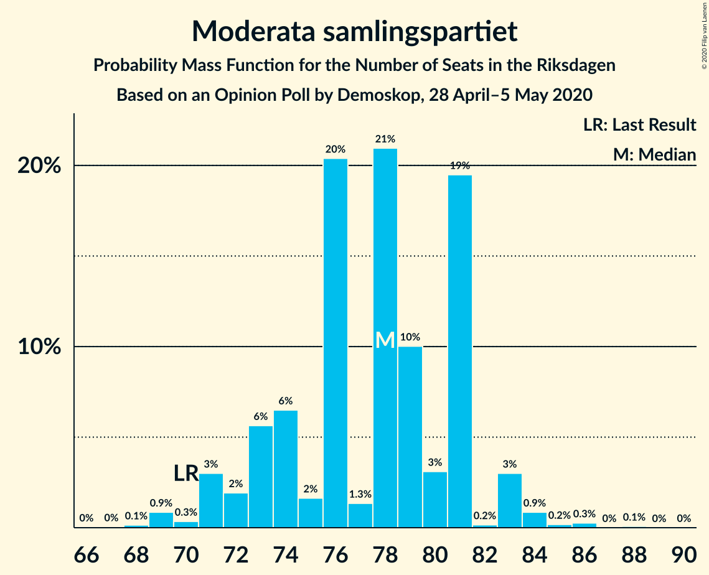
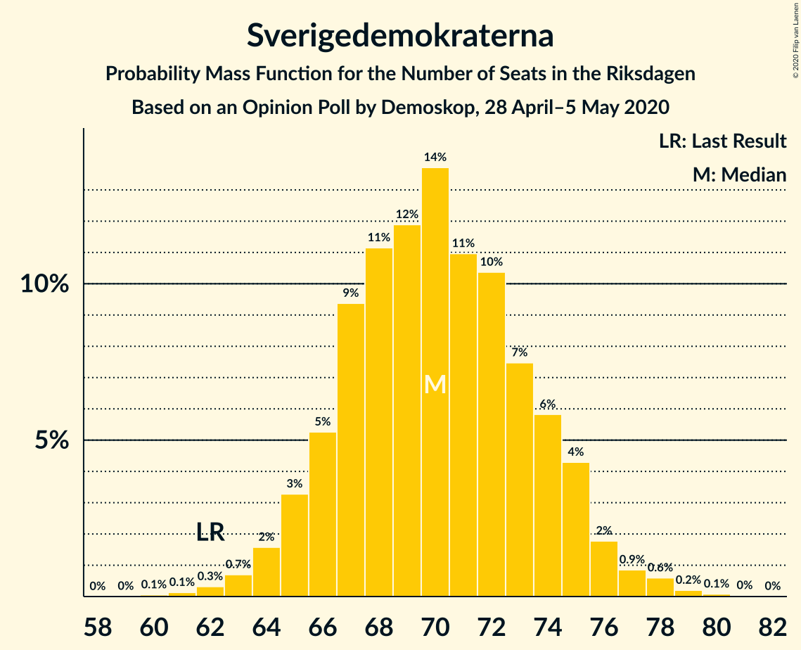
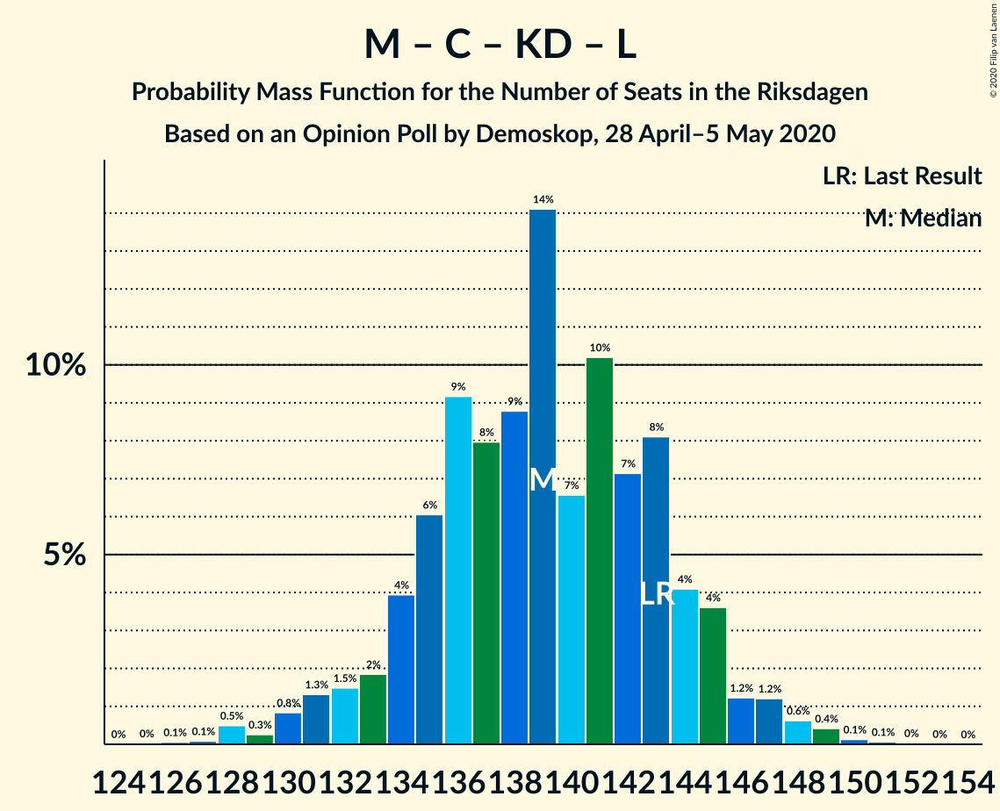

# Opinion Poll by Demoskop, 28 April–5 May 2020

<a href="#voting-intentions">Voting Intentions</a> | <a href="#seats">Seats</a> | <a href="#coalitions">Coalitions</a> | <a href="#technical-information">Technical Information</a>

## Voting Intentions

### Confidence Intervals

| Party | Last Result | Poll Result | 80% Confidence Interval | 90% Confidence Interval | 95% Confidence Interval | 99% Confidence Interval |
|:-----:|:-----------:|:-----------:|:-----------------------:|:-----------------------:|:-----------------------:|:-----------------------:|
| Sveriges socialdemokratiska arbetareparti | 28.3% | 30.1% | 28.9–31.3% |28.5–31.7% |28.2–32.0% |27.7–32.6% |
| Moderata samlingspartiet | 19.8% | 20.7% | 19.6–21.8% |19.3–22.1% |19.1–22.4% |18.6–22.9% |
| Sverigedemokraterna | 17.5% | 18.8% | 17.8–19.9% |17.5–20.2% |17.3–20.5% |16.8–21.0% |
| Centerpartiet | 8.6% | 10.0% | 9.3–10.9% |9.0–11.1% |8.8–11.3% |8.5–11.7% |
| Vänsterpartiet | 8.0% | 7.2% | 6.5–7.9% |6.3–8.1% |6.2–8.3% |5.9–8.7% |
| Kristdemokraterna | 6.3% | 6.5% | 5.9–7.2% |5.7–7.4% |5.5–7.6% |5.3–7.9% |
| Miljöpartiet de gröna | 4.4% | 3.3% | 2.9–3.8% |2.7–4.0% |2.7–4.1% |2.5–4.4% |
| Liberalerna | 5.5% | 2.7% | 2.3–3.2% |2.2–3.3% |2.1–3.5% |1.9–3.7% |

*Note:* The poll result column reflects the actual value used in the calculations. Published results may vary slightly, and in addition be rounded to fewer digits.

## Seats

### Confidence Intervals

| Party | Last Result | Median | 80% Confidence Interval | 90% Confidence Interval | 95% Confidence Interval | 99% Confidence Interval |
|:-----:|:-----------:|:------:|:-----------------------:|:-----------------------:|:-----------------------:|:-----------------------:|
| <a href="#sveriges-socialdemokratiska-arbetareparti">Sveriges socialdemokratiska arbetareparti</a> | 100 | 111 | 108–115 |107–117 |105–117 |104–119 |
| <a href="#moderata-samlingspartiet">Moderata samlingspartiet</a> | 70 | 76 | 73–79 |73–79 |72–81 |69–86 |
| <a href="#sverigedemokraterna">Sverigedemokraterna</a> | 62 | 71 | 67–75 |66–75 |65–75 |63–78 |
| <a href="#centerpartiet">Centerpartiet</a> | 31 | 38 | 36–41 |35–41 |35–41 |32–43 |
| <a href="#vänsterpartiet">Vänsterpartiet</a> | 28 | 27 | 25–29 |25–30 |23–30 |22–31 |
| <a href="#kristdemokraterna">Kristdemokraterna</a> | 22 | 25 | 22–26 |20–27 |20–28 |20–30 |
| <a href="#miljöpartiet-de-gröna">Miljöpartiet de gröna</a> | 16 | 0 | 0 |0–14 |0–15 |0–15 |
| <a href="#liberalerna">Liberalerna</a> | 20 | 0 | 0 |0 |0 |0 |

### Sveriges socialdemokratiska arbetareparti

*For a full overview of the results for this party, see the [Sveriges socialdemokratiska arbetareparti](party-sverigessocialdemokratiskaarbetareparti.html) page.*

| Number of Seats | Probability | Accumulated | Special Marks |
|:---------------:|:-----------:|:-----------:|:-------------:|
| 100 | 0% | 100% | Last Result |
| 101 | 0% | 100% |  |
| 102 | 0.1% | 99.9% |  |
| 103 | 0.3% | 99.8% |  |
| 104 | 0.3% | 99.5% |  |
| 105 | 2% | 99.2% |  |
| 106 | 1.4% | 97% |  |
| 107 | 4% | 96% |  |
| 108 | 15% | 92% |  |
| 109 | 3% | 77% |  |
| 110 | 2% | 74% |  |
| 111 | 31% | 71% | Median |
| 112 | 10% | 41% |  |
| 113 | 10% | 31% |  |
| 114 | 8% | 21% |  |
| 115 | 4% | 13% |  |
| 116 | 4% | 9% |  |
| 117 | 3% | 5% |  |
| 118 | 0.8% | 2% |  |
| 119 | 1.1% | 2% |  |
| 120 | 0.2% | 0.4% |  |
| 121 | 0.2% | 0.3% |  |
| 122 | 0% | 0.1% |  |
| 123 | 0% | 0.1% |  |
| 124 | 0% | 0.1% |  |
| 125 | 0% | 0% |  |

### Moderata samlingspartiet

*For a full overview of the results for this party, see the [Moderata samlingspartiet](party-moderatasamlingspartiet.html) page.*

| Number of Seats | Probability | Accumulated | Special Marks |
|:---------------:|:-----------:|:-----------:|:-------------:|
| 67 | 0% | 100% |  |
| 68 | 0% | 99.9% |  |
| 69 | 1.2% | 99.9% |  |
| 70 | 0.5% | 98.7% | Last Result |
| 71 | 0.2% | 98% |  |
| 72 | 3% | 98% |  |
| 73 | 6% | 95% |  |
| 74 | 1.3% | 89% |  |
| 75 | 1.4% | 87% |  |
| 76 | 48% | 86% | Median |
| 77 | 0.5% | 38% |  |
| 78 | 19% | 37% |  |
| 79 | 13% | 18% |  |
| 80 | 0.3% | 5% |  |
| 81 | 2% | 4% |  |
| 82 | 0.1% | 2% |  |
| 83 | 0.8% | 2% |  |
| 84 | 0.1% | 1.2% |  |
| 85 | 0.1% | 1.1% |  |
| 86 | 0.9% | 1.0% |  |
| 87 | 0% | 0.1% |  |
| 88 | 0.1% | 0.1% |  |
| 89 | 0% | 0% |  |

### Sverigedemokraterna

*For a full overview of the results for this party, see the [Sverigedemokraterna](party-sverigedemokraterna.html) page.*

| Number of Seats | Probability | Accumulated | Special Marks |
|:---------------:|:-----------:|:-----------:|:-------------:|
| 60 | 0% | 100% |  |
| 61 | 0% | 99.9% |  |
| 62 | 0.1% | 99.9% | Last Result |
| 63 | 0.5% | 99.8% |  |
| 64 | 0.8% | 99.3% |  |
| 65 | 3% | 98% |  |
| 66 | 4% | 96% |  |
| 67 | 7% | 91% |  |
| 68 | 2% | 85% |  |
| 69 | 25% | 82% |  |
| 70 | 6% | 58% |  |
| 71 | 13% | 52% | Median |
| 72 | 9% | 39% |  |
| 73 | 6% | 30% |  |
| 74 | 9% | 24% |  |
| 75 | 13% | 15% |  |
| 76 | 0.8% | 2% |  |
| 77 | 0.4% | 1.2% |  |
| 78 | 0.5% | 0.8% |  |
| 79 | 0.1% | 0.3% |  |
| 80 | 0.2% | 0.2% |  |
| 81 | 0% | 0% |  |

### Centerpartiet

*For a full overview of the results for this party, see the [Centerpartiet](party-centerpartiet.html) page.*

| Number of Seats | Probability | Accumulated | Special Marks |
|:---------------:|:-----------:|:-----------:|:-------------:|
| 30 | 0% | 100% |  |
| 31 | 0.3% | 99.9% | Last Result |
| 32 | 0.4% | 99.6% |  |
| 33 | 0.4% | 99.2% |  |
| 34 | 1.2% | 98.8% |  |
| 35 | 6% | 98% |  |
| 36 | 19% | 92% |  |
| 37 | 13% | 73% |  |
| 38 | 17% | 60% | Median |
| 39 | 7% | 44% |  |
| 40 | 23% | 36% |  |
| 41 | 11% | 13% |  |
| 42 | 2% | 2% |  |
| 43 | 0.5% | 0.6% |  |
| 44 | 0.1% | 0.2% |  |
| 45 | 0% | 0.1% |  |
| 46 | 0% | 0% |  |

### Vänsterpartiet

*For a full overview of the results for this party, see the [Vänsterpartiet](party-vänsterpartiet.html) page.*

| Number of Seats | Probability | Accumulated | Special Marks |
|:---------------:|:-----------:|:-----------:|:-------------:|
| 21 | 0.1% | 100% |  |
| 22 | 0.4% | 99.8% |  |
| 23 | 2% | 99.5% |  |
| 24 | 2% | 97% |  |
| 25 | 8% | 96% |  |
| 26 | 12% | 88% |  |
| 27 | 28% | 76% | Median |
| 28 | 21% | 48% | Last Result |
| 29 | 19% | 27% |  |
| 30 | 6% | 9% |  |
| 31 | 2% | 2% |  |
| 32 | 0.3% | 0.5% |  |
| 33 | 0.2% | 0.2% |  |
| 34 | 0% | 0% |  |

### Kristdemokraterna

*For a full overview of the results for this party, see the [Kristdemokraterna](party-kristdemokraterna.html) page.*

| Number of Seats | Probability | Accumulated | Special Marks |
|:---------------:|:-----------:|:-----------:|:-------------:|
| 19 | 0.1% | 100% |  |
| 20 | 5% | 99.9% |  |
| 21 | 2% | 95% |  |
| 22 | 18% | 92% | Last Result |
| 23 | 17% | 74% |  |
| 24 | 5% | 57% |  |
| 25 | 40% | 52% | Median |
| 26 | 3% | 12% |  |
| 27 | 5% | 9% |  |
| 28 | 1.3% | 4% |  |
| 29 | 2% | 2% |  |
| 30 | 0.3% | 0.6% |  |
| 31 | 0.3% | 0.3% |  |
| 32 | 0% | 0% |  |

### Miljöpartiet de gröna

*For a full overview of the results for this party, see the [Miljöpartiet de gröna](party-miljöpartietdegröna.html) page.*

| Number of Seats | Probability | Accumulated | Special Marks |
|:---------------:|:-----------:|:-----------:|:-------------:|
| 0 | 95% | 100% | Median |
| 1 | 0% | 5% |  |
| 2 | 0% | 5% |  |
| 3 | 0% | 5% |  |
| 4 | 0% | 5% |  |
| 5 | 0% | 5% |  |
| 6 | 0% | 5% |  |
| 7 | 0% | 5% |  |
| 8 | 0% | 5% |  |
| 9 | 0% | 5% |  |
| 10 | 0% | 5% |  |
| 11 | 0% | 5% |  |
| 12 | 0% | 5% |  |
| 13 | 0% | 5% |  |
| 14 | 0.1% | 5% |  |
| 15 | 5% | 5% |  |
| 16 | 0.3% | 0.4% | Last Result |
| 17 | 0% | 0% |  |

### Liberalerna

*For a full overview of the results for this party, see the [Liberalerna](party-liberalerna.html) page.*

| Number of Seats | Probability | Accumulated | Special Marks |
|:---------------:|:-----------:|:-----------:|:-------------:|
| 0 | 100% | 100% | Median |
| 1 | 0% | 0% |  |
| 2 | 0% | 0% |  |
| 3 | 0% | 0% |  |
| 4 | 0% | 0% |  |
| 5 | 0% | 0% |  |
| 6 | 0% | 0% |  |
| 7 | 0% | 0% |  |
| 8 | 0% | 0% |  |
| 9 | 0% | 0% |  |
| 10 | 0% | 0% |  |
| 11 | 0% | 0% |  |
| 12 | 0% | 0% |  |
| 13 | 0% | 0% |  |
| 14 | 0% | 0% |  |
| 15 | 0% | 0% |  |
| 16 | 0% | 0% |  |
| 17 | 0% | 0% |  |
| 18 | 0% | 0% |  |
| 19 | 0% | 0% |  |
| 20 | 0% | 0% | Last Result |

## Coalitions

### Confidence Intervals

| Coalition | Last Result | Median | Majority? | 80% Confidence Interval | 90% Confidence Interval | 95% Confidence Interval | 99% Confidence Interval |
|:---------:|:-----------:|:------:|:---------:|:-----------------------:|:-----------------------:|:-----------------------:|:-----------------------:|
| Sveriges socialdemokratiska arbetareparti – Moderata samlingspartiet – Centerpartiet | 201 | 227 | 100% | 222–232 | 218–233 | 215–234 | 214–236 |
| Sveriges socialdemokratiska arbetareparti – Moderata samlingspartiet | 170 | 187 | 100% | 186–193 | 180–194 | 179–195 | 177–198 |
| Sveriges socialdemokratiska arbetareparti – Centerpartiet – Vänsterpartiet – Miljöpartiet de gröna – Liberalerna | 195 | 178 | 78% | 172–184 | 171–185 | 171–187 | 168–189 |
| Moderata samlingspartiet – Sverigedemokraterna – Kristdemokraterna | 154 | 171 | 22% | 165–177 | 164–178 | 162–178 | 160–181 |
| Sveriges socialdemokratiska arbetareparti – Centerpartiet – Miljöpartiet de gröna – Liberalerna | 167 | 151 | 0% | 145–156 | 144–158 | 144–160 | 141–162 |
| Moderata samlingspartiet – Sverigedemokraterna | 132 | 147 | 0% | 143–153 | 140–154 | 138–154 | 136–158 |
| Sveriges socialdemokratiska arbetareparti – Vänsterpartiet – Miljöpartiet de gröna | 144 | 139 | 0% | 135–144 | 135–146 | 133–148 | 131–152 |
| Sveriges socialdemokratiska arbetareparti – Vänsterpartiet | 128 | 139 | 0% | 135–143 | 133–144 | 132–146 | 130–147 |
| Moderata samlingspartiet – Centerpartiet – Kristdemokraterna – Liberalerna | 143 | 139 | 0% | 136–143 | 132–144 | 130–145 | 128–147 |
| Moderata samlingspartiet – Centerpartiet – Kristdemokraterna | 123 | 139 | 0% | 136–143 | 132–144 | 130–145 | 128–147 |
| Sveriges socialdemokratiska arbetareparti – Miljöpartiet de gröna | 116 | 111 | 0% | 108–117 | 107–120 | 106–122 | 104–125 |
| Moderata samlingspartiet – Centerpartiet – Liberalerna | 121 | 116 | 0% | 111–118 | 109–120 | 108–120 | 105–122 |
| Moderata samlingspartiet – Centerpartiet | 101 | 116 | 0% | 111–118 | 109–120 | 108–120 | 105–122 |

### Sveriges socialdemokratiska arbetareparti – Moderata samlingspartiet – Centerpartiet

| Number of Seats | Probability | Accumulated | Special Marks |
|:---------------:|:-----------:|:-----------:|:-------------:|
| 201 | 0% | 100% | Last Result |
| 202 | 0% | 100% |  |
| 203 | 0% | 100% |  |
| 204 | 0% | 100% |  |
| 205 | 0% | 100% |  |
| 206 | 0% | 100% |  |
| 207 | 0% | 100% |  |
| 208 | 0% | 100% |  |
| 209 | 0% | 100% |  |
| 210 | 0% | 100% |  |
| 211 | 0.2% | 99.9% |  |
| 212 | 0% | 99.7% |  |
| 213 | 0% | 99.7% |  |
| 214 | 0.8% | 99.6% |  |
| 215 | 3% | 98.9% |  |
| 216 | 0.4% | 96% |  |
| 217 | 0.3% | 96% |  |
| 218 | 1.3% | 95% |  |
| 219 | 0.6% | 94% |  |
| 220 | 1.0% | 93% |  |
| 221 | 0.4% | 92% |  |
| 222 | 8% | 92% |  |
| 223 | 7% | 84% |  |
| 224 | 11% | 77% |  |
| 225 | 3% | 66% | Median |
| 226 | 11% | 63% |  |
| 227 | 23% | 53% |  |
| 228 | 7% | 30% |  |
| 229 | 4% | 23% |  |
| 230 | 4% | 19% |  |
| 231 | 3% | 15% |  |
| 232 | 7% | 12% |  |
| 233 | 1.4% | 5% |  |
| 234 | 3% | 4% |  |
| 235 | 0.1% | 1.1% |  |
| 236 | 0.8% | 0.9% |  |
| 237 | 0% | 0.1% |  |
| 238 | 0% | 0.1% |  |
| 239 | 0% | 0% |  |

### Sveriges socialdemokratiska arbetareparti – Moderata samlingspartiet

| Number of Seats | Probability | Accumulated | Special Marks |
|:---------------:|:-----------:|:-----------:|:-------------:|
| 170 | 0% | 100% | Last Result |
| 171 | 0% | 100% |  |
| 172 | 0% | 100% |  |
| 173 | 0% | 100% |  |
| 174 | 0% | 100% |  |
| 175 | 0% | 100% | Majority |
| 176 | 0% | 99.9% |  |
| 177 | 1.0% | 99.9% |  |
| 178 | 0.2% | 99.0% |  |
| 179 | 3% | 98.8% |  |
| 180 | 0.4% | 95% |  |
| 181 | 0.9% | 95% |  |
| 182 | 1.3% | 94% |  |
| 183 | 0.7% | 93% |  |
| 184 | 1.4% | 92% |  |
| 185 | 0.6% | 91% |  |
| 186 | 10% | 90% |  |
| 187 | 39% | 80% | Median |
| 188 | 10% | 41% |  |
| 189 | 7% | 31% |  |
| 190 | 4% | 24% |  |
| 191 | 3% | 21% |  |
| 192 | 4% | 17% |  |
| 193 | 7% | 14% |  |
| 194 | 4% | 7% |  |
| 195 | 1.0% | 3% |  |
| 196 | 0.8% | 2% |  |
| 197 | 0.4% | 1.4% |  |
| 198 | 0.6% | 1.0% |  |
| 199 | 0.2% | 0.4% |  |
| 200 | 0.1% | 0.2% |  |
| 201 | 0.1% | 0.1% |  |
| 202 | 0% | 0% |  |

### Sveriges socialdemokratiska arbetareparti – Centerpartiet – Vänsterpartiet – Miljöpartiet de gröna – Liberalerna

| Number of Seats | Probability | Accumulated | Special Marks |
|:---------------:|:-----------:|:-----------:|:-------------:|
| 164 | 0% | 100% |  |
| 165 | 0% | 99.9% |  |
| 166 | 0.1% | 99.9% |  |
| 167 | 0.2% | 99.8% |  |
| 168 | 0.3% | 99.6% |  |
| 169 | 0.5% | 99.3% |  |
| 170 | 0.4% | 98.8% |  |
| 171 | 8% | 98% |  |
| 172 | 7% | 90% |  |
| 173 | 3% | 84% |  |
| 174 | 3% | 80% |  |
| 175 | 1.4% | 78% | Majority |
| 176 | 12% | 76% | Median |
| 177 | 12% | 64% |  |
| 178 | 5% | 51% |  |
| 179 | 18% | 47% |  |
| 180 | 8% | 29% |  |
| 181 | 6% | 21% |  |
| 182 | 1.5% | 14% |  |
| 183 | 0.9% | 13% |  |
| 184 | 7% | 12% |  |
| 185 | 2% | 5% |  |
| 186 | 0.9% | 3% |  |
| 187 | 0.7% | 3% |  |
| 188 | 1.2% | 2% |  |
| 189 | 0.4% | 0.7% |  |
| 190 | 0.2% | 0.3% |  |
| 191 | 0% | 0% |  |
| 192 | 0% | 0% |  |
| 193 | 0% | 0% |  |
| 194 | 0% | 0% |  |
| 195 | 0% | 0% | Last Result |

### Moderata samlingspartiet – Sverigedemokraterna – Kristdemokraterna

| Number of Seats | Probability | Accumulated | Special Marks |
|:---------------:|:-----------:|:-----------:|:-------------:|
| 154 | 0% | 100% | Last Result |
| 155 | 0% | 100% |  |
| 156 | 0% | 100% |  |
| 157 | 0% | 100% |  |
| 158 | 0% | 100% |  |
| 159 | 0.2% | 100% |  |
| 160 | 0.4% | 99.7% |  |
| 161 | 1.2% | 99.3% |  |
| 162 | 0.7% | 98% |  |
| 163 | 0.9% | 97% |  |
| 164 | 2% | 97% |  |
| 165 | 7% | 95% |  |
| 166 | 0.9% | 88% |  |
| 167 | 1.5% | 87% |  |
| 168 | 6% | 86% |  |
| 169 | 8% | 79% |  |
| 170 | 18% | 71% |  |
| 171 | 5% | 53% |  |
| 172 | 12% | 49% | Median |
| 173 | 12% | 36% |  |
| 174 | 1.4% | 24% |  |
| 175 | 3% | 22% | Majority |
| 176 | 3% | 20% |  |
| 177 | 7% | 16% |  |
| 178 | 8% | 10% |  |
| 179 | 0.4% | 2% |  |
| 180 | 0.5% | 1.2% |  |
| 181 | 0.3% | 0.7% |  |
| 182 | 0.2% | 0.4% |  |
| 183 | 0.1% | 0.2% |  |
| 184 | 0% | 0.1% |  |
| 185 | 0% | 0.1% |  |
| 186 | 0% | 0% |  |

### Sveriges socialdemokratiska arbetareparti – Centerpartiet – Miljöpartiet de gröna – Liberalerna

| Number of Seats | Probability | Accumulated | Special Marks |
|:---------------:|:-----------:|:-----------:|:-------------:|
| 138 | 0% | 100% |  |
| 139 | 0% | 99.9% |  |
| 140 | 0.2% | 99.9% |  |
| 141 | 0.4% | 99.7% |  |
| 142 | 0.8% | 99.4% |  |
| 143 | 0.7% | 98.6% |  |
| 144 | 7% | 98% |  |
| 145 | 8% | 91% |  |
| 146 | 1.1% | 82% |  |
| 147 | 8% | 81% |  |
| 148 | 5% | 73% |  |
| 149 | 5% | 67% | Median |
| 150 | 11% | 62% |  |
| 151 | 21% | 52% |  |
| 152 | 7% | 31% |  |
| 153 | 5% | 24% |  |
| 154 | 8% | 19% |  |
| 155 | 1.0% | 11% |  |
| 156 | 2% | 10% |  |
| 157 | 1.5% | 9% |  |
| 158 | 4% | 7% |  |
| 159 | 0.5% | 3% |  |
| 160 | 0.5% | 3% |  |
| 161 | 1.5% | 2% |  |
| 162 | 0% | 0.5% |  |
| 163 | 0.3% | 0.5% |  |
| 164 | 0% | 0.1% |  |
| 165 | 0.1% | 0.1% |  |
| 166 | 0% | 0% |  |
| 167 | 0% | 0% | Last Result |

### Moderata samlingspartiet – Sverigedemokraterna

| Number of Seats | Probability | Accumulated | Special Marks |
|:---------------:|:-----------:|:-----------:|:-------------:|
| 132 | 0% | 100% | Last Result |
| 133 | 0% | 100% |  |
| 134 | 0.2% | 100% |  |
| 135 | 0% | 99.8% |  |
| 136 | 0.3% | 99.7% |  |
| 137 | 0.2% | 99.5% |  |
| 138 | 2% | 99.3% |  |
| 139 | 0.2% | 97% |  |
| 140 | 3% | 97% |  |
| 141 | 2% | 93% |  |
| 142 | 1.1% | 92% |  |
| 143 | 4% | 91% |  |
| 144 | 3% | 86% |  |
| 145 | 27% | 84% |  |
| 146 | 3% | 57% |  |
| 147 | 6% | 54% | Median |
| 148 | 9% | 48% |  |
| 149 | 7% | 40% |  |
| 150 | 10% | 33% |  |
| 151 | 6% | 23% |  |
| 152 | 2% | 17% |  |
| 153 | 8% | 15% |  |
| 154 | 6% | 7% |  |
| 155 | 0.3% | 1.3% |  |
| 156 | 0.4% | 1.0% |  |
| 157 | 0.1% | 0.6% |  |
| 158 | 0.4% | 0.6% |  |
| 159 | 0% | 0.1% |  |
| 160 | 0.1% | 0.1% |  |
| 161 | 0% | 0% |  |

### Sveriges socialdemokratiska arbetareparti – Vänsterpartiet – Miljöpartiet de gröna

| Number of Seats | Probability | Accumulated | Special Marks |
|:---------------:|:-----------:|:-----------:|:-------------:|
| 128 | 0.1% | 100% |  |
| 129 | 0.1% | 99.8% |  |
| 130 | 0.1% | 99.8% |  |
| 131 | 0.6% | 99.7% |  |
| 132 | 2% | 99.1% |  |
| 133 | 1.1% | 98% |  |
| 134 | 1.5% | 97% |  |
| 135 | 17% | 95% |  |
| 136 | 1.2% | 78% |  |
| 137 | 1.4% | 76% |  |
| 138 | 4% | 75% | Median |
| 139 | 28% | 71% |  |
| 140 | 13% | 43% |  |
| 141 | 5% | 31% |  |
| 142 | 8% | 26% |  |
| 143 | 4% | 17% |  |
| 144 | 5% | 14% | Last Result |
| 145 | 2% | 9% |  |
| 146 | 2% | 7% |  |
| 147 | 0.6% | 5% |  |
| 148 | 2% | 4% |  |
| 149 | 0.4% | 2% |  |
| 150 | 0.2% | 2% |  |
| 151 | 0.2% | 2% |  |
| 152 | 1.4% | 2% |  |
| 153 | 0% | 0.1% |  |
| 154 | 0% | 0.1% |  |
| 155 | 0% | 0% |  |

### Sveriges socialdemokratiska arbetareparti – Vänsterpartiet

| Number of Seats | Probability | Accumulated | Special Marks |
|:---------------:|:-----------:|:-----------:|:-------------:|
| 127 | 0.1% | 100% |  |
| 128 | 0.2% | 99.9% | Last Result |
| 129 | 0.1% | 99.7% |  |
| 130 | 0.9% | 99.6% |  |
| 131 | 0.6% | 98.7% |  |
| 132 | 2% | 98% |  |
| 133 | 3% | 96% |  |
| 134 | 2% | 93% |  |
| 135 | 17% | 92% |  |
| 136 | 1.4% | 74% |  |
| 137 | 3% | 73% |  |
| 138 | 4% | 70% | Median |
| 139 | 28% | 66% |  |
| 140 | 13% | 38% |  |
| 141 | 5% | 26% |  |
| 142 | 8% | 21% |  |
| 143 | 4% | 12% |  |
| 144 | 5% | 9% |  |
| 145 | 0.9% | 4% |  |
| 146 | 2% | 3% |  |
| 147 | 0.4% | 0.7% |  |
| 148 | 0.1% | 0.3% |  |
| 149 | 0.1% | 0.2% |  |
| 150 | 0.1% | 0.1% |  |
| 151 | 0% | 0% |  |

### Moderata samlingspartiet – Centerpartiet – Kristdemokraterna – Liberalerna

| Number of Seats | Probability | Accumulated | Special Marks |
|:---------------:|:-----------:|:-----------:|:-------------:|
| 126 | 0.1% | 100% |  |
| 127 | 0% | 99.9% |  |
| 128 | 1.2% | 99.9% |  |
| 129 | 0.2% | 98.7% |  |
| 130 | 2% | 98% |  |
| 131 | 0.9% | 97% |  |
| 132 | 0.9% | 96% |  |
| 133 | 1.3% | 95% |  |
| 134 | 0.8% | 94% |  |
| 135 | 0.2% | 93% |  |
| 136 | 19% | 92% |  |
| 137 | 10% | 74% |  |
| 138 | 8% | 64% |  |
| 139 | 15% | 56% | Median |
| 140 | 7% | 41% |  |
| 141 | 18% | 34% |  |
| 142 | 5% | 16% |  |
| 143 | 3% | 11% | Last Result |
| 144 | 4% | 8% |  |
| 145 | 2% | 4% |  |
| 146 | 1.2% | 2% |  |
| 147 | 0.8% | 1.2% |  |
| 148 | 0.2% | 0.3% |  |
| 149 | 0.1% | 0.2% |  |
| 150 | 0% | 0.1% |  |
| 151 | 0% | 0.1% |  |
| 152 | 0% | 0.1% |  |
| 153 | 0% | 0% |  |

### Moderata samlingspartiet – Centerpartiet – Kristdemokraterna

| Number of Seats | Probability | Accumulated | Special Marks |
|:---------------:|:-----------:|:-----------:|:-------------:|
| 123 | 0% | 100% | Last Result |
| 124 | 0% | 100% |  |
| 125 | 0% | 100% |  |
| 126 | 0.1% | 100% |  |
| 127 | 0% | 99.9% |  |
| 128 | 1.2% | 99.9% |  |
| 129 | 0.2% | 98.7% |  |
| 130 | 2% | 98% |  |
| 131 | 0.9% | 97% |  |
| 132 | 0.9% | 96% |  |
| 133 | 1.3% | 95% |  |
| 134 | 0.8% | 94% |  |
| 135 | 0.2% | 93% |  |
| 136 | 19% | 92% |  |
| 137 | 10% | 74% |  |
| 138 | 8% | 64% |  |
| 139 | 15% | 56% | Median |
| 140 | 7% | 41% |  |
| 141 | 18% | 34% |  |
| 142 | 5% | 16% |  |
| 143 | 3% | 11% |  |
| 144 | 4% | 8% |  |
| 145 | 2% | 4% |  |
| 146 | 1.2% | 2% |  |
| 147 | 0.8% | 1.1% |  |
| 148 | 0.2% | 0.3% |  |
| 149 | 0.1% | 0.1% |  |
| 150 | 0% | 0.1% |  |
| 151 | 0% | 0% |  |

### Sveriges socialdemokratiska arbetareparti – Miljöpartiet de gröna

| Number of Seats | Probability | Accumulated | Special Marks |
|:---------------:|:-----------:|:-----------:|:-------------:|
| 102 | 0.1% | 100% |  |
| 103 | 0.3% | 99.9% |  |
| 104 | 0.3% | 99.6% |  |
| 105 | 0.9% | 99.3% |  |
| 106 | 1.4% | 98% |  |
| 107 | 2% | 97% |  |
| 108 | 15% | 95% |  |
| 109 | 3% | 80% |  |
| 110 | 1.3% | 78% |  |
| 111 | 31% | 76% | Median |
| 112 | 10% | 46% |  |
| 113 | 10% | 36% |  |
| 114 | 8% | 26% |  |
| 115 | 4% | 18% |  |
| 116 | 4% | 14% | Last Result |
| 117 | 3% | 10% |  |
| 118 | 0.8% | 7% |  |
| 119 | 1.1% | 7% |  |
| 120 | 1.1% | 5% |  |
| 121 | 0.2% | 4% |  |
| 122 | 2% | 4% |  |
| 123 | 0.2% | 2% |  |
| 124 | 0.5% | 2% |  |
| 125 | 1.3% | 2% |  |
| 126 | 0.1% | 0.2% |  |
| 127 | 0.1% | 0.2% |  |
| 128 | 0.1% | 0.1% |  |
| 129 | 0% | 0% |  |

### Moderata samlingspartiet – Centerpartiet – Liberalerna

| Number of Seats | Probability | Accumulated | Special Marks |
|:---------------:|:-----------:|:-----------:|:-------------:|
| 103 | 0% | 100% |  |
| 104 | 0.1% | 99.9% |  |
| 105 | 1.2% | 99.8% |  |
| 106 | 0.4% | 98.6% |  |
| 107 | 0.5% | 98% |  |
| 108 | 2% | 98% |  |
| 109 | 2% | 96% |  |
| 110 | 1.0% | 94% |  |
| 111 | 5% | 93% |  |
| 112 | 9% | 88% |  |
| 113 | 6% | 79% |  |
| 114 | 15% | 73% | Median |
| 115 | 5% | 57% |  |
| 116 | 29% | 52% |  |
| 117 | 12% | 24% |  |
| 118 | 4% | 12% |  |
| 119 | 2% | 7% |  |
| 120 | 3% | 6% |  |
| 121 | 2% | 2% | Last Result |
| 122 | 0.4% | 0.6% |  |
| 123 | 0.1% | 0.2% |  |
| 124 | 0.1% | 0.2% |  |
| 125 | 0% | 0.1% |  |
| 126 | 0% | 0.1% |  |
| 127 | 0% | 0.1% |  |
| 128 | 0% | 0.1% |  |
| 129 | 0% | 0% |  |

### Moderata samlingspartiet – Centerpartiet

| Number of Seats | Probability | Accumulated | Special Marks |
|:---------------:|:-----------:|:-----------:|:-------------:|
| 101 | 0% | 100% | Last Result |
| 102 | 0% | 100% |  |
| 103 | 0% | 100% |  |
| 104 | 0.1% | 99.9% |  |
| 105 | 1.2% | 99.8% |  |
| 106 | 0.4% | 98.6% |  |
| 107 | 0.5% | 98% |  |
| 108 | 2% | 98% |  |
| 109 | 2% | 96% |  |
| 110 | 1.0% | 94% |  |
| 111 | 5% | 93% |  |
| 112 | 9% | 88% |  |
| 113 | 6% | 79% |  |
| 114 | 15% | 73% | Median |
| 115 | 5% | 57% |  |
| 116 | 29% | 52% |  |
| 117 | 12% | 24% |  |
| 118 | 4% | 12% |  |
| 119 | 2% | 7% |  |
| 120 | 3% | 6% |  |
| 121 | 2% | 2% |  |
| 122 | 0.4% | 0.6% |  |
| 123 | 0.1% | 0.2% |  |
| 124 | 0.1% | 0.1% |  |
| 125 | 0% | 0.1% |  |
| 126 | 0% | 0% |  |

## Technical Information

### Opinion Poll

+ **Polling firm:** Demoskop
+ **Commissioner(s):** —
+ **Fieldwork period:** 28 April–5 May 2020

### Calculations

+ **Sample size:** 2297
+ **Simulations done:** 131,072
+ **Error estimate:** 0.98%

