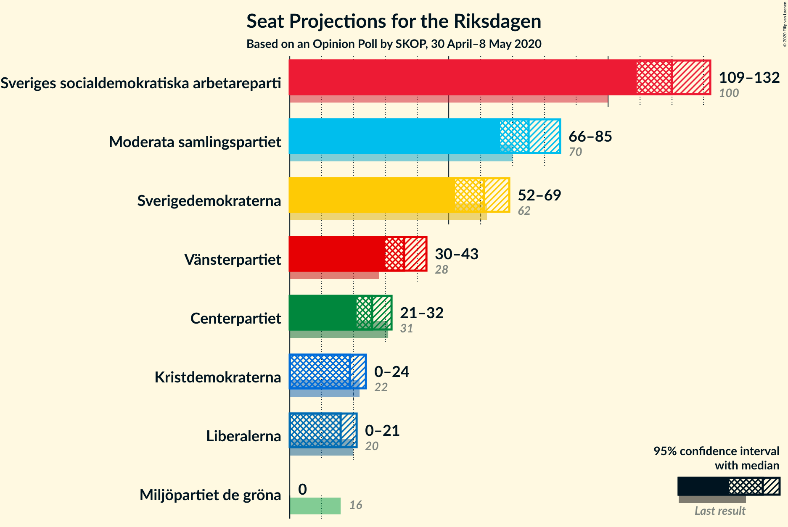
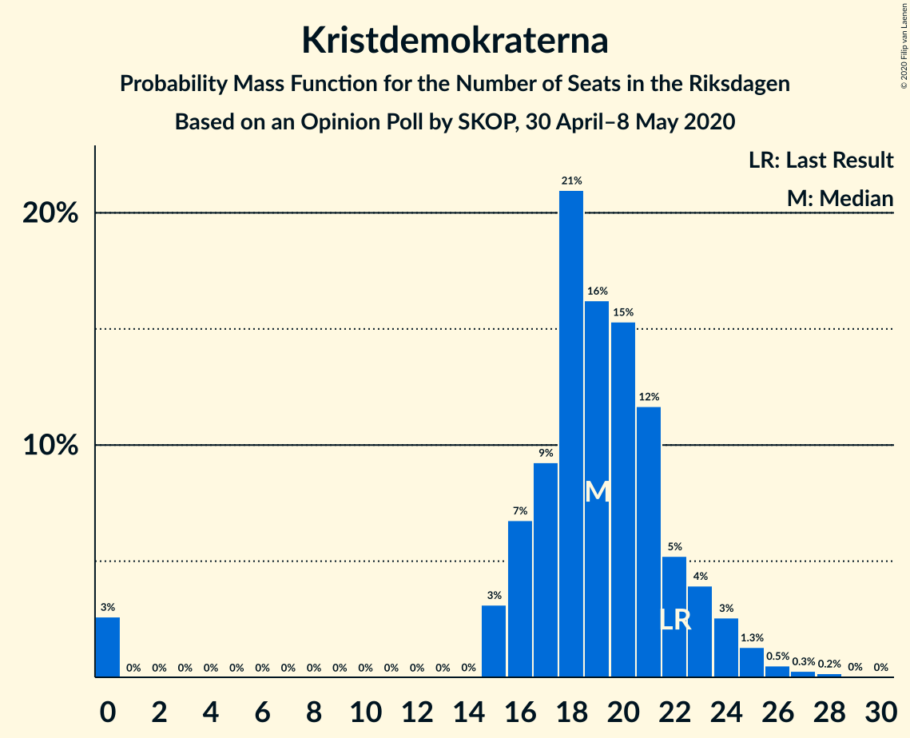
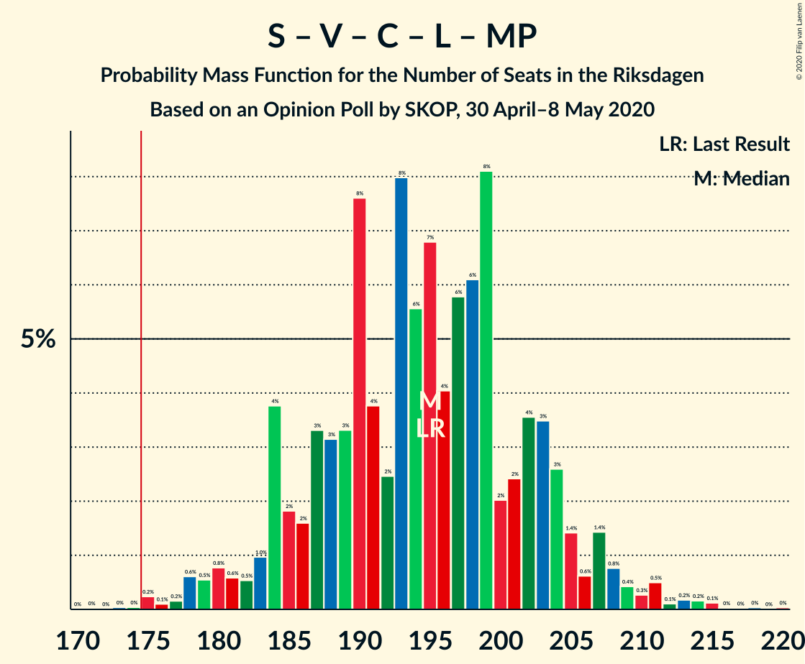
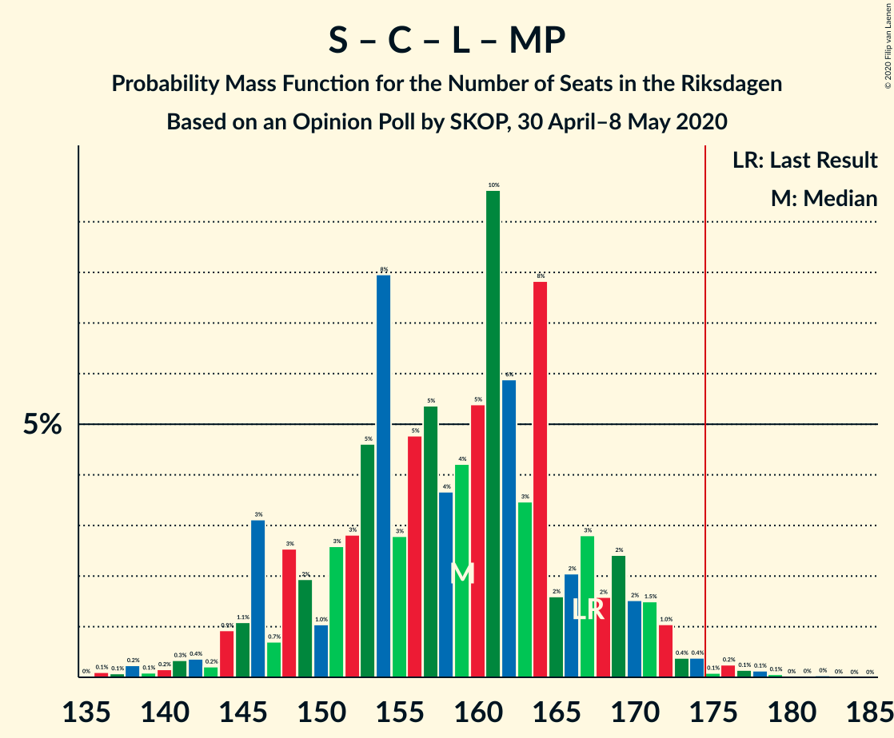
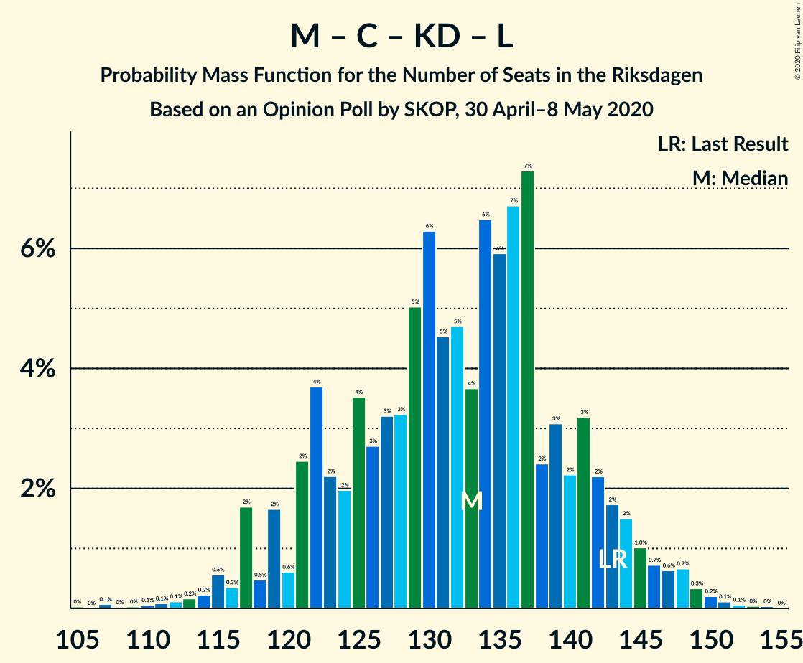
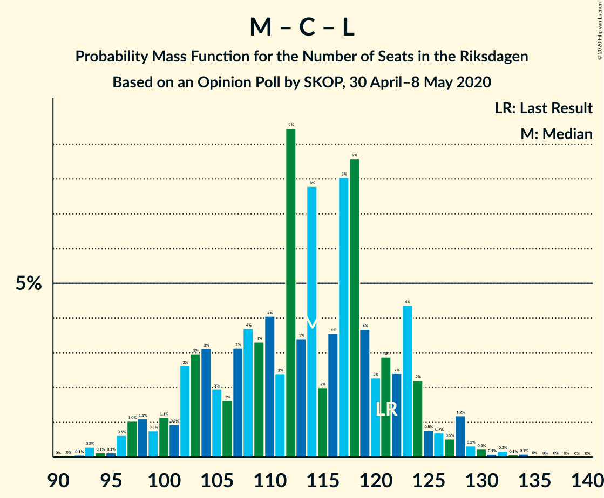

# Opinion Poll by SKOP, 30 April–8 May 2020

<a href="#voting-intentions">Voting Intentions</a> | <a href="#seats">Seats</a> | <a href="#coalitions">Coalitions</a> | <a href="#technical-information">Technical Information</a>

## Voting Intentions

### Confidence Intervals

| Party | Last Result | Poll Result | 80% Confidence Interval | 90% Confidence Interval | 95% Confidence Interval | 99% Confidence Interval |
|:-----:|:-----------:|:-----------:|:-----------------------:|:-----------------------:|:-----------------------:|:-----------------------:|
| Sveriges socialdemokratiska arbetareparti | 28.3% | 32.6% | 30.7–34.5% |30.2–35.1% |29.8–35.5% |28.9–36.5% |
| Moderata samlingspartiet | 19.8% | 20.4% | 18.9–22.1% |18.4–22.6% |18.0–23.0% |17.3–23.8% |
| Sverigedemokraterna | 17.5% | 16.3% | 14.9–17.9% |14.5–18.3% |14.1–18.7% |13.5–19.5% |
| Vänsterpartiet | 8.0% | 9.7% | 8.6–11.0% |8.3–11.4% |8.0–11.7% |7.5–12.3% |
| Centerpartiet | 8.6% | 7.0% | 6.0–8.1% |5.8–8.4% |5.6–8.7% |5.1–9.3% |
| Kristdemokraterna | 6.3% | 5.2% | 4.4–6.2% |4.2–6.5% |4.0–6.8% |3.6–7.3% |
| Liberalerna | 5.5% | 4.4% | 3.7–5.4% |3.5–5.6% |3.3–5.9% |3.0–6.4% |
| Miljöpartiet de gröna | 4.4% | 2.6% | 2.0–3.3% |1.9–3.5% |1.7–3.7% |1.5–4.1% |

*Note:* The poll result column reflects the actual value used in the calculations. Published results may vary slightly, and in addition be rounded to fewer digits.

## Seats

### Confidence Intervals

| Party | Last Result | Median | 80% Confidence Interval | 90% Confidence Interval | 95% Confidence Interval | 99% Confidence Interval |
|:-----:|:-----------:|:------:|:-----------------------:|:-----------------------:|:-----------------------:|:-----------------------:|
| <a href="#sveriges-socialdemokratiska-arbetareparti">Sveriges socialdemokratiska arbetareparti</a> | 100 | 120 | 111–128 |109–131 |109–133 |104–136 |
| <a href="#moderata-samlingspartiet">Moderata samlingspartiet</a> | 70 | 75 | 69–82 |67–83 |65–86 |63–89 |
| <a href="#sverigedemokraterna">Sverigedemokraterna</a> | 62 | 64 | 53–68 |52–70 |51–70 |48–72 |
| <a href="#vänsterpartiet">Vänsterpartiet</a> | 28 | 36 | 31–40 |30–42 |30–43 |27–45 |
| <a href="#centerpartiet">Centerpartiet</a> | 31 | 27 | 23–29 |22–32 |21–32 |19–34 |
| <a href="#kristdemokraterna">Kristdemokraterna</a> | 22 | 19 | 17–22 |16–23 |15–24 |0–26 |
| <a href="#liberalerna">Liberalerna</a> | 20 | 15 | 0–18 |0–20 |0–21 |0–23 |
| <a href="#miljöpartiet-de-gröna">Miljöpartiet de gröna</a> | 16 | 0 | 0 |0 |0 |0–15 |

### Sveriges socialdemokratiska arbetareparti

*For a full overview of the results for this party, see the [Sveriges socialdemokratiska arbetareparti](party-sverigessocialdemokratiskaarbetareparti.html) page.*

| Number of Seats | Probability | Accumulated | Special Marks |
|:---------------:|:-----------:|:-----------:|:-------------:|
| 100 | 0% | 100% | Last Result |
| 101 | 0% | 100% |  |
| 102 | 0.1% | 100% |  |
| 103 | 0.1% | 99.9% |  |
| 104 | 0.4% | 99.8% |  |
| 105 | 0.1% | 99.4% |  |
| 106 | 0.3% | 99.3% |  |
| 107 | 0.3% | 99.0% |  |
| 108 | 0.5% | 98.7% |  |
| 109 | 4% | 98% |  |
| 110 | 2% | 95% |  |
| 111 | 3% | 93% |  |
| 112 | 5% | 90% |  |
| 113 | 1.3% | 85% |  |
| 114 | 1.2% | 83% |  |
| 115 | 2% | 82% |  |
| 116 | 4% | 80% |  |
| 117 | 5% | 77% |  |
| 118 | 11% | 71% |  |
| 119 | 5% | 60% |  |
| 120 | 7% | 55% | Median |
| 121 | 10% | 48% |  |
| 122 | 2% | 38% |  |
| 123 | 0.4% | 35% |  |
| 124 | 7% | 35% |  |
| 125 | 8% | 28% |  |
| 126 | 3% | 21% |  |
| 127 | 5% | 18% |  |
| 128 | 5% | 13% |  |
| 129 | 0.2% | 8% |  |
| 130 | 2% | 8% |  |
| 131 | 0.7% | 5% |  |
| 132 | 2% | 5% |  |
| 133 | 0.6% | 3% |  |
| 134 | 0.4% | 2% |  |
| 135 | 1.4% | 2% |  |
| 136 | 0.2% | 0.6% |  |
| 137 | 0.2% | 0.4% |  |
| 138 | 0% | 0.2% |  |
| 139 | 0.1% | 0.2% |  |
| 140 | 0% | 0.1% |  |
| 141 | 0.1% | 0.1% |  |
| 142 | 0% | 0% |  |

### Moderata samlingspartiet

*For a full overview of the results for this party, see the [Moderata samlingspartiet](party-moderatasamlingspartiet.html) page.*

| Number of Seats | Probability | Accumulated | Special Marks |
|:---------------:|:-----------:|:-----------:|:-------------:|
| 60 | 0% | 100% |  |
| 61 | 0.1% | 99.9% |  |
| 62 | 0.2% | 99.9% |  |
| 63 | 0.2% | 99.6% |  |
| 64 | 0.7% | 99.4% |  |
| 65 | 1.3% | 98.7% |  |
| 66 | 0.4% | 97% |  |
| 67 | 2% | 97% |  |
| 68 | 3% | 95% |  |
| 69 | 5% | 92% |  |
| 70 | 7% | 87% | Last Result |
| 71 | 4% | 80% |  |
| 72 | 2% | 76% |  |
| 73 | 4% | 74% |  |
| 74 | 9% | 69% |  |
| 75 | 12% | 60% | Median |
| 76 | 9% | 48% |  |
| 77 | 11% | 39% |  |
| 78 | 1.2% | 28% |  |
| 79 | 2% | 27% |  |
| 80 | 4% | 25% |  |
| 81 | 8% | 21% |  |
| 82 | 2% | 12% |  |
| 83 | 5% | 10% |  |
| 84 | 1.4% | 5% |  |
| 85 | 0.3% | 4% |  |
| 86 | 2% | 3% |  |
| 87 | 0.2% | 2% |  |
| 88 | 0.9% | 1.5% |  |
| 89 | 0.3% | 0.6% |  |
| 90 | 0.2% | 0.3% |  |
| 91 | 0% | 0.1% |  |
| 92 | 0% | 0.1% |  |
| 93 | 0% | 0.1% |  |
| 94 | 0% | 0% |  |

### Sverigedemokraterna

*For a full overview of the results for this party, see the [Sverigedemokraterna](party-sverigedemokraterna.html) page.*

| Number of Seats | Probability | Accumulated | Special Marks |
|:---------------:|:-----------:|:-----------:|:-------------:|
| 46 | 0% | 100% |  |
| 47 | 0.2% | 99.9% |  |
| 48 | 0.3% | 99.8% |  |
| 49 | 0.4% | 99.5% |  |
| 50 | 1.1% | 99.1% |  |
| 51 | 1.5% | 98% |  |
| 52 | 5% | 96% |  |
| 53 | 1.2% | 91% |  |
| 54 | 4% | 90% |  |
| 55 | 4% | 86% |  |
| 56 | 2% | 81% |  |
| 57 | 2% | 79% |  |
| 58 | 1.4% | 77% |  |
| 59 | 1.0% | 76% |  |
| 60 | 2% | 75% |  |
| 61 | 3% | 73% |  |
| 62 | 3% | 69% | Last Result |
| 63 | 8% | 66% |  |
| 64 | 9% | 58% | Median |
| 65 | 8% | 48% |  |
| 66 | 7% | 40% |  |
| 67 | 16% | 34% |  |
| 68 | 8% | 17% |  |
| 69 | 3% | 9% |  |
| 70 | 3% | 6% |  |
| 71 | 0.2% | 2% |  |
| 72 | 2% | 2% |  |
| 73 | 0.2% | 0.3% |  |
| 74 | 0% | 0.1% |  |
| 75 | 0.1% | 0.1% |  |
| 76 | 0% | 0% |  |

### Vänsterpartiet

*For a full overview of the results for this party, see the [Vänsterpartiet](party-vänsterpartiet.html) page.*

| Number of Seats | Probability | Accumulated | Special Marks |
|:---------------:|:-----------:|:-----------:|:-------------:|
| 25 | 0% | 100% |  |
| 26 | 0.2% | 99.9% |  |
| 27 | 0.3% | 99.8% |  |
| 28 | 0.7% | 99.4% | Last Result |
| 29 | 0.9% | 98.7% |  |
| 30 | 6% | 98% |  |
| 31 | 2% | 91% |  |
| 32 | 10% | 89% |  |
| 33 | 10% | 79% |  |
| 34 | 10% | 69% |  |
| 35 | 6% | 59% |  |
| 36 | 5% | 53% | Median |
| 37 | 10% | 49% |  |
| 38 | 15% | 39% |  |
| 39 | 13% | 24% |  |
| 40 | 2% | 11% |  |
| 41 | 1.2% | 9% |  |
| 42 | 3% | 7% |  |
| 43 | 3% | 4% |  |
| 44 | 0.5% | 2% |  |
| 45 | 0.6% | 1.1% |  |
| 46 | 0.2% | 0.5% |  |
| 47 | 0% | 0.3% |  |
| 48 | 0.1% | 0.2% |  |
| 49 | 0.1% | 0.1% |  |
| 50 | 0% | 0% |  |

### Centerpartiet

*For a full overview of the results for this party, see the [Centerpartiet](party-centerpartiet.html) page.*

| Number of Seats | Probability | Accumulated | Special Marks |
|:---------------:|:-----------:|:-----------:|:-------------:|
| 18 | 0.1% | 100% |  |
| 19 | 0.9% | 99.9% |  |
| 20 | 0.6% | 99.0% |  |
| 21 | 1.3% | 98% |  |
| 22 | 3% | 97% |  |
| 23 | 10% | 95% |  |
| 24 | 8% | 85% |  |
| 25 | 17% | 76% |  |
| 26 | 5% | 60% |  |
| 27 | 18% | 55% | Median |
| 28 | 22% | 37% |  |
| 29 | 5% | 14% |  |
| 30 | 3% | 9% |  |
| 31 | 0.8% | 6% | Last Result |
| 32 | 3% | 5% |  |
| 33 | 1.2% | 2% |  |
| 34 | 0.6% | 0.9% |  |
| 35 | 0.2% | 0.3% |  |
| 36 | 0.1% | 0.1% |  |
| 37 | 0% | 0% |  |

### Kristdemokraterna

*For a full overview of the results for this party, see the [Kristdemokraterna](party-kristdemokraterna.html) page.*

| Number of Seats | Probability | Accumulated | Special Marks |
|:---------------:|:-----------:|:-----------:|:-------------:|
| 0 | 2% | 100% |  |
| 1 | 0% | 98% |  |
| 2 | 0% | 98% |  |
| 3 | 0% | 98% |  |
| 4 | 0% | 98% |  |
| 5 | 0% | 98% |  |
| 6 | 0% | 98% |  |
| 7 | 0% | 98% |  |
| 8 | 0% | 98% |  |
| 9 | 0% | 98% |  |
| 10 | 0% | 98% |  |
| 11 | 0% | 98% |  |
| 12 | 0% | 98% |  |
| 13 | 0% | 98% |  |
| 14 | 0% | 98% |  |
| 15 | 2% | 98% |  |
| 16 | 4% | 96% |  |
| 17 | 10% | 91% |  |
| 18 | 21% | 82% |  |
| 19 | 19% | 61% | Median |
| 20 | 12% | 42% |  |
| 21 | 16% | 30% |  |
| 22 | 6% | 15% | Last Result |
| 23 | 5% | 8% |  |
| 24 | 2% | 3% |  |
| 25 | 0.5% | 1.2% |  |
| 26 | 0.2% | 0.7% |  |
| 27 | 0.2% | 0.5% |  |
| 28 | 0.1% | 0.3% |  |
| 29 | 0.1% | 0.1% |  |
| 30 | 0% | 0% |  |

### Liberalerna

*For a full overview of the results for this party, see the [Liberalerna](party-liberalerna.html) page.*

| Number of Seats | Probability | Accumulated | Special Marks |
|:---------------:|:-----------:|:-----------:|:-------------:|
| 0 | 45% | 100% |  |
| 1 | 0% | 55% |  |
| 2 | 0% | 55% |  |
| 3 | 0% | 55% |  |
| 4 | 0% | 55% |  |
| 5 | 0% | 55% |  |
| 6 | 0% | 55% |  |
| 7 | 0% | 55% |  |
| 8 | 0% | 55% |  |
| 9 | 0% | 55% |  |
| 10 | 0% | 55% |  |
| 11 | 0% | 55% |  |
| 12 | 0% | 55% |  |
| 13 | 0% | 55% |  |
| 14 | 0% | 55% |  |
| 15 | 23% | 54% | Median |
| 16 | 15% | 32% |  |
| 17 | 7% | 17% |  |
| 18 | 1.2% | 10% |  |
| 19 | 2% | 9% |  |
| 20 | 3% | 7% | Last Result |
| 21 | 2% | 4% |  |
| 22 | 1.1% | 2% |  |
| 23 | 0.7% | 0.8% |  |
| 24 | 0.1% | 0.1% |  |
| 25 | 0% | 0% |  |

### Miljöpartiet de gröna

*For a full overview of the results for this party, see the [Miljöpartiet de gröna](party-miljöpartietdegröna.html) page.*

| Number of Seats | Probability | Accumulated | Special Marks |
|:---------------:|:-----------:|:-----------:|:-------------:|
| 0 | 99.3% | 100% | Median |
| 1 | 0% | 0.7% |  |
| 2 | 0% | 0.7% |  |
| 3 | 0% | 0.7% |  |
| 4 | 0% | 0.7% |  |
| 5 | 0% | 0.7% |  |
| 6 | 0% | 0.7% |  |
| 7 | 0% | 0.7% |  |
| 8 | 0% | 0.7% |  |
| 9 | 0% | 0.7% |  |
| 10 | 0% | 0.7% |  |
| 11 | 0% | 0.7% |  |
| 12 | 0% | 0.7% |  |
| 13 | 0% | 0.7% |  |
| 14 | 0.1% | 0.7% |  |
| 15 | 0.5% | 0.6% |  |
| 16 | 0.1% | 0.1% | Last Result |
| 17 | 0.1% | 0.1% |  |
| 18 | 0% | 0% |  |

## Coalitions

### Confidence Intervals

| Coalition | Last Result | Median | Majority? | 80% Confidence Interval | 90% Confidence Interval | 95% Confidence Interval | 99% Confidence Interval |
|:---------:|:-----------:|:------:|:---------:|:-----------------------:|:-----------------------:|:-----------------------:|:-----------------------:|
| Sveriges socialdemokratiska arbetareparti – Moderata samlingspartiet – Centerpartiet | 201 | 223 | 100% | 210–234 | 209–236 | 207–237 | 205–245 |
| Sveriges socialdemokratiska arbetareparti – Moderata samlingspartiet | 170 | 198 | 99.9% | 185–206 | 182–209 | 181–212 | 178–214 |
| Sveriges socialdemokratiska arbetareparti – Vänsterpartiet – Centerpartiet – Liberalerna – Miljöpartiet de gröna | 195 | 192 | 99.5% | 183–201 | 178–205 | 178–208 | 175–211 |
| Sveriges socialdemokratiska arbetareparti – Centerpartiet – Liberalerna – Miljöpartiet de gröna | 167 | 156 | 0.4% | 146–164 | 145–168 | 141–171 | 137–174 |
| Moderata samlingspartiet – Sverigedemokraterna – Kristdemokraterna | 154 | 157 | 0.5% | 148–166 | 144–171 | 141–171 | 138–174 |
| Sveriges socialdemokratiska arbetareparti – Vänsterpartiet – Miljöpartiet de gröna | 144 | 157 | 0.4% | 146–165 | 144–168 | 141–169 | 140–174 |
| Sveriges socialdemokratiska arbetareparti – Vänsterpartiet | 128 | 157 | 0.4% | 146–165 | 144–168 | 141–168 | 140–174 |
| Moderata samlingspartiet – Sverigedemokraterna | 132 | 139 | 0% | 127–150 | 124–150 | 121–151 | 119–155 |
| Moderata samlingspartiet – Centerpartiet – Kristdemokraterna – Liberalerna | 143 | 130 | 0% | 119–140 | 117–142 | 115–144 | 113–149 |
| Sveriges socialdemokratiska arbetareparti – Miljöpartiet de gröna | 116 | 120 | 0% | 112–128 | 109–131 | 109–134 | 104–136 |
| Moderata samlingspartiet – Centerpartiet – Kristdemokraterna | 123 | 121 | 0% | 115–128 | 113–129 | 110–131 | 103–135 |
| Moderata samlingspartiet – Centerpartiet – Liberalerna | 121 | 110 | 0% | 100–121 | 98–123 | 97–125 | 93–129 |
| Moderata samlingspartiet – Centerpartiet | 101 | 102 | 0% | 94–109 | 92–110 | 91–113 | 88–120 |

### Sveriges socialdemokratiska arbetareparti – Moderata samlingspartiet – Centerpartiet

| Number of Seats | Probability | Accumulated | Special Marks |
|:---------------:|:-----------:|:-----------:|:-------------:|
| 199 | 0% | 100% |  |
| 200 | 0% | 99.9% |  |
| 201 | 0.1% | 99.9% | Last Result |
| 202 | 0.1% | 99.8% |  |
| 203 | 0.1% | 99.8% |  |
| 204 | 0.1% | 99.7% |  |
| 205 | 0.7% | 99.6% |  |
| 206 | 0.5% | 98.9% |  |
| 207 | 2% | 98% |  |
| 208 | 0.4% | 96% |  |
| 209 | 4% | 96% |  |
| 210 | 2% | 92% |  |
| 211 | 2% | 90% |  |
| 212 | 2% | 88% |  |
| 213 | 3% | 86% |  |
| 214 | 2% | 83% |  |
| 215 | 1.4% | 81% |  |
| 216 | 2% | 80% |  |
| 217 | 7% | 78% |  |
| 218 | 2% | 71% |  |
| 219 | 1.2% | 69% |  |
| 220 | 9% | 68% |  |
| 221 | 6% | 59% |  |
| 222 | 1.1% | 54% | Median |
| 223 | 5% | 53% |  |
| 224 | 5% | 48% |  |
| 225 | 13% | 43% |  |
| 226 | 0.4% | 30% |  |
| 227 | 5% | 30% |  |
| 228 | 5% | 25% |  |
| 229 | 4% | 20% |  |
| 230 | 0.4% | 16% |  |
| 231 | 0.8% | 15% |  |
| 232 | 3% | 15% |  |
| 233 | 0.7% | 12% |  |
| 234 | 6% | 11% |  |
| 235 | 0.6% | 6% |  |
| 236 | 1.2% | 5% |  |
| 237 | 2% | 4% |  |
| 238 | 0.2% | 2% |  |
| 239 | 0.9% | 2% |  |
| 240 | 0.2% | 1.1% |  |
| 241 | 0.1% | 0.8% |  |
| 242 | 0.1% | 0.7% |  |
| 243 | 0% | 0.6% |  |
| 244 | 0.1% | 0.6% |  |
| 245 | 0% | 0.5% |  |
| 246 | 0.4% | 0.5% |  |
| 247 | 0% | 0.1% |  |
| 248 | 0% | 0.1% |  |
| 249 | 0% | 0.1% |  |
| 250 | 0% | 0.1% |  |
| 251 | 0% | 0% |  |

### Sveriges socialdemokratiska arbetareparti – Moderata samlingspartiet

| Number of Seats | Probability | Accumulated | Special Marks |
|:---------------:|:-----------:|:-----------:|:-------------:|
| 170 | 0% | 100% | Last Result |
| 171 | 0% | 100% |  |
| 172 | 0% | 100% |  |
| 173 | 0% | 100% |  |
| 174 | 0% | 100% |  |
| 175 | 0% | 99.9% | Majority |
| 176 | 0% | 99.9% |  |
| 177 | 0.2% | 99.9% |  |
| 178 | 0.3% | 99.6% |  |
| 179 | 0.1% | 99.3% |  |
| 180 | 0.6% | 99.2% |  |
| 181 | 2% | 98.6% |  |
| 182 | 2% | 97% |  |
| 183 | 1.3% | 95% |  |
| 184 | 2% | 94% |  |
| 185 | 2% | 91% |  |
| 186 | 4% | 89% |  |
| 187 | 4% | 85% |  |
| 188 | 1.2% | 82% |  |
| 189 | 6% | 81% |  |
| 190 | 3% | 75% |  |
| 191 | 2% | 72% |  |
| 192 | 7% | 70% |  |
| 193 | 4% | 63% |  |
| 194 | 2% | 58% |  |
| 195 | 2% | 56% | Median |
| 196 | 2% | 54% |  |
| 197 | 1.3% | 52% |  |
| 198 | 13% | 51% |  |
| 199 | 4% | 38% |  |
| 200 | 5% | 34% |  |
| 201 | 2% | 29% |  |
| 202 | 0.4% | 27% |  |
| 203 | 12% | 26% |  |
| 204 | 1.0% | 15% |  |
| 205 | 0.3% | 14% |  |
| 206 | 7% | 13% |  |
| 207 | 0.2% | 7% |  |
| 208 | 1.3% | 6% |  |
| 209 | 0.6% | 5% |  |
| 210 | 1.4% | 5% |  |
| 211 | 0.3% | 3% |  |
| 212 | 2% | 3% |  |
| 213 | 0.2% | 0.7% |  |
| 214 | 0.1% | 0.5% |  |
| 215 | 0.2% | 0.4% |  |
| 216 | 0.1% | 0.2% |  |
| 217 | 0% | 0.1% |  |
| 218 | 0% | 0.1% |  |
| 219 | 0.1% | 0.1% |  |
| 220 | 0% | 0% |  |

### Sveriges socialdemokratiska arbetareparti – Vänsterpartiet – Centerpartiet – Liberalerna – Miljöpartiet de gröna

| Number of Seats | Probability | Accumulated | Special Marks |
|:---------------:|:-----------:|:-----------:|:-------------:|
| 169 | 0.1% | 100% |  |
| 170 | 0% | 99.9% |  |
| 171 | 0.1% | 99.8% |  |
| 172 | 0% | 99.8% |  |
| 173 | 0.1% | 99.7% |  |
| 174 | 0.1% | 99.6% |  |
| 175 | 0.5% | 99.5% | Majority |
| 176 | 0.1% | 99.0% |  |
| 177 | 0.1% | 98.9% |  |
| 178 | 5% | 98.8% |  |
| 179 | 0.4% | 94% |  |
| 180 | 2% | 94% |  |
| 181 | 0.5% | 91% |  |
| 182 | 0.9% | 91% |  |
| 183 | 0.8% | 90% |  |
| 184 | 7% | 89% |  |
| 185 | 2% | 82% |  |
| 186 | 1.2% | 81% |  |
| 187 | 15% | 80% |  |
| 188 | 0.7% | 65% |  |
| 189 | 7% | 64% |  |
| 190 | 4% | 57% |  |
| 191 | 3% | 54% |  |
| 192 | 6% | 51% |  |
| 193 | 8% | 45% |  |
| 194 | 4% | 37% |  |
| 195 | 1.3% | 33% | Last Result |
| 196 | 5% | 32% |  |
| 197 | 3% | 27% |  |
| 198 | 2% | 24% | Median |
| 199 | 5% | 22% |  |
| 200 | 3% | 17% |  |
| 201 | 5% | 14% |  |
| 202 | 0.9% | 9% |  |
| 203 | 0.6% | 8% |  |
| 204 | 2% | 7% |  |
| 205 | 2% | 5% |  |
| 206 | 0.5% | 3% |  |
| 207 | 0.4% | 3% |  |
| 208 | 1.1% | 3% |  |
| 209 | 0.7% | 1.5% |  |
| 210 | 0.2% | 0.7% |  |
| 211 | 0.1% | 0.6% |  |
| 212 | 0.2% | 0.4% |  |
| 213 | 0.1% | 0.3% |  |
| 214 | 0% | 0.2% |  |
| 215 | 0% | 0.1% |  |
| 216 | 0% | 0.1% |  |
| 217 | 0% | 0.1% |  |
| 218 | 0% | 0% |  |

### Sveriges socialdemokratiska arbetareparti – Centerpartiet – Liberalerna – Miljöpartiet de gröna

| Number of Seats | Probability | Accumulated | Special Marks |
|:---------------:|:-----------:|:-----------:|:-------------:|
| 134 | 0% | 100% |  |
| 135 | 0% | 99.9% |  |
| 136 | 0.1% | 99.9% |  |
| 137 | 0.3% | 99.8% |  |
| 138 | 0.2% | 99.5% |  |
| 139 | 0.1% | 99.3% |  |
| 140 | 0.5% | 99.2% |  |
| 141 | 1.3% | 98.7% |  |
| 142 | 0.1% | 97% |  |
| 143 | 0.2% | 97% |  |
| 144 | 0.8% | 97% |  |
| 145 | 4% | 96% |  |
| 146 | 3% | 92% |  |
| 147 | 0.2% | 89% |  |
| 148 | 11% | 89% |  |
| 149 | 3% | 78% |  |
| 150 | 0.5% | 75% |  |
| 151 | 5% | 75% |  |
| 152 | 3% | 69% |  |
| 153 | 6% | 66% |  |
| 154 | 4% | 60% |  |
| 155 | 4% | 56% |  |
| 156 | 4% | 52% |  |
| 157 | 4% | 48% |  |
| 158 | 5% | 44% |  |
| 159 | 5% | 39% |  |
| 160 | 1.2% | 33% |  |
| 161 | 10% | 32% |  |
| 162 | 2% | 22% | Median |
| 163 | 3% | 20% |  |
| 164 | 7% | 17% |  |
| 165 | 0.5% | 10% |  |
| 166 | 3% | 9% |  |
| 167 | 0.6% | 6% | Last Result |
| 168 | 0.8% | 6% |  |
| 169 | 1.0% | 5% |  |
| 170 | 0.9% | 4% |  |
| 171 | 1.4% | 3% |  |
| 172 | 0.4% | 1.5% |  |
| 173 | 0.4% | 1.1% |  |
| 174 | 0.3% | 0.7% |  |
| 175 | 0% | 0.4% | Majority |
| 176 | 0.1% | 0.3% |  |
| 177 | 0% | 0.2% |  |
| 178 | 0.1% | 0.2% |  |
| 179 | 0% | 0.1% |  |
| 180 | 0% | 0.1% |  |
| 181 | 0.1% | 0.1% |  |
| 182 | 0% | 0% |  |

### Moderata samlingspartiet – Sverigedemokraterna – Kristdemokraterna

| Number of Seats | Probability | Accumulated | Special Marks |
|:---------------:|:-----------:|:-----------:|:-------------:|
| 132 | 0% | 100% |  |
| 133 | 0% | 99.9% |  |
| 134 | 0% | 99.9% |  |
| 135 | 0% | 99.9% |  |
| 136 | 0.1% | 99.8% |  |
| 137 | 0.2% | 99.7% |  |
| 138 | 0.1% | 99.6% |  |
| 139 | 0.2% | 99.4% |  |
| 140 | 0.7% | 99.3% |  |
| 141 | 1.1% | 98.5% |  |
| 142 | 0.4% | 97% |  |
| 143 | 0.5% | 97% |  |
| 144 | 2% | 97% |  |
| 145 | 2% | 95% |  |
| 146 | 0.6% | 93% |  |
| 147 | 0.9% | 92% |  |
| 148 | 5% | 91% |  |
| 149 | 3% | 86% |  |
| 150 | 5% | 83% |  |
| 151 | 2% | 78% |  |
| 152 | 3% | 76% |  |
| 153 | 5% | 73% |  |
| 154 | 1.3% | 68% | Last Result |
| 155 | 4% | 67% |  |
| 156 | 8% | 63% |  |
| 157 | 6% | 55% |  |
| 158 | 3% | 49% | Median |
| 159 | 4% | 46% |  |
| 160 | 7% | 43% |  |
| 161 | 0.7% | 36% |  |
| 162 | 15% | 35% |  |
| 163 | 1.2% | 20% |  |
| 164 | 2% | 19% |  |
| 165 | 7% | 18% |  |
| 166 | 0.8% | 11% |  |
| 167 | 0.9% | 10% |  |
| 168 | 0.5% | 9% |  |
| 169 | 2% | 9% |  |
| 170 | 0.4% | 6% |  |
| 171 | 5% | 6% |  |
| 172 | 0.1% | 1.2% |  |
| 173 | 0.1% | 1.1% |  |
| 174 | 0.5% | 1.0% |  |
| 175 | 0.1% | 0.5% | Majority |
| 176 | 0.1% | 0.4% |  |
| 177 | 0% | 0.3% |  |
| 178 | 0.1% | 0.2% |  |
| 179 | 0% | 0.2% |  |
| 180 | 0.1% | 0.1% |  |
| 181 | 0% | 0% |  |

### Sveriges socialdemokratiska arbetareparti – Vänsterpartiet – Miljöpartiet de gröna

| Number of Seats | Probability | Accumulated | Special Marks |
|:---------------:|:-----------:|:-----------:|:-------------:|
| 136 | 0% | 100% |  |
| 137 | 0.1% | 99.9% |  |
| 138 | 0.1% | 99.8% |  |
| 139 | 0.1% | 99.7% |  |
| 140 | 0.2% | 99.6% |  |
| 141 | 2% | 99.5% |  |
| 142 | 0.8% | 97% |  |
| 143 | 0.2% | 96% |  |
| 144 | 2% | 96% | Last Result |
| 145 | 2% | 94% |  |
| 146 | 4% | 93% |  |
| 147 | 2% | 89% |  |
| 148 | 2% | 87% |  |
| 149 | 3% | 85% |  |
| 150 | 7% | 82% |  |
| 151 | 0.6% | 75% |  |
| 152 | 3% | 75% |  |
| 153 | 7% | 72% |  |
| 154 | 3% | 65% |  |
| 155 | 7% | 62% |  |
| 156 | 4% | 55% | Median |
| 157 | 4% | 51% |  |
| 158 | 3% | 47% |  |
| 159 | 7% | 44% |  |
| 160 | 10% | 37% |  |
| 161 | 7% | 28% |  |
| 162 | 0.4% | 20% |  |
| 163 | 2% | 20% |  |
| 164 | 1.5% | 18% |  |
| 165 | 9% | 16% |  |
| 166 | 0.4% | 7% |  |
| 167 | 0.8% | 6% |  |
| 168 | 3% | 6% |  |
| 169 | 0.4% | 3% |  |
| 170 | 0.5% | 2% |  |
| 171 | 0.6% | 2% |  |
| 172 | 0.2% | 1.0% |  |
| 173 | 0.1% | 0.8% |  |
| 174 | 0.3% | 0.7% |  |
| 175 | 0% | 0.4% | Majority |
| 176 | 0.1% | 0.4% |  |
| 177 | 0.1% | 0.3% |  |
| 178 | 0% | 0.2% |  |
| 179 | 0% | 0.2% |  |
| 180 | 0.1% | 0.1% |  |
| 181 | 0% | 0% |  |

### Sveriges socialdemokratiska arbetareparti – Vänsterpartiet

| Number of Seats | Probability | Accumulated | Special Marks |
|:---------------:|:-----------:|:-----------:|:-------------:|
| 128 | 0% | 100% | Last Result |
| 129 | 0% | 100% |  |
| 130 | 0% | 100% |  |
| 131 | 0% | 100% |  |
| 132 | 0% | 100% |  |
| 133 | 0% | 100% |  |
| 134 | 0% | 100% |  |
| 135 | 0% | 100% |  |
| 136 | 0% | 100% |  |
| 137 | 0.1% | 99.9% |  |
| 138 | 0.1% | 99.8% |  |
| 139 | 0.1% | 99.7% |  |
| 140 | 0.2% | 99.6% |  |
| 141 | 2% | 99.4% |  |
| 142 | 1.0% | 97% |  |
| 143 | 0.3% | 96% |  |
| 144 | 2% | 96% |  |
| 145 | 2% | 94% |  |
| 146 | 4% | 92% |  |
| 147 | 2% | 89% |  |
| 148 | 2% | 87% |  |
| 149 | 3% | 85% |  |
| 150 | 7% | 82% |  |
| 151 | 0.7% | 75% |  |
| 152 | 3% | 74% |  |
| 153 | 7% | 71% |  |
| 154 | 3% | 64% |  |
| 155 | 7% | 61% |  |
| 156 | 4% | 54% | Median |
| 157 | 4% | 51% |  |
| 158 | 3% | 47% |  |
| 159 | 7% | 44% |  |
| 160 | 10% | 37% |  |
| 161 | 7% | 27% |  |
| 162 | 0.4% | 20% |  |
| 163 | 2% | 19% |  |
| 164 | 1.5% | 17% |  |
| 165 | 9% | 16% |  |
| 166 | 0.3% | 7% |  |
| 167 | 0.7% | 6% |  |
| 168 | 3% | 6% |  |
| 169 | 0.3% | 2% |  |
| 170 | 0.5% | 2% |  |
| 171 | 0.6% | 2% |  |
| 172 | 0.2% | 1.0% |  |
| 173 | 0.1% | 0.8% |  |
| 174 | 0.3% | 0.7% |  |
| 175 | 0% | 0.4% | Majority |
| 176 | 0.1% | 0.3% |  |
| 177 | 0.1% | 0.3% |  |
| 178 | 0% | 0.2% |  |
| 179 | 0% | 0.2% |  |
| 180 | 0.1% | 0.1% |  |
| 181 | 0% | 0% |  |

### Moderata samlingspartiet – Sverigedemokraterna

| Number of Seats | Probability | Accumulated | Special Marks |
|:---------------:|:-----------:|:-----------:|:-------------:|
| 115 | 0.1% | 100% |  |
| 116 | 0.1% | 99.9% |  |
| 117 | 0.1% | 99.9% |  |
| 118 | 0.2% | 99.8% |  |
| 119 | 0.2% | 99.6% |  |
| 120 | 0.3% | 99.5% |  |
| 121 | 2% | 99.1% |  |
| 122 | 0.7% | 97% |  |
| 123 | 2% | 97% |  |
| 124 | 1.0% | 95% |  |
| 125 | 0.7% | 94% |  |
| 126 | 2% | 94% |  |
| 127 | 4% | 91% |  |
| 128 | 0.6% | 87% |  |
| 129 | 2% | 86% |  |
| 130 | 5% | 85% |  |
| 131 | 2% | 80% |  |
| 132 | 3% | 78% | Last Result |
| 133 | 2% | 75% |  |
| 134 | 2% | 73% |  |
| 135 | 6% | 71% |  |
| 136 | 4% | 65% |  |
| 137 | 6% | 60% |  |
| 138 | 1.4% | 55% |  |
| 139 | 5% | 53% | Median |
| 140 | 2% | 48% |  |
| 141 | 10% | 46% |  |
| 142 | 0.7% | 36% |  |
| 143 | 3% | 35% |  |
| 144 | 10% | 32% |  |
| 145 | 7% | 22% |  |
| 146 | 3% | 16% |  |
| 147 | 2% | 13% |  |
| 148 | 0.4% | 11% |  |
| 149 | 0.1% | 10% |  |
| 150 | 7% | 10% |  |
| 151 | 0.8% | 3% |  |
| 152 | 0.1% | 2% |  |
| 153 | 1.2% | 2% |  |
| 154 | 0.1% | 0.6% |  |
| 155 | 0.2% | 0.6% |  |
| 156 | 0.1% | 0.4% |  |
| 157 | 0% | 0.2% |  |
| 158 | 0% | 0.2% |  |
| 159 | 0.2% | 0.2% |  |
| 160 | 0% | 0% |  |

### Moderata samlingspartiet – Centerpartiet – Kristdemokraterna – Liberalerna

| Number of Seats | Probability | Accumulated | Special Marks |
|:---------------:|:-----------:|:-----------:|:-------------:|
| 97 | 0% | 100% |  |
| 98 | 0% | 99.9% |  |
| 99 | 0% | 99.9% |  |
| 100 | 0% | 99.9% |  |
| 101 | 0% | 99.9% |  |
| 102 | 0% | 99.9% |  |
| 103 | 0% | 99.9% |  |
| 104 | 0% | 99.9% |  |
| 105 | 0% | 99.9% |  |
| 106 | 0% | 99.8% |  |
| 107 | 0% | 99.8% |  |
| 108 | 0.1% | 99.8% |  |
| 109 | 0% | 99.7% |  |
| 110 | 0% | 99.7% |  |
| 111 | 0% | 99.7% |  |
| 112 | 0% | 99.7% |  |
| 113 | 0.7% | 99.6% |  |
| 114 | 0.1% | 99.0% |  |
| 115 | 2% | 98.9% |  |
| 116 | 0.1% | 96% |  |
| 117 | 2% | 96% |  |
| 118 | 2% | 94% |  |
| 119 | 5% | 92% |  |
| 120 | 1.4% | 88% |  |
| 121 | 1.0% | 86% |  |
| 122 | 10% | 85% |  |
| 123 | 5% | 76% |  |
| 124 | 2% | 71% |  |
| 125 | 0.7% | 69% |  |
| 126 | 5% | 68% |  |
| 127 | 1.0% | 63% |  |
| 128 | 4% | 62% |  |
| 129 | 6% | 58% |  |
| 130 | 4% | 52% |  |
| 131 | 2% | 48% |  |
| 132 | 3% | 46% |  |
| 133 | 3% | 42% |  |
| 134 | 4% | 40% |  |
| 135 | 5% | 36% |  |
| 136 | 11% | 31% | Median |
| 137 | 3% | 20% |  |
| 138 | 1.5% | 17% |  |
| 139 | 1.1% | 16% |  |
| 140 | 5% | 15% |  |
| 141 | 1.4% | 9% |  |
| 142 | 3% | 8% |  |
| 143 | 1.4% | 5% | Last Result |
| 144 | 0.6% | 3% |  |
| 145 | 0.5% | 2% |  |
| 146 | 0.5% | 2% |  |
| 147 | 0.5% | 1.5% |  |
| 148 | 0.2% | 0.9% |  |
| 149 | 0.3% | 0.8% |  |
| 150 | 0.3% | 0.5% |  |
| 151 | 0.1% | 0.2% |  |
| 152 | 0% | 0.1% |  |
| 153 | 0% | 0.1% |  |
| 154 | 0% | 0% |  |

### Sveriges socialdemokratiska arbetareparti – Miljöpartiet de gröna

| Number of Seats | Probability | Accumulated | Special Marks |
|:---------------:|:-----------:|:-----------:|:-------------:|
| 102 | 0.1% | 100% |  |
| 103 | 0.1% | 99.9% |  |
| 104 | 0.4% | 99.8% |  |
| 105 | 0.1% | 99.4% |  |
| 106 | 0.3% | 99.3% |  |
| 107 | 0.2% | 99.1% |  |
| 108 | 0.3% | 98.8% |  |
| 109 | 4% | 98% |  |
| 110 | 2% | 95% |  |
| 111 | 3% | 93% |  |
| 112 | 5% | 90% |  |
| 113 | 1.2% | 85% |  |
| 114 | 1.1% | 84% |  |
| 115 | 2% | 83% |  |
| 116 | 4% | 81% | Last Result |
| 117 | 5% | 77% |  |
| 118 | 11% | 72% |  |
| 119 | 5% | 61% |  |
| 120 | 7% | 56% | Median |
| 121 | 10% | 49% |  |
| 122 | 3% | 38% |  |
| 123 | 0.5% | 36% |  |
| 124 | 7% | 35% |  |
| 125 | 8% | 29% |  |
| 126 | 3% | 21% |  |
| 127 | 5% | 18% |  |
| 128 | 5% | 13% |  |
| 129 | 0.2% | 8% |  |
| 130 | 2% | 8% |  |
| 131 | 0.7% | 6% |  |
| 132 | 2% | 5% |  |
| 133 | 0.6% | 3% |  |
| 134 | 0.4% | 3% |  |
| 135 | 1.4% | 2% |  |
| 136 | 0.2% | 0.7% |  |
| 137 | 0.2% | 0.4% |  |
| 138 | 0% | 0.3% |  |
| 139 | 0.1% | 0.2% |  |
| 140 | 0% | 0.1% |  |
| 141 | 0.1% | 0.1% |  |
| 142 | 0% | 0% |  |

### Moderata samlingspartiet – Centerpartiet – Kristdemokraterna

| Number of Seats | Probability | Accumulated | Special Marks |
|:---------------:|:-----------:|:-----------:|:-------------:|
| 97 | 0.1% | 100% |  |
| 98 | 0% | 99.9% |  |
| 99 | 0% | 99.8% |  |
| 100 | 0% | 99.8% |  |
| 101 | 0% | 99.8% |  |
| 102 | 0.1% | 99.8% |  |
| 103 | 0.2% | 99.7% |  |
| 104 | 0.2% | 99.5% |  |
| 105 | 0.1% | 99.3% |  |
| 106 | 0.2% | 99.2% |  |
| 107 | 0.3% | 99.0% |  |
| 108 | 0.5% | 98.8% |  |
| 109 | 0.4% | 98% |  |
| 110 | 0.6% | 98% |  |
| 111 | 0.7% | 97% |  |
| 112 | 1.0% | 97% |  |
| 113 | 3% | 96% |  |
| 114 | 2% | 93% |  |
| 115 | 7% | 91% |  |
| 116 | 2% | 83% |  |
| 117 | 6% | 82% |  |
| 118 | 3% | 75% |  |
| 119 | 9% | 72% |  |
| 120 | 7% | 63% |  |
| 121 | 11% | 56% | Median |
| 122 | 12% | 45% |  |
| 123 | 4% | 34% | Last Result |
| 124 | 6% | 29% |  |
| 125 | 0.7% | 23% |  |
| 126 | 7% | 22% |  |
| 127 | 4% | 15% |  |
| 128 | 3% | 11% |  |
| 129 | 5% | 9% |  |
| 130 | 1.1% | 4% |  |
| 131 | 0.9% | 3% |  |
| 132 | 0.9% | 2% |  |
| 133 | 0.2% | 1.1% |  |
| 134 | 0.1% | 0.9% |  |
| 135 | 0.3% | 0.8% |  |
| 136 | 0.2% | 0.5% |  |
| 137 | 0.1% | 0.3% |  |
| 138 | 0.1% | 0.2% |  |
| 139 | 0% | 0.1% |  |
| 140 | 0% | 0.1% |  |
| 141 | 0% | 0% |  |

### Moderata samlingspartiet – Centerpartiet – Liberalerna

| Number of Seats | Probability | Accumulated | Special Marks |
|:---------------:|:-----------:|:-----------:|:-------------:|
| 92 | 0.1% | 100% |  |
| 93 | 0.4% | 99.9% |  |
| 94 | 0.2% | 99.5% |  |
| 95 | 0.1% | 99.2% |  |
| 96 | 0.1% | 99.1% |  |
| 97 | 2% | 99.0% |  |
| 98 | 2% | 97% |  |
| 99 | 2% | 95% |  |
| 100 | 4% | 93% |  |
| 101 | 2% | 88% |  |
| 102 | 2% | 86% |  |
| 103 | 0.6% | 84% |  |
| 104 | 10% | 84% |  |
| 105 | 4% | 74% |  |
| 106 | 1.5% | 70% |  |
| 107 | 2% | 68% |  |
| 108 | 6% | 67% |  |
| 109 | 7% | 60% |  |
| 110 | 4% | 53% |  |
| 111 | 2% | 49% |  |
| 112 | 3% | 47% |  |
| 113 | 1.2% | 44% |  |
| 114 | 5% | 43% |  |
| 115 | 6% | 38% |  |
| 116 | 6% | 32% |  |
| 117 | 6% | 26% | Median |
| 118 | 1.4% | 19% |  |
| 119 | 2% | 18% |  |
| 120 | 5% | 16% |  |
| 121 | 1.1% | 11% | Last Result |
| 122 | 0.8% | 10% |  |
| 123 | 4% | 9% |  |
| 124 | 2% | 5% |  |
| 125 | 0.8% | 3% |  |
| 126 | 0.3% | 2% |  |
| 127 | 0.3% | 2% |  |
| 128 | 0.5% | 1.5% |  |
| 129 | 0.6% | 1.0% |  |
| 130 | 0.1% | 0.3% |  |
| 131 | 0% | 0.2% |  |
| 132 | 0.1% | 0.2% |  |
| 133 | 0% | 0.1% |  |
| 134 | 0% | 0.1% |  |
| 135 | 0% | 0.1% |  |
| 136 | 0% | 0% |  |

### Moderata samlingspartiet – Centerpartiet

| Number of Seats | Probability | Accumulated | Special Marks |
|:---------------:|:-----------:|:-----------:|:-------------:|
| 84 | 0% | 100% |  |
| 85 | 0.1% | 99.9% |  |
| 86 | 0% | 99.9% |  |
| 87 | 0.1% | 99.8% |  |
| 88 | 0.3% | 99.7% |  |
| 89 | 0.7% | 99.4% |  |
| 90 | 0.6% | 98.7% |  |
| 91 | 2% | 98% |  |
| 92 | 2% | 96% |  |
| 93 | 3% | 95% |  |
| 94 | 3% | 92% |  |
| 95 | 2% | 89% |  |
| 96 | 2% | 87% |  |
| 97 | 5% | 85% |  |
| 98 | 3% | 80% |  |
| 99 | 9% | 77% |  |
| 100 | 10% | 68% |  |
| 101 | 6% | 58% | Last Result |
| 102 | 9% | 52% | Median |
| 103 | 2% | 44% |  |
| 104 | 14% | 42% |  |
| 105 | 4% | 28% |  |
| 106 | 2% | 24% |  |
| 107 | 2% | 22% |  |
| 108 | 8% | 20% |  |
| 109 | 6% | 12% |  |
| 110 | 2% | 6% |  |
| 111 | 0.6% | 4% |  |
| 112 | 0.4% | 3% |  |
| 113 | 0.8% | 3% |  |
| 114 | 0.5% | 2% |  |
| 115 | 0.3% | 2% |  |
| 116 | 0.7% | 1.5% |  |
| 117 | 0.1% | 0.7% |  |
| 118 | 0% | 0.6% |  |
| 119 | 0% | 0.6% |  |
| 120 | 0.5% | 0.6% |  |
| 121 | 0% | 0.1% |  |
| 122 | 0% | 0.1% |  |
| 123 | 0% | 0.1% |  |
| 124 | 0% | 0.1% |  |
| 125 | 0% | 0.1% |  |
| 126 | 0% | 0% |  |

## Technical Information

### Opinion Poll

+ **Polling firm:** SKOP
+ **Commissioner(s):** —
+ **Fieldwork period:** 30 April–8 May 2020

### Calculations

+ **Sample size:** 1019
+ **Simulations done:** 131,072
+ **Error estimate:** 1.69%

